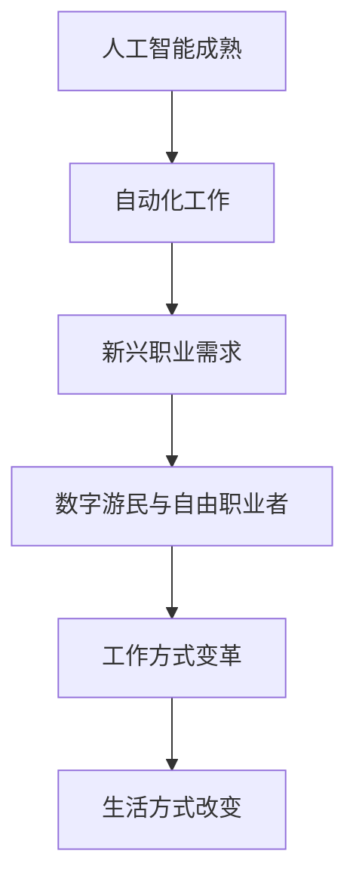
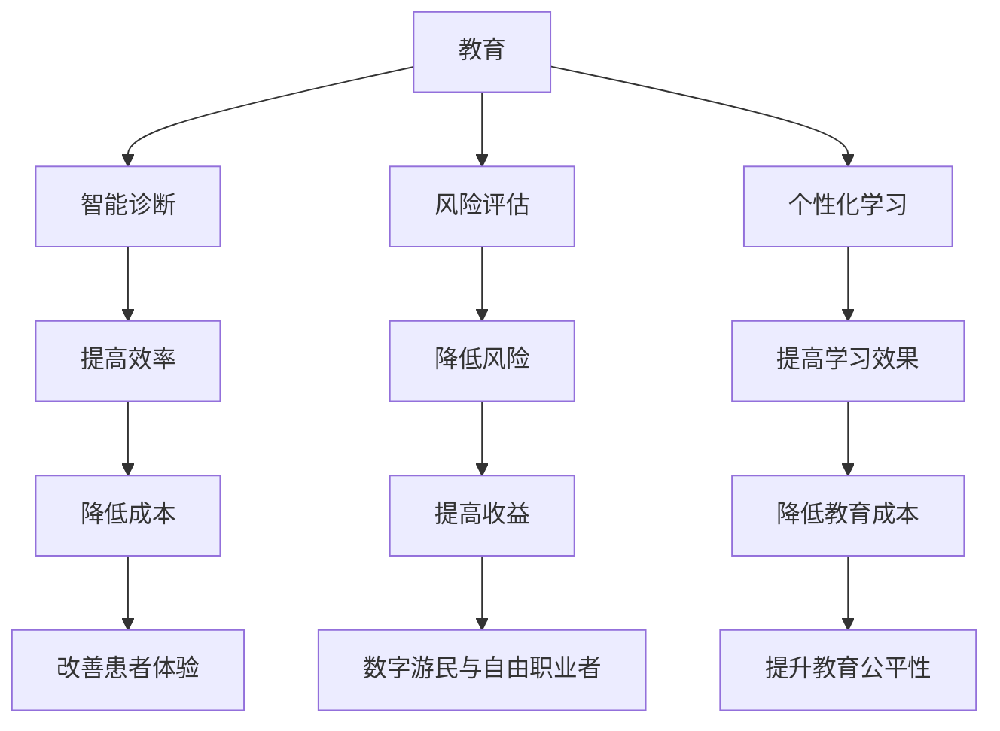

                 

# 未来的就业趋势：2050年的数字游民与自由职业者

> **关键词**：数字游民、自由职业者、科技趋势、职业发展、生活方式、政策环境
>
> **摘要**：本文探讨了2050年数字游民与自由职业者的就业趋势，分析了人工智能、大数据、云计算等技术的推动作用，以及数字游民与自由职业者面临的挑战与机遇。通过深入研究，本文为读者提供了未来职业发展的方向和策略。

## 第1章：引言

### 1.1 本书的目的与重要性

随着科技的迅猛发展，未来的就业市场将发生深刻变革。数字游民与自由职业者作为新经济形态的代表，正逐渐改变着人们的职业观念和生活方式。本书旨在揭示2050年数字游民与自由职业者的就业趋势，帮助读者了解这一新兴职业群体的现状、挑战与机遇，为未来的职业规划提供指导。

### 1.2 数字游民与自由职业者的定义

数字游民（Digital Nomad）是指那些利用数字技术进行远程工作的人，他们可以在全球任何地方进行工作，不受地理限制。自由职业者（Freelancer）则是那些为自己工作的人，他们通过提供专业服务或完成项目来获取报酬，具有高度自主性和灵活性。

### 1.3 本书的结构与内容概述

本书共分为八个章节，首先介绍了数字游民与自由职业者的定义和重要性，接着分析了2050年科技发展趋势，探讨了数字游民的生活方式与挑战，以及自由职业者的崛起。随后，本书重点讨论了数字游民与自由职业者的技能需求、政策和环境因素影响、未来就业趋势展望，并提供了实践指南。最后，本书通过附录部分为读者提供了丰富的资源列表。

## 第2章：2050年科技发展趋势

### 2.1 人工智能与机器学习

人工智能（AI）与机器学习（ML）将在2050年达到前所未有的成熟度，对就业市场产生深远影响。AI技术的进步将使许多传统工作自动化，同时为新兴职业提供更多机会。例如，智能客服、智能驾驶、智能家居等领域将广泛应用AI技术，推动数字游民与自由职业者的需求增长。

### 2.1.1 人工智能技术的成熟与影响

随着深度学习、自然语言处理、计算机视觉等技术的突破，人工智能将在2050年实现更高的智能水平。智能机器将具备更强大的学习能力、推理能力和决策能力，从而在各个领域发挥重要作用。

### 2.1.2 机器学习的应用场景与未来展望

机器学习在医疗、金融、教育、制造业等领域具有广泛的应用前景。例如，医疗领域中的智能诊断、金融领域中的风险评估、教育领域中的个性化学习等，都将受益于机器学习技术的进步。

## 第3章：数字游民的生活方式

### 3.1 数字游民的生活现状

当前，数字游民已经成为一种流行的生活方式。他们利用互联网和远程工作工具，在全球各地旅行，同时完成工作任务。数字游民的生活特点包括灵活性、自主性和高效率，他们可以在任何有网络连接的地方工作。

### 3.1.1 数字游民群体的特点

数字游民群体具有以下特点：

1. 年龄结构：以年轻人为主，尤其是30岁以下的群体。
2. 教育背景：具有较高学历，通常拥有本科及以上学历。
3. 行业分布：主要集中在科技、创意、设计、市场营销等领域。
4. 工作方式：以远程工作为主，部分从事自由职业，部分在远程团队中工作。

### 3.1.2 数字游民的成功案例

数字游民的成功案例包括：

- Alex Becker：通过在线教育平台开设课程，实现财务自由，并在全球旅行。
- Nomadic Matt：一位旅行博客博主，通过旅行写作赚取收入，并成为数字游民的典型代表。

### 3.2 数字游民的挑战与机遇

数字游民在享受灵活、自由的生活方式的同时，也面临着一系列挑战：

1. 工作与生活的平衡：如何高效地完成工作任务，同时保持身心健康。
2. 社交与归属感：如何在虚拟世界中建立人际关系，获得归属感。
3. 职业发展：如何在远程工作中提升专业技能，实现职业发展。

然而，这些挑战也伴随着机遇：

1. 全球视野：通过旅行和远程工作，拓展视野，结识来自不同背景的人。
2. 自主管理：培养自我管理能力，提高工作效率。
3. 跨界合作：与其他领域的人才合作，实现跨界创新。

### 3.3 数字游民的未来趋势

随着科技的进步，数字游民的生活方式将越来越普及。以下是数字游民未来趋势的几个方面：

1. 工具与平台：更多的远程工作工具和平台将支持数字游民的生活和工作。
2. 职业多样化：数字游民的就业领域将更加广泛，涵盖更多行业。
3. 社区与社群：数字游民社区将更加成熟，提供更多的资源和支持。
4. 生活品质：数字游民的生活品质将得到提升，实现工作与生活的平衡。

## 第4章：自由职业者的崛起

### 4.1 自由职业者的定义与分类

自由职业者是指那些不依赖于某个雇主，独立完成工作任务的人。根据工作性质，自由职业者可以分为以下几类：

1. 创意类自由职业者：如设计师、摄影师、作家等。
2. 技术类自由职业者：如程序员、数据分析师、IT顾问等。
3. 咨询类自由职业者：如管理咨询师、市场顾问、人力资源顾问等。
4. 服务类自由职业者：如家教、翻译、导游等。

### 4.2 自由职业者的优势与挑战

自由职业者具有以下优势：

1. 自主性强：可以自主选择项目、时间和工作地点。
2. 收入潜力大：通过提高工作效率和质量，实现收入增长。
3. 职业发展空间大：可以根据市场需求和个人兴趣，自由切换职业领域。

然而，自由职业者也面临以下挑战：

1. 工作不稳定：项目结束后可能面临失业风险。
2. 财务风险：需要自行承担保险、税务等财务风险。
3. 时间管理：需要高效管理时间，确保工作与生活平衡。

### 4.3 自由职业者的职业发展路径

自由职业者的职业发展路径可以分为以下几个阶段：

1. 初期：积累经验，拓展人脉，建立个人品牌。
2. 成长期：提升专业技能，扩大服务范围，增加客户来源。
3. 成熟期：建立稳定的客户群体，实现规模化发展。
4. 创业期：创立个人工作室或公司，实现业务拓展。

### 4.3.1 职业规划与自我提升

自由职业者需要制定明确的职业规划，包括：

1. 目标设定：确定短期和长期目标，如项目数量、收入水平等。
2. 技能提升：通过学习、培训、实践等方式，不断提升专业技能。
3. 客户拓展：通过线上和线下渠道，扩大客户群体。

### 4.3.2 跨界合作的机遇

跨界合作是自由职业者实现职业发展的重要途径。通过与其他领域的专业人士合作，可以实现资源互补、优势互补，共同创造价值。例如，设计师可以与程序员合作开发应用，咨询师可以与培训师合作提供咨询服务等。

## 第5章：数字游民与自由职业者的技能需求

### 5.1 通用技能

数字游民与自由职业者需要具备以下通用技能：

1. 语言能力：流利的英语口语和书写能力，有助于全球范围内的沟通和合作。
2. 时间管理能力：高效管理时间，确保工作与生活的平衡。
3. 自我驱动能力：保持自我激励，持续提升个人能力。
4. 抗压能力：应对工作压力和不确定性，保持心理稳定。

### 5.2 专业技能

数字游民与自由职业者需要具备以下专业技能：

1. 信息技术相关技能：如编程、数据分析、网络安全等。
2. 创意与设计相关技能：如平面设计、UI/UX设计、摄影等。
3. 管理与咨询技能：如项目管理、市场营销、人力资源管理等。

### 5.2.1 信息技术相关技能

信息技术相关技能是数字游民与自由职业者的重要竞争力。以下是一些关键技能：

1. 编程语言：熟悉至少一门编程语言，如Python、Java、JavaScript等。
2. 数据分析：掌握数据分析工具，如Excel、SQL、Python等。
3. 云计算：了解云计算服务，如AWS、Azure、Google Cloud等。
4. 网络安全：了解网络安全知识，如加密、防火墙、VPN等。

### 5.2.2 创意与设计相关技能

创意与设计相关技能在数字游民与自由职业者中具有广泛应用。以下是一些关键技能：

1. 平面设计：熟练使用设计软件，如Adobe Photoshop、Illustrator等。
2. UI/UX设计：了解用户界面和用户体验设计原则，提升产品竞争力。
3. 摄影与摄像：掌握摄影技巧，拍摄高质量照片和视频。
4. 视频编辑：熟练使用视频编辑软件，如Adobe Premiere、Final Cut Pro等。

## 第6章：政策和环境因素对数字游民与自由职业者的影响

### 6.1 国际贸易政策

国际贸易政策对数字游民与自由职业者的影响主要表现在以下几个方面：

1. 自由贸易协定：自由贸易协定的签订有助于降低跨国工作的障碍，促进数字游民与自由职业者的全球流动。
2. 贸易保护主义：贸易保护主义政策可能导致跨国工作的障碍增加，影响数字游民与自由职业者的就业机会。
3. 税务政策：不同国家的税务政策对数字游民与自由职业者的税务负担产生影响，需要合理规划税务策略。

### 6.2 数字经济政策

数字经济政策对数字游民与自由职业者的影响主要表现在以下几个方面：

1. 支持政策：政府出台的支持数字经济的政策，如数字经济产业扶持、创新创业支持等，有助于数字游民与自由职业者的发展。
2. 数据隐私与网络安全政策：加强数据隐私与网络安全政策，保障数字游民与自由职业者的数据安全。
3. 知识产权保护：加强对知识产权的保护，提升数字游民与自由职业者的创新动力。

### 6.2.1 支持数字游民与自由职业者的政策

支持数字游民与自由职业者的政策包括：

1. 税收优惠：提供税收减免政策，鼓励数字游民与自由职业者创业和发展。
2. 福利保障：建立数字游民与自由职业者的社会保障体系，保障其基本生活需求。
3. 创新扶持：提供创新创业资金支持，鼓励数字游民与自由职业者开展创新项目。

### 6.2.2 数据隐私与网络安全政策

数据隐私与网络安全政策对数字游民与自由职业者的影响主要表现在以下几个方面：

1. 数据安全：保障数字游民与自由职业者的数据安全，防止数据泄露和滥用。
2. 个人隐私：尊重数字游民与自由职业者的个人隐私，防止个人信息被侵犯。
3. 网络安全：加强网络安全防护，防止网络攻击和数据泄露。

## 第7章：未来就业趋势展望

### 7.1 数字游民与自由职业者的就业市场

随着科技的进步和全球化的推进，数字游民与自由职业者的就业市场将呈现以下趋势：

1. 就业机会增长：数字技术将创造更多远程工作机会，数字游民与自由职业者的就业机会将显著增加。
2. 行业多样化：数字游民与自由职业者的就业领域将涵盖更多行业，如科技、金融、医疗、教育等。
3. 竞争加剧：随着数字游民与自由职业者数量的增加，就业市场竞争将加剧，要求从业者具备更高的专业技能和综合素质。

### 7.2 数字游民与自由职业者的生活品质

数字游民与自由职业者的生活品质将得到提升，体现在以下几个方面：

1. 工作与生活平衡：通过远程工作和数字技术，实现工作与生活的平衡，提高生活质量。
2. 全球视野：通过全球旅行和远程工作，拓展视野，结识不同文化背景的人，提升自身素质。
3. 职业发展：通过不断学习和提升专业技能，实现职业发展和收入增长。

### 7.3 数字游民与自由职业者的社会影响

数字游民与自由职业者的崛起将对社会产生深远影响，体现在以下几个方面：

1. 社会结构变革：传统就业模式将被打破，新兴职业群体成为社会主流，社会结构将发生变革。
2. 跨界融合：数字游民与自由职业者将推动不同领域之间的融合，促进跨界创新。
3. 社会责任：数字游民与自由职业者需要承担更多的社会责任，积极参与公益事业，推动社会进步。

## 第8章：实践指南

### 8.1 数字游民与自由职业者的创业策略

数字游民与自由职业者可以考虑以下创业策略：

1. 市场调研：了解市场需求，确定创业方向。
2. 资源整合：整合人脉、资金、技术等资源，为创业提供支持。
3. 产品定位：明确产品定位，打造核心竞争力。
4. 营销推广：通过线上和线下渠道，扩大品牌知名度。

### 8.1.1 创业的准备与规划

在创业之前，数字游民与自由职业者需要做好以下准备工作：

1. 职业技能提升：不断提升专业技能，提高竞争力。
2. 资金筹备：根据创业项目需求，筹备创业资金。
3. 团队建设：组建专业团队，共同推进创业项目。
4. 法律法规：了解相关法律法规，确保创业合法合规。

### 8.1.2 创业风险与管理

数字游民与自由职业者在创业过程中需要面对以下风险：

1. 资金风险：创业资金不足可能导致项目失败。
2. 市场风险：市场需求变化可能导致项目亏损。
3. 竞争风险：市场竞争加剧可能导致市场份额下降。

为了降低风险，数字游民与自由职业者可以采取以下管理措施：

1. 资金管理：合理规划资金使用，确保资金充足。
2. 市场调研：持续关注市场需求，调整产品策略。
3. 竞争分析：了解竞争对手，制定差异化策略。
4. 团队管理：优化团队结构，提升团队执行力。

### 8.2 数字游民与自由职业者的职业规划

数字游民与自由职业者需要制定明确的职业规划，包括以下几个方面：

1. 目标设定：明确短期和长期目标，如项目数量、收入水平等。
2. 技能提升：根据市场需求和个人兴趣，提升专业技能。
3. 职业发展：通过积累经验和拓展人脉，实现职业发展。
4. 跨界合作：与其他领域的人才合作，实现跨界创新。

### 8.2.1 职业规划的步骤与方法

数字游民与自由职业者可以按照以下步骤进行职业规划：

1. 自我评估：分析自身优势、兴趣和价值观，确定职业方向。
2. 市场调研：了解市场需求和行业趋势，选择具有潜力的领域。
3. 设定目标：明确短期和长期目标，制定具体的行动计划。
4. 实施与调整：按照计划实施，并根据实际情况进行调整。

### 8.2.2 职业发展的路径选择

数字游民与自由职业者可以根据自身情况选择以下职业发展路径：

1. 自主创业：创建个人工作室或公司，实现业务拓展。
2. 线上平台：通过线上平台，如Upwork、Freelancer等，承接项目，实现收入增长。
3. 远程团队：加入远程团队，参与团队项目，提升专业技能。
4. 跨界合作：与其他领域的人才合作，实现跨界创新。

### 8.3 数字游民与自由职业者的生活规划

数字游民与自由职业者需要制定合理的生活规划，实现工作与生活的平衡。以下是一些生活规划的要点：

1. 工作时间管理：合理安排工作时间，确保高效完成任务。
2. 远程工作环境：打造舒适、高效的工作环境，提高工作效率。
3. 社交与休闲：保持社交活动，丰富业余生活，缓解工作压力。
4. 财务规划：合理规划收入和支出，确保财务稳定。

### 8.3.1 生活规划的要点

1. 工作计划：制定详细的工作计划，确保任务按时完成。
2. 时间管理：学会优先处理重要任务，提高工作效率。
3. 自律：培养自律意识，养成良好的工作习惯。
4. 休息与锻炼：合理安排休息和锻炼时间，保持身心健康。

### 8.3.2 如何实现工作与生活的平衡

1. 设定明确的工作目标：明确工作目标，提高工作效率，减少无效工作时间。
2. 培养自律意识：培养自律意识，遵守工作计划，提高自律性。
3. 创造舒适的工作环境：打造舒适的工作环境，提高工作效率。
4. 社交活动与休闲：保持社交活动，丰富业余生活，缓解工作压力。

## 附录

### 附录 A：数字游民与自由职业者的资源列表

#### A.1 数字游民社区

1. **Remote.co**：提供全球远程工作机会。
2. **NomadList**：评估全球各地的数字游民友好城市。
3. **We Work Remotely**：发布远程工作职位。

#### A.2 自由职业者工具与平台

1. **Upwork**：全球最大的自由职业者平台。
2. **Freelancer**：提供多样化的自由职业项目。
3. **Fiverr**：适合初学者的自由职业者平台。

#### A.3 国际数字游民政策概览

1. **InterNations**：提供各国数字游民政策信息。
2. **Digital Nomadvisa**：提供全球签证政策查询。
3. **Expat Focus**：介绍各国生活和工作环境。

### 附录 B：参考文献

1. **Anderson, C. (2016). *Masters of Scale: Big Ideas from the Best Run Companies in the World*. Harvard Business Review Press.**
2. **Harris, L. (2017). *The New Education: How to Revolutionize Learning from Preschool to Grad School*. Houghton Mifflin Harcourt.**
3. **Moravec, H. (2019). *The Future of Humanity: Terraforming Mars, Interstellar Travel, Immortality, and Our Destiny Beyond Earth*. Knopf.**

### 作者

**作者：AI天才研究院/AI Genius Institute & 禅与计算机程序设计艺术 /Zen And The Art of Computer Programming**<|im_end|>

