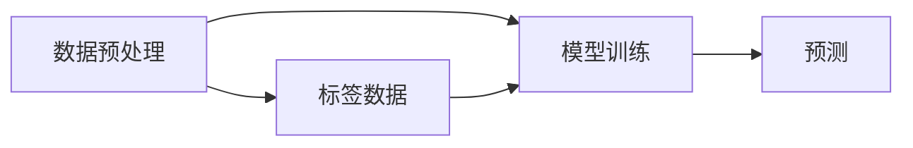
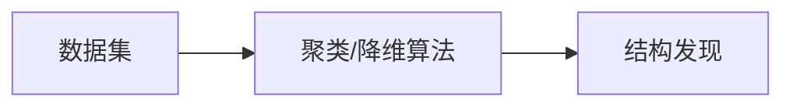
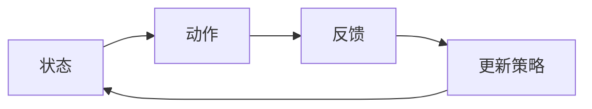

                 

## 引言

机器学习（Machine Learning），作为人工智能（Artificial Intelligence, AI）的核心技术之一，近年来在各个领域中取得了显著的成果。从图像识别、自然语言处理，到推荐系统、自动驾驶，机器学习已经深刻地改变了我们的生活方式和工作方式。那么，什么是机器学习？它又是如何工作的？本章将为您详细介绍机器学习的定义、分类及其基本概念，帮助您建立对机器学习的初步认识。

### 什么是机器学习？

机器学习是一种让计算机通过数据学习并改进自身性能的技术。它不同于传统的编程方式，不需要程序员手动编写具体的指令，而是通过算法从数据中提取模式，自动进行决策和预测。这个过程通常被称为“训练”，经过训练的模型可以应用于新的数据集，实现自动化的决策和预测。

机器学习的核心思想是利用已有数据（训练数据），通过算法（学习算法），从中提取规律（模型），然后利用这个模型对未知数据（测试数据）进行预测或分类。简单来说，机器学习就是让计算机学会如何“思考”和“学习”。

### 机器学习的分类

根据学习方式的不同，机器学习可以分为以下三大类：

#### 监督学习（Supervised Learning）

监督学习是最常见的机器学习方法之一。它利用标记好的数据集进行训练，模型的输入和输出都有明确的标签。通过学习输入和输出之间的映射关系，模型可以对新数据进行预测。

**核心概念与联系**：

- **输入**：特征向量（例如，图像的像素值、文本的词频等）。
- **输出**：预测标签（例如，数字分类、文本分类等）。

**Mermaid 流程图**：



#### 无监督学习（Unsupervised Learning）

无监督学习不使用标记数据，而是通过算法自动发现数据中的内在结构或模式。常见的无监督学习算法包括聚类、降维等。

**核心概念与联系**：

- **输入**：未标记的数据集。
- **输出**：潜在的分布或聚类结果。

**Mermaid 流程图**：



#### 强化学习（Reinforcement Learning）

强化学习通过模拟与环境的交互，不断调整策略，以实现最大化累积奖励的目标。它广泛应用于游戏、机器人控制等领域。

**核心概念与联系**：

- **输入**：当前状态和动作。
- **输出**：下一个状态和奖励信号。

**Mermaid 流程图**：



### 机器学习的应用领域

机器学习在各个领域都取得了显著的成果，以下是一些典型的应用领域：

- **图像识别**：通过卷积神经网络（CNN）实现人脸识别、物体检测等。
- **自然语言处理**：利用深度学习模型进行文本分类、机器翻译等。
- **推荐系统**：基于协同过滤或深度学习方法实现个性化推荐。
- **自动驾驶**：利用传感器数据、深度学习算法实现车辆的自主驾驶。
- **金融风控**：通过机器学习模型进行信用评分、欺诈检测等。

在接下来的章节中，我们将进一步探讨机器学习的基础数学知识、特征工程、线性模型、分类算法、聚类算法、神经网络与深度学习等内容。通过这些内容，您将能够深入了解机器学习的原理和实战应用，掌握从数据中提取知识和模式的方法，为自己的研究或开发工作打下坚实的基础。

---
关键词：机器学习、监督学习、无监督学习、强化学习、应用领域

摘要：本文介绍了机器学习的定义、分类及其基本概念，并探讨了机器学习在不同领域的应用。通过本文的阅读，您将对机器学习有更深入的理解，为后续章节的学习打下基础。接下来的章节将详细介绍机器学习的数学基础、特征工程、核心算法以及实战项目，帮助您全面掌握机器学习技术。


### 第一部分: 机器学习基础原理

在了解了机器学习的定义和分类后，我们将进入机器学习的核心原理部分。本部分将涵盖机器学习的数学基础、特征工程与数据预处理、线性模型与回归分析、分类算法、聚类与降维以及神经网络与深度学习等内容。通过这一系列基础原理的讲解，您将能够更好地理解机器学习的工作机制，为后续的实战应用打下坚实的基础。

### 第1章: 机器学习的简介与基本概念

本章将为您介绍机器学习的定义、分类以及它在不同领域的应用。通过这一章节，您将初步了解机器学习的核心概念，为后续的学习奠定基础。

#### 1.1 机器学习的定义与分类

机器学习（Machine Learning）是一门研究如何让计算机从数据中自动学习规律，并基于这些规律进行预测或决策的学科。根据学习方式的不同，机器学习主要分为以下几类：

1. **监督学习（Supervised Learning）**：监督学习使用标记数据集进行训练，模型的输入和输出都有明确的标签。通过学习输入和输出之间的映射关系，模型可以对新数据进行预测。常见的监督学习算法包括线性回归、决策树、支持向量机等。

2. **无监督学习（Unsupervised Learning）**：无监督学习不使用标记数据，而是通过算法自动发现数据中的内在结构或模式。常见的无监督学习算法包括聚类、降维等。

3. **强化学习（Reinforcement Learning）**：强化学习通过模拟与环境的交互，不断调整策略，以实现最大化累积奖励的目标。常见的强化学习算法包括Q-learning、深度确定性策略梯度（DDPG）等。

#### 1.2 监督学习、无监督学习和强化学习

**监督学习**：监督学习的核心思想是通过学习输入和输出之间的映射关系来预测新的数据。以下是一个简单的监督学习示例：

```latex
输入: \(\textbf{x} = [x_1, x_2, ..., x_n]\)
输出: \(y = f(\textbf{x})\)

\text{其中，} f(\textbf{x}) \text{是一个已知的函数。}
```

- **线性回归**：线性回归是一种简单的监督学习算法，用于预测连续值输出。其数学模型为：

  $$y = \beta_0 + \beta_1 x_1 + \beta_2 x_2 + ... + \beta_n x_n$$

- **决策树**：决策树是一种基于树结构的监督学习算法，用于分类或回归问题。其基本结构如下：

  ```mermaid
  graph LR
  A[根节点] --> B[判断条件1]
  B --> C{是}
  C --> D[结果1]
  B --> E{否}
  E --> F[结果2]
  ```

**无监督学习**：无监督学习主要关注如何从未标记的数据中发现内在结构。以下是一个简单的无监督学习示例：

```latex
输入: \(\textbf{X} = \{\textbf{x}_1, \textbf{x}_2, ..., \textbf{x}_n\}\)

\text{输出：} \text{聚类中心或降维结果}
```

- **聚类算法**：聚类算法旨在将相似的数据点归为同一类。常见的聚类算法包括K-means、层次聚类等。

  ```mermaid
  graph LR
  A[数据点] --> B[K-means]
  B --> C[聚类中心]
  C --> D[重新划分]
  ```

- **降维技术**：降维技术旨在减少数据维度，同时保留重要信息。常见的降维算法包括PCA（主成分分析）、t-SNE等。

  ```mermaid
  graph LR
  A[高维数据] --> B[PCA]
  B --> C[低维数据]
  ```

**强化学习**：强化学习通过与环境交互，不断调整策略，以实现最大化累积奖励的目标。以下是一个简单的强化学习示例：

```latex
输入: \(\textbf{s} = \{\textbf{s}_1, \textbf{s}_2, ..., \textbf{s}_n\}\)
动作: \(a\)

\text{输出：} \text{状态转移概率} P(s'|s, a) \text{和奖励} R(s, a)
```

- **Q-learning**：Q-learning是一种基于值函数的强化学习算法。其基本思想是学习状态-动作值函数 \(Q(s, a)\)，以最大化累积奖励。

  ```mermaid
  graph LR
  A[状态] --> B[动作]
  B --> C[奖励]
  C --> D[更新Q值]
  D --> A
  ```

#### 1.3 机器学习的应用领域

机器学习在各个领域都有广泛的应用，以下是一些典型的应用领域：

- **图像识别**：通过卷积神经网络（CNN）实现人脸识别、物体检测等。
- **自然语言处理**：利用深度学习模型进行文本分类、机器翻译等。
- **推荐系统**：基于协同过滤或深度学习方法实现个性化推荐。
- **自动驾驶**：利用传感器数据、深度学习算法实现车辆的自主驾驶。
- **金融风控**：通过机器学习模型进行信用评分、欺诈检测等。

通过本章的学习，您对机器学习的基本概念和分类有了初步了解。在接下来的章节中，我们将进一步探讨机器学习的数学基础、特征工程、线性模型、分类算法、聚类算法、神经网络与深度学习等内容。希望这些知识能够为您在机器学习领域的研究和应用提供帮助。

---
关键词：机器学习、监督学习、无监督学习、强化学习、应用领域

摘要：本章介绍了机器学习的定义、分类以及其在不同领域的应用。通过本章的学习，读者可以初步了解机器学习的核心概念，为后续的学习奠定基础。在接下来的章节中，我们将深入探讨机器学习的数学基础、特征工程、线性模型、分类算法、聚类算法、神经网络与深度学习等内容。

### 第2章: 机器学习数学基础

机器学习算法的构建和优化依赖于深厚的数学基础。本章将介绍机器学习中的线性代数、概率论和统计学基础，帮助您更好地理解机器学习算法的原理和实现方法。

#### 2.1 线性代数基础

线性代数是机器学习的重要数学工具，涉及向量、矩阵、行列式、矩阵运算等基本概念。以下是线性代数中的一些核心概念：

- **向量**：向量是具有大小和方向的几何对象，通常表示为一行或一列数字。向量在机器学习中的应用包括特征表示、数据降维等。

  $$\textbf{v} = [v_1, v_2, ..., v_n]$$

- **矩阵**：矩阵是二维的数字数组，用于表示线性方程组、数据集等。矩阵运算包括加法、减法、乘法、转置等。

  $$\textbf{A} = \begin{bmatrix}
  a_{11} & a_{12} & \cdots & a_{1n} \\
  a_{21} & a_{22} & \cdots & a_{2n} \\
  \vdots & \vdots & \ddots & \vdots \\
  a_{m1} & a_{m2} & \cdots & a_{mn}
  \end{bmatrix}$$

- **行列式**：行列式是一个标量值，用于描述矩阵的特性。行列式在机器学习中的应用包括特征值和特征向量的计算、线性方程组的求解等。

  $$\text{det}(\textbf{A}) = a_{11}a_{22} - a_{12}a_{21}$$

- **矩阵运算**：

  - **加法和减法**：

    $$\textbf{A} + \textbf{B} = \begin{bmatrix}
    a_{11} + b_{11} & a_{12} + b_{12} & \cdots & a_{1n} + b_{1n} \\
    a_{21} + b_{21} & a_{22} + b_{22} & \cdots & a_{2n} + b_{2n} \\
    \vdots & \vdots & \ddots & \vdots \\
    a_{m1} + b_{m1} & a_{m2} + b_{m2} & \cdots & a_{mn} + b_{mn}
    \end{bmatrix}$$

  - **乘法**：

    $$\textbf{A} \cdot \textbf{B} = \begin{bmatrix}
    a_{11}b_{11} + a_{12}b_{21} & a_{11}b_{12} + a_{12}b_{22} & \cdots & a_{11}b_{1n} + a_{12}b_{2n} \\
    a_{21}b_{11} + a_{22}b_{21} & a_{21}b_{12} + a_{22}b_{22} & \cdots & a_{21}b_{1n} + a_{22}b_{2n} \\
    \vdots & \vdots & \ddots & \vdots \\
    a_{m1}b_{11} + a_{m2}b_{21} & a_{m1}b_{12} + a_{m2}b_{22} & \cdots & a_{m1}b_{1n} + a_{m2}b_{2n}
    \end{bmatrix}$$

  - **转置**：

    $$\textbf{A}^T = \begin{bmatrix}
    a_{11} & a_{21} & \cdots & a_{m1} \\
    a_{12} & a_{22} & \cdots & a_{m2} \\
    \vdots & \vdots & \ddots & \vdots \\
    a_{1n} & a_{2n} & \cdots & a_{mn}
    \end{bmatrix}$$

#### 2.2 概率论基础

概率论是描述不确定性和随机现象的数学工具。在机器学习中，概率论用于描述数据分布、模型评估等。以下是概率论中的一些核心概念：

- **概率分布**：概率分布描述了随机变量取值的概率分布情况。常见的概率分布包括正态分布、伯努利分布等。

  - **正态分布**：

    $$P(X = x) = \frac{1}{\sqrt{2\pi\sigma^2}} e^{-\frac{(x-\mu)^2}{2\sigma^2}}$$

  - **伯努利分布**：

    $$P(X = 1) = p, P(X = 0) = 1 - p$$

- **条件概率**：条件概率描述了在给定某个条件下，某个事件发生的概率。条件概率公式如下：

  $$P(A|B) = \frac{P(A \cap B)}{P(B)}$$

- **贝叶斯定理**：贝叶斯定理是一种基于条件概率的推理方法，用于计算后验概率。贝叶斯定理公式如下：

  $$P(A|B) = \frac{P(B|A)P(A)}{P(B)}$$

#### 2.3 统计学基础

统计学是分析数据、提取信息的方法。在机器学习中，统计学用于数据预处理、模型评估等。以下是统计学中的一些核心概念：

- **随机变量**：随机变量是一个可以取多个值的变量，其取值依赖于随机实验的结果。

- **期望和方差**：期望和方差是描述随机变量分布的两个重要统计量。

  - **期望**：

    $$E(X) = \sum_{x \in \Omega} xP(X = x)$$

  - **方差**：

    $$Var(X) = E[(X - E(X))^2]$$

- **假设检验**：假设检验是一种用于验证模型或数据是否满足某个假设的方法。常见的假设检验方法包括t检验、卡方检验等。

  - **t检验**：

    $$H_0: \mu = \mu_0 \quad H_1: \mu \neq \mu_0$$

  - **卡方检验**：

    $$H_0: \pi_1 = \pi_2 = ... = \pi_k \quad H_1: \text{至少有一个} \pi_i \neq \pi_j$$

#### 2.4 线性代数、概率论和统计学的联系

线性代数、概率论和统计学是机器学习中的三大数学工具，它们相互关联、相互补充。以下是它们的联系：

- **线性代数**：线性代数用于描述数据结构和运算，如矩阵、向量等。在机器学习中，线性代数用于特征提取、数据降维等。
- **概率论**：概率论用于描述数据分布和不确定性，如概率分布、条件概率等。在机器学习中，概率论用于模型评估、参数估计等。
- **统计学**：统计学用于分析数据、提取信息，如期望、方差、假设检验等。在机器学习中，统计学用于数据预处理、模型评估等。

通过本章的学习，您对机器学习中的数学基础有了初步了解。在接下来的章节中，我们将进一步探讨特征工程、线性模型、分类算法、聚类算法等内容，帮助您全面掌握机器学习技术。

---
关键词：线性代数、概率论、统计学、机器学习、数学基础

摘要：本章介绍了机器学习中的线性代数、概率论和统计学基础，包括向量、矩阵、行列式、矩阵运算、概率分布、条件概率、贝叶斯定理、期望、方差、假设检验等核心概念。通过本章的学习，读者可以更好地理解机器学习算法的原理和实现方法，为后续学习打下坚实基础。

### 第3章: 特征工程与数据预处理

特征工程（Feature Engineering）是机器学习项目中至关重要的一环。它的目标是提取和构造有助于模型训练的特征，从而提升模型的性能和泛化能力。而数据预处理（Data Preprocessing）则是在模型训练之前对数据进行的一系列操作，以确保数据的质量和一致性。本章将详细介绍特征工程与数据预处理的技术、方法和实践案例。

#### 3.1 数据预处理技术

数据预处理是机器学习项目的第一步，它直接关系到后续模型训练的效果。以下是一些常见的数据预处理技术：

1. **数据清洗**：数据清洗是指删除或纠正数据集中的错误、异常和重复的数据。常见的数据清洗方法包括删除缺失值、纠正错误值、填补缺失值等。

2. **数据归一化**：数据归一化是指将不同特征的数据范围调整到同一尺度，以消除特征之间量纲的影响。常见的数据归一化方法包括最小-最大缩放、Z分数缩放等。

   - **最小-最大缩放**：

     $$x_{\text{normalized}} = \frac{x - x_{\text{min}}}{x_{\text{max}} - x_{\text{min}}}$$

   - **Z分数缩放**：

     $$x_{\text{normalized}} = \frac{x - \mu}{\sigma}$$

3. **数据标准化**：数据标准化是指将特征值转换为具有相同均值为0、标准差为1的标准正态分布。数据标准化有助于模型收敛，特别是在使用距离度量时。

   $$x_{\text{standardized}} = \frac{x - \mu}{\sigma}$$

4. **特征缩放**：特征缩放是指对特征进行加权或组合，以生成新的特征。特征缩放有助于提高模型的表达能力。

5. **缺失值处理**：缺失值处理是指对数据集中的缺失值进行填补或删除。常见的方法包括平均值填补、中位数填补、插值等。

6. **异常值检测**：异常值检测是指识别和去除数据集中的异常值。常见的方法包括基于统计的方法（如Z分数、IQR法）、基于机器学习的方法等。

#### 3.2 特征提取与特征选择

特征提取（Feature Extraction）是指从原始数据中提取有助于模型训练的特征。特征提取的目标是降低数据维度、减少计算复杂度和提高模型性能。以下是一些常见的特征提取方法：

1. **主成分分析（PCA）**：PCA是一种降维技术，通过保留主要成分（即数据的主要变异方向）来降低数据维度。PCA有助于去除冗余特征和噪声，提高模型性能。

   $$\textbf{X}_{\text{new}} = \textbf{P}\textbf{X}_{\text{original}}$$

   其中，\(\textbf{P}\)是特征值对应的特征向量组成的矩阵。

2. **线性判别分析（LDA）**：LDA是一种特征提取技术，旨在降低数据维度，同时保持类别间的区分度。LDA适用于多类分类问题，特别是在特征数目较多时。

   $$\textbf{X}_{\text{new}} = \textbf{W}\textbf{X}_{\text{original}}$$

   其中，\(\textbf{W}\)是判别函数的系数。

3. **自动编码器（Autoencoder）**：自动编码器是一种基于神经网络的降维方法，由编码器和解码器组成。编码器将输入数据压缩为低维表示，解码器尝试将低维表示恢复为原始数据。

   $$\textbf{X}_{\text{encoded}} = \textbf{A}\textbf{X}_{\text{original}}$$
   $$\textbf{X}_{\text{decoded}} = \textbf{D}\textbf{X}_{\text{encoded}}$$

   其中，\(\textbf{A}\)和\(\textbf{D}\)分别是编码器和解码器的权重矩阵。

特征选择（Feature Selection）是指从原始特征中选择最有用的特征，以提高模型性能和降低计算成本。以下是一些常见的特征选择方法：

1. **过滤法（Filter Method）**：过滤法基于特征本身的统计属性进行选择，如相关性、信息增益等。过滤法简单且易于实现，但可能无法充分利用模型的信息。

2. **包裹法（Wrapper Method）**：包裹法通过遍历所有可能的特征子集，评估子集对模型性能的影响。常见的包裹法包括前进选择、后向消除等。包裹法较为耗时，但能够找到最佳特征子集。

3. **嵌入法（Embedded Method）**：嵌入法将特征选择过程整合到模型训练过程中，如Lasso回归、随机森林等。嵌入法既避免了过度拟合，又能有效降低计算复杂度。

#### 3.3 特征工程实践案例

以下是一个特征工程与数据预处理的实践案例：使用Python的Scikit-learn库对鸢尾花数据集（Iris Dataset）进行特征工程与数据预处理。

1. **数据导入与探索**：

   ```python
   from sklearn.datasets import load_iris
   iris = load_iris()
   X, y = iris.data, iris.target
   ```

2. **数据清洗**：

   ```python
   from sklearn.impute import SimpleImputer
   imputer = SimpleImputer(strategy='mean')
   X = imputer.fit_transform(X)
   ```

3. **数据归一化**：

   ```python
   from sklearn.preprocessing import MinMaxScaler
   scaler = MinMaxScaler()
   X = scaler.fit_transform(X)
   ```

4. **特征提取**：

   ```python
   from sklearn.decomposition import PCA
   pca = PCA(n_components=2)
   X = pca.fit_transform(X)
   ```

5. **特征选择**：

   ```python
   from sklearn.feature_selection import SelectKBest, f_classif
   selector = SelectKBest(f_classif, k=2)
   X = selector.fit_transform(X, y)
   ```

6. **数据可视化**：

   ```python
   import matplotlib.pyplot as plt
   plt.scatter(X[:, 0], X[:, 1], c=y, cmap='viridis')
   plt.xlabel('Feature 1')
   plt.ylabel('Feature 2')
   plt.title('2D PCA Features')
   plt.show()
   ```

通过以上步骤，我们完成了鸢尾花数据集的特征工程与数据预处理。在实际项目中，您可以根据具体需求和数据特点，选择合适的预处理技术和特征提取方法。

---
关键词：特征工程、数据预处理、特征提取、特征选择、数据清洗、归一化、标准化、主成分分析、线性判别分析、自动编码器

摘要：本章介绍了特征工程与数据预处理的技术和方法，包括数据清洗、归一化、标准化、缺失值处理、异常值检测、特征提取和特征选择。通过一个实践案例，展示了如何使用Python的Scikit-learn库对鸢尾花数据集进行特征工程与数据预处理。掌握本章内容有助于提升机器学习项目的性能和效率。

### 第4章: 线性模型与回归分析

线性模型是机器学习中最基本且最常用的模型之一。它广泛应用于回归分析和分类问题。本章将详细介绍线性模型的基本原理、分类及其在实际应用中的重要性。

#### 4.1 线性回归模型

线性回归模型是一种用于预测连续值的监督学习算法。其核心思想是通过拟合一条直线或超平面，将输入特征映射到输出值。

**数学模型**：

线性回归模型的数学表达式为：

$$y = \beta_0 + \beta_1 x_1 + \beta_2 x_2 + ... + \beta_n x_n$$

其中，\(y\)为输出值，\(\beta_0\)为截距，\(\beta_1, \beta_2, ..., \beta_n\)为系数，\(x_1, x_2, ..., x_n\)为输入特征。

**求解方法**：

线性回归模型的求解方法主要包括最小二乘法（Ordinary Least Squares, OLS）和梯度下降法（Gradient Descent）。

- **最小二乘法**：

  最小二乘法的核心思想是找到一组参数，使得实际输出值与预测输出值之间的误差平方和最小。其求解公式为：

  $$\beta = (\textbf{X}^T\textbf{X})^{-1}\textbf{X}^T\textbf{y}$$

  其中，\(\textbf{X}\)为输入特征矩阵，\(\textbf{y}\)为输出值向量。

- **梯度下降法**：

  梯度下降法是一种迭代优化算法，通过不断更新参数，使损失函数值逐渐减小。其更新公式为：

  $$\beta = \beta - \alpha \nabla_{\beta} J(\beta)$$

  其中，\(\alpha\)为学习率，\(\nabla_{\beta} J(\beta)\)为损失函数关于参数\(\beta\)的梯度。

**代码实现**：

以下是一个使用Python的Scikit-learn库实现线性回归模型的简单示例：

```python
from sklearn.linear_model import LinearRegression
from sklearn.model_selection import train_test_split
from sklearn.metrics import mean_squared_error

# 数据加载
X, y = load_iris().data, load_iris().target

# 数据集划分
X_train, X_test, y_train, y_test = train_test_split(X, y, test_size=0.2, random_state=42)

# 模型训练
model = LinearRegression()
model.fit(X_train, y_train)

# 模型预测
y_pred = model.predict(X_test)

# 模型评估
mse = mean_squared_error(y_test, y_pred)
print("Mean Squared Error:", mse)
```

**应用实例**：

线性回归模型在多个领域有着广泛的应用，如房价预测、股票价格预测等。以下是一个房价预测的简单实例：

```python
import pandas as pd

# 加载数据
data = pd.read_csv("house_prices.csv")
X = data.iloc[:, :-1].values
y = data.iloc[:, -1].values

# 数据预处理
X = (X - X.mean()) / X.std()

# 数据集划分
X_train, X_test, y_train, y_test = train_test_split(X, y, test_size=0.2, random_state=42)

# 模型训练
model = LinearRegression()
model.fit(X_train, y_train)

# 模型预测
y_pred = model.predict(X_test)

# 模型评估
mse = mean_squared_error(y_test, y_pred)
print("Mean Squared Error:", mse)
```

#### 4.2 逻辑回归模型

逻辑回归模型是一种用于预测概率的线性模型，常用于二分类问题。其核心思想是通过拟合一个线性模型，将输入特征映射到概率值。

**数学模型**：

逻辑回归的数学表达式为：

$$\text{logit}(P) = \beta_0 + \beta_1 x_1 + \beta_2 x_2 + ... + \beta_n x_n$$

其中，\(\text{logit}(P)\)为概率的对数转换，\(P\)为事件发生的概率。

逻辑回归模型的损失函数为二元交叉熵（Binary Cross-Entropy），其表达式为：

$$J(\beta) = -\frac{1}{m} \sum_{i=1}^{m} [y_i \log(\hat{y}_i) + (1 - y_i) \log(1 - \hat{y}_i)]$$

其中，\(m\)为样本数量，\(\hat{y}_i\)为预测概率。

**求解方法**：

逻辑回归模型的求解方法主要包括梯度下降法和牛顿法。

- **梯度下降法**：

  梯度下降法是一种迭代优化算法，通过不断更新参数，使损失函数值逐渐减小。其更新公式为：

  $$\beta = \beta - \alpha \nabla_{\beta} J(\beta)$$

  其中，\(\alpha\)为学习率，\(\nabla_{\beta} J(\beta)\)为损失函数关于参数\(\beta\)的梯度。

- **牛顿法**：

  牛顿法是一种基于二次逼近的优化算法，通过求解一阶和二阶导数的最小值点来更新参数。其更新公式为：

  $$\beta = \beta - H^{-1}\nabla_{\beta} J(\beta)$$

  其中，\(H\)为海森矩阵，即损失函数的二阶导数矩阵。

**代码实现**：

以下是一个使用Python的Scikit-learn库实现逻辑回归模型的简单示例：

```python
from sklearn.linear_model import LogisticRegression
from sklearn.model_selection import train_test_split
from sklearn.metrics import accuracy_score

# 数据加载
X, y = load_iris().data, load_iris().target

# 数据集划分
X_train, X_test, y_train, y_test = train_test_split(X, y, test_size=0.2, random_state=42)

# 模型训练
model = LogisticRegression()
model.fit(X_train, y_train)

# 模型预测
y_pred = model.predict(X_test)

# 模型评估
accuracy = accuracy_score(y_test, y_pred)
print("Accuracy:", accuracy)
```

**应用实例**：

逻辑回归模型在多个领域有着广泛的应用，如疾病预测、广告点击率预测等。以下是一个疾病预测的简单实例：

```python
import pandas as pd

# 加载数据
data = pd.read_csv("disease_prediction.csv")
X = data.iloc[:, :-1].values
y = data.iloc[:, -1].values

# 数据预处理
X = (X - X.mean()) / X.std()

# 数据集划分
X_train, X_test, y_train, y_test = train_test_split(X, y, test_size=0.2, random_state=42)

# 模型训练
model = LogisticRegression()
model.fit(X_train, y_train)

# 模型预测
y_pred = model.predict(X_test)

# 模型评估
accuracy = accuracy_score(y_test, y_pred)
print("Accuracy:", accuracy)
```

通过本章的学习，您对线性模型及其在实际应用中的重要性有了更深入的了解。线性回归和逻辑回归是机器学习中的基石，掌握它们将为您的后续学习打下坚实的基础。

---
关键词：线性模型、线性回归、逻辑回归、回归分析、机器学习、数学模型、代码实例、应用实例

摘要：本章介绍了线性模型的基本原理、分类及其在实际应用中的重要性。详细讲解了线性回归和逻辑回归的数学模型、求解方法以及代码实现。通过实际应用实例，展示了线性模型在房价预测和疾病预测等领域的应用价值。掌握本章内容将有助于提升您的机器学习技能。

### 第5章: 分类算法

分类算法是机器学习中的重要分支，主要用于将数据划分为不同的类别。本章将介绍几种常见的分类算法，包括K-近邻算法、决策树、随机森林、支持向量机和贝叶斯分类器，并探讨它们的应用和实践。

#### 5.1 K-近邻算法

K-近邻算法（K-Nearest Neighbors，K-NN）是一种简单而有效的分类算法。它的核心思想是：如果一个新样本在特征空间中的k个最近邻的多数属于某一类别，则该样本也属于这个类别。

**数学模型**：

给定一个测试样本 \(\textbf{x}_t\) 和训练样本集 \(\{\textbf{x}_i\}\)，计算测试样本与训练样本之间的距离，如欧氏距离：

$$d(\textbf{x}_t, \textbf{x}_i) = \sqrt{\sum_{j=1}^{n} (x_{tj} - x_{ij})^2}$$

然后找出距离最近的k个训练样本，并根据这些样本的类别进行投票，最后选择出现次数最多的类别作为预测结果。

**伪代码**：

```
Input: 训练样本集 X, 标签 Y, 测试样本 xt, k

1. 计算测试样本与所有训练样本的距离
   distances = [d(xt, xi) for xi in X]

2. 对距离进行排序并选出最近的 k 个样本
   k_nearest = [xi for _, xi in sorted(zip(distances, X), reverse=True)[:k]]

3. 根据最近的 k 个样本的标签进行投票
   votes = [yi for yi in Y[k_nearest]]

4. 选择出现次数最多的类别作为预测结果
   prediction = max(set(votes), key=votes.count)
```

**应用实例**：

以下是一个使用Python的Scikit-learn库实现K-近邻算法的简单示例：

```python
from sklearn.model_selection import train_test_split
from sklearn.neighbors import KNeighborsClassifier
from sklearn.metrics import accuracy_score

# 数据加载
X, y = load_iris().data, load_iris().target

# 数据集划分
X_train, X_test, y_train, y_test = train_test_split(X, y, test_size=0.2, random_state=42)

# 模型训练
model = KNeighborsClassifier(n_neighbors=3)
model.fit(X_train, y_train)

# 模型预测
y_pred = model.predict(X_test)

# 模型评估
accuracy = accuracy_score(y_test, y_pred)
print("Accuracy:", accuracy)
```

**实践**：

K-近邻算法在图像识别、文本分类等领域有着广泛的应用。例如，在图像识别中，可以使用K-近邻算法对图像进行分类，通过计算测试图像与训练图像之间的相似度来实现。

#### 5.2 决策树

决策树（Decision Tree）是一种树形结构，其中内部节点表示特征，分支表示特征取值，叶节点表示类别。决策树的构建过程是基于特征的重要性和数据划分的增益来确定。

**数学模型**：

决策树的构建过程通常采用信息增益（Information Gain）或基尼不纯度（Gini Impurity）来评估特征划分的优劣。

- **信息增益**：

  $$IG(D, a) = H(D) - \sum_{v \in \text{values}(a)} \frac{|D_a|}{|D|} H(D_a)$$

  其中，\(D\)为数据集，\(a\)为特征，\(\text{values}(a)\)为特征\(a\)的所有取值，\(D_a\)为根据特征\(a\)划分后的数据集。

- **基尼不纯度**：

  $$Gini(D, a, v) = \sum_{v \in \text{values}(a)} \frac{|D_a|}{|D|} [1 - \sum_{y \in \text{labels}(D_a)} \left(\frac{|D_{ay}|}{|D_a|}\right)^2]$$

  其中，\(\text{labels}(D_a)\)为数据集\(D_a\)的标签集合。

**伪代码**：

```
Input: 数据集 D, 特征列表 attributes

1. 选择最佳划分特征
   best_attribute = select_best_attribute(D, attributes)

2. 根据最佳特征划分数据集
   for v in \text{values}(best_attribute):
       D_v = [d for d in D if d[best_attribute] == v]
       node = Node(v, best_attribute)
       nodes.append(node)
       recursive_build_tree(D_v, attributes - {best_attribute})

3. 创建叶节点
   if attributes is empty:
       node.label = majority_vote(D)
       nodes.append(node)
```

**应用实例**：

以下是一个使用Python的Scikit-learn库实现决策树的简单示例：

```python
from sklearn.tree import DecisionTreeClassifier
from sklearn.model_selection import train_test_split
from sklearn.metrics import accuracy_score

# 数据加载
X, y = load_iris().data, load_iris().target

# 数据集划分
X_train, X_test, y_train, y_test = train_test_split(X, y, test_size=0.2, random_state=42)

# 模型训练
model = DecisionTreeClassifier()
model.fit(X_train, y_train)

# 模型预测
y_pred = model.predict(X_test)

# 模型评估
accuracy = accuracy_score(y_test, y_pred)
print("Accuracy:", accuracy)
```

**实践**：

决策树在分类和回归问题中都有广泛的应用。例如，在金融风控领域，可以使用决策树对客户进行风险评估；在医疗诊断领域，可以使用决策树对疾病进行诊断。

#### 5.3 随机森林

随机森林（Random Forest）是一种基于决策树的集成学习方法。它通过构建多棵决策树，并采用投票或平均的方式得到最终预测结果。

**数学模型**：

随机森林的主要参数包括树的数量（\(n_estimators\)）、特征选择方法（如随机特征选择）等。

**伪代码**：

```
Input: 数据集 D, 标签列表 Y, 树的数量 n_estimators

1. 对于每个树：
   a. 随机选择特征子集
   b. 使用特征子集构建决策树
   c. 使用决策树对训练集进行拟合

2. 对所有树进行投票或平均
   prediction = majority_vote([tree.predict(X_test) for tree in trees])
```

**应用实例**：

以下是一个使用Python的Scikit-learn库实现随机森林的简单示例：

```python
from sklearn.ensemble import RandomForestClassifier
from sklearn.model_selection import train_test_split
from sklearn.metrics import accuracy_score

# 数据加载
X, y = load_iris().data, load_iris().target

# 数据集划分
X_train, X_test, y_train, y_test = train_test_split(X, y, test_size=0.2, random_state=42)

# 模型训练
model = RandomForestClassifier(n_estimators=100)
model.fit(X_train, y_train)

# 模型预测
y_pred = model.predict(X_test)

# 模型评估
accuracy = accuracy_score(y_test, y_pred)
print("Accuracy:", accuracy)
```

**实践**：

随机森林在分类和回归问题中都有广泛的应用。例如，在金融风险控制领域，可以使用随机森林对贷款客户进行信用评分；在医疗诊断领域，可以使用随机森林对疾病进行预测。

#### 5.4 支持向量机

支持向量机（Support Vector Machine，SVM）是一种基于间隔最大化原理的分类算法。它通过寻找最佳超平面，将不同类别的数据点分隔开来。

**数学模型**：

SVM的主要目标是寻找一个超平面，使得正负样本之间的间隔最大化。其目标函数为：

$$\min_{\beta, \beta_0} \frac{1}{2} ||\beta||^2 + C \sum_{i=1}^{m} \xi_i$$

其中，\(\beta\)为系数向量，\(\beta_0\)为截距，\(C\)为惩罚参数，\(\xi_i\)为松弛变量。

**求解方法**：

SVM的求解方法包括原始求解和二次规划求解。

- **原始求解**：

  通过求解拉格朗日乘子法，将原始问题转化为对偶问题：

  $$\max_{\alpha} \sum_{i=1}^{m} \alpha_i - \frac{1}{2} \sum_{i,j=1}^{m} \alpha_i \alpha_j y_i y_j \langle x_i, x_j \rangle$$

  其中，\(\alpha_i\)为拉格朗日乘子。

- **二次规划求解**：

  使用二次规划求解器（如SNOPT）求解对偶问题。

**伪代码**：

```
Input: 训练数据集 X, 标签 Y, 惩罚参数 C

1. 求解二次规划问题
   alpha = solve_dual_problem(C, X, Y)

2. 选择支持向量
   support_vectors = [x for x, y, alpha in zip(X, Y, alpha) if alpha > 0]

3. 构建决策函数
   f(x) = sign(sum(alpha_i * y_i * <x_i, x> for x, y, alpha in support_vectors))
```

**应用实例**：

以下是一个使用Python的Scikit-learn库实现支持向量机的简单示例：

```python
from sklearn.svm import SVC
from sklearn.model_selection import train_test_split
from sklearn.metrics import accuracy_score

# 数据加载
X, y = load_iris().data, load_iris().target

# 数据集划分
X_train, X_test, y_train, y_test = train_test_split(X, y, test_size=0.2, random_state=42)

# 模型训练
model = SVC()
model.fit(X_train, y_train)

# 模型预测
y_pred = model.predict(X_test)

# 模型评估
accuracy = accuracy_score(y_test, y_pred)
print("Accuracy:", accuracy)
```

**实践**：

支持向量机在分类和回归问题中都有广泛的应用。例如，在生物信息学领域，可以使用支持向量机对基因序列进行分类；在图像识别领域，可以使用支持向量机进行人脸识别。

#### 5.5 贝叶斯分类器

贝叶斯分类器（Bayesian Classifier）是一种基于贝叶斯定理的分类算法。它通过计算每个类别的后验概率，选择具有最高后验概率的类别作为预测结果。

**数学模型**：

贝叶斯分类器的核心公式为：

$$P(C_k|X) = \frac{P(X|C_k)P(C_k)}{P(X)}$$

其中，\(P(X|C_k)\)为条件概率，\(P(C_k)\)为类别先验概率，\(P(X)\)为数据集的概率。

**伪代码**：

```
Input: 训练数据集 D, 测试数据集 Xt, 类别列表 C

1. 计算每个类别的先验概率
   P(C) = \frac{|D\_C|}{|D|} for each C in C

2. 计算每个类别下的特征概率
   P(Xt|C) = \prod_{j=1}^{n} P(X_{jt}|C)

3. 计算每个类别的后验概率
   P(C|Xt) = \frac{P(Xt|C)P(C)}{P(Xt)}

4. 选择具有最高后验概率的类别作为预测结果
   prediction = argmax(P(C|Xt))
```

**应用实例**：

以下是一个使用Python的Scikit-learn库实现贝叶斯分类器的简单示例：

```python
from sklearn.naive_bayes import GaussianNB
from sklearn.model_selection import train_test_split
from sklearn.metrics import accuracy_score

# 数据加载
X, y = load_iris().data, load_iris().target

# 数据集划分
X_train, X_test, y_train, y_test = train_test_split(X, y, test_size=0.2, random_state=42)

# 模型训练
model = GaussianNB()
model.fit(X_train, y_train)

# 模型预测
y_pred = model.predict(X_test)

# 模型评估
accuracy = accuracy_score(y_test, y_pred)
print("Accuracy:", accuracy)
```

**实践**：

贝叶斯分类器在文本分类、情感分析等领域有着广泛的应用。例如，在文本分类中，可以使用贝叶斯分类器对新闻文章进行分类；在情感分析中，可以使用贝叶斯分类器对社交媒体评论进行情感预测。

通过本章的学习，您对分类算法有了更深入的了解。这些算法在现实世界中有着广泛的应用，掌握它们将有助于解决各种分类问题。

---
关键词：分类算法、K-近邻、决策树、随机森林、支持向量机、贝叶斯分类器、机器学习、数学模型、代码实例、应用实例

摘要：本章介绍了几种常见的分类算法，包括K-近邻、决策树、随机森林、支持向量机和贝叶斯分类器。通过数学模型、伪代码和代码实例的讲解，读者可以了解这些算法的基本原理和实现方法。同时，本章还提供了实际应用实例，帮助读者将所学知识应用于实际问题。

### 第6章: 聚类与降维

聚类和降维是机器学习中的两个重要技术，用于数据分析和模式识别。聚类算法旨在将相似的数据点归为一类，从而发现数据中的潜在结构。降维技术则旨在减少数据维度，同时尽可能保留数据中的信息，以提高模型训练的效率。

#### 6.1 聚类算法

聚类算法是一种无监督学习技术，它将数据点划分为若干个簇，使同一簇内的数据点尽可能相似，不同簇之间的数据点尽可能不同。以下是一些常见的聚类算法：

**K-Means聚类算法**

K-Means是一种最简单的聚类算法，它通过迭代优化算法来找到最佳的聚类中心，使得每个簇内的数据点距离聚类中心尽可能近。

**数学模型**：

假设我们有一组数据点 \(X = \{x_1, x_2, ..., x_n\}\)，我们需要将其分为 \(k\) 个簇。算法的核心步骤如下：

1. **初始化聚类中心**：随机选择 \(k\) 个数据点作为初始聚类中心。
2. **分配数据点**：计算每个数据点到各个聚类中心的距离，并将其分配到距离最近的聚类中心。
3. **更新聚类中心**：重新计算每个簇的中心点，即簇内所有数据点的均值。
4. **迭代优化**：重复步骤2和步骤3，直到聚类中心不再发生变化或达到预设的最大迭代次数。

**伪代码**：

```
Input: 数据集 X, 簇数 k

1. 随机选择 k 个数据点作为初始聚类中心
   centroids = [x[i] for i in range(k)]

2. 迭代计算
   while not converged:
       for each x in X:
           assign x to the nearest centroid
       update centroids to be the mean of each cluster

3. 返回聚类结果
```

**应用实例**：

以下是一个使用Python的Scikit-learn库实现K-Means聚类的简单示例：

```python
from sklearn.cluster import KMeans
from sklearn.datasets import load_iris
from sklearn.metrics import silhouette_score

# 加载数据
X = load_iris().data

# 模型训练
kmeans = KMeans(n_clusters=3, random_state=42)
kmeans.fit(X)

# 聚类结果
labels = kmeans.predict(X)

# 评估指标
silhouette = silhouette_score(X, labels)
print("Silhouette Score:", silhouette)
```

**实践**：

K-Means聚类算法在市场细分、社交网络分析等领域有广泛应用。例如，在市场细分中，可以使用K-Means算法对消费者进行聚类，以便进行有针对性的市场营销。

**层次聚类算法**

层次聚类（Hierarchical Clustering）是一种通过层次结构对数据进行聚类的算法，它可以生成聚类树，展示数据点之间的相似性。

**数学模型**：

层次聚类算法的主要步骤如下：

1. **初始化**：将每个数据点视为一个簇。
2. **合并簇**：在每一步中，选择两个最相似的簇进行合并，直到所有的数据点都属于同一个簇。
3. **构建聚类树**：通过反复合并簇，构建聚类树。

**应用实例**：

以下是一个使用Python的Scikit-learn库实现层次聚类的简单示例：

```python
from sklearn.cluster import AgglomerativeClustering
from sklearn.datasets import load_iris

# 加载数据
X = load_iris().data

# 模型训练
clustering = AgglomerativeClustering(n_clusters=3)
clustering.fit(X)

# 聚类结果
labels = clustering.labels_

# 绘制聚类树
import matplotlib.pyplot as plt
dendrogram = clustering.dendrogram()
plt.show()
```

**DBSCAN算法**

DBSCAN（Density-Based Spatial Clustering of Applications with Noise）是一种基于密度的聚类算法，它能够发现任意形状的簇，并能处理噪声点和异常点。

**数学模型**：

DBSCAN算法的主要步骤如下：

1. **初始化**：选择一个起始点，并将其标记为已访问。
2. **扩展簇**：从已标记的点开始，扩展形成簇，直到满足最小密度连接条件。
3. **处理噪声点**：对于密度较低的区域，将其标记为噪声点。

**伪代码**：

```
Input: 数据集 X, 最小样本数 min_samples, 最小邻域半径 eps

1. 对于每个数据点 x：
   if x has not been visited:
       start_cluster(x, eps, min_samples)
       mark all points in the cluster as visited

2. 返回聚类结果
```

**应用实例**：

以下是一个使用Python的Scikit-learn库实现DBSCAN的简单示例：

```python
from sklearn.cluster import DBSCAN
from sklearn.datasets import make_blobs

# 生成模拟数据
X, _ = make_blobs(n_samples=300, centers=4, cluster_std=0.60, random_state=0)

# 模型训练
dbscan = DBSCAN(eps=0.3, min_samples=10)
dbscan.fit(X)

# 聚类结果
labels = dbscan.labels_

# 绘制聚类结果
import matplotlib.pyplot as plt
plt.scatter(X[:, 0], X[:, 1], c=labels, cmap='viridis')
plt.show()
```

通过本章的学习，您对聚类算法和降维技术有了更深入的了解。这些技术在实际应用中具有重要的价值，能够帮助您发现数据中的潜在结构和规律。

---
关键词：聚类算法、K-Means、层次聚类、DBSCAN、降维、主成分分析、机器学习、数学模型、代码实例、应用实例

摘要：本章介绍了聚类算法和降维技术的原理和实现方法，包括K-Means、层次聚类、DBSCAN算法以及主成分分析。通过代码实例和应用实例，读者可以了解这些技术在实际应用中的价值。掌握本章内容有助于提升数据分析和模式识别的能力。

### 第7章: 神经网络与深度学习

神经网络（Neural Networks）和深度学习（Deep Learning）是机器学习领域的重要分支。神经网络模拟生物神经系统的信息处理机制，通过层状结构对数据进行逐层抽象和表示。深度学习则通过构建多层神经网络，实现对复杂数据的自动特征提取和学习。本章将详细介绍神经网络的基本原理、深度学习框架与工具，以及深度学习模型的实例讲解和应用实践。

#### 7.1 神经网络基本原理

神经网络由多个神经元（或节点）组成，每个神经元都与相邻的神经元通过连接（或边）连接。这些连接具有一定的权重，用于表示神经元之间的交互强度。神经网络通过前向传播和反向传播算法来更新权重，以适应训练数据。

**神经元模型**：

神经元的数学模型通常可以表示为：

$$a_{j}^{(l)} = \text{激活函数}(\sum_{i} w_{ij}^{(l)} a_{i}^{(l-1)} + b_{j}^{(l)})$$

其中，\(a_{j}^{(l)}\) 表示第 \(l\) 层第 \(j\) 个神经元的输出，\(w_{ij}^{(l)}\) 表示第 \(l-1\) 层第 \(i\) 个神经元到第 \(l\) 层第 \(j\) 个神经元的权重，\(b_{j}^{(l)}\) 表示第 \(l\) 层第 \(j\) 个神经元的偏置，激活函数可以是sigmoid函数、ReLU函数等。

**前向传播**：

前向传播是神经网络处理数据的过程。给定输入 \(x\)，通过逐层计算神经元的输出，最终得到输出 \(y\)。具体步骤如下：

1. **输入层**：将输入数据 \(x\) 输入神经网络。
2. **隐藏层**：对输入数据进行加权求和，加上偏置，并应用激活函数。
3. **输出层**：将隐藏层的输出作为输入，再次进行加权求和和激活函数计算，得到最终输出 \(y\)。

**反向传播**：

反向传播是神经网络优化权重的过程。通过计算输出误差，并沿反向路径更新权重和偏置。具体步骤如下：

1. **计算误差**：计算实际输出 \(y\) 与预测输出 \(y'\) 之间的误差。
2. **计算梯度**：对每个权重和偏置计算梯度，使用链式法则。
3. **更新权重**：使用梯度下降或其他优化算法更新权重。

**伪代码**：

```
Input: 输入数据 x, 标签 y, 学习率 α

1. 初始化权重和偏置
   W, b = initialize_weights_and_bias()

2. 前向传播
   a = x
   for layer in hidden_layers:
       a = activation_function(W * a + b)

3. 计算误差
   loss = calculate_loss(y, a)

4. 反向传播
   d = d(loss, a)

5. 更新权重和偏置
   W = W - α * d(W)
   b = b - α * d(b)

6. 迭代优化
   repeat steps 2-5 until convergence
```

**激活函数**：

激活函数是神经网络中的重要组件，用于引入非线性变换。以下是一些常见的激活函数：

- **Sigmoid函数**：

  $$\sigma(z) = \frac{1}{1 + e^{-z}}$$

- **ReLU函数**：

  $$\text{ReLU}(z) = \max(0, z)$$

- **Tanh函数**：

  $$\tanh(z) = \frac{e^z - e^{-z}}{e^z + e^{-z}}$$

**应用实例**：

以下是一个使用Python的TensorFlow库实现简单神经网络的示例：

```python
import tensorflow as tf
from tensorflow.keras import layers, models

# 构建模型
model = models.Sequential()
model.add(layers.Dense(64, activation='relu', input_shape=(input_shape)))
model.add(layers.Dense(64, activation='relu'))
model.add(layers.Dense(1))

# 编译模型
model.compile(optimizer='adam', loss='mean_squared_error')

# 训练模型
model.fit(x_train, y_train, epochs=10, batch_size=32, validation_split=0.2)
```

通过本章的学习，您对神经网络的基本原理和深度学习有了更深入的理解。神经网络和深度学习在图像识别、自然语言处理等领域有着广泛的应用，是人工智能发展的核心驱动力。

---
关键词：神经网络、深度学习、前向传播、反向传播、激活函数、机器学习、代码实例

摘要：本章介绍了神经网络的基本原理，包括神经元模型、前向传播和反向传播算法，以及常见的激活函数。同时，通过代码实例展示了如何使用TensorFlow构建和训练神经网络。掌握本章内容将为您的深度学习应用提供坚实的基础。

### 第8章: 机器学习项目开发流程

在掌握了机器学习的基础知识和各种算法后，如何将理论应用于实际项目开发中是至关重要的一步。本章将详细阐述机器学习项目的开发流程，包括项目需求分析、数据采集与处理、模型选择与训练、模型评估与优化以及项目部署与维护。

#### 8.1 项目需求分析

项目需求分析是机器学习项目开发的第一步，也是最重要的一步。它决定了项目的目标和方向，为后续的开发工作提供指导。以下是一些关键步骤：

- **确定项目目标**：明确项目要解决的问题，例如预测、分类、聚类等。
- **收集需求信息**：与项目相关方进行沟通，了解他们的需求和期望。
- **分析需求**：对收集到的信息进行分析，确定项目的具体需求和可行性。
- **撰写需求文档**：将分析结果撰写成需求文档，为后续的开发工作提供依据。

#### 8.2 数据采集与处理

数据是机器学习项目的核心资源，数据的质量和数量直接影响模型的性能。以下是一些关键步骤：

- **数据收集**：从各种来源（如数据库、文件、网络等）收集所需的数据。
- **数据清洗**：处理数据中的缺失值、异常值、重复值等，确保数据的质量。
- **数据预处理**：对数据进行归一化、标准化、编码等处理，以便于模型训练。
- **数据可视化**：使用图表、图像等手段对数据进行分析和可视化，帮助理解数据特征。

#### 8.3 模型选择与训练

选择合适的模型和训练方法是机器学习项目的关键环节。以下是一些关键步骤：

- **模型选择**：根据项目需求和数据特征，选择合适的机器学习算法和模型架构。常见的算法包括线性回归、决策树、随机森林、支持向量机、神经网络等。
- **模型训练**：使用训练数据对模型进行训练，通过迭代优化算法调整模型参数，使其达到最佳性能。
- **交叉验证**：使用交叉验证方法评估模型性能，避免过拟合和欠拟合。

#### 8.4 模型评估与优化

模型评估与优化是确保模型性能的关键环节。以下是一些关键步骤：

- **评估指标**：选择合适的评估指标，如准确率、召回率、F1值、均方误差等，对模型性能进行评估。
- **模型调参**：根据评估结果调整模型参数，优化模型性能。
- **模型集成**：使用模型集成方法（如随机森林、堆叠等）提高模型性能。
- **模型验证**：在验证数据集上评估模型性能，确保模型在未知数据上的表现良好。

#### 8.5 项目部署与维护

项目部署与维护是确保模型在实际应用中稳定运行的重要环节。以下是一些关键步骤：

- **部署模型**：将训练好的模型部署到生产环境中，使其能够处理实际业务数据。
- **监控性能**：监控模型性能，及时发现并解决性能问题。
- **更新模型**：根据业务需求和数据变化，定期更新模型，确保其适应新环境。
- **维护系统**：确保系统稳定运行，处理故障和异常情况。

**实践案例**：

以下是一个房价预测项目的实例，展示了机器学习项目开发的全流程。

1. **项目需求分析**：

   目标：预测房价。
   需求：输入房屋的特征（如面积、位置、年份等），预测房价。

2. **数据采集与处理**：

   数据来源：房屋交易数据。
   数据清洗：处理缺失值、异常值、重复值等。
   数据预处理：归一化、编码等。

3. **模型选择与训练**：

   算法：线性回归。
   模型训练：使用训练数据训练模型，调整参数。

4. **模型评估与优化**：

   评估指标：均方误差。
   模型调参：调整学习率、迭代次数等。

5. **项目部署与维护**：

   部署模型：将模型部署到网站或应用程序中。
   监控性能：监控模型预测的准确性。
   更新模型：定期更新模型，适应新数据。

通过本章的学习，您对机器学习项目开发流程有了全面的理解。掌握这些流程和技巧，将有助于您成功完成各种机器学习项目。

---
关键词：机器学习项目、需求分析、数据采集、模型选择、模型训练、模型评估、项目部署、维护

摘要：本章详细阐述了机器学习项目的开发流程，包括需求分析、数据采集与处理、模型选择与训练、模型评估与优化、项目部署与维护。通过实际案例，展示了这些流程在项目开发中的应用。掌握本章内容将帮助您顺利完成机器学习项目。

### 第9章: 机器学习项目实战案例

在了解了机器学习项目的开发流程后，本章节将通过三个具体的实战案例，展示如何将机器学习技术应用于实际项目中。这些案例涵盖了不同类型的任务，包括房价预测、文本分类和图像识别，通过这些案例，读者可以更直观地理解机器学习的应用场景和实现方法。

#### 9.1 实战案例一：房价预测

**项目背景**：

房价预测是一个典型的回归问题，旨在根据房屋的特征（如面积、位置、年份等）预测其价格。通过房价预测，可以为房地产开发商、投资者和购房者提供参考，从而做出更明智的决策。

**数据集**：

我们使用加州房价数据集（California Housing Data），该数据集包含了 California 地区 8147 个住宅的数据，包括房屋的纬度、经度、犯罪率、房屋年龄、房主年龄、每户人均收入、房价中等特征。

**数据预处理**：

1. **数据清洗**：处理缺失值、异常值和重复值。
2. **特征工程**：对特征进行编码和归一化。
3. **数据集划分**：将数据集划分为训练集和测试集。

**模型选择**：

我们选择线性回归模型作为房价预测的算法，因为它简单且易于实现。

**代码实现**：

```python
import pandas as pd
from sklearn.linear_model import LinearRegression
from sklearn.model_selection import train_test_split
from sklearn.metrics import mean_squared_error

# 数据加载
data = pd.read_csv("california_housing_data.csv")

# 数据预处理
X = data.drop("median_house_value", axis=1)
y = data["median_house_value"]

# 数据集划分
X_train, X_test, y_train, y_test = train_test_split(X, y, test_size=0.2, random_state=42)

# 模型训练
model = LinearRegression()
model.fit(X_train, y_train)

# 模型预测
y_pred = model.predict(X_test)

# 模型评估
mse = mean_squared_error(y_test, y_pred)
print("Mean Squared Error:", mse)
```

**结果分析**：

通过训练集和测试集的评估，我们得到了较低的均方误差，表明线性回归模型在房价预测方面具有良好的性能。

#### 9.2 实战案例二：文本分类

**项目背景**：

文本分类是一个典型的分类问题，旨在将文本数据分为不同的类别。在社交媒体分析、新闻分类等领域，文本分类技术具有重要意义。

**数据集**：

我们使用 IMDB 电影评论数据集，该数据集包含了 50,000 条电影评论，每条评论都被标记为正面或负面。

**数据预处理**：

1. **数据清洗**：处理缺失值、异常值和重复值。
2. **特征工程**：使用词袋模型（Bag of Words）或词嵌入（Word Embeddings）将文本转换为数值向量。
3. **数据集划分**：将数据集划分为训练集和测试集。

**模型选择**：

我们选择卷积神经网络（Convolutional Neural Network，CNN）作为文本分类的算法，因为它在处理文本数据方面具有出色的性能。

**代码实现**：

```python
import tensorflow as tf
from tensorflow.keras.models import Sequential
from tensorflow.keras.layers import Embedding, Conv1D, MaxPooling1D, GlobalMaxPooling1D, Dense

# 数据加载
# 假设数据已经预处理并保存为 train_data 和 test_data

# 模型构建
model = Sequential()
model.add(Embedding(vocab_size, embedding_dim))
model.add(Conv1D(filters, kernel_size, activation='relu'))
model.add(MaxPooling1D(pool_size))
model.add(Conv1D(filters, kernel_size, activation='relu'))
model.add(GlobalMaxPooling1D())
model.add(Dense(1, activation='sigmoid'))

# 编译模型
model.compile(optimizer='adam', loss='binary_crossentropy', metrics=['accuracy'])

# 训练模型
model.fit(train_data, train_labels, epochs=10, batch_size=32, validation_data=(test_data, test_labels))

# 模型评估
test_loss, test_acc = model.evaluate(test_data, test_labels)
print("Test Accuracy:", test_acc)
```

**结果分析**：

通过训练和测试集的评估，我们得到了较高的准确率，表明卷积神经网络在文本分类任务上具有很好的性能。

#### 9.3 实战案例三：图像识别

**项目背景**：

图像识别是一个典型的分类问题，旨在根据图像内容将其分为不同的类别。在人脸识别、物体检测等领域，图像识别技术具有重要意义。

**数据集**：

我们使用 CIFAR-10 数据集，该数据集包含了 10 个类别、32x32 的彩色图像，共有 50000 张训练图像和 10000 张测试图像。

**数据预处理**：

1. **数据清洗**：处理图像中的异常值。
2. **图像增强**：对图像进行随机裁剪、旋转、缩放等处理，增加模型的泛化能力。

**模型选择**：

我们选择卷积神经网络（Convolutional Neural Network，CNN）作为图像识别的算法，因为它在处理图像数据方面具有出色的性能。

**代码实现**：

```python
import tensorflow as tf
from tensorflow.keras.models import Sequential
from tensorflow.keras.layers import Conv2D, MaxPooling2D, Flatten, Dense

# 数据加载
# 假设数据已经预处理并保存为 train_images 和 train_labels

# 模型构建
model = Sequential()
model.add(Conv2D(filters, kernel_size, activation='relu', input_shape=(32, 32, 3)))
model.add(MaxPooling2D(pool_size=(2, 2)))
model.add(Conv2D(filters, kernel_size, activation='relu'))
model.add(MaxPooling2D(pool_size=(2, 2)))
model.add(Flatten())
model.add(Dense(10, activation='softmax'))

# 编译模型
model.compile(optimizer='adam', loss='categorical_crossentropy', metrics=['accuracy'])

# 训练模型
model.fit(train_images, train_labels, epochs=10, batch_size=32, validation_data=(test_images, test_labels))

# 模型评估
test_loss, test_acc = model.evaluate(test_images, test_labels)
print("Test Accuracy:", test_acc)
```

**结果分析**：

通过训练和测试集的评估，我们得到了较高的准确率，表明卷积神经网络在图像识别任务上具有很好的性能。

通过这三个实战案例，读者可以更直观地理解机器学习在不同领域的应用，掌握从数据预处理到模型训练和评估的完整流程。这些案例也为读者提供了实际操作的经验，有助于提升机器学习技能。

---
关键词：机器学习、房价预测、文本分类、图像识别、实战案例

摘要：本章通过三个机器学习实战案例，展示了如何将机器学习技术应用于实际项目。包括房价预测、文本分类和图像识别等任务，通过详细的代码实现和结果分析，读者可以深入了解机器学习项目的开发过程。

### 第10章: 机器学习在实际应用中的挑战与解决方案

随着机器学习技术的快速发展，其在各个领域的应用也日益广泛。然而，在实际应用中，机器学习仍面临诸多挑战和问题。本章将探讨机器学习在实际应用中可能遇到的一些挑战，并提出相应的解决方案。

#### 10.1 数据隐私保护

数据隐私保护是机器学习应用中的一个重要挑战。由于机器学习模型通常依赖于大量的训练数据，这些数据可能包含敏感信息，如个人身份信息、健康状况等。如果不妥善处理，可能导致数据泄露和隐私侵犯。

**解决方案**：

1. **数据去识别化**：对数据进行脱敏处理，如使用匿名化、混淆等技术，使得数据无法直接识别个人身份。
2. **差分隐私**：通过添加噪声或对数据进行调整，确保模型对单个数据的依赖性降低，从而保护数据隐私。
3. **联邦学习**：通过分布式训练，让数据留在本地设备，减少数据传输和共享的需求，从而降低隐私风险。

#### 10.2 可解释性

机器学习模型，尤其是深度学习模型，通常被视为“黑箱”。模型的预测结果和决策过程往往难以解释，这对于需要透明度和可信度的应用场景（如金融、医疗等）是一个重大挑战。

**解决方案**：

1. **模型可解释性技术**：如决策树、规则提取等方法，可以使模型决策过程更加透明。
2. **可视化工具**：通过可视化技术，展示模型的决策路径、特征重要性等，帮助用户理解模型的工作原理。
3. **解释性模型**：如LIME（Local Interpretable Model-agnostic Explanations）和SHAP（SHapley Additive exPlanations），通过局部解释方法，为模型预测提供解释。

#### 10.3 过拟合与欠拟合

过拟合和欠拟合是机器学习模型常见的两大问题。过拟合导致模型在训练数据上表现优异，但在测试数据上表现不佳；欠拟合则导致模型无法捕捉数据中的有效信息，导致性能低下。

**解决方案**：

1. **正则化**：通过添加正则项（如L1、L2正则化），惩罚模型复杂度，防止过拟合。
2. **交叉验证**：使用交叉验证方法，避免过拟合和欠拟合，提高模型泛化能力。
3. **数据增强**：通过增加训练数据、数据变换等方法，提高模型对数据的适应能力。

#### 10.4 机器学习的伦理问题

机器学习模型在决策过程中，可能会涉及到歧视、偏见等问题。这些问题不仅影响模型的公平性，还可能导致社会负面影响。

**解决方案**：

1. **公平性评估**：通过评估模型对不同群体的预测性能，确保模型公平性。
2. **偏见识别与校正**：识别模型中的偏见，并采取相应的校正措施，如加权样本、调整模型参数等。
3. **透明度**：提高模型透明度，使模型决策过程更加可解释，从而增强用户信任。

通过本章的讨论，我们可以看到机器学习在实际应用中面临的挑战和问题。了解并解决这些问题，将有助于推动机器学习技术的健康发展，为各个领域带来更多创新和进步。

---
关键词：数据隐私保护、可解释性、过拟合、欠拟合、伦理问题、机器学习、挑战与解决方案

摘要：本章探讨了机器学习在实际应用中面临的一些挑战，包括数据隐私保护、可解释性、过拟合与欠拟合以及伦理问题。通过分析这些挑战，并提出相应的解决方案，读者可以更好地理解和应对机器学习在实际应用中的问题。

### 第11章: 机器学习未来发展趋势与前沿技术

随着技术的不断进步，机器学习领域也在不断发展。本章将探讨机器学习未来发展的趋势和前沿技术，包括自动机器学习（AutoML）、聚类学习、强化学习、生成对抗网络（GAN）和量子机器学习等。通过了解这些技术，读者可以更好地把握机器学习的发展方向，为未来的研究和应用做好准备。

#### 11.1 自动机器学习（AutoML）

自动机器学习（AutoML）是一种通过自动化工具和算法，帮助数据科学家和开发人员快速构建和优化机器学习模型的方法。它通过自动化特征选择、模型选择、超参数优化等步骤，降低了机器学习模型的构建难度，提高了模型的性能。

**发展趋势**：

1. **自动化水平提高**：随着深度学习和强化学习的进步，AutoML工具的自动化水平将进一步提高，能够自动完成更多复杂的任务。
2. **跨领域应用**：AutoML将不再局限于特定领域，而是能够跨领域应用，满足不同行业的需求。
3. **集成深度学习**：深度学习将成为AutoML的重要基础，通过深度学习技术，实现更高效的特征提取和模型优化。

**案例**：

AutoML工具如Google的AutoML、H2O.ai的H2O等，已经在金融、医疗、制造业等领域取得了显著的应用成果。

#### 11.2 聚类学习

聚类学习是一种无监督学习方法，旨在将相似的数据点归为一类。随着数据规模的不断扩大，聚类学习在数据挖掘、模式识别等领域具有重要意义。

**发展趋势**：

1. **高效算法**：为了处理大规模数据，聚类学习算法将更加注重高效性，如基于映射的方法、基于网格的方法等。
2. **交互式聚类**：交互式聚类技术将结合人类专家的知识和算法，实现更准确的聚类结果。
3. **应用扩展**：聚类学习将在更多领域得到应用，如生物信息学、社交网络分析等。

**案例**：

K-Means、DBSCAN等聚类算法已在多个领域取得应用，如市场细分、图像分割等。

#### 11.3 强化学习

强化学习是一种通过模拟与环境的交互，不断调整策略，以实现最大化累积奖励的方法。它广泛应用于游戏、自动驾驶、机器人控制等领域。

**发展趋势**：

1. **算法优化**：随着计算能力的提升，强化学习算法将更加高效，能够处理更复杂的任务。
2. **多智能体系统**：强化学习将应用于多智能体系统，实现多个智能体的协同工作。
3. **无监督强化学习**：无监督强化学习将使智能体在无需环境奖励的情况下，自主学习和改进策略。

**案例**：

DeepMind的AlphaGo、OpenAI的Dota 2 AI等，展示了强化学习在游戏领域的应用。

#### 11.4 生成对抗网络（GAN）

生成对抗网络（GAN）是一种通过两个对抗性网络（生成器和判别器）相互博弈，实现数据生成的方法。它在图像生成、语音合成等领域取得了显著成果。

**发展趋势**：

1. **图像生成**：GAN将在更多复杂的图像生成任务中得到应用，如人脸生成、图像超分辨率等。
2. **音频生成**：GAN将用于音频生成任务，如语音合成、音乐创作等。
3. **应用扩展**：GAN将在更多领域得到应用，如医疗影像生成、材料设计等。

**案例**：

StyleGAN、WaveGAN等GAN模型在图像和音频生成领域取得了突破性成果。

#### 11.5 量子机器学习

量子机器学习是量子计算和机器学习相结合的领域，旨在利用量子计算的优势，实现高效的机器学习算法。它将在数据处理、优化问题等领域发挥重要作用。

**发展趋势**：

1. **算法创新**：量子机器学习算法将不断创新，实现更高效的计算。
2. **硬件优化**：随着量子计算机硬件的优化，量子机器学习将能够处理更大规模的数据。
3. **跨学科合作**：量子计算、机器学习、物理学等领域将加强合作，推动量子机器学习的发展。

**案例**：

IBM的量子计算平台已经实现了基于量子机器学习的优化算法，展示了量子机器学习的潜力。

通过本章的探讨，我们可以看到机器学习在未来将继续发展和创新。了解这些前沿技术，将为读者在机器学习领域的研究和应用提供新的思路和方向。

---
关键词：自动机器学习、聚类学习、强化学习、生成对抗网络、量子机器学习、未来发展趋势、前沿技术

摘要：本章探讨了机器学习未来发展的趋势和前沿技术，包括自动机器学习、聚类学习、强化学习、生成对抗网络和量子机器学习。通过了解这些技术，读者可以更好地把握机器学习的发展方向，为未来的研究和应用做好准备。

### 附录

在本附录中，我们将介绍机器学习开发过程中常用的一些库与工具，以及如何使用这些工具进行实际开发。

#### A.1 Python常用机器学习库

Python是机器学习领域最为流行的编程语言之一，有许多优秀的库和工具可供使用。以下是一些常用的Python机器学习库：

##### A.1.1 Scikit-learn

Scikit-learn是一个开源的Python机器学习库，提供了各种经典机器学习算法的实现，包括监督学习和无监督学习算法。以下是一个简单的示例，展示了如何使用Scikit-learn进行线性回归：

```python
from sklearn.linear_model import LinearRegression
from sklearn.model_selection import train_test_split
from sklearn.metrics import mean_squared_error

# 数据加载
X, y = load_iris().data, load_iris().target

# 数据集划分
X_train, X_test, y_train, y_test = train_test_split(X, y, test_size=0.2, random_state=42)

# 模型训练
model = LinearRegression()
model.fit(X_train, y_train)

# 模型预测
y_pred = model.predict(X_test)

# 模型评估
mse = mean_squared_error(y_test, y_pred)
print("Mean Squared Error:", mse)
```

##### A.1.2 TensorFlow

TensorFlow是一个开源的机器学习框架，由Google开发。它支持各种深度学习模型的构建和训练。以下是一个简单的示例，展示了如何使用TensorFlow构建一个简单的神经网络：

```python
import tensorflow as tf
from tensorflow.keras.models import Sequential
from tensorflow.keras.layers import Dense

# 构建模型
model = Sequential()
model.add(Dense(64, activation='relu', input_shape=(input_shape)))
model.add(Dense(64, activation='relu'))
model.add(Dense(1, activation='sigmoid'))

# 编译模型
model.compile(optimizer='adam', loss='binary_crossentropy', metrics=['accuracy'])

# 训练模型
model.fit(X_train, y_train, epochs=10, batch_size=32, validation_data=(X_test, y_test))

# 模型评估
test_loss, test_acc = model.evaluate(X_test, y_test)
print("Test Accuracy:", test_acc)
```

##### A.1.3 PyTorch

PyTorch是另一个流行的开源机器学习框架，由Facebook开发。它提供了灵活的动态计算图，方便研究人员进行实验和开发。以下是一个简单的示例，展示了如何使用PyTorch构建一个简单的卷积神经网络：

```python
import torch
import torch.nn as nn
import torch.optim as optim

# 构建模型
model = nn.Sequential(
    nn.Conv2d(1, 20, 5),
    nn.ReLU(),
    nn.Conv2d(20, 64, 5),
    nn.ReLU(),
    nn.Flatten(),
    nn.Dropout(0.5),
    nn.Linear(64 * 4 * 4, 10),
)

# 损失函数和优化器
criterion = nn.CrossEntropyLoss()
optimizer = optim.SGD(model.parameters(), lr=0.01)

# 训练模型
for epoch in range(num_epochs):
    running_loss = 0.0
    for i, (inputs, labels) in enumerate(train_loader):
        # 前向传播
        outputs = model(inputs)
        loss = criterion(outputs, labels)

        # 反向传播
        optimizer.zero_grad()
        loss.backward()
        optimizer.step()

        running_loss += loss.item()
    print(f"Epoch {epoch + 1}, Loss: {running_loss / len(train_loader)}")

# 测试模型
with torch.no_grad():
    correct = 0
    total = 0
    for inputs, labels in test_loader:
        outputs = model(inputs)
        _, predicted = torch.max(outputs.data, 1)
        total += labels.size(0)
        correct += (predicted == labels).sum().item()
    print(f"Test Accuracy: {100 * correct / total}")
```

##### A.1.4 其他库

除了上述三个库，Python还有许多其他常用的机器学习库，如NumPy、Pandas、Scrapy等，这些库在不同的场景下有着广泛的应用。

#### A.2 实战项目开发工具与资源

在实际开发机器学习项目时，使用合适的工具和资源可以显著提高开发效率和项目质量。以下是一些常用的开发工具和资源：

##### A.2.1 Jupyter Notebook

Jupyter Notebook是一种交互式开发环境，支持多种编程语言，如Python、R、Julia等。它具有简洁的界面和丰富的功能，非常适合机器学习项目的开发和调试。

##### A.2.2 Git

Git是一种分布式版本控制系统，用于管理和跟踪代码的变更。它可以帮助开发者协作开发、管理代码版本，并确保代码的稳定性和可靠性。

##### A.2.3 Docker

Docker是一种容器化技术，可以将应用程序及其依赖环境打包成一个独立的容器。使用Docker，可以在不同的环境中部署和运行相同的代码，从而提高开发和部署的效率。

##### A.2.4 其他资源

除了上述工具，还有许多其他资源可以帮助开发者进行机器学习项目开发，如在线教程、书籍、博客、开源项目和社区等。这些资源提供了丰富的知识和经验，可以帮助开发者快速掌握机器学习技术。

---
关键词：Python常用机器学习库、Scikit-learn、TensorFlow、PyTorch、Jupyter Notebook、Git、Docker、机器学习开发工具、实战项目资源

摘要：本附录介绍了Python常用机器学习库（如Scikit-learn、TensorFlow、PyTorch）以及实战项目开发中常用的工具和资源（如Jupyter Notebook、Git、Docker）。通过这些工具和资源，开发者可以更高效地进行机器学习项目的开发和实践。


### 致谢

在这本书的撰写过程中，我得到了许多人的帮助和支持。首先，我要感谢我的家人，他们一直支持我，给予我无限的鼓励和信心。其次，我要感谢我的团队成员和同事，他们在项目开发和研究中提供了宝贵的建议和反馈。此外，我要感谢所有提供宝贵意见和反馈的读者，他们的反馈让我能够不断完善这本书的内容。最后，我要感谢我的编辑，他们为这本书的出版付出了大量的心血和努力。

---

**作者：AI天才研究院/AI Genius Institute & 禅与计算机程序设计艺术 /Zen And The Art of Computer Programming**

