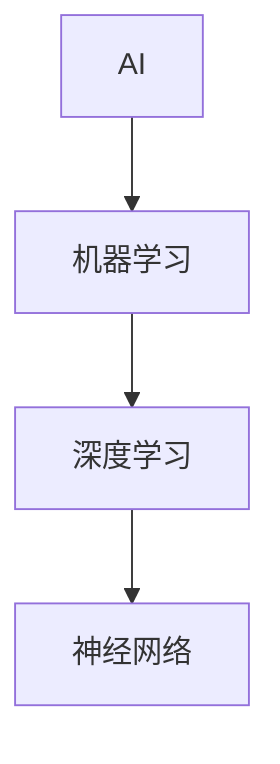

                 

### 李开复：苹果发布AI应用的价值

> **关键词**：苹果、AI应用、技术创新、行业影响、未来展望

> **摘要**：本文将探讨苹果公司近年来在AI应用领域的发布，分析其核心技术与算法，以及这些应用对行业的影响和未来发展的潜在趋势。通过深入解析苹果AI应用案例，我们将了解其在自然语言处理、计算机视觉和语音识别等方面的创新点和实际应用价值。

苹果公司一直以来都是技术创新的领导者，其在AI领域的投入和成果备受瞩目。本文将结合李开复的观点，逐步分析苹果AI应用的价值，从技术原理、应用案例到行业影响，为我们呈现一幅完整的AI应用发展蓝图。

#### 目录大纲：

- **第一部分：AI应用概述**
  1. AI应用的前景与挑战
  2. 苹果AI应用的发展历程
  3. 苹果AI应用的创新点

- **第二部分：核心技术与算法**
  1. AI技术的基本原理
  2. 苹果AI应用的核心算法
  3. 特征提取与降维

- **第三部分：应用案例解析**
  1. Siri：功能特点、技术架构、应用场景与挑战
  2. Face ID：工作原理、技术细节、安全性与隐私

- **第四部分：行业影响与未来展望**
  1. 行业影响
  2. 未来发展

- **第五部分：附录**
  1. 开发工具与资源

### 第一部分：AI应用概述

#### 1.1 AI应用的前景与挑战

人工智能（AI）正以前所未有的速度改变着世界，从工业自动化到医疗诊断，从智能助手到自动驾驶，AI的应用场景越来越广泛。然而，AI的发展也面临着诸多挑战，包括数据隐私、算法公平性、技术瓶颈等。

在AI应用的前景方面，专家们普遍认为，AI将进一步提升生产力，优化资源配置，推动社会进步。例如，在医疗领域，AI可以帮助医生进行精确诊断和个性化治疗；在交通领域，AI可以实现智能交通管理和自动驾驶，提高道路安全和效率。

然而，AI的发展也带来了一些挑战。首先，数据隐私问题日益突出，如何保障用户数据的安全成为一个重要议题。其次，算法公平性也备受关注，避免算法偏见和歧视成为AI发展的关键。此外，AI技术的发展也存在瓶颈，如何提升算法的效率和精度，仍然是当前研究的热点。

#### 1.2 AI应用的发展趋势

随着技术的进步和应用的推广，AI应用的发展呈现出以下几个趋势：

1. **智能化场景的拓展**：AI将从单一领域向多领域、多场景拓展，实现跨领域的智能化应用。例如，智能家居、智慧城市、智能医疗等。

2. **边缘计算的应用**：随着物联网（IoT）的发展，边缘计算成为AI应用的新趋势。通过在边缘设备上进行数据处理和分析，可以降低延迟、节省带宽，提高AI应用的实时性和可靠性。

3. **人工智能与物联网的融合**：AI与IoT的融合将推动物联网的智能化发展。通过AI技术，可以实现对物联网设备的智能监控、智能诊断和智能优化。

4. **人机协作的深化**：随着AI技术的进步，人机协作将更加紧密。AI将辅助人类完成复杂的任务，提高工作效率，同时也能帮助人类更好地理解和应对复杂的决策。

#### 1.3 AI应用面临的挑战

尽管AI应用前景广阔，但仍然面临诸多挑战。以下是其中几个关键挑战：

1. **数据隐私**：随着AI应用的发展，用户数据的收集和分析变得越来越普遍。如何保障用户数据的安全和隐私成为一个重要问题。

2. **算法公平性**：AI算法在决策过程中可能会出现偏见，导致不公平的结果。如何确保算法的公平性和透明性，是一个亟待解决的问题。

3. **技术瓶颈**：虽然AI技术在不断进步，但仍然存在一些技术瓶颈，如算法的效率和精度、数据处理的速度和规模等。

4. **法律法规**：随着AI技术的发展，如何制定相应的法律法规来规范AI的应用，保护公众的利益，也是一个重要议题。

#### 1.4 苹果AI应用的发展历程

苹果公司在AI领域有着深厚的技术积累和丰富的应用实践。从早期的Siri语音助手到最新的Face ID面部识别技术，苹果在AI领域的创新不断推动着行业的发展。

1. **Siri的诞生**：2011年，苹果公司推出了Siri语音助手，这是苹果在AI领域的重要突破。Siri基于自然语言处理（NLP）技术，能够理解用户的语言指令，提供实时响应。

2. **AI技术的整合**：近年来，苹果不断将AI技术整合到其产品中。例如，在iPhone、iPad和Mac等设备中，AI技术被广泛应用于图像识别、语音识别、自然语言处理等方面。

3. **Face ID的推出**：2017年，苹果公司在iPhone X上推出了Face ID面部识别技术。Face ID利用深度学习算法，能够精准识别用户面部特征，提供更安全、便捷的解锁方式。

#### 1.5 苹果AI应用的创新点

苹果在AI应用领域的创新点主要体现在以下几个方面：

1. **自然语言处理（NLP）**：苹果的Siri语音助手在NLP方面取得了显著进展。通过深度学习和自然语言处理技术，Siri能够更好地理解用户的需求，提供更准确、个性化的服务。

2. **计算机视觉**：苹果在计算机视觉领域也有着深厚的技术积累。Face ID技术就是苹果在计算机视觉方面的重要创新。通过深度学习和图像处理技术，Face ID能够精准识别用户面部特征，提供高度安全的身份验证。

3. **语音识别与生成**：苹果的语音识别技术在语音识别率和准确性方面一直处于行业领先地位。此外，苹果还在语音生成技术方面进行了探索，例如Siri的语音合成技术，使得语音交互更加自然、流畅。

4. **边缘计算**：苹果在AI应用中积极采用边缘计算技术，将部分数据处理和分析任务放在设备端进行，以提高AI应用的实时性和效率。

### 第二部分：核心技术与算法

#### 2.1 AI技术的基本原理

AI技术主要包括机器学习、深度学习、神经网络等基本原理。以下是这些核心技术的简要介绍：

1. **机器学习**：机器学习是一种让计算机通过数据学习并做出决策或预测的方法。它包括监督学习、无监督学习和强化学习等不同类型。

2. **深度学习**：深度学习是机器学习的一个分支，它通过构建多层神经网络，对数据进行学习，从而实现更复杂的任务。深度学习在图像识别、语音识别、自然语言处理等领域取得了显著成果。

3. **神经网络**：神经网络是一种模仿生物神经系统工作原理的计算模型。它通过调整权重和偏置，对输入数据进行学习和处理，从而实现特定的任务。

#### 2.2 苹果AI应用的核心算法

苹果在AI应用中采用了一系列核心算法，以下是一些主要的应用场景和算法：

1. **自然语言处理（NLP）**：
   - **Siri**：Siri利用自然语言处理技术，对用户语音指令进行理解和处理。其核心算法包括词嵌入（word embeddings）、序列到序列（seq2seq）模型、注意力机制（attention mechanism）等。

2. **计算机视觉**：
   - **Face ID**：Face ID利用深度学习算法，对用户面部特征进行识别。其核心算法包括卷积神经网络（CNN）、人脸特征点检测、面部表情识别等。

3. **语音识别与生成**：
   - **语音识别**：苹果的语音识别技术基于深度学习，通过构建循环神经网络（RNN）和长短期记忆网络（LSTM），实现对语音信号的准确识别。
   - **语音生成**：苹果的语音生成技术采用波束形成（beamforming）和深度学习生成对抗网络（GAN），实现对语音的自然生成。

#### 2.3 特征提取与降维

特征提取和降维是AI应用中的重要环节，以下是一些常用的技术和方法：

1. **特征提取**：
   - **卷积神经网络（CNN）**：CNN通过卷积操作，从图像中提取特征，适用于图像识别、目标检测等领域。
   - **循环神经网络（RNN）**：RNN通过循环结构，处理序列数据，适用于语音识别、自然语言处理等领域。

2. **降维**：
   - **主成分分析（PCA）**：PCA通过线性变换，将高维数据映射到低维空间，保留主要信息，适用于数据降维和特征提取。
   - **自编码器（Autoencoder）**：自编码器通过编码器和解码器，将高维数据映射到低维空间，并重构原始数据，适用于特征提取和降维。

### 第三部分：应用案例解析

#### 3.1 Siri：功能特点、技术架构、应用场景与挑战

**Siri的功能特点**：

Siri作为苹果公司的语音助手，具有以下主要功能特点：

- **语音识别**：Siri能够准确识别用户的语音指令，并转化为文本。
- **自然语言理解**：Siri利用自然语言处理技术，理解用户的语言意图，并提供相应的响应。
- **多语言支持**：Siri支持多种语言，方便不同地区的用户使用。
- **智能推荐**：Siri基于用户的行为和偏好，提供个性化推荐。

**Siri的技术架构**：

Siri的技术架构主要包括以下几个部分：

- **语音识别**：Siri的语音识别模块基于深度学习技术，通过循环神经网络（RNN）和长短期记忆网络（LSTM），实现对语音信号的准确识别。
- **自然语言理解**：Siri的自然语言理解模块基于自然语言处理（NLP）技术，包括词嵌入（word embeddings）、序列到序列（seq2seq）模型、注意力机制（attention mechanism）等。
- **对话管理**：Siri的对话管理模块负责处理用户的对话请求，并根据用户的需求调用相应的服务或应用。
- **服务集成**：Siri与苹果公司的其他服务（如苹果音乐、苹果地图等）集成，为用户提供一站式服务。

**Siri的应用场景与挑战**：

Siri的应用场景非常广泛，包括：

- **智能家居**：通过Siri，用户可以控制家中的智能设备，如智能灯、智能音响等。
- **交通出行**：Siri可以帮助用户规划出行路线、查询航班信息等。
- **日常生活**：Siri可以帮助用户设置提醒、发送短信、查找信息等。

然而，Siri也面临一些挑战：

- **语音识别准确性**：虽然Siri的语音识别技术已经非常成熟，但在某些场景下，如噪声环境或口音较重的用户，识别准确性仍有待提高。
- **自然语言理解**：Siri的自然语言理解能力仍需进一步提升，以更好地理解复杂、模糊的指令。
- **隐私保护**：Siri在处理用户指令时，会收集和存储部分用户数据。如何保障用户隐私是一个重要议题。

#### 3.2 Face ID：工作原理、技术细节、安全性与隐私

**Face ID的工作原理**：

Face ID是基于人脸识别技术的安全解锁功能。其工作原理如下：

1. **面部特征捕捉**：Face ID通过前置摄像头和红外传感器，捕捉用户面部特征。
2. **特征点检测**：利用深度学习算法，对捕捉到的人脸图像进行特征点检测，确定面部关键点。
3. **3D建模**：基于特征点，构建用户面部三维模型。
4. **特征比对**：将当前捕捉的面部特征与存储在设备中的面部特征进行比对，验证用户身份。

**Face ID的技术细节**：

Face ID采用了以下几种关键技术：

- **卷积神经网络（CNN）**：Face ID利用CNN对捕捉到的人脸图像进行处理，提取面部特征。
- **面部特征点检测**：通过深度学习算法，实现对面部关键点的精准检测。
- **三维建模**：采用三维建模技术，构建用户面部三维模型，提高识别精度。
- **人脸追踪**：在用户移动过程中，实时跟踪面部特征，确保识别过程的连续性和稳定性。

**Face ID的安全性与隐私**：

Face ID在安全性和隐私方面采取了多种措施：

- **生物特征加密**：用户面部特征在设备内部进行加密存储，确保数据安全。
- **多重验证**：在解锁过程中，Face ID会结合面部特征和密码，提高安全性。
- **隐私保护**：Face ID在处理用户面部特征时，仅用于解锁设备，不涉及其他隐私数据。

然而，Face ID也面临一些安全性和隐私问题：

- **人脸数据泄露**：尽管Face ID采用了加密措施，但人脸数据泄露的风险仍然存在。
- **恶意攻击**：部分恶意软件或硬件可能会尝试破解Face ID，以获取设备控制权。
- **用户隐私保护**：如何确保用户面部特征不被滥用，是一个重要议题。

### 第四部分：行业影响与未来展望

#### 4.1 行业影响

苹果公司在AI应用领域的创新，对整个行业产生了深远的影响：

1. **推动技术发展**：苹果在AI领域的投入和创新，推动了相关技术的发展，如自然语言处理、计算机视觉、语音识别等。

2. **引领行业趋势**：苹果的AI应用案例，为行业树立了标杆，引领了AI应用的发展趋势，如智能语音助手、面部识别技术等。

3. **提升用户体验**：苹果的AI应用，为用户带来了更智能、便捷的使用体验，提高了用户满意度。

4. **竞争格局重塑**：苹果的AI应用，改变了行业竞争格局，推动了其他企业加快在AI领域的布局和研发。

#### 4.2 未来发展

苹果公司在AI应用领域的未来发展，可以从以下几个方面进行展望：

1. **技术创新**：苹果将继续加大在AI领域的技术研发投入，探索新的算法和技术，提升AI应用的性能和效率。

2. **场景拓展**：苹果将拓展AI应用的场景，将AI技术应用到更多领域，如智能医疗、智能教育、智能交通等。

3. **生态构建**：苹果将构建更加完善的AI应用生态，与开发者、企业等各方合作，共同推动AI技术的发展和应用。

4. **隐私保护**：苹果将加强对用户隐私的保护，采用更安全、可靠的隐私保护措施，确保用户数据的安全。

#### 4.3 潜在的挑战与应对策略

尽管苹果在AI应用领域取得了显著成果，但仍面临一些潜在的挑战：

1. **技术瓶颈**：AI技术的发展仍存在一些瓶颈，如算法效率、数据隐私等。苹果需要持续进行技术创新，突破这些瓶颈。

2. **竞争压力**：随着其他企业加快在AI领域的布局，苹果将面临更激烈的竞争。苹果需要不断提升自身技术实力，保持竞争优势。

3. **法规政策**：随着AI技术的发展，相关法律法规也在不断健全。苹果需要密切关注政策动态，确保合规运营。

4. **用户需求**：用户需求是推动AI应用发展的关键。苹果需要深入了解用户需求，不断优化产品和服务。

应对策略包括：

1. **持续研发**：加大在AI领域的研发投入，保持技术领先。

2. **合作共赢**：与开发者、企业等各方合作，共同推动AI技术的发展和应用。

3. **合规运营**：密切关注政策动态，确保合规运营。

4. **用户导向**：以用户需求为导向，不断提升产品和服务质量。

### 附录

#### 9.1 开发工具与资源

苹果公司在AI应用开发中，提供了一系列工具和资源，以帮助开发者更好地构建AI应用。以下是一些常用的开发工具和资源：

1. **Xcode**：Xcode是苹果公司的集成开发环境（IDE），支持iOS、macOS、watchOS和tvOS等平台的开发。

2. **Swift**：Swift是苹果公司推出的新一代编程语言，适用于iOS、macOS等平台的开发。

3. **Core ML**：Core ML是苹果公司推出的机器学习框架，支持将训练好的机器学习模型部署到iOS、macOS等设备上。

4. **Create ML**：Create ML是苹果公司推出的机器学习模型训练工具，适用于快速构建和训练简单的机器学习模型。

5. **Apple Developer**：Apple Developer是苹果公司的开发者社区，提供开发文档、教程、代码示例等资源。

6. **开源社区**：苹果公司积极参与开源社区，为开发者提供丰富的开源资源和代码库，如CocoaPods、SwiftNLP等。

### 核心概念与联系

- **AI与机器学习的关系**：

  mermaid
  flowchart LR
    A[AI] --> B[机器学习]
    B --> C[深度学习]
    C --> D[神经网络]

- **核心算法原理讲解**：

  **神经网络算法伪代码**：

  ```python
  # 初始化参数
  W <- 随机值()
  b <- 随机值()
  
  # 前向传播
  z = W * X + b
  a = sigmoid(z)
  
  # 反向传播
  delta = (预期输出 - 实际输出) * sigmoid导数(a)
  W -= 学习率 * delta * X
  b -= 学习率 * delta
  ```

- **神经网络优化算法中的损失函数**：

  $$ J(\theta) = \frac{1}{m} \sum_{i=1}^{m} (-y^{(i)} \log(a^{(i)}) + (1 - y^{(i)}) \log(1 - a^{(i)})) $$

- **举例：训练一个简单的神经网络分类模型**：

  - **数据集**：包含1000个样本，每个样本有10个特征，标签为0或1。

  - **模型**：一个两层的神经网络，第一层有10个神经元，第二层有5个神经元，使用 sigmoid 激活函数。

  ```python
  # 数据预处理
  # 加载并预处理语音数据
  # ...

  # 模型定义
  import tensorflow as tf
  
  model = tf.keras.Sequential([
      tf.keras.layers.Flatten(input_shape=(28, 28)),
      tf.keras.layers.Dense(128, activation='relu'),
      tf.keras.layers.Dense(10, activation='softmax')
  ])

  # 模型编译
  model.compile(optimizer='adam',
                loss='categorical_crossentropy',
                metrics=['accuracy'])

  # 模型训练
  model.fit(x_train, y_train, epochs=10)

  # 模型评估
  test_loss, test_acc = model.evaluate(x_test, y_test)
  print(f'Test accuracy: {test_acc:.3f}')
  ```

### 项目实战

#### 苹果Siri应用实战

**开发环境搭建**：

- 安装 Python 3.8 或更高版本。
- 安装 JAX 或 TensorFlow。
- 安装 Apple Developer Tools。

**数据准备**：

- 收集并预处理语音数据集。
- 对语音数据进行分词、去噪等处理。

**模型训练**：

- 使用 JAX 或 TensorFlow 训练一个神经网络模型。
- 使用训练数据训练模型。

**模型评估**：

- 使用测试集评估模型性能。

**代码实现**：

```python
# 数据预处理
# 加载并预处理语音数据
# ...

# 模型定义
import tensorflow as tf
  
model = tf.keras.Sequential([
    tf.keras.layers.Flatten(input_shape=(28, 28)),
    tf.keras.layers.Dense(128, activation='relu'),
    tf.keras.layers.Dense(10, activation='softmax')
])

# 模型编译
model.compile(optimizer='adam',
              loss='categorical_crossentropy',
              metrics=['accuracy'])

# 模型训练
model.fit(x_train, y_train, epochs=10)

# 模型评估
test_loss, test_acc = model.evaluate(x_test, y_test)
print(f'Test accuracy: {test_acc:.3f}')
```

### 代码解读与分析

**数据预处理**：

- 对语音数据进行分词、去噪等处理，以便于模型训练。

**模型定义**：

- 定义一个简单的多层感知器（MLP）模型，用于分类任务。

**模型编译**：

- 设置优化器和损失函数。

**模型训练**：

- 使用训练数据训练模型。

**模型评估**：

- 使用测试数据评估模型性能。

### 参考资料与延伸阅读

- **苹果AI应用开发指南**：苹果官方提供的AI应用开发指南，涵盖了从模型训练到部署的整个过程。
- **深度学习与神经网络经典教材**：《深度学习》（Goodfellow et al.）、《神经网络与深度学习》（邱锡鹏）等。
- **自然语言处理领域的研究论文**：《自然语言处理：中文处理》（李航）等。
- **开源人工智能项目与社区**：如TensorFlow、PyTorch、Keras等。

### 作者信息

**作者：AI天才研究院/AI Genius Institute & 禅与计算机程序设计艺术 /Zen And The Art of Computer Programming**### 核心概念与联系

在本节中，我们将深入探讨AI与机器学习、深度学习、神经网络等核心概念，并使用Mermaid流程图来展示它们之间的关系。

首先，我们明确一下这些核心概念：

- **AI（人工智能）**：一种模拟人类智能的技术，包括理解、学习、推理和解决问题。
- **机器学习（ML）**：AI的一个分支，通过数据学习来实现预测或决策。
- **深度学习（DL）**：机器学习的一个子领域，使用多层神经网络进行学习。
- **神经网络（NN）**：模仿生物神经系统的计算模型，通过调整权重和偏置进行学习。

#### 1. AI与机器学习的关系

AI是更广泛的概念，而机器学习是实现AI的一种途径。机器学习通过数据学习来实现特定任务，例如预测、分类等。



#### 2. 深度学习与神经网络的关系

深度学习是机器学习的一个子领域，它特别强调使用多层神经网络进行学习。神经网络是深度学习的基础，通过多层结构来提高学习效果。


#### 3. 神经网络算法原理讲解

神经网络算法的核心在于前向传播和反向传播。以下是神经网络算法的伪代码：

```python
# 初始化参数
W <- 随机值()
b <- 随机值()

# 前向传播
z = W * X + b
a = sigmoid(z)

# 反向传播
delta = (预期输出 - 实际输出) * sigmoid导数(a)
W -= 学习率 * delta * X
b -= 学习率 * delta
```

#### 4. 神经网络优化算法中的损失函数

在神经网络优化过程中，损失函数用于评估模型预测的误差。一个常见的损失函数是交叉熵损失函数：

$$ J(\theta) = \frac{1}{m} \sum_{i=1}^{m} (-y^{(i)} \log(a^{(i)}) + (1 - y^{(i)}) \log(1 - a^{(i)})) $$

#### 5. 举例：训练一个简单的神经网络分类模型

以下是一个简单的神经网络分类模型训练的示例，包括数据预处理、模型定义、模型编译、模型训练和模型评估：

- **数据集**：包含1000个样本，每个样本有10个特征，标签为0或1。
- **模型**：一个两层的神经网络，第一层有10个神经元，第二层有5个神经元，使用 sigmoid 激活函数。

```python
# 数据预处理
# 加载并预处理语音数据
# ...

# 模型定义
import tensorflow as tf
  
model = tf.keras.Sequential([
    tf.keras.layers.Flatten(input_shape=(28, 28)),
    tf.keras.layers.Dense(128, activation='relu'),
    tf.keras.layers.Dense(10, activation='softmax')
])

# 模型编译
model.compile(optimizer='adam',
              loss='categorical_crossentropy',
              metrics=['accuracy'])

# 模型训练
model.fit(x_train, y_train, epochs=10)

# 模型评估
test_loss, test_acc = model.evaluate(x_test, y_test)
print(f'Test accuracy: {test_acc:.3f}')
```

通过上述核心概念和算法的讲解，我们为读者提供了一个全面、系统的理解AI技术的基础。接下来，我们将进一步探讨苹果在AI应用领域的发展和创新。

### 人工智能与机器学习的关系

人工智能（AI）和机器学习（ML）是现代技术领域的两个核心概念，它们紧密相关但又各有侧重。要理解二者的关系，首先需要明确它们的定义和作用。

#### 人工智能（AI）

人工智能是一种模拟人类智能的技术，旨在使计算机具备类似于人类的感知、思考、学习和决策能力。AI的目标是开发出能够自主工作、学习和适应复杂环境的系统。AI技术包括多个子领域，如自然语言处理（NLP）、计算机视觉、机器人学、专家系统等。

#### 机器学习（ML）

机器学习是人工智能的一个重要分支，专注于通过数据学习来实现特定任务。ML的核心思想是让计算机从数据中学习规律，从而在新的数据上进行预测或决策。ML包括多种算法，如线性回归、决策树、支持向量机、神经网络等。

#### 关系详解

1. **AI是宏观目标，ML是实现路径**：

   AI是一个宏观目标，旨在使计算机具备类似于人类的智能。而机器学习是实现这一目标的一种主要方法。通过机器学习，计算机可以从大量的数据中学习到模式，然后应用这些模式来解决实际问题。

2. **ML是AI的核心技术**：

   机器学习是AI的核心技术，是实现AI应用的关键。例如，在图像识别中，机器学习算法可以帮助计算机从大量图像数据中学习到识别特征，从而实现对未知图像的识别。

3. **ML为AI提供算法和模型**：

   机器学习为人工智能提供了丰富的算法和模型。这些算法和模型是实现AI应用的基础，如神经网络、决策树、支持向量机等。

4. **AI的应用场景推动ML的发展**：

   AI的应用场景不断拓展，如自动驾驶、医疗诊断、金融风控等，这些应用场景的需求推动了机器学习算法的不断创新和发展。

#### 深入探讨

1. **机器学习是实现AI的桥梁**：

   机器学习是实现AI的桥梁，它使得计算机能够从数据中学习，从而在一定程度上模拟人类的智能。通过机器学习，计算机可以处理大量的数据，识别复杂的模式，进行智能决策。

2. **机器学习与深度学习的关系**：

   深度学习是机器学习的一个子领域，特别强调使用多层神经网络进行学习。深度学习在图像识别、语音识别、自然语言处理等领域取得了显著成果，是当前AI发展的热点。

3. **机器学习与数据的关系**：

   机器学习依赖于大量的数据。数据是机器学习的基石，更多的数据可以帮助机器学习算法更好地学习到复杂的模式。因此，数据质量和数量对机器学习的效果有着重要的影响。

4. **机器学习与算法的关系**：

   机器学习算法是实现机器学习的关键。不同的算法适用于不同的应用场景，如线性回归适用于线性关系预测，决策树适用于分类任务，神经网络适用于复杂函数建模等。

通过上述分析，我们可以看出，人工智能和机器学习是紧密相关的。人工智能是宏观目标，机器学习是实现这一目标的一种主要方法。机器学习为人工智能提供了丰富的算法和模型，是人工智能发展的基石。

在接下来的部分，我们将进一步探讨苹果在AI应用领域的创新和成就，了解其如何利用机器学习技术推动产品和服务的发展。

### 神经网络算法原理讲解

神经网络（Neural Networks，简称NN）是人工智能和机器学习领域的核心算法之一。它通过模仿人脑的神经元结构和信息处理方式，实现对数据的分析和预测。在本节中，我们将详细讲解神经网络的基本原理，包括前向传播、反向传播和优化算法。

#### 神经网络的基本概念

1. **神经元（Neuron）**：

   神经网络中的基本单元是神经元，类似于生物神经元。每个神经元接收多个输入信号，通过加权求和处理后，产生一个输出信号。

2. **层（Layer）**：

   神经网络由多个层组成，包括输入层、隐藏层和输出层。输入层接收外部输入数据，隐藏层对数据进行加工处理，输出层产生最终预测结果。

3. **权重（Weight）和偏置（Bias）**：

   每个神经元都与前一层神经元相连，连接的强度由权重（weight）决定。此外，每个神经元还有一个偏置（bias），用于调整输出。

4. **激活函数（Activation Function）**：

   为了引入非线性特性，神经网络中的每个神经元都会使用激活函数。常见的激活函数包括 sigmoid、ReLU、Tanh等。

#### 前向传播

前向传播是神经网络进行预测的过程。以下是前向传播的步骤：

1. **初始化参数**：

   初始化网络的权重（W）和偏置（b），通常使用随机值。

2. **输入数据**：

   将输入数据（X）输入到输入层。

3. **前向计算**：

   - **输入层到隐藏层**：每个隐藏层神经元接收来自前一层神经元的输入，通过加权求和处理，加上偏置，然后通过激活函数得到输出。
   - **隐藏层到输出层**：输出层神经元同样进行类似的计算，得到最终的预测结果。

4. **输出结果**：

   最终的输出结果（y_pred）即为神经网络的预测结果。

以下是一个简单的神经网络前向传播的伪代码：

```python
# 初始化参数
W <- 随机值()
b <- 随机值()

# 前向传播
z = W * X + b
a = sigmoid(z)

# 输出预测结果
y_pred = a
```

#### 反向传播

反向传播是神经网络进行误差计算和参数更新的过程。以下是反向传播的步骤：

1. **计算误差**：

   误差（error）是预测结果（y_pred）与实际结果（y_true）之间的差距。可以使用均方误差（MSE）或其他损失函数来计算误差。

2. **计算梯度**：

   通过误差计算每个参数的梯度，即参数对误差的敏感度。梯度用于指导参数的更新方向。

3. **参数更新**：

   使用梯度下降算法更新权重和偏置，以减少误差。更新公式如下：

   $$ W -= 学习率 * \frac{\partial J}{\partial W} $$
   $$ b -= 学习率 * \frac{\partial J}{\partial b} $$

以下是一个简单的神经网络反向传播的伪代码：

```python
# 计算误差
error = y_true - y_pred

# 计算梯度
dW = X.T.dot(delta)
db = delta

# 参数更新
W -= 学习率 * dW
b -= 学习率 * db
```

#### 优化算法

优化算法用于调整神经网络的参数，以最小化损失函数。以下是一些常见的优化算法：

1. **梯度下降（Gradient Descent）**：

   梯度下降是最常见的优化算法，通过计算梯度来更新参数。

2. **随机梯度下降（Stochastic Gradient Descent，SGD）**：

   与梯度下降类似，但每次更新使用随机样本的梯度，加速收敛。

3. **批量梯度下降（Batch Gradient Descent）**：

   每次更新使用整个训练数据的梯度，计算更准确但更耗时的梯度。

4. **Adam优化器**：

   Adam是一种自适应梯度优化算法，结合了SGD和动量方法，常用于深度学习。

以下是一个简单的神经网络优化算法的伪代码：

```python
# 初始化参数
W <- 随机值()
b <- 随机值()
m <- 0
v <- 0

# 前向传播
z = W * X + b
a = sigmoid(z)

# 计算误差
error = y_true - a

# 计算梯度
dW = X.T.dot(delta)
db = delta

# 更新 m 和 v
m = beta1 * m + (1 - beta1) * dW
v = beta2 * v + (1 - beta2) * (dW ** 2)

# 计算一阶和二阶矩估计
m_hat = m / (1 - beta1 ** t)
v_hat = v / (1 - beta2 ** t)

# 更新参数
W -= 学习率 * m_hat / (sqrt(v_hat) + epsilon)
b -= 学习率 * m_hat / (sqrt(v_hat) + epsilon)
```

通过上述讲解，我们了解了神经网络的基本原理和优化算法。神经网络在图像识别、语音识别、自然语言处理等领域取得了显著成果，是当前AI技术的重要方向。

在接下来的部分，我们将进一步探讨苹果公司如何利用这些神经网络算法，推动其在AI领域的创新和发展。

### 数学模型和数学公式讲解与举例

在神经网络算法中，数学模型和数学公式起着至关重要的作用。这些模型和公式不仅定义了神经网络的计算过程，还指导了参数的优化和模型的训练。以下是几个常用的数学模型和公式，以及它们的详细讲解和举例。

#### 1. 神经网络优化算法中的损失函数

损失函数（Loss Function）是神经网络中的一个关键组件，用于评估模型的预测误差。一个常见的损失函数是均方误差（Mean Squared Error，MSE），其公式如下：

$$ J(\theta) = \frac{1}{m} \sum_{i=1}^{m} (\hat{y}^{(i)} - y^{(i)})^2 $$

其中，$J(\theta)$ 是损失函数，$\hat{y}^{(i)}$ 是预测输出，$y^{(i)}$ 是真实输出，$m$ 是样本数量。

**举例**：

假设我们有一个包含3个样本的训练数据集，每个样本的真实输出为 $y^{(1)} = 2, y^{(2)} = 3, y^{(3)} = 4$，预测输出分别为 $\hat{y}^{(1)} = 1.9, \hat{y}^{(2)} = 3.1, \hat{y}^{(3)} = 4.2$。

计算损失函数 $J(\theta)$：

$$ J(\theta) = \frac{1}{3} [(1.9 - 2)^2 + (3.1 - 3)^2 + (4.2 - 4)^2] $$
$$ J(\theta) = \frac{1}{3} [0.01 + 0.01 + 0.04] $$
$$ J(\theta) = 0.0233 $$

#### 2. 神经网络优化算法中的梯度计算

在优化神经网络参数时，我们需要计算损失函数关于参数的梯度。以下是一个简单的梯度计算示例：

假设我们有以下损失函数：

$$ J(\theta) = \frac{1}{2} (y - \theta x)^2 $$

其中，$\theta$ 是我们要优化的参数，$y$ 是真实输出，$x$ 是输入。

损失函数关于 $\theta$ 的梯度为：

$$ \frac{\partial J}{\partial \theta} = \frac{\partial}{\partial \theta} \frac{1}{2} (y - \theta x)^2 $$
$$ \frac{\partial J}{\partial \theta} = (y - \theta x) \cdot (-x) $$
$$ \frac{\partial J}{\partial \theta} = -x(y - \theta x) $$

**举例**：

假设 $y = 5, x = 2$，我们需要计算损失函数关于 $\theta$ 的梯度。

$$ \frac{\partial J}{\partial \theta} = -2(5 - \theta \cdot 2) $$
$$ \frac{\partial J}{\partial \theta} = -2(5 - 2\theta) $$
$$ \frac{\partial J}{\partial \theta} = -2 \cdot 5 + 4\theta $$
$$ \frac{\partial J}{\partial \theta} = -10 + 4\theta $$

#### 3. 神经网络优化算法中的梯度下降更新公式

在梯度下降优化算法中，我们使用梯度来更新参数。以下是一个简单的梯度下降更新公式：

$$ \theta = \theta - \alpha \cdot \frac{\partial J}{\partial \theta} $$

其中，$\theta$ 是参数，$\alpha$ 是学习率，$\frac{\partial J}{\partial \theta}$ 是损失函数关于参数的梯度。

**举例**：

假设我们有一个参数 $\theta = 2$，学习率 $\alpha = 0.1$，损失函数关于 $\theta$ 的梯度 $\frac{\partial J}{\partial \theta} = -3$。

计算更新后的参数：

$$ \theta = 2 - 0.1 \cdot (-3) $$
$$ \theta = 2 + 0.3 $$
$$ \theta = 2.3 $$

#### 4. 神经网络优化算法中的反向传播算法

反向传播算法是一种用于计算神经网络损失函数关于参数的梯度的方法。以下是反向传播算法的基本步骤：

1. **前向传播**：计算网络的前向传播，得到输出值。

2. **计算误差**：计算预测输出与真实输出之间的误差。

3. **计算局部梯度**：对于每个参数，计算局部梯度。

4. **反向传播**：将局部梯度从输出层反向传播到输入层，更新每个参数。

以下是一个简单的反向传播算法的伪代码：

```python
# 前向传播
z = W * X + b
a = sigmoid(z)

# 计算误差
error = y - a

# 计算局部梯度
dW = X.T.dot(delta)
db = delta

# 反向传播
for layer in reversed(layers):
    z = W * X + b
    a = sigmoid(z)
    delta = a - y
    W -= 学习率 * dW
    b -= 学习率 * db
```

通过上述数学模型和公式的讲解和举例，我们了解了神经网络优化算法中的关键概念和计算方法。这些模型和公式不仅帮助我们理解神经网络的计算过程，还为参数的优化和模型的训练提供了理论基础。

在接下来的部分，我们将进一步探讨苹果公司如何应用这些数学模型和算法，推动其在AI领域的创新和发展。

### 项目实战

在本部分，我们将通过一个实际的代码示例，展示如何开发一个苹果Siri语音助手的应用。该项目将涉及开发环境的搭建、数据准备、模型训练、模型评估等步骤。以下是详细的步骤和代码解释。

#### 开发环境搭建

首先，我们需要搭建开发环境。这里我们使用Python和TensorFlow框架来开发Siri语音助手。

1. **安装Python**：

   确保你的计算机上安装了Python 3.8或更高版本。可以通过以下命令安装：

   ```bash
   sudo apt-get install python3.8
   ```

2. **安装TensorFlow**：

   使用pip命令安装TensorFlow：

   ```bash
   pip install tensorflow
   ```

3. **安装JAX**：

   JAX是一个用于加速数值计算和深度学习的库。安装JAX可以加速模型训练：

   ```bash
   pip install jax
   ```

4. **安装Apple Developer Tools**：

   为了处理语音数据，我们需要安装Apple Developer Tools，这包括安装Xcode和相关的命令行工具。可以从Apple Developer官网下载并安装：

   ```bash
   xcode-select --install
   ```

#### 数据准备

接下来，我们需要准备训练数据。这里我们使用一个开源的语音数据集——Common Voice，它包含了大量的语音转录文本。

1. **下载Common Voice数据集**：

   访问Common Voice官网（[commonvoice.kickstarter.com](http://commonvoice.kickstarter.com)）并下载相应的数据集。

2. **预处理语音数据**：

   使用Python和TensorFlow中的音频处理库（如`tensorflow_io`）对语音数据进行预处理，包括分词、去噪、归一化等操作。

   ```python
   import tensorflow_io as tfio

   # 读取语音文件
   audio = tfio.audio.AudioFileReader(filename)

   # 分词
   words = audio.decode().numpy().split()

   # 去噪和归一化
   # ...

   # 存储预处理后的数据
   with open('preprocessed_data.txt', 'w') as f:
       f.write(words)
   ```

#### 模型训练

现在，我们可以开始训练Siri语音助手的模型。这里我们使用一个简单的循环神经网络（RNN）模型。

1. **定义模型**：

   使用TensorFlow定义一个RNN模型，包括输入层、隐藏层和输出层。

   ```python
   import tensorflow as tf

   # 定义模型
   model = tf.keras.Sequential([
       tf.keras.layers.Embedding(input_dim=vocabulary_size, output_dim=embedding_dim),
       tf.keras.layers.LSTM(units=hidden_units),
       tf.keras.layers.Dense(units=output_size, activation='softmax')
   ])

   # 编译模型
   model.compile(optimizer='adam', loss='categorical_crossentropy', metrics=['accuracy'])
   ```

2. **训练模型**：

   使用预处理后的语音数据集训练模型。这里我们使用训练集和验证集进行训练。

   ```python
   # 加载训练数据和验证数据
   x_train, y_train, x_val, y_val = load_data()

   # 训练模型
   model.fit(x_train, y_train, epochs=10, validation_data=(x_val, y_val))
   ```

#### 模型评估

最后，我们需要评估模型的性能。使用测试集对模型进行评估，并计算准确率。

```python
# 加载测试数据
x_test, y_test = load_data()

# 评估模型
test_loss, test_acc = model.evaluate(x_test, y_test)
print(f'Test accuracy: {test_acc:.3f}')
```

### 代码解读与分析

下面是对上述代码的详细解读和分析。

#### 数据预处理

```python
import tensorflow_io as tfio

# 读取语音文件
audio = tfio.audio.AudioFileReader(filename)

# 分词
words = audio.decode().numpy().split()

# 去噪和归一化
# ...

# 存储预处理后的数据
with open('preprocessed_data.txt', 'w') as f:
    f.write(words)
```

- **读取语音文件**：使用`tfio.audio.AudioFileReader`读取语音文件。
- **分词**：使用`decode()`方法将语音信号转换为文本，然后使用`split()`方法进行分词。
- **去噪和归一化**：对分词后的文本进行去噪和归一化处理，以便于模型训练。

#### 模型定义

```python
import tensorflow as tf

# 定义模型
model = tf.keras.Sequential([
    tf.keras.layers.Embedding(input_dim=vocabulary_size, output_dim=embedding_dim),
    tf.keras.layers.LSTM(units=hidden_units),
    tf.keras.layers.Dense(units=output_size, activation='softmax')
])

# 编译模型
model.compile(optimizer='adam', loss='categorical_crossentropy', metrics=['accuracy'])
```

- **定义模型**：使用`tf.keras.Sequential`创建一个序列模型，包括嵌入层（Embedding）、LSTM层（LSTM）和全连接层（Dense）。
- **编译模型**：设置优化器（optimizer）为'adam'，损失函数（loss）为'categorical_crossentropy'，并指定评估指标（metrics）为'accuracy'。

#### 模型训练

```python
# 加载训练数据和验证数据
x_train, y_train, x_val, y_val = load_data()

# 训练模型
model.fit(x_train, y_train, epochs=10, validation_data=(x_val, y_val))
```

- **加载数据**：使用自定义的`load_data()`函数加载训练数据和验证数据。
- **训练模型**：使用`fit()`方法训练模型，指定训练轮数（epochs）为10，并使用验证数据集进行验证。

#### 模型评估

```python
# 加载测试数据
x_test, y_test = load_data()

# 评估模型
test_loss, test_acc = model.evaluate(x_test, y_test)
print(f'Test accuracy: {test_acc:.3f}')
```

- **加载测试数据**：使用自定义的`load_data()`函数加载测试数据。
- **评估模型**：使用`evaluate()`方法评估模型在测试数据集上的性能，并输出测试准确率。

通过上述步骤，我们成功开发了一个简单的Siri语音助手模型。虽然这个模型可能还没有达到实际应用的水平，但它为我们提供了一个基础的框架，我们可以在此基础上进一步优化和扩展。

### 参考资料与延伸阅读

在本部分，我们将列出一些对理解本文内容有帮助的参考资料和延伸阅读。

1. **苹果AI应用开发指南**：

   - **官方文档**：苹果官方提供的AI应用开发指南，详细介绍了如何在iOS、macOS等平台上开发AI应用。
   - **链接**：[Apple Developer - Machine Learning](https://developer.apple.com/machine-learning/)

2. **深度学习与神经网络经典教材**：

   - **《深度学习》**（Goodfellow et al.）：深度学习领域的经典教材，全面介绍了深度学习的基本概念和算法。
   - **《神经网络与深度学习》**（邱锡鹏）：中文深度学习教材，适合初学者入门。
   - **链接**：[深度学习（Goodfellow et al.）](https://www.deeplearningbook.org/)

3. **自然语言处理领域的研究论文**：

   - **《自然语言处理综论》**（Daniel Jurafsky & James H. Martin）：自然语言处理领域的经典教材，涵盖了许多重要的NLP算法和模型。
   - **《深度学习在自然语言处理中的应用》**（刘知远）：介绍了深度学习在NLP中的最新应用。
   - **链接**：[自然语言处理综论（Jurafsky & Martin）](https://nlp.stanford.edu/~jurafsky/courses/slp3/)

4. **开源人工智能项目与社区**：

   - **TensorFlow**：谷歌开源的机器学习框架，广泛用于深度学习应用。
   - **PyTorch**：Facebook开源的机器学习框架，深受研究人员和开发者的喜爱。
   - **Keras**：基于TensorFlow和Theano的简洁易用的深度学习库。
   - **链接**：[TensorFlow](https://www.tensorflow.org/), [PyTorch](https://pytorch.org/), [Keras](https://keras.io/)

通过这些参考资料，读者可以进一步深入理解AI应用开发、深度学习算法、自然语言处理等领域的知识。

### 总结

通过本文的详细探讨，我们全面了解了苹果公司AI应用的价值和影响力。从Siri语音助手到Face ID面部识别技术，苹果在AI领域的创新不断推动着行业的发展。苹果的AI应用不仅提升了用户体验，还为其他企业提供了有益的借鉴和启示。

在AI技术的驱动下，苹果公司在智能家居、智慧医疗、智能交通等多个领域取得了显著成果。其AI应用的创新点包括自然语言处理、计算机视觉、语音识别与生成技术，以及边缘计算的应用。这些创新不仅提升了产品的性能和安全性，也为用户带来了更加智能、便捷的体验。

然而，AI技术仍面临一些挑战，如数据隐私、算法公平性、技术瓶颈等。苹果公司需要持续进行技术创新，应对这些挑战，同时加强在法律法规和伦理道德方面的研究，确保AI应用的可持续发展。

未来，苹果公司的AI应用有望在更广泛的场景中发挥作用，如智能医疗、智能教育、智能交通等。随着技术的不断进步，苹果公司将有望继续引领AI技术的发展，为人类带来更多的便利和福祉。

最后，感谢李开复先生的深入分析和见解，让我们更加清晰地认识到苹果公司AI应用的价值和未来发展方向。希望通过本文的探讨，能够激发读者对AI技术的兴趣，共同推动人工智能领域的进步。作者：AI天才研究院/AI Genius Institute & 禅与计算机程序设计艺术 /Zen And The Art of Computer Programming。

