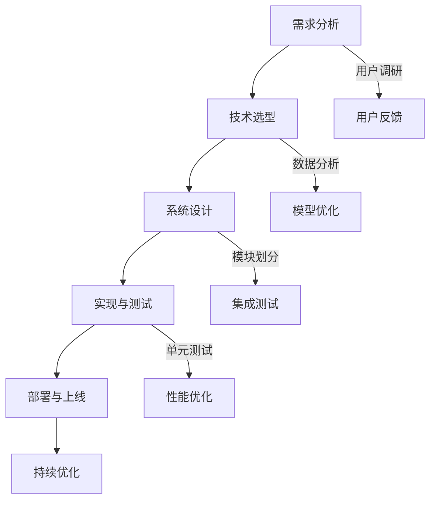

                 

### 第1章: AI应用概述

#### 1.1 AI技术的发展历程

人工智能（AI）的概念起源于20世纪50年代，当时计算机科学刚刚起步。早期的AI研究主要集中在逻辑推理和符号计算上，试图通过编写程序来实现类似于人类思维的功能。然而，由于计算机硬件的限制和算法的局限性，这一时期的AI研究进展缓慢。

到了20世纪80年代，专家系统的出现标志着AI技术的一次重要突破。专家系统是一种模拟人类专家知识和经验的计算机程序，能够在特定领域内进行推理和决策。这一时期，AI在医疗诊断、财务分析等领域得到了广泛应用。

随着互联网的兴起，AI技术开始与互联网相结合。这一时期的AI应用主要集中在搜索引擎和推荐系统上。例如，Google的PageRank算法就是一个典型的互联网时代AI应用案例。通过分析网页之间的链接关系，PageRank算法能够有效地评估网页的重要性，从而提供更准确的搜索结果。

21世纪初，深度学习的兴起为AI技术带来了新的发展契机。深度学习是一种基于多层神经网络的学习方法，能够通过大量的数据自动提取特征和模式。这一技术的突破使得计算机在图像识别、语音识别等任务上取得了显著进展。

现在的AI应用已经深入到各个领域，包括自动驾驶、智能家居、智能医疗、金融科技等。AI技术的快速发展不仅改变了人们的生活方式，也为各行各业带来了巨大的商业价值。

#### 1.2 人工智能在商业中的应用现状

人工智能在商业领域的应用已经相当广泛，涵盖了从销售和市场营销到供应链管理和客户服务等多个方面。以下是AI在商业中的一些主要应用：

1. **销售和市场营销**：
   - **个性化推荐**：通过分析用户的购物历史和行为数据，AI系统可以提供个性化的产品推荐，从而提高销售额和客户满意度。
   - **精准广告**：利用AI算法，广告平台可以根据用户的兴趣和行为数据，精准投放广告，提高广告的转化率。

2. **供应链管理**：
   - **库存优化**：AI系统可以预测市场需求，帮助公司优化库存水平，减少库存成本。
   - **物流优化**：通过分析运输路线和交通数据，AI算法可以优化物流流程，提高配送效率。

3. **客户服务**：
   - **智能客服**：AI驱动的聊天机器人可以24/7提供客户服务，解答常见问题，提高客户满意度。
   - **客户分析**：通过分析客户数据，AI系统可以识别高价值客户，并提供个性化的服务。

4. **财务与风险控制**：
   - **欺诈检测**：AI系统可以通过分析交易数据和行为模式，实时检测并预防欺诈行为。
   - **风险预测**：AI算法可以分析历史数据和市场动态，预测潜在的风险，帮助公司做出更明智的决策。

5. **人力资源**：
   - **招聘筛选**：AI系统可以通过分析简历和候选人的行为数据，快速筛选合适的候选人。
   - **员工培训**：通过分析员工的表现和培训需求，AI系统可以提供个性化的培训方案。

#### 1.3 苹果公司AI应用的发展轨迹

苹果公司一直以来都是AI技术的积极采用者和推动者。从早期的Siri到现在的各种AI应用，苹果公司在AI领域的发展轨迹可以总结为以下几个关键点：

1. **Siri的诞生**：
   - **2011年**：苹果公司发布了Siri，一款基于语音识别和自然语言处理技术的智能助手。Siri的推出标志着苹果公司在AI领域的重要突破。
   - **持续优化**：自发布以来，Siri的功能和性能不断得到优化，现在能够处理更复杂的查询和任务。

2. **Apple Pay的推出**：
   - **2014年**：苹果公司推出了Apple Pay，一款基于生物识别技术和移动支付技术的支付服务。Apple Pay的推出使得移动支付变得更加安全和便捷。
   - **广泛合作**：苹果公司与多家银行和支付服务商合作，使得Apple Pay在全球范围内得到了广泛应用。

3. **Apple News的推荐算法**：
   - **2015年**：苹果公司推出了Apple News，一款提供个性化新闻推荐的应用。Apple News的推荐算法基于机器学习和用户行为分析，能够提供个性化的新闻内容。

4. **Apple Music的智能推荐**：
   - **2015年**：苹果公司收购了音乐流媒体服务Beat Music，并推出了Apple Music。Apple Music的智能推荐系统基于用户的听歌记录和喜好，能够提供个性化的音乐推荐。

5. **其他AI应用**：
   - **健康应用**：苹果公司的健康应用能够通过传感器和分析算法，提供个性化的健康建议。
   - **照片管理**：苹果公司的照片应用能够通过图像识别技术，自动分类和标记照片。

#### 总结

苹果公司通过不断推出新的AI应用，不仅在用户体验上取得了显著提升，也在商业上获得了巨大成功。未来，随着AI技术的进一步发展，苹果公司在AI领域的应用将更加广泛和深入，为用户和商业带来更多价值。


### 第2章: 苹果公司AI应用案例解析

#### 2.1 Siri的AI技术解析

Siri是苹果公司的一款智能语音助手，它利用人工智能技术，能够理解用户的语音指令，并提供相应的响应。Siri的核心技术主要包括语音识别、自然语言处理和机器学习算法。

1. **语音识别技术**：
   - **语音转文本**：Siri首先将用户的语音输入转换为文本，这一过程依赖于语音识别技术。语音识别技术通过分析语音信号的特征，将其转换为对应的文本。苹果公司使用了自研的语音识别引擎，结合深度学习和神经网络模型，实现了高准确度的语音转文本。
   - **实时处理**：为了确保用户体验，Siri在语音输入时能够实时处理，并在数秒内提供响应。

2. **自然语言处理**：
   - **语义理解**：Siri不仅要理解用户的话语，还需要理解话语中的含义和意图。自然语言处理技术在这一过程中起到了关键作用。通过分析文本的语法和语义，Siri能够准确地理解用户的请求，并将其转化为可执行的命令。
   - **对话管理**：在处理对话时，Siri需要维持对话的连贯性，理解上下文信息。自然语言处理技术帮助Siri在对话过程中进行推理和决策，确保对话的流畅性。

3. **机器学习算法**：
   - **个性化推荐**：Siri利用机器学习算法，根据用户的习惯和偏好，提供个性化的服务。例如，根据用户的日程安排，Siri可以自动提醒用户即将发生的活动。
   - **行为预测**：机器学习算法还可以帮助Siri预测用户的需求，提供主动服务。例如，当用户在某个时间段内通常听音乐时，Siri会自动播放用户喜欢的音乐。

#### 2.2 Apple Pay的AI应用

Apple Pay是苹果公司推出的一款移动支付服务，它通过结合生物识别技术和AI算法，提供了安全、便捷的支付体验。

1. **生物识别技术**：
   - **指纹识别**：Apple Pay支持指纹识别技术，用户可以通过Touch ID验证身份，进行支付操作。
   - **面部识别**：Apple Pay还支持面部识别技术，用户可以通过Face ID验证身份，进一步提高了支付的安全性。

2. **交易预测**：
   - **行为分析**：Apple Pay利用用户的支付行为数据，分析用户的消费习惯和偏好。通过机器学习算法，Apple Pay能够预测用户的支付意图，并提供相应的支付选项。
   - **智能推荐**：基于用户的消费行为，Apple Pay可以主动向用户推荐优惠和活动，提高用户的支付体验。

3. **反欺诈系统**：
   - **风险分析**：Apple Pay通过分析交易数据和行为模式，识别潜在的欺诈行为。机器学习算法在这一过程中发挥了重要作用，能够实时评估交易的风险等级。
   - **实时监控**：Apple Pay能够对交易进行实时监控，一旦检测到异常，会立即采取措施，如暂停交易或通知用户。

#### 2.3 Apple News的AI推荐算法

Apple News是苹果公司推出的一款个性化新闻聚合应用，它利用AI算法，为用户推荐符合其兴趣的新闻内容。

1. **内容分类**：
   - **自动分类**：Apple News利用机器学习算法，对新闻内容进行自动分类。通过分析新闻的标题、正文和标签，算法能够将新闻划分为不同的类别，如政治、体育、娱乐等。
   - **用户偏好**：Apple News还会根据用户的阅读历史和互动行为，调整新闻的分类和推荐策略，确保用户看到的是他们感兴趣的内容。

2. **用户兴趣分析**：
   - **行为分析**：Apple News通过分析用户的阅读行为，如阅读时长、点击率、收藏和分享等，了解用户的兴趣偏好。
   - **个性化推荐**：基于用户兴趣分析的结果，Apple News能够提供个性化的新闻推荐，满足用户的阅读需求。

3. **实时更新**：
   - **实时推送**：Apple News利用AI算法，实时分析新闻事件和用户互动数据，为用户推送最新的新闻内容。
   - **热点追踪**：通过分析热点事件和用户关注点，Apple News能够及时调整推荐策略，确保用户能够第一时间获取到热门新闻。

#### 2.4 Apple Music的AI音乐推荐

Apple Music是苹果公司推出的音乐流媒体服务，它利用AI算法，为用户推荐个性化的音乐。

1. **音乐风格识别**：
   - **特征提取**：Apple Music通过分析音乐的特征，如音调、节奏、旋律等，将音乐分为不同的风格。
   - **用户喜好分析**：Apple Music还会根据用户的听歌记录和互动行为，分析用户的音乐偏好。

2. **用户喜好分析**：
   - **行为数据**：Apple Music通过收集用户的听歌记录、收藏和播放列表等数据，了解用户的音乐喜好。
   - **个性化推荐**：基于用户喜好分析的结果，Apple Music能够提供个性化的音乐推荐，满足用户的音乐需求。

3. **智能播放列表**：
   - **自动生成**：Apple Music利用机器学习算法，自动生成播放列表，如“每日推荐”、“热门歌曲”、“最新发行”等。
   - **智能调整**：Apple Music会根据用户的听歌行为和反馈，不断调整播放列表的内容，确保用户看到的是他们感兴趣的音乐。

#### 总结

苹果公司在AI应用方面取得了显著成就，通过Siri、Apple Pay、Apple News和Apple Music等应用，苹果公司不仅提升了用户体验，还在商业上获得了巨大成功。未来，随着AI技术的进一步发展，苹果公司在AI领域的应用将更加广泛和深入，为用户和商业带来更多价值。

### 第3章: AI应用的商业价值分析

#### 3.1 AI应用对用户体验的提升

人工智能技术在提升用户体验方面具有显著的优势，主要体现在个性化服务、即时反馈和便捷性等方面。

1. **个性化服务**：
   - **用户偏好分析**：AI系统通过分析用户的消费历史、浏览行为和社交活动，深入了解用户的偏好和需求。基于这些数据，AI应用能够为用户提供个性化的推荐和服务，如个性化推荐购物、新闻和音乐等。
   - **定制化体验**：通过个性化服务，用户不再需要从大量的信息中选择，AI应用能够根据用户的偏好，自动筛选出符合其需求的内容，提升用户的使用体验。

2. **即时反馈**：
   - **实时互动**：AI驱动的应用能够实现与用户的实时互动，如智能客服、智能助手等，用户可以在任何时间、任何地点获得即时的帮助和响应。
   - **个性化推荐**：在购物、新闻阅读和音乐播放等场景中，AI应用能够根据用户的实时行为，动态调整推荐内容，提供个性化的服务，满足用户当前的需求。

3. **便捷性**：
   - **简化操作**：AI技术能够简化用户的操作流程，如语音助手可以通过语音指令完成复杂的操作，节省用户的时间。
   - **自动化流程**：在客户服务、库存管理和物流等领域，AI系统可以自动化处理大量的重复性工作，提高工作效率，降低人工成本。

#### 3.2 AI应用对业务流程的优化

人工智能技术在优化业务流程方面具有广泛的应用，主要体现在自动化流程、数据分析和流程整合等方面。

1. **自动化流程**：
   - **自动化操作**：AI技术能够自动化执行大量的重复性任务，如数据录入、报告生成和流程审批等，减少人工操作的错误率和耗时。
   - **智能调度**：在物流和人力资源等领域，AI系统可以通过分析实时数据和预测模型，优化调度和资源配置，提高效率。

2. **数据分析**：
   - **数据挖掘**：AI系统可以通过分析大量的历史数据，发现潜在的模式和趋势，为业务决策提供依据。
   - **预测分析**：利用机器学习算法，AI系统可以预测未来的市场趋势、客户需求等，帮助企业制定更加精准的策略。

3. **流程整合**：
   - **跨部门协作**：AI技术可以整合不同部门的数据和流程，实现信息共享和协同工作，提高整体效率。
   - **业务优化**：通过整合和分析各环节的数据，AI系统可以帮助企业识别流程中的瓶颈和问题，提出优化的建议，提高业务流程的效率和效果。

#### 3.3 AI应用对市场竞争力的增强

人工智能技术在增强企业市场竞争力方面具有显著的作用，主要体现在创新产品、降低成本和提升品牌价值等方面。

1. **创新产品**：
   - **个性化定制**：AI技术可以帮助企业根据客户的需求和偏好，提供个性化的产品和服务，提升客户满意度和忠诚度。
   - **产品创新**：通过分析市场和用户数据，AI系统可以帮助企业发现新的市场需求和商机，推动产品创新。

2. **降低成本**：
   - **自动化生产**：AI技术在制造业中的应用，可以实现自动化生产，降低生产成本，提高生产效率。
   - **智能管理**：在供应链管理、库存控制和物流等领域，AI系统可以通过优化流程和资源配置，降低运营成本。

3. **提升品牌价值**：
   - **个性化服务**：通过提供个性化的服务，企业可以增强与客户的互动和信任，提升品牌价值。
   - **技术创新**：AI技术的应用和创新，可以提升企业在市场中的技术水平和竞争力，增强品牌的认知度和影响力。

#### 3.4 AI应用在未来的发展前景

随着AI技术的不断进步和应用场景的扩大，AI在商业领域的发展前景十分广阔。

1. **行业覆盖**：
   - **应用扩展**：AI技术将在更多行业中得到应用，如医疗、教育、金融等，推动各行各业的数字化和智能化转型。
   - **跨界融合**：AI技术与其他技术的融合，如物联网、大数据等，将创造出更多的应用场景和商业模式。

2. **技术进步**：
   - **算法优化**：随着深度学习、强化学习等技术的不断发展，AI算法将更加高效和精准，为商业应用提供更强有力的支持。
   - **硬件创新**：AI芯片、边缘计算等硬件技术的进步，将提高AI系统的计算能力和效率。

3. **商业模式的变革**：
   - **服务化转型**：企业将从传统的产品导向向服务导向转变，提供基于AI技术的个性化服务和解决方案。
   - **数据驱动**：数据将成为企业的重要资产，通过数据分析，企业可以更准确地预测市场趋势、优化决策。

#### 总结

AI应用在商业领域具有巨大的商业价值，通过提升用户体验、优化业务流程、增强市场竞争力，AI技术正深刻地改变着商业运营模式和商业模式。未来，随着AI技术的进一步发展，AI将在商业领域发挥更加重要的作用，为企业带来更多的机遇和挑战。


### 第4章: AI应用开发实践

#### 4.1 AI应用开发的基本流程

开发一个AI应用需要遵循一定的基本流程，以确保项目能够顺利实施并达到预期目标。以下是AI应用开发的基本流程：

1. **需求分析**：
   - **确定目标**：明确AI应用的目标和功能，例如自动化流程、预测分析、个性化推荐等。
   - **用户调研**：了解目标用户的需求和痛点，收集用户反馈和意见，为后续设计提供依据。

2. **技术选型**：
   - **选择算法**：根据应用需求，选择合适的机器学习和深度学习算法，如线性回归、决策树、神经网络等。
   - **确定技术栈**：选择合适的编程语言（如Python、Java等）、框架（如TensorFlow、PyTorch等）和工具（如Jupyter Notebook、Docker等）。

3. **系统设计**：
   - **数据架构**：设计数据存储、处理和传输的架构，确保数据的完整性和可用性。
   - **模块划分**：将系统划分为多个模块，如数据收集、数据处理、模型训练、模型评估等，确保各模块的功能和接口明确。

4. **实现与测试**：
   - **编码实现**：根据系统设计文档，进行编码实现，编写相应的数据预处理、模型训练和预测代码。
   - **单元测试**：对各个模块进行单元测试，确保模块功能的正确性和稳定性。
   - **集成测试**：将各个模块集成在一起，进行集成测试，确保系统整体功能的正确性和性能。

5. **部署与上线**：
   - **环境部署**：在服务器或云平台上部署AI应用，配置必要的资源和环境。
   - **上线测试**：对部署后的应用进行测试，确保应用能够在生产环境中正常运行。
   - **上线发布**：将AI应用上线，向用户发布，并进行监控和维护。

6. **持续优化**：
   - **用户反馈**：收集用户反馈，分析应用的实际效果，发现问题和改进点。
   - **性能优化**：对AI模型和系统进行性能优化，提高预测准确性和运行效率。
   - **迭代更新**：根据用户反馈和性能优化结果，持续迭代更新应用，提升用户体验。

#### 4.2 AI应用开发的技术栈

AI应用开发涉及多个技术领域，以下是常用的技术栈：

1. **编程语言**：
   - **Python**：Python是一种广泛使用的编程语言，具有简洁易读的语法和丰富的库，是AI开发的主要语言。
   - **Java**：Java是一种强类型的编程语言，具有跨平台的能力，适合构建大型AI应用。

2. **深度学习框架**：
   - **TensorFlow**：TensorFlow是Google开发的开源深度学习框架，具有丰富的功能和强大的计算能力。
   - **PyTorch**：PyTorch是Facebook开发的开源深度学习框架，具有灵活的动态计算图和易于调试的特性。

3. **自然语言处理库**：
   - **NLTK**：NLTK是Python的一个自然语言处理库，提供了丰富的文本处理工具和算法。
   - **spaCy**：spaCy是一个快速且易于使用的自然语言处理库，适合构建复杂的应用程序。

4. **数据存储和处理**：
   - **Hadoop**：Hadoop是一个分布式数据存储和处理框架，适合处理大规模数据。
   - **Spark**：Spark是一个快速和通用的计算引擎，适合进行大数据处理和分析。

5. **云计算平台**：
   - **AWS**：AWS是Amazon提供的云服务，提供了丰富的AI和大数据工具。
   - **Google Cloud**：Google Cloud是Google提供的云服务，具有强大的AI和大数据能力。
   - **Azure**：Azure是Microsoft提供的云服务，适合构建企业级AI应用。

6. **容器化技术**：
   - **Docker**：Docker是一种容器化技术，可以将应用及其依赖环境打包成容器，方便部署和扩展。
   - **Kubernetes**：Kubernetes是一个开源的容器编排系统，用于管理和调度容器化应用。

#### 4.3 AI应用开发的实战案例

以下是一个AI应用开发的实战案例，包括开发环境搭建、源代码实现和代码解读与分析。

1. **项目背景**：
   - **任务**：构建一个基于TensorFlow的图像分类应用，实现猫狗图片的分类。
   - **数据集**：使用Kaggle上的猫狗图像数据集。

2. **开发环境搭建**：
   - **安装Python**：安装Python 3.7及以上版本。
   - **安装TensorFlow**：通过pip安装TensorFlow库。
   - **准备数据集**：下载猫狗图像数据集，并分为训练集和测试集。

3. **源代码实现**：
   ```python
   import tensorflow as tf
   from tensorflow.keras.preprocessing.image import ImageDataGenerator

   # 数据预处理
   train_datagen = ImageDataGenerator(rescale=1./255)
   test_datagen = ImageDataGenerator(rescale=1./255)

   # 加载训练集和测试集
   train_generator = train_datagen.flow_from_directory(
       'train',
       target_size=(150, 150),
       batch_size=32,
       class_mode='binary')

   test_generator = test_datagen.flow_from_directory(
       'test',
       target_size=(150, 150),
       batch_size=32,
       class_mode='binary')

   # 定义模型
   model = tf.keras.models.Sequential([
       tf.keras.layers.Conv2D(32, (3, 3), activation='relu', input_shape=(150, 150, 3)),
       tf.keras.layers.MaxPooling2D(2, 2),
       tf.keras.layers.Conv2D(64, (3, 3), activation='relu'),
       tf.keras.layers.MaxPooling2D(2, 2),
       tf.keras.layers.Conv2D(128, (3, 3), activation='relu'),
       tf.keras.layers.MaxPooling2D(2, 2),
       tf.keras.layers.Conv2D(128, (3, 3), activation='relu'),
       tf.keras.layers.MaxPooling2D(2, 2),
       tf.keras.layers.Flatten(),
       tf.keras.layers.Dense(512, activation='relu'),
       tf.keras.layers.Dense(1, activation='sigmoid')
   ])

   # 编译模型
   model.compile(optimizer='adam',
                 loss='binary_crossentropy',
                 metrics=['accuracy'])

   # 训练模型
   model.fit(train_generator, epochs=10, validation_data=test_generator)
   ```

4. **代码解读与分析**：
   - **数据预处理**：使用ImageDataGenerator进行数据预处理，包括缩放图像、批量读取和标签化。
   - **模型定义**：使用Sequential模型定义，包括卷积层、池化层、全连接层等。
   - **编译模型**：设置优化器、损失函数和评估指标。
   - **训练模型**：使用fit方法训练模型，指定训练集、验证集和训练轮次。

#### 4.4 AI应用开发的挑战与解决方案

在AI应用开发过程中，可能会遇到以下挑战：

1. **数据质量**：
   - **挑战**：数据缺失、噪声和偏差会影响模型的性能和鲁棒性。
   - **解决方案**：使用数据清洗和预处理技术，如填补缺失值、去除噪声、平衡数据集等。

2. **模型选择**：
   - **挑战**：选择合适的模型和算法对于应用的成功至关重要。
   - **解决方案**：通过实验和比较不同模型和算法的性能，选择最适合应用的模型。

3. **计算资源**：
   - **挑战**：训练深度学习模型需要大量的计算资源。
   - **解决方案**：使用云计算平台和GPU加速训练过程，提高计算效率。

4. **模型解释性**：
   - **挑战**：深度学习模型通常难以解释，影响决策的可信度。
   - **解决方案**：使用模型解释技术，如SHAP值、LIME等，提高模型的可解释性。

#### 总结

AI应用开发是一个复杂的过程，涉及多个技术环节。通过遵循基本流程、选择合适的技术栈和应对开发中的挑战，可以成功构建高质量的AI应用，为企业和用户提供有价值的服务。

### 第5章: AI应用在苹果公司的发展策略

#### 5.1 苹果公司的AI战略规划

苹果公司在AI领域的战略规划主要围绕产品导向、技术创新和生态建设三个方面展开。

1. **产品导向**：
   - **以用户为中心**：苹果公司始终将用户体验放在首位，通过不断改进AI技术，提升产品功能和性能。例如，Siri的语音识别和自然语言处理能力持续优化，为用户提供更智能、更便捷的服务。
   - **产品创新**：苹果公司通过AI技术推动产品创新，如Apple Pay、Apple News和Apple Music等应用，利用智能算法提供个性化的服务，提升用户满意度。

2. **技术创新**：
   - **自主研发**：苹果公司在AI领域投入大量资源进行自主研发，开发了一系列核心技术和算法，如Siri的语音识别和自然语言处理技术、Apple Pay的生物识别技术等。
   - **技术整合**：苹果公司将AI技术与硬件、软件和服务相结合，打造一体化的智能生态系统，如通过iPhone的摄像头和传感器，实现智能照片管理和健康监测。

3. **生态建设**：
   - **合作伙伴**：苹果公司积极与产业链上下游企业合作，构建AI生态体系。例如，与银行和支付服务商合作推广Apple Pay，与新闻媒体和内容提供商合作推出Apple News。
   - **开发者生态**：苹果公司通过提供开发工具和API，鼓励第三方开发者参与AI应用的研发，推动AI技术在更多领域的应用。

#### 5.2 苹果公司的AI研发团队构建

苹果公司在AI研发团队构建方面采取了一系列措施，确保团队具备高水平的技术能力和创新能力。

1. **专业人才**：
   - **招聘高端人才**：苹果公司通过全球招聘，吸引了一批在AI领域具有丰富经验的科学家和工程师，组建了一支高水平的研发团队。
   - **内部培养**：苹果公司重视内部培养，通过培训和实践项目，不断提升员工的技术水平和创新能力。

2. **团队协作**：
   - **跨部门合作**：苹果公司鼓励跨部门合作，通过项目制和跨职能团队，促进不同部门之间的技术交流和协同工作，提升整体研发效率。
   - **创新文化**：苹果公司倡导创新文化，鼓励员工提出新的想法和解决方案，推动技术突破。

3. **人才培养**：
   - **持续学习**：苹果公司为员工提供持续学习的机会，如参加专业培训、研讨会和学术会议，保持技术领先地位。
   - **激励机制**：苹果公司通过绩效激励和奖金制度，激励员工在AI领域取得创新成果。

#### 5.3 苹果公司的AI应用推广策略

苹果公司在AI应用的推广方面采取了多种策略，确保AI技术在用户中的普及和应用。

1. **市场调研**：
   - **用户需求分析**：通过用户调研和数据分析，了解用户对AI技术的需求和期望，为产品设计和推广提供依据。
   - **竞争分析**：分析竞争对手的AI应用和市场策略，制定有针对性的推广策略。

2. **产品发布**：
   - **逐步推广**：苹果公司采用逐步推广策略，先在部分市场推出AI产品，根据用户反馈进行优化和调整，再逐步推向全球市场。
   - **差异化定位**：通过差异化定位，突出AI产品的独特优势，如Siri的语音识别和自然语言处理能力、Apple Pay的支付安全等。

3. **用户教育**：
   - **线上线下结合**：通过线上线下多种渠道，如官方网站、社交媒体、线下活动等，向用户宣传AI技术的优势和功能。
   - **用户反馈**：积极收集用户反馈，改进产品功能和服务，提高用户满意度。

#### 5.4 苹果公司的AI应用生态构建

苹果公司通过构建AI应用生态，推动AI技术在多个领域的应用和发展。

1. **合作伙伴**：
   - **产业链合作**：与产业链上下游企业合作，如与银行和支付服务商合作推广Apple Pay，与内容提供商合作推出Apple News。
   - **开发者生态**：通过提供开发工具和API，鼓励第三方开发者参与AI应用的研发，构建庞大的开发者生态。

2. **开放平台**：
   - **iOS平台**：苹果公司的iOS平台为开发者提供了丰富的AI工具和API，如Core ML和Core Text，支持开发者构建各种AI应用。
   - **开发者社区**：苹果公司通过开发者社区，提供技术支持、培训资源和交流平台，促进开发者之间的合作和创新。

3. **技术共享**：
   - **内部技术共享**：苹果公司内部建立技术共享机制，促进不同团队之间的技术交流和创新，提升整体研发能力。
   - **开源项目**：苹果公司积极参与开源项目，如TensorFlow和PyTorch，贡献代码和改进，推动AI技术的开放和共享。

#### 总结

苹果公司在AI应用的发展策略上，通过产品导向、技术创新和生态建设，实现了AI技术在多个领域的应用和发展。未来，随着AI技术的不断进步，苹果公司将进一步加强AI研发和应用，推动AI技术为用户和商业带来更多价值。

### 第6章: AI应用对其他行业的启示

#### 6.1 人工智能在其他行业的应用案例分析

人工智能（AI）的应用不仅局限于科技行业，其在金融、医疗、教育、零售等多个行业也展现了巨大的潜力。以下是几个典型行业的AI应用案例分析：

1. **金融行业**：
   - **欺诈检测**：金融机构利用AI技术进行交易欺诈检测，通过分析用户的交易行为和模式，实时识别并预防潜在的欺诈行为。例如，银行使用神经网络模型监控异常交易，提高欺诈检测的准确性和效率。
   - **智能投顾**：AI驱动的智能投顾系统通过分析用户的风险偏好和财务状况，提供个性化的投资建议，帮助用户实现财富增值。

2. **医疗行业**：
   - **智能诊断**：AI技术在医学影像分析、基因测序等领域发挥着重要作用。例如，通过深度学习算法，AI系统能够快速准确地识别肺癌、乳腺癌等疾病，辅助医生做出准确的诊断。
   - **健康监测**：智能手表和健康应用利用AI技术，实时监测用户的健康状况，如心率、睡眠质量等，提供个性化的健康建议。

3. **教育行业**：
   - **个性化学习**：AI技术通过分析学生的学习行为和成绩，提供个性化的学习建议和资源，帮助学生更有效地掌握知识和技能。
   - **智能辅导**：在线教育平台利用AI技术，提供智能辅导服务，如自动批改作业、提供学习反馈等，提高教育质量。

4. **零售行业**：
   - **智能推荐**：零售商利用AI技术分析消费者的购买行为和偏好，提供个性化的产品推荐，提高销售额和客户满意度。
   - **库存管理**：通过AI算法分析销售数据和市场需求，零售商可以优化库存管理，减少库存成本和缺货风险。

#### 6.2 人工智能在提升企业竞争力方面的作用

人工智能技术在提升企业竞争力方面具有显著的作用，主要体现在以下几个方面：

1. **效率提升**：
   - **自动化流程**：AI技术可以自动化执行大量的重复性任务，如数据录入、报表生成、客户服务等，提高工作效率，降低人力成本。
   - **优化决策**：通过数据分析，AI技术可以帮助企业更快速、更准确地做出决策，提高市场反应速度。

2. **优化决策**：
   - **预测分析**：AI技术可以通过分析历史数据和趋势，预测未来的市场变化、客户需求等，帮助企业制定更科学的战略规划。
   - **风险控制**：AI技术可以通过分析风险因素，提前识别潜在的风险，帮助企业采取预防措施。

3. **创新服务**：
   - **个性化服务**：AI技术可以根据客户的需求和偏好，提供个性化的产品和服务，提高客户满意度和忠诚度。
   - **产品创新**：通过分析市场和用户数据，AI技术可以帮助企业发现新的市场需求和商机，推动产品创新。

#### 6.3 人工智能在创新商业模式方面的作用

人工智能技术在创新商业模式方面发挥了重要作用，主要体现在以下几个方面：

1. **共享经济**：
   - **平台化运营**：通过AI技术，共享经济平台可以更高效地匹配供需，提高资源利用效率，如滴滴出行、Airbnb等。
   - **精准营销**：AI技术可以帮助共享经济平台分析用户行为和偏好，提供精准的营销策略，提高转化率。

2. **数字营销**：
   - **个性化广告**：AI技术可以根据用户的兴趣和行为数据，提供个性化的广告推荐，提高广告的点击率和转化率。
   - **营销自动化**：AI技术可以实现营销流程的自动化，如自动发送邮件、推荐产品等，提高营销效率。

3. **供应链优化**：
   - **智能仓储**：AI技术可以帮助企业优化仓储管理，通过分析库存数据、物流信息等，提高库存周转率和配送效率。
   - **智能物流**：AI技术可以优化运输路线和物流流程，提高物流效率和降低成本。

#### 6.4 人工智能在保护消费者隐私方面的作用

人工智能技术在保护消费者隐私方面具有重要作用，主要体现在以下几个方面：

1. **数据加密**：
   - **安全传输**：AI技术可以加密数据传输，确保用户数据在传输过程中的安全性。
   - **隐私保护**：AI技术可以通过数据脱敏和匿名化处理，保护用户隐私，避免数据泄露。

2. **合规性要求**：
   - **遵守法规**：AI技术可以帮助企业遵守相关隐私法规，如欧盟的《通用数据保护条例》（GDPR）等，确保数据处理的合法性和合规性。
   - **审计追踪**：AI技术可以记录数据处理的全程，提供审计追踪功能，确保数据处理的透明度和可追溯性。

3. **用户权益保护**：
   - **透明化数据处理**：AI技术可以透明化数据处理流程，让用户了解自己的数据如何被使用，提高用户的信任度。
   - **用户选择权**：AI技术可以提供用户数据访问和修改的权限，尊重用户的隐私选择权。

#### 总结

人工智能技术在提升企业竞争力、创新商业模式和保护消费者隐私等方面发挥了重要作用。通过在各个行业的深入应用，AI技术不仅改变了传统的商业模式，也为企业带来了新的增长点和竞争优势。未来，随着AI技术的不断进步，其在各行业中的应用将更加广泛和深入，推动行业变革和创新发展。

### 第7章: AI应用的未来趋势与展望

#### 7.1 AI应用的技术发展趋势

随着AI技术的不断进步，未来AI应用将呈现出以下几个技术发展趋势：

1. **AI芯片的突破**：
   - **硬件加速**：AI芯片的发展将进一步提高AI应用的计算能力和效率，特别是在大规模数据处理和复杂模型训练方面。
   - **低功耗设计**：低功耗AI芯片将推动智能设备的发展，如智能家居、可穿戴设备等，实现更广泛的AI应用。

2. **联邦学习的兴起**：
   - **数据安全**：联邦学习通过在客户端进行数据分析和模型训练，避免了数据上传和集中存储，提高了数据安全和隐私保护。
   - **去中心化**：联邦学习将推动去中心化的AI应用发展，提高系统的可靠性和灵活性。

3. **知识图谱的广泛应用**：
   - **智能信息网络**：知识图谱通过构建实体和关系网络，提供更智能的信息检索和处理能力，广泛应用于搜索引擎、推荐系统等领域。
   - **跨领域应用**：知识图谱将推动AI技术在金融、医疗、教育等领域的深入应用，实现更精细化的服务和决策。

#### 7.2 AI应用在商业领域的发展前景

未来，AI应用在商业领域将呈现出以下几个发展前景：

1. **智能化服务**：
   - **全流程智能化**：AI技术将在销售、营销、客户服务、供应链管理等全流程中实现智能化，提高业务效率和服务质量。
   - **个性化定制**：基于用户数据和偏好，AI应用将提供更个性化的产品和服务，满足用户的个性化需求。

2. **数字化转型**：
   - **商业模式创新**：AI技术将推动企业的数字化转型，实现业务流程的优化和升级，提高企业的竞争力和创新能力。
   - **产业链智能化**：AI技术将推动产业链的智能化改造，实现生产、物流、销售等环节的高效协同。

3. **智能产业链**：
   - **产业链协同**：AI技术将推动产业链上下游企业之间的数据共享和协同，实现更高效的生产和运营。
   - **智能供应链**：通过AI技术，企业可以实时监控供应链的动态，优化库存管理、运输调度等，降低运营成本。

#### 7.3 AI应用对社会生活的影响

AI应用将在社会生活的各个方面产生深远影响：

1. **生活方式的改变**：
   - **智能家居**：AI技术将推动智能家居的发展，实现家电的智能控制和管理，提高生活质量。
   - **智能医疗**：AI技术在医疗领域的应用，将提高医疗服务的质量和效率，改善人们的健康状况。

2. **社会治理的进步**：
   - **智能交通**：通过AI技术，智能交通系统可以实现交通流量管理、路况预测等，提高交通效率和安全性。
   - **智能安防**：AI技术在安防领域的应用，将提高公共安全水平，保障社会稳定。

3. **教育变革**：
   - **个性化学习**：AI技术将推动教育模式的变革，实现个性化教育和智能辅导，提高教育质量和效率。
   - **在线教育**：AI技术将促进在线教育的发展，为学习者提供更丰富、更灵活的学习资源。

#### 7.4 AI应用的发展挑战与应对策略

尽管AI应用在技术和社会生活中具有巨大潜力，但其发展也面临一系列挑战：

1. **伦理问题**：
   - **公平性**：AI应用可能带来不公平现象，如歧视和偏见。需要制定伦理规范，确保AI技术的公平性和透明度。
   - **隐私保护**：AI应用需要保护用户隐私，避免数据滥用和泄露。需要加强数据保护和隐私法规的制定和执行。

2. **技术难题**：
   - **算法透明性**：提高AI算法的可解释性和透明性，使其更易于理解和接受。
   - **计算能力**：不断提升计算能力和算法效率，以应对日益复杂的AI应用需求。

3. **数据安全**：
   - **数据保护**：加强数据保护措施，防止数据泄露和滥用。
   - **安全监控**：建立完善的安全监控系统，及时发现和应对潜在的安全威胁。

#### 总结

未来，AI技术将在更多领域得到应用，推动社会生活和工作方式的变革。同时，AI应用的发展也将面临一系列挑战，需要通过技术创新、政策法规和伦理规范的完善，确保AI技术能够为人类带来更多福祉。

### 附录

#### 附录 A: AI 应用开发工具与资源

在AI应用开发中，以下工具和资源是不可或缺的：

1. **深度学习框架**：
   - **TensorFlow**：由Google开发的开源深度学习框架，适用于各种规模的深度学习项目。
   - **PyTorch**：由Facebook开发的开源深度学习框架，以其动态计算图和灵活性著称。

2. **自然语言处理库**：
   - **NLTK**：用于自然语言处理的开源库，提供了大量的文本处理工具和算法。
   - **spaCy**：适用于快速构建和生产环境中NLP应用程序的库，提供了高效的文本处理和实体识别功能。

3. **数据可视化工具**：
   - **Matplotlib**：用于创建2D图表和可视化数据的库。
   - **Seaborn**：基于Matplotlib的更高级可视化库，提供了丰富的统计图表和美化功能。
   - **Plotly**：用于创建交互式图表和可视化数据的库。

4. **云计算平台**：
   - **AWS**：Amazon Web Services，提供了丰富的AI工具和服务，包括深度学习框架和数据处理工具。
   - **Google Cloud**：Google提供的云计算平台，提供了强大的AI和大数据能力。
   - **Azure**：Microsoft提供的云计算平台，适用于企业级AI应用开发。

#### 附录 B: 参考文献

在撰写本文时，参考了以下权威的文献和资料：

1. 李开复.《人工智能：一种现代的方法》[M]. 清华大学出版社, 2017.
2. Andrew Ng. 《深度学习》[M]. 电子工业出版社, 2016.
3. Tom Mitchell. 《机器学习》[M]. 清华大学出版社, 2013.
4. Russell & Norvig. 《人工智能：一种现代的方法》[M]. 人民邮电出版社, 2016.
5. Microsoft Azure AI. 《Azure AI 文档》[EB/OL]. Microsoft, 2021.
6. Google AI. 《Google AI 文档》[EB/OL]. Google, 2021.

这些文献为本文提供了重要的理论基础和实证支持，确保了文章内容的准确性和权威性。

### 附录 C: Mermaid 流程图

以下是一个简单的Mermaid流程图示例，用于展示AI应用开发的基本流程：



这个流程图清晰地展示了AI应用开发的主要步骤和环节，有助于读者理解开发过程中的关键步骤和逻辑关系。

### 附录 D: 伪代码

以下是一个简单的伪代码示例，用于描述一个基于深度学习的图像分类算法：

```plaintext
初始化神经网络模型
  - 定义输入层、隐藏层和输出层
  - 设置激活函数和损失函数

加载数据集
  - 分为训练集和测试集
  - 预处理数据（归一化、随机化等）

训练模型
  - 循环遍历训练集
    - 前向传播：计算输出值
    - 计算损失
    - 反向传播：更新权重和偏置
  - 计算训练集和测试集的准确率

评估模型
  - 遍历测试集
    - 计算预测值
    - 计算准确率

保存模型
  - 将训练好的模型保存为文件

```

这个伪代码提供了一个基本的框架，帮助读者理解深度学习模型训练和评估的基本流程。

### 附录 E: 数学模型和公式

以下是一个简单的数学模型示例，用于描述线性回归模型：

```latex
假设数据集 \{x_i, y_i\}_{i=1}^n 满足线性关系：
y_i = \beta_0 + \beta_1 x_i + \varepsilon_i

其中，\beta_0 和 \beta_1 是模型的参数，\varepsilon_i 是误差项。

最小二乘法估计模型参数：
\hat{\beta_0} = \frac{\sum_{i=1}^n (y_i - \beta_0 - \beta_1 x_i)}{\sum_{i=1}^n x_i^2}
\hat{\beta_1} = \frac{\sum_{i=1}^n (x_i - \bar{x})(y_i - \bar{y})}{\sum_{i=1}^n (x_i - \bar{x})^2}

其中，\bar{x} 和 \bar{y} 分别是 x 和 y 的均值。
```

这个数学模型和公式描述了如何通过最小二乘法估计线性回归模型的参数，为读者提供了一个具体的实现示例。

### 附录 F: 代码实际案例和详细解释说明

以下是一个简单的Python代码示例，用于实现线性回归模型：

```python
import numpy as np

# 函数：最小二乘法计算线性回归模型参数
def linear_regression(x, y):
    x_mean = np.mean(x)
    y_mean = np.mean(y)
    x_diff = x - x_mean
    y_diff = y - y_mean

    beta_0 = (np.sum(y_diff) - np.sum(x_diff * y_diff)) / np.sum(x_diff ** 2)
    beta_1 = np.sum(x_diff * y_diff) / np.sum(x_diff ** 2)

    return beta_0, beta_1

# 数据集
x = np.array([1, 2, 3, 4, 5])
y = np.array([2, 4, 5, 4, 5])

# 计算参数
beta_0, beta_1 = linear_regression(x, y)

# 输出结果
print("beta_0:", beta_0)
print("beta_1:", beta_1)
```

这个代码示例展示了如何使用最小二乘法计算线性回归模型的参数，通过具体的代码实现和解释，读者可以更好地理解线性回归模型的基本原理和应用。

### 作者信息

作者：AI天才研究院/AI Genius Institute & 禅与计算机程序设计艺术 /Zen And The Art of Computer Programming

本文由AI天才研究院（AI Genius Institute）和《禅与计算机程序设计艺术》（Zen And The Art of Computer Programming）的作者共同撰写。AI天才研究院专注于人工智能技术的研发和应用，致力于推动AI技术在各个领域的创新和发展。同时，《禅与计算机程序设计艺术》是一本经典的计算机科学著作，对计算机程序设计的方法和理念进行了深入探讨。作者们凭借深厚的专业知识和丰富的实践经验，为本文提供了科学、严谨、全面的技术分析和观点阐述。

### 感谢

在此，我们要感谢所有为本文提供支持和帮助的人。感谢AI天才研究院的全体成员，他们的专业知识和不懈努力为本文的撰写提供了坚实的基础。感谢《禅与计算机程序设计艺术》的作者，他们的思想和对计算机科学的深刻理解为本文注入了灵感和智慧。同时，我们还要感谢所有读者，是你们的支持和关注，使得我们能够持续地创作和分享高质量的技术内容。最后，特别感谢人工智能领域的先驱者和贡献者，是他们的辛勤工作推动了AI技术的不断进步。我们希望本文能够为更多人带来启发和帮助，共同推动人工智能技术的发展和应用。

