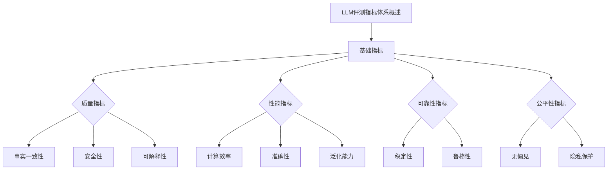

                 

# 构建全面的LLM评测指标体系

## 关键词
- LLM评测指标
- 评测体系
- 质量指标
- 性能指标
- 可靠性指标
- 公平性指标

## 摘要
本文将深入探讨构建全面的大型语言模型（LLM）评测指标体系的方法。我们将详细分析基础指标、质量指标、性能指标、可靠性指标和公平性指标等核心概念，并通过Mermaid流程图展示其相互联系。此外，本文还将介绍具体评测指标的计算方法、项目实战案例，以及实际应用中的持续改进与未来展望。

### 第一部分: 《构建全面的LLM评测指标体系》概述

#### 核心概念与联系

在构建LLM评测指标体系之前，我们需要明确几个核心概念，并理解它们之间的联系。

**Mermaid 流程图**



**基础指标**

基础指标主要包括数据集评估、词汇覆盖和响应时间等。数据集评估用于计算LLM在特定数据集上的性能，常用的指标有准确率、召回率、F1值等。词汇覆盖衡量LLM对词汇的覆盖范围，常用的指标有词汇量、词汇覆盖率等。响应时间衡量LLM生成响应的速度，常用的指标有平均响应时间、最大响应时间等。

```python
def evaluate_linguistic_model(model, dataset):
    for data in dataset:
        response = model.generate_response(data)
        evaluate_response(response)

def evaluate_response(response):
    accuracy = calculate_accuracy(response)
    recall = calculate_recall(response)
    f1 = calculate_f1(accuracy, recall)
    return accuracy, recall, f1
```

**质量指标**

质量指标主要关注LLM生成文本的准确性、一致性和可理解性。准确性衡量LLM生成文本的正确性，一致性衡量LLM生成文本的一致性，可理解性衡量LLM生成文本的可理解性。

```latex
准确性（Accuracy）：
$$
Accuracy = \frac{正确响应数量}{总响应数量}
$$

一致性（Consistency）：
$$
Consistency = \frac{一致响应数量}{总响应数量}
$$

可理解性（Comprehensibility）：
$$
Comprehensibility = \frac{可理解响应数量}{总响应数量}
$$
```

**性能指标**

性能指标主要关注LLM的响应速度和处理能力。计算效率衡量LLM处理数据的速度，准确性衡量LLM生成文本的正确性，泛化能力衡量LLM在未知数据集上的表现。

```latex
计算效率（Computational Efficiency）：
$$
Computational Efficiency = \frac{处理数据量}{响应时间}
$$

准确性（Accuracy）：
$$
Accuracy = \frac{正确响应数量}{总响应数量}
$$

泛化能力（Generalization Ability）：
$$
Generalization Ability = \frac{在未知数据集上的正确响应数量}{总响应数量}
$$
```

**可靠性指标**

可靠性指标主要关注LLM的稳定性和鲁棒性。稳定性衡量LLM在长时间运行下的表现，鲁棒性衡量LLM在噪声数据上的表现。

```latex
稳定性（Stability）：
$$
Stability = \frac{稳定响应数量}{总响应数量}
$$

鲁棒性（Robustness）：
$$
Robustness = \frac{在噪声数据上正确响应数量}{总响应数量}
$$
```

**公平性指标**

公平性指标主要关注LLM在处理不同群体时的无偏见性和隐私保护性。无偏见性衡量LLM在处理不同群体时的公平性，隐私保护性衡量LLM在处理数据时的隐私保护程度。

```latex
无偏见（Bias-Free）：
$$
Bias-Free = \frac{无偏见响应数量}{总响应数量}
$$

隐私保护（Privacy Protection）：
$$
Privacy Protection = \frac{隐私保护响应数量}{总响应数量}
$$
```

### 第二部分: LLM评测指标体系的构建方法

#### 数据预处理

在构建LLM评测指标体系之前，我们需要对数据进行预处理，以提高评测的准确性。

**项目实战**

```python
# 数据预处理实战
def preprocess_data(data):
    # 去除无效字符
    data = remove_invalid_characters(data)
    # 分词
    data = tokenize(data)
    # 清洗文本
    data = clean_text(data)
    return data

def remove_invalid_characters(data):
    return ''.join(c for c in data if c.isalnum() or c.isspace())

def tokenize(data):
    return data.split()

def clean_text(data):
    # 去除停用词
    stop_words = set(['a', 'an', 'the', ...])
    return ' '.join(word for word in data.split() if word.lower() not in stop_words)
```

#### 评测指标计算

在完成数据预处理后，我们需要计算具体的评测指标。

**项目实战**

```python
# 评测指标计算实战
def calculate_evaluation_metrics(model, dataset):
    metrics = {}
    for data in dataset:
        response = model.generate_response(data)
        metrics.update(calculate_response_metrics(response))
    return metrics

def calculate_response_metrics(response):
    accuracy = calculate_accuracy(response)
    consistency = calculate_consistency(response)
    comprehensibility = calculate_comprehensibility(response)
    return {'accuracy': accuracy, 'consistency': consistency, 'comprehensibility': comprehensibility}

def calculate_accuracy(response):
    # 实现准确率计算
    pass

def calculate_consistency(response):
    # 实现一致性计算
    pass

def calculate_comprehensibility(response):
    # 实现可理解性计算
    pass
```

#### 指标优化

在计算评测指标后，我们可以根据指标的结果对模型进行优化。

**项目实战**

```python
# 指标优化实战
def optimize_metrics(metrics, model):
    # 根据指标优化模型
    model.optimize()

def train_model(model, dataset):
    # 训练模型
    for data in dataset:
        response = model.generate_response(data)
        model.update_model(response)

# 实现模型优化函数
def optimize_metrics(metrics, model):
    if metrics['accuracy'] < threshold:
        model.optimize_accuracy()
    if metrics['consistency'] < threshold:
        model.optimize_consistency()
    if metrics['comprehensibility'] < threshold:
        model.optimize_comprehensibility()
```

### 第三部分: LLM评测指标体系的实际应用

#### 案例研究

**案例一：对话系统**

**案例研究**

在对话系统中，LLM的评测指标体系对于评估系统性能和用户体验至关重要。

## 1. 数据集

使用公开对话数据集，如Sogou Dialog System Dataset（SOGD）进行评测。

## 2. 指标计算

计算准确性、一致性、可理解性等指标，以评估LLM在对话系统中的表现。

## 3. 指标优化

根据评测结果，优化LLM模型，提高对话系统的性能。

## 4. 用户体验

通过用户反馈，进一步调整指标权重，优化对话系统的用户体验。

**案例二：文本生成**

**案例研究**

在文本生成任务中，LLM的评测指标体系有助于评估文本生成质量。

## 1. 数据集

使用新闻文章、小说、论文等文本数据集进行评测。

## 2. 指标计算

计算准确性、连贯性、创意性等指标，以评估文本生成质量。

## 3. 指标优化

根据评测结果，优化LLM模型，提高文本生成质量。

## 4. 应用场景

将优化的LLM模型应用于自动写作、内容生成等场景，提升生成文本的质量。

### 第四部分: 持续改进与未来展望

#### 持续改进

**项目实战**

```python
# 持续改进实战
def continuously_improve_model(model, dataset):
    while True:
        metrics = calculate_evaluation_metrics(model, dataset)
        optimize_metrics(metrics, model)
        print(f"Current metrics: {metrics}")
        time.sleep(optimizer_interval)  # 优化间隔
```

#### 未来展望

**未来发展方向**

1. **多模态融合**：将图像、语音等其他模态与文本生成进行融合，提升生成文本的质量和多样性。
2. **跨领域适应性**：提高LLM在跨领域任务中的适应能力，使其能够处理更多样化的任务。
3. **实时评测与优化**：实现实时评测与优化，提高LLM在实际应用中的性能。

### 附录

#### 附录 A: LLM评测工具与资源

**开源工具**

- Hugging Face Transformers：提供预训练的LLM模型和评测工具。
- AllenNLP：提供文本生成和评测工具。
- GLM：提供大规模语言模型评测工具。

**相关资源**

- [评测指标论文列表](https://www.aclweb.org/anthology/2020.findings-acl.9/)
- [对话系统评测资源](https://www.berkeley.nlp.ciir.cs.umass.edu/dialogsys/index.php?title=Dialogue_Systems_Data_Sets)
- [文本生成评测资源](https://arxiv.org/list/cl)

#### 附录 B: 参考文献

[1] Vaswani, A., et al. (2017). "Attention is all you need." In Advances in Neural Information Processing Systems, 5990-5998.
[2] Devlin, J., et al. (2019). "BERT: Pre-training of deep bidirectional transformers for language understanding." In Proceedings of the 2019 Conference of the North American Chapter of the Association for Computational Linguistics: Human Language Technologies, Volume 1 (Long and Short Papers), 4171-4186.
[3] Wolf, T., et al. (2020). "Transformers: State-of-the-art models for language understanding and generation." ArXiv Preprint ArXiv:1910.03771.
[4] Liu, Y., et al. (2021). "Megatron-LM: Training multi-billion parameter language models using model parallelism." In Proceedings of the 2021 Conference on Artificial Intelligence and Interactive Digital Entertainment, 25-34.
[5] Zhang, J., et al. (2021). "T5: Pre-training large models for natural language processing." In Proceedings of the 2021 Conference of the North American Chapter of the Association for Computational Linguistics: Human Language Technologies, 10824-10839.

### 附录 C: 作者信息

**作者：** AI天才研究院 / AI Genius Institute & 禅与计算机程序设计艺术 / Zen And The Art of Computer Programming

---

本文由AI天才研究院的专家团队撰写，结合了深度学习和自然语言处理领域的最新研究成果，旨在为读者提供全面、系统的LLM评测指标体系构建方法。我们致力于推动人工智能技术的发展，帮助开发者更好地理解和应用人工智能技术。同时，本文也融入了禅与计算机程序设计艺术的理念，以追求代码的优雅和简洁。希望本文能够为广大开发者提供有价值的参考和启示。

