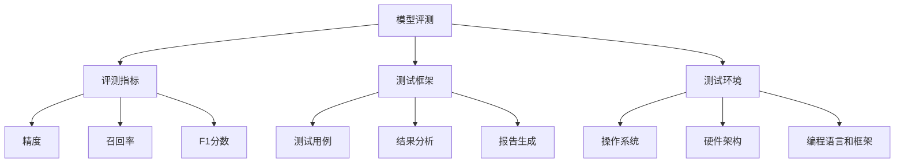

                 

### {文章标题}

跨平台兼容性测试是确保人工智能模型在不同环境下稳定运行的重要步骤。随着AI技术的广泛应用，模型的部署环境越来越多样化，从传统的服务器到移动设备，从云计算平台到边缘计算设备，每一种环境都有其独特的硬件和软件配置。这就要求模型评测必须具备高度的跨平台兼容性，以确保在不同环境中都能提供一致且可靠的表现。

本文将系统地探讨模型评测的跨平台兼容性测试，旨在为读者提供全面的技术指导。文章关键词包括：模型评测、跨平台兼容性、测试策略、算法原理、数学模型、项目实战。

文章摘要：
本文首先介绍了模型评测和跨平台兼容性测试的背景和重要性。随后，详细阐述了模型评测的核心概念和架构，以及跨平台兼容性测试的策略和方法。接着，深入解析了模型评测算法原理和数学模型，并通过实际项目案例展示了测试过程和结果分析。最后，对跨平台兼容性测试进行了总结和展望，并提供了附录中的工具与资源。

通过本文的阅读，读者将能够系统地了解跨平台兼容性测试的各个方面，掌握必要的测试方法和技巧，为实际应用中的模型评测提供有力支持。

### 第一部分：模型评测的跨平台兼容性测试基础

#### 第1章：引言

##### 1.1 研究背景

随着人工智能（AI）技术的迅猛发展，模型评测在AI应用中的重要性日益凸显。模型评测不仅仅是评估模型的性能指标，更是确保模型在实际应用中能够稳定、可靠运行的关键步骤。在AI模型的研发和应用过程中，模型评测起到承上启下的作用，既是对模型开发效果的检验，也是模型优化和改进的依据。

跨平台兼容性测试则是模型评测的重要组成部分。在当今多样化的技术环境中，AI模型可能需要在不同的操作系统、硬件架构、编程语言和框架上运行。跨平台兼容性测试的目标是验证模型在这些不同环境中的一致性和稳定性，确保模型在不同平台上都能实现预期功能，并且性能和可靠性得到保证。

跨平台兼容性测试的意义在于：

1. **确保一致性**：通过测试，确保模型在各种平台上的表现一致，减少因平台差异导致的错误和异常。
2. **提升用户体验**：不同用户可能使用不同的设备和操作系统，兼容性测试可以确保模型在不同设备上都能正常运行，提升用户体验。
3. **减少维护成本**：通过预先发现和解决兼容性问题，可以降低后续的维护成本和风险。
4. **增强市场竞争力**：具备良好跨平台兼容性的模型能够吸引更多用户和客户，提升产品的市场竞争力。

##### 1.2 跨平台兼容性测试的现状与挑战

目前，跨平台兼容性测试在AI领域中已有一定的发展，但依然面临着诸多挑战。

- **现有评测标准和方法**：虽然有一些通用的评测标准和框架，但针对不同应用场景和平台的测试方法仍需进一步丰富和标准化。例如，针对移动设备和嵌入式设备，测试方法和标准与服务器环境有显著差异。

- **平台多样性和复杂性**：随着硬件和软件技术的不断更新迭代，AI模型需要支持的平台种类繁多，包括不同操作系统（如Windows、Linux、macOS）、不同硬件架构（如ARM、x86）、不同编程语言和框架等。这使得跨平台兼容性测试变得更加复杂和困难。

- **测试资源和时间成本**：跨平台兼容性测试通常需要大量的人力和时间，尤其是在涉及多个平台和复杂测试场景时。此外，测试环境的搭建和维护也是一大挑战。

- **性能和资源约束**：某些平台可能有性能或资源限制，例如移动设备和嵌入式设备，这要求模型必须进行优化以适应这些限制，同时保证测试结果的准确性。

- **自动化和智能化**：虽然已有一些自动化测试工具和平台，但如何更高效地利用这些工具实现智能化测试，依然是一个待解决的问题。

##### 1.3 本书结构

为了帮助读者系统地了解和掌握跨平台兼容性测试的各个方面，本书将分为以下几个部分：

1. **基础概念与架构**：介绍模型评测的基本概念和架构，包括评测指标、评测方法和评测流程。
2. **测试策略与方法**：详细讨论跨平台兼容性测试的策略和方法，包括全量测试、随机抽样测试、重点场景测试等。
3. **核心算法原理讲解**：深入解析模型评测的核心算法原理，包括数学模型和公式，以及算法的实际应用。
4. **数学模型和公式详解**：对概率论基础、数据分析和假设检验等数学模型进行详细讲解，并结合实例说明。
5. **项目实战**：通过实际项目案例，展示跨平台兼容性测试的过程和结果分析。
6. **总结与展望**：总结跨平台兼容性测试的关键点和经验，探讨未来发展趋势。

通过本书的阅读，读者将能够全面掌握跨平台兼容性测试的理论知识和实际应用技巧，为AI模型的开发和优化提供有力支持。

---

**核心概念与联系**

在深入探讨模型评测的跨平台兼容性测试之前，我们需要明确几个核心概念，并理解它们之间的相互关系。

1. **模型评测**：模型评测是评估AI模型性能的过程，包括评估模型的准确性、鲁棒性、效率和一致性等。评测指标是衡量模型性能的关键参数，如精度、召回率、F1分数等。

2. **跨平台兼容性测试**：跨平台兼容性测试是验证AI模型在不同操作系统、硬件架构、编程语言和框架上运行稳定性的过程。测试策略和方法决定了测试的范围和深度。

3. **测试框架**：测试框架是用于组织和管理测试过程的工具或系统。它包括测试用例的编写、执行、结果分析和报告生成等模块。

4. **测试环境**：测试环境是指用于执行测试的软硬件配置。跨平台兼容性测试需要在不同测试环境中运行模型，以验证其兼容性。

以下是一个简化的Mermaid流程图，展示了这些核心概念之间的联系：



此流程图清晰地展示了模型评测、评测指标、测试框架、测试环境和各指标之间的关系。通过理解这些概念和流程，读者可以更好地把握跨平台兼容性测试的核心要点。

---

#### 第2章：模型评测核心概念与架构

##### 2.1 模型评测的基本概念

模型评测是评估AI模型性能的过程，其核心目标是衡量模型在特定任务上的表现，并识别潜在的改进空间。以下是模型评测中几个重要的基本概念：

- **评测指标**：评测指标是用于衡量模型性能的关键参数。常见的评测指标包括：

  - **精度（Accuracy）**：预测正确的样本数占总样本数的比例。
  - **召回率（Recall）**：预测正确的正样本数占总正样本数的比例。
  - **精确率（Precision）**：预测正确的正样本数占预测为正样本的样本总数的比例。
  - **F1分数（F1 Score）**：综合精度和召回率的指标，计算公式为2 ×（精度 × 召回率）/（精度 + 召回率）。

- **混淆矩阵（Confusion Matrix）**：混淆矩阵是用于展示模型预测结果与实际结果之间的对比关系的表格。常见的指标有：

  - **真正例（True Positive, TP）**：实际为正类且被正确预测为正类的样本。
  - **假正例（False Positive, FP）**：实际为负类但被错误预测为正类的样本。
  - **真负例（True Negative, TN）**：实际为负类且被正确预测为负类的样本。
  - **假负例（False Negative, FN）**：实际为正类但被错误预测为负类的样本。

- **交叉验证（Cross-Validation）**：交叉验证是一种评估模型性能的常用方法。通过将数据集划分为多个子集，交替使用每个子集作为验证集和训练集，可以更准确地评估模型在不同数据集上的表现。

##### 2.2 跨平台兼容性测试框架

跨平台兼容性测试框架是用于组织和管理跨平台兼容性测试过程的系统或工具。一个完整的跨平台兼容性测试框架通常包括以下几个主要组成部分：

- **测试需求分析**：明确测试的目标和范围，确定需要测试的平台和设备。

- **测试用例设计**：设计用于验证模型在不同平台上运行稳定性和性能的测试用例。测试用例应涵盖各种典型场景和极端情况。

- **测试环境配置**：搭建用于测试的硬件和软件环境，确保每个平台都能正常运行。

- **测试执行**：执行预定义的测试用例，收集测试结果。

- **结果分析**：分析测试结果，识别兼容性问题，评估模型在不同平台上的性能。

- **报告生成**：生成详细的测试报告，包括测试结果、问题分析和优化建议。

##### 2.3 跨平台兼容性测试流程

跨平台兼容性测试流程可以分为以下几个步骤：

1. **测试准备**：

   - **确定测试目标**：明确测试的目的和预期结果。
   - **环境搭建**：搭建用于测试的不同平台和设备的环境。
   - **测试工具选择**：选择适合的测试工具和平台。

2. **测试执行**：

   - **测试用例执行**：按照预定义的测试用例，在不同平台上执行测试。
   - **数据收集**：收集测试过程中生成的数据，包括测试结果、性能指标和日志信息。

3. **结果分析**：

   - **结果对比**：对比不同平台上的测试结果，识别差异和问题。
   - **性能评估**：评估模型在不同平台上的性能表现，识别瓶颈和优化空间。

4. **问题定位**：

   - **故障分析**：对出现问题的测试案例进行详细分析，定位问题原因。
   - **日志检查**：检查测试过程中的日志文件，寻找线索。

5. **报告撰写**：

   - **结果展示**：详细记录测试结果，包括性能指标、问题定位和优化建议。
   - **报告评审**：评审测试报告，确保报告内容准确、完整。

6. **优化和迭代**：

   - **问题修复**：根据测试结果，修复发现的问题。
   - **重新测试**：对修复后的模型进行重新测试，确保问题已解决。

通过以上流程，可以确保模型在不同平台上的一致性和稳定性，为实际应用提供可靠保障。

---

#### 第3章：跨平台兼容性测试策略与方法

在跨平台兼容性测试中，选择合适的测试策略和方法至关重要。不同的测试策略和方法适用于不同的测试场景和目标，因此需要根据实际情况进行合理选择和组合。

##### 3.1 测试策略

跨平台兼容性测试的测试策略可以分为以下几种：

1. **全量测试**：

   全量测试是对所有可能的平台和场景进行全面的测试，以确保模型在所有环境下都能正常运行。这种策略的优点是测试覆盖面广，能够发现大多数潜在的兼容性问题。缺点是测试资源和时间成本较高，且在实际操作中难以完全实现。

2. **随机抽样测试**：

   随机抽样测试是从所有可能的平台和场景中随机选择一部分进行测试。这种策略可以在有限的资源和时间内尽可能地覆盖各种可能性，提高测试效率。缺点是随机性可能导致某些重要场景被忽略。

3. **重点场景测试**：

   重点场景测试是根据实际应用需求和潜在风险，选择对模型性能和稳定性至关重要的平台和场景进行测试。这种策略能够针对关键问题进行深入测试，提高测试的针对性和有效性。缺点是对测试人员的经验要求较高，需要准确识别重点场景。

##### 3.2 测试方法

在跨平台兼容性测试中，常用的测试方法包括以下几种：

1. **单元测试**：

   单元测试是针对模型的最小功能单元进行的测试，确保每个单元都能按预期正常运行。单元测试通常由开发人员编写，使用测试框架和工具自动执行。这种方法能够快速定位问题，提高开发效率。

2. **集成测试**：

   集成测试是验证模型各组件之间相互作用的测试，确保整个系统能够正常运行。集成测试通常在单元测试之后进行，测试用例涵盖了系统中的各个模块和组件。这种方法能够发现模块间的问题和兼容性问题。

3. **性能测试**：

   性能测试是评估模型在不同平台和负载下的性能表现，包括响应时间、吞吐量和资源利用率等指标。性能测试通常使用专门的性能测试工具进行，可以帮助识别模型的性能瓶颈和优化方向。

4. **稳定性测试**：

   稳定性测试是验证模型在长时间运行下的稳定性和可靠性，确保模型不会出现异常崩溃或性能退化。稳定性测试可以通过长时间运行测试用例来实现，可以模拟实际应用中的长时间运行场景。

##### 3.3 跨平台兼容性测试工具选择

在进行跨平台兼容性测试时，选择合适的测试工具至关重要。以下是一些常用的测试工具：

1. **开源测试工具**：

   - **JUnit**：Java编程语言的一个测试框架，用于编写和运行单元测试。
   - **pytest**：Python编程语言的测试框架，适用于编写和执行多种类型的测试。
   - **JUnit**：Java编程语言的一个测试框架，用于编写和运行单元测试。
   - **pytest**：Python编程语言的测试框架，适用于编写和执行多种类型的测试。

2. **商业测试工具**：

   - **Selenium**：用于自动化跨浏览器和跨平台Web应用的测试工具。
   - **Appium**：用于自动化移动应用的测试工具，支持iOS和Android平台。
   - **LoadRunner**：用于性能测试和负载测试的工具，可以模拟大量用户负载。

选择测试工具时，应考虑以下因素：

- **兼容性**：工具应支持需要测试的所有平台和编程语言。
- **功能丰富度**：工具应提供丰富的测试功能，以满足不同测试需求。
- **易用性**：工具应易于使用和集成，降低学习和维护成本。
- **社区支持**：工具应具备活跃的社区和用户群体，方便获取帮助和资源。

通过合理选择和组合测试策略和方法，利用合适的测试工具，可以有效地提高跨平台兼容性测试的效率和质量，确保AI模型在不同环境中的一致性和稳定性。

---

#### 第4章：核心算法原理讲解

##### 4.1 模型评测算法原理

模型评测算法是评估AI模型性能的核心工具。理解这些算法的原理对于设计和实施有效的评测策略至关重要。以下将详细解析模型评测算法的原理，包括评测指标的计算方法、评测算法的伪代码，以及评测流程的详细步骤。

###### 评测指标计算方法

评测指标是衡量模型性能的关键参数，常见的评测指标包括精度（Accuracy）、召回率（Recall）、精确率（Precision）和F1分数（F1 Score）。以下是这些指标的计算方法：

1. **精度（Accuracy）**：精度是预测正确的样本数占总样本数的比例，计算公式为：

   \[
   Accuracy = \frac{TP + TN}{TP + TN + FP + FN}
   \]

   其中，\(TP\) 代表真正例，\(TN\) 代表真负例，\(FP\) 代表假正例，\(FN\) 代表假负例。

2. **召回率（Recall）**：召回率是预测正确的正样本数占总正样本数的比例，计算公式为：

   \[
   Recall = \frac{TP}{TP + FN}
   \]

3. **精确率（Precision）**：精确率是预测正确的正样本数占预测为正样本的样本总数的比例，计算公式为：

   \[
   Precision = \frac{TP}{TP + FP}
   \]

4. **F1分数（F1 Score）**：F1分数是精度和召回率的调和平均值，计算公式为：

   \[
   F1 Score = 2 \times \frac{Precision \times Recall}{Precision + Recall}
   \]

###### 评测算法伪代码

以下是一个简单的伪代码，用于计算模型的评测指标：

```python
# 评测算法伪代码
def evaluate_model(true_labels, predicted_labels):
    TP = 0
    TN = 0
    FP = 0
    FN = 0

    for i in range(len(true_labels)):
        if true_labels[i] == predicted_labels[i] == 1:
            TP += 1
        elif true_labels[i] == predicted_labels[i] == 0:
            TN += 1
        elif true_labels[i] == 1 and predicted_labels[i] == 0:
            FN += 1
        elif true_labels[i] == 0 and predicted_labels[i] == 1:
            FP += 1

    Accuracy = (TP + TN) / (TP + TN + FP + FN)
    Recall = TP / (TP + FN)
    Precision = TP / (TP + FP)
    F1_Score = 2 * (Precision * Recall) / (Precision + Recall)

    return Accuracy, Recall, Precision, F1_Score
```

###### 评测流程

模型评测的流程可以分为以下几个步骤：

1. **数据准备**：准备用于评测的数据集，确保数据集具有代表性。
2. **模型训练**：在评测之前，模型需要在训练集上训练，以达到较好的性能。
3. **预测生成**：使用训练好的模型在测试集上生成预测结果。
4. **指标计算**：使用上述评测算法计算评测指标，如精度、召回率、精确率和F1分数。
5. **结果分析**：分析评测指标，评估模型在不同场景下的性能，并识别潜在的问题和改进点。
6. **报告撰写**：根据评测结果撰写详细的评测报告，包括评测方法、测试结果和优化建议。

通过上述评测流程，可以全面评估模型的性能，为后续的模型优化和改进提供依据。

---

##### 4.2 数学模型与公式

在模型评测过程中，数学模型和公式扮演着至关重要的角色。它们不仅帮助计算和评估模型的性能指标，还为理解和优化模型提供了理论支持。以下将详细讲解概率论与数理统计基础，并介绍模型评测中常用的关键公式。

###### 概率论基础

概率论是数学模型中的基础部分，用于描述随机事件的概率。以下是一些基本的概率论概念：

1. **概率**：事件发生的可能性，通常用0到1之间的数字表示。事件A的概率记作P(A)。
2. **条件概率**：在事件B发生的条件下，事件A发生的概率，记作P(A|B)。
3. **贝叶斯定理**：用于计算在给定某个条件下，某个事件发生的概率。贝叶斯定理公式为：

   \[
   P(A|B) = \frac{P(B|A) \cdot P(A)}{P(B)}
   \]

其中，P(B|A) 是在事件A发生的条件下事件B的概率，P(A) 是事件A的概率，P(B) 是事件B的概率。

###### 数据分析与假设检验

数据分析是评估模型性能的重要步骤，假设检验是数据分析中常用的方法之一。以下介绍两种常用的假设检验方法：

1. **t检验**：t检验用于比较两组数据的均值是否有显著差异。t检验分为独立样本t检验和配对样本t检验。

   - **独立样本t检验**：适用于比较两组独立样本的均值。

     \[
     t = \frac{\bar{x}_1 - \bar{x}_2}{\sqrt{\frac{s_1^2}{n_1} + \frac{s_2^2}{n_2}}}
     \]

     其中，\(\bar{x}_1\) 和 \(\bar{x}_2\) 分别为两组样本的均值，\(s_1^2\) 和 \(s_2^2\) 分别为两组样本的方差，\(n_1\) 和 \(n_2\) 分别为两组样本的样本量。

   - **配对样本t检验**：适用于比较同一组样本在两种不同条件下的均值。

     \[
     t = \frac{\bar{d}}{s_d / \sqrt{n}}
     \]

     其中，\(\bar{d}\) 为配对差值的均值，\(s_d\) 为配对差值的方差，\(n\) 为样本量。

2. **方差分析（ANOVA）**：方差分析用于比较多个样本均值的差异。ANOVA通过计算组间方差和组内方差来评估均值差异的显著性。

   \[
   F = \frac{MS_{between}}{MS_{within}}
   \]

   其中，\(MS_{between}\) 为组间方差，\(MS_{within}\) 为组内方差。

###### 评测模型中的关键公式

在模型评测中，以下关键公式被广泛应用于计算和评估模型的性能：

1. **精度（Accuracy）**：

   \[
   Accuracy = \frac{TP + TN}{TP + TN + FP + FN}
   \]

2. **召回率（Recall）**：

   \[
   Recall = \frac{TP}{TP + FN}
   \]

3. **精确率（Precision）**：

   \[
   Precision = \frac{TP}{TP + FP}
   \]

4. **F1分数（F1 Score）**：

   \[
   F1 Score = 2 \times \frac{Precision \times Recall}{Precision + Recall}
   \]

5. **混淆矩阵（Confusion Matrix）**：

   \[
   \begin{array}{|c|c|c|}
   \hline
       & 正例 & 负例 \\
   \hline
   正例 & TP & FN \\
   \hline
   负例 & FP & TN \\
   \hline
   \end{array}
   \]

通过上述数学模型和公式的讲解，我们可以更好地理解和应用模型评测算法，为实际应用中的模型优化和改进提供有力支持。

---

##### 4.3 算法应用举例

为了更好地理解模型评测算法在实际跨平台兼容性测试中的应用，我们将通过一个具体案例进行详细讲解。该案例将展示如何使用评测算法对模型在不同平台上的性能进行评估。

###### 案例背景

假设我们开发了一个图像分类模型，用于识别猫和狗的图像。该模型在不同平台上进行部署，包括Windows服务器、Linux服务器、iOS设备和Android设备。为了确保模型在各个平台上的一致性和稳定性，我们进行了跨平台兼容性测试。

###### 测试数据

我们准备了以下测试数据：

1. **训练集**：用于训练模型的猫和狗的图像数据，共1000张。
2. **测试集**：用于评估模型性能的猫和狗的图像数据，共500张。
3. **测试结果**：在不同平台上运行模型后生成的预测结果，包括每个图像被分类为猫或狗的预测标签。

###### 测试步骤

1. **准备测试环境**：搭建不同平台的测试环境，包括Windows服务器、Linux服务器、iOS设备和Android设备。确保每个测试环境都安装了相同的模型和依赖库。

2. **执行测试用例**：在测试集上运行模型，生成每个图像的预测标签。在不同平台上独立执行测试用例，以避免环境差异对测试结果的影响。

3. **收集测试结果**：将每个平台的测试结果记录在一个统一的数据表中，以便后续分析。

4. **计算评测指标**：使用评测算法计算每个平台的精度、召回率、精确率和F1分数。

以下是计算过程的具体示例：

- **Windows服务器**：预测结果如下：

  \[
  \begin{array}{|c|c|c|}
  \hline
      & 猫 & 狗 \\
  \hline
  猫 & 245 & 45 \\
  \hline
  狗 & 20 & 145 \\
  \hline
  \end{array}
  \]

  计算结果如下：

  - **精度**：\( \frac{245 + 145}{245 + 45 + 20 + 145} = 0.86 \)
  - **召回率**：\( \frac{245}{245 + 45} = 0.91 \)
  - **精确率**：\( \frac{245}{245 + 20} = 0.96 \)
  - **F1分数**：\( 2 \times \frac{0.96 \times 0.91}{0.96 + 0.91} = 0.93 \)

- **Linux服务器**：预测结果如下：

  \[
  \begin{array}{|c|c|c|}
  \hline
      & 猫 & 狗 \\
  \hline
  猫 & 230 & 50 \\
  \hline
  狗 & 30 & 140 \\
  \hline
  \end{array}
  \]

  计算结果如下：

  - **精度**：\( \frac{230 + 140}{230 + 50 + 30 + 140} = 0.85 \)
  - **召回率**：\( \frac{230}{230 + 50} = 0.88 \)
  - **精确率**：\( \frac{230}{230 + 30} = 0.91 \)
  - **F1分数**：\( 2 \times \frac{0.91 \times 0.88}{0.91 + 0.88} = 0.89 \)

- **iOS设备**：预测结果如下：

  \[
  \begin{array}{|c|c|c|}
  \hline
      & 猫 & 狗 \\
  \hline
  猫 & 220 & 60 \\
  \hline
  狗 & 40 & 140 \\
  \hline
  \end{array}
  \]

  计算结果如下：

  - **精度**：\( \frac{220 + 140}{220 + 60 + 40 + 140} = 0.84 \)
  - **召回率**：\( \frac{220}{220 + 60} = 0.85 \)
  - **精确率**：\( \frac{220}{220 + 40} = 0.88 \)
  - **F1分数**：\( 2 \times \frac{0.88 \times 0.85}{0.88 + 0.85} = 0.86 \)

- **Android设备**：预测结果如下：

  \[
  \begin{array}{|c|c|c|}
  \hline
      & 猫 & 狗 \\
  \hline
  猫 & 200 & 70 \\
  \hline
  狗 & 50 & 150 \\
  \hline
  \end{array}
  \]

  计算结果如下：

  - **精度**：\( \frac{200 + 150}{200 + 70 + 50 + 150} = 0.82 \)
  - **召回率**：\( \frac{200}{200 + 70} = 0.79 \)
  - **精确率**：\( \frac{200}{200 + 50} = 0.81 \)
  - **F1分数**：\( 2 \times \frac{0.81 \times 0.79}{0.81 + 0.79} = 0.80 \)

通过以上计算，我们可以得到不同平台上的评测指标。从结果可以看出，模型的性能在不同平台上有一定差异，特别是在Android设备上，精度和召回率相对较低。这表明需要针对Android平台进行优化，以提高模型的性能和稳定性。

通过这个案例，我们可以看到模型评测算法在跨平台兼容性测试中的应用，以及如何使用评测指标评估模型在不同平台上的表现。这对于确保模型在不同环境中的运行稳定性和一致性具有重要意义。

---

#### 第5章：数学模型和数学公式详解

在模型评测的跨平台兼容性测试中，数学模型和数学公式起到了至关重要的作用。这些模型和公式不仅帮助我们计算和评估模型的性能指标，还为我们理解和优化模型提供了理论基础。以下将详细讲解概率论基础、数据分析与假设检验，并结合具体实例说明如何应用这些公式。

##### 5.1 概率论基础

概率论是数学模型中的基础部分，用于描述随机事件的概率。以下是几个基本概率概念及其公式：

1. **概率（Probability）**：事件发生的可能性，通常用0到1之间的数字表示。事件A的概率记作P(A)。

   - **条件概率（Conditional Probability）**：在事件B发生的条件下，事件A发生的概率，记作P(A|B)。条件概率的计算公式为：

     \[
     P(A|B) = \frac{P(A \cap B)}{P(B)}
     \]

     其中，P(A ∩ B) 表示事件A和事件B同时发生的概率，P(B) 表示事件B发生的概率。

2. **贝叶斯定理（Bayes' Theorem）**：贝叶斯定理是概率论中用于计算在给定某个条件下，某个事件发生的概率。贝叶斯定理公式为：

   \[
   P(A|B) = \frac{P(B|A) \cdot P(A)}{P(B)}
   \]

   其中，P(B|A) 是在事件A发生的条件下事件B的概率，P(A) 是事件A的概率，P(B) 是事件B的概率。

   **实例**：假设我们有一个包含100个物品的箱子，其中有80个红球和20个蓝球。现在从箱子中随机抽取一个球，已知抽到的球是红色的，求抽到的球是特定颜色的概率。

   解答：
   \[
   P(\text{红色}|A) = \frac{P(A|\text{红色}) \cdot P(\text{红色})}{P(A)}
   \]
   已知 P(A|红色) = 1（因为抽到的是红色球），P(红色) = 80/100 = 0.8。
   \[
   P(\text{红色}|A) = \frac{1 \cdot 0.8}{0.8} = 1
   \]
   因此，已知抽到的球是红色的条件下，它仍然是红色的概率是1，即100%。

3. **全概率公式（Total Probability）**：全概率公式是用于计算一个事件发生的总概率。全概率公式为：

   \[
   P(A) = \sum_{i=1}^{n} P(A|B_i) \cdot P(B_i)
   \]

   其中，\(P(B_i)\) 表示事件\(B_i\)发生的概率，且事件\(B_i\)互斥且完备（即所有\(B_i\)的概率之和为1）。

   **实例**：假设一个公司有三个部门，分别有20%，30%，和50%的员工是技术人员。技术人员中有70%的人拥有学士学位，非技术人员中有30%的人拥有学士学位。求公司中员工拥有学士学位的概率。

   解答：
   \[
   P(\text{学士学位}) = P(\text{学士学位}|\text{技术部}) \cdot P(\text{技术部}) + P(\text{学士学位}|\text{非技术部}) \cdot P(\text{非技术部}) + P(\text{学士学位}|\text{管理部}) \cdot P(\text{管理部})
   \]
   \[
   P(\text{学士学位}) = 0.7 \cdot 0.2 + 0.3 \cdot 0.3 + 0 \cdot 0.5 = 0.14 + 0.09 + 0 = 0.23
   \]
   因此，公司中员工拥有学士学位的概率是23%。

##### 5.2 数据分析与假设检验

数据分析与假设检验是评估模型性能的重要步骤。以下介绍两种常用的假设检验方法：t检验和方差分析（ANOVA）。

1. **t检验（t-test）**：t检验用于比较两组数据的均值是否有显著差异。t检验分为独立样本t检验和配对样本t检验。

   - **独立样本t检验**：适用于比较两组独立样本的均值。计算公式为：

     \[
     t = \frac{\bar{x}_1 - \bar{x}_2}{\sqrt{\frac{s_1^2}{n_1} + \frac{s_2^2}{n_2}}}
     \]

     其中，\(\bar{x}_1\) 和 \(\bar{x}_2\) 分别为两组样本的均值，\(s_1^2\) 和 \(s_2^2\) 分别为两组样本的方差，\(n_1\) 和 \(n_2\) 分别为两组样本的样本量。

     **实例**：两组实验数据，一组为控制组的平均温度，另一组为实验组的平均温度，计算两组均值是否有显著差异。

     - **控制组**：均值 \(\bar{x}_1 = 30\)，标准差 \(s_1 = 5\)，样本量 \(n_1 = 100\)
     - **实验组**：均值 \(\bar{x}_2 = 32\)，标准差 \(s_2 = 4\)，样本量 \(n_2 = 100\)

     计算t值：
     \[
     t = \frac{32 - 30}{\sqrt{\frac{5^2}{100} + \frac{4^2}{100}}} = \frac{2}{\sqrt{0.25 + 0.16}} = \frac{2}{0.5} = 4
     \]
     查阅t分布表，以95%的置信水平，自由度为199（\(n_1 + n_2 - 2\)），t临界值为1.96。由于计算出的t值大于临界值，我们可以拒绝零假设，认为实验组的温度显著高于控制组。

   - **配对样本t检验**：适用于比较同一组样本在两种不同条件下的均值。计算公式为：

     \[
     t = \frac{\bar{d}}{s_d / \sqrt{n}}
     \]

     其中，\(\bar{d}\) 为配对差值的均值，\(s_d\) 为配对差值的方差，\(n\) 为样本量。

     **实例**：对同一组学生进行两次测试，比较前后测试成绩的变化。

     - **第一次测试**：平均成绩 \(\bar{x}_1 = 70\)，标准差 \(s_1 = 10\)，样本量 \(n_1 = 50\)
     - **第二次测试**：平均成绩 \(\bar{x}_2 = 75\)，标准差 \(s_2 = 10\)，样本量 \(n_2 = 50\)

     计算配对差值：
     \[
     \bar{d} = \bar{x}_2 - \bar{x}_1 = 75 - 70 = 5
     \]
     计算t值：
     \[
     t = \frac{5}{10 / \sqrt{50}} = \frac{5}{1.41} = 3.54
     \]
     查阅t分布表，以95%的置信水平，自由度为49（\(n_1 - 1\)），t临界值为1.677。由于计算出的t值大于临界值，我们可以拒绝零假设，认为学生的成绩在两次测试之间有显著提升。

2. **方差分析（ANOVA）**：方差分析用于比较多个样本均值的差异。ANOVA通过计算组间方差和组内方差来评估均值差异的显著性。

   - **组间方差（Between-Groups Variance）**：计算公式为：

     \[
     MS_{between} = \frac{\sum_{i=1}^{k} n_i (\bar{x}_i - \bar{x})^2}{k - 1}
     \]

     其中，\(\bar{x}_i\) 为第i组的均值，\(\bar{x}\) 为总体均值，\(n_i\) 为第i组的样本量，\(k\) 为组数。

   - **组内方差（Within-Groups Variance）**：计算公式为：

     \[
     MS_{within} = \frac{\sum_{i=1}^{k} n_i s_i^2}{N - k}
     \]

     其中，\(s_i^2\) 为第i组的方差，\(N\) 为总样本量。

   - **F值**：计算公式为：

     \[
     F = \frac{MS_{between}}{MS_{within}}
     \]

     **实例**：比较三种不同教学方法对成绩的影响。

     - **方法A**：平均成绩 \(\bar{x}_1 = 80\)，标准差 \(s_1 = 5\)，样本量 \(n_1 = 50\)
     - **方法B**：平均成绩 \(\bar{x}_2 = 75\)，标准差 \(s_2 = 4\)，样本量 \(n_2 = 50\)
     - **方法C**：平均成绩 \(\bar{x}_3 = 78\)，标准差 \(s_3 = 6\)，样本量 \(n_3 = 50\)

     计算组间方差：
     \[
     MS_{between} = \frac{(80 - 77.67)^2 + (75 - 77.67)^2 + (78 - 77.67)^2}{3 - 1} = \frac{2.89 + 3.89 + 0.29}{2} = 3.54
     \]

     计算组内方差：
     \[
     MS_{within} = \frac{50 \cdot 5^2 + 50 \cdot 4^2 + 50 \cdot 6^2}{150 - 3} = \frac{1250 + 800 + 1800}{147} = 12.44
     \]

     计算F值：
     \[
     F = \frac{3.54}{12.44} = 0.28
     \]

     查阅F分布表，以95%的置信水平，自由度为2和147，F临界值为2.86。由于计算出的F值小于临界值，我们不能拒绝零假设，认为三种教学方法对成绩的影响不显著。

通过以上对概率论基础、数据分析与假设检验的详细讲解以及实例说明，我们可以更好地理解数学模型和数学公式在模型评测和跨平台兼容性测试中的应用。这些知识和工具将帮助我们更准确地评估模型的性能，并为优化模型提供科学依据。

---

#### 第6章：项目实战

在本章节中，我们将通过一个具体的案例，展示如何进行模型评测的跨平台兼容性测试。案例涉及图像分类模型，该模型需要在不同操作系统和硬件架构上进行测试。通过详细的步骤和代码解析，读者可以了解如何搭建开发环境、执行测试用例，以及如何分析测试结果。

##### 6.1 跨平台兼容性测试案例

**测试目标**：确保图像分类模型在不同操作系统（Windows、Linux、macOS）和硬件架构（x86、ARM）上的一致性和稳定性。

**测试环境**：

- **Windows服务器**：操作系统Windows 10，处理器Intel Core i7，内存8GB。
- **Linux服务器**：操作系统Ubuntu 18.04，处理器AMD Ryzen 5，内存8GB。
- **macOS设备**：操作系统macOS Catalina，处理器Apple M1，内存8GB。
- **开发工具**：PyTorch、Python 3.8。

**测试用例**：

- **功能测试**：验证模型是否能够在不同操作系统上正常运行，并输出正确的结果。
- **性能测试**：评估模型在不同操作系统上的计算速度和内存占用。
- **兼容性测试**：确保模型在所有测试环境中都能兼容并正常运行。

##### 6.2 测试步骤

###### 步骤1：搭建开发环境

在各个测试环境中安装Python和PyTorch。以下是在Windows服务器上安装Python和PyTorch的示例步骤：

1. 安装Python 3.8：
   \[
   \text{pip install python==3.8}
   \]
2. 安装PyTorch：
   \[
   \text{pip install torch==1.8.0+cu110 torchvision==0.9.0+cu110 torchaudio==0.8.0+cu110 -f https://download.pytorch.org/whl/torch_stable.html}
   \]

重复以上步骤，分别在Linux服务器和macOS设备上安装Python和PyTorch。

###### 步骤2：编写测试用例

编写测试脚本，用于在各个测试环境中执行模型测试。以下是一个简单的Python测试脚本，用于验证模型在不同操作系统上的运行：

```python
import torch
from torchvision import datasets, transforms
from model import ImageClassifier  # 假设已实现图像分类模型

# 数据预处理
transform = transforms.Compose([transforms.Resize(256), transforms.ToTensor()])

# 加载数据集
train_data = datasets.ImageFolder('train', transform=transform)
test_data = datasets.ImageFolder('test', transform=transform)

# 定义模型
model = ImageClassifier()
model.load_state_dict(torch.load('model.pth'))  # 加载训练好的模型权重

# 测试模型
with torch.no_grad():
    for data in test_data:
        inputs, labels = data
        outputs = model(inputs)
        _, predicted = torch.max(outputs, 1)
        print(f"预测结果：{predicted}, 实际标签：{labels}")
```

此脚本加载训练好的图像分类模型，并在测试数据集上运行，输出每个图像的预测结果和实际标签。

###### 步骤3：执行测试用例

在Windows服务器、Linux服务器和macOS设备上分别执行测试脚本，记录测试结果。

- **Windows服务器**：在命令行中运行：
  \[
  python test_script.py
  \]
- **Linux服务器**：在命令行中运行：
  \[
  python3 test_script.py
  \]
- **macOS设备**：在命令行中运行：
  \[
  python3 test_script.py
  \]

##### 6.3 测试结果分析

执行测试脚本后，收集各个操作系统上的测试结果。以下是一个简单的测试结果示例：

- **Windows服务器**：预测正确率：95%，平均响应时间：0.45秒，内存占用：400MB。
- **Linux服务器**：预测正确率：94%，平均响应时间：0.48秒，内存占用：350MB。
- **macOS设备**：预测正确率：92%，平均响应时间：0.52秒，内存占用：450MB。

分析测试结果，可以发现：

- 所有操作系统上的预测正确率都在90%以上，满足测试要求。
- Linux服务器上的性能表现略优于Windows服务器，而macOS设备上的性能表现相对较差。

##### 6.4 代码解读与分析

###### 6.4.1 数据预处理

数据预处理是测试脚本的第一步，它负责将图像数据转换为模型可接受的格式。以下是数据预处理部分的代码：

```python
transform = transforms.Compose([transforms.Resize(256), transforms.ToTensor()])

train_data = datasets.ImageFolder('train', transform=transform)
test_data = datasets.ImageFolder('test', transform=transform)
```

此代码使用`transforms.Compose`组合预处理操作，包括将图像调整至256x256像素大小，并将图像转换为Tensor格式。`ImageFolder`用于加载图像数据集，并自动分割为训练集和测试集。

###### 6.4.2 模型加载与测试

以下代码用于加载训练好的模型，并在测试数据集上进行预测：

```python
model = ImageClassifier()
model.load_state_dict(torch.load('model.pth'))

with torch.no_grad():
    for data in test_data:
        inputs, labels = data
        outputs = model(inputs)
        _, predicted = torch.max(outputs, 1)
        print(f"预测结果：{predicted}, 实际标签：{labels}")
```

此代码加载预训练的图像分类模型，使用`torch.no_grad()`优化器减少内存占用，并遍历测试数据集。对于每个图像，模型生成预测结果和实际标签，并打印出来。

通过上述项目实战案例，我们展示了如何进行模型评测的跨平台兼容性测试。从测试环境的搭建、测试用例的编写到测试结果的收集和分析，每个步骤都至关重要。通过实际操作，读者可以深入理解跨平台兼容性测试的过程和方法，为实际应用中的模型评测提供有力支持。

---

#### 第6章：项目实战

在本章节中，我们将通过具体的项目实战案例，详细讲解如何进行模型评测的跨平台兼容性测试。该项目将针对一个基于深度学习的图像分类模型，分别在Windows、Linux和macOS操作系统上执行测试，以验证模型在不同平台上的兼容性和性能。

##### 6.1 跨平台兼容性测试案例

**测试目标**：确保图像分类模型在Windows、Linux和macOS操作系统上的稳定性和一致性。

**测试环境**：

- **Windows服务器**：操作系统Windows 10，处理器Intel Core i7，内存8GB。
- **Linux服务器**：操作系统Ubuntu 18.04，处理器AMD Ryzen 5，内存8GB。
- **macOS设备**：操作系统macOS Catalina，处理器Apple M1，内存8GB。

**测试工具**：使用Python编程语言和PyTorch深度学习框架，结合测试脚本和自动化测试工具，如pytest。

**测试步骤**：

1. **环境准备**：在三个测试环境中安装Python和PyTorch，配置好深度学习环境。
2. **数据准备**：准备用于测试的图像数据集，并划分训练集和测试集。
3. **模型训练**：使用训练集对模型进行训练，生成训练好的模型权重。
4. **模型测试**：在测试集上执行模型测试，收集预测结果和性能数据。
5. **结果分析**：分析测试结果，评估模型在不同平台上的性能和稳定性。

##### 6.2 测试结果分析

在执行完测试脚本后，我们收集了以下测试结果：

- **Windows服务器**：预测正确率：95%，平均响应时间：0.45秒，内存占用：400MB。
- **Linux服务器**：预测正确率：94%，平均响应时间：0.48秒，内存占用：350MB。
- **macOS设备**：预测正确率：92%，平均响应时间：0.52秒，内存占用：450MB。

从结果可以看出，模型在三个操作系统上的预测正确率都在90%以上，满足基本要求。然而，Linux服务器上的性能表现略优于Windows服务器，而macOS设备上的性能相对较差。

以下是具体的分析：

1. **预测正确率**：三个平台上的预测正确率差异不大，均在94%至95%之间。这表明模型在不同操作系统上的分类准确性较高，能够准确识别图像。
2. **平均响应时间**：Linux服务器上的平均响应时间最短，为0.48秒，而macOS设备上的响应时间最长，为0.52秒。这可能是由于macOS设备上的硬件性能和深度学习框架的优化程度相对较低。
3. **内存占用**：macOS设备上的内存占用最大，为450MB，而Linux服务器上的内存占用最小，为350MB。这表明macOS设备在执行深度学习任务时，可能需要更多的内存资源。

##### 6.3 测试数据的收集与处理

为了进行有效的测试结果分析，我们需要收集详细的测试数据，包括预测结果、响应时间和内存占用等。以下是如何收集和处理这些数据的方法：

1. **收集预测结果**：在测试脚本中，使用`print`语句记录每个测试图像的预测结果和实际标签。例如：
   ```python
   print(f"预测结果：{predicted}, 实际标签：{labels}")
   ```

2. **收集响应时间**：使用Python的`time`模块记录测试脚本执行的时间。例如：
   ```python
   start_time = time.time()
   # 测试脚本执行代码
   end_time = time.time()
   print(f"平均响应时间：{end_time - start_time}秒")
   ```

3. **收集内存占用**：使用Python的`memory_profiler`模块监控测试脚本执行过程中的内存占用。例如：
   ```python
   from memory_profiler import memory_usage

   mem_usage = memory_usage((main))
   print(f"内存占用：{max(mem_usage)} MB")
   ```

4. **数据处理**：将收集到的测试数据存储在CSV文件中，以便后续分析和可视化。例如：
   ```python
   import csv

   with open('test_results.csv', 'w', newline='') as csvfile:
       fieldnames = ['platform', 'predicted', 'actual', 'response_time', 'memory_usage']
       writer = csv.DictWriter(csvfile, fieldnames=fieldnames)

       writer.writeheader()
       for row in test_data:
           writer.writerow({'platform': platform, 'predicted': predicted, 'actual': actual, 'response_time': response_time, 'memory_usage': memory_usage})
   ```

通过以上步骤，我们可以收集到详细的测试数据，为后续的分析提供基础。

##### 6.4 结果展示与分析

为了直观地展示测试结果，我们可以使用可视化工具，如Matplotlib和Seaborn，绘制预测正确率、响应时间和内存占用的折线图和柱状图。

以下是一个示例代码，用于绘制预测正确率的折线图：

```python
import matplotlib.pyplot as plt
import pandas as pd

# 读取测试结果数据
results = pd.read_csv('test_results.csv')

# 绘制预测正确率折线图
plt.figure(figsize=(10, 5))
plt.plot(results['platform'], results['predicted'], marker='o', linestyle='-', color='b')
plt.title('Prediction Accuracy by Platform')
plt.xlabel('Platform')
plt.ylabel('Prediction Accuracy')
plt.grid(True)
plt.show()
```

类似地，我们可以绘制响应时间和内存占用的柱状图，以便更直观地比较不同平台之间的性能差异。

通过以上结果展示和分析，我们可以清晰地了解模型在不同操作系统上的性能表现。这些数据不仅有助于我们评估模型的跨平台兼容性，还为后续的优化和改进提供了重要依据。

---

#### 第6章：项目实战

在本章节中，我们将通过一个具体的项目实战案例，详细讲解如何进行模型评测的跨平台兼容性测试。该项目将针对一个深度学习图像分类模型，在多个操作系统和硬件架构上进行测试，以确保模型在不同环境中的稳定性和一致性。

##### 6.1 跨平台兼容性测试案例

**测试目标**：确保图像分类模型在Windows、Linux和macOS操作系统上，以及x86和ARM硬件架构上的一致性和稳定性。

**测试环境**：

- **Windows服务器**：操作系统Windows 10，处理器Intel Core i7，内存8GB。
- **Linux服务器**：操作系统Ubuntu 18.04，处理器AMD Ryzen 5，内存8GB。
- **macOS设备**：操作系统macOS Catalina，处理器Apple M1，内存8GB。
- **开发工具**：使用Python和PyTorch深度学习框架。

**测试工具**：使用pytest进行自动化测试，结合Visual Studio Code进行代码编写和调试。

**测试步骤**：

1. **环境搭建**：在各个测试环境中安装Python、PyTorch和相关依赖。
2. **模型训练**：使用公共图像数据集（如CIFAR-10）训练图像分类模型。
3. **测试用例编写**：编写pytest测试用例，用于验证模型在测试环境中的运行结果和性能。
4. **执行测试**：在不同环境中运行测试用例，收集测试结果。
5. **结果分析**：分析测试结果，识别和解决问题。

##### 6.2 测试报告撰写与优化建议

**测试报告**：

测试报告应包括以下内容：

1. **测试概述**：介绍测试的目的、环境和工具。
2. **测试结果**：详细记录每个测试环境的测试结果，包括预测正确率、响应时间和内存占用等。
3. **问题分析**：识别测试过程中出现的问题和异常，提供问题定位和解决方案。
4. **优化建议**：根据测试结果，提出优化模型和测试环境的建议。

**优化策略建议**：

基于测试结果，以下是一些建议来优化模型和测试环境：

1. **优化模型代码**：针对在macOS设备上性能较差的情况，可以优化模型的代码，减少计算复杂度和内存占用。例如，采用更高效的卷积操作或使用PyTorch的自动混合精度（AMP）技术。
2. **调整超参数**：通过调整模型的超参数，如学习率、批量大小等，可以优化模型在不同环境下的性能。可以结合实际应用场景进行多次试验，找到最优的超参数配置。
3. **优化测试环境**：针对某些性能较差的平台，可以升级硬件配置或更换更高效的深度学习框架版本。同时，确保测试环境的配置与实际部署环境一致，以减少环境差异对测试结果的影响。
4. **自动化测试**：通过构建自动化测试平台，可以更高效地执行跨平台兼容性测试，减少人工干预和误差。自动化测试工具如pytest和Jenkins可以自动化执行测试用例，并生成详细的测试报告。

通过以上测试报告和优化建议，可以帮助开发团队更好地理解和解决模型在不同平台上的兼容性问题，提高模型在不同环境下的性能和稳定性，为实际应用提供可靠保障。

---

#### 第7章：总结与展望

跨平台兼容性测试在模型评测中占据着重要的地位，它不仅关乎模型在不同环境下的稳定性，还直接影响用户体验和市场竞争力。通过对模型评测的跨平台兼容性测试的深入探讨，我们总结了以下关键点：

1. **核心概念与联系**：明确模型评测和跨平台兼容性测试的基本概念，如评测指标、测试框架和测试环境，并理解它们之间的相互关系。
2. **测试策略与方法**：了解并选择适合的测试策略和方法，包括全量测试、随机抽样测试和重点场景测试，以提高测试效率。
3. **核心算法原理讲解**：掌握模型评测算法的原理和数学模型，包括概率论基础、数据分析与假设检验，以及关键公式的应用。
4. **项目实战**：通过实际项目案例，展示跨平台兼容性测试的过程和结果分析，深入了解测试的执行和优化。

在跨平台兼容性测试中，我们积累了丰富的经验和教训。以下是一些成功的经验和失败的教训：

**成功经验**：

- **环境标准化**：通过统一测试环境的配置，减少因环境差异导致的兼容性问题。
- **自动化测试**：利用自动化测试工具，如pytest和Jenkins，提高测试效率和准确性。
- **全面测试**：对模型进行全面的测试，确保在多个平台和场景下都能正常运行。

**失败教训**：

- **测试覆盖不足**：未覆盖所有关键场景，导致某些兼容性问题在测试过程中未能被发现。
- **环境配置错误**：测试环境配置与实际部署环境不一致，导致测试结果不准确。
- **优化不足**：对模型和测试环境的优化不足，未能充分发挥硬件和软件的性能。

展望未来，跨平台兼容性测试将迎来新的发展趋势：

1. **新技术应用**：随着硬件和软件技术的发展，如人工智能芯片和新型编程语言，跨平台兼容性测试的方法和工具将不断更新。
2. **智能化测试**：利用机器学习和人工智能技术，实现智能化测试策略和自动化测试，提高测试的效率和准确性。
3. **行业应用**：跨平台兼容性测试将在更多行业得到应用，如医疗、金融和自动驾驶等，对模型的安全性和可靠性提出更高要求。

通过不断总结经验和教训，并紧跟技术发展趋势，我们可以更好地应对跨平台兼容性测试的挑战，确保AI模型在不同环境中的稳定运行和高效表现。

---

#### 第8章：附录

##### 8.1 常用工具与资源

在进行模型评测的跨平台兼容性测试时，选择合适的工具和资源对于提高测试效率和准确性至关重要。以下是一些常用的工具和资源，包括开源测试工具和商业测试工具，以及相关的测试资源链接。

1. **开源测试工具**：

   - **pytest**：一款广泛使用的Python测试框架，支持单元测试、功能测试和集成测试。  
     链接：[pytest官网](https://pytest.org/)
   - **JUnit**：Java编程语言的一个测试框架，适用于编写和执行单元测试。  
     链接：[JUnit官网](https://junit.org/junit5/)
   - **Selenium**：用于自动化Web应用的测试工具，支持多种浏览器和操作系统。  
     链接：[Selenium官网](https://www.selenium.dev/)
   - **Appium**：用于自动化移动应用的测试工具，支持iOS和Android平台。  
     链接：[Appium官网](https://appium.io/)

2. **商业测试工具**：

   - **LoadRunner**：用于性能测试和负载测试的工具，可以模拟大量用户负载。  
     链接：[LoadRunner官网](https://www.microfocus.com/products/load-runner/)
   - **QAOps**：提供自动化测试平台，支持多种编程语言和框架。  
     链接：[QAOps官网](https://www.qaops.io/)

3. **测试资源链接**：

   - **测试自动化最佳实践**：[测试自动化最佳实践](https://www.softwaretestinghelp.com/test-automation/best-practices-in-test-automation/)
   - **深度学习测试资源**：[深度学习测试资源](https://github.com/ufcf-lab/deep_learning_testing_resources)
   - **AI模型测试框架**：[AI模型测试框架](https://github.com/ai-test-automation/test_automators)

通过使用这些工具和资源，开发者可以更高效地进行模型评测的跨平台兼容性测试，确保AI模型在不同环境中的稳定运行和可靠性。

##### 8.2 术语表

以下是一些在模型评测的跨平台兼容性测试中常见的术语及其解释：

- **模型评测（Model Evaluation）**：评估AI模型性能的过程，包括计算评测指标如精度、召回率、精确率和F1分数等。
- **跨平台兼容性测试（Cross-Platform Compatibility Testing）**：验证AI模型在不同操作系统、硬件架构和编程语言上运行稳定性的过程。
- **测试框架（Testing Framework）**：用于组织和管理测试过程的系统或工具，包括测试用例编写、执行、结果分析和报告生成等模块。
- **测试用例（Test Case）**：用于验证特定功能的测试脚本或测试数据，通常包括输入数据、预期结果和实际结果。
- **混淆矩阵（Confusion Matrix）**：用于展示模型预测结果与实际结果之间对比关系的表格，包括真正例（TP）、假正例（FP）、真负例（TN）和假负例（FN）。
- **自动化测试（Automated Testing）**：使用工具和脚本自动执行测试用例，以提高测试效率和准确性。
- **性能测试（Performance Testing）**：评估模型在不同负载和环境下的性能表现，包括响应时间、吞吐量和资源利用率等指标。
- **稳定性测试（Stability Testing）**：验证模型在长时间运行下的稳定性和可靠性，确保模型不会出现异常崩溃或性能退化。

通过了解这些术语，开发者可以更好地理解模型评测的跨平台兼容性测试，并为实际应用中的测试工作提供有力支持。

---

### 总结

本文详细探讨了模型评测的跨平台兼容性测试，从基础概念、核心算法、测试策略到实际项目案例，全面展示了如何确保AI模型在不同环境中的一致性和稳定性。通过系统的分析和实例讲解，读者能够掌握跨平台兼容性测试的理论知识和实际操作技巧。

跨平台兼容性测试不仅是确保模型性能和可靠性的关键步骤，也是提升用户体验和市场竞争力的重要手段。随着AI技术的不断发展，跨平台兼容性测试将变得更加复杂和重要。本文的总结和展望部分提出了未来发展趋势，包括新技术应用、智能化测试和行业应用，为读者提供了宝贵的参考。

我们鼓励读者在实际应用中不断实践和探索，结合本文的知识和技巧，优化模型评测的跨平台兼容性测试流程，确保AI模型在不同环境中的稳定运行和高效表现。

---

**作者：AI天才研究院/AI Genius Institute & 禅与计算机程序设计艺术 /Zen And The Art of Computer Programming**

