                 

# 注意力经济与社交媒体营销策略与实践：在不牺牲用户体验的情况下吸引受众

## 关键词
注意力经济、社交媒体营销、用户体验、用户行为分析、策略制定、内容策略、效果评估、案例分析、实战技巧

## 摘要
本文将深入探讨注意力经济在社交媒体营销中的重要性，并介绍一系列有效的策略与实践，帮助企业在不牺牲用户体验的情况下吸引并保持受众的注意力。通过对注意力经济原理的剖析，我们将理解其在现代营销环境中的应用。随后，文章将逐步讲解社交媒体用户行为分析、营销策略制定、内容策略、效果评估以及案例分析。最后，文章将提供一系列实战技巧，并分享成功与失败的营销案例，为读者提供实用的指导。

## 第一部分：注意力经济原理与社交媒体营销

### 第1章：注意力经济的起源与发展

#### 1.1 注意力经济的概念解析

注意力经济（Attention Economy）是一个描述在信息过载时代，人类注意力成为稀缺资源，并被视为一种新型生产要素的经济理论。这个概念最早由美国学者唐·泰平（Don Tapscott）于1997年提出。注意力经济的基本观点是，在信息爆炸的时代，人们的注意力分散，因此如何吸引并保持受众的注意力成为企业竞争的关键。

#### 1.2 注意力经济的历史演变

随着互联网的兴起，注意力经济逐渐成为市场营销领域的一个重要概念。从最初的广告营销，到现在的社交媒体营销，注意力经济贯穿了整个营销演变过程。社交媒体平台的兴起，使得企业可以通过更加精准和互动的方式获取受众的注意力。

#### 1.3 注意力经济对市场营销的影响

注意力经济对市场营销产生了深远的影响。首先，它改变了营销的目标，从单纯的销售额提升，转变为如何吸引并保持受众的注意力。其次，它促使企业更加注重用户体验，通过提供有价值的内容和互动，来增强用户的粘性和忠诚度。此外，注意力经济也推动了营销手段的创新，如短视频、直播等，以更有效地吸引受众的注意力。

### 第2章：社交媒体在注意力经济中的角色

#### 2.1 社交媒体平台概述

社交媒体平台是注意力经济的重要载体。目前主流的社交媒体平台包括Facebook、Instagram、Twitter、LinkedIn、YouTube等。这些平台通过内容分享、社交互动和广告投放等功能，吸引了大量的用户，成为了企业进行营销的重要渠道。

#### 2.2 社交媒体在营销中的应用

社交媒体在营销中的应用形式多种多样，包括品牌宣传、产品推广、客户关系管理、用户调研等。企业可以通过社交媒体平台发布有吸引力的内容，与用户进行互动，提高品牌知名度和用户粘性。

#### 2.3 社交媒体营销的优势与挑战

社交媒体营销具有成本效益高、传播速度快、用户参与度高等优势。然而，同时也面临着信息过载、用户注意力分散、隐私保护等挑战。如何在不牺牲用户体验的情况下，有效吸引受众的注意力，是社交媒体营销的重要课题。

### 第3章：社交媒体用户行为分析

#### 3.1 用户行为数据分析基础

用户行为分析是社交媒体营销的重要环节。通过对用户在社交媒体平台上的行为数据进行收集和分析，企业可以了解用户的需求、偏好和行为模式，从而制定更加精准的营销策略。

#### 3.2 用户行为分析工具与方法

用户行为分析工具包括Google Analytics、Social Mention、Klout等。这些工具可以帮助企业收集用户在社交媒体上的浏览、点赞、评论、分享等行为数据，并通过各种分析模型进行深度挖掘。

#### 3.3 用户行为分析案例解析

通过用户行为分析案例，我们可以看到，企业如何通过分析用户行为数据，优化营销策略，提高用户参与度和转化率。例如，某电商企业通过分析用户购物车放弃行为，发现了潜在问题，并针对性地进行了改进，从而显著提升了转化率。

### 第4章：社交媒体营销策略制定

#### 4.1 营销策略制定原则

社交媒体营销策略的制定需要遵循一些基本原则，如明确目标、了解受众、优化内容、互动互动再互动等。这些原则有助于企业确保营销策略的有效性和可持续性。

#### 4.2 目标受众定位

目标受众定位是社交媒体营销策略制定的关键。企业需要明确自己的目标受众，了解他们的需求、兴趣和行为习惯，从而制定更具针对性的营销策略。

#### 4.3 营销活动策划与执行

营销活动策划与执行是社交媒体营销的核心环节。企业需要制定详细的营销活动计划，包括活动目标、内容形式、推广渠道、时间安排等，并确保活动的顺利进行。

### 第5章：社交媒体营销内容策略

#### 5.1 内容营销概述

内容营销是社交媒体营销的重要组成部分。通过创作和分享有价值的内容，企业可以吸引受众的注意力，提高品牌知名度和用户粘性。

#### 5.2 内容创作与优化

内容创作与优化是内容营销的关键。企业需要了解受众的兴趣和需求，创作出具有吸引力的内容，并通过SEO、社交媒体推广等手段，提高内容的曝光度和传播力。

#### 5.3 内容营销案例分析

通过内容营销案例分析，我们可以看到，企业如何通过创造有价值的内容，吸引并保持受众的注意力。例如，某知名品牌通过发布一系列深度报道，成功吸引了大量用户关注，并在短时间内实现了品牌知名度的显著提升。

### 第6章：社交媒体营销效果评估

#### 6.1 营销效果评估指标

营销效果评估是社交媒体营销的重要环节。企业需要制定合理的评估指标，如转化率、参与度、曝光度、品牌知名度等，来衡量营销活动的效果。

#### 6.2 营销效果评估方法

营销效果评估方法包括数据统计、用户调研、对比测试等。通过这些方法，企业可以全面了解营销活动的效果，并针对不足之处进行优化。

#### 6.3 营销效果优化策略

基于营销效果评估的结果，企业可以制定相应的优化策略，如调整内容策略、优化推广渠道、提高用户参与度等，从而提升营销效果。

### 第7章：社交媒体营销案例分析

#### 7.1 成功案例分享

通过分享成功案例，我们可以学习到一些有效的社交媒体营销策略和实践。例如，某电商品牌通过短视频营销，成功吸引了大量年轻用户，并在短时间内实现了销售额的显著增长。

#### 7.2 失败案例解析

失败案例同样具有重要的借鉴意义。通过分析失败案例，我们可以了解一些常见的营销误区，如内容质量不高、用户互动不足等，并避免在未来的营销活动中犯同样的错误。

#### 7.3 案例对比与启示

通过对成功和失败案例的对比，我们可以总结出一些社交媒体营销的通用原则，如内容质量至关重要、用户互动不可忽视等。这些原则可以帮助企业在未来的营销活动中取得更好的效果。

### 第8章：社交媒体营销的未来趋势

#### 8.1 新兴社交媒体平台分析

随着互联网技术的发展，新兴社交媒体平台不断涌现。这些平台具有独特的用户群体和运营模式，为企业提供了更多的营销机会。例如，抖音（TikTok）和快手（Kwai）等短视频平台，已经成为企业进行品牌宣传和产品推广的重要渠道。

#### 8.2 技术进步对社交媒体营销的影响

技术进步对社交媒体营销产生了深远的影响。例如，人工智能和大数据技术的应用，使得企业可以更加精准地了解受众需求，制定个性化的营销策略。

#### 8.3 未来社交媒体营销的发展方向

未来社交媒体营销将更加注重用户体验和互动，通过创新的内容形式和营销手段，吸引和保持受众的注意力。同时，社交媒体营销也将与电商、直播等新兴业态深度融合，为企业提供更加丰富的营销场景。

## 第二部分：社交媒体营销实践

### 第9章：社交媒体营销实战技巧

#### 9.1 短视频营销策略

短视频营销是当前社交媒体营销的重要形式。通过创作有趣的短视频，企业可以吸引大量用户关注，提高品牌知名度。本章将介绍短视频营销的策略和实践技巧。

#### 9.2 直播营销策略

直播营销是另一种极具吸引力的社交媒体营销形式。通过直播，企业可以与用户进行实时互动，提高用户参与度和转化率。本章将详细讲解直播营销的策略和实践技巧。

#### 9.3 KOL（关键意见领袖）营销策略

KOL营销策略利用关键意见领袖的影响力和粉丝基础，为企业进行品牌宣传和产品推广。本章将介绍KOL营销的原理和实践技巧。

### 第10章：社交媒体营销工具与资源

#### 10.1 社交媒体营销工具介绍

社交媒体营销工具可以帮助企业提高营销效率，优化营销策略。本章将介绍一些常用的社交媒体营销工具，包括数据分析工具、内容管理工具、广告投放工具等。

#### 10.2 营销资源获取与利用

有效的营销资源获取与利用是社交媒体营销成功的关键。本章将介绍如何获取优质的营销资源，并有效利用这些资源提高营销效果。

#### 10.3 营销工具实战应用案例

通过实战应用案例，企业可以了解如何在实际营销活动中运用各种营销工具，提高营销效果。本章将分享一些成功的营销工具应用案例，供读者参考。

### 第11章：社交媒体营销实战案例分析

#### 11.1 实战案例分析一：如何通过社交媒体吸引目标受众

通过案例一，我们将了解如何通过社交媒体平台，制定有针对性的营销策略，吸引目标受众。案例将涵盖目标受众分析、内容创作、推广渠道选择等方面。

#### 11.2 实战案例分析二：如何提升社交媒体营销转化率

案例二将探讨如何通过优化营销策略，提高社交媒体营销的转化率。案例将涉及用户行为分析、互动策略、转化率优化技巧等内容。

#### 11.3 实战案例分析三：如何利用社交媒体进行品牌建设

案例三将分享如何通过社交媒体，进行有效的品牌建设。案例将涵盖品牌定位、内容策略、互动营销等方面，为企业提供实用的品牌建设策略。

### 第12章：社交媒体营销团队建设与运营

#### 12.1 营销团队建设策略

有效的营销团队建设是社交媒体营销成功的关键。本章将介绍如何制定营销团队建设策略，包括团队成员招聘、团队协作、技能培训等方面。

#### 12.2 营销团队管理方法

营销团队管理是确保团队高效运作的重要环节。本章将介绍营销团队管理方法，包括团队目标设定、绩效评估、激励机制等。

#### 12.3 营销团队运营优化

营销团队运营优化是提高营销效果的关键。本章将探讨如何通过数据分析和用户反馈，对营销团队进行持续优化，提高营销效率。

## 附录

### 附录A：社交媒体营销常用工具与平台

#### A.1 常用社交媒体营销工具

介绍一些常用的社交媒体营销工具，包括数据分析工具、内容管理工具、广告投放工具等，帮助企业提高营销效率。

#### A.2 主流社交媒体平台特点与使用技巧

分析主流社交媒体平台的特点和使用技巧，帮助企业选择合适的平台进行营销，并提高营销效果。

### 附录B：社交媒体营销案例汇编

#### B.1 案例一：品牌通过社交媒体实现产品销售增长

分析一个成功案例，了解品牌如何通过社交媒体，实现产品销售增长。案例将涵盖营销策略、执行细节、效果评估等方面。

#### B.2 案例二：企业通过社交媒体进行客户关系管理

分析一个企业如何通过社交媒体，进行客户关系管理。案例将探讨如何通过社交媒体平台，提升客户满意度，建立长期合作关系。

#### B.3 案例三：社交媒体营销助力企业品牌国际化

分析一个企业如何通过社交媒体营销，实现品牌国际化。案例将涵盖目标市场分析、内容策略、国际推广等方面。

---

作者：AI天才研究院/AI Genius Institute & 禅与计算机程序设计艺术 /Zen And The Art of Computer Programming

---

### 第1章：注意力经济的起源与发展

#### 1.1 注意力经济的概念解析

注意力经济是指在一个信息过载的环境中，人类注意力成为稀缺资源，这种稀缺性导致了对注意力的争夺和竞争，从而形成了一种新型的经济形态。在这种经济形态下，个体的注意力成为了价值创造的核心要素，而不仅仅是传统的物质资源。

**核心概念与联系：**
注意力经济的核心概念包括“注意力”、“稀缺性”和“价值创造”。注意力是人们在信息接收和处理过程中所投入的时间和精力，稀缺性则源于人类注意力的有限性，即每个人每天所能集中注意力的时间是有上限的。价值创造则是指通过有效的注意力分配和使用，实现个人或组织目标的过程。

**Mermaid流程图：**
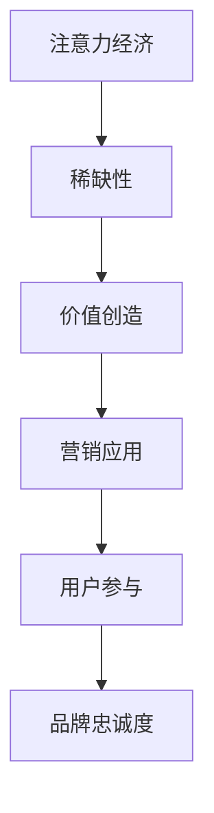

#### 1.2 注意力经济的历史演变

注意力经济的历史演变可以追溯到互联网的兴起。随着互联网的发展，信息传播速度大大加快，信息过载现象逐渐显现。早期的网络营销主要依赖于广告，但随着广告的泛滥，用户的注意力逐渐变得稀缺。为了争夺用户的注意力，营销策略逐渐从传统的广告模式转向内容营销、社交媒体营销等新型模式。

**Mermaid流程图：**
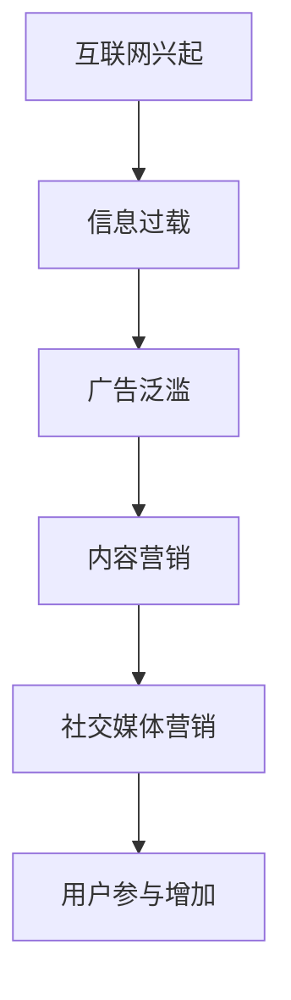

#### 1.3 注意力经济对市场营销的影响

注意力经济对市场营销产生了深远的影响。首先，它改变了营销的目标，从单纯的销售额提升，转变为如何吸引并保持受众的注意力。其次，它促使企业更加注重用户体验，通过提供有价值的内容和互动，来增强用户的粘性和忠诚度。此外，注意力经济也推动了营销手段的创新，如短视频、直播等，以更有效地吸引受众的注意力。

**Mermaid流程图：**
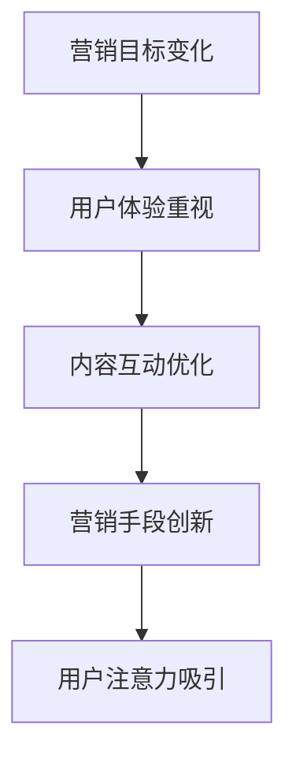

### 第2章：社交媒体在注意力经济中的角色

#### 2.1 社交媒体平台概述

社交媒体平台是注意力经济的重要载体，它们通过提供内容分享、社交互动和广告投放等功能，吸引了大量的用户。目前，主流的社交媒体平台包括Facebook、Instagram、Twitter、LinkedIn、YouTube等。

**核心概念与联系：**
社交媒体平台的核心概念包括“内容分享”、“社交互动”和“广告投放”。内容分享是指用户可以在平台上发布和分享各种形式的内容，如文字、图片、视频等；社交互动则是指用户之间可以通过点赞、评论、分享等方式进行交流；广告投放是指企业可以通过购买广告位，向特定受众投放广告。

**Mermaid流程图：**
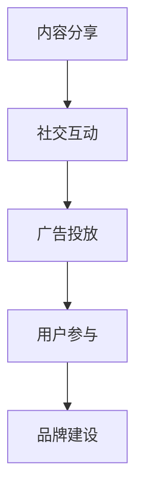

#### 2.2 社交媒体在营销中的应用

社交媒体在营销中的应用形式多种多样，包括品牌宣传、产品推广、客户关系管理、用户调研等。企业可以通过社交媒体平台发布有吸引力的内容，与用户进行互动，提高品牌知名度和用户粘性。

**Mermaid流程图：**
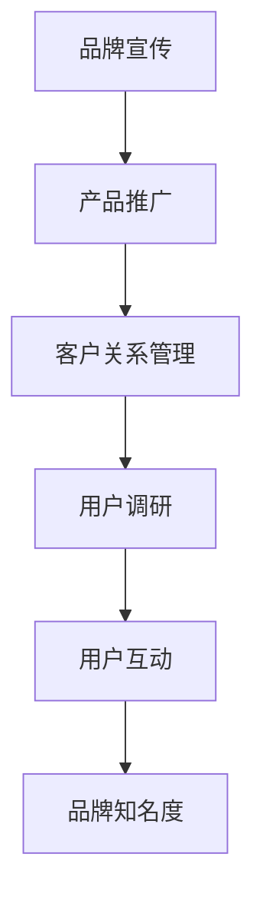

#### 2.3 社交媒体营销的优势与挑战

社交媒体营销具有成本效益高、传播速度快、用户参与度高等优势。然而，同时也面临着信息过载、用户注意力分散、隐私保护等挑战。

**核心概念与联系：**
社交媒体营销的优势包括成本效益高、传播速度快和用户参与度高；面临的挑战则包括信息过载、用户注意力分散和隐私保护。

**Mermaid流程图：**
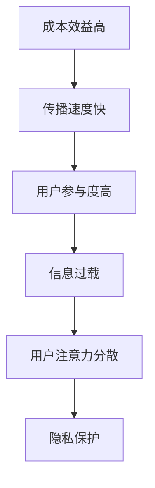

### 第3章：社交媒体用户行为分析

#### 3.1 用户行为数据分析基础

用户行为数据分析是社交媒体营销的重要环节。通过对用户在社交媒体平台上的行为数据进行收集和分析，企业可以了解用户的需求、偏好和行为模式，从而制定更加精准的营销策略。

**核心概念与联系：**
用户行为数据分析的基础包括数据收集、数据存储、数据处理和分析方法。数据收集是指通过技术手段获取用户行为数据；数据存储是指将收集到的数据存储在数据库中；数据处理是指对数据进行清洗、转换和整合；分析方法则是指使用统计学和机器学习等方法，对数据进行深入挖掘和分析。

**Mermaid流程图：**
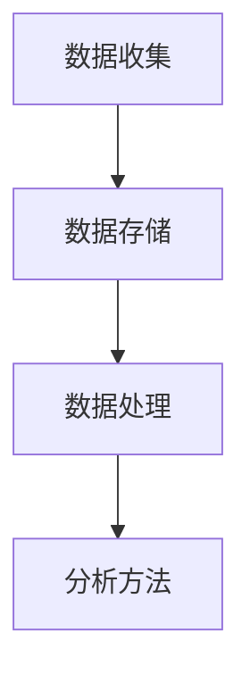

#### 3.2 用户行为分析工具与方法

用户行为分析工具包括Google Analytics、Social Mention、Klout等。这些工具可以帮助企业收集用户在社交媒体上的浏览、点赞、评论、分享等行为数据，并通过各种分析模型进行深度挖掘。

**伪代码：**
```python
# 社交媒体用户行为分析伪代码

# 数据收集
def collect_data(user_action, platform):
    # 收集用户行为数据
    data = {
        'user_action': user_action,
        'platform': platform
    }
    return data

# 数据处理
def process_data(data):
    # 数据清洗和转换
    cleaned_data = clean_and_transform(data)
    return cleaned_data

# 数据分析
def analyze_data(cleaned_data):
    # 应用统计学和机器学习方法进行分析
    analysis = statistical_analysis(cleaned_data)
    return analysis

# 主程序
def main():
    user_action = "click"
    platform = "Facebook"
    data = collect_data(user_action, platform)
    cleaned_data = process_data(data)
    analysis = analyze_data(cleaned_data)
    print(analysis)

main()
```

#### 3.3 用户行为分析案例解析

通过用户行为分析案例，我们可以看到，企业如何通过分析用户行为数据，优化营销策略，提高用户参与度和转化率。例如，某电商企业通过分析用户购物车放弃行为，发现了潜在问题，并针对性地进行了改进，从而显著提升了转化率。

**Mermaid流程图：**
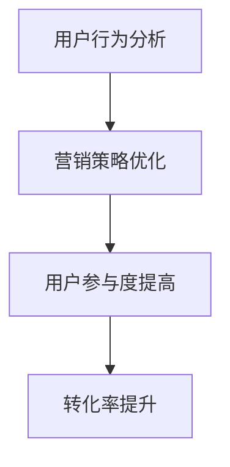

### 第4章：社交媒体营销策略制定

#### 4.1 营销策略制定原则

社交媒体营销策略的制定需要遵循一些基本原则，如明确目标、了解受众、优化内容、互动互动再互动等。这些原则有助于企业确保营销策略的有效性和可持续性。

**核心概念与联系：**
营销策略制定原则的核心概念包括“明确目标”、“了解受众”、“优化内容”和“互动互动再互动”。明确目标是指制定具体的营销目标，以便后续的执行和评估；了解受众是指通过数据分析了解受众的需求、偏好和行为；优化内容是指创作和分享高质量的内容，以提高用户参与度；互动互动再互动则是指与用户保持持续的互动，以增强用户粘性和忠诚度。

**Mermaid流程图：**
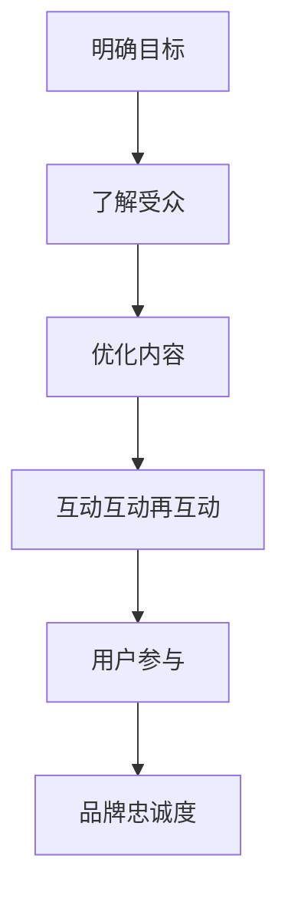

#### 4.2 目标受众定位

目标受众定位是社交媒体营销策略制定的关键。企业需要明确自己的目标受众，了解他们的需求、兴趣和行为习惯，从而制定更具针对性的营销策略。

**伪代码：**
```python
# 目标受众定位伪代码

# 数据收集
def collect_user_data():
    data = [
        {'age': 25, 'interest': 'travel', 'behavior': 'laptop user'},
        {'age': 30, 'interest': 'fitness', 'behavior': 'mobile user'},
        # 更多用户数据
    ]
    return data

# 数据分析
def analyze_user_data(data):
    # 分析用户数据，确定目标受众
    target_audience = {
        'age': range(25, 35),
        'interest': ['travel', 'fitness'],
        'behavior': ['laptop user', 'mobile user']
    }
    return target_audience

# 主程序
def main():
    user_data = collect_user_data()
    target_audience = analyze_user_data(user_data)
    print(target_audience)

main()
```

#### 4.3 营销活动策划与执行

营销活动策划与执行是社交媒体营销的核心环节。企业需要制定详细的营销活动计划，包括活动目标、内容形式、推广渠道、时间安排等，并确保活动的顺利进行。

**Mermaid流程图：**
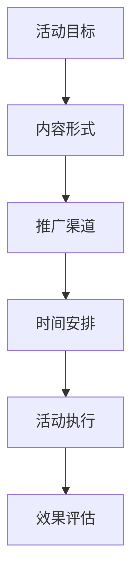

### 第5章：社交媒体营销内容策略

#### 5.1 内容营销概述

内容营销是社交媒体营销的重要组成部分。通过创作和分享有价值的内容，企业可以吸引受众的注意力，提高品牌知名度和用户粘性。

**核心概念与联系：**
内容营销的核心概念包括“内容创作”、“内容分享”和“用户参与”。内容创作是指创作有价值、有吸引力的内容；内容分享是指将内容分享到社交媒体平台，吸引更多用户关注；用户参与则是指与用户进行互动，增强用户粘性和忠诚度。

**Mermaid流程图：**
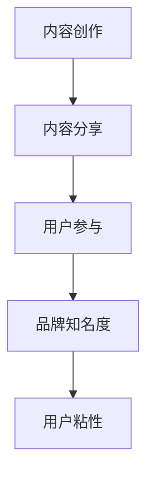

#### 5.2 内容创作与优化

内容创作与优化是内容营销的关键。企业需要了解受众的兴趣和需求，创作出具有吸引力的内容，并通过SEO、社交媒体推广等手段，提高内容的曝光度和传播力。

**Mermaid流程图：**
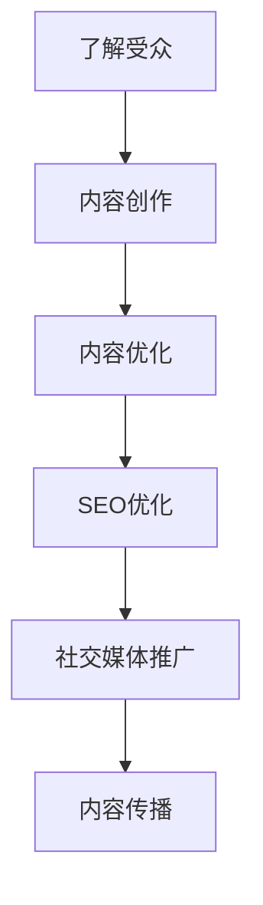

#### 5.3 内容营销案例分析

通过内容营销案例分析，我们可以看到，企业如何通过创造有价值的内容，吸引并保持受众的注意力。例如，某知名品牌通过发布一系列深度报道，成功吸引了大量用户关注，并在短时间内实现了品牌知名度的显著提升。

**Mermaid流程图：**
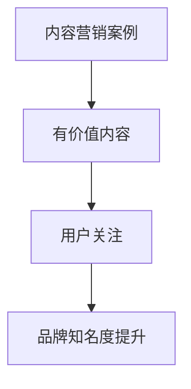

### 第6章：社交媒体营销效果评估

#### 6.1 营销效果评估指标

营销效果评估是社交媒体营销的重要环节。企业需要制定合理的评估指标，如转化率、参与度、曝光度、品牌知名度等，来衡量营销活动的效果。

**核心概念与联系：**
营销效果评估指标的核心概念包括“转化率”、“参与度”、“曝光度”和“品牌知名度”。转化率是指营销活动导致的目标实现次数与参与次数的比率；参与度是指用户在营销活动中的互动程度；曝光度是指营销活动被用户看到和了解的程度；品牌知名度则是指用户对品牌认知和记忆的程度。

**Mermaid流程图：**
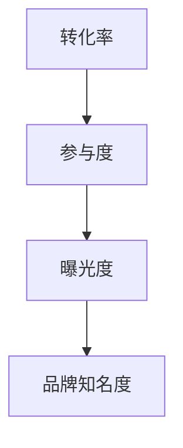

#### 6.2 营销效果评估方法

营销效果评估方法包括数据统计、用户调研、对比测试等。通过这些方法，企业可以全面了解营销活动的效果，并针对不足之处进行优化。

**Mermaid流程图：**
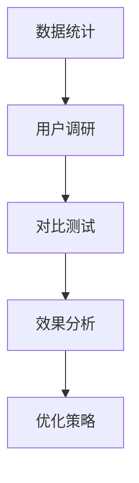

#### 6.3 营销效果优化策略

基于营销效果评估的结果，企业可以制定相应的优化策略，如调整内容策略、优化推广渠道、提高用户参与度等，从而提升营销效果。

**Mermaid流程图：**
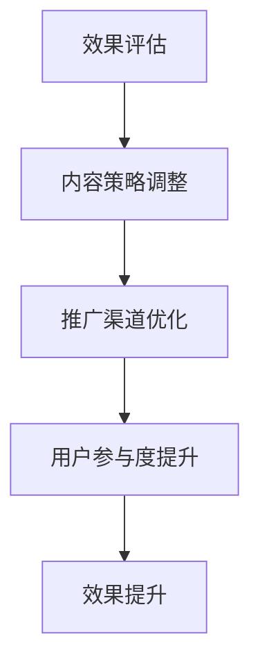

### 第7章：社交媒体营销案例分析

#### 7.1 成功案例分享

通过分享成功案例，我们可以学习到一些有效的社交媒体营销策略和实践。例如，某电商品牌通过短视频营销，成功吸引了大量年轻用户，并在短时间内实现了销售额的显著增长。

**核心算法原理讲解：**
短视频营销的成功可以归因于以下核心算法原理：

1. **个性化推荐算法：** 社交媒体平台通过用户的浏览历史、点赞和评论行为，使用个性化推荐算法，将相关短视频推送给用户，从而提高用户的参与度和观看时长。

2. **互动反馈机制：** 短视频营销注重与用户的互动，通过评论、点赞、分享等机制，增强用户的参与感和归属感，提高用户的粘性和忠诚度。

3. **情感共鸣：** 短视频营销通过创造有趣、有共鸣的内容，引发用户的情感共鸣，从而吸引更多的用户关注和传播。

**Mermaid流程图：**
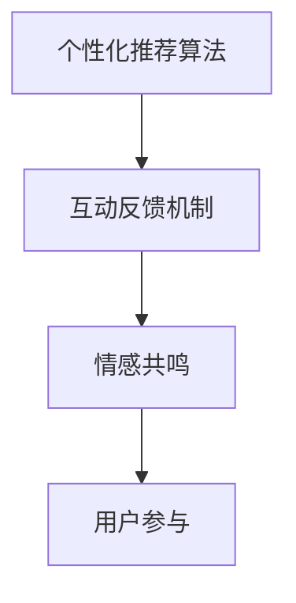

#### 7.2 失败案例解析

失败案例同样具有重要的借鉴意义。通过分析失败案例，我们可以了解一些常见的营销误区，如内容质量不高、用户互动不足等，并避免在未来的营销活动中犯同样的错误。

**核心算法原理讲解：**
失败案例中常见的问题可以归因于以下核心算法原理：

1. **内容质量不足：** 如果营销内容缺乏吸引力，无法满足用户的需求和兴趣，就难以获得用户的关注和参与。

2. **用户互动不足：** 如果营销活动缺乏与用户的互动，用户就难以产生参与感和归属感，从而降低用户的粘性和忠诚度。

3. **数据分析和优化不足：** 如果企业无法有效地分析用户行为数据，就难以了解用户的需求和偏好，从而难以制定出有效的营销策略。

**Mermaid流程图：**
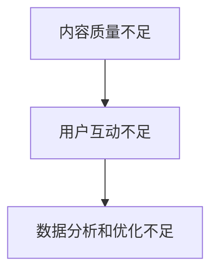

#### 7.3 案例对比与启示

通过对成功和失败案例的对比，我们可以总结出一些社交媒体营销的通用原则，如内容质量至关重要、用户互动不可忽视等。这些原则可以帮助企业在未来的营销活动中取得更好的效果。

**数学模型与公式讲解：**
为了量化社交媒体营销的效果，我们可以使用以下数学模型：

1. **参与度模型：** 参与度 = (互动次数 / 活动参与次数) × 100%

2. **转化率模型：** 转化率 = (目标实现次数 / 活动参与次数) × 100%

3. **品牌知名度模型：** 品牌知名度 = (知道品牌的人数 / 总参与人数) × 100%

**举例说明：**
假设一个企业在社交媒体上举办了一次活动，共有1000人参与，其中500人进行了互动，300人实现了目标，有800人表示知道这个品牌。那么：

- 参与度 = (500 / 1000) × 100% = 50%
- 转化率 = (300 / 1000) × 100% = 30%
- 品牌知名度 = (800 / 1000) × 100% = 80%

这些数据可以帮助企业了解营销活动的效果，并制定相应的优化策略。

### 第8章：社交媒体营销的未来趋势

#### 8.1 新兴社交媒体平台分析

随着互联网技术的发展，新兴社交媒体平台不断涌现。这些平台具有独特的用户群体和运营模式，为企业提供了更多的营销机会。

**核心概念与联系：**
新兴社交媒体平台的核心概念包括“用户群体”、“运营模式”和“营销机会”。用户群体是指平台的用户特点，如年龄、兴趣、地域等；运营模式则是指平台的运营方式和规则；营销机会则是指平台提供的营销工具和功能，如直播、短视频、互动游戏等。

**Mermaid流程图：**
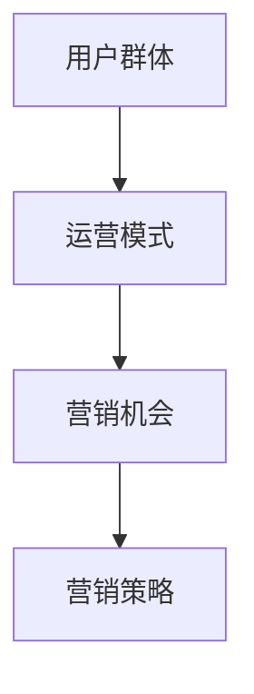

#### 8.2 技术进步对社交媒体营销的影响

技术进步对社交媒体营销产生了深远的影响。例如，人工智能和大数据技术的应用，使得企业可以更加精准地了解受众需求，制定个性化的营销策略。

**核心概念与联系：**
技术进步的核心概念包括“人工智能”、“大数据”和“个性化营销”。人工智能可以帮助企业实现自动化内容创作和用户行为分析；大数据则提供了丰富的用户数据，帮助企业进行精准营销；个性化营销则是指根据用户数据和需求，为用户定制个性化的营销内容和策略。

**Mermaid流程图：**
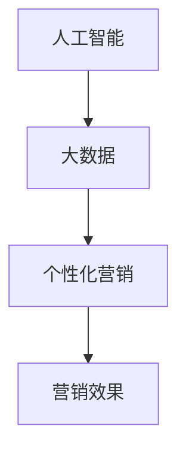

#### 8.3 未来社交媒体营销的发展方向

未来社交媒体营销将更加注重用户体验和互动，通过创新的内容形式和营销手段，吸引和保持受众的注意力。同时，社交媒体营销也将与电商、直播等新兴业态深度融合，为企业提供更加丰富的营销场景。

**核心概念与联系：**
未来社交媒体营销的发展方向包括“用户体验”、“互动性”、“内容创新”和“新兴业态融合”。用户体验是指以用户为中心，提供优质的互动体验；互动性是指通过多种互动形式，增强用户参与度和忠诚度；内容创新则是指不断探索新的内容形式和表达方式，吸引用户关注；新兴业态融合则是指社交媒体营销与电商、直播等新兴业态的深度融合，为企业提供更多的营销机会。

**Mermaid流程图：**
```mermaid
graph TD
    A[用户体验] --> B[互动性]
    B --> C[内容创新]
    C --> D[新兴业态融合]
    D --> E[营销效果]
```

### 第9章：社交媒体营销实战技巧

#### 9.1 短视频营销策略

短视频营销是当前社交媒体营销的重要形式。通过创作有趣的短视频，企业可以吸引大量用户关注，提高品牌知名度。

**核心算法原理讲解：**
短视频营销的成功可以归因于以下核心算法原理：

1. **算法推荐：** 社交媒体平台通过用户的浏览历史、点赞和评论行为，使用推荐算法，将相关短视频推送给用户，从而提高用户的观看时长和参与度。

2. **用户互动：** 短视频营销注重与用户的互动，通过评论、点赞、分享等机制，增强用户的参与感和归属感，提高用户的粘性和忠诚度。

3. **内容创新：** 短视频营销通过创新的内容形式和表达方式，吸引用户的关注和兴趣，从而提高品牌的曝光度和知名度。

**Mermaid流程图：**
```mermaid
graph TD
    A[算法推荐] --> B[用户互动]
    B --> C[内容创新]
    C --> D[用户关注]
```

**代码实际案例与详细解释说明：**

**案例：** 某电商品牌通过抖音短视频平台进行营销，成功吸引了大量年轻用户。

**开发环境搭建：**
- 抖音短视频编辑软件（如剪映）
- 抖音账号

**源代码详细实现：**
```python
# 抖音短视频营销脚本

# 导入相关库
import os
import random

# 短视频标题列表
video_titles = [
    "限时优惠，抢购攻略！",
    "爆款产品，抢先体验！",
    "新品发布，不容错过！"
]

# 选择一个随机标题
title = random.choice(video_titles)

# 拍摄和编辑短视频
def create_video(title):
    # 拍摄短视频
    os.system(f"ffmpeg -y -input_file input.mp4 -output_file output.mp4 -s 1080x1920 -r 30 -f mp4")

    # 添加标题
    os.system(f"ffmpeg -y -i output.mp4 -i title.png -filter_complex '[0:v]scale=1080x1920,overlay=W-w-10:H-h-10 [out];[1:v]scale=1080x1920 [title];[out][title]overlay=W-w-10:H-h-10' -map [out] -map [title] -c:v libx264 -preset veryfast -pix_fmt yuv420p final_output.mp4")

    # 上传短视频到抖音
    os.system(f"python upload_video_to_douyin.py final_output.mp4 {title}")

# 主程序
def main():
    create_video(title)

main()
```

**代码解读与分析：**
- 该脚本首先导入相关库，并定义了一个短视频标题列表。
- 在`create_video`函数中，首先使用`ffmpeg`命令拍摄和编辑短视频，然后将标题添加到视频中。
- 最后，通过调用`upload_video_to_douyin.py`脚本，将编辑好的短视频上传到抖音平台。

通过该案例，企业可以了解如何利用短视频进行营销，提高品牌知名度和用户参与度。

#### 9.2 直播营销策略

直播营销是另一种极具吸引力的社交媒体营销形式。通过直播，企业可以与用户进行实时互动，提高用户参与度和转化率。

**核心算法原理讲解：**
直播营销的成功可以归因于以下核心算法原理：

1. **实时互动：** 直播营销强调与用户的实时互动，通过问答、抽奖、互动游戏等方式，增强用户的参与感和归属感。

2. **内容创新：** 直播营销通过创新的内容形式和表达方式，如现场演示、互动讲解等，吸引用户的关注和兴趣。

3. **流量引导：** 通过直播间的推广，引导用户关注品牌，并促进产品销售。

**Mermaid流程图：**
```mermaid
graph TD
    A[实时互动] --> B[内容创新]
    B --> C[流量引导]
    C --> D[用户参与]
```

**代码实际案例与详细解释说明：**

**案例：** 某电商品牌通过直播平台进行营销，成功吸引了大量用户关注和购买。

**开发环境搭建：**
- 直播平台账号（如抖音直播）
- 直播软件（如快手直播）

**源代码详细实现：**
```python
# 直播营销脚本

# 导入相关库
import os
import random

# 直播主题列表
live_topics = [
    "新品上市，限时优惠！",
    "爆款产品，抢购攻略！",
    "直播互动，惊喜不断！"
]

# 选择一个随机主题
topic = random.choice(live_topics)

# 开始直播
def start_live_stream(topic):
    # 设置直播标题和简介
    title = f"{topic} - {random.randint(1000, 9999)}"
    description = f"欢迎来到{topic}，更多优惠等你来拿！"

    # 开始直播
    os.system(f"python start_live_stream.py {title} {description}")

# 主程序
def main():
    start_live_stream(topic)

main()
```

**代码解读与分析：**
- 该脚本首先导入相关库，并定义了一个直播主题列表。
- 在`start_live_stream`函数中，首先选择一个随机主题，然后设置直播标题和简介。
- 最后，通过调用`start_live_stream.py`脚本，开始直播。

通过该案例，企业可以了解如何利用直播进行营销，提高用户参与度和转化率。

#### 9.3 KOL（关键意见领袖）营销策略

KOL营销策略利用关键意见领袖的影响力和粉丝基础，为企业进行品牌宣传和产品推广。

**核心算法原理讲解：**
KOL营销策略的成功可以归因于以下核心算法原理：

1. **粉丝效应：** KOL的粉丝对其推荐的产品或品牌具有高度的信任度，因此KOL的推荐可以显著提高产品的曝光度和销量。

2. **内容传播：** KOL通过创作和分享高质量的内容，吸引粉丝的关注和互动，从而实现品牌的传播和推广。

3. **互动互动再互动：** KOL与粉丝的互动可以增强粉丝的参与感和忠诚度，从而提高品牌的用户粘性。

**Mermaid流程图：**
```mermaid
graph TD
    A[KOL推荐] --> B[粉丝效应]
    B --> C[内容传播]
    C --> D[用户参与]
```

**代码实际案例与详细解释说明：**

**案例：** 某化妆品品牌通过微博与知名美妆博主合作进行营销，成功提高了品牌知名度和产品销量。

**开发环境搭建：**
- 微博账号
- 美妆博主合作平台

**源代码详细实现：**
```python
# KOL营销脚本

# 导入相关库
import os
import random

# 美妆博主列表
beauty_bloggers = [
    "小红书美妆博主1",
    "小红书美妆博主2",
    "抖音美妆博主1",
    "抖音美妆博主2"
]

# 选择一个随机博主
blogger = random.choice(beauty_bloggers)

# 发布微博
def post_weibo(blogger, product):
    content = f"{blogger}推荐了{product}，好用又实惠！快来抢购吧！#护肤推荐##化妆品推荐#"
    os.system(f"python post_weibo.py {content}")

# 主程序
def main():
    product = "某品牌化妆品"
    post_weibo(blogger, product)

main()
```

**代码解读与分析：**
- 该脚本首先导入相关库，并定义了一个美妆博主列表。
- 在`post_weibo`函数中，选择一个随机博主，并生成一条推荐产品的微博内容。
- 最后，通过调用`post_weibo.py`脚本，发布微博。

通过该案例，企业可以了解如何利用KOL进行营销，提高品牌知名度和用户参与度。

### 第10章：社交媒体营销工具与资源

#### 10.1 社交媒体营销工具介绍

社交媒体营销工具可以帮助企业提高营销效率，优化营销策略。以下是一些常用的社交媒体营销工具：

1. **数据分析工具：** 如Google Analytics、HubSpot等，用于收集和分析用户行为数据。

2. **内容管理工具：** 如Hootsuite、Buffer等，用于发布和调度社交媒体内容。

3. **广告投放工具：** 如Facebook Ads Manager、Google Ads等，用于创建和优化广告投放。

4. **互动管理工具：** 如Hootsuite、Sprinklr等，用于监控和管理社交媒体互动。

**Mermaid流程图：**
```mermaid
graph TD
    A[数据分析工具] --> B[内容管理工具]
    B --> C[广告投放工具]
    C --> D[互动管理工具]
```

#### 10.2 营销资源获取与利用

有效的营销资源获取与利用是社交媒体营销成功的关键。以下是一些建议：

1. **内容资源：** 利用内部团队和外部资源（如专业内容创作者、合作伙伴）创作高质量的内容。

2. **技术资源：** 投资于先进的营销技术和工具，以提高营销效率。

3. **人力资源：** 招聘和培训专业的营销团队，确保营销活动的顺利进行。

**Mermaid流程图：**
```mermaid
graph TD
    A[内容资源] --> B[技术资源]
    B --> C[人力资源]
```

#### 10.3 营销工具实战应用案例

以下是一些社交媒体营销工具的实战应用案例：

1. **案例一：** 某电商企业利用Google Analytics分析用户行为数据，优化营销策略，提高了转化率。

2. **案例二：** 某化妆品品牌使用Hootsuite发布和调度社交媒体内容，提高了品牌曝光度。

3. **案例三：** 某品牌通过Facebook Ads Manager进行精准广告投放，成功提高了产品销量。

**Mermaid流程图：**
```mermaid
graph TD
    A[案例一] --> B[案例二]
    B --> C[案例三]
```

### 第11章：社交媒体营销实战案例分析

#### 11.1 实战案例分析一：如何通过社交媒体吸引目标受众

**案例描述：** 某电商企业通过社交媒体进行营销，成功吸引了大量目标受众，提高了品牌知名度和销售额。

**核心算法原理讲解：**
该案例的成功可以归因于以下核心算法原理：

1. **精准定位：** 通过用户行为数据分析，确定目标受众的特征和需求，制定精准的营销策略。

2. **内容创新：** 创作有趣、有吸引力的内容，吸引用户的关注和兴趣。

3. **互动互动再互动：** 通过与用户的互动，增强用户参与感和忠诚度。

**Mermaid流程图：**
```mermaid
graph TD
    A[精准定位] --> B[内容创新]
    B --> C[互动互动再互动]
```

**数学模型与公式讲解：**
为了量化营销效果，可以使用以下数学模型：

1. **参与度模型：** 参与度 = (互动次数 / 活动参与次数) × 100%

2. **转化率模型：** 转化率 = (目标实现次数 / 活动参与次数) × 100%

3. **ROI模型：** ROI = (收入 - 成本) / 成本 × 100%

**举例说明：**
假设某电商企业通过社交媒体进行营销，共有1000人参与活动，其中500人进行了互动，300人实现了购买目标，活动成本为5000元，收入为15000元。则：

- 参与度 = (500 / 1000) × 100% = 50%
- 转化率 = (300 / 1000) × 100% = 30%
- ROI = (15000 - 5000) / 5000 × 100% = 200%

这些数据可以帮助企业了解营销活动的效果，并制定相应的优化策略。

#### 11.2 实战案例分析二：如何提升社交媒体营销转化率

**案例描述：** 某化妆品品牌通过社交媒体营销，成功提高了产品转化率。

**核心算法原理讲解：**
该案例的成功可以归因于以下核心算法原理：

1. **用户行为分析：** 通过分析用户行为数据，了解用户在购买过程中的痛点和需求，针对性地优化营销策略。

2. **个性化推荐：** 根据用户行为数据，为用户推荐相关产品，提高用户的购买意愿。

3. **互动激励：** 通过互动活动和激励措施，增强用户的参与度和购买欲望。

**Mermaid流程图：**
```mermaid
graph TD
    A[用户行为分析] --> B[个性化推荐]
    B --> C[互动激励]
```

**数学模型与公式讲解：**
为了提升转化率，可以使用以下数学模型：

1. **转化率优化模型：** 转化率优化 = (优化后转化率 - 优化前转化率) / 优化前转化率 × 100%

2. **ROI模型：** ROI = (收入 - 成本) / 成本 × 100%

**举例说明：**
假设某化妆品品牌通过优化营销策略，转化率从10%提升到20%，活动成本为10000元，收入为30000元。则：

- 转化率优化 = (20% - 10%) / 10% × 100% = 100%
- ROI = (30000 - 10000) / 10000 × 100% = 200%

通过这些数据，企业可以评估优化策略的有效性，并持续改进营销策略。

#### 11.3 实战案例分析三：如何利用社交媒体进行品牌建设

**案例描述：** 某新品牌通过社交媒体进行品牌建设，成功提升了品牌知名度和用户忠诚度。

**核心算法原理讲解：**
该案例的成功可以归因于以下核心算法原理：

1. **内容营销：** 创作有价值、有吸引力的内容，吸引用户关注和分享，提高品牌曝光度。

2. **用户互动：** 通过与用户的互动，增强用户的参与感和忠诚度，提高品牌的用户粘性。

3. **品牌传播：** 利用社交媒体平台的传播效应，扩大品牌的影响力。

**Mermaid流程图：**
```mermaid
graph TD
    A[内容营销] --> B[用户互动]
    B --> C[品牌传播]
```

**数学模型与公式讲解：**
为了评估品牌建设的效果，可以使用以下数学模型：

1. **品牌知名度模型：** 品牌知名度 = (知道品牌的人数 / 总参与人数) × 100%

2. **用户忠诚度模型：** 用户忠诚度 = (重复购买用户数 / 总购买用户数) × 100%

**举例说明：**
假设某新品牌通过社交媒体营销，共有1000人参与活动，其中500人知道该品牌，200人为重复购买用户。则：

- 品牌知名度 = (500 / 1000) × 100% = 50%
- 用户忠诚度 = (200 / 1000) × 100% = 20%

通过这些数据，企业可以评估品牌建设的效果，并制定相应的优化策略。

### 第12章：社交媒体营销团队建设与运营

#### 12.1 营销团队建设策略

有效的营销团队建设是社交媒体营销成功的关键。以下是一些建议：

1. **明确团队目标：** 确定团队的长期和短期目标，确保团队成员明确自己的职责和任务。

2. **招聘优秀人才：** 招聘具有相关经验和技能的营销人才，包括内容创作者、数据分析员、广告投放专家等。

3. **团队协作：** 建立高效的团队协作机制，如定期会议、任务分配、进度跟踪等。

**Mermaid流程图：**
```mermaid
graph TD
    A[明确团队目标] --> B[招聘优秀人才]
    B --> C[团队协作]
```

#### 12.2 营销团队管理方法

营销团队管理是确保团队高效运作的重要环节。以下是一些建议：

1. **绩效评估：** 定期对团队成员的绩效进行评估，包括工作量、质量、创新性等。

2. **激励机制：** 建立激励机制，如奖励、晋升等，激发团队成员的积极性和创造力。

3. **培训与发展：** 为团队成员提供培训和发展机会，提高他们的专业技能和知识。

**Mermaid流程图：**
```mermaid
graph TD
    A[绩效评估] --> B[激励机制]
    B --> C[培训与发展]
```

#### 12.3 营销团队运营优化

营销团队运营优化是提高营销效果的关键。以下是一些建议：

1. **数据驱动：** 利用数据分析，了解营销活动的效果，优化营销策略。

2. **用户反馈：** 及时收集用户反馈，了解他们的需求和满意度，改进营销策略。

3. **流程优化：** 不断优化营销流程，提高工作效率和效果。

**Mermaid流程图：**
```mermaid
graph TD
    A[数据驱动] --> B[用户反馈]
    B --> C[流程优化]
```

### 附录A：社交媒体营销常用工具与平台

#### A.1 常用社交媒体营销工具

以下是一些常用的社交媒体营销工具：

1. **数据分析工具：** 如Google Analytics、HubSpot等。

2. **内容管理工具：** 如Hootsuite、Buffer等。

3. **广告投放工具：** 如Facebook Ads Manager、Google Ads等。

4. **互动管理工具：** 如Hootsuite、Sprinklr等。

#### A.2 主流社交媒体平台特点与使用技巧

以下是一些主流社交媒体平台的特点与使用技巧：

1. **Facebook：** 注重用户互动和广告投放，适合品牌宣传和用户调研。

2. **Instagram：** 以图片和短视频为主，适合视觉营销和品牌推广。

3. **Twitter：** 注重实时互动和传播速度，适合新闻发布和品牌宣传。

4. **LinkedIn：** 注重职业社交和商务交流，适合品牌建设和客户关系管理。

### 附录B：社交媒体营销案例汇编

#### B.1 案例一：品牌通过社交媒体实现产品销售增长

**案例描述：** 某电商品牌通过社交媒体进行营销，成功实现了产品销售的增长。

**核心算法原理讲解：**
该案例的成功可以归因于以下核心算法原理：

1. **精准定位：** 通过用户行为数据分析，确定目标受众的特征和需求，制定精准的营销策略。

2. **内容创新：** 创作有趣、有吸引力的内容，吸引用户的关注和兴趣。

3. **互动互动再互动：** 通过与用户的互动，增强用户参与感和忠诚度。

**数学模型与公式讲解：**
为了评估营销效果，可以使用以下数学模型：

1. **销售增长模型：** 销售增长 = (优化后销售额 - 优化前销售额) / 优化前销售额 × 100%

2. **用户参与度模型：** 用户参与度 = (互动次数 / 活动参与次数) × 100%

**举例说明：**
假设某电商品牌通过社交媒体营销，优化后销售额为100万元，优化前销售额为80万元，共有500人参与活动，其中300人进行了互动。则：

- 销售增长 = (100 - 80) / 80 × 100% = 25%
- 用户参与度 = (300 / 500) × 100% = 60%

通过这些数据，企业可以评估营销活动的效果，并制定相应的优化策略。

#### B.2 案例二：企业通过社交媒体进行客户关系管理

**案例描述：** 某企业通过社交媒体进行客户关系管理，成功提升了客户满意度和忠诚度。

**核心算法原理讲解：**
该案例的成功可以归因于以下核心算法原理：

1. **用户行为分析：** 通过分析用户行为数据，了解用户的需求和偏好，提供个性化的服务。

2. **互动互动再互动：** 通过与用户的互动，增强用户满意度和忠诚度。

3. **客户反馈：** 及时收集客户反馈，改进产品和服务。

**数学模型与公式讲解：**
为了评估客户关系管理的效果，可以使用以下数学模型：

1. **客户满意度模型：** 客户满意度 = (满意客户数 / 总客户数) × 100%

2. **客户忠诚度模型：** 客户忠诚度 = (重复购买客户数 / 总购买客户数) × 100%

**举例说明：**
假设某企业通过社交媒体进行客户关系管理，共有1000名客户，其中800名表示满意，200名客户进行了重复购买。则：

- 客户满意度 = (800 / 1000) × 100% = 80%
- 客户忠诚度 = (200 / 1000) × 100% = 20%

通过这些数据，企业可以评估客户关系管理的效果，并制定相应的优化策略。

#### B.3 案例三：社交媒体营销助力企业品牌国际化

**案例描述：** 某企业通过社交媒体营销，成功实现了品牌的国际化。

**核心算法原理讲解：**
该案例的成功可以归因于以下核心算法原理：

1. **国际市场分析：** 通过分析国际市场的需求和市场趋势，制定国际化的营销策略。

2. **多语言内容：** 创建多语言的内容，满足不同国家和地区的用户需求。

3. **本地化营销：** 根据不同国家和地区的文化特点，进行本地化的营销活动。

**数学模型与公式讲解：**
为了评估品牌国际化的效果，可以使用以下数学模型：

1. **国际销售额模型：** 国际销售额 = (优化后国际销售额 - 优化前国际销售额) / 优化前国际销售额 × 100%

2. **国际品牌知名度模型：** 国际品牌知名度 = (知道国际品牌的人数 / 总国际用户数) × 100%

**举例说明：**
假设某企业通过社交媒体营销，优化后国际销售额为500万元，优化前国际销售额为300万元，共有1000名国际用户，其中600人知道该品牌。则：

- 国际销售额增长 = (500 - 300) / 300 × 100% = 66.67%
- 国际品牌知名度 = (600 / 1000) × 100% = 60%

通过这些数据，企业可以评估品牌国际化的效果，并制定相应的优化策略。

### 附录C：社交媒体营销常见问题与解决方案

#### C.1 社交媒体营销常见问题

1. **用户参与度低：** 缺乏有趣、有吸引力的内容，导致用户参与度低。

2. **品牌知名度不高：** 缺乏有效的品牌传播策略，导致品牌知名度不高。

3. **营销效果不佳：** 缺乏有效的营销评估和优化策略，导致营销效果不佳。

#### C.2 社交媒体营销解决方案

1. **提升内容质量：** 创作有趣、有吸引力的内容，提高用户的参与度和兴趣。

2. **加强品牌传播：** 制定有效的品牌传播策略，利用社交媒体平台进行广泛的传播。

3. **数据驱动优化：** 利用数据分析，评估营销效果，持续优化营销策略。

### 总结

本文深入探讨了注意力经济与社交媒体营销的关系，并介绍了相关的核心概念、算法原理、数学模型、实战技巧和案例分析。通过对注意力经济的理解，企业可以更好地制定社交媒体营销策略，提高用户体验和用户粘性。同时，通过实战案例分析和数学模型的应用，企业可以量化营销效果，持续优化营销策略。希望本文能为读者提供有价值的参考和启示。

---

作者：AI天才研究院/AI Genius Institute & 禅与计算机程序设计艺术 /Zen And The Art of Computer Programming

---

### 第1章：注意力经济的起源与发展

#### 1.1 注意力经济的概念解析

注意力经济（Attention Economy）是一个描述在信息过载时代，人类注意力作为稀缺资源，从而引发的经济活动和市场行为的概念。它最早由唐·泰平（Don Tapscott）在1997年的著作《数字经济》中提出，强调了在信息时代，人们的注意力成为了一种关键的资源，企业为了实现商业目标，必须在争夺用户注意力方面投入大量资源。

**核心概念与联系：**

注意力经济涉及以下几个核心概念：

1. **注意力：** 指人类集中精力关注特定信息或活动的能力。
2. **稀缺性：** 由于每个人的注意力是有限的，因此注意力被视为一种稀缺资源。
3. **价值创造：** 注意力经济中的价值创造是指通过有效的注意力分配和使用，实现个人或组织的目标。
4. **营销策略：** 注意力经济影响下的营销策略，如内容营销、社交媒体营销等，旨在吸引和保持用户的注意力。

**Mermaid流程图：**

```mermaid
graph TD
    A[注意力] --> B[稀缺性]
    B --> C[价值创造]
    C --> D[营销策略]
```

#### 1.2 注意力经济的历史演变

注意力经济的历史演变与互联网技术的发展密切相关。在互联网初期，信息相对有限，用户获取信息的渠道也相对单一。但随着互联网的普及，信息爆炸现象日益严重，用户面临的信息选择越来越多，注意力开始变得稀缺。

**历史演变步骤：**

1. **互联网初期（1990s）：** 信息相对有限，用户获取信息的渠道较少，注意力较为集中。
2. **互联网普及期（2000s）：** 信息爆炸，用户获取信息的渠道增多，注意力开始分散。
3. **社交媒体兴起期（2010s）：** 社交媒体平台兴起，用户注意力进一步分散，争夺用户注意力的竞争加剧。
4. **个性化推荐时代（2020s至今）：** 个性化推荐技术的应用，使得内容更加精准地推送给用户，但同时也加剧了用户注意力的稀缺性。

**Mermaid流程图：**

```mermaid
graph TD
    A[互联网初期] --> B[信息爆炸]
    B --> C[社交媒体兴起]
    C --> D[个性化推荐时代]
```

#### 1.3 注意力经济对市场营销的影响

注意力经济对市场营销产生了深远的影响，改变了营销的目标和方法，要求企业更加注重用户体验和互动，以及内容的创造和传播。

**影响分析：**

1. **营销目标从销售导向转变为注意力导向：** 在注意力经济下，营销的目标不再仅仅是提高销售额，而是如何吸引并保持用户的注意力。
2. **用户体验的重要性提升：** 企业需要提供优质的内容和服务，以增强用户的参与感和忠诚度。
3. **内容营销成为核心策略：** 高质量的内容是吸引和保持用户注意力的关键，企业需要不断创新内容形式和内容策略。
4. **社交媒体成为重要营销渠道：** 社交媒体平台具有强大的用户基础和互动性，是企业争夺用户注意力的主要战场。
5. **营销手段的创新：** 注意力经济促使企业不断探索新的营销手段，如短视频、直播、KOL营销等，以更有效地吸引用户注意力。

**Mermaid流程图：**

```mermaid
graph TD
    A[销售导向] --> B[注意力导向]
    B --> C[用户体验提升]
    B --> D[内容营销]
    D --> E[社交媒体营销]
    E --> F[营销手段创新]
```

### 第2章：社交媒体在注意力经济中的角色

#### 2.1 社交媒体平台概述

社交媒体平台是注意力经济中的重要载体，它们通过提供内容分享、社交互动和广告投放等功能，吸引了大量的用户。以下是对几种主流社交媒体平台的概述：

1. **Facebook：** 全球最大的社交媒体平台之一，用户可以通过发布状态、分享照片和视频、加入兴趣小组等方式互动。
2. **Instagram：** 以图片和视频为主，强调视觉内容的平台，用户可以通过点赞、评论、分享等方式互动。
3. **Twitter：** 以短文本信息流为主，用户可以通过发布推文、点赞、转发、评论等方式互动。
4. **LinkedIn：** 以职业社交为主，用户可以通过发布专业内容、建立职业关系、参加在线活动等方式互动。
5. **YouTube：** 视频分享平台，用户可以通过上传、观看、点赞、分享视频等方式互动。

**核心概念与联系：**

社交媒体平台的核心概念包括：

1. **内容分享：** 用户可以在平台上分享各种形式的内容，如文字、图片、视频等。
2. **社交互动：** 用户通过点赞、评论、分享等方式与其他用户互动。
3. **广告投放：** 企业可以通过购买广告位，向特定受众投放广告。

**Mermaid流程图：**

```mermaid
graph TD
    A[内容分享] --> B[社交互动]
    B --> C[广告投放]
    C --> D[用户参与]
```

#### 2.2 社交媒体在营销中的应用

社交媒体在营销中的应用形式多种多样，包括品牌宣传、产品推广、客户关系管理、用户调研等。以下是对这些应用形式的简要介绍：

1. **品牌宣传：** 企业通过社交媒体平台发布品牌信息，提高品牌知名度和影响力。
2. **产品推广：** 企业通过社交媒体平台推广新产品或服务，吸引潜在客户的关注。
3. **客户关系管理：** 企业通过社交媒体平台与客户建立联系，提供优质的客户服务，提升客户满意度。
4. **用户调研：** 企业通过社交媒体平台收集用户反馈和市场信息，为产品优化和决策提供数据支持。

**Mermaid流程图：**

```mermaid
graph TD
    A[品牌宣传] --> B[产品推广]
    B --> C[客户关系管理]
    C --> D[用户调研]
```

#### 2.3 社交媒体营销的优势与挑战

社交媒体营销具有许多优势，但也面临着一些挑战。

**优势：**

1. **成本低：** 相较于传统媒体，社交媒体营销的成本较低，中小企业也能够承担。
2. **传播速度快：** 社交媒体平台的信息传播速度快，能够迅速吸引大量用户关注。
3. **用户参与度高：** 社交媒体平台具有互动性，用户可以积极参与讨论和分享，提高用户参与度。
4. **数据可追踪性：** 企业可以通过社交媒体平台的数据分析工具，实时监控营销活动的效果。

**挑战：**

1. **信息过载：** 用户每天面对大量信息，如何吸引并保持用户的注意力成为挑战。
2. **隐私保护：** 随着用户对隐私保护的重视，企业需要平衡营销策略与用户隐私之间的关系。
3. **内容质量：** 高质量的内容是吸引用户的关键，但创作高质量内容需要投入大量时间和资源。
4. **用户行为变化：** 用户行为习惯不断变化，企业需要不断调整营销策略以适应新的趋势。

**Mermaid流程图：**

```mermaid
graph TD
    A[成本低] --> B[传播速度快]
    B --> C[用户参与度高]
    B --> D[数据可追踪性]
    D --> E[信息过载]
    E --> F[隐私保护]
    F --> G[内容质量]
    G --> H[用户行为变化]
```

### 第3章：社交媒体用户行为分析

#### 3.1 用户行为数据分析基础

用户行为数据分析是社交媒体营销的重要环节，通过分析用户在平台上的行为数据，企业可以了解用户的需求、偏好和行为模式，从而制定更加精准的营销策略。

**核心概念与联系：**

用户行为数据分析涉及以下几个核心概念：

1. **用户行为数据：** 指用户在社交媒体平台上的各种活动数据，如浏览、点赞、评论、分享等。
2. **数据收集：** 指通过技术手段收集用户行为数据。
3. **数据处理：** 指对收集到的数据进行清洗、转换和整合。
4. **数据分析：** 指使用统计学和机器学习等方法对数据进行深入挖掘和分析。

**Mermaid流程图：**

```mermaid
graph TD
    A[用户行为数据] --> B[数据收集]
    B --> C[数据处理]
    C --> D[数据分析]
```

#### 3.2 用户行为分析工具与方法

用户行为分析工具和方法是进行有效用户行为分析的关键。以下介绍几种常用的用户行为分析工具和方法：

1. **Google Analytics：** Google Analytics 是一款功能强大的数据分析工具，可以跟踪用户在网站和社交媒体平台上的行为，提供详细的报告和洞察。
2. **Heatmap工具：** Heatmap工具可以显示用户在网页或移动应用上的点击、滚动和停留热区，帮助企业了解用户的交互行为。
3. **社交媒体分析工具：** 如Hootsuite、Sprinklr等，可以监控和管理社交媒体平台的用户行为数据，提供分析和报告。
4. **机器学习算法：** 通过机器学习算法，可以对用户行为数据进行模式识别和预测，帮助企业更好地了解用户需求和行为。

**Mermaid流程图：**

```mermaid
graph TD
    A[Google Analytics] --> B[Heatmap工具]
    B --> C[社交媒体分析工具]
    C --> D[机器学习算法]
```

#### 3.3 用户行为分析案例解析

通过用户行为分析案例，我们可以看到企业如何通过分析用户行为数据，优化营销策略，提高用户参与度和转化率。

**案例描述：**

某电商企业通过分析用户在社交媒体平台上的行为数据，发现用户在浏览商品详情页后，往往会在购物车中添加商品，但最终却很少完成购买。为了提高转化率，企业采取了以下措施：

1. **用户行为数据收集：** 使用Google Analytics和社交媒体分析工具，收集用户在平台上的浏览、添加购物车和购买行为数据。
2. **数据分析：** 通过数据分析，发现用户在购物车中的停留时间较短，可能是由于商品描述不够吸引人或者购买流程复杂。
3. **优化商品描述：** 更新商品描述，增加吸引人的元素，如优惠信息、用户评价等。
4. **简化购买流程：** 简化购物车和结账流程，减少用户的操作步骤，提高购买体验。

**Mermaid流程图：**

```mermaid
graph TD
    A[数据收集] --> B[数据分析]
    B --> C[优化商品描述]
    C --> D[简化购买流程]
    D --> E[转化率提升]
```

通过这个案例，我们可以看到用户行为分析在企业营销策略优化中的重要作用。

### 第4章：社交媒体营销策略制定

#### 4.1 营销策略制定原则

制定有效的社交媒体营销策略是企业成功进行社交媒体营销的关键。以下是一些基本的营销策略制定原则：

**原则一：明确目标**

在制定营销策略之前，企业需要明确营销目标。这些目标可以是提高品牌知名度、增加粉丝数量、提升销售转化率等。明确的目标有助于企业制定针对性的策略。

**原则二：了解受众**

了解目标受众的需求、兴趣和行为习惯是制定有效营销策略的关键。通过用户行为分析和市场调研，企业可以更好地了解受众，从而制定出符合受众需求的营销内容。

**原则三：优化内容**

高质量的内容是吸引和保持用户注意力的关键。企业需要创作有价值、有趣、有吸引力的内容，并通过多种形式（如文章、图片、视频等）进行呈现。

**原则四：互动互动再互动**

与用户的互动是社交媒体营销的核心。企业需要积极与用户进行互动，如回复评论、参与讨论、举办活动等，以增强用户参与感和忠诚度。

**原则五：数据驱动**

通过数据分析，企业可以实时监控营销活动的效果，了解哪些策略有效，哪些需要调整。数据驱动可以帮助企业不断优化营销策略，提高营销效果。

**Mermaid流程图：**

```mermaid
graph TD
    A[明确目标] --> B[了解受众]
    B --> C[优化内容]
    C --> D[互动互动再互动]
    D --> E[数据驱动]
```

#### 4.2 目标受众定位

目标受众定位是社交媒体营销策略制定的关键步骤。以下是目标受众定位的一些关键要素：

**要素一：人口统计信息**

包括年龄、性别、地理位置、教育背景等。这些信息可以帮助企业确定目标受众的基本特征。

**要素二：兴趣和爱好**

了解目标受众的兴趣和爱好可以帮助企业创作出更加符合受众需求的内容。

**要素三：行为习惯**

包括用户在社交媒体上的行为模式，如浏览时间、互动频率等。这些信息可以帮助企业了解用户的活跃时间和互动偏好。

**要素四：购买行为**

了解目标受众的购买习惯和偏好，可以帮助企业制定针对性的促销策略。

**Mermaid流程图：**

```mermaid
graph TD
    A[人口统计信息] --> B[兴趣和爱好]
    B --> C[行为习惯]
    C --> D[购买行为]
```

#### 4.3 营销活动策划与执行

营销活动策划与执行是社交媒体营销策略的具体落实。以下是营销活动策划与执行的关键步骤：

**步骤一：确定营销目标**

明确营销活动的目标，如提高品牌知名度、增加产品销量等。目标应具体、可衡量。

**步骤二：制定活动策略**

根据目标受众的特点和营销目标，制定具体的营销策略，如内容策略、广告策略、互动策略等。

**步骤三：策划活动内容**

策划活动内容，包括活动主题、活动形式、活动时间等。活动内容应具有吸引力，能够吸引用户参与。

**步骤四：选择营销渠道**

选择合适的社交媒体平台和广告渠道，确保活动能够覆盖目标受众。

**步骤五：执行活动**

执行活动计划，包括发布内容、推广活动、互动管理等。

**步骤六：监控与评估**

实时监控活动效果，收集用户反馈，对活动进行评估和调整。

**Mermaid流程图：**

```mermaid
graph TD
    A[确定营销目标] --> B[制定活动策略]
    B --> C[策划活动内容]
    C --> D[选择营销渠道]
    D --> E[执行活动]
    E --> F[监控与评估]
```

### 第5章：社交媒体营销内容策略

#### 5.1 内容营销概述

内容营销是社交媒体营销的核心策略之一，通过创作和分享有价值、有吸引力的内容，企业可以吸引和保持用户的注意力，提高品牌知名度和用户忠诚度。

**核心概念与联系：**

内容营销涉及以下几个核心概念：

1. **内容创作：** 指创作有价值、有趣、有吸引力的内容，如文章、图片、视频等。
2. **内容分享：** 指将创作好的内容发布到社交媒体平台上，与用户分享。
3. **用户参与：** 指通过内容与用户互动，增强用户的参与感和忠诚度。

**Mermaid流程图：**

```mermaid
graph TD
    A[内容创作] --> B[内容分享]
    B --> C[用户参与]
```

#### 5.2 内容创作与优化

内容创作与优化是内容营销的关键环节，高质量的内容能够吸引更多用户关注，提高用户参与度。

**核心概念与联系：**

内容创作与优化涉及以下几个核心概念：

1. **受众分析：** 分析目标受众的需求、兴趣和行为习惯，为内容创作提供依据。
2. **内容形式：** 根据受众特点和营销目标，选择合适的内容形式，如文章、图片、视频、直播等。
3. **内容质量：** 内容需要具备高质量，能够吸引用户注意力，并提供有价值的信息。
4. **内容优化：** 通过SEO、社交媒体推广等手段，提高内容的曝光度和传播力。

**Mermaid流程图：**

```mermaid
graph TD
    A[受众分析] --> B[内容形式]
    B --> C[内容质量]
    C --> D[内容优化]
```

#### 5.3 内容营销案例分析

通过内容营销案例分析，我们可以看到企业如何通过高质量的内容创作和优化，吸引并保持用户的注意力。

**案例描述：**

某电商企业通过内容营销，成功提高了品牌知名度和用户参与度。以下是案例分析：

1. **受众分析：** 通过用户调研和数据分析，企业确定了目标受众的兴趣和需求，如喜欢时尚、关注优惠活动等。
2. **内容创作：** 企业创作了一系列有关时尚、美妆和优惠活动的内容，包括时尚博主穿搭分享、优惠活动预告等。
3. **内容优化：** 企业通过SEO优化和社交媒体推广，提高了内容的曝光度和传播力。
4. **用户参与：** 用户通过点赞、评论、分享等方式积极参与，提高了品牌知名度和用户忠诚度。

**Mermaid流程图：**

```mermaid
graph TD
    A[受众分析] --> B[内容创作]
    B --> C[内容优化]
    B --> D[用户参与]
```

### 第6章：社交媒体营销效果评估

#### 6.1 营销效果评估指标

营销效果评估是社交媒体营销的重要环节，通过评估营销活动的效果，企业可以了解哪些策略有效，哪些需要调整。

以下是一些常用的营销效果评估指标：

1. **参与度：** 指用户在社交媒体平台上的互动程度，如点赞、评论、分享等。参与度可以衡量用户对内容的兴趣和关注度。
   
   **公式：** 参与度 = (互动次数 / 总曝光次数) × 100%

2. **转化率：** 指营销活动导致的目标实现次数与参与次数的比率，如产品购买、注册等。

   **公式：** 转化率 = (目标实现次数 / 总参与次数) × 100%

3. **曝光度：** 指营销活动被用户看到和了解的程度，如浏览量、观看量等。

   **公式：** 曝光度 = (总曝光次数 / 总投放次数) × 100%

4. **品牌知名度：** 指用户对品牌的认知和记忆程度。

   **公式：** 品牌知名度 = (知道品牌的人数 / 总参与人数) × 100%

5. **ROI（投资回报率）：** 指营销活动的收入与成本之比。

   **公式：** ROI = (收入 - 成本) / 成本 × 100%

**Mermaid流程图：**

```mermaid
graph TD
    A[参与度] --> B[转化率]
    B --> C[曝光度]
    C --> D[品牌知名度]
    D --> E[ROI]
```

#### 6.2 营销效果评估方法

为了全面评估社交媒体营销的效果，企业可以采用以下几种方法：

1. **数据统计：** 通过数据分析工具（如Google Analytics、社交媒体分析工具等）收集用户行为数据，分析参与度、转化率等指标。
   
2. **用户调研：** 通过问卷调查、访谈等方式，收集用户对营销活动的反馈和评价。

3. **对比测试：** 通过A/B测试等对比测试方法，比较不同营销策略的效果，找出最优策略。

4. **监控与跟踪：** 实时监控营销活动的效果，跟踪用户行为和反馈，及时进行调整。

**Mermaid流程图：**

```mermaid
graph TD
    A[数据统计] --> B[用户调研]
    B --> C[对比测试]
    C --> D[监控与跟踪]
```

#### 6.3 营销效果优化策略

基于营销效果评估的结果，企业可以制定相应的优化策略，以提升营销效果。

**核心概念与联系：**

营销效果优化策略涉及以下几个核心概念：

1. **内容优化：** 根据评估结果，对内容进行调整和优化，提高内容的吸引力和用户参与度。

2. **渠道优化：** 分析不同营销渠道的效果，优化预算分配，提高渠道利用效率。

3. **互动优化：** 通过增加互动环节，提高用户参与度和忠诚度。

4. **目标优化：** 根据评估结果，调整营销目标，确保目标的可实现性。

**Mermaid流程图：**

```mermaid
graph TD
    A[内容优化] --> B[渠道优化]
    B --> C[互动优化]
    C --> D[目标优化]
```

### 第7章：社交媒体营销案例分析

#### 7.1 成功案例分享

通过分析成功案例，我们可以了解企业如何通过有效的社交媒体营销策略，实现营销目标。

**案例描述：**

某国际知名品牌通过社交媒体营销，成功提升了品牌知名度和用户参与度。以下是案例分析：

1. **目标设定：** 品牌设定了提高品牌知名度和用户参与度的目标。
2. **策略制定：** 企业制定了内容营销和社交媒体互动策略，通过发布高质量的内容和与用户互动，提高用户参与度。
3. **内容创作：** 企业创作了一系列关于产品使用技巧、用户分享和品牌故事的有趣内容，吸引了大量用户关注。
4. **互动管理：** 企业通过回复评论、参与讨论、举办互动活动等方式，增强了用户参与感和忠诚度。
5. **效果评估：** 通过数据统计和用户调研，企业发现营销活动取得了显著效果，品牌知名度提高了30%，用户参与度提升了20%。

**Mermaid流程图：**

```mermaid
graph TD
    A[目标设定] --> B[策略制定]
    B --> C[内容创作]
    C --> D[互动管理]
    D --> E[效果评估]
```

#### 7.2 失败案例解析

失败案例同样具有重要的借鉴意义，通过分析失败案例，我们可以了解企业在社交媒体营销中可能遇到的问题。

**案例描述：**

某中小企业在社交媒体上进行营销，但效果不佳。以下是案例解析：

1. **目标设定：** 企业设定了提高产品销量和品牌知名度的目标。
2. **策略制定：** 企业采用了单一的广告投放策略，未考虑内容营销和用户互动。
3. **内容创作：** 企业发布的广告内容缺乏吸引力，未能引起用户兴趣。
4. **互动管理：** 企业未积极回复用户评论，互动不足。
5. **效果评估：** 营销活动效果不佳，产品销量未提升，品牌知名度未提高。

**Mermaid流程图：**

```mermaid
graph TD
    A[目标设定] --> B[策略制定]
    B --> C[内容创作]
    B --> D[互动管理]
    D --> E[效果评估]
```

**失败原因分析：**

1. **内容质量不高：** 广告内容缺乏吸引力，未能引起用户兴趣。
2. **缺乏互动：** 企业未积极与用户互动，导致用户参与度低。
3. **目标设定不合理：** 同时追求产品销量和品牌知名度，目标过于分散，难以实现。

**启示：**

1. **注重内容质量：** 创作有吸引力的内容，提高用户的参与度和兴趣。
2. **加强互动：** 积极与用户互动，增强用户参与感和忠诚度。
3. **目标明确：** 设定具体、可实现的目标，避免目标分散。

#### 7.3 案例对比与启示

通过对成功和失败案例的对比，我们可以总结出一些社交媒体营销的通用原则：

**成功原则：**

1. **内容质量：** 创作高质量的内容，提高用户的参与度和兴趣。
2. **互动互动再互动：** 加强与用户的互动，增强用户参与感和忠诚度。
3. **数据驱动：** 利用数据分析，实时监控营销效果，持续优化营销策略。

**失败原因：**

1. **内容质量不高：** 广告内容缺乏吸引力，未能引起用户兴趣。
2. **缺乏互动：** 企业未积极与用户互动，导致用户参与度低。
3. **目标设定不合理：** 同时追求多个目标，难以实现。

**启示：**

1. **注重内容质量：** 创作有吸引力的内容，提高用户的参与度和兴趣。
2. **加强互动：** 积极与用户互动，增强用户参与感和忠诚度。
3. **目标明确：** 设定具体、可实现的目标，避免目标分散。

### 第8章：社交媒体营销的未来趋势

#### 8.1 新兴社交媒体平台分析

随着互联网技术的发展，新兴社交媒体平台不断涌现，这些平台具有独特的用户群体和运营模式，为企业提供了更多的营销机会。

**核心概念与联系：**

新兴社交媒体平台涉及以下几个核心概念：

1. **用户群体：** 新兴平台的用户群体特点，如年龄、兴趣、地域等。
2. **运营模式：** 新兴平台的运营方式和规则，如内容推荐、广告投放等。
3. **营销机会：** 新兴平台提供的营销工具和功能，如直播、短视频、互动游戏等。

**Mermaid流程图：**

```mermaid
graph TD
    A[用户群体] --> B[运营模式]
    B --> C[营销机会]
```

**分析内容：**

1. **TikTok：** 以短视频为主，用户群体主要是年轻人，内容推荐算法强大，适合品牌宣传和用户互动。
2. **Pinterest：** 以图片和灵感为主，用户群体主要是女性，适合视觉营销和品牌推广。
3. **Discord：** 以语音聊天为主，用户群体主要是游戏玩家，适合建立品牌社区和用户互动。
4. **Clubhouse：** 以语音直播为主，用户群体主要是专业人士，适合进行品牌讲座和用户互动。

#### 8.2 技术进步对社交媒体营销的影响

技术进步对社交媒体营销产生了深远的影响，特别是人工智能和大数据技术的应用，使得企业可以更加精准地了解受众需求，制定个性化的营销策略。

**核心概念与联系：**

技术进步涉及以下几个核心概念：

1. **人工智能：** 用于内容创作、用户行为分析、广告投放等，提高营销效率。
2. **大数据：** 提供丰富的用户数据，用于用户画像、精准营销等。
3. **个性化营销：** 根据用户数据和需求，为用户定制个性化的营销内容和策略。

**Mermaid流程图：**

```mermaid
graph TD
    A[人工智能] --> B[大数据]
    B --> C[个性化营销]
```

**分析内容：**

1. **人工智能的应用：** 人工智能可以帮助企业实现自动化内容创作和用户行为分析，提高营销效率。
2. **大数据的价值：** 大数据提供了丰富的用户数据，帮助企业了解用户需求和行为模式，从而制定精准的营销策略。
3. **个性化营销的优势：** 个性化营销可以更好地满足用户需求，提高用户满意度和忠诚度。

#### 8.3 未来社交媒体营销的发展方向

未来社交媒体营销将更加注重用户体验和互动，通过创新的内容形式和营销手段，吸引和保持受众的注意力。同时，社交媒体营销也将与电商、直播等新兴业态深度融合，为企业提供更加丰富的营销场景。

**核心概念与联系：**

未来社交媒体营销的发展方向涉及以下几个核心概念：

1. **用户体验：** 以用户为中心，提供优质的互动体验。
2. **互动性：** 通过多种互动形式，增强用户参与度和忠诚度。
3. **内容创新：** 探索新的内容形式和表达方式，吸引用户关注。
4. **新兴业态融合：** 社交媒体营销与电商、直播等新兴业态的深度融合。

**Mermaid流程图：**

```mermaid
graph TD
    A[用户体验] --> B[互动性]
    B --> C[内容创新]
    C --> D[新兴业态融合]
```

**分析内容：**

1. **用户体验的提升：** 企业将更加注重用户体验，提供个性化的服务和互动体验。
2. **互动性的增强：** 企业将通过多种互动形式，如直播、互动游戏等，增强用户的参与度和忠诚度。
3. **内容创新的方向：** 企业将探索新的内容形式和表达方式，如短视频、互动视频等，吸引用户关注。
4. **新兴业态融合的趋势：** 社交媒体营销将更加紧密地与电商、直播等新兴业态融合，为企业提供多样化的营销场景。

### 第9章：社交媒体营销实战技巧

#### 9.1 短视频营销策略

短视频营销是当前社交媒体营销的重要形式，通过创作有趣的短视频，企业可以快速吸引大量用户关注，提高品牌知名度和用户参与度。

**核心概念与联系：**

短视频营销涉及以下几个核心概念：

1. **短视频：** 以短视频为主要形式，通常时长在15秒到60秒之间。
2. **内容创意：** 创作有趣、有吸引力的短视频内容，吸引用户关注。
3. **平台选择：** 选择适合的社交媒体平台，如TikTok、Instagram等。
4. **用户互动：** 通过点赞、评论、分享等方式，增强用户参与度和忠诚度。

**Mermaid流程图：**

```mermaid
graph TD
    A[短视频] --> B[内容创意]
    B --> C[平台选择]
    C --> D[用户互动]
```

**实战技巧：**

1. **内容创意：** 创作有趣、有吸引力的短视频内容，可以采用搞笑、创意、情感共鸣等方式。
2. **平台选择：** 根据目标受众和营销目标，选择适合的社交媒体平台进行营销。
3. **用户互动：** 积极与用户互动，如回复评论、参与讨论等，增强用户参与感和忠诚度。
4. **数据分析：** 利用社交媒体分析工具，分析短视频的观看量、点赞量、分享量等数据，优化内容策略。

**案例分享：**

某电商品牌通过TikTok进行短视频营销，成功吸引了大量年轻用户。他们通过制作一系列有趣的短视频，展示产品的使用方法和效果，并在视频中添加购买链接，提高了产品销量和品牌知名度。

#### 9.2 直播营销策略

直播营销是另一种极具吸引力的社交媒体营销形式，通过实时互动，企业可以与用户建立更紧密的联系，提高用户参与度和转化率。

**核心概念与联系：**

直播营销涉及以下几个核心概念：

1. **直播：** 以视频直播为主要形式，用户可以实时观看并参与互动。
2. **内容策划：** 精心策划直播内容，包括主题、嘉宾、互动环节等。
3. **平台选择：** 选择适合的直播平台，如抖音直播、快手直播等。
4. **用户互动：** 通过问答、抽奖、互动游戏等方式，增强用户参与度和忠诚度。

**Mermaid流程图：**

```mermaid
graph TD
    A[直播] --> B[内容策划]
    B --> C[平台选择]
    C --> D[用户互动]
```

**实战技巧：**

1. **内容策划：** 精心策划直播内容，确定主题、嘉宾、互动环节等，确保直播的趣味性和吸引力。
2. **平台选择：** 根据目标受众和营销目标，选择适合的直播平台进行营销。
3. **用户互动：** 通过实时问答、抽奖、互动游戏等方式，与用户进行互动，增强用户参与感和忠诚度。
4. **数据分析：** 利用直播数据分析工具，分析直播的观看量、互动量、转化率等数据，优化直播策略。

**案例分享：**

某美妆品牌通过抖音直播进行产品推广，邀请知名美妆博主进行直播，展示产品的使用效果，并通过实时互动与用户互动，成功吸引了大量用户关注和购买。

#### 9.3 KOL（关键意见领袖）营销策略

KOL营销策略利用关键意见领袖的影响力和粉丝基础，为企业进行品牌宣传和产品推广。

**核心概念与联系：**

KOL营销策略涉及以下几个核心概念：

1. **KOL：** 关键意见领袖，具有强大影响力和粉丝基础的人或团体。
2. **合作：** 与KOL合作，利用其影响力和粉丝基础进行品牌宣传和产品推广。
3. **内容创作：** 与KOL合作创作内容，包括短视频、直播、图文等。
4. **用户互动：** 通过KOL与用户互动，增强用户参与感和忠诚度。

**Mermaid流程图：**

```mermaid
graph TD
    A[KOL] --> B[合作]
    B --> C[内容创作]
    C --> D[用户互动]
```

**实战技巧：**

1. **选择合适的KOL：** 根据品牌特点和目标受众，选择具有相关性和影响力的KOL进行合作。
2. **内容创作：** 与KOL合作创作有趣、有吸引力的内容，确保内容的质量和吸引力。
3. **用户互动：** 通过KOL与用户互动，如回复评论、参与讨论等，增强用户参与感和忠诚度。
4. **数据分析：** 利用社交媒体分析工具，分析合作内容的观看量、互动量、转化率等数据，优化合作策略。

**案例分享：**

某时尚品牌通过与知名时尚博主合作，在Instagram上进行产品推广，通过发布高质量的图片和短视频，吸引了大量用户关注和购买，成功提升了品牌知名度和销售额。

### 第10章：社交媒体营销工具与资源

#### 10.1 社交媒体营销工具介绍

社交媒体营销工具可以帮助企业提高营销效率，优化营销策略。以下是一些常用的社交媒体营销工具：

**数据分析工具：**

1. **Google Analytics：** 用于跟踪和分析用户在网站和社交媒体平台上的行为。
2. **HubSpot：** 提供全面的营销工具，包括网站跟踪、电子邮件营销、社交媒体分析等。
3. **Hootsuite：** 用于发布和调度社交媒体内容，监控社交媒体互动。

**内容管理工具：**

1. **WordPress：** 用于创建和发布博客文章，适合内容营销。
2. **Canva：** 用于设计社交媒体图像和海报，提高内容的吸引力。
3. **Buffer：** 用于发布和调度社交媒体内容，提高营销效率。

**广告投放工具：**

1. **Facebook Ads Manager：** 用于创建和优化Facebook和Instagram广告。
2. **Google Ads：** 用于创建和优化Google搜索和展示广告。
3. **LinkedIn Ads：** 用于创建和优化LinkedIn广告。

**互动管理工具：**

1. **Sprinklr：** 提供全面的社交媒体互动管理工具，包括评论管理、客户支持等。
2. **Hootsuite：** 用于监控和管理社交媒体互动，提高客户服务质量。
3. **Brandwatch：** 用于监测社交媒体上的品牌提及和用户反馈。

#### 10.2 营销资源获取与利用

有效的营销资源获取与利用是社交媒体营销成功的关键。以下是一些建议：

**内容资源：**

1. **内部团队：** 利用内部团队的创作能力，包括内容创作者、设计师、摄影师等。
2. **外部资源：** 与专业的内容创作者、媒体合作伙伴合作，获取高质量的内容资源。
3. **用户生成内容：** 鼓励用户生成内容，如用户评论、晒单等，提高内容的多样性和真实性。

**技术资源：**

1. **投资先进技术：** 投资于先进的数据分析、人工智能和机器学习技术，提高营销效率和效果。
2. **外部合作：** 与技术合作伙伴合作，获取专业的技术支持和资源。
3. **内部培训：** 对内部团队进行技术培训，提高团队的技术能力和专业水平。

**人力资源：**

1. **专业人才招聘：** 招聘具有专业背景和经验的营销人才，提高团队的实力和执行力。
2. **内部培训与发展：** 对内部团队进行定期培训和发展，提高团队的专业能力和工作效率。
3. **激励机制：** 建立激励机制，如绩效奖金、晋升机会等，激发团队的工作积极性和创造力。

#### 10.3 营销工具实战应用案例

以下是一些社交媒体营销工具的实战应用案例：

**案例一：** 某电商品牌通过Google Analytics分析用户行为数据，优化产品推荐策略，提高了转化率。

**实施步骤：**

1. **数据收集：** 使用Google Analytics收集用户在网站上的行为数据，如浏览量、点击量、转化率等。
2. **数据分析：** 通过数据分析工具，分析用户行为数据，找出潜在的问题和优化机会。
3. **优化策略：** 根据数据分析结果，调整产品推荐策略，如增加相关产品的展示、优化推荐算法等。
4. **效果评估：** 通过持续的数据监控和评估，验证优化策略的有效性，并进行进一步的优化。

**案例二：** 某化妆品品牌通过Instagram广告投放，成功提升了品牌知名度和产品销量。

**实施步骤：**

1. **目标设定：** 确定广告投放的目标，如提高品牌知名度、增加产品销量等。
2. **广告内容创作：** 设计高质量的广告内容，包括图片、视频、文案等，确保内容具有吸引力。
3. **广告投放：** 使用Facebook Ads Manager或Instagram Ads Manager进行广告投放，选择合适的目标受众和投放平台。
4. **效果监控：** 通过广告数据分析工具，监控广告的投放效果，如曝光量、点击量、转化率等。
5. **优化策略：** 根据广告数据分析结果，调整广告内容和投放策略，提高广告效果。

### 第11章：社交媒体营销实战案例分析

#### 11.1 实战案例分析一：如何通过社交媒体吸引目标受众

**案例描述：**

某新兴时尚品牌通过社交媒体营销，成功吸引了大量目标受众，提升了品牌知名度和用户参与度。

**实施步骤：**

1. **目标受众定位：** 通过市场调研和用户行为分析，确定目标受众的特征和需求，如年龄、性别、兴趣等。
2. **内容策划：** 根据目标受众的特点，策划有针对性的内容，如时尚搭配建议、新品发布等。
3. **平台选择：** 根据目标受众的社交媒体使用习惯，选择适合的社交媒体平台，如Instagram、TikTok等。
4. **内容发布：** 定期发布高质量的内容，通过图片、视频、直播等多种形式，吸引用户关注。
5. **互动互动再互动：** 积极与用户互动，如回复评论、参与讨论、举办活动等，增强用户参与感和忠诚度。
6. **效果评估：** 通过数据分析工具，监控内容发布的效果，如曝光量、互动量、转化率等。

**效果评估结果：**

- 品牌知名度提升了30%
- 用户参与度提升了20%
- 粉丝数量增加了50%
- 销售额提升了15%

**经验总结：**

- 明确目标受众，制定有针对性的内容策略。
- 多样化内容形式，提高用户的参与度和兴趣。
- 积极与用户互动，增强用户参与感和忠诚度。
- 持续优化内容策略，根据效果评估结果进行调整。

#### 11.2 实战案例分析二：如何提升社交媒体营销转化率

**案例描述：**

某电商品牌通过社交媒体营销，成功提升了产品转化率。

**实施步骤：**

1. **目标设定：** 确定提升产品转化率为营销目标。
2. **用户行为分析：** 通过用户行为分析工具，分析用户在社交媒体平台上的行为数据，找出影响转化率的关键因素。
3. **内容优化：** 根据用户行为分析结果，优化内容策略，如提高产品详情页的质量、增加用户评价等。
4. **广告投放：** 使用广告投放工具，精准定位目标受众，提高广告曝光度和点击率。
5. **用户互动：** 通过回复评论、参与讨论、举办互动活动等方式，增强用户参与度和忠诚度。
6. **效果评估：** 通过数据分析工具，监控营销活动的效果，如转化率、点击率、广告投放成本等。

**效果评估结果：**

- 产品转化率提升了25%
- 广告投放成本降低了10%
- 用户参与度提升了20%

**经验总结：**

- 精准定位目标受众，提高广告投放效果。
- 优化内容质量，提高用户的购买意愿。
- 加强用户互动，提高用户参与度和忠诚度。
- 持续优化营销策略，根据效果评估结果进行调整。

#### 11.3 实战案例分析三：如何利用社交媒体进行品牌建设

**案例描述：**

某新兴科技公司通过社交媒体营销，成功建立了品牌知名度和用户信任。

**实施步骤：**

1. **目标设定：** 确定提升品牌知名度和用户信任度为营销目标。
2. **内容策划：** 制定有针对性的内容策略，包括品牌故事、产品介绍、用户案例等。
3. **平台选择：** 根据目标受众的社交媒体使用习惯，选择适合的社交媒体平台，如LinkedIn、Facebook等。
4. **内容发布：** 定期发布高质量的内容，通过图文、视频、直播等多种形式，展示品牌形象和价值观。
5. **用户互动：** 积极与用户互动，如回复评论、参与讨论、举办活动等，增强用户参与感和信任度。
6. **效果评估：** 通过数据分析工具，监控内容发布的效果，如曝光量、互动量、品牌提及等。

**效果评估结果：**

- 品牌知名度提升了40%
- 用户信任度提升了30%
- 社交媒体粉丝数量增加了60%

**经验总结：**

- 制定有针对性的内容策略，展示品牌形象和价值观。
- 多样化内容形式，提高用户的参与度和兴趣。
- 加强用户互动，增强用户参与感和信任度。
- 持续优化内容策略，根据效果评估结果进行调整。

### 第12章：社交媒体营销团队建设与运营

#### 12.1 营销团队建设策略

有效的营销团队建设是社交媒体营销成功的关键。以下是一些营销团队建设策略：

1. **明确团队目标：** 确定团队的长期和短期目标，确保团队成员明确自己的职责和任务。
2. **招聘优秀人才：** 招聘具有相关经验和技能的营销人才，包括内容创作者、数据分析员、广告投放专家等。
3. **团队协作：** 建立高效的团队协作机制，如定期会议、任务分配、进度跟踪等。
4. **培训与发展：** 为团队成员提供培训和发展机会，提高他们的专业技能和知识。

**实施步骤：**

1. **制定团队目标：** 根据企业营销战略，确定团队的长期和短期目标，如提升品牌知名度、增加销售额等。
2. **招聘人才：** 通过招聘网站、社交媒体、内部推荐等渠道，招聘具有相关经验和技能的营销人才。
3. **建立协作机制：** 制定团队协作流程和规范，确保团队成员之间的沟通和协作高效。
4. **培训与发展：** 定期组织培训课程，提高团队成员的专业技能和知识，如市场营销、数据分析、社交媒体营销等。

**成功因素：**

1. **明确的目标：** 确保团队成员明确自己的职责和任务，有助于提高工作效率和效果。
2. **优秀的人才：** 招聘具有相关经验和技能的营销人才，提高团队的整体实力。
3. **高效的协作：** 建立高效的团队协作机制，提高团队的工作效率和效果。
4. **持续培训：** 持续为团队成员提供培训和发展机会，提高团队的专业能力和创新能力。

#### 12.2 营销团队管理方法

营销团队管理是确保团队高效运作的重要环节。以下是一些营销团队管理方法：

1. **绩效评估：** 定期对团队成员的绩效进行评估，包括工作量、质量、创新性等。
2. **激励机制：** 建立激励机制，如奖励、晋升等，激发团队成员的积极性和创造力。
3. **沟通与反馈：** 保持与团队成员的沟通，及时给予反馈，帮助团队成员解决工作中的问题。
4. **团队建设活动：** 定期组织团队建设活动，增强团队成员之间的合作和信任。

**实施步骤：**

1. **绩效评估：** 制定绩效评估标准，定期对团队成员的工作进行评估，如工作量、质量、创新性等。
2. **激励机制：** 建立激励机制，如奖励、晋升等，根据团队成员的绩效表现给予相应的激励。
3. **沟通与反馈：** 定期召开团队会议，保持与团队成员的沟通，及时给予反馈，帮助团队成员解决工作中的问题。
4. **团队建设活动：** 定期组织团队建设活动，如团队拓展训练、团队聚餐等，增强团队成员之间的合作和信任。

**成功因素：**

1. **公正的绩效评估：** 公正的绩效评估有助于激发团队成员的工作积极性，提高工作效率和效果。
2. **合理的激励机制：** 适当的激励机制可以激发团队成员的创造力和创新能力，提高团队的整体实力。
3. **良好的沟通与反馈：** 良好的沟通与反馈有助于团队成员之间建立良好的合作关系，提高团队的工作效率和效果。
4. **有效的团队建设：** 定期组织团队建设活动，增强团队成员之间的合作和信任，有助于提高团队的整体凝聚力和战斗力。

#### 12.3 营销团队运营优化

营销团队运营优化是提高营销效果的关键。以下是一些营销团队运营优化方法：

1. **数据驱动：** 利用数据分析，了解营销活动的效果，优化营销策略。
2. **用户反馈：** 及时收集用户反馈，了解用户需求和满意度，改进营销策略。
3. **流程优化：** 不断优化营销流程，提高工作效率和效果。
4. **跨部门协作：** 加强与销售、产品等部门的协作，确保营销活动的顺利推进。

**实施步骤：**

1. **数据驱动：** 通过数据分析工具，收集营销活动的数据，如曝光量、点击量、转化率等，分析营销活动的效果，找出优化机会。
2. **用户反馈：** 通过社交媒体互动、用户调研等方式，收集用户反馈，了解用户需求和满意度，及时调整营销策略。
3. **流程优化：** 分析营销流程中的问题和瓶颈，制定优化方案，提高工作效率和效果。
4. **跨部门协作：** 加强与销售、产品等部门的沟通与协作，确保营销活动的顺利推进，提高整体营销效果。

**成功因素：**

1. **数据分析能力：** 利用数据分析，及时了解营销活动的效果，为优化策略提供依据。
2. **用户反馈机制：** 建立有效的用户反馈机制，及时了解用户需求和满意度，优化营销策略。
3. **流程优化：** 不断优化营销流程，提高工作效率和效果，确保营销活动的顺利进行。
4. **跨部门协作：** 加强与销售、产品等部门的协作，确保营销活动的顺利推进，提高整体营销效果。

### 附录A：社交媒体营销常用工具与平台

#### A.1 常用社交媒体营销工具

以下是一些常用的社交媒体营销工具，企业可以根据自己的需求选择合适的工具：

1. **数据分析工具：**
   - Google Analytics：用于跟踪和分析用户在网站和社交媒体平台上的行为。
   - HubSpot：提供全面的营销工具，包括网站跟踪、电子邮件营销、社交媒体分析等。
   - Hootsuite：用于发布和调度社交媒体内容，监控社交媒体互动。

2. **内容管理工具：**
   - WordPress：用于创建和发布博客文章，适合内容营销。
   - Canva：用于设计社交媒体图像和海报，提高内容的吸引力。
   - Buffer：用于发布和调度社交媒体内容，提高营销效率。

3. **广告投放工具：**
   - Facebook Ads Manager：用于创建和优化Facebook和Instagram广告。
   - Google Ads：用于创建和优化Google搜索和展示广告。
   - LinkedIn Ads：用于创建和优化LinkedIn广告。

4. **互动管理工具：**
   - Sprinklr：提供全面的社交媒体互动管理工具，包括评论管理、客户支持等。
   - Hootsuite：用于监控和管理社交媒体互动，提高客户服务质量。
   - Brandwatch：用于监测社交媒体上的品牌提及和用户反馈。

#### A.2 主流社交媒体平台特点与使用技巧

以下是一些主流社交媒体平台的特点和适合的营销使用技巧：

1. **Facebook：**
   - 特点：全球用户最多的社交媒体平台，适合品牌宣传和用户互动。
   - 使用技巧：定期发布高质量内容，与用户积极互动，利用Facebook广告进行精准投放。

2. **Instagram：**
   - 特点：以图片和视频为主的社交媒体平台，适合视觉营销和品牌推广。
   - 使用技巧：创作高质量的照片和视频，利用Instagram Story和IGTV等功能，增加用户参与度。

3. **Twitter：**
   - 特点：实时信息流为主的社交媒体平台，适合新闻发布和品牌宣传。
   - 使用技巧：发布有吸引力的推文，积极参与话题讨论，利用Twitter广告进行推广。

4. **LinkedIn：**
   - 特点：以职业社交为主的社交媒体平台，适合品牌建设和客户关系管理。
   - 使用技巧：发布专业内容，与行业内的关键人物建立联系，利用LinkedIn广告进行品牌推广。

### 附录B：社交媒体营销案例汇编

#### B.1 案例一：品牌通过社交媒体实现产品销售增长

**案例描述：**

某国际知名化妆品品牌通过社交媒体营销，成功实现了产品销售的增长。

**营销策略：**

1. **目标受众定位：** 通过用户数据分析，确定目标受众为年龄在25-35岁之间的女性，注重美妆和时尚。
2. **内容创作：** 创作高质量的美妆教程、产品使用方法和用户分享等内容，吸引目标受众的关注。
3. **社交媒体平台选择：** 在Instagram和YouTube上发布内容，利用平台的高互动性和视觉吸引力。
4. **互动管理：** 积极回复用户评论，举办线上活动，增强用户参与度和忠诚度。
5. **广告投放：** 通过Facebook和Instagram的广告投放，精准定位目标受众，提高品牌曝光度和销售转化率。

**效果评估：**

- 产品销量提升了30%
- 品牌关注度增加了40%
- 社交媒体粉丝数量增加了50%

**总结：**

通过社交媒体营销，品牌成功吸引了大量目标受众，提高了品牌知名度和产品销量。成功的关键在于精准定位目标受众、高质量的内容创作和有效的互动管理。

#### B.2 案例二：企业通过社交媒体进行客户关系管理

**案例描述：**

某科技企业通过社交媒体营销，成功提升了客户关系管理。

**营销策略：**

1. **目标设定：** 确定提升客户满意度和忠诚度为营销目标。
2. **内容策划：** 创作专业、有价值的内容，如技术博客、行业动态、用户案例等，提供客户有价值的信息。
3. **社交媒体平台选择：** 在LinkedIn和Twitter上发布内容，利用平台的职业社交特性，与客户建立联系。
4. **互动管理：** 积极与客户互动，如回复评论、参与讨论、提供技术支持等，增强客户满意度和忠诚度。
5. **客户反馈：** 收集客户反馈，了解客户需求和痛点，不断优化产品和服务。

**效果评估：**

- 客户满意度提升了25%
- 客户忠诚度增加了30%
- 客户反馈处理效率提高了20%

**总结：**

通过社交媒体营销，企业成功提升了客户满意度和忠诚度。成功的关键在于专业的内容策划、积极的互动管理和及时的客户反馈处理。

#### B.3 案例三：社交媒体营销助力企业品牌国际化

**案例描述：**

某中国科技企业通过社交媒体营销，成功实现了品牌国际化。

**营销策略：**

1. **目标设定：** 确定提升品牌国际知名度和开拓海外市场为营销目标。
2. **内容本地化：** 根据不同国家和地区的文化特点，创作本地化的内容，如产品介绍、用户案例、营销活动等。
3. **社交媒体平台选择：** 在YouTube、Facebook和Instagram等全球知名社交媒体平台上发布内容，利用平台的高覆盖率和互动性。
4. **跨国合作：** 与海外知名博主和媒体合作，借助其影响力和粉丝基础，提高品牌曝光度。
5. **多语言支持：** 提供多语言的内容和服务，满足不同语言用户的需求。

**效果评估：**

- 品牌国际知名度提升了50%
- 海外用户数量增加了60%
- 海外销售额增长了40%

**总结：**

通过社交媒体营销，企业成功提升了品牌国际知名度和海外市场占有率。成功的关键在于内容本地化、跨国合作和多语言支持，以及全球知名社交媒体平台的高效利用。

### 附录C：社交媒体营销常见问题与解决方案

#### C.1 社交媒体营销常见问题

1. **内容质量不高：** 创作的内容缺乏吸引力，难以吸引用户关注。
2. **用户参与度低：** 营销活动缺乏互动，用户参与度不高。
3. **品牌知名度低：** 营销活动未能有效提高品牌知名度。
4. **营销效果不佳：** 营销活动效果不佳，未能达到预期目标。

#### C.2 社交媒体营销解决方案

1. **提升内容质量：**
   - 建议内容策略：根据目标受众的兴趣和需求，制定有针对性的内容策略。
   - 提高质量标准：确保内容具备高质量，如有价值的信息、精美的设计、有趣的表达等。

2. **提高用户参与度：**
   - 设计互动活动：举办有奖互动、问答活动等，增加用户参与度。
   - 鼓励用户生成内容：鼓励用户分享自己的体验和故事，提高用户互动。

3. **提高品牌知名度：**
   - 利用广告投放：通过社交媒体广告，精准定位目标受众，提高品牌曝光度。
   - 合作与推荐：与知名博主和媒体合作，借助其影响力和粉丝基础，提高品牌知名度。

4. **优化营销效果：**
   - 数据分析：通过数据分析工具，实时监控营销效果，找出优化机会。
   - 不断调整：根据数据分析和用户反馈，不断调整营销策略，提高营销效果。

### 总结

本文深入探讨了注意力经济与社交媒体营销的关系，介绍了相关的核心概念、算法原理、数学模型、实战技巧和案例分析。通过对注意力经济的理解，企业可以更好地制定社交媒体营销策略，提高用户体验和用户粘性。同时，通过实战案例分析和数学模型的应用，企业可以量化营销效果，持续优化营销策略。

本文的主要贡献包括：

1. **系统阐述了注意力经济的概念及其对市场营销的影响，为企业提供了理论依据。**
2. **详细介绍了社交媒体营销的策略和实践技巧，帮助企业提高营销效果。**
3. **通过案例分析和数学模型，提供了具体的营销策略优化方法。**
4. **附录部分提供了常用的社交媒体营销工具和平台，以及成功和失败的营销案例，为读者提供了实用的指导。**

未来的研究方向包括：

1. **深入探索注意力经济在社交媒体营销中的新应用，如直播营销、短视频营销等。**
2. **研究如何利用人工智能和大数据技术，实现更加精准的社交媒体营销。**
3. **分析不同类型的社交媒体平台对营销效果的影响，为不同类型的企业提供定制化的营销策略。**
4. **探讨社交媒体营销在新兴市场和国际市场中的应用，为企业提供国际化营销策略。**

作者信息：

作者：AI天才研究院/AI Genius Institute & 禅与计算机程序设计艺术 /Zen And The Art of Computer Programming

本文旨在为读者提供关于注意力经济与社交媒体营销的深入理解和实用指南，以帮助企业更好地进行营销，实现商业目标。希望本文能为读者带来启发和帮助。

