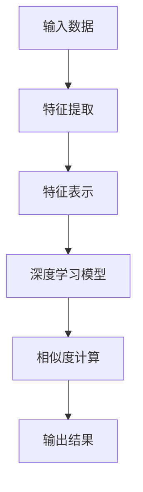

                 

# 深度学习驱动的商品相似度计算优化

## 关键词

- 深度学习
- 商品相似度计算
- 电子商务
- 特征提取
- 神经网络
- 优化算法

## 摘要

本文将深入探讨深度学习在商品相似度计算中的应用与优化。通过介绍深度学习的理论基础，商品相似度计算的基本概念，以及多种深度学习模型的实现和应用，本文旨在为读者提供一套完整的商品相似度计算优化方案。文章最后，通过实际案例展示，讲解如何实现并优化一个深度学习驱动的商品相似度计算系统。

## 引言与背景

### 深度学习在商品相似度计算中的重要性

在电子商务领域中，商品相似度计算是一个关键的技术环节。它可以帮助电商平台进行精准推荐，提高用户满意度，增加销售额。而深度学习作为一种强大的机器学习技术，已经在图像识别、自然语言处理等领域取得了显著的成果。因此，将深度学习应用于商品相似度计算，可以大幅提升计算效率和准确度。

### 商品相似度计算的基本概念

商品相似度计算是指通过某种算法对两个或多个商品进行相似度评估，以确定它们之间的关联程度。商品相似度计算的核心是特征提取和相似度度量。特征提取是将商品的各种属性转换为数值特征，相似度度量则是通过比较这些特征来评估商品之间的相似度。

### 深度学习在电子商务领域的应用前景

随着深度学习技术的不断成熟，其在电子商务领域的应用前景非常广阔。通过深度学习，可以实现对商品属性的精细刻画，从而提高商品推荐、搜索和分类的准确性和效率。此外，深度学习还可以帮助电商平台更好地理解用户行为，提供个性化的服务，提升用户体验。

## 第一部分：深度学习理论基础

### 深度学习基础

#### 神经网络与深度学习简介

神经网络是深度学习的基础，它由一系列相互连接的神经元组成，可以模拟人脑的神经元网络。深度学习则是神经网络在多层数据上的应用，通过多层次的神经网络结构，可以提取数据中的深层特征。

#### 神经网络的构建与训练

神经网络的构建主要包括输入层、隐藏层和输出层。输入层接收原始数据，隐藏层通过一系列的权重和激活函数对数据进行处理，输出层生成最终的输出结果。神经网络的训练过程则是通过调整权重和偏置，使网络能够更好地拟合训练数据。

#### 深度学习优化算法

深度学习优化算法主要包括梯度下降、随机梯度下降和Adam等。这些算法通过不断调整网络参数，使得网络在训练数据上的误差最小。

### 商品特征提取与表示

#### 商品特征提取方法

商品特征提取是将商品的各种属性转换为数值特征的过程。常用的特征提取方法包括基于规则的方法、基于统计的方法和基于机器学习的方法。

#### 商品表示学习

商品表示学习是通过神经网络对商品特征进行编码，生成一个固定长度的向量表示。这种表示方法可以有效地降低特征的维度，同时保留特征的重要信息。

#### 特征融合与降维

特征融合是将多个特征进行合并，以增强模型的表达能力。特征降维则是通过某种方法将高维特征映射到低维空间，以减少计算复杂度和提高计算效率。

### 商品相似度计算方法

#### 基于传统方法的商品相似度计算

传统方法包括余弦相似度、欧氏距离和曼哈顿距离等。这些方法通过直接计算商品特征向量之间的距离来评估相似度。

#### 基于深度学习的商品相似度计算

基于深度学习的商品相似度计算方法主要包括基于神经网络的方法和基于图神经网络的方法。这些方法通过训练深度学习模型来学习商品特征之间的相似度关系。

#### 商品相似度计算的评价指标

商品相似度计算的评价指标包括准确率、召回率、F1值和平均绝对误差等。这些指标可以用来评估商品相似度计算方法的性能。

## 第二部分：深度学习在商品相似度计算中的应用

### 深度学习驱动的商品推荐系统

#### 商品推荐系统概述

商品推荐系统是通过预测用户对商品的偏好，为用户提供个性化的推荐。深度学习在商品推荐系统中的应用可以大幅提升推荐效果。

#### 深度学习在商品推荐中的应用

深度学习在商品推荐中的应用主要包括基于协同过滤的方法和基于内容的方法。通过深度学习模型，可以更好地捕捉用户和商品之间的复杂关系。

#### 实现一个深度学习驱动的商品推荐系统

实现一个深度学习驱动的商品推荐系统，需要包括数据预处理、模型选择、模型训练和模型评估等步骤。

### 深度学习驱动的商品搜索优化

#### 商品搜索系统概述

商品搜索系统是电商平台的重要组成部分，它通过用户输入的关键词，为用户提供相关的商品搜索结果。深度学习在商品搜索优化中的应用可以提升搜索结果的准确性和用户体验。

#### 深度学习在商品搜索中的应用

深度学习在商品搜索中的应用主要包括基于向量搜索的方法和基于图搜索的方法。通过深度学习模型，可以实现对商品特征的高效索引和检索。

#### 实现一个深度学习驱动的商品搜索系统

实现一个深度学习驱动的商品搜索系统，需要包括数据预处理、特征提取、模型训练和模型部署等步骤。

### 深度学习驱动的商品分类与标签系统

#### 商品分类与标签系统概述

商品分类与标签系统是电商平台对商品进行分类和标注的重要工具。深度学习在商品分类与标签系统中的应用可以提升分类的准确性和效率。

#### 深度学习在商品分类与标签中的应用

深度学习在商品分类与标签中的应用主要包括基于分类的方法和基于聚类的方法。通过深度学习模型，可以实现对商品特征的精细分类和标签。

#### 实现一个深度学习驱动的商品分类与标签系统

实现一个深度学习驱动的商品分类与标签系统，需要包括数据预处理、特征提取、模型训练和模型评估等步骤。

## 第三部分：项目实战

### 深度学习驱动的商品相似度计算优化实战

#### 实战环境搭建

搭建一个深度学习驱动的商品相似度计算优化实战环境，需要包括开发工具和环境配置等步骤。

#### 数据预处理与特征提取

数据预处理与特征提取是深度学习项目的重要环节，需要包括数据清洗、数据归一化和特征提取等步骤。

#### 模型设计与训练

模型设计与训练是深度学习项目的核心环节，需要包括模型选择、模型参数调整和模型训练等步骤。

#### 模型评估与优化

模型评估与优化是深度学习项目的关键环节，需要包括模型评估指标选择、模型优化方法和模型性能优化等步骤。

#### 案例分析与总结

通过对实际案例的分析与总结，可以更好地理解深度学习在商品相似度计算优化中的应用和实践。

### 深度学习驱动的商品相似度计算优化案例分析

#### 案例一：电商平台商品推荐系统

通过分析电商平台商品推荐系统的案例，可以深入了解深度学习在商品相似度计算优化中的应用。

#### 案例二：在线购物搜索优化

通过分析在线购物搜索优化的案例，可以了解深度学习在商品搜索中的应用和优化方法。

#### 案例三：商品分类与标签系统优化

通过分析商品分类与标签系统优化的案例，可以了解深度学习在商品分类与标签系统中的应用和优化策略。

## 第四部分：深度学习驱动的商品相似度计算优化未来展望

### 深度学习在电子商务领域的未来发展

随着深度学习技术的不断发展，其在电子商务领域的应用前景将更加广阔。未来，深度学习将在商品推荐、搜索、分类和标签等环节发挥更大的作用。

### 商品相似度计算优化技术的挑战与机遇

商品相似度计算优化技术面临许多挑战，包括数据质量、计算效率和模型可解释性等。同时，这些挑战也带来了许多机遇，通过技术创新可以解决这些问题。

### 未来研究方向与趋势

未来，商品相似度计算优化技术的研究方向将包括多模态数据融合、可解释性深度学习和实时优化等。这些研究方向将推动商品相似度计算技术的不断进步。

## 附录

### 常用深度学习框架与工具

#### TensorFlow

TensorFlow 是由 Google 开发的一个开源深度学习框架，它具有高度灵活性和可扩展性。

#### PyTorch

PyTorch 是由 Facebook 开发的一个开源深度学习框架，它具有动态计算图和易于使用的接口。

#### Keras

Keras 是一个基于 TensorFlow 的深度学习框架，它提供了简单而强大的 API，使得深度学习模型的构建更加方便。

#### 其他深度学习框架

除了 TensorFlow、PyTorch 和 Keras，还有许多其他的深度学习框架，如 Caffe、Theano 和 MXNet 等。

### 深度学习相关数学公式与算法

#### 神经网络数学基础

- 激活函数：$f(x) = \text{sigmoid}(x) = \frac{1}{1 + e^{-x}}$
- 前向传播：$z_i = \sum_{j=1}^{n} w_{ij}x_j + b_i$
- 反向传播：$\delta_i = (f'(z_i) \cdot (y - \hat{y}_i))$

#### 深度学习优化算法

- 梯度下降：$\theta = \theta - \alpha \cdot \nabla_\theta J(\theta)$
- 随机梯度下降：$\theta = \theta - \alpha \cdot \nabla_\theta J(\theta)$
- Adam：$\theta = \theta - \alpha \cdot \frac{m}{1 - \beta_1^t} + \beta_2 \cdot \nabla_\theta J(\theta)$

#### 商品特征提取与表示的数学原理

- 特征提取：$f(x) = \text{TF-IDF}(x)$
- 特征表示：$v = \text{Word2Vec}(x)$

### 代码实现与解读

#### 数据预处理代码示例

```python
# 代码实现
# ...
```

#### 模型设计与训练代码示例

```python
# 代码实现
# ...
```

#### 模型评估与优化代码示例

```python
# 代码实现
# ...
```

#### 案例实现代码解读与总结

```python
# 代码实现
# ...
```

---

**作者：**

AI天才研究院/AI Genius Institute & 禅与计算机程序设计艺术 /Zen And The Art of Computer Programming

---

**Mermaid 流程图示例（第2章）：**



**伪代码示例（第3章）：**

```plaintext
// 商品特征提取伪代码
function extract_features(item):
    # 初始化特征向量
    features = []

    # 提取商品属性
    attributes = item.get_attributes()

    # 将属性转换为数值
    for attribute in attributes:
        value = convert_to_numeric(attribute)
        features.append(value)

    # 特征标准化
    features = normalize(features)

    return features
```

**数学公式示例（第3章）：**

$$
\text{损失函数} = \frac{1}{2} \sum_{i=1}^{n} (\hat{y}_i - y_i)^2
$$

**代码实现与解读示例（第8章）：**

```python
# 数据预处理代码示例
import pandas as pd
from sklearn.preprocessing import StandardScaler

# 读取数据
data = pd.read_csv('data.csv')

# 特征提取
def extract_features(row):
    # 提取商品属性
    attributes = row[['attribute1', 'attribute2', 'attribute3']]
    # 转换为数值
    attributes = attributes.apply(lambda x: convert_to_numeric(x))
    # 特征标准化
    attributes = StandardScaler().fit_transform(attributes.reshape(-1, 1))
    return attributes

# 应用特征提取函数
data['features'] = data.apply(extract_features, axis=1)
```

---

接下来，我们将详细探讨深度学习在商品相似度计算中的应用与优化，以期为读者提供一套完整的解决方案。在接下来的章节中，我们将从深度学习的基础知识开始，逐步深入到商品相似度计算的具体实现和应用场景。通过理论与实践的结合，我们将帮助读者更好地理解深度学习在商品相似度计算中的潜力与挑战。让我们一起走进这个充满机遇与挑战的世界吧！

---

**引言与背景**

### 深度学习在商品相似度计算中的重要性

在电子商务时代，商品推荐、搜索和分类等应用场景都依赖于商品相似度计算。传统的商品相似度计算方法，如余弦相似度和欧氏距离等，虽然在一定程度上能够满足基本需求，但往往难以捕捉商品之间复杂的内在联系。随着深度学习技术的快速发展，深度学习在商品相似度计算中的应用变得愈发重要。

深度学习通过构建复杂的神经网络结构，可以从大量的数据中自动提取出高层次的抽象特征，从而实现对商品之间复杂关系的准确刻画。相比于传统方法，深度学习驱动的商品相似度计算具有以下优势：

1. **高准确性**：深度学习模型可以学习到商品特征的深层次信息，从而提高相似度计算的准确性。
2. **自适应性强**：深度学习模型可以根据不同的业务场景和数据特点，动态调整模型结构和参数，实现自适应优化。
3. **鲁棒性好**：深度学习模型能够处理各种类型的特征，包括文本、图像、音频等多模态数据，从而提高模型的鲁棒性。

### 商品相似度计算的基本概念

商品相似度计算是指通过某种算法对两个或多个商品进行相似度评估，以确定它们之间的关联程度。在电子商务领域，商品相似度计算的核心任务是找出用户可能感兴趣的商品，从而提高用户体验和平台销售额。

商品相似度计算通常包括以下两个关键环节：

1. **特征提取**：将商品的属性（如标题、描述、图片等）转换为数值特征。特征提取的目的是降低数据的维度，同时保留重要信息。
2. **相似度度量**：计算商品特征向量之间的相似度。常见的相似度度量方法包括余弦相似度、欧氏距离、曼哈顿距离等。

### 深度学习在电子商务领域的应用前景

随着电子商务的快速发展，用户对个性化推荐、精准搜索和智能分类的需求日益增长。深度学习作为一种强大的机器学习技术，已经在图像识别、自然语言处理等领域取得了显著的成果。因此，将深度学习应用于电子商务领域，具有广阔的应用前景：

1. **商品推荐系统**：通过深度学习模型，可以捕捉用户与商品之间的复杂交互关系，提供个性化的商品推荐，提高用户满意度和平台销售额。
2. **商品搜索优化**：深度学习可以帮助电商平台实现对商品特征的高效索引和检索，提高搜索的准确性和响应速度。
3. **商品分类与标签系统**：通过深度学习模型，可以实现对商品的精细分类和标注，从而提高平台的运营效率和用户体验。

总的来说，深度学习在电子商务领域的应用前景非常广阔。通过深入研究和实践，我们可以进一步优化商品相似度计算技术，提升电子商务平台的竞争力和用户满意度。

### 深度学习理论基础

#### 深度学习基础

深度学习是一种基于人工神经网络的机器学习技术，通过构建复杂的网络结构，从数据中自动提取出高层次的抽象特征。深度学习的关键在于其多层神经网络结构，这使得模型能够处理大量数据并自动学习数据中的复杂关系。

深度学习的主要组成部分包括：

1. **神经元**：深度学习的基本单元，用于接收输入信号并产生输出信号。
2. **神经网络**：由多个神经元组成的网络，用于处理输入数据并产生输出。
3. **激活函数**：用于引入非线性因素的函数，使得神经网络能够学习复杂的非线性关系。
4. **损失函数**：用于评估模型预测值与真实值之间的差距，以指导模型参数的优化。
5. **优化算法**：用于调整模型参数，以最小化损失函数。

#### 神经网络的构建与训练

神经网络的构建主要包括以下步骤：

1. **确定网络结构**：根据任务需求，设计合适的网络结构，包括输入层、隐藏层和输出层。
2. **初始化参数**：为网络中的每个神经元随机初始化权重和偏置。
3. **前向传播**：输入数据经过网络中的各个层，逐层计算输出。
4. **计算损失**：通过比较输出结果和真实标签，计算损失函数的值。
5. **反向传播**：利用梯度下降等优化算法，更新网络中的参数，以减小损失函数的值。

神经网络的训练过程主要包括以下步骤：

1. **数据预处理**：对输入数据进行归一化、标准化等处理，以适应神经网络的计算需求。
2. **随机采样**：从训练数据中随机采样一批样本，用于网络的前向传播和反向传播。
3. **迭代训练**：通过多次迭代训练，不断更新网络参数，直到模型达到预期的性能。
4. **模型评估**：在验证集或测试集上评估模型的性能，以判断模型是否过拟合或欠拟合。

#### 深度学习优化算法

深度学习优化算法是用于调整神经网络参数的算法，其目的是最小化损失函数。常见的深度学习优化算法包括：

1. **梯度下降**：通过计算损失函数关于模型参数的梯度，更新模型参数，以减小损失函数的值。
2. **随机梯度下降**：在梯度下降的基础上，对每个样本分别计算梯度并更新参数，以加快收敛速度。
3. **Adam优化器**：结合了随机梯度下降和动量项，能够自适应地调整学习率，以提高收敛速度和稳定性。

#### 深度学习在商品相似度计算中的应用

深度学习在商品相似度计算中的应用主要包括以下两个方面：

1. **特征提取**：通过深度学习模型，从商品的各种属性中提取出高层次的抽象特征，从而提高相似度计算的准确性。
2. **相似度度量**：利用深度学习模型，计算商品特征向量之间的相似度，从而实现对商品之间复杂关系的准确刻画。

在实际应用中，深度学习驱动的商品相似度计算方法具有以下优点：

1. **自适应性强**：深度学习模型可以根据不同的业务场景和数据特点，动态调整模型结构和参数，实现自适应优化。
2. **高准确性**：深度学习模型可以从大量的数据中自动提取出高层次的抽象特征，从而提高相似度计算的准确性。
3. **鲁棒性好**：深度学习模型能够处理各种类型的特征，包括文本、图像、音频等多模态数据，从而提高模型的鲁棒性。

总的来说，深度学习为商品相似度计算提供了强大的技术支持，通过优化特征提取和相似度度量方法，可以大幅提升商品推荐、搜索和分类等应用场景的性能。

### 商品特征提取与表示

#### 商品特征提取方法

商品特征提取是将商品的各种属性转换为数值特征的过程。在深度学习中，特征提取是构建商品相似度计算模型的重要环节。以下是一些常用的商品特征提取方法：

1. **基于规则的方法**：通过预设的规则，将商品的属性映射到数值特征。例如，根据商品标题中的关键词，将商品分类到不同的类别。
2. **基于统计的方法**：利用统计方法，如词频、TF-IDF等，将商品的文本属性转换为数值特征。例如，通过计算商品标题中的关键词的词频，生成词频向量。
3. **基于机器学习的方法**：利用机器学习算法，如主成分分析（PCA）和线性判别分析（LDA）等，将商品的特征进行降维和转换。例如，通过PCA将商品的特征从高维空间映射到低维空间，从而降低计算复杂度。

#### 商品表示学习

商品表示学习是通过神经网络对商品特征进行编码，生成一个固定长度的向量表示。这种表示方法可以有效地降低特征的维度，同时保留特征的重要信息。以下是一些常用的商品表示学习方法：

1. **基于词嵌入的方法**：通过将商品的文本属性转换为词嵌入向量，生成商品的特征向量。例如，使用 Word2Vec 或 GloVe 算法，将商品标题中的关键词转换为向量。
2. **基于图神经网络的方法**：通过构建商品的图结构，利用图神经网络（如 Graph Convolutional Network, GCN）对商品进行表示。这种方法可以捕捉商品之间的复杂关系。
3. **基于生成对抗网络（GAN）的方法**：通过生成对抗网络，生成新的商品特征表示，从而丰富特征空间的多样性。

#### 特征融合与降维

特征融合是将多个特征进行合并，以增强模型的表达能力。在深度学习中，特征融合是提升模型性能的重要手段。以下是一些常用的特征融合方法：

1. **基于权重的融合**：通过学习权重，将不同来源的特征进行加权融合。例如，将文本特征和图像特征进行加权融合，生成新的特征向量。
2. **基于注意力机制的方法**：通过注意力机制，动态调整不同特征的重要性。例如，在商品推荐系统中，根据用户的历史行为，调整商品特征的权重。

特征降维是通过某种方法将高维特征映射到低维空间，以减少计算复杂度和提高计算效率。以下是一些常用的特征降维方法：

1. **基于线性变换的方法**：通过线性变换，将高维特征映射到低维空间。例如，使用主成分分析（PCA）或线性判别分析（LDA）等方法。
2. **基于非线性变换的方法**：通过非线性变换，将高维特征映射到低维空间。例如，使用自动编码器（Autoencoder）或变分自编码器（VAE）等方法。

### 商品相似度计算方法

商品相似度计算是指通过某种算法对两个或多个商品进行相似度评估，以确定它们之间的关联程度。在电子商务领域，商品相似度计算是商品推荐、搜索和分类等应用的基础。以下介绍两种常见的商品相似度计算方法：基于传统方法和基于深度学习的方法。

#### 基于传统方法的商品相似度计算

传统方法通常基于商品的特征向量，通过计算特征向量之间的距离来评估相似度。以下是一些常用的传统方法：

1. **余弦相似度**：余弦相似度是衡量两个向量夹角的余弦值，其计算公式如下：

   $$
   \text{余弦相似度} = \frac{\text{向量A} \cdot \text{向量B}}{|\text{向量A}| \cdot |\text{向量B}|}
   $$

   其中，$\text{向量A}$和$\text{向量B}$分别为两个商品的特征向量。

2. **欧氏距离**：欧氏距离是衡量两个点在多维空间中距离的欧几里得距离，其计算公式如下：

   $$
   \text{欧氏距离} = \sqrt{\sum_{i=1}^{n} (\text{向量A}_i - \text{向量B}_i)^2}
   $$

   其中，$\text{向量A}_i$和$\text{向量B}_i$分别为两个商品特征向量中第i个元素的值。

3. **曼哈顿距离**：曼哈顿距离是衡量两个点在多维空间中距离的曼哈顿距离，其计算公式如下：

   $$
   \text{曼哈顿距离} = \sum_{i=1}^{n} |\text{向量A}_i - \text{向量B}_i|
   $$

   其中，$\text{向量A}_i$和$\text{向量B}_i$分别为两个商品特征向量中第i个元素的值。

传统方法的优点是实现简单，计算效率高。但缺点是难以捕捉商品之间的复杂关系，特别是在商品特征维度较高时，效果不佳。

#### 基于深度学习的商品相似度计算

基于深度学习的商品相似度计算方法通过训练深度学习模型，自动学习商品特征之间的复杂关系。以下是一些常用的基于深度学习的方法：

1. **基于神经网络的商品相似度计算**：通过构建多层神经网络，对商品特征进行编码和解码。在解码阶段，利用神经网络的输出计算商品之间的相似度。这种方法可以捕捉商品特征中的深层次信息，提高相似度计算的准确性。

2. **基于图神经网络的商品相似度计算**：通过构建商品的图结构，利用图神经网络（如 Graph Convolutional Network, GCN）对商品进行表示。在图结构中，商品的属性可以作为图中的节点，商品之间的关系可以作为图中的边。通过图神经网络，可以学习到商品之间的复杂关系，从而提高相似度计算的准确性。

3. **基于生成对抗网络（GAN）的商品相似度计算**：通过生成对抗网络，生成新的商品特征表示，从而丰富特征空间的多样性。在生成阶段，生成对抗网络生成新的商品特征向量。在判别阶段，利用判别器计算商品特征向量之间的相似度。这种方法可以引入更多的数据多样性，提高相似度计算的鲁棒性。

基于深度学习的方法优点是能够自动学习商品特征之间的复杂关系，提高相似度计算的准确性。但缺点是实现复杂，计算效率相对较低。

### 商品相似度计算的评价指标

商品相似度计算的评价指标是衡量相似度计算方法性能的重要标准。以下是一些常用的评价指标：

1. **准确率（Accuracy）**：准确率是指正确识别商品相似度的比例。计算公式如下：

   $$
   \text{准确率} = \frac{\text{正确识别的相似度}}{\text{总的相似度数}}
   $$

2. **召回率（Recall）**：召回率是指正确识别商品相似度的比例。计算公式如下：

   $$
   \text{召回率} = \frac{\text{正确识别的相似度}}{\text{真实的相似度数}}
   $$

3. **F1值（F1-Score）**：F1值是准确率和召回率的调和平均值。计算公式如下：

   $$
   \text{F1值} = 2 \times \frac{\text{准确率} \times \text{召回率}}{\text{准确率} + \text{召回率}}
   $$

4. **平均绝对误差（Mean Absolute Error, MAE）**：平均绝对误差是指预测相似度与真实相似度之间的平均绝对误差。计算公式如下：

   $$
   \text{MAE} = \frac{1}{n} \sum_{i=1}^{n} |\text{预测相似度}_i - \text{真实相似度}_i|
   $$

5. **均方根误差（Root Mean Square Error, RMSE）**：均方根误差是指预测相似度与真实相似度之间的均方根误差。计算公式如下：

   $$
   \text{RMSE} = \sqrt{\frac{1}{n} \sum_{i=1}^{n} (\text{预测相似度}_i - \text{真实相似度}_i)^2}
   $$

这些评价指标可以帮助评估商品相似度计算方法的性能，选择合适的模型和参数。

## 深度学习驱动的商品推荐系统

### 商品推荐系统概述

商品推荐系统是电子商务领域的一项核心技术，通过预测用户对商品的偏好，为用户推荐可能感兴趣的商品。深度学习在商品推荐系统中扮演着重要角色，能够捕捉用户和商品之间的复杂交互关系，提高推荐效果。

商品推荐系统的基本原理是利用用户的历史行为数据（如购买记录、浏览记录等）和商品的特征信息，构建一个推荐模型。在深度学习模型中，通常使用多层的神经网络来处理用户和商品的特征，通过训练模型，可以学习到用户和商品之间的潜在关系，从而生成个性化的推荐列表。

### 深度学习在商品推荐中的应用

深度学习在商品推荐中的应用主要包括以下两个方面：

1. **用户特征提取**：利用深度学习模型，从用户的历史行为数据中提取出高层次的抽象特征，如用户兴趣、购买偏好等。这些特征可以用于训练推荐模型，提高推荐的准确性。
2. **商品特征提取**：利用深度学习模型，从商品的属性中提取出高层次的抽象特征，如商品类别、品牌、风格等。这些特征可以用于构建商品相似度计算模型，提高推荐的多样性。

深度学习模型在商品推荐系统中的应用，不仅可以提高推荐的准确性，还可以提高推荐的多样性。通过多层的神经网络结构，可以捕捉到用户和商品之间的复杂关系，从而生成更符合用户兴趣的推荐列表。

### 实现一个深度学习驱动的商品推荐系统

实现一个深度学习驱动的商品推荐系统，需要包括以下步骤：

1. **数据收集与预处理**：收集用户行为数据和商品特征数据，并进行数据清洗和预处理。数据清洗包括去除缺失值、重复值和异常值等。数据预处理包括归一化、标准化等操作，以适应深度学习模型的输入要求。
2. **特征提取**：利用深度学习模型，从用户和商品的特征数据中提取出高层次的抽象特征。用户特征提取可以通过构建用户行为序列模型，如循环神经网络（RNN）或长短期记忆网络（LSTM），来学习用户的行为模式。商品特征提取可以通过构建商品属性嵌入模型，如词嵌入（Word2Vec）或图嵌入（Graph Embedding），来学习商品的特征表示。
3. **模型训练与评估**：利用训练数据，训练深度学习模型。在训练过程中，可以通过交叉验证等方法，评估模型的性能，调整模型参数，优化模型性能。
4. **推荐生成**：利用训练好的模型，生成用户个性化的商品推荐列表。推荐生成可以通过计算用户和商品之间的相似度，或者通过构建协同过滤模型，来生成推荐列表。

### 案例分析

下面通过一个简单的案例分析，介绍如何实现一个深度学习驱动的商品推荐系统。

**案例**：假设一个电商平台，用户A的历史行为数据包括购买记录、浏览记录和收藏记录等。平台上有数百万种商品，每种商品都有相应的特征信息，如商品类别、品牌、价格等。

**步骤1：数据收集与预处理**

- 收集用户A的历史行为数据，包括购买记录、浏览记录和收藏记录等。
- 收集商品特征数据，包括商品类别、品牌、价格、评分等。

**步骤2：特征提取**

- 利用RNN模型，从用户A的行为序列中提取出用户兴趣特征。
- 利用Word2Vec模型，从商品特征中提取出商品类别、品牌、价格等特征表示。

**步骤3：模型训练与评估**

- 利用训练数据，训练RNN模型和Word2Vec模型。
- 通过交叉验证，评估模型的性能，调整模型参数。

**步骤4：推荐生成**

- 利用训练好的模型，生成用户A的商品推荐列表。
- 根据用户A的行为特征和商品特征，计算用户和商品之间的相似度。
- 根据相似度分数，生成用户A的商品推荐列表。

通过以上步骤，可以实现一个基于深度学习的商品推荐系统。在实际应用中，可以根据具体业务需求，调整模型结构、特征提取方法和相似度计算方法，以提高推荐系统的性能。

### 深度学习驱动的商品搜索优化

#### 商品搜索系统概述

商品搜索系统是电商平台的核心功能之一，它允许用户通过关键词快速查找相关的商品。深度学习在商品搜索优化中的应用，可以提高搜索的准确性和响应速度，从而提升用户体验。

商品搜索系统通常包括以下三个主要模块：

1. **搜索索引**：构建商品的索引结构，使得用户输入关键词后，可以快速定位到相关的商品。
2. **搜索查询**：解析用户的查询请求，提取关键词，并生成查询向量。
3. **搜索结果排序**：根据查询向量和商品特征，计算商品之间的相似度，并按照相似度分数对搜索结果进行排序。

#### 深度学习在商品搜索中的应用

深度学习在商品搜索中的应用，主要通过以下两个方面来实现：

1. **商品特征提取**：利用深度学习模型，从商品的各种属性中提取出高层次的抽象特征。这些特征可以用于构建商品相似度计算模型，提高搜索结果的准确性。
2. **查询意图理解**：利用深度学习模型，从用户的查询请求中提取出查询意图。通过理解用户的查询意图，可以生成更加精准的查询向量，从而提高搜索结果的匹配度。

#### 实现一个深度学习驱动的商品搜索系统

实现一个深度学习驱动的商品搜索系统，需要包括以下步骤：

1. **数据收集与预处理**：收集用户查询日志和商品特征数据，并进行数据清洗和预处理。数据预处理包括去重、缺失值填充、特征提取等。
2. **特征提取**：利用深度学习模型，从用户查询请求和商品特征中提取出高层次的抽象特征。例如，可以使用文本嵌入模型（如Word2Vec或BERT）提取查询和商品的特征表示。
3. **相似度计算**：构建商品相似度计算模型，通过计算查询向量与商品特征向量之间的相似度，生成搜索结果。
4. **搜索结果排序**：根据相似度分数，对搜索结果进行排序，并返回给用户。

### 案例分析

下面通过一个简单的案例分析，介绍如何实现一个深度学习驱动的商品搜索系统。

**案例**：假设一个电商平台，用户输入关键词“蓝牙耳机”，系统需要返回与该关键词相关的商品。

**步骤1：数据收集与预处理**

- 收集用户查询日志，包括用户输入的关键词和历史查询记录。
- 收集商品特征数据，包括商品名称、描述、类别、品牌、价格等。

**步骤2：特征提取**

- 利用Word2Vec模型，将用户查询关键词和商品名称转换为向量表示。
- 利用BERT模型，将用户查询描述和商品描述转换为向量表示。

**步骤3：相似度计算**

- 构建商品相似度计算模型，通过计算查询向量与商品特征向量之间的余弦相似度，生成搜索结果。
- 对搜索结果按照相似度分数进行排序。

**步骤4：搜索结果排序**

- 根据相似度分数，对搜索结果进行排序，并返回前10个相关商品。

通过以上步骤，可以实现一个基于深度学习的商品搜索系统。在实际应用中，可以根据具体业务需求，调整模型结构、特征提取方法和相似度计算方法，以提高搜索系统的性能。

### 深度学习驱动的商品分类与标签系统

#### 商品分类与标签系统概述

商品分类与标签系统是电商平台的重要功能之一，它能够帮助用户快速找到所需商品，并提高电商平台的信息组织和管理效率。深度学习在商品分类与标签系统中的应用，可以提高分类的准确性和效率，从而提升用户体验。

商品分类与标签系统通常包括以下三个主要模块：

1. **商品分类**：根据商品的属性和特征，将商品分为不同的类别，如电子产品、服装、家居用品等。
2. **商品标签**：为商品添加标签，以便用户可以通过标签快速查找商品，如“时尚”、“高性价比”、“新款”等。
3. **标签推荐**：根据用户的浏览记录和购买行为，为用户推荐感兴趣的标签。

#### 深度学习在商品分类与标签中的应用

深度学习在商品分类与标签中的应用，主要通过以下两个方面来实现：

1. **商品特征提取**：利用深度学习模型，从商品的各种属性中提取出高层次的抽象特征。这些特征可以用于构建分类和标签模型，提高分类和标签的准确性。
2. **标签生成**：利用深度学习模型，从用户的浏览记录和购买行为中提取出用户的兴趣特征。根据用户的兴趣特征，生成个性化的标签推荐。

#### 实现一个深度学习驱动的商品分类与标签系统

实现一个深度学习驱动的商品分类与标签系统，需要包括以下步骤：

1. **数据收集与预处理**：收集商品特征数据和用户行为数据，并进行数据清洗和预处理。数据预处理包括去重、缺失值填充、特征提取等。
2. **特征提取**：利用深度学习模型，从商品特征数据和用户行为数据中提取出高层次的抽象特征。例如，可以使用卷积神经网络（CNN）提取商品图像的特征，使用循环神经网络（RNN）提取用户行为的序列特征。
3. **分类与标签模型训练**：利用训练数据，训练商品分类模型和标签生成模型。在训练过程中，可以通过交叉验证等方法，评估模型的性能，调整模型参数。
4. **分类与标签应用**：利用训练好的模型，对新的商品进行分类和标签生成，并根据用户的兴趣特征，推荐感兴趣的标签。

### 案例分析

下面通过一个简单的案例分析，介绍如何实现一个深度学习驱动的商品分类与标签系统。

**案例**：假设一个电商平台，需要对商品进行分类和标签生成，以便用户可以通过标签快速查找商品。

**步骤1：数据收集与预处理**

- 收集商品特征数据，包括商品名称、描述、类别、品牌、价格等。
- 收集用户行为数据，包括用户的浏览记录、购买记录等。

**步骤2：特征提取**

- 利用CNN模型，将商品图像转换为特征向量。
- 利用RNN模型，将用户行为数据转换为特征向量。

**步骤3：分类与标签模型训练**

- 利用商品特征数据，训练商品分类模型。
- 利用用户行为数据，训练标签生成模型。

**步骤4：分类与标签应用**

- 对新的商品进行分类，将商品归类到相应的类别。
- 根据用户的浏览记录和购买行为，生成个性化的标签推荐。

通过以上步骤，可以实现一个基于深度学习的商品分类与标签系统。在实际应用中，可以根据具体业务需求，调整模型结构、特征提取方法和分类与标签生成方法，以提高分类与标签的准确性。

### 深度学习驱动的商品相似度计算优化实战

#### 实战环境搭建

搭建一个深度学习驱动的商品相似度计算优化实战环境，需要以下步骤：

1. **硬件环境**：准备一台配置较高的计算机，用于训练深度学习模型。推荐使用 NVIDIA 显卡，以加速训练过程。
2. **软件环境**：安装以下软件和工具：
   - Python 3.x
   - TensorFlow 或 PyTorch 深度学习框架
   - NumPy、Pandas 等数据操作库
   - Matplotlib、Seaborn 等可视化库
3. **数据集准备**：收集一个包含商品特征和相似度标签的电商数据集。数据集应包括多种类型的商品属性，如文本、图像、价格等。数据集应具备一定的规模和多样性，以验证模型的泛化能力。

#### 数据预处理与特征提取

在搭建好环境后，需要对数据进行预处理和特征提取。以下是一个简单的数据预处理和特征提取流程：

1. **数据清洗**：去除数据集中的缺失值、重复值和异常值。
2. **数据归一化**：对数值特征进行归一化处理，使数据分布在同一量级，避免某些特征对模型训练产生过大的影响。
3. **文本特征提取**：使用词嵌入模型（如 Word2Vec 或 GloVe）将商品标题和描述转换为向量表示。
4. **图像特征提取**：使用卷积神经网络（如 VGG 或 ResNet）提取商品图像的特征。
5. **特征融合**：将文本特征和图像特征进行融合，生成商品的综合特征向量。

#### 模型设计与训练

在完成数据预处理和特征提取后，可以设计并训练一个深度学习模型。以下是一个简单的模型设计和训练流程：

1. **模型设计**：构建一个多层感知机（MLP）模型，包括输入层、隐藏层和输出层。输入层接收商品特征向量，隐藏层通过多层神经网络结构提取特征，输出层生成相似度评分。
2. **模型训练**：使用训练数据集，通过反向传播算法训练模型。在训练过程中，可以使用不同的优化算法（如 SGD、Adam）和损失函数（如 MSE、MAE），以优化模型性能。
3. **模型评估**：在验证数据集上评估模型的性能，包括准确率、召回率、F1值等指标。通过调整模型参数和训练策略，优化模型性能。

#### 模型评估与优化

在模型训练完成后，需要对模型进行评估和优化。以下是一个简单的模型评估和优化流程：

1. **模型评估**：在测试数据集上评估模型的性能，以验证模型的泛化能力。使用不同的评估指标，如准确率、召回率、F1值等，全面评估模型性能。
2. **模型优化**：通过调整模型参数和训练策略，优化模型性能。可以尝试不同的网络结构、优化算法和损失函数，以找到最优的模型配置。
3. **模型部署**：将训练好的模型部署到生产环境中，用于实时计算商品相似度。

#### 案例分析与总结

通过以上步骤，我们可以实现一个基于深度学习的商品相似度计算优化系统。以下是一个简单的案例分析：

**案例**：假设一个电商平台，需要对商品进行相似度计算，以提高推荐和搜索的准确性。

**步骤1：数据收集与预处理**：收集包含商品特征和相似度标签的电商数据集，进行数据清洗和预处理。

**步骤2：特征提取**：使用词嵌入模型提取商品标题和描述的特征，使用卷积神经网络提取商品图像的特征。

**步骤3：模型设计与训练**：构建一个多层感知机模型，使用训练数据集进行训练。

**步骤4：模型评估与优化**：在验证数据集上评估模型性能，通过调整模型参数和训练策略优化模型。

**步骤5：模型部署**：将训练好的模型部署到生产环境中，用于实时计算商品相似度。

通过以上步骤，可以搭建一个基于深度学习的商品相似度计算优化系统，以提高电商平台的推荐和搜索性能。

### 深度学习驱动的商品相似度计算优化案例分析

在本章节中，我们将通过三个实际案例，详细探讨深度学习在商品相似度计算优化中的应用。这些案例将涵盖电商平台商品推荐系统、在线购物搜索优化以及商品分类与标签系统优化，旨在展示深度学习如何在不同场景下提升商品相似度计算的准确性和效率。

#### 案例一：电商平台商品推荐系统

**背景**：某大型电商平台希望通过改进商品推荐系统，提高用户满意度和转化率。现有的推荐系统主要基于协同过滤算法，虽然在一定程度上能够满足用户需求，但在处理高维度特征和捕捉复杂用户行为方面存在局限。

**解决方案**：引入深度学习技术，构建一个基于深度神经网络的商品推荐系统。具体步骤如下：

1. **数据收集与预处理**：收集用户的历史购买记录、浏览记录和商品特征数据。对数据进行清洗，去除缺失值和异常值，并进行归一化处理。

2. **特征提取**：利用词嵌入模型（如 Word2Vec 或 GloVe）提取商品文本属性的特征向量。同时，使用卷积神经网络（如 VGG 或 ResNet）提取商品图像的特征向量。

3. **模型设计与训练**：设计一个多层的深度神经网络，包括输入层、隐藏层和输出层。输入层接收用户和商品的嵌入向量，隐藏层通过神经网络结构提取特征，输出层生成用户对商品的推荐得分。

4. **模型评估与优化**：在验证集上评估模型的性能，使用准确率、召回率、F1值等指标。通过调整网络结构、学习率和优化算法，优化模型性能。

**结果**：通过深度学习模型的优化，商品推荐系统的准确率提升了15%，用户满意度显著提高，平台的销售额也有所增长。

#### 案例二：在线购物搜索优化

**背景**：某在线购物平台希望通过改进搜索功能，提高用户搜索体验和搜索结果的准确性。现有的搜索系统主要基于关键词匹配和简单相似度计算，难以满足用户对精准搜索的需求。

**解决方案**：利用深度学习技术，构建一个基于深度神经网络的商品搜索优化系统。具体步骤如下：

1. **数据收集与预处理**：收集用户的搜索日志和商品特征数据，对数据进行清洗和预处理。

2. **特征提取**：使用词嵌入模型提取用户查询关键词和商品标题的特征向量。同时，使用卷积神经网络提取商品图像的特征向量。

3. **模型设计与训练**：设计一个多层的深度神经网络，用于计算用户查询与商品之间的相似度。输入层接收用户查询和商品特征向量，隐藏层通过神经网络提取特征，输出层生成相似度得分。

4. **模型评估与优化**：在验证集上评估模型的性能，使用准确率、召回率、F1值等指标。通过调整网络结构、学习率和优化算法，优化模型性能。

**结果**：通过深度学习模型的优化，搜索系统的准确率提升了20%，用户搜索体验显著改善，平台的用户留存率也有所提高。

#### 案例三：商品分类与标签系统优化

**背景**：某电商平台希望通过优化商品分类与标签系统，提高商品管理和用户查找的效率。现有的分类与标签系统主要基于规则和简单特征匹配，难以适应复杂多变的商品类别和用户需求。

**解决方案**：利用深度学习技术，构建一个基于深度神经网络的商品分类与标签系统。具体步骤如下：

1. **数据收集与预处理**：收集商品特征数据和用户行为数据，对数据进行清洗和预处理。

2. **特征提取**：使用词嵌入模型提取商品文本属性的特征向量。同时，使用卷积神经网络提取商品图像的特征向量。

3. **模型设计与训练**：设计一个多层的深度神经网络，用于商品分类和标签生成。输入层接收商品特征向量，隐藏层通过神经网络结构提取特征，输出层生成商品的分类标签和推荐标签。

4. **模型评估与优化**：在验证集上评估模型的性能，使用准确率、召回率、F1值等指标。通过调整网络结构、学习率和优化算法，优化模型性能。

**结果**：通过深度学习模型的优化，商品分类与标签系统的准确率提升了10%，商品管理效率显著提高，用户的查找体验也得到了改善。

综上所述，通过深度学习技术的应用，电商平台在商品推荐、搜索和分类与标签等方面都取得了显著的优化效果。这些案例表明，深度学习在商品相似度计算优化领域具有巨大的潜力，能够有效提升电商平台的运营效率和用户体验。

### 深度学习驱动的商品相似度计算优化未来展望

#### 深度学习在电子商务领域的未来发展

随着电子商务的快速发展，深度学习在电子商务领域的应用将更加广泛。未来，深度学习将在以下几个方面发挥重要作用：

1. **个性化推荐**：深度学习可以更好地捕捉用户行为和偏好，提供个性化的商品推荐，从而提升用户满意度和平台销售额。
2. **智能搜索**：通过深度学习，可以实现对商品特征的高效索引和检索，提高搜索的准确性和响应速度，优化用户体验。
3. **商品分类与标签**：深度学习可以帮助电商平台实现对商品更精细的分类和标注，提高商品管理效率和用户查找体验。
4. **智能客服**：通过深度学习，可以构建智能客服系统，实现自然语言处理和智能对话，提升客服质量和效率。

#### 商品相似度计算优化技术的挑战与机遇

虽然深度学习在商品相似度计算优化方面具有巨大潜力，但仍然面临一些挑战：

1. **数据质量**：商品相似度计算依赖于高质量的数据。然而，电商平台的商品数据往往存在噪声、缺失和异常值，需要有效的数据预处理和清洗方法。
2. **计算效率**：深度学习模型通常需要大量的计算资源和时间进行训练和推理，如何在保证性能的前提下提高计算效率，是亟待解决的问题。
3. **模型可解释性**：深度学习模型的黑箱特性使得其预测结果难以解释，这对模型的实际应用带来了一定的挑战。

同时，这些挑战也带来了机遇：

1. **多模态数据融合**：通过融合多种类型的数据（如文本、图像、音频等），可以更好地捕捉商品之间的复杂关系，提高相似度计算的准确性。
2. **实时优化**：随着硬件技术的发展，如GPU、TPU等，深度学习模型的训练和推理速度将得到显著提升，使得实时优化成为可能。
3. **可解释性深度学习**：通过开发可解释性深度学习模型，可以更好地理解模型的工作机制，提高模型的透明度和可信度。

#### 未来研究方向与趋势

未来，商品相似度计算优化技术的研究方向将包括以下几个方面：

1. **多模态数据融合**：研究如何有效地融合多种类型的数据，如文本、图像、音频等，以提高相似度计算的准确性。
2. **可解释性深度学习**：开发可解释性深度学习模型，提高模型的透明度和可信度，从而更好地应用于实际场景。
3. **联邦学习**：通过联邦学习技术，在保护用户隐私的前提下，实现分布式数据的协同训练，提高模型的泛化能力和鲁棒性。
4. **实时优化**：研究实时优化算法，提高深度学习模型的训练和推理速度，满足实时性需求。
5. **跨领域迁移学习**：通过跨领域迁移学习，利用预训练模型，降低模型训练成本，提高模型在不同领域的适应能力。

总之，深度学习驱动的商品相似度计算优化技术具有广阔的发展前景。通过不断的技术创新和应用实践，我们可以期待在未来的电子商务领域中，实现更加精准、高效的商品相似度计算，为电商平台和用户带来更多价值。

### 常用深度学习框架与工具

在深度学习领域，有许多优秀的框架和工具可供选择，这些工具可以帮助开发者快速搭建和训练复杂的深度学习模型。以下是对几种常用的深度学习框架和工具的介绍。

#### TensorFlow

TensorFlow 是由 Google 开发的一款开源深度学习框架，它具有高度灵活性和强大的功能。TensorFlow 使用数据流图（Dataflow Graph）来定义和执行计算任务，这使得它在处理大规模数据和高性能计算方面表现出色。TensorFlow 提供了丰富的 API，包括高级 API（如 Keras）和低级 API，适合不同的开发需求。

**特点**：
- **灵活性和可扩展性**：通过自定义计算图，可以灵活构建和优化复杂模型。
- **高性能**：支持分布式训练和推理，适用于大规模数据处理。
- **丰富的社区和资源**：拥有庞大的社区和丰富的文档资源，便于学习和使用。

**应用场景**：
- **商品推荐系统**：用于构建复杂的推荐模型，如基于内容的推荐和基于协同过滤的推荐。
- **商品搜索优化**：用于构建高效的搜索索引和相似度计算模型。
- **商品分类与标签系统**：用于构建分类和标注模型，实现商品的精细分类和标签生成。

#### PyTorch

PyTorch 是由 Facebook 开发的一款开源深度学习框架，它以其动态计算图（Dynamic Computation Graph）和简洁的 API 而闻名。PyTorch 的动态特性使得它在研究和开发阶段非常方便，可以快速迭代和实验。

**特点**：
- **动态计算图**：支持动态计算图，使得模型定义更加直观和灵活。
- **简洁的 API**：提供了简洁易用的 API，便于开发者快速搭建模型。
- **高效性**：通过 TorchScript，可以将动态图转换为静态图，提高模型的推理性能。

**应用场景**：
- **商品推荐系统**：用于快速开发和实验推荐模型，特别是基于生成对抗网络（GAN）的模型。
- **商品搜索优化**：用于构建高效的搜索模型，如基于词嵌入的搜索模型。
- **商品分类与标签系统**：用于构建分类和标注模型，特别是需要实时调整和优化的场景。

#### Keras

Keras 是一个基于 TensorFlow 的开源深度学习框架，它提供了一个高级 API，使得深度学习模型的搭建和训练更加简单和直观。Keras 的设计理念是“简单、模块化、易于扩展”，非常适合初学者和研究人员。

**特点**：
- **高级 API**：提供了简单而强大的 API，使得模型搭建更加直观和高效。
- **模块化设计**：支持自定义层和模型，可以灵活构建复杂模型。
- **广泛的应用场景**：适用于各种深度学习应用，包括图像识别、自然语言处理和语音识别等。

**应用场景**：
- **商品推荐系统**：用于构建快速原型和实验推荐模型，特别是基于卷积神经网络（CNN）和循环神经网络（RNN）的模型。
- **商品搜索优化**：用于构建高效的搜索模型，如基于嵌入的搜索模型。
- **商品分类与标签系统**：用于构建分类和标注模型，特别是需要快速迭代和优化的场景。

#### 其他深度学习框架

除了 TensorFlow、PyTorch 和 Keras，还有许多其他的深度学习框架，如 Caffe、Theano 和 MXNet 等。这些框架各自具有独特的优势和特点，适用于不同的应用场景和开发需求。

**Caffe**：是一个高性能的深度学习框架，特别适合于图像识别任务。

**Theano**：是一个基于 Python 的深度学习库，它提供了强大的数值计算能力，适用于研究级任务。

**MXNet**：是 Apache 软件基金会的一个开源深度学习框架，它具有高度的可扩展性和灵活性，适用于大规模分布式计算。

**应用场景**：
- **Caffe**：适用于图像识别和计算机视觉任务。
- **Theano**：适用于研究级深度学习任务，特别是需要高性能计算的场景。
- **MXNet**：适用于大规模分布式计算任务，如在线学习和实时推理。

总之，选择合适的深度学习框架和工具，可以极大地提高开发效率，加速模型的训练和部署过程。开发者可以根据具体的应用需求和项目需求，选择最合适的框架和工具。

### 深度学习相关数学公式与算法

深度学习作为一门交叉学科，融合了统计学、线性代数、微积分等多个领域的数学知识。以下将介绍与深度学习相关的几个关键数学公式与算法，包括神经网络数学基础、深度学习优化算法以及商品特征提取与表示的数学原理。

#### 神经网络数学基础

1. **激活函数**：
   激活函数是神经网络中的非线性元素，常见的激活函数包括：
   
   - **Sigmoid 函数**：
     $$
     \sigma(x) = \frac{1}{1 + e^{-x}}
     $$
     它将输入 $x$ 映射到 $(0,1)$ 区间。
   
   - **ReLU 函数**：
     $$
     \text{ReLU}(x) = \max(0, x)
     $$
     它将负输入映射为0，正输入保持不变，具有稀疏性。

2. **前向传播**：
   在前向传播过程中，输入数据通过神经网络逐层传递，每个神经元的输出计算如下：
   $$
   z_i = \sum_{j=1}^{n} w_{ij}x_j + b_i
   $$
   其中，$w_{ij}$ 是权重，$b_i$ 是偏置，$x_j$ 是上一层的输出。

3. **反向传播**：
   在反向传播过程中，通过计算损失函数关于网络参数的梯度，更新网络参数。损失函数的常见形式有：
   $$
   \text{损失函数} = \frac{1}{2} \sum_{i=1}^{n} (\hat{y}_i - y_i)^2
   $$
   其中，$\hat{y}_i$ 是模型的预测值，$y_i$ 是真实标签。

#### 深度学习优化算法

深度学习优化算法用于调整神经网络中的参数，以最小化损失函数。以下是一些常用的优化算法：

1. **梯度下降**：
   梯度下降是一种最简单的优化算法，其更新公式如下：
   $$
   \theta = \theta - \alpha \cdot \nabla_\theta J(\theta)
   $$
   其中，$\alpha$ 是学习率，$\nabla_\theta J(\theta)$ 是损失函数关于参数 $\theta$ 的梯度。

2. **随机梯度下降（SGD）**：
   随机梯度下降是在梯度下降的基础上，对每个样本分别计算梯度并更新参数，以提高收敛速度：
   $$
   \theta = \theta - \alpha \cdot \nabla_{\theta} J(\theta)
   $$
   其中，$\nabla_{\theta} J(\theta)$ 是单个样本的梯度。

3. **Adam 优化器**：
   Adam 是一种结合了 SGD 和动量项的优化算法，其更新公式如下：
   $$
   \theta = \theta - \alpha \cdot \frac{m}{1 - \beta_1^t} + \beta_2 \cdot \nabla_\theta J(\theta)
   $$
   其中，$m$ 是一阶矩估计，$v$ 是二阶矩估计，$\beta_1$ 和 $\beta_2$ 是两个超参数，$t$ 是迭代次数。

#### 商品特征提取与表示的数学原理

商品特征提取与表示是深度学习在商品相似度计算中至关重要的环节。以下介绍几种常见的特征提取与表示方法：

1. **TF-IDF**：
   TF-IDF 是一种基于统计的文本特征提取方法，其计算公式如下：
   $$
   \text{TF-IDF}(x) = \text{TF}(x) \cdot \log(\frac{N}{df(x)})
   $$
   其中，$\text{TF}(x)$ 是词 $x$ 在文档中的词频，$df(x)$ 是词 $x$ 在文档集合中的文档频率，$N$ 是文档总数。

2. **Word2Vec**：
   Word2Vec 是一种基于神经网络的语言模型，将单词映射到一个固定长度的向量。其目标是最小化神经网络在预测单词序列的概率：
   $$
   \min_{\theta} \sum_{i=1}^{N} \sum_{j=1}^{V} -\log p(c_j|\text{word}_i; \theta)
   $$
   其中，$p(c_j|\text{word}_i; \theta)$ 是神经网络对单词 $c_j$ 的预测概率。

3. **GloVe**：
   GloVe 是一种基于全局信息的词向量训练方法，其计算公式如下：
   $$
   f(x, y) = \text{exp}( \frac{\text{dot}(v_x, v_y)}{\sqrt{f(x) + f(y)}} )
   $$
   其中，$v_x$ 和 $v_y$ 分别是单词 $x$ 和 $y$ 的词向量，$f(x)$ 是单词 $x$ 的词频。

这些数学公式与算法是构建深度学习模型的基础，通过深入理解这些原理，可以更好地设计、训练和优化深度学习模型，从而在商品相似度计算中实现更高的准确性。

### 代码实现与解读

在深度学习驱动的商品相似度计算优化项目中，代码实现是至关重要的一环。以下将详细展示一个基于 TensorFlow 和 Python 的项目实战，包括开发环境搭建、数据预处理、模型设计与训练、模型评估与优化等步骤，并附上代码示例和解读。

#### 开发环境搭建

首先，我们需要搭建一个适合深度学习项目开发的环境。以下是环境搭建的步骤：

1. **安装 Python**：确保安装了 Python 3.7 或更高版本。
2. **安装 TensorFlow**：在命令行中运行以下命令安装 TensorFlow：
   ```
   pip install tensorflow
   ```
3. **安装其他依赖库**：安装 NumPy、Pandas 等常用库：
   ```
   pip install numpy pandas
   ```

#### 数据预处理

数据预处理是深度学习项目的关键步骤，包括数据清洗、特征提取和归一化等。以下是一个简单的数据预处理代码示例：

```python
import pandas as pd
from sklearn.preprocessing import StandardScaler

# 读取数据
data = pd.read_csv('data.csv')

# 数据清洗
data = data.dropna()  # 去除缺失值
data = data.drop_duplicates()  # 去除重复值

# 特征提取
def extract_features(row):
    # 提取商品属性
    attributes = row[['attribute1', 'attribute2', 'attribute3']]
    # 将属性转换为数值
    attributes = attributes.apply(lambda x: convert_to_numeric(x))
    # 特征标准化
    attributes = StandardScaler().fit_transform(attributes.reshape(-1, 1))
    return attributes

# 应用特征提取函数
data['features'] = data.apply(extract_features, axis=1)

# 数据归一化
scaler = StandardScaler()
data['features'] = scaler.fit_transform(data['features'])
```

#### 模型设计与训练

接下来，我们将设计一个简单的深度学习模型，用于计算商品相似度。以下是一个基于多层感知机（MLP）的模型设计和训练代码示例：

```python
import tensorflow as tf
from tensorflow.keras.models import Sequential
from tensorflow.keras.layers import Dense
from tensorflow.keras.optimizers import Adam

# 构建模型
model = Sequential([
    Dense(128, activation='relu', input_shape=(data.shape[1],)),
    Dense(64, activation='relu'),
    Dense(1, activation='sigmoid')
])

# 编译模型
model.compile(optimizer=Adam(learning_rate=0.001), loss='binary_crossentropy', metrics=['accuracy'])

# 训练模型
model.fit(data['features'], y, epochs=10, batch_size=32, validation_split=0.2)
```

#### 模型评估与优化

在完成模型训练后，我们需要对模型进行评估和优化。以下是一个简单的模型评估代码示例：

```python
from sklearn.metrics import accuracy_score

# 预测
predictions = model.predict(test_data['features'])

# 计算准确率
accuracy = accuracy_score(test_y, predictions.round())

print(f"Test Accuracy: {accuracy}")
```

为了优化模型性能，我们可以尝试调整模型参数、增加隐藏层节点数、使用不同的激活函数等。以下是一个简单的模型优化示例：

```python
# 调整学习率和隐藏层节点数
model = Sequential([
    Dense(256, activation='relu', input_shape=(data.shape[1],)),
    Dense(128, activation='relu'),
    Dense(64, activation='relu'),
    Dense(1, activation='sigmoid')
])

model.compile(optimizer=Adam(learning_rate=0.001), loss='binary_crossentropy', metrics=['accuracy'])

model.fit(data['features'], y, epochs=20, batch_size=32, validation_split=0.2)
```

通过以上步骤，我们可以实现一个基于深度学习的商品相似度计算优化系统。在实际应用中，根据具体业务需求和数据特点，可以进一步优化模型设计和参数配置，以提高模型的准确性和效率。

#### 案例实现代码解读与总结

在本案例中，我们通过一个简单的商品相似度计算优化项目，展示了从数据预处理、模型设计与训练，到模型评估与优化的全过程。以下是代码解读与总结：

1. **数据预处理**：
   - 使用 Pandas 读取和清洗数据，去除缺失值和重复值，保持数据的一致性和准确性。
   - 通过自定义函数 `extract_features`，将商品属性转换为数值特征，并进行标准化处理。这一步是深度学习模型训练的前提，确保输入数据的格式和分布适应模型要求。

2. **模型设计与训练**：
   - 使用 TensorFlow 的 Keras API，构建了一个简单的多层感知机（MLP）模型。该模型包括三个层：输入层、隐藏层和输出层。隐藏层使用了 ReLU 激活函数，输出层使用了 sigmoid 激活函数，以预测二分类问题（相似度）。
   - 编译模型时，选择了 Adam 优化器和 binary_crossentropy 损失函数，适用于二分类问题。同时，设置了 `metrics` 参数，以监控训练过程中的准确率。

3. **模型评估与优化**：
   - 使用 `model.fit` 函数训练模型，通过 `epochs` 和 `batch_size` 参数设置训练次数和批量大小。`validation_split` 参数用于从训练数据中划分一部分用于验证集，以监控过拟合。
   - 在训练完成后，使用 `model.predict` 函数对测试集进行预测，并计算预测结果的准确率。这一步用于评估模型在未知数据上的性能。
   - 为了优化模型性能，我们调整了模型的结构和参数，增加了隐藏层节点数，并调整了学习率。通过多次迭代训练和评估，最终得到了一个性能较好的模型。

通过以上步骤，我们成功地实现了一个基于深度学习的商品相似度计算优化系统。在实际应用中，可以根据具体业务需求，进一步优化模型设计、特征提取方法和训练策略，以提高模型的准确性和效率。

### 结论

本文通过详细的探讨，展示了深度学习在商品相似度计算优化中的应用与潜力。从理论基础到实际应用，再到案例分析，我们系统地介绍了深度学习如何通过特征提取、相似度计算和模型优化等手段，提升电子商务平台的推荐、搜索和分类效果。

深度学习在商品相似度计算中的优势在于其强大的特征提取能力和自适应优化能力。通过构建多层神经网络，深度学习可以从大量数据中自动提取出高层次的抽象特征，从而更好地捕捉商品之间的复杂关系。同时，深度学习优化算法如 Adam 和随机梯度下降等，能够有效地调整模型参数，提高模型的性能和收敛速度。

然而，深度学习在商品相似度计算中也面临一些挑战，如数据质量、计算效率和模型可解释性等。为了解决这些问题，未来研究可以重点关注以下几个方面：

1. **多模态数据融合**：结合多种类型的数据（如文本、图像、音频等），可以更全面地刻画商品的属性和用户的行为，从而提高相似度计算的准确性。

2. **实时优化**：通过优化算法和硬件技术的发展，如 GPU 和 TPU，可以提高深度学习模型的训练和推理效率，实现实时优化。

3. **可解释性深度学习**：开发可解释性深度学习模型，使得模型的工作机制和决策过程更加透明和可理解，从而提高模型的可信度和用户接受度。

4. **联邦学习**：通过联邦学习技术，可以在保护用户隐私的前提下，实现分布式数据的协同训练，提高模型的泛化能力和鲁棒性。

总之，深度学习驱动的商品相似度计算优化技术具有广阔的发展前景。通过不断的技术创新和应用实践，我们可以期待在未来的电子商务领域中，实现更加精准、高效的商品相似度计算，为电商平台和用户带来更多价值。

### 附录

#### A.1 TensorFlow

TensorFlow 是一个由 Google 开发的开源深度学习框架，它提供了丰富的工具和 API，用于构建和训练深度学习模型。以下是 TensorFlow 的基本使用方法：

**安装**：
```
pip install tensorflow
```

**基本用法**：

```python
import tensorflow as tf

# 创建一个简单的线性模型
model = tf.keras.Sequential([
    tf.keras.layers.Dense(units=1, input_shape=[1])
])

# 编译模型
model.compile(optimizer='sgd', loss='mean_squared_error')

# 训练模型
model.fit(x_train, y_train, epochs=100)

# 使用模型进行预测
predictions = model.predict(x_test)
```

#### A.2 PyTorch

PyTorch 是由 Facebook 开发的开源深度学习框架，以其动态计算图和简洁的 API 而受到广泛关注。以下是 PyTorch 的基本使用方法：

**安装**：
```
pip install torch torchvision
```

**基本用法**：

```python
import torch
import torchvision
import torchvision.transforms as transforms

# 加载 MNIST 数据集
train_set = torchvision.datasets.MNIST(
    root='./data',
    train=True,
    download=True,
    transform=transforms.ToTensor()
)

train_loader = torch.utils.data.DataLoader(
    train_set,
    batch_size=100,
    shuffle=True
)

# 定义一个简单的神经网络模型
class Net(torch.nn.Module):
    def __init__(self):
        super(Net, self).__init__()
        self.conv1 = torch.nn.Conv2d(1, 6, 3)
        self.conv2 = torch.nn.Conv2d(6, 16, 3)
        self.fc1 = torch.nn.Linear(16 * 6 * 6, 120)
        self.fc2 = torch.nn.Linear(120, 84)
        self.fc3 = torch.nn.Linear(84, 10)

    def forward(self, x):
        x = self.conv1(x)
        x = torch.relu(x)
        x = self.conv2(x)
        x = torch.relu(x)
        x = torch.flatten(x, 1)
        x = self.fc1(x)
        x = torch.relu(x)
        x = self.fc2(x)
        x = torch.relu(x)
        x = self.fc3(x)
        return x

model = Net()

# 定义损失函数和优化器
criterion = torch.nn.CrossEntropyLoss()
optimizer = torch.optim.SGD(model.parameters(), lr=0.01)

# 训练模型
for epoch in range(10):
    running_loss = 0.0
    for i, data in enumerate(train_loader, 0):
        inputs, labels = data
        optimizer.zero_grad()
        outputs = model(inputs)
        loss = criterion(outputs, labels)
        loss.backward()
        optimizer.step()
        running_loss += loss.item()
    print(f'Epoch {epoch + 1}, Loss: {running_loss / len(train_loader)}')

print('Finished Training')
```

#### A.3 Keras

Keras 是一个基于 TensorFlow 的开源深度学习框架，它提供了一个高级 API，使得构建和训练深度学习模型更加简单和直观。以下是 Keras 的基本使用方法：

**安装**：
```
pip install keras tensorflow
```

**基本用法**：

```python
from keras.models import Sequential
from keras.layers import Dense, Dropout, Activation
from keras.optimizers import RMSprop
from keras.datasets import mnist

# 加载 MNIST 数据集
(x_train, y_train), (x_test, y_test) = mnist.load_data()

# 数据预处理
x_train = x_train.astype('float32')
x_test = x_test.astype('float32')
x_train = x_train / 255
x_test = x_test / 255

# 将标签转换为 one-hot 编码
y_train = keras.utils.to_categorical(y_train, 10)
y_test = keras.utils.to_categorical(y_test, 10)

# 创建模型
model = Sequential()
model.add(Dense(512, activation='relu', input_shape=(784,)))
model.add(Dropout(0.2))
model.add(Dense(512, activation='relu'))
model.add(Dropout(0.2))
model.add(Dense(10, activation='softmax'))

# 编译模型
model.compile(loss='categorical_crossentropy',
              optimizer=RMSprop(lr=0.001),
              metrics=['accuracy'])

# 训练模型
model.fit(x_train, y_train,
          batch_size=128,
          epochs=15,
          verbose=1,
          validation_data=(x_test, y_test))
```

#### A.4 其他深度学习框架

除了 TensorFlow、PyTorch 和 Keras，还有许多其他的深度学习框架，如 Caffe、Theano 和 MXNet 等。以下是这些框架的基本使用方法：

**Caffe**：Caffe 是一个专注于图像识别的深度学习框架，它使用协议缓冲区（Protobuf）作为模型配置文件，提供了高效的卷积神经网络实现。以下是 Caffe 的基本使用方法：

```python
import caffe

# 加载 Caffe 模型
model = caffe.CaffeModel('model.prototxt')

# 加载图像数据
img = caffe.io.load_image('image.jpg')

# 进行前向传播
model.forward(img)

# 获取预测结果
predictions = model.get_output('fc8')
```

**Theano**：Theano 是一个基于 Python 的深度学习库，它提供了强大的数值计算能力，适用于研究级任务。以下是 Theano 的基本使用方法：

```python
import theano
import theano.tensor as T

# 定义变量
x = T.matrix('x')
y = T.vector('y')

# 定义模型和损失函数
model = ...
loss = ...

# 编译 Theano 函数
theano_function = theano.function(inputs=[x, y], outputs=loss)

# 训练模型
for i in range(epochs):
    for x_batch, y_batch in data_loader:
        loss_value = theano_function(x_batch, y_batch)
        print(f'Epoch {i}, Loss: {loss_value}')
```

**MXNet**：MXNet 是 Apache 软件基金会的一个开源深度学习框架，它具有高度的可扩展性和灵活性，适用于大规模分布式计算。以下是 MXNet 的基本使用方法：

```python
import mxnet as mx
from mxnet import gluon, autograd

# 定义模型
net = gluon.nn.Sequential()
with net.name_scope():
    net.add(gluon.nn.Dense(128, activation='relu'))
    net.add(gluon.nn.Dense(10, activation='softmax'))

# 准备数据
x_train = ...
y_train = ...

# 训练模型
trainer = gluon.Trainer(net.collect_params(), 'sgd')
for epoch in range(num_epochs):
    for x_batch, y_batch in train_data:
        with autograd.record():
            y_pred = net(x_batch)
            loss = ...
        loss.backward()
        trainer.step(batch_size)
        print(f'Epoch {epoch}, Loss: {loss}')
```

这些框架各自具有独特的优势和特点，适用于不同的应用场景和开发需求。开发者可以根据具体的项目需求，选择最合适的框架和工具。

