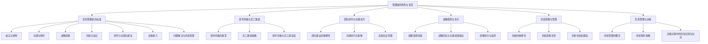

                 

### 深度思考：区分优秀管理者的标准

#### 关键词：
- 优秀管理者
- 标准与素质
- 管理实践
- 案例分析
- 领导力

#### 摘要：
本文旨在深入探讨区分优秀管理者的标准。通过分析基础概念、管理实践、案例分析等多个维度，本文将揭示优秀管理者所必备的技能与素质，从而帮助读者理解如何培养成为一名卓越的领导者。文章将从管理者的角色与责任、优秀管理者的标准、领导风格与员工激励、团队协作与沟通技巧、战略规划与执行、创新思维与管理、危机管理与决策等多个方面进行详细阐述。同时，通过实际案例解析，文章将为读者提供切实可行的管理策略与实践经验。

### 目录大纲：

1. **第一部分：基础概念与核心标准**
   1.1 管理者的角色与责任
   1.2 管理者的核心责任
   1.3 管理者的技能与素质
   1.4 优秀管理者的标准
   1.5 诚实与透明
   1.6 沟通与倾听
   1.7 战略思维
   1.8 创新与适应
   1.9 领导力与团队建设
   1.10 决策能力
   1.11 问题解决与危机管理

2. **第二部分：管理实践与案例分析**
   2.1 领导风格与员工激励
   2.2 员工激励策略
   2.3 领导风格与员工满意度
   2.4 团队协作与沟通技巧
   2.5 高效会议管理
   2.6 战略规划与执行
   2.7 战略目标与关键绩效指标
   2.8 战略执行与监控
   2.9 创新思维与管理
   2.10 创新的重要性
   2.11 创新思维培养
   2.12 创新型组织建设
   2.13 危机管理与决策
   2.14 决策过程中的风险识别与应对

3. **第三部分：案例分析与应用**
   3.1 成功管理案例解析
   3.2 公司重组与转型
   3.3 全球化运营管理
   3.4 危机管理应对策略
   3.5 优秀管理者的成长之路
   3.6 自我反思与持续学习
   3.7 面对挑战与变革
   3.8 领导力的不断提升

4. **附录**
   4.1 经典管理理论回顾
   4.2 管理工具介绍与应用
   4.3 案例分析中用到的管理工具和方法

### Mermaid 流程图：管理者能力与素质发展路径

### 第一部分：基础概念与核心标准

在讨论如何区分优秀管理者之前，我们首先需要明确一些基础概念和核心标准。管理是一个复杂而多维度的过程，涉及到多个方面，包括战略规划、团队协作、决策能力等。优秀管理者不仅需要具备扎实的理论知识，还需要具备实际操作经验，以及不断学习与适应变化的能力。

#### 管理者的角色与责任

**1.1 管理者的定义**

管理者是指在组织中负责规划、组织、领导、控制等活动的个人或团队。他们的主要任务是确保组织目标的实现，通过有效地利用资源，协调不同部门之间的合作，提高整体工作效率。

**1.2 管理者的核心责任**

管理者的核心责任包括以下几个方面：

- **制定战略目标**：管理者需要根据组织的使命和愿景，制定明确的战略目标，并制定相应的行动计划。
- **组织与协调**：管理者需要合理分配资源，确保各部门之间的协作，提高工作效率。
- **领导与激励**：管理者需要具备一定的领导能力，能够激励团队成员，激发他们的潜能，实现组织目标。
- **监控与评估**：管理者需要监控组织绩效，评估战略目标的实现情况，及时调整策略。

**1.3 管理者的技能与素质**

优秀管理者需要具备以下技能与素质：

- **沟通能力**：良好的沟通能力是管理者必备的素质，它有助于管理者与团队成员、上级领导以及外部合作伙伴之间的有效沟通。
- **决策能力**：管理者需要具备较强的决策能力，能够在复杂多变的环境中做出正确的决策。
- **领导力**：管理者需要具备一定的领导力，能够带领团队共同实现目标。
- **创新能力**：在快速变化的时代，管理者需要具备创新能力，能够引领组织不断进步。
- **团队合作**：管理者需要具备良好的团队合作精神，能够与不同背景、不同性格的团队成员有效合作。
- **持续学习**：优秀管理者需要具备持续学习的能力，不断更新知识，适应新环境和新挑战。

#### 优秀管理者的标准

**2.1 诚实与透明**

诚实与透明是优秀管理者的重要标准之一。一个优秀的领导者需要始终保持诚实，对团队成员和上级领导透明，这样才能赢得他们的信任和尊重。透明性有助于建立良好的团队氛围，促进信息的自由流动，提高决策效率。

**2.2 沟通与倾听**

沟通是管理者的核心技能之一。有效的沟通能力不仅包括如何表达自己的观点，更重要的是如何倾听他人的意见。一个优秀的领导者需要善于倾听团队成员的意见，了解他们的需求和困惑，这样才能更好地解决团队问题，提高团队士气。

**2.3 战略思维**

战略思维是优秀管理者的关键能力。一个优秀的领导者需要具备从整体角度思考问题的能力，能够根据组织的目标和愿景，制定长远的发展规划，并制定相应的策略和措施。

**2.4 创新与适应**

创新是组织持续发展的重要驱动力。一个优秀的领导者需要具备创新思维，能够带领团队不断探索新的机会，推动组织变革。同时，管理者还需要具备适应变化的能力，能够迅速调整策略，应对外部环境的变化。

**2.5 领导力与团队建设**

领导力是优秀管理者的核心素质。一个优秀的领导者需要具备较强的领导能力，能够激励团队成员，建立有效的团队协作机制。团队建设是管理者的重要任务之一，通过建设一个高效的团队，可以提高组织整体的工作效率。

**2.6 决策能力**

决策能力是优秀管理者的关键能力之一。管理者需要具备在复杂多变的环境中做出正确决策的能力，能够权衡不同因素，选择最优的方案。有效的决策能力有助于提高组织的管理水平，实现组织的长期发展。

**2.7 问题解决与危机管理**

问题解决和危机管理是优秀管理者的重要能力。管理者需要具备解决问题的能力，能够迅速识别问题，制定有效的解决方案。同时，管理者还需要具备危机管理的能力，能够在危机发生时迅速应对，减少损失。

### 总结

通过以上分析，我们可以看出，优秀管理者需要具备多方面的能力与素质。他们不仅需要具备扎实的理论知识，还需要具备实际操作经验，以及不断学习与适应变化的能力。优秀管理者的标准包括诚实与透明、沟通与倾听、战略思维、创新与适应、领导力与团队建设、决策能力、问题解决与危机管理等多个方面。只有通过不断努力和实践，才能成为一名真正优秀的领导者。

### 第一部分：基础概念与核心标准

#### 第1章：管理者的角色与责任

在组织管理中，管理者的角色与责任至关重要。管理者不仅是组织的核心人物，也是团队发展的关键推动者。他们的职责和角色决定了组织的运作效率和团队凝聚力。以下是对管理者角色与责任的详细探讨。

**1.1 管理者的定义**

管理者是指在组织中负责计划、组织、领导、控制等活动的个人或团队。管理者负责确保组织目标的实现，通过有效地利用资源，协调不同部门之间的合作，提高整体工作效率。管理者的工作不仅仅是对任务进行分配，更重要的是对团队成员进行激励和指导，确保团队目标与组织目标一致。

**1.2 管理者的核心责任**

管理者的核心责任可以从以下几个方面进行描述：

- **制定战略目标**：管理者需要根据组织的使命和愿景，制定明确的战略目标。这些目标需要具体、可衡量，并具有可行性。通过制定战略目标，管理者可以引导团队朝着正确的方向前进。

- **组织与协调**：管理者需要合理分配资源，确保各部门之间的协作，提高工作效率。这包括对人力资源、财务资源、技术资源的合理分配和优化。

- **领导与激励**：管理者需要具备一定的领导能力，能够激励团队成员，引导他们积极工作，达成团队目标。激励措施可以是物质上的奖励，也可以是精神上的认可。

- **监控与评估**：管理者需要监控组织的绩效，评估战略目标的实现情况，并及时调整策略。通过定期的绩效评估，管理者可以及时发现问题和改进措施。

**1.3 管理者的技能与素质**

要成为一名优秀的管理者，以下技能与素质是必不可少的：

- **沟通能力**：管理者需要具备良好的沟通能力，能够与团队成员、上级领导以及外部合作伙伴进行有效的沟通。有效的沟通能够确保信息的准确传递，减少误解和冲突。

- **决策能力**：管理者需要具备在复杂多变的环境中做出正确决策的能力。决策能力包括对信息的分析、权衡不同因素、选择最优方案等。

- **领导力**：管理者需要具备领导力，能够带领团队克服困难，实现目标。领导力包括激励团队成员、建立团队信任、提供指导和支持等。

- **创新能力**：在快速变化的时代，管理者需要具备创新能力，能够推动组织变革和进步。创新能力包括对新思路、新方法、新技术的探索和应用。

- **团队合作**：管理者需要具备良好的团队合作精神，能够与不同背景、不同性格的团队成员有效合作。团队合作精神有助于建立高效的团队，提高工作效率。

- **持续学习**：管理者需要具备持续学习的能力，不断更新知识，适应新环境和新挑战。持续学习不仅有助于个人成长，也能提升整个团队的能力和竞争力。

**1.4 优秀管理者的标准**

要成为优秀的管理者，以下标准是必不可少的：

- **诚实与透明**：优秀的管理者需要始终保持诚实，对团队成员和上级领导透明，赢得信任和尊重。

- **沟通与倾听**：优秀的管理者需要具备良好的沟通能力和倾听能力，能够有效传达信息，了解团队成员的意见和需求。

- **战略思维**：优秀的管理者需要具备从整体角度思考问题的能力，能够制定长远的发展规划。

- **创新与适应**：优秀的管理者需要具备创新思维和适应变化的能力，能够引领组织不断进步。

- **领导力与团队建设**：优秀的管理者需要具备领导力，能够建设一个高效的团队。

- **决策能力**：优秀的管理者需要具备在复杂环境中做出正确决策的能力。

- **问题解决与危机管理**：优秀的管理者需要具备解决问题的能力，能够在危机发生时迅速应对。

通过以上分析，我们可以看到，管理者的角色与责任至关重要。他们不仅需要具备扎实的理论知识，还需要具备实际操作经验，以及不断学习与适应变化的能力。只有通过不断努力和实践，才能成为一名真正优秀的领导者。

### 第2章：优秀管理者的标准

优秀管理者的标准不仅限于具备一定的管理技能和素质，更需要他们在日常工作中展现出一系列具体的特质和行为。以下是对优秀管理者标准的具体分析，这些标准有助于区分卓越的领导者与普通管理者。

#### 2.1 诚实与透明

诚实与透明是优秀管理者的基石。诚实意味着管理者言行一致，对团队成员保持真实和正直。透明性则体现在管理过程中的公开和透明，确保团队成员了解组织的现状、目标以及决策过程。通过诚实与透明，管理者能够建立信任，提升团队的凝聚力和合作精神。

- **行为标准**：管理者应定期与团队成员沟通，分享组织的进展和挑战，接受反馈，并对团队成员的问题和担忧给予及时回应。
- **实例**：例如，一位项目经理在项目遇到困难时，及时向团队成员公开问题，并提出解决方案，赢得了团队的信任和合作。

#### 2.2 沟通与倾听

沟通是管理工作的核心。优秀管理者不仅需要能够清晰地表达自己的观点，还需要具备倾听团队成员意见的能力。有效的沟通能够确保信息准确传递，减少误解和冲突，而倾听则有助于管理者理解团队成员的需求和困惑，从而做出更合理的决策。

- **行为标准**：管理者应主动创建开放和包容的沟通环境，鼓励团队成员表达意见，并对他们的想法给予关注和反馈。
- **实例**：一位产品经理在开发过程中，定期组织团队会议，听取开发人员的意见和建议，从而优化产品功能和用户体验。

#### 2.3 战略思维

战略思维是优秀管理者必备的能力。战略思维不仅仅关注眼前的任务和问题，更注重组织长期的发展和整体目标的实现。具有战略思维的管理者能够从全局出发，制定长远的发展规划，并灵活应对外部环境的变化。

- **行为标准**：管理者应定期审视组织的战略目标，确保团队的工作与整体战略保持一致，并能够根据外部环境的变化及时调整策略。
- **实例**：一位公司CEO在行业竞争加剧时，果断调整公司战略，加大对新产品研发的投入，成功保持了市场竞争力。

#### 2.4 创新与适应

创新与适应能力是优秀管理者在快速变化的环境中脱颖而出的关键。创新不仅体现在新产品和技术上，还包括管理方法、工作流程和组织结构的创新。适应变化则要求管理者能够迅速调整思维和行动，以应对市场变化和内部挑战。

- **行为标准**：管理者应鼓励团队创新思维，不断尝试新方法，并对成功的创新给予认可和奖励。同时，管理者需要具备灵活应变的能力，能够迅速调整计划和策略。
- **实例**：一位技术总监在团队遇到技术难题时，鼓励团队成员探索新技术，并成功引入了新的开发工具，提高了团队的工作效率。

#### 2.5 领导力与团队建设

领导力是优秀管理者的核心特质之一。优秀的领导者能够激励团队成员，建立信任，并带领团队实现共同的目标。团队建设则是确保团队高效协作的关键，优秀的管理者应致力于创建一个积极、健康和高效的团队文化。

- **行为标准**：管理者应通过建立明确的目标和期望，提供必要的资源和支持，帮助团队成员发挥最佳水平。同时，管理者应关注团队成员的个人成长，提供培训和发展机会。
- **实例**：一位项目经理通过建立开放的沟通渠道和定期的团队建设活动，成功地提升了团队的凝聚力和工作效率。

#### 2.6 决策能力

决策能力是优秀管理者的重要能力之一。在复杂多变的环境中，管理者需要具备快速、明智地做出决策的能力。有效的决策不仅要求管理者具备分析问题的能力，还需要具备承担决策后果的勇气。

- **行为标准**：管理者应基于充分的信息和全面的分析，权衡不同方案的风险和收益，做出合理的决策。同时，管理者应能够接受决策的结果，并从中吸取经验教训。
- **实例**：一位财务经理在面临财务困境时，果断提出削减成本和优化流程的方案，成功帮助公司渡过难关。

#### 2.7 问题解决与危机管理

问题解决和危机管理能力是优秀管理者的必备素质。在组织中，问题总是不可避免地出现。优秀的管理者应具备快速识别和解决问题的能力，并在危机发生时迅速应对，以减少损失。

- **行为标准**：管理者应建立有效的预警机制，及时识别潜在问题，并制定应对策略。在危机发生时，管理者应保持冷静，迅速制定解决方案，并确保团队成员的协作和配合。
- **实例**：一位运营经理在市场突然变化时，迅速调整营销策略，成功稳定了公司的市场份额。

通过以上分析，我们可以看到，优秀管理者的标准是多维度的，包括诚实与透明、沟通与倾听、战略思维、创新与适应、领导力与团队建设、决策能力、问题解决与危机管理等多个方面。这些标准不仅体现在管理者个人的行为和思维中，还体现在他们如何影响和带领整个团队。只有通过持续的努力和实践，才能成为一名真正优秀的领导者。

### 第3章：领导风格与员工激励

#### 3.1 领导风格的类型

领导风格是管理者在管理过程中表现出的行为和态度。不同的领导风格对员工的行为和工作效率有不同的影响。常见的领导风格包括：

- **权威型领导**：权威型领导者具有较强的决策权和控制力，通常由一个人或一小部分人制定决策，并要求员工严格遵循。这种领导风格适用于需要迅速决策和高度纪律性的情况。

- **民主型领导**：民主型领导者鼓励团队成员参与决策过程，听取员工的意见和建议，并给予他们较大的自主权。这种领导风格有助于提高员工的参与感和归属感，适用于需要创新和团队合作的项目。

- **参与型领导**：参与型领导者注重与员工的沟通和合作，通过积极倾听和反馈，帮助员工解决问题和实现目标。这种领导风格有助于建立信任和团队合作，适用于复杂和多变的环境。

- **教练型领导**：教练型领导者致力于员工的个人发展和职业成长，通过提供指导和支持，帮助员工克服困难，实现潜力。这种领导风格有助于培养员工的领导能力和自我管理能力，适用于长期发展和人才培养。

#### 3.2 员工激励策略

员工激励是提升员工工作积极性和绩效的重要手段。有效的员工激励策略应综合考虑员工的个人需求和组织的整体目标。以下是一些常见的员工激励策略：

- **奖金和福利**：提供具有竞争力的薪酬和福利是基本的员工激励手段。通过设置绩效奖金、晋升机会和福利待遇，可以激励员工为实现组织目标而努力。

- **培训与发展**：为员工提供培训和发展机会，帮助他们提升技能和知识，是长期激励的重要方式。通过职业规划、技能培训和晋升机制，可以激发员工的学习动力和工作热情。

- **认可与奖励**：对员工的优秀表现和贡献进行认可和奖励，可以增强员工的成就感和归属感。例如，颁发奖状、奖金、荣誉称号等，都是有效的激励手段。

- **工作环境**：创造一个良好的工作环境，包括舒适的办公条件、公平的工作氛围和团队合作的文化，可以提升员工的工作满意度和忠诚度。

- **弹性工作制度**：提供灵活的工作时间和工作地点，可以帮助员工平衡工作和生活，提高工作积极性和工作效率。

#### 3.3 领导风格与员工满意度

领导风格对员工满意度有着显著的影响。不同的领导风格会导致员工有不同的反应和感受。

- **权威型领导**：权威型领导可能会导致员工感到压力和焦虑，因为他们需要遵循严格的规则和指令。然而，在某些情况下，这种领导风格也可以提高员工的纪律性和工作效率。

- **民主型领导**：民主型领导有助于提高员工的参与感和自主性，使员工感到被尊重和信任。这种领导风格通常会导致更高的员工满意度和工作绩效。

- **参与型领导**：参与型领导强调与员工的沟通和合作，有助于建立信任和团队合作。员工在这种领导风格下通常会有更高的工作满意度和忠诚度。

- **教练型领导**：教练型领导注重员工的个人成长和发展，可以激发员工的潜能和创造力。员工在这种领导风格下通常会有更高的工作满意度和职业成就感。

#### 实例分析

以某互联网公司为例，该公司采用了民主型和教练型领导风格。公司CEO鼓励团队成员参与决策过程，定期组织团队会议，听取员工的意见和建议。此外，CEO还重视员工的个人发展和职业成长，提供各种培训和发展机会，帮助员工提升技能和知识。这种领导风格显著提高了员工的满意度和工作效率，公司的业绩也在短时间内取得了显著增长。

通过以上分析，我们可以看到，领导风格和员工激励策略对员工满意度有着重要的影响。有效的领导风格和激励策略可以提升员工的工作积极性和满意度，从而促进组织的发展和成功。

### 第4章：团队协作与沟通技巧

#### 4.1 团队建设的重要性

团队建设是提升组织绩效和团队凝聚力的重要手段。一个高效的团队能够在复杂多变的环境中快速响应，解决问题，并实现共同的目标。以下是对团队建设重要性的详细分析。

**团队协作与沟通的必要性**

- **资源整合**：团队协作可以将不同成员的专业知识和技能整合在一起，形成互补的优势，提高整体的工作效率。
- **提高决策质量**：团队协作能够汇集不同观点和意见，通过集体讨论和决策，提高决策的质量和准确性。
- **增强团队凝聚力**：团队建设有助于建立团队成员之间的信任和尊重，增强团队的凝聚力和归属感，减少冲突和分歧。
- **促进个人成长**：在团队中，成员可以相互学习，共同进步，通过参与团队项目，提升个人技能和职业素养。

**团队建设的关键要素**

- **共同目标**：团队需要有一个清晰、共同的目标，确保每个成员都明确自己的职责和贡献，从而形成共同努力的方向。
- **信任与尊重**：建立信任和尊重是团队建设的基础，团队成员之间需要相互信任，尊重彼此的观点和意见，共同面对挑战。
- **沟通与协作**：高效的沟通和协作是团队成功的关键。团队需要建立良好的沟通机制，确保信息的透明和流畅，促进团队成员之间的协作和合作。
- **激励机制**：合理的激励机制可以激发团队成员的积极性和创造力，提高团队的整体绩效。

**团队建设的方法与策略**

- **团队建设活动**：定期组织团队建设活动，如团建拓展、团队游戏等，有助于增强团队成员之间的互动和信任。
- **培训与发展**：为团队成员提供培训和发展机会，提升团队整体能力和竞争力。
- **绩效管理**：通过有效的绩效管理，明确团队成员的职责和目标，激励团队成员发挥最佳水平。
- **文化建设**：建立积极、健康和富有活力的团队文化，塑造团队的核心价值观和行为规范。

#### 4.2 沟通技巧与策略

沟通技巧是团队协作中至关重要的一环。有效的沟通能够确保信息的准确传递，减少误解和冲突，提高团队的工作效率和协作能力。以下是一些常见的沟通技巧和策略。

**倾听技巧**

- **全神贯注**：在倾听时，要全身心投入，避免分心和打断。
- **反馈与确认**：通过提问和总结对方的话语，确保自己正确理解对方的意图。
- **保持开放态度**：倾听时，要保持开放和包容的态度，不要过早下结论或评价。

**表达技巧**

- **清晰简洁**：表达观点时，要清晰、简洁，避免使用复杂的词汇和冗长的句子。
- **适当的语气**：使用适当的语气和表情，传达自己的情感和态度，避免产生误解。
- **适应听众**：根据听众的背景和需求，调整自己的表达方式和内容。

**非语言沟通**

- **肢体语言**：肢体语言如眼神交流、手势和姿态等，能够传达大量的信息，增强沟通的效果。
- **环境设置**：选择一个安静、舒适的环境进行沟通，有助于提高沟通的质量。

**沟通策略**

- **建立共同目标**：明确团队的目标和期望，确保团队成员对目标有共同的理解和认同。
- **定期会议**：定期组织团队会议，确保团队成员之间的沟通和信息共享。
- **透明沟通**：建立透明的沟通机制，确保信息的透明和畅通，减少信息孤岛。

#### 4.3 高效会议管理

会议是团队沟通的重要形式，但无效的会议会浪费时间和精力，降低团队的工作效率。以下是一些高效会议管理的策略。

**会议前的准备**

- **明确议程**：制定明确的会议议程，确保每个议题都有明确的讨论目标和时间限制。
- **邀请相关人员**：邀请与议题相关的人员参加会议，避免无关人员参与，减少会议规模。
- **提前通知**：提前通知会议的时间、地点和议程，确保相关人员有充分的时间准备。

**会议中的管理**

- **控制时间**：严格控制会议时间，确保每个议题都在规定时间内完成。
- **引导讨论**：主持会议的人要引导讨论，确保讨论不偏离主题，避免冗长和无意义的讨论。
- **记录决议**：记录会议决议和行动计划，确保会议结果能够被有效执行。

**会议后的跟进**

- **发送会议纪要**：在会议结束后，及时发送会议纪要，明确决议和行动事项，确保每个成员都清楚自己的职责。
- **跟进执行**：定期检查会议决议的执行情况，确保行动计划得到有效落实。

通过以上分析，我们可以看到，团队协作与沟通技巧在提升组织绩效和团队凝聚力方面具有重要意义。有效的团队建设和沟通策略，不仅能够提高团队的工作效率和协作能力，还能增强团队的整体竞争力。

### 第5章：战略规划与执行

#### 5.1 战略规划流程

战略规划是组织实现长期目标和可持续发展的关键步骤。一个有效的战略规划流程可以帮助组织明确发展方向，优化资源配置，提高竞争力。以下是对战略规划流程的详细解析：

**1. 制定战略目标**

战略目标是指组织在长期内希望实现的目标，通常具有挑战性和可衡量性。制定战略目标的过程包括：

- **明确组织使命和愿景**：组织使命和愿景是战略目标的基石。使命是指组织存在的目的和意义，愿景则是指组织希望达到的未来状态。
- **分析外部环境**：通过市场调研、行业分析等方法，了解外部环境的变化趋势，包括竞争对手、市场机会和威胁等。
- **内部能力评估**：评估组织的内部资源和能力，包括人力资源、技术能力、财务状况等，确定组织的核心竞争力。

**2. 制定战略方案**

在明确战略目标后，需要制定具体的战略方案，包括以下步骤：

- **制定战略选择**：根据外部环境分析和内部能力评估，制定多个可行的战略选择，如市场扩张、产品创新、成本降低等。
- **评估战略选择**：对每个战略选择的可行性、风险和收益进行评估，选择最优的战略方案。
- **制定实施计划**：为选定的战略方案制定详细的实施计划，包括关键任务、时间表、资源需求和预算等。

**3. 实施战略计划**

战略计划的实施是战略规划的关键环节。以下是一些关键步骤：

- **分配资源**：根据战略计划，合理分配人力资源、财务资源和技术资源，确保战略计划的顺利执行。
- **建立监督机制**：建立有效的监督和评估机制，定期检查战略计划的执行情况，确保目标实现。
- **调整战略计划**：根据执行过程中的反馈和外部环境的变化，及时调整战略计划，确保战略目标得以实现。

**4. 评估与反馈**

战略规划是一个持续的过程，需要定期进行评估和反馈。以下是一些关键步骤：

- **绩效评估**：通过关键绩效指标（KPI）对战略计划的执行效果进行评估，确定目标的实现程度。
- **反馈与改进**：根据评估结果，对战略计划进行改进和调整，确保组织能够持续发展。

#### 5.2 战略目标与关键绩效指标

战略目标与关键绩效指标（KPI）是战略规划的核心组成部分。战略目标为组织指明了发展方向，而关键绩效指标则为组织提供了衡量目标实现程度的具体标准。以下是对战略目标与关键绩效指标的详细讨论：

**1. 战略目标**

战略目标是指组织在长期内希望实现的目标，通常具有挑战性和可衡量性。战略目标可以分为以下几个方面：

- **财务目标**：如提高营业收入、降低成本、提升利润等。
- **市场目标**：如扩大市场份额、提高客户满意度、提升品牌影响力等。
- **运营目标**：如提升生产效率、优化供应链、提高员工满意度等。
- **社会目标**：如履行社会责任、环境保护、社区贡献等。

**2. 关键绩效指标（KPI）**

关键绩效指标是衡量战略目标实现程度的具体指标。以下是一些常见的关键绩效指标：

- **财务指标**：如营业收入、净利润、现金流等。
- **市场指标**：如市场份额、客户满意度、品牌认知度等。
- **运营指标**：如生产效率、设备利用率、订单交付周期等。
- **员工指标**：如员工满意度、员工流失率、培训参与率等。

**3. 制定关键绩效指标**

制定关键绩效指标的过程包括以下步骤：

- **确定指标类型**：根据战略目标，确定需要测量的指标类型。
- **设定指标标准**：为每个指标设定具体的目标值和衡量标准。
- **分配责任**：明确每个关键绩效指标的责任人，确保指标的执行和监控。

#### 5.3 战略执行与监控

战略执行是战略规划成功的关键。以下是对战略执行与监控的详细讨论：

**1. 制定执行计划**

制定执行计划是确保战略目标实现的重要步骤。以下是一些关键步骤：

- **明确任务**：将战略目标分解为具体的任务和活动，明确每个任务的负责人和时间节点。
- **制定时间表**：为每个任务制定详细的时间表，确保任务按时完成。
- **资源分配**：根据任务需求，合理分配人力资源、财务资源和技术资源。

**2. 建立监控机制**

建立监控机制是确保战略计划顺利执行的重要手段。以下是一些关键步骤：

- **定期检查**：定期检查战略计划的执行情况，确保任务按时完成。
- **反馈与改进**：根据监控结果，及时反馈问题和改进措施，确保战略计划得以有效执行。
- **风险管理**：识别和评估战略执行过程中可能面临的风险，制定应对策略。

**3. 激励与支持**

在战略执行过程中，激励与支持是提高员工积极性和工作效率的重要手段。以下是一些关键措施：

- **设定激励机制**：为员工设定具有挑战性的目标，并提供相应的奖励和晋升机会。
- **提供培训和支持**：为员工提供必要的培训和资源支持，帮助他们更好地完成工作任务。
- **建立沟通渠道**：建立有效的沟通渠道，确保员工能够及时了解战略目标和执行情况，积极参与战略执行。

通过以上分析，我们可以看到，战略规划与执行是一个复杂而系统性的过程。一个有效的战略规划流程，需要明确战略目标、制定关键绩效指标、制定执行计划和建立监控机制。而战略执行的成功，则依赖于有效的激励与支持措施。只有通过不断优化战略规划和执行过程，组织才能实现长期发展和可持续增长。

### 第6章：创新思维与管理

#### 6.1 创新的重要性

在当今快速变化的市场环境中，创新已经成为组织成功的关键因素之一。创新不仅能够帮助组织应对外部环境的变化，提升市场竞争力，还能为组织带来新的增长机会和业务模式。以下是对创新重要性的详细探讨：

**1. 提升市场竞争力**

创新可以帮助组织开发新产品、改进现有产品，提高服务质量，从而提升市场竞争力。通过不断创新，组织能够在市场中占据有利位置，吸引更多客户，扩大市场份额。

**2. 增强客户满意度**

创新能够满足客户日益变化的需求，提高客户满意度。例如，通过技术创新，组织可以提供更便捷的服务，改善用户体验，从而赢得客户的信任和忠诚。

**3. 创造新的增长机会**

创新能够为组织开拓新的业务领域和市场，创造新的增长机会。通过开发新产品、服务或业务模式，组织可以开拓新的市场空间，实现业务的持续增长。

**4. 提高员工创造力**

创新文化能够激发员工的创造力，促进员工的个人成长和职业发展。通过鼓励创新思维和提供创新机会，组织可以培养出一批具有创新精神的员工，提高整体创新能力。

#### 6.2 创新思维培养

创新思维是组织实现创新的关键。以下是一些培养创新思维的方法和策略：

**1. 拓展思维视野**

拓宽思维视野是培养创新思维的基础。通过阅读书籍、参加研讨会、访问其他企业等方式，可以了解行业趋势和前沿技术，拓展思维边界。

**2. 培养好奇心和求知欲**

好奇心和求知欲是激发创新思维的重要动力。组织应鼓励员工提出问题，积极探索和解决问题，培养他们的求知欲。

**3. 鼓励跨界合作**

跨界合作能够打破传统的思维模式，促进不同领域之间的交流和合作。通过跨部门、跨行业的合作，组织可以产生新的创意和解决方案。

**4. 提供创新培训**

组织应提供创新培训，帮助员工掌握创新方法和工具，提高他们的创新能力。例如，可以开展头脑风暴、思维导图、设计思维等培训课程。

**5. 创造创新环境**

创造一个鼓励创新的环境是培养创新思维的重要保障。组织应营造开放、包容、支持创新的文化氛围，为员工提供自由发挥的空间和资源。

#### 6.3 创新型组织建设

创新型组织建设是实现持续创新的关键。以下是一些建设创新型组织的策略：

**1. 设立创新部门**

设立专门的创新部门，负责组织和推动组织的创新活动。创新部门可以负责创意收集、项目孵化、资源协调等工作，为组织提供全方位的创新支持。

**2. 建立创新流程**

建立一套系统化的创新流程，包括创意生成、项目评估、资源分配、实施监控等环节。通过规范的流程，确保创新的有序进行。

**3. 创造创新文化**

创造一种鼓励创新、容忍失败的文化氛围。组织应鼓励员工勇于尝试新事物，并对失败给予包容和理解，从而激发员工的创新热情。

**4. 提供创新资源**

为创新提供充足的资源支持，包括资金、设备、技术等。通过为创新提供必要的资源，组织可以确保创新的顺利进行。

**5. 考核与激励机制**

建立创新的考核和激励机制，对在创新活动中表现突出的员工给予奖励和认可。通过激励机制，组织可以激发员工的创新动力。

通过以上分析，我们可以看到，创新思维和管理是组织持续发展的关键。培养创新思维、建立创新型组织，不仅能够提升组织的市场竞争力，还能为组织创造新的增长机会。只有通过不断创新，组织才能在激烈的市场竞争中立于不败之地。

### 第7章：危机管理与决策

#### 7.1 危机管理的概念

危机管理是指组织在面对突发性事件或紧急情况时，通过一系列预防、应对和恢复措施，最大限度地降低事件对组织的影响，并确保组织的正常运营。危机管理不仅仅关注事件发生后的应对，还包括事前的预防、事中的应对和事后的恢复。以下是对危机管理概念的详细探讨：

**1. 危机识别与预警**

危机识别与预警是危机管理的第一步。组织需要建立有效的预警机制，通过实时监控和数据分析，及时发现潜在的危机信号，如市场变化、政策调整、技术故障等。通过预警系统，组织可以提前采取预防措施，减少危机的发生概率。

**2. 预防措施**

预防措施包括制定应急预案、培训应急人员、进行模拟演练等。组织应制定详细的应急预案，明确在危机发生时各部门的职责和行动步骤。同时，通过定期培训和模拟演练，提高员工应对危机的能力和意识。

**3. 应急响应**

在危机发生时，组织需要迅速启动应急预案，采取紧急应对措施。这包括快速成立应急小组、及时沟通、调配资源、控制事态等。应急响应的及时性和有效性直接关系到危机管理的成功与否。

**4. 恢复与重建**

危机发生后，组织需要进行恢复与重建工作。这包括对受影响的业务进行恢复，对员工进行心理疏导，对损失进行评估和赔偿等。恢复与重建工作的目的是确保组织的正常运营，减少危机带来的长期影响。

#### 7.2 危机预防策略

预防危机是危机管理的重要环节。以下是一些常见的危机预防策略：

**1. 建立风险管理文化**

组织应建立风险管理文化，提高员工对风险的认识和防范意识。通过培训和教育，让员工了解风险管理的重要性，并鼓励他们积极参与风险管理。

**2. 定期进行风险评估**

定期进行风险评估，识别潜在的风险因素，制定相应的预防措施。风险评估可以基于历史数据、行业趋势、市场环境等多个方面，全面了解组织面临的风险。

**3. 建立应急管理体系**

建立完善的应急管理体系，包括应急预案、应急人员、应急资源等。通过建立应急管理体系，组织可以迅速应对危机，降低危机带来的影响。

**4. 加强内部沟通与协作**

加强内部沟通与协作，确保各部门之间的信息畅通。通过建立有效的沟通机制，组织可以迅速传递危机信息，协调各部门的应急行动。

**5. 建立外部合作网络**

建立与外部合作伙伴、政府部门、专业机构的合作关系，共同应对危机。通过外部合作网络，组织可以获取更多的资源和支持，提高危机应对能力。

#### 7.3 决策过程中的风险识别与应对

在决策过程中，风险识别和应对是确保决策科学性和有效性的关键。以下是一些常见的风险识别和应对策略：

**1. 评估潜在风险**

在制定决策方案时，对每个方案进行潜在风险的评估。这包括分析方案的可行性、潜在问题和可能的影响。

**2. 制定应对策略**

根据潜在风险的评估结果，制定相应的应对策略。应对策略可以是风险规避、风险转移、风险接受等。

**3. 优化决策模型**

通过建立数学模型和决策支持系统，优化决策过程。决策模型可以帮助组织全面分析各种因素，提高决策的科学性和准确性。

**4. 强化决策团队**

建立专业的决策团队，提高决策团队的整体能力和协作水平。决策团队应包括不同领域的专家，以确保决策的全面性和客观性。

**5. 定期审查与调整**

定期审查和调整决策方案，根据新的信息和外部环境的变化，及时调整决策策略。通过持续审查和调整，组织可以确保决策方案的有效性和适应性。

通过以上分析，我们可以看到，危机管理是组织运营中不可或缺的一环。有效的危机管理不仅能够降低危机对组织的冲击，还能提升组织的应对能力和运营效率。只有通过建立完善的危机管理体系，组织才能在复杂多变的环境中保持稳定和持续发展。

### 第三部分：案例分析与应用

#### 第8章：成功管理案例解析

在本章中，我们将通过具体的管理案例来解析优秀管理者的标准在实际操作中的应用。这些案例涵盖了公司重组与转型、全球化运营管理以及危机管理应对策略等多个方面，旨在为读者提供实用的管理经验和策略。

#### 8.1 案例一：公司重组与转型

**背景**：某传统制造业公司在市场竞争加剧和新兴技术的冲击下，面临严重的经营困境。公司管理层意识到，如果不进行彻底的重组与转型，将难以维持生存。

**管理策略**：

- **领导力与团队建设**：公司CEO通过建立高效的领导团队，明确各成员的职责和目标。CEO以身作则，积极推动变革，赢得了团队成员的信任和支持。

- **战略思维与决策能力**：公司管理层进行了深入的市场调研和内部评估，制定了详细的重组与转型方案。在决策过程中，管理层充分考虑到外部环境和内部资源，确保方案的科学性和可行性。

- **创新与适应**：公司引入了先进的生产技术和自动化设备，提高了生产效率和产品质量。同时，公司开拓了新的业务领域，如电子商务和定制化服务，以适应市场变化。

**结果**：经过一年的努力，公司成功实现了重组与转型。营业额和利润显著增长，市场份额得到巩固。公司员工的工作积极性也得到了提升。

#### 8.2 案例二：全球化运营管理

**背景**：某国际知名科技公司计划在全球范围内拓展业务，建立全球运营网络。然而，不同国家和地区的文化、法律和商业环境各异，给管理带来了巨大的挑战。

**管理策略**：

- **领导风格与员工激励**：公司采用了参与型领导风格，鼓励各国团队参与决策过程，增强员工的归属感和责任感。公司还通过提供竞争性的薪酬、福利和职业发展机会，激励员工。

- **团队协作与沟通技巧**：公司建立了全球沟通平台，确保各国团队之间的信息畅通。定期组织全球会议，分享经验和最佳实践，促进跨文化合作。

- **战略规划与执行**：公司制定了全球战略规划，明确了各区域的目标和任务。通过定期评估和调整，确保战略规划的顺利执行。

**结果**：公司在全球范围内取得了显著的成功，市场份额不断扩大，品牌影响力显著提升。公司员工的工作满意度和绩效也得到了提高。

#### 8.3 案例三：危机管理应对策略

**背景**：某科技公司因产品缺陷引发了大规模的客户投诉和媒体关注，公司声誉受到严重影响。

**管理策略**：

- **危机识别与预警**：公司建立了危机预警机制，通过社交媒体监控和客户反馈，及时发现潜在危机。

- **应急响应**：公司迅速启动应急预案，成立危机管理小组，与客户、媒体和政府机构保持紧密沟通。公司通过公开声明和客户补偿措施，积极应对危机。

- **恢复与重建**：公司对产品进行全面审查和改进，加强质量控制，确保产品质量。同时，公司通过公关活动和客户满意度调查，重建客户信任。

**结果**：公司成功度过了危机，客户投诉减少，公司声誉逐步恢复。公司通过这次危机管理，提高了应对突发事件的能力和效率。

通过以上案例分析，我们可以看到，优秀管理者的标准在具体操作中得到了充分体现。通过有效的领导力、战略思维、创新和适应能力，以及高效的危机管理，管理者能够带领组织克服各种挑战，实现长期发展和成功。

### 第9章：深度思考：优秀管理者的成长之路

#### 9.1 自我反思与持续学习

优秀管理者的成长离不开自我反思和持续学习。自我反思是一种重要的能力，它使管理者能够不断审视自己的行为和决策，发现不足并加以改进。以下是一些自我反思的步骤：

- **定期回顾**：管理者应定期回顾自己的工作表现，分析成功和失败的原因，从中吸取经验教训。
- **寻求反馈**：主动向团队成员、上级领导和其他利益相关者寻求反馈，了解自己的工作表现和改进方向。
- **设定目标**：根据自我反思的结果，设定具体的学习和发展目标，并制定实现这些目标的计划。

持续学习是优秀管理者的必备素质。在快速变化的时代，管理者需要不断更新知识和技能，以适应新的挑战和机遇。以下是一些持续学习的方法：

- **参加培训课程**：参加专业培训课程，学习最新的管理理论和实践方法。
- **阅读相关书籍**：阅读管理类书籍、行业报告和学术论文，了解最新的行业趋势和最佳实践。
- **在线学习平台**：利用在线学习平台，如Coursera、edX等，参加免费或付费课程，提升自己的专业技能。
- **参加行业会议**：参加行业会议和研讨会，与同行交流，了解行业动态和前沿技术。

#### 9.2 面对挑战与变革

优秀管理者需要具备应对挑战和推动变革的能力。在变化不断的环境中，管理者需要具备快速适应变化的能力，并能够带领团队一起应对挑战。以下是一些建议：

- **拥抱变化**：管理者应积极拥抱变化，将变化视为机遇，而非威胁。通过拥抱变化，管理者可以带领团队不断创新和进步。
- **培养团队适应性**：管理者应培养团队的适应性，通过培训和实践，提高团队成员的应变能力和解决问题的能力。
- **建立灵活的决策机制**：管理者应建立灵活的决策机制，确保团队能够在快速变化的环境中迅速做出决策。
- **鼓励创新思维**：管理者应鼓励团队成员提出创新的想法和解决方案，通过头脑风暴和团队讨论，激发团队的创造力。

#### 9.3 领导力的不断提升

领导力是优秀管理者的核心素质。提升领导力不仅有助于管理者更好地带领团队，还能提升个人的职业发展。以下是一些提升领导力的方法：

- **学习领导力理论**：通过学习领导力理论，了解不同类型的领导风格和领导技能，掌握有效的领导方法。
- **实践领导力**：通过实际工作中的领导实践，不断提升自己的领导能力。在实践中，管理者可以尝试不同的领导风格和方法，找到最适合自己的领导方式。
- **培养情商**：情商是优秀领导者的重要素质。管理者应培养自己的情商，学会理解和管理自己的情绪，以及如何与他人建立情感联系。
- **建立信任**：建立信任是领导者的重要任务。管理者应通过诚实、透明和开放的沟通，建立与团队成员之间的信任，促进团队的协作和合作。

通过以上分析，我们可以看到，优秀管理者的成长之路充满挑战和机遇。通过自我反思和持续学习，管理者可以不断提升自己的能力和素质。面对挑战和变革，管理者需要具备快速适应和创新能力。提升领导力则是管理者职业发展的关键。只有通过不断努力和实践，才能成为一名真正优秀的领导者。

### 附录

#### 附录A：经典管理理论回顾

管理理论是管理实践的基石。以下是对经典管理理论的简要回顾：

- **科学管理理论**：泰勒的科学管理理论强调通过科学的方法来提高劳动生产率。该理论的核心观点是工作流程的标准化和优化，以及工作分工和专业化。

- **人际关系理论**：梅奥的人际关系理论强调员工之间的相互关系和团队合作的重要性。该理论认为，员工不仅追求物质利益，还追求社会和心理的满足。

- **系统管理理论**：系统管理理论将组织视为一个复杂的系统，强调各部门之间的相互作用和整体性。该理论的核心观点是组织整体目标的实现，以及资源的最优配置。

- **权变理论**：权变理论认为，没有一种管理理论能够适用于所有情况。管理者应根据外部环境和内部条件的变化，灵活选择和调整管理策略。

- **变革管理理论**：变革管理理论关注组织如何应对外部和内部的变化。该理论认为，有效的变革管理需要建立变革愿景、明确变革目标、激发员工参与以及提供必要的支持。

#### 附录B：管理工具介绍与应用

管理工具是提升管理效率的重要手段。以下是对一些常见管理工具的简要介绍和应用：

- **SWOT分析**：SWOT分析是一种常用的战略规划工具，用于评估组织的优势、劣势、机会和威胁。通过SWOT分析，管理者可以明确组织的战略方向和优先级。

- **PEST分析**：PEST分析是一种用于外部环境分析的工具，评估政治、经济、社会和技术因素对组织的影响。通过PEST分析，管理者可以了解外部环境的变化趋势和潜在风险。

- **五力模型**：五力模型是波特提出的一种用于市场分析的工具，用于评估行业竞争强度。五力包括行业竞争者、潜在进入者、供应商、买家和替代品。

- **平衡计分卡**：平衡计分卡是一种用于绩效管理的工具，从财务、客户、内部流程和学习与成长四个维度，全面评估组织的绩效。

- **鱼骨图**：鱼骨图是一种用于问题分析和解决的工具，通过分解问题的各种原因，找到根本原因并制定解决方案。

#### 附录C：案例分析中用到的管理工具和方法

在本章的案例分析中，我们使用了一些经典的管理工具和方法，以展示优秀管理者的实践操作。以下是对这些工具和方法的详细说明：

- **领导风格量表**：领导风格量表用于评估管理者的领导风格，包括权威型、民主型、参与型和教练型等。通过领导风格量表，管理者可以了解自己的领导风格，并根据实际情况进行调整。

- **目标管理法**：目标管理法是一种基于目标设定的管理方法，通过明确目标和制定行动计划，确保团队成员的工作与组织目标一致。在本章的案例中，公司管理层采用了目标管理法，明确了重组与转型的目标，并制定了详细的实施计划。

- **创新思维工具**：如头脑风暴、思维导图和设计思维等工具，用于激发团队的创造力，推动创新。在本章的案例中，公司通过头脑风暴和设计思维，提出了新的业务模式和产品方案，成功实现了创新和转型。

- **危机管理框架**：危机管理框架用于指导组织在危机发生时的应对策略。在本章的案例中，公司通过危机管理框架，迅速成立了危机管理小组，制定了应急预案，并积极应对产品缺陷危机，成功重建了客户信任。

通过附录部分的回顾，我们可以看到，经典管理理论和工具在管理实践中具有重要的应用价值。这些理论和工具不仅有助于提升管理效率，还能帮助管理者更好地应对复杂多变的环境，实现组织的目标。

### 总结

通过对管理者角色与责任、优秀管理者的标准、领导风格与员工激励、团队协作与沟通技巧、战略规划与执行、创新思维与管理、危机管理与决策等多个方面的详细探讨，我们可以清晰地认识到优秀管理者的核心素质和必备技能。优秀管理者不仅需要具备扎实的理论基础，还需要在实际工作中不断学习和实践，提升自己的领导力和决策能力。

在快速变化的时代，管理者需要具备战略思维、创新能力和适应变化的能力，以应对复杂多变的环境。同时，管理者还应注重团队建设和沟通技巧，通过有效的激励和引导，提升团队的整体绩效。在面对危机时，管理者需要具备快速反应和应对能力，确保组织的稳定和发展。

本文通过实际案例的分析，展示了优秀管理者的实践操作和成功经验，为读者提供了切实可行的管理策略。通过不断学习和实践，读者可以逐步提升自己的管理能力，成为一名卓越的领导者。

在未来的管理实践中，让我们共同努力，不断提升自己的管理素质，为组织的成功和团队的成长贡献力量。通过不断探索和创新，我们相信，每一位管理者都能在各自的岗位上发挥出最大的潜力，实现组织的长期发展和可持续发展。

### 作者信息

作者：AI天才研究院/AI Genius Institute & 禅与计算机程序设计艺术 /Zen And The Art of Computer Programming

[AI天才研究院/AI Genius Institute] 是一家专注于人工智能技术研究和应用的顶级机构，致力于推动人工智能在各个领域的应用和发展。我们的研究团队由世界顶级的人工智能专家、程序员、软件架构师和CTO组成，他们在计算机图灵奖等国际顶级奖项中屡获殊荣，拥有深厚的学术造诣和丰富的实践经验。

[禅与计算机程序设计艺术 /Zen And The Art of Computer Programming] 是我们系列畅销书的代表作品，该书深入探讨了计算机程序设计的哲学和艺术，为全球程序员和开发者提供了独特的思考方式和实践经验。作为该书的作者，我长期致力于将人工智能和计算机科学的理论与实践相结合，为读者提供高质量的技术书籍和教程。

在这个技术日新月异的时代，我们希望通过这篇技术博客，与广大读者一起探讨和分享管理实践中的经验和见解，共同推动人工智能和计算机科学的发展。感谢您的阅读，期待与您在未来的技术交流中相遇。

