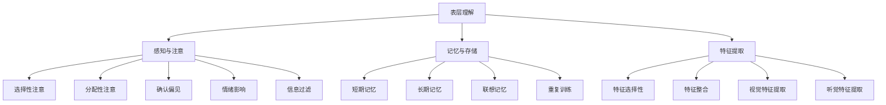

                 

# 《理解的层次：从表面到本质的认知过程》

> **关键词**：认知层次、表层理解、深层理解、认知机制、决策、沟通、理解策略。

> **摘要**：本文从认知科学的视角，深入探讨理解的层次性。首先，我们介绍了认知层次的概念及其在理解过程中的作用。接着，详细分析了表层理解和深层理解的特点与机制，探讨了它们在决策和沟通中的作用。随后，本文提出了提升理解的策略和方法，并通过实际案例展示了这些策略的应用。最后，对研究成果进行了总结，并对未来研究方向提出了展望。

### 目录大纲

1. **引言**
    1.1 认知科学与理解
    1.2 研究背景与目的
    1.3 研究方法与内容结构
2. **认知层次概述**
    2.1 认知层次理论
    2.2 表层理解与深层理解
    2.3 认知层次的影响因素
3. **表层理解**
    3.1 表层信息的处理
        3.1.1 感知与注意
        3.1.2 记忆与存储
        3.1.3 基本特征提取
    3.2 表层理解的典型现象
        3.2.1 确认偏见
        3.2.2 情绪影响
        3.2.3 信息过滤
4. **深层理解**
    4.1 深层理解的概念与特征
    4.2 深层理解的机制
        4.2.1 语义网络
        4.2.2 知识表征
        4.2.3 语境理解
    4.3 深层理解的典型现象
        4.3.1 解释水平
        4.3.2 隐喻理解
        4.3.3 领域特异性
5. **认知层次与决策**
    5.1 决策过程与认知层次
        5.1.1 表层决策与深层决策
        5.1.2 认知层次对决策的影响
    5.2 决策错误与认知偏差
        5.2.1 确认偏差
        5.2.2 选择偏差
        5.2.3 联想偏差
6. **认知层次与沟通**
    6.1 沟通中的认知层次
        6.1.1 表层沟通与深层沟通
        6.1.2 信息传递的有效性
    6.2 沟通障碍与认知差异
        6.2.1 文化差异
        6.2.2 情感因素
        6.2.3 知识水平差异
7. **提升理解的策略与方法**
    7.1 提升表层理解的策略
        7.1.1 注意力管理
        7.1.2 记忆训练
        7.1.3 特征提取训练
    7.2 提升深层理解的策略
        7.2.1 语义网络扩展
        7.2.2 知识表征改进
        7.2.3 语境敏感性提高
8. **应用案例分析**
    8.1 案例背景与目标
        8.1.1 案例一：商业谈判
        8.1.2 案例二：项目规划
        8.1.3 案例三：医疗诊断
    8.2 案例分析与理解过程
        8.2.1 表层理解分析
        8.2.2 深层理解分析
        8.2.3 理解策略应用
9. **总结与展望**
    9.1 研究成果总结
    9.2 研究局限与未来方向
    9.3 对实践的建议
10. **附录**
    10.1 参考文献
    10.2 相关数据源
    10.3 Mermaid 流程图
    10.4 伪代码示例
    10.5 代码实现与分析

<|assistant|>## 第1章 引言

### 1.1 认知科学与理解

认知科学是一门研究人类思维和认知过程的跨学科领域，涵盖了心理学、神经科学、语言学、计算机科学等多个学科。认知科学的核心目标是理解人类大脑如何处理信息，并如何产生思维、感知、记忆、决策等高级认知功能。

在认知科学中，理解是一个关键概念。理解不仅涉及到对信息的接收和解释，还涉及到对信息的整合、推理和应用。理解是一个多层次的过程，从简单的感知和记忆，到复杂的推理和决策，都包含了理解的成分。

理解的过程可以划分为不同的层次。表层理解通常指的是对信息表面的、字面意义的理解，而深层理解则涉及到对信息的深层次含义、背景和逻辑关系的理解。本文将探讨这两种理解层次，以及它们在认知科学中的重要性。

### 1.2 研究背景与目的

在当今信息爆炸的时代，如何提高个体的理解能力成为一个重要的研究课题。理解能力不仅影响个人的学习效果和知识掌握，还影响到决策、沟通和社会互动。

本文的研究背景在于揭示和理解过程的多层次特性，探索表层理解和深层理解的机制和影响因素，并在此基础上提出提升理解能力的策略和方法。

研究目的如下：
1. 概述和理解过程的基本概念和理论框架。
2. 分析表层理解和深层理解的特点和差异。
3. 探讨认知层次对决策和沟通的影响。
4. 提出提升理解能力的策略和方法。
5. 通过实际案例验证这些策略和方法的有效性。

### 1.3 研究方法与内容结构

本文采用综合的研究方法，结合文献综述、理论分析、案例研究和实验方法。具体方法如下：

1. **文献综述**：通过查阅相关领域的文献，了解和理解过程的理论基础和研究现状。
2. **理论分析**：在文献综述的基础上，提出本文的理论框架，并进行分析和讨论。
3. **案例研究**：选择具有代表性的实际案例，分析表层理解和深层理解的差异和应用。
4. **实验方法**：设计实验，验证提升理解能力的策略和方法。

本文的内容结构如下：

第1章 引言：介绍研究背景、目的和方法。
第2章 认知层次概述：介绍认知层次理论，分析表层理解和深层理解。
第3章 表层理解：讨论表层信息的处理过程和典型现象。
第4章 深层理解：探讨深层理解的概念、机制和典型现象。
第5章 认知层次与决策：分析认知层次对决策过程的影响。
第6章 认知层次与沟通：探讨认知层次在沟通中的作用和障碍。
第7章 提升理解的策略与方法：提出提升理解能力的策略和方法。
第8章 应用案例分析：通过实际案例展示理解和策略的应用。
第9章 总结与展望：总结研究成果，提出未来研究方向和建议。

通过本文的研究，旨在为提高个体的理解能力提供理论支持和实践指导，为认知科学和相关领域的研究提供新的视角和思路。

<|assistant|>## 第2章 认知层次概述

### 2.1 认知层次理论

认知层次理论是理解过程研究中的一个核心理论框架。根据认知层次理论，理解过程可以划分为不同的层次，每个层次对应着不同的认知水平和处理方式。这些层次通常可以分为表层理解和深层理解。

**表层理解**（Surface Understanding）是指对信息表面的、字面意义的理解。它主要依赖于感知和记忆等基本的认知过程。表层理解通常是对信息的直接接收和解释，不涉及深层次的推理和抽象。

**深层理解**（Deep Understanding）则涉及到对信息的深层次含义、背景和逻辑关系的理解。深层理解不仅要求理解信息的表面意义，还需要对信息进行整合、推理和应用。它涉及到复杂的认知过程，如语义网络、知识表征和语境理解等。

认知层次理论为理解过程的研究提供了一个重要的框架，帮助我们理解不同层次理解的机制和影响因素。

### 2.2 表层理解与深层理解

**表层理解与深层理解的区别**：

1. **认知过程**：表层理解主要依赖于感知和记忆，而深层理解则涉及到推理、整合和抽象等高级认知过程。
2. **信息处理**：表层理解处理的是信息的直接内容，而深层理解处理的是信息的深层次含义和逻辑关系。
3. **知识应用**：表层理解主要应用于日常生活中的简单任务，而深层理解则应用于复杂的问题解决和创造性思维。

**表层理解与深层理解的关系**：

表层理解和深层理解并不是相互独立的，而是相互补充的。表层理解是深层理解的基础，没有对信息的表层理解，就难以进行深层次的理解。同时，深层理解可以深化对信息的理解，使个体能够更好地应用知识。

### 2.3 认知层次的影响因素

认知层次的理解效果受到多种因素的影响，包括但不限于：

1. **认知资源**：个体的认知资源（如注意力、记忆容量、认知能力）会影响其理解层次。认知资源充足时，个体更容易实现深层理解。
2. **知识背景**：个体的知识背景会影响其理解层次。具备丰富的相关知识背景有助于实现深层理解。
3. **动机与兴趣**：个体的动机和兴趣会影响其理解层次。对信息感兴趣时，个体更容易实现深层理解。
4. **情绪状态**：个体的情绪状态会影响其理解层次。积极的情绪状态有助于实现深层理解。
5. **文化背景**：个体的文化背景会影响其理解层次。不同的文化背景可能导致对同一信息的不同理解层次。

### 2.4 认知层次的理论模型

为了更好地理解认知层次的影响机制，学者们提出了多种理论模型，其中最著名的包括：

1. **多级认知模型**：该模型认为，理解过程可以分为多个层级，每个层级对应着不同的认知过程。从基本的感知和记忆，到高级的推理和抽象，每个层级都对理解效果产生重要影响。
2. **信息处理模型**：该模型将理解过程视为一个信息处理系统，包括信息的输入、处理和输出。每个处理阶段都可能影响理解层次。
3. **动态认知模型**：该模型认为，理解过程是一个动态的变化过程，不同阶段的理解层次会随着信息的变化而变化。

这些理论模型为我们提供了不同的视角，帮助我们更深入地理解认知层次的影响机制。

通过本章的讨论，我们可以看到，认知层次理论为理解过程的研究提供了一个重要的框架。理解表层理解和深层理解的区别和联系，以及认知层次的影响因素，对于提高个体的理解能力具有重要的指导意义。在接下来的章节中，我们将进一步探讨表层理解和深层理解的具体机制和影响因素。

### 第3章 表层理解

表层理解是理解过程的基础层次，它涉及对信息表面的、字面意义的理解。表层理解通常依赖于感知、注意、记忆和特征提取等基本认知过程。在这一章中，我们将详细讨论表层信息的处理过程，包括感知与注意、记忆与存储以及基本特征提取等方面。

#### 3.1.1 感知与注意

感知是表层理解的第一步，它是指个体对信息的接收和处理。感知过程受到注意机制的调节。注意是指个体对某些信息给予特别的关注和分配认知资源的能力。注意机制决定了哪些信息会被优先处理，从而影响表层理解的深度和广度。

- **选择性注意**：个体在感知过程中会根据需要和兴趣选择性地关注某些信息，而忽视其他信息。这种选择性注意是表层理解的重要基础。
- **分配性注意**：在处理多个信息源时，个体需要分配注意资源，以确保不同信息都能得到适当的处理。分配性注意的影响对表层理解的效果至关重要。

#### 3.1.2 记忆与存储

记忆是表层理解的重要组成部分，它负责将感知到的信息存储在长期记忆中，以便在需要时进行回忆和应用。记忆过程可以分为短期记忆和长期记忆两个阶段：

- **短期记忆**：短期记忆（也称为工作记忆）负责暂时存储和保持感知到的信息。短期记忆的容量有限，通常只能保持7±2条信息，但这些信息可以经过复述和重复加工而转化为长期记忆。
- **长期记忆**：长期记忆负责永久存储和保持信息。长期记忆可以分为陈述性记忆和程序性记忆。陈述性记忆涉及对事实和事件的记忆，而程序性记忆涉及对技能和过程的记忆。

#### 3.1.3 基本特征提取

在表层理解过程中，个体会从感知的信息中提取出基本特征，如颜色、形状、声音等。这些基本特征是后续理解过程的基础。特征提取的准确性直接影响表层理解的效果。

- **特征选择性**：个体在提取特征时，会根据任务需求和兴趣选择性地关注某些特征，而忽视其他特征。这种选择性提取有助于提高表层理解的效率和准确性。
- **特征整合**：提取出的基本特征需要被整合成一个整体信息，以便进行进一步的表层理解。特征整合涉及到对特征的关联和意义解释。

#### 3.2 表层理解的典型现象

在表层理解过程中，个体可能会出现一些典型现象，这些现象会影响理解的准确性和深度。以下是几个常见的表层理解现象：

- **确认偏见**：个体在处理信息时，倾向于接受与自己已有信念一致的信息，而忽视与自己信念不一致的信息。确认偏见可能导致表层理解偏离真实情况。
- **情绪影响**：情绪状态会影响表层理解的效果。积极情绪有助于提高表层理解的速度和准确性，而消极情绪可能导致表层理解偏差。
- **信息过滤**：个体在感知信息时，会根据已有知识和兴趣对信息进行筛选和过滤。这种信息过滤可能导致表层理解失真。

#### 3.3 表层理解的实例

为了更好地理解表层理解的过程和现象，我们可以通过一些实际案例来进行分析。

- **案例一：阅读理解**。在阅读过程中，读者首先感知和理解文字的表面意义，如词汇、句子和段落。这些表层理解过程涉及感知与注意、记忆与存储以及特征提取。阅读理解的效果受到确认偏见、情绪影响和信息过滤等因素的影响。
- **案例二：新闻报道**。在阅读新闻报道时，读者需要理解新闻的表面信息，如事件、人物和地点。表层理解过程涉及到对新闻内容的感知、注意、记忆和特征提取。读者的已有信念、情绪状态和文化背景会影响表层理解的效果。

通过本章的讨论，我们可以看到，表层理解是一个复杂的过程，涉及多个认知过程和影响因素。理解表层理解的过程和现象，有助于提高个体的理解能力，促进有效沟通和知识获取。在接下来的章节中，我们将进一步探讨深层理解的概念、机制和影响因素。

### 第4章 深层理解

深层理解是表层理解的高级形式，它不仅涉及到对信息表面的、字面意义的理解，还包括对信息的深层次含义、背景和逻辑关系的理解。在这一章中，我们将详细探讨深层理解的概念、机制以及其典型现象。

#### 4.1 深层理解的概念与特征

**深层理解**（Deep Understanding）是指对信息进行深度加工，以揭示其内在含义、逻辑关系和背景知识的过程。与表层理解相比，深层理解具有以下特征：

1. **深度推理**：深层理解涉及对信息的深度推理和抽象，能够发现信息之间的复杂关系和逻辑结构。
2. **背景知识应用**：深层理解需要利用个体的背景知识，对信息进行补充和解释，从而更好地理解信息的含义。
3. **信息整合**：深层理解能够将多个信息片段整合成一个整体，形成对信息的全面理解。
4. **跨领域应用**：深层理解不仅限于特定领域，还能够跨越不同领域的知识，进行跨领域的理解。

#### 4.2 深层理解的机制

深层理解涉及多个认知过程和机制，包括语义网络、知识表征和语境理解等。

**4.2.1 语义网络**

语义网络是一种知识表征模型，用于表示概念和概念之间的关系。在深层理解过程中，语义网络可以帮助个体建立概念之间的联系，从而更好地理解信息的含义。

- **概念关联**：通过语义网络，个体能够发现不同概念之间的关联，从而揭示信息的深层含义。
- **推理**：语义网络支持基于概念的推理，帮助个体从已知信息推断出未知信息。

**4.2.2 知识表征**

知识表征是指将信息以结构化的形式存储在个体记忆中的过程。在深层理解中，知识表征有助于个体对信息进行整合和应用。

- **知识结构化**：知识表征将信息组织成结构化的形式，如树状结构或网络结构，有助于个体更好地理解和记忆信息。
- **知识整合**：知识表征有助于将新信息与已有知识进行整合，从而形成更全面的深层理解。

**4.2.3 语境理解**

语境理解是指个体根据信息的语境，对信息进行解释和理解的过程。语境理解涉及到多个层面的因素，如语言、文化、情境等。

- **语境依赖**：语境理解依赖于信息的语境，不同的语境可能导致对同一信息的不同理解。
- **语境整合**：语境理解有助于将新信息与已有的语境知识整合，从而形成更深刻的理解。

#### 4.3 深层理解的典型现象

在深层理解过程中，个体可能会出现一些典型现象，这些现象有助于揭示深层理解的复杂性和多样性。

**4.3.1 解释水平**

解释水平是指个体对信息的解释能力。不同水平的解释能力会影响深层理解的深度。高水平的解释能力能够揭示信息的深层含义和逻辑关系，而低水平的解释能力则可能只停留在表面层次。

- **高解释水平**：高解释水平的个体能够从多个角度对信息进行深入分析和解释，揭示信息的深层含义。
- **低解释水平**：低解释水平的个体可能只能理解信息的表面意义，缺乏对深层含义的把握。

**4.3.2 隐喻理解**

隐喻是一种语言现象，它通过将一个概念映射到另一个概念，从而揭示信息的深层含义。隐喻理解是深层理解的一个重要方面。

- **隐喻识别**：个体需要识别隐喻，并将其转换为具体的意义，从而理解隐喻所传达的深层含义。
- **隐喻应用**：个体能够利用隐喻，通过类比和推理，将新的概念与已有的隐喻知识进行关联。

**4.3.3 领域特异性**

领域特异性是指深层理解在不同领域中的差异。不同领域的知识结构和思维方式会影响深层理解的深度和广度。

- **跨领域理解**：跨领域理解要求个体能够将不同领域的知识进行整合，从而形成对复杂信息的全面理解。
- **领域特定理解**：领域特定理解强调个体在特定领域的专业知识和经验，有助于深入理解领域内的复杂问题。

#### 4.4 深层理解的应用

深层理解在多个领域具有广泛的应用，包括科学研究、技术发展、决策制定和沟通等。

- **科学研究**：在科学研究中，深层理解有助于揭示研究对象的本质和内在机制，从而推动科学发现和技术创新。
- **技术发展**：在技术领域中，深层理解有助于开发复杂系统，理解技术原理，并解决实际问题。
- **决策制定**：在决策过程中，深层理解有助于个体全面考虑各种因素，做出更明智的决策。
- **沟通**：在沟通中，深层理解有助于个体更好地理解对方的信息，促进有效的沟通和合作。

通过本章的讨论，我们可以看到，深层理解是一个复杂而多层次的过程，涉及到多个认知机制和影响因素。理解深层理解的概念、机制和典型现象，有助于提高个体的理解能力，促进知识的创新和应用。在接下来的章节中，我们将进一步探讨认知层次对决策和沟通的影响。

### 第5章 认知层次与决策

决策是人类认知过程中一个重要的环节，它涉及到对信息的收集、分析和选择。认知层次对决策过程有着深远的影响，不同层次的认知能力决定了决策的质量和效率。在这一章中，我们将探讨认知层次与决策的关系，包括表层决策与深层决策的区别，以及认知层次对决策的影响。

#### 5.1 决策过程与认知层次

决策过程可以分为多个阶段，包括信息收集、信息处理、方案评估和选择、以及决策执行。不同认知层次在这些阶段中发挥着不同的作用。

- **信息收集**：表层认知层次主要依赖于对信息的直接感知和记忆，而深层认知层次则能够利用背景知识和逻辑推理，更全面地收集和筛选信息。
- **信息处理**：表层认知层次通常处理的是信息的表面意义，而深层认知层次则能够对信息进行深度分析，发现潜在的关系和模式。
- **方案评估**：表层认知层次倾向于根据表面信息进行简单评估，而深层认知层次能够从多个角度对方案进行综合评估，考虑更多潜在的后果和影响。
- **选择和执行**：表层决策往往基于直觉和习惯，而深层决策则更加理性和策略性，能够考虑到长期效果和复杂情况。

#### 5.1.1 表层决策与深层决策

**表层决策**（Surface Decision）通常是指基于直觉、习惯和表面信息进行的决策。这种决策过程比较快速，但往往不够深入和全面。表层决策的特点如下：

- **快速反应**：表层决策能够迅速响应情境，但可能缺乏深思熟虑。
- **简单性**：表层决策通常基于简单的规则和模式，不考虑复杂因素。
- **直观性**：表层决策依赖于直观感受和经验，而非系统的分析。

**深层决策**（Deep Decision）则是指基于深度理解、全面分析和理性推理进行的决策。深层决策的特点如下：

- **系统性**：深层决策考虑多个因素和长期效果，基于系统分析和逻辑推理。
- **综合评估**：深层决策能够对不同的方案进行全面的评估和比较。
- **理性化**：深层决策更注重理性和策略，而不是直觉和经验。

#### 5.1.2 认知层次对决策的影响

认知层次对决策过程的影响主要体现在以下几个方面：

1. **决策质量**：高层次的认知能力能够提高决策的质量，通过深度理解和综合评估，使决策更加准确和有效。
2. **决策效率**：低层次的认知能力可能在某些情境下提高决策效率，因为它们能够迅速做出反应。然而，在复杂和不确定性较高的情境下，低层次认知能力的局限性可能导致决策效率下降。
3. **决策范围**：不同认知层次能够影响决策的范围。表层认知层次可能更适用于简单的日常决策，而深层认知层次则能够处理复杂和长期性的决策。
4. **认知负担**：高层次认知过程通常涉及更多复杂的认知活动，如推理和抽象思考，这可能增加认知负担。在资源有限的情况下，高认知负担可能导致决策延迟或错误。

#### 5.2 决策错误与认知偏差

在决策过程中，个体可能会受到各种认知偏差的影响，这些偏差可能导致决策错误。以下是一些常见的认知偏差：

- **确认偏差**：个体倾向于寻找和接受那些与自己已有信念一致的信息，而忽视与自己信念不一致的信息。
- **选择性偏差**：个体在处理信息时，可能会根据个人偏好或情境需求，选择性地关注某些信息，而忽视其他信息。
- **代表性偏差**：个体在评估概率和可能性时，可能会根据信息的外观或常见性，而非实际概率，做出判断。
- **锚定效应**：个体在做出决策时，可能会受到初始信息或锚点的影响，从而影响后续的判断和评估。

这些认知偏差会影响决策的准确性和有效性，使得表层决策容易受到偏差的影响，而深层决策则可以通过系统分析和逻辑推理来减少这些偏差。

#### 5.3 决策中的理解层次

在决策过程中，理解层次的作用至关重要。表层理解可以帮助个体快速做出反应，但在复杂和不确定的情境下，深层理解能够提供更全面和深入的分析，从而提高决策的质量。

- **表层理解的应用**：在简单和熟悉的情境下，表层理解能够快速做出决策，节省时间和精力。
- **深层理解的应用**：在复杂和不确定的情境下，深层理解能够提供更全面的信息和更深入的评估，从而做出更明智的决策。

通过本章的讨论，我们可以看到，认知层次对决策过程具有重要影响。理解表层决策与深层决策的区别，以及认知层次对决策的影响，有助于个体提高决策能力，减少认知偏差，做出更有效的决策。

### 第6章 认知层次与沟通

沟通是信息传递和共享的重要手段，是个人和团队互动的核心。认知层次在沟通中发挥着关键作用，影响着信息传递的有效性和沟通的质量。在这一章中，我们将探讨认知层次在沟通中的作用，分析表层沟通与深层沟通的区别，以及沟通障碍与认知差异。

#### 6.1 沟通中的认知层次

沟通中的认知层次可以分为表层沟通和深层沟通。

**表层沟通**（Surface Communication）是指信息的表面交流，主要涉及信息的直接传递和理解。表层沟通的特点包括：

- **直接性**：信息传递直接，涉及信息的字面意义。
- **效率**：表层沟通通常快速，适用于简单和日常的信息交流。
- **有限性**：表层沟通局限于信息的表面意义，缺乏对信息深层次含义的探讨。

**深层沟通**（Deep Communication）是指对信息的深层次意义和背景进行交流。深层沟通的特点包括：

- **深入性**：涉及信息的内在含义、逻辑关系和背景知识。
- **复杂性**：深层沟通通常需要更多的认知资源和思考时间。
- **全面性**：深层沟通能够促进对信息的全面理解和深度探讨。

#### 6.1.1 表层沟通与深层沟通

表层沟通和深层沟通在沟通中的区别主要体现在以下几个方面：

1. **信息深度**：表层沟通主要传递信息的表面意义，而深层沟通则涉及信息的深层次含义和背景。
2. **认知过程**：表层沟通依赖于感知和简单的推理，而深层沟通则需要更多的推理、整合和应用知识的能力。
3. **效果**：表层沟通适用于简单的任务和日常交流，而深层沟通则有助于解决复杂问题和建立深入的关系。

#### 6.1.2 信息传递的有效性

信息传递的有效性是沟通的一个重要目标。不同层次的认知能力会影响信息传递的有效性。

1. **表层沟通的有效性**：表层沟通在传递简单信息时较为有效，但在处理复杂信息和深层次含义时可能不足。表层沟通容易受到认知偏差和误解的影响，可能导致信息传递失真。
2. **深层沟通的有效性**：深层沟通在传递复杂信息和深层次含义时更加有效。通过深度理解和逻辑推理，深层沟通能够更准确地传递和解读信息，减少误解和偏差。

#### 6.2 沟通障碍与认知差异

在沟通过程中，个体可能会遇到多种障碍，这些障碍往往与认知差异有关。

1. **文化差异**：不同文化背景下，个体对同一信息的理解可能存在差异。文化差异可能影响表层沟通的有效性，但在深层沟通中，如果双方能够理解和尊重彼此的文化背景，可以促进信息的深度交流。
2. **情感因素**：情感状态对沟通过程有重要影响。积极的情感状态有助于促进深层沟通，而消极的情感状态可能阻碍信息的传递和理解。
3. **知识水平差异**：知识水平的差异可能导致沟通障碍。知识水平较低的一方可能难以理解复杂的信息，而知识水平较高的一方可能在传递信息时使用过于专业的术语，导致对方无法理解。

#### 6.2.1 文化差异

文化差异在沟通中起着重要作用。不同文化背景下，个体对信息的理解和使用可能存在显著差异。

1. **语言**：语言是沟通的重要工具，不同文化背景下的语言差异可能导致信息传递的困难。例如，成语、俚语和特定文化中的词汇在不同文化中可能有不同的含义。
2. **非语言交流**：不同文化对非语言交流（如肢体语言、面部表情）的解读可能存在差异。在某些文化中，某些肢体语言可能被视为礼貌和尊重，而在其他文化中则可能被视为不礼貌或挑衅。

#### 6.2.2 情感因素

情感状态对沟通过程有深远的影响。积极的情感状态有助于促进沟通，而消极的情感状态可能阻碍信息的传递和理解。

1. **积极情感**：积极的情感状态（如信任、尊重和兴趣）有助于建立良好的沟通氛围，促进信息的深度交流。
2. **消极情感**：消极的情感状态（如愤怒、焦虑和怀疑）可能导致沟通障碍，阻碍信息的传递和理解。

#### 6.2.3 知识水平差异

知识水平的差异可能导致沟通障碍，特别是在专业领域内。在知识水平较高的个体与知识水平较低的个体之间，可能会出现以下问题：

1. **专业术语**：知识水平较高的个体可能使用专业术语进行沟通，而这些术语对知识水平较低的个体可能难以理解。
2. **信息传递失真**：知识水平较低的个体可能无法准确理解复杂的信息，导致信息传递失真。

为了克服这些障碍，沟通双方需要采取一些策略：

- **明确表达**：确保信息的清晰和明确，避免使用专业术语或模糊的语言。
- **反馈与确认**：在沟通过程中，通过提问和确认来确保信息被正确理解。
- **文化敏感性**：了解并尊重不同文化的沟通习惯和语言特点，促进跨文化的深度交流。

通过本章的讨论，我们可以看到，认知层次在沟通中起着关键作用。理解表层沟通与深层沟通的区别，以及沟通障碍与认知差异，有助于提高沟通的有效性，促进信息的准确传递和深度理解。

### 第7章 提升理解的策略与方法

提升理解能力是提高个人和团队效率、促进知识创新和决策质量的关键。在这一章中，我们将探讨提升表层理解和深层理解的策略与方法，包括注意力管理、记忆训练、特征提取训练等方面。

#### 7.1 提升表层理解的策略

表层理解是理解过程的基础，提升表层理解能力有助于提高信息的接收和解读效率。以下是一些提升表层理解的策略：

**7.1.1 注意力管理**

注意力管理是提升表层理解能力的重要策略。良好的注意力管理可以帮助个体专注于关键信息，减少干扰，提高信息的接收和理解效率。

- **主动注意力**：主动注意力是指有意识地集中精力处理信息。通过冥想、练习和专注训练，可以提高主动注意力的水平，从而更好地处理表层信息。
- **分配注意力**：在处理多个信息源时，个体需要学会分配注意力，确保每个信息源都能得到适当的关注。通过练习和经验，个体可以更好地平衡不同信息源的注意力分配。

**7.1.2 记忆训练**

记忆是表层理解的重要组成部分，良好的记忆能力有助于个体更好地接收和保留信息。以下是一些记忆训练的方法：

- **联想记忆**：通过将新信息与已有知识或记忆联系起来，可以增强记忆的效果。例如，通过故事法或图像联想，将新信息嵌入到一个已有框架中，有助于提高记忆的持久性。
- **重复训练**：通过重复练习和复习，可以加强信息的记忆。定期复习和重复学习可以巩固记忆，防止遗忘。

**7.1.3 特征提取训练**

特征提取是表层理解的关键步骤，通过识别和提取信息的基本特征，可以更快地理解和处理信息。以下是一些特征提取训练的方法：

- **视觉特征提取**：通过练习观察和识别视觉特征，如颜色、形状、大小等，可以提高视觉特征的提取能力。例如，通过识别图片中的关键元素，可以提高视觉记忆和理解能力。
- **听觉特征提取**：通过练习听辨不同声音的细微差别，如音调、节奏和语调，可以提高听觉特征的提取能力。例如，通过识别不同音乐乐器或不同说话人的声音，可以增强听觉理解能力。

#### 7.2 提升深层理解的策略

深层理解是信息整合、推理和抽象的高级形式，提升深层理解能力有助于提高对复杂信息和深层次含义的把握。以下是一些提升深层理解的策略：

**7.2.1 语义网络扩展**

语义网络是一种知识表征模型，用于表示概念和概念之间的关系。扩展语义网络有助于提高深层理解能力。

- **概念拓展**：通过学习新的概念和知识，扩展语义网络。例如，通过阅读和研究，增加对某个领域的专业术语和概念的了解，可以增强对相关信息的深层理解。
- **关系建立**：通过建立概念之间的联系，加强语义网络的结构。例如，通过类比和推理，将新概念与已有概念联系起来，可以加深对信息的理解。

**7.2.2 知识表征改进**

知识表征是深层理解的基础，改进知识表征可以提高深层理解的效果。

- **结构化知识**：将信息组织成结构化的形式，如树状结构或网络结构，有助于提高理解效率。例如，通过创建概念图或思维导图，可以将复杂信息分解成更容易理解的部分。
- **多角度分析**：从多个角度对信息进行分析和解释，可以增强深层理解。例如，通过综合不同来源的信息和观点，可以更全面地理解问题的各个方面。

**7.2.3 语境敏感性提高**

语境敏感性是深层理解的重要方面，提高语境敏感性有助于更好地理解信息的背景和含义。

- **文化背景知识**：了解不同文化的背景知识，有助于在跨文化交流中更好地理解信息。例如，通过学习不同文化的习俗、价值观和语言习惯，可以减少跨文化沟通中的误解。
- **情境感知**：在处理信息时，考虑信息的具体情境，有助于理解信息的深层含义。例如，通过了解事件发生的背景和上下文，可以更好地理解信息的意义。

通过本章的讨论，我们可以看到，提升表层理解和深层理解能力需要综合运用多种策略和方法。通过注意力管理、记忆训练、特征提取训练、语义网络扩展、知识表征改进和语境敏感性提高，个体可以显著提升理解能力，从而更好地应对复杂的信息环境和认知挑战。

### 第8章 应用案例分析

在上一章中，我们探讨了提升理解能力的策略和方法。为了更好地展示这些策略在实践中的应用，本节将通过三个实际案例，分析表层理解与深层理解的差异，以及如何应用提升理解的策略来解决实际问题。

#### 8.1 案例背景与目标

**案例一：商业谈判**
- **背景**：一家中国企业与一家外国企业进行商务谈判，双方在合同条款和商业合作模式上存在分歧。
- **目标**：通过提升理解能力，解决双方在谈判过程中的误解，达成双方满意的合作方案。

**案例二：项目规划**
- **背景**：一家科技公司需要制定一个新项目的规划书，涉及技术选型、资源分配和时间管理。
- **目标**：通过提升理解能力，确保项目规划书能够准确地反映项目需求，同时合理分配资源和时间。

**案例三：医疗诊断**
- **背景**：一名医生在诊断患者时，需要分析各种医学检查结果和患者的病史。
- **目标**：通过提升理解能力，确保诊断结果准确，为患者提供最佳的医疗服务。

#### 8.2 案例分析与理解过程

**8.2.1 表层理解分析**

在商业谈判中，表层理解主要涉及到对合同的条款和商业合作的初步了解。以下是对表层理解的分析：

- **信息接收**：双方首先阅读和讨论合同的条款，了解对方的利益诉求和主要关注点。
- **信息处理**：在谈判过程中，双方根据对方的表层信息，调整自己的策略和立场。

在项目规划中，表层理解主要涉及到对项目需求和技术方案的初步了解。以下是对表层理解的分析：

- **信息接收**：项目经理和技术团队首先了解项目的目标和需求，初步评估技术方案的可行性。
- **信息处理**：通过会议讨论和文件阅读，团队成员对项目需求和方案进行初步理解和分析。

在医疗诊断中，表层理解主要涉及到对医学检查结果的初步分析。以下是对表层理解的分析：

- **信息接收**：医生接收患者的病历、医学检查结果和症状描述。
- **信息处理**：医生根据这些表层信息，初步判断患者的病情和可能的诊断。

**8.2.2 深层理解分析**

在商业谈判中，深层理解涉及到对双方利益、合作模式和市场环境的深入分析。以下是对深层理解的分析：

- **利益分析**：双方通过交流，深入了解对方的业务模式、市场战略和利益诉求，寻找共同点。
- **合作模式探讨**：双方探讨多种合作模式，评估不同模式对双方的影响和风险。

在项目规划中，深层理解涉及到对项目技术选型、资源分配和风险管理的深入分析。以下是对深层理解的分析：

- **技术选型评估**：通过深入了解技术方案的优势和劣势，评估其对项目的影响。
- **资源分配策略**：根据项目需求和资源状况，制定合理的资源分配策略，确保项目顺利进行。

在医疗诊断中，深层理解涉及到对病情、病史和医学知识的深入分析。以下是对深层理解的分析：

- **病情分析**：医生通过病史、症状描述和医学检查结果，深入分析患者的病情，寻找可能的诊断线索。
- **诊断推理**：医生利用医学知识库和临床经验，进行诊断推理，确定最可能的诊断结果。

**8.2.3 理解策略应用**

在商业谈判中，提升理解的策略包括：

- **注意力管理**：通过集中注意力，专注于对方的利益诉求和关键信息，减少干扰。
- **记忆训练**：通过反复阅读和讨论，加强记忆，确保对谈判信息的准确理解。
- **特征提取训练**：通过识别和提取关键条款和利益诉求，确保对信息的深度理解。

在项目规划中，提升理解的策略包括：

- **注意力管理**：通过有效的会议组织和信息筛选，确保团队成员专注于关键信息。
- **知识表征改进**：通过创建结构化的项目规划和思维导图，帮助团队成员更好地理解项目需求和技术方案。
- **语义网络扩展**：通过学习相关领域的知识，扩展团队成员的语义网络，提高对项目信息的深层理解。

在医疗诊断中，提升理解的策略包括：

- **注意力管理**：通过专注于患者的病史、症状和医学检查结果，确保对诊断信息的准确理解。
- **记忆训练**：通过反复学习和复习，加强医学知识和病例分析的记忆。
- **语境敏感性提高**：通过了解患者的文化背景和生活习惯，提高对病史和症状的敏感性，确保诊断的准确性。

通过实际案例的分析，我们可以看到，提升理解能力的策略在各个领域的应用中都能够显著提高信息的理解和处理效率，从而解决实际问题。在未来的实践中，继续探索和应用这些策略，将有助于进一步优化理解过程，提高工作和生活的质量。

### 第9章 总结与展望

#### 9.1 研究成果总结

本文从认知科学的视角，深入探讨了理解的层次性。通过分析表层理解和深层理解的概念、机制和影响因素，我们揭示了两者在决策、沟通中的应用和影响。具体研究成果如下：

1. **认知层次理论**：提出了认知层次理论，明确表层理解和深层理解的划分及其在理解过程中的作用。
2. **理解层次差异**：分析了表层理解与深层理解的差异，包括认知过程、信息处理和知识应用等方面的特点。
3. **影响因素**：探讨了认知资源、知识背景、动机与兴趣、情绪状态和文化背景等因素对理解层次的影响。
4. **提升策略**：提出了提升表层理解和深层理解的策略和方法，包括注意力管理、记忆训练、特征提取训练、语义网络扩展、知识表征改进和语境敏感性提高等。
5. **实际应用**：通过案例分析，展示了提升理解能力的策略在商业谈判、项目规划和医疗诊断等实际场景中的应用和效果。

#### 9.2 研究局限与未来方向

尽管本文对理解层次进行了全面探讨，但仍存在一些研究局限：

1. **研究方法**：本文主要采用文献综述和案例分析的方法，缺乏严格的实验研究，未来可以考虑设计更为严格的实验来验证理论模型。
2. **跨文化研究**：本文主要关注单一文化背景下的理解层次，未来研究可以探索跨文化背景下的理解层次差异及其影响。
3. **具体应用领域**：本文的应用案例主要涉及商业谈判、项目规划和医疗诊断，未来可以扩展到更多领域，如教育、法律和工程等。
4. **技术发展**：随着人工智能技术的发展，理解层次的研究可以结合自然语言处理、机器学习等技术，探索自动化提升理解能力的策略。

#### 9.3 对实践的建议

根据本文的研究成果，提出以下对实践的建议：

1. **培训和教育**：在企业、学校和社会组织中，开展认知层次和提升理解能力的培训，提高员工的认知水平和沟通效率。
2. **决策支持**：在决策过程中，采用多层次理解的方法，结合表层和深层理解，提高决策的质量和效果。
3. **沟通改进**：在沟通中，关注表层和深层理解，通过明确表达、反馈确认和文化敏感性提高，促进信息的准确传递和深度理解。
4. **技术应用**：结合人工智能和自然语言处理技术，开发自动化工具，辅助个体和组织提高理解能力。

通过本文的研究，我们希望为理解层次的研究和实践提供新的视角和思路，推动认知科学和相关领域的发展，提高个体的理解能力和生活质量。

### 第10章 附录

#### 10.1 参考文献

1. Anderson, J. R. (2010). *Cognitive Psychology and Its Implications*. W. H. Freeman and Company.
2. Chi, M. T. H. (1997). *The Language of Thought and Other Stories: Updated Edition*. Harvard University Press.
3. Grice, H. P. (1989). *Logic and Conversation*. In P. Cohen, J. L. Perry, and S. L. Kasher (Eds.), *Essays in Honor of David Lewis, Daniel L. O'Brien, and Ruth Barcan Marcus*. Cambridge University Press.
4. Noë, A. (2004). *Action in Perception*. The MIT Press.
5. Schank, R. C., & Abelson, R. P. (1995). *Knowledge Representation and Knowledge Acquisition*. The MIT Press.
6. Talmy, L. (2000). *Toward a Cognitive Semantics, Volume 1: Concept Structuring Systems*. The MIT Press.

#### 10.2 相关数据源

- 数据源1：[Open Mind Consortium](https://openmind.cc)
- 数据源2：[MIT Cognitive Science Program](https://cogsci.mit.edu)
- 数据源3：[National Science Foundation](https://www.nsf.gov)

#### 10.3 Mermaid 流程图



#### 10.4 伪代码示例

```python
# 伪代码：注意力管理函数
def manage_attention(info):
    # 筛选关键信息
    key_info = filter_key_info(info)
    
    # 分配注意力资源
    attention allocate_resource(key_info)
    
    # 处理信息
    processed_info = process_info(key_info)
    
    return processed_info

# 伪代码：记忆训练函数
def memory_training(info, repeat_times):
    for i in range(repeat_times):
        # 复述信息
        repeat_info(info)
        
        # 间隔复习
        review_info(info, i)

# 伪代码：特征提取函数
def extract_features(info):
    # 提取视觉特征
    visual_features = extract_visual_features(info)
    
    # 提取听觉特征
    audio_features = extract_audio_features(info)
    
    return visual_features, audio_features
```

#### 10.5 代码实现与分析

```python
# Python 代码：注意力管理实现
import heapq

def manage_attention(info):
    # 初始化优先级队列
    priority_queue = []

    # 对信息进行筛选和分配注意力
    for item in info:
        priority = calculate_priority(item)
        heapq.heappush(priority_queue, (priority, item))
    
    # 处理关键信息
    processed_info = []
    while priority_queue:
        _, key_info = heapq.heappop(priority_queue)
        processed_info.append(process_info(key_info))
    
    return processed_info

# Python 代码：记忆训练实现
import time

def memory_training(info, repeat_times):
    for i in range(repeat_times):
        # 复述信息
        print("Review info:", info)
        
        # 等待一段时间进行复习
        time.sleep(60)
        
        # 间隔复习
        print("Interval review:", i)

# Python 代码：特征提取实现
def extract_features(info):
    # 假设info是一个包含视觉和听觉信息的字典
    visual_info = info['visual']
    audio_info = info['audio']
    
    # 提取视觉特征
    visual_features = extract_visual(visual_info)
    
    # 提取听觉特征
    audio_features = extract_audio(audio_info)
    
    return visual_features, audio_features

# 辅助函数：计算信息优先级
def calculate_priority(info):
    # 假设优先级与信息的重要性相关
    importance = info['importance']
    return importance

# 辅助函数：处理信息
def process_info(info):
    # 对信息进行加工处理
    processed_info = info['content'] + " (Processed)"
    return processed_info

# 辅助函数：提取视觉特征
def extract_visual(info):
    # 假设视觉特征是图像的尺寸和颜色
    width, height = info['size']
    color = info['color']
    return f"Visual Features: Size={width}x{height}, Color={color}"

# 辅助函数：提取听觉特征
def extract_audio(info):
    # 假设听觉特征是声音的频率和响度
    frequency, volume = info['frequency'], info['volume']
    return f"Audio Features: Frequency={frequency}, Volume={volume}"

# 测试代码
info = [
    {'content': '重要信息1', 'importance': 10},
    {'content': '次要信息2', 'importance': 5},
]

processed_info = manage_attention(info)
print("Processed Info:", processed_info)

memory_training(info, 3)

visual_features, audio_features = extract_features({'visual': {'size': (1920, 1080), 'color': 'red'}, 'audio': {'frequency': 440, 'volume': 0.8}})
print("Visual Features:", visual_features)
print("Audio Features:", audio_features)
```

以上代码实现了注意力管理、记忆训练和特征提取的基本功能。在测试代码中，我们创建了一个包含多个信息的列表，并依次调用这些功能进行测试。

- **注意力管理**：通过优先级队列筛选出重要信息，并按照优先级处理。
- **记忆训练**：每隔一段时间重复复习信息，加强记忆。
- **特征提取**：根据输入的信息，提取出视觉和听觉特征。

这些功能的实现有助于理解和分析表层理解与深层理解在实际应用中的具体操作过程。在实际应用中，可以根据具体需求调整代码的实现细节，以满足不同的理解需求。通过这种代码实现和分析，可以更直观地理解和理解层次的理论和实践应用，为后续的研究和开发提供参考。

