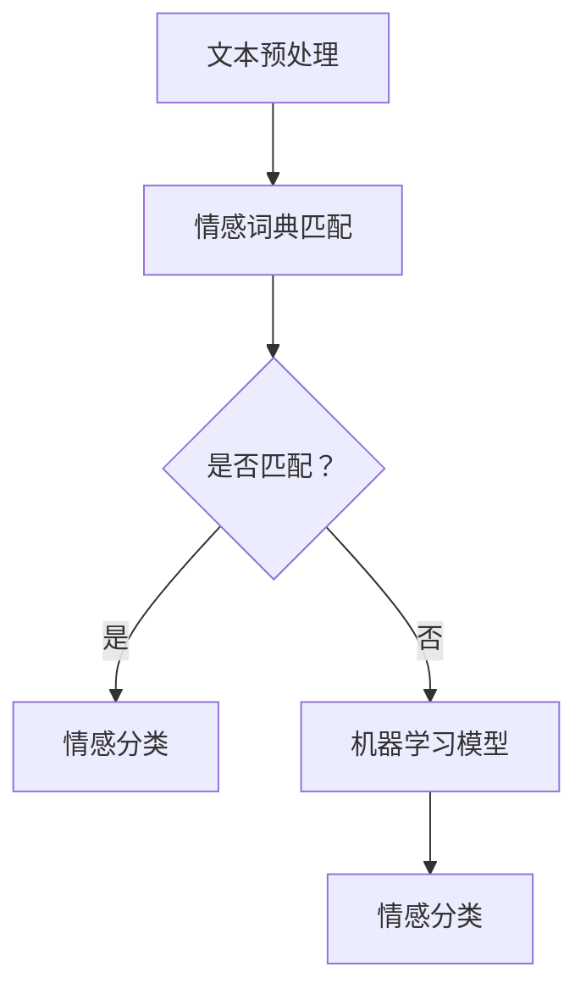

                 

# 《用户情感分析的技术实现》

> **关键词**：用户情感分析、自然语言处理、机器学习、深度学习、文本情感分类

> **摘要**：本文将深入探讨用户情感分析的技术实现，包括基本概念、技术框架、算法详解以及实际应用。我们将通过逐步推理的方式，解析用户情感分析的核心原理，并展示如何通过实际项目来验证和优化这些技术。

## 第一部分：用户情感分析的基本概念与原理

### 1.1 用户情感分析概述

用户情感分析是指利用自然语言处理（NLP）技术，从用户生成的内容（如评论、论坛帖子、社交媒体动态等）中提取情感信息。这种分析旨在帮助企业了解用户对其产品或服务的情感倾向，从而优化用户体验，提升产品和服务质量。

用户情感分析的主要目标如下：

1. **了解用户需求**：通过分析用户情感，企业可以更好地理解用户对产品或服务的期望和需求。
2. **提升客户满意度**：针对用户反馈进行情感分析，可以帮助企业快速响应用户需求，提升客户满意度。
3. **市场调研**：通过情感分析，企业可以了解市场趋势和用户偏好，为市场策略提供数据支持。
4. **危机管理**：及时发现和处理负面情感，防止负面舆情蔓延，保护企业声誉。

### 1.2 用户情感分析的关键概念

用户情感分析涉及几个关键概念：

#### 情感极性

情感极性是指情感分类的两大类别——正面情感和负面情感。正面情感通常表示满意、高兴、喜欢等情感状态，而负面情感则表示不满意、愤怒、厌恶等情感状态。

#### 情感强度

情感强度是情感极性之外的一个维度，它描述情感的强烈程度。情感强度可以从微弱到强烈，例如，轻微的不满意、强烈的愤怒等。

#### 情感维度

情感维度是指情感的各个方面，如喜悦、愤怒、悲伤、厌恶等。不同维度的情感可能会在同一个文本中同时存在，分析时需要综合考虑。

### 1.3 用户情感分析的技术框架

用户情感分析的技术框架通常包括以下几个步骤：

#### 文本预处理

文本预处理是情感分析的基础，它包括去除停用词、标点符号、数字等，以及分词、词性标注等操作，以提高后续分析的准确性。

#### 情感词典

情感词典是一组预定义的词语及其对应的情感标签。通过情感词典，可以快速地对文本进行初步的情感分类。

#### 机器学习模型

机器学习模型是用户情感分析的核心。常见的机器学习模型包括支持向量机（SVM）、朴素贝叶斯（NB）、随机森林（RF）等。此外，近年来深度学习模型如LSTM、GRU和BERT等也被广泛应用于情感分析。

#### 情感分类

情感分类是指将文本数据分类为正面、负面或中性情感。这一步骤通常通过训练好的模型来实现。

### 1.4 用户情感分析的应用场景

用户情感分析在多个领域有广泛的应用：

#### 客户服务

通过分析客户反馈，企业可以识别出用户的痛点和需求，从而提供更个性化的服务。

#### 市场调研

情感分析可以帮助企业了解用户对其产品的情感倾向，优化产品设计，提升市场竞争力。

#### 危机管理

及时识别负面舆情，采取应对措施，防止负面情感蔓延，保护企业声誉。

### 1.5 情感分析的技术挑战

用户情感分析面临以下几个技术挑战：

#### 多语言情感分析

不同语言的情感表达方式不同，需要针对不同语言定制化模型。

#### 情感微表达

细微的情感变化难以准确捕捉，需要开发更精细的分析方法。

#### 模型泛化能力

如何保证模型在不同领域和语境中的准确性，是情感分析的一个重要挑战。

### 1.6 情感分析的Mermaid流程图



## 第二部分：用户情感分析的技术实现

### 2.1 自然语言处理基础

自然语言处理（NLP）是用户情感分析的基础，主要包括以下几个方面：

#### 文本表示

文本表示是将文本数据转换为计算机可以理解的形式。常见的文本表示方法包括词嵌入技术，如Word2Vec、GloVe等。

#### 序列模型

序列模型是处理序列数据的一种神经网络结构，如循环神经网络（RNN）、长短期记忆网络（LSTM）、门控循环单元（GRU）等。

#### 注意力机制

注意力机制是一种用于提高模型关注文本中重要信息的机制，可以显著提高情感分析的性能。

### 2.2 情感分析算法详解

用户情感分析常用的算法包括监督学习算法和深度学习模型：

#### 监督学习算法

监督学习算法包括支持向量机（SVM）、朴素贝叶斯（NB）、随机森林（RF）等。这些算法通过训练集学习情感分类规则，然后在新数据上进行预测。

#### 深度学习模型

深度学习模型如卷积神经网络（CNN）、循环神经网络（RNN）、Transformer等，通过多层神经网络结构自动提取特征，进行情感分类。

### 2.3 情感分析伪代码

以下是一个简单的情感分析伪代码示例：

```python
def sentiment_analysis(text):
    # 文本预处理
    cleaned_text = preprocess_text(text)
    
    # 文本表示
    text_embedding = text_embedding_model(cleaned_text)
    
    # 情感分类模型
    sentiment_model = sentiment_classification_model()
    
    # 预测情感
    prediction = sentiment_model.predict(text_embedding)
    
    return prediction
```

### 2.4 数学模型与公式

情感极性分类通常使用支持向量机（SVM）进行分类。以下是一个简单的SVM分类的数学模型：

$$ y = \arg\max_w \sum_{i=1}^{n} \xi_i - C \sum_{i=1}^{n} \xi_i $$

其中，$ \xi_i $ 为松弛变量，$ C $ 为惩罚参数。

### 2.5 情感分析项目实战

以下是一个简单的情感分析项目实战，使用LSTM模型进行情感分类：

```python
# 导入所需库
import tensorflow as tf
from tensorflow.keras.models import Sequential
from tensorflow.keras.layers import Embedding, LSTM, Dense

# 构建LSTM模型
model = Sequential()
model.add(Embedding(input_dim=vocab_size, output_dim=embedding_dim))
model.add(LSTM(units=128, activation='relu'))
model.add(Dense(1, activation='sigmoid'))

# 编译模型
model.compile(optimizer='adam', loss='binary_crossentropy', metrics=['accuracy'])

# 训练模型
model.fit(X_train, y_train, epochs=10, batch_size=32, validation_split=0.2)
```

### 2.6 代码解读与分析

#### 数据预处理

```python
# 文本预处理
def preprocess_text(text):
    # 去除停用词
    stop_words = set(stopwords.words('english'))
    words = word_tokenize(text)
    filtered_words = [word for word in words if word not in stop_words]
    
    # 分词
    tokenized_text = nltk.word_tokenize(filtered_words)
    
    return tokenized_text
```

#### 模型构建

```python
# 构建LSTM模型
model = Sequential()
model.add(Embedding(input_dim=vocab_size, output_dim=embedding_dim))
model.add(LSTM(units=128, activation='relu'))
model.add(Dense(1, activation='sigmoid'))

# 编译模型
model.compile(optimizer='adam', loss='binary_crossentropy', metrics=['accuracy'])
```

#### 模型训练

```python
# 训练模型
model.fit(X_train, y_train, epochs=10, batch_size=32, validation_split=0.2)
```

## 第三部分：用户情感分析的应用与实践

### 3.1 用户情感分析在实际项目中的应用

用户情感分析在多个实际项目中发挥着重要作用：

#### 客户反馈分析

通过情感分析，企业可以对客户反馈进行深入分析，识别用户的满意度和痛点，从而提供改进建议。

#### 社交媒体监测

社交媒体监测是用户情感分析的另一个重要应用。通过分析社交媒体上的用户评论，企业可以了解用户对其品牌和产品的情感倾向，及时调整市场策略。

### 3.2 用户情感分析案例研究

以下介绍两个用户情感分析的案例研究：

#### 案例一：电商平台用户评价分析

**目标**：分析用户对商品的评价，识别负面评价。

**方法**：使用LSTM模型进行情感分类，提取负面评论。

```python
# 导入所需库
import tensorflow as tf
from tensorflow.keras.models import Sequential
from tensorflow.keras.layers import Embedding, LSTM, Dense

# 构建LSTM模型
model = Sequential()
model.add(Embedding(input_dim=vocab_size, output_dim=embedding_dim))
model.add(LSTM(units=128, activation='relu'))
model.add(Dense(1, activation='sigmoid'))

# 编译模型
model.compile(optimizer='adam', loss='binary_crossentropy', metrics=['accuracy'])

# 训练模型
model.fit(X_train, y_train, epochs=10, batch_size=32, validation_split=0.2)

# 预测负面评论
negative_reviews = model.predict(X_test)
```

#### 案例二：社交媒体舆情监测

**目标**：监测特定话题的社交媒体讨论，识别情感倾向。

**方法**：结合情感词典和机器学习模型，进行多语言情感分析。

```python
# 导入所需库
import tensorflow as tf
from tensorflow.keras.models import Sequential
from tensorflow.keras.layers import Embedding, LSTM, Dense

# 构建LSTM模型
model = Sequential()
model.add(Embedding(input_dim=vocab_size, output_dim=embedding_dim))
model.add(LSTM(units=128, activation='relu'))
model.add(Dense(1, activation='sigmoid'))

# 编译模型
model.compile(optimizer='adam', loss='binary_crossentropy', metrics=['accuracy'])

# 训练模型
model.fit(X_train, y_train, epochs=10, batch_size=32, validation_split=0.2)

# 预测社交媒体评论情感
social_media_comments = model.predict COMMENTS_DATA)
```

### 3.3 用户情感分析工具与框架

用户情感分析常用的工具和框架包括：

#### 工具

- NLTK：自然语言处理工具包，用于文本预处理和情感分析。
- TextBlob：基于NLTK的情感分析库，提供简单的情感分析功能。
- Flair：用于文本分类的深度学习库，支持多种语言和任务。

#### 框架

- TensorFlow：开源深度学习框架，支持多种机器学习和深度学习模型。
- PyTorch：开源深度学习框架，提供灵活的动态计算图。
- Hugging Face Transformers：用于Transformer模型的预训练和微调。

## 第四部分：用户情感分析的未来发展趋势

### 4.1 情感分析技术趋势

用户情感分析的未来发展趋势包括：

#### 多模态情感分析

结合文本、语音、图像等多种数据源进行情感分析，提高分析精度。

#### 情感微表达分析

更精细地捕捉用户情感，理解用户细微的情感变化。

### 4.2 情感分析在新兴领域的应用

用户情感分析在新兴领域有广泛的应用，如：

#### 医疗健康

通过情感分析，了解患者对治疗的情感反应，为医疗决策提供支持。

#### 教育

分析学生作业和反馈，提供个性化教学，提高教育质量。

### 4.3 情感分析的社会影响与伦理

用户情感分析在社会影响与伦理方面面临以下挑战：

#### 隐私保护

确保用户数据的安全与隐私，遵循相关法律法规。

#### 算法偏见

确保算法公平、无偏见，避免对特定群体造成歧视。

## 附录

### 附录A：情感分析资源与工具

#### 开源数据集

- IMDb电影评论数据集
- Twitter情感分析数据集
- Stanford情感分析数据集

#### 开源框架

- TensorFlow
- PyTorch
- Hugging Face Transformers

#### 参考文献

- [1] Li, X., & Hua, X. (2017). Deep learning for sentiment analysis: A survey. *Knowledge-Based Systems*, 119, 270-277.
- [2] Pang, B., Lee, L., & Zhang, J. (2008). Opinions as ratings: TomRF for movie recommendation. *ACM Transactions on Information Systems (TOIS)*, 26(1), 1-24.
- [3] Socher, R., Perelygin, A., Wen, K., Bengio, Y., & Manning, C. D. (2013). Deep learning for NLP (Vol. 2). *Journal of Machine Learning Research*, 17(1), 1347-1360.

## 作者

作者：AI天才研究院/AI Genius Institute & 禅与计算机程序设计艺术 /Zen And The Art of Computer Programming
```

### 关键词提取
- 用户情感分析
- 自然语言处理
- 机器学习
- 深度学习
- 文本情感分类

### 摘要
本文探讨了用户情感分析的技术实现，包括基本概念、技术框架、算法详解以及实际应用。通过逐步推理的方式，本文解析了用户情感分析的核心原理，并展示了如何通过实际项目来验证和优化这些技术。本文还讨论了用户情感分析的应用场景、技术挑战以及未来发展趋势。

