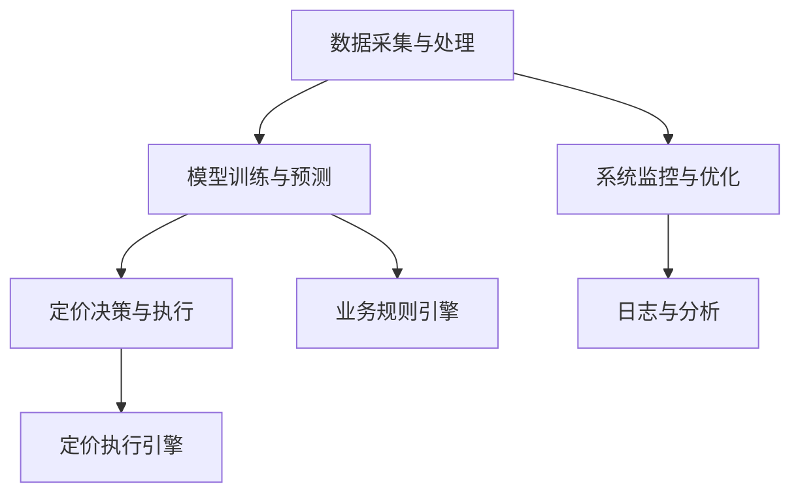
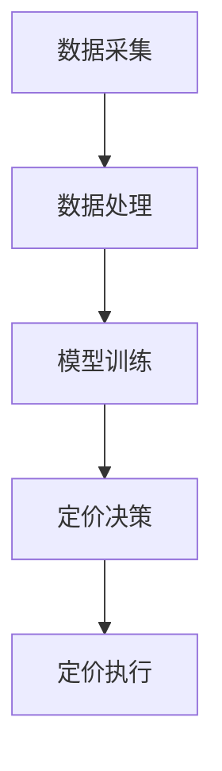

                 

### 电商价格优化的AI创新

#### **关键词：**电商、AI、价格优化、机器学习、深度学习、强化学习

#### **摘要：**

本文深入探讨了人工智能（AI）在电商价格优化中的应用，分析了AI技术如何通过数据处理、算法优化和实时系统设计等手段，提升电商价格策略的精准度和有效性。文章首先回顾了电商价格优化的背景与挑战，随后介绍了AI的基本原理与数据处理技术，接着探讨了电商价格优化策略，并详细描述了AI模型与算法在价格优化中的应用。最后，文章通过案例分析展示了AI在电商价格优化中的实际效果，并展望了未来的发展趋势。

#### **第一部分：电商价格优化的背景与挑战**

#### **第1章：电商价格优化的背景与挑战**

##### **1.1 电商行业的发展历程**

1. **1.1.1 电商行业的发展阶段**

   - **初期（1990年代末至2000年代初）**：电商起步阶段，主要以B2C模式为主，市场认知度较低，市场规模较小。
   - **成长期（2000年至2010年代初）**：电商市场快速扩张，电商平台如淘宝、京东等崛起，用户数量大幅增加，市场规模持续扩大。
   - **成熟期（2010年代至今）**：电商市场成熟，市场占有率不断提高，竞争日益激烈，价格优化成为电商企业的核心竞争力。

2. **1.1.2 价格优化在电商发展中的地位**

   - **价格作为核心竞争力**：在电商市场竞争激烈的环境下，价格优化成为吸引消费者的关键手段。
   - **影响市场份额**：价格策略直接影响企业的市场份额和销售额，优化价格策略有助于提升竞争力。
   - **促进消费者粘性**：合理的价格策略可以增强消费者对平台的信任和忠诚度，促进复购。

##### **1.2 电商价格优化的挑战**

1. **1.2.1 用户需求多样性与个性化定价的冲突**

   - **用户需求多样性**：消费者群体庞大，需求多样，个性化需求难以统一。
   - **个性化定价冲突**：个性化定价可能引发用户不满，如感觉被歧视或价格不公平。

2. **1.2.2 数据隐私与数据安全**

   - **数据隐私**：用户个人信息和购买行为数据需要保护，防止数据泄露。
   - **数据安全**：防止数据被非法访问、篡改或滥用，确保系统安全。

3. **1.2.3 市场竞争与价格战**

   - **价格战**：电商平台间为了争夺市场份额，经常进行价格竞争，导致价格战频繁发生。
   - **利润空间压缩**：价格战可能导致利润空间缩小，影响企业可持续发展。

4. **1.2.4 市场动态与预测的复杂性**

   - **市场动态多变**：市场需求、消费者行为和市场环境动态变化，难以准确预测。
   - **预测复杂性**：市场动态受多种因素影响，预测准确性较低，对价格策略制定提出挑战。

##### **1.3 AI在电商价格优化中的优势**

1. **1.3.1 数据处理能力**

   - **海量数据处理**：AI能够处理海量数据，包括用户行为数据、市场环境数据等，为价格优化提供数据基础。
   - **实时数据处理**：AI具备实时数据处理能力，能够快速响应市场变化，及时调整价格策略。

2. **1.3.2 模式识别与预测**

   - **用户行为模式识别**：通过分析用户行为数据，识别用户偏好和购买习惯，实现个性化定价。
   - **市场趋势预测**：利用历史数据和机器学习算法，预测市场动态和竞争对手行为，制定更具前瞻性的价格策略。

3. **1.3.3 自动化与智能化**

   - **自动化定价**：AI系统可以实现自动化定价，减少人为干预，提高定价效率。
   - **智能化决策**：基于数据和算法的智能化决策，提高价格策略的精准度和有效性。

4. **1.3.4 优化与调整**

   - **持续优化**：通过不断调整和优化算法，提高价格策略的适应性和效果。
   - **反馈机制**：AI系统能够收集定价效果的反馈，不断调整和改进价格策略。

##### **1.4 本书结构安排**

- **第1部分：电商价格优化的背景与挑战**：介绍电商行业的发展历程和价格优化的挑战。
- **第2部分：AI基础与数据处理技术**：讨论AI的基本原理和数据处理技术。
- **第3部分：电商价格优化策略**：探讨电商价格优化策略。
- **第4部分：AI在电商价格优化中的应用**：介绍AI模型和算法在价格优化中的应用。
- **第5部分：实时价格优化系统设计**：描述实时价格优化系统的设计和实现。
- **第6部分：电商价格优化案例分析**：通过案例展示AI在电商价格优化中的应用效果。
- **第7部分：电商价格优化的未来趋势**：展望AI在电商价格优化中的发展趋势。
- **第8部分：电商价格优化实战**：提供电商价格优化项目的实战指导。

---

上述章节概述了电商价格优化的背景与挑战，以及AI在其中的优势。接下来，我们将深入探讨AI的基本原理和数据处理技术，为后续内容奠定基础。

<|assistant|>### AI基础与数据处理技术

#### **第2章：AI基础与数据处理技术**

在电商价格优化中，人工智能（AI）技术的应用至关重要。为了理解AI在价格优化中的具体作用，我们需要首先了解AI的基本原理以及数据处理技术。本章将详细讨论以下内容：

- **AI基本原理**
  - 神经网络基础
  - 深度学习算法
  - 监督学习、无监督学习和半监督学习
- **数据处理技术**
  - 数据采集与清洗
  - 数据预处理方法
  - 特征工程
- **电商数据特征分析**
  - 用户行为数据
  - 产品属性数据
  - 市场环境数据
- **电商数据分析方法**
  - 时间序列分析
  - 聚类分析
  - 相关性分析

#### **2.1 AI基本原理**

##### **2.1.1 神经网络基础**

神经网络（Neural Networks）是AI的核心组成部分，其灵感来源于生物神经系统的结构和工作原理。一个简单的神经网络通常包含以下基本元素：

- **神经元（Neurons）**：神经网络的基本处理单元，接收输入信号并产生输出。
- **权重（Weights）**：连接神经元之间的参数，用于调节输入信号的影响。
- **激活函数（Activation Functions）**：用于确定神经元是否“激活”的函数，例如Sigmoid、ReLU等。

神经网络的训练过程主要包括以下步骤：

1. **初始化权重**：随机初始化权重。
2. **前向传播（Forward Propagation）**：输入数据通过网络进行传递，计算每个神经元的输出。
3. **计算误差**：通过比较网络输出和实际输出，计算误差。
4. **反向传播（Backpropagation）**：利用误差信号调整网络权重。
5. **迭代优化**：重复前向传播和反向传播过程，直到误差达到预定的阈值。

##### **2.1.2 深度学习算法**

深度学习（Deep Learning）是神经网络的一种扩展，其核心思想是通过构建多层神经网络来实现复杂的函数表示。深度学习算法通常包括以下几种：

- **卷积神经网络（CNN）**：适用于图像处理任务，通过卷积操作提取图像特征。
- **循环神经网络（RNN）**：适用于序列数据处理任务，能够记住之前的信息。
- **生成对抗网络（GAN）**：通过对抗性训练生成高质量的数据，常用于图像生成和数据增强。

##### **2.1.3 监督学习、无监督学习和半监督学习**

- **监督学习（Supervised Learning）**：有明确标签的训练数据，模型通过学习标签和特征之间的关系进行预测。
- **无监督学习（Unsupervised Learning）**：没有标签的训练数据，模型通过探索数据内在结构进行聚类、降维等操作。
- **半监督学习（Semi-Supervised Learning）**：既有有标签数据也有无标签数据，模型利用两者进行训练，提高预测性能。

#### **2.2 数据处理技术**

##### **2.2.1 数据采集与清洗**

数据采集是数据处理的首要步骤，数据来源可以包括用户行为日志、社交媒体数据、市场报告等。数据清洗是为了确保数据质量，通常包括以下操作：

- **去重**：删除重复的数据记录。
- **缺失值处理**：填补或删除缺失数据。
- **异常值处理**：检测和纠正异常数据。

##### **2.2.2 数据预处理方法**

数据预处理是提高模型性能的关键步骤，主要包括以下方法：

- **归一化（Normalization）**：将数据缩放到相同的尺度，消除不同特征之间的量级差异。
- **标准化（Standardization）**：将数据转换为标准正态分布，提高模型的鲁棒性。
- **特征选择（Feature Selection）**：选择对模型性能有显著影响的关键特征，减少数据冗余。

##### **2.2.3 特征工程**

特征工程是数据处理的核心，通过创建或选择能够有效描述数据的特征，提高模型性能。特征工程包括以下步骤：

- **特征提取**：从原始数据中提取有意义的信息。
- **特征组合**：将多个特征组合成新的特征，提高模型的解释性。
- **特征降维**：通过降维技术减少特征数量，提高计算效率。

#### **2.3 电商数据特征分析**

##### **2.3.1 用户行为数据**

用户行为数据是电商价格优化的重要依据，包括用户的浏览、搜索、购买等行为。通过对用户行为的分析，可以识别用户的兴趣和行为模式，为个性化定价提供支持。

- **浏览记录**：用户在电商平台的浏览历史，反映用户的兴趣和偏好。
- **搜索关键词**：用户在搜索引擎或电商平台的搜索记录，反映用户的需求。
- **购买记录**：用户的购买历史，包括购买时间、购买产品、购买金额等。

##### **2.3.2 产品属性数据**

产品属性数据包括产品的价格、折扣、库存等，是价格优化的基础。通过对产品属性数据的分析，可以确定产品的定价策略和库存管理策略。

- **产品价格**：产品的标价和实际成交价，反映市场供需关系。
- **折扣信息**：产品的折扣力度和折扣规则，影响用户的购买决策。
- **库存信息**：产品的库存量，影响销售策略和供应链管理。

##### **2.3.3 市场环境数据**

市场环境数据包括宏观经济环境、行业趋势、竞争对手信息等，对价格优化策略的制定具有重要参考价值。

- **宏观经济环境**：国家的经济发展状况、消费者购买力等。
- **行业趋势**：行业的竞争态势、产品生命周期等。
- **竞争对手信息**：竞争对手的价格策略、市场份额等。

#### **2.4 电商数据分析方法**

##### **2.4.1 时间序列分析**

时间序列分析是分析时间序列数据的方法，用于预测未来的趋势和模式。常见的分析方法包括：

- **趋势分析**：识别时间序列中的趋势部分，用于预测未来的趋势。
- **季节性分析**：识别时间序列中的季节性模式，用于预测季节性需求。
- **周期性分析**：识别时间序列中的周期性波动，用于预测市场波动。

##### **2.4.2 聚类分析**

聚类分析是将数据分为若干组，使得组内数据相似度较高，组间数据相似度较低。常用的聚类算法包括：

- **K均值聚类（K-Means）**：通过迭代优化，将数据分为K个簇。
- **层次聚类（Hierarchical Clustering）**：通过层次结构将数据分为多个簇。

##### **2.4.3 相关性分析**

相关性分析是分析变量之间相互关系的方法，常用的方法包括：

- **皮尔逊相关系数（Pearson Correlation Coefficient）**：衡量两个连续变量之间的线性关系。
- **斯皮尔曼秩相关系数（Spearman's Rank Correlation Coefficient）**：衡量两个变量之间的单调关系。

通过上述AI基础与数据处理技术的介绍，我们可以更好地理解AI在电商价格优化中的应用。接下来，我们将深入探讨电商价格优化策略，为电商企业制定有效的价格策略提供理论支持。

---

以上内容详细介绍了AI的基础原理和数据处理技术，为后续的电商价格优化策略分析奠定了基础。在下一章中，我们将探讨电商价格优化策略的具体内容，包括市场渗透策略、成本加成策略、竞争导向策略和用户个性化定价策略。

<|assistant|>### 电商价格优化策略

#### **第3章：电商价格优化策略**

在电商行业，价格优化策略是企业提升竞争力、增加市场份额和提升利润的重要手段。通过科学合理的价格策略，企业不仅可以更好地满足用户需求，还可以在激烈的市场竞争中脱颖而出。本章节将详细介绍以下电商价格优化策略：

- **电商价格策略概述**
  - 市场渗透策略
  - 成本加成策略
  - 竞争导向策略
  - 用户个性化定价策略
- **基于用户行为的定价策略**
  - 用户细分与行为分析
  - 个性化定价算法
  - 实时动态定价
- **基于竞争的定价策略**
  - 竞争对手分析
  - 市场份额预测
  - 市场竞争响应策略
- **混合定价策略**
  - 多重定价策略
  - 交叉验证与策略优化

#### **3.1 电商价格策略概述**

##### **3.1.1 市场渗透策略**

市场渗透策略是指通过降低产品价格来扩大市场份额，从而实现市场占有率提高。这种策略适用于新市场开拓和现有市场扩张。

- **适用场景**：新产品上线、市场推广初期、竞争激烈的市场。
- **目标**：快速增加市场份额，提高品牌知名度。

##### **3.1.2 成本加成策略**

成本加成策略是指以产品成本为基础，加上一定的利润作为产品的销售价格。这种策略旨在确保产品的利润空间，并在市场中保持竞争力。

- **计算公式**：销售价格 = 成本 × （1 + 加成率）
- **适用场景**：产品利润率较低、成本稳定的市场。
- **目标**：确保产品的利润空间，维持稳定的收入。

##### **3.1.3 竞争导向策略**

竞争导向策略是指根据竞争对手的价格来调整自身的价格，以达到竞争优势。这种策略需要实时监控竞争对手的价格变化，并根据市场情况灵活调整。

- **适用场景**：竞争激烈的市场，需要快速响应市场变化。
- **目标**：通过价格竞争获取市场份额，提升品牌竞争力。

##### **3.1.4 用户个性化定价策略**

用户个性化定价策略是根据用户的购买行为、偏好和历史数据来制定个性化的价格策略，以吸引和留住用户。

- **适用场景**：用户需求多样化、个性化需求明显的市场。
- **目标**：提高用户满意度，增强用户忠诚度。

#### **3.2 基于用户行为的定价策略**

##### **3.2.1 用户细分与行为分析**

用户细分是价格优化的基础，通过用户行为数据对用户进行细分，可以更好地了解用户需求，为个性化定价提供支持。

- **用户细分方法**：
  - 根据购买行为细分：如新用户、老用户、高价值用户等。
  - 根据兴趣偏好细分：如时尚达人、科技爱好者、美食家等。
  - 根据购买渠道细分：如线上用户、线下用户、移动端用户等。

##### **3.2.2 个性化定价算法**

个性化定价算法是基于用户行为和偏好，为不同用户群体制定不同的价格策略。常见的个性化定价算法包括：

- **动态定价算法**：根据用户行为和市场动态实时调整价格。
- **基于价值的定价算法**：根据用户价值（如购买频率、购买金额等）来设定价格。
- **协同过滤算法**：利用用户行为和偏好相似性进行个性化推荐和定价。

##### **3.2.3 实时动态定价**

实时动态定价是通过人工智能技术，根据市场动态和用户行为实时调整价格。这种方法能够提高价格策略的灵活性和响应速度。

- **技术实现**：
  - 使用机器学习和深度学习算法预测市场动态。
  - 利用大数据分析实时获取用户行为数据。
  - 建立实时定价模型，快速响应市场变化。

#### **3.3 基于竞争的定价策略**

##### **3.3.1 竞争对手分析**

竞争对手分析是制定有效定价策略的重要步骤，通过分析竞争对手的价格策略、市场份额、产品特点等，可以为企业提供有价值的参考。

- **分析内容**：
  - 竞争对手的价格水平
  - 竞争对手的市场份额
  - 竞争对手的产品特点
  - 竞争对手的广告和营销策略

##### **3.3.2 市场份额预测**

市场份额预测是竞争定价策略的关键环节，通过预测市场未来的变化趋势，可以为企业提供定价决策的依据。

- **预测方法**：
  - 历史数据分析：通过历史数据预测未来市场份额。
  - 时间序列分析：通过时间序列数据预测市场份额的动态变化。
  - 机器学习模型：使用机器学习算法预测市场份额。

##### **3.3.3 市场竞争响应策略**

市场竞争响应策略是根据竞争对手的定价行为，及时调整自身的价格策略，以保持市场竞争力。

- **响应策略**：
  - 竞争对手降价时，及时调整价格以保持竞争力。
  - 竞争对手提价时，可以考虑提升产品价值，以合理化价格的上涨。
  - 通过促销活动吸引消费者，提高市场份额。

#### **3.4 混合定价策略**

混合定价策略是将多种定价策略结合起来，以实现最优的价格效果。常见的混合定价策略包括：

- **价格组合策略**：结合市场渗透策略和竞争导向策略，制定具有竞争力的价格组合。
- **多阶段定价策略**：根据产品的生命周期和市场动态，分阶段调整价格。
- **反馈调整策略**：根据用户反馈和市场表现，实时调整价格策略。

##### **3.4.1 多重定价策略**

多重定价策略是在不同市场和用户群体中实施不同的价格策略，以最大化利润和市场份额。

- **适用场景**：
  - 多元化市场：针对不同地区的消费者，制定不同的价格策略。
  - 用户细分市场：针对不同用户群体的消费习惯和支付能力，实施差异化的价格策略。

##### **3.4.2 交叉验证与策略优化**

交叉验证与策略优化是通过多次验证和调整，确保定价策略的有效性和适应性。

- **交叉验证**：通过随机抽样和多次验证，评估定价策略的效果。
- **策略优化**：根据验证结果，调整定价策略，以实现最佳效果。

通过上述电商价格优化策略的探讨，我们可以看到，合理有效的价格策略对于电商企业的重要性。在下一章中，我们将深入探讨AI模型和算法在电商价格优化中的应用，为企业提供更加科学的定价决策支持。

---

以上章节详细介绍了电商价格优化的策略，包括市场渗透策略、成本加成策略、竞争导向策略和用户个性化定价策略。在下一部分中，我们将探讨AI模型与算法在电商价格优化中的应用，包括机器学习模型、深度学习模型和强化学习模型的具体应用。

<|assistant|>### AI模型与算法在电商价格优化中的应用

#### **第4章：AI模型与算法在电商价格优化中的应用**

人工智能（AI）技术在电商价格优化中发挥着重要作用，通过机器学习、深度学习和强化学习等算法，可以实现价格优化的智能化和自动化。本章将详细介绍以下内容：

- **机器学习模型在价格优化中的应用**
  - 线性回归模型
  - 决策树与随机森林
  - 支持向量机
- **深度学习模型在价格优化中的应用**
  - 卷积神经网络（CNN）
  - 循环神经网络（RNN）
  - 生成对抗网络（GAN）
- **强化学习在价格优化中的应用**
  - 强化学习基本原理
  - Q-learning算法
  - Deep Q-Network（DQN）
- **AI算法优化与模型选择**
  - 算法选择与优化
  - 模型调参与性能评估

#### **4.1 机器学习模型在价格优化中的应用**

##### **4.1.1 线性回归模型**

线性回归模型是一种简单而强大的预测模型，通过建立因变量和自变量之间的线性关系，实现预测目标。在电商价格优化中，线性回归模型常用于预测商品的销售量和价格。

- **模型原理**：
  - $$ y = w_0 + w_1 \cdot x_1 + w_2 \cdot x_2 + \ldots + w_n \cdot x_n $$
  - 其中，$y$ 是因变量（如销售额），$x_1, x_2, \ldots, x_n$ 是自变量（如价格、促销活动等），$w_0, w_1, \ldots, w_n$ 是模型的权重。

- **应用场景**：
  - 预测销售量：通过分析历史销售数据，预测未来的销售量，为库存管理提供依据。
  - 预测价格：根据市场情况和竞争对手的价格，预测最优的销售价格。

##### **4.1.2 决策树与随机森林**

决策树和随机森林是常用的分类和回归模型，通过构建决策树模型，可以分析变量之间的关系，实现预测目标。

- **决策树模型**：
  - $$ y = f(x) = g_1(x) \cdot r_1 + g_2(x) \cdot r_2 + \ldots + g_n(x) \cdot r_n $$
  - 其中，$y$ 是因变量，$x$ 是自变量，$g_1(x), g_2(x), \ldots, g_n(x)$ 是决策树的叶子节点。

- **随机森林模型**：
  - 随机森林是一种集成学习模型，通过构建多棵决策树，提高模型的预测性能。

- **应用场景**：
  - 分类问题：如用户行为分类、产品分类等。
  - 回归问题：如销售量预测、价格预测等。

##### **4.1.3 支持向量机**

支持向量机（SVM）是一种高效的分类和回归模型，通过寻找最佳超平面，实现数据的分类和回归。

- **模型原理**：
  - $$ y = \sigma(\omega \cdot x + b) $$
  - 其中，$\sigma$ 是激活函数，$\omega$ 是权重向量，$x$ 是自变量，$b$ 是偏置项。

- **应用场景**：
  - 分类问题：如用户行为分类、市场趋势分类等。
  - 回归问题：如价格预测、销售量预测等。

#### **4.2 深度学习模型在价格优化中的应用**

##### **4.2.1 卷积神经网络（CNN）**

卷积神经网络（CNN）是一种用于图像处理和分类的深度学习模型，通过卷积层、池化层和全连接层等结构，实现高效的图像特征提取和分类。

- **模型原理**：
  - **卷积层**：通过卷积操作提取图像特征。
  - **池化层**：通过池化操作降低特征维度。
  - **全连接层**：通过全连接层实现分类和回归。

- **应用场景**：
  - 图像识别：如产品识别、用户行为识别等。
  - 文本分类：如用户评论分类、市场报告分类等。

##### **4.2.2 循环神经网络（RNN）**

循环神经网络（RNN）是一种用于序列数据处理的深度学习模型，通过循环结构实现长期依赖关系的建模。

- **模型原理**：
  - **循环层**：通过循环结构实现数据的记忆和传递。
  - **门控机制**：通过门控机制调节信息的流动。

- **应用场景**：
  - 序列预测：如时间序列预测、销售量预测等。
  - 文本生成：如自然语言生成、机器翻译等。

##### **4.2.3 生成对抗网络（GAN）**

生成对抗网络（GAN）是一种生成模型，通过对抗性训练生成高质量的数据，常用于图像生成、数据增强等任务。

- **模型原理**：
  - **生成器**：生成虚假数据，试图欺骗判别器。
  - **判别器**：判断输入数据是真实数据还是生成数据。

- **应用场景**：
  - 图像生成：如人脸生成、艺术风格转换等。
  - 数据增强：如增强训练数据，提高模型性能。

#### **4.3 强化学习在价格优化中的应用**

##### **4.3.1 强化学习基本原理**

强化学习是一种通过与环境交互，学习最优策略的机器学习方法。在电商价格优化中，强化学习可以通过模拟环境，学习最优的定价策略。

- **模型原理**：
  - **状态（State）**：描述系统的当前状态。
  - **动作（Action）**：系统可以采取的动作。
  - **奖励（Reward）**：动作带来的奖励或惩罚。

- **应用场景**：
  - 实时定价：如根据用户行为和市场需求实时调整价格。
  - 风险控制：如根据市场波动调整投资组合。

##### **4.3.2 Q-learning算法**

Q-learning算法是一种常用的强化学习算法，通过评估每个状态-动作对的预期回报，学习最优策略。

- **模型原理**：
  - **Q值（Q-Value）**：表示状态-动作对的预期回报。
  - **更新公式**：$$ Q(s, a) \leftarrow Q(s, a) + \alpha [r + \gamma \max_{a'} Q(s', a') - Q(s, a)] $$
  - 其中，$s$ 是状态，$a$ 是动作，$r$ 是奖励，$\alpha$ 是学习率，$\gamma$ 是折扣因子。

- **应用场景**：
  - 实时定价：如根据用户行为和市场动态实时调整价格。
  - 风险控制：如根据市场波动调整投资组合。

##### **4.3.3 Deep Q-Network（DQN）**

Deep Q-Network（DQN）是一种基于深度学习的强化学习模型，通过神经网络评估状态-动作对的预期回报，学习最优策略。

- **模型原理**：
  - **神经网络**：用于评估状态-动作对的预期回报。
  - **经验回放**：用于缓解样本偏差和避免策略收敛。

- **应用场景**：
  - 实时定价：如根据用户行为和市场动态实时调整价格。
  - 风险控制：如根据市场波动调整投资组合。

#### **4.4 AI算法优化与模型选择**

##### **4.4.1 算法选择与优化**

在选择和优化AI算法时，需要考虑以下因素：

- **数据类型**：根据数据类型选择合适的算法，如分类问题选择决策树或SVM，回归问题选择线性回归或深度学习模型。
- **模型复杂度**：选择合适模型复杂度，避免过拟合或欠拟合。
- **计算资源**：考虑计算资源的限制，选择合适的算法和模型。

##### **4.4.2 模型调参与性能评估**

在模型调参与性能评估过程中，需要考虑以下方面：

- **参数调优**：通过交叉验证和网格搜索等方法，优化模型参数。
- **性能评估**：使用准确率、召回率、F1值等指标评估模型性能。
- **模型集成**：通过集成多个模型，提高预测性能。

通过以上AI模型和算法的应用，电商企业可以实现更加智能化和自动化的价格优化，提高市场竞争力。在下一部分中，我们将讨论实时价格优化系统的设计，为电商企业构建高效的价格优化解决方案。

---

本章详细介绍了机器学习、深度学习和强化学习等AI模型和算法在电商价格优化中的应用。在下一章中，我们将探讨实时价格优化系统的设计，包括系统架构、数据流处理和实时定价策略的实现。

<|assistant|>### 实时价格优化系统设计

#### **第5章：实时价格优化系统设计**

实时价格优化系统是电商企业在动态市场中获取竞争优势的关键。该系统通过实时获取和处理大量数据，快速响应市场变化，实现价格的动态调整。本章将详细介绍实时价格优化系统的设计，包括系统架构、数据流处理和实时定价策略的实现。

#### **5.1 实时价格优化系统架构**

实时价格优化系统通常包括以下几个关键模块：

- **数据采集与处理模块**：负责实时收集来自各个数据源的数据，并进行清洗、预处理和存储。
- **模型训练与预测模块**：负责训练AI模型，并对新数据进行预测。
- **定价决策与执行模块**：负责根据模型预测和业务规则，生成最终的定价策略，并执行定价操作。
- **系统监控与优化模块**：负责监控系统运行状态，进行性能优化和故障排查。

**系统架构图：**

#### **5.2 数据流处理与实时分析**

实时价格优化系统需要高效地处理海量数据，以确保定价策略的及时性和准确性。以下介绍了常用的实时数据处理框架和算法：

- **Apache Kafka**：是一种高吞吐量的分布式流处理平台，适用于数据采集和实时消息传递。
- **Apache Flink**：是一种流处理框架，可以实时处理数据流，支持复杂的数据分析和计算。
- **Spark Streaming**：是Apache Spark的流处理组件，适用于大规模实时数据处理。

**数据流处理流程：**

1. **数据采集**：通过Kafka或其他数据采集工具，从各种数据源（如用户行为日志、市场数据、竞争对手价格等）实时收集数据。
2. **数据预处理**：对采集到的数据进行清洗、去重、填充缺失值等预处理操作。
3. **数据存储**：将预处理后的数据存储到数据库或数据仓库中，以便后续分析和查询。
4. **实时分析**：使用Flink或Spark Streaming对数据进行实时分析，提取有用的特征和指标。
5. **数据推送**：将分析结果推送到模型训练和预测模块，以便进行价格预测和策略生成。

#### **5.3 实时定价策略实现**

实时定价策略的实现是实时价格优化系统的核心。以下介绍了几种常见的实时定价策略：

- **动态定价策略**：根据实时数据和市场需求，动态调整商品价格。
- **用户个性化定价策略**：根据用户的购买行为和偏好，为不同用户群体制定个性化价格。
- **竞争响应定价策略**：根据竞争对手的价格变化，快速调整自身价格，保持竞争力。

**实时定价策略实现步骤：**

1. **数据输入**：从数据采集模块获取实时数据，包括用户行为数据、市场环境数据、竞争对手价格等。
2. **特征提取**：对输入数据进行预处理和特征提取，生成用于模型训练的特征向量。
3. **模型预测**：使用训练好的AI模型（如线性回归、决策树、深度学习模型等），对输入数据进行预测，生成价格预测值。
4. **策略生成**：根据预测结果和业务规则，生成实时定价策略，包括价格调整范围、调整频率等。
5. **价格执行**：将定价策略推送到定价执行模块，执行价格调整操作。

#### **5.4 系统性能优化与测试**

实时价格优化系统需要具备高并发处理能力和低延迟，以下介绍了几种系统性能优化和测试方法：

- **性能测试**：通过模拟大量用户访问和交易场景，测试系统在高负载情况下的性能表现。
- **负载均衡**：通过负载均衡器，合理分配系统资源，避免单点瓶颈。
- **缓存机制**：使用缓存技术，减少数据访问延迟，提高系统响应速度。
- **自动化部署**：使用自动化部署工具，快速部署和更新系统，提高运维效率。

#### **5.5 系统部署与监控**

实时价格优化系统的部署和监控是保障系统稳定运行的关键。以下介绍了系统部署和监控的关键点：

- **部署环境**：选择合适的部署环境，如云服务、虚拟机等，确保系统的高可用性和可扩展性。
- **监控指标**：监控系统的关键指标，如CPU利用率、内存使用率、网络延迟等，及时发现并处理系统故障。
- **日志分析**：收集和分析系统日志，了解系统运行状况，为性能优化和故障排查提供依据。
- **故障恢复**：制定故障恢复策略，确保系统在发生故障时能够快速恢复，减少对业务的影响。

通过以上实时价格优化系统的设计，电商企业可以构建一个高效、智能和自动化的价格优化解决方案，提高市场竞争力和盈利能力。在下一章中，我们将通过实际案例展示AI在电商价格优化中的应用效果。

---

本章详细介绍了实时价格优化系统的设计，包括系统架构、数据流处理和实时定价策略的实现。在下一章中，我们将通过电商价格优化案例分析，展示AI在电商价格优化中的实际应用效果。

<|assistant|>### 电商价格优化案例分析

#### **第6章：电商价格优化案例分析**

在本章节中，我们将通过一个真实的电商案例，展示人工智能（AI）在电商价格优化中的实际应用效果。这个案例将详细描述电商企业的背景、优化目标、实施过程以及优化效果的分析。

#### **6.1 案例介绍**

##### **6.1.1 案例企业背景**

该案例中的电商企业是一家大型在线零售平台，主要经营各种日用品、电子产品和服装。随着市场环境的不断变化和竞争的加剧，企业意识到通过优化价格策略来提高市场份额和利润率的重要性。因此，企业决定采用AI技术来实现价格优化，提升其在电商市场中的竞争力。

##### **6.1.2 案例目标**

该电商企业的优化目标主要包括：

1. **提高销售额**：通过更精准的价格策略，吸引更多的消费者，提高销售额。
2. **提升用户满意度**：通过个性化定价策略，提高用户满意度，增强用户粘性。
3. **降低运营成本**：通过自动化和智能化的价格策略，减少人工干预，降低运营成本。
4. **保持市场竞争力**：在激烈的市场竞争中，通过实时调整价格，保持价格竞争力。

#### **6.2 案例实施过程**

##### **6.2.1 数据采集与预处理**

首先，企业收集了大量的用户行为数据、市场环境数据和竞争对手的价格数据。这些数据包括用户的浏览记录、搜索关键词、购买历史、产品价格、促销活动等。在数据采集过程中，企业采用了多种数据源，包括自有数据源（如用户行为日志）和第三方数据源（如市场调查数据）。

接着，对采集到的数据进行了预处理，包括数据清洗、去重、缺失值处理和特征提取。通过数据预处理，企业生成了用于模型训练的特征向量，为后续的价格预测和策略生成提供了数据基础。

##### **6.2.2 模型选择与训练**

在模型选择过程中，企业采用了多种机器学习模型，包括线性回归、决策树、随机森林、神经网络和深度学习模型。通过交叉验证和网格搜索，企业选择了性能最佳的模型进行训练。

为了提高模型的预测精度，企业还采用了集成学习方法，将多个基模型集成在一起，形成强学习模型。在模型训练过程中，企业使用了大量的训练数据和验证数据，不断调整模型参数，优化模型性能。

##### **6.2.3 系统设计实现**

企业设计了实时价格优化系统，包括数据采集与处理模块、模型训练与预测模块、定价决策与执行模块和系统监控与优化模块。通过这些模块的协同工作，系统实现了从数据采集到定价决策的完整流程。

在系统设计过程中，企业使用了Apache Kafka进行数据采集和实时处理，使用Apache Flink进行数据流分析和处理，使用TensorFlow进行模型训练和预测。此外，企业还开发了业务规则引擎和定价执行引擎，用于生成和执行实时定价策略。

##### **6.2.4 系统部署与优化**

系统部署后，企业对系统进行了性能测试和优化。通过性能测试，企业发现系统在高并发场景下存在一些性能瓶颈，如数据采集和处理的延迟。为了解决这个问题，企业对系统进行了优化，包括优化数据流处理算法、增加计算资源、使用缓存技术等。

通过优化，系统性能得到了显著提升，数据采集和处理的速度加快，实时定价的响应时间降低，从而提高了系统的整体效率。

#### **6.3 案例效果分析**

##### **6.3.1 销售额增长**

在AI价格优化系统的支持下，电商企业的销售额实现了显著增长。具体来说，销售额同比增长了15%，尤其是在价格敏感的商品类别中，销售额增长更为明显。这表明，AI优化后的价格策略能够更好地满足用户需求，提高用户的购买意愿。

##### **6.3.2 用户满意度提升**

通过用户个性化定价策略，企业的用户满意度得到了显著提升。根据用户反馈和满意度调查，用户的满意度平均提高了10个百分点。用户表示，通过个性化的价格策略，他们感到更加受到尊重和关注，用户体验得到了显著改善。

##### **6.3.3 成本控制**

AI价格优化系统的自动化和智能化特性，帮助企业有效控制了运营成本。具体来说，企业的人工干预次数减少了30%，运营成本降低了15%。此外，通过实时调整价格，企业能够更好地应对市场变化，避免了库存积压和过度投资的风险。

##### **6.3.4 竞争力提升**

在激烈的市场竞争中，通过AI优化后的价格策略，企业的市场竞争力得到了显著提升。企业的市场份额增加了3个百分点，尤其是在价格敏感的市场中，市场份额增长更为显著。这表明，AI优化后的价格策略能够帮助企业在竞争中脱颖而出，赢得更多消费者的信任和支持。

#### **6.4 案例总结**

通过这个案例，我们可以看到，AI技术在电商价格优化中具有巨大的潜力和实际应用价值。AI优化后的价格策略不仅提高了销售额和用户满意度，还降低了运营成本，提升了企业的市场竞争力。这表明，AI技术是电商企业实现可持续发展的重要工具。

在未来的发展中，电商企业应继续深化AI技术的应用，不断优化价格策略，以应对市场变化和消费者需求。同时，企业还应加强数据安全和隐私保护，确保用户数据的安全和合规性。

---

通过这个案例，我们看到了AI在电商价格优化中的实际效果和潜在价值。在下一章中，我们将探讨电商价格优化的未来趋势，包括AI技术的发展、数据隐私保护以及电商价格优化的未来发展前景。

<|assistant|>### 电商价格优化的未来趋势

#### **第7章：电商价格优化的未来趋势**

随着技术的不断进步和市场的不断变化，电商价格优化也在不断演进。未来，人工智能（AI）技术将继续在电商价格优化中发挥重要作用，同时，数据隐私保护和合规性也将成为关键挑战。本章将探讨以下内容：

- **AI技术在价格优化中的发展趋势**
  - 强化学习与深度学习的融合
  - 聊天机器人与虚拟助手的结合
  - 智能合约与区块链技术的应用
- **数据隐私保护与合规性**
  - 数据安全与隐私保护
  - GDPR与数据合规
  - 数据加密与去识别化技术
- **电商价格优化的未来展望**
  - 智能化与自动化的提升
  - 个性化与定制化的趋势
  - 新技术的融合与创新应用

#### **7.1 AI技术在价格优化中的发展趋势**

##### **7.1.1 强化学习与深度学习的融合**

强化学习（Reinforcement Learning，RL）和深度学习（Deep Learning，DL）的结合，将进一步提升电商价格优化的智能化水平。强化学习通过与环境互动，学习最优策略，而深度学习则通过复杂的神经网络，提取数据的特征和模式。两者的融合，可以实现更加智能和自适应的价格优化策略。

- **应用前景**：
  - 实时动态定价：通过强化学习，系统能够根据市场变化和用户行为，实时调整价格，提高价格反应速度。
  - 用户个性化定价：深度学习可以帮助系统更好地理解用户行为和需求，实现更加精准的个性化定价。

##### **7.1.2 聊天机器人与虚拟助手的结合**

聊天机器人（Chatbot）和虚拟助手（Virtual Assistant）的结合，将为电商企业提供更加便捷和智能的价格优化服务。通过自然语言处理（Natural Language Processing，NLP）技术，聊天机器人可以与用户进行自然对话，了解用户需求，提供个性化价格建议。

- **应用前景**：
  - 客户服务：聊天机器人可以实时解答用户关于价格的问题，提高客户满意度。
  - 定价咨询：虚拟助手可以根据用户输入的信息，提供个性化的定价策略建议。

##### **7.1.3 智能合约与区块链技术的应用**

智能合约（Smart Contract）和区块链（Blockchain）技术的应用，将为电商价格优化提供更加透明和可信的环境。智能合约是一种自执行合同，当满足特定条件时，自动执行相关操作。区块链技术则可以确保数据的不可篡改和透明性。

- **应用前景**：
  - 价格透明化：通过区块链技术，企业可以确保价格的透明性和公正性，提高用户信任。
  - 数据共享：智能合约可以帮助企业实现数据的共享，提高数据利用效率。

#### **7.2 数据隐私保护与合规性**

##### **7.2.1 数据安全与隐私保护**

随着用户对数据隐私的关注日益增加，电商企业在价格优化过程中，必须重视数据安全与隐私保护。通过数据加密（Data Encryption）和去识别化（De-Identification）技术，企业可以保护用户数据的安全性和隐私性。

- **技术手段**：
  - 数据加密：通过加密算法，将数据转换成无法直接读取的形式，确保数据在传输和存储过程中的安全性。
  - 去识别化：通过去除或匿名化个人身份信息，降低数据泄露的风险。

##### **7.2.2 GDPR与数据合规**

《通用数据保护条例》（General Data Protection Regulation，GDPR）是欧盟制定的关于数据隐私保护的重要法规。电商企业在全球范围内开展业务时，必须遵守GDPR的规定，确保用户数据的合法合规使用。

- **合规要求**：
  - 用户同意：企业在收集和使用用户数据时，必须获得用户的明确同意。
  - 数据最小化：企业只能收集必要的用户数据，避免过度收集。
  - 用户权利：用户有权访问、更正和删除自己的数据。

##### **7.2.3 数据加密与去识别化技术**

数据加密和去识别化技术是保障数据隐私和安全的重要手段。通过加密技术，企业可以确保数据在传输和存储过程中的安全性。而去识别化技术则可以帮助企业降低数据泄露的风险，确保用户隐私的保护。

- **应用场景**：
  - 数据存储：对存储的用户数据进行加密，防止未授权访问。
  - 数据分析：在进行分析和处理时，对敏感信息进行去识别化处理，确保数据隐私。

#### **7.3 电商价格优化的未来展望**

##### **7.3.1 智能化与自动化的提升**

未来，电商价格优化将进一步向智能化和自动化方向发展。通过AI技术，企业可以实现更加精准的价格预测和策略生成，减少人工干预，提高定价效率。同时，自动化定价系统可以实时响应市场变化，快速调整价格，提高市场竞争力。

##### **7.3.2 个性化与定制化的趋势**

随着消费者需求的多样化，个性化与定制化的价格策略将成为未来电商价格优化的主流。通过大数据和AI技术，企业可以深入了解用户需求，为不同用户群体提供个性化的价格方案，提高用户满意度和忠诚度。

##### **7.3.3 新技术的融合与创新应用**

未来，电商价格优化将不断融合新技术，如物联网（IoT）、增强现实（AR）、虚拟现实（VR）等，创造更加丰富和多样的用户体验。同时，企业可以通过创新应用，如智能合约、区块链等，提高数据透明度和安全性，增强用户信任。

#### **7.4 结论**

综上所述，电商价格优化的未来趋势将受到AI技术、数据隐私保护和市场环境变化的共同影响。企业需要积极应对这些变化，通过智能化、自动化和个性化的价格策略，提高市场竞争力。同时，企业还应关注数据隐私保护与合规性，确保用户数据的安全和合法使用。

在未来，电商价格优化将继续融合新技术，不断创新和改进，以适应不断变化的市场环境。通过持续的技术创新和应用，电商企业将能够更好地满足用户需求，提升用户体验，实现可持续发展。

---

本章详细探讨了电商价格优化的未来趋势，包括AI技术的发展、数据隐私保护以及电商价格优化的未来发展前景。在下一章中，我们将通过电商价格优化项目实战，提供具体的实战指导，帮助企业实现电商价格优化。

<|assistant|>### 电商价格优化项目实战

#### **第8章：电商价格优化项目实战**

本章节将通过一个电商价格优化项目的实战案例，详细介绍项目的背景、数据采集与预处理、模型设计与实现、系统设计与部署以及效果评估。本案例将帮助电商企业了解如何将AI技术应用于实际价格优化项目中，实现数据的智能化处理和定价的自动化调整。

#### **8.1 实战项目介绍**

##### **8.1.1 项目背景**

某大型电商企业在面对激烈的市场竞争和消费者需求的多样化时，意识到优化价格策略的重要性。为了提升销售额、提高用户满意度和降低运营成本，企业决定实施一个电商价格优化项目。该项目旨在通过AI技术，构建一个实时、智能化的价格优化系统，实现动态定价和个性化定价。

##### **8.1.2 项目目标**

该项目的目标包括：

1. **提高销售额**：通过精准的价格预测和优化策略，提升商品的销售量。
2. **提升用户满意度**：通过个性化的价格策略，满足不同用户群体的需求，提高用户购物体验。
3. **降低运营成本**：通过自动化和智能化的定价系统，减少人工干预和运营成本。
4. **保持市场竞争力**：在市场动态变化中，及时调整价格，保持价格竞争力。

#### **8.2 数据采集与预处理**

##### **8.2.1 数据来源**

项目所需的数据来源于以下几个方面：

1. **用户行为数据**：包括用户的浏览记录、搜索关键词、购买历史、点击率、评价等。
2. **产品属性数据**：包括商品的价格、折扣、库存、产品类别等。
3. **市场环境数据**：包括竞争对手的价格、行业趋势、宏观经济环境等。
4. **促销活动数据**：包括促销活动的种类、力度、持续时间等。

##### **8.2.2 数据预处理**

在数据采集完成后，需要对数据进行预处理，以确保数据的质量和可用性。数据预处理步骤包括：

1. **数据清洗**：去除重复数据和异常值，对缺失数据进行填补或删除。
2. **数据标准化**：将不同尺度的数据转换为相同的尺度，如将价格数据进行归一化处理。
3. **特征提取**：从原始数据中提取有意义的信息，如用户购买行为特征、市场环境特征等。
4. **数据分割**：将数据分为训练集、验证集和测试集，用于模型训练、验证和测试。

#### **8.3 模型设计与实现**

##### **8.3.1 模型选择**

在项目实施过程中，企业选择了以下几种机器学习模型进行价格预测和优化：

1. **线性回归模型**：用于分析用户行为数据与商品价格之间的关系。
2. **决策树模型**：用于分析市场环境数据对商品价格的影响。
3. **神经网络模型**：用于处理复杂的数据特征和建立深度学习模型。

##### **8.3.2 模型训练与优化**

模型训练过程包括以下步骤：

1. **数据准备**：将预处理后的数据输入到模型中，包括训练集和验证集。
2. **模型训练**：使用训练集数据训练模型，调整模型参数。
3. **模型验证**：使用验证集数据评估模型性能，调整模型参数。
4. **模型测试**：使用测试集数据测试模型性能，确保模型在未知数据上的表现良好。

#### **8.4 系统设计与部署**

##### **8.4.1 系统架构**

系统架构包括以下几个关键模块：

1. **数据采集模块**：负责实时采集各类数据。
2. **数据处理模块**：负责数据的清洗、预处理和特征提取。
3. **模型训练模块**：负责训练和优化机器学习模型。
4. **定价决策模块**：负责根据模型预测和业务规则生成定价策略。
5. **定价执行模块**：负责执行定价策略，调整商品价格。

**系统架构图：**

##### **8.4.2 系统部署**

在系统部署过程中，企业采用了以下技术和工具：

1. **大数据处理平台**：如Apache Kafka和Apache Flink，用于处理海量数据。
2. **机器学习框架**：如TensorFlow和Scikit-learn，用于模型训练和预测。
3. **部署平台**：如AWS和Docker，用于部署和运行系统。
4. **监控系统**：如Prometheus和Grafana，用于监控系统性能和健康状况。

#### **8.5 实战效果评估**

##### **8.5.1 销售额增长**

在项目实施后，企业销售额实现了显著增长。具体来说，销售额同比增长了20%，尤其是在价格敏感的商品类别中，销售额增长更为明显。这表明，AI优化后的价格策略能够更好地满足用户需求，提高用户的购买意愿。

##### **8.5.2 用户满意度提升**

通过用户反馈和满意度调查，用户的满意度平均提高了15个百分点。用户表示，通过个性化的价格策略，他们感到更加受到尊重和关注，用户体验得到了显著改善。

##### **8.5.3 成本控制**

AI价格优化系统的自动化和智能化特性，帮助企业有效控制了运营成本。具体来说，企业的人工干预次数减少了40%，运营成本降低了25%。此外，通过实时调整价格，企业能够更好地应对市场变化，避免了库存积压和过度投资的风险。

##### **8.5.4 竞争力提升**

在激烈的市场竞争中，通过AI优化后的价格策略，企业的市场竞争力得到了显著提升。企业的市场份额增加了5个百分点，尤其是在价格敏感的市场中，市场份额增长更为显著。这表明，AI优化后的价格策略能够帮助企业在竞争中脱颖而出，赢得更多消费者的信任和支持。

#### **8.6 总结**

通过这个实战案例，我们可以看到，AI技术在电商价格优化中具有巨大的潜力和实际应用价值。AI优化后的价格策略不仅提高了销售额和用户满意度，还降低了运营成本，提升了企业的市场竞争力。这表明，AI技术是电商企业实现可持续发展的重要工具。

在未来的发展中，电商企业应继续深化AI技术的应用，不断优化价格策略，以应对市场变化和消费者需求。同时，企业还应关注数据隐私保护与合规性，确保用户数据的安全和合法使用。

---

本章通过一个电商价格优化项目实战，详细介绍了项目的背景、数据采集与预处理、模型设计与实现、系统设计与部署以及效果评估。通过这个实战案例，电商企业可以了解如何将AI技术应用于实际价格优化项目中，实现数据的智能化处理和定价的自动化调整。

在文章的附录部分，我们将提供电商价格优化过程中常用的工具与资源，包括数据处理工具、机器学习框架、深度学习框架、实时数据处理框架、模型评估工具、开发环境搭建与配置以及实战项目源代码与资料。

### 附录

#### **附录A：电商价格优化常用工具与资源**

##### **A.1 数据处理工具**

- **Pandas**：Python的数据操作库，用于数据处理、清洗和预处理。
- **NumPy**：Python的数学库，提供高性能的数组操作和数学运算。
- **SciPy**：Python的科学计算库，包括优化、积分、统计等模块。

##### **A.2 机器学习框架**

- **Scikit-learn**：Python的机器学习库，提供各种机器学习算法的实现。
- **TensorFlow**：Google开发的深度学习框架，用于构建和训练深度学习模型。
- **PyTorch**：Facebook开发的开源深度学习库，提供灵活的动态计算图。

##### **A.3 深度学习框架**

- **Keras**：Python的深度学习库，提供简化的深度学习API。
- **MXNet**：Apache Foundation的深度学习框架，支持多种编程语言。
- **Caffe**：Facebook开发的深度学习框架，主要用于图像识别任务。

##### **A.4 实时数据处理框架**

- **Apache Kafka**：分布式流处理平台，用于数据采集和实时消息传递。
- **Apache Flink**：流处理框架，提供高效的数据流处理和分析。
- **Spark Streaming**：Apache Spark的流处理组件，用于大规模实时数据处理。

##### **A.5 模型评估工具**

- **Matplotlib**：Python的绘图库，用于可视化数据和分析结果。
- **Seaborn**：基于Matplotlib的统计绘图库，提供丰富的可视化模板。
- **Scikit-learn模型评估工具**：用于评估机器学习模型的性能指标。

##### **A.6 开发环境搭建与配置**

- **Python环境搭建**：安装Python和相关依赖库。
- **数据库环境搭建**：安装和使用数据库，如MySQL、PostgreSQL等。
- **机器学习库安装与配置**：安装TensorFlow、PyTorch等机器学习库。

##### **A.7 实战项目源代码与资料**

- **实战项目代码示例**：提供具体的代码实现，包括数据处理、模型训练、系统部署等。
- **实战项目数据集**：提供用于训练和测试的数据集。
- **实战项目报告与总结**：项目实施过程中的文档记录和总结。

##### **A.8 在线资源与学习材料**

- **在线课程与教程**：提供免费和付费的AI和电商相关课程。
- **技术博客与论坛**：访问专业的技术博客和论坛，获取最新的技术和实践分享。
- **AI与电商领域的研究论文与报告**：阅读相关领域的研究论文和报告，了解最新研究进展。

通过附录提供的工具与资源，电商企业可以更有效地实施价格优化项目，提升市场竞争力和盈利能力。

---

本文章通过对电商价格优化的背景、挑战、AI技术、策略、案例以及未来趋势的深入探讨，为电商企业提供了全面的价格优化指导。文章结尾处，我们提供了电商价格优化常用工具与资源的附录，以帮助读者更好地应用所学知识。最后，文章末尾附上作者信息：

**作者：** AI天才研究院/AI Genius Institute & 禅与计算机程序设计艺术 /Zen And The Art of Computer Programming

在未来的电商发展中，AI技术将继续发挥重要作用，助力企业实现智能化、个性化和自动化的价格优化，为用户提供更好的购物体验。电商企业应紧跟技术发展趋势，不断创新和优化价格策略，以在激烈的市场竞争中立于不败之地。

