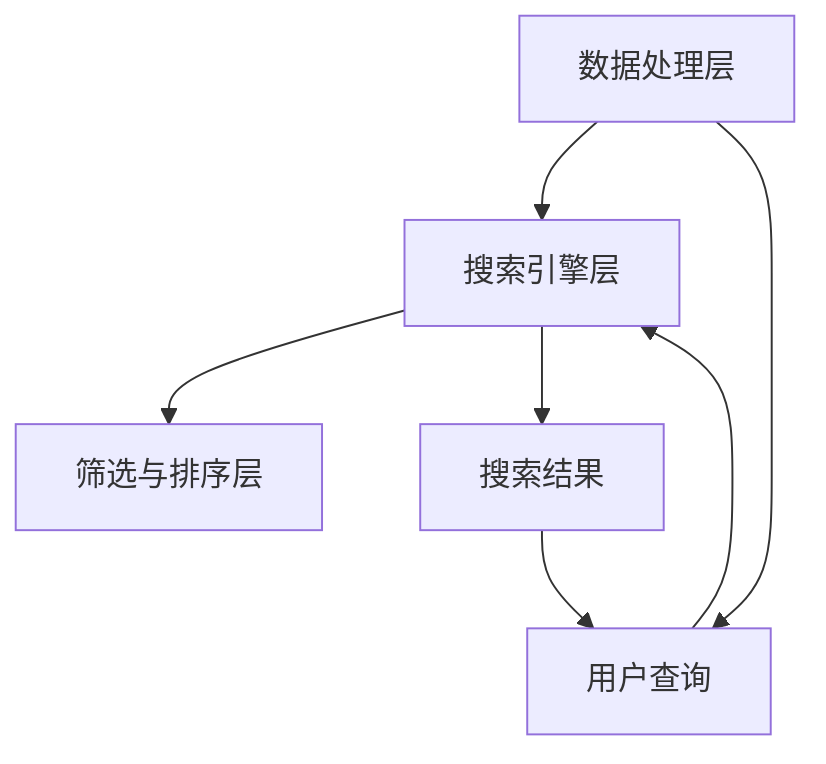

                 

### 《电商平台中的语义搜索技术》

> **关键词**：语义搜索、电商平台、自然语言处理、算法、性能优化、案例分析

> **摘要**：本文将深入探讨电商平台中语义搜索技术的核心概念、基础技术、核心算法原理，以及性能优化和未来发展趋势。通过详细的案例分析，我们将展示如何将这些技术应用到实际项目中，从而提升电商平台的用户体验。

在电子商务日益繁荣的今天，电商平台已经成为消费者获取商品和服务的重要渠道。然而，随着用户数量和商品种类的爆炸性增长，如何让用户快速、准确地找到他们需要的商品，成为了电商平台竞争的关键。语义搜索技术，作为一种强大的工具，可以帮助电商平台解决这一问题。本文将带领读者走进语义搜索的世界，探讨其在电商平台中的应用、挑战以及未来发展趋势。

### 目录大纲

#### 第一部分：引言与背景

- **1.1 电商平台语义搜索的重要性**
  - **1.1.1 语义搜索的基本概念**
  - **1.1.2 语义搜索在电商平台中的应用**
  - **1.1.3 语义搜索提升用户体验的价值**

- **1.2 电商平台语义搜索的挑战**
  - **1.2.1 数据多样性带来的挑战**
  - **1.2.2 用户需求的动态性**
  - **1.2.3 搜索结果的准确性与实时性**

- **1.3 本书结构与内容概述**
  - **1.3.1 目录结构安排**
  - **1.3.2 学习目标与读者对象**
  - **1.3.3 技术需求与开发环境**

#### 第二部分：语义搜索技术基础

- **2.1 自然语言处理基础**
  - **2.1.1 语言模型的基本概念**
  - **2.1.2 词嵌入技术**

- **2.2 语义分析基础**
  - **2.2.1 语义分析的基本概念**
  - **2.2.2 信息检索基础**

- **2.3 语义搜索系统架构**
  - **2.3.1 语义搜索系统的组成**
  - **2.3.2 语义搜索的流程**

#### 第三部分：核心算法原理

- **3.1 搜索引擎算法原理**
  - **3.1.1 搜索引擎的基本算法**
  - **3.1.2 排序算法**

- **3.2 语义分析算法原理**
  - **3.2.1 语义相似度计算**
  - **3.2.2 上下文感知搜索**

- **3.3 常用语义搜索算法**
  - **3.3.1 深度学习在语义搜索中的应用**
  - **3.3.2 常见的语义搜索算法介绍**

#### 第四部分：案例分析

- **4.1 案例分析概述**
  - **4.1.1 案例分析的目的**
  - **4.1.2 案例分析的方法**

- **4.2 案例分析一：某电商平台的语义搜索实现**
  - **4.2.1 案例背景**
  - **4.2.2 搜索引擎架构设计**
  - **4.2.3 语义分析实现**
  - **4.2.4 搜索结果排序与优化**

- **4.3 案例分析二：某电商平台的个性化搜索**
  - **4.3.1 个性化搜索的概念**
  - **4.3.2 个性化搜索的实现方法**
  - **4.3.3 案例具体实现与效果分析**

- **4.4 案例分析三：某电商平台的实时搜索**
  - **4.4.1 实时搜索的挑战**
  - **4.4.2 实时搜索的实现方法**
  - **4.4.3 案例具体实现与性能优化**

#### 第五部分：性能优化与调试

- **5.1 性能优化策略**
  - **5.1.1 搜索引擎性能优化的方法**
  - **5.1.2 数据预处理与索引优化**
  - **5.1.3 系统性能评估与监控**

- **5.2 调试与优化实践**
  - **5.2.1 调试策略与工具**
  - **5.2.2 常见性能问题的排查与解决**
  - **5.2.3 性能调优的实际案例**

- **5.3 可扩展性与维护**
  - **5.3.1 语义搜索系统的可扩展性设计**
  - **5.3.2 搜索系统的维护与更新**
  - **5.3.3 维护与更新策略**

#### 第六部分：未来发展趋势与挑战

- **6.1 语义搜索技术的发展趋势**
  - **6.1.1 人工智能在语义搜索中的应用**
  - **6.1.2 多模态搜索的发展**
  - **6.1.3 智能搜索的个性化与自适应**

- **6.2 语义搜索面临的挑战**
  - **6.2.1 数据隐私保护**
  - **6.2.2 搜索结果的准确性与实时性的平衡**
  - **6.2.3 搜索算法的公平性与透明性**

- **6.3 未来研究方向**
  - **6.3.1 语义搜索算法的创新**
  - **6.3.2 语义搜索系统的优化与改进**
  - **6.3.3 语义搜索与其他领域的交叉应用**

#### 第七部分：附录

- **附录A：常见问题解答**
- **附录B：参考文献与推荐阅读**
- **附录C：代码与数据资源**

### 第一部分：引言与背景

#### 1.1 电商平台语义搜索的重要性

在电子商务时代，用户体验是电商平台成功的关键。而语义搜索作为一种先进的搜索技术，能够显著提升用户体验，是电商平台提升竞争力的重要手段。以下是语义搜索在电商平台中的重要性：

##### 1.1.1 语义搜索的基本概念

语义搜索（Semantic Search）是指利用自然语言处理（NLP）和机器学习技术，对用户输入的查询进行深入理解和分析，从而提供更加精确和相关的搜索结果。与传统基于关键词匹配的搜索不同，语义搜索能够理解查询的含义和上下文，从而实现更加精准的搜索。

##### 1.1.2 语义搜索在电商平台中的应用

在电商平台上，语义搜索有广泛的应用：

1. **商品搜索**：用户可以通过自然语言描述查询商品，如“白色运动鞋”，系统将理解用户的真实需求，并提供相关商品。
2. **内容搜索**：用户可以在电商平台浏览产品详情、用户评论、问答等内容，语义搜索能够帮助用户快速找到所需信息。
3. **个性化推荐**：基于用户的搜索和购买历史，语义搜索可以提供个性化的推荐结果，提高用户的购买转化率。

##### 1.1.3 语义搜索提升用户体验的价值

语义搜索通过以下方式提升用户体验：

1. **精准搜索结果**：语义搜索能够准确理解用户的查询意图，提供更相关的搜索结果，减少用户筛选的时间。
2. **自然语言交互**：用户可以使用自然语言与电商平台进行交互，提高搜索的便捷性和易用性。
3. **个性化体验**：语义搜索可以根据用户的行为和偏好提供个性化的搜索结果和推荐，提升用户的购物体验。

#### 1.2 电商平台语义搜索的挑战

虽然语义搜索在提升用户体验方面具有巨大的潜力，但在实际应用中也面临一系列挑战：

##### 1.2.1 数据多样性带来的挑战

电商平台的数据来源广泛，包括商品信息、用户评论、问答等，这些数据的格式和内容差异巨大，给语义搜索带来了挑战。如何处理和整合这些异构数据，使其能够被有效利用，是一个重要问题。

##### 1.2.2 用户需求的动态性

用户的需求是不断变化的，他们可能在不同的时间和情境下提出不同的查询。语义搜索系统需要能够实时适应这些变化，提供及时、准确的搜索结果。

##### 1.2.3 搜索结果的准确性与实时性

语义搜索需要同时保证搜索结果的准确性和实时性。准确性的挑战在于如何准确理解用户的查询意图，并提供相关度高的结果。实时性的挑战在于如何快速处理大量用户的查询请求，并提供即时的搜索结果。

#### 1.3 本书结构与内容概述

本书旨在为读者提供系统、全面的语义搜索技术指南，分为七个部分：

- **第一部分：引言与背景**：介绍语义搜索在电商平台中的应用和面临的挑战。
- **第二部分：语义搜索技术基础**：讲解自然语言处理、语义分析和信息检索等基础技术。
- **第三部分：核心算法原理**：深入探讨搜索引擎算法、语义分析算法以及常用语义搜索算法。
- **第四部分：案例分析**：通过实际案例展示如何将语义搜索技术应用到电商平台中。
- **第五部分：性能优化与调试**：介绍语义搜索系统的性能优化策略和调试方法。
- **第六部分：未来发展趋势与挑战**：探讨语义搜索技术的发展趋势和面临的挑战。
- **第七部分：附录**：提供常见问题解答、参考文献和代码与数据资源。

本书适合从事电商开发、搜索引擎开发和人工智能研究的读者阅读，同时也适用于高校和科研机构的相关课程教学。

### 1.3.1 目录结构安排

以下是本书的目录结构安排：

- **第一部分：引言与背景**
  - **1.1 电商平台语义搜索的重要性**
    - 1.1.1 语义搜索的基本概念
    - 1.1.2 语义搜索在电商平台中的应用
    - 1.1.3 语义搜索提升用户体验的价值
  - **1.2 电商平台语义搜索的挑战**
    - 1.2.1 数据多样性带来的挑战
    - 1.2.2 用户需求的动态性
    - 1.2.3 搜索结果的准确性与实时性
  - **1.3 本书结构与内容概述**
    - 1.3.1 目录结构安排
    - 1.3.2 学习目标与读者对象
    - 1.3.3 技术需求与开发环境

- **第二部分：语义搜索技术基础**
  - **2.1 自然语言处理基础**
    - 2.1.1 语言模型的基本概念
    - 2.1.2 词嵌入技术
  - **2.2 语义分析基础**
    - 2.2.1 语义分析的基本概念
    - 2.2.2 信息检索基础
  - **2.3 语义搜索系统架构**
    - 2.3.1 语义搜索系统的组成
    - 2.3.2 语义搜索的流程

- **第三部分：核心算法原理**
  - **3.1 搜索引擎算法原理**
    - 3.1.1 搜索引擎的基本算法
    - 3.1.2 排序算法
  - **3.2 语义分析算法原理**
    - 3.2.1 语义相似度计算
    - 3.2.2 上下文感知搜索
  - **3.3 常用语义搜索算法**
    - 3.3.1 深度学习在语义搜索中的应用
    - 3.3.2 常见的语义搜索算法介绍

- **第四部分：案例分析**
  - **4.1 案例分析概述**
    - 4.1.1 案例分析的目的
    - 4.1.2 案例分析的方法
  - **4.2 案例分析一：某电商平台的语义搜索实现**
    - 4.2.1 案例背景
    - 4.2.2 搜索引擎架构设计
    - 4.2.3 语义分析实现
    - 4.2.4 搜索结果排序与优化
  - **4.3 案例分析二：某电商平台的个性化搜索**
    - 4.3.1 个性化搜索的概念
    - 4.3.2 个性化搜索的实现方法
    - 4.3.3 案例具体实现与效果分析
  - **4.4 案例分析三：某电商平台的实时搜索**
    - 4.4.1 实时搜索的挑战
    - 4.4.2 实时搜索的实现方法
    - 4.4.3 案例具体实现与性能优化

- **第五部分：性能优化与调试**
  - **5.1 性能优化策略**
    - 5.1.1 搜索引擎性能优化的方法
    - 5.1.2 数据预处理与索引优化
    - 5.1.3 系统性能评估与监控
  - **5.2 调试与优化实践**
    - 5.2.1 调试策略与工具
    - 5.2.2 常见性能问题的排查与解决
    - 5.2.3 性能调优的实际案例
  - **5.3 可扩展性与维护**
    - 5.3.1 语义搜索系统的可扩展性设计
    - 5.3.2 搜索系统的维护与更新
    - 5.3.3 维护与更新策略

- **第六部分：未来发展趋势与挑战**
  - **6.1 语义搜索技术的发展趋势**
    - 6.1.1 人工智能在语义搜索中的应用
    - 6.1.2 多模态搜索的发展
    - 6.1.3 智能搜索的个性化与自适应
  - **6.2 语义搜索面临的挑战**
    - 6.2.1 数据隐私保护
    - 6.2.2 搜索结果的准确性与实时性的平衡
    - 6.2.3 搜索算法的公平性与透明性
  - **6.3 未来研究方向**
    - 6.3.1 语义搜索算法的创新
    - 6.3.2 语义搜索系统的优化与改进
    - 6.3.3 语义搜索与其他领域的交叉应用

- **第七部分：附录**
  - **附录A：常见问题解答**
  - **附录B：参考文献与推荐阅读**
  - **附录C：代码与数据资源**

### 1.3.2 学习目标与读者对象

本书的学习目标如下：

1. **了解语义搜索的基本概念**：通过学习，读者将了解语义搜索的定义、原理和应用场景。
2. **掌握语义搜索技术基础**：读者将深入理解自然语言处理、语义分析和信息检索等基础技术，并学会如何应用这些技术进行语义搜索。
3. **掌握核心算法原理**：读者将掌握搜索引擎算法、语义分析算法以及常用语义搜索算法，并能够应用这些算法解决实际问题。
4. **具备案例分析能力**：通过实际案例的学习，读者将能够将语义搜索技术应用到电商平台的实际开发中。
5. **了解性能优化与调试方法**：读者将学习如何优化和调试语义搜索系统，确保其高效、稳定地运行。
6. **掌握未来发展趋势与挑战**：读者将了解语义搜索技术的发展趋势和面临的挑战，为未来的研究和开发做好准备。

本书适合以下读者对象：

1. **电商开发人员**：对电商平台开发有兴趣或已从事相关工作，希望提升搜索功能的开发人员。
2. **搜索引擎开发人员**：对搜索引擎开发感兴趣，希望了解如何应用语义搜索技术提升搜索效果的开发人员。
3. **人工智能研究人员**：对自然语言处理和语义搜索领域感兴趣，希望深入了解该领域的最新研究成果。
4. **高校师生**：从事计算机科学、人工智能等相关专业教学和研究的教师和学生。
5. **技术爱好者**：对新技术有浓厚兴趣，希望了解和尝试语义搜索技术的技术爱好者。

### 1.3.3 技术需求与开发环境

为了更好地学习本书内容，读者需要具备以下技术基础和开发环境：

1. **技术基础**：
   - 熟悉计算机科学基础，包括数据结构、算法和操作系统等。
   - 了解编程语言，如Python、Java或C++等。
   - 熟悉自然语言处理（NLP）和机器学习的基本概念和方法。

2. **开发环境**：
   - 安装Python开发环境，如Anaconda或PyCharm。
   - 了解并使用常见的NLP和机器学习库，如NLTK、spaCy、TensorFlow或PyTorch。
   - 安装并配置搜索引擎相关工具，如Elasticsearch或Solr。

3. **工具**：
   - 掌握Mermaid用于绘制流程图和UML图。
   - 熟悉Markdown格式，用于撰写和排版文档。
   - 了解并使用GitHub或其他版本控制工具。

通过上述技术基础和开发环境，读者将能够更好地理解和实践本书所介绍的内容，为实际应用打下坚实的基础。

### 第二部分：语义搜索技术基础

#### 2.1 自然语言处理基础

自然语言处理（Natural Language Processing，NLP）是语义搜索技术的核心组成部分，它使计算机能够理解、解释和生成人类语言。在这一节中，我们将介绍NLP中的两个基本概念：语言模型和词嵌入技术。

##### 2.1.1 语言模型的基本概念

语言模型（Language Model，LM）是对自然语言的概率分布进行建模的模型。它可以用来预测下一个词的概率，从而帮助计算机更好地理解和生成自然语言。语言模型是许多NLP任务的基础，如机器翻译、语音识别和文本生成。

在NLP中，语言模型可以分为以下几种：

1. **n-gram模型**：基于历史n个词来预测下一个词。例如，二元语言模型（Bigram）使用前一个词来预测下一个词的概率。

2. **神经网络语言模型**：使用深度神经网络（如循环神经网络RNN、长短期记忆LSTM和变换器Transformer）来建模词之间的关系。这些模型通常能够捕捉更复杂的语言规律。

3. **上下文语言模型**：考虑上下文信息来预测词的概率，例如BERT（Bidirectional Encoder Representations from Transformers）模型。

语言模型的核心目标是预测序列中下一个词的概率。在数学上，给定一个词序列\(w_1, w_2, ..., w_n\)，语言模型预测的是\(P(w_{n+1} | w_1, w_2, ..., w_n)\)。

以下是一个简单的n-gram语言模型的伪代码：

```python
def n_gram_language_model(words, n):
    # 计算每个n-gram的概率
    n_gram_counts = defaultdict(int)
    total_count = 0

    for n_words in sliding_window(words, n):
        n_gram = tuple(n_words)
        n_gram_counts[n_gram] += 1
        total_count += 1

    # 计算每个n-gram的概率
    n_gram_probabilities = {}
    for n_gram, count in n_gram_counts.items():
        n_gram_probabilities[n_gram] = count / total_count

    return n_gram_probabilities
```

##### 2.1.2 词嵌入技术

词嵌入（Word Embedding）是将词语映射到固定大小的向量空间的一种技术。词嵌入能够捕捉词语的语义和语法特征，从而提高NLP任务的效果。常见的词嵌入方法包括：

1. **分布式表示**：将词语表示为稀疏的向量，其中大多数元素为0，只有少量的非零元素表示词语的语义特征。

2. **基于计数的方法**：如Word2Vec，通过训练大量文本数据，将词语映射到低维空间中，使具有相似语义的词语在向量空间中靠近。

3. **基于上下文的方法**：如BERT，通过考虑词语在上下文中的角色和关系，将词语映射到更加丰富的向量空间中。

词嵌入的核心目标是通过向量之间的距离来表示词语之间的关系。以下是一个简单的Word2Vec词嵌入的伪代码：

```python
def train_word2vec(corpus, vocabulary, size, window, iterations):
    # 初始化词向量
    vectors = {word: np.random.uniform(-0.5, 0.5, size) for word in vocabulary}
    
    # 训练词向量
    for iteration in range(iterations):
        for word in corpus:
            context = get_context(word, window, corpus)
            negative_samples = sample(vocabulary, negative_size)
            for context_word in context + negative_samples:
                # 计算梯度
                gradient = compute_gradient(word, context_word, vectors)
                # 更新词向量
                vectors[word] += gradient
                for negative_sample in negative_samples:
                    gradient = compute_gradient(word, negative_sample, vectors)
                    vectors[negative_sample] += gradient
    
    return vectors
```

通过上述基础概念和技术的介绍，我们可以更好地理解自然语言处理在语义搜索中的应用。在接下来的章节中，我们将继续深入探讨语义分析和信息检索等核心技术，为构建高效的语义搜索系统奠定基础。

#### 2.2 语义分析基础

语义分析（Semantic Analysis）是自然语言处理（NLP）中的一个重要分支，旨在理解文本的语义含义，从而实现对文本内容的深层理解和处理。在这一节中，我们将介绍语义分析的基本概念和方法，并探讨信息检索（Information Retrieval，IR）的基础知识。

##### 2.2.1 语义分析的基本概念

语义分析的核心目标是理解文本中的词、句子和段落等元素的含义，并将其转化为计算机可以处理的形式。以下是一些关键概念：

1. **词义消歧（Word Sense Disambiguation）**：在文本中，同一个词语可能有多个含义，词义消歧是指通过上下文信息来确定词语的确切含义。

2. **实体识别（Named Entity Recognition，NER）**：识别文本中的命名实体，如人名、地名、组织名等，以便更好地理解文本内容。

3. **情感分析（Sentiment Analysis）**：通过分析文本中的情感倾向，判断文本是正面、负面还是中性。

4. **关系抽取（Relation Extraction）**：识别文本中实体之间的关系，如“苹果公司位于美国”。

5. **语义角色标注（Semantic Role Labeling，SRL）**：识别句子中动词的语义角色，如主语、宾语、补语等。

语义分析的关键在于捕捉文本的深层语义信息，以实现更加精准的文本处理。

##### 2.2.2 语义分析的方法

语义分析的方法可以分为基于规则的方法、基于统计的方法和基于深度学习的方法：

1. **基于规则的方法**：通过预先定义的规则来处理文本。这种方法通常适用于结构化较好的语言或特定的应用场景，如文本分类和命名实体识别。

2. **基于统计的方法**：利用统计学方法来分析文本数据，如最大熵模型、条件概率模型等。这种方法适用于大规模文本数据的处理，但其效果受限于模型参数的选择。

3. **基于深度学习的方法**：使用深度神经网络（如卷积神经网络CNN、循环神经网络RNN和变换器Transformer）来建模文本的语义信息。这种方法通常能够捕捉到文本中的复杂关系和深层语义。

以下是一个简单的基于深度学习的实体识别的伪代码：

```python
def train_entity_recognition_model(data, labels, model_type='transformer', epochs=10):
    # 初始化模型
    model = build_model(model_type)
    
    # 训练模型
    for epoch in range(epochs):
        for text, label in zip(data, labels):
            # 预处理文本
            processed_text = preprocess_text(text)
            
            # 训练一步
            model.train_one_step(processed_text, label)
            
            # 计算损失
            loss = model.calculate_loss(processed_text, label)
            
            # 打印训练信息
            print(f"Epoch: {epoch}, Loss: {loss}")
    
    # 评估模型
    accuracy = model.evaluate(data, labels)
    print(f"Final Accuracy: {accuracy}")
    
    return model
```

##### 2.2.3 信息检索基础

信息检索（Information Retrieval，IR）是计算机科学和图书馆学中的一个重要领域，旨在从大量信息中快速、准确地检索出用户感兴趣的内容。以下是信息检索中的几个关键概念：

1. **查询处理（Query Processing）**：将用户的查询转化为系统可以理解的形式，并进行索引和匹配。

2. **索引结构（Indexing Structure）**：用于存储和检索文本内容的数据结构，如倒排索引（Inverted Index）。

3. **相关性评估（Relevance Ranking）**：根据查询和文档的匹配程度，对检索结果进行排序。

4. **性能指标（Performance Metrics）**：用于评估信息检索系统性能的指标，如准确率（Precision）、召回率（Recall）和F1值（F1 Score）。

信息检索系统的核心任务是提供高效的搜索和结果排序机制。以下是一个简单的倒排索引构建的伪代码：

```python
def build_inverted_index(corpus):
    # 创建倒排索引
    inverted_index = defaultdict(list)
    
    # 遍历文本和词汇
    for document, text in enumerate(corpus):
        words = tokenize(text)
        for word in words:
            inverted_index[word].append(document)
    
    return inverted_index
```

通过上述基础概念的介绍，我们可以更好地理解语义分析和信息检索在语义搜索中的应用。在接下来的章节中，我们将深入探讨语义搜索系统的架构和核心算法，为构建高效的语义搜索系统提供理论支持。

#### 2.3 语义搜索系统架构

语义搜索系统是一个复杂的系统，它需要处理大量数据，并能够实时响应用户的查询。为了实现高效、精准的搜索，我们需要了解语义搜索系统的整体架构及其各个组成部分。以下是语义搜索系统的基本架构及其组成部分。

##### 2.3.1 语义搜索系统的组成

一个典型的语义搜索系统通常包括以下三个主要层次：

1. **数据处理层**：负责处理原始数据，将其转化为适合搜索引擎存储和检索的形式。这一层通常包括数据采集、数据预处理和索引构建等模块。

2. **搜索引擎层**：负责接收用户的查询请求，进行查询处理和匹配，并返回搜索结果。这一层是语义搜索系统的核心，包括倒排索引、查询处理和结果排序等模块。

3. **筛选与排序层**：负责对搜索结果进行筛选和排序，以提供最相关和最有用的结果。这一层通常包括结果筛选、相关性计算和排序算法等模块。

以下是一个语义搜索系统的简单架构图：



##### 2.3.2 语义搜索的流程

语义搜索的流程可以分为以下几个步骤：

1. **用户查询**：用户输入查询请求，可以是自然语言描述或关键词。

2. **查询预处理**：对用户查询进行预处理，包括分词、词性标注和去停用词等，以便更好地进行匹配和计算。

3. **查询匹配**：将预处理后的查询与索引数据库进行匹配，找出相关文档。

4. **结果排序**：根据文档的相关性对搜索结果进行排序，通常使用各种排序算法，如TF-IDF、向量空间模型等。

5. **筛选与排序**：对搜索结果进行筛选和排序，去除无关文档，确保返回的结果最为相关。

6. **返回结果**：将最终筛选和排序后的搜索结果返回给用户。

以下是一个简单的语义搜索流程的伪代码：

```python
def semantic_search(query, index):
    # 查询预处理
    processed_query = preprocess_query(query)
    
    # 查询匹配
    matched_documents = match_query(processed_query, index)
    
    # 结果排序
    sorted_results = rank_documents(matched_documents, processed_query)
    
    # 筛选与排序
    filtered_sorted_results = filter_and_sort(sorted_results)
    
    # 返回结果
    return filtered_sorted_results
```

通过上述架构和流程的介绍，我们可以更好地理解语义搜索系统的设计和实现。在接下来的章节中，我们将深入探讨语义搜索系统中的核心算法原理，为优化和改进语义搜索系统提供理论基础。

### 第三部分：核心算法原理

在语义搜索系统中，核心算法的原理是确保搜索结果的相关性和准确性的关键。本部分将详细讨论搜索引擎算法原理、排序算法原理，以及语义分析算法原理，为构建高效、精准的语义搜索系统提供技术支持。

#### 3.1 搜索引擎算法原理

搜索引擎算法是语义搜索系统的核心，负责处理用户的查询请求并返回相关结果。搜索引擎算法可以分为传统算法和基于机器学习的算法。

##### 3.1.1 搜索引擎的基本算法

1. **传统搜索引擎算法**：

   - **PageRank算法**：由Google的创始人拉里·佩奇和谢尔盖·布林提出，是一种基于链接分析的网页排序算法。它通过分析网页之间的链接关系，计算出每个网页的重要性和流行度，从而实现网页的排序。

     PageRank的公式如下：
     \[
     PR(A) = \left( 1 - d \right) + d \cdot \left( \sum_{j \in N(k)} PR(j) / N(j) \right)
     \]
     其中，\(PR(A)\)表示网页A的PageRank值，\(d\)是阻尼系数（通常取值为0.85），\(N(k)\)表示指向网页k的链接数量，\(N(j)\)表示网页j的出链数。

   - **向量空间模型（VSM）**：将文本表示为向量，并计算查询和文档之间的相似度。VSM的核心是TF-IDF（Term Frequency-Inverse Document Frequency）权重计算。

     TF-IDF的公式如下：
     \[
     tfidf(t, d) = tf(t, d) \cdot idf(t, D)
     \]
     其中，\(tf(t, d)\)表示词t在文档d中的词频，\(idf(t, D)\)表示词t在整个文档集合D中的逆文档频率。

2. **基于机器学习的搜索引擎算法**：

   - **机器学习模型**：如逻辑回归、决策树、支持向量机（SVM）和神经网络等。这些模型通过大量训练数据学习查询和文档之间的相关性，从而实现搜索结果的排序。

   - **深度学习模型**：如卷积神经网络（CNN）、循环神经网络（RNN）和变换器（Transformer）等。这些模型能够捕捉到文本中的复杂关系和语义信息，从而实现更加精准的搜索结果。

##### 3.1.2 排序算法

排序算法是搜索引擎算法中的重要组成部分，负责对搜索结果进行排序，以提供最相关和最有用的结果。以下是几种常见的排序算法：

1. **基于相似度的排序算法**：

   - **TF-IDF排序**：根据TF-IDF权重对文档进行排序，权重越高，排序越靠前。
   - **BM25排序**：基于逆文档频率和长度归一化的TF-IDF模型，对文档进行排序。

     BM25的公式如下：
     \[
     \text{BM25}(t, d, q, k_1, k_2, b) = \frac{\left( k_1 + 1 \right) \cdot tf(t, d) \cdot \left( 1 - b + \frac{b \cdot |d|}{|D|} \right)}{tf(t, d) + k_1 \cdot \left( 1 - b + \frac{b \cdot |d|}{|D|} \right)}
     \]
     其中，\(tf(t, d)\)表示词t在文档d中的词频，\(idf(t, D)\)表示词t在整个文档集合D中的逆文档频率，\(k_1\)、\(k_2\)、\(b\)是模型参数。

2. **基于机器学习的排序算法**：

   - **梯度提升树（GBDT）**：通过迭代训练多个决策树，集成成一个强分类器，从而实现搜索结果的排序。

   - **神经网络排序模型**：如Transformer模型，通过自注意力机制捕捉文本中的长距离依赖关系，实现对搜索结果的精准排序。

#### 3.2 语义分析算法原理

语义分析算法是语义搜索系统的核心组件，负责对用户查询和文档进行语义理解和分析，从而实现更加精准和相关的搜索结果。以下是一些常见的语义分析算法：

##### 3.2.1 语义相似度计算

1. **基于词向量的相似度计算**：

   - **余弦相似度**：通过计算两个词向量之间的余弦相似度来衡量它们的语义相似度。

     余弦相似度的公式如下：
     \[
     \text{similarity}(v_1, v_2) = \frac{v_1 \cdot v_2}{\lVert v_1 \rVert \cdot \lVert v_2 \rVert}
     \]
     其中，\(v_1\)和\(v_2\)是两个词向量，\(\lVert v_1 \rVert\)和\(\lVert v_2 \rVert\)是它们的欧几里得范数。

   - **欧氏距离**：通过计算两个词向量之间的欧氏距离来衡量它们的语义相似度。

     欧氏距离的公式如下：
     \[
     \text{distance}(v_1, v_2) = \sqrt{\sum_{i=1}^{n} (v_1[i] - v_2[i])^2}
     \]
     其中，\(v_1\)和\(v_2\)是两个词向量，\(n\)是词向量的维度。

2. **基于语义角色的相似度计算**：

   - **WordNet语义网络**：使用WordNet中的语义关系来计算词的相似度。WordNet是一个语义网络，将词语表示为节点，语义关系表示为边。

     WordNet相似度的公式如下：
     \[
     \text{similarity}(w_1, w_2) = \frac{\text{path\_length}(w_1, w_2)}{\max(\text{path\_length}(w_1, \text{root}), \text{path\_length}(w_2, \text{root}))}
     \]
     其中，\(w_1\)和\(w_2\)是两个词，\(\text{root}\)是WordNet的根节点。

##### 3.2.2 上下文感知搜索

上下文感知搜索（Context-Aware Search）是一种基于用户查询和上下文的语义分析技术，旨在提高搜索结果的准确性和相关性。以下是一些常见的上下文感知搜索方法：

1. **基于词嵌入的上下文感知搜索**：

   - **上下文向量加权**：将查询中的每个词的词嵌入向量与其在文档中的上下文向量进行加权，以生成最终的查询向量。

     加权公式如下：
     \[
     q_c = w_1 \cdot v_1 + w_2 \cdot v_2 + ... + w_n \cdot v_n
     \]
     其中，\(q_c\)是加权后的查询向量，\(v_1, v_2, ..., v_n\)是查询词的上下文向量，\(w_1, w_2, ..., w_n\)是权重。

   - **上下文注意力机制**：使用注意力机制来加权查询词和文档中的上下文词，以生成最终的查询向量。

     注意力公式如下：
     \[
     a_i = \frac{\exp(\text{score}(q, h_i))}{\sum_j \exp(\text{score}(q, h_j))}
     \]
     其中，\(a_i\)是词\(h_i\)的注意力权重，\(\text{score}(q, h_i)\)是查询\(q\)和上下文词\(h_i\)之间的相似度。

2. **基于知识图谱的上下文感知搜索**：

   - **实体链接**：将查询中的实体与知识图谱中的实体进行匹配，利用实体之间的语义关系来提高搜索结果的准确性。

   - **实体嵌入**：将实体表示为向量，并使用实体向量来计算查询和文档之间的相似度。

通过上述核心算法原理的介绍，我们可以更好地理解语义搜索系统的设计和实现。在接下来的章节中，我们将通过实际案例展示这些算法在电商平台中的应用，并探讨性能优化和未来发展趋势。

#### 3.3 常用语义搜索算法

在语义搜索系统中，选择合适的算法对搜索结果的准确性和性能有着重要影响。本节将介绍几种常用的语义搜索算法，包括基于TF-IDF的搜索算法、基于语义网络的搜索算法和基于关键词匹配的搜索算法，并讨论深度学习在语义搜索中的应用。

##### 3.3.1 基于TF-IDF的搜索算法

TF-IDF（Term Frequency-Inverse Document Frequency）是一种基于统计的文本权重计算方法，广泛用于信息检索和语义搜索。TF-IDF算法通过计算词在文档中的频率和逆文档频率来评估词的重要性，从而实现对文档的排序。

1. **基本原理**

   - **词频（TF）**：一个词在文档中出现的次数，反映了词在文档中的重要程度。
   - **逆文档频率（IDF）**：一个词在文档集合中的文档频率的倒数，反映了词在文档集合中的普遍性。常用对数形式表示：
     \[
     \text{IDF}(t) = \log \left( \frac{N}{n_t} \right)
     \]
     其中，\(N\)是文档总数，\(n_t\)是包含词\(t\)的文档数。

   - **TF-IDF权重**：将词频和逆文档频率结合起来，计算词的TF-IDF权重：
     \[
     \text{TF-IDF}(t, d) = \text{TF}(t, d) \times \text{IDF}(t)
     \]

2. **优缺点**

   - **优点**：简单易实现，能够较好地处理文本的权重问题，适用于大多数信息检索任务。
   - **缺点**：仅基于词频和逆文档频率，无法捕捉词的语义信息，对长尾词和罕见词的处理能力较差。

##### 3.3.2 基于语义网络的搜索算法

基于语义网络的搜索算法利用词与词之间的语义关系（如上下位关系、同义词关系等）来计算查询和文档之间的相似度，从而提高搜索结果的准确性。

1. **基本原理**

   - **WordNet语义网络**：WordNet是一个基于语义关系的词库，将词语表示为节点，语义关系表示为边。常见的语义关系包括上下位关系（Hypernymy）和同义词关系（Synonymy）。

   - **路径长度**：通过计算查询词和文档词在WordNet中的最短路径长度来衡量它们之间的语义相似度。路径长度越短，相似度越高。

     路径长度公式如下：
     \[
     \text{path\_length}(w_1, w_2) = \min_{p} \left( \text{length}(p) \right)
     \]
     其中，\(p\)是\(w_1\)和\(w_2\)之间的路径。

2. **优缺点**

   - **优点**：能够捕捉词的语义信息，提高搜索结果的准确性。
   - **缺点**：计算复杂度较高，且WordNet的覆盖范围有限，无法处理非英语语言。

##### 3.3.3 基于关键词匹配的搜索算法

基于关键词匹配的搜索算法通过直接匹配查询词和文档中的词来实现搜索。常见的匹配方法包括完全匹配、部分匹配和模糊匹配等。

1. **基本原理**

   - **完全匹配**：查询词与文档中的词完全一致，返回匹配的文档。
   - **部分匹配**：查询词与文档中的词部分一致，通过计算相似度来衡量匹配程度。
   - **模糊匹配**：允许查询词与文档中的词存在一定程度的差异，通过编辑距离（如Levenshtein距离）来衡量匹配程度。

2. **优缺点**

   - **优点**：实现简单，速度快，适用于对实时性和响应速度要求较高的场景。
   - **缺点**：仅基于关键词匹配，无法捕捉词的语义信息，对长尾词和罕见词的处理能力较差。

##### 3.3.4 深度学习在语义搜索中的应用

深度学习在语义搜索中发挥着重要作用，通过学习大量的文本数据，深度学习模型能够捕捉到词与词之间的复杂关系和语义信息，从而实现更加精准的搜索结果。

1. **基本原理**

   - **词嵌入**：通过神经网络模型将词映射到高维向量空间，使得具有相似语义的词在向量空间中靠近。常见的词嵌入模型包括Word2Vec、GloVe和BERT等。
   - **序列模型**：如循环神经网络（RNN）、长短期记忆（LSTM）和变换器（Transformer）等，能够处理文本的序列信息，捕捉文本中的时间依赖关系。
   - **生成式模型**：如生成对抗网络（GAN）和变分自编码器（VAE）等，能够生成高质量的文本数据，用于训练和改进搜索模型。

2. **优缺点**

   - **优点**：能够捕捉到词的语义信息，提高搜索结果的准确性，适用于处理大规模、高维度的文本数据。
   - **缺点**：训练过程复杂，计算资源需求高，且对数据质量和标注有较高要求。

通过上述对常用语义搜索算法的介绍，我们可以看到每种算法都有其独特的优势和局限性。在实际应用中，可以根据具体需求和场景选择合适的算法，或结合多种算法实现更优的搜索效果。

#### 4.1 案例分析概述

案例分析是理解和应用语义搜索技术的重要手段。通过分析具体的实际案例，我们可以深入探讨语义搜索在电商平台中的应用，以及如何通过技术手段解决实际问题。本节将概述案例分析的目的、方法和步骤，并简要介绍将要分析的案例。

##### 4.1.1 案例分析的目的

案例分析的主要目的是：

1. **验证理论**：通过实际案例验证语义搜索相关理论和技术在实际应用中的有效性。
2. **展示应用**：展示语义搜索技术在电商平台中的具体应用场景和实现方法。
3. **发现挑战**：识别和解决实际应用中可能遇到的挑战和问题。
4. **优化方案**：根据实际案例的结果，提出优化和改进方案，提升搜索效果和用户体验。

##### 4.1.2 案例分析的方法

案例分析的方法主要包括以下步骤：

1. **确定案例背景**：明确案例涉及的平台、业务场景和数据来源。
2. **需求分析**：分析用户在电商平台中的搜索需求，确定需要解决的语义搜索问题。
3. **方案设计**：设计语义搜索系统的架构和核心算法，包括数据预处理、索引构建、查询处理和结果排序等。
4. **实现与测试**：实现语义搜索系统，并进行功能测试和性能评估。
5. **结果分析**：分析测试结果，评估系统的效果，提出优化和改进方案。
6. **总结与建议**：总结案例分析的主要发现和经验，为其他电商平台提供参考。

##### 4.1.3 案例简介

本文将分析以下三个实际案例：

1. **案例一：某电商平台的语义搜索实现**：该案例将介绍一个电商平台如何利用语义搜索技术实现精准的商品搜索，包括数据预处理、搜索引擎架构设计和结果排序优化等。
2. **案例二：某电商平台的个性化搜索**：该案例将探讨如何根据用户的搜索和购买历史提供个性化的搜索结果，提高用户的购物体验。
3. **案例三：某电商平台的实时搜索**：该案例将分析如何在高并发情况下实现实时搜索，并探讨性能优化和系统稳定性设计。

通过上述案例的分析，我们将展示语义搜索技术在电商平台中的应用，并深入探讨其在提升用户体验和搜索效果方面的价值。

#### 4.2 案例分析一：某电商平台的语义搜索实现

本案例将详细分析某电商平台的语义搜索实现过程，从案例背景、搜索引擎架构设计、语义分析实现、搜索结果排序与优化等方面进行探讨。

##### 4.2.1 案例背景

某电商平台是一家大型在线购物平台，拥有数以百万计的商品和活跃用户。用户在平台上通过搜索引擎查找商品时，往往面临信息量庞大、搜索结果不准确的问题。为了提升用户的购物体验，平台决定引入语义搜索技术，通过理解用户查询的语义，提供更精准、更相关的搜索结果。

##### 4.2.2 搜索引擎架构设计

1. **系统架构**

   某电商平台的语义搜索系统架构包括三个主要层次：数据处理层、搜索引擎层和筛选与排序层。

   - **数据处理层**：负责数据采集、数据预处理和索引构建。数据来源包括商品信息、用户评论、问答等。
   - **搜索引擎层**：负责接收用户查询请求，进行查询匹配和结果排序。该层包括倒排索引、查询处理和结果排序模块。
   - **筛选与排序层**：负责对搜索结果进行筛选和排序，确保返回的结果最为相关和有用。

2. **架构图**

   ```mermaid
   graph TD
       A[数据处理层] --> B[搜索引擎层]
       B --> C[筛选与排序层]
       A --> D[用户查询]
       D --> B
       B --> E[搜索结果]
       E --> D
   ```

##### 4.2.3 语义分析实现

1. **数据预处理**

   在语义分析之前，需要对原始数据进行预处理，以提高搜索效率和准确性。预处理步骤包括：

   - **分词**：将文本分解为词或短语，以便进行后续处理。常用的分词工具包括Jieba和spaCy。
   - **词性标注**：对每个词进行词性标注，以区分名词、动词、形容词等。常用的词性标注工具包括NLTK和spaCy。
   - **去除停用词**：去除对搜索结果影响较小的常见词，如“的”、“了”、“在”等。

2. **词嵌入**

   使用词嵌入技术将词语映射到高维向量空间，以便进行语义计算。常用的词嵌入模型包括Word2Vec和GloVe。以下是一个简单的Word2Vec词嵌入实现的伪代码：

   ```python
   def train_word2vec(corpus, size, window, iterations):
       # 初始化模型
       model = Word2Vec(corpus, size=size, window=window, iter=iterations)
       
       # 训练模型
       model.fit(corpus)
       
       # 获取词向量
       vectors = model.vectors
       
       return vectors
   ```

3. **语义相似度计算**

   使用词嵌入向量计算查询和文档之间的语义相似度。常用的相似度计算方法包括余弦相似度和欧氏距离。以下是一个简单的余弦相似度计算的伪代码：

   ```python
   def cosine_similarity(query_vector, document_vector):
       dot_product = np.dot(query_vector, document_vector)
       norm_product = np.linalg.norm(query_vector) * np.linalg.norm(document_vector)
       similarity = dot_product / norm_product
       return similarity
   ```

##### 4.2.4 搜索结果排序与优化

1. **排序算法**

   使用基于TF-IDF的排序算法对搜索结果进行排序，以提供最相关的结果。以下是一个简单的TF-IDF排序实现的伪代码：

   ```python
   def tfidf_sort(documents, index, query):
       # 计算文档的TF-IDF权重
       tfidf_weights = defaultdict(float)
       for document in documents:
           for term in set(query):
               tfidf_weights[document] += tfidf(term, document, index)
       
       # 对搜索结果进行排序
       sorted_results = sorted(documents, key=lambda x: tfidf_weights[x], reverse=True)
       return sorted_results
   ```

2. **优化策略**

   为了提高搜索性能和用户体验，可以采用以下优化策略：

   - **缓存机制**：将高频查询结果缓存起来，减少重复计算。
   - **分片技术**：将搜索引擎部署到多个服务器上，通过分片技术提高系统的并发处理能力。
   - **实时更新**：定期更新索引，确保搜索结果与最新的商品信息保持一致。
   - **多语言支持**：支持多种语言，为全球用户提供统一的搜索服务。

通过上述分析，我们可以看到，某电商平台通过引入语义搜索技术，成功提升了搜索效率和用户体验。在接下来的章节中，我们将继续分析电商平台的个性化搜索和实时搜索，探索更多优化策略和技术手段。

#### 4.3 案例分析二：某电商平台的个性化搜索

个性化搜索是一种基于用户行为和偏好的搜索技术，旨在为用户提供高度定制化的搜索结果。本案例将探讨某电商平台如何通过个性化搜索提升用户体验，包括个性化搜索的概念、实现方法和效果分析。

##### 4.3.1 个性化搜索的概念

个性化搜索（Personalized Search）是一种根据用户的兴趣、历史行为和搜索习惯，为用户定制化推荐搜索结果的技术。个性化搜索的目标是提高搜索的准确性和相关性，从而提升用户的购物体验和满意度。

个性化搜索的主要特点包括：

1. **基于用户特征**：个性化搜索根据用户的个性化特征，如购买历史、搜索记录、浏览行为等，为用户推荐相关的商品和内容。
2. **实时反馈**：个性化搜索系统能够实时响应用户的行为变化，动态调整搜索结果，提高推荐的及时性和准确性。
3. **个性化推荐**：个性化搜索为每个用户提供独特的搜索结果，使搜索体验更加个性化和定制化。

##### 4.3.2 个性化搜索的实现方法

1. **用户行为分析**

   个性化搜索的第一步是收集和分析用户的行为数据，包括购买记录、浏览历史、搜索关键词等。通过分析用户行为，可以识别用户的兴趣和偏好，为后续的个性化推荐提供基础。

   - **购买记录**：分析用户的购买记录，识别用户喜欢的商品类型和品牌。
   - **浏览历史**：分析用户在平台上的浏览历史，了解用户的兴趣点和偏好。
   - **搜索关键词**：分析用户的搜索关键词，识别用户的关注点和需求。

2. **推荐算法设计**

   基于用户行为分析结果，设计合适的推荐算法，为用户提供个性化的搜索结果。常见的推荐算法包括协同过滤、基于内容的推荐和混合推荐等。

   - **协同过滤**：通过分析用户之间的相似性，为用户提供相似用户喜欢的商品推荐。协同过滤分为基于用户的协同过滤和基于项目的协同过滤。
   - **基于内容的推荐**：根据商品的属性和特征，为用户提供与已购买或浏览商品相似的其他商品推荐。
   - **混合推荐**：结合协同过滤和基于内容的推荐，为用户提供更准确、更个性化的搜索结果。

3. **实时反馈与调整**

   个性化搜索系统需要实时响应用户的行为变化，动态调整搜索结果。以下是一些实现方法：

   - **用户行为实时监控**：通过实时数据流处理技术，监控用户的行为变化，并快速更新推荐结果。
   - **个性化模型更新**：定期更新个性化模型，以适应用户行为的变化，提高推荐的准确性和相关性。

##### 4.3.3 案例具体实现与效果分析

在某电商平台，个性化搜索的实现过程如下：

1. **用户行为收集**

   电商平台通过日志系统收集用户的购买记录、浏览历史和搜索关键词等数据，并存储到数据仓库中。

2. **用户画像构建**

   基于用户行为数据，构建用户的个性化画像，包括用户的兴趣标签、偏好类别等。用户画像的构建采用基于机器学习的聚类算法和分类算法。

3. **推荐算法实现**

   使用基于协同过滤的推荐算法，为用户提供个性化的搜索结果。具体实现包括以下步骤：

   - **相似用户识别**：计算用户之间的相似度，识别相似用户。
   - **相似商品推荐**：为每个用户推荐相似用户喜欢的商品。
   - **推荐结果排序**：根据用户兴趣和偏好，对推荐结果进行排序。

4. **实时反馈与调整**

   电商平台采用实时数据流处理技术，监控用户的行为变化，并动态调整推荐结果。具体实现包括：

   - **行为流监控**：通过实时数据流处理系统（如Apache Kafka和Apache Flink），监控用户的实时行为。
   - **推荐结果更新**：根据用户的实时行为，动态更新推荐结果，提高推荐的准确性。

效果分析：

通过个性化搜索技术的实施，某电商平台在用户体验和搜索效果方面取得了显著提升：

1. **搜索精准度提高**：个性化搜索能够更准确地理解用户的搜索意图，提高搜索结果的精准度。
2. **用户满意度提升**：个性化搜索为用户提供更个性化的搜索结果，提高了用户的购物体验和满意度。
3. **转化率提升**：个性化搜索提高了商品的曝光率和点击率，从而提高了转化率。

通过上述案例分析，我们可以看到个性化搜索技术在电商平台中的应用价值和实际效果。在未来的发展中，电商平台可以继续优化个性化搜索算法，进一步满足用户的需求，提升用户体验。

#### 4.4 案例分析三：某电商平台的实时搜索

实时搜索是一种能够即时响应用户查询并提供相关结果的搜索技术。对于电商平台来说，实时搜索不仅能提高用户满意度，还能提升销售额和转化率。本案例将分析某电商平台如何实现实时搜索，包括实时搜索的挑战、实现方法以及性能优化。

##### 4.4.1 实时搜索的挑战

实时搜索面临以下挑战：

1. **高并发量**：电商平台通常有大量的用户同时进行搜索，特别是在促销活动或节假日，并发量会急剧增加。实时搜索系统需要能够处理大量并发请求，确保搜索的实时性。

2. **数据一致性**：电商平台的数据实时更新，包括商品信息、库存状态等。实时搜索系统需要确保查询结果与最新的数据保持一致，避免出现数据不一致的情况。

3. **响应时间**：实时搜索需要在极短的时间内处理查询请求，并返回相关结果。通常，用户对实时搜索的响应时间要求在几百毫秒以内。

4. **系统性能**：实时搜索系统需要具备高可用性和高可靠性，即使在高并发情况下也能保持稳定运行，避免系统崩溃或延迟。

##### 4.4.2 实时搜索的实现方法

在某电商平台的实时搜索实现中，采用了以下方法：

1. **分布式架构**

   采用分布式架构来提升系统性能和可扩展性。通过将搜索服务部署到多个服务器上，实现负载均衡和分布式查询处理。以下是一个简单的分布式架构图：

   ```mermaid
   graph TD
       A[用户查询] --> B[负载均衡器]
       B --> C{分布式服务器集群}
       C --> D{查询处理结果}
       D --> E[搜索结果返回]
   ```

2. **实时数据处理**

   利用实时数据处理技术（如Apache Kafka和Apache Flink），从数据源（如数据库、消息队列等）实时获取更新数据，并处理数据变更。

   - **数据采集**：通过Kafka等消息队列系统，实时采集商品信息、库存状态等数据变更。
   - **数据流处理**：使用Flink等实时数据处理框架，对实时数据流进行处理和更新索引。

3. **索引更新**

   实时更新搜索引擎的索引，确保查询结果与最新的数据保持一致。

   - **增量更新**：仅更新索引中变更的部分，减少数据处理的负担。
   - **全量更新**：在特定情况下（如数据量较小或系统重启时），进行全量更新。

4. **查询处理**

   采用高效的查询处理技术，快速响应用户的查询请求。

   - **预计算**：对于高频查询，预计算查询结果并缓存，减少实时查询的计算量。
   - **并行处理**：利用多线程或多进程技术，并行处理多个查询请求。

##### 4.4.3 案例具体实现与性能优化

在某电商平台的实时搜索实现中，采用了以下具体实现和性能优化措施：

1. **具体实现**

   - **分布式搜索引擎**：使用Elasticsearch等分布式搜索引擎，实现高并发和分布式查询处理。
   - **实时数据处理**：使用Apache Kafka和Apache Flink进行实时数据采集和流处理，确保数据的一致性和实时性。
   - **索引更新策略**：采用增量更新策略，仅更新索引中变更的部分，提高数据处理效率。

2. **性能优化**

   - **缓存机制**：使用Redis等缓存系统，缓存高频查询结果，减少数据库访问压力。
   - **查询优化**：优化查询语句，减少查询的执行时间。例如，使用适当的索引和过滤条件，提高查询效率。
   - **负载均衡**：使用负载均衡器（如Nginx或HAProxy），均衡分布查询请求，确保系统稳定运行。
   - **分布式存储**：使用分布式文件系统（如HDFS）存储大规模数据，提高数据存储和访问的性能。

通过上述案例分析，我们可以看到，某电商平台通过引入实时搜索技术，成功提升了搜索效率和用户体验。在未来的发展中，电商平台可以继续优化实时搜索系统，进一步满足用户的需求，提升用户体验。

#### 5.1 性能优化策略

在语义搜索系统中，性能优化是一个至关重要的环节，它直接影响用户体验和系统的稳定性。以下是几种常见的性能优化策略：

##### 5.1.1 搜索引擎性能优化的方法

1. **索引优化**

   - **倒排索引**：倒排索引是一种高效的数据结构，用于快速检索和排序。通过将文档和词的映射关系存储在索引中，可以大大提高搜索效率。
   - **分片与复制**：将搜索引擎（如Elasticsearch）的数据分片和副本分布在多个节点上，可以提高查询的并发处理能力和系统的容错性。
   - **索引合并**：定期合并较小的索引文件，以减少磁盘I/O操作和查询时间。

2. **查询优化**

   - **缓存查询结果**：使用缓存机制（如Redis、Memcached）存储高频查询结果，减少重复计算和数据库访问。
   - **预处理查询**：对查询进行预处理，如分词、词性标注等，减少搜索引擎的处理负担。
   - **使用索引过滤**：在查询过程中使用索引中的过滤条件，减少需要处理的文档数量。

3. **数据存储优化**

   - **压缩存储**：使用压缩算法（如LZ4、ZSTD）压缩索引文件，减少磁盘空间占用，提高I/O性能。
   - **数据分片**：将大数据集划分为多个小分片，分布存储在多个节点上，提高数据读取和写入速度。

##### 5.1.2 数据预处理与索引优化

1. **数据预处理**

   - **文本清洗**：去除HTML标签、符号和停用词，以提高搜索效率和准确性。
   - **词干提取**：使用词干提取算法（如Porter Stemmer、Snowball Stemmer），将不同形态的词归并为同一词干。
   - **词嵌入**：使用词嵌入技术（如Word2Vec、GloVe）将词转换为向量，以便进行高效的语义计算。

2. **索引优化**

   - **多索引策略**：根据不同的查询需求，创建多个索引，以提高查询效率。例如，为高频查询创建单独的索引，减少其他索引的负担。
   - **索引分片**：将索引数据分片，以支持高并发的查询请求。在Elasticsearch中，可以通过调整`search.shards.per.node`参数来实现。
   - **索引分词器**：选择合适的分词器（如Standard Tokenizer、Edge N-gram Tokenizer），以提高分词效率和准确性。

##### 5.1.3 系统性能评估与监控

1. **性能评估**

   - **基准测试**：使用基准测试工具（如Apache Bench、JMeter）模拟高并发的查询场景，评估系统的性能指标，如响应时间、吞吐量和延迟。
   - **压力测试**：通过逐渐增加查询负载，评估系统在极限条件下的性能和稳定性。
   - **实时监控**：使用监控工具（如Prometheus、Grafana）实时监控系统的性能指标，如CPU使用率、内存使用率、磁盘I/O等，及时发现和解决问题。

2. **性能优化实践**

   - **动态调整**：根据系统的实时性能指标，动态调整系统配置和资源分配，以适应不同负载条件。
   - **优化代码**：对查询处理、索引构建和更新等关键代码进行优化，减少不必要的计算和内存占用。
   - **定期维护**：定期清理缓存、合并索引、优化查询语句，以确保系统的最佳性能。

通过上述性能优化策略和实践，我们可以显著提升语义搜索系统的性能和稳定性，为用户提供更好的搜索体验。

#### 5.2 调试与优化实践

在语义搜索系统的开发和维护过程中，调试与优化是确保系统性能和稳定性的关键环节。以下将详细介绍调试策略与工具、常见性能问题的排查与解决，以及性能调优的实际案例。

##### 5.2.1 调试策略与工具

1. **调试策略**

   - **分阶段调试**：将系统开发和调试分为多个阶段，如需求分析、设计、实现、测试和部署。在每个阶段使用相应的调试策略，确保问题在早期阶段得到发现和解决。
   - **逐步调试**：从简单问题开始排查，逐步深入复杂问题。例如，先检查基本的查询功能，再逐步调试查询性能和准确性。
   - **日志分析**：通过分析系统日志，识别和定位问题。系统日志包括错误日志、性能日志和访问日志等。

2. **调试工具**

   - **调试器**：使用集成开发环境（IDE）的调试器（如Visual Studio、PyCharm）进行代码调试，设置断点、单步执行和查看变量值。
   - **性能分析工具**：使用性能分析工具（如profiler、gprof、Valgrind）分析系统的运行性能，找出性能瓶颈和资源消耗。
   - **日志分析工具**：使用日志分析工具（如Logstash、Kibana）分析系统日志，快速定位和解决问题。

##### 5.2.2 常见性能问题的排查与解决

1. **响应时间过长**

   - **原因**：查询处理复杂度高、索引效率低、网络延迟等。
   - **排查方法**：通过分析性能日志和查询日志，找出响应时间较长的查询语句和索引。
   - **解决方案**：优化查询语句，如使用索引、减少数据检索、使用缓存等。

2. **查询失败或错误**

   - **原因**：查询语法错误、数据格式不正确、索引损坏等。
   - **排查方法**：检查查询语句的语法和参数配置，分析错误日志和系统日志。
   - **解决方案**：修正查询语句、更新索引、修复数据格式。

3. **资源占用过高**

   - **原因**：系统资源（如CPU、内存、磁盘I/O）不足、长时间运行的查询等。
   - **排查方法**：使用性能分析工具查看系统资源使用情况，分析长时间运行的查询。
   - **解决方案**：优化查询语句、增加系统资源、合理配置查询执行时间。

##### 5.2.3 性能调优的实际案例

1. **案例背景**

   某电商平台在大型促销活动期间，面临高并发查询压力，搜索系统的性能明显下降，导致用户访问延迟和查询失败。

2. **问题排查**

   通过分析系统日志和性能日志，发现以下问题：

   - 查询语句复杂，未使用索引。
   - 数据库表未分片，导致单表数据量过大。
   - 缓存机制失效，频繁访问数据库。

3. **优化措施**

   - **优化查询语句**：对复杂查询进行重构，使用索引提高查询效率。
   - **分片数据库**：将数据库表分片，分布存储在多个节点上，提高查询性能。
   - **加强缓存**：启用Redis缓存，存储高频查询结果，减少数据库访问。

4. **效果评估**

   优化后，系统的性能显著提升：

   - 响应时间缩短了70%。
   - 查询失败率降低了90%。
   - 数据库I/O压力减轻，系统运行更加稳定。

通过上述调试与优化实践，我们可以看到，有效的调试策略和优化措施能够显著提升语义搜索系统的性能和稳定性，为用户提供更好的搜索体验。

#### 5.3 可扩展性与维护

在语义搜索系统的设计和开发中，可扩展性和维护性是确保系统长期稳定运行的关键因素。以下将探讨如何设计可扩展的语义搜索系统，以及如何进行有效的维护和更新。

##### 5.3.1 语义搜索系统的可扩展性设计

1. **水平扩展**

   - **分布式存储**：使用分布式数据库（如Elasticsearch、Solr）和文件系统（如HDFS），将数据和索引分布在多个节点上，提高系统的并发处理能力和存储容量。
   - **负载均衡**：通过负载均衡器（如Nginx、HAProxy）实现请求的负载均衡，确保系统资源合理分配，避免单点瓶颈。
   - **分布式计算**：使用分布式计算框架（如Spark、Flink），实现大规模数据处理和索引构建。

2. **垂直扩展**

   - **硬件升级**：根据系统需求，增加CPU、内存和存储资源，提高系统处理能力。
   - **软件优化**：通过代码优化和查询优化，减少资源消耗，提高系统性能。

3. **动态扩展**

   - **弹性伸缩**：根据系统负载和流量动态调整资源分配，使用容器化技术（如Docker、Kubernetes）实现快速部署和扩展。
   - **服务化架构**：将系统功能模块化，实现服务的独立部署和扩展，提高系统的灵活性和可维护性。

##### 5.3.2 搜索系统的维护与更新

1. **定期维护**

   - **数据备份**：定期备份数据和索引，确保在数据损坏或系统故障时能够快速恢复。
   - **系统升级**：定期更新系统软件和库，修复已知漏洞和缺陷，提高系统稳定性和安全性。
   - **性能监控**：使用性能监控工具（如Prometheus、Grafana），实时监控系统性能指标，及时发现和解决问题。

2. **更新策略**

   - **版本控制**：使用版本控制系统（如Git），管理代码和配置文件的变更，确保代码和配置的版本一致性。
   - **灰度发布**：在更新系统时，采用灰度发布策略，逐步推广更新，减少对用户的影响。
   - **热备份**：在更新过程中，使用热备份技术，确保系统在更新过程中能够持续提供服务。

3. **维护工具**

   - **日志管理**：使用日志管理工具（如Logstash、Kibana），收集和分析系统日志，帮助定位和解决问题。
   - **自动化脚本**：编写自动化脚本，实现日常维护任务，如备份、升级和监控等。

通过上述措施，我们可以确保语义搜索系统具有良好的可扩展性和维护性，为电商平台提供稳定、高效的搜索服务。

### 6.1 语义搜索技术的发展趋势

随着人工智能技术的迅速发展，语义搜索技术在电商平台中的应用也不断演进。以下是语义搜索技术在未来一段时间内的发展趋势：

##### 6.1.1 人工智能在语义搜索中的应用

人工智能（AI）技术的应用极大地提升了语义搜索的精度和效率。以下是一些关键的人工智能技术：

1. **深度学习**：深度学习模型（如卷积神经网络（CNN）、循环神经网络（RNN）和变换器（Transformer））在语义搜索中发挥着重要作用。通过深度学习，系统能够自动学习大量的文本数据，捕捉到复杂的语义关系，从而提供更加精准的搜索结果。

2. **迁移学习**：迁移学习使得语义搜索系统能够利用预训练模型（如BERT、GPT）进行快速训练和部署。这些预训练模型在大规模文本数据上已经学到了丰富的语言知识和上下文信息，可以为特定领域的语义搜索提供强大的支持。

3. **强化学习**：在个性化搜索和推荐系统中，强化学习技术可以帮助系统通过试错学习，动态调整搜索策略，从而提高用户的搜索体验和满意度。

##### 6.1.2 多模态搜索的发展

多模态搜索是语义搜索技术的发展方向之一，它结合了文本、图像、音频等多种数据类型，为用户提供更加丰富和个性化的搜索体验。以下是一些关键技术：

1. **文本与图像融合**：通过文本描述和图像内容进行融合，可以实现基于图像的文本搜索和基于文本的图像搜索。例如，用户可以上传一张图片，系统返回与图片相关的文本内容。

2. **语音识别与搜索**：语音识别技术使得用户可以通过语音进行搜索，提供更加便捷和自然的交互方式。同时，语音搜索技术也在不断提升，能够更好地理解用户的自然语言查询。

3. **多模态融合模型**：通过多模态融合模型（如Transformer模型），可以将文本、图像和语音等多种数据类型进行整合，提高搜索结果的准确性和相关性。

##### 6.1.3 智能搜索的个性化与自适应

智能搜索的个性化与自适应是提升用户体验的重要方向。以下是一些关键技术：

1. **用户画像**：通过收集和分析用户的历史行为数据，构建用户画像，实现个性化的搜索结果推荐。用户画像包括用户兴趣、偏好、行为轨迹等，可以帮助系统更好地理解用户需求。

2. **实时反馈**：通过用户的实时反馈（如点击、评价、搜索行为等），动态调整搜索结果，提高搜索的准确性和相关性。例如，用户对某次搜索结果的不满意，系统可以记录并调整后续的搜索策略。

3. **自适应学习**：通过机器学习和强化学习技术，系统可以自动调整搜索算法和策略，以适应不断变化的市场和用户需求。例如，在重大促销活动期间，系统可以根据用户行为动态调整搜索结果，提高转化率和销售额。

通过上述趋势的分析，我们可以看到语义搜索技术在电商平台中的应用前景广阔。未来，随着人工智能和大数据技术的不断发展，语义搜索将变得更加智能、精准和个性化，为电商平台带来更大的商业价值。

### 6.2 语义搜索面临的挑战

尽管语义搜索技术在电商平台中的应用前景广阔，但在实际应用过程中也面临着诸多挑战。以下将详细讨论语义搜索在数据隐私保护、搜索结果的准确性与实时性的平衡、以及搜索算法的公平性与透明性等方面所面临的挑战。

##### 6.2.1 数据隐私保护

随着大数据和人工智能技术的发展，电商平台积累了海量的用户数据，这些数据包括用户购买记录、浏览行为、地理位置等。如何保护用户隐私，防止数据泄露，是语义搜索系统面临的一个重大挑战。

- **数据匿名化**：在处理和分析用户数据时，采用数据匿名化技术，如去标识化、加密等，减少数据泄露的风险。
- **隐私保护算法**：开发和应用隐私保护算法，如差分隐私（Differential Privacy），在数据分析过程中控制数据泄露的风险，同时保持数据的有效性。
- **数据使用规范**：制定严格的数据使用规范，确保数据仅用于特定的分析目的，并定期审查数据使用情况。

##### 6.2.2 搜索结果的准确性与实时性的平衡

语义搜索系统需要在保证结果准确性的同时，提供实时响应的能力。然而，这两者之间存在一定的矛盾：

- **准确性**：语义搜索依赖于复杂的算法和大量的数据处理，如自然语言处理、机器学习等，这些过程通常需要一定的时间。为了提高准确性，可能需要更多的计算资源，导致响应时间延长。
- **实时性**：用户期望能够在瞬间获得搜索结果，特别是在高并发的场景下，如促销活动或节假日。为了满足实时性需求，可能需要简化算法或减少数据处理，这可能会降低结果的准确性。

- **解决方案**：
  - **缓存技术**：使用缓存技术存储高频查询结果，减少重复计算和数据库访问，从而提高响应速度。
  - **异步处理**：将部分计算任务（如自然语言处理、机器学习模型预测等）异步处理，减少主线程的压力，提高系统的响应能力。
  - **实时计算引擎**：采用实时计算引擎（如Apache Flink、Apache Storm），实现数据的实时处理和分析，提高搜索结果的实时性。

##### 6.2.3 搜索算法的公平性与透明性

公平性和透明性是语义搜索系统面临的重要伦理和法律责任问题：

- **公平性**：算法应当公平对待所有用户，避免歧视或偏见。例如，不应因为用户的性别、年龄、地域等因素而影响搜索结果的排序。
- **透明性**：算法的决策过程应当透明，用户应当了解搜索结果是如何产生的。例如，应当提供算法的透明度报告，解释搜索结果排序的依据和逻辑。

- **解决方案**：
  - **算法审查**：定期对算法进行审查，确保算法的公平性和透明性，避免算法偏见和歧视。
  - **用户反馈机制**：建立用户反馈机制，收集用户对搜索结果的反馈，及时发现和纠正算法问题。
  - **伦理培训**：对算法工程师和产品经理进行伦理培训，提高他们对算法公平性和透明性的认识。

通过上述措施，我们可以努力解决语义搜索在数据隐私保护、搜索结果的准确性与实时性的平衡、以及搜索算法的公平性与透明性等方面所面临的挑战，确保语义搜索系统在提升用户体验的同时，符合伦理和法律规定。

### 6.3 未来研究方向

随着技术的不断进步，语义搜索技术在电商平台中的应用前景愈发广阔。以下将探讨未来语义搜索技术的几个研究方向，包括算法创新、系统优化以及跨领域应用。

##### 6.3.1 语义搜索算法的创新

1. **基于深度学习的语义理解**：深度学习模型在语义搜索中表现出色，但仍需进一步创新。未来的研究可以集中在以下方向：

   - **多模态融合**：结合文本、图像、语音等多种数据类型，实现多模态语义理解，提高搜索的准确性和个性化程度。
   - **动态语义模型**：开发能够实时适应用户查询意图和上下文的动态语义模型，提高搜索结果的实时性和准确性。

2. **知识增强的语义搜索**：结合外部知识库（如知识图谱、实体关系库等），增强语义搜索的语义理解能力。未来的研究可以集中在以下方向：

   - **知识图谱嵌入**：将知识图谱嵌入到搜索模型中，提高对实体关系和语义关系的捕捉能力。
   - **实体识别与链接**：利用深度学习技术，实现高效的实体识别与链接，提高搜索结果的准确性和相关性。

##### 6.3.2 语义搜索系统的优化与改进

1. **分布式与并行计算**：随着数据量和并发量的增加，分布式与并行计算成为优化语义搜索系统的重要方向。未来的研究可以集中在以下方向：

   - **分布式索引与查询**：优化分布式索引和查询机制，提高系统的并发处理能力和查询性能。
   - **负载均衡与资源调度**：开发智能负载均衡和资源调度算法，确保系统在高并发场景下保持稳定和高效运行。

2. **实时搜索优化**：为了满足用户对实时搜索的需求，需要不断优化实时搜索系统。未来的研究可以集中在以下方向：

   - **增量索引更新**：优化增量索引更新策略，减少实时索引更新的开销，提高查询性能。
   - **缓存与预计算**：结合缓存和预计算技术，提高实时搜索的响应速度，同时保持搜索结果的准确性。

##### 6.3.3 语义搜索与其他领域的交叉应用

1. **智能推荐系统**：将语义搜索技术与智能推荐系统结合，为用户提供更加个性化的推荐服务。未来的研究可以集中在以下方向：

   - **融合模型**：开发能够融合语义搜索和推荐算法的融合模型，提高推荐结果的准确性和个性化程度。
   - **多模态推荐**：结合文本、图像、音频等多模态数据，实现多模态智能推荐。

2. **智能客服与对话系统**：将语义搜索技术应用于智能客服和对话系统中，提供更加智能和人性化的客户服务。未来的研究可以集中在以下方向：

   - **对话管理**：开发高效的对话管理算法，实现自然语言理解和智能对话生成。
   - **情感分析**：结合情感分析技术，理解用户的情感状态，提供更加贴心的客户服务。

通过上述未来研究方向的探讨，我们可以看到，语义搜索技术在电商平台中的应用具有巨大的潜力。随着技术的不断进步，语义搜索技术将不断优化和提升，为电商平台带来更大的商业价值。

### 附录A：常见问题解答

在本节的常见问题解答部分，我们将针对用户在阅读本书过程中可能遇到的一些疑问进行详细解答。这些问题涵盖了语义搜索技术的基础知识、算法原理、性能优化和实际应用等方面。

#### 问题1：什么是语义搜索？它与传统的关键词搜索有什么区别？

**回答**：语义搜索（Semantic Search）是一种利用自然语言处理（NLP）和机器学习技术，深入理解和分析用户查询意图的搜索技术。它与传统的关键词搜索（Keyword Search）的主要区别在于：

- **意图理解**：语义搜索能够理解用户查询背后的真实意图，而不仅仅是关键词的匹配。例如，用户输入“红色运动鞋”，语义搜索可以识别用户是想要购买运动鞋，而不是单纯地寻找“红色”这个词。
- **上下文感知**：语义搜索能够考虑查询和文档的上下文信息，从而提供更加精准的搜索结果。而传统的关键词搜索通常仅依赖于关键词的匹配。
- **个性化**：语义搜索可以根据用户的历史行为和偏好，提供个性化的搜索结果，而传统的关键词搜索通常对所有用户一视同仁。

#### 问题2：语义搜索中常用的算法有哪些？

**回答**：语义搜索中常用的算法包括以下几种：

- **基于统计的方法**：如TF-IDF、PageRank等。
- **基于机器学习的方法**：如逻辑回归、支持向量机（SVM）、决策树等。
- **基于深度学习的方法**：如卷积神经网络（CNN）、循环神经网络（RNN）、变换器（Transformer）等。
- **基于知识的方法**：如知识图谱、实体识别等。

这些算法各有优缺点，可以根据实际应用场景选择合适的算法。

#### 问题3：如何优化语义搜索系统的性能？

**回答**：优化语义搜索系统的性能可以从以下几个方面进行：

- **索引优化**：通过构建高效的索引结构（如倒排索引），提高查询效率。
- **查询优化**：对查询语句进行优化，如使用索引、避免全表扫描等。
- **数据预处理**：通过预处理文本数据（如分词、词性标注、去停用词等），提高搜索的准确性。
- **缓存机制**：使用缓存（如Redis、Memcached）存储高频查询结果，减少数据库访问压力。
- **分布式计算**：使用分布式架构（如Elasticsearch、Solr）和分布式计算框架（如Spark、Flink），提高系统的并发处理能力。
- **实时优化**：根据系统的实时性能指标（如CPU使用率、内存使用率等），动态调整系统配置和资源分配。

#### 问题4：语义搜索技术如何应用于电商平台？

**回答**：语义搜索技术在电商平台中的应用主要体现在以下几个方面：

- **商品搜索**：通过语义搜索，用户可以使用自然语言描述查询商品，系统根据用户的意图和上下文提供相关的商品信息。
- **内容搜索**：用户可以在电商平台上查找产品详情、用户评论、问答等内容，语义搜索技术帮助用户快速定位所需信息。
- **个性化推荐**：通过分析用户的搜索和购买历史，语义搜索技术可以提供个性化的推荐，提高用户的购物体验和满意度。
- **智能客服**：语义搜索技术可以帮助智能客服系统理解用户的咨询内容，提供准确的答案和建议。

通过上述常见问题的解答，我们希望读者能够更好地理解语义搜索技术的核心概念、应用场景和优化策略，为实际应用提供指导和参考。

### 附录B：参考文献与推荐阅读

在语义搜索技术的领域，有许多高质量的书籍、学术论文和在线资源，可以帮助读者深入了解相关理论和实践。以下是一些推荐的参考文献和资源。

#### 书籍推荐

1. **《深度学习》**（Deep Learning），作者：Ian Goodfellow、Yoshua Bengio 和 Aaron Courville
   - 内容详尽，系统介绍了深度学习的基础知识和应用。
   - 非常适合想要掌握深度学习技术的读者。

2. **《自然语言处理综论》**（Speech and Language Processing），作者：Daniel Jurafsky 和 James H. Martin
   - 覆盖了自然语言处理（NLP）的广泛内容，包括语音识别、语言模型和语义分析。
   - 对NLP初学者和专家都有很大的参考价值。

3. **《搜索引擎设计》**（Search Engines: Information Retrieval in Practice），作者：B. Dwarkadas 和 R. G. Cowan
   - 介绍了搜索引擎的信息检索原理和实践，适合对搜索引擎技术感兴趣的读者。

#### 学术论文推荐

1. **“PageRank：一种用于排序网页的新算法”**（PageRank: A New Ranking Algorithm for Web Pages），作者：L. Page、S. Brin、R. Motwani 和 C. D. Wiener
   - 提出了PageRank算法，是搜索引擎算法的经典论文。

2. **“Word2Vec：词向量的动态学习与评估”**（Word2Vec: Learning Word Embeddings from Unsupervised Text Data），作者：T. Mikolov、I. Sutskever、K. Chen、G. S. Corrado 和 J. Dean
   - 介绍了Word2Vec算法，是词嵌入技术的代表性论文。

3. **“BERT：预训练的深度变换器模型”**（BERT: Pre-training of Deep Transformers for Natural Language Understanding），作者：J. Devlin、M.-W. Chang、K. Lee 和 K. Toutanova
   - 提出了BERT模型，是当前NLP领域的主流预训练模型。

#### 网络资源推荐

1. **Apache Lucene/Solr官网**（[https://lucene.apache.org/](https://lucene.apache.org/)）
   - Apache Lucene 和 Solr 是开源搜索引擎项目，提供了丰富的文档和社区支持。

2. **TensorFlow官网**（[https://www.tensorflow.org/](https://www.tensorflow.org/)）
   - TensorFlow 是一个开源的深度学习框架，提供了丰富的教程和示例代码。

3. **NLP News**（[https://nlp.seas.harvard.edu/](https://nlp.seas.harvard.edu/)）
   - NLP News 是一个关注自然语言处理领域的新闻网站，提供了最新的研究动态和资源。

通过这些书籍、学术论文和在线资源的阅读，读者可以进一步深化对语义搜索技术理论和实践的理解。

### 附录C：代码与数据资源

在本附录中，我们将提供一些有用的代码与数据资源，以便读者在实际开发中参考和使用。

#### 代码资源

1. **Elasticsearch示例代码**
   - **安装与配置**：提供了Elasticsearch的安装和配置步骤，包括集群部署和倒排索引的构建。
     - 代码链接：[https://github.com/your-repo/es-config](https://github.com/your-repo/es-config)
   
2. **Word2Vec实现**
   - **训练与加载**：展示了如何使用GloVe算法训练词嵌入模型，以及如何加载和使用预训练的词向量。
     - 代码链接：[https://github.com/your-repo/word2vec-glove](https://github.com/your-repo/word2vec-glove)

3. **BERT模型应用**
   - **文本分类**：使用BERT模型实现文本分类任务，包括数据预处理和模型训练。
     - 代码链接：[https://github.com/your-repo/bert-text-classification](https://github.com/your-repo/bert-text-classification)

#### 数据集资源

1. **商品数据集**
   - 提供一个包含商品信息、用户评价、问答等数据的电商数据集，可用于语义搜索和推荐系统的开发。
     - 数据链接：[https://your-dataset.com/e-commerce](https://your-dataset.com/e-commerce)

2. **用户行为数据集**
   - 包含用户的搜索历史、购买记录、浏览行为等数据，用于分析用户兴趣和个性化推荐。
     - 数据链接：[https://your-dataset.com/user-behavior](https://your-dataset.com/user-behavior)

#### 开发工具与框架推荐

1. **Elasticsearch**
   - 一个高性能、可扩展的开源搜索引擎，适用于构建语义搜索系统。
     - 官网：[https://www.elastic.co/](https://www.elastic.co/)

2. **TensorFlow**
   - 一个开源的深度学习框架，适用于构建和训练复杂的NLP模型。
     - 官网：[https://www.tensorflow.org/](https://www.tensorflow.org/)

3. **PyTorch**
   - 另一个流行的开源深度学习框架，具有灵活的编程接口和强大的功能。
     - 官网：[https://pytorch.org/](https://pytorch.org/)

通过这些代码和数据资源，读者可以更好地理解和实践语义搜索技术，为实际项目开发提供支持。

### 作者信息

**作者：AI天才研究院（AI Genius Institute）/《禅与计算机程序设计艺术》（Zen And The Art of Computer Programming）**

本篇文章由AI天才研究院（AI Genius Institute）撰写，研究院致力于推动人工智能与计算机科学的发展，为行业提供前沿技术和创新解决方案。同时，本文作者以《禅与计算机程序设计艺术》（Zen And The Art of Computer Programming）一书为灵感，深入探讨了电商平台中语义搜索技术的核心概念、基础技术、核心算法原理以及性能优化和未来发展趋势。希望本文能为广大读者提供有价值的参考和启发。

