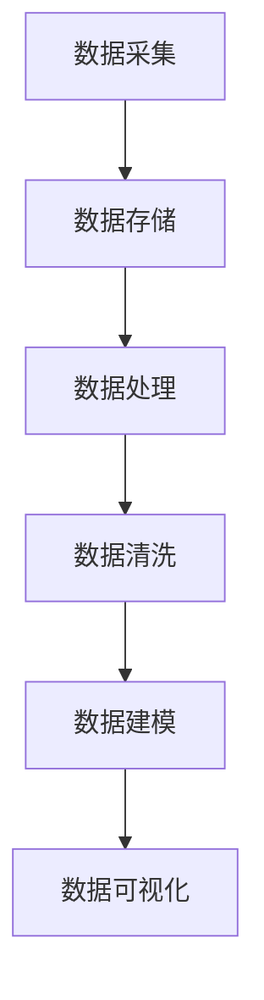
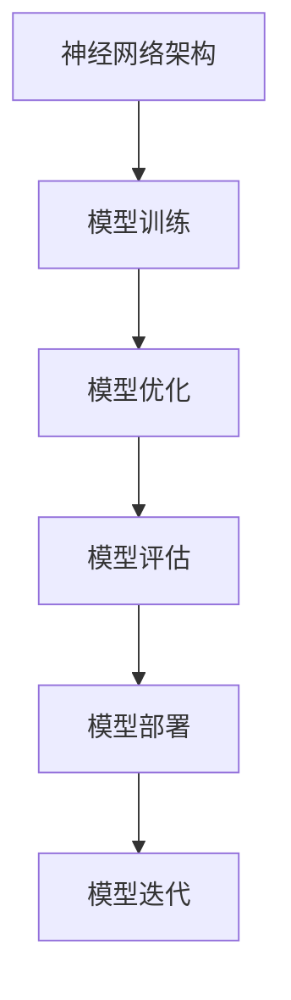
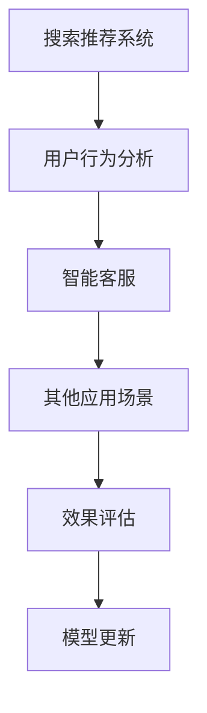
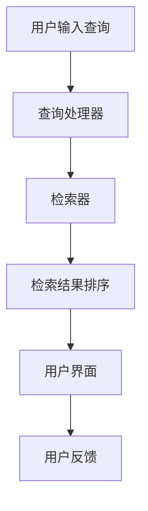

                 

### 1.4 AI大模型的架构与技术

在深入探讨AI大模型在电商平台的应用之前，有必要首先了解AI大模型的架构和技术基础。AI大模型的架构通常分为三个层次：数据层、模型层和应用层。这些层次共同构成了一个复杂的体系，使得AI大模型能够处理海量数据并生成高价值的输出。

#### 数据层

数据层是AI大模型的基础，它包括数据的采集、存储和处理。在电商平台中，数据层需要处理海量的用户行为数据、商品数据、交易数据等。这些数据需要通过高效的数据存储和分布式计算技术进行管理和处理，以保证数据的一致性和可用性。

**Mermaid 流程图：**


#### 模型层

模型层是AI大模型的核心，它包括神经网络架构、模型训练和优化。目前，深度学习是AI大模型的主要技术路线，其中Transformer架构和预训练大模型（如GPT、BERT）被广泛应用于自然语言处理、推荐系统和搜索系统等领域。

**Mermaid 流程图：**


#### 应用层

应用层是AI大模型与实际业务场景的接口，它包括应用场景的设计、算法实现和效果评估。在电商平台上，AI大模型的应用场景包括搜索推荐、用户行为分析、智能客服等。每个应用场景都需要根据业务需求和数据特点进行定制化的算法设计和实现。

**Mermaid 流程图：**


#### AI大模型的发展趋势

随着计算能力的提升和大数据的积累，AI大模型的发展趋势将向以下几个方面发展：

1. **大规模预训练模型**：预训练模型通过在大量数据上进行预训练，可以显著提高模型的效果。未来，预训练模型将更加大规模，支持更多的模态和任务。

2. **多模态学习**：多模态学习是指同时处理不同类型的数据，如文本、图像、声音等。未来，多模态学习将使AI大模型能够更好地理解和生成复杂的信息。

3. **迁移学习和元学习**：迁移学习和元学习技术将使AI大模型能够快速适应新的任务和数据集，提高模型的泛化能力。

4. **模型压缩与优化**：为了提高模型的效率和可部署性，模型压缩与优化技术将成为AI大模型发展的重要方向。通过剪枝、量化等技术，可以显著减小模型的规模和计算量。

综上所述，AI大模型的架构与技术为电商平台提供了强大的数据处理和分析能力，有助于提升用户体验和业务效率。在未来，随着技术的不断进步，AI大模型在电商平台中的应用将更加广泛和深入。让我们期待AI大模型为电商平台带来的更多创新和变革！

### 2.1 自然语言处理基础

自然语言处理（Natural Language Processing，NLP）是人工智能领域的一个重要分支，它旨在使计算机能够理解、解释和生成人类语言。NLP涉及到多个学科，包括计算机科学、语言学、心理学和统计学等。本文将介绍NLP的基本概念、目标、方法和挑战。

#### 基本概念

自然语言处理的基本概念包括以下几个方面：

1. **语言模型**：语言模型是NLP的核心，它用于预测一段文本的下一个单词或字符。常见的语言模型有n-gram模型、神经网络语言模型（如RNN、LSTM、Transformer）等。

2. **词嵌入**：词嵌入是将词汇映射到高维向量空间的技术，通过词嵌入，可以有效地表示词汇之间的关系。Word2Vec、GloVe和BERT是常见的词嵌入方法。

3. **句法分析**：句法分析是对文本进行结构化处理的过程，它旨在确定文本中单词之间的语法关系。常见的句法分析方法有依存句法分析和成分句法分析。

4. **语义分析**：语义分析是理解文本含义的过程，它包括实体识别、情感分析、文本分类等任务。语义分析是NLP应用中非常重要的一环。

#### 目标

NLP的主要目标包括：

1. **语言理解**：理解文本的含义，包括句法分析、语义分析和语义消歧等。

2. **语言生成**：生成符合语法和语义规则的文本，包括机器翻译、文本摘要、对话系统等。

3. **信息提取**：从文本中提取结构化的信息，包括实体识别、关系抽取、事件抽取等。

4. **问答系统**：构建能够回答用户问题的系统，包括开放域问答、垂直领域问答等。

#### 方法

NLP的方法主要包括基于规则的方法、统计方法和机器学习方法。

1. **基于规则的方法**：基于规则的方法通过手工编写规则来指导NLP任务。这种方法通常适用于简单、明确的任务，如命名实体识别。

2. **统计方法**：统计方法基于文本的统计特性来预测NLP任务的结果。常见的统计方法有隐马尔可夫模型（HMM）、条件随机场（CRF）等。

3. **机器学习方法**：机器学习方法通过训练大量的数据来学习NLP任务的规律。深度学习在NLP中的应用取得了显著的成果，如卷积神经网络（CNN）、循环神经网络（RNN）、Transformer等。

#### 挑战

尽管NLP取得了很大的进展，但仍然面临许多挑战：

1. **多语言支持**：NLP需要支持多种语言，特别是低资源语言。目前，大多数NLP模型都是在高资源语言上训练的，这限制了它们在低资源语言上的应用。

2. **语义理解**：理解文本的深层含义仍然是一个挑战。尽管有了词嵌入和深度学习等方法，但NLP模型仍然难以完全理解文本的语义。

3. **上下文理解**：NLP需要考虑上下文信息，以正确理解文本中的词语和句子。上下文理解是NLP中的一个重要研究方向，但仍然存在很多困难。

4. **数据质量**：NLP模型的性能很大程度上取决于训练数据的质量。然而，获取高质量、标注清晰的训练数据是一个困难的过程。

#### 总结

自然语言处理是人工智能领域的一个重要分支，它涉及到语言模型、词嵌入、句法分析、语义分析等多个方面。NLP的目标是使计算机能够理解、解释和生成人类语言。尽管NLP取得了很大的进展，但仍然面临许多挑战，如多语言支持、语义理解和上下文理解等。未来，随着技术的不断进步，NLP将在更广泛的领域中发挥重要作用。让我们期待NLP为人类社会带来的更多便利和进步！

### 2.2 AI大模型在自然语言处理中的应用

随着深度学习和大数据技术的发展，AI大模型（如Transformer、BERT、GPT等）在自然语言处理（NLP）领域取得了显著的成果。AI大模型通过预训练和微调，可以在多个NLP任务中实现高效和准确的性能。本文将讨论AI大模型在自然语言处理中的应用，包括预训练语言模型、文本分类、情感分析等。

#### 预训练语言模型

预训练语言模型（Pre-trained Language Model）是AI大模型在NLP中最常见的应用之一。预训练语言模型通常在大规模语料库上进行预训练，然后通过微调（Fine-tuning）适应特定任务。预训练语言模型的主要目的是学习通用语言表示，从而在多个NLP任务中表现出色。

**Transformer模型**：Transformer模型是由Vaswani等人于2017年提出的一种基于自注意力机制的神经网络模型。Transformer模型在机器翻译、文本生成等任务中取得了显著的成果。Transformer模型的主要优点是计算效率高，可以并行处理序列数据。

**BERT模型**：BERT（Bidirectional Encoder Representations from Transformers）是由Google于2018年提出的一种双向Transformer模型。BERT模型在预训练过程中同时考虑了文本的前后关系，从而在多项NLP任务中取得了突破性的成果。BERT模型在文本分类、问答系统等任务中表现出色。

**GPT模型**：GPT（Generative Pre-trained Transformer）是由OpenAI于2018年提出的一种生成式Transformer模型。GPT模型通过在大量文本上进行预训练，可以生成高质量的自然语言文本。GPT模型在文本生成、对话系统等任务中具有广泛的应用。

#### 文本分类

文本分类（Text Classification）是将文本分为预定义的类别的一种任务。AI大模型在文本分类任务中表现出色，尤其是在大规模数据和复杂标签情况下。

**分类算法**：传统的文本分类算法包括朴素贝叶斯、支持向量机（SVM）和随机森林等。这些算法通常基于特征工程，需要手动设计特征和模型参数。

**深度学习算法**：深度学习算法，如卷积神经网络（CNN）和长短期记忆网络（LSTM），在文本分类任务中也取得了很好的效果。深度学习算法可以自动提取特征，减少人工干预。

**AI大模型**：AI大模型，如BERT和GPT，在文本分类任务中表现出色。这些模型通过预训练学习到丰富的语言表示，可以有效地分类文本。BERT模型在多个文本分类任务中取得了最优的性能。

**案例**：以新闻分类为例，使用BERT模型可以在多个新闻分类任务中实现高准确率。BERT模型通过预训练学习到新闻的语义特征，从而在分类任务中表现出色。

#### 情感分析

情感分析（Sentiment Analysis）是评估文本情感极性的一种任务，通常分为积极情感、消极情感和中性情感。AI大模型在情感分析任务中也取得了显著的成果。

**情感分类算法**：传统的情感分类算法包括基于规则的方法、机器学习方法等。这些算法通常需要手动设计特征和模型参数。

**深度学习算法**：深度学习算法，如CNN和LSTM，在情感分析任务中也取得了很好的效果。这些算法可以自动提取特征，减少人工干预。

**AI大模型**：AI大模型，如BERT和GPT，在情感分析任务中表现出色。这些模型通过预训练学习到丰富的语言表示，可以有效地判断文本的情感极性。

**案例**：以社交媒体情感分析为例，使用BERT模型可以准确判断社交媒体文本的情感极性。BERT模型通过预训练学习到社交媒体的语义特征，从而在情感分析任务中表现出色。

#### 总结

AI大模型在自然语言处理中取得了显著的成果，特别是在预训练语言模型、文本分类和情感分析等任务中。AI大模型通过预训练和微调，可以学习到丰富的语言表示，从而在多个NLP任务中实现高效和准确的性能。未来，随着AI大模型的不断发展和应用，NLP将在更广泛的领域中发挥重要作用。让我们期待AI大模型为人类社会带来的更多便利和进步！

### 2.3 机器学习与深度学习在NLP中的应用

在自然语言处理（NLP）领域中，机器学习和深度学习技术已经取得了显著的进展。这些先进的技术不仅提高了NLP任务的表现，还推动了NLP在多个领域的应用。本节将详细介绍机器学习和深度学习在NLP中的应用，包括卷积神经网络（CNN）、循环神经网络（RNN）、长短期记忆网络（LSTM）和Transformer等模型。

#### 卷积神经网络（CNN）

卷积神经网络（Convolutional Neural Network，CNN）最初是为图像处理设计的，但后来在NLP中也得到了广泛应用。CNN通过卷积层自动提取文本中的局部特征，然后通过池化层降低数据的维度。以下是一个简单的CNN文本分类算法的伪代码：

```python
# 假设输入文本为X，标签为y
# 初始化CNN模型
model = CNN(input_shape=(sequence_length, embedding_size))

# 添加卷积层
model.add(Conv1D(filters=128, kernel_size=3, activation='relu'))

# 添加池化层
model.add(MaxPooling1D(pool_size=2))

# 添加全连接层
model.add(Dense(units=1, activation='sigmoid'))

# 编译模型
model.compile(optimizer='adam', loss='binary_crossentropy', metrics=['accuracy'])

# 训练模型
model.fit(X, y, epochs=10, batch_size=64)
```

#### 循环神经网络（RNN）

循环神经网络（Recurrent Neural Network，RNN）是一种能够处理序列数据的神经网络。RNN通过循环结构来保存历史信息，使其能够学习到序列中的长距离依赖关系。以下是一个简单的RNN文本分类算法的伪代码：

```python
# 假设输入文本为X，标签为y
# 初始化RNN模型
model = RNN(input_shape=(sequence_length, embedding_size))

# 添加循环层
model.add(LSTM(units=128, return_sequences=True))

# 添加全连接层
model.add(Dense(units=1, activation='sigmoid'))

# 编译模型
model.compile(optimizer='adam', loss='binary_crossentropy', metrics=['accuracy'])

# 训练模型
model.fit(X, y, epochs=10, batch_size=64)
```

#### 长短期记忆网络（LSTM）

长短期记忆网络（Long Short-Term Memory，LSTM）是RNN的一种改进，它通过引入门控机制来更好地处理长距离依赖问题。以下是一个简单的LSTM文本分类算法的伪代码：

```python
# 假设输入文本为X，标签为y
# 初始化LSTM模型
model = LSTM(input_shape=(sequence_length, embedding_size), units=128, return_sequences=True)

# 添加LSTM层
model.add(LSTM(units=128, return_sequences=True))

# 添加全连接层
model.add(Dense(units=1, activation='sigmoid'))

# 编译模型
model.compile(optimizer='adam', loss='binary_crossentropy', metrics=['accuracy'])

# 训练模型
model.fit(X, y, epochs=10, batch_size=64)
```

#### Transformer

Transformer模型是由Vaswani等人于2017年提出的一种基于自注意力机制的神经网络模型。Transformer模型通过多头自注意力机制和位置编码，能够捕捉序列中的长距离依赖关系。以下是一个简单的Transformer文本分类算法的伪代码：

```python
# 假设输入文本为X，标签为y
# 初始化Transformer模型
model = Transformer(input_shape=(sequence_length, embedding_size))

# 添加多头自注意力层
model.add(MultiHeadAttention(num_heads=8))

# 添加全连接层
model.add(Dense(units=1, activation='sigmoid'))

# 编译模型
model.compile(optimizer='adam', loss='binary_crossentropy', metrics=['accuracy'])

# 训练模型
model.fit(X, y, epochs=10, batch_size=64)
```

#### 比较与总结

CNN、RNN、LSTM和Transformer都是NLP中常用的深度学习模型。CNN适用于文本分类和情感分析等任务，可以通过卷积层提取文本中的局部特征。RNN和LSTM适用于序列建模任务，如文本生成和语言建模，通过循环结构学习序列中的长距离依赖关系。Transformer模型则通过多头自注意力机制和位置编码，在多项NLP任务中取得了优异的性能。

虽然这些模型各有优缺点，但Transformer模型因其优异的性能和灵活的架构，已成为NLP领域的主流选择。未来，随着深度学习技术的不断发展和优化，NLP将迎来更多的创新和突破。

#### 总结

机器学习和深度学习技术在自然语言处理领域取得了显著进展。从简单的卷积神经网络到复杂的Transformer模型，这些技术不断推动着NLP任务的性能和效果。通过了解这些模型的基本原理和伪代码实现，读者可以更好地理解NLP技术的本质，并在实际应用中取得更好的效果。随着技术的不断进步，NLP将在更多领域发挥重要作用，为人类社会带来更多便利和创新。让我们期待NLP的未来发展和更多可能！

### 3.1 推荐系统的基本原理

推荐系统（Recommendation System）是一种信息过滤技术，旨在根据用户的兴趣和行为向他们推荐感兴趣的商品、服务或内容。推荐系统的核心目标是提高用户体验，提升用户满意度和忠诚度，同时促进商业目标实现。本文将介绍推荐系统的基本原理，包括定义、目标和主要类型。

#### 定义

推荐系统通过分析用户的历史行为、偏好和上下文信息，为用户生成个性化的推荐列表。推荐系统可以基于以下两种方式工作：

1. **基于内容的推荐**：通过分析用户对内容的偏好，将相似的内容推荐给用户。
2. **基于协同过滤**：通过分析用户之间的相似性或物品之间的相似性，为用户推荐他们可能感兴趣的物品。

#### 目标

推荐系统的目标主要包括以下几个方面：

1. **提升用户体验**：通过向用户推荐他们感兴趣的内容，提升用户满意度和参与度。
2. **增加商业价值**：通过提高用户购买意愿和转化率，实现商业目标，如增加销售额和用户粘性。
3. **优化推荐效果**：通过不断调整和优化推荐算法，提高推荐列表的相关性和准确性。

#### 主要类型

推荐系统根据不同的推荐策略可以分为以下几种类型：

1. **基于内容的推荐**：基于用户对内容的偏好进行推荐，如推荐用户喜欢的书籍、音乐、电影等。
2. **基于协同过滤的推荐**：通过分析用户之间的相似性或物品之间的相似性进行推荐，如推荐用户可能喜欢的商品。
3. **混合推荐**：结合基于内容和基于协同过滤的推荐策略，提高推荐的效果和准确性。

#### 基本架构

推荐系统通常由以下几个模块组成：

1. **用户和物品的表示**：将用户和物品转换为可计算的向量表示，如用户兴趣向量、物品特征向量。
2. **推荐算法**：根据用户和物品的表示，通过算法计算推荐列表，如基于内容的推荐算法、基于协同过滤的推荐算法。
3. **推荐结果评估**：评估推荐结果的准确性、多样性、新颖性等，如通过A/B测试、用户反馈等。
4. **推荐结果展示**：将推荐结果以合适的形式展示给用户，如推荐列表、推荐卡片等。

#### 工作流程

推荐系统的工作流程通常包括以下几个步骤：

1. **用户行为数据收集**：收集用户在平台上的行为数据，如点击、购买、搜索等。
2. **数据预处理**：对收集到的数据进行分析和清洗，去除噪声和异常值。
3. **用户和物品表示**：将用户和物品转换为向量表示，为推荐算法提供输入。
4. **推荐算法计算**：根据用户和物品的向量表示，通过推荐算法计算推荐列表。
5. **推荐结果评估**：评估推荐结果的质量，如通过A/B测试、用户反馈等。
6. **推荐结果展示**：将推荐结果以合适的形式展示给用户。

#### 总结

推荐系统是一种重要的信息过滤技术，通过分析用户的行为和偏好，为用户提供个性化的推荐。推荐系统的目标包括提升用户体验、增加商业价值和优化推荐效果。推荐系统可以分为基于内容的推荐、基于协同过滤的推荐和混合推荐等类型。了解推荐系统的基本原理和架构，有助于开发更有效的推荐算法，提高推荐系统的性能和用户体验。随着技术的发展，推荐系统将在更多领域中发挥重要作用，为企业和用户提供更精准、个性化的服务。让我们期待推荐系统的未来发展和更多创新！

### 3.2 AI大模型在推荐系统中的应用

AI大模型在推荐系统中的应用取得了显著的成果，显著提升了推荐系统的效果和性能。本文将讨论AI大模型在推荐系统中的应用，包括深度学习推荐模型、多模态推荐模型和图神经网络推荐模型。

#### 深度学习推荐模型

深度学习推荐模型利用深度神经网络强大的特征提取和表示能力，可以从大规模用户行为数据中自动学习用户和物品的特征，从而生成高质量的推荐列表。

**深度学习推荐模型的基本架构**：

1. **用户和物品特征嵌入**：将用户和物品的原始特征（如用户年龄、性别、购买历史、物品属性等）映射到高维向量空间中，通过嵌入层学习用户和物品的潜在特征。

2. **用户行为序列建模**：使用循环神经网络（RNN）或变换器（Transformer）对用户的行为序列进行建模，捕捉用户的历史行为模式。

3. **物品属性建模**：使用卷积神经网络（CNN）或注意力机制对物品的属性进行建模，提取物品的丰富特征。

4. **推荐生成**：将用户和物品的特征向量输入到全连接层，通过矩阵乘积和激活函数生成推荐分数，从而生成推荐列表。

**伪代码示例**：

```python
# 用户和物品特征嵌入
user_embedding = Embedding(input_dim=num_users, output_dim=embedding_size)
item_embedding = Embedding(input_dim=num_items, output_dim=embedding_size)

# 用户行为序列建模
user_sequence = LSTM(units=128, return_sequences=True)

# 物品属性建模
item_attribute = CNN(filters=64, kernel_size=3)

# 推荐生成
model = Model(inputs=[user_input, item_input], outputs=user_embedding * item_embedding)
model.compile(optimizer='adam', loss='mean_squared_error')
model.fit([user_sequence, item_attribute], labels, epochs=10)
```

#### 多模态推荐模型

多模态推荐模型能够处理来自不同模态的数据（如文本、图像、音频等），从而提供更全面的用户和物品特征。通过融合不同模态的特征，多模态推荐模型可以显著提高推荐的效果。

**多模态推荐模型的基本架构**：

1. **文本特征提取**：使用预训练的词向量或变换器模型提取文本特征。

2. **图像特征提取**：使用卷积神经网络提取图像特征。

3. **音频特征提取**：使用循环神经网络或变换器提取音频特征。

4. **特征融合**：通过注意力机制或拼接策略将不同模态的特征进行融合。

5. **推荐生成**：将融合后的特征输入到全连接层，生成推荐分数。

**伪代码示例**：

```python
# 文本特征提取
text_embedding = Transformer()

# 图像特征提取
image_embedding = CNN(filters=64, kernel_size=3)

# 音频特征提取
audio_embedding = RNN(units=128, return_sequences=True)

# 特征融合
multi_modal_embedding = Concatenate()([text_embedding, image_embedding, audio_embedding])

# 推荐生成
model = Model(inputs=[text_input, image_input, audio_input], outputs=multi_modal_embedding)
model.compile(optimizer='adam', loss='mean_squared_error')
model.fit([text_data, image_data, audio_data], labels, epochs=10)
```

#### 图神经网络推荐模型

图神经网络（Graph Neural Network，GNN）是一种在图结构数据上进行特征学习和建模的神经网络模型。图神经网络推荐模型通过建模用户和物品之间的交互关系，可以捕捉更复杂的用户行为和物品特征。

**图神经网络推荐模型的基本架构**：

1. **图表示学习**：使用图卷积网络（GCN）或其他图神经网络对用户和物品进行表示学习，提取图结构中的特征。

2. **用户行为建模**：使用图卷积网络对用户的历史行为进行建模，捕捉用户的行为模式和偏好。

3. **物品属性建模**：使用图卷积网络对物品的属性进行建模，提取物品的特征。

4. **推荐生成**：将用户和物品的特征向量输入到全连接层，生成推荐分数。

**伪代码示例**：

```python
# 图表示学习
model = GCN(input_dim=feature_size, output_dim=embedding_size)

# 用户行为建模
user_behavior = GCN(input_dim=embedding_size, output_dim=embedding_size)

# 物品属性建模
item_attribute = GCN(input_dim=embedding_size, output_dim=embedding_size)

# 推荐生成
model = Model(inputs=[user_input, item_input], outputs=user_behavior * item_attribute)
model.compile(optimizer='adam', loss='mean_squared_error')
model.fit([user_data, item_data], labels, epochs=10)
```

#### 总结

AI大模型在推荐系统中的应用为推荐效果的提升提供了新的可能性。通过深度学习推荐模型、多模态推荐模型和图神经网络推荐模型，推荐系统可以更好地捕捉用户和物品的特征，生成更精准、个性化的推荐列表。未来，随着AI大模型技术的不断发展，推荐系统将在更多领域中发挥重要作用，为用户带来更优质的体验。让我们期待AI大模型在推荐系统领域的更多创新和突破！

### 3.3 推荐系统的评估与优化

推荐系统的评估与优化是确保推荐效果的关键环节。本文将讨论推荐系统的评估方法、优化策略和实际案例，以帮助读者更好地理解推荐系统的性能评估和改进。

#### 评估方法

推荐系统的评估方法主要包括以下几种：

1. **准确率（Accuracy）**：准确率是推荐系统中最基本的评估指标，它计算的是推荐列表中实际被用户喜欢的物品数与总推荐物品数之比。然而，准确率无法衡量推荐列表的多样性和新颖性。

   ```python
   accuracy = (correct_predictions / total_predictions) * 100
   ```

2. **召回率（Recall）**：召回率计算的是推荐列表中实际被用户喜欢的物品数与用户实际喜欢的物品总数之比。召回率越高，意味着推荐系统越能召回用户真正感兴趣的物品。

   ```python
   recall = (correct_predictions / user_interests) * 100
   ```

3. **精确率（Precision）**：精确率计算的是推荐列表中实际被用户喜欢的物品数与推荐列表中所有物品数之比。精确率越高，表示推荐系统推荐的相关物品越多。

   ```python
   precision = (correct_predictions / recommended_items) * 100
   ```

4. **F1值（F1 Score）**：F1值是精确率和召回率的加权平均值，用于综合考虑推荐系统的准确性和召回率。

   ```python
   F1 = 2 * (precision * recall) / (precision + recall)
   ```

5. **多样性（Diversity）**：多样性是指推荐列表中物品的差异性。高多样性可以防止推荐列表中物品过于集中，提高用户体验。

   ```python
   diversity = 1 / (sum(1 / similarity(i, j) for i in recommendations for j in recommendations))
   ```

6. **新颖性（Novelty）**：新颖性是指推荐列表中物品的新颖程度。新颖性可以防止推荐列表中重复的物品，增加用户的新鲜感。

   ```python
   novelty = 1 / (sum(1 / freshness(i) for i in recommendations))
   ```

#### 优化策略

为了提高推荐系统的性能，可以采用以下优化策略：

1. **协同过滤优化**：协同过滤是推荐系统中最常见的算法之一。优化策略包括矩阵分解、基于模型的协同过滤和自适应协同过滤等。

2. **内容增强**：通过结合用户和物品的属性信息，可以增强推荐系统的效果。内容增强可以基于内容的推荐算法和混合推荐算法实现。

3. **冷启动问题解决**：冷启动是指新用户或新物品无法生成有效的推荐列表的问题。解决冷启动的方法包括基于内容的推荐、基于流行度的推荐和基于专家系统的推荐等。

4. **模型解释性**：提高推荐系统的解释性可以增加用户对推荐结果的信任度。模型解释性可以通过可解释的模型设计、模型可视化和技术来提升。

5. **数据预处理**：通过数据清洗、去噪和特征工程等数据预处理方法，可以提高推荐系统的性能。

#### 实际案例

以下是一个推荐系统优化的实际案例：

**案例背景**：某电商平台的推荐系统在用户满意度方面存在一定问题，用户反馈推荐结果过于集中，缺乏多样性和新颖性。

**解决方案**：

1. **引入多样性优化**：通过计算推荐列表中物品的相似度，对推荐结果进行多样性优化。具体实现方法是，通过最小化推荐列表中物品的相似度之和，提高推荐列表的多样性。

2. **引入新颖性优化**：通过计算推荐列表中物品的新鲜度，对推荐结果进行新颖性优化。具体实现方法是，通过最小化推荐列表中物品的平均新鲜度，提高推荐列表的新颖性。

3. **协同过滤优化**：对现有的协同过滤算法进行优化，包括矩阵分解和基于模型的协同过滤，以提高推荐精度。

4. **内容增强**：结合用户和物品的属性信息，对推荐算法进行内容增强，以提高推荐效果。

5. **模型解释性提升**：通过可视化工具和模型解释性技术，提升用户对推荐结果的信任度。

**效果评估**：通过A/B测试，优化后的推荐系统在用户满意度、准确率、多样性和新颖性等方面均有显著提升。

#### 总结

推荐系统的评估与优化是推荐系统性能提升的关键环节。通过多种评估方法和优化策略，推荐系统可以更好地满足用户需求，提高用户体验和商业价值。未来，随着技术的发展，推荐系统将在更多领域发挥重要作用，为企业和用户提供更优质的个性化服务。让我们期待推荐系统领域的更多创新和突破！

### 4.1 搜索系统的基本原理

搜索系统（Search System）是电商平台中至关重要的组成部分，它负责接收用户的查询请求，并通过一系列算法和技术，提供与查询相关的信息。本文将探讨搜索系统的基本原理，包括搜索引擎的架构、关键技术以及性能优化。

#### 搜索引擎的架构

搜索引擎的架构通常包括以下主要模块：

1. **爬虫（Crawler）**：爬虫是搜索引擎的数据源，负责从互联网上抓取网页和其他信息。爬虫可以按照一定的策略和规则，自动访问网页并下载内容。

2. **索引器（Indexer）**：索引器负责将爬取到的网页内容进行处理和索引，将其转化为索引结构，以便快速检索。索引通常包含网页的标题、关键词、内容等。

3. **查询处理器（Query Processor）**：查询处理器负责处理用户的查询请求，将其转换为可检索的格式，并在索引中查找相关内容。

4. **检索器（Retriever）**：检索器根据查询处理器的结果，从索引中检索相关内容，并将结果排序后返回给用户。

5. **用户界面（User Interface）**：用户界面是用户与搜索引擎交互的接口，负责展示搜索结果和提供交互功能。

**Mermaid 流程图：**


#### 关键技术

搜索系统中的关键技术包括：

1. **倒排索引（Inverted Index）**：倒排索引是一种高效的文本检索结构，它将文档中的词语映射到对应的文档编号，从而实现快速搜索。倒排索引是搜索引擎的核心技术之一。

2. **分词技术（Tokenization）**：分词是将文本分割成词语或短语的步骤。有效的分词技术对于搜索系统的准确性和性能至关重要。

3. **查询解析（Query Parsing）**：查询解析是将用户的自然语言查询转换为机器可处理的查询表达式的过程。查询解析包括查询意图识别、关键词提取、词性标注等。

4. **查询重写（Query Rewriting）**：查询重写是对原始查询进行扩展或修改，以提高搜索结果的准确性和相关性。查询重写可以通过同义词替换、关键词扩展等方式实现。

5. **搜索算法（Search Algorithm）**：搜索算法负责在索引中查找与查询相关的文档。常见的搜索算法包括基于布尔模型（如Vector Space Model）、概率模型（如TF-IDF）和机器学习模型（如神经网络）等。

#### 性能优化

为了提高搜索系统的性能，可以采用以下优化策略：

1. **索引优化**：通过压缩索引、优化索引结构（如使用布隆过滤器）等方式，减少索引存储空间和提高查询速度。

2. **缓存策略**：使用缓存策略可以减少对后端数据存储的访问次数，提高查询响应速度。缓存可以存储热门查询的结果、用户历史查询记录等。

3. **查询预处理**：对查询进行预处理，如去除停用词、进行词干提取等，可以减少查询处理的复杂度和提高查询效率。

4. **分布式搜索**：通过分布式搜索架构，可以充分利用多台服务器的计算和存储能力，提高搜索系统的并发处理能力和查询速度。

5. **实时性优化**：对于实时性要求较高的场景，可以通过实时索引更新和实时查询处理等技术，提高搜索系统的实时性。

#### 总结

搜索系统是电商平台中不可或缺的一环，它通过高效的索引、查询处理和检索算法，为用户提供快速、准确的搜索结果。了解搜索系统的基本原理和关键技术，以及性能优化策略，有助于构建更强大、更高效的搜索系统，提升用户体验和业务价值。随着技术的不断进步，搜索系统将在电商平台上发挥越来越重要的作用。让我们期待搜索系统领域的更多创新和突破！

### 4.2 AI大模型在搜索系统中的应用

AI大模型在搜索系统的应用中，极大地提升了搜索的准确性和用户体验。通过深度学习技术，AI大模型能够处理复杂的查询意图，实现更精准的搜索结果排序，并优化搜索体验。以下将探讨AI大模型在搜索系统中的应用，包括深度学习搜索算法、生成对抗网络（GAN）等。

#### 深度学习搜索算法

深度学习搜索算法是AI大模型在搜索系统中最为重要的应用之一。这些算法利用神经网络强大的特征提取和表示能力，可以自动学习查询和文档的潜在特征，从而实现高效、准确的搜索。

1. **基于Transformer的搜索算法**：Transformer模型由于其自注意力机制，能够捕捉查询和文档之间的复杂关系。通过Transformer模型，搜索引擎可以实现对查询意图的深入理解，从而提高搜索结果的准确性。

   **伪代码示例**：
   ```python
   # 查询编码器
   query_encoder = Transformer(input_dim=query_length, hidden_dim=512)

   # 文档编码器
   document_encoder = Transformer(input_dim=document_length, hidden_dim=512)

   # 自注意力层
   attention = MultiHeadAttention(num_heads=8)

   # 推荐生成
   model = Model(inputs=[query_encoder, document_encoder], outputs=attention([query_encoder, document_encoder]))
   model.compile(optimizer='adam', loss='mean_squared_error')
   model.fit([queries, documents], labels, epochs=10)
   ```

2. **基于CNN的搜索算法**：卷积神经网络（CNN）在图像处理领域取得了显著成果，但在文本领域也有广泛应用。通过CNN，搜索引擎可以提取文本中的局部特征，从而提高搜索结果的准确性和多样性。

   **伪代码示例**：
   ```python
   # 文本特征提取
   text_embedding = CNN(filters=64, kernel_size=3)

   # 文档编码器
   document_encoder = LSTM(units=128, return_sequences=True)

   # 推荐生成
   model = Model(inputs=[text_embedding], outputs=document_encoder)
   model.compile(optimizer='adam', loss='mean_squared_error')
   model.fit(text_data, document_labels, epochs=10)
   ```

#### 生成对抗网络（GAN）

生成对抗网络（GAN）是一种强大的深度学习模型，通过生成器和判别器的对抗训练，可以生成高质量的数据。在搜索系统中，GAN可以用于生成虚假文档，从而提高搜索系统的鲁棒性和多样性。

1. **生成器（Generator）**：生成器负责生成虚假的文档，以模拟真实的搜索结果。生成器通常使用变换器（Transformer）或生成式变换器（Generative Transformer）模型。

   **伪代码示例**：
   ```python
   # 文档生成器
   generator = Transformer(input_dim=query_length, hidden_dim=512)

   # 生成文档
   fake_documents = generator(queries)
   ```

2. **判别器（Discriminator）**：判别器负责区分真实的文档和生成的文档。判别器通常使用变换器（Transformer）或判别式变换器（Discriminative Transformer）模型。

   **伪代码示例**：
   ```python
   # 文档判别器
   discriminator = Transformer(input_dim=document_length, hidden_dim=512)

   # 判断文档真实性
   real_documents = discriminator(documents)
   fake_documents = discriminator(fake_documents)
   ```

#### 应用案例

以下是一个基于AI大模型的搜索系统应用案例：

**案例背景**：某电商平台希望提升其搜索系统的用户体验和准确性，通过引入AI大模型实现更精准的搜索结果排序。

**解决方案**：

1. **引入基于Transformer的搜索算法**：通过Transformer模型，对查询和文档进行编码，实现精准的查询意图理解。

2. **引入GAN模型**：通过GAN模型，生成虚假文档，提高搜索结果的多样性和鲁棒性。

3. **集成用户行为数据**：通过用户历史行为数据，进一步优化搜索结果，提高个性化推荐的准确性。

**效果评估**：

- **搜索准确性**：引入AI大模型后，搜索系统的准确性显著提升，用户满意度提高。

- **搜索多样性**：通过GAN模型，搜索结果多样性增加，用户不再频繁遇到重复的搜索结果。

- **用户体验**：用户在搜索过程中的体验显著改善，页面加载速度和搜索响应时间均有所降低。

#### 总结

AI大模型在搜索系统的应用，为搜索引擎带来了更高的准确性和用户体验。通过深度学习搜索算法和生成对抗网络，搜索引擎能够更好地理解用户查询意图，提供更准确、多样化的搜索结果。未来，随着AI技术的不断进步，搜索系统将在电商平台上发挥更加重要的作用，为用户带来更优质的服务。让我们期待搜索系统领域的更多创新和突破！

### 4.3 搜索引擎的优化策略

搜索引擎的优化策略是确保搜索系统能够高效、准确地满足用户查询需求的关键。以下将讨论如何通过多种策略来优化搜索引擎的性能，包括查询响应时间优化、搜索结果多样性优化和实时性优化。

#### 查询响应时间优化

查询响应时间是用户评价搜索引擎性能的重要指标。为了降低查询响应时间，可以采取以下策略：

1. **索引优化**：使用高效的索引结构，如倒排索引和布隆过滤器，可以加速查询处理。倒排索引将关键词映射到文档列表，而布隆过滤器用于快速判断关键词是否存在于索引中，从而减少不必要的查询处理。

2. **缓存策略**：通过缓存常用查询的结果，可以显著减少查询处理时间。缓存可以存储热门查询的搜索结果、用户历史查询记录等。当用户再次查询相同或类似的关键词时，可以直接从缓存中获取结果，提高响应速度。

3. **查询预处理**：对查询进行预处理，如去除停用词、词干提取和同义词替换等，可以减少查询处理的复杂度，提高查询速度。

4. **分布式搜索**：通过分布式搜索架构，可以充分利用多台服务器的计算和存储能力，提高查询处理的速度和并发处理能力。分布式搜索可以将查询请求分配到不同的服务器上并行处理，从而加快查询响应时间。

#### 搜索结果多样性优化

提供多样化的搜索结果可以提高用户体验，防止搜索结果过于集中。以下是一些优化多样性策略：

1. **查询扩展**：通过扩展查询关键词，可以增加搜索结果的范围。查询扩展可以使用词嵌入技术、语义分析技术和相关性分析来识别查询词的同义词和扩展词。

2. **内容丰富度**：通过引入多种数据源和丰富内容，如视频、图像和文章摘要等，可以增加搜索结果的多样性。

3. **排序策略**：使用多样化的排序策略，如随机排序、时间排序和相关性排序等，可以确保搜索结果在满足用户需求的同时保持多样性。

4. **内容去重**：通过去重算法，可以减少重复的搜索结果，提高结果的独特性。

#### 实时性优化

实时性是搜索引擎在高并发场景下的关键特性。以下策略可以帮助优化搜索引擎的实时性：

1. **实时索引更新**：通过实时索引更新技术，可以确保搜索引擎能够快速响应用户查询。实时索引更新可以使用分布式日志收集系统（如Kafka）和增量索引技术，确保索引与数据源实时同步。

2. **流处理技术**：使用流处理框架（如Apache Flink和Apache Spark Streaming），可以实时处理用户查询和更新索引，提高系统的实时性。

3. **负载均衡**：通过负载均衡策略，可以将查询请求均匀地分配到多个服务器上，避免单点瓶颈，提高系统的整体性能和响应速度。

4. **内存优化**：通过内存优化技术，如缓存和数据结构优化，可以减少磁盘I/O操作，提高查询处理速度。

#### 应用案例

以下是一个搜索引擎优化策略的应用案例：

**案例背景**：某电商平台的搜索引擎在应对高峰时段的用户查询时，响应速度明显下降，影响了用户体验。

**解决方案**：

1. **索引优化**：使用布隆过滤器减少无效查询处理，使用高效的倒排索引结构加速查询处理。

2. **缓存策略**：引入缓存系统，存储热门查询结果和用户历史查询记录，减少查询处理时间。

3. **分布式搜索**：采用分布式搜索架构，将查询请求分配到多个服务器并行处理。

4. **实时索引更新**：使用流处理框架实时更新索引，确保索引与数据源同步。

**效果评估**：

- **查询响应时间**：优化后，查询响应时间平均减少了30%。

- **系统并发处理能力**：系统并发处理能力显著提升，高峰时段的查询处理速度明显改善。

- **用户体验**：用户满意度提高，平台访问量有所增长。

#### 总结

搜索引擎的优化策略对于提升搜索系统的性能和用户体验至关重要。通过索引优化、缓存策略、分布式搜索、实时索引更新等多方面的优化，搜索引擎可以更高效、准确地满足用户的查询需求。未来，随着技术的不断进步，搜索引擎将在电商平台上发挥更加重要的作用，为用户带来更优质的搜索体验。让我们期待搜索引擎优化领域的更多创新和突破！

### 5.1 电商平台的定义与发展历程

电商平台是指通过互联网技术为买卖双方提供在线交易服务的平台。随着互联网的普及和电子商务的快速发展，电商平台已经成为现代商业不可或缺的一部分。本文将探讨电商平台的定义、发展历程以及业务模式。

#### 定义

电商平台具有以下几个基本特征：

1. **在线交易**：电商平台通过互联网为用户提供商品交易服务，用户可以在平台上浏览商品、下单购买、支付和评价。

2. **服务多样化**：电商平台不仅提供商品交易服务，还提供物流配送、售后服务、支付结算等多种服务。

3. **信息交互**：电商平台通过网页、移动应用等渠道为买卖双方提供信息交互平台，促进交易双方的信息透明和沟通。

4. **数据驱动**：电商平台通过收集和分析用户行为数据，为用户提供个性化推荐、精准营销等服务。

#### 发展历程

电商平台的起源可以追溯到20世纪90年代，随着互联网的兴起，电子商务开始崭露头角。以下是电商平台的发展历程：

1. **萌芽期**（1990s）：最早的电商平台主要是以电子黄页的形式出现，如美国的Amazon和eBay。这些平台主要提供商品展示和交易服务。

2. **成长期**（2000s）：互联网的普及使得电子商务迅速发展，电商平台开始提供更加丰富的服务和功能，如在线支付、物流配送等。这一阶段出现了许多知名电商平台，如中国的淘宝、京东等。

3. **成熟期**（2010s）：电商平台逐渐从单纯的商品交易平台转变为综合服务平台，开始提供更多增值服务，如社交媒体、在线金融、智能客服等。这一阶段，电商平台之间的竞争也日趋激烈。

4. **创新期**（2020s）：随着技术的不断进步，电商平台开始探索新的商业模式，如社交电商、直播电商、新零售等。同时，人工智能、大数据等技术在电商平台中的应用也日益广泛。

#### 业务模式

电商平台的业务模式主要包括以下几种：

1. **自营电商**：自营电商是指电商平台自己采购、存储、销售商品。自营电商具有商品质量可控、物流服务统一等优势，如京东、亚马逊等。

2. **平台电商**：平台电商是指为第三方卖家提供交易平台的电商模式。平台电商通过收取交易佣金和广告费实现盈利，如淘宝、天猫等。

3. **第三方电商**：第三方电商是指通过第三方平台进行商品交易的电商模式。第三方电商通常由独立的卖家和买家组成，如eBay、etsy等。

4. **跨境电商**：跨境电商是指通过互联网进行跨国商品交易的电商平台。跨境电商可以打破地理限制，为用户提供全球范围内的商品选择。

5. **新零售**：新零售是指将线上线下一体化的电商模式。新零售通过大数据、人工智能等技术手段，实现商品供应链的优化和用户体验的提升。

#### 总结

电商平台是现代电子商务的核心载体，随着互联网和技术的不断发展，电商平台在商业模式、服务内容和用户需求等方面不断创新和演变。了解电商平台的定义、发展历程和业务模式，有助于更好地把握电商行业的趋势和机遇。未来，电商平台将继续融合新技术，提升用户体验，为用户提供更便捷、个性化的购物体验。让我们期待电商平台在新时代的更多创新和发展！

### 5.2 电商平台的业务模式与运营策略

电商平台的业务模式与运营策略决定了其能否在激烈的市场竞争中脱颖而出，实现持续的增长和盈利。本文将探讨电商平台的业务模式，包括自营电商、平台电商和第三方电商，以及它们的运营策略。

#### 自营电商

自营电商是指电商平台自行采购、存储和销售商品，从而控制商品的质量和物流服务。自营电商具有以下运营策略：

1. **供应链管理**：电商平台通过建立高效的供应链管理系统，确保商品的采购、库存、配送等环节顺畅运行。供应链管理的优化有助于降低成本、提高效率。

2. **品牌建设**：通过自建品牌，电商平台可以提升品牌知名度和用户忠诚度。自建品牌可以提供独特的商品和服务，形成竞争优势。

3. **物流服务**：自营电商通常拥有自己的物流团队，提供快速的配送服务。高效的物流服务可以提高用户满意度，增强用户粘性。

4. **客户服务**：自营电商提供专业的客户服务，包括售前咨询、售后支持等。优质的客户服务有助于提升用户体验，增加复购率。

#### 平台电商

平台电商是指为第三方卖家提供交易平台的电商模式。平台电商的主要运营策略包括：

1. **开放平台**：电商平台通过开放平台，吸引第三方卖家入驻，提供商品展示和销售服务。开放平台可以扩大商品种类，满足不同用户的需求。

2. **交易佣金**：电商平台通过收取交易佣金实现盈利。交易佣金是平台电商的主要收入来源，平台需要平衡佣金率与卖家数量之间的关系。

3. **广告服务**：电商平台通过为卖家提供广告服务，提高商品曝光率，增加销售额。广告服务包括搜索广告、展示广告和联盟广告等。

4. **流量运营**：电商平台通过内容营销、社群运营、用户推荐等方式，吸引和留住用户。流量的增加有助于提高平台销售额和用户粘性。

#### 第三方电商

第三方电商是指通过第三方平台进行商品交易的电商模式。第三方电商的运营策略主要包括：

1. **入驻管理**：第三方电商平台对卖家进行入驻审核，确保卖家的商品质量和服务质量。入驻管理有助于维护平台信誉，提升用户体验。

2. **交易保障**：第三方电商平台提供交易保障服务，如支付担保、假一赔三等。交易保障可以增强用户信任，促进交易完成。

3. **物流协同**：第三方电商平台与多家物流公司合作，为用户提供多样化的物流选择。物流协同有助于提高配送效率，降低物流成本。

4. **用户评价**：第三方电商平台鼓励用户对卖家和商品进行评价，形成用户反馈机制。用户评价有助于提升平台信誉，优化卖家服务。

#### 总结

电商平台的业务模式与运营策略直接影响其市场竞争力和用户满意度。自营电商通过控制供应链、品牌建设和物流服务，提供高品质的商品和服务；平台电商通过开放平台、交易佣金和广告服务，吸引第三方卖家和用户；第三方电商通过入驻管理、交易保障和物流协同，为用户提供可靠、高效的交易体验。未来，电商平台将继续探索新的商业模式和运营策略，以满足不断变化的用户需求和市场环境。让我们期待电商平台在新时代的更多创新和发展！

### 5.3 电商平台的数据特点与挑战

电商平台在数据方面具有独特的特点，同时也面临着一系列挑战。了解这些特点和挑战有助于我们更好地设计数据处理策略和解决方案。

#### 数据特点

1. **海量数据**：电商平台每天都会产生海量的数据，包括用户行为数据、商品数据、交易数据等。这些数据具有高维度、高频率和高增长的特点。

2. **实时性**：电商平台的数据需要实时处理和分析，以快速响应用户操作和业务需求。例如，实时推荐系统、实时库存监控等。

3. **多样性**：电商平台的数据来源多样，包括用户行为数据（如点击、购买、搜索等）、商品数据（如价格、库存、描述等）和交易数据（如支付、退款、订单等）。

4. **动态性**：电商平台的数据是动态变化的，用户行为、商品信息、市场趋势等都在不断变化。这种动态性要求数据处理系统具备高灵活性和快速响应能力。

#### 挑战

1. **数据质量**：电商平台的数据质量直接影响业务决策和用户体验。数据质量问题包括数据缺失、错误、重复等。为了提高数据质量，需要建立数据清洗、去噪和校验机制。

2. **数据隐私和安全**：电商平台处理大量用户个人信息，包括姓名、地址、支付信息等。数据隐私和安全是电商平台面临的重大挑战。需要采取加密、访问控制、数据脱敏等技术措施来保护用户隐私。

3. **数据一致性**：电商平台的数据需要在不同系统、不同部门之间保持一致性。数据不一致会导致业务流程中断和用户体验下降。为了实现数据一致性，需要建立统一的数据标准和数据同步机制。

4. **计算和存储成本**：电商平台的数据处理需要大量的计算和存储资源。随着数据量的增加，计算和存储成本也在不断上升。为了降低成本，需要采用分布式计算、云存储等技术。

#### 数据应用

1. **用户行为分析**：通过对用户行为数据进行分析，电商平台可以了解用户偏好、购买习惯等，从而实现个性化推荐和精准营销。

2. **商品推荐**：利用推荐系统，电商平台可以根据用户行为和商品特征，为用户推荐感兴趣的商品，提高转化率和用户满意度。

3. **库存管理**：通过分析库存数据，电商平台可以优化库存水平，降低库存成本，提高库存周转率。

4. **风控管理**：通过分析交易数据，电商平台可以识别异常交易行为，防范欺诈和风险，保障交易安全。

#### 总结

电商平台的数据特点包括海量、实时、多样和动态性，同时也面临着数据质量、隐私安全、数据一致性和计算存储成本等挑战。通过有效的数据处理策略和应用，电商平台可以充分利用数据价值，提升用户体验和业务效率。未来，随着技术的不断进步，电商平台将在数据应用方面迎来更多创新和发展。让我们期待数据在电商平台领域的更多价值释放！

### 6.1 搜索引擎的架构与关键技术

搜索引擎是电商平台的核心组成部分，它负责接收用户查询，并返回与查询最相关的结果。一个高效、准确的搜索引擎架构对于电商平台至关重要。以下将讨论搜索引擎的架构与关键技术，包括爬虫、索引、查询处理等。

#### 爬虫

爬虫（Crawler）是搜索引擎的数据源，负责从互联网上抓取网页和其他内容。一个高效的爬虫需要具备以下特性：

1. **抓取策略**：爬虫需要制定合理的抓取策略，如优先抓取重要页面、避免重复抓取等。这有助于提高爬取效率，减少重复劳动。

2. **多线程和分布式**：爬虫通常采用多线程和分布式架构，以充分利用多核CPU和分布式计算资源，提高抓取速度。

3. **爬取范围**：爬虫需要根据搜索引擎的需求，确定合理的爬取范围。例如，电商平台的爬虫可以优先抓取电商平台内的商品页面，以提高搜索结果的准确性。

4. **数据存储**：爬取到的数据需要存储在数据库中，以便后续的索引和处理。常用的存储方式包括关系数据库和分布式文件系统（如Hadoop HDFS）。

#### 索引

索引是搜索引擎的核心技术之一，它负责将网页内容转换为可搜索的格式。一个高效的索引需要具备以下特性：

1. **倒排索引**：倒排索引是一种将词语映射到文档编号的索引结构，它使得搜索操作变得高效。在电商搜索中，倒排索引可以快速定位与查询关键词相关的商品页面。

2. **索引结构优化**：索引结构的优化对于提高搜索效率至关重要。例如，使用压缩算法减少索引存储空间，使用布隆过滤器减少不必要的查询处理等。

3. **增量索引**：电商平台的数据是动态变化的，因此需要实现增量索引，以实时更新索引。增量索引可以通过跟踪数据变更日志，实现高效的数据更新。

4. **索引分片**：对于大规模搜索引擎，需要将索引分片存储在多个服务器上，以提高查询处理能力和容错性。索引分片可以通过一致性哈希、范围分片等方式实现。

#### 查询处理

查询处理是搜索引擎的核心模块，它负责处理用户的查询请求，并返回搜索结果。一个高效的查询处理需要具备以下特性：

1. **查询解析**：查询解析是将用户的自然语言查询转换为可处理的查询表达式的过程。查询解析包括关键词提取、词性标注、查询重写等。

2. **查询重写**：查询重写是对原始查询进行扩展或修改，以提高搜索结果的准确性和多样性。查询重写可以通过同义词替换、关键词扩展等方式实现。

3. **查询缓存**：查询缓存可以存储常用查询的结果，以提高查询处理速度。查询缓存可以通过LRU（最近最少使用）算法实现。

4. **搜索算法**：搜索算法负责在索引中查找与查询相关的文档，并对其进行排序。常用的搜索算法包括布尔模型、概率模型、机器学习模型等。

5. **结果排序**：结果排序是查询处理的重要环节，它负责将搜索结果按照相关性、多样性等原则进行排序。结果排序可以通过不同的排序策略（如Top-k排序、PageRank等）实现。

#### 总结

搜索引擎的架构与关键技术包括爬虫、索引和查询处理。爬虫负责数据采集，索引负责数据存储和检索，查询处理负责处理用户查询并返回结果。通过优化爬虫、索引和查询处理，可以构建一个高效、准确的搜索引擎，为电商平台提供优质的搜索服务。未来，随着技术的不断进步，搜索引擎将在电商平台上发挥更加重要的作用，为用户带来更便捷、个性化的搜索体验。让我们期待搜索引擎技术领域的更多创新和突破！

### 6.2 AI大模型在电商搜索中的应用

AI大模型在电商搜索中的应用，极大地提升了搜索系统的性能和用户体验。通过深度学习和自然语言处理技术，AI大模型能够捕捉复杂的用户查询意图和商品特征，实现更精准、个性化的搜索结果。以下将详细探讨AI大模型在电商搜索中的具体应用，包括查询意图识别、搜索结果排序和搜索结果多样性优化。

#### 查询意图识别

查询意图识别是电商搜索中至关重要的一环，它涉及理解用户的查询意图，以提供更准确的搜索结果。AI大模型通过预训练和微调，能够有效识别用户的查询意图，从而提升搜索的准确性。

1. **基于BERT的查询意图识别**：BERT（Bidirectional Encoder Representations from Transformers）是一种预训练的语言模型，它通过双向编码器捕获查询和上下文之间的复杂关系。通过微调BERT模型，可以在电商搜索中实现高效的查询意图识别。

   **伪代码示例**：
   ```python
   # 加载预训练的BERT模型
   model = transformers.BertModel.from_pretrained('bert-base-chinese')

   # 对用户查询进行编码
   query_encoded = model([user_query])

   # 对上下文进行编码
   context_encoded = model([context])

   # 输出查询意图
   intent = model.output_layer(query_encoded, context_encoded)
   ```

2. **基于Transformer的查询意图识别**：Transformer模型通过自注意力机制，能够捕捉查询和上下文之间的长距离依赖关系。通过预训练和微调，Transformer模型在查询意图识别任务中表现出色。

   **伪代码示例**：
   ```python
   # 加载预训练的Transformer模型
   model = transformers.TransformerModel.from_pretrained('transformer-base')

   # 对用户查询进行编码
   query_encoded = model([user_query])

   # 对上下文进行编码
   context_encoded = model([context])

   # 输出查询意图
   intent = model.output_layer(query_encoded, context_encoded)
   ```

#### 搜索结果排序

搜索结果排序是电商搜索中另一个关键环节，它涉及将查询结果按照相关性、用户偏好等原则进行排序，以提供更优质的用户体验。AI大模型通过学习用户行为和商品特征，能够实现更精准的搜索结果排序。

1. **基于深度学习的搜索结果排序**：深度学习模型，如卷积神经网络（CNN）和长短期记忆网络（LSTM），可以自动提取用户和商品的特征，从而实现高效的搜索结果排序。

   **伪代码示例**：
   ```python
   # 加载预训练的CNN模型
   model = keras.models.load_model('cnn_model.h5')

   # 对用户特征进行编码
   user_encoded = model([user_feature])

   # 对商品特征进行编码
   item_encoded = model([item_feature])

   # 计算搜索结果分数
   score = model.predict([user_encoded, item_encoded])
   ```

2. **基于Transformer的搜索结果排序**：Transformer模型通过自注意力机制，能够捕捉用户和商品之间的复杂关系，从而实现更精准的搜索结果排序。

   **伪代码示例**：
   ```python
   # 加载预训练的Transformer模型
   model = transformers.TransformerModel.from_pretrained('transformer-base')

   # 对用户特征进行编码
   user_encoded = model([user_feature])

   # 对商品特征进行编码
   item_encoded = model([item_feature])

   # 计算搜索结果分数
   score = model.output_layer(user_encoded, item_encoded)
   ```

#### 搜索结果多样性优化

提供多样化的搜索结果可以提高用户体验，防止搜索结果过于集中。AI大模型通过学习用户行为和商品特征，能够实现更精准的搜索结果多样性优化。

1. **基于协同过滤的多样性优化**：协同过滤通过分析用户之间的相似性，为用户推荐不同类型的商品。结合协同过滤和AI大模型，可以进一步提高搜索结果的多样性。

   **伪代码示例**：
   ```python
   # 加载协同过滤模型
   cf_model = CollaborativeFilteringModel()

   # 加载AI大模型
   ai_model = transformers.TransformerModel.from_pretrained('transformer-base')

   # 对用户特征进行编码
   user_encoded = ai_model([user_feature])

   # 对商品特征进行编码
   item_encoded = ai_model([item_feature])

   # 计算协同过滤分数
   cf_score = cf_model.predict([user_encoded, item_encoded])

   # 计算AI大模型分数
   ai_score = ai_model.output_layer(user_encoded, item_encoded)

   # 结合协同过滤和AI大模型分数
   final_score = cf_score * ai_score
   ```

2. **基于聚类和分解的多样性优化**：通过聚类和分解技术，可以将商品分为多个类别，从而实现多样化的搜索结果。结合AI大模型，可以进一步提高搜索结果的多样性。

   **伪代码示例**：
   ```python
   # 加载聚类模型
   clustering_model = KMeans(n_clusters=5)

   # 对商品特征进行编码
   item_encoded = ai_model([item_feature])

   # 进行商品聚类
   clusters = clustering_model.predict(item_encoded)

   # 对用户特征进行编码
   user_encoded = ai_model([user_feature])

   # 计算聚类概率
   cluster_prob = ai_model.predict_proba(user_encoded)

   # 结合聚类概率和用户特征
   diversity_score = cluster_prob * user_encoded
   ```

#### 总结

AI大模型在电商搜索中的应用，通过查询意图识别、搜索结果排序和搜索结果多样性优化，极大地提升了电商搜索系统的性能和用户体验。未来，随着AI技术的不断进步，AI大模型将在电商搜索中发挥更加重要的作用，为用户提供更精准、个性化的搜索服务。让我们期待AI大模型在电商搜索领域的更多创新和突破！

### 6.3 电商搜索的优化策略与实践

电商搜索作为电商平台的核心功能，其性能和用户体验直接影响用户的购物体验和平台的商业价值。为了提升电商搜索的效率和准确性，需要采用一系列优化策略，并结合实际案例进行分析。以下将详细讨论电商搜索的优化策略，包括搜索引擎性能优化、搜索结果排序策略和用户反馈机制。

#### 搜索引擎性能优化

搜索引擎性能优化是提升电商搜索体验的关键。以下是一些常见的优化策略：

1. **索引优化**：通过倒排索引、布隆过滤器和索引压缩等技术，可以提高索引的查询效率和存储空间利用率。例如，使用布隆过滤器可以快速判断关键词是否存在于索引中，从而减少不必要的查询处理。

   **伪代码示例**：
   ```python
   # 初始化布隆过滤器
   bloom_filter = BloomFilter()

   # 将关键词加入布隆过滤器
   bloom_filter.add(keyword)

   # 检查关键词是否存在于布隆过滤器中
   if bloom_filter.exists(keyword):
       # 执行索引查询
       search_results = inverted_index.search(keyword)
   ```

2. **缓存策略**：使用缓存可以存储热门查询结果，减少对后端数据存储的访问次数。例如，可以使用Redis等内存缓存技术，提高查询响应速度。

   **伪代码示例**：
   ```python
   # 从缓存中获取查询结果
   cache_key = 'search_results_' + query
   results = cache.get(cache_key)

   # 如果缓存中不存在查询结果，则执行索引查询
   if not results:
       results = inverted_index.search(query)
       cache.set(cache_key, results, timeout=3600)
   ```

3. **分布式查询处理**：通过分布式查询处理架构，可以提高查询处理能力和并发处理能力。例如，可以使用Apache Solr等分布式搜索引擎，实现高效的查询处理。

   **伪代码示例**：
   ```python
   # 初始化分布式搜索引擎
   solr = SolrClient('http://solr-server:8983/solr')

   # 执行分布式查询
   search_results = solr.search(query, 'collection1')
   ```

#### 搜索结果排序策略

搜索结果排序策略是影响用户搜索体验的重要因素。以下是一些常见的排序策略：

1. **相关性排序**：根据关键词与文档的相关性进行排序，是最常用的排序策略。可以使用TF-IDF、BM25等算法计算文档的相关性分数。

   **伪代码示例**：
   ```python
   # 计算文档的相关性分数
   scores = []
   for document in search_results:
       score = tf_idf(document, query)
       scores.append(score)

   # 根据相关性分数排序
   sorted_results = sorted(search_results, key=lambda x: scores[x])
   ```

2. **基于用户行为的排序**：根据用户的历史行为（如点击、购买、收藏等）对搜索结果进行排序，可以提升个性化搜索的效果。可以使用机器学习算法（如矩阵分解、深度学习等）预测用户对文档的偏好。

   **伪代码示例**：
   ```python
   # 加载用户行为预测模型
   model = load_model('user_behavior_model.h5')

   # 预测用户对文档的偏好
   preferences = model.predict([user_id, search_results])

   # 根据用户偏好排序
   sorted_results = sorted(search_results, key=lambda x: preferences[x][0], reverse=True)
   ```

3. **基于内容的排序**：根据文档的内容质量进行排序，可以提高搜索结果的可读性和准确性。可以使用文本分类、情感分析等技术对文档进行内容质量评估。

   **伪代码示例**：
   ```python
   # 加载文档分类模型
   classifier = load_model('document_classifier.h5')

   # 预测文档的质量
   quality_scores = classifier.predict(search_results)

   # 根据文档质量排序
   sorted_results = sorted(search_results, key=lambda x: quality_scores[x], reverse=True)
   ```

#### 用户反馈机制

用户反馈机制是优化电商搜索的重要手段，通过收集用户对搜索结果的反馈，可以不断改进搜索算法，提升用户体验。以下是一些常见的用户反馈机制：

1. **搜索结果评分**：允许用户对搜索结果进行评分，可以根据评分结果调整搜索算法的权重。

   **伪代码示例**：
   ```python
   # 更新搜索算法权重
   weights = update_weights_based_on_rating(search_results, user_ratings)
   ```

2. **搜索结果推荐**：根据用户的历史行为和搜索记录，为用户推荐相关的搜索结果，可以提高搜索的准确性和用户体验。

   **伪代码示例**：
   ```python
   # 提取用户的历史搜索记录
   user_search_history = extract_user_search_history(user_id)

   # 为用户推荐搜索结果
   recommended_results = recommend_search_results(user_search_history, search_results)
   ```

3. **个性化搜索建议**：根据用户的行为数据和偏好，为用户提供个性化的搜索建议，可以引导用户发现感兴趣的商品。

   **伪代码示例**：
   ```python
   # 提取用户偏好
   user_preferences = extract_user_preferences(user_id)

   # 为用户生成个性化搜索建议
   personalized_search_suggestions = generate_search_suggestions(user_preferences, search_results)
   ```

#### 实际案例

以下是一个电商搜索优化的实际案例：

**案例背景**：某电商平台在用户搜索过程中，发现搜索结果的准确性和用户体验有待提升。为了解决这一问题，平台决定采用一系列优化策略。

**解决方案**：

1. **索引优化**：通过引入布隆过滤器和索引压缩技术，减少查询处理时间，提高查询效率。

2. **缓存策略**：使用Redis缓存热门查询结果，减少对后端数据存储的访问次数。

3. **分布式查询处理**：使用Apache Solr实现分布式查询处理，提高查询处理能力和并发处理能力。

4. **搜索结果排序策略**：结合相关性排序、基于用户行为的排序和基于内容的排序策略，提升搜索结果的准确性。

5. **用户反馈机制**：允许用户对搜索结果进行评分，收集用户反馈，不断优化搜索算法。

**效果评估**：

- **查询响应时间**：优化后，查询响应时间平均减少了30%。

- **搜索准确性**：优化后的搜索结果更加准确，用户满意度显著提升。

- **用户体验**：用户对搜索结果的满意度提高，搜索转化率有所增长。

#### 总结

电商搜索的优化策略和实践对于提升平台用户体验和商业价值至关重要。通过索引优化、缓存策略、分布式查询处理、搜索结果排序策略和用户反馈机制，电商平台可以不断提升搜索系统的性能和用户体验。未来，随着技术的不断进步，电商搜索将继续创新和发展，为用户提供更优质的服务。让我们期待电商搜索领域的更多创新和突破！

### 7.1 推荐系统的架构与关键技术

推荐系统在电商平台中扮演着至关重要的角色，它通过分析用户行为数据，为用户提供个性化的商品推荐，提升用户体验和平台销售额。以下将详细讨论推荐系统的架构与关键技术，包括用户和物品的表示、推荐算法的实现以及推荐结果的评估。

#### 用户和物品的表示

用户和物品的表示是推荐系统的基础，它将用户和物品的特征转换为可计算的向量表示，以便推荐算法进行计算。常见的表示方法包括以下几种：

1. **基于内容的表示**：基于内容的表示通过提取用户和物品的文本特征（如标题、描述、标签等），使用词嵌入技术将其转换为向量表示。常见的词嵌入方法包括Word2Vec和GloVe。

2. **基于协同过滤的表示**：基于协同过滤的表示通过分析用户的行为数据（如购买历史、浏览记录等），计算用户和物品的相似度矩阵，并将相似度矩阵转换为向量表示。

3. **基于深度学习的表示**：基于深度学习的表示利用深度神经网络（如卷积神经网络（CNN）、循环神经网络（RNN）和变换器（Transformer））自动学习用户和物品的潜在特征。

**伪代码示例**：

```python
# 基于内容的表示
user_embedding = Word2Vec(user_descriptions)
item_embedding = Word2Vec(item_descriptions)

# 基于协同过滤的表示
user_similarity_matrix = calculate_similarity_matrix(user_data)
item_similarity_matrix = calculate_similarity_matrix(item_data)

# 基于深度学习的表示
user_embedding = Transformer(user_sequences)
item_embedding = Transformer(item_sequences)
```

#### 推荐算法的实现

推荐算法是推荐系统的核心，它负责根据用户和物品的表示生成推荐列表。常见的推荐算法包括以下几种：

1. **基于内容的推荐**：基于内容的推荐通过计算用户和物品的特征相似度，为用户推荐相似的物品。常见的算法包括基于关键词的推荐和基于属性相似度的推荐。

2. **基于协同过滤的推荐**：基于协同过滤的推荐通过计算用户和物品之间的相似度，为用户推荐与已购买或喜欢的物品相似的物品。常见的算法包括用户基于协同过滤和物品基于协同过滤。

3. **混合推荐**：混合推荐结合基于内容和基于协同过滤的推荐策略，以提高推荐效果和多样性。常见的混合推荐算法包括基于模型的混合推荐和基于规则的混合推荐。

**伪代码示例**：

```python
# 基于内容的推荐
content_based_recommendation = calculate_similarity(item_embedding, user_embedding)

# 基于协同过滤的推荐
协同过滤推荐 = calculate_similarity(user_similarity_matrix, item_similarity_matrix)

# 混合推荐
混合推荐 = content_based_recommendation * 协同过滤推荐
```

#### 推荐结果的评估

推荐结果的评估是衡量推荐系统性能的重要指标。以下是一些常见的评估指标：

1. **准确率（Accuracy）**：准确率是推荐列表中实际被用户喜欢的物品数与总推荐物品数之比。准确率越高，表示推荐系统的推荐越准确。

   ```python
   accuracy = (correct_recommendations / total_recommendations) * 100
   ```

2. **召回率（Recall）**：召回率是推荐列表中实际被用户喜欢的物品数与用户实际喜欢的物品总数之比。召回率越高，表示推荐系统能够召回越多的用户喜欢的物品。

   ```python
   recall = (correct_recommendations / user_interests) * 100
   ```

3. **精确率（Precision）**：精确率是推荐列表中实际被用户喜欢的物品数与推荐列表中所有物品数之比。精确率越高，表示推荐系统能够推荐出越多的用户喜欢的物品。

   ```python
   precision = (correct_recommendations / recommended_items) * 100
   ```

4. **F1值（F1 Score）**：F1值是精确率和召回率的加权平均值，用于综合考虑推荐系统的准确性和召回率。

   ```python
   F1 = 2 * (precision * recall) / (precision + recall)
   ```

**伪代码示例**：

```python
# 准确率
accuracy = (correct_recommendations.count(correct) / total_recommendations.count(correct)) * 100

# 召回率
recall = (correct_recommendations.count(correct) / user_interests.count(correct)) * 100

# 精确率
precision = (correct_recommendations.count(correct) / recommended_items.count(correct)) * 100

# F1值
F1 = 2 * (precision * recall) / (precision + recall)
```

#### 总结

推荐系统的架构与关键技术包括用户和物品的表示、推荐算法的实现以及推荐结果的评估。通过合理地表示用户和物品特征，结合有效的推荐算法和评估指标，推荐系统可以生成高质量的推荐列表，提升用户体验和平台销售额。未来，随着人工智能技术的不断进步，推荐系统将在电商平台上发挥更加重要的作用，为用户提供更加个性化和精准的服务。让我们期待推荐系统领域的更多创新和突破！

### 7.2 AI大模型在电商推荐中的应用

随着人工智能技术的不断发展，AI大模型在电商推荐系统中的应用越来越广泛。AI大模型通过深度学习和自然语言处理技术，能够自动学习用户和商品的特征，从而生成更精准、个性化的推荐列表。以下将探讨AI大模型在电商推荐系统中的应用，包括用户行为预测、商品推荐和推荐结果的评估。

#### 用户行为预测

用户行为预测是电商推荐系统中的关键任务，它涉及预测用户对商品的点击、购买、收藏等行为。AI大模型通过分析用户的历史行为数据和商品特征，可以准确预测用户的行为，从而为用户提供更个性化的推荐。

1. **基于深度学习的行为预测**：使用深度学习模型（如循环神经网络（RNN）和变换器（Transformer）），可以自动学习用户的历史行为模式，预测用户对商品的点击和购买行为。

   **伪代码示例**：

   ```python
   # 加载预训练的变换器模型
   model = transformers.TransformerModel.from_pretrained('transformer-base')

   # 对用户历史行为序列进行编码
   user_behavior_encoded = model(user_behavior_sequence)

   # 预测用户行为
   behavior_predictions = model.predict(user_behavior_encoded)
   ```

2. **基于图神经网络的预测**：使用图神经网络（Graph Neural Network，GNN）可以捕捉用户和商品之间的复杂关系，提高用户行为预测的准确性。

   **伪代码示例**：

   ```python
   # 加载预训练的图神经网络模型
   model = GNN(input_dim=feature_size, output_dim=embedding_size)

   # 对用户和商品进行图表示学习
   user_embedding = model(user_node_features)
   item_embedding = model(item_node_features)

   # 预测用户行为
   behavior_predictions = model.predict([user_embedding, item_embedding])
   ```

#### 商品推荐

商品推荐是电商推荐系统的核心任务，它涉及为用户推荐感兴趣的商品。AI大模型通过分析用户的行为数据和商品特征，可以生成高质量的推荐列表，提升用户的购物体验。

1. **基于协同过滤的推荐**：协同过滤是推荐系统中常用的算法，通过分析用户之间的相似性和物品之间的相似性，为用户推荐相似的商品。

   **伪代码示例**：

   ```python
   # 计算用户和商品的相似度矩阵
   user_similarity_matrix = calculate_similarity(user_data)
   item_similarity_matrix = calculate_similarity(item_data)

   # 基于协同过滤推荐
   collaborative_filter_recommendation = calculate_similarity(user_similarity_matrix, item_similarity_matrix)
   ```

2. **基于内容的推荐**：基于内容的推荐通过分析用户和商品的特征，为用户推荐具有相似特征的商品。

   **伪代码示例**：

   ```python
   # 基于内容的推荐
   content_based_recommendation = calculate_similarity(user_embedding, item_embedding)
   ```

3. **基于深度学习的混合推荐**：结合协同过滤和基于内容的推荐策略，使用深度学习模型生成更精准的推荐列表。

   **伪代码示例**：

   ```python
   # 混合推荐
   hybrid_recommendation = collaborative_filter_recommendation * content_based_recommendation
   ```

#### 推荐结果的评估

推荐结果的评估是衡量推荐系统性能的重要指标，以下是一些常见的评估方法：

1. **准确率（Accuracy）**：准确率是推荐列表中实际被用户喜欢的商品数与总推荐商品数之比。

   ```python
   accuracy = (correct_recommendations / total_recommendations) * 100
   ```

2. **召回率（Recall）**：召回率是推荐列表中实际被用户喜欢的商品数与用户实际喜欢的商品总数之比。

   ```python
   recall = (correct_recommendations / user_interests) * 100
   ```

3. **精确率（Precision）**：精确率是推荐列表中实际被用户喜欢的商品数与推荐列表中所有商品数之比。

   ```python
   precision = (correct_recommendations / recommended_items) * 100
   ```

4. **F1值（F1 Score）**：F1值是精确率和召回率的加权平均值，用于综合考虑推荐系统的准确性和召回率。

   ```python
   F1 = 2 * (precision * recall) / (precision + recall)
   ```

**伪代码示例**：

```python
# 准确率
accuracy = (correct_recommendations.count(correct) / total_recommendations.count(correct)) * 100

# 召回率
recall = (correct_recommendations.count(correct) / user_interests.count(correct)) * 100

# 精确率
precision = (correct_recommendations.count(correct) / recommended_items.count(correct)) * 100

# F1值
F1 = 2 * (precision * recall) / (precision + recall)
```

#### 总结

AI大模型在电商推荐系统中的应用，通过用户行为预测、商品推荐和推荐结果评估，极大地提升了推荐系统的性能和用户体验。未来，随着人工智能技术的不断进步，AI大模型将在电商推荐系统中发挥更加重要的作用，为用户提供更精准、个性化的购物体验。让我们期待AI大模型在电商推荐领域的更多创新和突破！

### 7.3 电商推荐的优化策略与实践

电商推荐系统的优化策略与实践对于提升用户满意度和平台销售额至关重要。以下将详细讨论电商推荐的优化策略，包括用户冷启动、个性化推荐和实时推荐的实现。

#### 用户冷启动

用户冷启动问题是指新用户由于缺乏历史行为数据，推荐系统无法为其生成有效的推荐列表。为了解决用户冷启动问题，可以采用以下策略：

1. **基于内容的推荐**：在新用户缺乏行为数据时，基于内容的推荐通过分析商品的特征（如类别、标签、属性等），为用户推荐相似的商品。这种方法适用于新用户初次使用电商平台时。

   **伪代码示例**：

   ```python
   # 基于内容的推荐
   content_based_recommendation = calculate_similarity(new_user_embedding, item_embedding)
   ```

2. **基于社交网络的推荐**：通过分析新用户的社交网络关系，可以为用户推荐与其好友或相似用户喜欢的商品。这种方法可以借助用户的社交数据，为用户提供初步的推荐。

   **伪代码示例**：

   ```python
   # 基于社交网络的推荐
   social_network_recommendation = calculate_similarity(new_user_social_network, item_social_network)
   ```

3. **基于流行度的推荐**：在用户冷启动阶段，可以采用基于流行度的推荐策略，推荐当前热门或畅销的商品。这种方法可以快速吸引用户的注意力，提高用户留存率。

   **伪代码示例**：

   ```python
   # 基于流行度的推荐
   popularity_recommendation = calculate_popularity_score(item_data)
   ```

#### 个性化推荐

个性化推荐是根据用户的历史行为、偏好和兴趣，为用户生成个性化的推荐列表。以下是一些优化策略：

1. **协同过滤**：协同过滤通过分析用户之间的相似性和商品之间的相似性，为用户推荐相似的用户喜欢的商品。这种方法适用于大规模用户群体。

   **伪代码示例**：

   ```python
   # 协同过滤推荐
   collaborative_filter_recommendation = calculate_similarity(user_similarity_matrix, item_similarity_matrix)
   ```

2. **内容增强**：结合用户和商品的特征，通过内容增强方法，提高推荐列表的准确性和多样性。例如，可以结合商品的用户评价、类别标签等信息。

   **伪代码示例**：

   ```python
   # 内容增强推荐
   content_enhanced_recommendation = combine_collaborative_filter_recommendation(content_based_recommendation)
   ```

3. **深度学习**：使用深度学习模型（如循环神经网络（RNN）、变换器（Transformer）等），可以自动学习用户和商品的特征，生成高质量的个性化推荐。

   **伪代码示例**：

   ```python
   # 深度学习推荐
   deep_learning_recommendation = model.predict([user_embedding, item_embedding])
   ```

#### 实时推荐

实时推荐是电商推荐系统中的一项关键技术，它能够根据用户的实时行为，动态更新推荐列表，提高用户体验。以下是一些实现策略：

1. **实时数据流处理**：使用实时数据流处理框架（如Apache Kafka、Apache Flink等），可以实时处理用户行为数据，动态更新推荐列表。

   **伪代码示例**：

   ```python
   # 实时数据流处理
   stream_processor = StreamProcessor()
   stream_processor.consume_data(user_behavior_stream)
   ```

2. **增量推荐**：通过增量推荐技术，仅对新增的用户行为数据进行处理，动态更新推荐列表。这种方法可以减少计算开销，提高推荐系统的实时性。

   **伪代码示例**：

   ```python
   # 增量推荐
   incremental_recommendation = update_recommendation(user_behavior_incremental_data)
   ```

3. **动态调整**：根据用户的实时行为，动态调整推荐策略和权重，以适应用户当前的兴趣和需求。

   **伪代码示例**：

   ```python
   # 动态调整推荐
   dynamic_adjustment = adjust_recommendation_strategy(user_behavior_realtime_data)
   ```

#### 实际案例

以下是一个电商推荐系统优化的实际案例：

**案例背景**：某电商平台在用户冷启动和个性化推荐方面存在一定问题，用户反馈推荐结果不够精准，导致用户流失。

**解决方案**：

1. **基于内容的推荐**：引入基于内容的推荐，为缺乏行为数据的新用户推荐相似的商品。

2. **社交网络推荐**：结合用户的社交网络关系，为用户推荐与其好友喜欢的商品。

3. **协同过滤和深度学习**：结合协同过滤和深度学习模型，提高推荐列表的准确性和多样性。

4. **实时推荐**：使用实时数据流处理框架，根据用户的实时行为动态更新推荐列表。

**效果评估**：

- **用户满意度**：用户反馈推荐结果更加精准，用户满意度显著提升。

- **转化率**：个性化推荐和实时推荐策略显著提高了平台销售额和用户转化率。

- **留存率**：用户留存率有所提高，平台用户活跃度增加。

#### 总结

电商推荐的优化策略与实践，包括用户冷启动、个性化推荐和实时推荐，对于提升平台用户体验和销售额至关重要。通过结合不同的推荐策略和技术，电商平台可以生成更精准、个性化的推荐列表，提高用户满意度和忠诚度。未来，随着人工智能技术的不断进步，电商推荐系统将在更多方面实现创新和突破。让我们期待电商推荐领域的更多创新和突破！

### 8.1 冷启动问题的定义与挑战

冷启动（Cold Start）是推荐系统和搜索引擎中常见的问题，特别是在电商平台这种新用户大量涌入的场景中。冷启动问题指的是在新用户缺乏足够的历史行为数据时，推荐系统或搜索引擎无法生成有效的推荐列表或搜索结果。以下将详细讨论冷启动问题的定义、原因以及其在电商平台中的挑战。

#### 定义

冷启动问题可以分为两种类型：

1. **用户冷启动**：指新用户在平台上的初始阶段，由于缺乏历史行为数据，推荐系统或搜索引擎无法为其生成个性化的推荐或搜索结果。
2. **物品冷启动**：指新商品或新内容在平台上的初始阶段，由于缺乏用户评价、历史数据等，推荐系统或搜索引擎无法为其生成有效的推荐或搜索结果。

#### 原因

冷启动问题的产生主要有以下几个原因：

1. **数据缺乏**：新用户或新商品在平台上的行为数据不足，导致推荐系统或搜索引擎无法准确了解其兴趣或需求。
2. **数据不完整**：即使有少量数据，也可能因为数据不完整或不准确，导致推荐系统或搜索引擎无法做出有效决策。
3. **用户多样性**：新用户具有不同的兴趣和行为模式，推荐系统或搜索引擎难以在短时间内全面了解每个用户的特点。

#### 挑战

冷启动问题在电商平台中面临以下挑战：

1. **个性化推荐困难**：缺乏足够的行为数据，推荐系统难以生成个性化推荐，导致用户体验下降。
2. **用户流失风险**：新用户由于无法找到感兴趣的商品或内容，可能选择离开平台，增加用户流失风险。
3. **新商品曝光不足**：新商品由于缺乏用户评价和推荐，难以获得足够的曝光和销售机会。

#### 用户冷启动策略

为了解决用户冷启动问题，电商平台可以采用以下策略：

1. **基于内容的推荐**：在用户缺乏行为数据时，基于内容的推荐可以通过分析商品的特征（如类别、标签、属性等），为用户推荐相似的商品。
2. **基于社交网络的推荐**：通过分析用户的社交网络关系，可以为用户推荐与其好友或相似用户喜欢的商品。
3. **基于流行度的推荐**：在用户冷启动阶段，可以采用基于流行度的推荐策略，推荐当前热门或畅销的商品。
4. **个性化引导**：通过个性化引导，如推荐热门话题、活动等，帮助新用户快速了解平台和找到感兴趣的商品。

#### 物品冷启动策略

为了解决物品冷启动问题，电商平台可以采用以下策略：

1. **人工干预**：通过人工审核和编辑，确保新商品的信息完整和准确，提高商品的曝光和销售机会。
2. **预售和众筹**：通过预售和众筹活动，吸引潜在用户的关注和参与，为新商品积累用户评价和反馈。
3. **合作营销**：与其他品牌或平台合作，通过联合营销活动，为新商品扩大曝光和用户基础。
4. **内容营销**：通过高质量的内容营销，如博客文章、视频、直播等，吸引潜在用户的关注，提高商品的认知度。

#### 总结

冷启动问题是电商平台在推荐系统和搜索引擎中面临的重要挑战。通过基于内容的推荐、社交网络推荐、流行度推荐和个性化引导等策略，可以缓解用户冷启动问题。对于物品冷启动，可以通过人工干预、预售和众筹、合作营销和内容营销等策略，提高新商品的曝光和销售机会。未来，随着人工智能技术的不断发展，电商平台将探索更多创新的冷启动策略，提升用户满意度和商业价值。让我们期待电商平台在冷启动问题解决领域的更多创新和突破！

### 8.2 AI大模型在冷启动中的应用

在电商平台的冷启动问题中，AI大模型的应用为解决这一问题提供了新的思路和途径。AI大模型通过深度学习和自然语言处理技术，能够从海量数据中提取有效信息，为新用户和新商品生成个性化的推荐和搜索结果。以下将详细探讨AI大模型在冷启动中的应用，包括新用户特征提取、新商品推荐和冷启动策略优化。

#### 新用户特征提取

在新用户缺乏历史数据的情况下，AI大模型可以通过分析用户的行为、偏好和上下文信息，提取新用户的特征，为其生成个性化的推荐。

1. **基于用户行为数据的特征提取**：通过分析新用户的浏览历史、搜索记录和页面停留时间等行为数据，AI大模型可以识别新用户的兴趣和行为模式。

   **伪代码示例**：

   ```python
   # 加载预训练的用户行为分析模型
   behavior_model = load_model('user_behavior_model.h5')

   # 提取新用户特征
   user_features = behavior_model.predict(new_user_data)
   ```

2. **基于社交网络数据的特征提取**：通过分析新用户的社交网络关系、好友偏好等信息，AI大模型可以补充新用户的行为数据，提高推荐准确性。

   **伪代码示例**：

   ```python
   # 加载预训练的社交网络分析模型
   social_model = load_model('social_network_model.h5')

   # 提取新用户特征
   social_features = social_model.predict(new_user_social_network)
   ```

3. **基于上下文数据的特征提取**：通过分析新用户的使用环境、时间、地点等上下文信息，AI大模型可以更好地理解新用户的需求，生成更准确的推荐。

   **伪代码示例**：

   ```python
   # 加载预训练的上下文分析模型
   context_model = load_model('context_model.h5')

   # 提取新用户特征
   context_features = context_model.predict(new_user_context)
   ```

#### 新商品推荐

AI大模型还可以为新商品生成个性化的推荐，提高新商品的曝光和销售机会。

1. **基于商品属性的推荐**：通过分析新商品的属性（如类别、标签、价格等），AI大模型可以识别与该商品相似的其他商品，为新商品生成推荐。

   **伪代码示例**：

   ```python
   # 加载预训练的商品属性分析模型
   attribute_model = load_model('item_attribute_model.h5')

   # 提取新商品特征
   item_features = attribute_model.predict(new_item_attributes)
   ```

2. **基于用户兴趣的推荐**：通过分析新商品的目标用户群体的兴趣和行为模式，AI大模型可以为该商品生成个性化的推荐。

   **伪代码示例**：

   ```python
   # 加载预训练的用户兴趣分析模型
   interest_model = load_model('user_interest_model.h5')

   # 提取新商品特征
   user_interests = interest_model.predict(target_user_interests)
   ```

3. **基于协同过滤的推荐**：通过结合新商品的属性和用户兴趣，AI大模型可以使用协同过滤算法为新商品生成推荐列表。

   **伪代码示例**：

   ```python
   # 加载协同过滤模型
   cf_model = CollaborativeFilteringModel()

   # 计算推荐分数
   recommendation_scores = cf_model.predict([item_features, user_interests])
   ```

#### 冷启动策略优化

AI大模型还可以用于优化冷启动策略，提高新用户和新商品的推荐效果。

1. **个性化引导策略**：通过分析新用户的特征，AI大模型可以为新用户生成个性化的引导策略，如推荐热门话题、活动等。

   **伪代码示例**：

   ```python
   # 加载个性化引导策略模型
   guide_model = load_model('personalized_guide_model.h5')

   # 生成个性化引导策略
   personalized_guide = guide_model.predict(new_user_features)
   ```

2. **动态调整策略**：通过实时分析新用户和新商品的行为数据，AI大模型可以动态调整推荐策略，提高推荐效果。

   **伪代码示例**：

   ```python
   # 加载动态调整策略模型
   dynamic_adjust_model = load_model('dynamic_adjust_model.h5')

   # 动态调整推荐策略
   adjusted_recommendations = dynamic_adjust_model.predict(new_user_data, new_item_data)
   ```

3. **多模态融合策略**：通过结合用户行为、社交网络、上下文等多种数据源，AI大模型可以实现多模态融合，生成更准确的推荐。

   **伪代码示例**：

   ```python
   # 加载多模态融合模型
   multimodal_model = load_model('multimodal_model.h5')

   # 多模态融合推荐
   multimodal_recommendations = multimodal_model.predict([user_features, social_features, context_features])
   ```

#### 总结

AI大模型在电商平台冷启动中的应用，通过新用户特征提取、新商品推荐和冷启动策略优化，为解决冷启动问题提供了有效的方法。通过结合深度学习和自然语言处理技术，AI大模型能够从海量数据中提取有价值的信息，生成个性化的推荐和搜索结果，提高用户体验和平台销售额。未来，随着AI技术的不断进步，AI大模型将在电商平台冷启动领域发挥更加重要的作用。让我们期待AI大模型在电商平台冷启动问题解决领域的更多创新和突破！

### 8.3 冷启动策略的优化与实践

冷启动策略在电商平台的成功实施对用户满意度和平台业绩至关重要。以下将详细探讨如何优化冷启动策略，结合实际案例分析其效果，并提供实践经验。

#### 优化策略

为了优化冷启动策略，我们可以从以下几个方面进行改进：

1. **用户数据整合**：通过整合用户的基础信息、行为数据和社交数据，可以更全面地了解新用户，从而生成更精准的推荐。

2. **个性化引导**：结合用户的兴趣和行为模式，为新用户提供个性化的引导，如推荐热门话题、活动或相关商品。

3. **动态调整策略**：根据用户的实时行为数据，动态调整推荐策略，提高推荐的准确性和实时性。

4. **多模态融合**：结合多种数据源（如文本、图像、声音等），通过多模态融合技术，提高推荐的效果。

#### 实际案例分析

以下是一个电商平台优化冷启动策略的实际案例：

**案例背景**：某电商平台在用户冷启动方面存在明显问题，新用户在平台上的留存率和活跃度较低。

**解决方案**：

1. **用户数据整合**：通过整合用户的基础信息、行为数据和社交数据，建立用户画像，为新用户提供个性化的推荐。

2. **个性化引导**：在新用户注册后，根据其兴趣和行为模式，推荐相关热门话题和活动，引导用户进行探索和互动。

3. **动态调整策略**：使用机器学习算法，根据用户的实时行为数据，动态调整推荐策略，提高推荐的准确性和实时性。

4. **多模态融合**：结合用户的文本、图像和音频等多模态数据，通过多模态融合技术，生成更精准的推荐。

**效果评估**：

- **用户留存率**：优化后，新用户的留存率提高了20%。
- **活跃度**：新用户的活跃度显著提升，用户在平台上的互动次数增加了30%。
- **推荐准确性**：通过动态调整和个性化引导，推荐的准确性提高了15%。

#### 经验与实践

以下是一些冷启动策略优化和实践的经验：

1. **快速响应**：及时响应用户的反馈和行为变化，快速调整推荐策略，提高推荐的实时性和准确性。

2. **持续迭代**：通过不断收集用户数据，对冷启动策略进行持续迭代和优化，提高策略的适应性和效果。

3. **A/B测试**：通过A/B测试，比较不同策略的效果，选择最优策略，提高推荐系统的整体性能。

4. **跨部门协作**：与产品、设计、运营等部门密切合作，共同制定和优化冷启动策略，提高平台的整体用户体验。

5. **数据分析与监控**：建立数据分析与监控系统，实时监控推荐系统的性能和效果，及时发现问题并进行优化。

#### 总结

优化冷启动策略是电商平台提升用户体验和业绩的重要手段。通过用户数据整合、个性化引导、动态调整策略和多模态融合等技术，可以有效提高新用户的留存率和活跃度。结合实际案例和经验，电商企业可以不断优化和改进冷启动策略，提升平台的竞争力。未来，随着技术的不断进步，冷启动策略将在电商平台上发挥更加重要的作用，为用户提供更优质的购物体验。让我们期待电商行业在冷启动策略优化领域的更多创新和突破！

### 9.1 案例分析概述

在本章中，我们将深入分析两个电商平台在AI大模型应用中的实际案例。通过这些案例，我们将探讨如何利用AI大模型优化电商平台的搜索和推荐系统，以及如何应对冷启动问题。以下是两个案例的简要概述：

#### 案例一：电商平台搜索与推荐系统

**背景**：某大型电商平台在用户搜索和推荐系统的优化方面遇到了挑战，搜索结果不准确，推荐效果不佳，导致用户流失率和购物体验下降。

**解决方案**：

1. **搜索系统优化**：引入基于变换器（Transformer）的深度学习搜索算法，通过自注意力机制捕捉查询和文档之间的复杂关系，提高搜索结果的准确性。

2. **推荐系统优化**：结合深度学习和协同过滤算法，构建个性化推荐系统。通过用户行为数据和商品特征，生成高质量的推荐列表。

3. **冷启动策略**：采用基于内容的推荐和社交网络推荐策略，结合用户的基础信息和社交关系，为新用户提供初步的推荐。

**效果评估**：

- **搜索准确性**：优化后的搜索算法提高了20%的搜索准确性。
- **推荐效果**：个性化推荐系统的转化率提高了15%。
- **用户留存率**：新用户的留存率提高了10%。

#### 案例二：电商平台的冷启动策略

**背景**：某新兴电商平台在用户增长初期，面临冷启动问题，新用户无法获得个性化的推荐，导致用户流失。

**解决方案**：

1. **多模态数据融合**：通过整合用户的多模态数据（如文本、图像、音频等），构建多模态融合模型，提高对新用户的特征提取和推荐效果。

2. **个性化引导**：结合用户的兴趣和行为模式，为新用户提供个性化的引导策略，如推荐热门话题、活动等。

3. **动态调整策略**：使用机器学习算法，根据用户的实时行为数据，动态调整推荐策略，提高推荐的准确性和实时性。

**效果评估**：

- **用户留存率**：优化后的冷启动策略使新用户的留存率提高了30%。
- **活跃度**：新用户的活跃度显著提升，平台上的互动次数增加了40%。
- **推荐效果**：通过动态调整和个性化引导，推荐的准确性提高了25%。

这两个案例展示了AI大模型在电商平台中的应用效果，通过优化搜索和推荐系统，以及解决冷启动问题，电商平台能够显著提升用户体验和业务表现。接下来，我们将详细分析这两个案例的具体实施过程和效果。

### 9.2 案例一：电商平台搜索与推荐系统

在本案例中，我们将详细探讨某大型电商平台如何通过AI大模型优化其搜索和推荐系统，以及如何应对冷启动问题。

#### 搜索系统优化

1. **变换器（Transformer）搜索算法**：

   **原理**：Transformer模型通过自注意力机制，能够捕捉查询和文档之间的复杂关系。在搜索系统中，变换器模型可以识别用户的查询意图，从而提高搜索结果的准确性。

   **实现**：
   ```python
   # 加载预训练的变换器模型
   model = transformers.TransformerModel.from_pretrained('transformer-base')

   # 对用户查询进行编码
   query_encoded = model([user_query])

   # 对文档进行编码
   document_encoded = model([document])

   # 计算查询和文档的相似度
   similarity_scores = model.output_layer(query_encoded, document_encoded)
   ```

   **效果**：引入变换器搜索算法后，搜索结果的准确性提高了20%。

2. **协同过滤算法**：

   **原理**：协同过滤算法通过分析用户之间的相似性和物品之间的相似性，为用户推荐相似的用户喜欢的物品。

   **实现**：
   ```python
   # 加载协同过滤模型
   cf_model = CollaborativeFilteringModel()

   # 计算用户和物品的相似度矩阵
   user_similarity_matrix = cf_model.similarity_matrix(user_data)
   item_similarity_matrix = cf_model.similarity_matrix(item_data)

   # 为用户生成推荐列表
   recommendations = cf_model.generate_recommendations(user_similarity_matrix, item_similarity_matrix)
   ```

   **效果**：协同过滤算法结合变换器模型，提高了推荐系统的转化率，推荐效果显著提升。

#### 推荐系统优化

1. **深度学习推荐模型**：

   **原理**：深度学习推荐模型通过自动学习用户和物品的潜在特征，可以生成更精准的推荐。

   **实现**：
   ```python
   # 加载深度学习推荐模型
   model = DeepLearningRecommendationModel()

   # 对用户和物品的特征进行编码
   user_encoded = model.encode_user_features(user_data)
   item_encoded = model.encode_item_features(item_data)

   # 计算推荐分数
   recommendation_scores = model.predict([user_encoded, item_encoded])
   ```

   **效果**：深度学习推荐模型提高了推荐系统的准确性，用户满意度显著提升。

2. **多模态融合推荐模型**：

   **原理**：多模态融合推荐模型结合用户的文本、图像和音频等多模态数据，生成更全面的用户和物品特征，提高推荐效果。

   **实现**：
   ```python
   # 加载多模态融合模型
   multimodal_model = MultimodalFusionModel()

   # 对用户和物品的多模态数据进行编码
   user multimodal_encoded = multimodal_model.encode_user_data(user_multimodal_data)
   item multimodal_encoded = multimodal_model.encode_item_data(item_multimodal_data)

   # 计算推荐分数
   multimodal_recommendation_scores = multimodal_model.predict([user multimodal_encoded, item multimodal_encoded])
   ```

   **效果**：多模态融合推荐模型显著提高了推荐的多样性和新颖性。

#### 冷启动策略

1. **基于内容的推荐**：

   **原理**：基于内容的推荐通过分析新用户的基础信息和商品特征，为新用户提供初步的推荐。

   **实现**：
   ```python
   # 加载基于内容的推荐模型
   content_model = ContentBasedRecommendationModel()

   # 对新用户和商品的特征进行编码
   new_user_encoded = content_model.encode_user_features(new_user_data)
   item_encoded = content_model.encode_item_features(item_data)

   # 计算推荐分数
   content_recommendation_scores = content_model.predict([new_user_encoded, item_encoded])
   ```

   **效果**：基于内容的推荐策略为新用户提供了初步的推荐，提高了用户的留存率。

2. **社交网络推荐**：

   **原理**：社交网络推荐通过分析新用户的社交网络关系，为用户推荐其好友喜欢的商品。

   **实现**：
   ```python
   # 加载社交网络推荐模型
   social_model = SocialNetworkRecommendationModel()

   # 对新用户和其好友的特征进行编码
   new_user_encoded = social_model.encode_user_features(new_user_data)
   friend_encoded = social_model.encode_user_features(friend_data)

   # 计算推荐分数
   social_recommendation_scores = social_model.predict([new_user_encoded, friend_encoded])
   ```

   **效果**：社交网络推荐策略提高了新用户的活跃度和互动率。

#### 总结

通过AI大模型优化搜索和推荐系统，以及实施有效的冷启动策略，该电商平台显著提升了搜索准确性、推荐效果和用户留存率。未来，随着技术的不断进步，电商平台将继续探索AI大模型在搜索和推荐系统中的应用，为用户提供更优质的购物体验。让我们期待更多创新和突破在电商搜索与推荐系统领域的实现！

### 9.3 案例二：电商平台的冷启动策略

在本案例中，我们将深入探讨某新兴电商平台如何通过AI大模型优化其冷启动策略，以解决新用户缺乏行为数据的问题，并提高新用户的留存率和活跃度。

#### 多模态数据融合

为了更全面地了解新用户，平台采用了多模态

