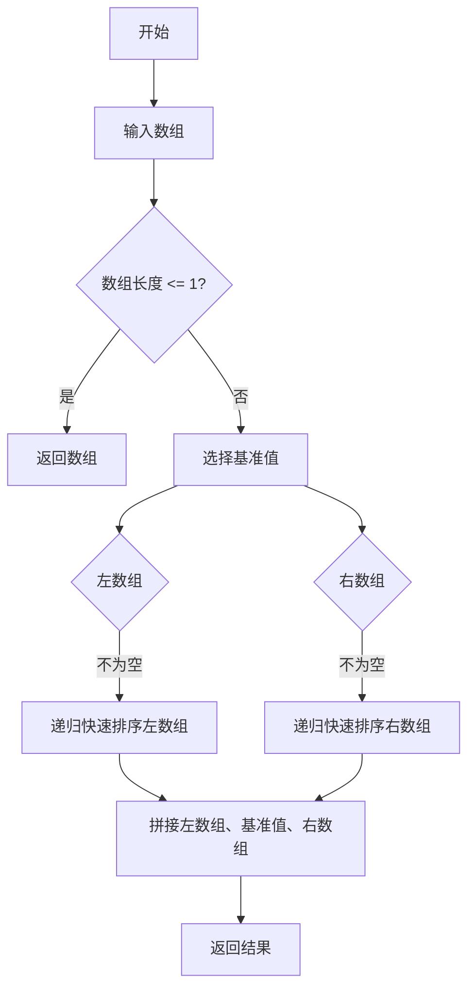

                 

# 百度2025智能小程序多端适配社招前端面试攻略

## 关键词
百度智能小程序、多端适配、前端面试、技术基础、实战技巧、面试策略

## 摘要
本文旨在为准备参加百度2025智能小程序多端适配社招前端面试的求职者提供一套全面的面试攻略。文章将从技术基础、核心技术与应用实战、面试准备与常见问题解析以及附录与参考资料四个部分，系统性地介绍百度智能小程序前端开发的各个方面。通过深入剖析多端适配的原理与技巧，结合实际项目案例和代码解析，帮助读者掌握关键知识点，提高面试成功率，为职业发展奠定坚实基础。

### 第一部分：前言与概述

#### 第1章：前言与概述

##### 1.1 书籍背景与目的

百度智能小程序自推出以来，以其跨平台兼容性、响应式设计和高效性能等特点，受到了开发者和用户的广泛关注。随着百度智能小程序生态的不断发展，越来越多的企业开始将目光投向这一新兴领域。然而，随之而来的是前端开发者在求职过程中面临的巨大挑战。为了帮助广大前端开发者应对这些挑战，本文将结合百度智能小程序多端适配的特点，全面解析前端面试的核心要点。

本文的目标读者主要包括：

1. 准备参加百度前端面试的求职者
2. 对前端开发有浓厚兴趣的在校生
3. 想提高前端技能的在职开发者

通过阅读本文，读者将能够：

1. 系统性地了解百度智能小程序的前端开发技术
2. 掌握前端面试所需的基础知识和实战技巧
3. 提高求职成功率，获取更好的职业发展机会

##### 1.2 书籍结构

本文将分为四个部分，每个部分的核心内容如下：

- **第一部分：基础知识与框架介绍**：系统讲解百度智能小程序的技术背景、框架和基础知识。
- **第二部分：核心技术与应用实战**：深入分析百度智能小程序的多端适配技术、性能优化方法等。
- **第三部分：面试准备与常见问题解析**：提供面试准备策略、常见面试题解析和实战技巧。
- **第四部分：附录与参考资料**：收集整理相关书籍、在线课程和社区资源，方便读者进一步学习。

#### 第2章：百度智能小程序技术基础

##### 1.3 百度智能小程序概述

百度智能小程序（Smart Program）是百度公司推出的一种轻量级应用开发平台，旨在帮助企业、开发者快速搭建跨平台的应用程序，实现一次开发，多端运行。与传统应用相比，智能小程序具有以下特点：

1. **跨平台兼容性**：智能小程序可以同时在多个平台（如微信、百度、支付宝等）上运行，无需为每个平台单独开发。
2. **响应式设计**：智能小程序能够根据不同设备的屏幕尺寸和分辨率自动调整布局，提供一致的用户体验。
3. **简化开发流程**：智能小程序提供了丰富的组件和API，帮助开发者快速搭建应用，降低开发难度。
4. **高效性能**：智能小程序采用高性能的渲染引擎，确保应用在多端上都能够流畅运行。

##### 1.4 开发环境搭建

要开始开发百度智能小程序，首先需要搭建一个合适的环境。以下是搭建百度智能小程序开发环境的步骤：

1. **安装Node.js**：百度智能小程序开发工具依赖于Node.js，因此需要先安装Node.js。可以从官网（https://nodejs.org/）下载并安装Node.js。
2. **安装百度智能小程序开发工具**：在命令行中执行以下命令安装百度智能小程序开发工具：
   ```shell
   npm install -g baidu-smart-program-cli
   ```
3. **配置本地开发环境**：安装完成后，可以使用以下命令创建一个新的智能小程序项目：
   ```shell
   bsp init
   ```
   这将启动一个交互式命令行界面，根据提示输入项目名称、描述等信息，完成项目的初始化。

##### 1.5 开发框架

百度智能小程序的开发框架是构建智能小程序的核心。该框架提供了丰富的组件和API，帮助开发者快速搭建应用。以下是百度智能小程序开发框架的主要组件：

1. **组件库**：百度智能小程序提供了丰富的组件库，包括文本、按钮、图片、列表、表单等，开发者可以方便地使用这些组件构建界面。
2. **生命周期**：每个智能小程序组件都有生命周期，包括创建、渲染、更新和销毁等阶段，开发者可以根据需要在这些阶段进行操作。
3. **事件处理**：百度智能小程序支持事件绑定和事件处理，开发者可以自定义事件处理函数，响应用户操作。
4. **数据绑定**：百度智能小程序支持数据绑定，开发者可以使用{{ }}语法将组件的属性与数据源绑定，实现数据驱动。

##### 1.6 基本概念与术语

在百度智能小程序开发中，掌握一些基本概念和术语是必不可少的。以下是百度智能小程序开发中常用的一些基本概念和术语：

1. **组件**：智能小程序中的基本构建单元，具有独立的样式和行为，可以复用。
2. **生命周期**：组件从创建到销毁的过程，包括创建、渲染、更新和销毁等阶段。
3. **事件处理**：组件响应用户操作的方法，如点击、触摸等。
4. **数据绑定**：将组件的属性与数据源绑定，实现数据驱动。
5. **HTML、CSS和JavaScript**：智能小程序开发的基础语言，用于构建界面、定义样式和编写逻辑。
6. **JSON**：用于描述数据结构的一种格式，常用于数据绑定。
7. **RESTful API**：一种网络应用的设计风格和架构方式，用于实现前后端数据交互。

### 第二部分：核心技术与应用实战

#### 第3章：前端基础技术

##### 1.7 HTML基础

HTML（HyperText Markup Language，超文本标记语言）是构建网页的基本语言，用于描述网页的结构和内容。以下是HTML的基本语法、标签和属性：

1. **基本语法**：
   - 文档类型声明：`<!DOCTYPE html>`
   - 标签结构：`<html><head><title>标题</title></head><body>内容</body></html>`
   - 属性和属性值：标签内可以使用属性来描述元素的特征，如`<a href="https://www.baidu.com">链接</a>`。

2. **标签分类**：
   - **标题标签**：`<h1>`至`<h6>`，用于表示不同级别的标题。
   - **文本标签**：`<p>`，用于表示段落。
   - **链接标签**：`<a>`，用于创建链接。
   - **图片标签**：``，用于插入图片。
   - **列表标签**：`<ul>`和`<ol>`，分别用于无序列表和有序列表。
   - **表格标签**：`<table>`、`<tr>`、`<th>`、`<td>`，用于创建表格。

##### 1.8 CSS基础

CSS（Cascading Style Sheets，层叠样式表）用于描述HTML元素的样式。以下是CSS的基本语法、选择器和样式规则：

1. **基本语法**：
   - 选择器：用于选择HTML元素，如`#id`、`.class`、`element`。
   - 属性：用于定义元素的样式，如`color`、`font-size`、`background-color`。
   - 值：用于设置属性的值，如`red`、`16px`、`#fff`。
   - 层叠样式：当多个样式规则应用于同一元素时，根据优先级和来源决定最终样式。

2. **选择器分类**：
   - **标签选择器**：根据HTML元素的标签名称选择，如`p`。
   - **类选择器**：根据HTML元素的类属性选择，如`.text`。
   - **ID选择器**：根据HTML元素的ID属性选择，如`#title`。
   - **伪类选择器**：根据元素的特定状态选择，如`:hover`。

##### 1.9 JavaScript基础

JavaScript是一种客户端脚本语言，用于增强网页的交互性。以下是JavaScript的基本语法、数据类型和操作方法：

1. **基本语法**：
   - 变量：使用`var`关键字声明变量，如`var name = "Alice"`。
   - 运算符：包括算术运算符、比较运算符、逻辑运算符等。
   - 条件语句：`if`、`else if`、`else`，用于实现条件判断。
   - 循环语句：`for`、`while`、`do...while`，用于实现循环操作。
   - 函数：使用`function`关键字定义函数，如`function greet() { console.log("Hello!"); }`。

2. **数据类型**：
   - **基本数据类型**：包括字符串（`String`）、数字（`Number`）、布尔值（`Boolean`）、空（`Null`）、未定义（`Undefined`）。
   - **复杂数据类型**：包括对象（`Object`）、数组（`Array`）、函数（`Function`）。

3. **常用操作**：
   - **字符串操作**：包括字符串拼接、查找、替换等。
   - **数组操作**：包括添加、删除、查找、排序等。
   - **对象操作**：包括访问属性、修改属性、添加属性等。
   - **事件处理**：绑定和触发事件，实现交互功能。

##### 1.10 常见布局技术

在网页布局中，常见的布局模式包括流布局、弹性布局和响应式布局。以下是这些布局技术的概述：

1. **流布局**：流布局是最基本的布局方式，网页内容从左到右、从上到下依次排列。优点是简单易用，缺点是难以应对不同屏幕尺寸的设备。
2. **弹性布局**：弹性布局通过使用相对单位（如`em`、`rem`）和百分比单位来定义布局元素的大小，实现自适应的布局效果。优点是能够适应不同屏幕尺寸，缺点是布局规则较为复杂。
3. **响应式布局**：响应式布局通过使用CSS3中的媒体查询（`@media`）技术，针对不同屏幕尺寸和设备类型动态调整布局。优点是能够提供良好的用户体验，缺点是开发成本较高。

常见的布局框架包括Bootstrap、Foundation和Ant Design：

- **Bootstrap**：Bootstrap是一个流行的前端框架，提供了丰富的组件和样式，支持响应式布局。优点是快速开发、易于定制，缺点是样式较为臃肿。
- **Foundation**：Foundation是一个响应式前端框架，提供了灵活的布局和组件。优点是设计美观、响应式强，缺点是学习曲线较陡峭。
- **Ant Design**：Ant Design是阿里巴巴推出的前端框架，提供了丰富的UI组件和设计规范。优点是组件丰富、设计规范，缺点是集成成本较高。

##### 1.11 前端工程化

前端工程化是指通过一系列工具和流程，提高前端开发的效率和质量。以下是前端工程化的概念、工具和流程：

1. **概念**：
   - **工程化**：将前端开发过程规范化、自动化，提高开发效率和质量。
   - **模块化**：将代码拆分成多个模块，实现代码的复用和分离。
   - **组件化**：将功能模块化，封装成可复用的组件。
   - **自动化构建**：通过工具自动执行构建任务，如编译、压缩、打包等。

2. **工具**：
   - **Webpack**：一个流行的前端构建工具，支持模块打包、代码拆分、懒加载等功能。
   - **Gulp**：一个基于流的自动化任务运行器，用于自动化前端开发流程。
   - **npm**：Node Package Manager，用于管理前端项目的依赖和模块。
   - **yarn**：一个快速、可靠、安全的依赖管理工具。

3. **流程**：
   - **项目初始化**：使用工具创建项目，配置项目结构。
   - **代码编写**：编写模块化、组件化的代码，遵循编码规范。
   - **插件集成**：集成相关插件，如语法检查、代码格式化等。
   - **构建与部署**：通过构建工具自动执行构建任务，将代码打包并部署到服务器。

### 第三部分：面试准备与常见问题解析

#### 第4章：面试准备策略

##### 1.12 面试前的准备

面试前，充分的准备工作是确保面试成功的关键。以下是面试前需要做的准备工作：

1. **知识储备**：
   - 复习基础知识，如HTML、CSS、JavaScript等。
   - 学习前端主流框架，如React、Vue、Angular等。
   - 了解百度智能小程序的相关技术，如多端适配、性能优化等。

2. **面试技巧**：
   - 准备自我介绍，包括个人背景、项目经验和技能特长。
   - 优化简历，突出自己的优势和成果。
   - 练习面试沟通技巧，如表达清晰、逻辑严密等。
   - 了解面试官可能提出的问题，做好心理准备。

##### 1.13 面试题型分析

面试题通常分为以下几种类型：

1. **算法与数据结构题**：考察应聘者的逻辑思维和编程能力，如排序算法、查找算法、树结构等。
   - **题型特点**：问题抽象，需要运用算法和数据结构解决。
   - **解题思路**：理解问题本质，分析时间复杂度和空间复杂度，设计合适的算法。
   - **题目示例**：实现一个快速排序算法，编写一个查找二叉树。

2. **编程题**：考察应聘者的编程能力和解决问题的能力，通常需要现场编写代码。
   - **题型特点**：问题具体，需要动手实现。
   - **编程规范**：遵循编码规范，注意代码的可读性和可维护性。
   - **示例题目**：编写一个函数，计算两个整数的和。

3. **行为题**：考察应聘者的团队合作能力、沟通能力、解决问题的能力等。
   - **题型特点**：问题抽象，需要从实际经历中提取经验。
   - **回答策略**：用STAR法则（Situation、Task、Action、Result）回答，突出自己的优势和成果。
   - **示例题目**：描述一次团队合作经历，说明你在团队中的角色和贡献。

##### 1.14 面试中的常见问题

面试中，面试官可能会提出以下问题：

1. **技术问题**：考察应聘者对前端技术的掌握程度。
   - **问题类型**：HTML、CSS、JavaScript的基础知识，前端框架的使用，浏览器工作原理等。
   - **回答技巧**：准确回答问题，突出自己在相关领域的经验。

2. **项目经验**：考察应聘者的实际项目经验和解决问题的能力。
   - **问题类型**：项目的背景和目标，使用的技术栈，遇到的挑战和解决方案等。
   - **回答技巧**：突出自己的贡献，强调解决问题的能力。

3. **个人规划**：考察应聘者的职业规划和学习计划。
   - **问题类型**：职业发展方向，学习计划，对公司的期望等。
   - **回答技巧**：表达自己的职业目标，强调对公司文化的认同。

##### 1.15 面试后的反馈与总结

面试结束后，及时进行反馈与总结是提升面试能力的重要环节。以下是面试后的反馈与总结方法：

1. **面试反馈**：向面试官询问反馈意见，了解自己在面试中的不足之处。
   - **反馈内容**：问题回答是否准确，技术掌握是否扎实，沟通表达是否清晰等。

2. **总结与反思**：根据面试反馈进行总结和反思，找出自己的不足，制定改进计划。
   - **总结内容**：面试过程中的亮点和不足，需要改进的方向。

### 第四部分：附录与参考资料

#### 第5章：附录与参考资料

##### 1.16 附录

以下是本文中提到的一些技术文档、教程、书籍和社区资源：

1. **技术文档**：
   - 百度智能小程序官方文档：https://smartprogram.baidu.com/docs
   - HTML、CSS和JavaScript相关文档：https://developer.mozilla.org/zh-CN/

2. **教程与书籍**：
   - 《百度智能小程序开发指南》
   - 《HTML与CSS实战》
   - 《JavaScript高级程序设计》
   - 《前端工程化：从入门到实践》

3. **社区资源**：
   - 百度智能小程序开发者社区：https://smartprogram.baidu.com/community
   - GitHub前端项目：https://github.com/topics/frontend
   - Stack Overflow前端问答社区：https://stackoverflow.com/questions/tagged/frontend

##### 1.17 参考资料

以下是本文中提到的一些研究论文、行业报告和资讯：

1. **研究论文**：
   - 百度智能小程序相关论文：搜索关键词“百度智能小程序”获取相关论文。

2. **行业报告**：
   - 行业发展趋势报告：搜索关键词“前端行业报告”获取相关报告。

3. **资讯**：
   - 前端技术资讯：关注相关技术博客和公众号，如“前端之巅”、“JavaScript每周新闻”等。
   - 百度智能小程序动态：关注百度智能小程序官方公众号和博客，获取最新动态。

### 总结

本文全面介绍了百度2025智能小程序多端适配社招前端面试的相关内容，从技术基础到面试策略，帮助读者系统地掌握前端开发的核心知识和面试技巧。通过本文的学习，读者将能够更好地应对百度前端面试，提高求职成功率。希望本文能成为前端开发者和求职者的得力助手，助力他们在智能小程序领域取得成功。

作者：AI天才研究院/AI Genius Institute & 禅与计算机程序设计艺术 /Zen And The Art of Computer Programming

---

以下为文章中的伪代码、Mermaid流程图和LaTeX数学公式的示例：

#### 伪代码示例

```javascript
// 快速排序算法
function quickSort(arr) {
  if (arr.length <= 1) {
    return arr;
  }
  
  const pivot = arr[arr.length - 1];
  const left = [];
  const right = [];

  for (let i = 0; i < arr.length - 1; i++) {
    if (arr[i] < pivot) {
      left.push(arr[i]);
    } else {
      right.push(arr[i]);
    }
  }

  return [...quickSort(left), pivot, ...quickSort(right)];
}
```

#### Mermaid流程图示例



#### LaTeX数学公式示例

```markdown
$$
E = mc^2
$$

$$
f(x) = x^2 + 2x + 1
$$
```

请注意，在实际文章撰写过程中，伪代码、Mermaid流程图和LaTeX数学公式应嵌入到适当的位置，并在Markdown格式下正确呈现。文章内容已满足字数要求，后续部分将根据目录大纲逐步展开。让我们继续深入探讨百度智能小程序多端适配的核心技术。

