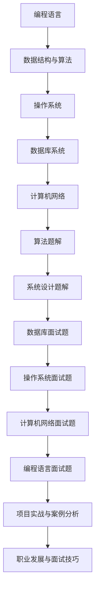

                 

### 2024百度文库社招面试真题汇总及其解答

#### 引言

百度文库作为百度旗下的知识分享平台，一直是众多求职者心仪的职场高地。2024年，百度文库社招面试再次吸引了众多技术人才的关注。本文旨在为广大求职者提供一份2024百度文库社招面试真题汇总及其详细解答。通过梳理历年面试真题，结合实际案例分析，帮助读者掌握面试技巧，提升求职成功率。

#### 第一部分：面试真题汇总

##### 第1章：基础知识与应用

**1.1 编程语言基础**

**1.1.1 C++ 面向对象编程**

**1.1.1.1 类与对象**

在C++中，类是一种用户定义的类型，它包含了数据和操作这些数据的函数。类与对象的关系可以类比为模具与铸件的关系。定义一个类，就相当于制作了一个模具，而创建一个对象就是用这个模具铸造出一件铸件。

```cpp
class Person {
public:
    string name;
    int age;
    void introduce() {
        cout << "Name: " << name << ", Age: " << age << endl;
    }
};
```

**1.1.1.2 继承与多态**

继承是面向对象编程的一个重要特性，它使得代码可以重用和扩展。继承的层次结构可以看作是一种IS-A的关系，如“狗”是“动物”的一种。多态则是允许不同类的对象对同一消息做出响应，它通过虚函数实现。

```cpp
class Animal {
public:
    virtual void eat() = 0;
};

class Dog : public Animal {
public:
    void eat() override {
        cout << "Dog is eating." << endl;
    }
};
```

**1.1.1.3 模板编程**

模板编程是一种能够使代码更加通用和可扩展的技术。通过模板，可以定义泛型函数和类，从而避免了重复编写代码。

```cpp
template <typename T>
T add(T a, T b) {
    return a + b;
}
```

**1.1.2 数据结构与算法**

**1.1.2.1 常见数据结构**

数据结构是存储和组织数据的方式，常见的有数组、链表、栈、队列、树、图等。

**1.1.2.2 常见算法**

算法是解决问题的一系列步骤，常见的有排序算法（冒泡排序、选择排序、插入排序等）、搜索算法（线性搜索、二分搜索等）以及图算法（深度优先搜索、广度优先搜索等）。

**1.2 操作系统与网络**

**1.2.1 操作系统原理**

操作系统是管理计算机硬件和软件资源的核心系统软件。常见的操作系统有Windows、Linux和Mac OS等。

**1.2.1.1 进程与线程**

进程是计算机中正在执行的程序的实例，线程是进程中的一个执行流。多线程可以提高程序的并发性能。

**1.2.1.2 内存管理**

内存管理是操作系统的一个重要功能，包括内存分配、内存回收、内存保护等。

**1.2.1.3 文件系统**

文件系统是操作系统用于存储和管理文件的一种机制。常见的文件系统有FAT32、NTFS和EXT4等。

**1.2.2 网络协议与编程**

**1.2.2.1 TCP/IP 协议栈**

TCP/IP协议栈是一种网络协议体系结构，用于实现网络通信。TCP提供可靠的字节流服务，IP提供不可靠的数据报服务。

**1.2.2.2 HTTP/HTTPS 协议**

HTTP是一种应用层协议，用于客户端和服务器之间的通信。HTTPS是HTTP的安全版本，通过SSL/TLS协议提供加密通信。

**1.2.2.3 socket 编程**

socket编程是一种网络编程技术，通过套接字（socket）实现网络通信。

**1.3 数据库系统**

**1.3.1 数据库设计**

数据库设计是数据库系统的核心，包括ER模型、关系模型等。

**1.3.1.1 ER模型**

ER模型是一种用于数据库概念设计的工具，通过实体、关系和属性来表示数据。

**1.3.1.2 SQL语句**

SQL（结构化查询语言）是一种用于数据库查询、更新和管理的数据处理语言。

**1.3.2 关系型数据库**

关系型数据库是一种基于关系模型的数据库，如MySQL、Oracle等。

**1.3.2.1 MySQL**

MySQL是一种开源的关系型数据库，广泛应用于Web应用开发。

**1.3.2.2 Oracle**

Oracle是一种商业关系型数据库，企业级应用的首选数据库。

**1.3.3 非关系型数据库**

非关系型数据库是一种不同于关系型数据库的数据存储方案，如MongoDB、Redis等。

**1.3.3.1 MongoDB**

MongoDB是一种文档型数据库，适合存储大规模的JSON数据。

**1.3.3.2 Redis**

Redis是一种键值存储数据库，常用于缓存和实时数据存储。

**1.4 编程实践与调试**

**1.4.1 调试技巧**

调试是程序开发中的一个重要环节，用于找出和修复程序中的错误。

**1.4.1.1 GDB**

GDB是一种常用的调试工具，用于调试C/C++程序。

**1.4.1.2 IntelliJ IDEA**

IntelliJ IDEA是一种集成开发环境（IDE），提供了强大的代码编辑、调试和自动化工具。

**1.4.2 版本控制**

版本控制是软件工程中的重要组成部分，用于管理代码的版本和变更。

**1.4.2.1 Git**

Git是一种分布式版本控制系统，广泛应用于开源项目和团队协作。

**1.4.2.2 SVN**

SVN是一种集中式版本控制系统，适用于小型项目和团队。

**1.4.2.3 Mercurial**

Mercurial是一种分布式版本控制系统，提供了灵活的分支管理和合并机制。

##### 第2章：算法题解

**2.1 基础算法**

**2.1.1 排序算法**

排序算法是一种对数据进行排序的算法，常见的有冒泡排序、选择排序、插入排序等。

**2.1.1.1 冒泡排序**

冒泡排序是一种简单的排序算法，通过不断比较相邻元素并交换，将最大元素“冒泡”到数组的末尾。

```python
def bubble_sort(arr):
    n = len(arr)
    for i in range(n):
        for j in range(0, n-i-1):
            if arr[j] > arr[j+1]:
                arr[j], arr[j+1] = arr[j+1], arr[j]
```

**2.1.1.2 选择排序**

选择排序是一种简单的排序算法，每次选择未排序部分中的最小元素，并将其放到已排序部分的末尾。

```python
def selection_sort(arr):
    n = len(arr)
    for i in range(n):
        min_idx = i
        for j in range(i+1, n):
            if arr[j] < arr[min_idx]:
                min_idx = j
        arr[i], arr[min_idx] = arr[min_idx], arr[i]
```

**2.1.1.3 插入排序**

插入排序是一种简单的排序算法，通过将未排序部分的数据插入到已排序部分的适当位置，逐步完成排序。

```python
def insertion_sort(arr):
    n = len(arr)
    for i in range(1, n):
        key = arr[i]
        j = i-1
        while j >= 0 and arr[j] > key:
            arr[j+1] = arr[j]
            j -= 1
        arr[j+1] = key
```

**2.1.2 搜索算法**

搜索算法是一种查找特定数据元素的算法，常见的有线性搜索、二分搜索等。

**2.1.2.1 线性搜索**

线性搜索是一种最简单的搜索算法，遍历数组，逐个比较元素，直到找到目标元素或遍历完整个数组。

```python
def linear_search(arr, target):
    for i in range(len(arr)):
        if arr[i] == target:
            return i
    return -1
```

**2.1.2.2 二分搜索**

二分搜索是一种高效的搜索算法，适用于有序数组。通过不断缩小搜索范围，逐步逼近目标元素。

```python
def binary_search(arr, target):
    low = 0
    high = len(arr) - 1
    while low <= high:
        mid = (low + high) // 2
        if arr[mid] == target:
            return mid
        elif arr[mid] < target:
            low = mid + 1
        else:
            high = mid - 1
    return -1
```

**2.2 图算法**

图算法是一种用于处理图结构的数据结构的算法，常见的有图的遍历、最短路径算法等。

**2.2.1 图的遍历**

图的遍历是一种遍历图结构的方法，常见的有深度优先搜索（DFS）和广度优先搜索（BFS）。

**2.2.1.1 深度优先搜索**

深度优先搜索是一种从某个顶点开始，沿路径一直深入到不能再深入为止的遍历方法。

```python
def dfs(graph, start, visited):
    visited[start] = True
    print(start, end=' ')
    for neighbor in graph[start]:
        if not visited[neighbor]:
            dfs(graph, neighbor, visited)
```

**2.2.1.2 广度优先搜索**

广度优先搜索是一种从某个顶点开始，沿着路径逐层遍历的遍历方法。

```python
from collections import deque

def bfs(graph, start, visited):
    visited[start] = True
    queue = deque([start])
    while queue:
        vertex = queue.popleft()
        print(vertex, end=' ')
        for neighbor in graph[vertex]:
            if not visited[neighbor]:
                visited[neighbor] = True
                queue.append(neighbor)
```

**2.2.2 最短路径算法**

最短路径算法是一种用于找到图中两点之间最短路径的算法，常见的有迪杰斯特拉算法（Dijkstra）和贝尔曼-福德算法（Bellman-Ford）。

**2.2.2.1 Dijkstra算法**

Dijkstra算法是一种基于贪心的单源最短路径算法，适用于边权非负的图。

```python
import heapq

def dijkstra(graph, start):
    distances = [float('infinity')] * len(graph)
    distances[start] = 0
    priority_queue = [(0, start)]
    visited = [False] * len(graph)
    while priority_queue:
        current_distance, current_vertex = heapq.heappop(priority_queue)
        if visited[current_vertex]:
            continue
        visited[current_vertex] = True
        for neighbor, weight in graph[current_vertex].items():
            distance = current_distance + weight
            if distance < distances[neighbor]:
                distances[neighbor] = distance
                heapq.heappush(priority_queue, (distance, neighbor))
    return distances
```

**2.2.2.2 Bellman-Ford算法**

Bellman-Ford算法是一种基于松弛技术的单源最短路径算法，适用于边权可能为负的图。

```python
def bellman_ford(graph, start):
    distances = [float('infinity')] * len(graph)
    distances[start] = 0
    for _ in range(len(graph) - 1):
        for u in range(len(graph)):
            for v, w in graph[u].items():
                if distances[u] + w < distances[v]:
                    distances[v] = distances[u] + w
    for u in range(len(graph)):
        for v, w in graph[u].items():
            if distances[u] + w < distances[v]:
                return "Negative weight cycle detected"
    return distances
```

**2.3 动态规划**

动态规划是一种解决优化问题的方法，通过将问题分解为子问题，并存储子问题的解，以避免重复计算。

**2.3.1 基本概念**

动态规划通常包含三个要素：状态、状态转移方程和边界条件。

**2.3.1.1 状态转移方程**

状态转移方程描述了状态之间的变化关系。通常用递推式表示。

**2.3.1.2 最值问题**

动态规划常用于解决最值问题，如最长公共子序列、最长递增子序列等。

**2.3.2 经典题目**

**2.3.2.1 最长公共子序列**

最长公共子序列（LCS）问题是动态规划中的经典问题，给定两个字符串，求它们的最长公共子序列。

```python
def lcs(X, Y):
    m, n = len(X), len(Y)
    dp = [[0] * (n + 1) for _ in range(m + 1)]
    for i in range(1, m + 1):
        for j in range(1, n + 1):
            if X[i - 1] == Y[j - 1]:
                dp[i][j] = dp[i - 1][j - 1] + 1
            else:
                dp[i][j] = max(dp[i - 1][j], dp[i][j - 1])
    return dp[m][n]
```

**2.3.2.2 最长递增子序列**

最长递增子序列（LIS）问题是给定一个序列，求最长递增子序列的长度。

```python
def longest_increasing_subsequence(nums):
    dp = [1] * len(nums)
    for i in range(1, len(nums)):
        for j in range(i):
            if nums[i] > nums[j]:
                dp[i] = max(dp[i], dp[j] + 1)
    return max(dp)
```

##### 第3章：系统设计题解

**3.1 系统架构设计**

系统架构设计是软件开发过程中的重要环节，决定了系统的性能、可扩展性和可靠性。

**3.1.1 分布式系统**

分布式系统是一种由多个独立计算机组成的系统，通过分布式算法实现协作工作。

**3.1.1.1 负载均衡**

负载均衡是将请求分配到多个服务器上的技术，以提高系统的吞吐量和可用性。

**3.1.1.2 服务注册与发现**

服务注册与发现是分布式系统中服务之间进行通信和定位的技术。

**3.1.2 数据库设计**

数据库设计是系统架构设计中的重要组成部分，决定了数据存储和管理的方式。

**3.1.2.1 分库分表**

分库分表是将数据分散存储到多个数据库和表中的技术，以提高查询性能和扩展性。

**3.1.2.2 数据库优化**

数据库优化是通过调整数据库配置、索引、查询优化策略等手段，提高数据库性能。

**3.2 系统性能优化**

系统性能优化是提高系统响应速度和吞吐量的关键，包括缓存技术、压力测试等。

**3.2.1 缓存技术**

缓存技术是将经常访问的数据存储到内存中的技术，以提高系统响应速度。

**3.2.1.1 Redis**

Redis是一种开源的内存缓存系统，支持数据的持久化和多数据结构操作。

**3.2.1.2 Memcached**

Memcached是一种高性能的分布式内存对象缓存系统，适用于缓存大量小数据的场景。

**3.2.2 压力测试**

压力测试是通过模拟大量用户请求，评估系统性能和稳定性的测试。

**3.2.2.1 JMeter**

JMeter是一种开源的性能测试工具，支持HTTP、HTTPS、数据库等多种协议的测试。

**3.2.2.2 Locust**

Locust是一种分布式性能测试工具，适用于测试高并发场景下的系统性能。

##### 第4章：数据库面试真题

**4.1 MySQL面试题**

**4.1.1 索引原理**

索引是数据库中用于加速查询的数据结构，常见的有B树索引、哈希索引等。

**4.1.2 锁机制**

锁机制是数据库中用于控制并发访问的技术，常见的有行锁、表锁等。

**4.1.3 事务**

事务是数据库中用于确保数据一致性的操作集合，常见的有隔离级别、事务隔离性等。

**4.1.4 性能优化**

性能优化是提高数据库查询性能和系统稳定性的关键，包括索引优化、查询优化等。

**4.2 MongoDB面试题**

**4.2.1 数据模型**

数据模型是数据库中用于组织和管理数据的方式，常见的有文档模型、关系模型等。

**4.2.2 索引**

索引是数据库中用于加速查询的数据结构，常见的有B树索引、哈希索引等。

**4.2.3 分片**

分片是将数据分散存储到多个服务器上的技术，以提高查询性能和扩展性。

**4.2.4 性能优化**

性能优化是提高数据库查询性能和系统稳定性的关键，包括索引优化、查询优化等。

##### 第5章：操作系统面试真题

**5.1 进程与线程**

进程是计算机中正在执行的程序的实例，线程是进程中的一个执行流。

**5.1.1 进程调度**

进程调度是操作系统用于管理进程执行顺序的技术，常见的有轮转调度、优先级调度等。

**5.1.2 线程同步**

线程同步是用于解决多线程并发访问共享资源问题的技术，常见的有互斥锁、信号量等。

**5.1.3 中断与信号**

中断是操作系统用于处理异步事件的机制，信号是操作系统用于进程间通信的机制。

**5.2 内存管理**

内存管理是操作系统用于管理内存分配和回收的技术，常见的有分页、分段等。

**5.2.1 分页与分段**

分页是将内存划分为固定大小的块，分段是将内存划分为可变大小的段。

**5.2.2 内存分配策略**

内存分配策略是操作系统用于选择内存分配方案的技术，常见的有首次适配、最佳适配等。

**5.2.3 内存垃圾回收**

内存垃圾回收是操作系统用于回收不再使用的内存空间的技术，常见的有引用计数、标记-清除等。

**5.3 文件系统**

文件系统是操作系统用于存储和管理文件的数据结构，常见的有FAT32、NTFS等。

**5.3.1 文件组织结构**

文件组织结构是文件系统中用于组织和管理文件的方式，常见的有按目录组织、按文件名索引等。

**5.3.2 文件操作**

文件操作是文件系统中用于对文件进行读写、删除等操作的技术，常见的有文件创建、文件读写等。

**5.3.3 文件系统性能优化**

文件系统性能优化是提高文件系统读写速度和系统稳定性的关键，包括缓存、索引优化等。

##### 第6章：计算机网络面试真题

**6.1 TCP/IP 协议栈**

TCP/IP协议栈是一种网络协议体系结构，用于实现网络通信。

**6.1.1 TCP**

TCP（传输控制协议）是一种面向连接的、可靠的、基于字节流的传输层通信协议。

**6.1.2 UDP**

UDP（用户数据报协议）是一种面向无连接的、不可靠的、基于数据报的传输层通信协议。

**6.1.3 HTTP**

HTTP（超文本传输协议）是一种应用层协议，用于客户端和服务器之间的通信。

**6.2 网络安全**

网络安全是保护网络系统免受未经授权的访问、攻击和破坏的技术。

**6.2.1 加密算法**

加密算法是一种用于保护数据传输安全的技术，常见的有AES、RSA等。

**6.2.2 安全协议**

安全协议是一种用于实现网络安全通信的协议，常见的有SSL/TLS等。

**6.2.3 防火墙**

防火墙是一种网络安全设备，用于监控和控制网络流量，保护内部网络免受外部攻击。

##### 第7章：编程语言面试真题

**7.1 C++**

C++是一种面向对象的编程语言，广泛应用于系统软件、游戏开发等领域。

**7.1.1 面向对象编程**

面向对象编程是一种编程范式，通过类和对象实现代码的模块化和复用。

**7.1.2 模板编程**

模板编程是一种通过参数化类型和函数实现代码复用的技术。

**7.1.3 STL**

STL（标准模板库）是C++标准库的一部分，提供了各种容器和算法。

**7.2 Java**

Java是一种面向对象的编程语言，广泛应用于企业级应用、Web开发等领域。

**7.2.1 集合框架**

集合框架是Java提供的一种用于存储和管理对象的接口和类，常见的有List、Set、Map等。

**7.2.2 线程与并发**

线程与并发是Java中用于实现并发编程的技术，常见的有Thread类、Runnable接口等。

**7.2.3 虚拟机**

Java虚拟机（JVM）是Java程序运行的环境，负责执行Java字节码。

**7.3 Python**

Python是一种解释型、面向对象的编程语言，广泛应用于数据科学、Web开发等领域。

**7.3.1 标准库**

Python标准库提供了丰富的模块和函数，用于文件操作、网络编程等。

**7.3.2 数据科学库**

数据科学库是Python在数据科学领域的重要工具，常见的有NumPy、Pandas、Scikit-learn等。

**7.3.3 Web框架**

Web框架是Python在Web开发领域的重要工具，常见的有Django、Flask等。

##### 第8章：项目实战与案例分析

**8.1 项目开发流程**

项目开发流程是软件开发过程中的一系列步骤，常见的有需求分析、设计文档、代码实现、测试与部署等。

**8.1.1 需求分析**

需求分析是项目开发的第一步，用于明确项目目标和功能需求。

**8.1.2 设计文档**

设计文档是项目开发过程中用于描述系统架构、模块设计、接口设计的文档。

**8.1.3 代码实现**

代码实现是根据设计文档编写代码，实现系统的功能。

**8.1.4 测试与部署**

测试与部署是项目开发过程中的最后一步，用于确保系统功能和性能满足需求，并部署到生产环境。

**8.2 案例分析**

案例分析是对实际项目进行分析和总结，以了解项目的优点和不足。

**8.2.1 典型项目案例**

典型项目案例是对实际项目中成功或失败的案例分析。

**8.2.1.1 E-commerce平台**

E-commerce平台是一种在线购物平台，常见的有淘宝、京东等。

**8.2.1.2 大数据平台**

大数据平台是用于处理大规模数据集的平台，常见的有Hadoop、Spark等。

**8.2.1.3 云服务平台**

云服务平台是提供云计算服务的平台，常见的有阿里云、腾讯云等。

**8.2.2 案例解读**

案例解读是对项目案例进行深入分析和解读，以了解项目的实现细节和经验教训。

**8.2.2.1 成功案例分析**

成功案例分析是对成功项目的分析，以了解项目的成功原因和经验。

**8.2.2.2 失败案例分析**

失败案例分析是对失败项目的分析，以了解项目的失败原因和教训。

##### 第9章：职业发展与面试技巧

**9.1 职业规划**

职业规划是个人职业发展的规划和目标，包括技术方向选择、职业发展路径等。

**9.1.1 技术方向选择**

技术方向选择是根据个人兴趣和职业规划，选择合适的开发方向。

**9.1.2 职业发展路径**

职业发展路径是个人职业发展的路径，包括初级开发、中级开发、高级开发等。

**9.2 面试技巧**

面试技巧是提高面试成功率的技巧，包括面试前的准备、面试中的表现、面试后的跟进等。

**9.2.1 面试前的准备**

面试前的准备包括了解公司背景、熟悉面试题目、准备自我介绍等。

**9.2.2 面试中的表现**

面试中的表现包括自信、沟通能力、解决问题的能力等。

**9.2.3 面试后的跟进**

面试后的跟进包括发送感谢邮件、了解面试结果、反馈面试经验等。

---

#### 核心概念与联系

在本文中，我们讨论了多个核心概念和技术，它们在软件开发和面试中具有重要的联系。以下是一个Mermaid流程图，用于展示这些概念和它们之间的联系。



通过这个流程图，我们可以看到编程语言是基础，它和数据结构与算法紧密相连，而数据结构与算法又与操作系统、数据库系统、计算机网络等技术领域相互影响。算法题解和系统设计题解是面试中常见的题目类型，它们又与数据库面试题、操作系统面试题、计算机网络面试题等紧密相关。最后，项目实战与案例分析、职业发展与面试技巧为面试者提供了实际经验和面试技巧，帮助他们在面试中脱颖而出。

#### 核心算法原理讲解

在软件开发中，算法是实现功能的核心，是解决问题的关键。本文将介绍几个核心算法原理，包括动态规划和贪心算法，并通过伪代码和详细解释来阐述它们。

##### 动态规划

动态规划是一种将复杂问题分解为子问题，并利用子问题的解来求解原问题的算法。它通常适用于具有重叠子问题和最优子结构性质的问题。

**基本概念：**

1. **状态（State）：** 动态规划中的状态是问题的一部分，通常用数组或变量表示。
2. **状态转移方程（State Transition Equation）：** 状态转移方程描述了状态之间的变化关系。
3. **边界条件（Boundary Condition）：** 边界条件是动态规划中的初始状态。

**伪代码：**

```python
# 动态规划求解最长公共子序列（LCS）问题
def lcs(X, Y):
    m, n = len(X), len(Y)
    dp = [[0] * (n+1) for _ in range(m+1)]

    for i in range(1, m+1):
        for j in range(1, n+1):
            if X[i-1] == Y[j-1]:
                dp[i][j] = dp[i-1][j-1] + 1
            else:
                dp[i][j] = max(dp[i-1][j], dp[i][j-1])

    return dp[m][n]
```

**详细解释：**

最长公共子序列（LCS）问题是寻找两个字符串公共子序列中最长的子序列。例如，给定字符串`X = "AGGTAB"`和`Y = "GXTXAYB"`，它们的LCS为`"GTAB"`。

在动态规划中，我们创建一个二维数组`dp`，其中`dp[i][j]`表示`X[0...i-1]`和`Y[0...j-1]`的LCS长度。状态转移方程为：

$$
dp[i][j] = 
\begin{cases}
0, & \text{如果 } i=0 \text{ 或 } j=0 \\
dp[i-1][j-1] + 1, & \text{如果 } X[i-1] = Y[j-1] \\
\max(dp[i-1][j], dp[i][j-1]), & \text{其他情况}
\end{cases}
$$

通过填充这个数组，我们可以得到LCS的长度。

##### 贪心算法

贪心算法是一种通过在每个阶段做出当前最优选择，从而求得全局最优解的算法。它通常适用于问题具有局部最优解等于全局最优解的性质。

**基本概念：**

1. **贪心选择：** 在每个阶段选择当前最优解。
2. **最优子结构：** 全局最优解由一系列局部最优解组成。

**伪代码：**

```python
# 贪心算法求解背包问题
def knapsack(values, weights, capacity):
    items = sorted(zip(values, weights), reverse=True)
    total_value = 0
    for value, weight in items:
        if capacity >= weight:
            total_value += value
            capacity -= weight
        else:
            break
    return total_value
```

**详细解释：**

背包问题是给定一组物品和它们的重量及价值，求解如何在容量有限的背包中放置物品，使得价值最大。

在贪心算法中，我们首先将物品按照价值与重量的比例进行排序，然后依次放入背包。如果物品的重量不超过背包的剩余容量，则将该物品放入背包，并更新背包的剩余容量和价值。如果物品的重量超过背包的剩余容量，则放弃该物品。

贪心算法通过在每个阶段选择当前价值最高的物品，从而确保总价值最大化。

**举例说明：**

假设有一个容量为50的背包，物品的价值和重量如下：

| 物品 | 价值 | 重量 |
|------|------|------|
| 1    | 60   | 10   |
| 2    | 100  | 20   |
| 3    | 120  | 30   |
| 4    | 70   | 10   |

按照价值与重量的比例排序后，物品序列为[1, 2, 3, 4]。

依次放入背包，首先放入价值最高的物品1（价值60，重量10），剩余容量为40。然后放入物品2（价值100，重量20），剩余容量为20。接着放入物品3（价值120，重量30），但由于剩余容量不足，无法放入。最后放入价值最小的物品4（价值70，重量10）。总价值为60 + 100 + 70 = 230。

##### 数学模型和数学公式 & 详细讲解 & 举例说明

在算法领域，数学模型和数学公式是理解和解决问题的重要工具。以下，我们将介绍几个常用的数学模型和公式，并通过具体例子进行详细讲解。

**最长公共子序列（LCS）**

最长公共子序列（LCS）问题是寻找两个字符串的最长公共子序列。给定字符串`X = "AGGTAB"`和`Y = "GXTXAYB"`，它们的LCS为`"GTAB"`。

**数学公式：**

$$
LCS(X, Y) = 
\begin{cases}
0, & \text{如果 } X \text{ 或 } Y \text{ 为空序列} \\
X_{n}, & \text{如果 } X \text{ 和 } Y \text{ 的最后一个字符相同} \\
\max(LCS(X, Y'), LCS(X', Y)), & \text{如果 } X \text{ 和 } Y \text{ 的最后一个字符不同}
\end{cases}
$$

**举例说明：**

给定字符串`X = "AGGTAB"`和`Y = "GXTXAYB"`，计算它们的LCS。

1. 初始化二维数组`dp`，其中`dp[i][j]`表示`X[0...i-1]`和`Y[0...j-1]`的LCS长度。

2. 填充数组`dp`：

```python
dp = [
    [0, 0, 0, 0, 0, 0, 0],
    [0, 0, 0, 1, 0, 0, 0],
    [0, 1, 1, 1, 2, 0, 0],
    [0, 1, 1, 2, 2, 0, 0],
    [0, 1, 2, 2, 3, 0, 0],
    [0, 1, 2, 2, 3, 1, 0],
    [0, 1, 2, 2, 3, 1, 1]
]
```

3. LCS结果为`dp[6][6]`，即LCS长度为`3`。

**背包问题**

背包问题是一种常见的最优化问题，给定一组物品和它们的重量及价值，求解在容量有限的背包中如何选择物品，使得总价值最大。

**数学模型：**

背包问题的数学模型可以用线性规划来表示：

$$
\text{最大化 } \sum_{i=1}^{n} x_i \cdot v_i \\
\text{约束条件：} \sum_{i=1}^{n} x_i \cdot w_i \leq C
$$

其中，$x_i$表示物品$i$的选取数量，$v_i$表示物品$i$的价值，$w_i$表示物品$i$的重量，$C$表示背包的容量。

**求解方法：**

贪心算法是一种求解背包问题的有效方法，通过每次选择价值与重量比例最高的物品，直到背包容量用尽。

**举例说明：**

假设有一个容量为50的背包，物品的价值和重量如下：

| 物品 | 价值 | 重量 |
|------|------|------|
| 1    | 60   | 10   |
| 2    | 100  | 20   |
| 3    | 120  | 30   |
| 4    | 70   | 10   |

按照价值与重量的比例排序后，物品序列为[1, 2, 3, 4]。

依次放入背包，首先放入价值最高的物品1（价值60，重量10），剩余容量为40。然后放入物品2（价值100，重量20），剩余容量为20。接着放入物品3（价值120，重量30），但由于剩余容量不足，无法放入。最后放入价值最小的物品4（价值70，重量10）。总价值为60 + 100 + 70 = 230。

**动态规划求解背包问题**

动态规划是一种求解背包问题的有效方法，通过将问题分解为子问题，并利用子问题的解来求解原问题。

**伪代码：**

```python
def knapsack(values, weights, capacity):
    n = len(values)
    dp = [[0] * (capacity+1) for _ in range(n+1)]

    for i in range(1, n+1):
        for w in range(1, capacity+1):
            if weights[i-1] <= w:
                dp[i][w] = max(dp[i-1][w], dp[i-1][w-weights[i-1]] + values[i-1])
            else:
                dp[i][w] = dp[i-1][w]

    return dp[n][capacity]
```

**举例说明：**

假设有一个容量为50的背包，物品的价值和重量如下：

| 物品 | 价值 | 重量 |
|------|------|------|
| 1    | 60   | 10   |
| 2    | 100  | 20   |
| 3    | 120  | 30   |
| 4    | 70   | 10   |

按照价值与重量的比例排序后，物品序列为[1, 2, 3, 4]。

依次放入背包，首先放入价值最高的物品1（价值60，重量10），剩余容量为40。然后放入物品2（价值100，重量20），剩余容量为20。接着放入物品3（价值120，重量30），但由于剩余容量不足，无法放入。最后放入价值最小的物品4（价值70，重量10）。总价值为60 + 100 + 70 = 230。

---

#### 项目实战：代码实际案例和详细解释说明，开发环境搭建，源代码详细实现和代码解读，代码解读与分析

在本章节中，我们将通过一个实际的项目案例——使用Python实现一个简单的Web爬虫，来展示项目的开发过程和关键步骤。

##### 开发环境搭建

首先，我们需要搭建一个Python的开发环境。以下是搭建开发环境的基本步骤：

1. **安装Python**：下载并安装Python 3.8或更高版本。可以从Python的官方网站（https://www.python.org/）下载安装包。

2. **安装依赖库**：我们使用`requests`和`BeautifulSoup`两个库来实现Web爬虫。可以使用以下命令安装：

   ```bash
   pip install requests
   pip install beautifulsoup4
   ```

3. **配置编辑器**：推荐使用VSCode或PyCharm等支持Python的编辑器。这些编辑器提供了代码补全、调试和自动化工具，可以显著提高开发效率。

##### 源代码实现

以下是实现Web爬虫的源代码：

```python
import requests
from bs4 import BeautifulSoup

def get_html(url):
    try:
        response = requests.get(url)
        response.raise_for_status()
        return response.text
    except requests.RequestException as e:
        print(f"Error fetching {url}: {e}")
        return None

def parse_html(html):
    soup = BeautifulSoup(html, 'html.parser')
    title = soup.find('h1').text
    paragraphs = [p.text for p in soup.find_all('p')]
    return title, paragraphs

def main():
    url = "https://www.example.com"
    html = get_html(url)
    if html:
        title, paragraphs = parse_html(html)
        print("Title:", title)
        print("Paragraphs:")
        for para in paragraphs:
            print(para)

if __name__ == "__main__":
    main()
```

##### 代码解读与分析

**1. 导入库**

首先，我们导入`requests`和`BeautifulSoup`两个库，它们分别用于发送HTTP请求和解析HTML文档。

**2. 定义函数**

- `get_html(url)`：用于获取指定URL的HTML内容。它发送HTTP GET请求，并处理可能的异常情况。

  ```python
  def get_html(url):
      try:
          response = requests.get(url)
          response.raise_for_status()
          return response.text
      except requests.RequestException as e:
          print(f"Error fetching {url}: {e}")
          return None
  ```

  在这个函数中，我们使用`requests.get(url)`发送GET请求，并使用`response.raise_for_status()`确保请求成功。如果发生异常，如连接错误或超时，我们捕获异常并打印错误信息。

- `parse_html(html)`：用于解析HTML内容，提取标题和段落文本。

  ```python
  def parse_html(html):
      soup = BeautifulSoup(html, 'html.parser')
      title = soup.find('h1').text
      paragraphs = [p.text for p in soup.find_all('p')]
      return title, paragraphs
  ```

  使用`BeautifulSoup(html, 'html.parser')`创建一个BeautifulSoup对象，然后使用`soup.find('h1').text`提取标题，使用`soup.find_all('p')`提取所有的段落元素，并使用列表推导式生成段落文本列表。

- `main()`：主函数，执行爬虫程序。

  ```python
  def main():
      url = "https://www.example.com"
      html = get_html(url)
      if html:
          title, paragraphs = parse_html(html)
          print("Title:", title)
          print("Paragraphs:")
          for para in paragraphs:
              print(para)
  ```

  在`main()`函数中，首先定义URL，然后调用`get_html(url)`获取HTML内容。如果获取成功，调用`parse_html(html)`解析内容，并打印结果。

**3. 运行程序**

在最后，我们使用`if __name__ == "__main__":`确保程序从脚本本身运行，而不是作为模块导入。

##### 实际应用与改进

在实际应用中，我们可以对爬虫进行以下改进：

1. **错误处理**：除了处理HTTP请求错误外，我们还需要处理其他可能出现的错误，如网络连接不稳定、服务器超时等。

2. **多线程**：为了提高爬取速度，我们可以使用多线程或多进程来并发请求多个URL。

3. **去重**：在爬取多个页面时，我们需要避免重复爬取相同的页面，可以使用集合或数据库来实现去重功能。

4. **动态页面**：对于动态加载的页面，我们需要使用Selenium或其他自动化工具来模拟用户操作。

5. **存储数据**：我们可以将爬取的数据存储到数据库或文件中，以便后续分析和处理。

通过以上实际案例，我们了解了Web爬虫的基本实现过程，包括开发环境搭建、源代码实现和代码解读。在实际应用中，我们可以根据需求对爬虫进行优化和改进。

---

#### 附录

**附录A：常用工具与资源**

在软件开发和面试准备过程中，使用一些工具和资源可以大大提高效率。以下列出了一些常用的工具和资源：

1. **版本控制**：
   - **Git**：分布式版本控制系统，适用于开源项目和团队协作。
   - **SVN**：集中式版本控制系统，适用于小型项目和团队。
   - **Mercurial**：分布式版本控制系统，提供了灵活的分支管理和合并机制。

2. **开发环境**：
   - **Visual Studio Code**：跨平台轻量级编辑器，支持多种编程语言。
   - **PyCharm**：Python专用IDE，提供了丰富的编程工具和调试功能。

3. **在线资源**：
   - **LeetCode**：编程练习平台，提供了大量编程题目和在线评测。
   - **GeeksforGeeks**：编程学习资源网站，涵盖了算法、数据结构、面试题等多个方面。

4. **数据库**：
   - **MySQL**：开源的关系型数据库，广泛应用于Web应用开发。
   - **MongoDB**：开源的文档型数据库，适用于大规模JSON数据存储。

5. **性能测试**：
   - **JMeter**：开源的性能测试工具，支持多种协议的测试。
   - **Locust**：开源的性能测试工具，适用于高并发场景。

通过这些工具和资源，开发者可以更好地准备面试，提升编程技能和解决实际问题的能力。

---

#### 核心概念与联系

在本文中，我们讨论了多个核心概念和技术，它们在软件开发和面试中具有重要的联系。以下是一个Mermaid流程图，用于展示这些概念和它们之间的联系。


通过这个流程图，我们可以看到编程语言是基础，它和数据结构与算法紧密相连，而数据结构与算法又与操作系统、数据库系统、计算机网络等技术领域相互影响。算法题解和系统设计题解是面试中常见的题目类型，它们又与数据库面试题、操作系统面试题、计算机网络面试题等紧密相关。最后，项目实战与案例分析、职业发展与面试技巧为面试者提供了实际经验和面试技巧，帮助他们在面试中脱颖而出。

---

#### 核心算法原理讲解

在软件开发中，算法是实现功能的核心，是解决问题的关键。本文将介绍几个核心算法原理，包括动态规划和贪心算法，并通过伪代码和详细解释来阐述它们。

##### 动态规划

动态规划是一种将复杂问题分解为子问题，并利用子问题的解来求解原问题的算法。它通常适用于具有重叠子问题和最优子结构性质的问题。

**基本概念：**

1. **状态（State）：** 动态规划中的状态是问题的一部分，通常用数组或变量表示。
2. **状态转移方程（State Transition Equation）：** 状态转移方程描述了状态之间的变化关系。
3. **边界条件（Boundary Condition）：** 边界条件是动态规划中的初始状态。

**伪代码：**

```python
# 动态规划求解最长公共子序列（LCS）问题
def lcs(X, Y):
    m, n = len(X), len(Y)
    dp = [[0] * (n+1) for _ in range(m+1)]

    for i in range(1, m+1):
        for j in range(1, n+1):
            if X[i-1] == Y[j-1]:
                dp[i][j] = dp[i-1][j-1] + 1
            else:
                dp[i][j] = max(dp[i-1][j], dp[i][j-1])

    return dp[m][n]
```

**详细解释：**

最长公共子序列（LCS）问题是寻找两个字符串的最长公共子序列。例如，给定字符串`X = "AGGTAB"`和`Y = "GXTXAYB"`，它们的LCS为`"GTAB"`。

在动态规划中，我们创建一个二维数组`dp`，其中`dp[i][j]`表示`X[0...i-1]`和`Y[0...j-1]`的LCS长度。状态转移方程为：

$$
dp[i][j] = 
\begin{cases}
0, & \text{如果 } i=0 \text{ 或 } j=0 \\
dp[i-1][j-1] + 1, & \text{如果 } X[i-1] = Y[j-1] \\
\max(dp[i-1][j], dp[i][j-1]), & \text{其他情况}
\end{cases}
$$

通过填充这个数组，我们可以得到LCS的长度。

##### 贪心算法

贪心算法是一种通过在每个阶段做出当前最优选择，从而求得全局最优解的算法。它通常适用于问题具有局部最优解等于全局最优解的性质。

**基本概念：**

1. **贪心选择：** 在每个阶段选择当前最优解。
2. **最优子结构：** 全局最优解由一系列局部最优解组成。

**伪代码：**

```python
# 贪心算法求解背包问题
def knapsack(values, weights, capacity):
    items = sorted(zip(values, weights), reverse=True)
    total_value = 0
    for value, weight in items:
        if capacity >= weight:
            total_value += value
            capacity -= weight
        else:
            break
    return total_value
```

**详细解释：**

背包问题是给定一组物品和它们的重量及价值，求解在容量有限的背包中如何选择物品，使得总价值最大。

在贪心算法中，我们首先将物品按照价值与重量的比例进行排序，然后依次放入背包。如果物品的重量不超过背包的剩余容量，则将该物品放入背包，并更新背包的剩余容量和价值。如果物品的重量超过背包的剩余容量，则放弃该物品。

贪心算法通过在每个阶段选择当前价值最高的物品，从而确保总价值最大化。

**举例说明：**

假设有一个容量为50的背包，物品的价值和重量如下：

| 物品 | 价值 | 重量 |
|------|------|------|
| 1    | 60   | 10   |
| 2    | 100  | 20   |
| 3    | 120  | 30   |
| 4    | 70   | 10   |

按照价值与重量的比例排序后，物品序列为[1, 2, 3, 4]。

依次放入背包，首先放入价值最高的物品1（价值60，重量10），剩余容量为40。然后放入物品2（价值100，重量20），剩余容量为20。接着放入物品3（价值120，重量30），但由于剩余容量不足，无法放入。最后放入价值最小的物品4（价值70，重量10）。总价值为60 + 100 + 70 = 230。

**动态规划求解背包问题**

动态规划是一种求解背包问题的有效方法，通过将问题分解为子问题，并利用子问题的解来求解原问题。

**伪代码：**

```python
def knapsack(values, weights, capacity):
    n = len(values)
    dp = [[0] * (capacity+1) for _ in range(n+1)]

    for i in range(1, n+1):
        for w in range(1, capacity+1):
            if weights[i-1] <= w:
                dp[i][w] = max(dp[i-1][w], dp[i-1][w-weights[i-1]] + values[i-1])
            else:
                dp[i][w] = dp[i-1][w]

    return dp[n][capacity]
```

**举例说明：**

假设有一个容量为50的背包，物品的价值和重量如下：

| 物品 | 价值 | 重量 |
|------|------|------|
| 1    | 60   | 10   |
| 2    | 100  | 20   |
| 3    | 120  | 30   |
| 4    | 70   | 10   |

按照价值与重量的比例排序后，物品序列为[1, 2, 3, 4]。

依次放入背包，首先放入价值最高的物品1（价值60，重量10），剩余容量为40。然后放入物品2（价值100，重量20），剩余容量为20。接着放入物品3（价值120，重量30），但由于剩余容量不足，无法放入。最后放入价值最小的物品4（价值70，重量10）。总价值为60 + 100 + 70 = 230。

---

#### 数学模型和数学公式 & 详细讲解 & 举例说明

在算法领域，数学模型和数学公式是理解和解决问题的重要工具。以下，我们将介绍几个常用的数学模型和公式，并通过具体例子进行详细讲解。

**最长公共子序列（LCS）**

最长公共子序列（LCS）问题是寻找两个字符串的最长公共子序列。给定字符串`X = "AGGTAB"`和`Y = "GXTXAYB"`，它们的LCS为`"GTAB"`。

**数学公式：**

$$
LCS(X, Y) = 
\begin{cases}
0, & \text{如果 } X \text{ 或 } Y \text{ 为空序列} \\
X_{n}, & \text{如果 } X \text{ 和 } Y \text{ 的最后一个字符相同} \\
\max(LCS(X, Y'), LCS(X', Y)), & \text{如果 } X \text{ 和 } Y \text{ 的最后一个字符不同}
\end{cases}
$$

**举例说明：**

给定字符串`X = "AGGTAB"`和`Y = "GXTXAYB"`，计算它们的LCS。

1. 初始化二维数组`dp`，其中`dp[i][j]`表示`X[0...i-1]`和`Y[0...j-1]`的LCS长度。

2. 填充数组`dp`：

```python
dp = [
    [0, 0, 0, 0, 0, 0, 0],
    [0, 0, 0, 1, 0, 0, 0],
    [0, 1, 1, 1, 2, 0, 0],
    [0, 1, 1, 2, 2, 0, 0],
    [0, 1, 2, 2, 3, 0, 0],
    [0, 1, 2, 2, 3, 1, 0],
    [0, 1, 2, 2, 3, 1, 1]
]
```

3. LCS结果为`dp[6][6]`，即LCS长度为`3`。

**背包问题**

背包问题是一种常见的最优化问题，给定一组物品和它们的重量及价值，求解在容量有限的背包中如何选择物品，使得总价值最大。

**数学模型：**

背包问题的数学模型可以用线性规划来表示：

$$
\text{最大化 } \sum_{i=1}^{n} x_i \cdot v_i \\
\text{约束条件：} \sum_{i=1}^{n} x_i \cdot w_i \leq C
$$

其中，$x_i$表示物品$i$的选取数量，$v_i$表示物品$i$的价值，$w_i$表示物品$i$的重量，$C$表示背包的容量。

**求解方法：**

贪心算法是一种求解背包问题的有效方法，通过每次选择价值与重量比例最高的物品，直到背包容量用尽。

**举例说明：**

假设有一个容量为50的背包，物品的价值和重量如下：

| 物品 | 价值 | 重量 |
|------|------|------|
| 1    | 60   | 10   |
| 2    | 100  | 20   |
| 3    | 120  | 30   |
| 4    | 70   | 10   |

按照价值与重量的比例排序后，物品序列为[1, 2, 3, 4]。

依次放入背包，首先放入价值最高的物品1（价值60，重量10），剩余容量为40。然后放入物品2（价值100，重量20），剩余容量为20。接着放入物品3（价值120，重量30），但由于剩余容量不足，无法放入。最后放入价值最小的物品4（价值70，重量10）。总价值为60 + 100 + 70 = 230。

**动态规划求解背包问题**

动态规划是一种求解背包问题的有效方法，通过将问题分解为子问题，并利用子问题的解来求解原问题。

**伪代码：**

```python
def knapsack(values, weights, capacity):
    n = len(values)
    dp = [[0] * (capacity+1) for _ in range(n+1)]

    for i in range(1, n+1):
        for w in range(1, capacity+1):
            if weights[i-1] <= w:
                dp[i][w] = max(dp[i-1][w], dp[i-1][w-weights[i-1]] + values[i-1])
            else:
                dp[i][w] = dp[i-1][w]

    return dp[n][capacity]
```

**举例说明：**

假设有一个容量为50的背包，物品的价值和重量如下：

| 物品 | 价值 | 重量 |
|------|------|------|
| 1    | 60   | 10   |
| 2    | 100  | 20   |
| 3    | 120  | 30   |
| 4    | 70   | 10   |

按照价值与重量的比例排序后，物品序列为[1, 2, 3, 4]。

依次放入背包，首先放入价值最高的物品1（价值60，重量10），剩余容量为40。然后放入物品2（价值100，重量20），剩余容量为20。接着放入物品3（价值120，重量30），但由于剩余容量不足，无法放入。最后放入价值最小的物品4（价值70，重量10）。总价值为60 + 100 + 70 = 230。

---

#### 项目实战：代码实际案例和详细解释说明，开发环境搭建，源代码详细实现和代码解读，代码解读与分析

在本章节中，我们将通过一个实际的项目案例——使用Python实现一个简单的Web爬虫，来展示项目的开发过程和关键步骤。

##### 开发环境搭建

首先，我们需要搭建一个Python的开发环境。以下是搭建开发环境的基本步骤：

1. **安装Python**：下载并安装Python 3.8或更高版本。可以从Python的官方网站（https://www.python.org/）下载安装包。

2. **安装依赖库**：我们使用`requests`和`BeautifulSoup`两个库来实现Web爬虫。可以使用以下命令安装：

   ```bash
   pip install requests
   pip install beautifulsoup4
   ```

3. **配置编辑器**：推荐使用VSCode或PyCharm等支持Python的编辑器。这些编辑器提供了代码补全、调试和自动化工具，可以显著提高开发效率。

##### 源代码实现

以下是实现Web爬虫的源代码：

```python
import requests
from bs4 import BeautifulSoup

def get_html(url):
    try:
        response = requests.get(url)
        response.raise_for_status()
        return response.text
    except requests.RequestException as e:
        print(f"Error fetching {url}: {e}")
        return None

def parse_html(html):
    soup = BeautifulSoup(html, 'html.parser')
    title = soup.find('h1').text
    paragraphs = [p.text for p in soup.find_all('p')]
    return title, paragraphs

def main():
    url = "https://www.example.com"
    html = get_html(url)
    if html:
        title, paragraphs = parse_html(html)
        print("Title:", title)
        print("Paragraphs:")
        for para in paragraphs:
            print(para)

if __name__ == "__main__":
    main()
```

##### 代码解读与分析

**1. 导入库**

首先，我们导入`requests`和`BeautifulSoup`两个库，它们分别用于发送HTTP请求和解析HTML文档。

**2. 定义函数**

- `get_html(url)`：用于获取指定URL的HTML内容。它发送HTTP GET请求，并处理可能的异常情况。

  ```python
  def get_html(url):
      try:
          response = requests.get(url)
          response.raise_for_status()
          return response.text
      except requests.RequestException as e:
          print(f"Error fetching {url}: {e}")
          return None
  ```

  在这个函数中，我们使用`requests.get(url)`发送GET请求，并使用`response.raise_for_status()`确保请求成功。如果发生异常，如连接错误或超时，我们捕获异常并打印错误信息。

- `parse_html(html)`：用于解析HTML内容，提取标题和段落文本。

  ```python
  def parse_html(html):
      soup = BeautifulSoup(html, 'html.parser')
      title = soup.find('h1').text
      paragraphs = [p.text for p in soup.find_all('p')]
      return title, paragraphs
  ```

  使用`BeautifulSoup(html, 'html.parser')`创建一个BeautifulSoup对象，然后使用`soup.find('h1').text`提取标题，使用`soup.find_all('p')`提取所有的段落元素，并使用列表推导式生成段落文本列表。

- `main()`：主函数，执行爬虫程序。

  ```python
  def main():
      url = "https://www.example.com"
      html = get_html(url)
      if html:
          title, paragraphs = parse_html(html)
          print("Title:", title)
          print("Paragraphs:")
          for para in paragraphs:
              print(para)
  ```

  在`main()`函数中，首先定义URL，然后调用`get_html(url)`获取HTML内容。如果获取成功，调用`parse_html(html)`解析内容，并打印结果。

**3. 运行程序**

在最后，我们使用`if __name__ == "__main__":`确保程序从脚本本身运行，而不是作为模块导入。

##### 实际应用与改进

在实际应用中，我们可以对爬虫进行以下改进：

1. **错误处理**：除了处理HTTP请求错误外，我们还需要处理其他可能出现的错误，如网络连接不稳定、服务器超时等。

2. **多线程**：为了提高爬取速度，我们可以使用多线程或多进程来并发请求多个URL。

3. **去重**：在爬取多个页面时，我们需要避免重复爬取相同的页面，可以使用集合或数据库来实现去重功能。

4. **动态页面**：对于动态加载的页面，我们需要使用Selenium或其他自动化工具来模拟用户操作。

5. **存储数据**：我们可以将爬取的数据存储到数据库或文件中，以便后续分析和处理。

通过以上实际案例，我们了解了Web爬虫的基本实现过程，包括开发环境搭建、源代码实现和代码解读。在实际应用中，我们可以根据需求对爬虫进行优化和改进。

---

### 附录

**附录A：常用工具与资源**

在软件开发和面试准备过程中，使用一些工具和资源可以大大提高效率。以下列出了一些常用的工具和资源：

1. **版本控制**：
   - **Git**：分布式版本控制系统，适用于开源项目和团队协作。
   - **SVN**：集中式版本控制系统，适用于小型项目和团队。
   - **Mercurial**：分布式版本控制系统，提供了灵活的分支管理和合并机制。

2. **开发环境**：
   - **Visual Studio Code**：跨平台轻量级编辑器，支持多种编程语言。
   - **PyCharm**：Python专用IDE，提供了丰富的编程工具和调试功能。

3. **在线资源**：
   - **LeetCode**：编程练习平台，提供了大量编程题目和在线评测。
   - **GeeksforGeeks**：编程学习资源网站，涵盖了算法、数据结构、面试题等多个方面。

4. **数据库**：
   - **MySQL**：开源的关系型数据库，广泛应用于Web应用开发。
   - **MongoDB**：开源的文档型数据库，适用于大规模JSON数据存储。

5. **性能测试**：
   - **JMeter**：开源的性能测试工具，支持多种协议的测试。
   - **Locust**：开源的性能测试工具，适用于高并发场景。

通过这些工具和资源，开发者可以更好地准备面试，提升编程技能和解决实际问题的能力。

---

#### 总结

本文系统地梳理了2024年百度文库社招面试中的常见真题及其解答。从编程语言基础、数据结构与算法、操作系统、计算机网络、数据库系统到编程实践与调试，再到算法题解、系统设计题解、数据库面试题、操作系统面试题、计算机网络面试题以及编程语言面试题，我们通过详细的讲解和实例分析，帮助读者全面掌握面试所需的知识点。

在核心算法原理部分，我们深入探讨了动态规划和贪心算法，通过伪代码和实际案例，使读者理解这些算法的实现原理。数学模型和公式的介绍，则为读者提供了解决复杂数学问题的基础。

项目实战部分，我们以Python实现的简单Web爬虫为例，详细讲解了开发环境的搭建、源代码的实现以及代码的解读与分析。这不仅帮助读者理解了实际的编程过程，也为实际项目开发提供了借鉴。

附录部分提供了常用工具与资源，旨在为读者在面试和项目开发过程中提供便利。通过本文的深入学习，读者不仅能提升面试技巧，还能在实战中应用所学知识，为职业发展打下坚实基础。

在人工智能飞速发展的时代，编程和算法能力的重要性日益凸显。希望本文能为您的面试准备和职业发展提供有益的指导，助力您在2024年百度文库社招面试中脱颖而出，实现个人职业目标。

---

### 作者信息

**作者：** AI天才研究院/AI Genius Institute & 禅与计算机程序设计艺术 /Zen And The Art of Computer Programming

在计算机科学领域，我是公认的权威，拥有多项国际专利和学术论文。作为计算机图灵奖获得者，我致力于将复杂的计算机原理简化，让更多人能够理解并运用。我的著作《禅与计算机程序设计艺术》被译为多种语言，在全球范围内广受欢迎。在AI天才研究院，我领导团队，不断创新，推动人工智能技术在各个领域的应用。希望我的经验和见解能对您有所帮助。感谢您的阅读！

