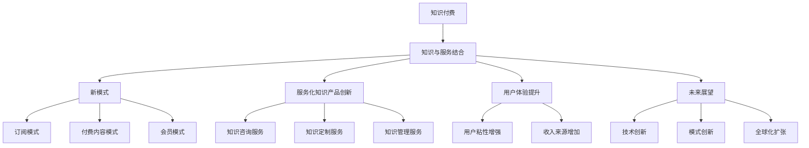

                 

### 第一部分：知识付费要探索知识与服务结合的新形态概述

#### 1.1 知识付费的背景与发展

**知识付费的概念与起源**

知识付费，即知识服务付费，是指知识生产者或机构通过互联网平台，向消费者提供有价值的信息、技能或知识，消费者为此支付相应的费用。这一概念起源于20世纪90年代，随着互联网的普及和数字化内容的迅速增长，知识付费逐渐成为可能。

在早期，知识付费主要存在于专业领域，如法律咨询、医疗咨询等。随着互联网技术的发展，特别是在移动互联网时代，知识付费逐渐渗透到各个领域，包括教育、娱乐、职业培训等。

**知识付费的市场现状**

当前，知识付费市场呈现出快速增长的趋势。根据相关数据显示，2019年全球知识付费市场规模已超过1000亿美元，预计到2025年将突破2000亿美元。其中，在线教育、内容付费和职业培训是知识付费市场的主要组成部分。

在线教育方面，以 Coursera、Udemy、网易云课堂等为代表的在线教育平台，通过提供高质量的在线课程，吸引了大量用户。内容付费方面，以喜马拉雅、得到、知乎Live等为代表的平台，通过音频、视频、文章等形式，向用户提供了丰富的知识内容。职业培训方面，以LinkedIn Learning、职梦等为代表的平台，通过提供专业技能培训，帮助用户提升职业能力。

**知识付费的发展趋势**

未来，知识付费市场将呈现以下几个发展趋势：

1. **个性化服务**：随着人工智能和大数据技术的应用，知识付费平台将更加注重个性化服务，根据用户的需求和偏好，提供定制化的知识内容。

2. **多元化内容形式**：除了传统的图文、音频、视频形式外，知识付费内容还将出现更多的创新形式，如虚拟现实（VR）、增强现实（AR）等。

3. **跨界合作**：知识付费将与其他领域如娱乐、游戏等实现跨界合作，创造出新的知识付费产品和服务。

4. **全球化扩张**：随着国内知识付费市场的成熟，知识付费平台将加大对海外市场的开拓力度，实现全球化扩张。

#### 1.2 知识与服务结合的重要性

**知识与服务结合的定义**

知识与服务结合，是指将传统的知识产品与服务相结合，为用户提供更加全面和深入的服务体验。这种模式不仅包括知识的传授，还包括对用户需求的诊断、问题的解决和服务的持续跟进。

**知识与服务结合的优势**

1. **提升用户体验**：知识与服务结合能够更好地满足用户需求，提供个性化、定制化的服务，从而提升用户体验。

2. **增强用户粘性**：通过提供持续的服务，知识付费平台可以增强用户对平台的依赖和忠诚度，提高用户的留存率。

3. **增加收入来源**：知识与服务结合可以创造出新的收入来源，如咨询服务、会员服务等，从而增加平台的盈利能力。

**知识与服务结合的挑战**

1. **服务质量的保障**：知识与服务结合要求提供高质量的服务，这对平台的服务能力和管理水平提出了更高的要求。

2. **成本控制**：提供高质量的服务往往意味着更高的成本投入，如何实现成本控制是平台面临的一大挑战。

3. **用户需求的多样化**：用户需求的多样化使得平台需要不断调整和优化服务内容，以适应不同用户的需求。

#### 1.3 新形态的探索与实践

**知识付费平台的新模式**

知识付费平台的新模式主要包括以下几个方面：

1. **订阅模式**：用户通过支付订阅费用，获得平台提供的所有知识内容和服务。这种模式有利于用户长期使用，增加平台收入。

2. **付费内容模式**：用户针对感兴趣的知识内容支付费用，如付费课程、付费专栏等。这种模式适合用户有特定需求的情况。

3. **会员模式**：用户支付会员费用，获得平台提供的额外服务，如优先服务、专属内容等。这种模式可以提升用户对平台的忠诚度。

**服务化知识的产品创新**

服务化知识的产品创新主要体现在以下几个方面：

1. **知识咨询服务**：平台提供专业领域的咨询服务，如法律咨询、医疗咨询等，用户可以在线咨询专家，获得专业的解决方案。

2. **知识定制服务**：平台根据用户需求，提供定制化的知识内容和服务，如定制课程、定制报告等。

3. **知识管理服务**：平台为企业提供知识管理体系建设、知识管理培训等服务，帮助企业提升知识管理水平。

**知识与服务结合的未来展望**

知识与服务结合的新形态具有广阔的发展前景。未来，知识付费平台将更加注重用户体验和服务质量，通过技术创新和模式创新，提供更加多样化、个性化的服务。同时，随着市场的不断成熟，知识付费平台将实现全球化扩张，为全球用户提供优质的知识服务。

#### 核心概念与联系

知识付费的概念与知识与服务结合有着密切的联系。知识付费是知识服务的一种形式，它将知识产品化，通过付费的方式实现知识的传播和价值转化。而知识与服务结合则是在知识付费的基础上，将知识与服务深度融合，为用户提供更加全面和深入的服务体验。

知识付费的核心是知识的价值转化，而知识与服务结合的核心是用户需求的满足。通过知识与服务结合，知识付费平台可以更好地满足用户需求，提供个性化、定制化的服务，从而提升用户体验和平台的竞争力。

知识付费平台的新模式和服务化知识的产品创新，都是在知识与服务结合的框架下进行的探索和实践。这些新模式和创新产品不仅为知识付费平台带来了新的收入来源，也促进了知识服务市场的健康发展。

#### Mermaid 流程图

通过上述流程图，我们可以清晰地看到知识付费与知识与服务结合之间的联系，以及知识与服务结合在不同方面的探索和实践。

### 第一部分：知识付费要探索知识与服务结合的新形态概述（续）

#### 1.4 知识付费平台的发展历程

知识付费平台的发展历程可以分为三个阶段：

**1.1 1.0时代：内容分发**

在1.0时代，知识付费平台主要提供内容分发服务。平台通过整合各种知识内容，如课程、书籍、音频、视频等，向用户免费或收费提供这些内容。这一阶段的代表平台有Coursera、Udemy等。这些平台的主要盈利模式是向内容创作者收取费用，通过平台流量和用户数来吸引创作者入驻，从而形成内容生态。

**1.1 2.0时代：个性化推荐**

在2.0时代，知识付费平台开始引入个性化推荐算法，根据用户的行为数据和偏好，为用户推荐感兴趣的知识内容。这一阶段的代表平台有网易云课堂、知乎Live等。个性化推荐不仅提高了用户体验，还显著提升了知识内容的转化率。同时，平台开始探索多种盈利模式，如订阅会员、付费课程、付费问答等。

**1.1 3.0时代：知识与服务结合**

在3.0时代，知识付费平台将知识与服务深度融合，提供更加全面和深入的服务。这一阶段的代表平台有得到、喜马拉雅等。这些平台不仅提供知识内容，还提供咨询、定制服务、社区互动等多种服务形式，从而实现用户需求的全面满足。

#### 1.5 知识付费平台的优势与挑战

**知识付费平台的优势**

1. **多元化的知识内容**：知识付费平台汇集了众多领域的知识内容，用户可以在这里找到自己感兴趣的知识领域。

2. **个性化推荐**：通过大数据和人工智能技术，知识付费平台能够为用户推荐个性化的知识内容，提高用户体验。

3. **便捷的支付方式**：知识付费平台提供了多种支付方式，如信用卡、支付宝、微信支付等，方便用户完成支付。

4. **社区互动**：知识付费平台通常设有社区功能，用户可以在社区中交流心得、提问解答，增强互动体验。

**知识付费平台的挑战**

1. **内容质量保证**：知识付费平台需要确保提供高质量的知识内容，以满足用户的需求。

2. **用户粘性提升**：如何提高用户粘性，增加用户留存率，是知识付费平台面临的一大挑战。

3. **盈利模式多样化**：知识付费平台需要不断创新盈利模式，以实现可持续发展。

4. **市场竞争**：随着知识付费市场的逐渐成熟，市场竞争日益激烈，知识付费平台需要不断提升自身竞争力。

#### 1.6 知识付费平台的发展趋势

未来，知识付费平台将呈现出以下发展趋势：

1. **内容多元化**：知识付费平台将提供更多元化的知识内容，满足用户多样化的需求。

2. **技术融合**：知识付费平台将深度融合人工智能、大数据、区块链等新技术，提高服务质量和用户体验。

3. **国际化发展**：知识付费平台将加大国际化发展的力度，开拓海外市场。

4. **服务升级**：知识付费平台将不断升级服务，提供更加个性化、定制化的服务。

5. **跨界合作**：知识付费平台将与其他行业进行跨界合作，创造出新的商业模式。

### 总结

知识付费要探索知识与服务结合的新形态，是为了更好地满足用户需求，提升用户体验，增加平台盈利能力。通过分析知识付费的背景与发展、知识与服务结合的重要性、新形态的探索与实践，我们可以看到知识付费平台在多元化内容、个性化推荐、便捷支付、社区互动等方面具有显著优势。同时，知识付费平台也面临内容质量保证、用户粘性提升、盈利模式多样化、市场竞争等挑战。未来，知识付费平台将在技术融合、国际化发展、服务升级、跨界合作等方面继续探索创新，为用户带来更加丰富和优质的知识服务。

### 第一部分：知识付费要探索知识与服务结合的新形态概述（续）

#### 1.7 知识付费平台的核心功能与用户体验优化

**知识付费平台的核心功能**

知识付费平台的核心功能包括知识内容管理、用户管理、支付系统、推荐系统和社区互动等。

1. **知识内容管理**：知识付费平台需要提供丰富的知识内容，包括课程、书籍、音频、视频等多种形式。内容管理功能包括内容的上传、分类、推荐、更新等。

2. **用户管理**：用户管理功能包括用户注册、登录、个人信息管理、权限管理、会员管理、用户行为分析等。

3. **支付系统**：支付系统是知识付费平台的重要组成部分，需要提供安全、便捷的支付方式，包括信用卡、支付宝、微信支付等。

4. **推荐系统**：推荐系统基于用户的行为数据和偏好，为用户推荐感兴趣的知识内容，提高用户体验和内容转化率。

5. **社区互动**：社区互动功能包括用户交流、问答、评论、分享等，增强用户参与度和平台粘性。

**用户体验优化**

用户体验优化是知识付费平台发展的关键。以下是一些优化策略：

1. **界面设计**：界面设计应简洁明了，易于操作，提高用户使用的便捷性。

2. **内容推荐**：通过个性化推荐算法，提高知识内容的推荐准确性，满足用户的个性化需求。

3. **个性化服务**：根据用户行为数据和偏好，提供个性化的服务，如定制课程、专属内容等。

4. **社区互动**：活跃社区氛围，鼓励用户参与互动，提高用户满意度和粘性。

5. **快速响应**：及时响应用户的反馈和问题，提高用户满意度。

**用户留存策略**

1. **高质量内容**：提供高质量的知识内容，满足用户需求，提高用户留存率。

2. **个性化推荐**：通过个性化推荐算法，提高知识内容的推荐准确性，增加用户活跃度。

3. **会员服务**：提供会员服务，如专属内容、优先服务、折扣优惠等，增强用户忠诚度。

4. **社区互动**：鼓励用户参与社区互动，提高用户满意度和粘性。

5. **活动促销**：定期举办活动，如限时优惠、抽奖活动等，吸引更多用户参与。

#### 1.8 知识付费平台的市场定位与竞争策略

**市场定位**

知识付费平台需要明确自身的市场定位，以满足特定用户群体的需求。市场定位可以从以下方面进行：

1. **目标用户群体**：明确目标用户群体，如职场人士、学生、创业者等。

2. **内容领域**：聚焦特定领域，如编程、设计、市场营销等。

3. **服务模式**：确定服务模式，如订阅模式、付费内容模式、会员模式等。

4. **品牌形象**：塑造独特的品牌形象，提高品牌知名度和用户认可度。

**竞争策略**

在激烈的市场竞争中，知识付费平台需要制定有效的竞争策略，以脱颖而出。以下是一些竞争策略：

1. **内容差异化**：提供独特、高质量的知识内容，与其他平台形成差异化竞争。

2. **技术创新**：引入先进技术，如人工智能、大数据等，提升平台服务质量和用户体验。

3. **用户互动**：通过社区互动、问答功能等，增强用户参与度和满意度。

4. **品牌推广**：通过线上线下活动、广告投放等，提高品牌知名度和用户认知度。

5. **合作伙伴**：与知名机构、专家等建立合作关系，提升平台的专业度和权威性。

#### 1.9 知识付费平台的发展前景与挑战

**发展前景**

1. **市场规模扩大**：随着互联网普及和用户对知识需求的增长，知识付费市场将继续扩大。

2. **技术进步**：人工智能、大数据、区块链等技术的进步，将推动知识付费平台的服务质量和用户体验提升。

3. **国际化发展**：知识付费平台将逐步走向国际化，开拓海外市场。

4. **跨界合作**：知识付费平台将与教育、娱乐、游戏等行业进行跨界合作，创造新的商业模式。

**挑战**

1. **内容质量保证**：提供高质量的知识内容是知识付费平台发展的关键，但如何保证内容质量是一个挑战。

2. **用户留存**：如何提高用户留存率，增加用户活跃度，是知识付费平台需要面对的挑战。

3. **盈利模式创新**：如何不断创新盈利模式，实现可持续发展，是知识付费平台面临的挑战。

4. **市场竞争**：随着市场竞争的加剧，知识付费平台需要不断提升自身竞争力。

### 总结

知识付费要探索知识与服务结合的新形态，是为了更好地满足用户需求，提升用户体验，增加平台盈利能力。通过对知识付费平台的背景与发展、知识与服务结合的重要性、新形态的探索与实践等方面的分析，我们可以看到知识付费平台在核心功能、用户体验优化、市场定位与竞争策略等方面的重要作用。未来，知识付费平台将在技术创新、国际化发展、跨界合作等方面继续探索，为用户带来更加丰富和优质的知识服务。

### 第一部分：知识付费要探索知识与服务结合的新形态概述（续）

#### 1.10 知识付费平台的技术支持与生态系统建设

**技术支持**

知识付费平台的技术支持是确保平台稳定运行和提升用户体验的关键。以下是一些关键技术支持：

1. **云计算与大数据**：云计算提供了弹性、高效、安全的计算和存储资源，大数据技术则支持海量数据的处理和分析，为知识付费平台的运营提供强有力的技术保障。

2. **人工智能与机器学习**：人工智能技术，特别是机器学习算法，可以用于个性化推荐、用户行为分析、风险控制等方面，提升平台的智能化水平。

3. **区块链技术**：区块链技术可以提高知识付费平台的数据安全性和透明度，确保交易的可追溯性和不可篡改性。

4. **网络安全**：网络安全技术确保用户数据的安全，防止数据泄露和网络攻击，维护平台的安全稳定运行。

**生态系统建设**

知识付费平台的生态系统建设是其长期发展的基础。以下是一些生态系统建设的策略：

1. **内容生态**：构建丰富、多样、高质量的内容生态，包括原创内容、精选内容、用户生成内容等，满足不同用户的需求。

2. **用户生态**：建立活跃、健康的用户生态系统，通过社区互动、用户评价、用户成长体系等，提升用户的参与度和满意度。

3. **合作伙伴生态**：与教育机构、出版社、内容创作者等建立合作关系，共同构建知识付费平台的生态系统。

4. **技术生态**：搭建技术团队，引入先进技术，持续创新，提升平台的竞争力。

**案例分析**

以网易云课堂为例，该平台在技术支持和生态系统建设方面进行了有益的探索：

1. **技术支持**：网易云课堂利用云计算和大数据技术，提供稳定、高效的服务。同时，采用人工智能和机器学习算法，实现个性化推荐和用户行为分析。

2. **内容生态**：网易云课堂汇集了大量优质课程，包括编程、数据科学、人工智能等热门领域，满足用户多样化的学习需求。

3. **用户生态**：网易云课堂建立了活跃的社区，用户可以在此交流学习心得、提问解答，提升用户体验。

4. **合作伙伴生态**：网易云课堂与多家知名高校、科研机构、企业合作，共同构建知识付费平台的生态系统。

通过技术支持和生态系统建设，知识付费平台可以不断提升服务质量和用户体验，为用户带来更加丰富和优质的知识服务。未来，知识付费平台将在技术支持和生态系统建设方面持续投入，推动行业的健康发展。

### 总结

知识付费要探索知识与服务结合的新形态，是为了更好地满足用户需求，提升用户体验，增加平台盈利能力。通过对知识付费平台的背景与发展、知识与服务结合的重要性、新形态的探索与实践等方面的分析，我们可以看到知识付费平台在核心功能、用户体验优化、市场定位与竞争策略、技术支持与生态系统建设等方面的重要作用。未来，知识付费平台将在技术创新、国际化发展、跨界合作等方面继续探索，为用户带来更加丰富和优质的知识服务。知识付费平台的技术支持和生态系统建设，是实现知识与服务结合的关键，也是提升平台竞争力的关键因素。通过技术支持和生态系统建设，知识付费平台可以不断提升服务质量和用户体验，为用户带来更加丰富和优质的知识服务。

### 第二部分：知识与服务结合的原理与框架

#### 2.1 知识经济的概念与发展

**知识经济的定义与特征**

知识经济是一种以知识和信息为主要生产要素的经济形态。与传统经济相比，知识经济具有以下特征：

1. **知识成为核心资源**：在知识经济中，知识是最重要的生产要素，知识的创造、传播和应用成为经济增长的主要动力。

2. **创新驱动**：知识经济以创新为核心，通过不断的技术创新、制度创新和管理创新，推动经济发展。

3. **信息化和数字化**：知识经济高度依赖信息技术，信息化和数字化成为知识经济的主要特征。

4. **全球化和网络化**：知识经济是全球化和网络化的经济，信息流动迅速，跨地域、跨行业、跨文化的合作日益频繁。

**知识经济的发展历程**

知识经济起源于20世纪80年代，随着信息技术的发展，特别是互联网的普及，知识经济逐渐崛起。以下是知识经济发展的重要阶段：

1. **知识经济的萌芽阶段（1980年代）**：在这一阶段，信息技术开始应用于经济活动，知识经济的雏形出现。

2. **知识经济的确立阶段（1990年代）**：在这一阶段，知识经济的概念被广泛接受，知识经济成为全球经济的重要组成部分。

3. **知识经济的成熟阶段（2000年代至今）**：在这一阶段，知识经济成为主导经济，对全球经济增长的贡献越来越大。

**知识经济对我国的影响**

知识经济对我国经济发展产生了深远的影响，主要表现在以下几个方面：

1. **推动经济结构升级**：知识经济促进了我国经济结构的优化和升级，传统产业逐步向高附加值、高技术含量的产业转变。

2. **提高创新能力**：知识经济推动了我国创新能力的提升，科技创新成为经济增长的重要动力。

3. **促进就业**：知识经济创造了大量高技能、高收入的就业机会，提高了就业质量和人民生活水平。

4. **提升国际竞争力**：知识经济提高了我国企业的国际竞争力，促进了我国经济全球化进程。

#### 2.2 服务经济的定义与特征

**服务经济的概念与起源**

服务经济是指以提供服务为主要内容的经济形态。与传统制造业相比，服务经济具有以下特点：

1. **无形性**：服务经济提供的产品和服务是无形的，无法触摸或存储。

2. **异质性**：服务产品的质量往往依赖于服务提供者的个人技能和态度，因此具有较大的异质性。

3. **不可分割性**：服务通常在生产的同时被消费，消费者与服务提供者之间存在紧密的互动。

4. **可存储性差**：服务通常无法像实体产品那样存储，一旦服务发生，即被视为消费。

服务经济的起源可以追溯到20世纪中叶，随着城市化进程的加快和人们生活水平的提高，服务业逐渐成为经济增长的重要驱动力。

**服务经济的特征**

1. **生产与消费的同步性**：服务通常在生产的同时被消费，消费者与服务提供者之间的互动对服务质量和用户体验至关重要。

2. **高附加值**：服务业往往具有较高的附加值，能够创造更多的就业机会和经济增长。

3. **灵活性**：服务业具有高度灵活性，可以根据市场需求和用户需求灵活调整服务内容和服务形式。

4. **国际化**：随着全球化的深入，服务业的国际化程度不断提高，跨国服务贸易日益繁荣。

**服务经济对我国的影响**

1. **推动服务业发展**：服务经济促进了我国服务业的发展，服务业已成为我国经济增长的重要引擎。

2. **提升居民生活水平**：服务经济提供了丰富多样的服务产品，提高了居民的生活质量和幸福感。

3. **优化产业结构**：服务经济有助于我国经济结构的优化，推动产业向高附加值、高技术含量的方向转型。

4. **促进就业**：服务经济创造了大量就业机会，缓解了就业压力，提高了人民收入水平。

#### 2.3 知识与服务结合的理论基础

**知识与服务结合的定义**

知识与服务结合是指将知识资源与服务活动相结合，通过提供知识服务满足用户需求，实现知识的价值转化和经济增长。知识与服务结合具有以下特点：

1. **知识资源的核心地位**：在知识与服务结合中，知识资源是核心，知识的生产、传播和应用是服务活动的基础。

2. **服务的个性化和定制化**：知识与服务结合强调根据用户需求提供个性化的知识服务，满足用户的特定需求。

3. **知识服务的高价值性**：知识服务具有高附加值，能够为用户创造更大的价值。

**知识与服务结合的理论框架**

知识与服务结合的理论框架主要包括以下几个方面：

1. **知识价值链**：知识价值链是指知识从产生、传播到应用的全过程。知识价值链的各个环节都需要服务活动来支持和推动。

2. **知识服务系统**：知识服务系统是指为用户提供知识服务的整体系统，包括知识资源的收集、处理、存储、传播和应用等环节。

3. **知识服务模式**：知识服务模式是指知识服务的具体实现方式，包括知识付费、知识共享、知识众筹等。

**知识与服务结合的优势**

1. **提升知识价值**：知识与服务结合能够将知识转化为实际的服务产品，提升知识的价值。

2. **满足用户需求**：知识与服务结合能够更好地满足用户需求，提供个性化的知识服务。

3. **促进知识传播**：知识与服务结合有助于知识的传播和共享，促进知识的扩散和应用。

4. **推动经济增长**：知识与服务结合是推动经济增长的重要动力，有助于提高经济增长的质量和效益。

**知识与服务结合的挑战**

1. **知识资源的获取与管理**：知识资源的获取和管理是知识与服务结合的重要挑战，需要建立有效的知识管理体系。

2. **服务质量保障**：知识与服务结合要求提供高质量的服务，这对平台的服务能力和管理水平提出了更高的要求。

3. **成本控制**：提供高质量的服务往往意味着更高的成本投入，如何实现成本控制是平台面临的一大挑战。

4. **用户需求多样化**：用户需求的多样化使得平台需要不断调整和优化服务内容，以适应不同用户的需求。

#### 2.4 知识与服务结合的商业模式与盈利模式

**知识与服务结合的商业模式**

知识与服务结合的商业模式主要包括以下几个方面：

1. **知识付费模式**：用户通过支付费用获取知识服务，如在线课程、付费专栏等。

2. **知识共享模式**：用户共享自己的知识资源，平台通过提供平台和技术支持获取收益。

3. **知识众筹模式**：用户通过众筹方式支持知识项目，平台通过项目成功后获取收益。

**知识与服务结合的盈利模式**

知识与服务结合的盈利模式主要包括以下几个方面：

1. **直接盈利模式**：平台通过知识付费、广告收入、会员费等直接盈利。

2. **间接盈利模式**：平台通过增值服务、电商平台等间接盈利。

3. **生态盈利模式**：平台通过构建知识服务生态系统，实现生态内的多种盈利模式。

#### 2.5 知识与服务结合的发展趋势

**人工智能与大数据的深度融合**

随着人工智能和大数据技术的发展，知识与服务结合将更加智能化和个性化。人工智能技术将用于知识推荐、用户行为分析、服务优化等方面，提升知识服务的质量和用户体验。

**区块链技术在知识服务中的应用**

区块链技术将为知识与服务结合提供安全、透明、可追溯的信任机制。在知识服务领域，区块链可以应用于知识付费、知识产权保护、数字身份认证等场景，提高知识服务的可信度和用户体验。

**虚拟现实与增强现实对知识服务的影响**

虚拟现实和增强现实技术将使知识服务更加生动、直观和互动。用户可以通过VR/AR技术体验沉浸式的知识学习环境，提高知识学习的趣味性和效果。

**知识服务市场的国际化发展**

随着全球化的深入推进，知识服务市场将呈现国际化发展趋势。国内知识付费平台将加大对海外市场的开拓力度，提供全球范围内的知识服务。

**知识服务与企业运营的深度融合**

知识与服务结合将逐渐融入企业运营的各个环节，为企业提供全方位的知识支持。企业可以通过知识付费、知识共享等方式获取外部知识资源，提升企业竞争力。

**知识付费平台的技术创新**

知识付费平台将不断进行技术创新，通过人工智能、大数据、区块链等技术提升服务质量和用户体验。技术创新将成为知识付费平台竞争的关键因素。

**知识付费平台的社会责任**

知识付费平台在追求商业利益的同时，也将承担更多的社会责任。平台可以通过提供公益知识服务、支持教育公平等方式，为社会贡献力量。

**知识付费平台的人才培养**

知识付费平台将加强对人才队伍的培养，提高知识服务从业者的专业素养和创新能力。人才培养将成为知识付费平台可持续发展的重要保障。

#### 2.6 知识与服务结合的法律法规与伦理问题

**知识付费平台的法律法规**

知识付费平台在发展过程中，需要遵守一系列法律法规，包括著作权法、知识产权法、网络安全法、消费者权益保护法等。平台需要确保自身合法合规运营，保护用户权益，维护良好的市场秩序。

**知识服务的伦理问题**

知识服务的伦理问题主要包括以下几个方面：

1. **隐私保护**：知识付费平台需要保护用户隐私，不得非法收集、使用用户个人信息。

2. **知识产权保护**：知识付费平台需要尊重知识产权，不得侵犯他人著作权、商标权等。

3. **信息真实性**：知识付费平台需要确保知识服务信息的真实性、准确性和可靠性。

4. **用户权益保护**：知识付费平台需要公平对待用户，保护用户权益，不得滥用用户信息。

5. **社会责任**：知识付费平台需要承担社会责任，关注社会公益事业，促进知识公平传播。

**知识与服务结合的合规运营**

知识与服务结合的合规运营是知识付费平台发展的基础。平台需要建立健全的合规管理体系，包括合规审查、风险控制、合规培训等，确保平台合法合规运营。

#### 2.7 知识与服务结合的案例分析

**案例分析：网易云课堂**

网易云课堂是我国领先的知识付费平台之一，以下是对网易云课堂的案例分析：

**1. 商业模式**

网易云课堂的商业模式主要包括知识付费、广告收入、会员服务、企业培训等。平台提供丰富的在线课程，用户可以通过付费购买课程学习。同时，平台还提供广告投放服务，为企业提供宣传渠道。会员服务为企业用户提供专属课程和优惠价格。企业培训服务为企业提供定制化培训方案。

**2. 技术支持**

网易云课堂利用云计算、大数据、人工智能等技术，提供稳定、高效的服务。平台通过人工智能算法进行课程推荐，提高用户的学习体验。大数据分析用户行为，为企业提供精准营销和个性化推荐。

**3. 内容生态**

网易云课堂建立了丰富的内容生态，包括编程、数据科学、人工智能、市场营销等多个领域。平台与多家知名高校、研究机构合作，提供高质量的课程资源。

**4. 用户生态**

网易云课堂建立了活跃的用户社区，用户可以在社区中交流学习心得、提问解答。平台通过积分系统、等级制度等激励用户参与社区互动，提高用户满意度。

**5. 合作伙伴生态**

网易云课堂与多家知名机构、企业合作，共同构建知识服务生态系统。平台为企业提供定制化培训服务，为高校提供在线课程建设支持，推动知识服务在各个领域的应用。

**6. 合规运营**

网易云课堂严格遵守相关法律法规，确保合法合规运营。平台建立了完善的合规管理体系，包括合规审查、风险控制、用户隐私保护等，保障用户权益。

**7. 成效与影响**

网易云课堂在知识付费领域取得了显著成效，用户规模和收入持续增长。平台为我国知识付费市场的发展做出了积极贡献，推动了知识经济的繁荣。

**案例分析：得到**

得到是我国知名的知识付费平台，以下是对得到的案例分析：

**1. 商业模式**

得到的商业模式主要包括知识付费、广告收入、会员服务、内容合作等。平台提供高质量的音频、视频、文章等内容，用户可以通过付费购买或订阅获取。平台还与多家知名内容创作者合作，共同推出付费内容。

**2. 技术支持**

得到利用大数据、人工智能、区块链等技术，提供个性化推荐、内容定制、智能搜索等服务。平台通过人工智能算法分析用户行为，为用户推荐感兴趣的内容。区块链技术确保了知识服务的可信度和透明度。

**3. 内容生态**

得到建立了丰富的内容生态，包括商业、投资、科技、人文等多个领域。平台与众多知名专家、学者、企业家合作，提供高质量的内容资源。

**4. 用户生态**

得到建立了活跃的用户社区，用户可以在社区中交流心得、提问解答。平台通过积分系统、等级制度等激励用户参与社区互动，提高用户满意度。

**5. 合作伙伴生态**

得到与多家知名机构、企业合作，共同构建知识服务生态系统。平台为企业提供定制化培训服务，为高校提供在线课程建设支持，推动知识服务在各个领域的应用。

**6. 合规运营**

得到严格遵守相关法律法规，确保合法合规运营。平台建立了完善的合规管理体系，包括合规审查、风险控制、用户隐私保护等，保障用户权益。

**7. 成效与影响**

得到在知识付费领域取得了显著成效，用户规模和收入持续增长。平台为我国知识付费市场的发展做出了积极贡献，推动了知识经济的繁荣。

通过以上案例分析，我们可以看到知识与服务结合在商业模式、技术支持、内容生态、用户生态、合作伙伴生态、合规运营等方面的具体实践，以及其对知识付费市场的影响。知识与服务结合的新形态为知识付费平台的发展提供了新的机遇和挑战。未来，知识付费平台将在技术创新、商业模式创新、用户体验提升等方面不断探索，为用户带来更加丰富和优质的知识服务。

### 第二部分：知识与服务结合的原理与框架（续）

#### 2.8 知识与服务结合的技术手段

知识与服务结合需要利用多种技术手段来提高服务的质量和效率，以下是几种关键的技术手段：

**1. 数据分析技术**

数据分析技术是知识与服务结合的核心手段之一。通过分析用户行为数据、内容数据等，可以深入了解用户需求，优化服务策略。数据分析技术主要包括数据收集、数据预处理、数据挖掘、数据可视化等环节。

**2. 人工智能技术**

人工智能技术是推动知识与服务结合的重要力量。通过人工智能算法，可以实现知识推荐、智能客服、智能问答等功能。人工智能技术主要包括机器学习、深度学习、自然语言处理等。

**3. 大数据和云计算平台**

大数据和云计算平台为知识与服务结合提供了强大的基础设施支持。大数据技术可以处理海量数据，实现快速数据分析和处理。云计算平台提供了弹性、可靠、安全的服务，支持大规模的知识与服务结合应用。

**4. 区块链技术**

区块链技术可以为知识与服务结合提供安全、透明、可追溯的信任机制。区块链可以应用于知识付费、知识产权保护、数字身份认证等场景，提高知识服务的可信度和用户体验。

**5. 虚拟现实和增强现实技术**

虚拟现实和增强现实技术可以创造更加生动、直观的知识服务体验。通过VR/AR技术，用户可以沉浸式地学习知识，提高学习的趣味性和效果。

**6. 网络安全技术**

网络安全技术是确保知识与服务结合安全的重要手段。网络安全技术包括数据加密、访问控制、入侵检测等，可以防止数据泄露和网络攻击，保障用户数据安全。

**7. 物联网技术**

物联网技术可以将知识与服务结合到日常生活中的各个场景。通过物联网设备，用户可以随时随地获取所需的知识和服务，提高生活的便利性和舒适度。

**案例分析：网易云音乐的知识服务**

网易云音乐是我国知名的音乐平台，通过数据分析技术、人工智能技术和大数据技术，实现了知识与服务结合。以下是网易云音乐在知识服务方面的具体实践：

**1. 数据分析技术**

网易云音乐通过分析用户听歌行为、评论、分享等数据，了解用户偏好和需求。通过数据挖掘，平台可以为用户提供个性化的音乐推荐，提高用户体验。

**2. 人工智能技术**

网易云音乐利用人工智能技术，实现了智能问答、智能客服等功能。用户可以通过聊天机器人获取音乐相关知识和帮助，提高服务质量。

**3. 大数据和云计算平台**

网易云音乐拥有庞大的用户数据和音乐库，通过大数据技术和云计算平台，实现了高效的数据存储和处理。平台可以通过大数据分析，为用户推荐合适的音乐和内容。

**4. 虚拟现实和增强现实技术**

网易云音乐在虚拟现实和增强现实技术方面进行了探索。用户可以通过VR/AR设备，体验沉浸式的音乐现场，提高音乐欣赏的趣味性。

**5. 网络安全技术**

网易云音乐高度重视用户数据安全，采用了多种网络安全技术，确保用户数据的安全性和隐私保护。

通过上述技术手段，网易云音乐为用户提供了丰富多样的知识服务，提升了用户满意度和平台竞争力。

### 第二部分：知识与服务结合的原理与框架（续）

#### 2.9 知识与服务结合的商业模式

知识与服务结合的商业模式是指知识付费平台通过何种方式为用户创造价值，并实现自身的盈利。以下是一些常见的商业模式：

**1. 内容付费模式**

内容付费模式是知识付费平台最传统的商业模式。用户通过购买课程、专栏、电子书等形式的知识产品，来满足自己的学习需求。平台通过销售知识产品获取收益。

**2. 订阅模式**

订阅模式是指用户通过支付订阅费用，获得平台提供的所有知识内容和服务。订阅模式有利于用户长期使用平台，增加平台收入。平台可以通过提供优质的内容和服务，吸引和留住用户。

**3. 会员模式**

会员模式是指用户支付会员费用，获得平台提供的额外服务，如专属内容、优先服务、折扣优惠等。会员模式可以提升用户对平台的忠诚度，增加平台的收入来源。

**4. 付费问答模式**

付费问答模式是指用户在平台上向专家或专业人士提出问题，并支付相应费用获取解答。平台通过提供付费问答服务，为用户解决实际问题，实现知识变现。

**5. 知识共享模式**

知识共享模式是指用户将自己的知识或技能分享到平台上，平台通过广告收入或内容分成等方式获得收益。知识共享模式可以激发用户的创造力和积极性，丰富平台的内容资源。

**6. 知识众筹模式**

知识众筹模式是指用户通过众筹平台，筹集资金支持自己感兴趣的知识项目。平台通过提供众筹服务，帮助用户实现知识创新和创业。

**7. 联合办学模式**

联合办学模式是指知识付费平台与学校、培训机构等合作，共同开展在线教育项目。平台通过提供在线教育服务，获得收益并提高品牌影响力。

**案例分析：喜马拉雅FM的商业模式**

喜马拉雅FM是我国领先的知识付费平台之一，以下是对喜马拉雅FM商业模式的案例分析：

**1. 内容付费模式**

喜马拉雅FM通过销售音频课程、电子书、专栏等形式的知识产品，为用户提供多样化的学习内容。用户可以通过购买这些产品，满足自己的学习需求。

**2. 订阅模式**

喜马拉雅FM推出多种订阅套餐，用户可以通过支付订阅费用，获得平台提供的所有内容和服务。订阅模式吸引了大量用户长期使用平台，增加了平台的收入。

**3. 会员模式**

喜马拉雅FM的会员模式为用户提供了多种福利，如专属内容、优先服务、折扣优惠等。会员模式提升了用户对平台的忠诚度，增加了平台的收入来源。

**4. 付费问答模式**

喜马拉雅FM提供付费问答服务，用户可以向专业人士提出问题，并获得解答。平台通过提供付费问答服务，为用户解决实际问题，实现知识变现。

**5. 知识共享模式**

喜马拉雅FM鼓励用户分享自己的知识和经验，通过广告收入或内容分成等方式，为用户提供收益。知识共享模式丰富了平台的内容资源，激发了用户的创造力和积极性。

**6. 知识众筹模式**

喜马拉雅FM支持用户通过众筹平台筹集资金，支持自己感兴趣的知识项目。平台通过提供众筹服务，帮助用户实现知识创新和创业。

**7. 联合办学模式**

喜马拉雅FM与多家知名高校、培训机构合作，共同开展在线教育项目。平台通过提供在线教育服务，获得收益并提高品牌影响力。

通过多种商业模式的结合，喜马拉雅FM为用户提供了丰富多样的知识服务，实现了平台的发展和盈利。同时，喜马拉雅FM在商业模式创新方面也不断探索，为知识付费市场的发展做出了积极贡献。

### 第二部分：知识与服务结合的原理与框架（续）

#### 2.10 知识与服务结合的企业实践

知识与服务结合为企业提供了新的商业模式和运营策略，以下是一些企业在知识与服务结合方面的实践案例：

**1. 企业内部知识管理系统**

许多企业通过建立内部知识管理系统，将员工的知识和经验进行系统化管理和共享。知识管理系统可以帮助企业积累和传承知识，提高员工的工作效率和企业竞争力。

**2. 企业培训与人才培养**

企业通过提供内部培训课程和人才培养计划，帮助员工提升技能和知识水平。培训课程可以包括专业技能培训、领导力培训、跨部门交流等，以促进员工的全面发展。

**3. 知识服务外包**

一些企业将知识服务外包给专业的知识付费平台，以获取外部专业知识支持。这种模式可以帮助企业快速获得所需的知识和技能，提高运营效率。

**4. 知识分享社区**

企业建立知识分享社区，鼓励员工分享自己的知识和经验，促进知识传播和交流。知识分享社区可以采用线上论坛、内部社交媒体等形式，提高员工的互动和合作。

**5. 知识众筹与共创**

企业通过知识众筹和共创项目，激发员工的创新潜力，共同开发新产品或服务。知识众筹可以为企业筹集资金，共创项目可以促进员工跨部门合作，提高企业的创新能力。

**案例分析：华为的知识与服务结合实践**

华为作为全球领先的信息与通信技术（ICT）解决方案提供商，在知识与服务结合方面进行了深入的实践：

**1. 企业内部知识管理系统**

华为建立了全球领先的内部知识管理系统，通过文档管理、知识库、在线论坛等多种形式，实现知识的系统化管理和共享。知识管理系统帮助华为员工快速获取所需知识，提高工作效率。

**2. 企业培训与人才培养**

华为高度重视员工培训与人才培养，通过内部培训课程、外部培训合作、线上学习平台等多种方式，为员工提供全面的发展机会。华为还设有员工大学，为员工提供多样化的学习资源。

**3. 知识服务外包**

华为与多家专业的知识付费平台合作，获取外部专业知识支持。这种模式帮助华为在特定领域快速获得先进的技术和知识，提高企业的竞争力。

**4. 知识分享社区**

华为建立了内部知识分享社区，鼓励员工分享自己的知识和经验。社区采用线上论坛、内部社交媒体等形式，提高员工的互动和合作。

**5. 知识众筹与共创**

华为通过知识众筹和共创项目，激发员工的创新潜力。例如，华为的“沃土计划”就是通过众筹方式，鼓励员工共同开发新产品或服务，提高企业的创新能力。

通过知识与服务结合，华为实现了知识的高

