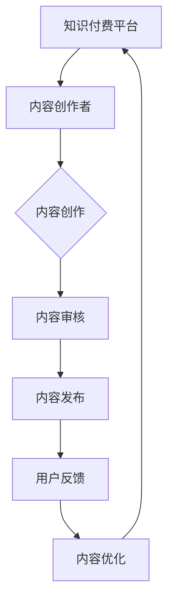
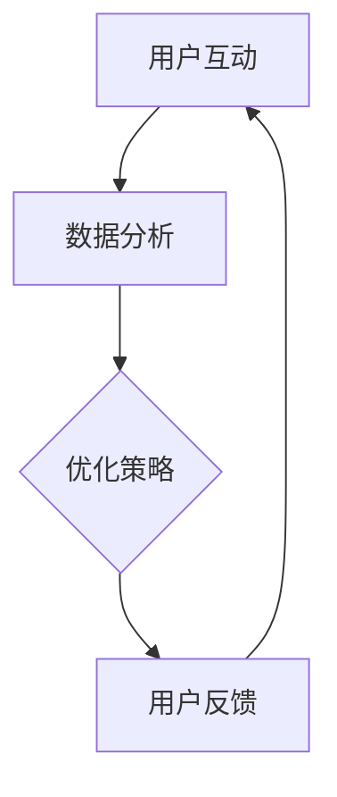

                 

# 《知识付费赚钱的内容生态建设策略》

## 概述

### 关键词：
- 知识付费
- 内容生态
- 赚钱策略
- 用户需求
- 内容质量
- 激励机制

### 摘要：
知识付费作为一种新型商业模式，已经在互联网经济中占据了一席之地。本文将探讨知识付费赚钱的内容生态建设策略，包括内容创作者的培养与激励、内容质量的评估与监控、用户需求的挖掘与满足、内容运营与推广策略，以及成功案例和实践指南。通过详细分析，帮助读者了解知识付费市场的运作机制，掌握建设内容生态的实战技巧。

### 目录大纲

#### 第一部分：知识付费概述

**第1章：知识付费的崛起**  
- 1.1 知识付费的定义与现状
- 1.2 知识付费的市场规模与趋势
- 1.3 知识付费的核心价值

**第2章：知识付费的平台生态**  
- 2.1 知识付费平台的发展历程
- 2.2 知识付费平台的主要模式
- 2.3 知识付费平台的竞争格局

#### 第二部分：内容生态建设策略

**第3章：内容创作者的培养与激励**  
- 3.1 内容创作者的分类
- 3.2 内容创作者的激励机制
- 3.3 内容创作者的培训与发展

**第4章：内容质量的评估与监控**  
- 4.1 内容质量的评估标准
- 4.2 内容质量的监控方法
- 4.3 提升内容质量的方法

**第5章：用户需求的挖掘与满足**  
- 5.1 用户需求的挖掘方法
- 5.2 用户需求的分类与优先级
- 5.3 用户需求的满足策略

**第6章：内容运营与推广策略**  
- 6.1 内容运营的策略与方法
- 6.2 内容推广的渠道与工具
- 6.3 内容运营的数据分析与优化

#### 第三部分：案例分析与实践指南

**第7章：成功知识付费案例分析**  
- 7.1 案例一：XX平台的成功经验
- 7.2 案例二：XX内容的崛起之路
- 7.3 案例三：XX平台的内容生态构建

**第8章：知识付费项目实施指南**  
- 8.1 项目策划与规划
- 8.2 项目执行与监控
- 8.3 项目评估与优化

#### 第四部分：未来展望与挑战

**第9章：知识付费的挑战与机遇**  
- 9.1 挑战一：内容同质化问题
- 9.2 挑战二：用户留存与流失问题
- 9.3 机遇一：知识付费市场的新趋势
- 9.4 机遇二：跨界合作与融合发展

**第10章：知识付费的发展趋势与未来**  
- 10.1 发展趋势一：个性化内容与智能推荐
- 10.2 发展趋势二：虚拟现实与增强现实
- 10.3 未来展望：知识付费的生态变革

#### 第五部分：知识付费运营与推广

**第11章：知识付费运营策略**  
- 11.1 运营目标与指标
- 11.2 运营流程与环节
- 11.3 运营团队的组建与培训

**第12章：知识付费推广渠道**  
- 12.1 社交媒体推广
- 12.2 广告投放
- 12.3 合作伙伴推广

**第13章：知识付费营销策略**  
- 13.1 用户增长策略
- 13.2 用户活跃度提升策略
- 13.3 用户忠诚度培养策略

**第14章：案例分析：知识付费运营与推广实战**  
- 14.1 案例一：XX平台的运营与推广策略
- 14.2 案例二：XX内容的成功推广方法
- 14.3 案例三：XX平台的用户增长经验

**第15章：知识付费运营与推广数据分析和优化**  
- 15.1 数据分析的重要性
- 15.2 运营数据指标
- 15.3 运营数据分析方法
- 15.4 运营数据优化策略

### Mermaid 流程图示例



### 核心算法原理讲解示例

## 第3章：内容创作者的培养与激励

### 3.1 内容创作者的分类

在知识付费平台中，内容创作者可以分为以下几类：

1. **专业创作者**：这类创作者通常具备专业的知识和技能，能够创作高质量的内容。他们可能是教师、专家、学者等。
   
   ```mermaid
   graph TD
       A[专业创作者] --> B[教师]
       B --> C[专家]
       C --> D[学者]
   ```

2. **业余创作者**：这类创作者可能是出于兴趣或爱好进行内容创作，他们的专业水平可能不如专业创作者，但内容具有独特的个人风格。
   
   ```mermaid
   graph TD
       E[业余创作者] --> F[兴趣爱好者]
       F --> G[个人博客主]
   ```

3. **团队创作者**：这类创作者是由多个成员组成的团队，他们分工合作，共同完成内容创作。
   
   ```mermaid
   graph TD
       H[团队创作者] --> I[编辑]
       I --> J[设计师]
       J --> K[技术支持]
   ```

### 3.2 内容创作者的激励机制

为了激励内容创作者，平台可以采取以下几种激励措施：

1. **收益分配**：平台可以通过分成机制，让内容创作者从平台获取收益。

   ```python
   # 伪代码：收益分配
   revenue = total_income - platform_fee
   creator_profit = revenue * creator_ratio
   ```

2. **荣誉奖励**：平台可以设立各类奖项，对优秀的创作者进行表彰。

   ```mermaid
   graph TD
       L[荣誉奖励] --> M[年度最佳创作者奖]
       M --> N[内容质量奖]
       N --> O[用户喜爱奖]
   ```

3. **培训与发展**：平台可以提供培训课程，帮助创作者提升专业能力。

   ```mermaid
   graph TD
       P[培训与发展] --> Q[专业知识培训]
       Q --> R[创作技巧培训]
       R --> S[平台操作培训]
   ```

### 3.3 内容创作者的培训与发展

内容创作者的培训与发展是提升内容质量的关键。平台可以从以下几个方面进行：

1. **专业知识培训**：针对不同领域的专业知识进行培训。

   ```mermaid
   graph TD
       T[专业知识培训] --> U[金融领域]
       U --> V[科技领域]
       V --> W[艺术领域]
   ```

2. **创作技巧培训**：教授内容创作的技巧和方法。

   ```mermaid
   graph TD
       X[创作技巧培训] --> Y[写作技巧]
       Y --> Z[视频剪辑]
   ```

3. **平台操作培训**：帮助创作者熟悉平台的使用。

   ```mermaid
   graph TD
       AA[平台操作培训] --> BB[内容上传]
       BB --> CC[用户互动]
       CC --> DD[数据分析]
   ```

### 伪代码示例

```python
# 伪代码：内容创作者分类

def classify_creator(creator):
    if is_professional(creator):
        return "专业创作者"
    elif is_part_time(creator):
        return "业余创作者"
    else:
        return "团队创作者"
```

### 数学模型和数学公式

#### 用户留存率模型

$$
R(t) = \frac{U(t)}{N} \times 100\%
$$

其中，$R(t)$ 为用户留存率，$U(t)$ 为在时间 $t$ 内留存的用户数，$N$ 为总用户数。

### 举例说明

假设在一个平台上，有1000个用户，在一个月内，有700个用户留存。则该平台的用户留存率为：

$$
R(t) = \frac{700}{1000} \times 100\% = 70\%
$$

### 项目实战

#### 代码实际案例

```python
# Python代码：用户留存率计算

users = 1000
retained_users = 700
user_retention_rate = (retained_users / users) * 100

print(f"用户留存率为：{user_retention_rate}%")
```

#### 代码解读与分析

这段代码首先定义了总用户数 `users` 和在一个月内留存的用户数 `retained_users`。然后，通过计算用户留存率公式，计算并打印出用户留存率。这个计算结果可以帮助平台了解用户的留存情况，从而进行相应的优化和调整。

### Mermaid 流程图示例



### 核心算法原理讲解示例

#### 用户活跃度模型

$$
A(t) = \frac{U(t)}{N} \times 100\%
$$

其中，$A(t)$ 为用户活跃度，$U(t)$ 为在时间 $t$ 内活跃的用户数，$N$ 为总用户数。

### 举例说明

假设在一个平台上，有1000个用户，在一个月内，有400个用户活跃。则该平台的用户活跃度为：

$$
A(t) = \frac{400}{1000} \times 100\% = 40\%
$$

### 项目实战

#### 代码实际案例

```python
# Python代码：用户活跃度计算

users = 1000
active_users = 400
user_activity_rate = (active_users / users) * 100

print(f"用户活跃度为：{user_activity_rate}%")
```

#### 代码解读与分析

这段代码首先定义了总用户数 `users` 和在一个月内活跃的用户数 `active_users`。然后，通过计算用户活跃度公式，计算并打印出用户活跃度。这个计算结果可以帮助平台了解用户的活跃情况，从而进行相应的优化和调整。

### 附录

**附录A：知识付费平台开发工具与资源**

A.1 常用知识付费平台开发工具

- **内容管理系统（CMS）**：WordPress、Joomla、Drupal等。
- **在线教育平台**：Moodle、Canvas、Blackboard等。
- **会员管理系统**：MemberMouse、S2Member、Restrict Content Pro等。

A.2 知识付费平台开发资源

- **开发文档**：平台官方开发文档、开源社区文档等。
- **技术博客**：技术博客、技术论坛、GitHub等。
- **在线课程**：在线编程课程、数据分析课程等。

A.3 知识付费平台开发教程与指南

- **基础教程**：HTML、CSS、JavaScript、PHP等。
- **进阶教程**：MySQL、Linux、Python等。
- **实战项目**：在线教育平台项目、会员管理系统项目等。

### 附录B：知识付费运营与推广技巧

B.1 运营目标与指标

- 用户增长：新增用户数、活跃用户数、用户留存率等。
- 内容质量：内容评分、用户反馈、内容推荐等。
- 社交媒体：粉丝数、互动率、转发量等。

B.2 运营流程与环节

- 内容策划：确定内容主题、目标用户、内容形式等。
- 内容创作：撰写、编辑、审核、发布内容。
- 用户互动：回复评论、解答疑问、用户调研等。
- 数据分析：分析用户行为、内容表现、运营效果等。

B.3 运营团队的组建与培训

- 团队成员：内容创作者、运营专员、技术支持等。
- 岗位职责：内容创作、用户管理、数据分析等。
- 培训内容：平台操作、内容创作、用户心理学等。

### 作者信息

**作者：AI天才研究院/AI Genius Institute & 禅与计算机程序设计艺术 /Zen And The Art of Computer Programming**

---

接下来，我们将深入探讨知识付费的崛起、平台生态的建设，以及如何通过有效的策略实现内容生态的盈利。让我们一步一步地分析推理，探索这个新兴市场的奥秘。

