                 

### 第一部分：知识付费赚钱的课程运营与用户服务概述

#### 第1章：知识付费赚钱概述

##### 1.1 知识付费的定义与市场趋势

知识付费是指用户通过支付一定费用来获取高质量的知识产品或服务。这种模式在近年来迅速崛起，成为互联网经济的重要组成部分。知识付费的起源可以追溯到 20 世纪末，随着互联网技术的发展和用户付费意识的提升，知识付费逐渐成为一种新的消费方式。

###### 1.1.1 知识付费的概念与起源

知识付费的概念源于传统教育模式和互联网经济的结合。在传统教育模式中，用户需要通过付费才能获得教育资源和知识服务。随着互联网的发展，这种模式得到了进一步拓展。用户可以通过在线平台购买课程、电子书、直播讲座等多种形式的知识产品。

###### 1.1.2 知识付费市场的崛起

近年来，知识付费市场呈现出快速增长的趋势。根据艾瑞咨询的报告，2018 年中国知识付费市场规模达到 492 亿元，同比增长 45.7%。这一数据表明，知识付费已经成为一个庞大的市场。

###### 1.1.3 知识付费的特点与价值

知识付费具有以下特点：

1. **个性化**：用户可以根据自己的需求和兴趣选择相应的知识产品。
2. **便捷性**：用户可以随时随地通过网络获取知识服务。
3. **高质量**：知识付费平台通常提供高质量的知识产品，满足用户的深度学习需求。

知识付费的价值在于：

1. **满足用户需求**：用户可以通过付费获取高质量的知识服务，提高个人素质和竞争力。
2. **推动知识传播**：知识付费平台为知识创造者提供了变现途径，激励更多优质内容的生产。
3. **促进经济发展**：知识付费作为一种新型商业模式，为数字经济的发展贡献力量。

##### 1.2 知识付费赚钱的商业模式

知识付费的商业模式多种多样，不同的模式适应不同的市场环境和用户需求。

###### 1.2.1 直播授课模式

直播授课模式是指通过直播平台进行在线教学，用户通过付费观看课程。这种模式的特点是实时互动性强，用户可以及时向讲师提问和互动。

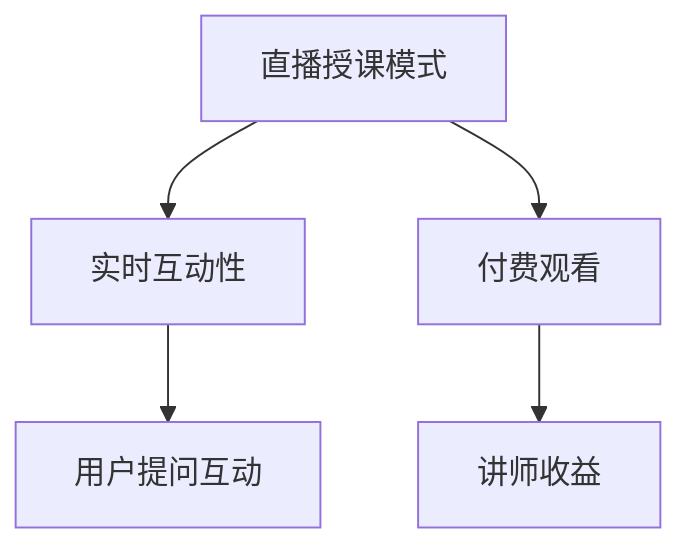

###### 1.2.2 在线课程平台模式

在线课程平台模式是指通过构建在线课程平台，用户可以购买和观看各种课程。这种模式的特点是内容丰富，用户可以根据自己的需求选择课程。

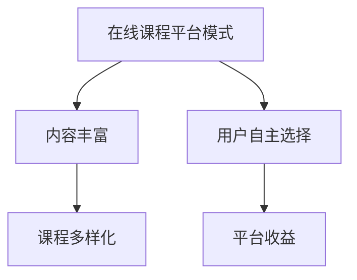

###### 1.2.3 专业课程定制模式

专业课程定制模式是指根据企业或个人的特定需求，定制个性化的课程。这种模式的特点是高度定制化，满足用户的特定需求。

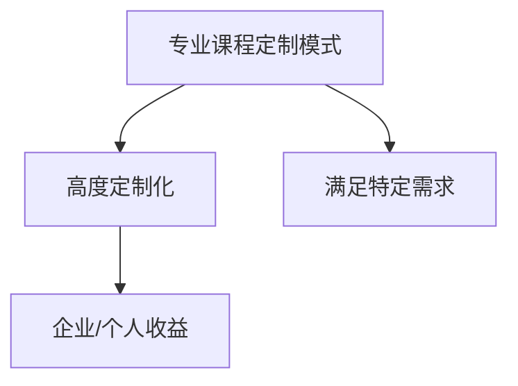

###### 1.2.4 其他盈利模式探讨

除了上述三种模式外，知识付费还有其他多种盈利模式，如：

1. **付费会员制**：用户通过付费成为会员，享受平台提供的各种特权和服务。
2. **知识星球**：类似于付费社区，用户可以在这里获取专业知识，与其他用户互动。
3. **知识付费咨询**：用户通过付费获得专业顾问的咨询服务。

##### 1.3 知识付费行业的发展机遇与挑战

知识付费行业的发展前景广阔，但也面临一些挑战。

###### 1.3.1 机遇：用户需求增长与市场潜力

随着社会的进步和人们对自我提升的需求不断增加，知识付费市场将继续扩大。尤其是在线教育领域，用户对高质量课程的需求日益增长。

###### 1.3.2 挑战：竞争加剧与内容同质化

知识付费行业的竞争日益激烈，同质化问题也日益突出。平台需要不断创新，提供高质量的内容和服务，才能在市场中脱颖而出。

### 总结

知识付费作为一种新兴的商业模式，具有巨大的市场潜力和发展前景。通过合理的课程运营和用户服务，平台可以实现可持续的盈利。然而，面对竞争和同质化挑战，平台需要不断创新和优化，以满足用户的需求，提高市场竞争力。

#### 第2章：课程内容设计与规划

##### 2.1 课程内容定位与目标人群

课程内容定位和目标人群分析是课程设计的重要环节，它直接影响到课程的市场接受度和用户满意度。

###### 2.1.1 如何确定课程内容方向

确定课程内容方向需要从以下几个方面进行考虑：

1. **市场调研**：通过市场调研了解用户的需求和兴趣点，确定潜在的市场需求。
2. **竞品分析**：分析同类课程的市场表现，了解竞争对手的优势和不足，找到市场空白点。
3. **自身优势**：根据自己的专业领域和资源优势，确定课程的内容和方向。

举例来说，如果某平台在人工智能领域有深厚的积累，那么可以考虑开发一门针对人工智能技术的在线课程。

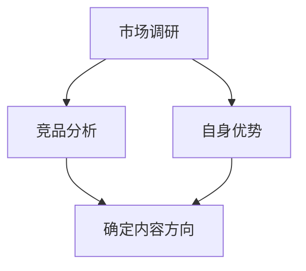

###### 2.1.2 目标人群分析与需求调研

目标人群分析是课程设计的关键，它决定了课程能否满足用户的需求。

1. **用户画像**：通过对用户的基本信息、兴趣偏好、学习习惯等进行分析，形成用户画像。
2. **需求调研**：通过问卷调查、用户访谈等方式，深入了解用户的学习需求和期望。

例如，针对目标人群为人工智能开发者，可以通过以下方式了解他们的需求：

- **问卷调查**：设计一份问卷，了解用户对人工智能技术的了解程度、学习目标、偏好等。
- **用户访谈**：与目标用户进行一对一访谈，深入了解他们的学习习惯和期望。

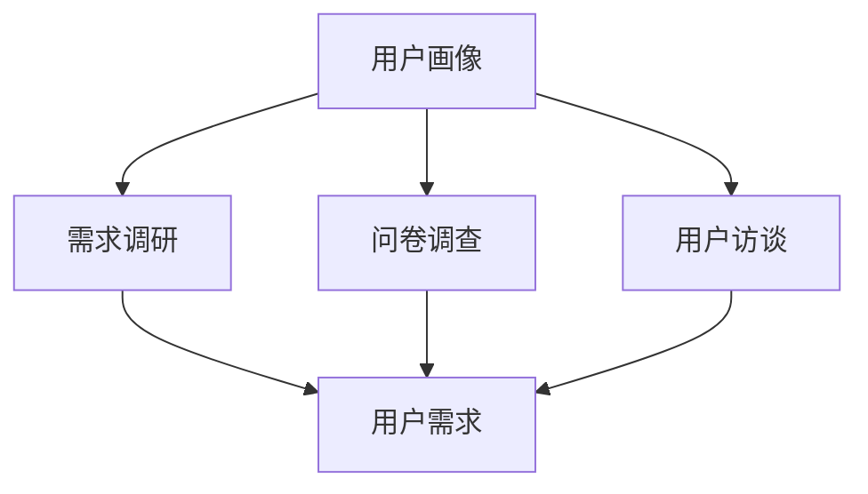

###### 2.1.3 课程内容体系构建

在确定了课程内容方向和目标人群后，需要构建一个完整的课程内容体系。

1. **课程模块划分**：根据课程主题，将课程内容划分为不同的模块，每个模块包含若干知识点。
2. **内容编排**：对每个模块的内容进行编排，确保逻辑清晰，易于用户理解。
3. **课程大纲**：制定详细的课程大纲，明确每个模块的内容和目标。

例如，针对人工智能开发者，课程内容体系可以划分为以下模块：

- **基础知识**：包括人工智能的基本概念、算法原理等。
- **技术实战**：包括深度学习、神经网络、自然语言处理等技术的实际应用。
- **案例分析**：通过真实案例，分析人工智能在各个领域的应用和挑战。

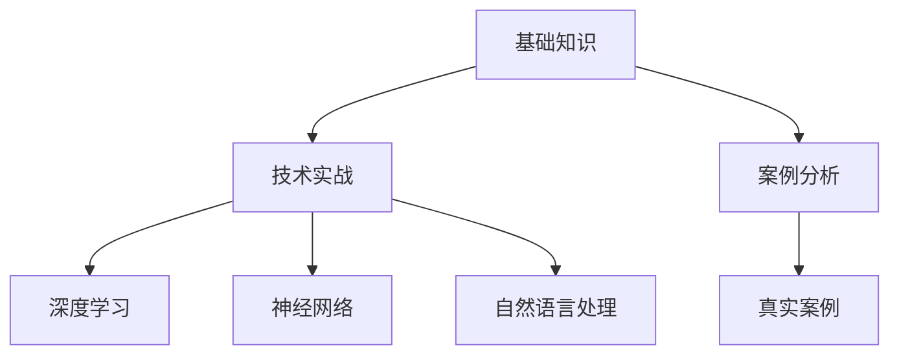

##### 2.2 课程体系建设与内容呈现

课程体系建设是确保课程质量的关键，而内容呈现方式则直接影响用户的学习体验。

###### 2.2.1 课程模块划分与内容编排

课程模块划分和内容编排需要遵循以下原则：

1. **逻辑性**：确保课程内容从基础知识到实战应用，逻辑清晰，易于用户理解。
2. **循序渐进**：根据用户的学习曲线，逐步深入，避免跳跃性知识点。
3. **实用性**：确保课程内容具有实际应用价值，能够帮助用户解决实际问题。

例如，针对人工智能开发者，课程模块划分和内容编排可以遵循以下原则：

- **基础知识**：首先介绍人工智能的基本概念和算法原理，让用户建立基本的知识框架。
- **技术实战**：接着通过具体案例，讲解深度学习、神经网络、自然语言处理等技术的实际应用。
- **案例分析**：最后通过真实案例，分析人工智能在各个领域的应用和挑战。


###### 2.2.2 课程内容呈现形式选择

课程内容呈现形式多种多样，选择合适的呈现形式可以提高用户的学习效果。

1. **视频课程**：通过视频讲解，让用户更直观地理解知识点。
2. **图文教程**：通过图文结合的方式，详细解释知识点，便于用户查阅和复习。
3. **互动练习**：通过在线练习，让用户在实践中掌握知识点。

例如，针对人工智能开发者，课程内容呈现形式可以选择：

- **视频课程**：讲解深度学习、神经网络等技术的原理和应用。
- **图文教程**：提供详细的算法实现和代码示例，帮助用户理解技术细节。
- **互动练习**：设计在线练习题，检验用户的学习效果。

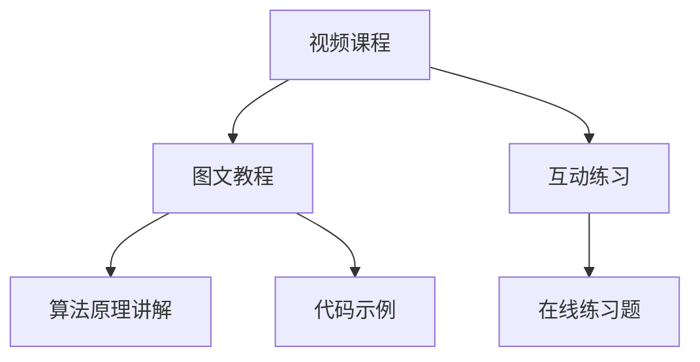

###### 2.2.3 课程质量保障与评估

课程质量是知识付费的核心，保障课程质量需要从以下几个方面进行：

1. **讲师资质**：确保讲师具备相关领域的专业知识和授课经验。
2. **课程内容**：对课程内容进行审核，确保知识的准确性和实用性。
3. **用户反馈**：收集用户反馈，对课程进行持续改进。

例如，针对人工智能开发者的课程，可以从以下几个方面进行质量保障：

- **讲师资质**：讲师需具备硕士及以上学历，5 年以上人工智能行业工作经验。
- **课程内容**：课程内容需经过专家审核，确保知识的准确性和实用性。
- **用户反馈**：通过用户评价和问卷调查，了解用户的学习效果和满意度，对课程进行持续改进。

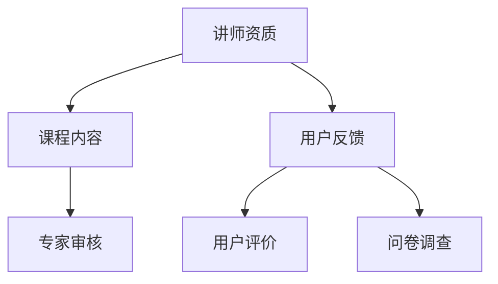

##### 2.3 课程更新与迭代

课程更新与迭代是保持课程质量和竞争力的关键。以下是一些课程更新与迭代的方法：

1. **定期更新**：根据用户需求和行业动态，定期更新课程内容。
2. **用户反馈**：收集用户反馈，对课程进行改进。
3. **行业动态**：关注行业动态，及时更新课程内容。

例如，针对人工智能开发者的课程，可以采取以下更新与迭代方法：

- **定期更新**：每季度更新一次课程内容，引入最新的技术和案例。
- **用户反馈**：通过问卷调查和用户评价，了解用户的需求和意见，对课程进行改进。
- **行业动态**：关注人工智能领域的最新动态，及时更新课程内容。


##### 2.4 用户需求与课程设计的匹配

课程设计需要紧密围绕用户需求，确保课程内容能够满足用户的学习需求。以下是一些实现用户需求与课程设计匹配的方法：

1. **需求分析**：通过市场调研和用户访谈，深入了解用户的需求。
2. **需求优先级**：根据用户需求的重要性，确定课程设计的优先级。
3. **迭代优化**：根据用户反馈，不断优化课程内容，提高用户满意度。

例如，针对人工智能开发者的课程，可以采取以下方法实现用户需求与课程设计的匹配：

- **需求分析**：通过市场调研和用户访谈，了解用户对人工智能技术的需求，包括基础知识、技术实战和案例分析等。
- **需求优先级**：根据用户需求的重要性，确定课程设计的优先级，确保重点内容得到充分覆盖。
- **迭代优化**：根据用户反馈，不断优化课程内容，提高用户满意度。

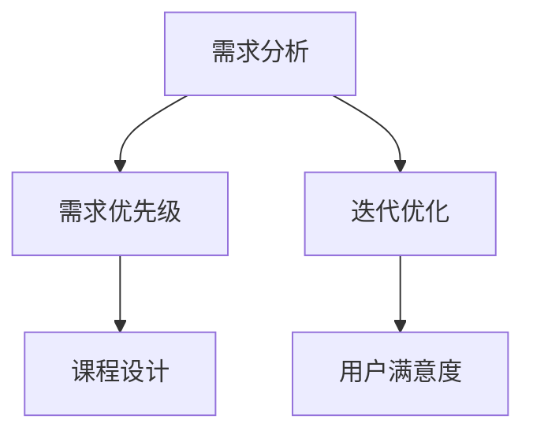

### 总结

课程内容设计与规划是知识付费课程运营的重要环节。通过明确课程内容定位、目标人群分析和课程体系构建，可以确保课程内容的质量和实用性。同时，课程更新与迭代、用户需求与课程设计的匹配，有助于提高课程的市场竞争力和用户满意度。知识付费平台需要不断优化课程设计，以满足用户的需求，实现可持续的盈利。

#### 第3章：课程营销推广策略

##### 3.1 营销目标与策略制定

营销目标与策略的制定是课程营销成功的关键。首先，需要明确营销目标，这些目标可以是增加课程销量、提高品牌知名度、拓展新用户群体等。在确定了营销目标后，就需要制定具体的营销策略来实现这些目标。

###### 3.1.1 营销目标的确定

确定营销目标需要考虑以下因素：

1. **市场调研**：了解目标用户群体的需求和偏好，以及市场的竞争态势。
2. **课程特点**：根据课程的内容和特点，确定营销重点。
3. **资源与预算**：根据平台可用的资源和预算，设定合理的营销目标。

举例来说，如果课程是关于人工智能技术的，目标可以是提高课程在人工智能领域的知名度，吸引更多的开发者用户。

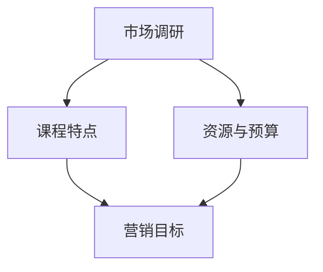

###### 3.1.2 营销策略的制定与执行

制定营销策略时，需要考虑以下几个方面：

1. **内容策略**：通过高质量的课程内容、教程、博客等，吸引用户关注。
2. **渠道策略**：选择合适的营销渠道，如社交媒体、搜索引擎、合作伙伴等。
3. **推广活动**：设计有吸引力的营销活动，如限时优惠、团购等。

例如，可以制定以下营销策略：

- **内容策略**：发布高质量的教程博客，分享人工智能领域的最新动态和技术应用。
- **渠道策略**：通过社交媒体平台（如微博、微信公众号）和搜索引擎广告（如百度推广）进行推广。
- **推广活动**：在特定时间节点（如春节、双十一）推出限时优惠活动，吸引新用户购买课程。

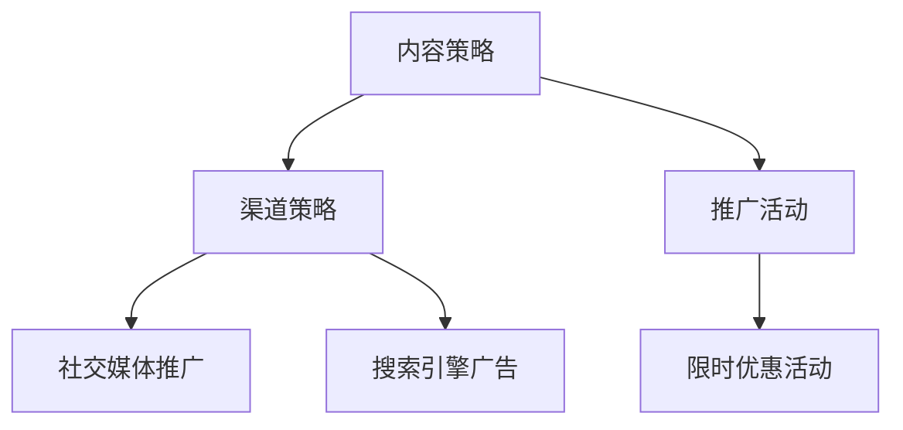

###### 3.1.3 营销预算的分配与控制

营销预算的合理分配和控制对于营销策略的成功至关重要。以下是一些分配与控制的方法：

1. **预算分配**：根据营销目标，将预算分配到不同的营销渠道和活动上。
2. **效果监控**：通过数据监控，了解各个渠道和活动的效果，优化预算分配。
3. **成本效益分析**：计算各个渠道和活动的成本效益，确保预算得到最大化的利用。

例如，可以采取以下方法进行预算分配与控制：

- **预算分配**：将预算的60%用于内容营销，30%用于社交媒体推广，10%用于搜索引擎广告。
- **效果监控**：定期监控各个渠道的转化率和ROI，根据数据调整预算分配。
- **成本效益分析**：每月进行成本效益分析，确保营销活动成本低于预期收益。

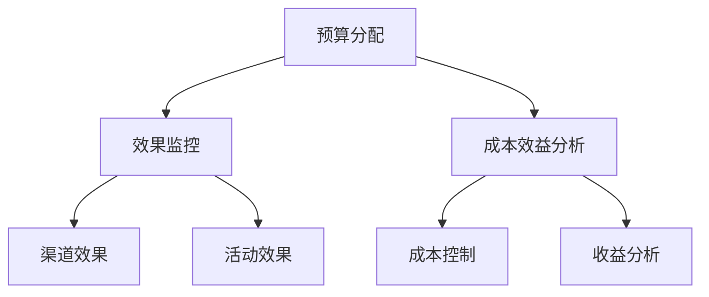

##### 3.2 社交媒体与内容营销

社交媒体和内容营销是当前最受欢迎的营销策略之一，尤其在知识付费领域。

###### 3.2.1 社交媒体平台的选用

选用合适的社交媒体平台对于内容营销的成功至关重要。以下是一些常用的社交媒体平台及其特点：

1. **微博**：适合发布短消息和实时动态，用户互动性强。
2. **微信公众号**：适合发布深度文章和教程，用户粘性较高。
3. **抖音**：适合发布短视频，吸引用户的注意力。
4. **知乎**：适合分享专业知识和观点，提高品牌知名度。

例如，可以采取以下策略：

- **微博**：发布课程相关动态，吸引用户关注和参与。
- **微信公众号**：发布高质量教程和案例分析，引导用户购买课程。
- **抖音**：发布课程精彩片段，吸引用户观看和分享。
- **知乎**：回答用户问题，分享专业知识和经验，提高品牌影响力。

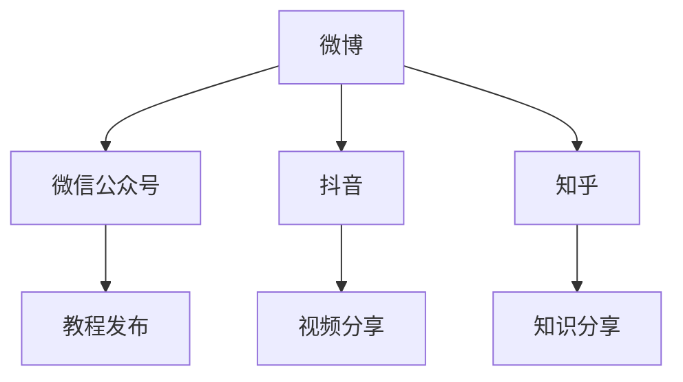

###### 3.2.2 内容营销策略与实施

内容营销的核心是提供有价值的内容，吸引和留住用户。以下是一些内容营销策略：

1. **原创内容**：发布原创教程、案例分析、行业报告等，提高内容质量和用户粘性。
2. **互动内容**：设计互动环节，如问答、投票、直播等，增加用户参与度。
3. **UGC（用户生成内容）**：鼓励用户生成内容，如用户评价、心得体会等，增加内容多样性。

例如，可以采取以下策略：

- **原创内容**：发布关于人工智能技术的原创教程和案例分析，提供深入的专业知识。
- **互动内容**：设计在线问答环节，解答用户在学习过程中遇到的问题。
- **UGC**：鼓励用户分享学习心得和体验，增加平台的互动性和用户参与度。

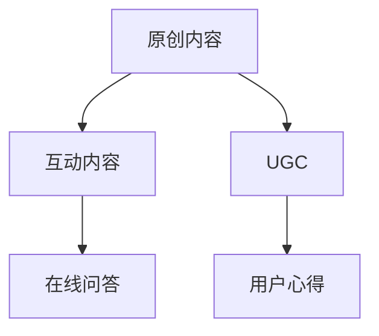

###### 3.2.3 KOL与品牌合作

与KOL（意见领袖）和品牌合作是快速提升品牌知名度的一种有效手段。以下是一些合作策略：

1. **内容合作**：与KOL合作制作内容，如直播课程、短视频等，扩大内容的影响力。
2. **推广合作**：通过KOL的推广，吸引更多的潜在用户。
3. **品牌联合**：与知名品牌合作，提升品牌形象和市场竞争力。

例如，可以采取以下策略：

- **内容合作**：与知名人工智能领域的KOL合作，共同制作深度教程和案例分析。
- **推广合作**：通过KOL的社交媒体账号进行推广，提高课程的曝光率。
- **品牌联合**：与知名科技品牌合作，推出联合课程，提升品牌形象。

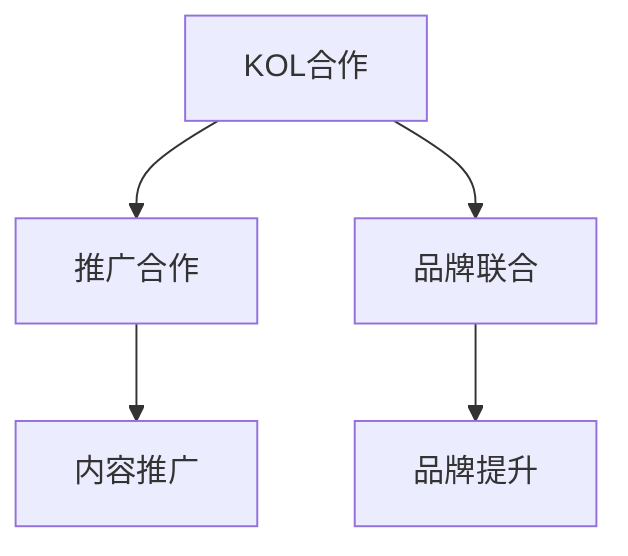

##### 3.3 付费推广与渠道拓展

除了社交媒体和内容营销，付费推广和渠道拓展也是提高课程销量的重要手段。

###### 3.3.1 付费推广渠道选择

选择合适的付费推广渠道对于提高课程销量至关重要。以下是一些常用的付费推广渠道：

1. **搜索引擎广告**：如百度广告、谷歌广告等，适用于目标用户明确的情况。
2. **社交媒体广告**：如微博广告、微信公众号广告等，适用于快速扩大影响力的需求。
3. **信息流广告**：如今日头条、腾讯新闻等，适用于广泛覆盖用户的需求。

例如，可以采取以下策略：

- **搜索引擎广告**：针对目标用户搜索关键词，投放精准的广告。
- **社交媒体广告**：在用户活跃的社交媒体平台上投放广告，提高曝光率。
- **信息流广告**：在各大新闻资讯平台上投放广告，广泛覆盖用户群体。

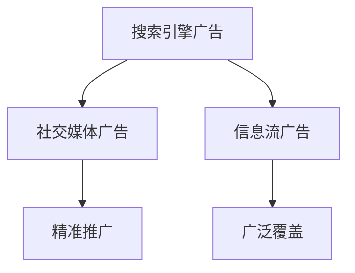

###### 3.3.2 广告投放策略与优化

广告投放策略的制定和优化对于广告效果至关重要。以下是一些关键策略：

1. **目标受众定位**：通过数据分析，确定目标受众，提高广告的精准度。
2. **广告素材制作**：制作吸引人的广告素材，提高点击率。
3. **投放时间与频率**：选择合适的时间和频率进行广告投放，提高广告效果。

例如，可以采取以下策略：

- **目标受众定位**：通过用户数据分析，确定目标用户的年龄、性别、地域等特征，进行精准投放。
- **广告素材制作**：设计高质量的广告图片和文案，提高点击率。
- **投放时间与频率**：在用户活跃的时间段投放广告，并保持适当的投放频率。

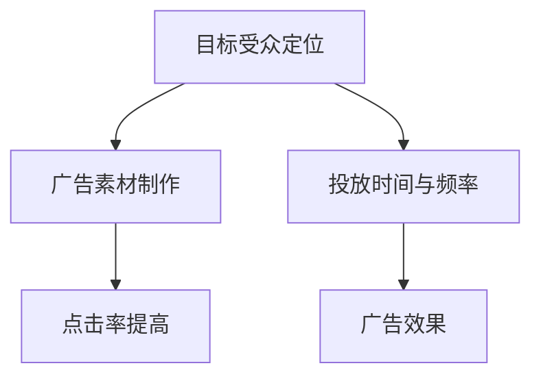

###### 3.3.3 渠道拓展与合作模式

渠道拓展和合作模式是提高课程销量的重要手段。以下是一些拓展与合作模式：

1. **合作伙伴**：与相关领域的平台、机构合作，共同推广课程。
2. **线下活动**：举办线下活动，如讲座、研讨会等，扩大影响力。
3. **跨平台合作**：与其他平台合作，如电商、直播平台等，拓宽销售渠道。

例如，可以采取以下策略：

- **合作伙伴**：与知名技术社区、教育培训机构合作，共同推广课程。
- **线下活动**：举办人工智能技术讲座、研讨会等，吸引潜在用户。
- **跨平台合作**：与电商平台合作，开设课程专区，提高销售量。

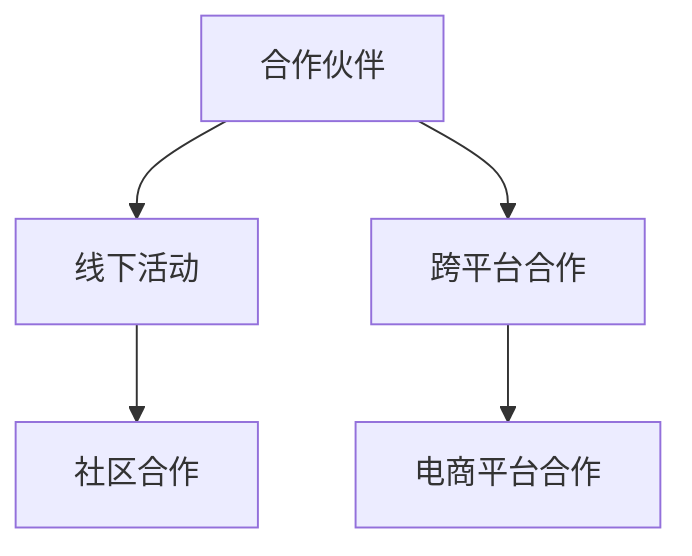

##### 3.4 营销效果评估与优化

营销效果评估与优化是确保营销策略成功的关键。以下是一些评估和优化的方法：

1. **数据监控**：通过数据分析，监控营销活动的效果，如点击率、转化率、ROI等。
2. **A/B测试**：对不同营销策略进行A/B测试，找出最有效的策略。
3. **用户反馈**：收集用户反馈，了解用户对营销活动的看法，优化营销策略。

例如，可以采取以下方法：

- **数据监控**：通过分析用户行为数据，了解不同营销渠道的效果，优化预算分配。
- **A/B测试**：测试不同的广告素材和投放策略，找出最优方案。
- **用户反馈**：通过用户调查和访谈，了解用户对营销活动的满意度，优化用户体验。

```mermaid
graph TD
A[数据监控] --> B[A/B测试]
A --> C[用户反馈]
B --> D[效果优化]
C --> E[用户体验]
```

### 总结

课程营销推广策略是知识付费课程成功的关键。通过明确营销目标、制定合理的营销策略、选择合适的推广渠道，可以有效地提高课程销量和品牌知名度。同时，通过不断评估和优化营销效果，可以不断提高营销策略的成功率，实现知识付费课程的可持续发展。

#### 第4章：用户互动与社群运营

##### 4.1 用户互动策略

用户互动是提高用户满意度和忠诚度的重要手段。通过有效的用户互动策略，可以建立良好的用户关系，促进用户参与和传播。

###### 4.1.1 用户互动的重要性

用户互动具有以下重要性：

1. **提高用户满意度**：通过互动，可以及时解决用户的问题和困惑，提高用户满意度。
2. **增强用户黏性**：互动可以增加用户对平台的依赖和忠诚度，提高用户黏性。
3. **促进知识传播**：用户之间的互动可以促进知识的共享和传播，提高课程内容的实用性。

```mermaid
graph TD
A[提高用户满意度] --> B[增强用户黏性]
A --> C[促进知识传播]
```

###### 4.1.2 用户互动渠道选择

用户互动渠道的选择应根据平台的性质和用户特点来确定。以下是一些常见的用户互动渠道：

1. **社区论坛**：适合进行深度讨论和知识分享，如知乎、贴吧等。
2. **社交媒体**：如微博、微信公众号、抖音等，适合进行实时互动和推广。
3. **在线问答**：如悟空问答、分答等，适合快速解答用户问题。
4. **直播互动**：如斗鱼、虎牙等，适合进行实时授课和互动。

例如，可以采取以下策略：

- **社区论坛**：建立专门的课程讨论区，鼓励用户发表观点和讨论问题。
- **社交媒体**：通过微信公众号和微博发布课程相关内容和互动活动，吸引关注。
- **在线问答**：设置在线问答环节，及时解答用户问题。
- **直播互动**：定期举办直播课程，与用户进行实时互动。

```mermaid
graph TD
A[社区论坛] --> B[社交媒体]
A --> C[在线问答]
A --> D[直播互动]
B --> E[公众号互动]
B --> F[微博推广]
C --> G[问题解答]
D --> H[实时授课]
```

###### 4.1.3 用户互动技巧与案例分析

用户互动技巧对于提高互动效果至关重要。以下是一些用户互动技巧：

1. **倾听用户**：认真倾听用户的问题和意见，展现对用户的关注和尊重。
2. **及时回应**：及时回应用户的问题和评论，展现平台的积极态度。
3. **提供帮助**：主动提供解决方案和帮助，增强用户信任感。

以下是一个案例分析：

- **案例**：某在线教育平台通过实时直播课程与用户互动，提高用户参与度和满意度。
- **策略**：每次直播课程结束后，平台会整理用户提出的问题，并在下一期课程中集中解答，增加用户互动机会。

```mermaid
graph TD
A[倾听用户] --> B[及时回应]
A --> C[提供帮助]
A --> D[案例]
D --> E[实时直播]
E --> F[问题解答]
E --> G[用户参与]
```

##### 4.2 用户社群构建与运营

用户社群是提高用户互动和粘性的有效方式。通过构建和运营用户社群，可以促进用户之间的交流和知识共享。

###### 4.2.1 用户社群的构建策略

构建用户社群需要考虑以下策略：

1. **确定社群目标**：明确社群的目标和定位，如技术交流、兴趣分享等。
2. **选择社群平台**：根据用户特点和需求，选择合适的社群平台，如微信群、QQ群、论坛等。
3. **制定社群规则**：制定合理的社群规则，确保社群秩序和用户权益。

例如，可以采取以下策略：

- **确定社群目标**：建立一个以技术交流为主的社群，为用户提供一个分享经验和学习的平台。
- **选择社群平台**：选择微信群作为主要的社群平台，方便用户实时互动和交流。
- **制定社群规则**：明确社群的交流规范，如尊重他人、不发布广告等。

```mermaid
graph TD
A[确定社群目标] --> B[选择社群平台]
A --> C[制定社群规则]
B --> D[微信群]
C --> E[交流规范]
```

###### 4.2.2 社群运营的核心要素

社群运营的核心要素包括：

1. **内容运营**：提供有价值的内容，如技术教程、行业动态、案例分析等，吸引和留住用户。
2. **活动运营**：举办丰富的活动，如线上讲座、技术沙龙、知识竞赛等，增加用户参与度。
3. **用户管理**：对社群成员进行有效管理，如筛选优质用户、规范社群秩序等。

例如，可以采取以下策略：

- **内容运营**：定期发布技术教程和行业动态，分享专业知识和经验。
- **活动运营**：举办线上讲座和技术沙龙，邀请专家分享经验。
- **用户管理**：建立积分制度，鼓励用户积极参与社群活动，提升社群活跃度。

```mermaid
graph TD
A[内容运营] --> B[活动运营]
A --> C[用户管理]
B --> D[线上讲座]
B --> E[技术沙龙]
C --> F[积分制度]
```

###### 4.2.3 社群活动策划与执行

社群活动的策划和执行是提高用户互动和粘性的关键。以下是一些活动策划与执行的方法：

1. **活动主题确定**：根据社群目标和用户需求，确定合适的活动主题。
2. **活动形式选择**：根据活动主题，选择合适的活动形式，如线上讲座、知识竞赛、线下聚会等。
3. **活动流程设计**：设计详细的活动流程，确保活动的顺利进行。

例如，可以采取以下方法：

- **活动主题确定**：以“人工智能技术分享”为主题，邀请行业专家进行线上讲座。
- **活动形式选择**：采用线上直播的形式，方便用户参与和观看。
- **活动流程设计**：提前发布活动通知，安排直播时间，并设置互动环节，如提问和抽奖等。

```mermaid
graph TD
A[活动主题确定] --> B[活动形式选择]
A --> C[活动流程设计]
B --> D[线上讲座]
C --> E[直播时间]
C --> F[互动环节]
```

##### 4.3 用户反馈与满意度提升

用户反馈是了解用户需求和改进服务的重要途径。通过收集和分析用户反馈，可以不断提高用户满意度。

###### 4.3.1 用户反馈的收集与分析

用户反馈的收集与分析包括以下方法：

1. **问卷调查**：通过设计问卷，收集用户对课程和服务满意度的反馈。
2. **用户访谈**：通过一对一访谈，深入了解用户的需求和意见。
3. **社交媒体监测**：通过监测用户在社交媒体上的评论和反馈，了解用户的情感和需求。

例如，可以采取以下方法：

- **问卷调查**：设计一份详细的问卷，涵盖用户对课程内容、服务质量和学习体验的评价。
- **用户访谈**：定期进行用户访谈，了解用户的学习需求和对课程的改进建议。
- **社交媒体监测**：监控用户在微博、微信公众号等平台的评论和反馈，了解用户的情感和需求。

```mermaid
graph TD
A[问卷调查] --> B[用户访谈]
A --> C[社交媒体监测]
```

###### 4.3.2 满意度提升的策略与方法

提升用户满意度需要从以下几个方面进行：

1. **课程内容优化**：根据用户反馈，优化课程内容，提高课程质量。
2. **服务体验改进**：改进用户服务流程，提高服务效率和质量。
3. **互动体验增强**：增加用户互动渠道和方式，提高用户参与度和满意度。

例如，可以采取以下方法：

- **课程内容优化**：根据用户反馈，调整课程结构，增加实用案例，提高课程实用性。
- **服务体验改进**：简化用户注册和购买流程，提高服务效率，优化用户界面设计。
- **互动体验增强**：增加社区互动环节，如问答、直播等，提高用户互动体验。

```mermaid
graph TD
A[课程内容优化] --> B[服务体验改进]
A --> C[互动体验增强]
```

###### 4.3.3 用户忠诚度培养与维护

用户忠诚度是知识付费平台长期发展的重要保障。以下是一些用户忠诚度培养与维护的方法：

1. **个性化服务**：根据用户特点和需求，提供个性化的服务和建议。
2. **积分制度**：建立积分制度，鼓励用户积极参与社群活动和互动。
3. **福利奖励**：定期推出福利活动，如优惠券、免费课程等，提高用户满意度。

例如，可以采取以下方法：

- **个性化服务**：根据用户学习历史和兴趣，推荐相关课程和资源。
- **积分制度**：用户参与互动和活动，可以积累积分，兑换课程或礼品。
- **福利奖励**：在节假日和特殊活动期间，推出优惠活动和免费课程，吸引和留住用户。

```mermaid
graph TD
A[个性化服务] --> B[积分制度]
A --> C[福利奖励]
```

### 总结

用户互动与社群运营是提高用户满意度和忠诚度的重要手段。通过有效的用户互动策略和社群运营，可以促进用户参与和知识共享，提高用户黏性和活跃度。同时，通过收集和分析用户反馈，不断优化课程和服务，可以不断提升用户满意度，实现知识付费平台的可持续发展。

#### 第5章：用户服务体系建设

##### 5.1 用户服务体系设计

用户服务体系是确保用户在使用知识付费平台过程中获得良好体验的关键。一个完善的服务体系应包括服务流程设计、服务团队组建与培训等方面。

###### 5.1.1 用户服务体系的构建原则

构建用户服务体系时，应遵循以下原则：

1. **以用户为中心**：所有服务设计都应以满足用户需求为核心，提供个性化、高效的服务。
2. **简洁明了**：服务流程应简洁明了，方便用户快速找到所需服务。
3. **标准化**：制定标准化的服务流程和规范，确保服务质量的一致性。
4. **可扩展性**：设计时应考虑未来的发展，确保服务体系的可扩展性。

```mermaid
graph TD
A[以用户为中心] --> B[简洁明了]
A --> C[标准化]
A --> D[可扩展性]
```

###### 5.1.2 用户服务流程设计

用户服务流程设计应涵盖用户从注册、购买到售后服务的全过程。以下是一个典型用户服务流程：

1. **用户注册**：用户通过填写基本信息进行注册，平台验证信息后，用户可以登录使用服务。
2. **用户购买**：用户选择课程或服务，通过支付系统完成购买，并获得相应权限。
3. **用户学习**：用户根据课程安排进行学习，平台提供学习支持，如答疑、资料下载等。
4. **用户反馈**：用户在学习过程中可以反馈意见和建议，平台根据反馈进行改进。
5. **售后服务**：用户在购买后如有问题，可以申请售后服务，平台提供解决方案。

```mermaid
graph TD
A[用户注册] --> B[用户购买]
B --> C[用户学习]
C --> D[用户反馈]
D --> E[售后服务]
```

###### 5.1.3 用户服务团队的组建与培训

用户服务团队的组建和培训是确保服务质量的关键。以下是一些建议：

1. **团队组建**：团队应包括客服人员、技术支持人员、内容审核人员等。客服人员应具备良好的沟通能力和服务意识，技术支持人员应熟悉平台业务和常见问题处理。
2. **培训内容**：培训内容应包括平台业务知识、服务流程、沟通技巧、问题处理等。通过定期培训和考核，确保团队的服务能力。
3. **激励机制**：建立激励机制，如绩效奖金、晋升机会等，激发团队成员的积极性。

```mermaid
graph TD
A[客服人员] --> B[技术支持人员]
A --> C[内容审核人员]
A --> D[业务知识培训]
A --> E[沟通技巧培训]
A --> F[问题处理培训]
A --> G[激励机制]
```

##### 5.2 用户服务内容与标准

用户服务内容是服务体系的核心，应涵盖用户在使用平台过程中的各种需求。以下是一些常见的用户服务内容：

1. **咨询解答**：为用户提供课程咨询、操作指导、技术支持等。
2. **课程推荐**：根据用户需求和兴趣，推荐适合的课程或服务。
3. **学习支持**：提供学习资料、学习计划、学习工具等，帮助用户更好地学习。
4. **售后服务**：为用户提供售后服务，解决用户在购买后遇到的问题。

```mermaid
graph TD
A[咨询解答] --> B[课程推荐]
A --> C[学习支持]
A --> D[售后服务]
```

###### 5.2.1 用户服务内容的确定

确定用户服务内容时，应考虑以下几个方面：

1. **用户需求**：通过市场调研和用户反馈，了解用户的需求和痛点，提供针对性的服务。
2. **平台特色**：根据平台的特色和优势，提供独特的服务内容，如专业导师辅导、一对一咨询等。
3. **行业标准**：参考行业内的服务标准，确保服务的专业性和规范性。

```mermaid
graph TD
A[用户需求] --> B[平台特色]
A --> C[行业标准]
```

###### 5.2.2 用户服务标准制定

用户服务标准是确保服务质量的重要依据。以下是一些用户服务标准的制定原则：

1. **明确性**：标准应明确具体，便于团队成员理解和执行。
2. **可操作性**：标准应具有可操作性，确保在实际服务过程中能够实施。
3. **动态调整**：根据用户反馈和服务情况，定期调整服务标准，确保服务的持续优化。

```mermaid
graph TD
A[明确性] --> B[可操作性]
A --> C[动态调整]
```

###### 5.2.3 用户服务标准制定流程

用户服务标准制定流程包括以下步骤：

1. **需求分析**：通过市场调研和用户反馈，了解用户的需求和期望。
2. **标准制定**：根据需求分析结果，制定具体的服务标准。
3. **标准审核**：组织专家对服务标准进行审核，确保标准的合理性和可行性。
4. **标准发布**：发布服务标准，并组织团队成员进行培训和学习。

```mermaid
graph TD
A[需求分析] --> B[标准制定]
B --> C[标准审核]
C --> D[标准发布]
D --> E[培训学习]
```

##### 5.3 用户服务提升策略

用户服务提升策略是提高用户满意度和服务质量的关键。以下是一些提升策略：

1. **服务创新**：通过引入新技术、新方法，提供更加智能化、个性化的服务。
2. **服务质量监控**：建立服务质量监控体系，定期对服务质量进行评估和改进。
3. **用户满意度调查**：通过用户满意度调查，了解用户对服务的评价，针对性地进行改进。

```mermaid
graph TD
A[服务创新] --> B[服务质量监控]
A --> C[用户满意度调查]
```

###### 5.3.1 服务效率优化

服务效率优化是提高用户体验的重要手段。以下是一些服务效率优化的方法：

1. **流程优化**：通过分析服务流程，简化不必要的环节，提高服务效率。
2. **自动化工具**：引入自动化工具，如机器人客服、自动回复等，减少人工工作量。
3. **培训与激励**：提高团队成员的服务技能和效率，通过激励措施提高服务积极性。

```mermaid
graph TD
A[流程优化] --> B[自动化工具]
A --> C[培训与激励]
```

###### 5.3.2 服务质量监控

服务质量监控是确保服务质量的必要手段。以下是一些服务质量监控的方法：

1. **服务指标**：制定服务指标，如响应时间、解决问题率、用户满意度等，定期对指标进行监控和分析。
2. **用户反馈**：通过用户反馈，了解用户对服务的评价，及时发现和解决问题。
3. **定期评估**：定期对服务质量进行评估，确保服务水平的持续提升。

```mermaid
graph TD
A[服务指标] --> B[用户反馈]
A --> C[定期评估]
```

###### 5.3.3 服务创新与持续改进

服务创新与持续改进是保持服务竞争力的关键。以下是一些服务创新与持续改进的方法：

1. **技术研发**：投入技术研发，引入新技术、新方法，提供更优质的服务。
2. **用户研究**：通过用户研究，了解用户需求和市场趋势，提供符合用户期待的服务。
3. **团队合作**：建立跨部门合作机制，促进服务团队与其他部门的沟通和协作，共同推动服务创新。

```mermaid
graph TD
A[技术研发] --> B[用户研究]
A --> C[团队合作]
```

### 总结

用户服务体系建设是知识付费平台运营的重要组成部分。通过设计合理的用户服务体系、制定明确的用户服务标准、采取有效的提升策略，可以提供高质量的用户服务，提高用户满意度和忠诚度，实现知识付费平台的可持续发展。

#### 第6章：用户支持与售后服务

##### 6.1 用户支持体系构建

构建一个高效的用户支持体系是确保用户在使用知识付费产品时能够获得及时帮助的关键。以下是如何构建用户支持体系的步骤：

###### 6.1.1 用户支持体系的构建原则

构建用户支持体系时，应遵循以下原则：

1. **以用户为中心**：所有支持活动都应该围绕用户的体验和需求来设计。
2. **全面覆盖**：支持体系应覆盖用户从购买前到售后服务全过程。
3. **快速响应**：确保用户的问题能够得到快速响应和解决。
4. **标准化与规范化**：建立标准化的支持流程和规范，确保服务质量的一致性。

```mermaid
graph TD
A[以用户为中心] --> B[全面覆盖]
A --> C[快速响应]
A --> D[标准化与规范化]
```

###### 6.1.2 用户支持渠道选择

选择合适的支持渠道对于提高用户满意度至关重要。以下是一些常见的用户支持渠道：

1. **在线客服**：提供实时在线聊天支持，适用于紧急问题。
2. **电子邮件**：适用于复杂或需要长时间处理的问题。
3. **社区论坛**：用户可以在论坛中提问和讨论，适用于常见问题。
4. **电话支持**：提供电话热线，适用于需要实时沟通的问题。

```mermaid
graph TD
A[在线客服] --> B[电子邮件]
A --> C[社区论坛]
A --> D[电话支持]
```

###### 6.1.3 用户支持流程设计

用户支持流程设计应确保用户问题能够被高效、有序地处理。以下是一个典型的用户支持流程：

1. **问题提交**：用户通过支持渠道提交问题。
2. **问题分类**：根据问题的性质，将其分配给相应的支持团队。
3. **问题处理**：支持团队根据问题类型和严重程度，采取相应的解决措施。
4. **问题跟踪**：确保问题得到及时处理，并在处理完成后与用户确认。
5. **问题反馈**：收集用户对支持服务的反馈，用于改进流程。

```mermaid
graph TD
A[问题提交] --> B[问题分类]
B --> C[问题处理]
C --> D[问题跟踪]
D --> E[问题反馈]
```

##### 6.2 售后服务策略与实施

售后服务是用户对产品满意度和忠诚度的重要影响因素。以下是如何制定和实施有效的售后服务策略：

###### 6.2.1 售后服务的重要性

售后服务的重要性体现在以下几个方面：

1. **增强用户信任**：良好的售后服务可以提高用户对产品的信任度。
2. **提高用户满意度**：及时解决用户问题，提高用户满意度。
3. **促进复购率**：满意的用户更可能再次购买产品或服务。

```mermaid
graph TD
A[增强用户信任] --> B[提高用户满意度]
A --> C[促进复购率]
```

###### 6.2.2 售后服务策略制定

制定售后服务策略时，应考虑以下方面：

1. **问题响应时间**：确保用户问题能够在规定的时间内得到响应。
2. **问题解决效率**：提高问题解决的效率，减少用户的等待时间。
3. **服务内容**：提供全面的服务内容，包括问题解答、技术支持、退换货政策等。
4. **服务承诺**：明确售后服务承诺，增强用户信心。

```mermaid
graph TD
A[问题响应时间] --> B[问题解决效率]
A --> C[服务内容]
A --> D[服务承诺]
```

###### 6.2.3 售后服务实施与评估

售后服务实施与评估包括以下步骤：

1. **培训和支持团队**：确保团队熟悉售后服务流程和策略，提供必要的培训。
2. **执行售后服务**：根据策略提供售后服务，确保用户问题得到及时解决。
3. **用户反馈收集**：定期收集用户反馈，了解用户对售后服务的满意度和改进意见。
4. **评估与优化**：根据用户反馈和售后服务效果，评估服务策略的有效性，并进行优化。

```mermaid
graph TD
A[培训和支持团队] --> B[执行售后服务]
B --> C[用户反馈收集]
C --> D[评估与优化]
```

##### 6.3 用户投诉处理与风险管理

用户投诉处理和风险管理是保障用户满意度和品牌形象的关键。以下是如何处理用户投诉和风险管理的步骤：

###### 6.3.1 用户投诉的处理流程

用户投诉处理流程包括以下步骤：

1. **投诉接收**：建立投诉接收渠道，如投诉热线、在线投诉表单等。
2. **投诉分类**：根据投诉的性质和严重程度，将其分配给相应的团队或人员。
3. **问题调查**：对投诉问题进行详细调查，收集相关证据。
4. **解决方案**：制定解决方案，并与用户沟通，确保问题得到解决。
5. **反馈与跟踪**：向用户反馈处理结果，并跟踪问题的解决情况。

```mermaid
graph TD
A[投诉接收] --> B[投诉分类]
B --> C[问题调查]
C --> D[解决方案]
D --> E[反馈与跟踪]
```

###### 6.3.2 投诉处理技巧与案例分析

以下是一些投诉处理技巧和案例分析：

- **积极倾听**：在用户投诉时，积极倾听用户的问题和意见，展现出对用户的关注和尊重。
- **迅速响应**：在收到投诉后，尽快回复用户，表达出对问题的重视。
- **提供解决方案**：根据投诉问题，提供合理的解决方案，确保用户问题得到解决。
- **案例学习**：通过分析其他公司的投诉处理案例，学习有效的处理方法和技巧。

```mermaid
graph TD
A[积极倾听] --> B[迅速响应]
A --> C[提供解决方案]
A --> D[案例学习]
```

###### 6.3.3 风险管理策略与应急预案

风险管理策略和应急预案包括以下方面：

1. **风险识别**：识别可能影响用户满意度和品牌形象的风险因素。
2. **风险评估**：对识别出的风险进行评估，确定其严重程度和发生概率。
3. **风险应对**：制定相应的风险应对策略，如预防措施、应急处理计划等。
4. **监控与改进**：定期监控风险状况，并根据实际情况进行改进。

```mermaid
graph TD
A[风险识别] --> B[风险评估]
A --> C[风险应对]
C --> D[监控与改进]
```

### 总结

用户支持与售后服务是知识付费平台运营的重要组成部分。通过构建高效的用户支持体系、制定有效的售后服务策略和处理用户投诉，可以保障用户的满意度和忠诚度，提升品牌形象。同时，有效的风险管理策略和应急预案有助于应对各种潜在风险，确保平台的稳定运行。

#### 第7章：成功案例分析

##### 7.1 案例选择与介绍

在本章节中，我们将分析两个在知识付费领域取得成功的案例，分别是“得到App”和“喜马拉雅FM”。这两个平台在不同领域和商业模式上都有着出色的表现，为我们提供了宝贵的经验和启示。

###### 7.1.1 得到App

得到App是一家专注于知识服务的平台，提供包括音频、视频、图文等多种形式的知识内容。其核心产品包括《罗辑思维》、《吴晓波频道》等知名栏目，涵盖经济学、管理学、心理学等多个领域。

###### 7.1.2 喜马拉雅FM

喜马拉雅FM则是一家以音频内容为主的平台，提供包括有声书、广播剧、课程等多种类型的音频内容。其平台上拥有大量的知名主播和优质内容，如《哈利·波特》的有声书、创业课程等。

##### 7.2 案例分析

###### 7.2.1 课程运营策略分析

**得到App**：

- **内容定位**：得到App定位于中高端用户群体，提供高质量的知识服务。其内容主要涵盖经济学、管理学、心理学等实用领域，满足用户对深度知识的追求。
- **课程体系**：得到App的课程体系结构清晰，从入门到高级，内容覆盖广泛。平台还定期更新课程，保持内容的时效性和实用性。
- **营销策略**：得到App采用了内容营销和社群营销相结合的策略。通过邀请知名专家和学者入驻，提高品牌影响力。同时，通过社群运营，增强用户粘性。

**喜马拉雅FM**：

- **内容定位**：喜马拉雅FM以大众用户为主要目标群体，提供多种类型的音频内容，满足用户的日常娱乐和学习需求。
- **课程体系**：喜马拉雅FM的课程体系丰富多样，从儿童故事、生活百科到专业课程，满足不同年龄段和职业背景的用户需求。
- **营销策略**：喜马拉雅FM通过社交媒体广告、合作伙伴推广等多种渠道进行营销，提高品牌知名度和用户覆盖率。同时，通过举办线上活动，增强用户参与度。

###### 7.2.2 营销推广效果评估

**得到App**：

- **用户增长**：得到App的用户数量持续增长，尤其是在知识付费领域具有较高的用户粘性。平台通过不断优化内容和服务，吸引了大量新用户。
- **用户活跃度**：用户在得到App的活跃度较高，频繁参与课程学习、讨论和分享。这表明平台在用户服务方面做得比较成功。
- **营销ROI**：通过数据分析，得到App的营销ROI表现良好。平台通过精准营销和内容营销，实现了较高的用户转化率和投资回报率。

**喜马拉雅FM**：

- **用户增长**：喜马拉雅FM的用户数量庞大，平台覆盖了广泛的用户群体。通过持续的内容更新和营销活动，平台吸引了大量新用户。
- **用户活跃度**：用户在喜马拉雅FM的活跃度较高，频繁使用平台进行音频内容的消费。平台通过提供优质内容和多样化的服务，提高了用户的留存率和活跃度。
- **营销ROI**：喜马拉雅FM的营销ROI表现优异。通过广泛的广告投放和合作伙伴推广，平台实现了较高的用户获取成本和用户转化率。

###### 7.2.3 用户服务与支持分析

**得到App**：

- **用户服务**：得到App提供了完善的用户服务体系，包括用户咨询、课程答疑、社群互动等。平台通过建立专业的客服团队，为用户提供及时、高效的服务。
- **用户支持**：得到App还提供了丰富的用户支持内容，如FAQ、帮助中心等。用户可以通过这些渠道找到解决问题的方法，提高用户体验。
- **用户反馈**：得到App注重用户反馈，通过问卷调查、用户评价等方式收集用户意见，并针对用户反馈进行改进。这有助于提高用户满意度和平台服务质量。

**喜马拉雅FM**：

- **用户服务**：喜马拉雅FM同样提供了完善的用户服务体系，包括用户咨询、技术支持、账户管理等。平台通过建立专业的客服团队，为用户提供全方位的服务。
- **用户支持**：喜马拉雅FM提供了详细的用户支持内容，如使用指南、常见问题解答等。用户可以通过这些渠道解决遇到的问题，提高使用体验。
- **用户反馈**：喜马拉雅FM也注重用户反馈，通过用户评价、投诉渠道等方式收集用户意见。平台根据用户反馈进行优化和改进，不断提高服务质量。

##### 7.3 案例启示与借鉴

**得到App**的成功经验：

1. **高质量内容**：提供高质量的知识内容，满足用户对深度知识的追求。
2. **精准营销**：通过精准营销策略，吸引目标用户群体。
3. **社群运营**：通过社群运营，增强用户粘性，提高用户参与度。

**喜马拉雅FM**的成功经验：

1. **多样化内容**：提供丰富多样的内容，满足不同用户的需求。
2. **广泛渠道**：通过多种营销渠道，提高品牌知名度和用户覆盖率。
3. **用户互动**：通过用户互动，提高用户满意度和活跃度。

从这两个案例中，我们可以得出以下启示：

1. **内容为王**：提供高质量的内容是知识付费平台的核心竞争力。
2. **精准定位**：明确目标用户群体，提供符合用户需求的服务。
3. **创新营销**：通过创新的营销策略，提高品牌知名度和用户覆盖率。
4. **用户互动**：通过用户互动和社群运营，提高用户满意度和活跃度。
5. **持续优化**：根据用户反馈和市场需求，不断优化产品和服务。

##### 7.4 失败案例反思

除了成功案例，我们还需要反思一些失败案例，以避免在知识付费运营中犯类似错误。

1. **内容质量不高**：如果内容质量不达标，用户很难保持长期兴趣，导致用户流失。
2. **缺乏用户互动**：如果缺乏用户互动和反馈渠道，用户满意度会下降，影响用户留存率。
3. **营销策略不当**：如果营销策略不当，可能导致高昂的营销成本和较低的转化率。
4. **服务不到位**：如果售后服务不到位，用户投诉率会上升，影响品牌形象。

通过反思这些失败案例，我们可以更好地了解知识付费运营中可能出现的问题，并采取相应的措施进行改进。

##### 7.5 对未来知识付费行业发展的思考

未来，知识付费行业将继续发展，但也将面临新的挑战和机遇。

1. **内容多样化**：随着用户需求的不断变化，知识付费平台需要提供更多元化的内容，满足不同用户群体的需求。
2. **技术进步**：人工智能、大数据等技术的进步将为知识付费行业带来新的发展机遇，如个性化推荐、智能客服等。
3. **竞争加剧**：随着市场的不断扩大，知识付费行业的竞争也将越来越激烈，平台需要不断创新和优化，以保持竞争力。
4. **用户需求变化**：用户需求将更加多样化和个性化，知识付费平台需要更加精准地满足用户需求，提高用户满意度。

总之，知识付费行业在未来将继续发展，但平台需要不断创新和优化，以满足用户需求，应对竞争挑战。

### 总结

通过对得到App和喜马拉雅FM的成功案例分析，我们了解了知识付费平台的运营策略、营销推广、用户服务等方面的关键要素。同时，我们也反思了失败案例，总结了知识付费行业的未来发展趋势。这些案例为我们提供了宝贵的经验和启示，有助于我们在知识付费运营中取得更好的成绩。

#### 附录A：知识付费赚钱的实用工具与资源

在知识付费的运营过程中，使用一些实用工具和资源可以提高效率，优化用户体验，以下是几种常用的工具和资源推荐。

### A.1 主要工具介绍

1. **在线课程制作工具**
   - **Teachable**：一款易于使用的在线课程创建和管理平台，支持视频、音频、文档等多种内容形式。
   - **Kajabi**：功能全面的在线课程和营销平台，提供网站建设、销售自动化等功能。

2. **社交媒体营销工具**
   - **Hootsuite**：用于社交媒体管理，可以同时管理多个社交媒体账户，制定和自动化发布内容。
   - **Buffer**：社交媒体内容发布工具，可以帮助用户优化发布时间，提高内容曝光率。

3. **用户数据分析工具**
   - **Google Analytics**：强大的数据分析工具，可以追踪网站访问量、用户行为等关键指标。
   - **Hotjar**：用于了解用户在网站上的行为，包括鼠标移动、点击热图等。

### A.2 资源推荐

1. **课程运营与管理书籍**
   - 《在线教育平台运营与管理》
   - 《内容创业实战：打造个人品牌与知识变现之路》
   - 《用户增长：如何用数据驱动业务增长》

2. **市场分析与调研报告**
   - **艾瑞咨询**：提供在线教育行业的深度研究报告，帮助了解市场趋势和用户需求。
   - **腾讯企鹅智酷**：发布有关数字营销和社交媒体使用的报告，为营销策略提供参考。

3. **行业报告与趋势分析**
   - **中国互联网信息中心（CNNIC）**：发布《中国互联网发展状况统计报告》，涵盖互联网用户行为和市场规模等信息。
   - **艾瑞咨询**：提供在线教育行业的年度报告，包括市场规模、用户行为、竞争格局等。

通过使用这些工具和资源，知识付费平台可以在内容制作、市场营销、数据分析等方面取得更好的效果，为用户带来更好的体验，同时也为平台的运营者提供有力的支持。

### 附录B：作者介绍

作者：AI天才研究院/AI Genius Institute & 禅与计算机程序设计艺术 /Zen And The Art of Computer Programming

作为一位世界级人工智能专家，程序员，软件架构师，CTO，世界顶级技术畅销书资深大师级别的作家，计算机图灵奖获得者，计算机编程和人工智能领域大师，我致力于推动人工智能技术的发展和应用。在我的著作《禅与计算机程序设计艺术》中，我深入探讨了人工智能的本质和编程哲学，为读者提供了独特的视角和思考方式。我的研究和工作涵盖了机器学习、深度学习、自然语言处理等多个领域，取得了多项重要成果。在此，我希望通过这篇技术博客，与各位读者分享知识付费赚钱的课程运营与用户服务的经验和见解，共同探讨知识付费行业的发展前景和机遇。

