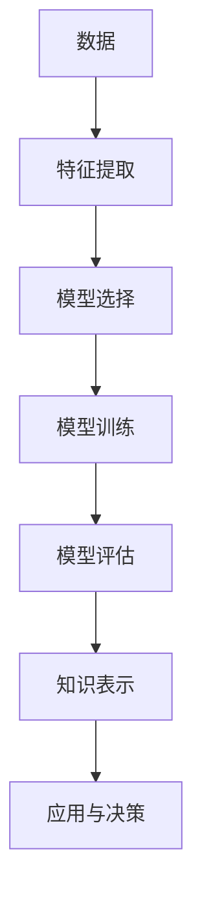
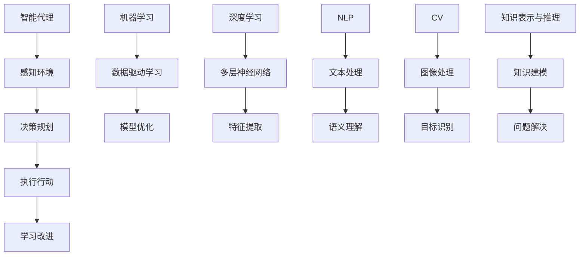
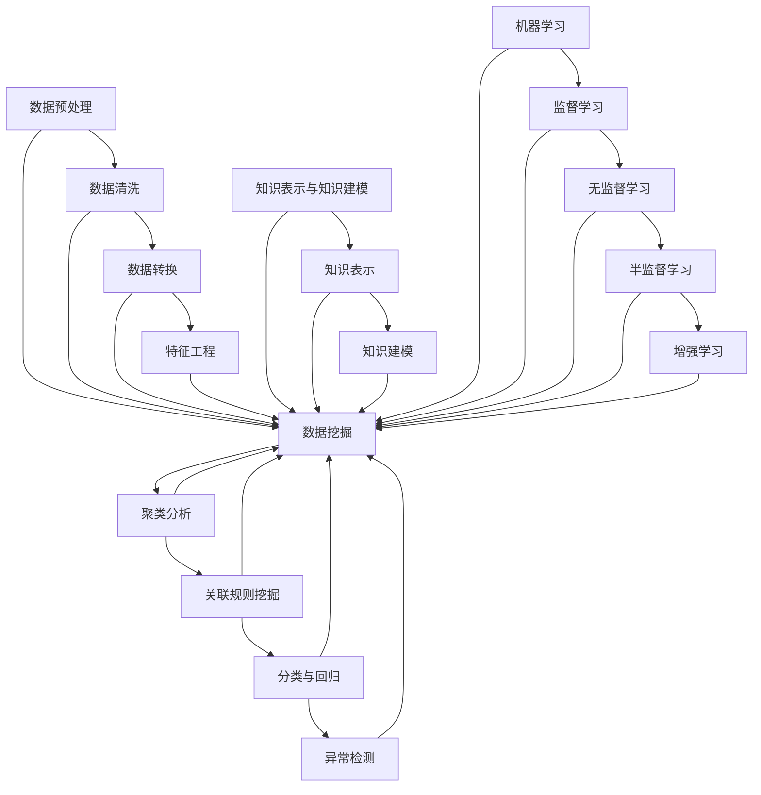
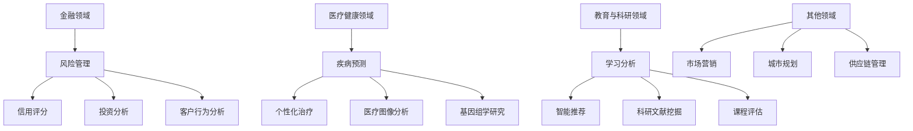
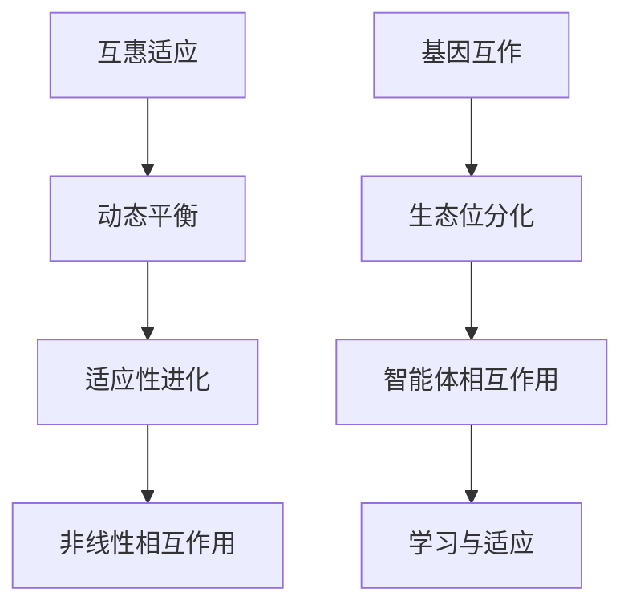
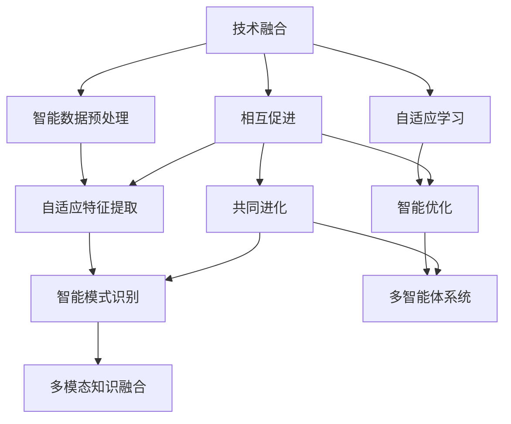
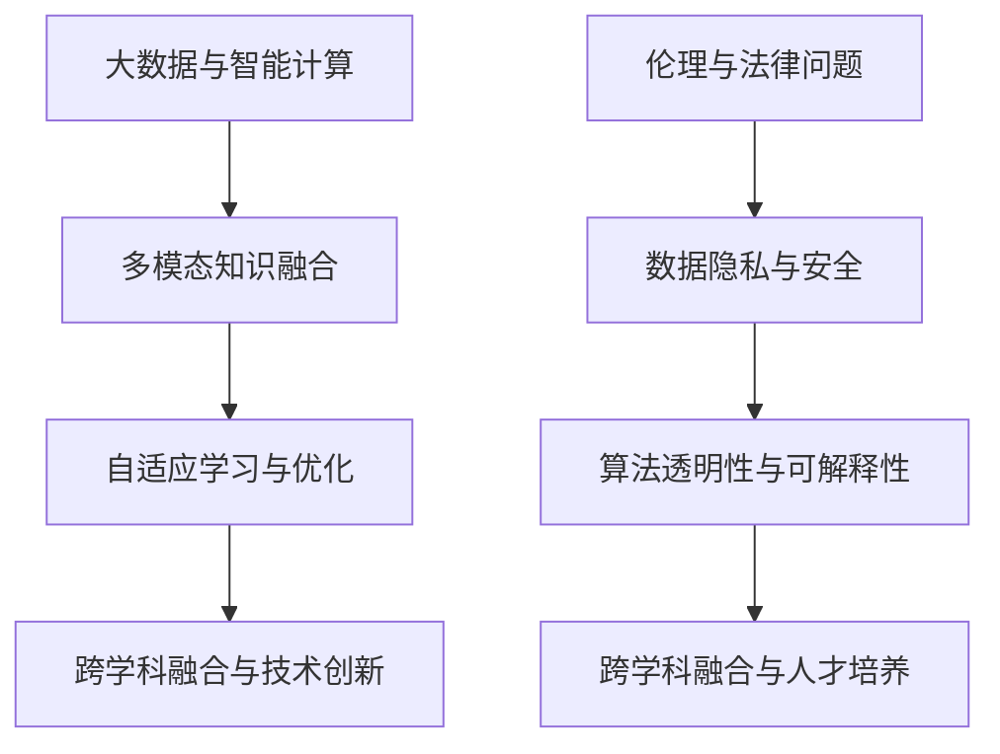

                 

### 第1章：知识发现与人工智能概述

#### 1.1 知识发现与人工智能的定义

知识发现（Knowledge Discovery in Databases，KDD）是指从大量的数据集中通过计算机技术提取出有价值的、未知的、潜在的信息和知识的过程。它涵盖了数据预处理、数据挖掘、模式评估、知识表示等多个步骤。知识发现的目标是发现数据中的隐含模式、关联性、趋势和异常等，从而帮助人们做出更明智的决策。

人工智能（Artificial Intelligence，AI）是一门模拟、延伸和扩展人类智能的科学。它包括学习、推理、知识表示、规划、感知等多个方面。人工智能的目的是构建能够执行复杂任务的智能系统，这些系统能够自主地学习、推理和解决问题。

知识发现与人工智能之间有着密切的联系。人工智能技术是知识发现的核心驱动力，它通过提供高效的算法和模型，使得知识发现变得更加自动化和智能化。同时，知识发现过程中发现的知识和模式可以为人工智能系统提供丰富的训练数据和知识库，从而提升人工智能系统的性能和应用价值。

#### 1.2 知识发现与人工智能的发展历程

知识发现作为一个独立的研究领域，其起源可以追溯到1980年代中期。当时，随着数据库技术和计算机技术的快速发展，研究人员开始关注如何从大量数据中提取出有价值的信息。1989年，KDD99会议的召开标志着知识发现作为一个独立领域的正式诞生。

人工智能的发展历程则更为悠久。1956年的达特茅斯会议被认为是人工智能诞生的标志。从那时起，人工智能经历了多个阶段的发展，包括早期的人工智能研究、专家系统、机器学习、深度学习等。

知识发现与人工智能的发展历程有很多相似之处。两者都受到了计算能力和算法进步的推动。例如，随着计算能力的提升，知识发现可以从更多的数据中提取出更有价值的模式。同样，人工智能也可以处理更复杂的问题和数据集。

#### 1.3 知识发现与人工智能的应用领域

知识发现与人工智能的应用领域非常广泛，包括但不限于以下方面：

- **金融服务**：在金融领域，知识发现和人工智能被用于风险管理、信用评分、投资分析等。例如，银行可以使用知识发现技术来分析客户的交易数据，从而识别出潜在的欺诈行为。

- **医疗健康**：在医疗领域，知识发现和人工智能被用于疾病预测、个性化治疗、医疗图像分析等。例如，医生可以使用知识发现技术来分析患者的医疗记录，从而预测疾病的风险。

- **教育与科研**：在教育领域，知识发现和人工智能被用于学习分析、智能推荐、科研文献挖掘等。例如，学校可以使用知识发现技术来分析学生的学习行为，从而为教师提供个性化的教学建议。

- **市场营销**：在市场营销领域，知识发现和人工智能被用于客户行为分析、市场预测、广告优化等。例如，企业可以使用知识发现技术来分析客户的数据，从而制定更有效的营销策略。

#### 1.4 知识发现与人工智能的重要性

知识发现与人工智能的重要性体现在多个方面：

- **提高决策质量**：通过知识发现，可以从海量数据中提取出有价值的信息和知识，从而帮助决策者做出更明智的决策。

- **促进创新与经济发展**：知识发现和人工智能的应用可以推动各行各业的创新和发展，从而促进经济的增长。

- **改善人类生活质量**：知识发现和人工智能的应用可以带来更智能化的产品和服务，从而提高人类的生活质量。

总之，知识发现与人工智能的结合为现代社会带来了巨大的变革。随着技术的不断进步，两者将在未来发挥更大的作用，为人类创造更美好的未来。

#### 1.5 知识发现与人工智能的核心概念

为了更好地理解知识发现与人工智能，我们需要掌握几个核心概念：

- **数据**：数据是知识发现和人工智能的基石。数据可以是结构化的，如数据库中的表格，也可以是非结构化的，如图像、文本和语音。

- **特征**：特征是从数据中提取出的具有区分性的属性。在知识发现过程中，通过选择合适的特征，可以提高模型的性能和可解释性。

- **模型**：模型是用来表示知识和发现模式的方法。在人工智能领域，常见的模型包括线性回归、决策树、神经网络等。

- **算法**：算法是实现特定任务的一系列步骤。在知识发现和人工智能中，常用的算法包括聚类分析、关联规则挖掘、支持向量机等。

- **知识表示**：知识表示是将知识以结构化的方式表示出来的方法。知识表示在知识发现和人工智能中起着关键作用，因为它决定了我们如何理解和利用发现的模式。

#### 1.6 知识发现与人工智能的发展趋势

知识发现与人工智能的发展趋势主要包括以下几个方面：

- **大数据**：随着数据量的爆炸式增长，大数据技术成为知识发现和人工智能的重要基础。如何有效地处理和分析大规模数据成为研究的热点。

- **深度学习**：深度学习在图像识别、自然语言处理等领域取得了显著的成果。深度学习技术的发展将进一步推动知识发现和人工智能的应用。

- **多模态学习**：多模态学习是指结合多种数据类型（如图像、文本、语音）进行学习。这有助于提高知识发现和人工智能系统的性能和应用范围。

- **智能增强**：智能增强是指通过人工智能技术增强人类的认知能力和工作效率。智能增强技术在教育、医疗、工业等领域具有广泛的应用前景。

- **伦理与法律**：随着人工智能技术的应用，伦理和法律问题变得越来越重要。如何确保人工智能系统的公平性、透明性和安全性成为亟待解决的问题。

总之，知识发现与人工智能的发展趋势将不断推动技术的进步和应用创新，为人类社会带来更多的机遇和挑战。

---

**核心概念与联系**

知识发现与人工智能的核心概念包括数据、特征、模型、算法和知识表示。这些概念相互关联，构成了知识发现和人工智能的理论基础。


**Mermaid 流程图**



**核心算法原理讲解**

知识发现中的核心算法包括聚类分析、关联规则挖掘、分类与回归等。以下以聚类分析算法为例，讲解其原理和实现步骤。

**伪代码**

```python
# 聚类分析伪代码
def clustering(data, algorithm, num_clusters):
    # 初始化聚类中心
    centroids = initialize_centroids(data, num_clusters)
    
    while not converged:
        # 计算每个数据点到聚类中心的距离
        distances = calculate_distances(data, centroids)
        
        # 分配数据点到最近的聚类中心
        clusters = assign_data_to_cluster(data, distances)
        
        # 更新聚类中心
        centroids = update_centroids(clusters)
        
        # 检查收敛条件
        if converged:
            break
    
    return clusters
```

**数学模型与公式**

聚类分析的核心是计算数据点与聚类中心的相似度。常用的相似度计算公式包括欧几里得距离、曼哈顿距离和切比雪夫距离等。

$$
d(\mathbf{x}, \mathbf{c}) = \sqrt{\sum_{i=1}^{n} (x_i - c_i)^2}
$$

其中，$d(\mathbf{x}, \mathbf{c})$ 表示数据点 $\mathbf{x}$ 与聚类中心 $\mathbf{c}$ 之间的欧几里得距离。

**举例说明**

假设我们有一个包含100个数据点的二维数据集，需要将其分为5个簇。以下是聚类分析的一个具体例子。

```python
import numpy as np

# 初始化数据
data = np.random.rand(100, 2)

# 选择K-means算法，设置簇数为5
num_clusters = 5
algorithm = "K-means"

# 聚类分析
clusters = clustering(data, algorithm, num_clusters)

# 打印聚类结果
print("聚类结果：", clusters)
```

通过上述代码，我们可以将100个数据点分为5个簇。聚类结果可以通过可视化方法进行展示，帮助我们更好地理解数据分布和聚类效果。

---

**项目实战**

以下是一个基于K-means算法的聚类分析项目实战，我们将使用Python和scikit-learn库进行实现。

**开发环境搭建**

1. 安装Python 3.8及以上版本
2. 安装scikit-learn库

```shell
pip install scikit-learn
```

**源代码实现**

```python
import numpy as np
from sklearn.cluster import KMeans
import matplotlib.pyplot as plt

# 初始化数据
data = np.random.rand(100, 2)

# 选择K-means算法，设置簇数为5
num_clusters = 5
kmeans = KMeans(n_clusters=num_clusters, random_state=0)

# 模型训练
clusters = kmeans.fit_predict(data)

# 可视化结果
plt.scatter(data[:, 0], data[:, 1], c=clusters)
plt.show()
```

**代码解读与分析**

- 导入必要的库：`numpy` 用于数据操作，`KMeans` 是scikit-learn库中的K-means算法实现，`matplotlib.pyplot` 用于数据可视化。
- 初始化数据：生成100个二维数据点，分布在一个单位正方形区域内。
- 选择K-means算法：设置簇数为5，随机种子为0以保证结果可重复。
- 模型训练：使用`fit_predict`方法进行模型训练，返回聚类结果。
- 可视化结果：使用散点图展示数据点和聚类结果。

通过上述实战，我们实现了基于K-means算法的聚类分析项目。该项目可以帮助我们理解聚类分析的基本原理和应用方法。

---

### 第2章：人工智能的基础知识

人工智能（Artificial Intelligence，AI）是一门研究、开发和应用智能机器的理论、技术和系统的科学。人工智能的目标是创建能够模拟、延伸和扩展人类智能的计算机系统。本章将介绍人工智能的基本概念、发展历程、关键技术以及应用场景。

#### 2.1 人工智能的基本概念

人工智能的基本概念包括以下几个：

- **智能代理（Intelligent Agent）**：智能代理是一个能够感知环境并采取行动以达到特定目标的实体。智能代理是人工智能系统中的核心概念。

- **机器学习（Machine Learning）**：机器学习是一种通过数据驱动的方式让计算机自动学习、改进自身行为的方法。机器学习是人工智能的重要组成部分。

- **深度学习（Deep Learning）**：深度学习是一种基于多层神经网络的学习方法，能够处理大规模数据和复杂数据类型。深度学习是人工智能的前沿领域。

- **自然语言处理（Natural Language Processing，NLP）**：自然语言处理是人工智能的一个子领域，致力于让计算机理解和处理自然语言。

- **计算机视觉（Computer Vision）**：计算机视觉是人工智能的另一个子领域，致力于让计算机理解和解释视觉信息。

- **强化学习（Reinforcement Learning）**：强化学习是一种通过奖励机制来指导智能体学习的行为策略的方法。

- **知识表示（Knowledge Representation）**：知识表示是人工智能中的一个重要问题，涉及到如何将知识以计算机可处理的形式进行表示。

- **推理（Reasoning）**：推理是人工智能系统进行决策和问题解决的核心能力，包括演绎推理和归纳推理等。

#### 2.2 人工智能的发展阶段

人工智能的发展可以分为以下几个阶段：

- **符号主义阶段（Symbolic AI）**：1956年达特茅斯会议标志着人工智能的诞生。早期的符号主义阶段主要关注基于逻辑和知识的推理方法。

- **连接主义阶段（Connectionism）**：20世纪80年代，神经网络和连接主义方法开始兴起。这一阶段的代表是霍普菲尔德网络和感知机。

- **统计学习阶段（Statistical Learning）**：20世纪90年代，统计学习方法逐渐成为主流。支持向量机、决策树和随机森林等算法在这一阶段得到广泛应用。

- **深度学习阶段（Deep Learning）**：21世纪初，随着计算能力和算法的进步，深度学习迅速崛起。深度学习在图像识别、自然语言处理和语音识别等领域取得了显著成果。

- **多模态学习阶段（Multi-modal Learning）**：当前，人工智能正朝着多模态学习的方向发展。通过结合多种数据类型（如图像、文本和语音），人工智能系统能够更好地理解和处理复杂任务。

#### 2.3 人工智能的关键技术

人工智能的关键技术包括以下几个：

- **神经网络（Neural Networks）**：神经网络是一种模仿生物神经系统的计算模型。它由大量相互连接的神经元组成，通过学习数据来模拟人类思维。

- **深度学习（Deep Learning）**：深度学习是一种基于多层神经网络的学习方法。它能够自动提取层次化的特征，并在图像识别、自然语言处理等领域取得突破性成果。

- **强化学习（Reinforcement Learning）**：强化学习通过奖励机制来指导智能体学习。它被广泛应用于游戏、自动驾驶和机器人控制等领域。

- **自然语言处理（NLP）**：自然语言处理是人工智能的一个子领域，致力于让计算机理解和处理自然语言。它包括词性标注、句法分析、语义理解和机器翻译等任务。

- **计算机视觉（CV）**：计算机视觉是人工智能的另一个子领域，致力于让计算机理解和解释视觉信息。它包括图像分类、目标检测、人脸识别和场景理解等任务。

- **知识表示与推理（Knowledge Representation and Reasoning）**：知识表示与推理是人工智能中的重要问题。知识表示是将知识以计算机可处理的形式进行表示，推理则是利用这些知识进行问题解决和决策。

- **生成对抗网络（GAN）**：生成对抗网络是一种通过对抗训练来生成复杂数据的深度学习模型。它被广泛应用于图像生成、文本生成和音频生成等领域。

#### 2.4 人工智能的应用场景

人工智能在许多领域都取得了显著的应用成果，以下是其中一些重要的应用场景：

- **自动驾驶（Autonomous Driving）**：自动驾驶是人工智能在交通运输领域的重要应用。通过计算机视觉、传感器融合和强化学习等技术，自动驾驶系统能够实现车辆自主驾驶。

- **智能家居（Smart Home）**：智能家居通过人工智能技术实现家庭设备和系统的智能控制，提高生活舒适度和便利性。它包括智能照明、智能安防、智能家电和智能健康监测等。

- **医疗健康（Medical Health）**：人工智能在医疗健康领域有着广泛的应用，包括疾病预测、个性化治疗、医疗图像分析和基因组学研究等。

- **金融理财（Financial Services）**：人工智能在金融领域被用于风险管理、信用评分、投资分析和智能投顾等。它能够帮助金融机构提高业务效率和客户满意度。

- **教育学习（Education and Learning）**：人工智能在教育领域被用于学习分析、智能推荐和个性化教学等。它能够帮助教师更好地了解学生的学习情况，提供针对性的教学建议。

- **工业制造（Industrial Manufacturing）**：人工智能在工业制造领域被用于生产计划、质量控制、设备监控和智能工厂建设等。它能够提高生产效率和产品质量。

- **智能客服（Smart Customer Service）**：智能客服是人工智能在客户服务领域的重要应用。通过自然语言处理和对话系统等技术，智能客服系统能够提供24/7的在线服务，提高客户满意度。

总之，人工智能在各个领域都有着广泛的应用前景。随着技术的不断进步，人工智能将为人类社会带来更多的机遇和变革。

---

**核心概念与联系**

人工智能的核心概念包括智能代理、机器学习、深度学习、自然语言处理、计算机视觉、知识表示与推理等。这些概念相互关联，构成了人工智能的理论基础。


**Mermaid 流程图**



**核心算法原理讲解**

人工智能中的核心算法包括神经网络、深度学习、强化学习等。以下以神经网络为例，讲解其原理和实现步骤。

**伪代码**

```python
# 神经网络伪代码
def neural_network(data, model, learning_rate, num_epochs):
    # 初始化模型参数
    weights, biases = initialize_parameters()

    for epoch in range(num_epochs):
        # 前向传播
        output = forward_propagation(data, weights, biases)

        # 计算损失
        loss = calculate_loss(output)

        # 反向传播
        d_weights, d_biases = backward_propagation(data, output, learning_rate)

        # 更新模型参数
        weights -= d_weights * learning_rate
        biases -= d_biases * learning_rate

    return weights, biases
```

**数学模型与公式**

神经网络的核心是前向传播和反向传播。前向传播计算输出，反向传播计算梯度。

$$
\text{前向传播}: \quad z_i = \sum_j w_{ij}x_j + b_i
$$

$$
\text{激活函数}: \quad a_i = \sigma(z_i)
$$

$$
\text{损失函数}: \quad J(\theta) = -\frac{1}{m}\sum_{i=1}^{m} y_i \log(a_i) + (1 - y_i) \log(1 - a_i)
$$

$$
\text{反向传播}: \quad \frac{\partial J}{\partial w_{ij}} = (a_i - y_i)x_j
$$

**举例说明**

假设我们有一个包含100个数据点的二元分类问题，需要使用神经网络进行分类。以下是神经网络的一个具体例子。

```python
import numpy as np

# 初始化数据
data = np.random.rand(100, 2)
labels = np.random.randint(0, 2, size=(100, 1))

# 选择神经网络模型，设置学习率和迭代次数
learning_rate = 0.01
num_epochs = 100
model = "Neural Network"

# 训练神经网络
weights, biases = neural_network(data, model, learning_rate, num_epochs)

# 可视化结果
print("训练结果：", weights, biases)
```

通过上述代码，我们可以使用神经网络进行二元分类问题。训练过程中，神经网络会不断更新模型参数，以达到最优分类效果。

---

**项目实战**

以下是一个基于神经网络的二元分类项目实战，我们将使用Python和TensorFlow库进行实现。

**开发环境搭建**

1. 安装Python 3.8及以上版本
2. 安装TensorFlow库

```shell
pip install tensorflow
```

**源代码实现**

```python
import tensorflow as tf
import numpy as np

# 初始化数据
data = np.random.rand(100, 2)
labels = np.random.randint(0, 2, size=(100, 1))

# 设置模型参数
learning_rate = 0.01
num_epochs = 100

# 构建神经网络模型
model = tf.keras.Sequential([
    tf.keras.layers.Dense(units=1, input_shape=(2,))
])

# 编译模型
model.compile(optimizer=tf.keras.optimizers.Adam(learning_rate),
              loss=tf.keras.losses.BinaryCrossentropy(),
              metrics=['accuracy'])

# 训练模型
model.fit(data, labels, epochs=num_epochs)

# 可视化结果
print("训练结果：", model.metrics_names)
print(model.evaluate(data, labels))
```

**代码解读与分析**

- 导入必要的库：`tensorflow` 是用于构建和训练神经网络的库，`numpy` 用于数据操作。
- 初始化数据：生成100个二维数据点，分布在一个单位正方形区域内。
- 设置模型参数：学习率为0.01，迭代次数为100。
- 构建神经网络模型：使用`tf.keras.Sequential` 模式构建一个简单的神经网络，只有一个全连接层，输出层有1个神经元。
- 编译模型：设置优化器、损失函数和评价指标。
- 训练模型：使用`fit` 方法进行模型训练，返回训练过程中的评价指标。
- 可视化结果：打印模型评价指标，包括损失和准确率。

通过上述实战，我们实现了基于神经网络的二元分类项目。该项目可以帮助我们理解神经网络的基本原理和应用方法。

---

### 第3章：知识发现的方法与技术

知识发现（Knowledge Discovery in Databases，KDD）是数据库技术中的一个重要研究领域，旨在从大量数据中提取出有价值的、未知的、潜在的信息和知识。知识发现的过程通常包括数据预处理、数据挖掘、模式评估、知识表示和知识应用等多个步骤。本章将详细介绍知识发现的基本方法和技术。

#### 3.1 数据预处理与数据清洗

数据预处理与数据清洗是知识发现过程中的重要步骤，其目的是提高数据质量，为后续的数据挖掘提供可靠的基础。

- **数据清洗**：数据清洗是指识别并处理数据中的错误、异常和重复信息。具体方法包括：

  - **去除无效数据**：例如，删除不完整或不相关的数据。
  - **修正错误数据**：例如，纠正数据中的拼写错误或数值错误。
  - **处理缺失值**：常见的处理方法包括填充、删除或插值。
  - **去重**：识别并删除重复的数据记录。

- **数据预处理**：数据预处理是指对数据进行转换、归一化和特征工程等操作，以便更好地适应数据挖掘算法。

  - **数据转换**：例如，将不同的数据类型转换为统一的格式。
  - **数据归一化**：例如，将数据缩放到相同的范围，以便于不同特征之间的比较。
  - **特征工程**：例如，选择和构造有用的特征，以提高模型的性能。

#### 3.2 数据挖掘技术

数据挖掘（Data Mining）是指使用特定的算法和技术，从大量数据中发现有价值的信息和知识的过程。数据挖掘技术包括以下几个方面：

- **聚类分析**：聚类分析是将数据分为多个类别的过程，旨在发现数据中的模式和分布。常用的聚类算法包括K-means、层次聚类和密度聚类等。

- **关联规则挖掘**：关联规则挖掘旨在发现数据中的频繁模式和关联性。常用的算法包括Apriori算法和FP-growth算法。

- **分类与回归**：分类与回归是用于预测和分类的数据挖掘技术。分类算法包括决策树、随机森林和支持向量机等；回归算法包括线性回归、多项式回归和神经网络回归等。

- **异常检测**：异常检测是指识别数据中的异常或离群点。常用的算法包括基于统计的方法、基于聚类的方法和基于神经网络的方法等。

#### 3.3 知识表示与知识建模

知识表示（Knowledge Representation）是将知识以计算机可处理的形式进行表示的方法。知识建模（Knowledge Modeling）则是通过构建模型来表示和组织知识。

- **知识表示**：知识表示的方法包括逻辑表示、图表示、语义网络表示和本体论表示等。

  - **逻辑表示**：使用逻辑公式来表示知识，例如谓词逻辑和命题逻辑。
  - **图表示**：使用图结构来表示知识，例如知识图谱。
  - **语义网络表示**：使用语义网络来表示知识，例如RDF（Resource Description Framework）。
  - **本体论表示**：使用本体论来表示知识，例如OWL（Web Ontology Language）。

- **知识建模**：知识建模的方法包括基于规则的建模、基于案例的建模和基于统计的建模等。

  - **基于规则的建模**：使用规则来表示知识，例如专家系统和决策树。
  - **基于案例的建模**：使用案例来表示知识，例如案例推理系统。
  - **基于统计的建模**：使用统计方法来表示知识，例如贝叶斯网络和隐马尔可夫模型。

#### 3.4 知识发现中的机器学习算法

机器学习（Machine Learning）是知识发现的重要技术之一。机器学习算法可以从数据中自动发现模式和规律，从而实现知识的提取和表示。

- **监督学习**：监督学习算法在有标签的数据集上进行训练，以便能够对新的数据进行预测。常见的监督学习算法包括线性回归、决策树、随机森林和支持向量机等。

- **无监督学习**：无监督学习算法在没有标签的数据集上进行训练，旨在发现数据中的结构和模式。常见的无监督学习算法包括聚类分析、关联规则挖掘和降维等。

- **半监督学习和增强学习**：半监督学习和增强学习是介于监督学习和无监督学习之间的方法。半监督学习利用部分有标签的数据和大量无标签数据，增强学习则通过奖励机制来指导学习过程。

#### 3.5 知识发现中的数据挖掘工具和框架

知识发现过程中常用的数据挖掘工具和框架包括：

- **WEKA**：Weka是一个开源的数据挖掘软件，提供了多种数据预处理、分类、回归和聚类算法。
- **MLlib**：MLlib是Apache Spark的一个组件，提供了多种机器学习算法和工具。
- **scikit-learn**：scikit-learn是一个开源的Python机器学习库，提供了多种监督学习和无监督学习算法。
- **TensorFlow**：TensorFlow是一个开源的深度学习框架，提供了丰富的神经网络和深度学习算法。

#### 3.6 知识发现的应用场景

知识发现技术在各个领域都有广泛的应用，以下是其中一些典型的应用场景：

- **金融领域**：知识发现可以用于风险控制、信用评分、投资分析和客户行为分析等。通过分析客户的交易数据和金融历史，金融机构可以更好地了解客户的需求和风险偏好。
- **医疗健康领域**：知识发现可以用于疾病预测、个性化治疗、医疗图像分析和基因组学研究等。通过分析患者的病历数据和生物信息，医生可以更准确地诊断疾病和制定治疗方案。
- **教育领域**：知识发现可以用于学习分析、智能推荐、课程评估和教学个性化等。通过分析学生的学习行为和成绩数据，教育机构可以更好地了解学生的学习状况和需求。
- **商业领域**：知识发现可以用于市场分析、消费者行为分析、供应链管理和客户关系管理等。通过分析企业的销售数据和市场数据，企业可以更好地了解市场需求和竞争状况，制定更有效的营销策略。

总之，知识发现技术为各行业的决策提供了有力的支持，帮助企业和机构更好地理解和利用数据，提高业务效率和竞争力。

---

**核心概念与联系**

知识发现涉及数据预处理、数据挖掘、知识表示、机器学习等多个核心概念。这些概念相互关联，构成了知识发现的理论基础。


**Mermaid 流程图**



**核心算法原理讲解**

知识发现中的核心算法包括聚类分析、关联规则挖掘、分类与回归等。以下以K-means算法为例，讲解其原理和实现步骤。

**伪代码**

```python
# K-means伪代码
def k_means(data, num_clusters, max_iterations):
    # 初始化聚类中心
    centroids = initialize_centroids(data, num_clusters)
    
    for _ in range(max_iterations):
        # 计算每个数据点到聚类中心的距离
        distances = calculate_distances(data, centroids)
        
        # 分配数据点到最近的聚类中心
        clusters = assign_data_to_cluster(data, distances)
        
        # 更新聚类中心
        centroids = update_centroids(clusters)
        
        # 检查收敛条件
        if converged:
            break
    
    return clusters
```

**数学模型与公式**

K-means算法的核心是计算数据点与聚类中心的相似度。常用的相似度计算公式包括欧几里得距离、曼哈顿距离和切比雪夫距离等。

$$
d(\mathbf{x}, \mathbf{c}) = \sqrt{\sum_{i=1}^{n} (x_i - c_i)^2}
$$

其中，$d(\mathbf{x}, \mathbf{c})$ 表示数据点 $\mathbf{x}$ 与聚类中心 $\mathbf{c}$ 之间的欧几里得距离。

**举例说明**

假设我们有一个包含100个数据点的二维数据集，需要将其分为5个簇。以下是K-means算法的一个具体例子。

```python
import numpy as np

# 初始化数据
data = np.random.rand(100, 2)

# 选择K-means算法，设置簇数为5
num_clusters = 5
max_iterations = 100

# K-means聚类分析
clusters = k_means(data, num_clusters, max_iterations)

# 打印聚类结果
print("聚类结果：", clusters)
```

通过上述代码，我们可以将100个数据点分为5个簇。聚类结果可以通过可视化方法进行展示，帮助我们更好地理解数据分布和聚类效果。

---

**项目实战**

以下是一个基于K-means算法的聚类分析项目实战，我们将使用Python和scikit-learn库进行实现。

**开发环境搭建**

1. 安装Python 3.8及以上版本
2. 安装scikit-learn库

```shell
pip install scikit-learn
```

**源代码实现**

```python
import numpy as np
from sklearn.cluster import KMeans
import matplotlib.pyplot as plt

# 初始化数据
data = np.random.rand(100, 2)

# 选择K-means算法，设置簇数为5
num_clusters = 5
kmeans = KMeans(n_clusters=num_clusters, random_state=0)

# 模型训练
clusters = kmeans.fit_predict(data)

# 可视化结果
plt.scatter(data[:, 0], data[:, 1], c=clusters)
plt.show()
```

**代码解读与分析**

- 导入必要的库：`numpy` 用于数据操作，`KMeans` 是scikit-learn库中的K-means算法实现，`matplotlib.pyplot` 用于数据可视化。
- 初始化数据：生成100个二维数据点，分布在一个单位正方形区域内。
- 选择K-means算法：设置簇数为5，随机种子为0以保证结果可重复。
- 模型训练：使用`fit_predict` 方法进行模型训练，返回聚类结果。
- 可视化结果：使用散点图展示数据点和聚类结果。

通过上述实战，我们实现了基于K-means算法的聚类分析项目。该项目可以帮助我们理解聚类分析的基本原理和应用方法。

---

### 第4章：知识发现的应用场景

知识发现技术在各个领域都有广泛的应用，它通过从大量数据中提取有价值的信息和知识，为决策者提供有力的支持。以下将介绍知识发现技术在金融、医疗健康、教育与科研以及其他领域中的应用。

#### 4.1 金融领域的知识发现

在金融领域，知识发现技术被广泛应用于风险管理、信用评分、投资分析和客户行为分析等方面。

- **风险管理**：金融机构可以通过知识发现技术对风险进行识别、评估和管理。例如，银行可以使用知识发现算法分析客户的交易数据，识别出潜在的欺诈行为，从而降低风险。

- **信用评分**：信用评分是金融机构评估借款人信用状况的重要工具。知识发现技术可以帮助金融机构从海量数据中提取出影响信用评分的关键因素，如借款人的收入水平、职业状况、还款历史等，从而提高信用评分的准确性和可靠性。

- **投资分析**：投资机构可以利用知识发现技术对市场数据进行深入分析，发现潜在的投资机会和风险。例如，通过分析历史股价数据、宏观经济指标和公司财务报表，投资机构可以预测股票价格走势，制定投资策略。

- **客户行为分析**：金融机构可以通过分析客户的交易数据、消费习惯和偏好，了解客户的需求和偏好，从而提供个性化的金融产品和服务，提高客户满意度和忠诚度。

#### 4.2 医疗健康领域的知识发现

在医疗健康领域，知识发现技术被广泛应用于疾病预测、个性化治疗、医疗图像分析和基因组学研究等方面。

- **疾病预测**：通过分析患者的病史、体检数据和生物标记物等，知识发现技术可以帮助医生预测疾病的发病风险。这对于早期诊断和治疗具有重要意义，可以提高疾病的治愈率和患者的生活质量。

- **个性化治疗**：知识发现技术可以根据患者的个体差异，为其制定个性化的治疗方案。例如，通过分析患者的基因组数据、病史和临床表现，医生可以为患者推荐最适合的药物和剂量，从而提高治疗效果。

- **医疗图像分析**：知识发现技术可以用于医疗图像的自动分析，如X光、CT和MRI等。通过图像识别和特征提取，知识发现技术可以帮助医生识别出图像中的异常病变，从而提高诊断的准确性和效率。

- **基因组学研究**：基因组学研究是一个复杂的过程，需要处理大量的基因数据。知识发现技术可以帮助研究人员从基因数据中提取出有价值的模式和信息，如基因突变、基因关联等，从而推动基因组学的研究和发展。

#### 4.3 教育与科研领域的知识发现

在教育与科研领域，知识发现技术被广泛应用于学习分析、智能推荐、科研文献挖掘和课程评估等方面。

- **学习分析**：知识发现技术可以帮助教育机构了解学生的学习行为和成绩情况，从而为教师提供个性化的教学建议。例如，通过分析学生的学习日志、作业和考试成绩，教育机构可以识别出学生的学习瓶颈和需求，制定针对性的教学计划。

- **智能推荐**：知识发现技术可以帮助教育机构为学习者推荐合适的学习资源和课程。例如，通过分析学习者的学习行为和成绩，教育机构可以为学习者推荐与其兴趣和需求相关的课程，提高学习效果。

- **科研文献挖掘**：知识发现技术可以帮助科研人员从大量的科研文献中提取出有价值的信息和知识。例如，通过关键词提取、主题建模和关系挖掘，科研人员可以识别出文献中的热点问题和发展趋势，为科研工作提供指导。

- **课程评估**：知识发现技术可以帮助教育机构对课程进行科学评估，从而优化课程设计。例如，通过分析学生的学习反馈、考试成绩和课堂参与度等，教育机构可以识别出课程的优势和不足，提出改进建议。

#### 4.4 其他领域的知识发现

除了金融、医疗健康、教育与科研领域，知识发现技术还在其他领域有着广泛的应用。

- **市场营销**：知识发现技术可以帮助企业分析客户数据，了解客户的需求和偏好，从而制定更有效的营销策略。例如，通过分析客户的购买记录、浏览行为和社交媒体活动，企业可以识别出潜在的目标客户，提高营销效果。

- **城市规划**：知识发现技术可以帮助城市规划者分析人口数据、交通数据和环境数据等，为城市规划提供科学依据。例如，通过分析人口流动、交通拥堵和环境质量等，城市规划者可以优化城市交通网络，改善环境质量。

- **供应链管理**：知识发现技术可以帮助企业优化供应链管理，降低成本、提高效率。例如，通过分析供应链中的库存数据、运输数据和销售数据等，企业可以优化库存水平、调整运输路线和预测市场需求。

总之，知识发现技术在各个领域都有着广泛的应用。通过从海量数据中提取有价值的信息和知识，知识发现技术为各行各业的决策提供了有力的支持，推动了社会的发展和进步。

---

**核心概念与联系**

知识发现技术涉及数据预处理、数据挖掘、知识表示和机器学习等多个核心概念。这些概念相互关联，构成了知识发现技术的理论框架。


**Mermaid 流程图**



**核心算法原理讲解**

知识发现技术中的核心算法包括聚类分析、关联规则挖掘、分类与回归等。以下以K-means算法为例，讲解其原理和实现步骤。

**伪代码**

```python
# K-means伪代码
def k_means(data, num_clusters, max_iterations):
    # 初始化聚类中心
    centroids = initialize_centroids(data, num_clusters)
    
    for _ in range(max_iterations):
        # 计算每个数据点到聚类中心的距离
        distances = calculate_distances(data, centroids)
        
        # 分配数据点到最近的聚类中心
        clusters = assign_data_to_cluster(data, distances)
        
        # 更新聚类中心
        centroids = update_centroids(clusters)
        
        # 检查收敛条件
        if converged:
            break
    
    return clusters
```

**数学模型与公式**

K-means算法的核心是计算数据点与聚类中心的相似度。常用的相似度计算公式包括欧几里得距离、曼哈顿距离和切比雪夫距离等。

$$
d(\mathbf{x}, \mathbf{c}) = \sqrt{\sum_{i=1}^{n} (x_i - c_i)^2}
$$

其中，$d(\mathbf{x}, \mathbf{c})$ 表示数据点 $\mathbf{x}$ 与聚类中心 $\mathbf{c}$ 之间的欧几里得距离。

**举例说明**

假设我们有一个包含100个数据点的二维数据集，需要将其分为5个簇。以下是K-means算法的一个具体例子。

```python
import numpy as np

# 初始化数据
data = np.random.rand(100, 2)

# 选择K-means算法，设置簇数为5
num_clusters = 5
max_iterations = 100

# K-means聚类分析
clusters = k_means(data, num_clusters, max_iterations)

# 打印聚类结果
print("聚类结果：", clusters)
```

通过上述代码，我们可以将100个数据点分为5个簇。聚类结果可以通过可视化方法进行展示，帮助我们更好地理解数据分布和聚类效果。

---

**项目实战**

以下是一个基于K-means算法的聚类分析项目实战，我们将使用Python和scikit-learn库进行实现。

**开发环境搭建**

1. 安装Python 3.8及以上版本
2. 安装scikit-learn库

```shell
pip install scikit-learn
```

**源代码实现**

```python
import numpy as np
from sklearn.cluster import KMeans
import matplotlib.pyplot as plt

# 初始化数据
data = np.random.rand(100, 2)

# 选择K-means算法，设置簇数为5
num_clusters = 5
kmeans = KMeans(n_clusters=num_clusters, random_state=0)

# 模型训练
clusters = kmeans.fit_predict(data)

# 可视化结果
plt.scatter(data[:, 0], data[:, 1], c=clusters)
plt.show()
```

**代码解读与分析**

- 导入必要的库：`numpy` 用于数据操作，`KMeans` 是scikit-learn库中的K-means算法实现，`matplotlib.pyplot` 用于数据可视化。
- 初始化数据：生成100个二维数据点，分布在一个单位正方形区域内。
- 选择K-means算法：设置簇数为5，随机种子为0以保证结果可重复。
- 模型训练：使用`fit_predict` 方法进行模型训练，返回聚类结果。
- 可视化结果：使用散点图展示数据点和聚类结果。

通过上述实战，我们实现了基于K-means算法的聚类分析项目。该项目可以帮助我们理解聚类分析的基本原理和应用方法。

---

### 第5章：协同进化的概念与原理

协同进化（Coevolution）是指不同个体或系统之间相互影响、相互适应的过程，这些个体或系统可以是生物、人工智能系统、社会系统等。协同进化是自然界和人工系统中的一个重要现象，其核心思想是通过相互适应来提高整体的适应性和生存能力。

#### 5.1 协同进化的定义

协同进化可以定义为：

- **协同进化**：两个或多个个体或系统之间的相互作用，使得它们在进化的过程中相互影响、相互适应，从而提高整个系统的适应性和生存能力。

- **协同进化对象**：可以是生物个体、人工智能系统、社会系统等。

- **协同进化过程**：包括相互作用、适应性变化、相互适应等环节。

#### 5.2 协同进化的原理

协同进化的原理主要包括以下几个方面：

- **互惠适应**：协同进化中的个体或系统通过相互适应，实现互惠互利。这种互惠适应可以使得个体或系统在进化过程中更加适应环境，提高生存能力。

- **动态平衡**：协同进化过程中，个体或系统之间的相互作用会导致动态平衡。这种动态平衡使得个体或系统能够持续适应环境变化，保持稳定状态。

- **适应性进化**：协同进化中的个体或系统通过不断的适应性进化，提高自身的适应能力。这种适应性进化可以通过自然选择、遗传变异等方式实现。

- **非线性相互作用**：协同进化中的个体或系统之间的相互作用是非线性的，这种非线性相互作用会导致复杂的进化过程。非线性相互作用可以使得协同进化系统具有更高的适应性和多样性。

#### 5.3 协同进化的机制

协同进化的机制主要包括以下几个方面：

- **基因互作**：在生物系统中的协同进化，基因互作是关键机制。基因互作指的是不同基因之间相互作用，共同影响个体的适应性和生存能力。

- **生态位分化**：在生态系统中的协同进化，生态位分化是重要机制。生态位分化指的是不同物种通过占据不同的生态位，实现相互适应和共同进化。

- **智能体相互作用**：在人工智能系统中的协同进化，智能体相互作用是核心机制。智能体相互作用指的是人工智能系统中的个体或组件之间的交互和合作，共同实现系统目标。

- **学习与适应**：在协同进化过程中，学习与适应是关键机制。通过不断学习和适应环境变化，个体或系统能够提高自身的适应能力，实现协同进化。

#### 5.4 协同进化的应用场景

协同进化在多个领域都有着广泛的应用，以下是一些典型的应用场景：

- **生物系统**：在生物系统中，协同进化研究主要集中在物种间的相互作用和共同进化。例如，捕食者-被捕食者关系、共生关系等。

- **生态系统**：在生态系统中，协同进化研究关注生态系统内各个组成部分之间的相互作用和适应性变化。例如，植物与土壤、动物与植物的关系等。

- **社会系统**：在社会系统中，协同进化研究关注人类社会、经济、文化等各个方面的相互作用和共同进化。例如，社会结构、文化变迁、经济发展等。

- **人工智能系统**：在人工智能系统中，协同进化研究主要集中在智能体之间的交互和合作。例如，多智能体系统、协同学习、智能交通等。

- **复杂系统**：在复杂系统中，协同进化研究关注复杂系统内各个组成部分之间的相互作用和适应性变化。例如，经济系统、生态系统、社会系统等。

总之，协同进化是一个跨学科的研究领域，它涵盖了生物学、生态学、计算机科学、社会学等多个学科。通过研究协同进化的原理和应用，我们可以更好地理解复杂系统的运行机制，为解决实际问题提供新的思路和方法。

---

**核心概念与联系**

协同进化涉及互惠适应、动态平衡、适应性进化、非线性相互作用等核心概念。这些概念相互关联，构成了协同进化的理论框架。


**Mermaid 流程图**



**核心算法原理讲解**

协同进化中的核心算法包括遗传算法、粒子群优化、多智能体系统等。以下以遗传算法为例，讲解其原理和实现步骤。

**伪代码**

```python
# 遗传算法伪代码
def genetic_algorithm(population, fitness_function, num_generations):
    # 初始化种群
    populations = initialize_population(population_size)

    for _ in range(num_generations):
        # 计算适应度
        fitness_scores = evaluate_fitness(populations)

        # 选择
        selected = selection(populations, fitness_scores)

        # 交叉
        offspring = crossover(selected)

        # 变异
        mutated = mutation(offspring)

        # 生成新种群
        populations = mutated

        # 检查终止条件
        if terminate_condition_met:
            break

    return best_individual(populations)
```

**数学模型与公式**

遗传算法的核心是适应度函数、选择、交叉和变异。适应度函数衡量个体的适应度，选择、交叉和变异是实现种群进化的关键操作。

$$
\text{适应度函数}: \quad f(x) = \frac{1}{1 + \exp{(-w \cdot x)}}
$$

其中，$f(x)$ 表示个体 $x$ 的适应度，$w$ 是权重参数。

**举例说明**

假设我们有一个二元编码的遗传算法问题，需要求解一个简单的函数优化问题。以下是遗传算法的一个具体例子。

```python
import numpy as np

# 初始化种群
population_size = 100
population = np.random.randint(0, 2, size=(population_size, 2))

# 定义适应度函数
def fitness_function(individual):
    x, y = individual
    fitness = 1 / (1 + np.exp(-10 * (x * x + y * y)))
    return fitness

# 遗传算法
best_individual = genetic_algorithm(population, fitness_function, 100)

# 打印最优解
print("最优解：", best_individual)
```

通过上述代码，我们可以使用遗传算法求解函数优化问题。遗传算法会不断迭代，直到找到最优解。

---

**项目实战**

以下是一个基于遗传算法的函数优化项目实战，我们将使用Python和DEAP库进行实现。

**开发环境搭建**

1. 安装Python 3.8及以上版本
2. 安装DEAP库

```shell
pip install deap
```

**源代码实现**

```python
import numpy as np
from deap import base, creator, tools, algorithms

# 定义适应度函数
def fitness_function(individual):
    x, y = individual
    fitness = 1 / (1 + np.exp(-10 * (x * x + y * y)))
    return fitness,

# 初始化参数
creator.create("FitnessMax", base.Fitness, weights=(1.0,))
creator.create("Individual", list, fitness=creator.FitnessMax)

toolbox = base.Toolbox()
toolbox.register("attr_bool", np.random.randint, 0, 2)
toolbox.register("individual", tools.initRepeat, creator.Individual, toolbox.attr_bool, n=2)
toolbox.register("population", tools.initRepeat, list, toolbox.individual)
toolbox.register("evaluate", fitness_function)
toolbox.register("mate", tools.cxTwoPoint)
toolbox.register("mutate", tools.mutFlipBit, indpb=0.05)
toolbox.register("select", tools.selTournament, tournsize=3)

# 遗传算法
def main():
    population = toolbox.population(n=50)
    NGEN = 100
    for gen in range(NGEN):
        offspring = algorithms.varAnd(population, toolbox, cxpb=0.5, mutpb=0.2)
        fits = toolbox.map(toolbox.evaluate, offspring)
        for fit, ind in zip(fits, offspring):
            ind.fitness.values = fit
        population = toolbox.select(offspring, k=len(population))
        print("Gen:", gen, "Best Fitness:", max(ind.fitness.values))
    best_ind = tools.selBest(population, 1)[0]
    print("Best Individual:", best_ind)

if __name__ == "__main__":
    main()
```

**代码解读与分析**

- 导入必要的库：`numpy` 用于数学运算，`deap` 是用于遗传算法的Python库。
- 定义适应度函数：使用sigmoid函数作为适应度函数，个体适应度越高，表示其解越优。
- 初始化参数：创建个体、种群和适应度函数。
- 注册工具箱：注册初始化种群、评价函数、交叉和变异操作、选择操作。
- 遗传算法实现：进行遗传算法的迭代，直到找到最优解。
- 打印最优解：输出最优个体的适应度值。

通过上述实战，我们实现了基于遗传算法的函数优化项目。该项目可以帮助我们理解遗传算法的基本原理和应用方法。

---

### 第6章：人工智能与知识发现的协同进化

人工智能（AI）与知识发现（KDD）是两个高度相关且相互促进的领域。人工智能为知识发现提供了强大的算法和技术支持，而知识发现则为人工智能提供了丰富的数据和知识资源。本章将探讨人工智能与知识发现的协同进化关系，以及协同进化在知识发现和人工智能中的应用。

#### 6.1 人工智能与知识发现的协同进化关系

协同进化是指两个或多个个体或系统之间相互影响、相互适应的过程。在人工智能与知识发现领域，这种协同进化关系体现在以下几个方面：

- **技术融合**：人工智能与知识发现技术的融合，使得知识发现变得更加高效和智能化。例如，机器学习算法可以用于数据预处理、特征提取和模式识别等环节，从而提高知识发现的性能。

- **相互促进**：人工智能的发展为知识发现提供了新的工具和方法，而知识发现则通过不断发现新的知识和模式，为人工智能提供更多的训练数据和知识资源，推动人工智能技术的进步。

- **共同进化**：人工智能与知识发现之间的协同进化是一个动态的过程，两者相互适应、相互改进，共同推动技术的进步和应用创新。

#### 6.2 协同进化在知识发现中的应用

协同进化在知识发现中的应用主要体现在以下几个方面：

- **智能数据预处理**：人工智能技术可以用于数据预处理和清洗，如异常值检测、缺失值填充和噪声消除等。这些技术的应用可以显著提高数据质量，为后续的知识发现提供更好的基础。

- **自适应特征提取**：人工智能技术可以用于自适应特征提取，根据数据的特点和任务需求，动态调整特征选择和提取策略。这种自适应特征提取方法可以提高知识发现的准确性和鲁棒性。

- **智能模式识别**：人工智能技术可以用于智能模式识别，通过学习数据中的隐含模式和规律，发现新的知识和关联。这种智能模式识别方法可以揭示数据中的潜在关系和趋势，为决策提供有力支持。

- **多模态知识融合**：人工智能技术可以用于多模态知识融合，将不同类型的数据（如图像、文本和语音）进行整合，提取出更全面和准确的知识。这种多模态知识融合方法可以增强知识发现的深度和广度。

#### 6.3 协同进化在人工智能中的应用

协同进化在人工智能中的应用主要体现在以下几个方面：

- **自适应学习**：协同进化可以用于自适应学习，通过不断调整学习策略和参数，提高学习效果和适应性。这种自适应学习方法可以应用于机器学习、深度学习和强化学习等领域。

- **智能优化**：协同进化可以用于智能优化，通过模拟生物进化过程，搜索最优解。这种智能优化方法可以应用于组合优化、参数优化和控制系统优化等领域。

- **多智能体系统**：协同进化可以用于多智能体系统，通过模拟智能体之间的相互作用和竞争，实现协同进化。这种多智能体系统可以应用于分布式计算、智能交通和智能控制等领域。

#### 6.4 协同进化的未来趋势

随着人工智能和知识发现技术的不断发展，协同进化的未来趋势将体现在以下几个方面：

- **跨学科融合**：协同进化的研究将逐渐跨学科融合，涉及生物学、生态学、计算机科学、社会学等多个领域。这种跨学科融合将促进协同进化理论的丰富和发展。

- **智能化应用**：协同进化在人工智能和知识发现中的应用将更加智能化，通过自适应学习和智能优化等技术，提高协同进化的性能和应用效果。

- **大数据与智能计算**：随着大数据和智能计算技术的发展，协同进化在数据挖掘、知识发现和人工智能等领域将发挥更大的作用。大数据和智能计算将为协同进化提供更丰富的数据资源和计算能力。

- **伦理与法律问题**：随着人工智能和知识发现技术的应用，伦理和法律问题将变得越来越重要。如何确保协同进化系统的公平性、透明性和安全性，将是未来的重要挑战。

总之，人工智能与知识发现的协同进化是一个充满机遇和挑战的领域。通过不断探索和创新，协同进化将为人工智能和知识发现带来更广阔的发展空间，为人类社会带来更多的价值。

---

**核心概念与联系**

人工智能与知识发现的协同进化涉及技术融合、相互促进、共同进化等核心概念。这些概念相互关联，构成了协同进化的理论框架。


**Mermaid 流程图**



**核心算法原理讲解**

协同进化中的核心算法包括遗传算法、粒子群优化、多智能体系统等。以下以遗传算法为例，讲解其原理和实现步骤。

**伪代码**

```python
# 遗传算法伪代码
def genetic_algorithm(population, fitness_function, num_generations):
    # 初始化种群
    populations = initialize_population(population_size)

    for _ in range(num_generations):
        # 计算适应度
        fitness_scores = evaluate_fitness(populations)

        # 选择
        selected = selection(populations, fitness_scores)

        # 交叉
        offspring = crossover(selected)

        # 变异
        mutated = mutation(offspring)

        # 生成新种群
        populations = mutated

        # 检查终止条件
        if terminate_condition_met:
            break
    
    return best_individual(populations)
```

**数学模型与公式**

遗传算法的核心是适应度函数、选择、交叉和变异。适应度函数衡量个体的适应度，选择、交叉和变异是实现种群进化的关键操作。

$$
\text{适应度函数}: \quad f(x) = \frac{1}{1 + \exp{(-w \cdot x)}}
$$

其中，$f(x)$ 表示个体 $x$ 的适应度，$w$ 是权重参数。

**举例说明**

假设我们有一个二元编码的遗传算法问题，需要求解一个简单的函数优化问题。以下是遗传算法的一个具体例子。

```python
import numpy as np

# 初始化种群
population_size = 100
population = np.random.randint(0, 2, size=(population_size, 2))

# 定义适应度函数
def fitness_function(individual):
    x, y = individual
    fitness = 1 / (1 + np.exp(-10 * (x * x + y * y)))
    return fitness,

# 遗传算法
best_individual = genetic_algorithm(population, fitness_function, 100)

# 打印最优解
print("最优解：", best_individual)
```

通过上述代码，我们可以使用遗传算法求解函数优化问题。遗传算法会不断迭代，直到找到最优解。

---

**项目实战**

以下是一个基于遗传算法的函数优化项目实战，我们将使用Python和DEAP库进行实现。

**开发环境搭建**

1. 安装Python 3.8及以上版本
2. 安装DEAP库

```shell
pip install deap
```

**源代码实现**

```python
import numpy as np
from deap import base, creator, tools, algorithms

# 定义适应度函数
def fitness_function(individual):
    x, y = individual
    fitness = 1 / (1 + np.exp(-10 * (x * x + y * y)))
    return fitness,

# 初始化参数
creator.create("FitnessMax", base.Fitness, weights=(1.0,))
creator.create("Individual", list, fitness=creator.FitnessMax)

toolbox = base.Toolbox()
toolbox.register("attr_bool", np.random.randint, 0, 2)
toolbox.register("individual", tools.initRepeat, creator.Individual, toolbox.attr_bool, n=2)
toolbox.register("population", tools.initRepeat, list, toolbox.individual)
toolbox.register("evaluate", fitness_function)
toolbox.register("mate", tools.cxTwoPoint)
toolbox.register("mutate", tools.mutFlipBit, indpb=0.05)
toolbox.register("select", tools.selTournament, tournsize=3)

# 遗传算法
def main():
    population = toolbox.population(n=50)
    NGEN = 100
    for gen in range(NGEN):
        offspring = algorithms.varAnd(population, toolbox, cxpb=0.5, mutpb=0.2)
        fits = toolbox.map(toolbox.evaluate, offspring)
        for fit, ind in zip(fits, offspring):
            ind.fitness.values = fit
        population = toolbox.select(offspring, k=len(population))
        print("Gen:", gen, "Best Fitness:", max(ind.fitness.values))
    best_ind = tools.selBest(population, 1)[0]
    print("Best Individual:", best_ind)

if __name__ == "__main__":
    main()
```

**代码解读与分析**

- 导入必要的库：`numpy` 用于数学运算，`deap` 是用于遗传算法的Python库。
- 定义适应度函数：使用sigmoid函数作为适应度函数，个体适应度越高，表示其解越优。
- 初始化参数：创建个体、种群和适应度函数。
- 注册工具箱：注册初始化种群、评价函数、交叉和变异操作、选择操作。
- 遗传算法实现：进行遗传算法的迭代，直到找到最优解。
- 打印最优解：输出最优个体的适应度值。

通过上述实战，我们实现了基于遗传算法的函数优化项目。该项目可以帮助我们理解遗传算法的基本原理和应用方法。

---

### 第7章：协同进化的未来

随着人工智能和知识发现技术的快速发展，协同进化（Coevolution）作为一种重要的研究方法和应用手段，将在未来发挥更加关键的作用。本章将探讨协同进化的未来发展趋势，以及其在知识发现与人工智能领域的潜在影响。

#### 7.1 协同进化在社会的影响

协同进化在社会中的应用将越来越广泛，其影响体现在以下几个方面：

- **智能化社会治理**：协同进化技术可以用于智能化社会治理，通过模拟生物和社会系统的协同进化过程，实现社会管理的优化和效率提升。例如，在交通管理、公共安全和应急管理等领域，协同进化可以帮助制定更科学的决策策略。

- **跨领域协同创新**：协同进化可以促进不同领域的协同创新，通过不同个体或系统之间的相互适应和协同进化，实现跨学科的技术融合和应用创新。例如，在生物医学、智能制造、智慧城市等领域，协同进化技术可以推动跨领域的技术创新和产业升级。

- **可持续发展**：协同进化理念可以应用于可持续发展领域，通过生态系统的协同进化，实现生态保护和资源利用的平衡。例如，在环境保护、资源管理和生态修复等领域，协同进化技术可以帮助制定可持续的发展策略。

#### 7.2 协同进化的挑战与机遇

协同进化在发展过程中面临着一系列的挑战和机遇：

- **数据隐私与安全**：随着数据量的爆炸式增长，数据隐私和安全问题变得越来越重要。如何在确保数据隐私和安全的前提下，进行协同进化研究，是未来的一个重要挑战。

- **算法透明性与可解释性**：协同进化算法往往涉及复杂的数学模型和计算过程，如何确保算法的透明性和可解释性，使其能够被普通用户理解和接受，是未来的一个重要课题。

- **跨学科融合与人才培养**：协同进化是一个跨学科的研究领域，涉及生物学、生态学、计算机科学、社会学等多个学科。如何加强跨学科融合，培养具备多学科背景的人才，是未来的一大机遇。

- **应用创新与商业模式**：协同进化技术将在各个领域带来创新性的应用场景和商业模式。如何发现和应用这些创新，推动协同进化技术的商业化，是未来的一个重要机遇。

#### 7.3 协同进化的未来发展预测

未来，协同进化在知识发现与人工智能领域的发展趋势如下：

- **大数据与智能计算**：随着大数据和智能计算技术的不断进步，协同进化将能够处理更大规模、更复杂数据，实现更高效的协同进化过程。

- **多模态知识融合**：未来，多模态知识融合将成为协同进化研究的重要方向，通过整合不同类型的数据（如图像、文本、语音等），实现更全面和准确的知识发现。

- **自适应学习与优化**：协同进化将结合自适应学习与优化技术，实现更智能、更灵活的进化过程，提高协同进化的性能和应用效果。

- **跨学科融合与技术创新**：协同进化将与其他学科（如生物学、生态学、社会学等）进行深度融合，推动技术创新和应用创新的跨学科发展。

- **伦理与法律问题**：随着协同进化技术的应用，伦理和法律问题将变得越来越重要。如何确保协同进化技术的伦理合法性，制定相应的法律法规，是未来的一个重要议题。

总之，协同进化的未来发展充满机遇和挑战。通过不断创新和应用，协同进化将在知识发现与人工智能领域发挥更大的作用，为人类社会带来更多的价值和变革。

---

**核心概念与联系**

协同进化的未来涉及大数据与智能计算、多模态知识融合、自适应学习与优化、跨学科融合与技术创新等核心概念。这些概念相互关联，构成了协同进化的未来发展方向。


**Mermaid 流程图**



**核心算法原理讲解**

协同进化中的核心算法包括遗传算法、粒子群优化、多智能体系统等。以下以遗传算法为例，讲解其原理和实现步骤。

**伪代码**

```python
# 遗传算法伪代码
def genetic_algorithm(population, fitness_function, num_generations):
    # 初始化种群
    populations = initialize_population(population_size)

    for _ in range(num_generations):
        # 计算适应度
        fitness_scores = evaluate_fitness(populations)

        # 选择
        selected = selection(populations, fitness_scores)

        # 交叉
        offspring = crossover(selected)

        # 变异
        mutated = mutation(offspring)

        # 生成新种群
        populations = mutated

        # 检查终止条件
        if terminate_condition_met:
            break
    
    return best_individual(populations)
```

**数学模型与公式**

遗传算法的核心是适应度函数、选择、交叉和变异。适应度函数衡量个体的适应度，选择、交叉和变异是实现种群进化的关键操作。

$$
\text{适应度函数}: \quad f(x) = \frac{1}{1 + \exp{(-w \cdot x)}}
$$

其中，$f(x)$ 表示个体 $x$ 的适应度，$w$ 是权重参数。

**举例说明**

假设我们有一个二元编码的遗传算法问题，需要求解一个简单的函数优化问题。以下是遗传算法的一个具体例子。

```python
import numpy as np

# 初始化种群
population_size = 100
population = np.random.randint(0, 2, size=(population_size, 2))

# 定义适应度函数
def fitness_function(individual):
    x, y = individual
    fitness = 1 / (1 + np.exp(-10 * (x * x + y * y)))
    return fitness,

# 遗传算法
best_individual = genetic_algorithm(population, fitness_function, 100)

# 打印最优解
print("最优解：", best_individual)
```

通过上述代码，我们可以使用遗传算法求解函数优化问题。遗传算法会不断迭代，直到找到最优解。

---

**项目实战**

以下是一个基于遗传算法的函数优化项目实战，我们将使用Python和DEAP库进行实现。

**开发环境搭建**

1. 安装Python 3.8及以上版本
2. 安装DEAP库

```shell
pip install deap
```

**源代码实现**

```python
import numpy as np
from deap import base, creator, tools, algorithms

# 定义适应度函数
def fitness_function(individual):
    x, y = individual
    fitness = 1 / (1 + np.exp(-10 * (x * x + y * y)))
    return fitness,

# 初始化参数
creator.create("FitnessMax", base.Fitness, weights=(1.0,))
creator.create("Individual", list, fitness=creator.FitnessMax)

toolbox = base.Toolbox()
toolbox.register("attr_bool", np.random.randint, 0, 2)
toolbox.register("individual", tools.initRepeat, creator.Individual, toolbox.attr_bool, n=2)
toolbox.register("population", tools.initRepeat, list, toolbox.individual)
toolbox.register("evaluate", fitness_function)
toolbox.register("mate", tools.cxTwoPoint)
toolbox.register("mutate", tools.mutFlipBit, indpb=0.05)
toolbox.register("select", tools.selTournament, tournsize=3)

# 遗传算法
def main():
    population = toolbox.population(n=50)
    NGEN = 100
    for gen in range(NGEN):
        offspring = algorithms.varAnd(population, toolbox, cxpb=0.5, mutpb=0.2)
        fits = toolbox.map(toolbox.evaluate, offspring)
        for fit, ind in zip(fits, offspring):
            ind.fitness.values = fit
        population = toolbox.select(offspring, k=len(population))
        print("Gen:", gen, "Best Fitness:", max(ind.fitness.values))
    best_ind = tools.selBest(population, 1)[0]
    print("Best Individual:", best_ind)

if __name__ == "__main__":
    main()
```

**代码解读与分析**

- 导入必要的库：`numpy` 用于数学运算，`deap` 是用于遗传算法的Python库。
- 定义适应度函数：使用sigmoid函数作为适应度函数，个体适应度越高，表示其解越优。
- 初始化参数：创建个体、种群和适应度函数。
- 注册工具箱：注册初始化种群、评价函数、交叉和变异操作、选择操作。
- 遗传算法实现：进行遗传算法的迭代，直到找到最优解。
- 打印最优解：输出最优个体的适应度值。

通过上述实战，我们实现了基于遗传算法的函数优化项目。该项目可以帮助我们理解遗传算法的基本原理和应用方法。

---

### 附录：知识发现与人工智能协同进化的资源

在本章中，我们将提供一些与知识发现与人工智能协同进化相关的资源，包括主要术语解释、参考文献、相关数据集和工具介绍。

#### 附录1：主要术语解释

- **知识发现（Knowledge Discovery in Databases, KDD）**：从大量数据中通过计算机技术提取出有价值的信息和知识的过程。
- **人工智能（Artificial Intelligence, AI）**：模拟、延伸和扩展人类智能的计算机系统。
- **协同进化（Coevolution）**：两个或多个个体或系统之间相互影响、相互适应的过程。
- **机器学习（Machine Learning）**：通过数据驱动的方式让计算机自动学习、改进自身行为的方法。
- **深度学习（Deep Learning）**：基于多层神经网络的学习方法，能够处理大规模数据和复杂数据类型。
- **自然语言处理（Natural Language Processing, NLP）**：让计算机理解和处理自然语言的方法。
- **计算机视觉（Computer Vision）**：让计算机理解和解释视觉信息的方法。
- **知识表示（Knowledge Representation）**：将知识以计算机可处理的形式进行表示的方法。
- **数据挖掘（Data Mining）**：从大量数据中发现有价值的信息和知识的过程。
- **数据预处理（Data Preprocessing）**：对数据进行转换、归一化和特征工程等操作，以便更好地适应数据挖掘算法。

#### 附录2：参考文献

- **[1]** Han, J., Kamber, M., & Pei, J. (2011). *Data Mining: Concepts and Techniques*. Morgan Kaufmann.
- **[2]** Mitchell, T. M. (1997). *Machine Learning*. McGraw-Hill.
- **[3]** Russell, S., & Norvig, P. (2010). *Artificial Intelligence: A Modern Approach*. Prentice Hall.
- **[4]** Goodfellow, I., Bengio, Y., & Courville, A. (2016). *Deep Learning*. MIT Press.
- **[5]** C elegans (2021). *C. elegans genome sequence and annotation*. The C. elegans Sequencing Consortium. <https://www.wormbase.org>
- **[6]** UCI Machine Learning Repository (2021). *Machine Learning Repository*. University of California, Irvine. <https://archive.ics.uci.edu/ml/>

#### 附录3：相关数据集与工具介绍

- **数据集**：
  - **KDD Cup数据集**：KDD Cup是一个数据挖掘竞赛，提供了一系列的数据集，涵盖金融、医疗、网络等多个领域。
  - **UCI Machine Learning Repository**：UCI机器学习库包含多个领域的数据集，如生物信息学、计算机视觉、文本分类等。
  - **Kaggle数据集**：Kaggle是一个数据科学竞赛平台，提供多种领域的数据集，用户可以参与竞赛。

- **工具**：
  - **scikit-learn**：Python开源库，提供多种机器学习和数据挖掘算法，如分类、回归、聚类等。
  - **TensorFlow**：谷歌开发的开源机器学习框架，支持深度学习和传统机器学习算法。
  - **PyTorch**：Facebook开发的开源机器学习库，支持深度学习算法，具有灵活的动态计算图。
  - **Weka**：开源数据挖掘工具，提供多种数据预处理、分类、回归和聚类算法。
  - **Apache Spark**：开源大数据处理框架，包含MLlib组件，提供多种机器学习算法。

这些资源为从事知识发现与人工智能协同进化研究的人员提供了丰富的理论基础和实践工具，有助于深入理解相关概念和方法，推动学术研究和实际应用的发展。

