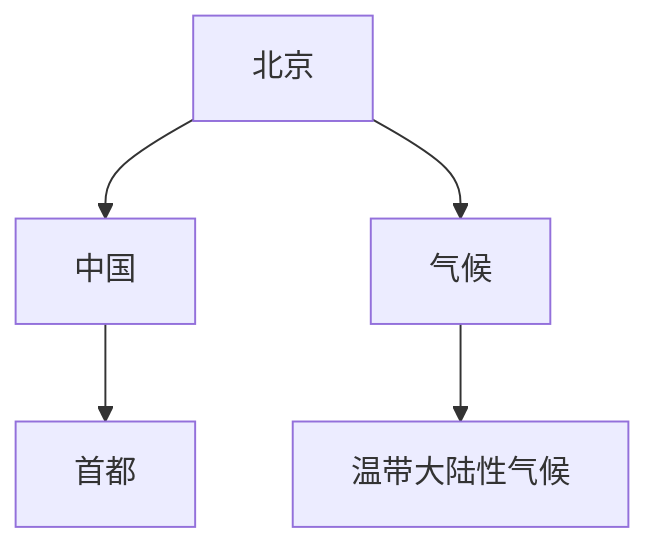

                 

# 《知识图谱在智能问答系统中的应用与优化》

> **关键词：知识图谱、智能问答系统、查询优化、推理、质量评估**
>
> **摘要：本文将详细探讨知识图谱在智能问答系统中的应用与优化策略，从基础知识、应用实践到前沿技术，全面剖析知识图谱的原理和实现方法。**

## 《知识图谱在智能问答系统中的应用与优化》目录大纲

## 第一部分：基础知识与原理

### 第1章：知识图谱概述

#### 1.1 知识图谱的定义与重要性

知识图谱是一种用于结构化表示知识的图形模型，它通过实体和关系来构建一个复杂的知识网络。在人工智能和大数据时代，知识图谱已经成为智能问答系统、搜索引擎和推荐系统等领域的重要技术。

#### 1.2 知识图谱的基本结构

知识图谱主要由实体、属性和关系构成，其中实体是知识图谱的基本元素，关系用于描述实体之间的关联，属性则用于描述实体的特征。

#### 1.3 知识图谱的构建方法

知识图谱的构建方法包括知识抽取、知识融合和知识表示等步骤。知识抽取是从非结构化数据中提取出结构化知识的过程，知识融合则是将不同来源的知识进行整合，知识表示则是将知识以图谱的形式进行表示。

### 第2章：知识表示与存储

#### 2.1 知识表示方法

知识表示是知识图谱构建的核心步骤，常见的知识表示方法包括基于本体、基于规则和基于数据驱动的方法。

#### 2.2 知识存储系统

知识存储系统是知识图谱的底层支撑，常见的知识存储系统包括图数据库、关系数据库和NoSQL数据库等。

#### 2.3 数据模型选择

数据模型选择是知识图谱构建的重要环节，不同的数据模型适用于不同的应用场景。常见的知识图谱数据模型包括属性图、资源描述框架（RDF）和图计算框架等。

### 第3章：知识图谱查询与推理

#### 3.1 查询语言与算法

知识图谱查询语言是用于查询知识图谱的工具，常见的查询语言包括SPARQL和Cypher等。查询算法则是用于优化查询性能的方法，常见的查询算法包括图索引和并行查询等。

#### 3.2 图数据库查询优化

图数据库查询优化是提高知识图谱查询效率的重要手段，常见的优化方法包括索引优化、查询优化和缓存优化等。

#### 3.3 知识图谱推理方法

知识图谱推理是利用已知的事实推导出新的事实，常见的推理方法包括基于规则的推理和基于本体的推理等。

### 第4章：知识图谱质量评估

#### 4.1 质量评价指标

知识图谱质量评估是确保知识图谱质量和可靠性的重要步骤，常见的质量评价指标包括覆盖度、一致性、准确性和完整性等。

#### 4.2 质量评估方法

知识图谱质量评估方法包括手动评估、半自动评估和自动化评估等。

#### 4.3 质量优化策略

知识图谱质量优化策略包括数据清洗、知识融合和推理策略优化等。

## 第二部分：应用案例与实践

### 第5章：知识图谱在智能问答中的应用

#### 5.1 智能问答系统概述

智能问答系统是一种能够理解和回答用户问题的计算机系统，知识图谱在智能问答系统中扮演着知识库的角色。

#### 5.2 知识图谱问答模型

知识图谱问答模型是智能问答系统的核心，它包括问题解析、知识检索和答案生成等步骤。

#### 5.3 应用案例解析

本文将结合实际应用案例，详细解析知识图谱在智能问答系统中的应用。

### 第6章：知识图谱问答系统优化

#### 6.1 优化目标与策略

知识图谱问答系统优化目标是提高问答系统的性能和用户体验。

#### 6.2 数据预处理

数据预处理是知识图谱问答系统优化的关键步骤，包括数据清洗、数据转换和数据增强等。

#### 6.3 模型选择与调整

模型选择与调整是优化知识图谱问答系统的重要手段，包括模型选择、参数调整和模型融合等。

### 第7章：知识图谱问答系统评估与反馈

#### 7.1 评估方法与指标

知识图谱问答系统评估是确保系统性能和用户体验的重要环节，常见的评估方法包括自动化评估和用户评估等。

#### 7.2 用户反馈机制

用户反馈机制是提高知识图谱问答系统用户体验的重要手段，包括用户评价、反馈收集和反馈处理等。

#### 7.3 系统持续优化

系统持续优化是知识图谱问答系统发展的必然趋势，包括性能优化、功能优化和用户体验优化等。

## 第三部分：前沿技术与发展趋势

### 第8章：知识图谱相关技术进展

#### 8.1 知识图谱在多语言应用中的挑战与机遇

随着全球化的加速，知识图谱在多语言应用中的挑战和机遇并存。

#### 8.2 知识图谱与自然语言处理融合

知识图谱与自然语言处理技术的融合，为智能问答系统带来了新的发展机遇。

#### 8.3 知识图谱在非结构化数据中的应用

知识图谱在非结构化数据中的应用，为数据分析和挖掘提供了新的思路和方法。

### 第9章：知识图谱技术的未来趋势

#### 9.1 未来发展展望

知识图谱技术的未来发展，将朝着更加智能化、多样化和高效化的方向迈进。

#### 9.2 可能面临的挑战与应对策略

知识图谱技术在发展过程中，可能面临一些挑战，如数据质量、计算效率和推理能力等。

#### 9.3 开放式问题与未来研究方向

知识图谱技术还存在一些开放式问题，如知识图谱的自动构建、知识图谱的推理优化和知识图谱的伦理问题等，这些将成为未来研究的重点方向。

## 附录

### 附录A：知识图谱构建工具与资源

#### A.1 开源知识图谱构建工具

本文将介绍一些常用的开源知识图谱构建工具，如OpenKG、Jena和Neo4j等。

#### A.2 常用知识图谱数据集

本文将列举一些常用的知识图谱数据集，如DBpedia、YAGO和Freebase等。

#### A.3 知识图谱学习资源与教程

本文将推荐一些知识图谱学习资源与教程，帮助读者深入了解知识图谱的相关知识。

## 第一部分：基础知识与原理

知识图谱（Knowledge Graph）是一种用于结构化表示知识的图形模型，它通过实体（Entity）、属性（Attribute）和关系（Relationship）来构建一个复杂的知识网络。在人工智能和大数据时代，知识图谱已经成为智能问答系统、搜索引擎和推荐系统等领域的重要技术。

### 第1章：知识图谱概述

#### 1.1 知识图谱的定义与重要性

知识图谱是一种用于表示实体及其之间关系的数据模型，它通过图结构来组织知识，使得信息更加直观、易于理解和查询。知识图谱的定义可以从以下几个方面进行阐述：

1. **实体（Entity）**：实体是知识图谱中的基本元素，可以是人、地点、组织、事件等具体事物。例如，“北京”是一个实体，“苹果”也是一个实体。

2. **属性（Attribute）**：属性用于描述实体的特征，例如“北京的气候”是一个属性，它的值可以是“温带大陆性气候”。

3. **关系（Relationship）**：关系描述了实体之间的关联，例如“北京是中国的首都”，这里“北京”和“中国”之间是“首都”关系。

知识图谱的重要性体现在以下几个方面：

1. **信息组织**：知识图谱将散乱的信息组织成一个结构化的知识网络，使得信息更加易于理解和查询。

2. **知识推理**：知识图谱支持基于关系的推理，可以从已知的事实推导出新的结论，提高智能系统的推理能力。

3. **知识共享**：知识图谱可以跨领域、跨系统共享知识，促进知识的传播和利用。

4. **智能应用**：知识图谱为智能问答系统、搜索引擎和推荐系统提供了强大的知识库支持，提高了系统的智能水平。

#### 1.2 知识图谱的基本结构

知识图谱的基本结构主要包括实体、属性和关系，它们共同构成了知识图谱的图结构。知识图谱的图结构通常可以用以下方式表示：

- **实体节点（Entity Node）**：实体节点表示知识图谱中的具体实体，例如“北京”、“苹果”等。
- **关系边（Relationship Edge）**：关系边表示实体之间的关联，例如“北京是中国的首都”、“苹果是水果”等。
- **属性节点（Attribute Node）**：属性节点表示实体的属性，例如“气候”、“味道”等。
- **属性值边（Attribute Value Edge）**：属性值边表示实体属性的值，例如“北京的气候是温带大陆性气候”、“苹果的味道是甜的”等。

一个简单的知识图谱例子如下：



在这个例子中，实体节点包括“北京”、“中国”、“气候”，关系边包括“是”、“是”，属性节点包括“首都”、“气候”，属性值边包括“温带大陆性气候”。

#### 1.3 知识图谱的构建方法

知识图谱的构建方法主要包括知识抽取、知识融合和知识表示等步骤：

1. **知识抽取**：知识抽取是从非结构化数据中提取结构化知识的过程。常见的知识抽取方法包括命名实体识别（Named Entity Recognition, NER）、关系抽取（Relation Extraction）和属性抽取（Attribute Extraction）等。命名实体识别用于识别文本中的实体，关系抽取用于识别实体之间的关系，属性抽取用于识别实体的属性。

2. **知识融合**：知识融合是将来自不同来源的知识进行整合，以提高知识图谱的完整性和一致性。知识融合方法包括数据集成、数据清洗和数据融合等。数据集成是将不同来源的数据进行统一，数据清洗是去除数据中的错误和噪声，数据融合是将不同来源的数据进行合并。

3. **知识表示**：知识表示是将提取和融合的知识以图谱的形式进行表示。常见的知识表示方法包括属性图（Attribute Graph）、资源描述框架（Resource Description Framework, RDF）和图计算框架（Graph Computation Framework）等。属性图是一种基于属性的图结构，RDF是一种基于XML的语义网表示方法，图计算框架是一种用于大规模图计算的工具。

### 第2章：知识表示与存储

知识表示与存储是知识图谱构建的重要环节，它决定了知识图谱的性能、可扩展性和易用性。

#### 2.1 知识表示方法

知识表示方法是将知识以图形化的形式表示，以便于存储、查询和处理。常见的知识表示方法包括：

1. **属性图（Attribute Graph）**：属性图是一种基于属性的图结构，它将实体、属性和关系表示为图中的节点和边。每个节点都可以具有多个属性，每个属性都可以有多个值。属性图支持基于属性的查询和计算，适用于大规模图数据的存储和处理。

2. **资源描述框架（RDF）**：RDF是一种基于XML的语义网表示方法，它使用主体（Subject）、谓词（Predicate）和客体（Object）三元组来表示知识。RDF支持基于SPARQL的查询语言，适用于构建大规模语义网络。

3. **图计算框架（Graph Computation Framework）**：图计算框架是一种用于大规模图计算的工具，它支持图的存储、查询和计算。常见的图计算框架包括GraphX、Giraph和Neo4j等。

#### 2.2 知识存储系统

知识存储系统是知识图谱的底层支撑，它决定了知识图谱的性能和可扩展性。常见的知识存储系统包括：

1. **图数据库（Graph Database）**：图数据库是一种专门用于存储和查询图数据的数据库，它支持基于图结构的查询语言。常见的图数据库包括Neo4j、OrientDB和ArangoDB等。

2. **关系数据库（Relational Database）**：关系数据库是一种传统的数据库系统，它使用表结构来存储数据。虽然关系数据库不支持基于图结构的查询，但可以通过扩展来支持知识图谱的存储和查询。

3. **NoSQL数据库（NoSQL Database）**：NoSQL数据库是一种非关系型数据库，它支持基于键值对、文档、列族等数据模型的存储和查询。常见的NoSQL数据库包括MongoDB、Cassandra和HBase等。

#### 2.3 数据模型选择

数据模型选择是知识图谱构建的重要环节，它决定了知识图谱的性能、可扩展性和易用性。常见的数据模型选择包括：

1. **属性图模型（Attribute Graph Model）**：属性图模型适用于大规模图数据的存储和处理，它支持基于属性的查询和计算。属性图模型适用于需要复杂查询和计算的应用场景。

2. **RDF模型（RDF Model）**：RDF模型适用于构建大规模语义网络，它使用主体、谓词和客体三元组来表示知识。RDF模型适用于需要语义查询和推理的应用场景。

3. **图计算框架模型（Graph Computation Framework Model）**：图计算框架模型适用于大规模图计算，它支持图的存储、查询和计算。图计算框架模型适用于需要复杂图计算和计算性能的应用场景。

### 第3章：知识图谱查询与推理

知识图谱查询与推理是知识图谱应用的核心，它决定了知识图谱的查询效率和推理能力。

#### 3.1 查询语言与算法

知识图谱查询语言是用于查询知识图谱的工具，它支持基于图结构的查询。常见的查询语言包括：

1. **SPARQL**：SPARQL是一种基于RDF的查询语言，它支持基于主体的查询、谓词的查询和客体的查询。

2. **Cypher**：Cypher是Neo4j的查询语言，它支持基于路径的查询、关系类型的查询和节点属性的查询。

知识图谱查询算法是用于优化查询性能的方法，它包括：

1. **图索引**：图索引是一种用于加速查询的索引技术，它包括节点索引、关系索引和属性索引等。

2. **并行查询**：并行查询是一种用于加速查询的分布式计算技术，它通过将查询任务分布在多个计算节点上，实现查询性能的提升。

3. **缓存**：缓存是一种用于加速查询的技术，它通过将查询结果缓存到内存中，减少磁盘I/O操作，实现查询性能的提升。

#### 3.2 图数据库查询优化

图数据库查询优化是提高知识图谱查询效率的重要手段，它包括：

1. **索引优化**：索引优化是一种用于加速查询的优化技术，它包括创建合适的索引、优化索引结构和索引维护等。

2. **查询优化**：查询优化是一种用于加速查询的优化技术，它包括优化查询语句、优化查询计划和优化执行策略等。

3. **缓存优化**：缓存优化是一种用于加速查询的优化技术，它包括优化缓存策略、优化缓存存储和优化缓存一致性等。

#### 3.3 知识图谱推理方法

知识图谱推理是利用已知的事实推导出新的事实，它包括：

1. **基于规则的推理**：基于规则的推理是一种基于逻辑规则进行推理的方法，它通过将已知的事实与规则进行匹配，推导出新的结论。

2. **基于本体的推理**：基于本体的推理是一种基于本体论进行推理的方法，它通过将已知的事实与本体进行映射，推导出新的结论。

3. **基于图论推理**：基于图论的推理是一种基于图论进行推理的方法，它通过分析图结构，推导出新的结论。

### 第4章：知识图谱质量评估

知识图谱质量评估是确保知识图谱质量和可靠性的重要步骤，它包括：

1. **质量评价指标**：质量评价指标是用于衡量知识图谱质量的量化标准，它包括覆盖度、一致性、准确性和完整性等。

2. **质量评估方法**：质量评估方法包括手动评估、半自动评估和自动化评估等，它们分别适用于不同的评估场景。

3. **质量优化策略**：质量优化策略是用于提高知识图谱质量的措施，它包括数据清洗、知识融合和推理策略优化等。

### 第二部分：应用案例与实践

### 第5章：知识图谱在智能问答中的应用

智能问答系统是一种能够理解和回答用户问题的计算机系统，它广泛应用于客户服务、智能助理和智能搜索等领域。知识图谱在智能问答系统中扮演着知识库的角色，它通过结构化的知识网络，支持智能问答系统的知识检索、推理和回答生成。

#### 5.1 智能问答系统概述

智能问答系统（Intelligent Question Answering System）是一种基于人工智能技术，能够理解和回答用户问题的系统。它通常包括以下几个关键组成部分：

1. **问题解析器（Question Parser）**：问题解析器负责将用户输入的自然语言问题转化为结构化的查询，以便后续处理。

2. **知识检索器（Knowledge Retriever）**：知识检索器根据问题解析器生成的查询，从知识图谱中检索相关的知识实体和关系。

3. **推理引擎（Reasoning Engine）**：推理引擎利用知识图谱中的关系和规则，对检索到的知识进行推理，以生成完整的答案。

4. **答案生成器（Answer Generator）**：答案生成器根据推理结果，生成自然语言形式的回答，并将其呈现给用户。

#### 5.2 知识图谱问答模型

知识图谱问答模型（Knowledge Graph-based Question Answering Model）是智能问答系统的核心，它通过将用户问题和知识图谱中的知识进行映射，实现问答功能。一个典型的知识图谱问答模型包括以下步骤：

1. **问题解析**：将用户输入的自然语言问题转化为结构化的查询，通常涉及命名实体识别（NER）、关系抽取和关键词提取等。

2. **知识检索**：根据问题解析器生成的查询，从知识图谱中检索相关的知识实体和关系。这一步通常使用图数据库的查询语言，如SPARQL。

3. **知识融合**：将多个源头的知识进行融合，确保答案的准确性和一致性。知识融合可以通过合并相似实体、去除冗余信息和修正错误信息来实现。

4. **推理和答案生成**：利用知识图谱中的关系和规则，对检索到的知识进行推理，生成自然语言形式的回答。这一步可能涉及基于规则的推理、图推理和模板匹配等技术。

#### 5.3 应用案例解析

以下是一个知识图谱问答系统的应用案例：

**案例**：用户输入问题：“北京是中国的哪个城市？”

**步骤**：

1. **问题解析**：问题解析器识别出关键信息：“北京”、“中国”和“城市”。

2. **知识检索**：知识图谱检索到“北京”是“中国”的一个“城市”。

3. **知识融合**：无需进一步融合，因为检索到的信息已经准确无误。

4. **推理和答案生成**：根据知识图谱中的关系，推理出答案：“北京是中国的首都。”

**实现细节**：

- **知识图谱构建**：构建一个包含城市、国家和首都等实体的知识图谱。

  ```mermaid
  graph TB
  A[北京] --> B[中国]
  B --> C[首都]
  A --> C
  ```

- **查询语言**：使用SPARQL进行知识检索。

  ```sql
  PREFIX rdfs: <http://www.w3.org/2000/01/rdf-schema#>
  PREFIX owl: <http://www.w3.org/2002/07/owl#>
  PREFIX : <http://example.org/>
  SELECT ?city ?country WHERE {
    ?city a :City ;
          rdfs:label "北京"@en ;
          :locatedIn/:country.
  }
  ```

- **答案生成**：根据检索结果生成自然语言回答。

  ```text
  北京是中国的首都。
  ```

### 第6章：知识图谱问答系统优化

知识图谱问答系统的性能直接影响用户体验，因此优化知识图谱问答系统是提升系统性能的关键。以下是一些优化策略：

#### 6.1 优化目标与策略

优化目标主要包括提高查询效率、降低推理复杂度和提升答案质量等。优化策略包括以下几个方面：

1. **查询优化**：通过索引优化、查询重写和并行查询等手段提高查询效率。

2. **推理优化**：通过规则优化、推理路径优化和缓存策略等降低推理复杂度。

3. **知识优化**：通过数据清洗、知识融合和知识扩展等手段提升答案质量。

#### 6.2 数据预处理

数据预处理是优化知识图谱问答系统的关键步骤，主要包括以下任务：

1. **数据清洗**：去除噪声数据和错误信息，确保知识图谱的准确性。

2. **数据转换**：将不同格式的数据转换为统一的格式，便于后续处理。

3. **数据增强**：通过引入同义词、词干和实体扩展等技术，丰富知识库。

#### 6.3 模型选择与调整

模型选择与调整是优化知识图谱问答系统的核心步骤，包括：

1. **模型选择**：根据应用场景选择合适的问答模型，如基于规则模型、基于模板模型和基于机器学习模型等。

2. **模型调整**：通过超参数调整、模型融合和迁移学习等手段优化模型性能。

### 第7章：知识图谱问答系统评估与反馈

评估与反馈是确保知识图谱问答系统性能和用户体验的重要环节，以下是一些评估方法与策略：

#### 7.1 评估方法与指标

评估方法主要包括自动化评估和用户评估等。评估指标包括：

1. **准确率（Accuracy）**：正确回答的数量与总回答数量的比值。

2. **召回率（Recall）**：正确回答的数量与实际正确回答数量的比值。

3. **F1分数（F1 Score）**：准确率和召回率的调和平均值。

4. **用户满意度（User Satisfaction）**：用户对系统回答的满意度评分。

#### 7.2 用户反馈机制

用户反馈机制是收集用户意见和建议的重要途径，包括：

1. **反馈收集**：通过用户调查、问卷调查和在线评价等方式收集用户反馈。

2. **反馈处理**：分析用户反馈，识别问题并提出改进措施。

3. **反馈整合**：将用户反馈整合到知识图谱问答系统的迭代开发中。

#### 7.3 系统持续优化

系统持续优化是知识图谱问答系统发展的必然趋势，包括：

1. **性能优化**：持续关注系统性能，通过技术改进和优化手段提高系统性能。

2. **功能优化**：根据用户需求和市场变化，不断更新和扩展系统功能。

3. **用户体验优化**：通过界面设计和交互优化，提升用户使用体验。

### 第三部分：前沿技术与发展趋势

知识图谱技术在不断演进，新的技术与应用正在不断涌现。以下是一些前沿技术与发展趋势：

#### 8.1 知识图谱在多语言应用中的挑战与机遇

多语言知识图谱构建与查询是当前的研究热点，它面临的挑战包括：

1. **语言差异**：不同语言在语法、语义和词汇上存在差异，给知识图谱构建与查询带来困难。

2. **数据稀缺**：某些语言的数据资源相对较少，难以构建全面的语

