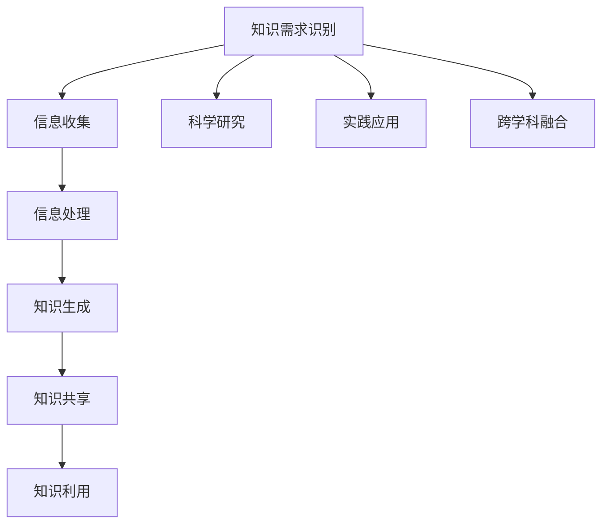

                 

### 第1章：知识产生的背景与基础

#### 1.1 知识的定义与分类

知识可以被定义为信息、事实、技能、判断和经验的集合，它是人类认知活动的产物。知识通常被分为以下几类：

- **显性知识**：以文字、图片、声音等形式存在，易于传播和分享。
- **隐性知识**：存在于个体内部，如个人习惯、思维模式和直觉，难以用语言表达。

##### 1.1.1 知识的定义

知识是一种结构化的信息，它有助于个体或组织理解和解决问题。知识不同于信息，信息是未经过处理的数据，而知识是对信息进行了加工、分析和整合的结果。知识具有以下特点：

1. **系统性**：知识是由多个部分组成的系统，各部分之间相互关联，构成一个整体。
2. **动态性**：知识是不断发展的，随着环境和时间的推移，知识会不断更新和扩展。
3. **价值性**：知识对个体或组织具有价值，可以用于决策、创新和解决问题。

##### 1.1.2 知识的分类

根据知识的不同特性，可以将知识分为以下几类：

- **事实知识**：关于客观事实的知识，如历史事件、科学定律等。
- **技能知识**：关于如何做事情的知识，如编程技能、烹饪技巧等。
- **价值知识**：关于信仰、价值观、道德标准等知识。
- **过程知识**：关于如何进行决策、规划和管理等知识。

事实知识和技能知识属于显性知识，它们可以通过文字、图片、视频等形式传播。而价值知识和过程知识属于隐性知识，它们通常存在于个体内部，难以用语言表达，但它们对个体或组织的决策和行为具有重要影响。

#### 1.2 知识产生的动力

知识产生的动力包括以下几个方面：

##### 1.2.1 科技进步对知识产生的影响

科技进步是知识产生的核心动力之一。随着科技的不断进步，人类对自然和社会的认识不断深化，新的知识和理论不断涌现。例如，互联网和大数据技术的出现，为知识的快速生成和传播提供了新的平台和手段。

##### 1.2.2 社会需求对知识产生的影响

社会的需求是推动知识产生的重要因素。随着社会的发展和变化，人们对新知识的需求不断增加，这促使科研人员和企业不断进行创新，以产生满足社会需求的新知识。例如，环保意识的提高，推动了绿色技术和可持续发展的研究。

##### 1.2.3 个体探索与知识创造

个体的好奇心和探索精神也是知识产生的重要动力。个人通过阅读、实践、思考等方式不断积累知识，同时也在探索过程中创造出新的知识。例如，科学家通过实验和研究，不断发现新的科学定律和理论。

#### 1.3 知识产生的机制

知识产生的机制是一个复杂的过程，它包括以下几个阶段：

##### 1.3.1 知识创新过程

知识创新是知识产生的关键过程。它包括以下步骤：

1. **需求识别**：确定社会和个体对知识的需求。
2. **信息收集**：收集与需求相关的信息。
3. **信息处理**：对收集到的信息进行加工、分析和整合。
4. **知识生成**：将处理后的信息转化为知识。

##### 1.3.2 知识创造的源泉

知识创造的源泉主要包括以下几个方面：

- **科学研究**：通过实验、观察和理论分析产生新的知识。
- **实践应用**：通过实际操作和经验总结产生新的知识。
- **跨学科融合**：通过不同学科的交叉和融合产生新的知识。

例如，物理学家通过实验和理论分析，发现了新的物理定律；工程师通过实际操作和经验总结，发明了新的技术设备；而跨学科研究则产生了如生物信息学、环境科学等新的研究领域。

#### 1.4 知识管理的概念与重要性

知识管理是指通过系统的方法和技术，对知识进行收集、存储、共享和利用的过程。知识管理对于组织的生存和发展至关重要，因为它能够：

- **提高组织的知识共享和创新能力**：通过知识管理，组织可以有效地共享知识，促进创新和协作，提高整体创新能力。
- **增强组织的适应性和竞争力**：知识管理使组织能够迅速适应环境变化，抓住市场机遇，提高竞争力。
- **提高组织的决策质量和效率**：通过知识管理，组织可以快速获取所需信息，提高决策质量和效率。

例如，企业通过知识管理，可以更好地了解市场需求，制定正确的战略决策；科研机构通过知识管理，可以更好地利用科研成果，推动科技发展。

### Mermaid 流程图

以下是一个简化的知识产生和知识管理的Mermaid流程图：

在这个流程图中，A代表知识需求识别，B代表信息收集，C代表信息处理，D代表知识生成，E代表科学研究，F代表实践应用，G代表跨学科融合，H代表知识共享，I代表知识利用。这个流程图展示了知识从产生到利用的完整过程。

### 1.5 知识管理的方法与技术

知识管理涉及多种方法和技术，包括：

- **知识库**：知识库是存储和管理知识的重要工具。它通过分类、标签、搜索等功能，帮助用户快速找到所需知识。
- **专家系统**：专家系统是一种基于专家知识的计算机程序，它可以用于问题诊断、决策支持等。专家系统通过模拟专家的思维方式，为用户提供智能化的建议。
- **协作平台**：协作平台是一种支持团队协作和知识共享的工具。它包括讨论区、文档共享、任务管理等功能，促进团队成员之间的信息交流和协作。
- **数据挖掘与人工智能**：数据挖掘和人工智能技术可以用于发现知识模式和预测知识需求。通过分析大量的数据，可以识别出潜在的规律和趋势，为知识管理提供支持。

#### 1.6 知识管理的发展趋势

未来，知识管理将继续朝着以下方向发展：

- **智能化**：随着人工智能技术的发展，知识管理将变得更加智能化。通过自动化和智能化技术，可以更高效地管理和利用知识。
- **个性化**：知识管理将更加注重个性化服务。根据用户的需求和偏好，提供个性化的知识推荐和服务。
- **全球化**：随着全球化的深入，知识管理将跨越地域界限，实现全球范围内的知识共享和协作。
- **开放共享**：开放共享将成为知识管理的重要理念。通过开放共享，可以最大限度地发挥知识的价值，促进知识的广泛传播和应用。

### 1.7 本章小结

知识产生是知识生命周期的起点，它受到科技进步、社会需求和个体探索的驱动。通过有效的知识管理，组织可以更好地利用知识，提高创新能力和竞争力。本章介绍了知识的基本概念、产生的动力和机制，以及知识管理的重要性和方法。通过本章的学习，读者可以了解到知识产生的背景和基础，为后续章节的深入学习打下基础。

### 1.8 进一步阅读

对于想要深入了解知识管理和知识产生的读者，以下是一些推荐阅读材料：

- **书籍**：
  - Davenport, T. H., & Prusak, L. (2000). Working Knowledge: How Organizations Manage What They Know. Harvard Business School Press.
  - Nonaka, I., & Takeuchi, H. (1995). The Knowledge-Creating Company: How Japanese Companies Create the Dynamics of Innovation. Oxford University Press.

- **论文**：
  - Alavi, M., & Leidner, D. E. (2001). Knowledge Management and Knowledge Management Systems: Conceptual Foundations and Research Issues. MIS Quarterly, 25(1), 107-136.
  - Wenger, E. (2000). Communities of Practice and Social Learning Systems. Organization, 7(2), 225-246.

- **在线资源**：
  - [Knowledge Management Institute](https://www.kmi.co.uk/)
  - [Knowledge Management Frameworks](http://www.knowledge-management-frameworks.com/)

这些阅读材料提供了丰富的理论和实践经验，有助于读者进一步了解知识管理和知识产生的相关内容。

### 第2章：知识传播的渠道与方式

#### 2.1 知识传播的渠道

知识传播的渠道是指知识从产生者到接收者的传递路径。以下是几种常见的知识传播渠道：

##### 2.1.1 传统传播渠道

传统传播渠道主要包括以下几种：

- **书籍**：书籍是知识传播的重要载体，具有持久性和系统性。从古至今，书籍一直是知识传播的主要方式之一。例如，《红楼梦》和《西游记》等经典作品，通过书籍传播，影响了无数读者。

- **报纸和杂志**：报纸和杂志是传统媒体，具有广泛性和及时性。它们通过定期出版，将知识传播给大众。例如，《纽约时报》和《科学美国人》等知名杂志，通过报道最新科研成果和社会热点，促进了知识的传播。

- **讲座和研讨会**：讲座和研讨会是知识传播的面对面交流形式，有助于加深听众对知识的理解。例如，TED演讲和学术研讨会等，通过演讲者的分享和观众的互动，实现了知识的传播和交流。

##### 2.1.2 现代传播渠道

现代传播渠道借助互联网和数字技术，为知识传播提供了更多途径：

- **在线教育平台**：在线教育平台提供了丰富的课程资源和灵活的学习方式，有助于知识传播。例如，Coursera和edX等平台，通过提供在线课程，让用户可以随时随地进行学习。

- **社交媒体**：社交媒体平台如微博、微信等，通过用户之间的互动，实现了知识的快速传播和分享。例如，通过发布文章、转发信息和参与讨论，用户可以迅速获取和传播新知识。

- **电子邮件**：电子邮件是一种便捷的知识传播方式，可用于发送新闻简报、研究报告等。例如，企业通过定期发送内部邮件，向员工传递最新信息和知识。

##### 2.1.3 知识传播渠道的比较

传统传播渠道和现代传播渠道各有优缺点，以下是比较：

| 类别       | 传统传播渠道 | 现代传播渠道 |
|------------|--------------|--------------|
| 传播速度   | 较慢         | 快速         |
| 覆盖范围   | 有限         | 广泛         |
| 互动性     | 较低         | 高           |
| 成本       | 较高         | 较低         |
| 持久性     | 较强         | 较弱         |

未来，传统传播渠道和现代传播渠道可能会进一步融合，形成更加多元化、高效的知识传播生态系统。

#### 2.2 知识传播的方式

知识传播的方式是指知识在传播渠道中的传递形式。以下是几种常见的知识传播方式：

##### 2.2.1 语言传播

语言传播是通过口头或书面语言进行知识传递的方式。这种方式具有以下特点：

- **直接性**：知识可以直接传递给接收者，无需借助其他媒介。
- **互动性**：传播者和接收者可以进行实时互动，有助于加深对知识的理解。

语言传播的示例包括：

- **课堂讲授**：教师在课堂上通过口头讲解传递知识。
- **访谈节目**：主持人通过采访嘉宾传递知识。

##### 2.2.2 文字传播

文字传播是通过书籍、报纸、杂志、电子邮件等形式传递知识的方式。这种方式具有以下特点：

- **持久性**：文字信息可以长期保存，便于查阅。
- **系统性**：可以通过书籍和杂志等载体，系统地整理和传递知识。

文字传播的示例包括：

- **书籍**：通过书籍系统性地传递知识，如《红楼梦》、《西游记》等。
- **研究报告**：通过研究报告传递科学研究结果。

##### 2.2.3 技术传播

技术传播是通过互联网、社交媒体、在线教育等形式传递知识的方式。这种方式具有以下特点：

- **便捷性**：用户可以随时随地进行学习。
- **多样性**：可以结合文字、图片、视频等多种形式传递知识。

技术传播的示例包括：

- **在线课程**：通过在线教育平台提供的课程，传递专业知识。
- **博客和公众号**：通过博客和公众号发布文章，传播知识和观点。

#### 2.3 知识传播的效应

知识传播对个体和社会产生深远的影响。以下是知识传播的几种效应：

##### 2.3.1 知识传播对个体的影响

- **知识获取**：知识传播使个体能够获取新的知识和技能，提高个人素质。
- **思维能力**：知识传播有助于培养个体的思维能力，如分析、综合、评价等。
- **职业发展**：知识传播对个体的职业发展具有重要影响，有助于提升就业竞争力和职业能力。

##### 2.3.2 知识传播对社会的影响

- **科技创新**：知识传播推动科技创新和社会进步，促进经济发展。
- **文化传播**：知识传播促进文化的传承和多样性，丰富社会文化生活。
- **教育普及**：知识传播有助于提高全民受教育水平，推动教育普及。

##### 2.3.3 知识传播的可持续性

知识传播的可持续性是指知识在长期传播过程中保持活力和有效性的能力。为了实现知识传播的可持续性，需要：

- **优化知识传播渠道**：提高知识传播的速度和效率。
- **加强知识管理**：确保知识的系统性、准确性和可靠性。
- **推动知识共享**：鼓励个体和机构之间的知识共享与合作。

#### 2.4 知识传播的策略

为了有效进行知识传播，需要采取以下策略：

- **确定传播目标**：明确知识传播的目标受众和传播内容。
- **选择合适渠道**：根据知识传播的目标和特点，选择合适的传播渠道。
- **优化传播内容**：确保传播内容具有针对性、系统性和可理解性。
- **加强互动与反馈**：与受众进行互动，收集反馈，不断优化传播策略。

#### 2.5 本章小结

知识传播是知识生命周期的重要组成部分，它通过多种渠道和方式，将知识传递给受众。有效的知识传播有助于提升个体的知识水平和思维能力，推动社会的科技创新和文化发展。面对知识传播的挑战，需要采取有效的策略和措施，实现知识传播的可持续性。

#### 2.6 进一步阅读

对于想要深入了解知识传播的读者，以下是一些推荐阅读材料：

- **书籍**：
  - 赵军. 知识传播学[M]. 北京：北京大学出版社，2017.
  - 王牌，张辉. 社交媒体时代的知识传播研究[M]. 上海：复旦大学出版社，2018.

- **论文**：
  - 王俊秀，李明. 基于社交媒体的知识传播机制研究[J]. 现代传播，2019，40（3）：18-23.
  - 蔡丽华，李晓明. 知识传播的互联网化趋势研究[J]. 图书情报工作，2020，64（5）：1-7.

- **在线资源**：
  - [Knowledge Management Institute](https://www.kmi.co.uk/)
  - [Digital Marketing Institute](https://www.dmi.org/)

这些阅读材料提供了丰富的理论和实践经验，有助于读者进一步了解知识传播的相关内容。

### 第3章：知识的利用与应用

#### 3.1 知识利用的领域

知识利用领域广泛，涵盖了经济、科技、文化等多个方面。以下是知识利用的主要领域：

##### 3.1.1 经济领域

在经济领域中，知识利用体现在以下几个方面：

- **科技创新**：知识为科技创新提供了理论基础和技术支持，推动了新产业、新产品的产生。例如，互联网技术的发展带来了电子商务、大数据等新兴产业的兴起。
- **企业管理**：知识管理有助于提升企业的管理水平，提高企业的核心竞争力。例如，通过数据分析和决策支持系统，企业可以更好地进行市场预测和资源调配。
- **市场营销**：知识营销是一种新型的营销策略，通过传播和利用知识，提升产品的市场竞争力。例如，通过社交媒体和内容营销，企业可以与消费者建立更紧密的联系，提高品牌知名度。

##### 3.1.2 科技领域

在科技领域中，知识利用主要体现在以下几个方面：

- **科学研究**：知识为科学研究提供了丰富的理论和方法，推动了科学技术的进步。例如，物理学中的量子力学、生物学中的基因编辑技术等，都是知识利用的典范。
- **技术开发**：知识应用于技术开发，促进了新技术的产生和应用。例如，5G技术、人工智能技术等，都是基于知识的创新成果。
- **技术转移**：知识转移是将研究成果转化为实际应用的关键环节，有助于推动科技产业化。例如，高校和科研院所的科技成果通过专利转让、技术转让等方式，实现了从实验室到市场的转化。

##### 3.1.3 文化领域

在文化领域中，知识利用体现在以下几个方面：

- **文化遗产保护**：知识用于文化遗产的保护和研究，促进了文化多样性的传承。例如，通过数字化技术，将文化遗产保存和传播。
- **文化传播**：知识传播有助于推动文化的传承和传播，提高文化的影响力。例如，通过书籍、电影、网络等渠道，将中华文化传播到世界各地。
- **文化创意产业**：知识创意产业是知识利用的新兴领域，通过知识的应用和创新，推动了文化产业的繁荣。例如，动漫、游戏、设计等文化创意产业，都是知识利用的成果。

#### 3.2 知识利用的途径

知识利用的途径包括知识创新、知识应用和知识传播与利用的结合。以下是这些途径的详细解释：

##### 3.2.1 知识创新

知识创新是指通过创造性思维和方法，将现有的知识进行重新组合和创造，产生新的知识。知识创新包括以下几个方面：

- **原创性研究**：通过原创性研究，产生新的理论、方法和技术。例如，科学家通过实验和理论分析，发现了新的科学定律。
- **交叉学科研究**：通过交叉学科研究，实现不同领域知识的融合和创新。例如，生物信息学是生物学和计算机科学的交叉领域，通过两者的融合，产生了新的研究方法。
- **实践创新**：通过实践中的创新，将理论知识应用于实际，解决实际问题。例如，企业通过管理创新，提高了生产效率和质量。

##### 3.2.2 知识应用

知识应用是指将已有的知识应用于实际，解决实际问题或创造新的价值。知识应用包括以下几个方面：

- **技术研发**：将理论知识应用于技术研发，推动新技术的产生和应用。例如，基于量子力学的研究，推动了量子计算技术的发展。
- **企业运营**：将知识应用于企业管理，提高企业的运营效率和市场竞争力。例如，通过数据分析，企业可以更好地进行市场预测和产品定价。
- **公共服务**：将知识应用于公共服务，提升公共服务的质量和效率。例如，通过信息技术，政府可以更好地提供公共服务，提高政府透明度和公信力。

##### 3.2.3 知识传播与利用的结合

知识传播与利用的结合是指通过有效的知识传播，提高知识的利用效率。以下是实现这一结合的几种方式：

- **教育培训**：通过教育培训，将知识传播给更多的人，提高整个社会的知识水平。例如，大学和职业培训学校通过开设课程，传授专业知识和技能。
- **知识共享**：通过知识共享，促进知识在不同个体和机构之间的流动和利用。例如，科研机构和高校通过学术会议和期刊，分享研究成果和学术观点。
- **知识服务平台**：通过知识服务平台，提供知识的检索、共享和应用服务，提高知识的利用效率。例如，在线教育平台通过提供课程和资源，帮助用户获取和利用知识。

#### 3.3 知识利用的挑战与机遇

知识利用过程中面临着一系列挑战和机遇。以下是这些挑战和机遇的详细解释：

##### 3.3.1 挑战

- **知识获取难度**：在信息爆炸的时代，获取有价值的知识变得越来越困难。个体和机构需要在海量信息中筛选

