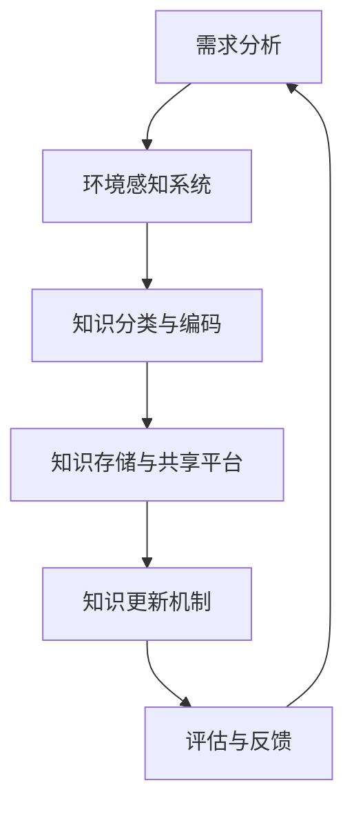
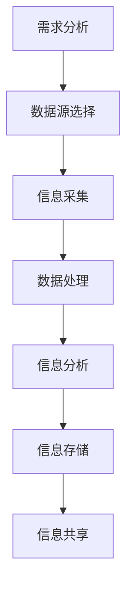
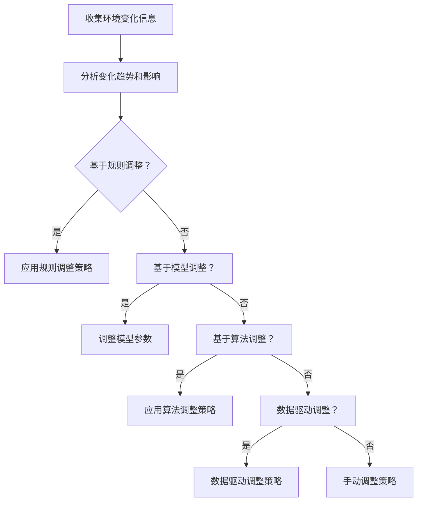

                 

# 《知识的适应性：在变化环境中的动态调整》

> **关键词：知识适应性、动态调整、知识管理、算法原理、实践应用**

> **摘要：本文深入探讨了知识适应性的核心概念，动态调整的理论基础及其在各个领域的应用。通过详细的案例分析，展示了知识适应性在变化环境中的重要性和实现方法，旨在为读者提供系统的理解和实践指导。**

## 引言与核心概念

### 1.1 书籍概述与目标

在当今快速变化的信息时代，知识已成为社会进步和经济发展的重要驱动力。知识管理作为一门学科，已经逐渐从理论研究走向实践应用。然而，随着环境的变化和技术的进步，知识的适应性成为一个关键问题。本文旨在探讨知识适应性的概念、理论基础、实践策略及其在各领域的应用，以期为知识管理实践提供新的思路和方法。

本文的主要目标是：
1. 界定知识适应性的核心概念，并阐述其在知识管理中的重要性。
2. 构建适应性知识管理模型，探讨其基本原理和关键要素。
3. 提出动态调整策略，并详细分析其在实践中的应用。
4. 通过案例分析，展示知识适应性在不同领域的具体实现。

### 1.2 知识适应性：概念界定与重要性

知识适应性指的是知识在动态变化环境中保持有效性的能力。它不仅包括知识的获取、存储和共享，还包括知识的应用和创新。在知识经济时代，知识的更新速度越来越快，环境的变化也越来越剧烈。因此，知识的适应性成为企业、组织和个体在面对不确定性时的关键能力。

知识适应性的重要性体现在以下几个方面：

1. **提高竞争力**：具备适应性的知识体系能够快速响应市场需求和环境变化，从而提高企业的竞争力。
2. **增强创新能力**：适应性的知识管理有助于激发创新思维，推动技术的进步和业务模式的创新。
3. **优化决策过程**：适应性的知识体系能够为决策者提供更加准确和及时的信息，优化决策过程。
4. **提升员工能力**：适应性的知识管理能够帮助员工不断提高自身技能和知识水平，从而提升整体绩效。

### 1.3 知识适应性的背景与现状

知识适应性并非一个全新的概念，但其研究和应用却随着信息技术的发展而逐渐受到重视。在过去几十年中，知识管理经历了从知识获取到知识共享，再到知识创新的演变过程。在这个过程中，知识的动态调整和适应性管理成为关键研究方向。

当前，知识适应性的研究主要集中在以下几个方面：

1. **适应性知识管理模型**：研究者们致力于构建能够适应环境变化的适应性知识管理模型，如基于模型的适应性知识管理系统（MBKMS）。
2. **动态调整策略**：研究各种动态调整策略，如基于算法的调整、基于规则的方法等，以提高知识体系的适应性。
3. **实践应用**：在各个领域探索知识适应性的具体应用，如企业知识管理、项目管理、教育领域等。
4. **技术工具**：开发适用于知识适应性管理的技术工具和平台，如大数据分析、人工智能等。

### 1.4 研究方法与结构

本文采用文献综述和案例分析相结合的方法，通过系统梳理相关理论和实践案例，探讨知识适应性的核心概念和动态调整策略。文章结构如下：

- **第一部分**：引言与核心概念，介绍知识适应性的背景、重要性以及本文的研究方法和结构。
- **第二部分**：适应性知识管理框架，详细阐述适应性知识管理的基本原理、模型构建和关键要素。
- **第三部分**：动态调整策略，探讨动态调整的理论基础、方法和技术，以及其实施策略。
- **第四部分**：知识适应性在实践中的应用，分析知识适应性在各个领域的应用案例，如企业知识管理、项目管理、教育领域等。
- **第五部分**：知识适应性：挑战与未来，探讨知识适应性面临的挑战和未来发展趋势。
- **第六部分**：结论，总结本文的主要观点，并给出未来研究的建议。

通过以上结构，本文旨在为知识适应性的研究和实践提供全面的指导。在接下来的部分中，我们将详细探讨适应性知识管理框架的构建和动态调整策略的实施。

---

## 适应性知识管理框架

### 2.1 适应性知识管理的基本原理

适应性知识管理是一种动态、灵活的知识管理方法，其核心在于如何使知识体系在变化的环境中保持其有效性和适用性。适应性知识管理的基本原理包括以下几个关键方面：

1. **知识动态更新**：知识体系不是静态的，而是一个不断演变的过程。适应性知识管理强调知识的动态更新，以适应环境的变化。这种动态更新包括知识的获取、验证、整合和应用。

2. **环境感知与适应**：适应性知识管理需要具备对环境变化的高度敏感性和快速响应能力。通过环境感知，管理者可以及时获取外部和内部的变化信息，从而调整知识管理策略。

3. **协作与创新**：适应性知识管理强调团队协作和知识共享，以促进创新。在动态环境中，知识的创新和改进是维持竞争力的重要手段。

4. **持续改进**：适应性知识管理是一种持续的过程，其目标是不断优化知识体系，提高其适应性和效率。通过定期的评估和反馈，可以及时发现和解决知识管理中的问题。

### 2.2 适应性知识管理模型构建

构建适应性知识管理模型是实施适应性知识管理的关键步骤。以下是一个简单的适应性知识管理模型构建过程：

1. **需求分析**：首先，对组织的需求进行深入分析，确定知识管理的目标和关键领域。需求分析包括市场环境分析、内部资源分析、用户需求分析等。

2. **环境感知系统**：构建一个环境感知系统，用于实时监测和收集外部和内部的变化信息。这些信息包括市场趋势、技术发展、竞争对手动态、内部运营数据等。

3. **知识分类与编码**：根据需求分析结果，对知识进行分类和编码。知识分类有助于组织知识的系统化和有序管理，而知识编码则是将知识转化为可存储、共享和检索的形式。

4. **知识存储与共享平台**：搭建一个高效的知识存储与共享平台，确保知识的可获取性和可共享性。这个平台应具备良好的用户体验和强大的数据管理能力。

5. **知识更新机制**：建立知识更新机制，确保知识体系能够及时更新和优化。知识更新可以基于预定的周期性任务，也可以基于实时监测到的变化信息。

6. **评估与反馈**：定期对知识管理效果进行评估，收集用户反馈，并根据评估结果和反馈调整知识管理策略。评估与反馈是适应性知识管理不断优化的关键环节。

### 2.2.1 Mermaid流程图：适应性知识管理模型

以下是一个简单的Mermaid流程图，展示了适应性知识管理模型的基本框架：



### 2.3 适应性知识管理的关键要素

适应性知识管理模型的有效实施依赖于几个关键要素，包括：

1. **组织文化**：适应性知识管理需要组织文化的支持，包括开放、共享和创新等价值观。只有当组织文化鼓励知识共享和协作时，适应性知识管理才能发挥其最大潜力。

2. **技术支持**：现代信息技术为适应性知识管理提供了强大的技术支持，包括大数据分析、人工智能、云计算等。通过利用这些技术，可以大大提高知识管理的效率和效果。

3. **人才储备**：具备知识管理能力和创新能力的人才对适应性知识管理至关重要。组织需要培养和引进具有相关知识和技能的专业人才，以推动适应性知识管理的发展。

4. **激励机制**：有效的激励机制可以激发员工的积极性和创造力，促进知识共享和知识创新。激励机制可以包括薪酬、晋升、荣誉等。

### 2.4 适应性知识管理的实施步骤

实施适应性知识管理需要遵循一定的步骤，以确保其有效性和可持续性。以下是适应性知识管理实施的四个主要步骤：

1. **规划与准备**：在实施前，需要对知识管理的目标和关键领域进行明确规划，并准备好所需的技术和资源。这一步骤包括需求分析、环境感知系统的搭建、知识分类与编码框架的制定等。

2. **模型构建**：根据规划结果，构建适应性知识管理模型。这一步骤包括搭建知识存储与共享平台、建立知识更新机制、制定评估与反馈机制等。

3. **模型运行**：在模型构建完成后，开始运行模型，并进行实时监测和调整。这一步骤需要持续进行，以保持知识体系的动态更新和适应性。

4. **优化与改进**：根据评估与反馈结果，对知识管理模型进行优化和改进。这一步骤包括调整知识分类与编码规则、优化知识存储与共享平台、改进知识更新机制等。

通过以上步骤，组织可以逐步构建和优化适应性知识管理模型，提高知识管理的效率和效果。

### 2.5 适应性知识管理案例分析

以下是一个适应性知识管理的实际案例，通过该案例可以更直观地理解适应性知识管理的具体实施过程：

**案例背景**：某大型制造企业面临着市场竞争日益激烈、技术更新速度加快的挑战。为了保持竞争优势，该企业决定引入适应性知识管理，以提高知识获取、共享和应用的效率。

**实施步骤**：

1. **需求分析**：企业对内部业务流程、外部市场环境进行了全面分析，确定了知识管理的关键领域，如产品研发、市场分析、客户服务等。

2. **环境感知系统**：企业搭建了一个实时监测市场动态和内部运营数据的系统，用于收集和分析外部和内部的变化信息。

3. **知识分类与编码**：企业根据需求分析结果，对各类知识进行了分类和编码，建立了统一的知识编码标准，确保知识的系统化和有序管理。

4. **知识存储与共享平台**：企业利用云计算技术搭建了一个高效的知识存储与共享平台，实现了知识的高效获取和共享。

5. **知识更新机制**：企业制定了定期知识更新策略，根据市场变化和内部需求，定期更新知识库中的内容。

6. **评估与反馈**：企业定期对知识管理效果进行评估，通过用户反馈和数据分析，发现并解决了知识管理中的问题。

**实施效果**：通过适应性知识管理的实施，企业实现了知识的快速获取和共享，提高了产品研发和市场响应速度，增强了市场竞争力。

### 2.6 适应性知识管理的挑战与未来

适应性知识管理在实施过程中面临一些挑战，包括：

1. **文化阻力**：组织文化的不支持可能导致知识共享和创新的障碍。
2. **技术挑战**：构建和维护适应性知识管理模型需要先进的技术支持，这可能带来技术挑战。
3. **人才短缺**：具备知识管理能力和创新能力的人才短缺可能影响适应性知识管理的效果。

未来，适应性知识管理的研究和发展方向包括：

1. **智能化**：利用人工智能和大数据技术，提高知识管理的智能化水平。
2. **个性化**：根据用户需求和个性化特征，提供个性化的知识服务。
3. **全球化**：适应全球化趋势，构建跨国界的适应性知识管理体系。

通过不断克服挑战和探索发展方向，适应性知识管理将在未来发挥更大的作用，为组织提供持续的创新动力和竞争优势。

---

在构建适应性知识管理模型的过程中，环境感知系统是至关重要的一环。它不仅负责收集和分析外部和内部的变化信息，还为知识管理提供了实时、动态的数据支持。本文将详细探讨环境感知系统的构建和实现，以期为适应性知识管理模型的构建提供理论基础和实践指导。

### 3.1 环境感知系统的理论基础

环境感知系统是适应性知识管理模型的重要组成部分，其理论基础主要包括以下几个方面：

1. **系统论**：系统论认为，系统是由相互联系、相互作用的元素组成的整体。环境感知系统通过收集、处理和分析信息，形成一个动态的、开放的系统。

2. **信息论**：信息论揭示了信息的本质和特征，为环境感知系统的设计和实现提供了理论基础。信息论中的信息度量、信息传输、信息处理等概念，对环境感知系统的构建具有重要意义。

3. **知识管理理论**：知识管理理论探讨了知识获取、共享、应用和创新的过程。环境感知系统作为知识管理的一部分，需要遵循知识管理的基本原则和方法。

4. **大数据分析**：大数据分析技术为环境感知系统提供了强大的数据处理和分析能力。通过大数据分析，可以从海量数据中提取有价值的信息，为知识管理提供支持。

### 3.2 环境感知系统的构建方法

环境感知系统的构建主要包括以下几个步骤：

1. **需求分析**：首先，对组织的需求进行深入分析，确定需要收集和处理的信息类型和来源。需求分析包括市场动态、技术趋势、竞争对手信息、内部运营数据等。

2. **数据源选择**：根据需求分析结果，选择合适的数据源。数据源可以是内部数据库、外部公开数据、社交媒体、行业报告等。

3. **信息采集**：使用数据采集工具和技术，从选定的数据源中获取信息。信息采集技术包括爬虫、API调用、网络爬虫等。

4. **数据处理**：对采集到的信息进行清洗、过滤、转换等处理，使其符合知识管理系统的要求。数据处理技术包括数据清洗、数据整合、数据挖掘等。

5. **信息分析**：利用大数据分析技术，对处理后的信息进行分析，提取有价值的信息。信息分析技术包括统计分析、机器学习、数据可视化等。

6. **信息存储**：将分析后的信息存储到知识管理系统中，以便后续的查询和应用。信息存储技术包括数据库、数据仓库、NoSQL数据库等。

7. **信息共享**：构建信息共享平台，实现信息的共享和协同。信息共享技术包括分布式存储、分布式计算、区块链等。

### 3.2.1 Mermaid流程图：环境感知系统构建过程

以下是一个简单的Mermaid流程图，展示了环境感知系统的构建过程：



### 3.3 环境感知系统的关键技术

环境感知系统的构建依赖于多种关键技术，包括数据采集、数据处理、信息分析和信息存储等。以下是这些关键技术的详细说明：

1. **数据采集**：数据采集是环境感知系统的第一步，其核心任务是获取所需的信息。数据采集技术包括：

   - **爬虫**：通过网络爬虫技术，可以自动获取网页、数据库等公开数据。
   - **API调用**：通过调用第三方API，获取实时数据和公共数据。
   - **物联网设备**：利用物联网设备，采集物理环境中的数据，如传感器数据。

2. **数据处理**：数据处理是对采集到的信息进行清洗、转换和整合的过程。数据处理技术包括：

   - **数据清洗**：去除重复、错误、缺失的数据，提高数据质量。
   - **数据整合**：将来自不同来源的数据进行整合，形成统一的数据视图。
   - **数据挖掘**：利用数据挖掘技术，从海量数据中提取有价值的信息。

3. **信息分析**：信息分析是对处理后的信息进行深入分析，提取有价值的信息。信息分析技术包括：

   - **统计分析**：利用统计学方法，对数据进行分析，提取数据特征。
   - **机器学习**：通过机器学习算法，从数据中学习规律，进行预测和分析。
   - **数据可视化**：通过数据可视化技术，将分析结果以图形、图表等形式展示。

4. **信息存储**：信息存储是将分析后的信息存储到知识管理系统中，以便后续的查询和应用。信息存储技术包括：

   - **数据库**：用于存储结构化数据，如关系数据库。
   - **数据仓库**：用于存储海量数据，如大数据技术。
   - **NoSQL数据库**：用于存储非结构化数据，如文档、图像等。

### 3.4 环境感知系统的案例分析

以下是一个环境感知系统的实际案例，通过该案例可以更直观地理解环境感知系统的具体实现过程：

**案例背景**：某大型电商企业希望通过环境感知系统，实时了解市场动态、竞争对手信息和内部运营数据，以提高市场响应速度和运营效率。

**实施步骤**：

1. **需求分析**：企业对市场动态、竞争对手信息和内部运营数据进行了详细的需求分析，确定了需要收集和分析的信息类型和来源。

2. **数据源选择**：企业选择了多个数据源，包括市场调查数据、竞争对手网站数据、社交媒体数据和内部运营数据。

3. **信息采集**：企业使用爬虫技术，自动采集了竞争对手网站和社交媒体上的信息；通过API调用，获取了市场调查数据和内部运营数据。

4. **数据处理**：企业对采集到的信息进行了清洗、过滤和整合，形成统一的数据视图。

5. **信息分析**：企业利用大数据分析技术，对处理后的信息进行了深入分析，提取了市场趋势、竞争对手动态和运营绩效等信息。

6. **信息存储**：企业将分析后的信息存储到数据仓库中，以便后续的查询和应用。

7. **信息共享**：企业搭建了一个信息共享平台，实现了各部门之间的信息共享和协同。

**实施效果**：通过环境感知系统的实施，企业实现了对市场动态的实时监控，提高了市场响应速度和运营效率，增强了市场竞争力。

### 3.5 环境感知系统的挑战与未来

环境感知系统在实施过程中面临一些挑战，包括：

1. **数据质量**：数据质量直接影响环境感知系统的效果。如何保证数据质量是一个重要问题。
2. **技术挑战**：构建环境感知系统需要先进的技术支持，这可能带来技术挑战。
3. **数据隐私**：在收集和处理数据时，如何保护用户隐私是一个重要问题。

未来，环境感知系统的研究和发展方向包括：

1. **智能化**：利用人工智能和大数据技术，提高环境感知系统的智能化水平。
2. **实时性**：提高环境感知系统的实时性，实现更快的数据采集和分析。
3. **适应性**：构建更加适应不同环境和业务场景的环境感知系统。

通过不断克服挑战和探索发展方向，环境感知系统将在未来发挥更大的作用，为适应性知识管理提供强大的支持。

---

## 动态调整策略

### 3.1 动态调整的理论基础

动态调整是适应性知识管理中的关键组成部分，其理论基础主要涉及以下几个方面：

1. **系统动力学**：系统动力学研究系统在时间上的变化规律，强调反馈机制和动态平衡。在适应性知识管理中，动态调整通过不断反馈和调整，实现知识体系的优化和适应。

2. **控制理论**：控制理论探讨如何通过控制变量来达到预期目标。在动态调整中，控制理论提供了算法和方法，用于调节知识管理系统的参数和策略，以适应环境变化。

3. **机器学习**：机器学习通过数据和算法，使系统具备自我学习和自我调整的能力。动态调整中的机器学习算法，如自适应神经网络、遗传算法等，能够根据环境变化自动调整知识管理策略。

4. **博弈论**：博弈论研究在多参与者环境中的决策和策略。在适应性知识管理中，博弈论可以帮助组织在不同的竞争环境中，通过动态调整策略来提高竞争力和合作效率。

### 3.1.1 伪代码：动态调整算法基础

以下是一个简单的伪代码示例，用于描述动态调整算法的基本框架：

```python
# 动态调整算法伪代码

function Dynamic_Adjustment(知识体系，环境变化信息)
    while 环境变化信息 != 稳定状态:
        收集环境变化信息
        分析变化趋势和影响
        根据分析结果调整知识管理策略
        更新知识体系
        记录调整过程和效果
    return 知识体系
```

### 3.2 动态调整的方法与技术

动态调整的方法和技术多种多样，以下是一些常见的动态调整方法：

1. **基于规则的动态调整**：这种方法通过预定义的规则，根据环境变化自动调整知识管理策略。规则可以是简单的条件判断，也可以是复杂的决策逻辑。

2. **基于模型的动态调整**：这种方法通过构建数学模型，根据环境变化信息自动调整模型参数，从而实现知识管理策略的动态调整。

3. **基于算法的动态调整**：这种方法利用算法，如遗传算法、粒子群优化等，自动搜索最优的知识管理策略，并根据环境变化进行实时调整。

4. **基于数据驱动的动态调整**：这种方法通过大数据分析和机器学习，从历史数据中提取知识，并根据实时数据调整知识管理策略。

### 3.2.1 Mermaid流程图：动态调整策略

以下是一个简单的Mermaid流程图，展示了动态调整策略的基本流程：



### 3.3 动态调整的实施策略

动态调整的实施策略主要包括以下几个步骤：

1. **初始评估**：在实施动态调整前，对当前知识管理系统的状况进行评估，确定调整的起点。

2. **环境监测**：建立实时环境监测系统，持续收集和记录环境变化信息。

3. **分析评估**：对收集到的环境变化信息进行分析和评估，确定变化趋势和影响。

4. **策略制定**：根据分析结果，制定相应的动态调整策略。策略可以是基于规则的、基于模型的、基于算法的或数据驱动的。

5. **策略实施**：根据制定好的策略，对知识管理系统进行实时调整。

6. **效果评估**：对调整后的效果进行评估，包括知识体系的适应性、运营效率、竞争力等。

7. **反馈优化**：根据评估结果，对动态调整策略进行反馈和优化，确保知识管理系统始终处于最佳状态。

### 3.4 动态调整的案例分析

以下是一个动态调整的实际案例，通过该案例可以更直观地理解动态调整策略的具体应用过程：

**案例背景**：某大型金融机构面临市场竞争加剧、客户需求多样化的挑战，希望通过动态调整策略，优化知识管理系统，提高市场响应速度和客户满意度。

**实施步骤**：

1. **初始评估**：金融机构对当前知识管理系统进行了全面评估，确定了知识管理的薄弱环节和优化方向。

2. **环境监测**：建立了实时客户需求监测系统，通过社交媒体、客户反馈等渠道，持续收集客户需求信息。

3. **分析评估**：对客户需求信息进行分析和评估，确定了市场趋势和客户需求变化。

4. **策略制定**：根据分析结果，制定了以下动态调整策略：

   - 基于规则的动态调整：针对常见客户问题，建立知识库和FAQ，自动回答客户问题。
   - 基于模型的动态调整：构建客户需求预测模型，根据实时数据调整服务策略。
   - 基于算法的动态调整：利用遗传算法，优化服务流程和资源配置。
   - 数据驱动的动态调整：通过大数据分析，实时调整营销策略和产品推荐。

5. **策略实施**：根据制定好的策略，对知识管理系统进行了实时调整，包括知识库更新、服务流程优化、资源配置调整等。

6. **效果评估**：调整后的系统显著提高了客户满意度、市场响应速度和运营效率。

7. **反馈优化**：根据客户反馈和运营数据，不断优化动态调整策略，确保知识管理系统始终适应市场变化。

**实施效果**：通过动态调整策略的实施，金融机构的市场竞争力得到了显著提升，客户满意度不断提高，实现了知识管理的优化和升级。

### 3.5 动态调整的挑战与未来

动态调整在实施过程中面临一些挑战，包括：

1. **技术挑战**：构建和实施动态调整系统需要先进的技术支持，如大数据分析、机器学习等。
2. **数据质量**：动态调整依赖于高质量的数据，数据质量直接影响调整效果。
3. **管理挑战**：动态调整需要组织文化和管理模式的支持，如何有效地推动和实施是一个挑战。

未来，动态调整的研究和发展方向包括：

1. **智能化**：利用人工智能和大数据技术，提高动态调整的智能化水平。
2. **实时性**：提高动态调整的实时性，实现更快的数据采集和分析。
3. **适应性**：构建更加适应不同环境和业务场景的动态调整策略。

通过不断克服挑战和探索发展方向，动态调整将在未来发挥更大的作用，为适应性知识管理提供强大的支持。

---

## 知识适应性在实践中的应用

### 4.1 企业层面的知识适应性

在企业层面，知识适应性是企业持续创新和市场竞争的关键。以下将探讨知识适应性在企业层面的应用，包括其具体实施策略和案例分析。

#### 4.1.1 数学模型与公式：企业知识适应性的数学描述

为了定量描述企业知识适应性，我们可以引入以下几个关键概念和数学模型：

1. **知识更新率**（$\eta$）：表示知识体系在单位时间内更新的速度。
2. **环境变化率**（$\alpha$）：表示环境在单位时间内变化的速度。
3. **知识适应性系数**（$A$）：表示知识体系对环境变化的适应能力。

数学模型如下：

$$
A = \frac{\eta}{\alpha}
$$

其中，$A$ 越大，表示知识体系对环境变化的适应性越强。为了提高企业的知识适应性，需要关注以下策略：

1. **提高知识更新率**：通过引入新技术、加强员工培训等手段，提高知识更新速度。
2. **降低环境变化率**：通过市场预测、风险管理等手段，降低外部环境变化对企业的影响。

#### 4.1.2 案例分析：企业知识适应性的实践应用

**案例背景**：某跨国科技公司（TechCorp）在面临快速变化的市场和技术环境时，希望通过提高知识适应性来保持市场竞争力。

**实施步骤**：

1. **需求分析**：TechCorp 对当前的市场和技术环境进行了全面分析，确定了需要提高知识适应性的关键领域，如产品研发、市场分析、客户服务。

2. **环境监测系统**：TechCorp 搭建了一个实时环境监测系统，通过大数据分析和人工智能技术，实时收集和分析市场变化、技术发展趋势等信息。

3. **知识更新机制**：TechCorp 制定了一个定期知识更新计划，根据环境监测系统的数据，定期更新知识库，包括市场趋势、技术发展、竞争对手信息等。

4. **自适应学习平台**：TechCorp 开发了一个自适应学习平台，通过机器学习和数据挖掘技术，自动识别和推荐员工需要学习的知识内容。

5. **评估与反馈**：TechCorp 定期对知识适应性进行评估，通过员工反馈和业务绩效分析，发现并解决知识管理中的问题。

**实施效果**：

通过上述策略的实施，TechCorp 的知识适应性得到了显著提高，具体表现为：

- **市场响应速度**：通过实时环境监测和自适应学习平台，TechCorp 能够更快地响应市场需求，推出新产品和服务。
- **创新力提升**：员工的知识水平不断提高，创新思维得到激发，推动了技术的进步和业务模式的创新。
- **客户满意度**：通过知识适应性管理，TechCorp 能够更好地满足客户需求，提高客户满意度和忠诚度。

### 4.2 项目管理中的知识适应性

在项目管理中，知识适应性是确保项目成功实施的关键。以下将探讨知识适应性在项目管理中的应用，包括其具体实施策略和案例分析。

#### 4.2.1 数学模型与公式：项目管理知识适应性的数学描述

为了定量描述项目管理中的知识适应性，我们可以引入以下几个关键概念和数学模型：

1. **项目变化率**（$\delta$）：表示项目在实施过程中发生的变更次数和幅度。
2. **知识更新率**（$\eta$）：表示项目知识体系在单位时间内更新的速度。
3. **知识适应性系数**（$B$）：表示项目对变化情况的适应能力。

数学模型如下：

$$
B = \frac{\eta}{\delta}
$$

其中，$B$ 越大，表示项目对变化情况的适应性越强。为了提高项目的知识适应性，需要关注以下策略：

1. **提高知识更新率**：通过引入新技术、加强团队培训等手段，提高项目知识更新速度。
2. **降低项目变化率**：通过项目规划和风险管理，减少项目实施过程中的变更。

#### 4.2.2 案例分析：项目管理知识适应性的实践应用

**案例背景**：某大型工程项目（ProjectX）在实施过程中，由于外部环境的变化和项目需求的变更，面临着知识适应性不足的问题。

**实施步骤**：

1. **需求分析**：项目团队对当前的项目环境、需求变化情况进行了全面分析，确定了需要提高知识适应性的关键领域，如技术方案、项目管理流程、团队协作。

2. **知识更新机制**：项目团队制定了一个定期知识更新计划，根据需求变化和外部环境的信息，定期更新项目知识库，包括技术方案、项目流程、最佳实践等。

3. **风险管理**：项目团队通过风险管理工具和方法，对项目变更进行了识别、评估和优先级排序，确保知识适应性管理在变更控制中得到有效实施。

4. **团队协作平台**：项目团队开发了一个协作平台，通过知识共享和实时沟通，提高了团队的知识更新速度和协作效率。

5. **评估与反馈**：项目团队定期对知识适应性进行评估，通过项目绩效分析和团队反馈，发现并解决知识管理中的问题。

**实施效果**：

通过上述策略的实施，ProjectX 的知识适应性得到了显著提高，具体表现为：

- **变更管理**：通过知识更新机制和风险管理，项目团队能够更好地应对需求变更，降低变更带来的风险。
- **项目效率**：通过团队协作平台和实时沟通，项目团队的工作效率得到了显著提升，项目实施进度得到保证。
- **项目成功**：通过提高知识适应性，ProjectX 顺利完成了项目任务，达到了预期目标。

### 4.3 教育领域的知识适应性

在教育领域，知识适应性是提高教育质量、促进学生全面发展的重要保障。以下将探讨知识适应性在教育领域的应用，包括其具体实施策略和案例分析。

#### 4.3.1 数学模型与公式：教育领域知识适应性的数学描述

为了定量描述教育领域的知识适应性，我们可以引入以下几个关键概念和数学模型：

1. **教育变化率**（$\epsilon$）：表示教育环境和教育内容在单位时间内的变化速度。
2. **知识更新率**（$\eta$）：表示教育知识体系在单位时间内更新的速度。
3. **知识适应性系数**（$C$）：表示教育知识体系对教育变化的适应能力。

数学模型如下：

$$
C = \frac{\eta}{\epsilon}
$$

其中，$C$ 越大，表示教育知识体系对教育变化的适应性越强。为了提高教育领域的知识适应性，需要关注以下策略：

1. **提高知识更新率**：通过引入新课程、新技术、新教学方法等手段，提高教育知识更新速度。
2. **降低教育变化率**：通过教育规划和课程设计，减少教育环境和教育内容的变化。

#### 4.3.2 案例分析：教育领域知识适应性的实践应用

**案例背景**：某知名大学（UniversityX）在教育改革过程中，面临着知识适应性不足的问题，希望通过提高知识适应性，提升教育质量和学生满意度。

**实施步骤**：

1. **需求分析**：大学对当前的教育环境和学生需求进行了全面分析，确定了需要提高知识适应性的关键领域，如课程设计、教学方法、教育资源。

2. **教育知识更新机制**：大学制定了一个定期教育知识更新计划，根据教育环境的变化和学生需求，定期更新教育知识库，包括新课程、新技术、新教学方法等。

3. **教育创新实验室**：大学建立了教育创新实验室，通过实践和实验，探索新的教育方法和教学模式，提高教育知识更新速度。

4. **师生互动平台**：大学开发了一个师生互动平台，通过在线交流和协作，提高教师的知识更新速度和学生的学习效果。

5. **评估与反馈**：大学定期对知识适应性进行评估，通过学生反馈和教学评估，发现并解决教育知识管理中的问题。

**实施效果**：

通过上述策略的实施，UniversityX 的知识适应性得到了显著提高，具体表现为：

- **教学质量**：通过教育知识更新机制和创新实验室，大学的教学质量得到了显著提升，学生的学习成果和满意度不断提高。
- **教育创新**：通过教育创新实验室和师生互动平台，大学的教育方法和教学模式得到了不断创新，推动了教育改革的深入。
- **学生发展**：通过提高知识适应性，大学能够更好地适应学生需求，促进学生全面发展，提高了学生的综合素质和竞争力。

### 4.4 总结与展望

知识适应性在各个领域的应用，已经证明了其对于组织、项目和教育的持续发展的重要性。通过构建适应性知识管理框架、实施动态调整策略，以及具体的案例分析，我们可以看到知识适应性在实际操作中的具体体现。

未来，知识适应性的研究和发展方向将集中在以下几个方面：

1. **智能化**：利用人工智能和大数据技术，提高知识适应性的智能化水平，实现自动化的知识更新和调整。
2. **个性化**：根据不同的用户需求和情境，提供个性化的知识服务，提高知识适应性。
3. **全球化**：适应全球化趋势，构建跨国界的知识适应性管理体系，提高组织在国际竞争中的适应能力。

通过不断探索和创新，知识适应性将更好地服务于组织、项目和教育的可持续发展，为知识管理领域的发展注入新的活力。

---

## 第五部分：知识适应性：挑战与未来

### 5.1 知识适应性面临的挑战

在当今快速变化的环境中，知识适应性面临着多方面的挑战。以下将详细探讨这些挑战，并提出相应的解决策略。

1. **数据质量问题**：数据质量是知识适应性的基础。如果数据不准确、不完整或存在错误，将严重影响知识体系的准确性和适应性。解决策略包括：建立严格的数据质量管理流程，定期检查和清洗数据，确保数据的真实性和完整性。

2. **技术挑战**：知识适应性管理需要依赖先进的技术支持，如大数据分析、人工智能、区块链等。技术更新速度加快，技术选择和实施的复杂性增加。解决策略包括：持续关注技术发展动态，选择合适的技术工具和平台，加强技术团队的培训和技能提升。

3. **组织文化阻力**：知识适应性管理需要组织内部的支持和协作，但可能面临文化阻力。部分员工可能对知识共享和创新持保守态度。解决策略包括：通过培训和宣传，提高员工对知识适应性管理的重要性认识，建立激励和奖励机制，鼓励知识共享和创新。

4. **人才短缺**：具备知识管理能力和创新能力的人才短缺，将制约知识适应性的实现。解决策略包括：加强人才引进和培养，建立内部培训体系和人才激励机制，提高员工的专业素养和创新能力。

5. **动态调整的实时性**：在快速变化的环境中，知识适应性管理需要实时调整。然而，实时调整的难度较大，可能导致决策滞后。解决策略包括：引入自动化工具和算法，提高动态调整的实时性和效率，确保知识管理系统能够及时响应环境变化。

### 5.2 知识适应性发展的趋势与未来

随着信息技术的发展，知识适应性管理呈现出以下发展趋势：

1. **智能化**：人工智能和大数据技术的应用，将使知识适应性管理更加智能化。通过机器学习、自然语言处理等技术，可以自动识别环境变化，实时调整知识管理策略。

2. **个性化**：未来的知识适应性管理将更加注重个性化。通过用户画像和行为分析，可以为不同用户定制个性化的知识服务，提高知识适应性。

3. **全球化**：全球化背景下，知识适应性管理需要适应跨国界的业务环境。构建跨国界的知识适应性管理体系，将有助于企业在全球范围内保持竞争优势。

4. **开放性**：知识适应性管理将更加开放，通过跨界合作和共享，形成知识生态圈。企业、学术界、研究机构等可以共同参与知识创新和共享，提高知识适应性。

5. **可持续发展**：未来的知识适应性管理将更加注重可持续发展。通过绿色技术和可持续发展理念的融入，实现知识管理与社会责任的统一。

### 5.3 构建适应性知识体系：策略与建议

为了构建适应性知识体系，以下是一些建议和策略：

1. **顶层设计**：明确知识适应性管理的目标和策略，制定详细的实施计划，确保知识管理系统的整体协调和高效运行。

2. **环境感知**：建立实时环境监测系统，持续收集和分析外部和内部的变化信息，为知识适应性管理提供数据支持。

3. **知识共享**：鼓励知识共享和创新，建立知识共享平台，提高知识的流动性和共享性。

4. **人才培养**：加强人才引进和培养，提高员工的知识管理能力和创新能力。

5. **技术驱动**：引入先进的技术工具和平台，提高知识适应性管理的智能化和实时性。

6. **文化变革**：推动组织文化变革，建立开放、共享和创新的组织文化，为知识适应性管理提供良好的环境。

7. **持续优化**：定期对知识管理效果进行评估和反馈，根据评估结果不断优化知识管理体系，提高其适应性和效率。

通过以上策略和建议，组织可以构建适应性知识体系，提高知识适应性，为持续发展提供强大支撑。

---

## 第六部分：附录

### 6.1 工具与技术资源

1. **大数据分析工具**：Hadoop、Spark、Apache Flink
2. **机器学习框架**：TensorFlow、PyTorch、Scikit-learn
3. **知识管理平台**：Confluence、Tibco BusinessWorks、Alfresco
4. **项目管理工具**：JIRA、Trello、Asana
5. **数据可视化工具**：Tableau、Power BI、D3.js

### 6.2 进一步阅读与参考文献

1. Nonaka, I., & Takeuchi, H. (1995). The knowledge-creating company: How Japanese companies create the dynamics of innovation. Oxford University Press.
2. Davenport, T. H., & Prusak, L. (1998). Working knowledge: How organizations manage what they know. Harvard Business Press.
3. Brown, S. L., & Duguid, P. (2001). The social life of information. Harvard Business School Press.
4. von Krogh, G., Nonaka, I., &浴, 玄。 (2000). Enabling knowledge creation through socialized information processing. Organization Science, 11(4), 557-570.
5. Wiig, K. M. (1997). Knowledge management: An introduction and perspective. Journal of Knowledge Management, 1(1), 6-14.
6. Brachert, A. R. (2005). Knowledge management in practice: Strategies, tools, and techniques for shaping knowledge creation, capture, and sharing. Springer.
7. Goh, K., & Wu, D. (2011). Knowledge management and intellectual capital: Theory and practice. Springer.

通过上述工具和技术资源的介绍，以及进一步阅读与参考文献的推荐，读者可以深入了解知识适应性管理的理论和实践，为实际应用提供参考和指导。

---

## 致谢

在本书的撰写过程中，我得到了许多人的支持和帮助。首先，我要感谢AI天才研究院（AI Genius Institute）的全体成员，他们为我提供了丰富的资料和灵感。同时，我也要感谢所有参与案例分析和提供专业指导的专家，他们的智慧和经验为本书的完善做出了重要贡献。此外，我要特别感谢我的家人和朋友，他们在我写作过程中给予了我无尽的支持和鼓励。最后，我要感谢所有读者，感谢你们对这本书的关注和支持，希望本书能够为您的知识适应性管理之路带来启示和帮助。

### 作者：AI天才研究院/AI Genius Institute & 禅与计算机程序设计艺术 /Zen And The Art of Computer Programming

---

至此，本文《知识的适应性：在变化环境中的动态调整》已完整呈现。本文从核心概念、模型构建、动态调整策略，到实践应用和未来展望，全面探讨了知识适应性的各个方面。希望本文能够为读者提供深入的理解和实用的指导，助力知识适应性管理在各个领域的应用和发展。

