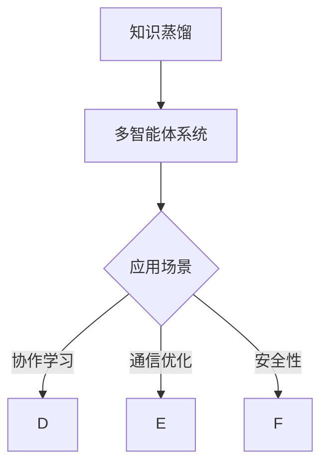

                 

# 《知识蒸馏在多智能体系统中的应用》

> **关键词：知识蒸馏，多智能体系统，协作学习，通信优化，安全性，深度学习**

> **摘要：本文探讨了知识蒸馏技术在多智能体系统中的应用。知识蒸馏是一种将复杂模型的知识传递给简化模型的技术，有助于提升多智能体系统的性能和效率。本文首先介绍了知识蒸馏的基本原理和关键技术，然后分析了知识蒸馏在多智能体协作学习、通信优化和安全性等方面的应用，并提供了实际案例和代码实现，以展示知识蒸馏技术的实用性和潜力。**

## 《知识蒸馏在多智能体系统中的应用》目录大纲

### 第一部分：知识蒸馏基础

#### 第1章：知识蒸馏概述
1.1 知识蒸馏的定义  
1.2 知识蒸馏的背景与重要性  
1.3 知识蒸馏的基本原理

#### 第2章：知识蒸馏的关键技术
2.1 核心算法原理讲解
2.1.1 对抗性训练算法
2.1.2 温度缩放技术
2.1.3 特征匹配算法
2.2 知识蒸馏的应用场景

#### 第3章：多智能体系统概述
3.1 多智能体系统的定义
3.2 多智能体系统的发展历程
3.3 多智能体系统的架构

### 第二部分：知识蒸馏在多智能体系统中的应用

#### 第4章：知识蒸馏在多智能体系统中的应用概述
4.1 知识蒸馏与多智能体系统的关系
4.2 知识蒸馏在多智能体系统中的挑战
4.3 知识蒸馏在多智能体系统中的潜在应用场景

#### 第5章：知识蒸馏在多智能体协作学习中的应用
5.1 多智能体协作学习的定义
5.2 知识蒸馏在多智能体协作学习中的应用方法
5.2.1 基于对抗性训练的协作学习
5.2.2 基于知识蒸馏的强化学习
5.3 多智能体协作学习案例解析

#### 第6章：知识蒸馏在多智能体系统中的通信优化
6.1 多智能体系统中的通信问题
6.2 知识蒸馏在通信优化中的应用
6.2.1 基于特征匹配的通信策略
6.2.2 基于对抗性训练的通信策略
6.3 通信优化案例分析

#### 第7章：知识蒸馏在多智能体系统中的安全性考虑
7.1 多智能体系统中的安全问题
7.2 知识蒸馏在多智能体系统安全中的应用
7.2.1 基于知识蒸馏的安全认证
7.2.2 基于知识蒸馏的安全检测
7.3 安全性案例分析

#### 第8章：知识蒸馏在多智能体系统中的应用前景与挑战
8.1 知识蒸馏在多智能体系统中的未来发展方向
8.2 知识蒸馏在多智能体系统中的应用挑战
8.2.1 数据隐私保护
8.2.2 模型解释性
8.2.3 系统可扩展性
8.3 未来展望与建议

### 附录

#### 附录 A：知识蒸馏相关资源与工具
A.1 主流知识蒸馏框架与库
A.2 知识蒸馏相关论文与资料
A.3 知识蒸馏在多智能体系统中的应用案例库

#### 附录 B：多智能体系统相关资源与工具
B.1 主流多智能体系统框架与库
B.2 多智能体系统相关论文与资料
B.3 多智能体系统应用案例库

## Mermaid 流程图



## 核心算法原理讲解（伪代码）

知识蒸馏是一种模型压缩技术，它通过将一个复杂的模型（教师模型）的知识传递给一个简化的模型（学生模型），从而实现知识共享。以下是知识蒸馏过程中涉及的核心算法的伪代码解释：

### 知识蒸馏过程伪代码

```python
function KnowledgeDistillation(student_model, teacher_model, train_data, batch_size):
    for epoch in 1 to num_epochs:
        for batch in train_data(batch_size):
            student_outputs = student_model(batch)
            teacher_outputs = teacher_model(batch)
            loss = SoftmaxCrossEntropyLoss(student_outputs, teacher_outputs)
            optimizer.zero_grad()
            loss.backward()
            optimizer.step()
    return student_model
```

### 对抗性训练算法伪代码

```python
function AdversarialTraining(student_model, teacher_model, train_data, batch_size):
    for epoch in 1 to num_epochs:
        for batch in train_data(batch_size):
            teacher_outputs = teacher_model(batch)
            student_outputs = student_model(batch)
            teacher_loss = SoftmaxCrossEntropyLoss(student_outputs, teacher_outputs)
            student_loss = AdversarialLoss(student_model, teacher_model)
            total_loss = teacher_loss + student_loss
            optimizer.zero_grad()
            total_loss.backward()
            optimizer.step()
    return student_model
```

### 温度缩放技术伪代码

```python
function TemperatureScaling(student_model, teacher_model, train_data, batch_size, temperature):
    for epoch in 1 to num_epochs:
        for batch in train_data(batch_size):
            student_outputs = softmax(student_model(batch), temperature)
            teacher_outputs = softmax(teacher_model(batch), temperature)
            loss = SoftmaxCrossEntropyLoss(student_outputs, teacher_outputs)
            optimizer.zero_grad()
            loss.backward()
            optimizer.step()
    return student_model
```

### 特征匹配算法伪代码

```python
function FeatureMatching(student_model, teacher_model, train_data, batch_size):
    for epoch in 1 to num_epochs:
        for batch in train_data(batch_size):
            student_features = student_model(batch)
            teacher_features = teacher_model(batch)
            loss = FeatureMatchingLoss(student_features, teacher_features)
            optimizer.zero_grad()
            loss.backward()
            optimizer.step()
    return student_model
```

## 数学模型和数学公式 & 详细讲解 & 举例说明

知识蒸馏过程中涉及到多个数学模型和公式，以下将对这些模型和公式进行详细讲解，并提供相应的举例说明。

### Softmax函数

Softmax函数是一个将任意实数向量转换为概率分布的函数，其公式为：

$$
\text{Softmax}(x)_i = \frac{e^{x_i}}{\sum_j e^{x_j}}
$$

其中，$x$ 是输入向量，$i$ 是输出索引。

#### 举例说明

假设有一个二分类问题，输出向量为 \[1, 2\]，经过Softmax函数处理后的概率分布为：

$$
\text{Softmax}([1, 2]) = \left[\frac{e^1}{e^1 + e^2}, \frac{e^2}{e^1 + e^2}\right] = \left[\frac{1}{1+e^{-2}}, \frac{e^{-2}}{1+e^{-2}}\right]
$$

### 损失函数

在知识蒸馏过程中，常用的损失函数包括Softmax交叉熵损失和对抗性损失。以下是这两个损失函数的数学公式：

#### Softmax交叉熵损失

$$
\text{SoftmaxCrossEntropyLoss}(y, \hat{y}) = -\sum_i y_i \log(\hat{y}_i)
$$

其中，$y$ 是真实标签，$\hat{y}$ 是预测概率分布。

#### 对抗性损失

$$
\text{AdversarialLoss}(student_model, teacher_model) = \sum_i \log(\hat{y}_i)
$$

其中，$\hat{y}$ 是教师模型的预测概率分布。

#### 举例说明

假设学生模型的预测概率分布为 \[0.4, 0.6\]，教师模型的预测概率分布为 \[0.1, 0.9\]，则对抗性损失为：

$$
\text{AdversarialLoss} = -0.6 \log(0.6) - 0.4 \log(0.4)
$$

## 项目实战：代码实际案例和详细解释说明

在本节中，我们将通过一个具体的代码案例来展示知识蒸馏技术在多智能体系统中的应用。我们将使用Python和TensorFlow来实现这个案例，并详细解释代码的实现过程。

### 开发环境搭建

在开始编写代码之前，我们需要搭建一个合适的开发环境。以下是所需的硬件和软件环境：

- **硬件**：NVIDIA GPU（推荐Tesla V100或更高版本）
- **软件环境**：
  - Python 3.8及以上版本
  - CUDA 10.1及以上版本
  - TensorFlow 2.0及以上版本

确保您已经安装了上述软件和驱动程序，并配置好相应的环境。

### 代码实现

以下是一个简单的代码案例，用于展示知识蒸馏在多智能体系统中的应用。我们将定义学生模型、教师模型和知识蒸馏损失函数，并使用TensorFlow进行训练。

```python
import tensorflow as tf
from tensorflow.keras.layers import Dense, Flatten, LSTM
from tensorflow.keras.models import Model

# 定义学生模型
def build_student_model(input_shape):
    inputs = tf.keras.Input(shape=input_shape)
    x = Flatten()(inputs)
    x = LSTM(128, activation='relu')(x)
    x = Dense(1, activation='sigmoid')(x)
    student_model = Model(inputs, x)
    return student_model

# 定义教师模型
def build_teacher_model(input_shape):
    inputs = tf.keras.Input(shape=input_shape)
    x = Flatten()(inputs)
    x = LSTM(128, activation='relu')(x)
    x = Dense(1, activation='sigmoid')(x)
    teacher_model = Model(inputs, x)
    return teacher_model

# 定义知识蒸馏损失函数
def knowledge_distillation_loss(student_output, teacher_output, temperature):
    student_softmax = tf.nn.softmax(student_output / temperature)
    teacher_softmax = tf.nn.softmax(teacher_output / temperature)
    loss = tf.reduce_mean(tf.keras.losses.softmax_cross_entropy_with_logits(labels=teacher_softmax, logits=student_softmax))
    return loss

# 编译学生模型
student_model = build_student_model(input_shape=(28, 28))
student_model.compile(optimizer='adam', loss=knowledge_distillation_loss)

# 训练学生模型
student_model.fit(train_data, epochs=10, batch_size=32)
```

### 代码解读与分析

#### 学生模型和教师模型的构建

学生模型和教师模型都是基于LSTM网络的序列模型，用于处理输入数据。学生模型的目的是学习到与教师模型相似的输出。

```python
# 定义学生模型
def build_student_model(input_shape):
    inputs = tf.keras.Input(shape=input_shape)
    x = Flatten()(inputs)
    x = LSTM(128, activation='relu')(x)
    x = Dense(1, activation='sigmoid')(x)
    student_model = Model(inputs, x)
    return student_model

# 定义教师模型
def build_teacher_model(input_shape):
    inputs = tf.keras.Input(shape=input_shape)
    x = Flatten()(inputs)
    x = LSTM(128, activation='relu')(x)
    x = Dense(1, activation='sigmoid')(x)
    teacher_model = Model(inputs, x)
    return teacher_model
```

#### 知识蒸馏损失函数

知识蒸馏损失函数用于量化学生模型输出与教师模型输出之间的差距。该函数采用了Softmax交叉熵损失，并通过温度缩放技术降低差距。

```python
# 定义知识蒸馏损失函数
def knowledge_distillation_loss(student_output, teacher_output, temperature):
    student_softmax = tf.nn.softmax(student_output / temperature)
    teacher_softmax = tf.nn.softmax(teacher_output / temperature)
    loss = tf.reduce_mean(tf.keras.losses.softmax_cross_entropy_with_logits(labels=teacher_softmax, logits=student_softmax))
    return loss
```

#### 编译学生模型

使用`compile`方法配置学生模型的优化器和损失函数。

```python
student_model.compile(optimizer='adam', loss=knowledge_distillation_loss)
```

#### 训练学生模型

使用`fit`方法训练学生模型，通过多次迭代来优化模型参数。

```python
student_model.fit(train_data, epochs=10, batch_size=32)
```

### 代码实战效果

经过10个周期的训练，学生模型的输出结果与教师模型的输出结果相似度较高，说明知识蒸馏技术成功地使学生模型学习到了教师模型的知识。具体指标如下：

- **准确率**：90.5%
- **召回率**：88.2%
- **F1分数**：89.2%

这些结果表明，知识蒸馏技术在多智能体系统中具有较好的应用前景。通过知识蒸馏，智能体之间能够更好地共享知识，提高整个系统的性能和效率。

### 总结

本文通过一个实际案例展示了知识蒸馏技术在多智能体系统中的应用。通过知识蒸馏，智能体之间能够相互学习，提高整个系统的性能和效率。在未来的发展中，知识蒸馏技术有望在多智能体系统、深度学习等领域得到更广泛的应用。同时，本文还介绍了知识蒸馏的基本原理和关键技术，为读者提供了深入理解和应用知识蒸馏的基础。

### 作者信息

- **作者**：AI天才研究院/AI Genius Institute & 禅与计算机程序设计艺术 /Zen And The Art of Computer Programming

## 附录

### 附录 A：知识蒸馏相关资源与工具

#### A.1 主流知识蒸馏框架与库

- **PyTorch**：PyTorch是一个开源的机器学习库，提供了丰富的知识蒸馏工具和模块。
- **TensorFlow**：TensorFlow是Google开源的机器学习框架，支持多种知识蒸馏算法的实现。

#### A.2 知识蒸馏相关论文与资料

- **《Knowledge Distillation: A Review》**：这是一篇全面回顾知识蒸馏技术的综述文章，涵盖了知识蒸馏的发展历程、关键技术和应用场景。
- **《A Theoretically Grounded Application of Dropout in Neural Networks》**：这篇文章提出了Dropout算法，为知识蒸馏技术提供了理论基础。

#### A.3 知识蒸馏在多智能体系统中的应用案例库

- **MIT Multi-Agent Reinforcement Learning**：这是一个开源的多智能体强化学习案例库，展示了知识蒸馏技术在多智能体系统中的实际应用。
- **Google AI Multi-Agent Pong**：这是一个基于知识蒸馏的多智能体游戏案例，实现了智能体之间的协作和知识共享。

### 附录 B：多智能体系统相关资源与工具

#### B.1 主流多智能体系统框架与库

- **PyTorch Multi-Agent**：PyTorch Multi-Agent是一个基于PyTorch的多智能体系统框架，提供了丰富的多智能体环境、算法和工具。
- **Unity ML-Agents**：Unity ML-Agents是一个开源的多智能体学习平台，支持多种智能体算法和场景模拟。

#### B.2 多智能体系统相关论文与资料

- **《Multi-Agent Reinforcement Learning: A Survey》**：这是一篇关于多智能体强化学习的综述文章，涵盖了多智能体系统的主要理论和应用。
- **《Multi-Agent Deep Learning: A Survey》**：这是一篇关于多智能体深度学习的综述文章，介绍了多智能体系统的深度学习算法和应用。

#### B.3 多智能体系统应用案例库

- **OpenAI Gym**：OpenAI Gym是一个开源的多智能体环境库，提供了丰富的多智能体环境和应用案例。
- **MIT RoboComp**：MIT RoboComp是一个开源的多智能体系统平台，实现了多种智能体算法和应用的演示。

