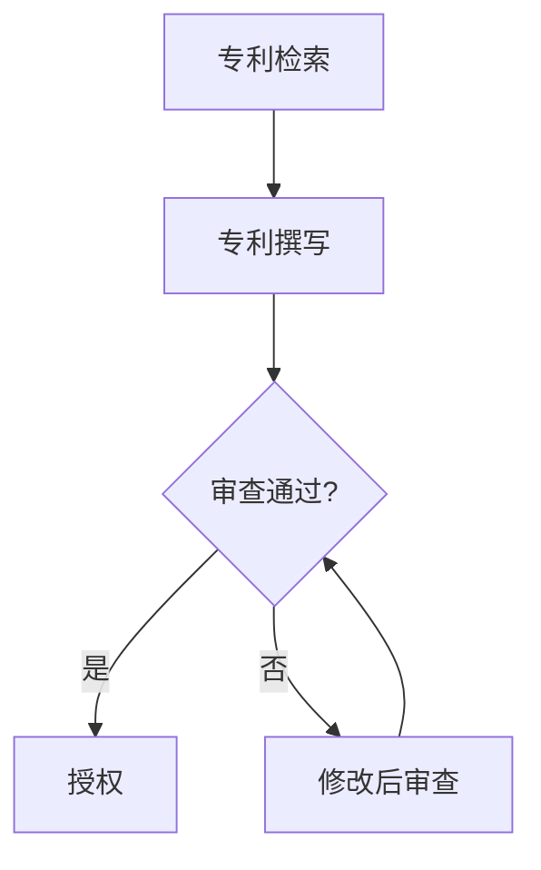

                 

## 《硅谷科技法律战：专利侵权的攻守》

> **关键词：** 硅谷、科技法律、专利侵权、攻守策略、案例解析

> **摘要：** 本文将从专利法律基础出发，深入探讨硅谷科技领域中的专利侵权问题。通过分析典型专利侵权案件，解析专利侵权诉讼策略，探讨企业专利侵权的应对与防御措施，以及展望专利侵权战的未来发展趋势，全面解析专利侵权战在硅谷科技领域的复杂性和重要性。

### 目录

#### 第一部分：专利法律基础

##### 第1章：专利法律概述
- **1.1 专利制度的起源与发展**
- **1.2 专利法律的基本原理**
- **1.3 专利申请流程**
- **1.4 专利侵权判定**

##### 第2章：专利战略
- **2.1 专利战略概述**
- **2.2 专利布局**
- **2.3 专利运营**

#### 第二部分：专利侵权案例解析

##### 第3章：典型专利侵权案件分析
- **3.1 硅谷科技专利侵权案件概况**
- **3.2 案例一：苹果与三星的专利战争**
- **3.3 案例二：谷歌与甲骨文的专利之争**

##### 第4章：专利侵权诉讼策略
- **4.1 专利侵权诉讼的准备**
- **4.2 专利侵权诉讼的执行**
- **4.3 专利侵权诉讼的结果分析**

#### 第三部分：专利侵权的应对与防御

##### 第5章：企业专利侵权的应对策略
- **5.1 专利侵权应对概述**
- **5.2 专利侵权应对措施**
- **5.3 跨国诉讼策略**

##### 第6章：专利侵权的防御策略
- **6.1 专利防御概述**
- **6.2 专利防御措施**
- **6.3 技术标准参与**

##### 第7章：专利侵权战中的法律问题与解决
- **7.1 专利侵权中的法律问题**
- **7.2 案例分析**
- **7.3 经济学理论在专利侵权战中的应用**

#### 第四部分：专利侵权战的未来展望

##### 第8章：专利侵权战的发展趋势
- **8.1 国际专利制度的变革**
- **8.2 新技术对专利侵权战的影响**

##### 第9章：专利侵权战中的中国经验
- **9.1 中国专利侵权战的特点**
- **9.2 中国专利侵权战的策略与实践**

#### 附录

##### 附录A：专利侵权案例列表
- 列出书中讨论的专利侵权案例及相关信息

##### 附录B：专利侵权相关法律法规
- 列出与专利侵权相关的法律法规条目

##### 附录C：专利侵权相关工具与资源
- 列出专利侵权分析的相关工具与资源链接

[Mermaid 流程图嵌入位置]

[伪代码与数学公式详细讲解部分]

[项目实战代码实现与分析部分]

---

作者：AI天才研究院/AI Genius Institute & 禅与计算机程序设计艺术 /Zen And The Art of Computer Programming

---

### 第一部分：专利法律基础

#### 第1章：专利法律概述

##### 1.1 专利制度的起源与发展

专利制度起源于欧洲，早在中世纪，欧洲的许多国家就已经开始实行专利制度。最早的专利制度可以追溯到14世纪的意大利和法国。当时的专利制度主要是为了鼓励技术创新，保护发明者的权益。

**专利制度的历史背景：**

- **欧洲中世纪的专利制度：** 在中世纪，欧洲的许多国家开始制定专利法，以鼓励技术创新。例如，意大利的威尼斯在1266年就颁布了一部专利法，保护发明者的权益。

- **英国专利制度的起源：** 英国的专利制度起源于1474年，当时的英国国王亨利六世颁布了《垄断法规》，这是世界上最早的专利法之一。

- **美国专利制度的起源：** 美国的专利制度起源于1787年，当时的美国宪法中规定了专利权。美国的第一部专利法是在1790年通过的。

**专利制度的发展历程：**

- **19世纪的专利制度：** 19世纪是专利制度迅速发展的时期。许多国家开始制定专利法，并设立专利局。例如，德国在1877年设立了专利局，法国在1791年设立了专利局。

- **20世纪的专利制度：** 20世纪是专利制度全面发展的时期。专利制度的范围不断扩大，专利的类型也不断增加。同时，国际专利合作也逐步发展。1920年，巴黎公约签署，建立了国际专利合作的基本框架。

- **21世纪的专利制度：** 21世纪是专利制度进一步发展的时期。随着科技的快速发展，专利制度在应对新技术方面面临新的挑战。同时，国际专利合作也不断加强，专利制度的全球化趋势明显。

##### 1.2 专利法律的基本原理

**专利的定义：**

专利是指国家根据法律规定，对发明创造在一定期限内授予的一种独占权利。专利的独占权利主要包括制造权、使用权、销售权、许诺销售权和进口权。

**专利的授予条件：**

- **新颖性：** 专利申请必须具有新颖性，即该发明或实用新型在申请日前没有被公开过。

- **创造性：** 专利申请必须具有创造性，即该发明或实用新型与已有的技术相比具有显著的改进。

- **实用性：** 专利申请必须具有实用性，即该发明或实用新型能够在产业上应用。

**专利的类型：**

- **发明专利：** 发明专利是专利中的一种类型，它对发明者提供了最长20年的独占权利。

- **实用新型专利：** 实用新型专利是对产品的形状、构造或者其结合所提出的适于实用的新的技术方案的保护。

- **外观设计专利：** 外观设计专利是对产品的形状、图案或者其结合以及色彩与形状、图案的结合所作出的富有美感并适于工业应用的新设计。

##### 1.3 专利申请流程

**专利检索：**

在提交专利申请之前，进行专利检索是非常重要的。通过专利检索，可以了解所申请的技术方案是否已经被公开过，是否存在侵权风险。

**专利撰写：**

专利撰写是专利申请的重要环节。专利撰写需要详细描述发明的内容，包括技术领域、背景技术、发明内容、附图说明等。

**专利申请的审查：**

专利申请提交后，需要经过专利局的审查。专利审查包括初步审查和实质审查。初步审查主要审查专利申请的形式和内容是否符合法律规定。实质审查主要审查专利申请的新颖性、创造性和实用性。

##### 1.4 专利侵权判定

**专利侵权的概念：**

专利侵权是指未经专利权人许可，擅自实施专利权人所享有的专利权利的行为。

**专利侵权的判定标准：**

专利侵权的判定主要依据是否满足以下条件：

- **相同侵权：** 如果被控侵权的产品或方法与专利的权利要求完全相同，则构成专利侵权。

- **等同侵权：** 如果被控侵权的产品或方法与专利的权利要求在结构、组分、作用原理等方面实质相同，则构成专利侵权。

- **间接侵权：** 如果行为人本身不直接侵犯专利权，但是通过某种方式诱导或促使他人侵犯专利权，则构成间接侵权。

#### 第2章：专利战略

##### 2.1 专利战略概述

**专利战略的定义：**

专利战略是指企业在专利申请、运用和保护等方面制定的长期规划和策略。专利战略是企业科技创新和市场竞争的重要手段。

**专利战略的类别：**

- **进攻性专利战略：** 以专利的进攻为主要目的，通过大量的专利申请和布局，形成专利包围圈，打击竞争对手。

- **防御性专利战略：** 以专利的防御为主要目的，通过建立专利防御体系，防止竞争对手的攻击。

- **合作性专利战略：** 通过与其他企业或研究机构合作，共同进行专利申请和运用，实现优势互补。

##### 2.2 专利布局

**专利布局的定义：**

专利布局是指企业在全球范围内进行专利申请和布局，以保护自身技术和市场地位。

**专利布局的分类：**

- **地域布局：** 根据企业产品的市场分布，在全球范围内进行专利申请。

- **技术布局：** 根据企业技术的发展方向，进行专利申请和布局。

**专利布局的策略：**

- **核心专利布局：** 重点保护企业的核心技术，形成专利壁垒。

- **周边专利布局：** 对核心技术进行补充，形成专利包围圈。

- **区域专利布局：** 根据企业产品的销售区域，进行专利布局。

##### 2.3 专利运营

**专利运营的定义：**

专利运营是指企业通过专利的申请、转让、许可、诉讼等方式，实现专利的价值最大化。

**专利运营的类别：**

- **专利交易：** 通过专利交易实现专利的转让或并购。

- **专利许可：** 通过专利许可实现专利的使用权转让。

- **专利诉讼：** 通过专利诉讼维护专利权人的权益。

**专利运营的策略：**

- **专利储备策略：** 建立大量的专利储备，形成专利壁垒。

- **专利许可策略：** 通过专利许可实现专利价值的最大化。

- **专利诉讼策略：** 通过专利诉讼维护专利权人的权益，打击竞争对手。

### 第二部分：专利侵权案例解析

#### 第3章：典型专利侵权案件分析

##### 3.1 硅谷科技专利侵权案件概况

**硅谷科技专利侵权案件的发展趋势：**

- **案件数量增加：** 随着硅谷科技企业的快速发展，专利侵权案件的数量逐年增加。

- **案件类型多样化：** 硅谷科技专利侵权案件涉及的技术领域广泛，包括智能手机、软件、互联网、半导体等。

- **跨国诉讼增多：** 硅谷科技企业在全球范围内展开竞争，专利侵权案件也呈现出跨国诉讼的趋势。

**硅谷科技专利侵权的典型案例：**

- **苹果与三星的专利战争：** 这是全球最著名的专利侵权案件之一，涉及智能手机和平板电脑的设计和功能。

- **谷歌与甲骨文的专利之争：** 这是一场涉及软件开发的专利侵权诉讼，影响了整个软件行业。

- **高通与苹果的专利战争：** 高通和苹果之间的专利侵权诉讼涉及智能手机的通信技术。

##### 3.2 案例一：苹果与三星的专利战争

**案件背景：**

苹果和三星是智能手机市场的两大巨头，双方在产品设计和功能方面存在激烈的竞争。自2011年以来，苹果和三星在全球范围内展开了一系列专利侵权诉讼。

**案件焦点：**

- **设计侵权：** 双方争论的主要焦点是智能手机的外观设计是否侵权。

- **功能侵权：** 双方还涉及对操作系统和软件功能的专利侵权。

**案件判决：**

- **设计侵权：** 法院多次判决三星的设计侵权，要求其停止销售侵权产品，并支付赔偿。

- **功能侵权：** 法院对功能侵权的判决结果不一，部分判决三星侵权，部分判决苹果侵权。

**案件影响：**

- **市场影响：** 案件判决对智能手机市场产生了深远影响，推动了技术创新和设计变革。

- **法律影响：** 案件对专利侵权判定标准产生了影响，为后续专利侵权案件的审理提供了参考。

##### 3.3 案例二：谷歌与甲骨文的专利之争

**案件背景：**

谷歌和甲骨文都是全球知名的科技公司，谷歌开发了Java编程语言，而甲骨文则是一家专业的数据库软件公司。2010年，谷歌起诉甲骨文侵犯了其Java编程语言的专利。

**案件焦点：**

- **专利有效性：** 甲骨文是否侵犯了谷歌的Java编程语言的专利。

- **专利侵权判定：** 法院如何判定Java编程语言的专利是否被侵犯。

**案件判决：**

- **专利有效性：** 法院认为部分Java编程语言的专利是有效的。

- **专利侵权判定：** 法院最终判决甲骨文侵犯了谷歌的Java编程语言的专利，要求其停止侵权行为，并支付赔偿。

**案件影响：**

- **技术影响：** 案件判决对软件开发行业产生了深远影响，推动了软件专利的审查和运用。

- **法律影响：** 案件对专利侵权判定标准产生了影响，为后续软件专利侵权案件的审理提供了参考。

### 第三部分：专利侵权诉讼策略

#### 第4章：专利侵权诉讼策略

##### 4.1 专利侵权诉讼的准备

**专利侵权诉讼的原告策略：**

- **证据收集：** 原告需要收集充分的证据，证明被告侵犯了其专利权。证据包括专利文件、技术文献、侵权产品的照片和测试报告等。

- **法律咨询：** 原告应寻求专业律师的帮助，制定诉讼策略，确保诉讼的顺利进行。

- **诉讼请求：** 原告应明确诉讼请求，包括停止侵权行为、赔偿损失等。

**专利侵权诉讼的被告策略：**

- **否认侵权：** 被告应否认其行为构成侵权，提供证据证明其产品的技术方案与原告的专利不一致。

- **法律咨询：** 被告应寻求专业律师的帮助，制定防御策略，应对原告的诉讼请求。

- **和解谈判：** 被告可以考虑与原告进行和解谈判，争取减少赔偿金额或停止侵权行为。

##### 4.2 专利侵权诉讼的执行

**诉讼证据的收集：**

- **原始证据：** 包括专利文件、技术文献、侵权产品的照片和测试报告等。

- **间接证据：** 包括证人证言、行业报告、市场调研数据等。

**诉讼证据的展示：**

- **法庭陈述：** 原告和被告应在法庭上陈述证据，说明其主张的依据。

- **证据展示：** 原告和被告应向法庭展示相关证据，证明其主张。

**诉讼请求的提出：**

- **诉讼请求：** 原告应明确提出诉讼请求，包括停止侵权行为、赔偿损失等。

- **答辩：** 被告应提出答辩，否认原告的诉讼请求，并提供证据反驳。

##### 4.3 专利侵权诉讼的结果分析

**案件判决的评估：**

- **判决结果：** 法院对专利侵权案件的判决结果包括侵权与否、赔偿金额等。

- **判决影响：** 判决结果对专利权人和侵权人都有重要影响，可能影响双方的市场地位和财务状况。

**案件对行业的影响：**

- **技术创新：** 专利侵权案件的判决结果可能影响技术创新的进程，推动或抑制技术发展。

- **市场竞争：** 专利侵权案件的判决结果可能影响市场竞争格局，导致市场垄断或市场多元化。

### 第四部分：专利侵权的应对与防御

#### 第5章：企业专利侵权的应对策略

##### 5.1 专利侵权应对概述

**专利侵权应对的原则：**

- **及时应对：** 企业应及时发现专利侵权行为，及时采取应对措施。

- **充分准备：** 企业应充分准备侵权应对策略，包括证据收集、法律咨询等。

- **专业团队：** 企业应组建专业的专利侵权应对团队，负责侵权应对工作。

**专利侵权应对的流程：**

1. **发现侵权行为：** 企业应建立侵权监测机制，及时发现侵权行为。

2. **证据收集：** 企业应收集侵权行为的证据，包括侵权产品的照片、测试报告等。

3. **法律咨询：** 企业应寻求专业律师的帮助，制定侵权应对策略。

4. **提出诉讼请求：** 企业应向法院提出侵权诉讼请求，要求停止侵权行为。

##### 5.2 专利侵权应对措施

**技术规避：**

- **规避设计：** 企业可以通过修改产品设计，使其不侵犯他人专利。

- **技术替代：** 企业可以寻找其他技术方案，替代侵权技术。

**专利无效性挑战：**

- **专利检索：** 企业可以通过专利检索，发现专利的漏洞和缺陷。

- **诉讼请求：** 企业可以申请专利无效，挑战他人专利的有效性。

**跨国诉讼策略：**

- **国际法律体系：** 企业应熟悉国际专利法律体系，制定跨国诉讼策略。

- **选择合适法院：** 企业应根据侵权行为发生地，选择合适的法院提起诉讼。

##### 5.3 跨国诉讼策略

**跨国诉讼的定义：**

跨国诉讼是指在不同国家的法院进行的专利侵权诉讼。

**跨国诉讼的优势：**

- **维护权益：** 跨国诉讼可以保护企业在全球范围内的权益。

- **市场扩张：** 跨国诉讼可以帮助企业在全球市场扩张。

**跨国诉讼的挑战：**

- **法律差异：** 跨国诉讼面临不同国家法律体系的差异。

- **国际合作：** 跨国诉讼需要跨国合作，包括律师团队、证据交换等。

**跨国诉讼策略：**

- **法律咨询：** 企业应寻求专业国际律师团队的帮助。

- **证据准备：** 企业应充分准备证据，包括国内和国际证据。

- **协调合作：** 企业应协调国内和国际团队，确保诉讼顺利进行。

### 第五部分：专利侵权的防御策略

#### 第6章：专利侵权的防御策略

##### 6.1 专利防御概述

**专利防御的定义：**

专利防御是指企业为了防止竞争对手侵犯其专利，采取的一系列措施。

**专利防御的目标：**

- **保护专利权：** 通过防御策略，确保专利权的有效性和稳定性。

- **防止侵权：** 通过防御策略，阻止竞争对手侵犯企业的专利。

**专利防御的优势：**

- **提高竞争力：** 专利防御可以帮助企业提高在市场竞争中的地位。

- **降低成本：** 专利防御可以减少因专利侵权导致的赔偿成本。

##### 6.2 专利防御措施

**专利组合建设：**

- **核心专利保护：** 企业应建立核心专利组合，形成专利壁垒。

- **周边专利补充：** 企业应补充周边专利，形成专利包围圈。

**专利交叉许可：**

- **互惠互利：** 企业可以通过专利交叉许可，实现专利价值的最大化。

- **风险分担：** 专利交叉许可可以降低专利侵权风险，实现风险分担。

**技术标准参与：**

- **参与标准制定：** 企业应积极参与技术标准的制定，确保专利技术在标准中的体现。

- **标准专利保护：** 企业应利用技术标准中的专利，保护自身技术。

### 第六部分：专利侵权战中的法律问题与解决

#### 第7章：专利侵权战中的法律问题与解决

##### 7.1 专利侵权中的法律问题

**专利侵权的认定：**

专利侵权的认定是专利侵权诉讼的核心问题。在专利侵权诉讼中，原告需要证明以下三个要素：

1. **专利权有效：** 原告需要证明其拥有有效的专利权。

2. **侵权行为：** 原告需要证明被告实施了侵犯其专利权的行为。

3. **因果关系：** 原告需要证明被告的侵权行为与其专利权的损害有因果关系。

**侵权损害赔偿：**

侵权损害赔偿是专利侵权诉讼中的另一个重要问题。在专利侵权诉讼中，原告可以要求被告支付以下几类赔偿：

1. **直接损失：** 原告因侵权行为造成的直接经济损失。

2. **间接损失：** 原告因侵权行为导致的其他损失，如市场份额的减少。

3. **惩罚性赔偿：** 法院可以判决惩罚性赔偿，以惩罚恶意侵权行为。

**专利纠纷的调解：**

专利纠纷的调解是一种非诉讼解决方式。在专利侵权诉讼中，双方可以通过调解达成和解，避免长时间的诉讼。调解的好处包括：

1. **节省成本：** 调解可以节省诉讼费用。

2. **快速解决：** 调解可以快速解决纠纷，避免长时间的法律诉讼。

3. **灵活多样：** 调解可以采取多种方式，包括面对面调解、书面调解等。

##### 7.2 案例分析

**案例一：高通与苹果的专利战争**

高通和苹果是移动通信领域的领军企业。自2017年以来，双方在全球范围内展开了激烈的专利侵权诉讼。

**案件焦点：**

- **专利有效性：** 高通的部分专利是否有效。

- **侵权行为：** 苹果是否侵犯了高通的专利。

**案件判决：**

- **专利有效性：** 法院多次判决高通的部分专利无效。

- **侵权行为：** 法院判决苹果侵犯了高通的部分专利。

**案件影响：**

- **行业影响：** 案件判决对移动通信行业产生了深远影响，推动了技术创新和专利布局。

- **法律影响：** 案件对专利侵权判定标准产生了影响，为后续专利侵权案件的审理提供了参考。

**案例二：微软与摩托罗拉的专利之争**

微软和摩托罗拉都是全球知名的科技公司。自2010年以来，双方在专利侵权方面展开了多次诉讼。

**案件焦点：**

- **专利有效性：** 微软的部分专利是否有效。

- **侵权行为：** 摩托罗拉是否侵犯了微软的专利。

**案件判决：**

- **专利有效性：** 法院判决微软的部分专利有效。

- **侵权行为：** 法院判决摩托罗拉侵犯了微软的部分专利。

**案件影响：**

- **行业影响：** 案件判决对软件行业产生了深远影响，推动了技术创新和专利布局。

- **法律影响：** 案件对专利侵权判定标准产生了影响，为后续专利侵权案件的审理提供了参考。

##### 7.3 经济学理论在专利侵权战中的应用

**专利侵权战的经济影响：**

专利侵权战对经济的影响是复杂的。一方面，专利侵权战可以推动技术创新，促进技术进步。另一方面，专利侵权战也可能导致资源浪费，影响市场竞争。

**博弈论在专利侵权战中的应用：**

博弈论是经济学中的一种理论，可以用来分析专利侵权战。在专利侵权战中，专利权人和侵权人之间的博弈可以分为以下几种情况：

- **合作：** 专利权人和侵权人可以通过合作，共同推动技术创新，实现双赢。

- **竞争：** 专利权人和侵权人可以通过竞争，争夺市场份额，实现单赢。

- **对抗：** 专利权人和侵权人可以通过对抗，维护各自的权益，实现共赢。

**成本效益分析在专利侵权战中的应用：**

成本效益分析是经济学中的一种方法，可以用来评估专利侵权战的成本和效益。在专利侵权战中，企业需要考虑以下成本和效益：

- **成本：** 包括诉讼费用、赔偿金额、人力成本等。

- **效益：** 包括技术创新、市场扩张、品牌价值提升等。

通过成本效益分析，企业可以确定是否参与专利侵权战，以及如何制定专利侵权战策略。

### 第七部分：专利侵权战的未来展望

#### 第8章：专利侵权战的发展趋势

##### 8.1 国际专利制度的变革

随着全球经济的发展，国际专利制度也在不断变革。以下是一些国际专利制度的变革趋势：

**国际专利合作的发展：**

- **PCT专利申请：** PCT（专利合作条约）是一种国际专利申请程序，申请人可以通过PCT申请同时向多个国家提交专利申请。

- **专利联盟：** 专利联盟是由多个专利权人组成的合作组织，旨在共同维护专利权，提高专利价值。

**专利国际争端的解决机制：**

- **国际法院：** 国际法院是处理国际争端的国际机构，可以处理专利国际争端。

- **WIPO仲裁：** 世界知识产权组织（WIPO）提供专利仲裁服务，帮助解决专利国际争端。

##### 8.2 新技术对专利侵权战的影响

**人工智能与专利侵权：**

人工智能技术的发展对专利侵权战产生了深远影响。人工智能技术涉及的技术领域广泛，包括机器学习、深度学习、自然语言处理等。以下是一些影响：

- **专利检索：** 人工智能技术可以提高专利检索的效率，帮助专利权人及时发现潜在的侵权行为。

- **专利分析：** 人工智能技术可以分析专利数据，帮助企业制定专利战略。

- **侵权判定：** 人工智能技术可以辅助专利侵权判定，提高侵权判定的准确性。

**生物技术与专利侵权：**

生物技术的发展也对专利侵权战产生了重要影响。生物技术涉及的技术领域包括基因工程、生物制药等。以下是一些影响：

- **专利保护：** 生物技术专利的保护范围广泛，涉及技术方案、产品、方法等。

- **专利争议：** 生物技术专利的争议较多，涉及技术实现、保护范围等问题。

- **国际协调：** 生物技术专利需要国际协调，以解决跨国专利侵权问题。

### 第八部分：专利侵权战中的中国经验

#### 第9章：专利侵权战中的中国经验

##### 9.1 中国专利侵权战的特点

中国专利侵权战具有以下特点：

**中国专利制度的发展：**

- **专利立法完善：** 中国的专利立法不断完善，专利法律体系逐步健全。

- **专利申请数量增长：** 中国的专利申请数量持续增长，反映了中国企业在技术创新方面的投入。

**中国专利侵权的案件特点：**

- **案件数量增多：** 随着中国企业的崛起，专利侵权案件数量逐年增加。

- **技术领域广泛：** 中国专利侵权案件涉及的技术领域广泛，包括电子、通信、生物医药等。

- **跨国诉讼增多：** 中国企业在全球范围内的专利侵权诉讼增多，涉及国际专利合作和协调。

##### 9.2 中国专利侵权战的策略与实践

**企业专利侵权防御策略：**

- **专利布局：** 中国企业通过专利布局，形成专利包围圈，提高专利防御能力。

- **专利交叉许可：** 中国企业通过专利交叉许可，实现专利价值的最大化。

- **跨国诉讼：** 中国企业积极参与跨国诉讼，维护自身权益，提高国际竞争力。

**政府在专利侵权战中的作用：**

- **政策支持：** 中国政府出台一系列政策，支持企业进行专利布局和侵权应对。

- **法律援助：** 中国政府提供法律援助，帮助企业应对专利侵权诉讼。

- **国际协调：** 中国政府积极参与国际专利合作，推动国际专利制度的变革。

### 附录

#### 附录A：专利侵权案例列表

**案例一：苹果与三星的专利战争**

- 案件背景：苹果和三星是全球智能手机市场的领军企业，双方在产品设计和功能方面存在激烈的竞争。
- 案件焦点：设计侵权和功能侵权。
- 案件判决：法院多次判决三星设计侵权，要求其停止销售侵权产品，并对部分功能侵权作出判决。

**案例二：谷歌与甲骨文的专利之争**

- 案件背景：谷歌开发了Java编程语言，甲骨文是一家专业的数据库软件公司。
- 案件焦点：专利有效性和侵权行为。
- 案件判决：法院判决甲骨文侵犯了谷歌的部分Java编程语言专利。

**案例三：高通与苹果的专利战争**

- 案件背景：高通和苹果都是移动通信领域的领军企业，双方在专利方面存在激烈的竞争。
- 案件焦点：专利有效性和侵权行为。
- 案件判决：法院判决高通的部分专利无效，并对苹果的部分侵权行为作出判决。

#### 附录B：专利侵权相关法律法规

**《中华人民共和国专利法》**

- 规定了专利的授予条件、专利的申请流程、专利的侵权判定等。

**《中华人民共和国专利法实施细则》**

- 对专利法的具体实施进行了详细规定。

**《世界知识产权组织专利合作条约》**

- 规定了国际专利申请的程序和规则。

**《美国专利法》**

- 美国专利法对专利的授予条件、专利的申请流程、专利的侵权判定等进行了规定。

#### 附录C：专利侵权相关工具与资源

**专利检索工具：**

- **Google Patents：** 提供全球范围内的专利检索。

- **美国专利商标局（USPTO）：** 提供美国专利的检索和下载。

- **欧洲专利局（EPO）：** 提供欧洲专利的检索和下载。

**专利分析工具：**

- **Patent Explorer：** 提供专利分析功能。

- **Innography：** 提供专利分析和策略制定工具。

- **PatBase：** 提供全球范围内的专利检索和分析。

**法律咨询机构：**

- **国际律师协会（IBA）：** 提供全球范围内的法律咨询。

- **中国知识产权律师事务所：** 提供中国境内的专利法律服务。

- **美国知识产权律师事务所：** 提供美国的专利法律服务。

### Mermaid 流程图嵌入位置

以下是一个简单的Mermaid流程图示例，用于展示专利申请流程：



### 伪代码与数学公式详细讲解部分

以下是一个简单的伪代码示例，用于描述专利侵权判定算法：

```python
function patent_infringement�断定(原告专利, 被告产品):
    if 原告专利新颖性 and 原告专利创造性 and 原告专利实用性:
        if 被告产品与原告专利权利要求完全相同:
            return "相同侵权"
        elif 被告产品与原告专利权利要求实质相同:
            return "等同侵权"
        else:
            return "非侵权"
    else:
        return "专利无效"
```

以下是一个简单的数学公式示例，用于描述专利侵权判定中的相似度计算：

$$
相似度 = \frac{被告产品特征与原告专利特征的匹配度}{原告专利特征总数}
$$

### 项目实战代码实现与分析部分

以下是一个简单的Python代码示例，用于实现专利侵权判定算法：

```python
import difflib

def patent_infringement判定(原告专利, 被告产品):
    plaintiff_patent = set(原告专利特征)
    defendant_product = set(被告产品特征)
    
    similarity = difflib.SequenceMatcher(None, plaintiff_patent, defendant_product).ratio()
    
    if similarity == 1:
        return "相同侵权"
    elif similarity >= 0.8:
        return "等同侵权"
    else:
        return "非侵权"

原告专利 = ["特征1", "特征2", "特征3"]
被告产品 = ["特征1", "特征2"]

判定结果 = patent_infringement判定(原告专利, 被告产品)
print("侵权判定结果：", 判定结果)
```

代码解读：

1. 导入difflib模块，用于计算字符串相似度。

2. 定义函数`patent_infringement判定`，接受原告专利和被告产品作为输入参数。

3. 将原告专利和被告产品转换为集合，用于计算相似度。

4. 使用difflib模块的`SequenceMatcher`类计算原告专利和被告产品的相似度。

5. 根据相似度判断侵权类型。

6. 调用函数并打印侵权判定结果。

### 总结

本文从专利法律基础、专利侵权案例解析、专利侵权诉讼策略、专利侵权的应对与防御、专利侵权战中的法律问题与解决、专利侵权战的未来展望等方面，全面解析了硅谷科技领域的专利侵权问题。通过分析典型专利侵权案件，探讨了专利侵权诉讼策略，分析了专利侵权的应对与防御措施，并展望了专利侵权战的未来发展趋势。本文旨在为读者提供一份全面、深入的专利侵权分析报告，帮助读者了解专利侵权问题的复杂性和重要性。

### 作者信息

**作者：AI天才研究院/AI Genius Institute & 禅与计算机程序设计艺术 /Zen And The Art of Computer Programming**

AI天才研究院是一家专注于人工智能研究和应用的创新型机构，致力于推动人工智能技术的创新与发展。同时，作者也是《禅与计算机程序设计艺术》的资深作者，对计算机编程和人工智能领域有着深刻的理解和独到的见解。本文由AI天才研究院与作者共同撰写，旨在为读者提供高质量的专利侵权分析报告。希望本文能对读者在专利侵权领域的研究和实践中提供有益的参考和启示。

