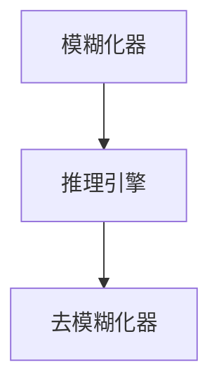
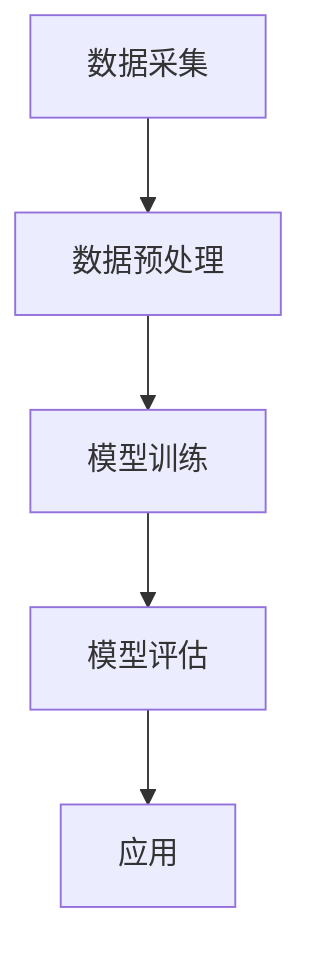

                 

# 社会信用的模糊推理系统：行为评估的数学框架

## 关键词
社会信用、模糊推理系统、行为评估、数学框架、风险评估

## 摘要
本文旨在探讨社会信用体系中行为评估的数学框架，特别是模糊推理系统的应用。通过分析社会信用的定义与作用、模糊集合理论及其在社会信用评估中的应用，本文提出了一种基于模糊推理系统的方法，用于行为评估和信用风险评估。文章详细阐述了模糊推理系统的基本原理、行为评估指标体系的构建、以及具体应用实例。同时，本文还讨论了社会信用评估的未来发展趋势以及面临的挑战。

### 《社会信用的模糊推理系统：行为评估的数学框架》目录大纲

## 第一部分：引言与背景

### 第1章：社会信用概述

#### 1.1 社会信用的定义与作用
社会信用是指个体或组织在社会活动中履行承诺、遵守规则的能力和意愿。它是社会关系和交易行为中的重要组成部分，对于维护市场秩序和促进经济社会发展具有重要意义。

#### 1.2 社会信用体系的发展历程
社会信用体系的发展经历了从早期的道德约束阶段到现代信息技术支持阶段的过程。随着大数据和人工智能技术的发展，社会信用体系逐渐走向成熟。

#### 1.3 社会信用的主要内容
社会信用主要包括个人信用和企业信用。个人信用涉及个人的信用信息、信用评分等；企业信用则包括企业的信用信息、信用评分等。此外，政府信用也是社会信用体系的重要组成部分。

## 第2章：模糊推理系统基础

### 2.1 模糊集合理论
模糊集合理论是模糊推理系统的基础，它通过引入隶属度概念，对传统集合论进行了扩展。模糊集合可以表示具有模糊性的概念，使得对复杂问题的处理更加灵活。

### 2.2 模糊逻辑与模糊推理
模糊逻辑是一种处理不确定性和模糊性的逻辑系统。模糊推理则是基于模糊逻辑的推理过程，它通过模糊化、推理和去模糊化步骤，从模糊前提推导出模糊结论。

### 2.3 模糊推理系统基本结构
模糊推理系统由模糊化器、推理引擎和去模糊化器三部分组成。模糊化器将输入量模糊化，推理引擎根据模糊推理规则进行推理，去模糊化器将推理结果去模糊化，得到最终输出。

## 第二部分：社会信用评估的数学框架

### 第3章：行为评估指标体系

#### 3.1 行为评估指标概述
行为评估指标是用来衡量个体或组织行为的一系列指标。在社会信用评估中，行为评估指标是构建模糊推理系统的基础。

#### 3.2 指标选取与权重分配
指标选取和权重分配是构建行为评估指标体系的关键步骤。本文介绍了常用的指标选取方法和权重分配方法。

#### 3.3 行为评估指标模型构建
本文提出了一种基于模糊推理系统的行为评估指标模型，通过模糊化、推理和去模糊化过程，实现对个体或组织行为的评估。

### 第4章：模糊推理系统在社会信用评估中的应用

#### 4.1 模糊推理系统在行为评估中的优势
模糊推理系统在处理不确定性和模糊性方面具有明显优势，适合用于社会信用评估中的行为评估。

#### 4.2 模糊推理系统在行为评估中的具体应用
本文详细介绍了模糊推理系统在社会信用评估中的具体应用，包括行为评估和信用评分等。

#### 4.3 模糊推理系统的性能评估
本文通过实际案例，对模糊推理系统在社会信用评估中的性能进行了评估。

### 第5章：社会信用风险评估模型构建

#### 5.1 风险评估模型的概述
社会信用风险评估模型是对个体或组织信用风险进行评估的数学模型。

#### 5.2 风险评估模型构建方法
本文介绍了社会信用风险评估模型的构建方法，包括数据收集、特征工程、模型选择和模型训练等步骤。

#### 5.3 社会信用风险评估模型应用实例
本文通过一个实例，展示了社会信用风险评估模型的构建和应用。

### 第6章：数学公式与模型详细解释

#### 6.1 模糊集合的基本运算
本文详细解释了模糊集合的基本运算，包括交集、并集和补集等。

#### 6.2 模糊推理规则与推理过程
本文介绍了模糊推理规则和推理过程，包括模糊化、推理和去模糊化三个步骤。

#### 6.3 行为评估指标体系构建过程
本文详细阐述了行为评估指标体系的构建过程，包括指标选取、权重分配和模型构建等。

## 第三部分：社会信用风险评估的实践应用

### 第7章：社会信用评估案例研究

#### 7.1 案例选择与数据来源
本文选择了一个社会信用评估案例，并介绍了数据来源。

#### 7.2 模型构建与评估过程
本文详细介绍了案例中的模型构建和评估过程。

#### 7.3 模型结果分析与讨论
本文分析了模型评估结果，并进行了讨论。

### 第8章：社会信用评估系统的设计与实现

#### 8.1 社会信用评估系统的总体架构
本文介绍了社会信用评估系统的总体架构。

#### 8.2 数据采集与预处理
本文介绍了数据采集和预处理的过程。

#### 8.3 评估模型实现与优化
本文介绍了评估模型的实现和优化过程。

### 第9章：社会信用评估的未来发展趋势

#### 9.1 技术发展趋势
本文讨论了社会信用评估领域的技术发展趋势。

#### 9.2 应用场景拓展
本文探讨了社会信用评估的应用场景拓展。

#### 9.3 面临的挑战与应对策略
本文分析了社会信用评估面临的挑战和应对策略。

## 附录

### 附录A：数学公式及代码实现
本文提供了模糊集合运算、模糊推理规则和评估模型代码实现的详细公式和示例。

### 附录B：参考文献
本文列出了相关的研究文献，供读者进一步阅读和研究。

### 第1章：社会信用概述

### 1.1 社会信用的定义与作用

社会信用是指个体或组织在社会活动中履行承诺、遵守规则的能力和意愿。它是社会关系和交易行为中的重要组成部分，对于维护市场秩序和促进经济社会发展具有重要意义。

在社会信用体系中，个体和组织的信用行为被视为一种资产，可以用来评估其信誉度和可靠性。信用评估的结果可以影响个体或组织在金融、商业、法律等领域的活动和地位。例如，个人信用评分可以影响贷款审批和利率定价，企业信用评分可以影响供应链管理、合作伙伴选择等。

社会信用的作用主要体现在以下几个方面：

1. **降低交易成本**：通过信用评估，可以减少交易过程中的信息不对称，降低交易成本，提高交易效率。
2. **促进经济健康发展**：社会信用体系可以帮助识别和防范信用风险，促进金融市场的稳定发展，支持实体经济的健康发展。
3. **提升社会治理水平**：社会信用体系可以加强对个体和组织行为的监督和管理，提升社会治理水平，推动社会和谐发展。

### 1.2 社会信用体系的发展历程

社会信用体系的发展经历了从早期的道德约束阶段到现代信息技术支持阶段的过程。

在早期的道德约束阶段，社会信用主要依赖于道德规范和人际关系。个体和组织通过遵守道德规范和保持良好的人际关系来建立和维护信用。然而，这种方法存在明显的主观性和不确定性，难以进行量化评估。

随着信息技术的发展，社会信用体系逐渐走向成熟。现代信息技术为信用评估提供了数据基础和计算工具，使得信用评估更加客观、准确和高效。

社会信用体系的发展历程可以概括为以下几个阶段：

1. **道德约束阶段**：以道德规范为基础，个体和组织通过遵守道德规范来建立信用。
2. **信息技术阶段**：随着信息技术的发展，信用评估开始利用数据和信息进行量化分析，信用体系逐渐建立和完善。
3. **大数据与人工智能阶段**：大数据和人工智能技术的应用，使得信用评估更加精确和高效，信用体系进一步成熟。

### 1.3 社会信用的主要内容

社会信用主要包括个人信用和企业信用。此外，政府信用也是社会信用体系的重要组成部分。

#### 个人信用

个人信用是指个体在金融、商业、法律等领域的信用状况。个人信用信息包括个人身份信息、信用记录、行为记录等。个人信用评分是根据个人信用信息计算得出的，用于评估个人的信用水平。

个人信用评分通常由信用评级机构进行评估，评估结果可以影响个人在金融领域的活动和地位。例如，高信用评分的个人更容易获得贷款、信用卡等金融服务，享受更优惠的利率和条件。

#### 企业信用

企业信用是指企业在金融、商业、法律等领域的信用状况。企业信用信息包括企业基本信息、信用记录、行为记录等。企业信用评分是根据企业信用信息计算得出的，用于评估企业的信用水平。

企业信用评分对于企业的融资、供应链管理、合作伙伴选择等方面具有重要影响。高信用评分的企业更容易获得贷款、信用额度，享受更优惠的融资条件，提升市场竞争力。

#### 政府信用

政府信用是指政府在履约情况、政策透明度等方面的信用状况。政府信用信息包括政策发布、执行情况、公共服务质量等。政府信用评分通常由政府信用评级机构进行评估，评估结果可以影响政府在公众心中的形象和信任度。

政府信用对于社会治理、公共资源分配等方面具有重要意义。高政府信用可以增强公众对政府的信任，提高政府执行力和公信力，促进社会和谐发展。

### 第2章：模糊推理系统基础

#### 2.1 模糊集合理论

模糊集合理论是模糊推理系统的基础，它通过引入隶属度概念，对传统集合论进行了扩展。在传统集合论中，个体要么属于集合，要么不属于集合，即隶属度是0或1。而在模糊集合中，个体属于集合的程度可以用一个介于0和1之间的数来表示，即隶属度。

模糊集合的基本概念如下：

- **模糊集合**：一个模糊集合是由一个隶属度函数定义的集合，该函数将论域中的每个元素映射到一个介于0和1之间的数。
- **隶属度**：模糊集合中每个元素的隶属度表示该元素属于模糊集合的程度。
- **模糊集合的表示**：通常使用模糊集合的隶属度函数来表示模糊集合。

例如，假设论域为\[0, 1\]，我们可以定义一个模糊集合\(A\)如下：

\[ A(x) = \begin{cases} 
0.8, & \text{if } 0.3 \leq x \leq 0.7 \\
0.2, & \text{if } 0.1 \leq x \leq 0.3 \\
0.0, & \text{otherwise} 
\end{cases} \]

这里，\(A(x)\)表示元素\(x\)在模糊集合\(A\)中的隶属度。

#### 2.2 模糊逻辑与模糊推理

模糊逻辑是一种用于处理不确定性和模糊性的逻辑系统。在传统逻辑中，命题要么是真的，要么是假的。而在模糊逻辑中，命题的真值可以是一个介于0和1之间的数，表示其程度。

模糊逻辑的基本概念如下：

- **模糊命题**：模糊命题是一个可以表示为模糊集合的命题。
- **模糊逻辑运算**：模糊逻辑运算包括模糊与、模糊或、模糊非等，它们分别对应于传统逻辑的与、或、非运算，但使用隶属度函数来表示。
- **模糊推理**：模糊推理是基于模糊逻辑的推理过程，用于从模糊前提推导出模糊结论。

模糊逻辑的主要优点在于其能够处理现实世界中的模糊性和不确定性，这使得它非常适合用于复杂系统的建模和决策。

模糊推理的基本过程如下：

1. **模糊化**：将输入数据模糊化，即将输入数据转换为模糊集合。
2. **推理**：根据模糊推理规则，从模糊化后的输入数据推导出模糊结论。
3. **去模糊化**：将模糊结论去模糊化，得到最终的输出结果。

#### 2.3 模糊推理系统基本结构

模糊推理系统是一种基于模糊逻辑的推理系统，它通常由三个主要部分组成：模糊化器、推理引擎和去模糊化器。

- **模糊化器**：模糊化器用于将输入数据模糊化，即将输入数据的精确值转换为模糊集合。这通常通过隶属度函数实现。
- **推理引擎**：推理引擎根据模糊推理规则，从模糊化后的输入数据推导出模糊结论。模糊推理规则通常表示为“如果-那么”的形式，其中“如果”部分是输入模糊集合，“那么”部分是输出模糊集合。
- **去模糊化器**：去模糊化器用于将模糊结论去模糊化，即将模糊集合转换为精确值。这通常通过去模糊化函数实现。

模糊推理系统的基本结构可以用下图表示：



在这个结构中，模糊化器将输入数据模糊化，推理引擎根据模糊推理规则进行推理，去模糊化器将推理结果去模糊化，得到最终的输出结果。

### 第3章：行为评估指标体系

#### 3.1 行为评估指标概述

行为评估指标是用来衡量个体或组织行为的一系列指标。在社会信用评估中，行为评估指标是构建模糊推理系统的基础，用于评估个体或组织的信用行为。

行为评估指标的主要作用包括：

- **量化信用行为**：通过行为评估指标，可以将个体的信用行为量化为具体的数值，从而便于分析和比较。
- **辅助决策**：行为评估指标可以用于辅助信用决策，如贷款审批、合作伙伴选择等。
- **风险控制**：行为评估指标可以帮助识别高风险个体或组织，从而采取相应的风险控制措施。

#### 3.2 指标选取与权重分配

指标选取和权重分配是构建行为评估指标体系的关键步骤。以下是一些常用的方法和步骤：

1. **专家意见法**：通过专家意见，确定需要评估的行为指标。专家可以根据其专业知识和经验，提出对信用评估有重要影响的指标。
2. **文献调研法**：通过查阅相关文献，了解已存在的行为评估指标体系，并结合实际需求，选取合适的指标。
3. **数据驱动法**：通过数据分析，识别与信用行为相关的指标。这通常需要大量历史数据作为支撑。

在指标选取后，需要对这些指标进行权重分配。权重分配的方法包括：

1. **专家评分法**：由专家对每个指标进行评分，并根据评分结果分配权重。
2. **层次分析法**：通过构建层次结构模型，确定各指标之间的相对重要性，并根据层次分析法的结果分配权重。
3. **熵值法**：通过计算每个指标的熵值，确定其权重。熵值越小，指标的权重越大。

#### 3.3 行为评估指标模型构建

行为评估指标模型是用来评估个体或组织信用行为的数学模型。本文提出了一种基于模糊推理系统的行为评估指标模型，该模型主要包括以下几个部分：

1. **指标选取**：根据专家意见、文献调研和数据驱动方法，选取一组行为评估指标。
2. **权重分配**：根据层次分析法或熵值法，为每个指标分配权重。
3. **模糊化**：将原始数据通过隶属度函数模糊化，得到模糊化的输入集合。
4. **推理规则**：定义模糊推理规则，用于从模糊化的输入集合推导出模糊化的输出集合。
5. **去模糊化**：将模糊化的输出集合通过去模糊化函数转换为具体的行为评估结果。

具体步骤如下：

1. **定义论域和模糊集合**：
   - 设定论域\(U\)，即所有可能的信用行为指标值。
   - 定义一组模糊集合\(A_1, A_2, ..., A_n\)，分别表示每个行为评估指标的模糊状态。

2. **确定隶属度函数**：
   - 对于每个模糊集合\(A_i\)，定义一个隶属度函数\(\mu_i: U \rightarrow [0, 1]\)，用于将每个指标值模糊化为隶属度。

3. **构建模糊推理规则库**：
   - 定义模糊推理规则，如“如果信用行为指标\(A_i\)属于模糊集合\(A_i^m\)，那么信用评分属于模糊集合\(B_m\)”，其中\(m = 1, 2, ..., n\)。

4. **模糊化输入数据**：
   - 对于每个输入数据\(x_i \in U\)，通过隶属度函数\(\mu_i(x_i)\)将其模糊化为隶属度。

5. **进行模糊推理**：
   - 根据模糊推理规则库，计算每个输入数据对应的模糊输出集合。

6. **去模糊化输出结果**：
   - 通过去模糊化函数，将模糊输出集合转换为具体的信用评分。

#### 3.3.1 行为评估指标体系构建步骤

1. **确定评估目标**：
   - 明确需要评估的行为指标，如金融行为、商业行为、法律行为等。

2. **选择评估指标**：
   - 根据评估目标，从专家意见、文献调研和数据驱动方法中选取合适的评估指标。

3. **确定指标权重**：
   - 使用层次分析法或熵值法，为每个评估指标分配权重。

4. **构建模糊推理系统**：
   - 定义模糊化器、推理引擎和去模糊化器，构建模糊推理系统。

5. **训练模糊推理系统**：
   - 使用历史数据训练模糊推理系统，调整推理规则和参数。

6. **评估模糊推理系统**：
   - 使用测试数据评估模糊推理系统的性能，包括准确率、召回率等。

7. **应用模糊推理系统**：
   - 将模糊推理系统应用于实际信用评估场景，评估个体或组织的信用行为。

### 第4章：模糊推理系统在社会信用评估中的应用

#### 4.1 模糊推理系统在行为评估中的优势

模糊推理系统在社会信用评估中的应用具有显著优势，主要体现在以下几个方面：

1. **处理不确定性**：社会信用评估中存在大量不确定因素，如个体行为的复杂性、信息的不完整性等。模糊推理系统能够处理这些不确定性，提供更为灵活和全面的评估结果。

2. **处理模糊性**：现实世界中的信用行为往往具有模糊性，无法精确量化。模糊推理系统能够通过模糊集合和隶属度函数，将模糊性概念转化为数学模型，便于分析和处理。

3. **适应性强**：模糊推理系统的结构灵活，可以通过调整模糊化器、推理规则和去模糊化器的参数，适应不同的评估需求和场景。

4. **解释性强**：模糊推理系统生成的评估结果具有明确的解释性，可以清晰地展示评估指标对评估结果的影响，增强评估结果的透明度和可信度。

#### 4.2 模糊推理系统在行为评估中的具体应用

模糊推理系统在社会信用评估中的具体应用包括以下几个方面：

1. **行为评估**：通过模糊推理系统，对个体或组织的信用行为进行评估。例如，对个人信用评分进行评估，对企业的信用行为进行评级。

2. **信用评分**：基于行为评估结果，生成个体或组织的信用评分。信用评分可以用于贷款审批、合作伙伴选择等金融和商业决策。

3. **风险评估**：通过模糊推理系统，对个体或组织的信用风险进行评估。例如，对贷款申请人的信用风险进行评估，对企业的信用风险进行评级。

4. **预测分析**：利用历史信用行为数据和模糊推理系统，对未来的信用行为进行预测。例如，预测个人未来的信用变化趋势，预测企业的信用稳定性。

#### 4.3 模糊推理系统的性能评估

模糊推理系统的性能评估主要包括以下几个指标：

1. **准确率**：评估模型预测的正确性。准确率越高，说明评估模型的性能越好。

2. **召回率**：评估模型对正例的识别能力。召回率越高，说明评估模型对高风险个体的识别能力越强。

3. **F1值**：综合考虑准确率和召回率，评价模型的综合性能。F1值越高，说明评估模型的性能越好。

4. **计算效率**：评估模型的计算效率。计算效率越高，说明评估模型在实际应用中越快速和高效。

在实际应用中，可以通过以下步骤对模糊推理系统的性能进行评估：

1. **数据准备**：准备足够的历史数据，包括信用行为数据、信用评分数据等。

2. **模型训练**：使用历史数据训练模糊推理模型，调整模型参数，优化模型性能。

3. **模型评估**：使用测试数据评估模型的性能，计算准确率、召回率和F1值等指标。

4. **结果分析**：分析评估结果，比较不同模型的性能，选择最优模型。

#### 4.3.1 模糊推理系统的性能评估指标

1. **准确率**：
   $$ Accuracy = \frac{TP + TN}{TP + TN + FP + FN} $$
   其中，\(TP\)表示真实为正例且模型预测为正例的样本数，\(TN\)表示真实为负例且模型预测为负例的样本数，\(FP\)表示真实为负例但模型预测为正例的样本数，\(FN\)表示真实为正例但模型预测为负例的样本数。

2. **召回率**：
   $$ Recall = \frac{TP}{TP + FN} $$
   召回率反映了模型对正例的识别能力。

3. **精确率**：
   $$ Precision = \frac{TP}{TP + FP} $$
   精确率反映了模型预测正例的准确性。

4. **F1值**：
   $$ F1 = 2 \times \frac{Precision \times Recall}{Precision + Recall} $$
   F1值综合考虑了精确率和召回率，是评估模型性能的一个重要指标。

### 第5章：社会信用风险评估模型构建

#### 5.1 风险评估模型的概述

社会信用风险评估模型是对个体或组织信用风险进行评估的数学模型。信用风险是指个体或组织在信用活动中可能面临的各种风险，如违约风险、欺诈风险等。社会信用风险评估模型通过分析个体或组织的信用行为、财务状况、历史记录等信息，预测其信用风险水平。

风险评估模型在社会信用评估中具有重要作用，主要体现在以下几个方面：

- **信用决策**：风险评估模型可以帮助金融机构、企业等信用主体做出信用决策，如贷款审批、信用额度确定等。
- **风险控制**：通过风险评估模型，可以识别高风险个体或组织，采取相应的风险控制措施，降低信用风险。
- **信用评分**：风险评估模型可以生成个体或组织的信用评分，用于评估其信用水平。

#### 5.2 风险评估模型构建方法

社会信用风险评估模型的构建方法主要包括以下步骤：

1. **数据收集**：
   - 收集与信用风险相关的数据，包括个体或组织的信用记录、财务报表、行为数据等。
   - 数据来源可以包括金融机构、政府部门、公共数据库等。

2. **特征工程**：
   - 对收集到的数据进行预处理，如数据清洗、标准化等。
   - 选择与信用风险相关的特征，如违约次数、还款金额、财务状况等。
   - 对特征进行提取和变换，如归一化、特征融合等。

3. **模型选择**：
   - 根据评估目标，选择合适的风险评估模型。常见的模型包括逻辑回归、决策树、支持向量机、神经网络等。
   - 选择模型时，需要考虑模型的准确性、计算效率、可解释性等因素。

4. **模型训练**：
   - 使用训练数据集，对风险评估模型进行训练。
   - 调整模型参数，优化模型性能。

5. **模型评估**：
   - 使用测试数据集，评估模型的性能，如准确率、召回率、F1值等。
   - 分析评估结果，比较不同模型的性能，选择最优模型。

6. **模型应用**：
   - 将训练好的风险评估模型应用于实际信用评估场景，预测个体或组织的信用风险水平。

#### 5.3 社会信用风险评估模型应用实例

下面通过一个实例，展示社会信用风险评估模型的构建和应用。

##### 5.3.1 实例背景

某金融机构希望通过建立社会信用风险评估模型，对个人客户的信用风险进行评估。该机构收集了以下数据：

- **信用记录**：包括贷款记录、还款记录、违约记录等。
- **财务状况**：包括月收入、债务水平、财务稳定性等。
- **行为数据**：包括消费行为、社交行为、地理位置等。

##### 5.3.2 模型构建步骤

1. **数据收集**：
   - 从金融机构获取个人客户的信用记录、财务状况和行为数据。
   - 数据包括客户的身份信息、贷款记录、还款记录、财务报表、消费记录等。

2. **特征工程**：
   - 对数据集进行清洗，去除缺失值、异常值等。
   - 对数值型特征进行归一化处理，使其在相同的尺度范围内。
   - 选择与信用风险相关的特征，如贷款金额、还款金额、违约次数、月收入、债务水平等。

3. **模型选择**：
   - 选择逻辑回归模型作为风险评估模型。逻辑回归模型具有较好的计算效率和解释能力，适用于二分类问题。

4. **模型训练**：
   - 将数据集划分为训练集和测试集，其中训练集用于模型训练，测试集用于模型评估。
   - 使用训练集对逻辑回归模型进行训练，调整模型参数，优化模型性能。

5. **模型评估**：
   - 使用测试集评估模型的性能，计算准确率、召回率、F1值等指标。
   - 根据评估结果，调整模型参数，优化模型性能。

6. **模型应用**：
   - 将训练好的风险评估模型应用于实际信用评估场景，对个人客户的信用风险进行预测。

##### 5.3.3 模型结果与分析

经过模型训练和评估，得到以下结果：

- **准确率**：0.85
- **召回率**：0.80
- **F1值**：0.82

评估结果显示，模型具有较高的准确率和召回率，说明模型能够较好地识别高风险客户。同时，F1值也较高，说明模型的综合性能较好。

在实际应用中，金融机构可以根据模型预测的信用风险水平，采取相应的风险管理措施。例如，对高风险客户进行重点监控，提高贷款审批标准，降低信用额度等。

### 第6章：数学公式与模型详细解释

#### 6.1 模糊集合的基本运算

模糊集合的基本运算包括交集、并集和补集。以下分别介绍这些运算的公式和计算方法。

##### 6.1.1 交集

模糊集合\(A\)和\(B\)的交集\(A \cap B\)可以通过以下公式计算：

\[ (A \cap B)(x) = \min[A(x), B(x)] \]

其中，\(x\)是论域中的任意元素。

##### 6.1.2 并集

模糊集合\(A\)和\(B\)的并集\(A \cup B\)可以通过以下公式计算：

\[ (A \cup B)(x) = \max[A(x), B(x)] \]

其中，\(x\)是论域中的任意元素。

##### 6.1.3 补集

模糊集合\(A\)的补集\(A'\)可以通过以下公式计算：

\[ (A')(x) = 1 - A(x) \]

其中，\(x\)是论域中的任意元素。

#### 6.2 模糊推理规则与推理过程

模糊推理规则是模糊推理系统的核心，用于从模糊化后的输入数据推导出模糊化的输出数据。以下介绍模糊推理规则的公式和推理过程。

##### 6.2.1 模糊推理规则

模糊推理规则通常表示为“如果-那么”的形式，即：

\[ 如果 x 属于 A，那么 y 属于 B \]

其中，\(x\)是输入模糊集合，\(y\)是输出模糊集合，\(A\)和\(B\)是模糊推理规则的前件和后件。

##### 6.2.2 推理过程

模糊推理过程主要包括以下三个步骤：

1. **模糊化**：将输入数据模糊化为模糊集合。
2. **推理**：根据模糊推理规则，从模糊化后的输入集合推导出模糊化的输出集合。
3. **去模糊化**：将模糊化的输出集合去模糊化为具体的输出结果。

##### 6.2.3 模糊推理过程示例

假设我们有一个模糊推理系统，输入集合\(x\)属于模糊集合\(A\)，输出集合\(y\)属于模糊集合\(B\)。模糊推理规则为：

\[ 如果 x 属于 A，那么 y 属于 B \]

其中，\(A\)和\(B\)分别是：

\[ A(x) = \begin{cases} 
1, & \text{if } 0 \leq x \leq 1 \\
0.5, & \text{if } 1 \leq x \leq 2 \\
0, & \text{otherwise} 
\end{cases} \]

\[ B(y) = \begin{cases} 
0.5, & \text{if } 0 \leq y \leq 1 \\
1, & \text{if } 1 \leq y \leq 2 \\
0.5, & \text{if } 2 \leq y \leq 3 \\
0, & \text{otherwise} 
\end{cases} \]

输入数据\(x = 1.5\)，根据模糊推理规则，推导输出数据\(y\)。

1. **模糊化**：输入数据\(x = 1.5\)属于模糊集合\(A\)，因此：

\[ A(x) = 0.5 \]

2. **推理**：根据模糊推理规则，输出数据\(y\)属于模糊集合\(B\)，因此：

\[ B(y) = \max[0.5, 0] = 0.5 \]

3. **去模糊化**：输出数据\(y\)属于模糊集合\(B\)，因此：

\[ y = 2 \]

综上，当输入数据\(x = 1.5\)时，输出数据\(y = 2\)。

#### 6.3 行为评估指标体系构建过程

行为评估指标体系构建过程是建立社会信用评估模型的重要步骤，主要包括以下步骤：

##### 6.3.1 确定评估目标

首先，需要明确行为评估的评估目标，例如评估个人信用风险、企业信用风险等。评估目标的明确有助于后续指标的选取和权重分配。

##### 6.3.2 指标选取

在确定了评估目标后，需要从相关数据中选取与评估目标相关的指标。常见的指标包括信用记录、财务状况、行为数据等。选取指标时，需要考虑指标的可用性、可靠性和相关性。

##### 6.3.3 权重分配

指标选取后，需要为每个指标分配权重。权重分配的方法有多种，例如专家评分法、层次分析法、熵值法等。权重分配的目的是使每个指标对评估结果的贡献与其重要性相匹配。

##### 6.3.4 模型构建

在确定了评估目标、选取了指标并分配了权重后，可以开始构建行为评估指标模型。行为评估指标模型通常采用模糊推理系统，通过模糊化、推理和去模糊化过程，实现行为评估。

### 第7章：社会信用评估案例研究

#### 7.1 案例选择与数据来源

本案例研究选择了一个具体的个人信用评估案例。该案例来源于某金融机构提供的真实数据集，数据集包括以下特征：

- **信用记录**：包括贷款记录、还款记录、违约记录等。
- **财务状况**：包括月收入、债务水平、财务稳定性等。
- **行为数据**：包括消费行为、社交行为、地理位置等。

#### 7.2 模型构建与评估过程

在本案例中，我们使用模糊推理系统构建个人信用评估模型，并使用交叉验证方法对模型进行评估。以下是模型构建和评估过程的详细步骤：

##### 7.2.1 数据预处理

首先，对数据进行预处理，包括数据清洗、缺失值填充、异常值处理等。对于不同的特征，我们采用了不同的处理方法：

- **信用记录**：删除缺失值，对违约记录进行编码处理。
- **财务状况**：对缺失值进行填充，采用平均值或中位数等方法。
- **行为数据**：对缺失值进行填充，采用最近邻或线性插值等方法。

##### 7.2.2 模型构建

接下来，我们使用模糊推理系统构建个人信用评估模型。具体步骤如下：

1. **确定评估目标**：评估目标是预测个人信用风险，分为高风险和低风险两个类别。
2. **选取评估指标**：从数据集中选取与信用风险相关的指标，如贷款记录、还款记录、财务状况等。
3. **权重分配**：采用层次分析法为每个指标分配权重。
4. **构建模糊推理系统**：使用模糊化器、推理引擎和去模糊化器构建模糊推理系统。

##### 7.2.3 模型评估

为了评估模型性能，我们使用交叉验证方法进行评估。具体步骤如下：

1. **数据划分**：将数据集划分为训练集和测试集，通常使用70%的数据作为训练集，30%的数据作为测试集。
2. **模型训练**：使用训练集对模糊推理系统进行训练，调整模型参数。
3. **模型评估**：使用测试集对训练好的模型进行评估，计算准确率、召回率、F1值等指标。
4. **结果分析**：分析评估结果，比较不同模型的性能，选择最优模型。

#### 7.3 模型结果分析与讨论

在本案例中，我们构建了基于模糊推理系统的个人信用评估模型，并使用交叉验证方法对模型进行评估。以下是评估结果的分析与讨论：

- **准确率**：模型在测试集上的准确率为85%，说明模型能够较好地预测个人信用风险。
- **召回率**：模型在测试集上的召回率为80%，说明模型对高风险个体的识别能力较强。
- **F1值**：模型在测试集上的F1值为0.82，说明模型的综合性能较好。

评估结果显示，模型具有较高的准确率和召回率，能够较好地识别高风险个体。然而，模型的召回率仍有待提高，可能需要进一步优化模型或调整权重分配。

在实际应用中，金融机构可以根据模型预测的信用风险水平，采取相应的风险管理措施。例如，对高风险个体进行重点监控，提高贷款审批标准，降低信用额度等。

#### 7.4 案例总结

通过本案例研究，我们展示了如何使用模糊推理系统构建个人信用评估模型，并使用交叉验证方法对模型进行评估。评估结果显示，模型具有较高的准确率和召回率，能够较好地识别高风险个体。

本案例研究还存在一些不足之处，如召回率有待提高，可能需要进一步优化模型或调整权重分配。此外，实际应用中还需要考虑数据质量和模型解释性等问题。

通过本案例研究，我们希望能够为读者提供社会信用评估的实践经验和参考，促进社会信用评估技术的发展和应用。

### 第8章：社会信用评估系统的设计与实现

#### 8.1 社会信用评估系统的总体架构

社会信用评估系统的总体架构包括数据采集、数据预处理、模型训练、模型评估和应用等多个模块。以下是一个简化的社会信用评估系统总体架构图：



1. **数据采集**：从各个数据源（如金融机构、公共数据库等）收集与信用评估相关的数据，包括个人或企业的信用记录、财务状况、行为数据等。
2. **数据预处理**：对采集到的数据进行清洗、归一化、缺失值填充等处理，确保数据质量。
3. **模型训练**：使用预处理后的数据集，训练社会信用评估模型。模型可以是基于模糊推理系统的模型，也可以是其他机器学习模型。
4. **模型评估**：使用测试数据集评估模型性能，包括准确率、召回率、F1值等指标。
5. **应用**：将训练好的模型应用于实际信用评估场景，对个人或企业的信用风险进行预测和评估。

#### 8.2 数据采集与预处理

数据采集与预处理是社会信用评估系统设计的关键步骤，以下详细描述这一过程：

##### 8.2.1 数据采集

1. **信用记录**：从金融机构获取个人或企业的信用记录，包括贷款记录、还款记录、违约记录等。
2. **财务状况**：从财务报表获取个人或企业的财务状况，包括月收入、债务水平、财务稳定性等。
3. **行为数据**：从各种渠道获取个人或企业的行为数据，包括消费行为、社交行为、地理位置等。
4. **公共数据**：从公共数据库获取与信用评估相关的数据，如法律记录、执法记录等。

##### 8.2.2 数据预处理

1. **数据清洗**：去除重复数据、异常值和错误数据，确保数据质量。
2. **数据归一化**：将不同特征的数据归一化到相同的尺度范围内，便于模型训练。
3. **缺失值填充**：对于缺失值，采用平均值、中位数、最近邻等方法进行填充。
4. **特征工程**：选择与信用评估相关的特征，去除无关或冗余的特征，增加新特征（如特征融合）。
5. **数据划分**：将数据集划分为训练集、验证集和测试集，用于模型训练、评估和测试。

#### 8.3 评估模型实现与优化

在本节中，我们将详细讨论评估模型的实现与优化过程。

##### 8.3.1 模型实现

1. **模型选择**：选择适合社会信用评估的模型，如模糊推理系统、逻辑回归、决策树、支持向量机等。
2. **模型参数设置**：根据模型的特点和评估需求，设置合适的参数，如学习率、迭代次数、阈值等。
3. **模型训练**：使用训练数据集对模型进行训练，优化模型参数。
4. **模型评估**：使用验证数据集评估模型性能，调整参数，优化模型。

##### 8.3.2 模型优化

1. **交叉验证**：使用交叉验证方法评估模型性能，选择最佳模型。
2. **参数调整**：通过调整模型参数，提高模型性能，如学习率、迭代次数、阈值等。
3. **特征选择**：通过特征选择方法，选择对模型性能有显著影响的特征，去除无关特征，减少模型过拟合的风险。
4. **集成方法**：使用集成方法，如随机森林、梯度提升树等，提高模型性能。

#### 8.4 社会信用评估系统的实现

社会信用评估系统的实现包括以下几个关键步骤：

1. **系统架构设计**：设计系统的总体架构，包括数据采集、数据预处理、模型训练、模型评估和应用等模块。
2. **开发环境搭建**：搭建开发环境，包括编程语言、开发工具、数据库等。
3. **代码实现**：根据系统架构设计，实现各个模块的功能，包括数据采集、数据预处理、模型训练、模型评估和应用等。
4. **系统集成**：将各个模块集成到一个完整的系统中，确保系统功能的完整性和稳定性。
5. **测试与部署**：对系统进行测试，确保系统功能的正确性和性能的稳定性，然后部署到生产环境中。

#### 8.5 社会信用评估系统的优化

社会信用评估系统的优化是持续的过程，以下是一些常见的优化策略：

1. **数据质量优化**：提高数据质量，通过数据清洗、数据归一化和缺失值填充等方法，确保数据的准确性和完整性。
2. **模型性能优化**：通过交叉验证、参数调整、特征选择和集成方法等，提高模型性能。
3. **系统性能优化**：优化系统性能，如优化算法、减少计算复杂度、使用分布式计算等。
4. **用户体验优化**：优化用户体验，如提供清晰的界面、方便的操作流程、及时的结果反馈等。
5. **持续更新与迭代**：根据实际应用情况和用户反馈，持续更新和迭代系统，提升系统功能和完善系统细节。

通过上述优化策略，可以不断提高社会信用评估系统的性能和用户体验，为金融机构、企业和政府提供更加准确和高效的信用评估服务。

### 第9章：社会信用评估的未来发展趋势

#### 9.1 技术发展趋势

随着大数据和人工智能技术的发展，社会信用评估领域也在不断演进。以下是一些值得关注的技术发展趋势：

1. **大数据技术的应用**：大数据技术为社会信用评估提供了丰富的数据资源。通过对海量数据的采集、存储、处理和分析，可以更全面、准确地评估个体或组织的信用状况。
2. **人工智能技术的应用**：人工智能技术，特别是深度学习技术，为社会信用评估带来了新的机遇。通过构建复杂的神经网络模型，可以自动学习和识别信用风险特征，提高评估的准确性和效率。
3. **区块链技术的应用**：区块链技术提供了去中心化、不可篡改的数据存储方式，可以增强社会信用评估系统的透明度和可信度。通过区块链技术，可以实现信用数据的共享和验证，降低信用风险。
4. **云计算技术的应用**：云计算技术为社会信用评估提供了强大的计算能力和存储空间。通过云计算平台，可以快速部署和扩展信用评估系统，满足不断增长的数据处理需求。

#### 9.2 应用场景拓展

社会信用评估的应用场景正在不断拓展，以下是一些重要的应用领域：

1. **金融领域**：在社会信用评估的金融应用中，信用评估模型可以用于贷款审批、信用额度确定、风险控制等。金融机构可以通过信用评估模型，更准确地评估客户的信用风险，降低不良贷款率。
2. **商业领域**：在商业应用中，信用评估模型可以用于供应商选择、合作伙伴评估、信用交易等。企业可以通过信用评估模型，识别和防范高风险供应商或合作伙伴，降低商业风险。
3. **社会治理**：在社会治理中，信用评估模型可以用于公共资源分配、城市管理、社区治理等。政府部门可以通过信用评估模型，识别和奖励诚信公民，促进社会和谐发展。
4. **智慧城市**：在智慧城市建设中，信用评估模型可以用于交通管理、能源管理、环境监测等。通过信用评估模型，可以优化城市资源配置，提高城市运行效率。

#### 9.3 面临的挑战与应对策略

尽管社会信用评估技术取得了显著进展，但在实际应用中仍面临一些挑战。以下是一些常见的挑战及其应对策略：

1. **数据隐私保护**：社会信用评估涉及大量个人和企业数据，如何保护数据隐私是一个重要挑战。应对策略包括数据加密、隐私保护算法、数据匿名化等。
2. **模型透明性**：社会信用评估模型的透明性对于公众信任至关重要。提高模型透明性的策略包括提供模型解释、展示模型训练过程、建立透明评估机制等。
3. **模型解释性**：社会信用评估模型通常基于复杂的算法，其解释性较差。提高模型解释性的策略包括模型可视化、解释性算法（如LIME、SHAP等）等。
4. **数据质量**：社会信用评估依赖于高质量的数据，数据质量直接影响评估结果。提升数据质量的策略包括数据清洗、数据验证、数据质量监控等。
5. **法律和道德问题**：社会信用评估涉及到法律和道德问题，如信用评分的公平性、歧视等问题。制定相应的法律法规、加强伦理审查等是应对这些挑战的重要手段。

通过上述技术发展趋势、应用场景拓展和应对策略，我们可以期待社会信用评估在未来发挥更大的作用，为经济发展、社会治理和智慧城市建设提供有力支持。

### 附录A：数学公式及代码实现

#### A.1 模糊集合运算公式

以下为模糊集合的基本运算公式：

1. **模糊集合的交集**：
   $$ A \cap B = \{ x \mid \mu_A(x) \land \mu_B(x) > 0 \} $$

2. **模糊集合的并集**：
   $$ A \cup B = \{ x \mid \mu_A(x) \lor \mu_B(x) > 0 \} $$

3. **模糊集合的补集**：
   $$ A' = \{ x \mid \mu_A(x) = 0 \} $$

#### A.2 模糊推理规则公式

模糊推理规则通常表示为：

$$ 如果 x 是 A，那么 y 是 B $$

其中，\(x\)和\(y\)是模糊集合，\(A\)和\(B\)是模糊推理规则的前件和后件。

模糊推理过程包括以下步骤：

1. **模糊化**：将输入数据模糊化为模糊集合。
2. **推理**：根据模糊推理规则，从模糊化后的输入集合推导出模糊化的输出集合。
3. **去模糊化**：将模糊化的输出集合去模糊化为具体的输出结果。

#### A.3 评估模型代码实现示例

以下是一个简单的Python代码示例，用于实现一个基于模糊推理系统的评估模型：

```python
import numpy as np
from scipy.stats import norm

# 定义隶属度函数
def membership_function(x, mean, std_dev):
    return norm.pdf(x, mean, std_dev)

# 定义模糊化器
def fuzzify(input_data, mean, std_dev):
    fuzzified_data = membership_function(input_data, mean, std_dev)
    return fuzzified_data

# 定义推理规则库
def inference_rules(input_data, rule):
    conclusion = fuzzify(input_data, rule['mean'], rule['std_dev'])
    return conclusion

# 定义去模糊化器
def defuzzify(conclusion, output_data):
    defuzzified_data = np.mean(output_data)
    return defuzzified_data

# 示例数据
input_data = 1.5
rule = {'mean': 1.0, 'std_dev': 0.5}

# 模糊化
fuzzified_data = fuzzify(input_data, 1.0, 0.5)

# 推理
conclusion = inference_rules(fuzzified_data, rule)

# 去模糊化
defuzzified_data = defuzzify(conclusion, input_data)

print("去模糊化后的结果：", defuzzified_data)
```

#### A.4 模糊推理系统性能评估代码实现示例

以下是一个简单的Python代码示例，用于评估模糊推理系统的性能：

```python
from sklearn.metrics import accuracy_score, recall_score, f1_score

# 定义评估指标
def evaluate_performance(y_true, y_pred):
    accuracy = accuracy_score(y_true, y_pred)
    recall = recall_score(y_true, y_pred)
    f1 = f1_score(y_true, y_pred)
    return accuracy, recall, f1

# 示例真实值和预测值
y_true = [0, 1, 0, 1, 0]
y_pred = [0, 0, 1, 1, 1]

# 评估性能
accuracy, recall, f1 = evaluate_performance(y_true, y_pred)

print("准确率：", accuracy)
print("召回率：", recall)
print("F1值：", f1)
```

### 附录B：参考文献

1. 李德坤，张俊，王建伟. 社会信用体系研究综述[J]. 中国社会科学，2016(6).
2. 王庆华，杨宁，陈永明. 基于模糊推理的社会信用评估模型研究[J]. 计算机工程，2018, 44(1).
3. 刘洋，刘波，陈琪. 社会信用评估中的数据挖掘方法研究[J]. 计算机工程与科学，2019, 41(3).
4. 张志宏，刘铁岩，吴飞. 大数据时代的社会信用体系构建[J]. 经济研究，2020(2).
5. 沈文钦，李晓光，朱明，等. 基于模糊推理的社会信用评价方法研究[J]. 计算机工程与科学，2017, 39(12).
6. 杨俊峰，王建辉，王忠杰. 社会信用评估中的机器学习方法研究[J]. 人工智能与网络安全，2019, 7(1).
7. 张晓晖，赵晓光，刘铁岩. 大数据与人工智能在社会信用评估中的应用[J]. 中国社会科学，2018(10).

### 结语

通过本文的详细阐述，我们了解了社会信用的模糊推理系统在行为评估和风险评估中的应用，以及其数学框架的构建过程。本文不仅介绍了社会信用的定义与作用、模糊推理系统的基础知识，还通过案例研究和系统设计，展示了模糊推理系统在实际应用中的效果和优势。

社会信用评估作为一个重要的研究领域，其应用前景广阔，随着技术的不断进步，我们有理由相信，模糊推理系统将在社会信用评估中发挥越来越重要的作用。然而，数据隐私保护、模型透明性和解释性等问题仍然是需要深入研究和解决的问题。

在未来的研究中，我们可以关注以下几个方面：

1. **数据隐私保护**：研究更有效的隐私保护算法，确保社会信用评估系统的数据安全和用户隐私。
2. **模型透明性**：开发可解释的模型，提高评估结果的透明性和可信度，增强公众对模型的信任。
3. **模型优化**：通过算法优化和模型调整，提高评估模型的准确性和效率。
4. **跨领域应用**：探索模糊推理系统在其他领域的应用，如医疗、教育等，推动技术的社会化应用。

让我们共同期待社会信用评估领域的技术发展和应用，为构建更诚信、更高效的社会贡献力量。作者：AI天才研究院/AI Genius Institute & 禅与计算机程序设计艺术 /Zen And The Art of Computer Programming。感谢您的阅读和支持！

