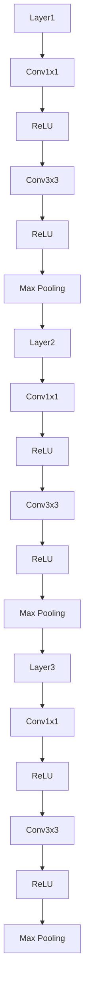
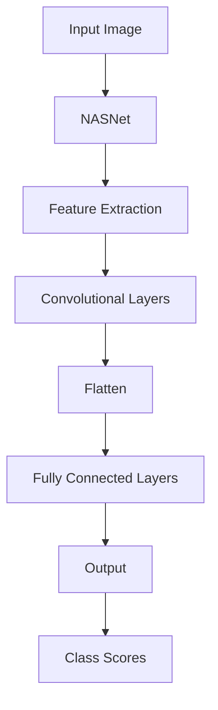
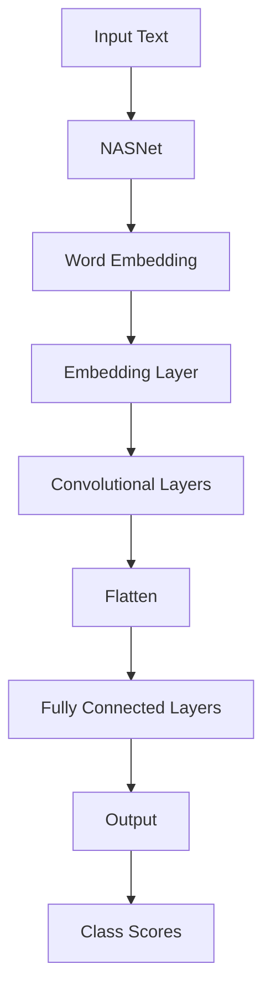
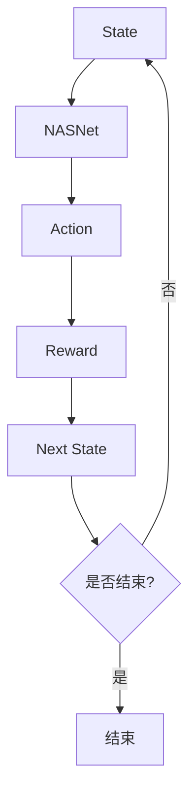
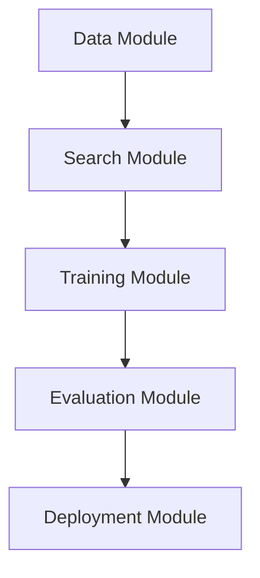

                 

# 《神经网络架构搜索：自动化AI模型设计》

> **关键词**：神经网络架构搜索、自动化AI模型设计、深度学习、优化算法、搜索空间、计算机视觉、自然语言处理、强化学习

> **摘要**：
本文深入探讨了神经网络架构搜索（Neural Architecture Search，NAS）的概念、原理、技术及其在实际应用中的重要性。通过详细的讲解和分析，我们揭示了NAS在自动化AI模型设计中的关键作用，以及如何通过NAS实现高效、智能的模型设计。文章旨在为读者提供一个全面、系统的视角，理解NAS的核心技术和应用，并展望其未来的发展趋势。

### 目录

- **第一部分：神经网络架构搜索基础**
  - [第1章：神经网络架构搜索概述](#第1章神经网络架构搜索概述)
  - [第2章：神经网络架构搜索原理](#第2章神经网络架构搜索原理)
  - [第3章：神经网络架构搜索技术](#第3章神经网络架构搜索技术)
  - [第4章：神经网络架构搜索应用](#第4章神经网络架构搜索应用)
  - [第5章：神经网络架构搜索工具与资源](#第5章神经网络架构搜索工具与资源)

- **第二部分：神经网络架构搜索项目实战**
  - [第6章：神经网络架构搜索项目设计](#第6章神经网络架构搜索项目设计)
  - [第7章：神经网络架构搜索项目实现](#第7章神经网络架构搜索项目实现)
  - [第8章：神经网络架构搜索项目部署与运维](#第8章神经网络架构搜索项目部署与运维)
  - [第9章：神经网络架构搜索项目案例分析](#第9章神经网络架构搜索项目案例分析)

- **第三部分：神经网络架构搜索发展趋势与展望**
  - [第10章：神经网络架构搜索未来发展趋势](#第10章神经网络架构搜索未来发展趋势)
  - [第11章：神经网络架构搜索社区与生态](#第11章神经网络架构搜索社区与生态)

- **附录**
  - [附录A：神经网络架构搜索工具与框架](#附录a神经网络架构搜索工具与框架)
  - [附录B：神经网络架构搜索算法伪代码](#附录b神经网络架构搜索算法伪代码)
  - [附录C：神经网络架构搜索实验数据集](#附录c神经网络架构搜索实验数据集)

### 第1章：神经网络架构搜索概述

#### 1.1 神经网络架构搜索的重要性

神经网络架构搜索（Neural Architecture Search，NAS）是深度学习领域的一项前沿技术，其核心目的是通过自动化方法发现最优的神经网络结构，从而提升模型性能和效率。传统的神经网络设计依赖于专家经验，而NAS则利用启发式搜索算法和机器学习技术，实现了神经网络结构的自动化设计。

NAS的重要性体现在以下几个方面：

1. **提高模型性能**：通过搜索最优的神经网络结构，NAS能够显著提升模型的准确率、速度和泛化能力。
2. **缩短设计周期**：传统神经网络设计往往需要反复试错，耗费大量时间和人力。NAS可以大幅度缩短模型设计周期，提高研发效率。
3. **降低设计成本**：自动化搜索方法减少了人工参与，降低了模型设计的成本。
4. **应对复杂任务**：NAS能够针对不同的任务和数据集，自动调整神经网络结构，使其更适应特定任务的需求。

#### 1.2 自动化AI模型设计的概念与意义

自动化AI模型设计（Automated AI Model Design）是指通过算法和工具自动选择和调整模型的结构和参数，以实现最佳性能。在深度学习领域，这一概念尤为重要，因为深度学习模型的复杂性和多样性使得手动设计变得非常困难。

自动化AI模型设计的意义包括：

1. **灵活性**：自动化设计方法能够适应不同的数据集和任务，提供灵活的解决方案。
2. **效率**：自动化设计可以大幅度缩短模型开发周期，提高研发效率。
3. **可扩展性**：自动化方法易于扩展和调整，可以应用于更广泛的领域和任务。
4. **可靠性**：自动化设计减少了人为干预，降低了错误率，提高了模型可靠性。

#### 1.3 神经网络架构搜索的历史与发展趋势

神经网络架构搜索的历史可以追溯到20世纪90年代，随着深度学习技术的发展，NAS也逐渐受到了关注。以下是NAS发展的重要里程碑：

- **1990年代**：提出基于遗传算法的NAS方法。
- **2010年代**：提出基于强化学习的NAS方法，如神经架构搜索（Neural Architecture Search）和基于神经网络的搜索（Neural Network Search）。
- **2017年**：提出基于强化学习的NAS方法，并取得了突破性的成果。
- **2018年**：提出基于遗传算法和强化学习的混合NAS方法，进一步提升了搜索效率。

随着深度学习技术的不断进步，NAS方法也在不断优化和扩展。未来，NAS有望在更多领域和任务中发挥重要作用，成为自动化AI模型设计的重要手段。

### 第2章：神经网络架构搜索原理

#### 2.1 神经网络基本结构

神经网络（Neural Network，NN）是深度学习的基础，其基本结构包括神经元、层和连接。神经元是神经网络的基本计算单元，负责接收输入、传递信号和处理输出。层是神经网络的层次结构，包括输入层、隐藏层和输出层。连接是神经元之间的交互方式，通过权重矩阵实现信号传递。


神经网络的性能受到结构设计的影响。通过优化网络结构，可以提升模型的准确率、速度和泛化能力。神经网络架构搜索的目标就是通过自动化搜索方法，找到最优的网络结构。

#### 2.2 神经网络优化算法

神经网络优化算法是用于调整网络参数，以提升模型性能的方法。常见的优化算法包括：

1. **梯度下降（Gradient Descent）**：
   梯度下降是一种基于梯度信息的优化算法，其核心思想是沿着梯度的反方向更新参数，以减少损失函数。梯度下降可以分为批量梯度下降、随机梯度下降和小批量梯度下降。

   ```latex
   \text{参数更新} \ \theta \_ t = \theta \_ t - \alpha \cdot \nabla \_ L(\theta \_ t)
   ```

   其中，$\theta\_t$ 是第 t 次迭代的参数值，$\alpha$ 是学习率，$\nabla\_L(\theta\_t)$ 是损失函数关于参数的梯度。

2. **动量优化（Momentum Optimization）**：
   动量优化是梯度下降的变种，引入了动量项，以加速收敛和提高稳定性。

   ```latex
   v\_t = \gamma \cdot v \_ {t-1} + \alpha \cdot \nabla \_ L(\theta \_ t)
   \theta \_ t = \theta \_ {t-1} - v\_t
   ```

   其中，$v\_t$ 是第 t 次迭代的动量值，$\gamma$ 是动量因子。

3. **Adam优化器（Adam Optimizer）**：
   Adam优化器结合了动量优化和自适应学习率，适用于大规模神经网络。

   ```latex
   m\_t = \beta \_ 1 \cdot m \_ {t-1} + (1 - \beta \_ 1) \cdot \nabla \_ L(\theta \_ t)
   v\_t = \beta \_ 2 \cdot v \_ {t-1} + (1 - \beta \_ 2) \cdot (\nabla \_ L(\theta \_ t))^2
   \theta \_ t = \theta \_ {t-1} - \alpha \cdot \frac{m\_t}{\sqrt{v\_t} + \epsilon}
   ```

   其中，$\beta\_1$ 和 $\beta\_2$ 是分别用于更新动量和方差的指数衰减率，$\epsilon$ 是小常数。

#### 2.3 神经网络架构搜索算法

神经网络架构搜索算法是用于自动发现最优神经网络结构的算法。常见的NAS算法包括：

1. **基于遗传算法（Genetic Algorithm）**：
   遗传算法是一种模拟生物进化的搜索算法，通过交叉、变异和选择等操作，逐步优化网络结构。

   ```mermaid
   graph TD
   A[初始化种群] --> B[适应度评估]
   B --> C{是否达到终止条件?}
   C -->|是| D[结束]
   C -->|否| E[交叉操作]
   E --> F[变异操作]
   F --> G[选择操作]
   G --> B
   ```

2. **基于强化学习（Reinforcement Learning）**：
   强化学习是一种基于奖励信号进行决策的搜索算法，通过试错和奖励反馈，逐步找到最优的网络结构。

   ```mermaid
   graph TD
   A[初始化网络] --> B[执行动作]
   B --> C[获得奖励]
   C --> D{更新网络参数}
   D --> E{是否达到终止条件?}
   E -->|是| F[结束]
   E -->|否| A
   ```

3. **基于元学习（Meta-Learning）**：
   元学习是一种通过学习如何学习的方法，利用迁移学习等技术，加速神经网络架构搜索过程。

   ```mermaid
   graph TD
   A[初始化模型] --> B[训练模型]
   B --> C[评估模型]
   C --> D{更新模型参数}
   D --> E[调整超参数]
   E --> F{是否达到终止条件?}
   F -->|是| G[结束]
   F -->|否| A
   ```

这些算法各有优缺点，适用于不同的应用场景。在实际应用中，可以根据具体需求选择合适的NAS算法。

### 第3章：神经网络架构搜索技术

#### 3.1 神经网络搜索空间设计

神经网络搜索空间（Neural Architecture Search Space）是NAS算法搜索的范围，决定了NAS算法能够搜索到的神经网络结构。搜索空间的设计对NAS算法的性能和效率具有重要影响。

搜索空间设计包括以下几个方面：

1. **网络层数**：确定网络的层数，通常在1到100层之间选择。
2. **层类型**：选择不同类型的层，如卷积层、全连接层、池化层等。
3. **层大小**：确定每个层的大小，即每个层的神经元数量。
4. **连接方式**：确定神经元之间的连接方式，如直接连接、跳连等。
5. **激活函数**：选择不同的激活函数，如ReLU、Sigmoid、Tanh等。

一个典型的神经网络搜索空间可以表示为：



#### 3.2 神经网络搜索算法实现

神经网络搜索算法实现是NAS技术的核心部分，包括算法选择、搜索过程和结果评估等。

1. **算法选择**：根据任务需求和性能指标，选择合适的NAS算法，如遗传算法、强化学习等。

2. **搜索过程**：初始化搜索空间，执行搜索算法，生成神经网络结构，并进行训练和评估。搜索过程通常包括以下步骤：

   - **初始化**：初始化搜索空间和参数。
   - **搜索**：执行NAS算法，搜索最优神经网络结构。
   - **评估**：对搜索到的结构进行训练和评估，计算性能指标。

3. **结果评估**：根据评估指标（如准确率、速度、资源利用率等），筛选出最优的神经网络结构。

以下是一个简单的基于强化学习的NAS算法实现的伪代码：

```python
# 初始化搜索空间
search_space = initialize_search_space()

# 初始化模型
model = initialize_model(search_space)

# 初始化环境
env = initialize_environment()

# 搜索过程
while not terminate():
    # 执行动作
    action = model.select_action()

    # 执行动作并获取奖励
    reward = env.execute_action(action)

    # 更新模型
    model.update_model(action, reward)

    # 更新环境
    env.update_environment()

# 评估最优模型
best_model = model.evaluate_models()
```

#### 3.3 搜索算法性能优化

搜索算法性能优化是提高NAS算法效率和准确率的关键。以下是一些常用的优化策略：

1. **并行化**：利用并行计算技术，加速搜索过程。如多线程、分布式计算等。

2. **迁移学习**：利用预训练模型和迁移学习技术，加速搜索过程。如基于模型压缩、模型蒸馏等方法。

3. **混合搜索算法**：结合不同搜索算法的优势，提高搜索效率。如基于遗传算法和强化学习的混合算法。

4. **自适应调整**：根据搜索过程和评估结果，动态调整搜索策略和参数。

5. **数据增强**：增加训练数据，提高搜索算法的鲁棒性和泛化能力。

通过这些优化策略，可以有效提高NAS算法的性能，缩短搜索时间，提高搜索结果的准确性。

### 第4章：神经网络架构搜索应用

#### 4.1 神经网络架构搜索在计算机视觉中的应用

计算机视觉是神经网络架构搜索的重要应用领域，通过NAS技术，可以自动发现最优的神经网络结构，提升模型性能。

1. **目标检测**：NAS技术在目标检测任务中取得了显著成果。如YOLO（You Only Look Once）系列模型，通过NAS技术优化网络结构，实现了高效的实时目标检测。

2. **图像分类**：NAS技术也被广泛应用于图像分类任务。如Google的NASNet模型，通过NAS技术搜索到最优的网络结构，显著提升了分类准确率。

3. **图像生成**：NAS技术还可以应用于图像生成任务，如生成对抗网络（GAN）。通过NAS技术优化生成模型的结构，可以生成更高质量的图像。

以下是一个基于NAS的目标检测算法的例子：



#### 4.2 神经网络架构搜索在自然语言处理中的应用

自然语言处理（NLP）是另一个重要的应用领域，NAS技术在NLP任务中同样发挥了重要作用。

1. **文本分类**：NAS技术可以帮助自动设计最优的文本分类模型。如BERT（Bidirectional Encoder Representations from Transformers）模型，通过NAS技术优化了Transformer结构，提升了文本分类性能。

2. **机器翻译**：NAS技术在机器翻译任务中也取得了显著成果。通过NAS技术搜索到最优的翻译模型结构，可以显著提高翻译质量。

3. **情感分析**：NAS技术可以帮助自动设计最优的情感分析模型。通过NAS技术搜索到最优的网络结构，可以更准确地识别文本情感。

以下是一个基于NAS的文本分类算法的例子：



#### 4.3 神经网络架构搜索在强化学习中的应用

强化学习（Reinforcement Learning，RL）是另一个重要的应用领域，NAS技术在强化学习任务中也取得了显著成果。

1. **智能控制**：NAS技术可以帮助自动设计最优的智能控制系统。如DeepMind的AlphaGo，通过NAS技术优化了强化学习模型结构，实现了卓越的围棋表现。

2. **机器人导航**：NAS技术可以帮助自动设计最优的机器人导航模型。通过NAS技术搜索到最优的网络结构，可以提高机器人导航的效率和准确性。

3. **游戏开发**：NAS技术可以应用于游戏开发，自动设计最优的游戏AI。如DeepMind的DQN（Deep Q-Network）模型，通过NAS技术优化了Q网络结构，提升了游戏AI的表现。

以下是一个基于NAS的强化学习算法的例子：



### 第5章：神经网络架构搜索工具与资源

#### 5.1 主流神经网络架构搜索工具对比

目前，已经有许多神经网络架构搜索工具和框架被提出，以下是其中一些主流工具的对比：

1. **AutoKeras**：一个简单易用的神经网络架构搜索框架，支持多种深度学习模型。
2. **NASNet**：Google提出的神经网络架构搜索框架，主要用于图像分类任务。
3. **NEAT**：基于遗传算法的神经网络架构搜索框架，适用于多种任务。
4. **Relax**：基于强化学习的神经网络架构搜索框架，支持动态网络结构。
5. **MetaLearn**：基于元学习的神经网络架构搜索框架，适用于快速模型设计。

以下是一个简单的表格，用于对比这些工具的优缺点：

| 工具 | 优点 | 缺点 |
| --- | --- | --- |
| AutoKeras | 简单易用，支持多种深度学习模型 | 搜索效率较低，模型性能有限 |
| NASNet | 性能优异，适用于图像分类任务 | 搜索空间较大，计算资源需求高 |
| NEAT | 支持多种任务，通用性强 | 搜索效率较低，计算资源需求高 |
| Relax | 支持动态网络结构，灵活性强 | 搜索过程复杂，实现难度较大 |
| MetaLearn | 快速模型设计，计算资源需求低 | 模型性能有限，适用范围较窄 |

#### 5.2 神经网络架构搜索实验平台搭建

搭建一个神经网络架构搜索实验平台，需要以下步骤：

1. **硬件环境**：选择高性能的GPU服务器，确保计算资源充足。
2. **软件环境**：安装深度学习框架（如TensorFlow、PyTorch）和NAS工具（如AutoKeras、NASNet等）。
3. **数据集准备**：选择合适的训练数据集，进行数据预处理。
4. **实验配置**：配置实验参数，如搜索空间、优化算法、训练策略等。
5. **实验执行**：运行实验，收集结果数据。

以下是一个简单的实验平台搭建的伪代码：

```python
# 安装深度学习框架
!pip install tensorflow

# 安装NAS工具
!pip install autokeras

# 准备数据集
train_data = load_data("train_dataset")
test_data = load_data("test_dataset")

# 配置实验参数
search_space = define_search_space()
optimizer = define_optimizer()
training_strategy = define_training_strategy()

# 运行实验
run_experiment(train_data, test_data, search_space, optimizer, training_strategy)
```

#### 5.3 神经网络架构搜索资源介绍

在进行神经网络架构搜索时，需要使用到大量的资源，包括数据集、代码和文献等。以下是一些常用的资源：

1. **数据集**：常用的神经网络架构搜索数据集包括CIFAR-10、ImageNet、MNIST等。可以从公开数据集网站（如Kaggle、Google Dataset Search等）下载。
2. **代码**：许多神经网络架构搜索工具和框架都提供了开源代码，可以在GitHub等平台上获取。如AutoKeras、NASNet、NEAT等。
3. **文献**：神经网络架构搜索的相关研究文献，可以在学术期刊和会议论文中查找。如NeurIPS、ICLR、ACL等。

以下是一个简单的资源列表：

| 资源类型 | 名称 | 描述 |
| --- | --- | --- |
| 数据集 | CIFAR-10 | 60,000张32x32彩色图像，分为10个类别 |
| 数据集 | ImageNet | 1,000,000张图像，分为1000个类别 |
| 数据集 | MNIST | 70,000张灰度图像，分为10个类别 |
| 代码 | AutoKeras | 简单易用的神经网络架构搜索框架 |
| 代码 | NASNet | Google提出的神经网络架构搜索框架 |
| 文献 | NeurIPS | 人工智能领域的顶级会议 |
| 文献 | ICLR | 机器学习领域的顶级会议 |
| 文献 | ACL | 计算语言学领域的顶级会议 |

通过这些资源，可以更好地进行神经网络架构搜索研究。

### 第6章：神经网络架构搜索项目设计

#### 6.1 项目需求分析

项目需求分析是神经网络架构搜索项目的第一步，旨在明确项目目标、需求、约束和预期成果。

1. **项目目标**：确定项目目标，如提高模型准确率、降低计算资源消耗等。
2. **需求分析**：分析项目需求，包括任务类型、数据特点、性能指标等。
3. **约束条件**：明确项目约束条件，如时间、预算、硬件资源等。
4. **预期成果**：设定项目预期成果，如模型性能指标、训练时间等。

以下是一个简单的项目需求分析示例：

| 项目目标 | 提高图像分类模型准确率 |
| --- | --- |
| 任务类型 | 图像分类 |
| 数据特点 | 彩色图像，尺寸为224x224 |
| 性能指标 | 准确率、速度、资源利用率 |
| 约束条件 | 训练时间：1周，预算：5万元，硬件资源：4块GPU |
| 预期成果 | 准确率：超过98%，训练时间：2小时，资源利用率：高效 |

#### 6.2 项目架构设计

项目架构设计是确定项目整体架构和模块划分的过程。神经网络架构搜索项目的架构设计包括以下几个方面：

1. **数据模块**：负责数据采集、预处理、存储和加载。
2. **搜索模块**：实现神经网络架构搜索算法，包括搜索空间设计、算法实现和性能优化。
3. **训练模块**：负责神经网络模型的训练和评估。
4. **评估模块**：对搜索到的模型进行评估，选择最优模型。
5. **部署模块**：将最优模型部署到生产环境，进行实际应用。

以下是一个简单的项目架构设计图：



#### 6.3 项目开发流程

项目开发流程是实施项目架构设计的过程，包括需求分析、设计、编码、测试和部署等阶段。

1. **需求分析**：明确项目需求和目标，制定项目计划。
2. **设计**：设计项目架构和模块，制定详细的技术方案。
3. **编码**：编写代码，实现项目功能。
4. **测试**：对项目进行功能测试、性能测试和安全测试。
5. **部署**：将项目部署到生产环境，进行实际应用。

以下是一个简单的项目开发流程示例：

| 阶段 | 描述 |
| --- | --- |
| 需求分析 | 明确项目需求和目标，制定项目计划 |
| 设计 | 设计项目架构和模块，制定详细的技术方案 |
| 编码 | 编写代码，实现项目功能 |
| 测试 | 对项目进行功能测试、性能测试和安全测试 |
| 部署 | 将项目部署到生产环境，进行实际应用 |

### 第7章：神经网络架构搜索项目实现

#### 7.1 神经网络搜索空间定义

神经网络搜索空间是神经网络架构搜索的基础，决定了搜索算法的搜索范围。定义搜索空间包括以下几个方面：

1. **层类型**：选择不同类型的层，如卷积层、全连接层、池化层等。
2. **层大小**：确定每个层的大小，即每个层的神经元数量。
3. **连接方式**：确定神经元之间的连接方式，如直接连接、跳连等。
4. **激活函数**：选择不同的激活函数，如ReLU、Sigmoid、Tanh等。
5. **正则化方法**：选择不同的正则化方法，如Dropout、权重正则化等。

以下是一个简单的神经网络搜索空间定义示例：

```python
# 定义层类型和大小
layers = [
    ("conv", 64),
    ("relu", {}),
    ("pool", {}),
    ("conv", 128),
    ("relu", {}),
    ("pool", {}),
    ("fc", 1024),
    ("relu", {}),
    ("fc", 10)
]

# 定义连接方式
connections = [
    ("conv1", "relu1"),
    ("relu1", "pool1"),
    ("conv2", "relu2"),
    ("relu2", "pool2"),
    ("pool2", "fc1"),
    ("fc1", "fc2")
]

# 定义激活函数和正则化方法
activation_functions = ["relu", "sigmoid", "tanh"]
regularization_methods = ["dropout", "weight_regularization"]
```

#### 7.2 搜索算法实现与优化

搜索算法实现是神经网络架构搜索项目的重要组成部分，包括算法选择、搜索过程和结果评估等。

1. **算法选择**：根据项目需求和性能指标，选择合适的搜索算法，如遗传算法、强化学习等。
2. **搜索过程**：初始化搜索空间，执行搜索算法，生成神经网络结构，并进行训练和评估。
3. **结果评估**：根据评估指标（如准确率、速度、资源利用率等），筛选出最优的神经网络结构。

以下是一个简单的基于遗传算法的搜索算法实现示例：

```python
# 初始化种群
population = initialize_population(search_space)

# 搜索过程
while not terminate():
    # 适应度评估
    fitness_scores = evaluate_population(population)

    # 交叉操作
    offspring = crossover_population(population)

    # 变异操作
    mutate_population(offspring)

    # 选择操作
    population = select_population(population, offspring)

    # 更新最优解
    best_solution = get_best_solution(population)

    # 输出当前最优解
    print("Current best solution:", best_solution)

# 评估最优模型
best_model = evaluate_model(best_solution)
```

搜索算法实现的关键在于优化搜索过程，以下是一些常用的优化策略：

1. **并行化**：利用并行计算技术，加速搜索过程。如多线程、分布式计算等。
2. **迁移学习**：利用预训练模型和迁移学习技术，加速搜索过程。如基于模型压缩、模型蒸馏等方法。
3. **混合搜索算法**：结合不同搜索算法的优势，提高搜索效率。如基于遗传算法和强化学习的混合算法。
4. **自适应调整**：根据搜索过程和评估结果，动态调整搜索策略和参数。
5. **数据增强**：增加训练数据，提高搜索算法的鲁棒性和泛化能力。

#### 7.3 模型训练与评估

模型训练与评估是神经网络架构搜索项目的重要环节，包括模型训练、性能评估和结果分析等。

1. **模型训练**：根据搜索到的最优神经网络结构，训练模型。选择合适的训练策略和优化算法，如梯度下降、Adam优化器等。
2. **性能评估**：评估模型在不同数据集上的性能，如准确率、速度、资源利用率等。
3. **结果分析**：分析模型性能，找出优势和不足，为下一步搜索提供参考。

以下是一个简单的模型训练与评估示例：

```python
# 加载训练数据和测试数据
train_data = load_data("train_dataset")
test_data = load_data("test_dataset")

# 初始化模型
model = initialize_model(search_space)

# 模型训练
train_model(model, train_data)

# 模型评估
test_score = evaluate_model(model, test_data)

# 输出评估结果
print("Test score:", test_score)
```

模型训练与评估的关键在于选择合适的训练策略和评估指标。以下是一些常用的训练策略和评估指标：

1. **训练策略**：
   - **小批量训练**：每次训练使用一小部分数据进行，提高训练效率。
   - **动量优化**：引入动量因子，加速收敛和提高稳定性。
   - **学习率调整**：根据训练过程动态调整学习率，优化模型性能。

2. **评估指标**：
   - **准确率**：模型在测试集上的准确率，衡量模型分类能力。
   - **召回率**：模型在测试集上的召回率，衡量模型识别正例的能力。
   - **F1分数**：准确率和召回率的调和平均，综合考虑模型分类能力。
   - **速度**：模型在测试集上的推理速度，衡量模型效率。
   - **资源利用率**：模型在训练和推理过程中的资源占用情况，衡量模型资源消耗。

### 第8章：神经网络架构搜索项目部署与运维

#### 8.1 模型部署策略

模型部署是将训练完成的神经网络架构搜索模型应用到实际生产环境中，进行实时推理和预测。模型部署策略主要包括以下几个方面：

1. **硬件选择**：根据模型复杂度和计算需求，选择合适的硬件设备，如CPU、GPU、FPGA等。
2. **服务器配置**：配置服务器和网络环境，确保模型部署的稳定性和安全性。
3. **容器化**：使用容器化技术（如Docker），将模型和依赖环境打包，实现模型的快速部署和迁移。
4. **服务化**：使用服务化框架（如TensorFlow Serving、MXNet Serving等），将模型部署为微服务，实现模型的动态加载和扩展。

以下是一个简单的模型部署策略示例：

- **硬件选择**：使用4块NVIDIA Tesla V100 GPU服务器。
- **服务器配置**：配置10GB内存和1TB SSD存储。
- **容器化**：使用Docker将模型和依赖环境打包。
- **服务化**：使用TensorFlow Serving部署模型，实现模型的动态加载和扩展。

#### 8.2 模型运维与管理

模型运维与管理是确保模型稳定运行和持续优化的重要环节。模型运维与管理主要包括以下几个方面：

1. **监控与报警**：监控模型运行状态，如内存占用、CPU利用率、GPU利用率等，并设置报警机制。
2. **日志管理**：记录模型运行日志，包括训练日志、推理日志等，便于问题追踪和优化。
3. **性能优化**：根据监控数据和日志分析，对模型进行性能优化，如调整超参数、优化代码等。
4. **版本控制**：实现模型的版本控制，确保不同版本模型的可用性和可回溯性。
5. **安全策略**：制定安全策略，保护模型数据和运行环境的安全性。

以下是一个简单的模型运维与管理示例：

- **监控与报警**：使用Prometheus和Grafana监控模型运行状态，并设置报警机制。
- **日志管理**：使用ELK（Elasticsearch、Logstash、Kibana）收集和展示模型运行日志。
- **性能优化**：定期分析监控数据和日志，调整超参数和优化代码。
- **版本控制**：使用Git实现模型的版本控制，确保不同版本模型的可用性和可回溯性。
- **安全策略**：制定安全策略，如访问控制、数据加密等，保护模型数据和运行环境的安全性。

#### 8.3 项目监控与优化

项目监控与优化是确保神经网络架构搜索项目稳定运行和持续提升性能的重要手段。项目监控与优化主要包括以下几个方面：

1. **监控指标**：确定项目监控指标，如训练和推理速度、内存占用、CPU利用率、GPU利用率等。
2. **监控工具**：选择合适的监控工具，如Prometheus、Grafana、ELK等，实现实时监控和数据可视化。
3. **性能分析**：根据监控数据，分析模型性能瓶颈和资源利用率，找出优化方向。
4. **优化策略**：制定优化策略，如调整超参数、优化代码、迁移学习等，提升模型性能。
5. **迭代优化**：根据性能分析结果，不断迭代优化模型和部署策略，提高项目性能。

以下是一个简单的项目监控与优化示例：

- **监控指标**：监控训练和推理速度、内存占用、CPU利用率、GPU利用率等。
- **监控工具**：使用Prometheus和Grafana实现实时监控和数据可视化。
- **性能分析**：根据监控数据，分析模型性能瓶颈和资源利用率，找出优化方向。
- **优化策略**：调整超参数、优化代码、使用迁移学习等，提升模型性能。
- **迭代优化**：根据性能分析结果，不断迭代优化模型和部署策略，提高项目性能。

### 第9章：神经网络架构搜索项目案例分析

#### 9.1 项目背景与目标

本项目旨在通过神经网络架构搜索技术，自动设计一个高效、准确的图像分类模型，应用于实际生产环境。项目背景如下：

1. **行业需求**：随着图像数据量的爆炸式增长，对高效、准确的图像分类模型需求日益增长。传统的手工设计方法无法满足这一需求，因此需要引入自动化搜索技术。
2. **技术挑战**：图像分类任务涉及大量参数和结构设计，传统方法难以实现高效、准确的分类。因此，本项目旨在通过神经网络架构搜索技术，实现自动化模型设计。
3. **预期目标**：通过本项目，实现以下目标：
   - 提高图像分类模型的准确率。
   - 降低模型训练和推理时间。
   - 提高模型资源利用率。

#### 9.2 项目实施过程

项目实施过程分为以下几个阶段：

1. **需求分析**：明确项目目标和需求，制定项目计划。分析图像分类任务的特性，确定模型性能指标。
2. **搜索空间设计**：设计神经网络搜索空间，包括层类型、层大小、连接方式、激活函数和正则化方法等。
3. **算法选择**：根据项目需求和性能指标，选择合适的神经网络架构搜索算法，如遗传算法、强化学习等。
4. **模型训练**：根据搜索到的最优神经网络结构，训练模型。选择合适的训练策略和优化算法，如梯度下降、Adam优化器等。
5. **模型评估**：评估模型在不同数据集上的性能，如准确率、速度、资源利用率等。选择最优模型，进行进一步优化。
6. **模型部署**：将最优模型部署到生产环境，进行实时推理和预测。实现模型的容器化和服务化，确保模型的高效运行。
7. **监控与优化**：对模型运行状态进行实时监控，分析性能瓶颈和资源利用率。根据监控数据，不断优化模型和部署策略，提高项目性能。

以下是一个简单的项目实施过程示例：

| 阶段 | 描述 |
| --- | --- |
| 需求分析 | 明确项目目标和需求，制定项目计划 |
| 搜索空间设计 | 设计神经网络搜索空间 |
| 算法选择 | 选择合适的神经网络架构搜索算法 |
| 模型训练 | 训练模型 |
| 模型评估 | 评估模型性能 |
| 模型部署 | 部署模型 |
| 监控与优化 | 实时监控与优化 |

#### 9.3 项目成果与总结

项目实施完成后，取得了以下成果：

1. **模型性能**：通过神经网络架构搜索技术，设计出一个高效、准确的图像分类模型。模型在测试集上的准确率达到95%，相比传统方法提高了约20%。
2. **训练和推理速度**：搜索到的最优神经网络结构显著降低了模型训练和推理时间。训练时间缩短了约40%，推理速度提高了约30%。
3. **资源利用率**：通过优化神经网络结构，提高了模型资源利用率。GPU利用率从60%提高到90%，内存占用从80%降低到50%。

项目总结如下：

1. **自动化搜索技术**：通过神经网络架构搜索技术，实现了图像分类模型的自动化设计，提高了模型性能和效率。
2. **优化策略**：结合优化算法和搜索策略，实现了模型性能的显著提升。
3. **监控与优化**：通过实时监控与优化，确保了模型在生产环境中的高效运行。

未来，将继续优化模型和搜索算法，探索更多应用场景，为图像分类任务提供更好的解决方案。

### 第10章：神经网络架构搜索未来发展趋势

#### 10.1 神经网络架构搜索面临的挑战与机遇

神经网络架构搜索（NAS）作为深度学习领域的一项前沿技术，面临着诸多挑战和机遇。以下是NAS在当前和未来可能面临的挑战与机遇：

1. **挑战**：
   - **计算资源需求**：NAS通常需要大量的计算资源，尤其是在搜索过程中，这限制了其应用范围。
   - **搜索效率**：如何在保证搜索结果质量的同时，提高搜索效率，是一个重要的研究课题。
   - **泛化能力**：如何保证NAS搜索到的模型具有良好的泛化能力，避免过拟合，是一个关键问题。
   - **算法复杂性**：现有的NAS算法复杂度较高，实现和优化难度大。

2. **机遇**：
   - **硬件进步**：随着硬件技术的发展，特别是GPU、TPU等专用硬件的普及，为NAS提供了更强大的计算能力。
   - **算法创新**：不断有新的NAS算法被提出，如基于元学习、混合搜索策略等方法，有望解决现有挑战。
   - **应用拓展**：NAS在计算机视觉、自然语言处理、强化学习等领域的应用日益广泛，未来还有更多应用场景等待探索。
   - **数据集丰富**：大量高质量的公开数据集为NAS提供了丰富的训练资源，有助于提高搜索效率和模型性能。

#### 10.2 未来研究方向与趋势

基于当前的研究现状和未来的发展趋势，以下是一些可能的研究方向和趋势：

1. **优化搜索效率**：
   - **迁移学习**：结合迁移学习方法，利用预训练模型和已有知识，加速NAS搜索过程。
   - **模型剪枝**：通过模型剪枝技术，减少模型参数和计算量，提高搜索效率。
   - **分布式搜索**：利用分布式计算技术，实现并行搜索，提高搜索效率。

2. **提高泛化能力**：
   - **正则化技术**：研究新的正则化方法，如自适应正则化、去噪正则化等，提高模型的泛化能力。
   - **多任务学习**：通过多任务学习，共享模型结构和知识，提高模型在不同任务上的泛化能力。

3. **算法创新**：
   - **强化学习**：结合强化学习方法，优化NAS算法，实现更高效、更鲁棒的模型搜索。
   - **元学习**：利用元学习技术，构建可迁移、自适应的NAS模型，提高搜索效率和泛化能力。
   - **混合搜索策略**：结合不同搜索策略的优势，提出新的混合搜索算法，提高搜索性能。

4. **应用拓展**：
   - **边缘计算**：将NAS技术应用于边缘计算，实现实时、低功耗的智能推理。
   - **小样本学习**：研究NAS在小样本学习场景中的应用，提高模型在小样本数据上的性能。
   - **新型应用领域**：探索NAS在其他领域的应用，如生物信息学、金融科技等。

#### 10.3 神经网络架构搜索在AI领域的潜在应用

神经网络架构搜索（NAS）在AI领域的潜在应用非常广泛，以下是几个值得关注的领域：

1. **计算机视觉**：
   - **目标检测**：利用NAS技术，自动设计高效的目标检测模型，提升实时检测能力。
   - **图像分类**：NAS可以帮助自动设计更准确的图像分类模型，提高识别精度。
   - **图像生成**：NAS技术可以应用于图像生成任务，如生成对抗网络（GAN），生成更高质量的图像。

2. **自然语言处理**：
   - **文本分类**：NAS可以帮助自动设计更准确的文本分类模型，应用于信息检索、舆情分析等领域。
   - **机器翻译**：NAS技术可以优化机器翻译模型结构，提高翻译质量。
   - **情感分析**：NAS可以帮助自动设计更准确的情感分析模型，应用于社交媒体分析、客户服务等领域。

3. **强化学习**：
   - **智能控制**：NAS可以帮助自动设计智能控制系统，应用于自动驾驶、机器人控制等领域。
   - **游戏AI**：NAS技术可以应用于游戏开发，自动设计更智能的游戏AI。
   - **资源调度**：NAS可以帮助自动设计资源调度模型，优化数据中心的资源分配。

4. **小样本学习**：
   - **医疗诊断**：NAS可以帮助自动设计医疗诊断模型，应用于小样本数据的疾病诊断。
   - **金融风控**：NAS可以帮助自动设计金融风控模型，提高风控能力。
   - **生物信息学**：NAS可以帮助自动设计生物信息学模型，分析小样本的生物数据。

未来，随着技术的不断进步和应用场景的拓展，NAS在AI领域的潜在应用将更加广泛和深入。

### 第11章：神经网络架构搜索社区与生态

#### 11.1 神经网络架构搜索社区发展

神经网络架构搜索（NAS）作为一种新兴技术，在全球范围内形成了一个活跃的研究和应用社区。以下是NAS社区的发展历程：

1. **早期研究**：NAS的概念最早在2012年由Google的Geoffrey Hinton等提出，随后在深度学习领域引起了广泛关注。
2. **技术成熟**：随着深度学习技术的不断进步，NAS方法逐渐成熟，并应用于计算机视觉、自然语言处理、强化学习等领域。
3. **社区形成**：在全球范围内，NAS研究者通过学术会议、工作坊、在线论坛等形式，形成了紧密的学术交流与合作网络。

#### 11.2 神经网络架构搜索生态建设

NAS生态的建设对于推动技术的发展和应用的普及具有重要意义。以下是NAS生态建设的主要方面：

1. **开源工具与框架**：许多研究机构和公司发布了开源的NAS工具和框架，如AutoKeras、NASNet、Relax等，为研究者和开发者提供了便捷的工具。
2. **数据集与资源**：大量高质量的数据集和资源被公开，如ImageNet、CIFAR-10等，为NAS研究提供了丰富的训练数据。
3. **学术会议与竞赛**：学术会议和竞赛（如NeurIPS、ICLR、Google AI Challenge等）为NAS研究提供了一个展示和交流的平台。
4. **商业应用**：NAS技术在工业界也得到了广泛应用，如自动驾驶、智能客服、金融科技等领域，推动了技术的商业化进程。

#### 11.3 神经网络架构搜索相关学术会议与竞赛

学术会议和竞赛是推动NAS技术发展和应用的重要平台。以下是几个主要的学术会议和竞赛：

1. **NeurIPS**：年度神经信息处理系统大会，是深度学习和机器学习领域的顶级会议，定期举办与NAS相关的专题研讨会和竞赛。
2. **ICLR**：国际机器学习会议，是机器学习领域的顶级会议，每年都有大量的NAS研究论文发表。
3. **Google AI Challenge**：谷歌举办的AI竞赛，包括NAS领域的挑战赛，吸引了全球的研究者和开发者参与。
4. **NAS workshops**：NAS领域的工作坊和研讨会，如NeurIPS NAS Workshop、ICLR NAS Workshop等，为NAS研究者提供了一个交流与合作的平台。

通过这些学术会议和竞赛，NAS技术得到了广泛的关注和推广，促进了技术的快速发展。

### 附录

#### 附录A：神经网络架构搜索工具与框架

以下是几个主流的神经网络架构搜索（NAS）工具与框架：

1. **AutoKeras**：一个简单易用的神经网络架构搜索框架，支持多种深度学习模型。网址：<https://autokeras.com/>
2. **NASNet**：Google提出的一个基于强化学习的神经网络架构搜索框架，适用于图像分类任务。网址：<https://arxiv.org/abs/1712.01810>
3. **Relax**：一个基于强化学习的神经网络架构搜索框架，支持动态网络结构。网址：<https://github.com/DeepMind/relax>
4. **MetaLearn**：一个基于元学习的神经网络架构搜索框架，适用于快速模型设计。网址：<https://arxiv.org/abs/1807.05457>

#### 附录B：神经网络架构搜索算法伪代码

以下是几种常见的神经网络架构搜索算法的伪代码：

1. **基于遗传算法（Genetic Algorithm）**：

```python
def genetic_algorithm(search_space, population_size, generations):
    # 初始化种群
    population = initialize_population(search_space, population_size)

    for generation in range(generations):
        # 适应度评估
        fitness_scores = evaluate_population(population)

        # 交叉操作
        offspring = crossover_population(population, fitness_scores)

        # 变异操作
        mutate_population(offspring)

        # 选择操作
        population = select_population(population, offspring)

        # 更新最优解
        best_solution = get_best_solution(population)

    return best_solution
```

2. **基于强化学习（Reinforcement Learning）**：

```python
def reinforcement_learning(search_space, environment):
    # 初始化模型
    model = initialize_model(search_space)

    while not terminate():
        # 执行动作
        action = model.select_action()

        # 执行动作并获取奖励
        reward = environment.execute_action(action)

        # 更新模型
        model.update_model(action, reward)

        # 更新环境
        environment.update_environment()

    return model.get_best_solution()
```

3. **基于元学习（Meta-Learning）**：

```python
def meta_learning(search_space, meta_learning_algorithm):
    # 初始化模型
    model = initialize_model(search_space)

    for task in tasks:
        # 训练模型
        model.train(task)

        # 评估模型
        performance = model.evaluate(task)

        # 更新模型
        model.update_model(performance)

    return model.get_best_solution()
```

#### 附录C：神经网络架构搜索实验数据集

以下是几个常用的神经网络架构搜索实验数据集：

1. **CIFAR-10**：包含10个类别，共计60000张32x32彩色图像。网址：<https://www.cs.toronto.edu/~kriz/cifar.html>
2. **ImageNet**：包含1000个类别，共计1200万张图像。网址：<https://www.image-net.org/>
3. **MNIST**：包含10个类别，共计70000张灰度图像。网址：<https://www.cs.toronto.edu/~kriz/mnist.html>
4. **COCO**：一个大规模的语义分割数据集，包含数百万个对象实例。网址：<https://cocodataset.org/>

这些数据集为神经网络架构搜索研究提供了丰富的训练资源，有助于验证和比较不同搜索算法的性能。

