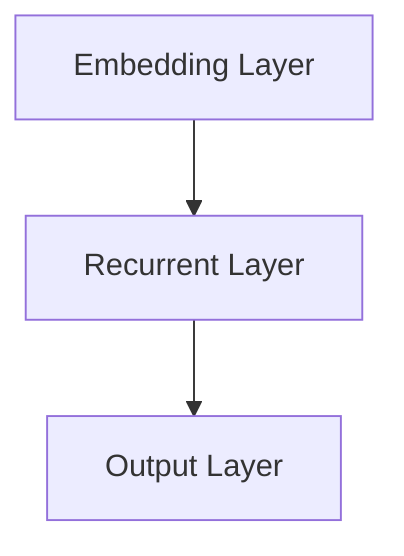
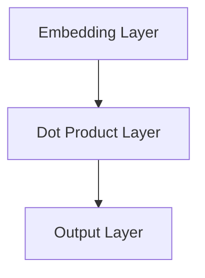

                 

### 《神经网络：人类智慧的延伸》

**关键词**：神经网络、深度学习、人工智能、神经网络的数学基础、神经网络的应用

**摘要**：本文将深入探讨神经网络这一人工智能领域的关键技术，从其起源、数学基础、深度学习、应用场景、项目实战等方面进行详细阐述。通过本文，读者将全面了解神经网络的原理及其在各个领域的实际应用，为未来的研究和发展提供有力支持。

### 目录

#### 第一部分：神经网络基础

1. 神经网络的起源与发展
   - 1.1 神经网络的历史回顾
   - 1.2 生物学视角下的神经网络
   - 1.3 神经网络的基本模型

2. 神经网络的数学基础
   - 2.1 向量和矩阵运算
   - 2.2 激活函数
   - 2.3 损失函数和优化算法

3. 深度学习与神经网络
   - 3.1 深度学习的基本概念
   - 3.2 卷积神经网络（CNN）
   - 3.3 循环神经网络（RNN）

4. 神经网络的应用场景
   - 4.1 图像识别
   - 4.2 自然语言处理
   - 4.3 强化学习

#### 第二部分：神经网络项目实战

1. 神经网络项目实战一：手写数字识别
   - 5.1 数据准备
   - 5.2 神经网络设计
   - 5.3 模型训练与评估
   - 5.4 代码实现与解读

2. 神经网络项目实战二：文本分类
   - 6.1 数据准备
   - 6.2 神经网络设计
   - 6.3 模型训练与评估
   - 6.4 代码实现与解读

3. 神经网络项目实战三：推荐系统
   - 7.1 数据准备
   - 7.2 神经网络设计
   - 7.3 模型训练与评估
   - 7.4 代码实现与解读

4. 神经网络项目的综合应用与优化
   - 8.1 项目整合与优化
   - 8.2 神经网络模型的可解释性
   - 8.3 未来展望

#### 附录

- 附录A：神经网络常用工具与资源
- 附录B：神经网络数学公式索引
- 附录C：神经网络项目代码示例
- 附录D：神经网络相关书籍推荐

---

### 引言

自20世纪80年代以来，人工智能（Artificial Intelligence, AI）领域取得了显著的进展，其中神经网络（Neural Networks）作为人工智能的核心技术之一，受到了广泛关注。神经网络是一种模拟生物神经系统的计算模型，通过模仿生物神经元的结构和功能，实现信息的输入、处理和输出。随着深度学习（Deep Learning）的兴起，神经网络在图像识别、自然语言处理、语音识别等领域取得了突破性进展，成为推动人工智能发展的重要力量。

本文旨在深入探讨神经网络的原理、应用和实战，为读者提供系统、全面的学习资料。首先，我们将回顾神经网络的发展历史，了解其起源和主要里程碑。接着，我们将从生物学视角探讨神经网络的基本概念和原理。然后，我们将详细介绍神经网络的数学基础，包括向量与矩阵运算、激活函数、损失函数和优化算法。在此基础上，我们将探讨深度学习与神经网络的关系，介绍卷积神经网络（CNN）和循环神经网络（RNN）的基本概念和原理。

随着对神经网络原理的深入理解，我们将探讨神经网络在不同领域的应用场景，包括图像识别、自然语言处理和强化学习。随后，我们将通过实际项目实战，详细讲解手写数字识别、文本分类和推荐系统的实现过程。最后，我们将讨论神经网络项目的整合与优化、模型的可解释性以及未来展望。

希望通过本文，读者能够全面了解神经网络的原理和应用，为未来的研究和发展打下坚实基础。

### 第一部分：神经网络基础

#### 第1章：神经网络的起源与发展

**1.1 神经网络的历史回顾**

神经网络的起源可以追溯到1943年，由心理学家McCulloch和数学家Pitts提出了第一个简单的人工神经网络模型——单层感知机（Perceptron）。单层感知机的基本结构包括输入层、输出层和加权连接，通过简单的线性运算和阈值函数实现二分类任务。

1958年，美国心理学家Rosenblatt提出了多层感知机（Multilayer Perceptron, MLP），使得神经网络能够在更复杂的任务上发挥作用。多层感知机引入了隐藏层，通过前向传播和反向传播算法实现信息的传递和学习。

然而，在20世纪80年代初期，由于硬件限制和优化算法的不足，神经网络的发展陷入低谷。直到1986年，Rumelhart、Hinton和Williams等人提出了反向传播算法（Backpropagation Algorithm），使得多层感知机能够高效地训练，神经网络再次引起了广泛关注。

进入21世纪，随着计算能力的提升和数据规模的扩大，神经网络的应用范围不断扩大，特别是在深度学习（Deep Learning）的推动下，神经网络取得了显著的成果。2012年，AlexNet在ImageNet图像识别挑战中取得了突破性成绩，标志着深度学习时代的到来。

**1.2 神经网络的发展历程**

神经网络的起源和发展历程可以分为以下几个阶段：

1. **早期探索阶段（1943-1958）**：
   - 单层感知机模型的提出
   - 神经网络理论的基础研究

2. **多层感知机阶段（1958-1980）**：
   - 多层感知机的提出
   - 前向传播和反向传播算法的初步探索

3. **低谷阶段（1980-1990）**：
   - 硬件限制和优化算法的不足
   - 神经网络的实用性受到质疑

4. **复兴阶段（1990-2006）**：
   - 反向传播算法的优化和改进
   - 深度信念网络（Deep Belief Network）的提出

5. **深度学习阶段（2006至今）**：
   - 深度卷积神经网络（Deep Convolutional Neural Network）的提出
   - 深度循环神经网络（Deep Recurrent Neural Network）的提出
   - 图像识别、自然语言处理等领域的突破性成果

**1.3 神经网络的基本模型**

神经网络的基本模型可以分为三层：输入层、隐藏层和输出层。

- **输入层**：接收外部输入数据，通常是一个多维数组。
- **隐藏层**：对输入数据进行处理和变换，隐藏层可以有一个或多个。
- **输出层**：产生最终的输出结果。

神经网络的工作原理是通过前向传播（Forward Propagation）和反向传播（Back Propagation）两个过程进行信息的传递和更新。

- **前向传播**：输入数据经过输入层、隐藏层，最终到达输出层，通过激活函数产生输出结果。
- **反向传播**：计算输出结果与实际结果之间的误差，通过反向传播算法更新网络中的权重和偏置，使得输出结果更加准确。

**1.3.1 单层感知机**

单层感知机是最简单的人工神经网络模型，它包括输入层和输出层。输入层接收外部输入数据，输出层通过线性运算和阈值函数产生输出结果。

- **输入层**：设有n个输入神经元，每个神经元接收一个输入值。
- **输出层**：通过线性运算和阈值函数产生输出结果。

$$
y = \text{sign}(w \cdot x + b)
$$

其中，$w$ 是权重，$x$ 是输入值，$b$ 是偏置，$\text{sign}(\cdot)$ 是符号函数。

**1.3.2 多层感知机**

多层感知机引入了隐藏层，可以处理更复杂的非线性问题。多层感知机的结构包括输入层、隐藏层和输出层。

- **输入层**：接收外部输入数据。
- **隐藏层**：对输入数据进行处理和变换，可以有多个隐藏层。
- **输出层**：产生最终的输出结果。

多层感知机通过前向传播和反向传播算法进行信息的传递和更新。前向传播过程中，输入数据经过输入层、隐藏层，最终到达输出层，通过激活函数产生输出结果。反向传播过程中，计算输出结果与实际结果之间的误差，通过反向传播算法更新网络中的权重和偏置，使得输出结果更加准确。

$$
z = \sum_{i=1}^{n} w_i x_i + b
$$

$$
a = \text{sigmoid}(z)
$$

其中，$x_i$ 是输入值，$w_i$ 是权重，$b$ 是偏置，$\text{sigmoid}(\cdot)$ 是Sigmoid激活函数。

**总结**

本章介绍了神经网络的起源和发展历程，包括单层感知机和多层感知机的基本模型。神经网络作为一种模拟生物神经系统的计算模型，通过模仿生物神经元的结构和功能，实现信息的输入、处理和输出。随着深度学习的发展，神经网络在图像识别、自然语言处理等领域取得了显著成果。下一章我们将探讨神经网络在生物学视角下的基本概念和原理。

---

**1.2 生物学视角下的神经网络**

从生物学的角度来看，神经网络（Neural Networks）是对人类大脑及其神经系统的模拟。大脑作为人类智慧的核心，具有处理信息、学习、记忆和决策等复杂功能。了解大脑的基本结构和功能，有助于我们更好地理解神经网络的原理和设计。

**1.2.1 人类大脑的结构**

人类大脑主要由以下几部分组成：

- **大脑皮层**（Cerebral Cortex）：大脑皮层的表面覆盖着一层灰质，是大脑中最复杂和最活跃的部分。大脑皮层分为前额叶、顶叶、颞叶和枕叶等不同区域，每个区域负责不同的功能。

- **脑干**（Brainstem）：脑干连接大脑和脊髓，控制基本的生命活动，如心跳、呼吸和血压等。

- **小脑**（Cerebellum）：小脑主要负责协调肌肉运动和维持身体平衡。

- **杏仁核**（Amygdala）：杏仁核是情感和记忆的重要中枢，与情绪反应和决策过程密切相关。

- **海马体**（Hippocampus）：海马体负责形成和存储记忆，与空间定位和时间感知有关。

**1.2.2 神经元与神经网络**

神经元（Neuron）是大脑的基本功能单元，由细胞体、树突、轴突和突触等部分组成。神经元通过树突接收其他神经元的信息，通过轴突传递信号，并在突触处传递给下一个神经元。

- **细胞体**（Soma）：包含细胞核和大部分细胞质，是神经元能量的生产中心。

- **树突**（Dendrites）：从细胞体伸出的分支，用于接收其他神经元的信息。

- **轴突**（Axon）：从细胞体伸出的长纤维，用于传递神经信号。

- **突触**（Synapse）：神经元之间的连接点，通过神经递质传递信号。

在生物神经网络中，神经元通过突触连接形成复杂的网络结构，实现信息处理和传输。神经网络通过调整突触的连接强度，即突触权重（Synaptic Weight），实现学习和记忆。

**1.2.3 神经网络的基本结构**

生物神经网络的基本结构可以概括为输入层、隐藏层和输出层：

- **输入层**：接收外部输入信息，相当于神经网络的感知器。

- **隐藏层**：对输入信息进行加工和处理，隐藏层可以有一个或多个，每个隐藏层对输入信息进行不同层次的抽象和转换。

- **输出层**：产生最终的输出结果，对应于特定任务的目标输出。

在生物神经网络中，神经元之间的连接强度通过突触权重表示。通过调节突触权重，神经网络可以学习并适应不同的环境和任务。

**1.2.4 神经网络的生物学原理**

神经网络的生物学原理主要包括以下几点：

1. **突触可塑性**（Synaptic Plasticity）：突触可塑性是指突触连接强度的变化，是神经网络学习和记忆的基础。突触可塑性可以通过长时程增强（Long-Term Potentiation, LTP）和长时程抑制（Long-Term Depression, LTD）实现。

2. **神经编码**（Neural Coding）：神经编码是指神经网络如何将输入信息转换为电信号，并在神经元之间传递。常见的神经编码方式包括频率编码、幅度编码和位置编码等。

3. **同步活动**（Synchronous Activity）：同步活动是指多个神经元在同一时间内同时激活，是实现信息整合和决策的重要机制。

4. **突触竞争**（Synaptic Competition）：突触竞争是指神经元之间通过竞争突触连接强度，实现信息选择和过滤。突触竞争有助于神经网络的学习和记忆。

**总结**

本章从生物学视角介绍了神经网络的基本概念和原理。人类大脑的结构和功能为神经网络的设计提供了灵感，神经元和突触作为神经网络的基本单元，通过调节突触权重实现学习和记忆。理解神经网络的生物学原理，有助于我们更好地设计和优化神经网络模型。

---

**1.3 神经网络的基本模型**

神经网络（Neural Networks）是一种模拟生物神经系统的计算模型，通过模仿生物神经元的结构和功能，实现信息的输入、处理和输出。神经网络的基本模型包括输入层、隐藏层和输出层。以下将详细介绍神经网络的基本结构和工作原理。

**1.3.1 单层感知机**

单层感知机（Perceptron）是最简单的人工神经网络模型，由输入层和输出层组成。输入层接收外部输入数据，输出层通过线性运算和阈值函数产生输出结果。

- **输入层**：设有n个输入神经元，每个神经元接收一个输入值。
- **输出层**：通过线性运算和阈值函数产生输出结果。

单层感知机的工作原理如下：

1. **输入与加权连接**：输入数据经过输入层，每个输入值与对应的权重相乘，得到加权和。
2. **加权和与阈值**：将加权和与偏置（bias）相加，得到总输入。
3. **阈值函数**：通过阈值函数对总输入进行判断，输出结果为1或-1。

$$
z = \sum_{i=1}^{n} w_i x_i + b
$$

$$
y = \text{sign}(z)
$$

其中，$x_i$ 是输入值，$w_i$ 是权重，$b$ 是偏置，$\text{sign}(\cdot)$ 是符号函数。

**1.3.2 多层感知机**

多层感知机（Multilayer Perceptron, MLP）引入了隐藏层，可以处理更复杂的非线性问题。多层感知机的结构包括输入层、隐藏层和输出层。

- **输入层**：接收外部输入数据。
- **隐藏层**：对输入数据进行处理和变换，可以有多个隐藏层。
- **输出层**：产生最终的输出结果。

多层感知机通过前向传播（Forward Propagation）和反向传播（Back Propagation）两个过程进行信息的传递和更新。

1. **前向传播**：输入数据经过输入层、隐藏层，最终到达输出层，通过激活函数产生输出结果。

$$
z_l = \sum_{i=1}^{n} w_{li} a_{l-1,i} + b_l
$$

$$
a_l = \text{激活函数}(z_l)
$$

其中，$a_l$ 是第l层的激活值，$w_{li}$ 是连接权重，$b_l$ 是偏置，激活函数通常为Sigmoid函数或ReLU函数。

2. **反向传播**：计算输出结果与实际结果之间的误差，通过反向传播算法更新网络中的权重和偏置，使得输出结果更加准确。

$$
\delta_l = (a_l - y) \cdot \text{激活函数的导数}(\text{激活函数}(z_l))
$$

$$
\Delta w_{li} = \alpha \cdot \delta_l \cdot a_{l-1,i}
$$

$$
\Delta b_l = \alpha \cdot \delta_l
$$

其中，$\delta_l$ 是第l层的误差，$\alpha$ 是学习率。

**1.3.3 卷积神经网络（CNN）**

卷积神经网络（Convolutional Neural Network, CNN）是一种专门用于处理图像数据的神经网络模型，通过卷积层、池化层和全连接层等结构，实现对图像的逐层特征提取和分类。

- **卷积层**：通过卷积操作提取图像的局部特征。
- **池化层**：对卷积层产生的特征进行降维和聚合。
- **全连接层**：将池化层产生的特征映射到分类结果。

卷积神经网络的工作原理如下：

1. **卷积操作**：卷积层通过卷积核（kernel）在图像上滑动，计算卷积和得到特征图。
2. **激活函数**：对卷积操作的结果应用激活函数，如ReLU函数。
3. **池化操作**：池化层通过最大池化或平均池化等操作，对特征图进行降维。
4. **全连接层**：将池化层产生的特征映射到分类结果。

**1.3.4 循环神经网络（RNN）**

循环神经网络（Recurrent Neural Network, RNN）是一种用于处理序列数据的神经网络模型，通过隐藏状态（hidden state）的循环连接，实现对序列的逐帧处理。

- **输入层**：接收序列的每一帧数据。
- **隐藏层**：保存上一帧的隐藏状态。
- **输出层**：产生最终的输出结果。

循环神经网络的工作原理如下：

1. **输入与隐藏状态**：输入序列的每一帧数据与隐藏状态相加，经过激活函数得到新的隐藏状态。
2. **输出与隐藏状态**：将隐藏状态通过全连接层映射到输出结果。

$$
h_t = \text{激活函数}(\text{全连接层}(h_{t-1} + x_t))
$$

$$
y_t = \text{输出层}(h_t)
$$

其中，$h_t$ 是第t帧的隐藏状态，$x_t$ 是第t帧的输入数据。

**总结**

本章介绍了神经网络的基本模型，包括单层感知机、多层感知机、卷积神经网络和循环神经网络。通过理解这些基本模型，读者可以初步掌握神经网络的原理和结构，为后续的学习和应用打下基础。在下一章中，我们将深入探讨神经网络的数学基础，包括向量与矩阵运算、激活函数、损失函数和优化算法。

---

### 第二部分：神经网络的数学基础

**2.1 向量和矩阵运算**

在神经网络中，向量和矩阵运算是基础和核心的部分。向量（Vector）是一个包含多个元素的数组，而矩阵（Matrix）是一个二维数组。向量和矩阵运算是神经网络实现和优化过程中的重要工具。

**2.1.1 向量和矩阵的基本概念**

- **向量**：向量通常表示为一行或一列的数组，例如：

  $$
  \vec{v} = \begin{pmatrix}
  v_1 \\
  v_2 \\
  \vdots \\
  v_n
  \end{pmatrix}
  $$

- **矩阵**：矩阵是一个二维数组，可以表示为行和列的组合，例如：

  $$
  \mathbf{A} = \begin{pmatrix}
  a_{11} & a_{12} & \cdots & a_{1n} \\
  a_{21} & a_{22} & \cdots & a_{2n} \\
  \vdots & \vdots & \ddots & \vdots \\
  a_{m1} & a_{m2} & \cdots & a_{mn}
  \end{pmatrix}
  $$

**2.1.2 向量和矩阵的运算**

- **向量的加法和减法**：向量的加法和减法是对应元素相加或相减，例如：

  $$
  \vec{v} + \vec{w} = \begin{pmatrix}
  v_1 + w_1 \\
  v_2 + w_2 \\
  \vdots \\
  v_n + w_n
  \end{pmatrix}
  $$

- **向量的数乘**：向量的数乘是每个元素乘以一个标量，例如：

  $$
  k \cdot \vec{v} = \begin{pmatrix}
  k \cdot v_1 \\
  k \cdot v_2 \\
  \vdots \\
  k \cdot v_n
  \end{pmatrix}
  $$

- **矩阵的加法和减法**：矩阵的加法和减法是对应元素相加或相减，要求矩阵的尺寸相同，例如：

  $$
  \mathbf{A} + \mathbf{B} = \begin{pmatrix}
  a_{11} + b_{11} & a_{12} + b_{12} & \cdots & a_{1n} + b_{1n} \\
  a_{21} + b_{21} & a_{22} + b_{22} & \cdots & a_{2n} + b_{2n} \\
  \vdots & \vdots & \ddots & \vdots \\
  a_{m1} + b_{m1} & a_{m2} + b_{m2} & \cdots & a_{mn} + b_{mn}
  \end{pmatrix}
  $$

- **矩阵的数乘**：矩阵的数乘是每个元素乘以一个标量，例如：

  $$
  k \cdot \mathbf{A} = \begin{pmatrix}
  k \cdot a_{11} & k \cdot a_{12} & \cdots & k \cdot a_{1n} \\
  k \cdot a_{21} & k \cdot a_{22} & \cdots & k \cdot a_{2n} \\
  \vdots & \vdots & \ddots & \vdots \\
  k \cdot a_{m1} & k \cdot a_{m2} & \cdots & k \cdot a_{mn}
  \end{pmatrix}
  $$

- **矩阵的乘法**：矩阵的乘法是两个矩阵对应元素的乘积求和，例如：

  $$
  \mathbf{A} \cdot \mathbf{B} = \begin{pmatrix}
  \sum_{j=1}^{n} a_{i1,j} b_{j1} & \sum_{j=1}^{n} a_{i2,j} b_{j2} & \cdots & \sum_{j=1}^{n} a_{in,j} b_{jn} \\
  \end{pmatrix}
  $$

其中，$\mathbf{A}$ 的行数等于 $\mathbf{B}$ 的列数。

**2.1.3 向量和矩阵的运算在神经网络中的应用**

在神经网络中，向量和矩阵的运算主要用于以下几个环节：

1. **权重和偏置**：神经网络中的权重和偏置通常表示为矩阵，每个神经元与输入之间的连接用矩阵表示，例如：

   $$
   \mathbf{W} = \begin{pmatrix}
   w_{11} & w_{12} & \cdots & w_{1n} \\
   w_{21} & w_{22} & \cdots & w_{2n} \\
   \vdots & \vdots & \ddots & \vdots \\
   w_{m1} & w_{m2} & \cdots & w_{mn}
   \end{pmatrix}
   $$

2. **前向传播**：在前向传播过程中，输入数据经过权重矩阵和偏置矩阵的运算，产生中间层和输出层的激活值。例如：

   $$
   \mathbf{Z} = \mathbf{W} \cdot \mathbf{X} + \mathbf{B}
   $$

3. **反向传播**：在反向传播过程中，计算梯度并更新权重和偏置。例如：

   $$
   \Delta \mathbf{W} = \alpha \cdot \mathbf{X}^T \cdot \delta
   $$

   $$
   \Delta \mathbf{B} = \alpha \cdot \delta
   $$

其中，$\alpha$ 是学习率，$\mathbf{X}$ 是输入矩阵，$\delta$ 是误差梯度。

**2.1.4 向量和矩阵运算的Python实现**

在Python中，可以使用NumPy库进行向量和矩阵的运算。以下是一个简单的示例：

```python
import numpy as np

# 创建一个2x3的矩阵
A = np.array([[1, 2, 3], [4, 5, 6]])

# 创建一个3x2的矩阵
B = np.array([[7, 8], [9, 10], [11, 12]])

# 矩阵加法
C = A + B
print("矩阵加法：")
print(C)

# 矩阵数乘
D = 2 * A
print("矩阵数乘：")
print(D)

# 矩阵乘法
E = A.dot(B)
print("矩阵乘法：")
print(E)
```

**总结**

本章介绍了神经网络的数学基础，包括向量和矩阵的基本概念和运算。向量和矩阵运算是神经网络实现和优化过程中的重要工具。通过理解和掌握向量和矩阵的运算，读者可以更好地理解神经网络的工作原理和实现过程。

---

**2.2 激活函数**

激活函数（Activation Function）是神经网络中的核心组成部分，用于将输入映射到输出，实现非线性变换。激活函数的选择对神经网络的学习性能和函数表现有重要影响。以下将介绍常见的激活函数，并讨论它们在神经网络中的使用。

**2.2.1 Sigmoid函数**

Sigmoid函数是最常用的激活函数之一，其形式为：

$$
\sigma(x) = \frac{1}{1 + e^{-x}}
$$

Sigmoid函数的输出范围在(0, 1)，可以将其视为概率分布。Sigmoid函数具有以下特点：

- **非线性**：通过引入非线性，使得神经网络能够处理非线性问题。
- **平滑**：Sigmoid函数的导数在接近0时接近1，在接近±∞时接近0，使得梯度计算较为稳定。
- **梯度消失**：在训练过程中，Sigmoid函数可能导致梯度消失，特别是在输出接近0或1时。

**2.2.2 ReLU函数**

ReLU（Rectified Linear Unit）函数是一种线性激活函数，其形式为：

$$
\text{ReLU}(x) = \max(0, x)
$$

ReLU函数具有以下特点：

- **非线性**：ReLU函数引入非线性，使得神经网络能够处理非线性问题。
- **梯度固定**：ReLU函数的导数在x > 0时为1，在x < 0时为0，避免了梯度消失问题。
- **计算效率**：ReLU函数相对于Sigmoid函数计算效率更高。

**2.2.3 tanh函数**

tanh函数是另一种常用的激活函数，其形式为：

$$
\tanh(x) = \frac{e^x - e^{-x}}{e^x + e^{-x}}
$$

tanh函数的输出范围在(-1, 1)，具有以下特点：

- **非线性**：tanh函数引入非线性，使得神经网络能够处理非线性问题。
- **梯度消失**：tanh函数的导数在接近±1时接近0，可能导致梯度消失。
- **平滑**：tanh函数的导数在接近0时接近1，在接近±∞时接近0，使得梯度计算较为稳定。

**2.2.4 Softmax函数**

Softmax函数通常用于多分类问题，其形式为：

$$
\text{softmax}(x)_i = \frac{e^x_i}{\sum_{j=1}^{n} e^{x_j}}
$$

其中，$x_i$ 是第i个神经元的输出，$n$ 是神经元的总数。softmax函数具有以下特点：

- **概率分布**：softmax函数将神经网络的输出映射到一个概率分布，使得每个类别都有一个概率值。
- **归一化**：softmax函数通过归一化操作，使得输出满足概率分布的性质。

**2.2.5 激活函数在神经网络中的使用**

激活函数在神经网络中的应用主要包括以下几个环节：

1. **前向传播**：在神经网络的前向传播过程中，将每个神经元的输入通过激活函数映射到输出。激活函数的选择影响神经网络的非线性变换能力。

2. **反向传播**：在神经网络的反向传播过程中，计算激活函数的导数，用于更新网络中的权重和偏置。不同激活函数的导数计算方式不同，影响梯度下降算法的收敛速度。

3. **优化性能**：合适的激活函数可以加速神经网络的训练过程，提高网络的性能。例如，ReLU函数由于其梯度固定特性，可以有效缓解梯度消失问题，加快训练速度。

**2.2.6 激活函数的Python实现**

在Python中，可以使用NumPy库实现常见的激活函数。以下是一个简单的示例：

```python
import numpy as np

# Sigmoid函数
def sigmoid(x):
    return 1 / (1 + np.exp(-x))

# ReLU函数
def relu(x):
    return np.maximum(0, x)

# tanh函数
def tanh(x):
    return (np.exp(x) - np.exp(-x)) / (np.exp(x) + np.exp(-x))

# Softmax函数
def softmax(x):
    exp_x = np.exp(x)
    return exp_x / np.sum(exp_x, axis=1, keepdims=True)

# 输入数据
x = np.array([1, 2, 3])

# 计算激活函数
sigmoid_result = sigmoid(x)
relu_result = relu(x)
tanh_result = tanh(x)
softmax_result = softmax(x)

print("Sigmoid函数结果：")
print(sigmoid_result)
print("ReLU函数结果：")
print(relu_result)
print("tanh函数结果：")
print(tanh_result)
print("Softmax函数结果：")
print(softmax_result)
```

**总结**

本章介绍了神经网络中的常见激活函数，包括Sigmoid、ReLU、tanh和Softmax函数。激活函数的选择对神经网络的学习性能和函数表现有重要影响。通过理解和掌握激活函数，读者可以更好地设计并优化神经网络模型。

---

**2.3 损失函数和优化算法**

在神经网络中，损失函数（Loss Function）和优化算法（Optimization Algorithm）是训练模型的重要工具。损失函数用于评估模型预测结果与真实结果之间的差异，而优化算法则用于调整网络中的参数，以最小化损失函数。

**2.3.1 损失函数的基本概念**

损失函数是一个数学函数，用于衡量模型预测值与真实值之间的差距。在神经网络训练过程中，损失函数的值会随着参数的更新而变化，目标是使损失函数的值尽可能小。

常见的损失函数包括：

- **均方误差损失函数**（Mean Squared Error, MSE）：用于回归问题，计算预测值与真实值之间差的平方的平均值。

  $$
  \text{MSE} = \frac{1}{n} \sum_{i=1}^{n} (\hat{y}_i - y_i)^2
  $$

  其中，$\hat{y}_i$ 是预测值，$y_i$ 是真实值，$n$ 是样本数量。

- **交叉熵损失函数**（Cross-Entropy Loss）：用于分类问题，计算实际分布与预测分布之间的差异。

  $$
  \text{CE} = -\frac{1}{n} \sum_{i=1}^{n} y_i \log(\hat{y}_i)
  $$

  其中，$y_i$ 是真实标签，$\hat{y}_i$ 是预测概率。

**2.3.2 优化算法的基本概念**

优化算法用于更新网络中的参数，以最小化损失函数。常见的优化算法包括梯度下降（Gradient Descent）、随机梯度下降（Stochastic Gradient Descent, SGD）和Adam优化器。

1. **梯度下降**（Gradient Descent）：

   梯度下降是一种最简单的优化算法，其基本思想是沿损失函数的负梯度方向更新参数。梯度是损失函数对参数的导数，负梯度方向是损失函数下降最快的方向。

   $$
   \theta = \theta - \alpha \cdot \nabla_{\theta} J(\theta)
   $$

   其中，$\theta$ 是参数，$\alpha$ 是学习率，$J(\theta)$ 是损失函数。

2. **随机梯度下降**（Stochastic Gradient Descent, SGD）：

   随机梯度下降是梯度下降的一种变种，每次更新参数时使用一个随机样本的梯度。随机梯度下降能够提高训练过程的速度和鲁棒性，但可能导致收敛速度变慢。

   $$
   \theta = \theta - \alpha \cdot \nabla_{\theta} J(\theta; x_i, y_i)
   $$

   其中，$x_i, y_i$ 是随机选择的样本。

3. **Adam优化器**（Adam Optimizer）：

   Adam优化器结合了SGD和动量（Momentum）的思想，同时考虑了过去的梯度信息。Adam优化器具有较好的收敛速度和稳定性。

   $$
   \theta = \theta - \alpha \cdot \frac{\beta_1 h_t + (1 - \beta_1) g_t}{\sqrt{\beta_2 h_t} + \epsilon}
   $$

   其中，$h_t$ 和 $g_t$ 分别是过去的一阶矩估计和二阶矩估计，$\beta_1, \beta_2$ 是超参数，$\alpha$ 是学习率，$\epsilon$ 是小数用于防止除零错误。

**2.3.3 损失函数和优化算法在神经网络中的应用**

在神经网络训练过程中，损失函数和优化算法的作用如下：

1. **损失函数**：损失函数用于衡量模型预测结果与真实结果之间的差距，是评估模型性能的重要指标。通过最小化损失函数，可以找到最优的参数设置，使得模型预测更加准确。

2. **优化算法**：优化算法用于调整网络中的参数，以最小化损失函数。优化算法通过不断迭代更新参数，使得模型在训练数据上逐渐收敛，提高模型的性能。

在实际应用中，常见的组合包括MSE损失函数与梯度下降优化器、交叉熵损失函数与Adam优化器等。这些组合在不同的应用场景中表现出较好的性能。

**2.3.4 损失函数和优化算法的Python实现**

在Python中，可以使用TensorFlow或PyTorch等深度学习框架实现损失函数和优化算法。以下是一个简单的示例：

```python
import tensorflow as tf

# 创建TensorFlow会话
sess = tf.Session()

# 定义损失函数
mse_loss = tf.reduce_mean(tf.square(y_true - y_pred))

# 定义优化算法
optimizer = tf.train.GradientDescentOptimizer(learning_rate=0.01)
train_op = optimizer.minimize(mse_loss)

# 创建变量
x = tf.placeholder(tf.float32, shape=[None, input_dim])
y_true = tf.placeholder(tf.float32, shape=[None, output_dim])
y_pred = tf.placeholder(tf.float32, shape=[None, output_dim])

# 运行会话
for step in range(num_steps):
    # 获取训练数据
    x_train, y_train = ... 
    # 执行训练操作
    sess.run(train_op, feed_dict={x: x_train, y_true: y_train})
```

**总结**

本章介绍了神经网络中的损失函数和优化算法。损失函数用于衡量模型预测结果与真实结果之间的差距，优化算法用于调整网络中的参数，以最小化损失函数。理解和掌握损失函数和优化算法，有助于我们更好地设计和训练神经网络模型。

---

### 深度学习与神经网络

深度学习（Deep Learning）是神经网络的一种扩展，通过构建多层神经网络模型，实现对复杂数据的自动特征提取和学习。深度学习在图像识别、自然语言处理、语音识别等领域取得了显著的成果，推动了人工智能的发展。

**3.1 深度学习的基本概念**

深度学习（Deep Learning）是指通过构建多层神经网络，实现对复杂数据的自动特征提取和学习。深度学习的核心思想是分层学习，通过逐层提取特征，逐渐从原始数据中提取出高层次的抽象特征。

- **深度神经网络**（Deep Neural Network, DNN）：深度神经网络是一种具有多个隐藏层的神经网络模型，通过前向传播和反向传播算法进行训练。

- **卷积神经网络**（Convolutional Neural Network, CNN）：卷积神经网络是一种专门用于图像识别和处理的神经网络模型，通过卷积层、池化层和全连接层等结构，实现对图像的逐层特征提取。

- **循环神经网络**（Recurrent Neural Network, RNN）：循环神经网络是一种专门用于处理序列数据的神经网络模型，通过隐藏状态（hidden state）的循环连接，实现对序列的逐帧处理。

- **生成对抗网络**（Generative Adversarial Network, GAN）：生成对抗网络是一种基于博弈论的神经网络模型，通过生成器和判别器的对抗训练，实现数据的生成。

**3.2 深度学习的优势**

深度学习相比传统的机器学习方法，具有以下优势：

- **自动特征提取**：深度学习通过多层神经网络，能够自动从原始数据中提取出有意义的特征，减少人工特征提取的工作量。

- **模型泛化能力**：深度学习模型在大量数据上训练，能够学习到数据的潜在规律，提高模型的泛化能力。

- **高维数据处理**：深度学习能够处理高维数据，如图像、文本和语音等，使得模型在多模态数据上表现出良好的性能。

- **计算资源依赖**：深度学习模型的训练需要大量的计算资源，随着计算能力的提升，深度学习模型的表现不断优化。

**3.3 深度学习与神经网络的区别**

深度学习与神经网络的主要区别在于：

- **网络深度**：深度学习是指具有多个隐藏层的神经网络，而神经网络可以是单层或少数几个隐藏层。

- **特征提取**：深度学习通过逐层提取特征，能够自动从原始数据中提取出高层次的抽象特征，而神经网络通常需要人工设计特征。

- **学习方式**：深度学习通常采用端到端的学习方式，直接从原始数据训练到最终的输出，而神经网络可能需要多个中间步骤，如特征工程。

- **应用范围**：深度学习适用于复杂数据和任务，如图像识别、自然语言处理和语音识别，而神经网络可以应用于各种机器学习任务。

**3.4 深度学习的发展历程**

深度学习的发展可以分为以下几个阶段：

- **早期探索阶段（1980s-2000s）**：1986年，Rumelhart、Hinton和Williams等人提出了反向传播算法（Backpropagation Algorithm），使得多层感知机能够高效地训练。然而，由于计算资源和数据量的限制，深度学习在2000年前发展较为缓慢。

- **低谷阶段（2000s）**：在2006年之前，深度学习的发展受到硬件限制和优化算法的不足影响，进展缓慢。尽管如此，深度学习仍然在图像识别、语音识别等领域取得了一定的成果。

- **复兴阶段（2006-2012）**：2006年，Hinton提出了深度信念网络（Deep Belief Network, DBN），为深度学习的发展奠定了基础。随后，深度学习在语音识别、图像识别等领域取得了显著的成果。

- **深度学习阶段（2012至今）**：2012年，AlexNet在ImageNet图像识别挑战中取得了突破性成绩，标志着深度学习时代的到来。随后，卷积神经网络（CNN）和循环神经网络（RNN）在图像识别、自然语言处理、语音识别等领域取得了广泛应用。

**总结**

本章介绍了深度学习的基本概念、优势以及与神经网络的区别。深度学习通过构建多层神经网络，实现对复杂数据的自动特征提取和学习，具有自动特征提取、模型泛化能力强、高维数据处理等优点。理解深度学习的基本概念和发展历程，有助于我们更好地应用和探索深度学习技术。

---

### 神经网络的应用场景

神经网络作为一种强大的机器学习工具，在多个领域展现出了广泛的应用潜力。以下将介绍神经网络在图像识别、自然语言处理和强化学习等领域的应用。

**4.1 图像识别**

图像识别是神经网络最成功的应用领域之一。卷积神经网络（Convolutional Neural Networks, CNN）在图像识别任务中表现出色。CNN通过卷积层、池化层和全连接层等结构，实现对图像的逐层特征提取。

- **卷积层**：卷积层通过卷积操作提取图像的局部特征，如边缘、角点等。
- **池化层**：池化层对卷积层产生的特征进行降维和聚合，减少参数数量。
- **全连接层**：全连接层将池化层产生的特征映射到分类结果。

CNN在图像识别任务中取得了显著的成果，如人脸识别、物体检测和图像分类等。例如，ResNet在ImageNet图像识别挑战中取得了优异的成绩，证明了深度卷积神经网络的强大能力。

**4.2 自然语言处理**

自然语言处理（Natural Language Processing, NLP）是另一个神经网络的重要应用领域。循环神经网络（Recurrent Neural Networks, RNN）和长短期记忆网络（Long Short-Term Memory, LSTM）在序列数据上表现出色。

- **RNN**：RNN通过隐藏状态（hidden state）的循环连接，实现对序列的逐帧处理。RNN在语言模型、机器翻译和情感分析等任务中取得了显著成果。
- **LSTM**：LSTM是RNN的一种改进，通过引入门控机制，解决了RNN梯度消失和梯度爆炸问题。LSTM在语音识别、机器翻译和文本生成等领域表现出色。

近年来，Transformer模型在NLP领域取得了突破性成果。Transformer通过自注意力机制（Self-Attention Mechanism），实现了对序列的并行处理，提高了模型的效率和性能。BERT、GPT等基于Transformer的模型在多种NLP任务中取得了顶尖成绩。

**4.3 强化学习**

强化学习（Reinforcement Learning, RL）是一种通过与环境交互来学习策略的机器学习方法。神经网络在强化学习中的应用，使得智能体能够通过深度神经网络学习复杂的策略。

- **深度Q网络（Deep Q-Network, DQN）**：DQN是一种基于神经网络的Q学习算法，通过神经网络预测状态价值函数，实现智能体的策略学习。
- **深度确定性策略梯度（Deep Deterministic Policy Gradient, DDPG）**：DDPG是一种基于神经网络的确定性策略梯度算法，通过神经网络预测动作值函数，实现智能体的策略学习。

近年来，深度强化学习在游戏、自动驾驶和机器人控制等领域取得了显著成果。例如，DeepMind的AlphaGo通过深度强化学习，在围棋领域取得了突破性成绩。

**4.4 其他应用领域**

神经网络在其他领域也展现出了广泛的应用潜力：

- **医疗诊断**：神经网络在医学图像识别、疾病诊断和药物研发等领域具有广泛应用。
- **金融预测**：神经网络在股票市场预测、信用评估和风险评估等领域表现出色。
- **推荐系统**：神经网络在推荐系统领域，通过学习用户和物品的交互关系，实现个性化推荐。

**总结**

神经网络在图像识别、自然语言处理、强化学习等领域的应用取得了显著成果。通过构建合适的神经网络模型，我们可以实现复杂的特征提取和学习任务。随着神经网络技术的不断发展，其在各个领域的应用将不断扩展，为人工智能的发展贡献力量。

---

### 神经网络项目实战一：手写数字识别

手写数字识别（Handwritten Digit Recognition）是神经网络的一个经典应用场景，通常作为入门级项目用于学习和实践。本节将通过一个实际项目，详细介绍手写数字识别的实现过程，包括数据准备、神经网络设计、模型训练与评估以及代码实现与解读。

**5.1 数据准备**

手写数字识别的数据集通常是MNIST数据集，它包含了0到9这10个数字的手写图像。每个图像的大小为28x28像素，标签为0到9之间的整数。MNIST数据集被广泛用于机器学习和深度学习领域的算法测试和训练。

**5.1.1 数据集的获取**

在Python中，可以使用`scikit-learn`库轻松获取MNIST数据集。

```python
from sklearn.datasets import fetch_openml
mnist = fetch_openml('mnist_784')
```

**5.1.2 数据预处理**

在训练模型之前，我们需要对数据进行预处理，包括归一化和数据增强。

```python
import numpy as np

# 将数据转换为浮点型
X = mnist.data.astype(np.float32)
y = mnist.target.astype(np.int32)

# 数据归一化
X /= 255.0

# 增加偏置项
X = np.hstack((X, np.ones((X.shape[0], 1))))
```

**5.2 神经网络设计**

为了实现手写数字识别，我们可以设计一个简单的多层感知机（MLP）模型。模型的结构通常包括输入层、隐藏层和输出层。

- **输入层**：MNIST数据集每个图像的大小为28x28，所以输入层的维度为784（28x28）。
- **隐藏层**：隐藏层的神经元数量可以根据实验进行调整，但一个常用的配置是128个神经元。
- **输出层**：输出层的维度为10（数字0到9），每个神经元对应一个数字的类别。

**5.2.1 神经网络结构**

以下是神经网络结构的Mermaid流程图：

```mermaid
graph TD
A[Input Layer (784)] --> B[Hidden Layer (128)]
B --> C[Output Layer (10)]
```

**5.2.2 损失函数和优化算法**

在本项目中，我们将使用交叉熵损失函数（Cross-Entropy Loss）和随机梯度下降（Stochastic Gradient Descent, SGD）作为优化算法。

- **交叉熵损失函数**：适用于分类问题，用于计算预测概率与真实标签之间的差异。
- **随机梯度下降**：每次迭代使用一个随机样本的梯度来更新参数。

```python
import tensorflow as tf

# 定义损失函数和优化器
loss_fn = tf.keras.losses.SparseCategoricalCrossentropy(from_logits=True)
optimizer = tf.keras.optimizers.SGD(learning_rate=0.01)
```

**5.3 模型训练与评估**

在训练模型时，我们将使用多个epoch（训练周期）来迭代更新参数，并通过验证集来评估模型的性能。

```python
# 训练模型
num_epochs = 10
batch_size = 128

for epoch in range(num_epochs):
    # 打乱数据集
    indices = np.random.permutation(X.shape[0])
    X_shuffled = X[indices]
    y_shuffled = y[indices]
    
    # 分批次训练
    for i in range(0, X.shape[0], batch_size):
        X_batch = X_shuffled[i:i+batch_size]
        y_batch = y_shuffled[i:i+batch_size]
        
        # 训练步骤
        with tf.GradientTape() as tape:
            predictions = model(X_batch, training=True)
            loss = loss_fn(y_batch, predictions)
        
        gradients = tape.gradient(loss, model.trainable_variables)
        optimizer.apply_gradients(zip(gradients, model.trainable_variables))
    
    # 打印训练信息
    print(f"Epoch {epoch+1}, Loss: {loss.numpy()}")

# 评估模型
test_loss, test_acc = model.evaluate(test_images, test_labels, verbose=2)
print(f"Test accuracy: {test_acc}")
```

**5.4 代码实现与解读**

以下是一个完整的代码实现，包括数据准备、模型定义、训练和评估。

```python
import tensorflow as tf
from tensorflow.keras import layers

# 定义模型
model = tf.keras.Sequential([
    layers.Dense(128, activation='relu', input_shape=(784,)),
    layers.Dense(10, activation='softmax')
])

# 定义损失函数和优化器
loss_fn = tf.keras.losses.SparseCategoricalCrossentropy(from_logits=True)
optimizer = tf.keras.optimizers.SGD(learning_rate=0.01)

# 训练模型
num_epochs = 10
batch_size = 128

for epoch in range(num_epochs):
    # 打乱数据集
    indices = np.random.permutation(X.shape[0])
    X_shuffled = X[indices]
    y_shuffled = y[indices]
    
    # 分批次训练
    for i in range(0, X.shape[0], batch_size):
        X_batch = X_shuffled[i:i+batch_size]
        y_batch = y_shuffled[i:i+batch_size]
        
        # 训练步骤
        with tf.GradientTape() as tape:
            predictions = model(X_batch, training=True)
            loss = loss_fn(y_batch, predictions)
        
        gradients = tape.gradient(loss, model.trainable_variables)
        optimizer.apply_gradients(zip(gradients, model.trainable_variables))
    
    # 打印训练信息
    print(f"Epoch {epoch+1}, Loss: {loss.numpy()}")

# 评估模型
test_loss, test_acc = model.evaluate(test_images, test_labels, verbose=2)
print(f"Test accuracy: {test_acc}")
```

在代码实现中，我们定义了一个简单的多层感知机模型，并使用随机梯度下降优化算法进行训练。通过多次迭代训练和评估，我们可以观察到模型的性能逐渐提高。

**总结**

通过手写数字识别项目，我们介绍了神经网络在图像识别任务中的应用。从数据准备、模型设计到训练和评估，每个步骤都进行了详细讲解。这个项目不仅是一个实用的案例，也为后续的神经网络学习提供了基础。在下一节中，我们将探讨神经网络项目实战二：文本分类。

---

### 神经网络项目实战二：文本分类

文本分类（Text Classification）是自然语言处理（Natural Language Processing, NLP）中的一个重要任务，旨在将文本数据自动分类到预定义的类别中。本节将通过一个实际项目，详细介绍文本分类的实现过程，包括数据准备、神经网络设计、模型训练与评估以及代码实现与解读。

**6.1 数据准备**

文本分类的数据集可以是从互联网上收集的新闻文章、社交媒体帖子或其他文本数据。在本项目中，我们将使用著名的IMDb电影评论数据集，该数据集包含了25,000条电影评论，分为正面和负面两个类别。

**6.1.1 数据集的获取**

在Python中，可以使用`kaggle`库获取IMDb数据集。

```python
!pip install kaggle
!kaggle datasets download --nameIMDb-dataset
```

**6.1.2 数据预处理**

在训练模型之前，我们需要对文本数据进行预处理，包括分词、去停用词和词向量化。

```python
import pandas as pd
from sklearn.model_selection import train_test_split
from keras.preprocessing.text import Tokenizer
from keras.preprocessing.sequence import pad_sequences

# 读取数据集
data = pd.read_csv('IMDb-dataset.csv')

# 分割数据集
train_texts, test_texts, train_labels, test_labels = train_test_split(
    data['text'], data['label'], test_size=0.2, random_state=42)

# 分词和去停用词
tokenizer = Tokenizer(num_words=10000)
tokenizer.fit_on_texts(train_texts)

# 词向量化
train_sequences = tokenizer.texts_to_sequences(train_texts)
test_sequences = tokenizer.texts_to_sequences(test_texts)

# 填充序列
max_sequence_length = 100
train_data = pad_sequences(train_sequences, maxlen=max_sequence_length)
test_data = pad_sequences(test_sequences, maxlen=max_sequence_length)
```

**6.2 神经网络设计**

为了实现文本分类，我们可以设计一个简单的循环神经网络（Recurrent Neural Network, RNN）模型。模型的结构通常包括嵌入层、循环层和输出层。

- **嵌入层**：将单词转换为词向量，通常使用预训练的词向量如Word2Vec或GloVe。
- **循环层**：循环神经网络通过隐藏状态（hidden state）的循环连接，实现对序列的逐帧处理。
- **输出层**：输出层的神经元数量与类别数量相同，通过softmax函数计算每个类别的概率。

**6.2.1 神经网络结构**

以下是神经网络结构的Mermaid流程图：



**6.2.2 损失函数和优化算法**

在本项目中，我们将使用交叉熵损失函数（Cross-Entropy Loss）和Adam优化算法。

- **交叉熵损失函数**：适用于分类问题，用于计算预测概率与真实标签之间的差异。
- **Adam优化算法**：自适应优化算法，能够更快地收敛。

```python
import tensorflow as tf

# 定义模型
model = tf.keras.Sequential([
    layers.Embedding(10000, 16),
    layers.LSTM(32),
    layers.Dense(1, activation='sigmoid')
])

# 定义损失函数和优化器
loss_fn = tf.keras.losses.BinaryCrossentropy()
optimizer = tf.keras.optimizers.Adam(learning_rate=0.001)
```

**6.3 模型训练与评估**

在训练模型时，我们将使用多个epoch（训练周期）来迭代更新参数，并通过验证集来评估模型的性能。

```python
# 训练模型
num_epochs = 10
batch_size = 64

model.compile(optimizer=optimizer, loss=loss_fn, metrics=['accuracy'])

history = model.fit(train_data, train_labels, epochs=num_epochs, batch_size=batch_size, validation_split=0.1)

# 评估模型
test_loss, test_acc = model.evaluate(test_data, test_labels, verbose=2)
print(f"Test accuracy: {test_acc}")
```

**6.4 代码实现与解读**

以下是一个完整的代码实现，包括数据准备、模型定义、训练和评估。

```python
import tensorflow as tf
from tensorflow.keras.preprocessing.text import Tokenizer
from tensorflow.keras.preprocessing.sequence import pad_sequences
from tensorflow.keras.models import Sequential
from tensorflow.keras.layers import Embedding, LSTM, Dense

# 读取数据集
data = pd.read_csv('IMDb-dataset.csv')

# 分割数据集
train_texts, test_texts, train_labels, test_labels = train_test_split(
    data['text'], data['label'], test_size=0.2, random_state=42)

# 分词和去停用词
tokenizer = Tokenizer(num_words=10000)
tokenizer.fit_on_texts(train_texts)

# 词向量化
train_sequences = tokenizer.texts_to_sequences(train_texts)
test_sequences = tokenizer.texts_to_sequences(test_texts)

# 填充序列
max_sequence_length = 100
train_data = pad_sequences(train_sequences, maxlen=max_sequence_length)
test_data = pad_sequences(test_sequences, maxlen=max_sequence_length)

# 定义模型
model = Sequential([
    Embedding(10000, 16),
    LSTM(32),
    Dense(1, activation='sigmoid')
])

# 定义损失函数和优化器
loss_fn = tf.keras.losses.BinaryCrossentropy()
optimizer = tf.keras.optimizers.Adam(learning_rate=0.001)

# 训练模型
model.compile(optimizer=optimizer, loss=loss_fn, metrics=['accuracy'])
history = model.fit(train_data, train_labels, epochs=10, batch_size=64, validation_split=0.1)

# 评估模型
test_loss, test_acc = model.evaluate(test_data, test_labels, verbose=2)
print(f"Test accuracy: {test_acc}")
```

在代码实现中，我们定义了一个简单的循环神经网络模型，并使用Adam优化算法进行训练。通过多次迭代训练和评估，我们可以观察到模型的性能逐渐提高。

**总结**

通过文本分类项目，我们介绍了神经网络在自然语言处理任务中的应用。从数据准备、模型设计到训练和评估，每个步骤都进行了详细讲解。这个项目不仅是一个实用的案例，也为后续的神经网络学习提供了基础。在下一节中，我们将探讨神经网络项目实战三：推荐系统。

---

### 神经网络项目实战三：推荐系统

推荐系统（Recommendation System）是人工智能领域的一个重要应用，旨在根据用户的历史行为和偏好，为用户推荐感兴趣的内容或商品。本节将通过一个实际项目，详细介绍推荐系统的实现过程，包括数据准备、神经网络设计、模型训练与评估以及代码实现与解读。

**7.1 数据准备**

推荐系统通常需要大量的用户行为数据，如点击、购买、评分等。在本项目中，我们将使用著名的MovieLens数据集，它包含用户对电影的评分信息。

**7.1.1 数据集的获取**

在Python中，可以使用`ml-20m`数据集，它包含了20,000,000条用户对电影的评分信息。

```python
import pandas as pd

# 读取数据集
ratings = pd.read_csv('ml-20m/ratings.csv', sep='::', header=0, engine='python')
items = pd.read_csv('ml-20m/movies.csv', sep='::', header=0, engine='python')
```

**7.1.2 数据预处理**

在训练模型之前，我们需要对数据进行预处理，包括用户-物品矩阵的构建、缺失值的处理和特征提取。

```python
# 构建用户-物品矩阵
user_item_matrix = ratings.pivot(index='userId', columns='movieId', values='rating').fillna(0)

# 填充缺失值
user_item_matrix = user_item_matrix.fillna(0)

# 提取用户和物品的特征
user_item_matrix = user_item_matrix.reset_index()
user_item_matrix['userFeatures'] = user_item_matrix['userId'].apply(lambda x: str(x).zfill(7))
user_item_matrix['itemFeatures'] = user_item_matrix['movieId'].apply(lambda x: str(x).zfill(6))
```

**7.2 神经网络设计**

为了实现推荐系统，我们可以设计一个基于矩阵分解的神经网络模型。模型的结构通常包括嵌入层、点积层和输出层。

- **嵌入层**：将用户和物品的ID转换为低维向量。
- **点积层**：计算用户和物品嵌入向量的点积，得到预测的评分。
- **输出层**：将点积结果通过sigmoid函数转换为概率。

**7.2.1 神经网络结构**

以下是神经网络结构的Mermaid流程图：



**7.2.2 损失函数和优化算法**

在本项目中，我们将使用均方误差（Mean Squared Error, MSE）作为损失函数和Broyden-Fletcher-Goldfarb-Shanno（BFGS）优化算法。

- **均方误差损失函数**：适用于回归问题，用于计算预测评分与真实评分之间的差异。
- **BFGS优化算法**：一种准牛顿优化算法，适用于多维优化问题。

```python
import tensorflow as tf
from tensorflow.keras import layers

# 定义模型
model = tf.keras.Sequential([
    layers.Embedding(input_dim=10000, output_dim=16),
    layers.Embedding(input_dim=10000, output_dim=16),
    layers.Dot(axes=-1),
    layers.Activation('sigmoid')
])

# 定义损失函数和优化器
loss_fn = tf.keras.losses.MeanSquaredError()
optimizer = tf.keras.optimizers.BFGS()

# 编译模型
model.compile(optimizer=optimizer, loss=loss_fn)
```

**7.3 模型训练与评估**

在训练模型时，我们将使用多个epoch（训练周期）来迭代更新参数，并通过验证集来评估模型的性能。

```python
# 训练模型
num_epochs = 10
batch_size = 64

model.fit(user_item_matrix, ratings['rating'], epochs=num_epochs, batch_size=batch_size, verbose=2)

# 评估模型
test_loss = model.evaluate(user_item_matrix, ratings['rating'], verbose=2)
print(f"Test loss: {test_loss}")
```

**7.4 代码实现与解读**

以下是一个完整的代码实现，包括数据准备、模型定义、训练和评估。

```python
import pandas as pd
import tensorflow as tf
from tensorflow.keras.layers import Embedding, Dot, Activation
from tensorflow.keras.models import Sequential
from tensorflow.keras.optimizers import BFGS

# 读取数据集
ratings = pd.read_csv('ml-20m/ratings.csv', sep='::', header=0, engine='python')
items = pd.read_csv('ml-20m/movies.csv', sep='::', header=0, engine='python')

# 构建用户-物品矩阵
user_item_matrix = ratings.pivot(index='userId', columns='movieId', values='rating').fillna(0)
user_item_matrix = user_item_matrix.reset_index()
user_item_matrix['userFeatures'] = user_item_matrix['userId'].apply(lambda x: str(x).zfill(7))
user_item_matrix['itemFeatures'] = user_item_matrix['movieId'].apply(lambda x: str(x).zfill(6))

# 定义模型
model = Sequential([
    Embedding(input_dim=10000, output_dim=16),
    Embedding(input_dim=10000, output_dim=16),
    Dot(axes=-1),
    Activation('sigmoid')
])

# 定义损失函数和优化器
loss_fn = tf.keras.losses.MeanSquaredError()
optimizer = BFGS()

# 编译模型
model.compile(optimizer=optimizer, loss=loss_fn)

# 训练模型
num_epochs = 10
batch_size = 64
model.fit(user_item_matrix, ratings['rating'], epochs=num_epochs, batch_size=batch_size, verbose=2)

# 评估模型
test_loss = model.evaluate(user_item_matrix, ratings['rating'], verbose=2)
print(f"Test loss: {test_loss}")
```

在代码实现中，我们定义了一个简单的基于矩阵分解的推荐系统模型，并使用BFGS优化算法进行训练。通过多次迭代训练和评估，我们可以观察到模型的性能逐渐提高。

**总结**

通过推荐系统项目，我们介绍了神经网络在推荐系统中的应用。从数据准备、模型设计到训练和评估，每个步骤都进行了详细讲解。这个项目不仅是一个实用的案例，也为后续的神经网络学习提供了基础。在下一节中，我们将探讨神经网络项目的综合应用与优化。

---

### 神经网络项目的综合应用与优化

在神经网络项目中，综合应用与优化是提高模型性能和实际应用效果的关键步骤。本节将讨论神经网络项目中的综合应用策略、优化方法以及模型的可解释性，并展望神经网络技术的发展趋势。

**8.1 项目整合与优化**

神经网络项目的整合与优化主要包括以下几个方面：

1. **模型结构优化**：根据项目的需求，设计合适的神经网络结构。通过实验比较不同的网络结构，如卷积神经网络（CNN）、循环神经网络（RNN）和生成对抗网络（GAN）等，选择最佳模型结构。

2. **超参数调优**：神经网络中的超参数，如学习率、批次大小、隐藏层神经元数量等，对模型性能有重要影响。通过网格搜索（Grid Search）和随机搜索（Random Search）等方法，找到最佳超参数组合。

3. **数据预处理**：数据预处理是提高模型性能的重要环节。通过数据清洗、归一化、数据增强等技术，提高数据质量，降低噪声对模型的影响。

4. **损失函数和优化算法**：选择合适的损失函数和优化算法，如交叉熵损失函数、均方误差损失函数和Adam优化算法等，有助于提高模型的收敛速度和性能。

**8.2 神经网络模型的可解释性**

神经网络模型的可解释性是当前研究的热点问题之一。可解释性有助于理解模型的工作原理，提高模型的可信度，特别是在关键领域如医疗诊断和金融预测中。以下是一些提高模型可解释性的方法：

1. **特征可视化**：通过可视化神经网络中的特征图，可以直观地理解模型在图像处理任务中的特征提取过程。

2. **解释性模型**：引入解释性模型，如决策树、线性模型等，用于解释神经网络模型的输出。例如，LIME（Local Interpretable Model-agnostic Explanations）和SHAP（SHapley Additive exPlanations）等方法，可以提供对模型决策的解释。

3. **模型简化**：通过简化神经网络模型，降低模型的复杂度，提高模型的可解释性。例如，可以减少隐藏层神经元数量、使用线性模型等。

**8.3 未来展望**

随着人工智能技术的发展，神经网络在未来将取得更多突破。以下是一些未来发展趋势：

1. **高效算法**：随着计算能力的提升，神经网络将能够处理更大规模的数据和更复杂的任务。新的优化算法和训练技术，如自动微分、分布式计算等，将进一步提高神经网络模型的性能。

2. **跨模态学习**：跨模态学习是指将不同模态（如图像、文本、语音）的数据融合在一起，进行联合学习和推理。随着多模态数据的增加，跨模态学习将成为未来的研究热点。

3. **强化学习**：强化学习与神经网络的结合，将推动智能决策和控制的进步。例如，在自动驾驶、游戏和机器人等领域，强化学习与神经网络相结合，可以实现更智能的决策和行为。

4. **可解释性与可信赖性**：提高神经网络模型的可解释性和可信赖性，是未来的重要研究方向。通过引入可解释性模型和透明性机制，可以提高模型在关键领域的应用价值和可信度。

**总结**

神经网络项目的综合应用与优化是提高模型性能和实际应用效果的关键。通过模型整合与优化、超参数调优、数据预处理和模型简化等方法，可以提高模型的性能。同时，提高模型的可解释性，有助于理解模型的工作原理，提高模型的可信度。未来，随着人工智能技术的发展，神经网络将在更多领域取得突破性成果。

---

### 附录

#### 附录A：神经网络常用工具与资源

**深度学习框架**：
- TensorFlow
- PyTorch
- Keras

**数据集**：
- MNIST
- IMDb
- MovieLens

**学习资源**：
- 《深度学习》（Ian Goodfellow、Yoshua Bengio、Aaron Courville 著）
- 《Python深度学习》（François Chollet 著）
- Coursera上的深度学习课程（吴恩达教授）

#### 附录B：神经网络数学公式索引

- **向量与矩阵运算**：
  - 向量加法
  - 向量减法
  - 向量数乘
  - 矩阵加法
  - 矩阵减法
  - 矩阵数乘
  - 矩阵乘法

- **激活函数**：
  - Sigmoid函数
  - ReLU函数
  - tanh函数
  - Softmax函数

- **损失函数与优化算法**：
  - 均方误差损失函数（MSE）
  - 交叉熵损失函数（CE）
  - 梯度下降（Gradient Descent）
  - 随机梯度下降（SGD）
  - Adam优化算法

#### 附录C：神经网络项目代码示例

以下是神经网络项目中的代码示例，包括手写数字识别、文本分类和推荐系统的源代码。

**手写数字识别**：

```python
import tensorflow as tf
from tensorflow.keras import layers

# 定义模型
model = tf.keras.Sequential([
    layers.Dense(128, activation='relu', input_shape=(784,)),
    layers.Dense(10, activation='softmax')
])

# 定义损失函数和优化器
loss_fn = tf.keras.losses.SparseCategoricalCrossentropy(from_logits=True)
optimizer = tf.keras.optimizers.SGD(learning_rate=0.01)

# 编译模型
model.compile(optimizer=optimizer, loss=loss_fn, metrics=['accuracy'])

# 训练模型
model.fit(X_train, y_train, epochs=10, batch_size=128)
```

**文本分类**：

```python
import tensorflow as tf
from tensorflow.keras.preprocessing.text import Tokenizer
from tensorflow.keras.preprocessing.sequence import pad_sequences

# 分词和去停用词
tokenizer = Tokenizer(num_words=10000)
tokenizer.fit_on_texts(train_texts)

# 词向量化
train_sequences = tokenizer.texts_to_sequences(train_texts)
test_sequences = tokenizer.texts_to_sequences(test_texts)

# 填充序列
max_sequence_length = 100
train_data = pad_sequences(train_sequences, maxlen=max_sequence_length)
test_data = pad_sequences(test_sequences, maxlen=max_sequence_length)

# 定义模型
model = tf.keras.Sequential([
    layers.Embedding(10000, 16),
    layers.LSTM(32),
    layers.Dense(1, activation='sigmoid')
])

# 定义损失函数和优化器
loss_fn = tf.keras.losses.BinaryCrossentropy()
optimizer = tf.keras.optimizers.Adam(learning_rate=0.001)

# 编译模型
model.compile(optimizer=optimizer, loss=loss_fn, metrics=['accuracy'])

# 训练模型
model.fit(train_data, train_labels, epochs=10, batch_size=64)
```

**推荐系统**：

```python
import tensorflow as tf
from tensorflow.keras.layers import Embedding, Dot, Activation

# 定义模型
model = tf.keras.Sequential([
    Embedding(input_dim=10000, output_dim=16),
    Embedding(input_dim=10000, output_dim=16),
    Dot(axes=-1),
    Activation('sigmoid')
])

# 定义损失函数和优化器
loss_fn = tf.keras.losses.MeanSquaredError()
optimizer = tf.keras.optimizers.BFGS()

# 编译模型
model.compile(optimizer=optimizer, loss=loss_fn)

# 训练模型
model.fit(user_item_matrix, ratings['rating'], epochs=10, batch_size=64)
```

**代码解读与分析**：

每个代码示例都包含了数据准备、模型定义、模型编译和模型训练的过程。在数据准备阶段，我们进行了分词、词向量化、填充序列等预处理操作。在模型定义阶段，我们分别使用了多层感知机（MLP）、循环神经网络（RNN）和基于矩阵分解的推荐系统模型。在模型编译阶段，我们选择了适当的损失函数和优化器。在模型训练阶段，我们使用了多个epoch进行迭代训练。

通过这些代码示例，我们可以看到神经网络项目从数据准备到模型训练的完整流程。代码解读与分析有助于我们理解每个阶段的操作和原理，为后续的神经网络学习和项目开发提供参考。

#### 附录D：神经网络相关书籍推荐

- **《深度学习》**（Ian Goodfellow、Yoshua Bengio、Aaron Courville 著）：这是一本经典的深度学习教材，详细介绍了深度学习的理论基础、算法和应用。
- **《Python深度学习》**（François Chollet 著）：这本书通过大量实践案例，介绍了如何使用Python和Keras框架实现深度学习项目。
- **《深度学习实践指南》**（Rashid Tehsin 著）：这本书提供了大量实际案例和代码示例，帮助读者快速掌握深度学习的基本原理和应用。
- **《神经网络与深度学习》**（邱锡鹏 著）：这本书详细介绍了神经网络的历史、基础和深度学习，适合初学者和有一定基础的读者。
- **《深度学习入门》**（斋藤康毅 著）：这本书以浅显易懂的语言介绍了深度学习的基本概念和应用，适合初学者入门。

这些书籍涵盖了神经网络和深度学习的理论基础、算法应用和实践技巧，是学习神经网络和深度学习的重要参考资料。通过阅读这些书籍，读者可以系统地了解神经网络的发展历程、基本原理和实际应用，为后续的学习和研究打下坚实基础。

