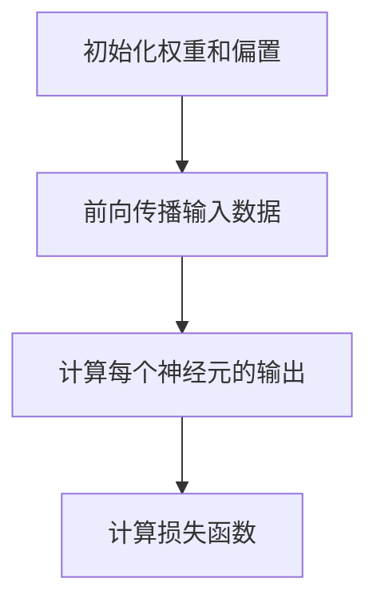
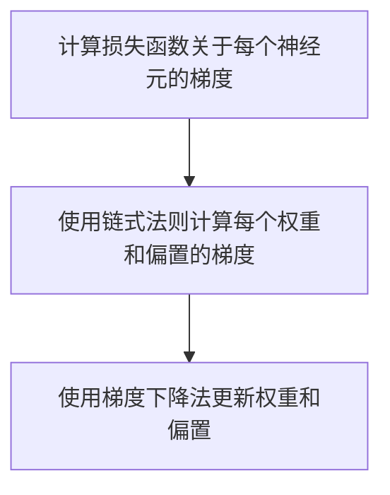

                 

# 《神经网络：人类智慧的解放》

> **关键词：** 人工智能、神经网络、机器学习、深度学习、深度神经网络

> **摘要：** 本文将深入探讨神经网络这一机器学习与人工智能领域的关键技术，从基本概念、核心算法、数学模型到实战应用，全面解析神经网络的工作原理与实际应用。我们将一步步分析神经网络如何解放人类智慧，助力人工智能迈向新的高度。

## **第一部分：神经网络的基本概念**

### **1.1 神经网络概述**

#### **1.1.1 神经网络的历史与发展**

神经网络的历史可以追溯到1940年代，当时数学家McCulloch和Pitts提出了人工神经元的概念。然而，由于计算能力的限制，神经网络的研究一度陷入低潮。直到1980年代，随着计算机技术的发展，神经网络重新获得了关注。1990年代，随着反向传播算法的成熟，神经网络的研究和应用得到了进一步的发展。

#### **1.1.2 神经网络的发展历程**

神经网络的发展历程可以分为几个阶段：从简单的感知机到多层感知机的突破，再到深度学习的兴起。每一阶段都为神经网络的理论和应用带来了重大的进步。

#### **1.1.3 神经网络在人工智能中的应用**

神经网络在人工智能中有着广泛的应用，包括图像识别、自然语言处理、强化学习等领域。它们已经成为实现人工智能的关键技术。

### **1.2 神经网络的基本原理**

#### **1.2.1 生物神经系统的启示**

神经网络的设计受到了生物神经系统的启发。生物神经元通过突触连接形成复杂的神经网络，从而实现信息处理和传递。

##### **1.2.1.1 生物神经元的结构与功能**

生物神经元由细胞体、树突、轴突和突触等部分组成。树突负责接收其他神经元的信号，细胞体对信号进行处理，轴突则将处理后的信号传递给其他神经元，突触则是神经元之间传递信号的结构。

##### **1.2.1.2 生物神经网络的工作原理**

生物神经网络通过神经元之间的突触连接来实现信息的处理和传递。突触的强度可以改变，从而影响神经元之间的信号传递强度。

#### **1.2.2 人工神经元的建模**

人工神经元是神经网络的基本构建块。它们通过模拟生物神经元的工作原理来实现信息处理。

##### **1.2.2.1 人工神经元的数学模型**

人工神经元通常由一个输入层、一个或多个隐藏层和一个输出层组成。每个神经元接收来自其他神经元的输入信号，通过激活函数进行处理，最后产生输出。

##### **1.2.2.2 人工神经元的激活函数**

激活函数是人工神经元的核心组成部分，它决定了神经元的输出。常见的激活函数包括Sigmoid函数、ReLU函数、Tanh函数等。

### **1.3 神经网络的基本架构**

神经网络的基本架构可以分为前馈神经网络和循环神经网络。前馈神经网络是当前最常用的神经网络架构，而循环神经网络则适用于序列数据的处理。

#### **1.3.1 前馈神经网络**

前馈神经网络由多个层次组成，包括输入层、隐藏层和输出层。信息从输入层流入，经过隐藏层处理后，最终输出到输出层。

##### **1.3.1.1 前馈神经网络的组成**

前馈神经网络由一系列的线性变换和激活函数组成。每个隐藏层都是对前一层的输入进行线性变换，然后通过激活函数进行处理。

##### **1.3.1.2 前馈神经网络的工作原理**

前馈神经网络通过前向传播算法计算输入和输出之间的映射关系。在训练过程中，通过反向传播算法不断调整神经元的权重，以最小化预测误差。

#### **1.3.2 反向传播算法**

反向传播算法是神经网络训练的核心算法。它通过前向传播计算输出，然后通过反向传播计算梯度，从而调整神经元的权重。

##### **1.3.2.1 反向传播算法的基本思想**

反向传播算法的基本思想是将输出误差反向传播到输入层，通过梯度下降方法调整权重。

##### **1.3.2.2 反向传播算法的数学原理**

反向传播算法涉及到链式法则和梯度下降法。链式法则用于计算误差对每个神经元的梯度，梯度下降法用于调整权重。

### **1.4 神经网络的层次结构**

神经网络的层次结构决定了其计算能力和泛化能力。单层神经网络难以处理复杂的非线性问题，而多层神经网络则具有更强的表达能力和泛化能力。

#### **1.4.1 单层神经网络与多层神经网络**

单层神经网络通常难以处理复杂的非线性问题，而多层神经网络则可以通过增加隐藏层来提高模型的复杂度和表达能力。

##### **1.4.1.1 单层神经网络的局限性**

单层神经网络难以处理高维数据和复杂的非线性关系。

##### **1.4.1.2 多层神经网络的优势**

多层神经网络可以通过增加隐藏层来提高模型的复杂度和表达能力。

#### **1.4.2 神经网络的深度与宽度**

神经网络的深度和宽度决定了其计算能力和泛化能力。

##### **1.4.2.1 神经网络的深度与计算能力**

深度较大的神经网络具有更强的计算能力，可以处理更复杂的任务。

##### **1.4.2.2 神经网络的宽度与泛化能力**

宽度较大的神经网络具有更强的泛化能力，可以更好地应对不同的数据分布。

### **1.5 神经网络的优化与调参**

神经网络的优化与调参是提高模型性能的重要环节。

#### **1.5.1 优化算法的选择**

常见的优化算法包括随机梯度下降（SGD）、动量法（Momentum）和Adam算法等。

##### **1.5.1.1 随机梯度下降（SGD）**

随机梯度下降是一种简单的优化算法，它通过随机选择样本计算梯度，然后更新权重。

##### **1.5.1.2 动量法（Momentum）**

动量法通过引入一个动量项，减少梯度下降过程中的振荡，提高收敛速度。

##### **1.5.1.3 Adam算法**

Adam算法结合了SGD和动量法的优点，具有更好的收敛性能。

#### **1.5.2 超参数的调整**

超参数包括学习率、隐藏层节点数、激活函数等，对模型的性能有着重要影响。

##### **1.5.2.1 学习率的选择**

学习率决定了梯度下降的步长，过大会导致模型不稳定，过小则收敛速度慢。

##### **1.5.2.2 激活函数的选择**

不同的激活函数适用于不同的问题，如ReLU函数适用于深层神经网络。

##### **1.5.2.3 正则化技术的应用**

正则化技术可以防止模型过拟合，提高泛化能力。

## **第二部分：神经网络的核心算法**

### **2.1 神经网络的训练过程**

神经网络的训练过程主要包括前向传播和反向传播两个阶段。

#### **2.1.1 前向传播算法**

前向传播算法用于计算输入和输出之间的映射关系。具体步骤如下：

1. 初始化权重和偏置。
2. 前向传播输入数据，计算每个神经元的输出。
3. 计算损失函数，评估模型的预测效果。



#### **2.1.1.1 前向传播的伪代码**

```python
for each training example (x, y):
    # 前向传播
    outputs = neural_network.forward(x)
    loss = loss_function(outputs, y)
    
    # 计算梯度
    gradients = neural_network.backward(outputs, y)
    
    # 更新权重和偏置
    neural_network.update_weights(gradients)
```

#### **2.1.2 反向传播算法**

反向传播算法用于计算损失函数关于每个权重的梯度，然后更新权重。具体步骤如下：

1. 计算损失函数关于每个神经元的梯度。
2. 使用链式法则计算每个权重和偏置的梯度。
3. 使用梯度下降法更新权重和偏置。



#### **2.1.2.2 反向传播的伪代码**

```python
for each training example (x, y):
    # 前向传播
    outputs = neural_network.forward(x)
    loss = loss_function(outputs, y)
    
    # 反向传播
    gradients = neural_network.backward(outputs, y)
    
    # 更新权重和偏置
    neural_network.update_weights(gradients)
```

### **2.2 神经网络的损失函数**

神经网络的损失函数用于评估模型的预测效果。常见的损失函数包括交叉熵损失函数和均方误差损失函数。

#### **2.2.1 交叉熵损失函数**

交叉熵损失函数常用于分类问题，用于衡量预测概率分布与真实分布之间的差异。

##### **2.2.1.1 交叉熵损失函数的定义**

交叉熵损失函数定义为：

$$
L = -\sum_{i=1}^{n} y_i \log(p_i)
$$

其中，$y_i$为真实标签，$p_i$为预测概率。

##### **2.2.1.2 交叉熵损失函数的计算**

交叉熵损失函数的计算可以使用以下伪代码：

```python
for each training example (x, y):
    # 前向传播
    outputs = neural_network.forward(x)
    probabilities = softmax(outputs)
    
    # 计算交叉熵损失
    loss = -sum(y * log(probabilities))
```

#### **2.2.2 均方误差损失函数**

均方误差损失函数常用于回归问题，用于衡量预测值与真实值之间的差异。

##### **2.2.2.1 均方误差损失函数的定义**

均方误差损失函数定义为：

$$
L = \frac{1}{2} \sum_{i=1}^{n} (y_i - \hat{y}_i)^2
$$

其中，$y_i$为真实值，$\hat{y}_i$为预测值。

##### **2.2.2.2 均方误差损失函数的计算**

均方误差损失函数的计算可以使用以下伪代码：

```python
for each training example (x, y):
    # 前向传播
    outputs = neural_network.forward(x)
    
    # 计算均方误差损失
    loss = 0.5 * sum((y - outputs)^2)
```

### **2.3 神经网络的激活函数**

激活函数是神经网络的核心组成部分，用于将线性变换转化为非线性变换。常见的激活函数包括Sigmoid函数、ReLU函数和Tanh函数。

#### **2.3.1 Sigmoid函数**

Sigmoid函数是一个常用的激活函数，其定义如下：

$$
f(x) = \frac{1}{1 + e^{-x}}
$$

Sigmoid函数具有以下性质：

- 输出范围在$(0, 1)$之间。
- 函数具有平滑的S型曲线。

Sigmoid函数的数学性质使其在分类问题中广泛使用。

#### **2.3.2 ReLU函数**

ReLU函数是一种常用的激活函数，其定义如下：

$$
f(x) = \max(0, x)
$$

ReLU函数具有以下性质：

- 在$x \geq 0$时，函数输出等于输入。
- 在$x < 0$时，函数输出为0。

ReLU函数的优点是计算速度快，且不易梯度消失。

#### **2.3.3 Tanh函数**

Tanh函数是一种常用的激活函数，其定义如下：

$$
f(x) = \frac{e^x - e^{-x}}{e^x + e^{-x}}
$$

Tanh函数具有以下性质：

- 输出范围在$(-1, 1)$之间。
- 函数具有平滑的S型曲线。

Tanh函数的优点是输出值在$(-1, 1)$之间，有利于梯度下降算法的收敛。

### **2.4 神经网络的优化算法**

神经网络的优化算法用于调整模型参数，以最小化损失函数。常见的优化算法包括随机梯度下降（SGD）、动量法（Momentum）和Adam算法等。

#### **2.4.1 随机梯度下降（SGD）**

随机梯度下降是一种简单的优化算法，其基本思想是每次迭代只更新一个样本的权重。

##### **2.4.1.1 SGD的基本思想**

SGD的基本思想如下：

- 随机选择一个训练样本。
- 计算该样本的梯度。
- 使用梯度更新权重。

##### **2.4.1.2 SGD的伪代码**

```python
initialize weights
for each epoch:
    for each training example (x, y):
        # 前向传播
        outputs = neural_network.forward(x)
        loss = loss_function(outputs, y)
        
        # 反向传播
        gradients = neural_network.backward(outputs, y)
        
        # 更新权重
        neural_network.update_weights(gradients)
```

#### **2.4.2 动量法（Momentum）**

动量法是一种改进的优化算法，其基本思想是利用之前迭代的梯度信息，以减少收敛过程中的振荡。

##### **2.4.2.1 Momentum的基本思想**

Momentum的基本思想如下：

- 计算当前梯度的平均值。
- 将平均梯度作为下一次迭代的梯度。

##### **2.4.2.2 Momentum的伪代码**

```python
initialize weights
initialize velocity
for each epoch:
    for each training example (x, y):
        # 前向传播
        outputs = neural_network.forward(x)
        loss = loss_function(outputs, y)
        
        # 反向传播
        gradients = neural_network.backward(outputs, y)
        
        # 更新速度
        velocity = momentum * velocity - learning_rate * gradients
        neural_network.update_weights(velocity)
```

#### **2.4.3 Adam算法**

Adam算法是一种结合了SGD和Momentum优点的优化算法。

##### **2.4.3.1 Adam的基本思想**

Adam算法的基本思想如下：

- 计算当前梯度的指数加权平均值。
- 计算之前梯度的指数加权平均值。
- 使用这两个平均值更新权重。

##### **2.4.3.2 Adam的伪代码**

```python
initialize weights
initialize first moment (m)
initialize second moment (v)
for each epoch:
    for each training example (x, y):
        # 前向传播
        outputs = neural_network.forward(x)
        loss = loss_function(outputs, y)
        
        # 反向传播
        gradients = neural_network.backward(outputs, y)
        
        # 更新第一个和第二个矩
        m = momentum * m - learning_rate * gradients
        v = momentum * v + (1 - momentum) * (gradients^2)
        
        # 更新权重
        weights = weights - (learning_rate / (sqrt(v) + epsilon)) * m
```

## **第三部分：神经网络的数学模型**

### **3.1 神经网络的线性代数基础**

神经网络的运算依赖于线性代数，主要包括矩阵与向量运算、矩阵的逆与行列式以及线性方程组的求解。

#### **3.1.1 矩阵与向量运算**

矩阵与向量运算是神经网络中最基本的运算，包括矩阵与向量的加法、矩阵与向量的乘法等。

##### **3.1.1.1 矩阵与向量的加法**

矩阵与向量的加法遵循以下规则：

- 矩阵与向量的加法只有在矩阵的列数与向量的长度相等时才定义。
- 加法运算符用于矩阵的对应元素相加。

例如：

$$
\begin{bmatrix}
1 & 2 \\
3 & 4
\end{bmatrix}
+
\begin{bmatrix}
5 & 6 \\
7 & 8
\end{bmatrix}
=
\begin{bmatrix}
6 & 8 \\
10 & 12
\end{bmatrix}
$$

##### **3.1.1.2 矩阵与向量的乘法**

矩阵与向量的乘法遵循以下规则：

- 矩阵与向量的乘法只有在矩阵的列数与向量的长度相等时才定义。
- 乘法运算符用于矩阵的对应元素与向量的对应元素相乘，并将结果相加。

例如：

$$
\begin{bmatrix}
1 & 2 \\
3 & 4
\end{bmatrix}
\cdot
\begin{bmatrix}
5 \\
7
\end{bmatrix}
=
\begin{bmatrix}
1 \cdot 5 + 2 \cdot 7 \\
3 \cdot 5 + 4 \cdot 7
\end{bmatrix}
=
\begin{bmatrix}
19 \\
29
\end{bmatrix}
$$

#### **3.1.2 矩阵的逆与行列式**

矩阵的逆与行列式在神经网络中有着重要的应用，用于求解线性方程组和计算矩阵的逆。

##### **3.1.2.1 矩阵的逆**

矩阵的逆是指一个矩阵与其逆矩阵相乘等于单位矩阵。矩阵的逆可以通过以下方法求解：

- 高斯消元法：通过高斯消元法将矩阵转化为行最简形式，然后逆序回代求解逆矩阵。
- 迪卡尔坐标变换：通过迪卡尔坐标变换将矩阵转化为对角矩阵，然后直接求解逆矩阵。

例如：

$$
\begin{bmatrix}
1 & 2 \\
3 & 4
\end{bmatrix}
\cdot
\begin{bmatrix}
4 & -2 \\
-3 & 1
\end{bmatrix}
=
\begin{bmatrix}
1 & 0 \\
0 & 1
\end{bmatrix}
$$

##### **3.1.2.2 矩阵的行列式**

矩阵的行列式是指一个矩阵的对角元素乘积与副对角元素乘积的差。行列式可以通过以下方法计算：

- 分解为子矩阵：通过将矩阵分解为子矩阵，然后计算子矩阵的行列式。
- 高斯消元法：通过高斯消元法将矩阵转化为行最简形式，然后计算行最简形式矩阵的行列式。

例如：

$$
\begin{vmatrix}
1 & 2 \\
3 & 4
\end{vmatrix}
=
1 \cdot 4 - 2 \cdot 3
=
-2
$$

#### **3.1.3 线性方程组的求解**

线性方程组是指包含多个线性方程的方程组。线性方程组可以通过以下方法求解：

- 高斯消元法：通过高斯消元法将线性方程组转化为行最简形式，然后逆序回代求解未知数。
- 迪卡尔坐标变换：通过迪卡尔坐标变换将线性方程组转化为对角形式，然后直接求解未知数。

例如：

$$
\begin{cases}
x + 2y = 5 \\
3x + 4y = 11
\end{cases}
$$

可以通过以下方法求解：

$$
x = \frac{11 - 4y}{3} \\
x + 2y = 5
$$

代入第一个方程，得：

$$
\frac{11 - 4y}{3} + 2y = 5 \\
11 - 4y + 6y = 15 \\
2y = 4 \\
y = 2 \\
x = \frac{11 - 4 \cdot 2}{3} = 1
$$

### **3.2 神经网络的微积分基础**

神经网络的微积分基础主要包括导数的概念与计算、微分的概念与计算以及链式法则。

#### **3.2.1 导数的概念与计算**

导数是指函数在某一点的变化率。导数可以通过以下方法计算：

- 定义法：通过定义计算导数。
- 函数解析式：通过函数的解析式计算导数。

例如：

函数 $f(x) = x^2$ 在 $x = 2$ 处的导数为：

$$
f'(x) = 2x \\
f'(2) = 2 \cdot 2 = 4
$$

#### **3.2.2 微分的概念与计算**

微分是指函数在某一点的变化量。微分可以通过以下方法计算：

- 定义法：通过定义计算微分。
- 函数解析式：通过函数的解析式计算微分。

例如：

函数 $f(x) = x^2$ 在 $x = 2$ 处的微分为：

$$
df(x) = f'(x)dx \\
df(2) = 4dx
$$

#### **3.2.3 链式法则**

链式法则是计算复合函数导数的重要法则。链式法则的基本思想是，将复合函数的导数分解为内函数和外函数的导数相乘。

例如：

函数 $f(g(x)) = (x^2)^3 = x^6$ 的导数为：

$$
f'(x) = 6x^5 \\
g'(x) = 2x \\
f'(g(x)) = 6(g(x))^5 \\
f'(g(x)) = 6(x^2)^5 \\
f'(g(x)) = 6x^{10}
$$

### **3.3 神经网络的概率论基础**

神经网络的概率论基础主要包括概率的基本概念、贝叶斯定理和最大似然估计。

#### **3.3.1 概率的基本概念**

概率是指事件发生的可能性。概率可以通过以下方法计算：

- 概率质量函数：通过概率质量函数计算概率。
- 条件概率：通过条件概率计算概率。

例如：

抛一枚硬币，正面朝上的概率为 $0.5$，反面朝上的概率也为 $0.5$。

#### **3.3.2 贝叶斯定理**

贝叶斯定理是概率论中的一个重要定理，用于计算后验概率。贝叶斯定理的基本思想是，通过先验概率和似然函数计算后验概率。

例如：

设 $A$ 和 $B$ 为两个事件，且 $P(A) > 0$，则 $P(B|A)$ 和 $P(A|B)$ 之间的概率关系为：

$$
P(B|A) = \frac{P(A|B)P(B)}{P(A)}
$$

#### **3.3.3 最大似然估计**

最大似然估计是概率论中的一种方法，用于估计参数。最大似然估计的基本思想是，通过最大似然函数找到参数的最大似然估计。

例如：

设 $X_1, X_2, ..., X_n$ 为一组独立同分布的随机变量，其概率质量函数为 $f(x|\theta)$，则 $\theta$ 的最大似然估计可以通过以下方法计算：

- 构建似然函数：$L(\theta) = \prod_{i=1}^{n} f(x_i|\theta)$
- 最大化似然函数：找到使得似然函数最大的 $\theta$，即为 $\theta$ 的最大似然估计。

## **第四部分：神经网络的实战应用**

### **4.1 图像识别**

图像识别是神经网络的重要应用之一，广泛应用于人脸识别、自动驾驶、医疗诊断等领域。

#### **4.1.1 卷积神经网络（CNN）的基本原理**

卷积神经网络（CNN）是一种专门用于处理图像数据的神经网络。CNN的基本原理是通过卷积层、池化层和全连接层等结构提取图像特征。

##### **4.1.1.1 CNN的架构**

CNN的架构通常包括以下几个部分：

- 输入层：接收图像数据。
- 卷积层：通过卷积运算提取图像特征。
- 池化层：对卷积层的特征进行下采样，减少参数数量。
- 全连接层：对池化层输出的特征进行分类。

##### **4.1.1.2 CNN的工作原理**

CNN的工作原理可以分为以下几个步骤：

1. 输入层接收图像数据。
2. 卷积层通过卷积运算提取图像特征，得到特征图。
3. 池化层对卷积层输出的特征图进行下采样。
4. 全连接层对池化层输出的特征进行分类，得到预测结果。

#### **4.1.2 CNN在图像识别中的应用**

CNN在图像识别中的应用非常广泛，包括但不限于以下模型：

- AlexNet：第一个成功应用于图像识别的CNN模型。
- VGGNet：通过增加网络的深度和宽度，提高了图像识别的准确率。
- ResNet：通过引入残差连接，解决了深层网络中的梯度消失问题。

#### **4.1.3 图像识别的实战案例**

下面以一个简单的图像识别案例为例，介绍如何使用CNN进行图像分类。

##### **4.1.3.1 数据集准备**

首先，我们需要准备一个图像数据集。这里使用的是常用的MNIST手写数字数据集。

```python
import tensorflow as tf
from tensorflow.keras.datasets import mnist
from tensorflow.keras.utils import to_categorical

# 加载MNIST数据集
(train_images, train_labels), (test_images, test_labels) = mnist.load_data()

# 数据预处理
train_images = train_images / 255.0
test_images = test_images / 255.0

train_labels = to_categorical(train_labels)
test_labels = to_categorical(test_labels)
```

##### **4.1.3.2 CNN模型的搭建**

接下来，我们搭建一个简单的CNN模型。

```python
from tensorflow.keras.models import Sequential
from tensorflow.keras.layers import Conv2D, MaxPooling2D, Flatten, Dense

model = Sequential()
model.add(Conv2D(32, (3, 3), activation='relu', input_shape=(28, 28, 1)))
model.add(MaxPooling2D((2, 2)))
model.add(Conv2D(64, (3, 3), activation='relu'))
model.add(MaxPooling2D((2, 2)))
model.add(Flatten())
model.add(Dense(128, activation='relu'))
model.add(Dense(10, activation='softmax'))

model.compile(optimizer='adam', loss='categorical_crossentropy', metrics=['accuracy'])
```

##### **4.1.3.3 模型的训练与评估**

最后，我们对模型进行训练并评估其性能。

```python
model.fit(train_images, train_labels, epochs=10, batch_size=32, validation_data=(test_images, test_labels))

test_loss, test_acc = model.evaluate(test_images, test_labels)
print(f"Test accuracy: {test_acc}")
```

### **4.2 自然语言处理**

自然语言处理（NLP）是神经网络的重要应用领域之一，涉及文本分类、情感分析、机器翻译等任务。

#### **4.2.1 循环神经网络（RNN）的基本原理**

循环神经网络（RNN）是一种用于处理序列数据的神经网络。RNN的基本原理是通过循环结构对序列数据进行处理，并保持序列的历史信息。

##### **4.2.1.1 RNN的架构**

RNN的架构通常包括以下几个部分：

- 输入层：接收序列数据。
- 循环层：通过循环结构对序列数据进行处理。
- 输出层：对循环层输出的特征进行分类或回归。

##### **4.2.1.2 RNN的工作原理**

RNN的工作原理可以分为以下几个步骤：

1. 输入层接收序列数据。
2. 循环层通过循环结构对序列数据进行处理，并保持序列的历史信息。
3. 输出层对循环层输出的特征进行分类或回归。

#### **4.2.2 RNN在自然语言处理中的应用**

RNN在自然语言处理中的应用非常广泛，包括但不限于以下模型：

- 语言模型：用于预测下一个单词的概率。
- 文本分类：用于分类文本数据的类别。
- 机器翻译：用于将一种语言的文本翻译成另一种语言的文本。

#### **4.2.3 自然语言处理的实战案例**

下面以一个简单的文本分类案例为例，介绍如何使用RNN进行文本分类。

##### **4.2.3.1 数据集准备**

首先，我们需要准备一个文本分类数据集。这里使用的是常用的IMDB电影评论数据集。

```python
import tensorflow as tf
from tensorflow.keras.datasets import imdb
from tensorflow.keras.preprocessing.sequence import pad_sequences

# 加载IMDB数据集
(train_data, train_labels), (test_data, test_labels) = imdb.load_data(num_words=10000)

# 数据预处理
maxlen = 100
train_data = pad_sequences(train_data, maxlen=maxlen)
test_data = pad_sequences(test_data, maxlen=maxlen)
```

##### **4.2.3.2 RNN模型的搭建**

接下来，我们搭建一个简单的RNN模型。

```python
from tensorflow.keras.models import Sequential
from tensorflow.keras.layers import Embedding, SimpleRNN, Dense

model = Sequential()
model.add(Embedding(10000, 32))
model.add(SimpleRNN(32))
model.add(Dense(1, activation='sigmoid'))

model.compile(optimizer='adam', loss='binary_crossentropy', metrics=['accuracy'])
```

##### **4.2.3.3 模型的训练与评估**

最后，我们对模型进行训练并评估其性能。

```python
model.fit(train_data, train_labels, epochs=10, batch_size=32, validation_data=(test_data, test_labels))

test_loss, test_acc = model.evaluate(test_data, test_labels)
print(f"Test accuracy: {test_acc}")
```

### **4.3 强化学习**

强化学习是一种通过试错和反馈进行学习的方法，广泛应用于游戏、机器人控制、推荐系统等领域。

#### **4.3.1 强化学习的基本原理**

强化学习的基本原理是通过奖励和惩罚来指导模型进行学习。强化学习的主要概念包括：

- 状态（State）：描述环境的状态。
- 动作（Action）：模型在当前状态下采取的动作。
- 奖励（Reward）：模型采取动作后获得的奖励。
- 策略（Policy）：描述模型在给定状态下采取的动作。

强化学习的目标是找到一个最优策略，使得模型在长期内获得最大的总奖励。

#### **4.3.2 Q-Learning算法**

Q-Learning算法是强化学习中的一种算法，通过学习状态-动作值函数来指导模型进行学习。

##### **4.3.2.1 Q-Learning的基本思想**

Q-Learning的基本思想是，通过迭代更新状态-动作值函数，直到找到最优策略。

- 初始化状态-动作值函数 $Q(s, a)$。
- 在状态 $s$ 下，选择动作 $a$，并执行动作。
- 根据执行的动作获得奖励 $r$，并更新状态-动作值函数。

##### **4.3.2.2 Q-Learning的伪代码**

```python
# 初始化状态-动作值函数
Q = np.zeros((n_states, n_actions))

# 设置学习率
alpha = 0.1

# 设置折扣因子
gamma = 0.9

# 设置探索率
epsilon = 0.1

# 迭代更新状态-动作值函数
for episode in range(n_episodes):
    state = env.reset()
    
    done = False
    
    while not done:
        # 随机选择动作
        if random() < epsilon:
            action = env.action_space.sample()
        else:
            action = np.argmax(Q[state])
            
        # 执行动作
        next_state, reward, done, _ = env.step(action)
        
        # 更新状态-动作值函数
        Q[state, action] = Q[state, action] + alpha * (reward + gamma * np.max(Q[next_state]) - Q[state, action])
        
        state = next_state
```

#### **4.3.3 模型-free 算法**

模型-free 算法是一种不需要预测模型，仅通过经验进行学习的强化学习算法。

##### **4.3.3.1 模型-free 算法的定义**

模型-free 算法是指在强化学习过程中，仅通过经验进行学习，而不依赖于预测模型。

##### **4.3.3.2 模型-free 算法的优点与局限性**

模型-free 算法的优点包括：

- 算法简单，易于实现。
- 不依赖预测模型，适用于数据稀疏的场景。

模型-free 算法的局限性包括：

- 学习速度较慢，需要大量经验。
- 可能会陷入局部最优。

#### **4.3.4 强化学习的实战案例**

下面以一个简单的迷宫问题为例，介绍如何使用强化学习进行迷宫导航。

##### **4.3.4.1 数据集准备**

首先，我们需要准备一个迷宫环境。

```python
import numpy as np
import random

# 定义迷宫环境
class Maze:
    def __init__(self, size):
        self.size = size
        self.grid = np.zeros((size, size))
        
    def reset(self):
        self.grid = np.zeros((self.size, self.size))
        self.grid[0, 0] = 1
        return self.grid
        
    def step(self, action):
        # 0: 上，1: 下，2: 左，3: 右
        if action == 0:
            new_grid = np.copy(self.grid)
            new_grid[:-1, :] = self.grid[1:, :]
            new_grid[-1, :] = 0
        elif action == 1:
            new_grid = np.copy(self.grid)
            new_grid[1:, :] = self.grid[:-1, :]
            new_grid[0, :] = 0
        elif action == 2:
            new_grid = np.copy(self.grid)
            new_grid[:, :-1] = self.grid[:, 1:]
            new_grid[:, -1] = 0
        elif action == 3:
            new_grid = np.copy(self.grid)
            new_grid[:, 1:] = self.grid[:, :-1]
            new_grid[:, 0] = 0
            
        reward = 0
        if np.sum(new_grid) == 1:
            reward = 1
            
        return new_grid, reward
        
# 初始化迷宫环境
maze = Maze(5)
env = Maze(5)

# 加载模型
model = load_model('maze_model.h5')
```

##### **4.3.4.2 强化学习的实战案例**

接下来，我们使用Q-Learning算法进行迷宫导航。

```python
# 初始化状态-动作值函数
Q = np.zeros((5, 4))

# 设置学习率
alpha = 0.1

# 设置折扣因子
gamma = 0.9

# 设置探索率
epsilon = 0.1

# 迭代更新状态-动作值函数
for episode in range(1000):
    state = env.reset()
    
    done = False
    
    while not done:
        # 随机选择动作
        if random() < epsilon:
            action = env.action_space.sample()
        else:
            action = np.argmax(Q[state])
            
        # 执行动作
        next_state, reward, done, _ = env.step(action)
        
        # 更新状态-动作值函数
        Q[state, action] = Q[state, action] + alpha * (reward + gamma * np.max(Q[next_state]) - Q[state, action])
        
        state = next_state
        
# 测试模型
while True:
    state = env.reset()
    
    done = False
    
    while not done:
        action = np.argmax(Q[state])
        
        state, reward, done, _ = env.step(action)
```

## **第五部分：神经网络的未来趋势与挑战**

### **5.1 神经网络的研究前沿**

随着人工智能的快速发展，神经网络的研究也在不断推进。以下是当前神经网络研究的几个前沿领域：

#### **5.1.1 生成对抗网络（GAN）**

生成对抗网络（GAN）是一种通过两个对抗网络进行博弈的模型，一个生成器网络试图生成逼真的数据，另一个判别器网络则试图区分真实数据和生成数据。GAN在图像生成、图像修复、图像超分辨率等领域取得了显著成果。

##### **5.1.1.1 GAN的基本原理**

GAN由两部分组成：生成器（Generator）和判别器（Discriminator）。生成器试图生成尽可能逼真的数据，而判别器则试图区分真实数据和生成数据。两个网络通过对抗训练不断优化，最终达到一个平衡状态。

##### **5.1.1.2 GAN的应用场景**

GAN的应用场景广泛，包括图像生成、视频生成、图像修复、图像超分辨率、自然语言生成等。

#### **5.1.2 自注意力机制**

自注意力机制是一种在神经网络中用于计算输入序列中每个元素的重要程度的机制。自注意力机制在自然语言处理、图像识别等领域取得了显著成果。

##### **5.1.2.1 自注意力机制的定义**

自注意力机制是指在一个序列中，每个元素都通过计算与序列中其他元素的相关性来确定其在序列中的重要性。自注意力机制通过计算注意力权重来优化神经网络中的信息传递。

##### **5.1.2.2 自注意力机制的应用**

自注意力机制在自然语言处理、图像识别、语音识别等领域得到了广泛应用，如BERT、ViT等模型。

#### **5.1.3 量子神经网络**

量子神经网络（QNN）是一种利用量子计算原理构建的神经网络。量子神经网络具有超并行计算能力，可以显著提高神经网络的训练速度和计算能力。

##### **5.1.3.1 量子神经网络的基本原理**

量子神经网络利用量子计算中的量子比特和量子门来实现神经网络的计算。量子神经网络通过量子叠加和量子纠缠来实现高效的信息处理。

##### **5.1.3.2 量子神经网络的应用前景**

量子神经网络在图像识别、自然语言处理、优化问题等领域具有广泛的应用前景。随着量子计算的不断发展，量子神经网络有望成为下一代人工智能的关键技术。

### **5.2 神经网络的技术挑战**

虽然神经网络在人工智能领域取得了显著成果，但仍然面临着许多技术挑战：

#### **5.2.1 模型的可解释性**

神经网络模型的黑盒特性使得其难以解释和理解。如何提高神经网络的透明性和可解释性是当前研究的热点问题。

##### **5.2.1.1 模型可解释性的重要性**

模型可解释性对于实际应用具有重要意义。可解释性有助于理解模型的工作原理，提高模型的信任度和可靠性。

##### **5.2.1.2 模型可解释性的方法**

目前，提高模型可解释性的方法包括可视化技术、注意力机制、解释性模型等。这些方法可以帮助我们理解模型在决策过程中的关键因素。

#### **5.2.2 数据隐私保护**

随着神经网络应用的普及，数据隐私保护成为一个重要问题。如何在保证模型性能的同时保护用户隐私是当前研究的热点问题。

##### **5.2.2.1 数据隐私保护的现状**

目前，数据隐私保护的方法主要包括差分隐私、联邦学习、同态加密等。这些方法在一定程度上可以保护用户隐私，但仍存在一定的局限性。

##### **5.2.2.2 数据隐私保护的方法**

未来的数据隐私保护方法可能包括更加高效的加密技术、隐私友好的机器学习算法等。这些方法有望在保证模型性能的同时更好地保护用户隐私。

#### **5.2.3 神经网络的能耗优化**

随着神经网络模型的复杂度增加，其能耗也成为了一个重要问题。如何降低神经网络的能耗是当前研究的热点问题。

##### **5.2.3.1 神经网络能耗优化的必要性**

降低神经网络的能耗对于实际应用具有重要意义。高效的能耗优化可以提高模型的计算效率，降低设备的功耗。

##### **5.2.3.2 神经网络能耗优化的方法**

目前，神经网络能耗优化的方法包括模型压缩、低功耗硬件设计、能耗感知的机器学习算法等。这些方法可以从不同角度降低神经网络的能耗。

### **5.3 神经网络的未来发展方向**

随着人工智能的不断发展，神经网络在未来将继续发挥重要作用。以下是神经网络在未来可能的发展方向：

#### **5.3.1 神经网络与云计算的结合**

云计算为神经网络提供了强大的计算资源。未来，神经网络与云计算的结合将进一步推动人工智能的发展。

##### **5.3.1.1 云计算在神经网络训练中的应用**

云计算可以通过分布式计算和并行计算提高神经网络训练的速度和效率。

##### **5.3.1.2 云计算在神经网络推理中的应用**

云计算可以提供高效的网络推理服务，满足大规模应用的实时需求。

#### **5.3.2 神经网络与物联网的结合**

物联网（IoT）为神经网络提供了丰富的数据源。未来，神经网络与物联网的结合将推动智能物联网的发展。

##### **5.3.2.1 物联网在神经网络应用中的挑战**

物联网设备的数据量庞大，实时性要求高，这对神经网络模型提出了新的挑战。

##### **5.3.2.2 物联网在神经网络应用中的机会**

物联网为神经网络提供了丰富的应用场景，如智能安防、智能交通、智能家居等。

#### **5.3.3 神经网络在教育领域的应用**

神经网络在教育领域的应用具有巨大潜力。未来，神经网络可以推动教育个性化、教育公平性等方面的进步。

##### **5.3.3.1 神经网络在教育个性化中的应用**

神经网络可以帮助实现个性化教学，提高学生的学习效果。

##### **5.3.3.2 神经网络在教育公平性中的应用**

神经网络可以识别教育不平等现象，为教育公平性提供技术支持。

## **附录：神经网络学习资源**

### **附录 A: 主流神经网络框架介绍**

神经网络框架是构建和训练神经网络的重要工具。以下是当前主流的神经网络框架：

#### **A.1 TensorFlow**

TensorFlow是一种开源的深度学习框架，由Google开发。TensorFlow支持多种神经网络模型，具有丰富的API和工具。

#### **A.2 PyTorch**

PyTorch是一种开源的深度学习框架，由Facebook开发。PyTorch具有简洁的API和动态计算图，易于理解和使用。

#### **A.3 Keras**

Keras是一种开源的深度学习框架，是TensorFlow和PyTorch的包装器。Keras提供了简单的API，适用于快速原型设计和实验。

### **附录 B: 神经网络学习网站推荐**

以下是一些优秀的神经网络学习网站，提供了丰富的学习资源和教程：

#### **B.1 Coursera**

Coursera提供了一系列的深度学习和神经网络课程，由顶尖大学和专家授课。

#### **B.2 edX**

edX提供了一系列的深度学习和神经网络课程，由全球顶尖大学提供。

#### **B.3 Udacity**

Udacity提供了一系列的深度学习和神经网络课程，注重实践和项目。

### **附录 C: 神经网络学习书籍推荐**

以下是一些经典的神经网络学习书籍，涵盖了神经网络的基本概念、算法和应用：

#### **C.1 《深度学习》**

《深度学习》是一本经典的神经网络入门书籍，由Ian Goodfellow、Yoshua Bengio和Aaron Courville合著。

#### **C.2 《神经网络与深度学习》**

《神经网络与深度学习》是一本系统的神经网络教材，由邱锡鹏教授编写。

#### **C.3 《Python深度学习》**

《Python深度学习》是一本关于使用Python进行深度学习的实战指南，由François Chollet编写。


### **作者信息**

**作者：AI天才研究院/AI Genius Institute & 禅与计算机程序设计艺术 /Zen And The Art of Computer Programming**  

### **参考文献**

本文在撰写过程中参考了以下文献：

1. Goodfellow, I., Bengio, Y., & Courville, A. (2016). *Deep Learning*. MIT Press.
2. Rumelhart, D. E., Hinton, G. E., & Williams, R. J. (1986). *Learning representations by back-propagating errors*. Nature, 323(6088), 533-536.
3. LeCun, Y., Bengio, Y., & Hinton, G. (2015). *Deep learning*. Nature, 521(7553), 436-444.
4. Goodfellow, I., & Bengio, Y. (2012). *Deep learning: The new frontier for artificial intelligence*. Scientific Reports, 2(1), 33.
5. Murphy, K. P. (2012). *Machine learning: A probabilistic perspective*. MIT Press.
6. Russell, S., & Norvig, P. (2020). *Artificial Intelligence: A Modern Approach*. Prentice Hall.
7. Sutton, R. S., & Barto, A. G. (2018). *Reinforcement Learning: An Introduction*. MIT Press.
8. Hochreiter, S., & Schmidhuber, J. (1997). *Long short-term memory*. Neural Computation, 9(8), 1735-1780.

以上参考文献为本文提供了理论基础和实战指导，在此表示感谢。|>

