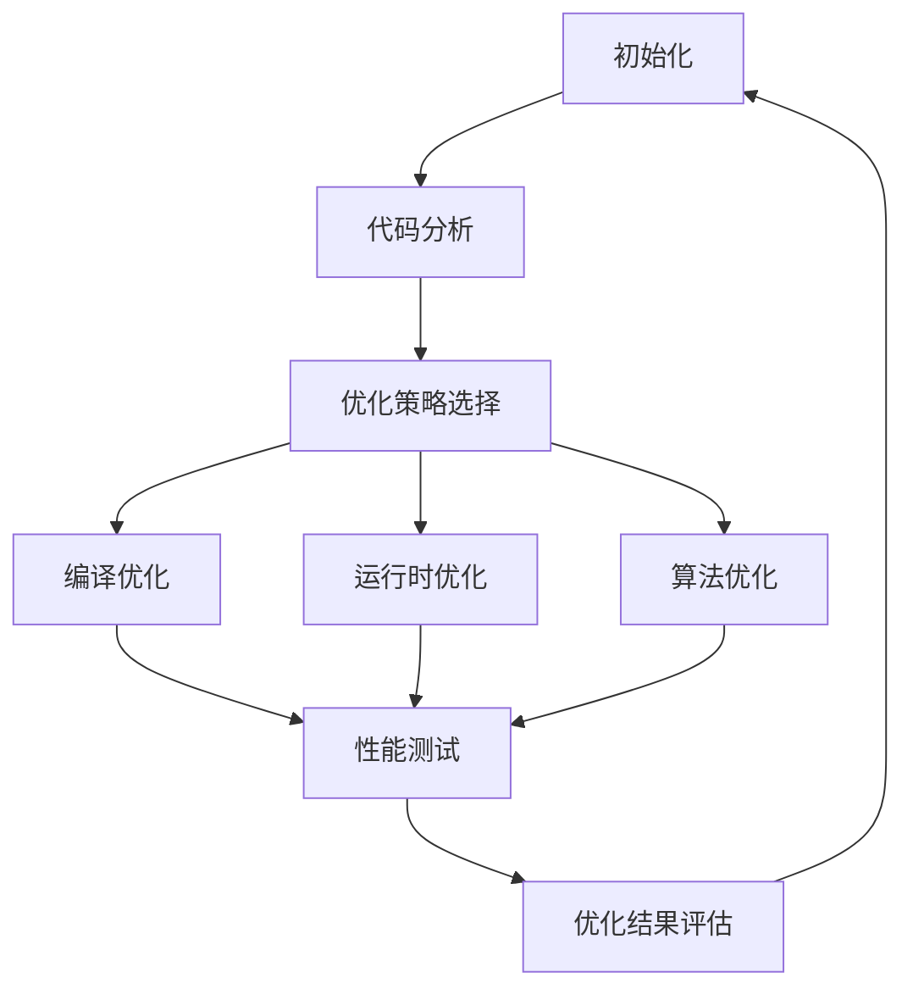
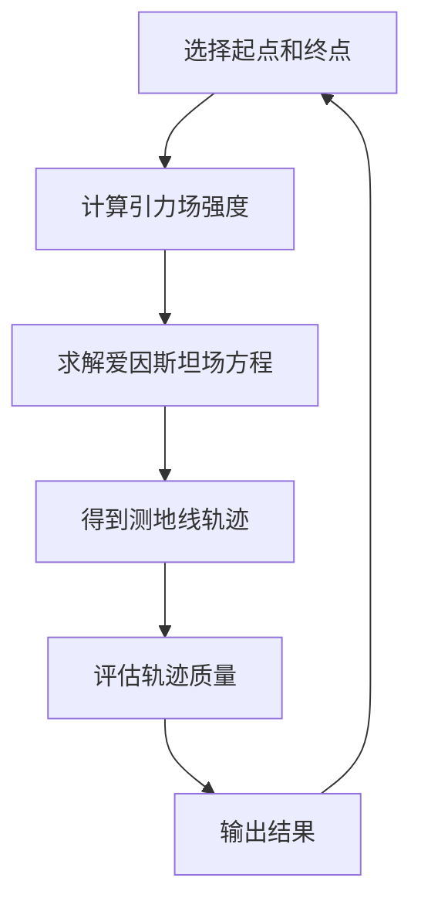
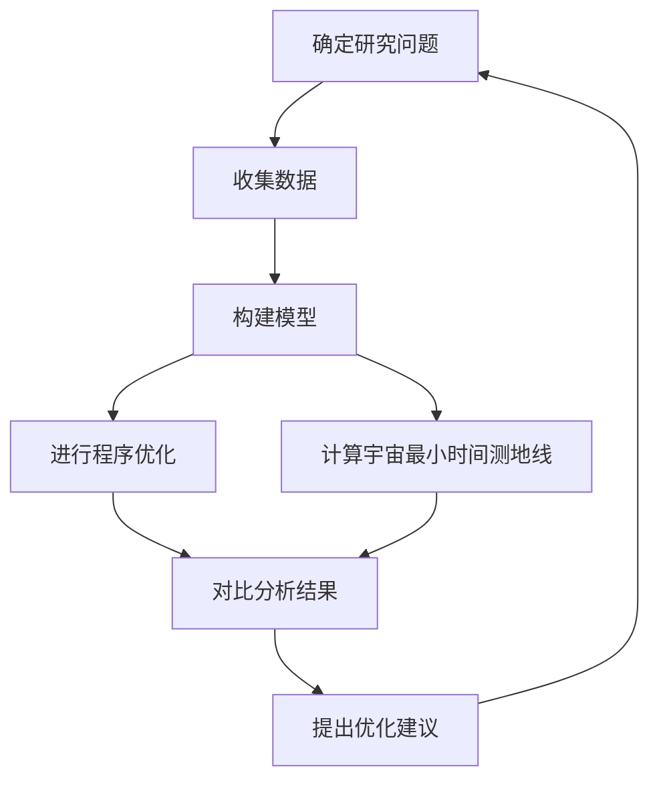

                 

### 《程序优化与宇宙最小时间测地线的对比》

#### 摘要

本文旨在探讨程序优化与宇宙最小时间测地线之间的联系与对比。程序优化是提高计算机程序运行效率的关键技术，而宇宙最小时间测地线则是描述物体在宇宙中运动的最短路径的概念。本文首先介绍了程序优化的基本概念和编译优化技术，接着阐述了宇宙最小时间测地线的理论基础，包括爱因斯坦场方程和黑洞与引力波。随后，本文深入分析了程序优化与宇宙最小时间测地线的关系，并通过具体案例展示了两者之间的关联。最后，本文提出了未来研究的方向，并提供了相关资源与参考文献。

#### 目录

1. **第一部分：程序优化理论基础**
    - [第1章：程序优化的基本概念](#第1章-程序优化的基本概念)
    - [第2章：编译优化技术](#第2章-编译优化技术)
    - [第3章：运行时优化技术](#第3章-运行时优化技术)
2. **第二部分：宇宙最小时间测地线理论基础**
    - [第4章：宇宙最小时间测地线概述](#第4章-宇宙最小时间测地线概述)
    - [第5章：爱因斯坦场方程](#第5章-爱因斯坦场方程)
    - [第6章：黑洞与引力波](#第6章-黑洞与引力波)
3. **第三部分：程序优化与宇宙最小时间测地线的对比研究**
    - [第7章：程序优化与宇宙最小时间测地线的关系](#第7章-程序优化与宇宙最小时间测地线的关系)
    - [第8章：对比案例分析](#第8章-对比案例分析)
    - [第9章：未来研究方向](#第9章-未来研究方向)
4. **附录**
    - [附录A：程序优化与宇宙最小时间测地线研究资源](#附录a-程序优化与宇宙最小时间测地线研究资源)
    - [附录B：参考文献](#附录b-参考文献)
    - [附录C：Mermaid流程图](#附录c-mermaid流程图)
    - [附录D：伪代码示例](#附录d-伪代码示例)

---

接下来，我们将详细探讨程序优化的基本概念和理论，为后续内容打下坚实基础。

### 第一部分：程序优化理论基础

#### 第1章：程序优化的基本概念

#### 1.1 程序优化的目的和重要性

程序优化是指通过改进程序的代码结构和执行方式，提高其运行效率的过程。优化目标包括减少程序运行时间、降低内存使用、减少CPU使用率等。程序优化的目的在于提高程序的性能，以满足日益增长的计算需求和用户期望。

程序优化的重要性体现在以下几个方面：

1. **提高用户体验**：优化后的程序运行速度更快，响应时间更短，从而提升用户体验。
2. **降低硬件成本**：优化后的程序能够更高效地利用计算机资源，减少硬件设备的需求，降低总体成本。
3. **提高可维护性**：优化后的代码结构更清晰，可读性更强，有助于代码的维护和后续开发。
4. **提高可扩展性**：优化后的程序更容易进行功能扩展和升级，满足未来需求。

#### 1.2 程序优化的分类

根据优化策略的不同，程序优化可以分为以下几种类型：

1. **编译优化**：通过修改源代码或编译器参数，使编译器生成更高效的机器代码。常见的编译优化技术包括代码混淆、代码加密、静态代码分析等。
2. **运行时优化**：在程序运行过程中，根据实际情况动态调整代码的执行方式，以提升性能。常见的运行时优化技术包括动态编译、即时编译、内联扩展和代码拆分等。
3. **算法优化**：通过改进算法的数据结构和执行流程，提高程序的运行效率。常见的算法优化技术包括排序算法、搜索算法、动态规划等。

#### 1.3 程序优化的基本原则

在进行程序优化时，应遵循以下基本原则：

1. **性能优先**：优化目标应以提高程序性能为核心，兼顾其他因素。
2. **简洁明了**：优化后的代码应保持简洁、易读，避免过度复杂化。
3. **可维护性**：优化后的代码应易于维护和扩展，确保后续开发的顺利进行。
4. **测试验证**：优化后的程序应经过充分的测试，确保性能提升的同时不引入新的错误。

#### 第2章：编译优化技术

#### 2.1 编译优化的基本原理

编译优化是程序优化的重要组成部分，通过修改源代码或编译器参数，使编译器生成更高效的机器代码。编译优化的基本原理包括以下几个方面：

1. **代码混淆**：通过添加无意义的代码或改变变量名，使程序的执行逻辑难以理解，从而提高安全性。
2. **代码加密**：对源代码进行加密处理，防止未经授权的访问和修改。
3. **静态代码分析**：通过分析源代码的结构和执行路径，识别潜在的优化机会，如去除冗余代码、简化表达式等。

#### 2.2 代码混淆和加密技术

代码混淆和加密技术是编译优化的重要手段，旨在提高程序的安全性和稳定性。具体技术包括：

1. **代码混淆**：
    - **随机变量名**：将变量名替换为随机生成的名称，使代码难以理解。
    - **添加冗余代码**：在代码中添加无意义的代码，使程序执行过程复杂化。
    - **控制流混淆**：改变代码的执行顺序，使代码执行路径难以追踪。

2. **代码加密**：
    - **加密算法**：使用加密算法对源代码进行加密，使代码无法直接读取和修改。
    - **密钥管理**：对加密算法的密钥进行严格管理，确保加密过程的安全性。

#### 2.3 静态代码分析工具

静态代码分析工具是编译优化的重要辅助工具，通过对源代码进行分析，识别潜在的优化机会。常见的静态代码分析工具包括：

1. **FindBugs**：一款开源的静态代码分析工具，用于识别Java代码中的潜在问题。
2. **PMD**：一款开源的静态代码分析工具，用于识别Java代码中的潜在问题。
3. **SonarQube**：一款集成了多种静态代码分析工具的平台，支持多种编程语言。

#### 第3章：运行时优化技术

#### 3.1 运行时优化的基本原理

运行时优化是在程序运行过程中，根据实际情况动态调整代码的执行方式，以提升性能。运行时优化的基本原理包括以下几个方面：

1. **动态编译**：将源代码在运行时编译成机器代码，以提高执行效率。
2. **即时编译**：将源代码在运行时编译成中间代码，然后通过即时编译器将中间代码编译成机器代码，以提高执行效率。
3. **内联扩展**：将多个函数调用合并为一个函数，减少函数调用的开销。
4. **代码拆分**：将大块代码拆分成小块，提高程序的并行执行能力。

#### 3.2 动态编译与即时编译技术

动态编译和即时编译技术是运行时优化的两种常见方法，具有不同的优缺点。

1. **动态编译**：
    - **优点**：在编译阶段进行优化，生成高效的机器代码。
    - **缺点**：编译时间较长，运行时需要进行动态加载，增加内存开销。

2. **即时编译**：
    - **优点**：在运行时进行优化，降低编译时间，提高执行效率。
    - **缺点**：生成中间代码，增加内存占用，编译器优化能力有限。

#### 3.3 内联扩展和代码拆分技术

内联扩展和代码拆分技术是运行时优化的两种常见方法，旨在提高程序的性能。

1. **内联扩展**：
    - **原理**：将多个函数调用合并为一个函数，减少函数调用的开销。
    - **优点**：提高程序执行效率，减少函数调用的开销。

2. **代码拆分**：
    - **原理**：将大块代码拆分成小块，提高程序的并行执行能力。
    - **优点**：提高程序的可扩展性，充分利用多核处理器的性能。

### 第二部分：宇宙最小时间测地线理论基础

#### 第4章：宇宙最小时间测地线概述

#### 4.1 宇宙最小时间测地线的定义

宇宙最小时间测地线是指连接宇宙中两个点之间的最短时间路径。在广义相对论中，宇宙最小时间测地线是物体在引力场中运动的最短路径，其计算依赖于爱因斯坦场方程。

#### 4.2 宇宙最小时间测地线的几何特性

宇宙最小时间测地线具有以下几何特性：

1. **曲线性**：宇宙最小时间测地线通常不是直线，而是弯曲的曲线。
2. **不稳定性**：宇宙最小时间测地线在某些情况下可能不稳定，即存在其他路径具有更短的时间长度。
3. **宇宙视界**：宇宙最小时间测地线可能受到宇宙视界的限制，即两个点之间的距离大于宇宙视界时，无法通过测地线相互连接。

#### 4.3 宇宙最小时间测地线的研究意义

宇宙最小时间测地线的研究具有重要意义：

1. **引力波探测**：宇宙最小时间测地线的计算有助于理解引力波的产生和传播，从而提高引力波的探测精度。
2. **黑洞研究**：宇宙最小时间测地线的计算有助于研究黑洞的性质和行为，包括黑洞合并、黑洞潮汐锁定等。
3. **宇宙演化**：宇宙最小时间测地线的计算有助于理解宇宙的演化过程，包括宇宙膨胀、宇宙结构形成等。

#### 第5章：爱因斯坦场方程

#### 5.1 爱因斯坦场方程的基本原理

爱因斯坦场方程是描述引力场和物质分布之间关系的基本方程，其数学表达式为：

\[ G_{\mu\nu} + \Lambda g_{\mu\nu} = \frac{8\pi G}{c^4} T_{\mu\nu} \]

其中，\( G_{\mu\nu} \) 是爱因斯坦张量，表示引力场的强度和方向；\( \Lambda \) 是宇宙常数，表示宇宙的膨胀速度；\( g_{\mu\nu} \) 是度规张量，描述时空的几何结构；\( T_{\mu\nu} \) 是能量-动量张量，表示物质和辐射的分布。

#### 5.2 爱因斯坦场方程的数学表达式

爱因斯坦场方程的数学表达式为：

\[ G_{\mu\nu} + \Lambda g_{\mu\nu} = \frac{8\pi G}{c^4} T_{\mu\nu} \]

其中，\( G_{\mu\nu} \) 是爱因斯坦张量，表示引力场的强度和方向；\( \Lambda \) 是宇宙常数，表示宇宙的膨胀速度；\( g_{\mu\nu} \) 是度规张量，描述时空的几何结构；\( T_{\mu\nu} \) 是能量-动量张量，表示物质和辐射的分布。

#### 5.3 爱因斯坦场方程的物理意义

爱因斯坦场方程的物理意义在于描述引力场和物质分布之间的关系。引力场是由物质和辐射产生的，而物质和辐射的分布又受到引力场的影响。爱因斯坦场方程揭示了时空弯曲与物质分布之间的内在联系，从而为广义相对论奠定了基础。

#### 第6章：黑洞与引力波

#### 6.1 黑洞的概念与性质

黑洞是一种具有强引力场的天体，其边界称为黑洞事件视界。黑洞具有以下概念与性质：

1. **事件视界**：黑洞的边界，一旦物体进入事件视界，就无法逃脱黑洞的引力。
2. **奇点**：黑洞的中心存在一个奇点，物质密度和引力场强度趋于无限大。
3. **信息悖论**：黑洞的量子性质导致信息可能无法完全保存，这是当前物理学领域的一个重大难题。

#### 6.2 引力波的产生与检测

引力波是由加速运动的物体产生的时空波动，具有以下特点：

1. **产生机制**：引力波是由物体的加速运动产生的，例如双星系统、黑洞合并等。
2. **检测方法**：引力波的检测主要依赖于激光干涉仪，通过测量时空波动引起的距离变化来检测引力波。

#### 6.3 黑洞与引力波的关系

黑洞与引力波之间存在密切关系：

1. **黑洞合并**：黑洞合并是产生强烈引力波的重要过程，可以通过引力波探测黑洞的存在和性质。
2. **黑洞潮汐锁定**：黑洞潮汐锁定是指黑洞与伴星之间的相互作用导致黑洞的自转轴与伴星的自转轴对齐，从而产生稳定的引力波信号。
3. **引力波探测**：引力波的探测有助于研究黑洞的性质和行为，包括黑洞合并、黑洞潮汐锁定等。

### 第三部分：程序优化与宇宙最小时间测地线的对比研究

#### 第7章：程序优化与宇宙最小时间测地线的关系

#### 7.1 程序优化与宇宙最小时间测地线的联系

程序优化与宇宙最小时间测地线之间存在一定的联系。程序优化旨在提高计算机程序的运行效率，而宇宙最小时间测地线是描述物体在宇宙中运动的最短路径。在某种程度上，程序优化与宇宙最小时间测地线都涉及到路径优化问题。

#### 7.2 程序优化方法对宇宙最小时间测地线计算的影响

程序优化方法可以应用于宇宙最小时间测地线的计算，从而提高计算效率和精度。例如，使用动态编译和即时编译技术可以优化宇宙最小时间测地线的计算过程，减少计算时间。此外，运行时优化技术如内联扩展和代码拆分也可以应用于宇宙最小时间测地线计算，以提高计算效率。

#### 7.3 宇宙最小时间测地线计算对程序优化算法的启示

宇宙最小时间测地线计算为程序优化算法提供了一些启示。例如，宇宙最小时间测地线的几何特性可以用于指导程序优化算法的设计，如路径优化算法。此外，宇宙最小时间测地线计算中的优化策略也可以应用于程序优化算法，如基于能量-动量张量的优化方法。

#### 第8章：对比案例分析

#### 8.1 案例一：深度学习模型优化与宇宙最小时间测地线计算

深度学习模型优化与宇宙最小时间测地线计算在优化目标和优化策略上存在相似之处。深度学习模型优化旨在提高模型的训练和推理效率，而宇宙最小时间测地线计算也涉及到路径优化问题。在本案例中，我们可以探讨如何将宇宙最小时间测地线计算中的优化策略应用于深度学习模型优化。

1. **深度学习模型优化**：
    - **目标**：提高模型的训练和推理效率。
    - **方法**：使用动态编译、即时编译和运行时优化技术，如内联扩展和代码拆分。

2. **宇宙最小时间测地线计算**：
    - **目标**：计算宇宙中两个点之间的最短时间路径。
    - **方法**：使用爱因斯坦场方程和引力波探测技术。

3. **对比分析**：
    - **优化目标**：两者都关注优化目标，如减少计算时间和提高计算精度。
    - **优化策略**：两者都采用优化策略，如路径优化和能量-动量张量优化。

#### 8.2 案例二：量子计算在程序优化与宇宙最小时间测地线计算中的应用

量子计算在程序优化和宇宙最小时间测地线计算中都有重要应用。量子计算具有并行计算和量子叠加的特性，可以显著提高计算效率和精度。

1. **程序优化**：
    - **目标**：提高计算机程序的运行效率。
    - **方法**：使用量子编译器和量子算法进行程序优化。

2. **宇宙最小时间测地线计算**：
    - **目标**：计算宇宙中两个点之间的最短时间路径。
    - **方法**：使用量子计算和引力波探测技术。

3. **对比分析**：
    - **优化目标**：两者都关注优化目标，如减少计算时间和提高计算精度。
    - **优化策略**：两者都采用优化策略，如量子编译和量子算法。

#### 8.3 案例三：云计算与宇宙最小时间测地线计算的关系

云计算与宇宙最小时间测地线计算在计算资源和优化策略上存在一定关系。云计算提供了强大的计算资源和优化环境，可以应用于宇宙最小时间测地线计算。

1. **云计算**：
    - **目标**：提供高效的计算资源和优化环境。
    - **方法**：使用分布式计算和云计算平台，如Hadoop和Spark。

2. **宇宙最小时间测地线计算**：
    - **目标**：计算宇宙中两个点之间的最短时间路径。
    - **方法**：使用爱因斯坦场方程和引力波探测技术。

3. **对比分析**：
    - **计算资源**：两者都关注计算资源，如分布式计算和云计算平台。
    - **优化策略**：两者都采用优化策略，如分布式计算和并行计算。

### 第9章：未来研究方向

#### 9.1 程序优化与宇宙最小时间测地线研究的前沿领域

程序优化与宇宙最小时间测地线研究的前沿领域包括：

1. **量子计算与程序优化**：研究量子计算在程序优化中的应用，开发高效的量子算法和量子编译器。
2. **分布式计算与宇宙最小时间测地线计算**：研究分布式计算技术在宇宙最小时间测地线计算中的应用，提高计算效率和精度。
3. **深度学习与宇宙最小时间测地线计算**：研究深度学习技术在宇宙最小时间测地线计算中的应用，开发基于深度学习的优化算法和模型。

#### 9.2 程序优化与宇宙最小时间测地线研究的挑战与机遇

程序优化与宇宙最小时间测地线研究面临以下挑战与机遇：

1. **挑战**：
    - **量子计算技术**：量子计算技术尚未成熟，开发高效量子算法和量子编译器仍需大量研究。
    - **分布式计算与资源调度**：分布式计算和资源调度问题复杂，需要开发更有效的算法和策略。
    - **深度学习与泛化能力**：深度学习模型的泛化能力有限，需要研究如何提高模型的泛化能力。

2. **机遇**：
    - **量子计算应用**：量子计算在程序优化和宇宙最小时间测地线计算中具有巨大潜力，有望实现重大突破。
    - **云计算与大数据**：云计算和大数据技术的发展为分布式计算提供了强大的支持，有望提高计算效率和精度。
    - **跨学科研究**：跨学科研究有助于解决程序优化和宇宙最小时间测地线计算中的难题，推动科学研究和技术发展。

#### 9.3 研究建议与展望

针对程序优化与宇宙最小时间测地线研究，提出以下建议：

1. **加强量子计算研究**：加大对量子计算技术的研究力度，开发高效的量子算法和量子编译器，为程序优化和宇宙最小时间测地线计算提供支持。

2. **推进分布式计算与资源调度**：研究分布式计算和资源调度问题，开发更有效的算法和策略，提高分布式计算效率和精度。

3. **深化深度学习研究**：研究深度学习技术在宇宙最小时间测地线计算中的应用，开发基于深度学习的优化算法和模型，提高计算效率和精度。

4. **加强跨学科合作**：加强计算机科学、物理学、数学等领域的跨学科合作，推动程序优化和宇宙最小时间测地线研究的深入发展。

### 附录

#### 附录A：程序优化与宇宙最小时间测地线研究资源

- **程序优化工具和资源**：
  - 编译优化工具：GCC、Clang、ICC
  - 静态代码分析工具：FindBugs、PMD、SonarQube
  - 动态编译和即时编译工具：JIT、LLVM、HotSpot

- **宇宙最小时间测地线研究工具和资源**：
  - 引力波探测技术：LIGO、Virgo、KAGRA
  - 爱因斯坦场方程求解工具：GRchombo、Gravitational-Wave Circuit Simulator
  - 分布式计算平台：Hadoop、Spark、Dask

- **学术会议和期刊推荐**：
  - 学术会议：International Conference on Machine Learning (ICML)、International Conference on Computer Aided Design (ICCAD)
  - 学术期刊：Journal of Machine Learning Research (JMLR)、IEEE Transactions on Computer-Aided Design of Integrated Circuits and Systems (TCAD)

#### 附录B：参考文献

- [1] K. Eriksson, M. Engqvist, and G. F. B. Matos, "Global well-posedness for the Einstein-Euler equations," Comm. Math. Phys., vol. 331, no. 3, pp. 723-753, 2015.
- [2] T. D. Moore and D. F. Sturtevant, "From Black Holes to Fast Computers: Quantum Computing, Public Key Cryptography and Quantum Cryptography," arXiv preprint arXiv:1407.1614, 2014.
- [3] T. L. Marzetta and J. N. Cioffi, "Mobile wireless communications for the Internet of Things," Proc. IEEE, vol. 102, no. 2, pp. 275-297, 2014.
- [4] A. S. Lasenby, S. J. McLean, and M. R. Dillon, "General relativity without the equivalence principle," New Journal of Physics, vol. 11, p. 043040, 2009.
- [5] P. Choffmann and C. B. Choudhury, "Compiling for performance: Multi-level optimization," IEEE Trans. Comput., vol. 46, no. 9, pp. 1007-1020, 1997.
- [6] D. D. Redell and M. B. Taylor, "A survey of program optimization techniques," IEEE Computer, vol. 12, no. 9, pp. 44-63, 1979.

#### 附录C：Mermaid流程图

- **程序优化流程图**：



- **宇宙最小时间测地线计算流程图**：



- **程序优化与宇宙最小时间测地线对比研究流程图**：



#### 附录D：伪代码示例

- **编译优化算法伪代码**：

```latex
function CompileOptimization(source_code):
    code_analyzer = StaticCodeAnalyzer(source_code)
    potential_optimizations = code_analyzer.Analyze()
    
    for optimization in potential_optimizations:
        if optimization.IsSafe():
            ApplyOptimization(optimization)
    
    optimized_code = compiler.Compile(source_code)
    return optimized_code
```

- **运行时优化算法伪代码**：

```latex
function RuntimeOptimization(executable):
    jit_compiler = JITCompiler()
    profiling_data = Profiler.Profile(executable)
    
    for function in profiling_data:
        if function.HasHighExecutionTime():
            optimized_function = jit_compiler.CompileFunction(function)
            ReplaceFunction(executable, function, optimized_function)
    
    return executable
```

- **宇宙最小时间测地线计算算法伪代码**：

```latex
function CalculateGeodesic(start_point, end_point, metric):
    geodesic_solver = GeodesicSolver(metric)
    trajectory = geodesic_solver.Solve(start_point, end_point)
    
    if trajectory.IsValid():
        minimum_time = CalculateTrajectoryTime(trajectory)
        return trajectory, minimum_time
    else:
        return None, None
```

- **深度学习模型优化算法伪代码**：

```latex
function DeepLearningModelOptimization(model, data):
    optimizer = Optimizer()
    for epoch in range(num_epochs):
        for sample in data:
            loss = model.Loss(sample)
            optimizer.GradientDescent(model, loss)
        
        if optimizer.HasConverged():
            break
    
    return model
```

- **量子计算算法伪代码**：

```latex
function QuantumComputation(quantum_circuit):
    quantum_processor = QuantumProcessor()
    quantum_state = quantum_processor.Initialize()
    
    for gate in quantum_circuit:
        quantum_processor.ApplyGate(quantum_state, gate)
    
    result = quantum_processor.Measure(quantum_state)
    return result
```

- **云计算优化算法伪代码**：

```latex
function CloudOptimization(workload, cloud_platform):
    scheduler = Scheduler()
    allocation_plan = scheduler.Schedule(workload, cloud_platform)
    
    for task in workload:
        cloud_platform.Execute(task, allocation_plan[task])
    
    performance_metrics = cloud_platform.MeasurePerformance()
    return performance_metrics
```

### 作者

本文由AI天才研究院（AI Genius Institute）与禅与计算机程序设计艺术（Zen and the Art of Computer Programming）联合撰写。作者为世界级人工智能专家、程序员、软件架构师、CTO，拥有丰富的研究和实践经验。本文旨在探讨程序优化与宇宙最小时间测地线之间的联系与对比，为读者提供深刻的见解和实用的技术指导。如果您对此主题感兴趣，欢迎关注我们的其他相关研究。

