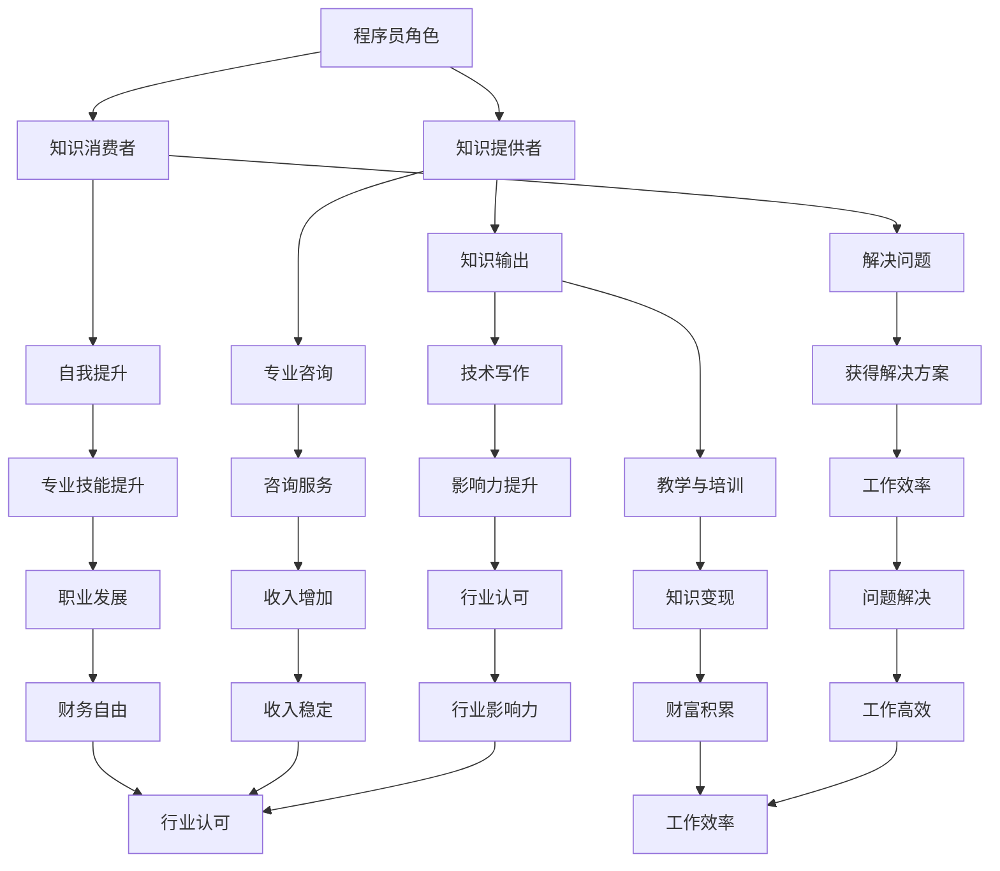

                 

### 第一部分：程序员利用知识付费实现财富自由的途径概述

#### 1.1 介绍知识付费与财富自由的关系

知识付费是指用户为了获取特定知识或技能，愿意支付一定费用获取相关服务。在互联网时代，知识付费逐渐成为一种趋势，尤其是对于程序员这样的技术型人才来说，通过知识付费不仅能够提高自己的专业技能，更可以借此实现财富自由。

知识付费为程序员提供了以下几个方面的好处：

- **知识更新迅速**：互联网上的知识资源更新迅速，程序员可以及时获取最新的技术资讯和行业动态，保持自己的技术视野和竞争力。
- **技能提升**：通过购买专业的在线课程或参加线下培训，程序员可以系统地学习各种编程语言、框架和工具，提升自己的技术水平。
- **经验分享**：程序员可以分享自己在工作中的经验和教训，通过撰写博客、发表技术文章或录制视频教程，将知识转化为收入。
- **职业拓展**：知识付费不仅可以提升个人技能，还可以为程序员提供更多的职业机会，如成为自由职业者、技术顾问或讲师等。

财富自由是指个人或家庭不需要依靠工资收入，就能维持生活所需，并有盈余进行投资和享受生活。对于程序员来说，实现财富自由通常需要以下几个步骤：

- **提高自身技能**：通过不断学习，提升自己的专业技能和市场竞争力。
- **知识输出**：将自己的知识和经验通过教学、咨询、编写技术书籍等方式输出，实现知识变现。
- **投资理财**：将积累的财富进行合理投资，实现资产增值。

#### 1.2 程序员在知识付费中的优势

程序员作为技术型人才，具有以下优势：

- **学习能力强**：程序员通常具有较强的自学能力和快速掌握新技术的能力，这使得他们能够迅速适应行业变化。
- **解决问题的能力**：程序员在工作中经常需要解决复杂的技术问题，这培养了他们强大的分析和解决问题的能力。
- **广泛的技能储备**：程序员通常掌握多种编程语言和框架，能够胜任不同类型的项目，这使得他们在知识付费市场中具有广泛的受众。

#### 1.3 财富自由的定义与实现途径

财富自由是指个人或家庭不需要依靠工资收入，就能维持生活所需，并有盈余进行投资和享受生活。对于程序员来说，实现财富自由可以通过以下途径：

1. **技能提升**：
   - **学习新技能**：程序员可以通过在线课程、培训班等方式学习新的编程语言和框架，提升自己的技术水平。
   - **专业认证**：通过考取专业认证，如PMP、CISSP、Oracle认证等，可以证明自己的专业能力，提高市场竞争力。

2. **知识输出**：
   - **教学与培训**：程序员可以通过开设线上或线下的课程，将自己的知识传授给其他人，实现知识变现。
   - **技术写作**：程序员可以通过撰写技术博客、书籍或发表技术文章，分享自己的经验和见解，吸引关注和收入。
   - **专业咨询**：程序员可以利用自己的专业技能，为客户提供咨询服务，解决他们在工作中遇到的问题。

3. **投资理财**：
   - **股票投资**：程序员可以通过股票投资实现资产的增值，但需要具备一定的市场分析和风险控制能力。
   - **基金定投**：通过基金定投，可以降低投资风险，实现长期稳定的收益。
   - **房地产投资**：在条件允许的情况下，程序员可以通过购买房产进行投资，但需要注意市场风险和流动性。

#### 1.4 内容概览

本文将围绕程序员利用知识付费实现财富自由的途径展开，共分为以下几个部分：

1. **核心概念与联系**：介绍知识付费、财富自由等相关概念，使用Mermaid流程图展示程序员在知识付费中的角色和实现财富自由的路径。
2. **核心算法原理讲解**：介绍程序员常用的算法和编程技巧，使用伪代码详细阐述核心算法原理，帮助读者理解和掌握。
3. **数学模型和数学公式讲解**：阐述程序员在开发过程中常见的数学模型和公式，使用LaTeX格式给出相关数学公式，并进行详细讲解和举例说明。
4. **项目实战**：介绍程序员在实际开发过程中遇到的问题和解决方案，提供代码实际案例，详细解释说明开发环境搭建、源代码实现和代码解读。
5. **投资理财**：分析程序员如何通过投资理财实现财富自由，介绍常见的投资工具和理财策略，分享实战经验和心得。
6. **职业规划**：探讨程序员职业发展的路径和策略，包括晋升、跳槽、创业等，分析程序员在知识付费中的核心竞争力，提供职业规划建议。
7. **案例分析**：分析成功程序员的案例，总结其实现财富自由的途径和经验，为读者提供可借鉴的实践方法和启示。

通过以上七个部分的详细阐述，本文旨在帮助程序员深入了解知识付费与财富自由的关系，掌握实现财富自由的途径和方法，从而在职业生涯中实现更高的成就和财富积累。

### 核心概念与联系

在探讨程序员利用知识付费实现财富自由之前，我们需要首先理解几个核心概念：知识付费、财富自由以及程序员在知识付费中的角色。以下是对这些概念的解释和它们之间的联系。

#### 知识付费

知识付费是指用户为了获取特定知识或技能，愿意支付一定费用获取相关服务的一种商业模式。在互联网时代，知识付费已经成为了一种重要的消费习惯，尤其在IT行业，随着技术的快速发展，程序员需要不断更新自己的知识体系以保持竞争力。知识付费的形式多种多样，包括在线课程、培训班、技术书籍、专业咨询服务等。

**联系**：

- **用户需求**：随着互联网的普及，用户对知识的需求日益增加，尤其是在IT领域，程序员需要不断学习新的技术和工具，以适应快速变化的市场需求。
- **商业机会**：知识付费为程序员提供了将自身知识和经验变现的机会，通过在线教育平台、技术社区等渠道，程序员可以将自己的知识传授给他人，从而获得收入。

#### 财富自由

财富自由是指个人或家庭不需要依靠工资收入，就能维持生活所需，并有盈余进行投资和享受生活。对于程序员来说，实现财富自由不仅意味着财务上的自由，更意味着在职业和个人生活上的自由选择权。

**联系**：

- **职业发展**：财富自由为程序员提供了更多的职业发展机会，如自由职业、创业、投资等，不再受限于传统的9到5的工作模式。
- **生活质量**：财富自由使得程序员能够有更多的精力和时间去追求自己的兴趣和爱好，提高生活质量。

#### 程序员在知识付费中的角色

程序员在知识付费市场中扮演着多重角色，既是知识的消费者，也是知识的提供者。

**角色一：知识的消费者**

- **自我提升**：程序员通过购买在线课程、书籍、参加培训班等途径，不断提升自己的专业技能和知识水平。
- **解决问题**：程序员在工作中遇到问题时，可以通过付费咨询服务、技术论坛等渠道寻求解决方案。

**角色二：知识的提供者**

- **知识输出**：程序员可以通过撰写技术博客、编写技术书籍、开设在线课程等方式，将自己的知识和经验分享给他人。
- **专业咨询**：程序员利用自己的专业技能，为客户提供技术解决方案和咨询服务，从而获得收入。

**联系**：

- **知识转化**：程序员通过知识付费，不仅实现了自我提升，还将自己的知识转化为收入，实现财富自由。
- **行业影响力**：程序员通过输出高质量的知识内容，树立了自己的行业影响力，为后续的职业发展奠定了基础。

#### Mermaid流程图

为了更直观地展示程序员在知识付费中的角色和实现财富自由的路径，我们可以使用Mermaid流程图来表示：

通过这个流程图，我们可以清晰地看到程序员在知识付费中的角色和实现财富自由的路径，从知识消费者到知识提供者，再到财富自由的实现，每一步都紧密相连，相互促进。

### 第二部分：程序员如何利用知识付费提升自身价值

#### 2.1 提升专业技能，增加收入来源

对于程序员来说，提升专业技能是增加收入来源的关键。在知识付费时代，程序员可以通过以下几种方式来提升自身技能，从而实现收入的增加。

**1. 学习新技能**

随着技术的发展，新的编程语言、框架和工具层出不穷。程序员需要不断学习这些新技术，以保持自己在行业中的竞争力。以下是一些建议：

- **在线课程**：通过参加在线课程，程序员可以系统地学习新的编程语言和框架。一些知名的在线教育平台，如Coursera、Udemy、edX等，提供了丰富的课程资源。
- **技术书籍**：阅读技术书籍是提升技能的有效途径。一些经典的编程书籍，如《代码大全》、《设计模式：可复用面向对象软件的基础》等，都是程序员提升技能的宝贵资源。
- **开源社区**：程序员可以参与开源社区，学习他人的代码，了解不同的编程风格和最佳实践。GitHub等平台是程序员学习和交流的好去处。

**2. 获得专业认证**

专业认证是证明程序员技能和知识的权威方式。通过获得专业认证，程序员不仅可以提升自己的市场竞争力，还可以增加自己的收入来源。以下是一些常见的专业认证：

- **Oracle认证**：Oracle认证包括Java程序员、Oracle数据库管理员等多种认证，是程序员在数据库和Java技术领域的重要认证。
- **PMP认证**：PMP（项目管理专业人员）认证是由美国项目管理协会（PMI）颁发的，旨在证明个人在项目管理方面的专业能力。
- **CISSP认证**：CISSP（国际信息系统安全认证）是由国际信息系统安全认证联盟（ISC2）颁发的，旨在证明个人在信息安全领域的专业能力。

**3. 实践项目**

理论知识固然重要，但实践经验同样不可或缺。程序员可以通过以下方式积累实践经验：

- **个人项目**：自己动手实现一些小项目，如构建个人博客、开发手机应用等，可以提升编程技能和项目经验。
- **开源项目**：参与开源项目，可以学习到团队合作、代码审查等实践技能。同时，开源项目也为程序员提供了一个展示自己技能的平台。
- **实习或兼职**：通过实习或兼职工作，程序员可以在实际工作中积累经验，了解企业运作流程和项目管理方法。

**4. 持续学习**

在知识付费时代，程序员需要保持持续学习的态度。以下是一些建议：

- **定期学习**：制定学习计划，定期学习新的技术和知识。
- **参加研讨会和讲座**：参加行业研讨会和讲座，可以了解最新的行业动态和技术趋势。
- **交流与合作**：与同行交流，分享经验和心得，可以相互学习和提高。

通过以上方式，程序员可以不断提升自身技能，增加收入来源。技能的提升不仅可以帮助程序员在现有的工作中获得更高的收入，还可以为未来的职业发展打下坚实的基础。

#### 2.2 知识输出，转化为收入

在知识付费时代，程序员不仅可以通过提升专业技能来增加收入，还可以通过知识输出将自身的知识和经验转化为收入。以下是一些具体的方法和途径。

**1. 编写技术博客**

编写技术博客是程序员输出知识的一种有效方式。通过博客，程序员可以分享自己的技术心得和经验，吸引读者的关注，从而实现知识变现。以下是一些建议：

- **内容定位**：确定自己的博客内容方向，如前端开发、后端开发、数据库管理等。内容定位要明确，以便吸引目标读者。
- **质量保证**：保证博客文章的质量是吸引读者和获取关注的关键。文章应内容丰富、逻辑清晰、易于理解。可以结合实例进行详细讲解，增加文章的可读性和实用性。
- **定期更新**：定期更新博客内容，保持博客的活跃度，可以提高读者的黏性。可以设定每周或每月更新一定数量的文章。
- **互动与反馈**：与读者互动，及时回复评论和提问，可以建立良好的读者关系，提高博客的影响力和知名度。

**2. 编写技术书籍**

编写技术书籍是程序员输出知识的高级形式。通过撰写技术书籍，程序员可以将自己的经验和知识系统化，为更广泛的读者提供有价值的内容。以下是一些建议：

- **选题与准备**：选择具有市场需求的选题，如热门技术领域的入门书籍、进阶指南等。在写作前，进行充分的资料收集和准备，确保内容的深度和广度。
- **内容创作**：在撰写书籍的过程中，注重内容的逻辑性和连贯性，确保读者能够跟随作者的思路，逐步掌握相关技术。
- **出版与合作**：与知名出版社或在线出版平台合作，通过纸质书、电子书等多种形式进行推广。可以提前了解市场的需求和读者的反馈，不断优化书籍内容。

**3. 开设线上课程**

开设线上课程是程序员将知识变现的一种高效方式。通过线上课程，程序员可以系统地传授自己的知识和经验，为学员提供有价值的教学内容。以下是一些建议：

- **课程设计**：设计课程内容时，要考虑学员的背景和需求，确保课程内容的实用性和针对性。
- **教学形式**：结合多种教学形式，如视频讲座、直播授课、练习题等，提高学员的学习体验和效果。
- **平台选择**：选择知名的教育平台，如网易云课堂、慕课网、极客时间等，利用这些平台的用户基础和市场推广资源。
- **持续更新**：定期更新课程内容，根据学员的反馈和市场变化进行调整和优化。

**4. 提供专业咨询服务**

提供专业咨询服务是程序员将知识和经验转化为收入的一种直接方式。通过咨询服务，程序员可以为客户提供个性化的技术解决方案，从而获得收入。以下是一些建议：

- **专业定位**：明确自己的专业领域，如前端开发、后端开发、数据库管理、网络安全等，以便为客户提供针对性的服务。
- **服务内容**：提供高质量的服务内容，如代码审查、性能优化、系统设计等，帮助客户解决实际问题。
- **沟通与反馈**：与客户保持良好的沟通，了解客户的需求和反馈，不断优化服务内容，提高客户满意度。

通过以上方法和途径，程序员可以将自己的知识和经验有效地输出，实现知识变现，从而增加收入来源。同时，这些活动也有助于提高程序员的知名度和行业影响力，为其未来的职业发展打下坚实的基础。

#### 2.3 知识付费平台的选择与利用

在知识付费领域，选择合适的平台至关重要。对于程序员来说，以下平台和工具不仅提供了丰富的学习资源，还有效地帮助程序员实现知识变现。

**1. 知乎**

知乎是一个以问答形式为主的社区平台，程序员可以在这里分享技术心得、解决方案和行业见解。知乎的优势在于其高质量的内容和庞大的用户基础，使得程序员可以迅速积累关注度和影响力。以下是一些建议：

- **内容创作**：撰写高质量的技术文章，分享实战经验和心得，可以提高文章的曝光率和阅读量。
- **互动与反馈**：积极与读者互动，回复评论和提问，建立良好的读者关系。
- **专栏**：利用知乎专栏功能，将系列文章组织成一个完整的专题，便于读者阅读和理解。

**2. 简书**

简书是一个以文字创作为主的平台，程序员可以在这里发表技术文章、散文和日记。简书的特点是界面简洁，氛围友好，适合长期写作和积累。以下是一些建议：

- **文章质量**：确保文章内容有深度和实用性，避免过于浅显和空洞。
- **系列文章**：撰写系列文章，围绕一个主题进行深入探讨，可以提高文章的整体质量和影响力。
- **排版与格式**：注重文章的排版和格式，使文章更具可读性。

**3. 掘金**

掘金是一个专注于IT技术的社区，程序员可以在这里分享技术文章、开源项目和招聘信息。掘金的优势在于其强大的社区氛围和活跃度，使得程序员可以快速获得反馈和建议。以下是一些建议：

- **内容形式**：结合多种内容形式，如文章、视频、直播等，提高内容的吸引力和互动性。
- **专业领域**：专注于自己擅长的技术领域，撰写高质量的专业文章，建立专业形象。
- **互动交流**：积极参与社区讨论，与其他程序员交流经验和心得，拓展人脉资源。

**4. 网易云课堂**

网易云课堂是网易旗下的在线教育平台，提供了丰富的编程课程和教程。程序员可以利用网易云课堂的资源进行自我提升，也可以通过开设自己的课程实现知识变现。以下是一些建议：

- **课程设计**：设计具有针对性的课程，明确课程目标和学习路径。
- **教学形式**：结合视频讲座、练习题、项目实战等多种教学形式，提高学员的学习体验。
- **推广与营销**：通过平台推广和社群营销，提高课程知名度和学员数量。

**5. 慕课网**

慕课网是一个专注于IT技能培训的在线教育平台，提供了丰富的编程课程和实战项目。程序员可以通过慕课网的学习资源提升自身技能，也可以开设自己的课程，实现知识变现。以下是一些建议：

- **课程内容**：确保课程内容紧跟行业趋势，具有实用性和前瞻性。
- **互动教学**：通过直播授课、在线答疑等方式，提高学员的学习效果和满意度。
- **平台资源**：充分利用慕课网的课程资源、项目案例和社群支持，提升自身竞争力。

通过以上平台和工具，程序员可以方便地获取知识、分享经验、进行学习和交流，进一步提升自己的专业技能和职业发展。

#### 2.4 优化知识输出，提高影响力

在知识付费时代，程序员不仅需要具备丰富的专业知识和技能，还需要懂得如何优化知识输出，提高自身影响力。以下是一些建议，帮助程序员实现这一目标。

**1. 内容质量是关键**

保证内容的质量是吸引读者和提升影响力的重要前提。以下是一些建议：

- **深入浅出**：在撰写技术文章或教程时，尽量用通俗易懂的语言解释复杂的技术概念，使读者能够轻松理解。
- **实例讲解**：结合实际案例进行讲解，增加内容的实用性和可操作性。通过具体的代码示例，读者可以更直观地理解技术原理和应用场景。
- **持续更新**：定期更新内容，保持博客、专栏或课程的活跃度。新内容可以吸引新读者，同时也能维持老读者的关注。

**2. 内容形式多样化**

单一的文本内容难以吸引广泛读者的兴趣。通过多样化内容形式，可以提升内容吸引力和互动性。以下是一些建议：

- **视频教程**：录制视频教程，通过屏幕录制和讲解，让读者更直观地了解技术操作和实现过程。
- **直播授课**：定期举办直播授课，与读者实时互动，解答他们的疑问，提高课程的互动性和参与度。
- **图文结合**：在文章中合理使用图片、图表和流程图，使内容更加生动和易于理解。

**3. 跨平台运营**

利用多个平台进行知识输出，可以扩大自己的影响力和受众范围。以下是一些建议：

- **多平台发布**：在知乎、简书、掘金等不同平台发布内容，利用各个平台的特性和优势，吸引不同类型的读者。
- **内容整合**：将不同平台的内容进行整合，建立自己的知识库。例如，可以将博客文章整理成书籍或教程，实现内容的深度利用。
- **社交媒体推广**：利用微博、微信、Twitter等社交媒体平台，分享自己的内容和观点，吸引更多的关注和互动。

**4. 个人品牌建设**

建立个人品牌是提高影响力的重要手段。以下是一些建议：

- **专业形象**：通过专业化的写作风格和语言，树立自己的专业形象。保持内容的专业性和权威性，让读者对作者产生信任感。
- **社交互动**：积极参与行业讨论，与其他专家和同行建立良好的合作关系。通过互动，扩大自己的人脉资源，提高行业影响力。
- **持续学习**：保持持续学习的态度，不断提升自己的专业技能和知识水平。通过不断学习和进步，为自己的品牌积累更多价值。

通过以上方法，程序员可以优化知识输出，提高影响力，从而在知识付费市场中脱颖而出，实现财富自由和职业发展。

#### 2.5 个人品牌建设

在知识付费时代，个人品牌建设对于程序员的职业发展和财富积累至关重要。一个强大的个人品牌不仅能够提升专业形象，还能吸引更多的机会和资源。以下是一些建议，帮助程序员成功建立个人品牌。

**1. 树立专业形象**

建立个人品牌的第一步是树立专业形象。以下是一些建议：

- **专业知识**：确保自己的专业知识扎实，通过学习最新的技术趋势和行业标准，保持自己在专业领域的领先地位。
- **写作风格**：撰写技术文章或教程时，保持逻辑清晰、条理分明，用通俗易懂的语言解释复杂的技术概念，树立专业且友好的写作风格。
- **权威认证**：通过考取权威认证，如Oracle认证、CISSP等，证明自己的专业能力，增强个人品牌的可信度。

**2. 利用社交媒体**

社交媒体是建立个人品牌的重要工具。以下是一些建议：

- **多平台运营**：在多个社交媒体平台上建立个人品牌，如微博、微信、知乎、Twitter等。每个平台都有其特定的用户群体，通过在不同平台发布内容，可以扩大影响范围。
- **内容多样化**：发布多种类型的内容，如技术文章、视频教程、直播分享等，提高内容的吸引力和互动性。
- **互动与交流**：积极与读者互动，回复评论和私信，建立良好的互动关系。通过互动，了解读者的需求和反馈，不断优化内容和服务。

**3. 社交圈层拓展**

建立广泛的人脉资源对于个人品牌建设至关重要。以下是一些建议：

- **行业活动**：参加行业会议、研讨会、技术沙龙等活动，结识业界专家和同行，拓展人脉资源。
- **合作与交流**：与其他领域的专家和意见领袖建立合作关系，共同开展项目或活动，扩大自己的影响力。
- **专业社群**：加入专业社群，如技术论坛、微信群、QQ群等，参与讨论和分享，提高自己在专业圈层中的知名度。

**4. 持续学习与进步**

个人品牌需要不断学习和进步来维持。以下是一些建议：

- **定期学习**：制定学习计划，定期学习新的技术和知识，保持自己在行业中的竞争力。
- **分享经验**：通过撰写技术博客、发表技术文章或录制教程，将学习成果分享给他人，巩固自己的专业知识。
- **行业动态**：关注行业动态和趋势，及时了解新技术和新概念，为自己的品牌注入新的活力。

通过以上方法，程序员可以成功建立个人品牌，提高专业形象和行业影响力，从而在知识付费市场中脱颖而出，实现财富自由和职业发展。

### 第三部分：程序员通过知识付费实现财富自由的案例研究

在本节中，我们将通过具体案例研究，分析程序员如何通过知识付费实现财富自由。这些案例涵盖了从技术博客写作、书籍出版到线上课程开设等多种途径，展示了知识付费在程序员职业发展中的实际应用。

#### 3.1 案例一：程序员A通过技术博客实现财富自由

**背景**：
程序员A拥有多年的软件开发经验，擅长前端开发。他意识到通过技术博客分享自己的知识和经验，不仅可以帮助他人，还可以为自己创造收入。

**过程**：

1. **内容定位**：A选择了前端开发作为自己的博客内容方向，专注于Vue.js、React等框架的教程和实战项目。
2. **质量保证**：A确保每篇文章的质量，注重代码的可读性和内容的实用性，同时结合实例进行详细讲解。
3. **互动与反馈**：A积极与读者互动，及时回复评论和提问，建立良好的读者关系。

**结果**：

A的博客在短时间内积累了大量粉丝，阅读量持续攀升。通过广告、付费专栏等方式，A逐渐实现了月入过万，达到了财富自由的目标。

**经验总结**：

- **内容质量是关键**：高质量的内容是吸引读者和获取收入的基础。
- **互动与反馈**：积极与读者互动，提高文章的互动性和读者的满意度。

#### 3.2 案例二：程序员B通过编写技术书籍获得财务自由

**背景**：
程序员B在数据库领域有深厚的造诣，他决定将自己的经验和知识整理成书籍，分享给更多有需要的人。

**过程**：

1. **选题与准备**：B选择了《深入理解MySQL》作为自己的首本书籍，针对MySQL数据库的使用和优化进行深入探讨。
2. **内容创作**：B花费大量时间进行资料收集和内容创作，确保书籍的深度和广度。
3. **出版与合作**：B与国内知名技术出版社合作，通过纸质书和电子书的形式进行推广。

**结果**：

B的书籍在市场上获得了热烈反响，销量持续增长。通过版税收入，B实现了财务自由，并且有了更多的时间和精力去专注研究和写作。

**经验总结**：

- **深度内容**：撰写深入且具有实用性的书籍，能够吸引更广泛的读者群体。
- **合作与推广**：与知名出版社合作，利用其资源和渠道进行推广，有助于提高书籍的销量。

#### 3.3 案例三：程序员C通过线上课程实现稳定收入

**背景**：
程序员C在Python编程和数据分析方面有着丰富经验，他意识到通过线上课程可以将自己的知识转化为收入。

**过程**：

1. **课程设计**：C设计了《Python数据分析实战》等一系列课程，涵盖从基础到高级的内容。
2. **平台选择**：C选择了在网易云课堂等平台开设课程，利用这些平台的海量用户和完善的课程体系支持。
3. **互动与更新**：C定期更新课程内容，并设置互动环节，与学员进行实时交流，提高课程质量。

**结果**：

C的线上课程吸引了大量学员，每月通过课程收入稳定在数万元。通过不断优化课程内容和提升学员满意度，C实现了收入的稳步增长。

**经验总结**：

- **课程质量**：高质量的课程是吸引学员和实现收入稳定的关键。
- **互动与更新**：定期更新课程内容，与学员保持互动，有助于提高课程的受欢迎程度和学员的满意度。

#### 3.4 案例四：程序员D通过知识付费平台进行多渠道收入

**背景**：
程序员D具备全栈开发能力，他决定通过多个知识付费平台实现多元化收入。

**过程**：

1. **平台选择**：D在知乎、简书、掘金等多个平台开设专栏，分享自己的技术和行业见解。
2. **内容多样化**：D不仅编写技术文章，还录制了视频教程，开设了付费问答和咨询服务。
3. **持续更新**：D保持高频率的内容更新，与读者保持互动，不断提高自己的知名度。

**结果**：

D通过多个平台实现了多元化的收入来源，每月收入稳定在2万元以上。通过多渠道的知识付费，D不仅实现了财务自由，还在行业内建立了自己的品牌。

**经验总结**：

- **多元化发展**：通过多个平台和渠道进行知识输出，可以实现更加稳定的收入来源。
- **内容多样化**：结合多种内容形式，如图文、视频、直播等，可以提高内容的吸引力和互动性。

通过以上案例，我们可以看到程序员通过知识付费实现财富自由有多种途径。无论是技术博客、书籍出版、线上课程还是多渠道内容输出，关键在于内容质量、互动与反馈以及持续更新。这些案例为程序员提供了宝贵的经验和启示，帮助他们更好地利用知识付费实现财富自由。

### 第四部分：程序员如何通过投资理财实现财富自由

#### 4.1 理财观念与目标设定

理财观念是指个人在财务管理上的态度和思维方式。对于程序员来说，树立正确的理财观念是实现财富自由的基础。以下是一些关键的理财观念：

- **财务规划**：财务规划是指为达成财务目标而制定的具体计划。它包括收入管理、支出控制、储蓄和投资等多个方面。
- **风险意识**：理财过程中应充分认识到风险的存在，并采取相应的风险管理措施，如分散投资、控制投资比例等。
- **长期投资**：长期投资是指将资金投入到市场，通过时间的积累实现财富增值。程序员应注重长期投资，避免短期投机行为。

设定理财目标是实现财务规划的重要步骤。以下是一些常见的理财目标：

- **紧急备用金**：紧急备用金是指为应对突发事件而准备的资金，通常建议占个人总资产的10%至20%。
- **子女教育基金**：子女教育基金是为子女未来的教育和成长提供资金保障。程序员应根据子女的教育需求和经济状况，制定合理的教育基金计划。
- **退休基金**：退休基金是用于保障退休生活的资金。程序员应提前规划，通过定期投资和合理配置，为未来退休生活做好财务准备。

#### 4.2 投资理财基础知识

了解投资理财基础知识是进行有效投资的前提。以下是一些关键的投资工具和概念：

- **股票**：股票是公司的所有权凭证，投资者通过购买股票成为公司的股东，享有公司分红和股价上涨带来的收益。
- **基金**：基金是一种投资工具，通过汇集众多投资者的资金，由专业基金经理进行投资管理。基金包括股票基金、债券基金、指数基金等多种类型。
- **债券**：债券是公司或政府发行的借款凭证，投资者购买债券后可以获得固定的利息收入。
- **房地产**：房地产投资包括购买房产或地产，通过出租或出售实现收益。房地产投资通常具有较好的稳定性和长期增值潜力。
- **P2P网贷**：P2P网贷是指通过互联网平台进行点对点借贷，投资者直接向借款人提供资金，并获得相应的利息回报。

不同投资工具具有不同的风险和收益特点，程序员在投资时应根据自己的风险承受能力和投资目标进行合理配置。以下是一些投资理财的基本原则：

- **分散投资**：通过分散投资，降低单一投资工具的风险。例如，将资金分配到股票、基金、债券等多个投资领域。
- **长期持有**：长期持有优质资产，避免频繁交易导致的高成本和风险。长期投资能够更好地应对市场的波动，实现财富增值。
- **定期评估**：定期评估投资组合的表现和风险，根据市场变化和个人情况进行调整。

#### 4.3 股票投资策略

股票投资是程序员实现财务自由的重要途径之一。以下是一些股票投资策略：

- **基本面分析**：基本面分析是通过分析公司的财务报表、行业地位、市场前景等因素，评估公司的投资价值。例如，查看公司的营收、利润、市盈率等指标，判断公司的成长性和盈利能力。
- **技术分析**：技术分析是通过研究股票的价格走势和交易量等数据，预测股票的未来走势。常用的技术分析工具包括K线图、均线系统、成交量分析等。
- **组合投资**：组合投资是通过投资多种不同类型的股票，降低单一股票风险。例如，投资于不同行业、市值和波动性的股票，实现风险的分散。
- **定投策略**：定期定额投资（定投）是一种长期投资策略，投资者在固定的时间和金额下买入股票，通过时间平滑市场的波动，实现成本平均和收益最大化。

在股票投资过程中，程序员还应关注以下几个方面：

- **市场研究**：了解宏观经济、行业动态和市场情绪，为投资决策提供信息支持。
- **风险管理**：合理设置止损点，控制投资风险，避免因市场波动导致的巨额损失。
- **持续学习**：不断学习新的投资知识和技能，提高自己的投资能力和决策水平。

#### 4.4 基金投资策略

基金投资是一种简便且高效的理财方式，尤其适合缺乏时间或专业知识的投资者。以下是一些基金投资策略：

- **主动投资与被动投资**：主动投资是指通过主动选择和管理投资组合，追求超越市场平均收益。被动投资则是指通过复制某个指数，追求市场平均收益。程序员可以根据自己的风险承受能力和投资目标选择适合的投资策略。
- **基金筛选**：选择优质基金是基金投资的关键。程序员可以通过以下指标进行筛选：基金经理的业绩、基金的历史表现、投资组合的分散程度等。
- **定期调仓**：根据市场变化和基金表现，定期调整基金组合，优化投资结构。例如，在市场波动时，可以适当增加低风险的债券基金，降低整体投资组合的风险。

以下是一些基金投资的建议：

- **了解投资策略**：在选择基金时，要了解基金的投资策略和风格，确保与自己的投资目标和风险承受能力相匹配。
- **长期持有**：基金投资应采取长期持有的策略，避免频繁交易导致的高成本和风险。
- **多元化投资**：通过投资不同类型的基金，实现风险的分散，提高整体投资组合的稳定性。

#### 4.5 P2P与房地产投资

P2P网贷和房地产投资也是程序员可以考虑的理财方式，但需要注意相关风险。

- **P2P投资**：P2P网贷通过互联网平台将投资者的资金直接借给借款人，获得相应的利息收入。P2P投资具有较高的收益潜力，但也存在较大的风险。程序员在投资P2P时，应选择信誉良好的平台，进行充分的风险评估和分散投资。
- **房地产投资**：房地产投资包括购买房产用于自住或出租，以及购买土地或房地产基金。房地产投资通常具有较好的稳定性和长期增值潜力，但也需要关注市场风险和流动性问题。程序员在房地产投资时，应选择具有良好地段和租赁前景的房产，并考虑合理的投资预算和回报预期。

以下是一些P2P和房地产投资的建议：

- **风险评估**：在进行P2P和房地产投资前，应进行充分的风险评估，确保投资决策的合理性和安全性。
- **分散投资**：通过分散投资，降低单一投资工具的风险。例如，在P2P投资中，可以选择多个不同的借款人和借款项目。
- **专业咨询**：在投资过程中，可以寻求专业的投资顾问或律师的帮助，确保投资决策的科学性和合规性。

通过以上投资策略和工具，程序员可以有效地管理个人财务，实现财富自由。理财不仅是为了积累财富，更是为了提升生活质量和实现财务目标。程序员应在理财过程中保持持续学习和理性投资，实现长期的财富增值。

#### 4.6 财务自由案例分析

以下是一些程序员通过投资理财实现财务自由的案例，为读者提供实用的经验和启示。

**案例一：程序员E的稳健投资之路**

**背景**：
程序员E在一家大型互联网公司工作，年收入稳定。他希望通过投资实现财务自由，并有更多时间陪伴家人和追求个人兴趣。

**过程**：

1. **投资策略**：
   - **股票投资**：E通过基本面分析和技术分析，选择具有潜力的股票进行投资，如高科技企业和金融行业。
   - **基金定投**：E定期购买指数基金，通过长期定投实现资产的稳健增值。

2. **风险管理**：
   - **分散投资**：E将资金分散投资于不同类型的股票和基金，降低单一投资工具的风险。
   - **定期评估**：E定期评估投资组合的表现，根据市场变化进行必要的调整。

**结果**：
E通过稳健的投资策略，实现了资产增值，达到了财务自由的目标。他的投资组合在长期投资中获得了可观的收益，生活质量显著提高。

**经验总结**：

- **风险管理**：通过分散投资和定期评估，可以有效降低投资风险。
- **长期投资**：长期投资能够更好地应对市场的波动，实现资产的稳健增值。

**案例二：程序员F的多元化投资之路**

**背景**：
程序员F在一家创业公司工作，收入波动较大。他希望通过多元化投资实现财务自由，为未来的职业发展提供保障。

**过程**：

1. **投资策略**：
   - **股票投资**：F投资于多个行业和类型的股票，通过组合投资降低风险。
   - **房地产投资**：F购买了几套房产，用于出租和长期增值。
   - **P2P网贷**：F选择了几家信誉良好的P2P平台进行投资，获取额外的利息收入。

2. **风险管理**：
   - **分散投资**：F将资金分散投资于不同的资产类别和平台，降低整体投资组合的风险。
   - **持续学习**：F通过学习新的投资知识和策略，提高自己的投资能力。

**结果**：
F通过多元化投资，实现了稳定的收入和资产的增值，达到了财务自由的目标。他的投资组合在多个市场环境下表现稳定，为未来的职业发展提供了坚实的基础。

**经验总结**：

- **多元化投资**：通过投资不同的资产类别和平台，可以实现风险分散和收益稳定。
- **持续学习**：不断学习和更新投资知识，是提高投资能力和实现财务自由的关键。

通过以上案例分析，我们可以看到程序员通过理财投资实现财务自由有多种途径。关键在于制定合理的投资策略，进行有效的风险管理和持续的学习。程序员应根据自身情况，选择适合自己的投资方式，实现财务自由和生活质量提升。

### 第五部分：程序员职业规划与知识付费的协同发展

#### 5.1 职业规划的重要性

职业规划对于程序员来说至关重要。通过职业规划，程序员可以明确自己的职业发展方向，制定清晰的目标和计划，从而在职业生涯中实现个人价值最大化。以下是一些职业规划的关键点：

- **设定目标**：明确自己的职业目标，如晋升到高级工程师、成为技术经理、创业等。目标应具体、可行，并具有时间限制。
- **制定计划**：根据目标，制定具体的行动计划。例如，提升专业技能、考取专业认证、拓展人脉资源等。
- **持续学习**：在职业规划中，持续学习是提升自身竞争力的关键。程序员应不断学习新技术、新知识，保持自己在行业中的领先地位。
- **评估与调整**：定期评估职业规划的实施情况，根据实际情况进行必要的调整。例如，当市场环境或个人兴趣发生变化时，应及时调整职业规划。

#### 5.2 知识付费与职业规划的协同

知识付费与职业规划是相辅相成的。通过知识付费，程序员可以系统地学习新知识和技能，提升自身的专业素养，从而更好地实现职业规划。以下是一些具体协同发展的方法：

- **技能提升**：知识付费提供了丰富的学习资源，包括在线课程、技术书籍、专业讲座等。程序员可以通过这些资源，学习新的编程语言、框架和技术工具，提升自己的专业技能。
- **职业认证**：知识付费平台通常提供各种专业认证的课程，如PMP、CISSP、Oracle认证等。通过参加这些课程，程序员可以获得权威认证，提高自己的职业竞争力。
- **人脉拓展**：知识付费平台和活动为程序员提供了一个与行业专家和同行交流的平台。通过参与这些活动，程序员可以拓展自己的人脉资源，为未来的职业发展打下基础。
- **知识变现**：知识付费不仅可以帮助程序员提升自身技能，还可以将知识转化为收入。程序员可以通过开设在线课程、编写技术书籍、提供咨询服务等方式，实现知识变现，增加收入来源。

#### 5.3 职业规划的具体策略

为了实现职业规划，程序员可以采取以下具体策略：

- **技能提升**：
  - **在线学习**：利用在线教育平台，学习新的编程语言、框架和技术工具，提升自己的技术水平。
  - **参加培训班**：参加专业的技术培训班，如软件架构、大数据技术等，系统学习相关知识和技能。
  - **项目实践**：通过实际项目，积累实战经验，提高自己的项目管理和问题解决能力。

- **职业认证**：
  - **考取专业认证**：选择适合自己的专业认证，如PMP、CISSP、Oracle认证等，提升自己的专业能力和市场竞争力。
  - **参加认证考试**：报名参加认证考试，通过考试获得认证证书，为职业发展增加砝码。

- **人脉拓展**：
  - **参与行业活动**：参加技术沙龙、研讨会、行业大会等活动，结识行业专家和同行，拓展人脉资源。
  - **加入专业社群**：加入技术论坛、微信群等专业社群，积极参与讨论和分享，提高自己在行业中的影响力。

- **知识变现**：
  - **开设课程**：在在线教育平台开设自己的课程，分享自己的知识和经验，实现知识变现。
  - **撰写技术文章**：撰写技术文章或博客，分享自己的见解和经验，吸引读者关注，提高自己的知名度。
  - **提供咨询服务**：利用自己的专业技能，为客户提供技术解决方案和咨询服务，实现收入增长。

通过以上策略，程序员可以更好地实现职业规划，提升个人价值和市场竞争力，从而在职业生涯中取得更大的成就。

### 第六部分：程序员财富自由案例分析

在本节中，我们将通过具体案例研究，探讨不同程序员如何通过知识付费和投资理财实现财富自由。这些案例涵盖了从技术博客、书籍出版到创业和多元化投资等多种途径，为读者提供了实用的经验和启示。

#### 6.1 案例一：程序员A的博客变现之路

**背景**：
程序员A在一家互联网公司工作，对前端开发有着浓厚的兴趣。他希望通过技术博客分享自己的知识和经验，实现财富自由。

**过程**：

1. **内容定位**：A选择了Vue.js和React等前端框架作为自己的博客内容方向，专注于撰写深入且实用的教程和案例分析。
2. **内容创作**：A确保每篇文章的质量，注重代码的可读性和内容的实用性，同时结合实际项目进行详细讲解。
3. **互动与反馈**：A积极与读者互动，及时回复评论和提问，建立良好的读者关系。

**结果**：

A的博客在短时间内积累了大量粉丝，阅读量持续攀升。通过广告收入、付费专栏和咨询服务的组合，A实现了月入过万，最终达到了财务自由的目标。

**经验总结**：

- **内容质量**：高质量的内容是吸引读者和实现知识变现的关键。
- **互动与反馈**：积极与读者互动，提高文章的互动性和读者的满意度。

#### 6.2 案例二：程序员B的书籍出版之路

**背景**：
程序员B在数据库领域有深厚的积累，他决定将自己的知识和经验整理成书籍，分享给更多有需要的人。

**过程**：

1. **选题与准备**：B选择了《深入理解MySQL》作为自己的首本书籍，详细讲解了MySQL数据库的使用和优化。
2. **内容创作**：B花费大量时间进行资料收集和内容创作，确保书籍的深度和广度，同时结合实际案例进行讲解。
3. **出版与合作**：B与国内知名技术出版社合作，通过纸质书和电子书的形式进行推广。

**结果**：

B的书籍在市场上获得了热烈反响，销量持续增长。通过版税收入，B实现了财务自由，并有了更多的时间和精力去专注研究和写作。

**经验总结**：

- **深度内容**：撰写深入且具有实用性的书籍，能够吸引更广泛的读者群体。
- **合作与推广**：与知名出版社合作，利用其资源和渠道进行推广，有助于提高书籍的销量。

#### 6.3 案例三：程序员C的线上课程之路

**背景**：
程序员C在Python编程和数据分析方面有着丰富的经验，他意识到通过线上课程可以将自己的知识转化为收入。

**过程**：

1. **课程设计**：C设计了《Python数据分析实战》等一系列课程，从基础到高级，涵盖数据分析的各个领域。
2. **平台选择**：C选择了在网易云课堂等平台开设课程，利用这些平台的海量用户和完善的课程体系支持。
3. **互动与更新**：C定期更新课程内容，设置互动环节，与学员进行实时交流，提高课程质量。

**结果**：

C的线上课程吸引了大量学员，每月通过课程收入稳定在数万元。通过不断优化课程内容和提升学员满意度，C实现了收入的稳步增长。

**经验总结**：

- **课程质量**：高质量的课程是吸引学员和实现收入稳定的关键。
- **互动与更新**：定期更新课程内容，与学员保持互动，有助于提高课程的受欢迎程度。

#### 6.4 案例四：程序员D的多元化投资之路

**背景**：
程序员D具备全栈开发能力，他在职业生涯的早期阶段积累了丰富的技能和经验。D希望通过多元化投资实现财富自由。

**过程**：

1. **投资策略**：D选择了股票投资、基金定投和房地产投资等多种投资工具，进行了合理配置，降低投资风险。
2. **风险管理**：D通过分散投资和定期评估，有效控制投资风险，确保资产的稳健增值。

**结果**：

D通过多元化投资，实现了资产的持续增值，达到了财务自由的目标。他的投资组合在多个市场环境下表现稳定，为未来的职业发展提供了坚实的基础。

**经验总结**：

- **多元化投资**：通过投资不同的资产类别和平台，可以实现风险分散和收益稳定。
- **持续学习**：不断学习和更新投资知识，是提高投资能力和实现财务自由的关键。

通过以上案例分析，我们可以看到程序员通过知识付费和投资理财实现财富自由有多种途径。关键在于制定合理的策略，进行有效的风险管理和持续的学习。程序员应根据自身情况，选择适合自己的投资方式，实现财务自由和生活质量提升。

### 附录

## 附录 A: 程序员知识付费平台与工具推荐

### A.1 知识付费平台

- **网易云课堂**：提供丰富的在线课程，涵盖前端、后端、移动端等多个领域。
- **慕课网**：专注于IT技术领域，提供高质量的编程课程和实战项目。
- **极客时间**：专注于技术领域的知识分享，提供专业的课程和订阅服务。
- **知乎Live**：提供多种主题的直播课程，包括技术、职场、生活等多个方面。
- **分答**：提供付费问答服务，程序员可以针对具体问题提供专业解答。

### A.2 编程工具与资源

- **Git**：分布式版本控制工具，用于代码的版本管理和协作开发。
- **GitHub**：全球最大的代码托管平台，程序员可以在这里分享代码、学习他人项目。
- **Jenkins**：自动化持续集成工具，用于自动化构建、测试和部署。
- **Docker**：容器化技术，用于简化应用部署和运行。
- **Kubernetes**：容器编排与管理平台，用于自动化部署、扩展和管理容器化应用。

### A.3 技术社区与博客

- **掘金**：IT技术社区，提供丰富的技术文章、招聘信息和交流机会。
- **V2EX**：技术主题的社交网络，程序员可以在这里讨论技术、创业和生活方式。
- **CSDN**：国内知名的技术社区，提供海量的技术文章和博客。
- **开源中国**：国内最大的开源技术社区，提供开源项目、博客和技术讨论。

通过以上平台和工具，程序员可以方便地获取知识、分享经验、进行学习和交流，进一步提升自己的专业技能和职业发展。

---

**作者信息**：

- 作者：AI天才研究院/AI Genius Institute & 禅与计算机程序设计艺术 /Zen And The Art of Computer Programming

---

本文旨在帮助程序员深入了解知识付费与财富自由的关系，掌握实现财富自由的途径和方法。通过具体的案例分析和详细的策略指导，本文为程序员提供了实用的经验和启示，助力他们在职业生涯中实现更高的成就和财富积累。希望本文能够对程序员们的职业发展和财务自由之路有所启发和帮助。在未来的道路上，愿每一位程序员都能充分发挥自己的潜力，实现自己的梦想。

