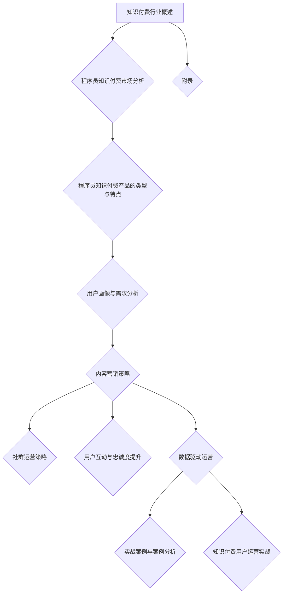

                 

### 《程序员的知识付费用户运营策略》

#### 关键词：
- 知识付费
- 程序员
- 用户运营
- 内容营销
- 社群运营
- 数据驱动

#### 摘要：
本文深入探讨了程序员知识付费用户运营策略。首先，我们概述了知识付费行业的背景和发展趋势，分析了程序员知识付费市场的需求和竞争格局。接着，我们详细介绍了程序员知识付费产品的类型与特点，包括在线课程、电子书、咨询服务和社区等。然后，我们探讨了用户画像与需求分析、内容营销策略、社群运营策略、用户互动与忠诚度提升以及数据驱动运营等关键环节。最后，通过实际案例，我们展示了如何成功构建程序员知识付费平台、运营程序员社群以及策划知识付费活动。本文旨在为从事知识付费运营的从业人员提供实用的策略和建议。

---

# 《程序员的知识付费用户运营策略》目录大纲

## 第一部分：知识付费行业概述

### 第1章：知识付费行业背景与发展趋势
#### 1.1 知识付费的定义与特点
#### 1.2 知识付费行业的发展历程
#### 1.3 知识付费市场的规模与前景
#### 1.4 知识付费行业的重要趋势

### 第2章：程序员知识付费市场分析
#### 2.1 程序员知识需求分析
#### 2.2 程序员知识付费的痛点和需求
#### 2.3 程序员知识付费市场的竞争格局

### 第3章：程序员知识付费产品的类型与特点
#### 3.1 在线课程与教程
#### 3.2 电子书与文档
#### 3.3 咨询服务与一对一辅导
#### 3.4 社区与论坛

## 第二部分：知识付费用户运营策略

### 第4章：用户画像与需求分析
#### 4.1 用户画像构建方法
#### 4.2 程序员用户需求分析
#### 4.3 用户行为分析
#### 4.4 用户需求预测与满足

### 第5章：内容营销策略
#### 5.1 内容定位与规划
#### 5.2 内容创作与编辑
#### 5.3 内容推广与传播

### 第6章：社群运营策略
#### 6.1 社群分类与定位
#### 6.2 社群运营流程
#### 6.3 社群活动策划与执行
#### 6.4 社群运营效果评估

### 第7章：用户互动与忠诚度提升
#### 7.1 用户互动策略
#### 7.2 用户忠诚度评估方法
#### 7.3 提升用户忠诚度的策略

### 第8章：数据驱动运营
#### 8.1 用户数据分析工具
#### 8.2 数据分析指标与模型
#### 8.3 数据驱动运营策略优化

## 第三部分：实战案例与案例分析

### 第9章：优秀知识付费产品案例分析
#### 9.1 案例一：极客时间
#### 9.2 案例二：知乎Live
#### 9.3 案例三：得到

### 第10章：知识付费用户运营实战
#### 10.1 实战一：构建程序员知识付费平台
#### 10.2 实战二：运营一个程序员社群
#### 10.3 实战三：策划一次成功的知识付费活动

## 附录

### 附录A：程序员知识付费相关资源与工具
#### A.1 知识付费平台推荐
#### A.2 程序员学习资源网站推荐
#### A.3 程序员社群与论坛推荐

### 附录B：程序员知识付费活动策划与执行指南

### 附录C：程序员知识付费用户运营案例分析
#### C.1 案例一：极客时间
#### C.2 案例二：知乎Live
#### C.3 案例三：得到

## Mermaid 流程图



## 数学模型和数学公式

### 用户画像构建模型

$$
User\ Profile = f(User\ Data, Data\ Cleaning, Feature\ Engineering)
$$

### 内容营销效果评估模型

$$
Content\ Effectiveness\ Score = \sum_{i=1}^{n} (User\ Engagement \times Content\ Value)
$$

### 用户忠诚度模型

$$
Loyalty\ Score = \alpha \times User\ Retention + \beta \times User\ Engagement
$$

### 数据驱动运营策略优化模型

$$
Operation\ Strategy\ Optimization = \arg\max_{\theta} (Revenue\ -\ Cost)
$$

## 项目实战

### 项目实战一：构建程序员知识付费平台

#### 1. 项目背景

随着知识付费市场的快速发展，程序员对于专业知识的获取需求日益增长。本项目旨在构建一个面向程序员的在线知识付费平台，提供高质量的编程课程、技术文档和社群交流等功能。

#### 2. 项目目标

- 提供多样化、高质量的知识内容。
- 提供便捷的学习工具和体验。
- 建立一个活跃的程序员社群。

#### 3. 技术选型

- **后端技术**：采用Spring Boot框架，实现RESTful API。
- **前端技术**：采用React.js框架，实现用户界面。
- **数据库**：采用MySQL数据库，存储用户数据、课程数据和交易数据。
- **消息队列**：采用RabbitMQ，实现异步消息处理。

#### 4. 源代码实现

以下是一个简单的用户注册功能的伪代码实现：

```java
// 用户注册API
@PostMapping("/register")
public ResponseEntity<?> registerUser(@RequestBody UserRegistrationRequest request) {
    // 验证用户输入
    if (!isInputValid(request)) {
        return ResponseEntity.badRequest().body("Invalid input");
    }
    
    // 创建用户
    User user = createUser(request);
    
    // 存储用户信息到数据库
    userRepository.save(user);
    
    // 发送激活邮件
    sendActivationEmail(user);
    
    return ResponseEntity.ok().body("User registered successfully");
}

// 验证用户输入
private boolean isInputValid(UserRegistrationRequest request) {
    // 验证用户名、密码、邮箱等是否合法
    // 例如：检查用户名是否已存在、密码长度是否符合要求等
    // ...
    return true; // 或者返回false，表示输入不合法
}

// 创建用户
private User createUser(UserRegistrationRequest request) {
    // 根据请求创建用户对象
    // 例如：设置用户名、密码、邮箱等
    // ...
    return new User();
}

// 发送激活邮件
private void sendActivationEmail(User user) {
    // 发送包含激活链接的邮件
    // 链接指向激活API，携带用户ID作为参数
    // ...
}
```

#### 5. 代码解读与分析

这段伪代码实现了用户注册的功能。首先，通过`@PostMapping`注解定义了一个用户注册的HTTP接口，接收`UserRegistrationRequest`类型的请求体。接着，调用`isInputValid`方法验证用户输入是否合法，包括用户名、密码、邮箱等是否满足要求。

如果输入合法，则调用`createUser`方法创建用户对象，并将其存储到数据库中。然后，通过`sendActivationEmail`方法发送激活邮件，邮件中包含一个激活链接，用户点击链接后可以完成账户激活。

#### 6. 开发环境搭建

- **后端开发环境**：Java 11、Spring Boot 2.5.0、MySQL 8.0、RabbitMQ 3.8.0。
- **前端开发环境**：Node.js 14.x、React 17.x。

在本地计算机上，首先需要安装Java开发工具包（JDK），然后安装MySQL数据库和RabbitMQ消息队列。接着，设置环境变量，配置数据库和消息队列的连接信息。最后，通过IDE（如IntelliJ IDEA）创建Spring Boot项目，引入必要的依赖，即可开始开发。

### 项目实战二：运营一个程序员社群

#### 1. 项目背景

程序员社群是一个专门为程序员提供交流、学习、分享的平台。本项目旨在运营一个活跃的程序员社群，提升用户的参与度和忠诚度。

#### 2. 项目目标

- 提供丰富的技术内容和活动。
- 建立良好的社群氛围，促进用户互动。
- 提高用户留存率和活跃度。

#### 3. 社群运营流程

- **社群规划**：确定社群的目标和定位，规划社群的活动。
- **社群管理**：管理社群成员，维护社群秩序。
- **社群活动策划**：策划社群活动，如线上讲座、技术沙龙等。
- **社群活动执行**：执行社群活动计划，确保活动顺利进行。
- **社群反馈**：收集用户反馈，持续优化社群运营。

#### 4. 社群活动策划与执行

以下是一个简单的社群活动策划与执行流程：

```python
# 社群活动策划
def plan_community_event(event_type, event_date):
    # 确定活动类型和日期
    # 例如：技术沙龙、线上讲座
    # ...
    event_details = {
        "event_type": event_type,
        "event_date": event_date
    }
    
    return event_details

# 社群活动执行
def execute_community_event(event_details):
    # 发送活动通知
    send_event_notification(event_details)
    
    # 准备活动资源
    prepare_event_resources(event_details)

    # 执行活动
    run_event(event_details)

# 发送活动通知
def send_event_notification(event_details):
    # 向社群成员发送活动通知
    # 例如：通过邮件、短信等方式
    # ...
    pass

# 准备活动资源
def prepare_event_resources(event_details):
    # 准备活动所需的资源
    # 例如：活动PPT、直播链接等
    # ...
    pass

# 执行活动
def run_event(event_details):
    # 执行活动计划
    # 例如：开始直播、进行演讲等
    # ...
    pass
```

#### 5. 代码解读与分析

这段伪代码实现了社群活动的策划与执行。首先，通过`plan_community_event`函数确定活动类型和日期，返回活动详情。接着，通过`execute_community_event`函数执行活动计划，包括发送活动通知、准备活动资源和执行活动。

#### 6. 开发环境搭建

- **后端开发环境**：Python 3.8、Django 3.2。
- **前端开发环境**：Node.js 14.x、React 17.x。

在本地计算机上，首先需要安装Python开发环境，然后安装Django框架。接着，通过命令行创建Django项目，引入必要的依赖，即可开始开发。

### 项目实战三：策划一次成功的知识付费活动

#### 1. 项目背景

知识付费活动是一种促进用户参与和提升用户忠诚度的有效方式。本项目旨在策划一次针对程序员的线上知识付费活动，提高平台的影响力和用户粘性。

#### 2. 项目目标

- 吸引更多的程序员参与活动。
- 提高活动参与度和用户满意度。
- 增加知识付费产品的销量。

#### 3. 活动策划与执行

以下是一个简单的活动策划与执行流程：

```python
# 活动策划
def plan_knowledge付费活动(event_name, event_date):
    # 确定活动名称和日期
    # 例如：编程技术分享会、职业规划讲座
    # ...
    event_details = {
        "event_name": event_name,
        "event_date": event_date
    }
    
    return event_details

# 活动执行
def execute_knowledge付费活动(event_details):
    # 发送活动通知
    send_event_notification(event_details)
    
    # 准备活动资源
    prepare_event_resources(event_details)

    # 执行活动
    run_event(event_details)

    # 活动总结
    summarize_event(event_details)

# 发送活动通知
def send_event_notification(event_details):
    # 向用户发送活动通知
    # 例如：通过邮件、短信等方式
    # ...
    pass

# 准备活动资源
def prepare_event_resources(event_details):
    # 准备活动所需的资源
    # 例如：演讲PPT、直播链接等
    # ...
    pass

# 执行活动
def run_event(event_details):
    # 执行活动计划
    # 例如：开始直播、进行演讲等
    # ...
    pass

# 活动总结
def summarize_event(event_details):
    # 总结活动结果
    # 例如：收集用户反馈、分析活动数据等
    # ...
    pass
```

#### 6. 开发环境搭建

- **后端开发环境**：Python 3.8、Django 3.2。
- **前端开发环境**：Node.js 14.x、React 17.x。

在本地计算机上，首先需要安装Python开发环境，然后安装Django框架。接着，通过命令行创建Django项目，引入必要的依赖，即可开始开发。

### 附录

#### 附录A：程序员知识付费相关资源与工具

- **知识付费平台推荐**：
  - **极客时间**
  - **知乎Live**
  - **得到**
  
- **程序员学习资源网站推荐**：
  - **GitHub**
  - **Stack Overflow**
  - **LeetCode**

- **程序员社群与论坛推荐**：
  - **CSDN**
  - **V2EX**
  - **Vivo技术社区**

#### 附录B：程序员知识付费活动策划与执行指南

- **活动策划**：明确活动目标、内容、时间、地点等。
- **宣传推广**：利用社群、社交媒体等渠道宣传推广活动。
- **活动执行**：确保活动顺利进行，包括现场组织、设备调试等。
- **活动总结**：收集用户反馈，分析活动效果，总结经验教训。

#### 附录C：程序员知识付费用户运营案例分析

- **案例一：极客时间**
  - **用户运营策略**：分析极客时间的用户运营策略，包括内容营销、社群运营、用户互动等。

- **案例二：知乎Live**
  - **用户运营策略**：分析知乎Live的用户运营策略，包括内容创作、用户互动、活动策划等。

- **案例三：得到**
  - **用户运营策略**：分析得到的用户运营策略，包括个性化推荐、用户画像、数据驱动运营等。

---

## 第1章：知识付费行业概述

### 1.1 知识付费的定义与特点

知识付费，即知识商品化，指的是将专业知识和技能以商品形式出售给有需求的个人或企业。这一概念最早起源于互联网，随着互联网的发展，信息传播变得更加便捷，人们逐渐意识到知识也是一种可以交易的宝贵资源。

#### 定义

知识付费可以简单定义为：

$$
知识付费 = 知识产品 + 交易方式
$$

其中，知识产品可以是具体的内容，如电子书、在线课程、技术文档等，也可以是服务，如一对一辅导、咨询服务等。交易方式可以是直接购买，也可以是订阅、租赁等形式。

#### 特点

1. **价值性**：知识付费产品能够为用户带来实际的价值和收益。例如，通过在线课程学习，用户可以提高技能，从而在职业发展中获得更好的机会。
2. **稀缺性**：知识付费产品往往具有稀缺性，满足了用户对独特、高质量知识的需求。一些专业领域的知识和经验可能只有少数人拥有，因此具有很高的价值。
3. **个性化**：知识付费产品能够根据用户的需求和兴趣进行个性化推荐，提高用户的满意度和参与度。

### 1.2 知识付费行业的发展历程

知识付费行业的发展历程可以分为以下几个阶段：

#### 萌芽期

知识付费的萌芽期可以追溯到2016年前后。这一年，知乎Live和得到等平台上线，标志着知识付费的兴起。这些平台通过线上课程、直播分享等形式，为用户提供高质量的知识内容。

#### 发展期

2017年至2019年，知识付费行业进入快速发展期。各类知识付费平台涌现，市场规模迅速扩大。例如，喜马拉雅FM、网易云课堂等平台，通过大量的内容和用户积累，吸引了大量的投资和用户。

#### 成熟期

2020年至今，知识付费行业进入成熟期。市场逐渐细分，专业化、个性化需求日益明显。一些头部平台如得到、极客时间等，通过不断优化用户体验和内容质量，保持了稳定的用户增长。

### 1.3 知识付费市场的规模与前景

知识付费市场的规模在过去几年中持续增长。根据某研究报告，2020年中国知识付费市场规模达到1800亿元，预计未来几年仍将保持高速增长。到2025年，市场规模有望达到3500亿元。

#### 市场规模

- **2020年**：中国知识付费市场规模为1800亿元。
- **2025年**：预计市场规模将达到3500亿元。

#### 前景

知识付费市场的前景依然乐观。随着信息技术的发展，在线教育、远程办公等新兴模式将进一步推动知识付费市场的发展。同时，用户对高质量知识的需求也将不断增加，为知识付费行业提供持续的动力。

### 1.4 知识付费行业的重要趋势

知识付费行业的发展趋势可以从以下几个方面进行概述：

#### 内容多样化

知识付费产品的类型越来越多样化，包括课程、电子书、直播、社群等。平台通过提供多样化的内容，满足不同用户的需求。

#### 个性化推荐

通过大数据分析和机器学习算法，知识付费平台能够实现个性化推荐，提高用户满意度。个性化推荐系统能够根据用户的行为和偏好，为用户提供最相关的内容。

#### 社交互动

知识付费平台越来越注重社交互动功能，以增强用户粘性。社交互动不仅可以提高用户的参与度，还可以促进用户之间的知识共享和交流。

## 第2章：程序员知识付费市场分析

### 2.1 程序员知识需求分析

程序员作为知识付费市场的重要用户群体，其知识需求具有独特性。以下是程序员知识需求的主要类型：

#### 技术知识

程序员需要不断学习新的编程语言、框架、工具和技术。这些技术知识是程序员职业发展的基础，也是他们日常工作中不可或缺的技能。

#### 行业动态

程序员需要了解最新的行业动态和技术趋势。这包括新技术的发布、行业标准的更新以及新兴技术的应用场景等。

#### 职业规划

程序员在不同职业阶段有不同的发展需求。例如，初级程序员可能更关注技术技能的提升，而高级程序员可能更关注职业发展、团队管理和业务理解。

#### 持续学习

程序员需要具备持续学习的能力。随着技术的快速更新，程序员必须不断学习新知识，以适应不断变化的工作环境。

### 2.2 程序员知识付费的痛点和需求

程序员在知识付费过程中面临一些痛点和需求：

#### 获取知识困难

程序员日常工作中需要不断学习新知识，但获取知识的渠道有限。特别是在新兴技术和快速变化的技术领域，程序员往往难以找到高质量的学习资源。

#### 时间成本高

程序员工作繁忙，学习新知识需要投入大量时间。如何高效地利用时间，快速掌握新技能，成为程序员的一个痛点。

#### 高质量内容

程序员希望获取高质量、专业性的知识内容。这包括详细的技术教程、行业洞察以及实战经验等。

#### 便捷学习方式

程序员希望学习方式便捷，能够随时随地进行学习。在线课程、电子书和直播等形式的付费知识产品，满足了他们的这一需求。

### 2.3 程序员知识付费市场的竞争格局

程序员知识付费市场的竞争格局较为复杂，主要竞争主体包括：

#### 专业教育机构

专业教育机构如极客时间、开课吧等，通过提供高质量的在线课程和技术教程，吸引了大量的程序员用户。

#### 技术博客与社区

技术博客和社区如GitHub、Stack Overflow等，通过提供技术文章、讨论区和问题解答，为程序员用户提供了一个交流和学习的平台。

#### 个人知识创作者

个人知识创作者如程序员、技术专家等，通过分享自己的知识和经验，建立自己的影响力，吸引了大量粉丝和用户。

#### 竞争特点

1. **内容差异化**：不同平台提供的内容差异化较大，满足不同程序员的个性化需求。
2. **用户粘性**：平台通过社群、互动等方式增强用户粘性，提高用户留存率。

## 第3章：程序员知识付费产品的类型与特点

### 3.1 在线课程与教程

在线课程与教程是程序员知识付费产品中最为常见的一种类型。它以视频、文档等形式，通过互联网进行知识传播。

#### 定义

在线课程与教程是一种在线学习的资源，通常包括以下形式：

- **视频课程**：通过视频讲解，详细阐述某个技术主题。
- **文档教程**：以文本、图片、代码等形式，提供系统的学习资料。

#### 特点

1. **互动性强**：用户可以在课程中提出问题，与讲师互动。
2. **灵活性强**：用户可以随时随地进行学习，自主安排学习时间。

#### 应用场景

- **技术学习**：如编程语言、框架、工具等。
- **职业提升**：如项目经理、技术专家等。

### 3.2 电子书与文档

电子书与文档是以电子形式呈现的知识内容，包括技术书籍、开发手册、设计文档等。

#### 定义

电子书与文档是一种数字化的知识载体，可以通过电子设备进行阅读和保存。

#### 特点

1. **便携性**：可以随时随地阅读，方便携带。
2. **内容丰富**：可以包含图片、图表等多种形式。

#### 应用场景

- **技术文档**：如API文档、开发手册等。
- **学习指南**：如编程语言入门、算法解析等。

### 3.3 咨询服务与一对一辅导

咨询服务与一对一辅导是针对用户特定需求，提供的个性化服务。

#### 定义

咨询服务与一对一辅导是一种针对特定问题的专业解答服务，通常包括以下形式：

- **咨询服务**：提供关于技术、职业、管理等方面的专业建议。
- **一对一辅导**：与专家进行一对一交流，解决具体问题。

#### 特点

1. **针对性**：针对用户的实际问题进行解答。
2. **高效性**：快速解决用户问题。

#### 应用场景

- **技术难题解答**：如编程问题、项目困惑等。
- **职业咨询**：如求职指导、职业规划等。

### 3.4 社区与论坛

社区与论坛是用户进行知识分享、互动交流的平台。

#### 定义

社区与论坛是一种在线社交平台，用户可以在其中交流经验、分享知识、解决问题。

#### 特点

1. **互动性**：用户可以在社区中交流经验、提问和回答问题。
2. **多样性**：社区中涵盖多种技术领域，满足不同程序员的兴趣和需求。

#### 应用场景

- **技术讨论**：如编程语言、框架等。
- **行业交流**：如行业动态、职业发展等。

## 第4章：用户画像与需求分析

### 4.1 用户画像构建方法

用户画像构建是知识付费用户运营的重要环节。通过构建用户画像，平台可以更好地了解用户，为其提供个性化的服务和内容。

#### 数据收集

用户画像构建的第一步是数据收集。数据来源包括：

- **用户行为数据**：如浏览记录、购买记录、评论等。
- **用户基本信息**：如年龄、性别、职业、教育背景等。
- **用户反馈数据**：如问卷调查、用户评价等。

#### 数据处理

数据处理包括数据清洗和特征工程。数据清洗的目的是去除重复、无效数据，保证数据质量。特征工程则是从原始数据中提取有用的特征，为后续的用户画像构建提供支持。

#### 用户画像构建

用户画像构建的过程可以分为以下几个步骤：

1. **静态画像**：基于用户基本信息，构建用户的静态特征，如年龄、性别、职业等。
2. **动态画像**：基于用户行为数据，构建用户的动态特征，如浏览记录、购买记录等。
3. **综合画像**：将静态画像和动态画像结合起来，形成综合的用户画像。

### 4.2 程序员用户需求分析

程序员用户需求分析是了解程序员用户在知识付费领域的行为和偏好。以下是程序员用户需求分析的主要内容：

#### 技术需求分析

1. **热门技术**：分析程序员关注的热门技术，如前端、后端、大数据、人工智能等。
2. **技术趋势**：跟踪技术趋势，预测未来热门技术，为程序员提供前瞻性的知识内容。

#### 职业需求分析

1. **职业阶段**：分析程序员在不同职业阶段的需求，如初级、中级、高级程序员等。
2. **职业需求**：分析程序员在职业发展中面临的具体问题，如求职、升职、转型等。

### 4.3 用户行为分析

用户行为分析是了解用户行为模式，为平台提供决策依据。以下是用户行为分析的主要内容：

#### 用户行为数据收集

用户行为数据收集包括以下方面：

- **登录数据**：如登录时间、登录频率等。
- **浏览数据**：如浏览页面、停留时间等。
- **购买数据**：如购买课程、购买时间、购买频率等。

#### 用户行为分析

1. **用户活跃度**：分析用户的活跃程度，如登录频率、浏览页面等。
2. **用户偏好**：分析用户的兴趣和偏好，如购买记录、浏览记录等。

### 4.4 用户需求预测与满足

用户需求预测与满足是提高用户满意度和忠诚度的重要手段。以下是用户需求预测与满足的主要内容：

#### 需求预测方法

1. **机器学习算法**：如决策树、随机森林等。
2. **深度学习模型**：如神经网络、循环神经网络等。

#### 需求满足策略

1. **个性化推荐**：根据用户行为和偏好推荐内容。
2. **定制化服务**：根据用户需求提供定制化内容。

## 第5章：内容营销策略

### 5.1 内容定位与规划

内容营销是知识付费平台的核心策略之一。内容定位与规划是内容营销的基础，决定了平台的内容方向和定位。

#### 内容定位

1. **目标用户**：明确目标用户群体，如初级程序员、中级程序员、高级程序员等。
2. **内容主题**：确定内容主题，如编程技术、行业动态、职业发展等。

#### 内容规划

1. **内容类型**：规划内容类型，如文章、视频、直播、社群互动等。
2. **发布频率**：制定发布频率，如每周发布一篇文章、每月举办一次技术沙龙等。

### 5.2 内容创作与编辑

内容创作与编辑是内容营销的重要环节。高质量的内容能够吸引和留住用户，提高平台的竞争力。

#### 内容创作

1. **原创性**：确保内容原创，避免抄袭。
2. **专业性**：保证内容的专业性和准确性。

#### 内容编辑

1. **语言风格**：保持语言风格的统一和规范。
2. **格式排版**：优化格式排版，提高可读性。

### 5.3 内容推广与传播

内容推广与传播是扩大内容影响力的关键。通过多种渠道推广内容，提高内容的曝光率和传播效果。

#### 推广渠道

1. **社交媒体**：如微博、知乎、微信公众号等。
2. **搜索引擎**：如百度、谷歌等。

#### 传播策略

1. **互动营销**：通过互动活动吸引用户参与。
2. **病毒营销**：利用用户口碑传播。

## 第6章：社群运营策略

### 6.1 社群分类与定位

社群运营是知识付费平台的重要运营手段之一。社群分类与定位是社群运营的基础，决定了社群的目标和定位。

#### 社群分类

1. **技术社群**：如编程语言社群、技术论坛等。
2. **职业社群**：如程序员求职社群、创业社群等。

#### 社群定位

1. **用户定位**：明确社群的目标用户。
2. **价值定位**：确定社群提供的主要价值。

### 6.2 社群运营流程

社群运营流程包括以下几个方面：

#### 社群建立

1. **社群定位**：明确社群的目标和定位。
2. **社群规划**：制定社群的运营规划和活动安排。

#### 社群管理

1. **社群规则**：制定社群规则，确保社群秩序。
2. **社群成员管理**：管理社群成员，确保社群活跃度。

#### 社群活动策划与执行

1. **活动策划**：策划社群活动，如线上讲座、技术沙龙等。
2. **活动执行**：执行活动计划，确保活动顺利进行。

### 6.3 社群活动策划与执行

社群活动策划与执行是社群运营的关键环节。以下是社群活动策划与执行的主要内容：

#### 活动类型

1. **线上讲座**：邀请专家进行线上分享。
2. **技术沙龙**：组织线下技术交流活动。

#### 活动策划

1. **活动主题**：确定活动主题，如编程技术、职业规划等。
2. **活动时间**：确定活动时间，如周末、工作日等。

#### 活动执行

1. **宣传推广**：通过社群、社交媒体等渠道宣传推广活动。
2. **现场组织**：确保活动现场的组织和服务。

### 6.4 社群运营效果评估

社群运营效果评估是了解社群运营效果，持续优化社群运营的重要手段。以下是社群运营效果评估的主要内容：

#### 评估指标

1. **活跃度**：社群成员的活跃程度。
2. **参与度**：社群成员的参与程度。

#### 评估方法

1. **问卷调查**：通过问卷调查收集用户反馈。
2. **数据分析**：通过数据分析社群运营效果。

## 第7章：用户互动与忠诚度提升

### 7.1 用户互动策略

用户互动策略是提高用户满意度和忠诚度的重要手段。以下是用户互动策略的主要内容：

#### 互动渠道

1. **社群互动**：在社群中与用户进行互动。
2. **评论互动**：在文章、视频等发布后与用户互动。

#### 互动内容

1. **问题解答**：解答用户提出的问题。
2. **经验分享**：分享用户的经验和心得。

### 7.2 用户忠诚度评估方法

用户忠诚度评估是了解用户忠诚度，为运营策略提供依据的重要手段。以下是用户忠诚度评估的主要内容：

#### 评估指标

1. **复购率**：用户重复购买的比例。
2. **活跃度**：用户的活跃程度。

#### 评估方法

1. **数据分析**：通过数据分析评估用户忠诚度。
2. **用户调研**：通过用户调研了解用户忠诚度。

### 7.3 提升用户忠诚度的策略

提升用户忠诚度是知识付费平台的重要目标之一。以下是提升用户忠诚度的策略：

#### 个性化服务

1. **根据用户需求和偏好提供个性化服务**。

#### 用户激励

1. **通过积分、优惠券等激励用户**。

#### 用户反馈

1. **倾听用户反馈，不断优化产品和服务**。

## 第8章：数据驱动运营

### 8.1 用户数据分析工具

用户数据分析工具是数据驱动运营的基础。以下是用户数据分析工具的主要内容：

#### 数据分析工具

1. **Google Analytics**：用于网站和应用程序的分析。
2. **Facebook Analytics**：用于社交媒体分析。

#### 数据分析功能

1. **用户行为追踪**：追踪用户在网站和应用上的行为。
2. **用户留存分析**：分析用户的留存情况。

### 8.2 数据分析指标与模型

数据分析指标与模型是数据驱动运营的关键。以下是数据分析指标与模型的主要内容：

#### 数据分析指标

1. **用户转化率**：用户完成目标动作的比例。
2. **用户留存率**：用户在一定时间内继续使用的比例。

#### 数据分析模型

1. **机器学习模型**：如决策树、随机森林等。
2. **深度学习模型**：如神经网络、循环神经网络等。

### 8.3 数据驱动运营策略优化

数据驱动运营策略优化是不断提高运营效果的重要手段。以下是数据驱动运营策略优化的主要内容：

#### 数据分析结果应用

1. **根据数据分析结果调整运营策略**。

#### 持续优化

1. **持续跟踪和分析数据，不断优化运营策略**。

## 第9章：优秀知识付费产品案例分析

### 9.1 案例一：极客时间

#### 9.1.1 产品特点

- **专业课程**：提供高质量、专业性的编程课程。
- **互动性**：课程中用户可以提问，与讲师互动。

#### 9.1.2 运营策略

- **内容推荐**：根据用户行为和偏好推荐课程。
- **社群运营**：建立社群，与用户互动。

### 9.2 案例二：知乎Live

#### 9.2.1 产品特点

- **专家直播**：邀请行业专家进行直播分享。
- **互动性强**：用户可以在直播中提问，与专家互动。

#### 9.2.2 运营策略

- **内容营销**：通过高质量内容吸引用户参与。
- **用户互动**：鼓励用户在社群中互动，提高用户粘性。

### 9.3 案例三：得到

#### 9.3.1 产品特点

- **知识分享**：提供各种领域的高质量知识分享。
- **个性化推荐**：根据用户行为和偏好推荐知识内容。

#### 9.3.2 运营策略

- **用户画像**：构建用户画像，实现个性化推荐。
- **社群运营**：建立社群，与用户互动。

## 第10章：知识付费用户运营实战

### 10.1 实战一：构建程序员知识付费平台

#### 10.1.1 平台规划

- **定位**：明确平台的目标用户和定位。
- **功能**：规划平台的功能，如课程学习、社群互动等。

#### 10.1.2 平台搭建

- **技术选型**：选择合适的技术框架和工具。
- **功能实现**：实现平台的核心功能。

### 10.2 实战二：运营一个程序员社群

#### 10.2.1 社群规划

- **目标**：明确社群的目标和定位。
- **活动**：规划社群的活动，如线上讲座、技术沙龙等。

#### 10.2.2 社群运营

- **成员管理**：管理社群成员，确保社群秩序。
- **活动执行**：执行社群活动计划，确保活动顺利进行。

### 10.3 实战三：策划一次成功的知识付费活动

#### 10.3.1 活动策划

- **主题**：确定活动主题，如编程技术分享、职业规划等。
- **时间**：确定活动时间。

#### 10.3.2 活动执行

- **宣传**：通过社群、社交媒体等渠道宣传活动。
- **现场组织**：确保活动现场的组织和服务。

## 附录

### 附录A：程序员知识付费相关资源与工具

#### A.1 知识付费平台推荐

- **极客时间**
- **知乎Live**
- **得到**

#### A.2 程序员学习资源网站推荐

- **GitHub**
- **Stack Overflow**
- **LeetCode**

#### A.3 程序员社群与论坛推荐

- **CSDN**
- **V2EX**
- **Vivo技术社区**

### 附录B：程序员知识付费活动策划与执行指南

- **活动策划**：明确活动目标、内容、时间、地点等。
- **宣传推广**：利用社群、社交媒体等渠道宣传推广活动。
- **活动执行**：确保活动顺利进行，包括现场组织、设备调试等。
- **活动总结**：收集用户反馈，分析活动效果，总结经验教训。

### 附录C：程序员知识付费用户运营案例分析

- **案例一：极客时间**：分析极客时间的用户运营策略，包括内容营销、社群运营、用户互动等。
- **案例二：知乎Live**：分析知乎Live的用户运营策略，包括内容创作、用户互动、活动策划等。
- **案例三：得到**：分析得到的用户运营策略，包括个性化推荐、用户画像、数据驱动运营等。

---

## 总结

本文详细探讨了程序员知识付费用户运营策略，涵盖了知识付费行业概述、程序员知识付费市场分析、程序员知识付费产品的类型与特点、用户画像与需求分析、内容营销策略、社群运营策略、用户互动与忠诚度提升、数据驱动运营以及实战案例等多个方面。通过本文，读者可以系统地了解程序员知识付费用户运营的

