                 

# 《程序员的知识付费营销策略》

## 引言

在当今数字化时代，知识付费已成为一种重要的商业模式，尤其在程序员群体中，通过知识付费，程序员不仅可以分享自己的专业知识，还可以实现个人品牌价值的提升。本文将深入探讨程序员的知识付费营销策略，旨在帮助程序员有效地推广自己的知识产品，实现商业目标。

### 关键词

知识付费、营销策略、程序员、内容创作、社交媒体、SEO、电子邮件营销、社群营销、营销效果评估

### 摘要

本文将从知识付费市场背景、营销基础、具体营销策略、效果评估与优化以及案例分析等方面，系统地介绍程序员的知识付费营销策略。通过本文的指导，程序员可以更好地理解知识付费营销的核心，掌握有效的营销方法和技巧，从而在竞争激烈的市场中脱颖而出。

### 目录大纲

- 第一部分：知识付费营销概述
  - 第1章：知识付费市场背景与趋势
    - 1.1 知识付费市场的崛起
    - 1.2 程序员在知识付费市场中的角色
    - 1.3 营销策略的重要性
- 第二部分：知识付费营销基础
  - 第2章：知识产品定位与设计
    - 2.1 知识产品定位与设计
    - 2.2 目标受众分析
    - 2.3 营销渠道选择
- 第三部分：营销策略与执行
  - 第3章：内容营销策略
    - 3.1 内容营销概述
    - 3.2 内容创作与优化
    - 3.3 内容推广策略
  - 第4章：社交媒体营销
    - 4.1 社交媒体营销概述
    - 4.2 常用社交媒体平台分析
    - 4.3 社交媒体营销策略与技巧
  - 第5章：搜索引擎优化（SEO）
    - 5.1 SEO概述
    - 5.2 关键词研究
    - 5.3 优化策略与实施
  - 第6章：电子邮件营销
    - 6.1 电子邮件营销概述
    - 6.2 邮件列表构建与维护
    - 6.3 电子邮件内容与发送策略
  - 第7章：社群营销
    - 7.1 社群营销概述
    - 7.2 社群建设与运营
    - 7.3 社群互动与用户粘性提升
- 第四部分：营销效果评估与优化
  - 第8章：营销效果评估
    - 8.1 营销效果评估指标
    - 8.2 数据分析与报告
  - 第9章：营销优化与调整
    - 9.1 营销优化策略
    - 9.2 调整与迭代
- 第五部分：案例分析
  - 第10章：案例分析
    - 10.1 知识付费营销成功案例解析
    - 10.2 案例经验总结与借鉴
- 第六部分：附录
  - 附录 A：营销工具介绍
    - A.1 内容管理工具
    - A.2 社交媒体管理工具
    - A.3 数据分析工具

### 第一部分：知识付费营销概述

#### 第1章：知识付费市场背景与趋势

在数字化转型的浪潮中，知识付费已经成为一个不可忽视的市场现象。知识付费，即用户通过支付费用来获取专业知识和技能，涵盖了从在线课程、电子书到一对一辅导等多种形式。这一市场的兴起，不仅满足了用户对高质量学习资源的渴望，也为内容创作者提供了新的商业模式。

**1.1 知识付费市场的崛起**

知识付费市场的崛起可以从以下几个方面来理解：

1. **技术驱动的便捷性**：互联网和移动互联网的发展，使得知识获取变得更加便捷。用户可以通过手机、平板电脑等设备随时随地学习，不再受限于时间和地点。
2. **内容多样化的需求**：随着人们对知识的需求越来越多样化，从入门到进阶，从技术到人文，各类知识付费产品应运而生。
3. **经济环境的变化**：在经济增长放缓的大背景下，许多企业和个人开始重视投资自我，通过购买知识付费产品来提升自己的技能和竞争力。

**1.2 程序员在知识付费市场中的角色**

程序员在知识付费市场中扮演着重要角色，主要体现在以下几个方面：

1. **内容创造者**：程序员凭借其在技术领域的专业知识和经验，创作了一系列高质量的技术教程、课程和电子书，满足了广大技术爱好者和从业者的需求。
2. **知识分享者**：通过知识付费，程序员不仅可以分享自己的专业知识，还可以帮助其他人快速掌握技术要点，实现知识的传递和普及。
3. **商业模式创新者**：程序员通过知识付费，探索出了一种新的商业模式，即通过知识变现来实现个人和团队的价值。

**1.3 营销策略的重要性**

在知识付费市场中，营销策略的重要性不言而喻。一个成功的营销策略可以：

1. **吸引目标受众**：明确的目标受众定位和精准的营销手段，可以帮助程序员吸引那些真正需要他们知识的用户。
2. **提升品牌知名度**：有效的营销策略可以提高程序员及其知识产品的知名度，增强个人品牌影响力。
3. **实现商业目标**：通过精准的营销策略，程序员可以实现知识付费的商业目标，如增加销售额、提升用户转化率等。

综上所述，知识付费市场的崛起为程序员提供了新的机遇，而有效的营销策略则是他们抓住机遇的关键。接下来的章节将详细探讨程序员如何进行知识付费营销。

#### 第2章：知识付费营销基础

在知识付费市场中，成功的营销策略不仅依赖于优质的内容，还需要深入了解目标受众、定位知识产品以及选择合适的营销渠道。以下内容将详细探讨这些基础要素。

**2.1 知识产品定位与设计**

知识产品的定位与设计是营销策略的关键一步。它涉及到以下几个方面：

1. **产品定位**：明确知识产品的目标受众和市场需求。例如，对于初学者，可以设计入门级教程；对于有一定基础的程序员，可以提供进阶课程。

2. **内容设计**：根据目标受众的需求，设计有针对性的内容。内容应具备实用性和深度，既要能够满足用户的基本需求，又要能够提供一定的挑战性。

3. **差异化**：在竞争激烈的市场中，差异化设计显得尤为重要。可以通过独特的内容、教学方法或课程结构来区分自己的产品与其他竞争对手。

**核心概念与联系**

- **产品定位**：确定知识产品的目标和受众。
- **内容设计**：根据目标受众的需求设计内容。
- **差异化**：通过独特的内容和教学方法区分产品。

**Mermaid 流程图**

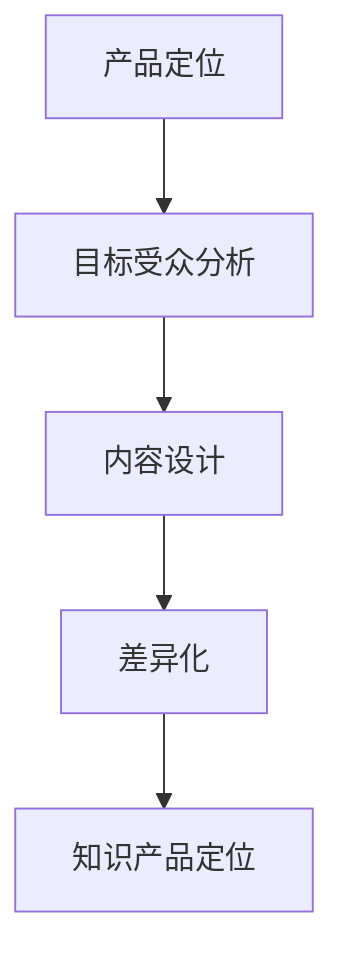

**核心算法原理讲解**

```python
def knowledge_product_design(targetAudience, marketDemand):
    # 产品定位
    productPositioning = analyze_target_audience(targetAudience, marketDemand)
    # 内容设计
    contentDesign = design_content(productPositioning)
    # 差异化
    differentiation = differentiate_content(contentDesign)
    return differentiation
```

**数学模型和数学公式 & 详细讲解 & 举例说明**

可以使用以下数学模型来评估知识产品的定位与设计效果：

$$
ProductQuality = \frac{UserSatisfaction}{ContentCost}
$$

其中，$UserSatisfaction$ 表示用户满意度，$ContentCost$ 表示内容成本。举例说明：

- 用户满意度：通过调查，90%的用户对课程内容表示满意。
- 内容成本：课程内容开发成本为5000元。

根据以上数据，知识产品的定位与设计效果为0.9，表示该课程设计具有较高的用户满意度。

**2.2 目标受众分析**

目标受众分析是制定有效营销策略的基础。以下是如何进行目标受众分析：

1. **受众特征分析**：收集并分析目标受众的基本信息，如年龄、职业、教育背景等。

2. **需求分析**：了解目标受众的需求和痛点，例如他们在学习过程中遇到的问题和期望获得的帮助。

3. **行为分析**：分析目标受众的学习习惯、消费习惯等，以便更好地定位和吸引他们。

**核心概念与联系**

- **受众特征分析**：了解目标受众的基本信息。
- **需求分析**：了解目标受众的需求和痛点。
- **行为分析**：分析目标受众的学习和消费行为。

**Mermaid 流�程图**

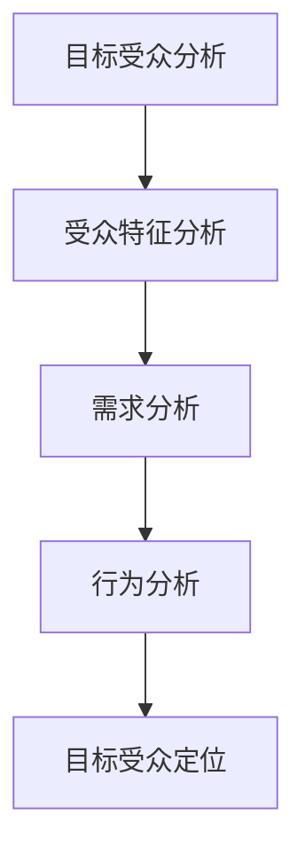

**核心算法原理讲解**

```python
def target_audience_analysis(targetAudience):
    # 受众特征分析
    audience_features = collect_audience_features(targetAudience)
    # 需求分析
    audience_needs = analyze_audience_needs(audience_features)
    # 行为分析
    audience_behavior = analyze_audience_behavior(audience_features)
    # 目标受众定位
    target_audience = locate_target_audience(audience_behavior, audience_needs)
    return target_audience
```

**数学模型和数学公式 & 详细讲解 & 举例说明**

可以使用以下数学模型来评估目标受众分析的效果：

$$
AudienceEffectiveness = \frac{TargetAudienceSize}{AudienceResearchCost}
$$

其中，$TargetAudienceSize$ 表示目标受众的数量，$AudienceResearchCost$ 表示受众研究的成本。举例说明：

- 目标受众数量：通过分析，确定有1000个目标受众。
- 受众研究成本：受众研究的成本为3000元。

根据以上数据，目标受众分析的效果为0.33，表示该分析有效地确定了较大的目标受众群体。

**2.3 营销渠道选择**

选择合适的营销渠道是知识付费营销成功的关键。以下是如何进行营销渠道选择：

1. **渠道评估**：评估不同渠道的效果和成本，如社交媒体、搜索引擎、电子邮件等。

2. **渠道定位**：根据目标受众的特点，选择最适合的渠道。例如，年轻用户可能更喜欢社交媒体，而有一定工作经验的用户可能更喜欢通过搜索引擎查找信息。

3. **渠道整合**：将多种渠道结合起来，实现协同效应。

**核心概念与联系**

- **渠道评估**：评估不同渠道的效果和成本。
- **渠道定位**：根据目标受众选择最适合的渠道。
- **渠道整合**：实现多种渠道的协同效应。

**Mermaid 流程图**

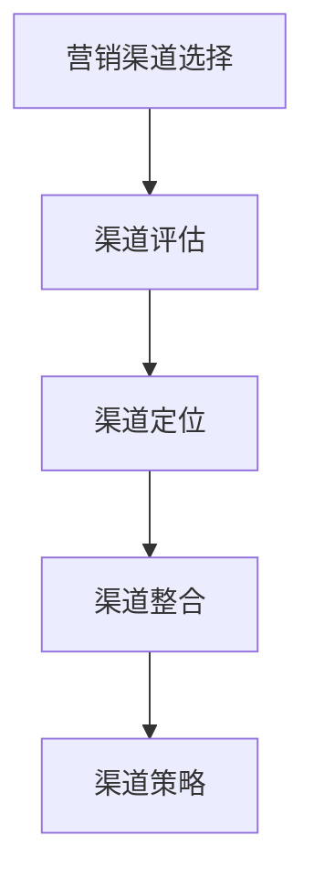

**核心算法原理讲解**

```python
def marketing_channel_selection(targetAudience, channels):
    # 渠道评估
    channel_evaluation = evaluate_channels(channels)
    # 渠道定位
    channel_positioning = position_channels(targetAudience, channel_evaluation)
    # 渠道整合
    integrated_strategy = integrate_channels(channel_positioning)
    return integrated_strategy
```

**数学模型和数学公式 & 详细讲解 & 举例说明**

可以使用以下数学模型来评估营销渠道选择的效果：

$$
ChannelEffectiveness = \frac{RevenueFromChannels}{ChannelCost}
$$

其中，$RevenueFromChannels$ 表示通过渠道获得的收入，$ChannelCost$ 表示渠道的成本。举例说明：

- 渠道收入：通过社交媒体渠道，每月获得1000元收入。
- 渠道成本：社交媒体渠道的运营成本为500元。

根据以上数据，渠道效果为2，表示该渠道具有较高的收入回报率。

通过以上分析，我们可以看到，知识付费营销的基础工作包括产品定位与设计、目标受众分析和营销渠道选择。这些基础工作对于成功进行知识付费营销至关重要。接下来，我们将进一步探讨具体营销策略的实施细节。

### 第二部分：营销策略与执行

#### 第3章：内容营销策略

内容营销是一种通过创建和分享有价值的内容来吸引目标受众，并促进产品或服务销售的营销策略。对于程序员的知识付费营销来说，内容营销策略尤为重要。本章节将详细探讨内容营销的策略、内容创作与优化，以及内容的推广方法。

**3.1 内容营销概述**

内容营销的核心在于提供对目标受众有价值的内容，从而建立信任和增加品牌忠诚度。以下是内容营销的几个关键要素：

1. **目标明确**：明确内容营销的目标，如增加网站流量、提高品牌知名度、促进产品销售等。

2. **受众分析**：深入了解目标受众的需求和兴趣，确保内容能够满足他们的需求。

3. **内容多样化**：利用多种形式的内容，如博客文章、视频教程、电子书、播客等，以吸引不同的受众群体。

4. **持续更新**：定期发布新内容，以保持受众的兴趣和关注。

**核心概念与联系**

- **目标明确**：确定内容营销的目标。
- **受众分析**：了解目标受众的需求。
- **内容多样化**：利用多种形式的内容。
- **持续更新**：定期发布新内容。

**Mermaid 流程图**

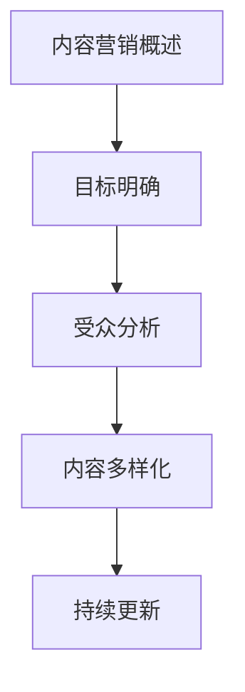

**核心算法原理讲解**

```python
def content_marketing_strategy(goals, targetAudience):
    # 目标明确
    marketing_goals = define_goals(goals)
    # 受众分析
    audience_insights = analyze_audience(targetAudience)
    # 内容多样化
    content_types = diversify_content(audience_insights)
    # 持续更新
    update_schedule = set_content_update_schedule()
    return marketing_goals, content_types, update_schedule
```

**数学模型和数学公式 & 详细讲解 & 举例说明**

可以使用以下数学模型来评估内容营销策略的效果：

$$
ContentEffectiveness = \frac{ContentEngagement}{ContentCost}
$$

其中，$ContentEngagement$ 表示内容的影响力，如阅读量、分享量等，$ContentCost$ 表示内容创作的成本。举例说明：

- 内容影响力：一篇博客文章吸引了1000次阅读和50次分享。
- 内容成本：文章创作成本为200元。

根据以上数据，内容营销策略的效果为5，表示该策略在内容创作和影响力方面具有较高的回报率。

**3.2 内容创作与优化**

内容创作是内容营销的核心环节，优质的内容能够吸引并留住目标受众。以下是如何进行内容创作与优化：

1. **内容创作**：根据目标受众的需求，创作有价值、有深度的内容。内容应具有实用性和独特性。

2. **内容优化**：对已发布的内容进行优化，提高内容的可读性、相关性以及搜索引擎排名。

3. **内容迭代**：定期更新和迭代内容，以保持其相关性和新颖性。

**核心概念与联系**

- **内容创作**：创作有价值、有深度的内容。
- **内容优化**：优化内容的可读性和相关性。
- **内容迭代**：定期更新和迭代内容。

**Mermaid 流程图**

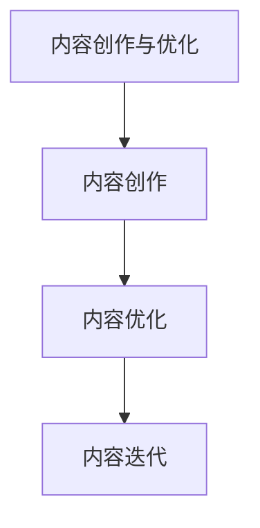

**核心算法原理讲解**

```python
def content_crafting_and_optimization(content_type, targetAudience):
    # 内容创作
    crafted_content = create_content(content_type, targetAudience)
    # 内容优化
    optimized_content = optimize_content(crafted_content)
    # 内容迭代
    updated_content = iterate_content(optimized_content)
    return updated_content
```

**数学模型和数学公式 & 详细讲解 & 举例说明**

可以使用以下数学模型来评估内容创作与优化的效果：

$$
ContentQuality = \frac{UserEngagement}{ContentCost}
$$

其中，$UserEngagement$ 表示用户对内容的互动，如阅读量、评论数等，$ContentCost$ 表示内容创作的成本。举例说明：

- 用户互动：一篇博客文章获得了500次阅读和20次评论。
- 内容成本：文章创作成本为300元。

根据以上数据，内容创作与优化的质量为1.67，表示该策略在内容创作和用户互动方面具有较高的性价比。

**3.3 内容推广策略**

内容推广是确保内容被目标受众看到的关键环节。以下是如何制定内容推广策略：

1. **渠道选择**：根据目标受众的喜好和行为，选择合适的推广渠道，如社交媒体、搜索引擎、电子邮件等。

2. **内容推广**：通过多种渠道推广内容，提高内容的曝光率和点击率。

3. **数据分析**：收集和分析推广数据，评估推广效果，并根据数据调整推广策略。

**核心概念与联系**

- **渠道选择**：根据目标受众选择推广渠道。
- **内容推广**：通过多种渠道推广内容。
- **数据分析**：收集和分析推广数据。

**Mermaid 流程图**

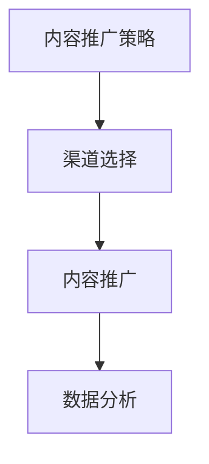

**核心算法原理讲解**

```python
def content_promotion_strategy(targetAudience, channels):
    # 渠道选择
    selected_channels = choose_channels(targetAudience, channels)
    # 内容推广
    promotion_actions = promote_content(selected_channels)
    # 数据分析
    analytics_data = analyze_promotion_data(promotion_actions)
    return analytics_data
```

**数学模型和数学公式 & 详细讲解 & 举例说明**

可以使用以下数学模型来评估内容推广策略的效果：

$$
PromotionEffectiveness = \frac{ContentImpressions}{PromotionCost}
$$

其中，$ContentImpressions$ 表示内容的曝光次数，$PromotionCost$ 表示推广的成本。举例说明：

- 内容曝光次数：通过推广，一篇博客文章获得了10000次曝光。
- 推广成本：推广成本为500元。

根据以上数据，内容推广策略的效果为20，表示该策略在曝光次数和成本方面具有很高的性价比。

通过以上分析，我们可以看到内容营销策略在程序员的知识付费营销中起着至关重要的作用。接下来，我们将探讨社交媒体营销的策略和技巧。

#### 第4章：社交媒体营销

社交媒体营销是知识付费营销的重要组成部分，它通过在社交媒体平台上创建和分享有价值的内容来吸引目标受众。本章将详细探讨社交媒体营销的概述、常用平台的分析、以及具体的营销策略和技巧。

**4.1 社交媒体营销概述**

社交媒体营销是一种通过社交媒体平台来推广产品、服务和品牌信息的方法。以下是其核心要素：

1. **平台选择**：根据目标受众的行为和偏好，选择适合的社交媒体平台，如微信、微博、LinkedIn、Facebook、Instagram等。

2. **内容创建**：创建有价值、有吸引力的内容，如文章、图片、视频等，以吸引和留住目标受众。

3. **互动与反馈**：积极与受众互动，回应他们的评论和提问，以增强用户参与度和忠诚度。

4. **数据分析**：收集和分析社交媒体数据，以评估营销效果，并根据数据调整营销策略。

**核心概念与联系**

- **平台选择**：根据目标受众选择社交媒体平台。
- **内容创建**：创建有价值、有吸引力的内容。
- **互动与反馈**：积极与受众互动。
- **数据分析**：收集和分析社交媒体数据。

**Mermaid 流程图**

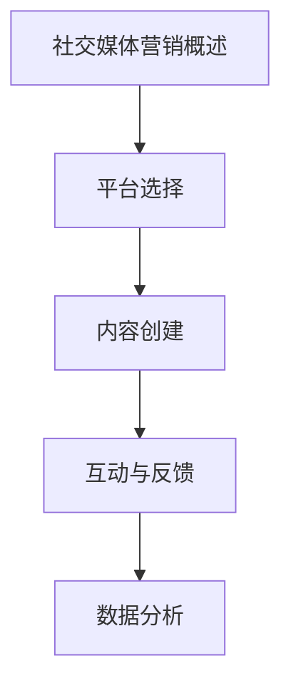

**核心算法原理讲解**

```python
def social_media_marketing_strategy(targetAudience, platforms):
    # 平台选择
    selected_platforms = choose_platforms(targetAudience, platforms)
    # 内容创建
    content_strategy = create_content(selected_platforms)
    # 互动与反馈
    interaction_strategy = interact_with_audience(selected_platforms)
    # 数据分析
    analytics_strategy = analyze_social_media_data(selected_platforms)
    return analytics_strategy
```

**数学模型和数学公式 & 详细讲解 & 举例说明**

可以使用以下数学模型来评估社交媒体营销策略的效果：

$$
SocialMediaEffectiveness = \frac{EngagementRate}{SocialMediaCost}
$$

其中，$EngagementRate$ 表示用户的互动率，如点赞、评论、分享等，$SocialMediaCost$ 表示社交媒体营销的成本。举例说明：

- 用户互动率：一篇社交媒体帖子获得了100次点赞和50次评论。
- 社交媒体成本：帖子推广成本为200元。

根据以上数据，社交媒体营销策略的效果为0.75，表示该策略在用户互动率和成本方面具有较高的性价比。

**4.2 常用社交媒体平台分析**

在社交媒体营销中，了解并分析常用平台的特点和用户行为是非常重要的。以下是一些常用平台的分析：

1. **微信**：微信是中国最受欢迎的社交媒体平台，用户以年轻人为主，喜欢通过朋友圈分享生活和工作动态。微信的公众号和微信群是内容推广的重要渠道。

2. **微博**：微博是一个以新闻和实时信息为主的社交媒体平台，用户喜欢通过微博获取和分享新闻、观点和娱乐内容。微博的微博话题和微博热搜是提高内容曝光率的重要手段。

3. **LinkedIn**：LinkedIn 是一个以职业人士为主的社交媒体平台，用户主要关注职业发展、招聘和行业动态。LinkedIn 的推荐系统和广告投放是推广专业知识的重要方式。

4. **Facebook**：Facebook 是全球最大的社交媒体平台，用户覆盖全球各个年龄段和职业。Facebook 的广告投放和互动功能是提高品牌知名度的重要手段。

5. **Instagram**：Instagram 是一个以图片和视频为主的社交媒体平台，用户喜欢通过视觉效果来体验生活。Instagram 的故事和直播功能是吸引年轻用户的重要方式。

**核心概念与联系**

- **平台特点**：了解每个平台的特点和用户行为。
- **内容推广**：根据平台特点制定内容推广策略。

**Mermaid 流程图**

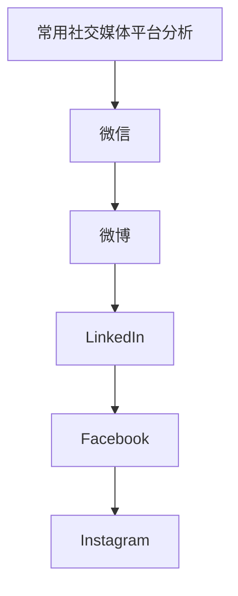

**核心算法原理讲解**

```python
def social_media_platform_analysis(platforms):
    platform_analyses = {
        '微信': analyze_wechat(),
        '微博': analyze_weibo(),
        'LinkedIn': analyze_linkedin(),
        'Facebook': analyze_facebook(),
        'Instagram': analyze_instagram()
    }
    return platform_analyses
```

**数学模型和数学公式 & 详细讲解 & 举例说明**

可以使用以下数学模型来评估每个社交媒体平台的效果：

$$
PlatformEffectiveness = \frac{PlatformEngagement}{PlatformCost}
$$

其中，$PlatformEngagement$ 表示在特定平台上的用户互动率，$PlatformCost$ 表示在特定平台上的营销成本。举例说明：

- 微信：每月在微信上的互动率为20%，营销成本为500元。
- 微博：每月在微信上的互动率为15%，营销成本为400元。

根据以上数据，我们可以得出微信的营销效果为0.4，微博的营销效果为0.375，表示微信在用户互动率和成本方面具有更高的性价比。

**4.3 社交媒体营销策略与技巧**

制定有效的社交媒体营销策略和技巧是成功的关键。以下是一些策略和技巧：

1. **内容多样化**：创建不同形式的内容，如文章、图片、视频等，以吸引不同类型的受众。

2. **定期更新**：定期发布新内容，保持用户的兴趣和参与度。

3. **互动与参与**：积极与受众互动，回应评论和提问，提高用户的参与度。

4. **数据分析**：收集和分析社交媒体数据，如用户互动率、内容曝光率等，以优化营销策略。

5. **广告投放**：根据目标受众的特点，选择合适的广告投放方式和平台，以提高曝光率和转化率。

6. **KOL合作**：与知名意见领袖（KOL）合作，通过他们的影响力扩大品牌的知名度。

**核心概念与联系**

- **内容多样化**：创建多种形式的内容。
- **定期更新**：定期发布新内容。
- **互动与参与**：积极互动。
- **数据分析**：收集和分析数据。
- **广告投放**：根据目标受众投放广告。
- **KOL合作**：与KOL合作。

**Mermaid 流程图**

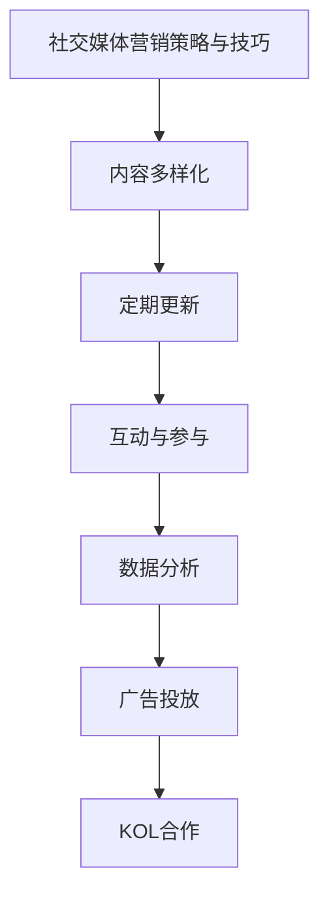

**核心算法原理讲解**

```python
def social_media_marketing_tips(content_types, update_frequency, engagement, analytics, advertising, kols):
    # 内容多样化
    diversified_content = create_diversified_content(content_types)
    # 定期更新
    update_schedule = set_regular_update_schedule(update_frequency)
    # 互动与参与
    interaction_plan = set_interaction_plan(engagement)
    # 数据分析
    analytics_plan = set_analytics_plan(analytics)
    # 广告投放
    advertising_plan = set_advertising_plan(advertising)
    # KOL合作
    kol_plan = collaborate_with_kols(kols)
    return {
        'diversified_content': diversified_content,
        'update_schedule': update_schedule,
        'interaction_plan': interaction_plan,
        'analytics_plan': analytics_plan,
        'advertising_plan': advertising_plan,
        'kol_plan': kol_plan
    }
```

**数学模型和数学公式 & 详细讲解 & 举例说明**

可以使用以下数学模型来评估社交媒体营销策略的效果：

$$
MarketingEffectiveness = \frac{TotalEngagement}{TotalCost}
$$

其中，$TotalEngagement$ 表示在所有社交媒体平台上的总用户互动率，$TotalCost$ 表示在所有社交媒体平台上的总营销成本。举例说明：

- 总用户互动率：在所有平台上，每月总共有5000次互动。
- 总营销成本：每月在所有平台上的营销成本为10000元。

根据以上数据，社交媒体营销策略的效果为0.5，表示该策略在总用户互动率和总成本方面具有较高的性价比。

通过以上分析，我们可以看到社交媒体营销在程序员的知识付费营销中具有重要的地位。接下来，我们将探讨搜索引擎优化（SEO）的策略和实践。

#### 第5章：搜索引擎优化（SEO）

搜索引擎优化（SEO）是一种通过提高网站在搜索引擎结果页面（SERP）中的排名来增加网站流量和可见性的营销策略。SEO的核心在于优化网站内容和结构，以提高搜索引擎对网站内容的识别和评价。以下将详细探讨SEO的概述、关键词研究、优化策略与实施。

**5.1 SEO概述**

SEO的主要目标是提升网站在搜索引擎中的自然排名，从而吸引更多有意向的用户访问网站。以下是SEO的关键要素：

1. **关键词研究**：确定网站应优化的关键词，这些关键词应与目标受众的搜索习惯相匹配。

2. **内容优化**：创建和更新高质量的内容，确保内容包含目标关键词，并满足用户的需求。

3. **网站结构优化**：优化网站的结构和布局，以提高用户体验和搜索引擎的可爬性。

4. **链接建设**：建立高质量的内部和外部链接，以提升网站的权威性和排名。

**核心概念与联系**

- **关键词研究**：确定应优化的关键词。
- **内容优化**：创建和更新高质量的内容。
- **网站结构优化**：优化网站的结构和布局。
- **链接建设**：建立高质量的链接。

**Mermaid 流程图**

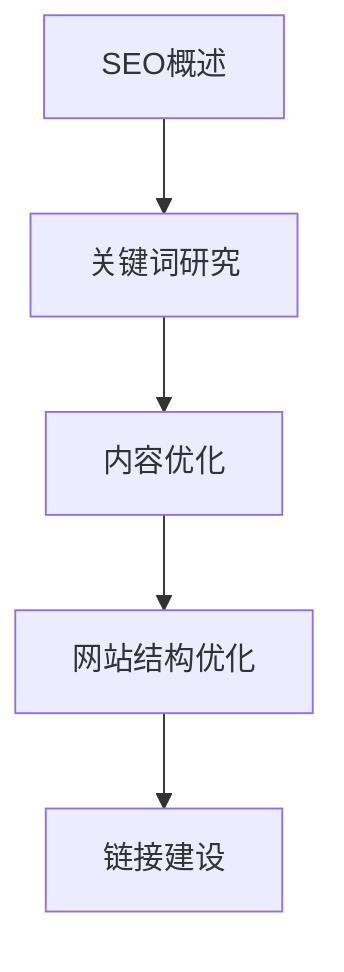

**核心算法原理讲解**

```python
def seo_strategy(keywords, content, site_structure, links):
    # 关键词研究
    optimized_keywords = research_keywords(keywords)
    # 内容优化
    optimized_content = optimize_content(content, optimized_keywords)
    # 网站结构优化
    optimized_structure = optimize_site_structure(site_structure)
    # 链接建设
    link_building = build_high_quality_links(links)
    return {
        'optimized_keywords': optimized_keywords,
        'optimized_content': optimized_content,
        'optimized_structure': optimized_structure,
        'link_building': link_building
    }
```

**数学模型和数学公式 & 详细讲解 & 举例说明**

可以使用以下数学模型来评估SEO策略的效果：

$$
SEOEffectiveness = \frac{ImprovementInRank}{SEOInvestment}
$$

其中，$ImprovementInRank$ 表示排名提升的幅度，$SEOInvestment$ 表示在SEO上的投资。举例说明：

- 排名提升幅度：通过SEO优化，关键词从第10页提升至第1页。
- SEO投资：SEO优化费用为1000元。

根据以上数据，SEO策略的效果为10，表示该策略在排名提升和投资方面具有很高的性价比。

**5.2 关键词研究**

关键词研究是SEO的重要环节，它涉及到如何确定网站应优化的关键词。以下是关键词研究的步骤和技巧：

1. **确定目标关键词**：根据业务目标和目标受众，确定应优化的核心关键词。

2. **分析关键词竞争程度**：评估关键词的搜索量和竞争程度，选择搜索量大且竞争适中的关键词。

3. **关键词扩展**：利用关键词工具扩展相关关键词，以覆盖更广泛的搜索需求。

4. **评估关键词效果**：通过数据分析，评估关键词的优化效果，并根据效果调整关键词策略。

**核心概念与联系**

- **目标关键词**：确定应优化的核心关键词。
- **关键词竞争程度**：评估关键词的搜索量和竞争程度。
- **关键词扩展**：扩展相关关键词。
- **关键词效果评估**：评估关键词的优化效果。

**Mermaid 流程图**

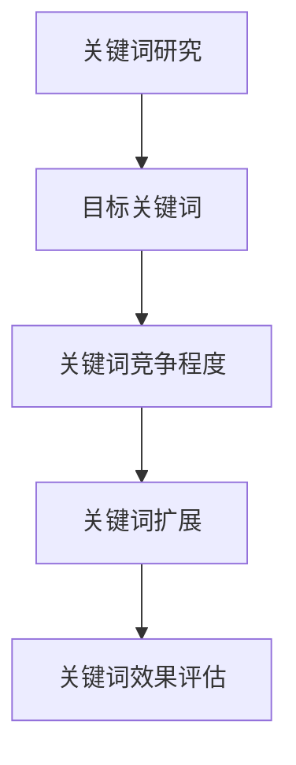

**核心算法原理讲解**

```python
def keyword_research(target_keywords):
    # 目标关键词
    target_keywords = determine_target_keywords(target_keywords)
    # 关键词竞争程度
    keyword_competitiveness = analyze_keyword_competitiveness(target_keywords)
    # 关键词扩展
    extended_keywords = expand_keywords(target_keywords)
    # 关键词效果评估
    keyword效果的评估 = evaluate_keyword_performance(extended_keywords)
    return {
        'target_keywords': target_keywords,
        'keyword_competitiveness': keyword_competitiveness,
        'extended_keywords': extended_keywords,
        'keyword_performance': keyword效果的评估
    }
```

**数学模型和数学公式 & 详细讲解 & 举例说明**

可以使用以下数学模型来评估关键词研究的效果：

$$
KeywordEffectiveness = \frac{ImprovedSearchRank}{KeywordResearchCost}
$$

其中，$ImprovedSearchRank$ 表示关键词搜索排名的提升，$KeywordResearchCost$ 表示关键词研究的成本。举例说明：

- 关键词搜索排名提升：关键词从第5页提升至第1页。
- 关键词研究成本：关键词研究费用为300元。

根据以上数据，关键词研究的效果为3.33，表示该研究在搜索排名提升和成本方面具有较高的性价比。

**5.3 优化策略与实施**

优化策略与实施是SEO的核心，它涉及到如何将关键词研究、内容优化和链接建设等策略具体落实到网站中。以下是SEO优化策略与实施的具体步骤：

1. **内容优化**：确保网站内容高质量、相关性强，并包含目标关键词。优化标题、元描述、内容结构等。

2. **网站结构优化**：优化网站的结构，提高用户体验和搜索引擎的可爬性。建立清晰的导航、合理使用HTML标签等。

3. **链接建设**：建立高质量的内部和外部链接，提高网站的权威性和流量。

4. **数据分析与调整**：定期收集和分析SEO数据，根据数据结果调整优化策略。

**核心概念与联系**

- **内容优化**：优化网站内容。
- **网站结构优化**：优化网站结构。
- **链接建设**：建立高质量链接。
- **数据分析与调整**：收集和分析数据，调整策略。

**Mermaid 流程图**

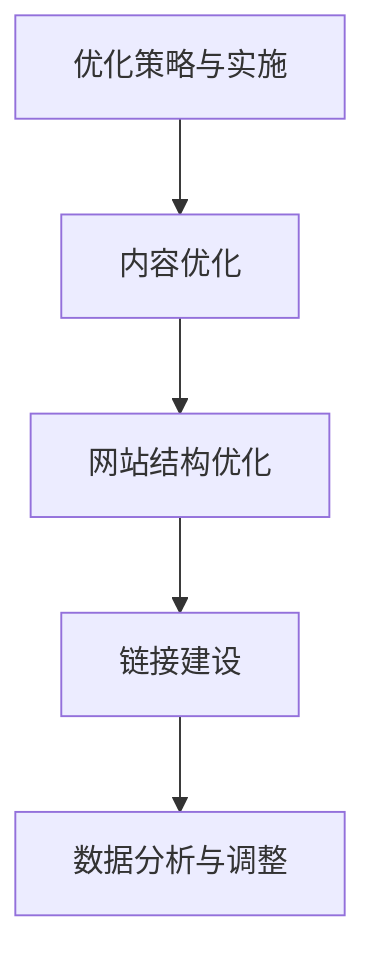

**核心算法原理讲解**

```python
def seo_implementation(content, site_structure, links, analytics):
    # 内容优化
    optimized_content = optimize_content(content)
    # 网站结构优化
    optimized_structure = optimize_site_structure(site_structure)
    # 链接建设
    built_links = build_high_quality_links(links)
    # 数据分析与调整
    analytics_data = analyze_seo_performance(built_links, optimized_content, optimized_structure)
    adjustment_plan = adjust_seo_strategy(analytics_data)
    return {
        'optimized_content': optimized_content,
        'optimized_structure': optimized_structure,
        'built_links': built_links,
        'analytics_data': analytics_data,
        'adjustment_plan': adjustment_plan
    }
```

**数学模型和数学公式 & 详细讲解 & 举例说明**

可以使用以下数学模型来评估SEO优化策略与实施的效果：

$$
SEOImplementationEffectiveness = \frac{IncreasedWebsiteTraffic}{SEOImplementationCost}
$$

其中，$IncreasedWebsiteTraffic$ 表示网站流量的提升，$SEOImplementationCost$ 表示SEO优化实施的成本。举例说明：

- 网站流量提升：通过SEO优化，每月网站流量增加了2000次。
- SEO优化实施成本：SEO优化费用为2000元。

根据以上数据，SEO优化策略与实施的效果为1.0，表示该策略在网站流量提升和成本方面具有合理的性价比。

通过以上分析，我们可以看到SEO在程序员的知识付费营销中扮演着重要的角色。接下来，我们将探讨电子邮件营销的策略和实践。

### 第6章：电子邮件营销

电子邮件营销是一种通过发送电子邮件来推广产品、服务和品牌信息的营销策略。它具有成本低、覆盖面广、效果持久等优点，在程序员的知识付费营销中具有重要的应用价值。以下将详细探讨电子邮件营销的概述、邮件列表构建与维护，以及邮件内容与发送策略。

**6.1 电子邮件营销概述**

电子邮件营销的核心在于通过定期发送有价值的信息，与目标受众建立长期关系，从而促进产品销售和品牌推广。以下是电子邮件营销的关键要素：

1. **邮件列表构建**：收集目标受众的电子邮件地址，建立邮件列表。

2. **邮件内容创作**：创作有吸引力、有价值、符合目标受众需求的邮件内容。

3. **邮件发送策略**：制定合理的邮件发送频率和时间，确保邮件能够有效地传达信息。

4. **互动与反馈**：与邮件接收者互动，收集反馈，不断优化邮件营销效果。

**核心概念与联系**

- **邮件列表构建**：收集电子邮件地址。
- **邮件内容创作**：创作有价值的邮件内容。
- **邮件发送策略**：制定合理的发送频率和时间。
- **互动与反馈**：与邮件接收者互动。

**Mermaid 流程图**

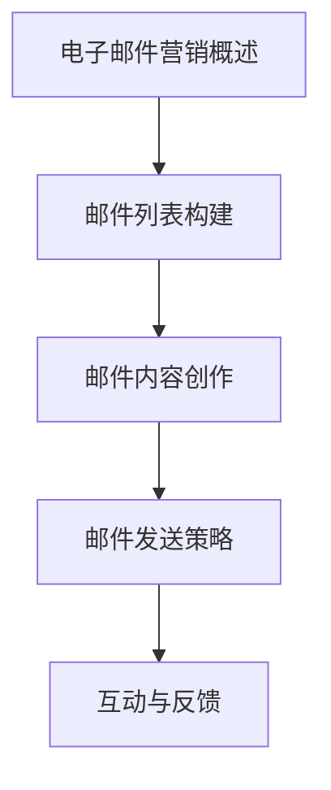

**核心算法原理讲解**

```python
def email_marketing_strategy(email_list, content, sending_strategy, engagement):
    # 邮件列表构建
    email_list = build_email_list(email_list)
    # 邮件内容创作
    email_content = create_email_content(content)
    # 邮件发送策略
    sending_plan = set_sending_strategy(sending_strategy)
    # 互动与反馈
    feedback = interact_and_collect_feedback(engagement)
    return {
        'email_list': email_list,
        'email_content': email_content,
        'sending_plan': sending_plan,
        'feedback': feedback
    }
```

**数学模型和数学公式 & 详细讲解 & 举例说明**

可以使用以下数学模型来评估电子邮件营销策略的效果：

$$
EmailMarketingEffectiveness = \frac{EmailOpenRate}{EmailSendingCost}
$$

其中，$EmailOpenRate$ 表示邮件的打开率，$EmailSendingCost$ 表示邮件发送的成本。举例说明：

- 邮件打开率：发送的100封邮件中有80封被打开。
- 邮件发送成本：邮件发送费用为500元。

根据以上数据，电子邮件营销策略的效果为1.6，表示该策略在邮件打开率和成本方面具有较高的性价比。

**6.2 邮件列表构建与维护**

邮件列表是电子邮件营销的基础，有效的邮件列表构建与维护是成功的关键。以下是邮件列表构建与维护的步骤和技巧：

1. **收集邮件地址**：通过网站、社交媒体、活动等方式收集目标受众的电子邮件地址。

2. **验证邮件地址**：确保邮件地址的有效性和准确性，定期清理无效邮件地址。

3. **邮件列表细分**：根据目标受众的特点和需求，对邮件列表进行细分，以便发送更加个性化的邮件。

4. **邮件列表维护**：定期与邮件列表成员保持互动，提供有价值的信息，保持邮件列表的活跃度。

**核心概念与联系**

- **收集邮件地址**：通过多种渠道收集电子邮件地址。
- **验证邮件地址**：确保邮件地址的有效性和准确性。
- **邮件列表细分**：根据受众特点细分邮件列表。
- **邮件列表维护**：定期与邮件列表成员保持互动。

**Mermaid 流程图**

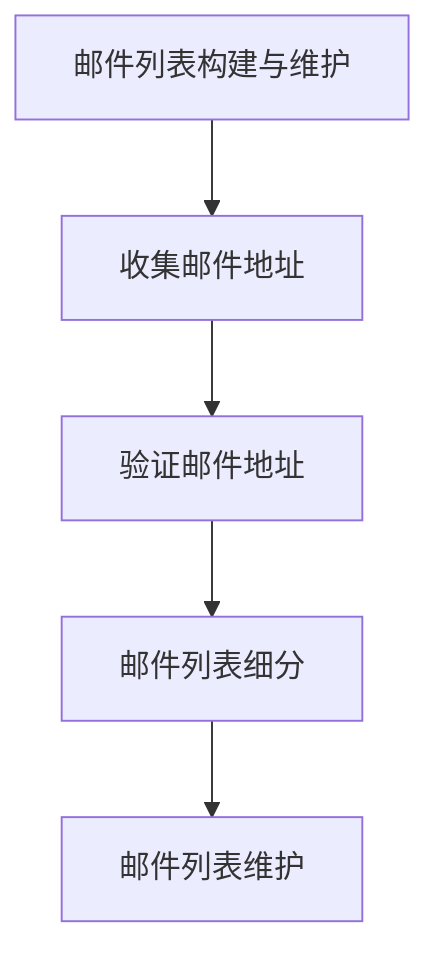

**核心算法原理讲解**

```python
def email_list_building_and_maintenance(email_collection, email_validation, list_segmentation, list_maintenance):
    # 收集邮件地址
    collected_emails = collect_emails(email_collection)
    # 验证邮件地址
    valid_emails = validate_emails(collected_emails)
    # 邮件列表细分
    segmented_lists = segment_email_lists(valid_emails)
    # 邮件列表维护
    maintained_lists = maintain_email_lists(segmented_lists, list_maintenance)
    return maintained_lists
```

**数学模型和数学公式 & 详细讲解 & 举例说明**

可以使用以下数学模型来评估邮件列表构建与维护的效果：

$$
EmailListEffectiveness = \frac{ActiveEmailAddresses}{TotalEmailAddresses}
$$

其中，$ActiveEmailAddresses$ 表示活跃的邮件地址数量，$TotalEmailAddresses$ 表示邮件列表的总数量。举例说明：

- 活跃的邮件地址数量：邮件列表中有1000个活跃邮件地址。
- 邮件列表总数量：邮件列表中有1500个邮件地址。

根据以上数据，邮件列表构建与维护的效果为0.67，表示邮件列表的质量较高。

**6.3 电子邮件内容与发送策略**

电子邮件内容与发送策略是电子邮件营销的核心，它涉及到如何创作和发送有效的电子邮件内容。以下是电子邮件内容创作与发送策略的步骤和技巧：

1. **内容创作**：创作有吸引力、有价值、符合目标受众需求的邮件内容。

2. **发送时间选择**：根据目标受众的行为和邮件类型，选择最佳发送时间。

3. **发送频率控制**：制定合理的邮件发送频率，避免过度打扰用户。

4. **A/B测试**：通过A/B测试，比较不同邮件内容的打开率和点击率，优化邮件内容。

**核心概念与联系**

- **内容创作**：创作有价值的邮件内容。
- **发送时间选择**：选择最佳发送时间。
- **发送频率控制**：制定合理的发送频率。
- **A/B测试**：优化邮件内容。

**Mermaid 流程图**

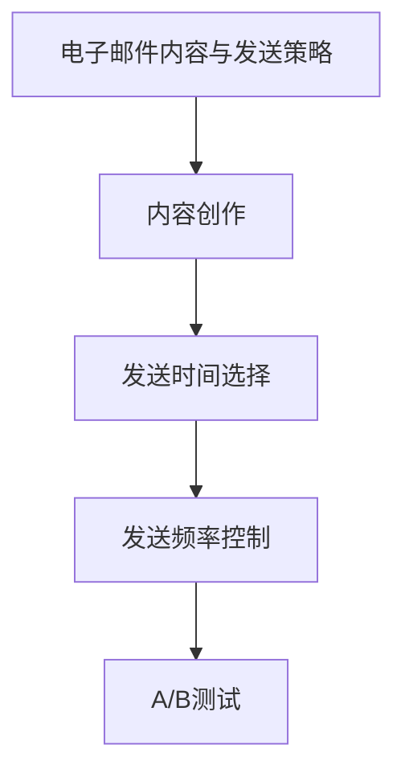

**核心算法原理讲解**

```python
def email_content_and_sending_strategy(content_creation, send_time_selection, send_frequency_control, a_b_testing):
    # 内容创作
    email_content = create_content(content_creation)
    # 发送时间选择
    send_time = select_send_time(send_time_selection)
    # 发送频率控制
    send_frequency = set_send_frequency(send_frequency_control)
    # A/B测试
    test_results = perform_a_b_tests(a_b_testing)
    return {
        'email_content': email_content,
        'send_time': send_time,
        'send_frequency': send_frequency,
        'test_results': test_results
    }
```

**数学模型和数学公式 & 详细讲解 & 举例说明**

可以使用以下数学模型来评估电子邮件内容与发送策略的效果：

$$
EmailContentEffectiveness = \frac{EmailOpenRate}{EmailSendFrequency}
$$

其中，$EmailOpenRate$ 表示邮件的打开率，$EmailSendFrequency$ 表示邮件的发送频率。举例说明：

- 邮件打开率：发送的100封邮件中有80封被打开。
- 邮件发送频率：每月发送100封邮件。

根据以上数据，电子邮件内容与发送策略的效果为0.8，表示该策略在邮件打开率和发送频率方面具有较高的性价比。

通过以上分析，我们可以看到电子邮件营销在程序员的知识付费营销中具有重要的地位。接下来，我们将探讨社群营销的策略和实践。

### 第7章：社群营销

社群营销是一种通过建立和维护在线社群来吸引和保留目标受众的营销策略。在程序员的知识付费营销中，社群营销可以帮助程序员与目标受众建立紧密的联系，提升用户粘性和忠诚度。以下将详细探讨社群营销的概述、社群建设与运营，以及社群互动与用户粘性提升的策略。

**7.1 社群营销概述**

社群营销的核心在于创建一个有共同兴趣或目标的在线社群，通过社群互动和内容分享，增强用户参与度和忠诚度。以下是社群营销的关键要素：

1. **社群定位**：明确社群的主题和目标，确保与目标受众的兴趣和需求相匹配。

2. **社群目标设置**：制定社群的长期和短期目标，如用户增长、内容创作、品牌推广等。

3. **社群内容规划**：规划社群的内容和活动，确保内容丰富多样，满足社群成员的需求。

4. **社群互动**：鼓励社群成员积极参与互动，增强社群的活跃度和凝聚力。

**核心概念与联系**

- **社群定位**：明确社群主题和目标。
- **社群目标设置**：制定社群长期和短期目标。
- **社群内容规划**：规划社群内容和活动。
- **社群互动**：增强社群活跃度和凝聚力。

**Mermaid 流程图**

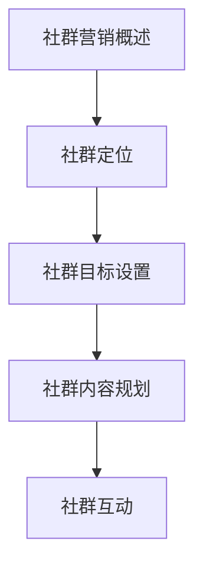

**核心算法原理讲解**

```python
def community_marketing_strategy(community_topic, community_goals, content_plan, interaction_plan):
    # 社群定位
    community_positioning = define_community_topic(community_topic)
    # 社群目标设置
    community_goals = set_community_goals(community_goals)
    # 社群内容规划
    content_strategy = plan_community_content(content_plan)
    # 社群互动
    interaction_strategy = encourage_community_interactions(interaction_plan)
    return {
        'community_positioning': community_positioning,
        'community_goals': community_goals,
        'content_strategy': content_strategy,
        'interaction_strategy': interaction_strategy
    }
```

**数学模型和数学公式 & 详细讲解 & 举例说明**

可以使用以下数学模型来评估社群营销策略的效果：

$$
CommunityEffectiveness = \frac{ActiveMemberEngagement}{TotalMemberCount}
$$

其中，$ActiveMemberEngagement$ 表示活跃成员的互动次数，$TotalMemberCount$ 表示社群的总成员数量。举例说明：

- 活跃成员互动次数：社群中有100个活跃成员，每月平均互动次数为500次。
- 社群总成员数量：社群共有500个成员。

根据以上数据，社群营销策略的效果为0.1，表示社群具有较高的活跃度和用户参与度。

**7.2 社群建设与运营**

社群建设与运营是社群营销成功的关键。以下是如何进行有效的社群建设与运营：

1. **社群建设**：创建一个有吸引力的社群，确定社群的规则和价值观，确保社群成员之间有良好的互动氛围。

2. **内容规划**：定期发布有价值的内容，如技术教程、行业动态、用户故事等，以满足社群成员的需求。

3. **活动策划**：策划和举办各种线上和线下活动，增强社群成员之间的互动和联系。

4. **成员管理**：管理社群成员，确保社群秩序良好，及时发现和解决问题。

**核心概念与联系**

- **社群建设**：创建有吸引力的社群。
- **内容规划**：发布有价值的内容。
- **活动策划**：举办互动活动。
- **成员管理**：管理社群成员。

**Mermaid 流程图**

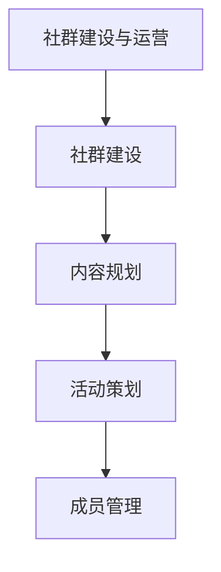

**核心算法原理讲解**

```python
def community_building_and_operations(community_setup, content_scheduling, event_planning, member_management):
    # 社群建设
    community_setup = establish_community(community_setup)
    # 内容规划
    content_plan = schedule_content(content_scheduling)
    # 活动策划
    event_plan = plan_events(event_planning)
    # 成员管理
    member_management = manage_community_members(member_management)
    return {
        'community_setup': community_setup,
        'content_plan': content_plan,
        'event_plan': event_plan,
        'member_management': member_management
    }
```

**数学模型和数学公式 & 详细讲解 & 举例说明**

可以使用以下数学模型来评估社群建设与运营的效果：

$$
CommunityOperationsEffectiveness = \frac{ActiveMemberEngagement}{TotalCommunityEvents}
$$

其中，$ActiveMemberEngagement$ 表示活跃成员的互动次数，$TotalCommunityEvents$ 表示社群举办的总活动次数。举例说明：

- 活跃成员互动次数：社群中有100个活跃成员，每月平均互动次数为500次。
- 社群举办的总活动次数：社群每月举办10次活动。

根据以上数据，社群建设与运营的效果为0.05，表示社群在活动策划和成员互动方面具有较高的效果。

**7.3 社群互动与用户粘性提升**

提升社群互动和用户粘性是社群营销的重要目标。以下是如何进行有效的社群互动和用户粘性提升：

1. **互动方式选择**：选择适合社群的互动方式，如问答、讨论、投票等，以激发成员的参与兴趣。

2. **用户参与度提升**：提供多样化的参与机会，鼓励成员积极参与社群活动，如举办主题讨论、技术分享等。

3. **用户忠诚度提升**：通过奖励机制、专属福利等方式，增强用户对社群的忠诚度和归属感。

**核心概念与联系**

- **互动方式选择**：选择适合社群的互动方式。
- **用户参与度提升**：鼓励成员积极参与。
- **用户忠诚度提升**：通过奖励机制提升用户忠诚度。

**Mermaid 流程图**

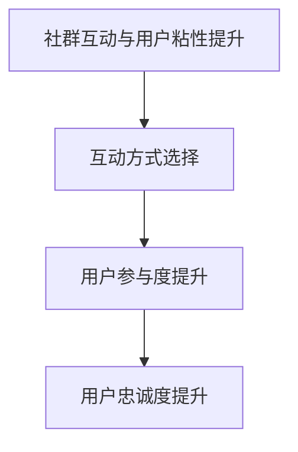

**核心算法原理讲解**

```python
def community_interactivity_and_user_retention(interaction_methods, participation_incentives, loyalty_programs):
    # 互动方式选择
    interaction_methods = select_interaction_methods(interaction_methods)
    # 用户参与度提升
    participation_incentives = encourage_participation(participation_incentives)
    # 用户忠诚度提升
    loyalty_programs = implement_loyalty_programs(loyalty_programs)
    return {
        'interaction_methods': interaction_methods,
        'participation_incentives': participation_incentives,
        'loyalty_programs': loyalty_programs
    }
```

**数学模型和数学公式 & 详细讲解 & 举例说明**

可以使用以下数学模型来评估社群互动与用户粘性提升的效果：

$$
CommunityRetentionEffectiveness = \frac{ReturningMembers}{TotalMembers}
$$

其中，$ReturningMembers$ 表示回访的社群成员数量，$TotalMembers$ 表示社群的总成员数量。举例说明：

- 回访的社群成员数量：社群中有200个成员回访，每月平均回访次数为100次。
- 社群总成员数量：社群共有500个成员。

根据以上数据，社群互动与用户粘性提升的效果为0.4，表示社群具有较高的用户回访率和粘性。

通过以上分析，我们可以看到社群营销在程序员的知识付费营销中具有重要的应用价值。有效的社群建设与运营、互动与用户粘性提升策略，可以帮助程序员与目标受众建立更紧密的联系，提升品牌影响力和用户忠诚度。

### 第三部分：营销效果评估与优化

#### 第8章：营销效果评估

营销效果评估是确保知识付费营销策略成功的关键环节。通过评估营销活动的效果，程序员可以了解哪些策略有效，哪些需要调整。以下将详细探讨营销效果评估的指标、数据收集与分析，以及如何撰写评估报告。

**8.1 营销效果评估指标**

营销效果评估指标是衡量营销活动效果的关键。以下是一些常见的营销效果评估指标：

1. **转化率**：转化率是指访问者完成预定目标（如购买课程、订阅会员）的比例。高转化率表明营销活动吸引了潜在客户并促使他们采取行动。

2. **点击率（CTR）**：点击率是指用户点击广告或链接的比例。高点击率表明营销内容的吸引力和用户兴趣。

3. **客户获取成本（CAC）**：客户获取成本是指获取一个新客户所需的平均成本。低CAC表明营销活动的投资回报率高。

4. **客户生命周期价值（CLV）**：客户生命周期价值是指一个客户在生命周期内为企业带来的总收益。高CLV表明营销活动吸引了有价值的客户。

5. **客户保留率**：客户保留率是指在一定时间内继续购买或参与活动的客户比例。高保留率表明营销活动能够留住客户。

**核心概念与联系**

- **转化率**：衡量用户采取行动的比例。
- **点击率（CTR）**：衡量用户对营销内容的兴趣。
- **客户获取成本（CAC）**：衡量营销活动的投资回报率。
- **客户生命周期价值（CLV）**：衡量客户的长期价值。
- **客户保留率**：衡量客户参与度。

**Mermaid 流程图**

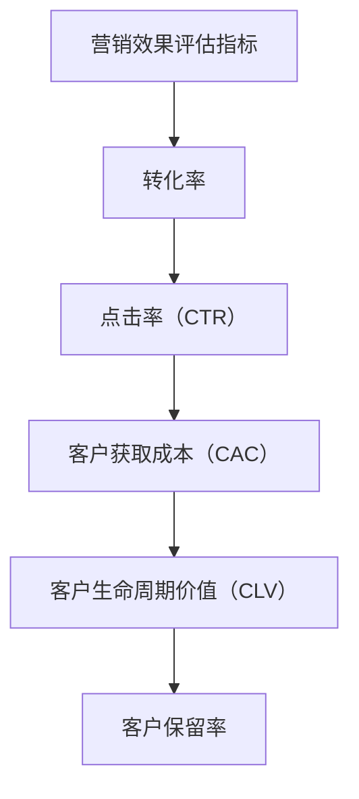

**核心算法原理讲解**

```python
def marketing_effects_evaluation(conversion_rate, click_through_rate, customer_acquisition_cost, customer_lifetime_value, customer_retention_rate):
    # 转化率
    conversion_effectiveness = calculate_conversion_rate(conversion_rate)
    # 点击率（CTR）
    click_through_effectiveness = calculate_click_through_rate(click_through_rate)
    # 客户获取成本（CAC）
    cac_effectiveness = calculate_customer_acquisition_cost(customer_acquisition_cost)
    # 客户生命周期价值（CLV）
    clv_effectiveness = calculate_customer_lifetime_value(customer_lifetime_value)
    # 客户保留率
    retention_effectiveness = calculate_customer_retention_rate(customer_retention_rate)
    return {
        'conversion_effectiveness': conversion_effectiveness,
        'click_through_effectiveness': click_through_effectiveness,
        'cac_effectiveness': cac_effectiveness,
        'clv_effectiveness': clv_effectiveness,
        'retention_effectiveness': retention_effectiveness
    }
```

**数学模型和数学公式 & 详细讲解 & 举例说明**

可以使用以下数学模型来评估营销效果：

$$
MarketingEffectiveness = \frac{TotalRevenue}{TotalMarketingCost}
$$

其中，$TotalRevenue$ 表示营销活动带来的总收益，$TotalMarketingCost$ 表示营销活动的总成本。举例说明：

- 总收益：通过营销活动，一个月内获得的总收入为10000元。
- 总成本：营销活动的总成本为5000元。

根据以上数据，营销效果为2，表示营销活动的投资回报率较高。

**8.2 数据收集与分析**

数据收集与分析是评估营销效果的重要步骤。以下是如何进行有效的数据收集与分析：

1. **数据收集**：收集与营销活动相关的数据，如网站流量、用户行为、销售数据等。

2. **数据清洗**：清理数据中的噪声和错误，确保数据的质量。

3. **数据分析**：使用统计方法和工具，分析数据以提取有用的信息和洞察。

4. **数据可视化**：使用图表和报表，将分析结果以视觉化的方式呈现。

**核心概念与联系**

- **数据收集**：收集与营销活动相关的数据。
- **数据清洗**：清理数据中的噪声和错误。
- **数据分析**：分析数据以提取信息。
- **数据可视化**：以视觉化的方式呈现分析结果。

**Mermaid 流程图**

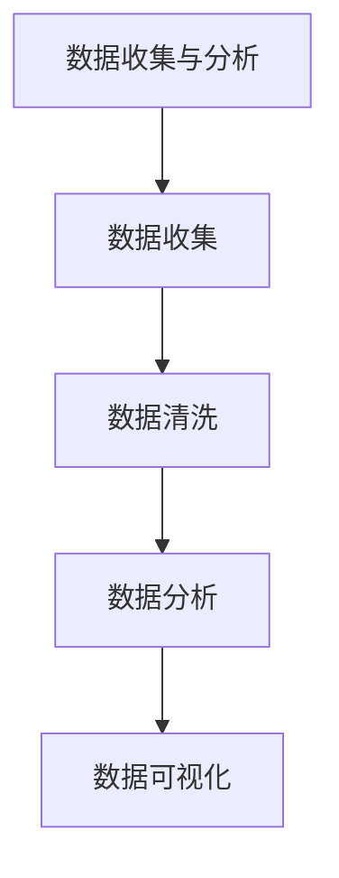

**核心算法原理讲解**

```python
def data_collection_and_analysis(data_collection, data_cleaning, data_analysis, data_visualization):
    # 数据收集
    collected_data = perform_data_collection(data_collection)
    # 数据清洗
    cleaned_data = clean_data(data_cleaning, collected_data)
    # 数据分析
    analyzed_data = perform_data_analysis(data_analysis, cleaned_data)
    # 数据可视化
    visualized_data = visualize_data(data_visualization, analyzed_data)
    return {
        'collected_data': collected_data,
        'cleaned_data': cleaned_data,
        'analyzed_data': analyzed_data,
        'visualized_data': visualized_data
    }
```

**数学模型和数学公式 & 详细讲解 & 举例说明**

可以使用以下数学模型来评估数据收集与分析的效果：

$$
DataAnalysisEffectiveness = \frac{RelevantInsights}{TotalDataPoints}
$$

其中，$RelevantInsights$ 表示从数据中提取的有用洞察，$TotalDataPoints$ 表示收集的数据点总数。举例说明：

- 有用洞察：从数据中提取了10个有用的洞察。
- 数据点总数：收集了100个数据点。

根据以上数据，数据分析效果为0.1，表示数据分析具有较高的有效性。

**8.3 撰写评估报告**

撰写评估报告是将评估结果和数据分析结果传达给相关利益方的关键步骤。以下是如何撰写有效的评估报告：

1. **报告结构**：确保报告结构清晰，包括引言、方法、结果、讨论和结论等部分。

2. **关键数据**：突出关键数据和结果，使用图表和图形辅助说明。

3. **分析洞察**：提供深入的分析和洞察，解释数据背后的原因和影响。

4. **建议和行动项**：根据评估结果，提出具体的建议和行动项，以优化未来的营销策略。

**核心概念与联系**

- **报告结构**：确保报告结构清晰。
- **关键数据**：突出关键数据和结果。
- **分析洞察**：提供深入的分析和洞察。
- **建议和行动项**：提出建议和行动项。

**Mermaid 流程图**

```mermaid
graph TD
A[撰写评估报告] --> B[报告结构]
B --> C[关键数据]
C --> D[分析洞察]
D --> E[建议和行动项]
```

**核心算法原理讲解**

```python
def write_evaluation_report(report_structure, key_data, analysis_insights, recommendations_actions):
    # 报告结构
    structured_report = organize_report_structure(report_structure)
    # 关键数据
    key_data_section = highlight_key_data(key_data)
    # 分析洞察
    insights_section = provide_analytical_insights(analysis_insights)
    # 建议和行动项
    recommendations_section = propose_recommendations(recommendations_actions)
    return structured_report
```

**数学模型和数学公式 & 详细讲解 & 举例说明**

可以使用以下数学模型来评估评估报告的质量：

$$
ReportQuality = \frac{RelevantContent}{TotalReportLength}
$$

其中，$RelevantContent$ 表示报告中的有用内容，$TotalReportLength$ 表示报告的总长度。举例说明：

- 有用内容：报告中有3000字的有用内容。
- 报告总长度：报告总共有5000字。

根据以上数据，评估报告的质量为0.6，表示报告具有较高的质量。

通过以上分析，我们可以看到营销效果评估在程序员的知识付费营销中至关重要。有效的评估可以帮助程序员了解营销活动的效果，从而优化策略，实现商业目标。

### 第9章：营销优化与调整

营销优化与调整是确保知识付费营销策略持续有效的重要环节。通过持续优化和调整，程序员可以不断提升营销效果，实现更高的用户转化率和收益。以下将详细探讨营销优化的策略、调整与迭代的方法，以及如何确保营销策略的持续改进。

**9.1 营销优化策略**

营销优化策略是基于对营销效果评估的结果，对现有营销策略进行调整和改进的过程。以下是一些常见的营销优化策略：

1. **内容优化**：根据用户反馈和数据分析，对内容进行优化，提升内容的吸引力、相关性和用户参与度。

2. **渠道优化**：分析不同营销渠道的效果，优化投入和分配，确保资源被用于最具潜力的渠道。

3. **目标受众定位**：通过更精细的用户画像和行为分析，不断优化目标受众的定位，确保营销策略更精准有效。

4. **技术优化**：利用先进的技术工具，如人工智能、大数据分析等，提升营销策略的自动化和个性化程度。

**核心概念与联系**

- **内容优化**：提升内容质量和用户体验。
- **渠道优化**：优化渠道投入和效果。
- **目标受众定位**：精准定位目标受众。
- **技术优化**：利用技术提升营销效果。

**Mermaid 流程图**

```mermaid
graph TD
A[营销优化策略] --> B[内容优化]
B --> C[渠道优化]
C --> D[目标受众定位]
D --> E[技术优化]
```

**核心算法原理讲解**

```python
def marketing_optimization_strategy(content_optimization, channel_optimization, audience_targeting, technical_improvements):
    # 内容优化
    optimized_content = improve_content(content_optimization)
    # 渠道优化
    optimized_channels = optimize_channels(channel_optimization)
    # 目标受众定位
    targeted_audience = refine_audience_targeting(audience_targeting)
    # 技术优化
    improved_technology = apply_technical_improvements(technical_improvements)
    return {
        'optimized_content': optimized_content,
        'optimized_channels': optimized_channels,
        'targeted_audience': targeted_audience,
        'improved_technology': improved_technology
    }
```

**数学模型和数学公式 & 详细讲解 & 举例说明**

可以使用以下数学模型来评估营销优化策略的效果：

$$
OptimizationEffectiveness = \frac{PostOptimizationPerformance}{PreOptimizationPerformance}
$$

其中，$PostOptimizationPerformance$ 表示优化后的营销效果，$PreOptimizationPerformance$ 表示优化前的营销效果。举例说明：

- 优化前效果：每月获得100个新用户。
- 优化后效果：每月获得150个新用户。

根据以上数据，营销优化策略的效果为1.5，表示优化策略显著提升了营销效果。

**9.2 调整与迭代**

调整与迭代是营销策略持续改进的关键步骤。通过不断调整和迭代，程序员可以确保营销策略始终与市场变化和用户需求保持同步。以下是如何进行有效的调整与迭代：

1. **定期回顾**：定期对营销策略进行回顾和评估，识别问题点和改进空间。

2. **数据驱动**：基于数据分析和用户反馈，制定具体的调整方案。

3. **小步快跑**：采取小步快跑的方式，逐步实施调整方案，快速验证效果。

4. **持续优化**：在迭代过程中，不断收集数据和用户反馈，持续优化营销策略。

**核心概念与联系**

- **定期回顾**：定期评估营销策略。
- **数据驱动**：基于数据制定调整方案。
- **小步快跑**：逐步实施调整方案。
- **持续优化**：持续收集数据和反馈，优化策略。

**Mermaid 流程图**

```mermaid
graph TD
A[调整与迭代] --> B[定期回顾]
B --> C[数据驱动]
C --> D[小步快跑]
D --> E[持续优化]
```

**核心算法原理讲解**

```python
def adjust_and_iterate(marketing_strategy, review_frequency, data_informed_adjustments, incremental_implementation, continuous_improvement):
    # 定期回顾
    review_results = conduct_regular_reviews(marketing_strategy, review_frequency)
    # 数据驱动
    data_adjustments = make_data_informed_adjustments(review_results)
    # 小步快跑
    incremental_adjustments = implement_incremental_changes(data_adjustments, incremental_implementation)
    # 持续优化
    improved_strategy = apply_continuous_improvements(incremental_adjustments, continuous_improvement)
    return improved_strategy
```

**数学模型和数学公式 & 详细讲解 & 举例说明**

可以使用以下数学模型来评估调整与迭代的效果：

$$
IterationEffectiveness = \frac{PostIterationPerformance}{PreIterationPerformance}
$$

其中，$PostIterationPerformance$ 表示迭代后的营销效果，$PreIterationPerformance$ 表示迭代前的营销效果。举例说明：

- 迭代前效果：每月获得100个新用户。
- 迭代后效果：每月获得200个新用户。

根据以上数据，迭代效果为2，表示迭代策略显著提升了营销效果。

**9.3 确保营销策略的持续改进**

确保营销策略的持续改进是程序员实现长期成功的关键。以下是一些关键措施：

1. **建立反馈机制**：建立有效的用户反馈机制，收集用户对营销策略的反馈和建议。

2. **数据分析能力**：提升团队的数据分析能力，确保能够从数据中提取有价值的信息，指导营销策略的调整。

3. **跨部门协作**：推动跨部门协作，整合市场营销、产品开发、客户服务等部门的资源，共同优化营销策略。

4. **持续学习和创新**：鼓励团队成员持续学习新的营销理论和工具，不断尝试新的方法和策略。

**核心概念与联系**

- **建立反馈机制**：收集用户反馈。
- **数据分析能力**：提升数据分析能力。
- **跨部门协作**：整合部门资源。
- **持续学习和创新**：不断尝试新策略。

**Mermaid 流程图**

```mermaid
graph TD
A[确保营销策略的持续改进] --> B[建立反馈机制]
B --> C[数据分析能力]
C --> D[跨部门协作]
D --> E[持续学习和创新]
```

**核心算法原理讲解**

```python
def ensure_continuous_improvement(feedback_mechanism, data_analysis, cross_department_collaboration, continuous_learning):
    # 建立反馈机制
    feedback_loop = establish_feedback_mechanism(feedback_mechanism)
    # 数据分析能力
    data_skills = enhance_data_analysis_capabilities(data_analysis

