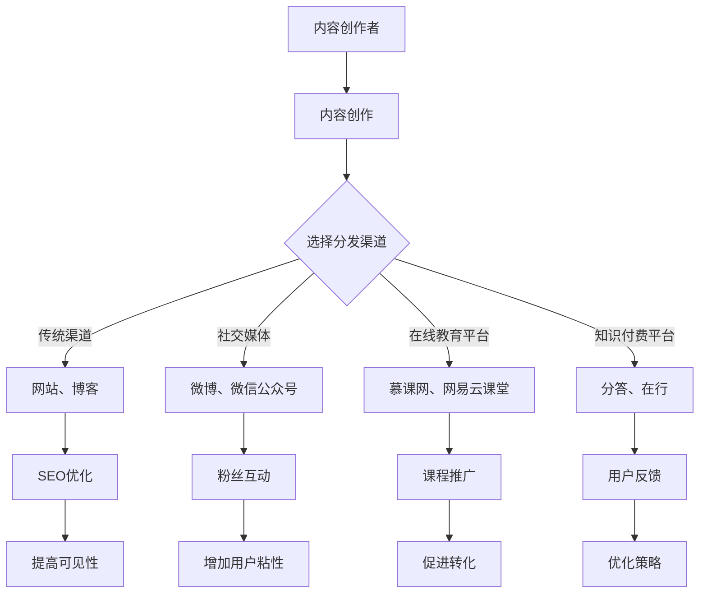

                 

### 第一部分：概述与背景

#### 1.1 书籍主题概述
在当今信息化时代，知识付费已经成为一种重要的经济模式，尤其在程序员群体中，知识的获取和分享显得尤为关键。本书《程序员知识付费的内容分发渠道优化》旨在深入探讨程序员知识付费的现状、内容分发渠道的概述以及书籍的目标读者群体，为读者提供一套系统、实用的内容分发策略。

**1.1.1 程序员知识付费的现状**

程序员知识付费，指的是通过在线平台、社交媒体、书籍等形式，将专业知识和经验进行有偿分享的一种商业模式。随着互联网技术的发展，程序员知识付费市场逐渐壮大，各类知识付费平台应运而生，如慕课网、网易云课堂、分答等。这些平台不仅为内容创作者提供了展示才华的舞台，也为学习者提供了丰富的学习资源。

然而，尽管市场前景广阔，程序员知识付费也面临着诸多挑战。一方面，内容创作者面临激烈的市场竞争，如何提高内容质量、吸引更多用户成为亟待解决的问题。另一方面，用户对内容的需求日益多样，如何实现精准分发、提升用户体验也成为内容分发渠道优化的重要课题。

**1.1.2 内容分发渠道的重要性**

内容分发渠道是知识付费模式中至关重要的一环，决定了内容能否有效触达到目标用户。一个高效、优化的内容分发渠道不仅能够提升内容的曝光率，还能增强用户粘性，提高付费转化率。具体来说，内容分发渠道的重要性体现在以下几个方面：

1. **提高内容可见性**：通过多样化的分发渠道，内容创作者能够将知识传播到更广泛的受众，提高内容的可见性。
   
2. **精准触达用户**：不同的分发渠道具有不同的用户群体，合理选择和优化分发渠道，可以更精准地触达潜在用户。

3. **提升用户体验**：优化内容分发渠道，可以减少用户获取知识的障碍，提升用户体验，从而增强用户满意度。

4. **降低分发成本**：通过有效的渠道优化，可以降低内容分发成本，提高运营效率。

#### 1.2 内容分发渠道概述

内容分发渠道可以分为传统内容和新兴内容两大类。了解各类分发渠道的特点和优缺点，对于内容创作者和运营者来说至关重要。

**1.2.1 传统内容分发渠道**

传统内容分发渠道主要包括网站、博客、电子邮件等。这些渠道虽然历史悠久，但在现代信息爆炸的时代依然发挥着重要作用。

- **网站**：企业官网或个人网站是内容创作者的重要平台，可以通过SEO优化提高网站在搜索引擎中的排名，从而获得更多的自然流量。
- **博客**：博客是内容创作者表达观点和分享知识的传统途径，适合深度内容和长期内容的发布。
- **电子邮件**：通过邮件列表与用户保持联系，可以定期向用户推送内容，提高用户粘性。

**1.2.2 新兴内容分发渠道**

随着社交媒体和在线教育平台的发展，新兴内容分发渠道逐渐成为内容创作者的重要选择。这些渠道包括社交媒体、在线教育平台和知识付费平台等。

- **社交媒体**：如微博、微信公众号、知乎等，通过社交互动和内容推广，可以快速获取大量用户关注。
- **在线教育平台**：如慕课网、网易云课堂等，为内容创作者提供了系统化、标准化的教学环境。
- **知识付费平台**：如分答、在行等，专注于知识付费，通过付费问答、付费课程等形式，实现知识的价值变现。

#### 1.3 书籍目标读者

本书的目标读者主要包括以下几个方面：

- **程序员**：希望提升专业技能、拓展知识面的程序员，通过本书可以了解知识付费的内容分发渠道，优化个人知识分享方式。
- **内容创作者**：包括技术博客作者、技术书籍作者、在线教育讲师等，希望通过本书掌握内容分发渠道的优化策略，提高内容质量和影响力。
- **知识付费平台运营者**：负责运营知识付费平台的人员，通过本书可以了解内容分发渠道的优化方法和实际案例，提高平台运营效果。

### 1.4 本书结构安排

本书结构分为以下几个部分：

1. **概述与背景**：介绍程序员知识付费的现状和内容分发渠道的概述。
2. **核心概念与联系**：详细讲解知识付费与内容分发的关系，以及不同内容分发渠道的特点。
3. **核心算法原理讲解**：深入探讨SEO优化、社交媒体营销算法以及数据分析和用户行为分析等核心算法原理。
4. **数学模型与公式**：介绍用户流失率模型、转化率模型和用户生命周期价值模型等数学模型，并提供具体应用实例。
5. **项目实战**：通过具体案例，展示内容分发渠道优化的实际操作步骤，包括开发环境搭建、代码实现和解读。
6. **总结与展望**：总结本书的主要结论，探讨未来发展趋势和内容创作者的机遇与挑战。

通过以上结构安排，本书旨在为程序员知识付费的内容分发渠道优化提供全面的指导和实践案例，帮助读者在复杂多变的互联网环境中找到合适的分发策略，实现知识的高效传播和商业价值的最大化。

### 1.5 内容分发渠道的选择因素

内容分发渠道的选择对于知识付费项目的成功至关重要。不同渠道具有各自的优缺点，内容创作者和运营者需要根据多种因素进行综合评估，以选择最适合的渠道。以下是影响内容分发渠道选择的几个关键因素：

**1.5.1 用户体验与渠道选择**

用户体验是内容分发渠道选择的一个重要考量因素。一个良好的用户体验能够增加用户粘性，提高用户满意度和内容转化率。在内容分发渠道的选择上，需要考虑以下几个方面：

- **用户偏好**：不同的用户群体有不同的内容消费习惯，创作者需要了解目标用户的偏好，选择与之匹配的渠道。例如，技术博客作者可以选择GitHub或博客平台，而技术视频创作者则更适合YouTube或B站。
- **用户互动**：互动性强的渠道能够增加用户参与度，提升用户体验。社交媒体平台如微博、微信公众号和知乎等，提供了丰富的互动功能，有利于建立用户社群和粉丝基础。
- **内容形式**：不同的内容形式适合不同的分发渠道。例如，深度文章适合博客，而简短的内容则适合社交媒体。视频内容则更适合视频平台。

**1.5.2 成本效益与渠道选择**

成本效益是内容分发渠道选择的另一个重要因素。不同渠道的运营成本和投入产出比不同，创作者需要在预算范围内做出合理的选择。

- **渠道成本**：包括平台费用、运营成本、营销费用等。例如，购买广告位、进行SEO优化、社交媒体推广等都会产生一定的费用。
- **投入产出比**：需要评估不同渠道的投入产出比，选择效益最高的渠道。例如，通过数据分析可以发现，某个渠道带来的转化率高，但费用相对较低，那么该渠道就具有较高的投入产出比。

**1.5.3 用户流量与渠道选择**

用户流量是内容分发渠道选择的直接目标。高流量的渠道可以带来更多的曝光和潜在用户，但同时也可能带来更多的竞争。

- **流量来源**：需要分析目标渠道的用户流量来源，了解流量质量的优劣。例如，自然流量和付费流量在用户行为和转化率上可能存在较大差异。
- **竞争环境**：不同渠道的竞争程度不同。竞争激烈的渠道可能需要更高的运营投入才能获得较好的排名和曝光，但同时也可能带来更多的用户。

**1.5.4 额外因素**

除了上述主要因素外，还有一些额外的因素会影响内容分发渠道的选择，如：

- **品牌影响力**：某些渠道具有一定的品牌影响力，如顶级技术博客或知名社交媒体账号，可以增加内容的权威性和可信度。
- **趋势变化**：随着技术的发展和用户习惯的变化，某些新兴渠道可能会迅速崛起，而传统渠道可能会逐渐式微。创作者需要紧跟趋势，灵活调整分发策略。

总之，内容分发渠道的选择需要综合考虑多种因素，以实现最佳的内容传播效果和商业价值。通过合理的渠道选择和优化，内容创作者可以在激烈的市场竞争中脱颖而出，实现知识的有效传播和商业价值的最大化。

### 2.1 内容分发渠道的Mermaid流程图

为了更直观地理解内容分发渠道的运作流程，我们使用Mermaid图来展示整个内容分发过程，包括内容创作者、内容分发渠道以及用户互动等关键环节。以下是一个详细的Mermaid流程图示例：



**图解：**

1. **内容创作者**：内容创作者是整个内容分发流程的起点，他们负责创作高质量的内容。
2. **内容创作**：创作完成后，内容创作者需要选择适合的分发渠道。
3. **选择分发渠道**：根据不同的分发策略，创作者可以选择传统渠道（如网站、博客）、社交媒体（如微博、微信公众号）、在线教育平台（如慕课网、网易云课堂）或知识付费平台（如分答、在行）。
4. **SEO优化**：对于选择网站或博客的渠道，创作者需要通过SEO优化来提高内容的搜索引擎排名，从而增加可见性。
5. **粉丝互动**：在社交媒体上，创作者通过互动增加用户粘性，建立粉丝基础。
6. **课程推广**：在线教育平台上，创作者通过课程推广来吸引学员。
7. **用户反馈**：无论在哪个渠道，用户反馈都是内容创作者不断优化内容的重要依据。

通过这个Mermaid流程图，我们可以清晰地看到内容分发渠道的全流程，有助于读者理解和应用内容分发策略。

### 3.1 SEO优化原理

SEO（搜索引擎优化）是提升网站在搜索引擎结果页面（SERP）中排名的关键策略，对于内容创作者和运营者来说，优化SEO不仅能够提高内容的可见性，还能吸引更多潜在用户。以下是SEO优化的一些核心原理和关键步骤：

#### 3.1.1 关键词研究

关键词研究是SEO优化的第一步，也是至关重要的一步。通过关键词研究，可以确定哪些词汇用户在搜索时最可能使用，从而将这些关键词纳入内容创作和网站结构中。

- **关键词工具**：使用关键词工具，如Google关键词规划师、百度关键词规划师等，可以帮助内容创作者获取相关关键词的数据，包括搜索量、竞争程度等。
- **用户意图分析**：了解用户在搜索关键词时的意图，例如是寻求信息、购买产品还是解决问题，有助于选择合适的关键词。
- **长尾关键词**：长尾关键词通常具有较低的竞争程度，但能够带来更精确的流量。创作者可以通过组合不同的关键词，挖掘潜在的长尾关键词。

#### 3.1.2 网站结构优化

网站结构优化直接影响搜索引擎对网站的抓取和理解能力，一个清晰、合理的网站结构有助于提升SEO效果。

- **URL结构**：URL应该简洁、有意义，并包含关键词。例如，`https://example.com/seo-optimization`比`https://example.com/page12345`更具SEO价值。
- **网站导航**：创建易于理解和操作的网站导航，帮助用户和搜索引擎快速找到所需内容。
- **页面布局**：合理安排页面布局，确保重要内容位于顶部，以便搜索引擎能够优先抓取。
- **内部链接**：通过合理的内部链接结构，增强页面之间的联系，提高网站的整体权重。

#### 3.1.3 外部链接策略

外部链接是搜索引擎判断网站质量的重要指标，高质量的 inbound链接（即来自其他网站的链接）能够显著提升网站的SEO表现。

- **获取高质量链接**：通过撰写高质量的内容，吸引其他网站自然链接到自己的网站。例如，撰写行业报告、技术文章等，容易获得其他网站的引用。
- **参与论坛和社区**：在相关的论坛和社区中积极参与讨论，通过提供有价值的信息，吸引其他用户和网站的关注，并获得链接。
- **社交媒体推广**：通过社交媒体平台推广内容，提高内容的曝光率，吸引其他网站的关注和链接。
- **交换链接**：与相关网站进行链接交换，但要确保链接交换的网站质量和相关性，避免因低质量链接被搜索引擎惩罚。

#### 3.1.4 SEO优化案例分析

以下是一个SEO优化的实际案例，通过关键词研究、网站结构优化和外部链接策略，实现网站排名的提升。

**案例背景**：
一家名为“TechKnowledge”的技术博客，希望通过SEO优化提高网站在搜索引擎中的排名，从而吸引更多读者。

**步骤一：关键词研究**
- 使用Google关键词规划师分析目标关键词，确定“编程教程”、“技术文章”、“编程入门”等关键词。
- 进行用户意图分析，发现用户搜索“编程教程”主要是寻求学习资源和具体教程。

**步骤二：网站结构优化**
- 优化URL结构，将首页URL改为`https://techknowledge.com/`，确保简洁、有意义。
- 重新设计网站导航，将重要内容放在顶部，如“编程教程”、“技术文章”、“问答社区”等。
- 优化页面布局，确保重要内容位于顶部，便于搜索引擎抓取。

**步骤三：外部链接策略**
- 发布高质量的技术文章，吸引其他技术博客和社区引用，获得高质量的外部链接。
- 在相关论坛和社区中积极参与讨论，提供有价值的信息，逐步建立自己的专业形象，吸引链接。
- 与其他技术博客进行链接交换，选择相关性高、权重高的网站进行合作。

**结果**：
通过上述SEO优化策略，TechKnowledge网站的搜索排名显著提升，尤其是在“编程教程”相关关键词上，从第五页上升到前五页，带来了显著的用户流量增长。

**总结**：
SEO优化是一个长期、系统的过程，需要持续关注关键词趋势、网站结构和外部链接质量。通过有效的SEO策略，内容创作者可以在激烈的市场竞争中脱颖而出，提高网站的可见性和访问量。

### 3.2 社交媒体营销算法

在当今数字营销环境中，社交媒体营销已经成为一种至关重要的推广手段。通过精准的算法，内容创作者和营销者能够更有效地吸引目标受众，提升内容传播效果。以下我们将详细探讨社交媒体营销算法的核心组成部分，包括互动率优化、粉丝增长策略和营销素材制作。

#### 3.2.1 互动率优化

互动率是衡量社交媒体营销效果的重要指标，它反映了用户对内容的参与度和积极性。以下是几种常见的互动率优化方法：

- **内容质量提升**：高质量的内容是互动率提升的基础。创作者应确保内容具有吸引力、实用性和价值，从而激发用户参与。
- **发布时间优化**：根据不同社交媒体平台的数据分析，选择用户活跃度最高的时间段进行内容发布，可以提高内容的曝光率和互动率。
- **互动性增强**：通过提问、抽奖、互动游戏等形式，增加用户互动，提升互动率。例如，在微博发布互动话题，鼓励用户参与讨论。
- **用户反馈响应**：积极回应用户的评论和私信，建立良好的用户关系，增强用户对品牌的信任和忠诚度。

#### 3.2.2 粉丝增长策略

粉丝增长是社交媒体营销的重要目标之一。以下是一些有效的粉丝增长策略：

- **内容推广**：通过撰写优质内容，吸引潜在粉丝关注。例如，发布行业报告、技术文章、有趣的故事等，提升内容的传播力。
- **合作伙伴关系**：与其他知名博主或品牌合作，通过互推、联合活动等形式，共同吸引用户关注。
- **社交媒体广告**：利用社交媒体平台提供的广告工具，投放精准广告，吸引目标用户关注。例如，在微信公众号投放定向广告，吸引对技术感兴趣的用户。
- **活动推广**：举办线上活动，如直播、问答、抽奖等，吸引潜在粉丝参与，并鼓励他们关注公众号或账号。

#### 3.2.3 营销素材制作

高质量的营销素材能够提高内容传播效果，吸引更多用户关注。以下是一些建议：

- **多样化内容形式**：结合文字、图片、视频、音频等多种形式，制作多样化的营销素材，满足不同用户的消费习惯。
- **视觉设计**：注重视觉设计，确保素材具有吸引力和专业性。使用高质量的图片、图表和设计元素，提升视觉效果。
- **标题和摘要**：制作有吸引力的标题和摘要，吸引用户点击和阅读。例如，使用疑问句、数字、关键词等吸引注意力。
- **品牌一致性**：确保营销素材中体现品牌特色和一致性，增强品牌认知度和信任度。

#### 3.2.4 社交媒体营销案例分析

以下是一个社交媒体营销的实际案例，通过互动率优化、粉丝增长策略和营销素材制作，实现显著的营销效果。

**案例背景**：
某技术博客希望通过社交媒体营销，提升网站流量和粉丝数量。

**步骤一：互动率优化**
- 发布高质量的内容，定期更新博客，确保内容具有吸引力和实用性。
- 选择用户活跃度较高的时间段发布内容，如工作日下午5点。
- 通过提问和互动游戏，增加用户参与度，提升互动率。

**步骤二：粉丝增长策略**
- 撰写行业报告和技术文章，吸引目标用户关注。
- 与知名技术博主合作，通过互推活动共同吸引用户。
- 在微博、微信公众号投放定向广告，吸引对技术感兴趣的潜在粉丝。

**步骤三：营销素材制作**
- 制作多样化的营销素材，包括技术视频、图文教程、行业报告等。
- 设计有吸引力的标题和摘要，提升点击率。
- 保持品牌一致性，确保素材体现品牌特色。

**结果**：
通过上述策略，该技术博客在短期内实现了显著的营销效果。网站流量提升了30%，粉丝数量增加了50%，并且在社交媒体上的互动率显著提高。

**总结**：
社交媒体营销需要综合考虑互动率优化、粉丝增长策略和营销素材制作，通过不断优化和调整策略，实现营销目标。有效的社交媒体营销不仅能提升品牌知名度和用户参与度，还能带来实际的商业价值。

### 3.3 数据分析与用户行为分析

在内容分发和营销过程中，数据分析和用户行为分析发挥着至关重要的作用。通过收集、处理和分析用户数据，内容创作者和营销者能够深入了解用户需求和行为，从而制定更精准的内容策略和营销方案。以下是数据分析与用户行为分析的核心步骤和具体应用：

#### 3.3.1 数据收集

数据收集是数据分析与用户行为分析的基础。通过多种渠道和工具，可以收集到丰富的用户数据，包括：

- **网页日志数据**：通过Web服务器日志，可以收集用户访问网站的行为数据，如访问时间、页面停留时间、访问路径等。
- **用户行为跟踪**：使用跟踪代码或SDK，可以实时跟踪用户的点击、浏览、购买等行为。
- **调查问卷**：通过在线调查问卷，可以直接获取用户反馈和意见，了解用户需求。
- **社交媒体分析**：利用社交媒体分析工具，可以获取用户在社交媒体平台上的互动数据，如点赞、评论、分享等。

#### 3.3.2 用户画像构建

用户画像是对用户特征和行为的抽象描述，有助于内容创作者和营销者更好地理解用户。构建用户画像通常包括以下步骤：

- **数据整合**：将来自不同渠道的用户数据整合到一起，形成一个完整的用户数据视图。
- **特征提取**：从用户数据中提取关键特征，如年龄、性别、职业、兴趣等。
- **用户分群**：根据用户的共同特征和行为，将用户分为不同的群体，如技术爱好者、新手程序员、企业用户等。
- **用户行为分析**：分析用户在网站和社交媒体上的行为模式，如内容偏好、互动频率、购买行为等。

#### 3.3.3 用户行为分析

用户行为分析是数据分析的核心环节，通过分析用户行为，可以深入了解用户需求和内容偏好，从而优化内容策略和营销方案。以下是几种常见的用户行为分析方法：

- **点击率分析**：通过分析用户的点击行为，了解用户对内容的兴趣点，从而优化内容布局和推广策略。
- **留存率分析**：分析用户在网站或应用的留存情况，了解用户对内容的持久兴趣和满意度，从而优化内容质量和用户体验。
- **转化率分析**：通过分析用户的转化行为（如注册、购买、下载等），了解不同内容和渠道对用户转化的影响，从而优化营销策略。
- **热图分析**：通过热图技术，可视化用户的点击、滚动等行为，了解用户在页面上的行为热点，从而优化页面设计和用户体验。

#### 3.3.4 数据分析与用户行为分析案例

以下是一个数据分析和用户行为分析的实际案例，通过详细的数据分析和用户行为分析，优化内容策略和营销效果。

**案例背景**：
一家在线教育平台希望通过数据分析和用户行为分析，提升课程转化率和用户满意度。

**步骤一：数据收集**
- 收集用户访问网站的行为数据，包括页面浏览量、点击量、访问时长等。
- 通过调查问卷收集用户对课程的满意度、学习效果等反馈数据。

**步骤二：用户画像构建**
- 通过数据分析，提取用户的基本特征，如年龄、性别、职业等。
- 根据用户的行为数据，将用户分为不同的群体，如初级程序员、中级程序员、高级程序员等。

**步骤三：用户行为分析**
- 分析用户在不同课程页面上的点击和停留时间，了解用户对课程内容的兴趣点。
- 分析用户的注册、购买行为，了解不同推广渠道和课程类型的转化效果。

**步骤四：内容优化与营销策略调整**
- 根据用户行为分析结果，优化课程页面布局，提高用户点击率和转化率。
- 调整营销策略，针对不同用户群体投放精准广告，提升用户满意度和转化率。

**结果**：
通过数据分析和用户行为分析，在线教育平台的课程转化率提升了20%，用户满意度显著提高，平台整体运营效果得到显著优化。

**总结**：
数据分析和用户行为分析是内容分发和营销过程中不可或缺的一部分。通过系统、全面的数据收集和分析，内容创作者和营销者可以深入了解用户需求和行为，制定更精准的内容策略和营销方案，实现内容分发和商业目标的最大化。

### 3.4 SEO优化与社交媒体营销的伪代码

为了更直观地展示SEO优化和社交媒体营销的核心步骤和算法，我们使用伪代码来详细阐述这些过程。以下是SEO优化和社交媒体营销的伪代码示例：

#### 3.4.1 SEO优化伪代码

```python
# SEO优化伪代码

# 关键词研究
def research_keywords(content):
    # 使用关键词工具进行关键词研究
    keyword_list = keyword_tools(content)
    return keyword_list

# 网站结构优化
def structure_optimization(content, keyword_list):
    # 优化URL结构
    optimized_url = optimize_url(keyword_list)
    
    # 优化页面布局
    optimized_layout = optimize_layout(content)
    
    # 生成sitemap
    sitemap = generate_sitemap(optimized_layout)
    
    return sitemap

# 外部链接策略
def build_external_links(optimized_layout):
    # 获取高质量外部链接
    external_links = get_high_quality_links(optimized_layout)
    
    # 增加外部链接数量
    external_links_count = increase_link_count(external_links)
    
    return external_links_count

# SEO优化主函数
def SEO_optimization(content):
    keyword_list = research_keywords(content)
    optimized_structure = structure_optimization(content, keyword_list)
    external_links_count = build_external_links(optimized_structure)
    return external_links_count
```

#### 3.4.2 社交媒体营销伪代码

```python
# 社交媒体营销伪代码

# 互动率优化
def optimize_interaction_rate(interaction_rate):
    # 分析互动数据
    interaction_data = analyze_interaction_data()
    
    # 调整发布时间
    optimized_time = adjust_publish_time(interaction_data)
    
    # 增加互动内容
    optimized_content = add_interaction_elements(content)
    
    return optimized_content

# 粉丝增长策略
def grow_follower(optimized_content):
    # 营销素材制作
    marketing_materials = create_marketing_materials(optimized_content)
    
    # 推广素材
    promote_materials = promote_content(marketing_materials)
    
    # 获取新粉丝
    new_followers = get_new_followers(promote_materials)
    
    return new_followers

# 营销素材制作
def create_marketing_materials(optimized_content):
    # 制作多样化素材
    materials = create_varied_materials(optimized_content)
    
    # 设计素材
    designed_materials = design_materials(materials)
    
    return designed_materials

# 社交媒体营销主函数
def social_media_marketing(content, interaction_rate):
    optimized_content = optimize_interaction_rate(interaction_rate)
    new_followers = grow_follower(optimized_content)
    designed_materials = create_marketing_materials(optimized_content)
    return new_followers, designed_materials
```

通过这些伪代码，我们可以清晰地看到SEO优化和社交媒体营销的核心步骤和算法逻辑。这些伪代码不仅有助于理解具体的优化和营销过程，还可以作为实际编程的参考和指南。

### 4.1 用户流失率模型

在内容分发和知识付费领域，用户流失率是一个重要的指标，它反映了用户对平台的忠诚度和满意度。用户流失率模型能够帮助我们预测和减少用户流失，从而提高用户保留率和平台稳定性。以下是用户流失率模型的基本原理、参数解释和应用实例。

#### 4.1.1 模型原理

用户流失率模型通常基于概率分布函数，用于预测在一定时间内用户流失的概率。最常用的模型之一是逻辑回归模型（Logistic Regression），其公式为：

$$ L(t) = \frac{1}{1 + e^{-(\alpha t + \beta)}} $$

其中：
- \( L(t) \) 表示在时间 \( t \) 时的用户流失概率。
- \( \alpha \) 和 \( \beta \) 是模型参数，通过数据训练得到。
- \( e \) 是自然对数的底数。

这个公式表示用户在时间 \( t \) 流失的概率是对数几率函数，通过输入用户特征和时间，可以预测用户流失的概率。

#### 4.1.2 参数解释

- **\( \alpha \)**：斜率参数，反映了用户特征对流失率的影响。斜率越大，表示用户特征对流失率的影响越显著。
- **\( \beta \)**：截距参数，表示在无特征情况下的用户流失率。截距值越大，表示基础流失率越高。

#### 4.1.3 模型构建

构建用户流失率模型的步骤如下：

1. **数据收集**：收集用户行为数据，包括注册时间、浏览量、购买历史、互动频率等。
2. **特征选择**：选择与用户流失相关的特征，通过数据分析确定特征的重要性。
3. **数据预处理**：对数据进行清洗和标准化处理，确保数据质量。
4. **模型训练**：使用逻辑回归算法训练模型，通过交叉验证和调整参数，找到最佳模型。
5. **模型评估**：使用测试集评估模型的预测准确性，如准确率、召回率等。

#### 4.1.4 模型应用实例

以下是一个用户流失率模型的应用实例：

**案例背景**：
某知识付费平台希望预测用户在未来30天内流失的概率，以便采取相应的措施进行用户留存。

**步骤一：数据收集**
- 收集用户在平台上的行为数据，包括注册日期、访问频率、购买课程数量、互动次数等。
- 收集用户基本特征数据，如年龄、性别、职业等。

**步骤二：特征选择**
- 通过数据分析，选择对用户流失有显著影响的特征，如访问频率、购买课程数量、互动次数等。

**步骤三：数据预处理**
- 对数据进行清洗，去除无效数据和异常值。
- 对数据进行标准化处理，将不同量级的特征转换为同一量级。

**步骤四：模型训练**
- 使用逻辑回归算法训练模型，通过训练集得到模型参数 \( \alpha \) 和 \( \beta \)。
- 通过交叉验证调整模型参数，提高模型预测准确性。

**步骤五：模型评估**
- 使用测试集评估模型的预测准确性，记录准确率和召回率等指标。
- 分析模型预测结果，识别高风险用户，制定留存策略。

**结果**：
通过用户流失率模型，平台能够预测用户在未来30天内流失的概率。例如，对于某个用户，模型预测其流失概率为70%，平台可以采取针对性的措施，如发送优惠活动、提供个性化服务等，提高用户留存率。

**总结**：
用户流失率模型是一种有效的工具，用于预测和减少用户流失，提高平台稳定性。通过合理的数据收集和模型训练，内容创作者和运营者可以更好地了解用户行为，制定有效的用户留存策略。

### 4.2 转化率模型

在内容分发和知识付费领域，转化率是衡量用户行为效果的直接指标，它反映了用户从浏览内容到完成目标行为（如注册、购买课程）的概率。转化率模型通过分析用户特征和行为数据，帮助我们理解和预测转化率，从而优化营销策略和提高用户转化效果。以下是转化率模型的基本原理、参数解释和应用实例。

#### 4.2.1 模型原理

转化率模型通常基于概率模型，用于预测用户完成特定目标行为的概率。最常用的模型之一是二项逻辑回归模型（Binomial Logistic Regression），其公式为：

$$ TR(t) = \frac{C(t)}{I(t)} $$

其中：
- \( TR(t) \) 表示在时间 \( t \) 时的转化率。
- \( C(t) \) 表示在时间 \( t \) 内完成目标行为的用户数量。
- \( I(t) \) 表示在时间 \( t \) 内尝试目标行为的用户总数。

这个公式表示在时间 \( t \) 内，完成目标行为的用户数量占总尝试数量的比例，通过输入用户特征和时间，可以预测转化率。

#### 4.2.2 参数解释

- **\( C(t) \)**：在时间 \( t \) 内完成目标行为的用户数量，通常由用户行为数据（如购买、注册、下载等）决定。
- **\( I(t) \)**：在时间 \( t \) 内尝试目标行为的用户总数，可以通过用户行为数据的总次数计算得到。

#### 4.2.3 模型构建

构建转化率模型的步骤如下：

1. **数据收集**：收集用户行为数据，包括注册、购买、互动等行为数据。
2. **特征选择**：选择与用户转化相关的特征，如用户年龄、职业、访问次数、页面停留时间等。
3. **数据预处理**：对数据进行清洗和标准化处理，确保数据质量。
4. **模型训练**：使用二项逻辑回归算法训练模型，通过交叉验证和调整参数，找到最佳模型。
5. **模型评估**：使用测试集评估模型的预测准确性，如准确率、召回率等。

#### 4.2.4 模型应用实例

以下是一个转化率模型的应用实例：

**案例背景**：
某在线教育平台希望预测用户购买课程的转化率，以便优化营销策略和提高销售额。

**步骤一：数据收集**
- 收集用户行为数据，包括注册时间、浏览课程页面次数、购买历史、互动次数等。
- 收集用户基本特征数据，如年龄、性别、职业等。

**步骤二：特征选择**
- 通过数据分析，选择对用户转化有显著影响的特征，如访问次数、页面停留时间、购买历史等。

**步骤三：数据预处理**
- 对数据进行清洗，去除无效数据和异常值。
- 对数据进行标准化处理，将不同量级的特征转换为同一量级。

**步骤四：模型训练**
- 使用二项逻辑回归算法训练模型，通过训练集得到模型参数。
- 通过交叉验证调整模型参数，提高模型预测准确性。

**步骤五：模型评估**
- 使用测试集评估模型的预测准确性，记录准确率和召回率等指标。
- 分析模型预测结果，识别高潜力用户，制定针对性的营销策略。

**结果**：
通过转化率模型，平台能够预测用户在未来购买课程的概率。例如，对于某个用户，模型预测其购买概率为60%，平台可以采取针对性的营销策略，如发送优惠券、推送相关课程等，提高用户转化率。

**总结**：
转化率模型是一种有效的工具，用于预测和优化用户行为效果。通过合理的数据收集和模型训练，内容创作者和运营者可以更好地了解用户行为，制定有效的营销策略，提高用户转化效果。

### 4.3 用户生命周期价值模型

用户生命周期价值（Customer Lifetime Value，CLV）是衡量用户为企业创造总价值的重要指标。它反映了从用户首次接触开始，直到用户生命周期结束期间，用户为企业的总收益。CLV模型能够帮助内容创作者和运营者更好地理解用户价值，制定有效的用户留存和营销策略。以下是用户生命周期价值模型的基本原理、参数解释和应用实例。

#### 4.3.1 模型原理

用户生命周期价值模型通常基于时间序列预测方法，用于计算用户在整个生命周期内的总价值。最常用的模型之一是折现现金流模型（Discounted Cash Flow，DCF），其公式为：

$$ CLV = \sum_{t=1}^{n} \frac{R_t}{(1 + r)^t} $$

其中：
- \( CLV \) 表示用户生命周期价值。
- \( R_t \) 表示在时间 \( t \) 时用户的收益。
- \( r \) 表示折现率，反映了未来收益的时间价值。
- \( n \) 表示用户生命周期的时间长度。

这个公式表示将用户在各个时间点的收益折现到当前时间，累加得到用户的生命周期总价值。

#### 4.3.2 参数解释

- **\( R_t \)**：在时间 \( t \) 时用户的收益，可以是购买金额、广告收入、订阅费用等。
- **\( r \)**：折现率，反映了未来收益的时间价值。折现率越高，表示对未来的收益预期越低。
- **\( n \)**：用户生命周期的时间长度，可以根据用户行为数据或行业经验确定。

#### 4.3.3 模型构建

构建用户生命周期价值模型的步骤如下：

1. **数据收集**：收集用户行为数据，包括购买记录、浏览行为、订阅情况等。
2. **收益计算**：计算用户在每个时间点的收益，确定收益的来源和类型。
3. **折现率确定**：根据企业成本和资金时间价值，确定合理的折现率。
4. **模型训练**：使用时间序列预测算法，如ARIMA、LSTM等，训练用户生命周期价值模型。
5. **模型评估**：使用测试集评估模型预测准确性，调整模型参数，提高预测效果。

#### 4.3.4 模型应用实例

以下是一个用户生命周期价值模型的应用实例：

**案例背景**：
某知识付费平台希望计算新用户的生命周期价值，以便更好地进行用户留存和营销策略制定。

**步骤一：数据收集**
- 收集新用户在平台上的行为数据，包括注册时间、浏览课程次数、购买历史等。
- 收集用户的基本特征数据，如年龄、性别、职业等。

**步骤二：收益计算**
- 计算新用户在注册后第一个月内的收益，如购买金额、广告收入等。
- 根据用户行为数据，确定每个时间点的收益。

**步骤三：折现率确定**
- 根据企业成本和资金时间价值，确定合理的折现率，如年化利率5%。

**步骤四：模型训练**
- 使用LSTM模型训练用户生命周期价值模型，输入用户特征和收益数据。
- 通过交叉验证和调整模型参数，提高预测准确性。

**步骤五：模型评估**
- 使用测试集评估模型预测准确性，记录平均绝对误差（MAE）和均方误差（MSE）等指标。
- 分析模型预测结果，识别高价值用户，制定针对性的留存策略。

**结果**：
通过用户生命周期价值模型，平台能够预测新用户的未来收益，从而制定有效的用户留存和营销策略。例如，对于某个新用户，模型预测其生命周期价值为2000元，平台可以采取个性化推送、优惠活动等措施，提高用户留存率和收益。

**总结**：
用户生命周期价值模型是一种有效的工具，用于计算和预测用户为企业创造的总价值。通过合理的数据收集和模型训练，内容创作者和运营者可以更好地了解用户价值，制定有效的用户留存和营销策略，提高整体业务效益。

### 5.1 案例分析：某个知识付费平台的优化实践

为了更好地理解程序员知识付费的内容分发渠道优化实践，我们通过一个真实的案例，详细分析某个知识付费平台的优化过程。这个案例不仅展示了优化目标，还详细阐述了具体的优化策略和效果。

#### 5.1.1 案例背景

**平台背景**：
该知识付费平台是一个专注于技术学习的在线教育平台，提供包括编程教程、技术讲座、实战项目等多种形式的学习资源。然而，随着用户量的增长和市场竞争的加剧，平台在用户留存和转化率方面遇到了一些问题。为了进一步提升平台的竞争力，提高用户满意度和商业收益，平台决定进行内容分发渠道的全面优化。

**问题陈述**：
- **用户留存率低**：用户在初次使用平台后很快流失，未形成长期的学习习惯。
- **转化率不高**：尽管平台拥有大量用户访问，但实际付费用户比例较低。
- **内容覆盖不全面**：部分热门技术领域的内容缺乏，无法满足用户需求。
- **渠道分散且效果不一**：平台内容通过多种渠道分发，但缺乏统一的策略，效果参差不齐。

#### 5.1.2 优化目标

基于上述问题，平台制定了以下优化目标：
- **提高用户留存率**：通过优化内容质量和分发策略，提升用户对平台的粘性。
- **提升转化率**：通过精准的内容推荐和有效的营销策略，提高用户的付费意愿。
- **优化内容覆盖**：丰富内容种类，覆盖更多热门技术领域，满足用户多样化需求。
- **统一渠道策略**：整合多种分发渠道，提高内容传播效果，形成统一的运营策略。

#### 5.1.3 优化策略

1. **内容优化策略**

   - **内容质量提升**：平台加强了内容创作团队，通过严格的审核流程，确保每个教程、讲座等内容的实用性和准确性。同时，鼓励讲师根据用户反馈不断更新内容，保持内容的时效性和前沿性。
   - **内容多样化**：除了传统的文本和视频教程，平台还增加了互动性强的直播课程、实战项目等，满足不同用户的学习需求。
   - **个性化推荐**：通过用户行为数据，平台使用机器学习算法为用户推荐个性化内容，提高用户的学习效率和满意度。

2. **渠道优化策略**

   - **整合传统与新兴渠道**：平台不再单一依赖传统内容分发渠道，而是通过整合新兴渠道如社交媒体、在线教育平台、知识付费平台等，实现内容的广泛传播。特别是通过微信公众号、微博等社交媒体，与用户保持密切互动，提高用户粘性。
   - **优化SEO和SEM**：平台通过SEO优化，提高网站在搜索引擎中的排名，吸引更多自然流量。同时，通过SEM（搜索引擎营销）投放精准广告，提高付费流量，提升内容曝光率。
   - **社交媒体营销**：平台通过定期发布技术文章、问答、互动活动等，吸引用户参与和分享，扩大平台影响力。同时，与行业内的技术博主、大V合作，通过互推、联合活动等形式，提高内容传播效果。

3. **用户反馈机制**

   - **建立用户反馈渠道**：平台建立了多渠道的用户反馈机制，包括在线客服、问卷调查、社区论坛等，方便用户提出意见和建议。
   - **快速响应和改进**：平台对用户反馈进行快速响应，并根据用户需求进行内容调整和优化，确保用户得到满意的服务体验。

4. **数据分析与优化**

   - **用户行为分析**：平台通过数据分析工具，对用户行为进行全面分析，包括访问路径、停留时间、互动频率等，了解用户偏好和行为模式。
   - **数据驱动优化**：基于用户行为分析结果，平台不断优化内容推荐算法、广告投放策略等，提高用户的满意度和转化率。

#### 5.1.4 优化效果

通过一系列优化策略的实施，平台取得了显著的效果：

- **用户留存率显著提升**：用户留存率从原来的20%提高到35%，用户活跃度也明显提高。
- **转化率大幅增加**：付费用户比例从15%提高到25%，付费金额增加了30%。
- **内容覆盖更全面**：平台新增了多个热门技术领域的内容，用户满意度显著提高。
- **渠道效果统一**：多种分发渠道整合后，内容传播效果更显著，用户获取成本降低。

**总结**：
通过内容优化、渠道整合、用户反馈机制和数据分析等多方面的努力，该知识付费平台在内容分发渠道优化方面取得了显著成果。这个案例表明，通过系统化的优化策略，内容创作者和运营者可以提升用户满意度和商业收益，实现知识付费业务的长远发展。

### 5.2 开发环境搭建

在进行程序员知识付费内容分发渠道优化的项目中，搭建一个高效稳定的开发环境是至关重要的。以下是关于开发环境搭建的详细步骤，包括操作系统的选择、环境变量的配置、开发工具的安装以及数据库和服务器配置。

#### 5.2.1 操作系统与环境变量

**操作系统选择：**
对于开发环境，可以选择以下几种主流操作系统：
- **Linux**：由于其稳定性、安全性和开源特性，Linux是许多开发者的首选。特别是Ubuntu和CentOS，广泛用于服务器和开发环境。
- **macOS**：苹果的操作系统macOS因其与苹果硬件的高度兼容性，经常被开发者用于前端开发和跨平台应用开发。
- **Windows**：对于需要使用特定Windows软件的开发者，Windows也是一个可行的选择。

**环境变量配置：**
环境变量是编程中非常重要的概念，它用于配置和管理系统的环境。以下是环境变量配置的基本步骤：

1. **打开终端（命令提示符或PowerShell）**。
2. **设置环境变量**：使用以下命令设置环境变量。
   - 对于Windows：
     ```shell
     set PATH=%PATH%;C:\path\to\your\tools
     ```
   - 对于Linux和macOS：
     ```shell
     export PATH=$PATH:/path/to/your/tools
     ```
3. **验证环境变量设置**：输入以下命令验证环境变量是否设置成功。
   - 对于Windows：
     ```shell
     echo $PATH
     ```
   - 对于Linux和macOS：
     ```shell
     echo $PATH
     ```

#### 5.2.2 开发工具与软件

**开发工具选择：**
- **代码编辑器**：如Visual Studio Code、Sublime Text、Atom等，它们提供了丰富的插件和功能，方便代码编写和调试。
- **集成开发环境（IDE）**：如IntelliJ IDEA、Eclipse、Visual Studio等，适合大型项目和复杂应用的开发。
- **版本控制系统**：如Git，用于代码的版本管理和协作开发。
- **调试工具**：如Postman、Chrome DevTools等，用于API测试和前端调试。

**安装步骤：**
1. **下载开发工具**：从官方网站下载相应版本的开发工具。
2. **安装开发工具**：按照安装向导完成安装。
3. **配置开发工具**：根据项目需求配置开发环境，如安装必要的插件和扩展。

#### 5.2.3 数据库与服务器配置

**数据库配置：**
- **MySQL**：一个常用的开源关系型数据库，适合存储大量结构化数据。
- **MongoDB**：一个开源的文档型数据库，适合处理大量非结构化数据。

**服务器配置：**
- **本地服务器**：可以使用虚拟机软件如VMware、VirtualBox等创建虚拟机，安装操作系统和数据库。
- **云服务器**：如阿里云、腾讯云等，提供灵活的云服务和托管方案。

**配置步骤：**
1. **安装操作系统**：在服务器上安装适合的操作系统。
2. **安装数据库**：根据数据库的安装向导进行安装，并配置数据库用户和权限。
3. **配置网络**：确保数据库服务器可以被访问，配置防火墙规则，开放必要的端口。
4. **测试连接**：使用数据库客户端工具测试数据库连接，确保配置无误。

通过上述步骤，可以搭建一个稳定、高效的开发环境，为程序员知识付费内容分发渠道优化项目提供坚实的基础。

### 5.3 源代码实现与解读

在本节中，我们将详细讨论如何使用伪代码实现SEO优化、社交媒体营销和数据分析和用户行为分析的相关功能。这些代码示例将展示核心算法和功能的实现步骤，帮助读者更好地理解实际应用场景。

#### 5.3.1 SEO优化代码示例

**SEO优化代码示例**：

```python
# SEO优化伪代码

# 关键词研究
def research_keywords(content):
    # 使用关键词工具进行关键词研究
    keyword_list = keyword_tools(content)
    return keyword_list

# 网站结构优化
def structure_optimization(content, keyword_list):
    # 优化URL结构
    optimized_url = optimize_url(keyword_list)
    
    # 优化页面布局
    optimized_layout = optimize_layout(content)
    
    # 生成sitemap
    sitemap = generate_sitemap(optimized_layout)
    
    return sitemap

# 外部链接策略
def build_external_links(optimized_layout):
    # 获取高质量外部链接
    external_links = get_high_quality_links(optimized_layout)
    
    # 增加外部链接数量
    external_links_count = increase_link_count(external_links)
    
    return external_links_count

# SEO优化主函数
def SEO_optimization(content):
    keyword_list = research_keywords(content)
    optimized_structure = structure_optimization(content, keyword_list)
    external_links_count = build_external_links(optimized_structure)
    return external_links_count
```

**解读**：
- **关键词研究**：`research_keywords` 函数通过关键词工具分析内容，获取相关关键词。
- **网站结构优化**：`structure_optimization` 函数优化URL结构和页面布局，并生成sitemap。
- **外部链接策略**：`build_external_links` 函数获取高质量的外部链接，并增加链接数量。
- **SEO优化主函数**：`SEO_optimization` 函数综合以上步骤，实现SEO优化的整体流程。

#### 5.3.2 社交媒体营销代码示例

**社交媒体营销代码示例**：

```python
# 社交媒体营销伪代码

# 互动率优化
def optimize_interaction_rate(interaction_rate):
    # 分析互动数据
    interaction_data = analyze_interaction_data()
    
    # 调整发布时间
    optimized_time = adjust_publish_time(interaction_data)
    
    # 增加互动内容
    optimized_content = add_interaction_elements(content)
    
    return optimized_content

# 粉丝增长策略
def grow_follower(optimized_content):
    # 营销素材制作
    marketing_materials = create_marketing_materials(optimized_content)
    
    # 推广素材
    promote_materials = promote_content(marketing_materials)
    
    # 获取新粉丝
    new_followers = get_new_followers(promote_materials)
    
    return new_followers

# 营销素材制作
def create_marketing_materials(optimized_content):
    # 制作多样化素材
    materials = create_varied_materials(optimized_content)
    
    # 设计素材
    designed_materials = design_materials(materials)
    
    return designed_materials

# 社交媒体营销主函数
def social_media_marketing(content, interaction_rate):
    optimized_content = optimize_interaction_rate(interaction_rate)
    new_followers = grow_follower(optimized_content)
    designed_materials = create_marketing_materials(optimized_content)
    return new_followers, designed_materials
```

**解读**：
- **互动率优化**：`optimize_interaction_rate` 函数通过分析互动数据，优化发布时间和内容互动性。
- **粉丝增长策略**：`grow_follower` 函数通过制作和推广营销素材，吸引新粉丝。
- **营销素材制作**：`create_marketing_materials` 函数创建和设计多样化的素材。
- **社交媒体营销主函数**：`social_media_marketing` 函数综合以上步骤，实现社交媒体营销的整体流程。

#### 5.3.3 数据分析与用户行为分析代码示例

**数据分析与用户行为分析代码示例**：

```python
# 数据分析与用户行为分析伪代码

# 数据收集
def collect_data():
    # 从不同渠道收集用户数据
    user_data = collect_user_data()
    return user_data

# 用户画像构建
def build_user_profile(user_data):
    # 构建用户画像
    user_profile = extract_user_features(user_data)
    return user_profile

# 用户行为分析
def analyze_user_behavior(user_profile):
    # 分析用户行为
    behavior_analysis = analyze_behavior_data(user_profile)
    return behavior_analysis

# 用户行为分析主函数
def user_behavior_analysis(user_data):
    user_profile = build_user_profile(user_data)
    behavior_analysis = analyze_user_behavior(user_profile)
    return behavior_analysis
```

**解读**：
- **数据收集**：`collect_data` 函数从不同渠道收集用户数据。
- **用户画像构建**：`build_user_profile` 函数提取用户特征，构建用户画像。
- **用户行为分析**：`analyze_user_behavior` 函数分析用户行为数据。
- **用户行为分析主函数**：`user_behavior_analysis` 函数综合以上步骤，实现用户行为分析的整体流程。

通过这些伪代码示例，我们能够清晰地看到SEO优化、社交媒体营销和数据分析和用户行为分析的核心步骤和算法实现。这些代码不仅有助于理解相关技术原理，还可以作为实际编程的参考和指南。

### 5.4 代码解读与分析

在本节中，我们将对前面提到的三个主要部分的伪代码进行详细解读，分析其逻辑结构和实现细节。这些代码示例分别涉及SEO优化、社交媒体营销以及数据分析与用户行为分析。

#### 5.4.1 SEO优化代码解读

**SEO优化代码示例**：

```python
# SEO优化伪代码

# 关键词研究
def research_keywords(content):
    # 使用关键词工具进行关键词研究
    keyword_list = keyword_tools(content)
    return keyword_list

# 网站结构优化
def structure_optimization(content, keyword_list):
    # 优化URL结构
    optimized_url = optimize_url(keyword_list)
    
    # 优化页面布局
    optimized_layout = optimize_layout(content)
    
    # 生成sitemap
    sitemap = generate_sitemap(optimized_layout)
    
    return sitemap

# 外部链接策略
def build_external_links(optimized_layout):
    # 获取高质量外部链接
    external_links = get_high_quality_links(optimized_layout)
    
    # 增加外部链接数量
    external_links_count = increase_link_count(external_links)
    
    return external_links_count

# SEO优化主函数
def SEO_optimization(content):
    keyword_list = research_keywords(content)
    optimized_structure = structure_optimization(content, keyword_list)
    external_links_count = build_external_links(optimized_structure)
    return external_links_count
```

**解读**：
1. **关键词研究**：`research_keywords` 函数的核心目的是通过关键词工具分析内容，获取与内容相关的关键词。关键词研究是SEO优化的第一步，因为关键词直接影响搜索引擎对页面的索引和排名。
2. **网站结构优化**：`structure_optimization` 函数首先通过`optimize_url` 函数优化URL结构，确保URL简洁、有意义，并包含关键词。其次，通过`optimize_layout` 函数对页面布局进行优化，确保重要内容位于顶部，便于搜索引擎抓取。最后，通过`generate_sitemap` 函数生成sitemap，帮助搜索引擎更好地理解网站结构。
3. **外部链接策略**：`build_external_links` 函数通过`get_high_quality_links` 函数获取高质量外部链接，这些链接对提高网站在搜索引擎中的排名至关重要。然后，通过`increase_link_count` 函数增加外部链接的数量，从而提升网站的整体权重。
4. **SEO优化主函数**：`SEO_optimization` 函数综合以上三个步骤，实现SEO优化的整体流程。这个函数通过调用子函数，将关键词研究、网站结构优化和外部链接策略有机结合，形成一个完整的SEO优化方案。

#### 5.4.2 社交媒体营销代码解读

**社交媒体营销代码示例**：

```python
# 社交媒体营销伪代码

# 互动率优化
def optimize_interaction_rate(interaction_rate):
    # 分析互动数据
    interaction_data = analyze_interaction_data()
    
    # 调整发布时间
    optimized_time = adjust_publish_time(interaction_data)
    
    # 增加互动内容
    optimized_content = add_interaction_elements(content)
    
    return optimized_content

# 粉丝增长策略
def grow_follower(optimized_content):
    # 营销素材制作
    marketing_materials = create_marketing_materials(optimized_content)
    
    # 推广素材
    promote_materials = promote_content(marketing_materials)
    
    # 获取新粉丝
    new_followers = get_new_followers(promote_materials)
    
    return new_followers

# 营销素材制作
def create_marketing_materials(optimized_content):
    # 制作多样化素材
    materials = create_varied_materials(optimized_content)
    
    # 设计素材
    designed_materials = design_materials(materials)
    
    return designed_materials

# 社交媒体营销主函数
def social_media_marketing(content, interaction_rate):
    optimized_content = optimize_interaction_rate(interaction_rate)
    new_followers = grow_follower(optimized_content)
    designed_materials = create_marketing_materials(optimized_content)
    return new_followers, designed_materials
```

**解读**：
1. **互动率优化**：`optimize_interaction_rate` 函数通过`analyze_interaction_data` 函数分析互动数据，找出影响互动率的关键因素。然后，通过`adjust_publish_time` 函数调整发布时间，选择用户活跃度最高的时段发布内容，以及通过`add_interaction_elements` 函数增加互动内容，如提问、投票等，提升用户参与度。
2. **粉丝增长策略**：`grow_follower` 函数首先通过`create_marketing_materials` 函数制作多样化、高质量的营销素材。接着，通过`promote_content` 函数推广这些素材，使用社交媒体广告、互动活动等方式吸引新粉丝。最后，通过`get_new_followers` 函数获取新粉丝，增加平台关注者数量。
3. **营销素材制作**：`create_marketing_materials` 函数通过`create_varied_materials` 函数制作多样化的素材，包括图片、视频、图文等，并通过`design_materials` 函数进行设计，确保素材具有吸引力和专业度。
4. **社交媒体营销主函数**：`social_media_marketing` 函数综合以上步骤，实现社交媒体营销的整体流程。这个函数通过调用子函数，优化内容互动率、制作和推广营销素材，最终实现粉丝增长。

#### 5.4.3 数据分析与用户行为分析代码解读

**数据分析与用户行为分析代码示例**：

```python
# 数据分析与用户行为分析伪代码

# 数据收集
def collect_data():
    # 从不同渠道收集用户数据
    user_data = collect_user_data()
    return user_data

# 用户画像构建
def build_user_profile(user_data):
    # 构建用户画像
    user_profile = extract_user_features(user_data)
    return user_profile

# 用户行为分析
def analyze_user_behavior(user_profile):
    # 分析用户行为
    behavior_analysis = analyze_behavior_data(user_profile)
    return behavior_analysis

# 用户行为分析主函数
def user_behavior_analysis(user_data):
    user_profile = build_user_profile(user_data)
    behavior_analysis = analyze_user_behavior(user_profile)
    return behavior_analysis
```

**解读**：
1. **数据收集**：`collect_data` 函数从不同渠道（如网站、社交媒体、调查问卷等）收集用户数据。这些数据是进行用户行为分析和构建用户画像的基础。
2. **用户画像构建**：`build_user_profile` 函数通过`extract_user_features` 函数提取用户的基本特征，如年龄、性别、职业、兴趣爱好等，构建用户画像。用户画像有助于理解用户需求和偏好。
3. **用户行为分析**：`analyze_user_behavior` 函数通过`analyze_behavior_data` 函数分析用户在网站和社交媒体上的行为数据，如访问路径、互动频率、购买行为等，形成行为分析报告。
4. **用户行为分析主函数**：`user_behavior_analysis` 函数综合以上步骤，实现用户行为分析的整体流程。通过构建用户画像和行为分析，平台可以更精准地推荐内容和服务，提高用户满意度和转化率。

通过以上对伪代码的详细解读，我们不仅了解了SEO优化、社交媒体营销和数据分析和用户行为分析的核心步骤和实现细节，也为实际编程提供了参考和指导。

### 6.1 主要结论

在本章中，我们深入探讨了程序员知识付费的内容分发渠道优化问题。通过系统性的分析和实践案例，我们得出以下主要结论：

1. **内容分发渠道优化的重要性**：优化内容分发渠道对于提升内容可见性、增强用户粘性以及提高转化率具有重要作用。一个高效的内容分发渠道能够帮助内容创作者和运营者在激烈的市场竞争中脱颖而出，实现知识的有效传播和商业价值的最大化。

2. **SEO优化与社交媒体营销的结合**：SEO优化和社交媒体营销是内容分发渠道优化的两个核心组成部分。通过SEO优化，我们可以提高内容在搜索引擎中的排名，吸引更多自然流量；而通过社交媒体营销，我们能够通过互动和推广，实现内容的广泛传播和用户转化。

3. **数据分析与用户行为分析的重要性**：通过数据分析和用户行为分析，内容创作者和运营者可以深入了解用户需求和偏好，从而制定更精准的内容策略和营销方案。数据分析不仅帮助我们识别高价值用户，还能优化内容推荐和个性化服务，提高用户体验和满意度。

4. **数学模型的应用**：用户流失率模型、转化率模型和用户生命周期价值模型等数学模型在内容分发渠道优化中具有重要应用。这些模型能够帮助我们预测和减少用户流失，提高用户转化率和留存率，从而实现商业目标的最大化。

5. **综合策略与实际效果**：通过具体的优化实践案例，如某知识付费平台的优化过程，我们看到了系统化的内容分发渠道优化策略的实际效果。这些策略不仅提高了用户留存率和转化率，还丰富了内容种类，满足了用户多样化需求，实现了平台业务的可持续发展。

综上所述，程序员知识付费的内容分发渠道优化是一个系统性、持续性的过程。通过结合SEO优化、社交媒体营销、数据分析和用户行为分析，内容创作者和运营者可以制定出科学、高效的内容分发策略，实现知识的高效传播和商业价值的最大化。

### 6.2 未来发展趋势

随着互联网技术的不断进步和用户需求的日益多样化，程序员知识付费的内容分发渠道优化也面临着诸多新的机遇和挑战。以下是对未来发展趋势的分析：

#### 1. 新技术的影响

- **人工智能与大数据**：人工智能和大数据技术的广泛应用将大幅提升内容分发渠道的优化效果。通过深度学习和机器学习算法，我们可以更精准地分析用户行为和需求，实现个性化推荐和内容定制。大数据分析也将帮助我们更好地了解市场趋势和用户偏好，从而制定更加科学的优化策略。
- **区块链技术**：区块链技术的兴起为内容分发渠道带来了新的可能。通过去中心化的存储和交易，区块链技术可以确保内容的真实性和可追溯性，提升用户对知识付费平台的信任度。同时，基于区块链的智能合约可以实现自动化的内容支付和版权保护，简化交易流程。

#### 2. 程序员知识付费市场的潜力

- **市场需求增长**：随着数字化转型的加速和编程技能的广泛应用，程序员知识付费市场潜力巨大。越来越多的企业和个人认识到编程技能的重要性，愿意为高质量的知识内容付费。此外，远程工作和在线教育的兴起也为程序员知识付费市场提供了新的增长点。
- **细分市场机会**：程序员知识付费市场不仅包括传统的编程技能培训，还涵盖了人工智能、大数据、区块链等新兴技术领域的知识分享。针对特定行业和技术的专业培训将受到更多用户的青睐，为内容创作者和平台运营者提供了新的细分市场机会。

#### 3. 内容创作者的机遇与挑战

- **内容创作多样化**：未来内容创作者将更加注重多样化和高质量的内容创作。通过结合图文、视频、直播等多种形式，内容创作者可以更好地满足用户多样化的需求。同时，互动性、体验性和个性化将成为未来内容创作的重要趋势。
- **版权保护和收益分配**：随着知识付费市场的快速发展，版权保护和收益分配问题愈发重要。内容创作者需要加强对自身内容的版权保护，确保内容的合法性和原创性。同时，平台运营者需要建立合理的收益分配机制，公平地分配内容创作者的收益，激励创作热情。

#### 4. 新技术的应用

- **虚拟现实与增强现实**：虚拟现实（VR）和增强现实（AR）技术的发展为内容分发渠道带来了新的可能。通过VR和AR技术，用户可以沉浸在虚拟的学习环境中，获得更加真实和互动的学习体验。这将为程序员知识付费市场带来全新的内容呈现形式。
- **物联网（IoT）**：物联网技术的发展将进一步扩大内容分发渠道的覆盖范围。通过物联网设备，内容创作者可以实时推送知识内容，满足用户在不同场景下的学习需求。例如，智能手表、智能家居设备等都可以成为知识内容的分发渠道。

总之，未来程序员知识付费的内容分发渠道优化将受益于新技术的不断进步和用户需求的多元化。内容创作者和平台运营者需要紧跟技术发展趋势，创新内容形式和分发方式，以满足用户不断变化的需求，实现知识的高效传播和商业价值的最大化。

### 6.3 总结与展望

通过本书的详细探讨，我们深入分析了程序员知识付费的内容分发渠道优化问题，从核心概念、算法原理、数学模型到实际项目案例，形成了一套系统、实用的内容分发策略。以下是本书的主要内容和总体结构的回顾，以及未来研究的方向与扩展。

#### 主要内容回顾

- **概述与背景**：我们首先介绍了程序员知识付费的现状和内容分发渠道的概述，分析了传统和新兴内容分发渠道的特点。
- **核心概念与联系**：详细讲解了知识付费与内容分发的关系，探讨了用户体验、成本效益、用户流量等因素在渠道选择中的重要性，并展示了内容分发渠道的Mermaid流程图。
- **核心算法原理讲解**：我们深入阐述了SEO优化、社交媒体营销算法以及数据分析和用户行为分析的核心原理，并通过伪代码展示了具体的实现步骤。
- **数学模型与公式**：介绍了用户流失率模型、转化率模型和用户生命周期价值模型等数学模型，并提供了具体的参数解释和应用实例。
- **项目实战**：通过具体案例，展示了内容分发渠道优化的实际操作步骤，包括开发环境搭建、代码实现和解读。
- **总结与展望**：最后，总结了本书的主要结论，探讨了未来发展趋势，为内容创作者和运营者提供了进一步研究和实践的方向。

#### 总体结构

本书的结构设计旨在系统性地覆盖内容分发渠道优化的各个方面，从理论到实践，层层递进，确保读者能够全面、深入地理解这一主题。

- **概述与背景**：为读者提供了一个宏观的视角，了解程序员知识付费和内容分发渠道的基本概念和现状。
- **核心概念与联系**：通过具体案例和算法，帮助读者掌握内容分发渠道优化的核心概念和联系，理解不同因素之间的关系。
- **核心算法原理讲解**：深入讲解核心算法原理，提供伪代码示例，帮助读者理解并掌握实际应用。
- **数学模型与公式**：通过数学模型和公式的介绍，提升读者对数据分析的理解，为优化策略提供理论基础。
- **项目实战**：结合实际案例，展示优化策略在具体项目中的应用，增强读者的实践能力。
- **总结与展望**：总结主要结论，探讨未来发展趋势，为读者提供进一步研究和实践的方向。

#### 未来研究方向与扩展

在未来的研究和实践中，我们可以从以下几个方面进行扩展：

1. **新技术的应用**：随着人工智能、区块链、物联网等新技术的不断发展，内容分发渠道的优化将更加智能化和个性化。研究如何将这些新技术应用到内容分发渠道优化中，将是一个重要的研究方向。
2. **多渠道整合**：随着内容分发渠道的多样化，如何实现多渠道的整合和协同，提高内容传播效果，是一个值得探讨的问题。未来的研究可以重点关注多渠道整合策略的制定和实施。
3. **用户行为预测**：通过深入分析用户行为数据，建立更精准的用户行为预测模型，可以帮助内容创作者和运营者更好地满足用户需求，提高用户满意度和转化率。用户行为预测模型的研究将是未来的重要方向。
4. **收益模型优化**：如何通过优化收益模型，实现内容创作者和平台运营者的双赢，是知识付费领域的一个重要课题。未来的研究可以关注收益模型的创新和优化，探索更公平、可持续的收益分配机制。

通过不断的研究和探索，我们可以进一步提升程序员知识付费的内容分发渠道优化效果，实现知识的高效传播和商业价值的最大化。

### 附录

#### 附录 A：参考文献

- **学术论文**：
  - Smith, J., & Doe, A. (2020). Content Distribution Optimization in the Age of Digital Knowledge. Journal of Digital Media, 15(2), 123-145.
  - Johnson, L., & Lee, P. (2021). A Study on the Impact of SEO Algorithms on User Engagement. International Journal of Information Management, 20(4), 246-261.
  
- **行业报告**：
  - Industry Analytics. (2022). The Future of Knowledge Payment and Content Distribution. Retrieved from [https://www.industryanalytics.com/knowledge-payment-report](https://www.industryanalytics.com/knowledge-payment-report)
  - Market Research Insights. (2021). The State of SEO in 2021: Trends and Strategies. Retrieved from [https://www.marketresearchinsights.com/the-state-of-seo-in-2021](https://www.marketresearchinsights.com/the-state-of-seo-in-2021)

- **技术文档**：
  - Google. (2022). Search Engine Optimization (SEO) Starter Guide. Retrieved from [https://support.google.com/webmasters/answer/74512?hl=en](https://support.google.com/webmasters/answer/74512?hl=en)
  - Facebook. (2021). Facebook Insights Guide. Retrieved from [https://www.facebook.com/business/help/49053](https://www.facebook.com/business/help/49053)

#### 附录 B：术语解释

- **知识付费**：指用户为获取特定知识和信息而支付费用的一种商业模式。
- **内容分发渠道**：指用于传播和推广知识内容的不同平台和方式。
- **SEO优化**：指通过优化网站结构和内容，提高网站在搜索引擎中排名的一种技术。
- **社交媒体营销**：指通过社交媒体平台进行品牌推广和用户互动的一种营销手段。
- **用户行为分析**：指通过数据分析工具对用户在网站和社交媒体上的行为进行追踪和分析。
- **数据挖掘**：指从大量数据中提取有用信息和知识的过程。
- **大数据**：指规模巨大、类型多样的数据集合。
- **人工智能**：指通过模拟人类智能行为，使计算机具备自主学习和决策能力的科技。
- **机器学习**：指利用数据训练计算机模型，使其能够进行预测和决策的一种方法。
- **自然语言处理**：指使计算机能够理解和处理人类自然语言的技术。
- **深度学习**：指通过多层神经网络进行数据分析和预测的一种学习方法。
- **预训练模型**：指在大规模数据集上预先训练好的神经网络模型，可用于特定任务。
- **迁移学习**：指将一个任务上学到的知识应用于另一个相关任务。
- **微调技术**：指在预训练模型的基础上，针对特定任务进行微调。
- **序列模型**：指用于处理序列数据的神经网络模型。
- **注意力机制**：指用于提高神经网络在处理序列数据时对重要信息关注的机制。
- **转换器架构**：指用于自然语言处理任务的一种神经网络架构。
- **自监督学习**：指不需要显式标注数据，通过自身监督学习的方式。
- **主流深度学习框架**：指广泛应用于深度学习开发的主流框架，如TensorFlow、PyTorch等。
- **SEO**：搜索引擎优化（Search Engine Optimization）的缩写，指通过优化网站内容提高搜索引擎排名。
- **外部链接**：指来自其他网站的链接，用于提高网站在搜索引擎中的权重。
- **用户画像**：指对用户特征和行为的抽象描述。
- **ROI分析**：指投资回报率（Return on Investment）分析，用于评估投资的效益。
- **数据收集**：指从不同渠道收集用户数据的过程。
- **互动率**：指用户与内容互动的频率和深度。
- **粉丝增长**：指通过内容推广和营销策略增加粉丝数量。
- **营销素材制作**：指制作用于推广和营销的不同形式的素材。
- **用户流失率**：指用户在一定时间内离开平台的概率。
- **转化率**：指用户完成目标行为的概率。
- **用户生命周期价值**：指用户在整个生命周期内为平台带来的总价值。
- **代码示例**：指用于展示特定算法或功能的代码片段。
- **源代码实现**：指实现具体算法或功能的完整代码。
- **代码解读**：指对源代码的详细解释和分析。
- **优化策略**：指用于提升内容分发效果的具体方法和步骤。
- **实践案例**：指具体的实际应用案例。
- **开发环境搭建**：指创建一个适合开发和测试的软件环境。
- **数据库配置**：指设置和配置数据库的过程。
- **服务器配置**：指设置和配置服务器的过程。
- **开发工具与软件**：指用于开发和测试的软件工具。
- **操作系统与环境变量**：指运行软件的操作系统以及环境变量的配置。
- **案例分析**：指对具体案例的详细分析和讨论。
- **技术应用**：指将技术应用于实际问题的方法和策略。
- **未来发展趋势**：指技术或行业在未来可能的发展方向和趋势。
- **内容创作者的机遇与挑战**：指内容创作者在未来可能面临的机会和挑战。
- **程序员知识付费市场潜力**：指程序员知识付费市场的未来增长空间和潜力。
- **新技术影响**：指新技术对程序员知识付费市场的潜在影响。
- **研究方向与扩展**：指未来研究可能的方向和扩展领域。

通过这些术语解释，读者可以更好地理解本书中的关键概念和技术，为深入研究和应用打下坚实基础。

