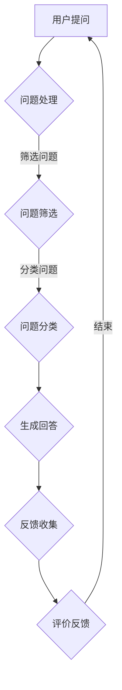
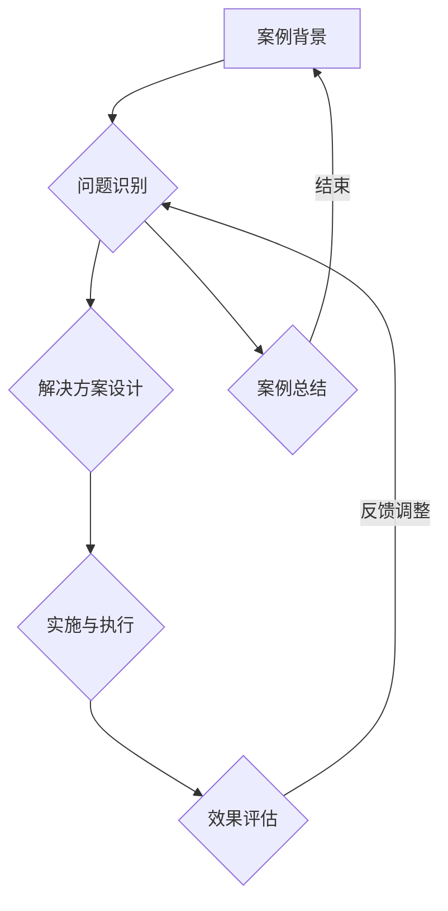

                 

# 《程序员知识付费：打造问答式教学》

## 概述

在信息化和数字化时代，知识付费逐渐成为了一个热门的趋势。程序员作为IT行业中的重要角色，面临着不断更新迭代的技能需求，知识付费成为他们提升技能和解决实际问题的有效途径。本文将探讨程序员知识付费领域，特别是问答式教学这一模式的设计与实践。

### 关键词
- **知识付费**、**程序员**、**问答式教学**、**教育模式**、**技术支持**、**用户参与**、**效果评估**、**平台构建**、**社区运营**、**人工智能**。

### 摘要

本文首先概述了知识付费的概念和发展背景，特别是问答式教学作为一种知识付费形式的优势和特点。随后，文章深入探讨了问答式教学的设计策略、问题分类与筛选、用户互动与反馈机制等核心内容。接着，通过实际案例分析和平台搭建指导，展示了问答式教学在程序员知识付费中的应用和实践。最后，本文对问答式教学的效果评估和持续优化提出了方法和策略，并对未来趋势进行了展望。

### 目录大纲

#### 第一部分：知识付费概述
1. **知识付费的概念与趋势**
   - **知识付费的定义与发展背景**
   - **知识付费的市场现状与趋势**
   - **知识付费的形式与模式**

2. **程序员知识付费需求分析**
   - **程序员的学习需求和痛点**
   - **知识付费在程序员职业发展中的作用**

#### 第二部分：问答式教学设计
3. **问答式教学策略**
   - **设计问答式教学的步骤**
   - **问答式教学的方法与技巧**

4. **构建有效的问答体系**
   - **问题分类与筛选**
   - **回答问题的原则与标准**

5. **用户互动与反馈机制**
   - **用户参与方式**
   - **反馈收集与处理**

#### 第三部分：问答式教学实践
6. **问答式教学案例分析**
   - **成功案例分享**
   - **个人知识付费账号的问答实践**

7. **搭建问答式教学平台**
   - **平台搭建步骤**
   - **问答社区运营策略**

#### 第四部分：问答式教学评估与优化
8. **教学效果评估方法**
   - **教学效果指标**
   - **教学效果评估工具**

9. **持续优化与改进**
   - **数据驱动的教学优化**
   - **知识库的维护与更新**

#### 第五部分：问答式教学在编程领域的应用
10. **编程问答社区建设**
    - **编程问答社区的功能与特点**
    - **编程问答社区运营策略**

11. **编程学习问答实践**
    - **编程学习问题的分类**
    - **编程问答案例分析**

#### 第六部分：问答式教学在其他领域的应用
12. **问答式教学在其他领域的探索**
    - **商业领域的问答式培训**
    - **教育领域的问答式教学**
    - **问答式教学的发展趋势**

#### 第七部分：问答式教学的未来展望
13. **问答式教学的发展趋势**
    - **新技术对问答式教学的影响**
    - **问答式教学的创新与变革**

### 附录
- **附录A：问答式教学资源与工具**
- **附录B：问答式教学流程图**
- **附录C：编程问答社区建设与运营指南**

## 第一部分：知识付费概述

### 知识付费的概念与趋势

知识付费，顾名思义，是指用户为了获取特定的知识或技能，向知识提供方支付一定费用的行为。随着互联网的发展，知识付费逐渐成为一种新兴的消费模式，尤其是在IT行业，程序员的知识付费需求尤为突出。

#### 知识付费的定义与发展背景

知识付费的概念起源于互联网，其发展可以追溯到在线教育的兴起。随着在线学习平台的普及，用户逐渐习惯通过付费获取高质量的知识内容。特别是在IT行业，知识更新迅速，程序员需要不断学习新技能以适应市场变化，知识付费成为了他们持续学习的重要途径。

#### 知识付费的市场现状与趋势

当前，知识付费市场呈现出以下几个趋势：

1. **市场规模的扩大**：随着用户对知识需求的增加，知识付费市场规模不断扩大。据相关报告显示，2022年全球在线教育市场规模已经达到5600亿美元，预计未来几年仍将保持高速增长。

2. **内容形式的多样化**：知识付费的内容形式越来越丰富，除了传统的视频课程、电子书外，问答式教学、直播讲座等新兴形式也逐渐受到欢迎。

3. **用户群体的扩大**：知识付费不再局限于职业人士，越来越多的个人用户和职业新手加入到知识付费的行列，形成了庞大的用户基础。

4. **平台竞争的加剧**：随着市场的扩大，各大平台纷纷进入知识付费领域，竞争日益激烈。平台之间通过内容创新、用户体验优化等手段争夺市场份额。

### 知识付费的形式与模式

知识付费的形式和模式多种多样，主要包括以下几种：

1. **问答式教学**：用户通过付费向专家提问，获取针对性的解答。这种模式具有互动性强、个性化的特点，深受程序员等职业人士的喜爱。

2. **课程订阅**：用户支付一定费用后，可以不限次数地访问特定课程的内容。这种模式适合于系统性学习的用户。

3. **付费专栏**：专家或机构定期发布专栏文章，用户通过付费订阅获取最新内容。这种模式适合于用户持续关注某个领域。

4. **专业咨询**：用户支付咨询费用，与专家进行一对一的深入交流。这种模式适合于解决特定问题或提供定制化服务。

### 程序员知识付费需求分析

#### 程序员的学习需求和痛点

程序员作为知识付费的重要用户群体，其学习需求主要集中在以下几个方面：

1. **技术更新**：IT行业发展迅速，新技术不断涌现，程序员需要不断学习新技能以保持竞争力。

2. **实战经验**：理论知识固然重要，但实际操作中的问题解决能力和经验积累对程序员而言更为关键。

3. **职业发展**：程序员希望通过知识付费提升自己的技能水平，从而在职业发展中获得更多机会。

4. **时间管理**：程序员工作繁忙，需要高效利用时间进行学习，因此对知识内容的需求更加注重实用性和效率。

#### 知识付费在程序员职业发展中的作用

知识付费在程序员的职业发展中扮演着重要角色：

1. **技能提升**：通过付费学习，程序员可以快速获取最新技术知识，提升自身技能水平。

2. **问题解决**：付费咨询和问答服务可以帮助程序员解决实际工作中的难题，提高工作效率。

3. **职业规划**：通过学习不同领域的知识，程序员可以明确自己的职业发展方向，进行有针对性的规划。

4. **人脉拓展**：知识付费平台上的专家和同行资源，为程序员提供了拓展人脉的机会，有助于职业发展。

### 总结

知识付费作为一种新兴的消费模式，正在改变人们的知识获取方式。程序员作为其中的重要用户群体，通过知识付费不仅能够提升自身技能，还能在职业发展中获得更多机会。问答式教学作为一种高效、互动的知识付费形式，有望在程序员知识付费领域发挥更大的作用。

### 第二部分：问答式教学设计

#### 问答式教学策略

问答式教学作为一种以问题为中心的教学方法，旨在通过提问和回答的过程，引导学习者深入思考、解决问题，从而实现知识的掌握和应用。为了设计一个有效的问答式教学课程，我们需要遵循以下步骤：

1. **明确教学目标**：
   - 确定教学课程的核心内容和目标，包括知识点的掌握、技能的培养、问题的解决等。
   - 根据学员的背景和需求，设定具体的学习目标和期望成果。

2. **策划课程内容**：
   - 根据教学目标，策划课程内容，包括知识点讲解、案例分析、实战演练等。
   - 内容要具有层次性和系统性，由浅入深，循序渐进。

3. **制定问答框架**：
   - 设计问答框架，明确每个环节的问题类型和提问方式。
   - 问答框架应涵盖课程的核心知识点，同时注重引导学员的思考和探索。

4. **设计互动环节**：
   - 融入互动环节，鼓励学员参与问答，提高学习积极性和效果。
   - 可以采用实时问答、讨论区提问、在线互动直播等形式，增加学员的参与度。

#### 问答式教学的方法与技巧

1. **提问技巧**：
   - 设计开放性问题，鼓励学员思考和表达自己的观点。
   - 提问要有针对性，紧扣课程内容，避免泛泛而谈。
   - 提问要具有启发性和引导性，引导学员深入思考。

2. **回答技巧**：
   - 回答问题要准确、清晰，避免模糊或误导性的回答。
   - 针对学员的问题，提供具体的解决方案或指导，帮助他们理解和应用知识。
   - 如果问题超出自己的知识范围，可以引导学员查找相关资料，培养他们的自主学习能力。

3. **引导式提问**：
   - 通过引导式提问，引导学员从不同的角度思考问题，促进他们的批判性思维和创造力。
   - 引导式提问可以采用“是什么”、“为什么”、“怎么做”等问题形式，逐步引导学员深入探讨。

4. **评估与反馈**：
   - 对学员的问答进行评估，及时给予反馈，帮助他们了解自己的学习情况。
   - 反馈要具体、有建设性，指出学员的优点和需要改进的地方。
   - 可以采用评分系统、评价表格等形式，量化评估结果，提高评估的客观性和准确性。

#### 构建有效的问答体系

1. **问题分类与筛选**：
   - 对问题进行分类，区分技术性问题、管理问题、职业发展问题等。
   - 筛选有代表性和价值的问题，确保问答内容的针对性和有效性。

2. **回答问题的原则与标准**：
   - 回答问题要遵循准确性、实用性和及时性的原则。
   - 准确性：提供正确的信息和解决方案。
   - 实用性：回答要具有实际应用价值，能够解决学员的实际问题。
   - 及时性：尽快回答学员的问题，避免拖延。

3. **用户互动与反馈机制**：
   - 建立互动渠道，如在线讨论区、问答社区等，方便学员提问和讨论。
   - 设立反馈渠道，收集学员的意见和建议，不断优化问答服务。
   - 定期进行满意度调查，了解学员的学习体验和需求，提升服务质量。

### 总结

问答式教学作为一种以问题为中心的教学方法，通过提问和回答的过程，引导学员深入思考、解决问题，实现知识的掌握和应用。设计有效的问答式教学课程需要明确教学目标、策划课程内容、制定问答框架和设计互动环节。同时，问答式教学的方法与技巧、问题分类与筛选、回答问题的原则与标准以及用户互动与反馈机制的构建，都是保证教学效果的重要方面。通过科学的问答式教学设计，可以有效地提升学员的学习效果，满足他们的知识需求。

### 第三部分：问答式教学实践

#### 问答式教学案例分析

为了更好地理解问答式教学在程序员知识付费中的实际应用，我们通过以下成功案例进行详细分析。

##### 案例一：某知名编程问答社区的问答模式

该社区以提供高质量的编程问答服务而闻名，吸引了大量的程序员用户。其成功的关键在于以下几个方面：

1. **社区文化**：
   - 建立了一个积极、互助的社区氛围，鼓励用户提出问题和解答问题。
   - 明确了社区规则，确保问答内容的质量和秩序。

2. **问题筛选**：
   - 管理团队对用户提出的问题进行筛选，确保问题具有代表性和价值。
   - 对重复或不合适的问题进行合并或删除，保持社区的高质量。

3. **回答质量**：
   - 鼓励专业人士和有经验的程序员提供高质量的回答，通过点赞和评分机制激励优秀回答者。
   - 引入认证机制，对回答者的专业背景和经验进行验证，提高回答的可信度。

4. **互动机制**：
   - 提供实时聊天功能，方便用户与回答者进行实时交流，解决复杂问题。
   - 设立讨论区，用户可以就特定问题进行深入讨论，形成知识共享。

##### 案例二：某在线教育平台的问答式教学实践

该在线教育平台通过问答式教学提供了个性化的学习体验。以下是其实践的几个关键点：

1. **课程设计**：
   - 课程内容紧密围绕编程实践，注重知识的实际应用。
   - 设计了多个层次的问题，从基础知识到高级问题，逐步引导学员掌握编程技能。

2. **导师制度**：
   - 每位学员都有一位导师，负责解答学员在学习过程中遇到的问题。
   - 导师不仅提供答案，还会对学员的学习方法和思路进行指导，提升学习效果。

3. **互动环节**：
   - 平台提供了在线讨论区，学员可以在其中提问和解答问题。
   - 定期举办在线讲座和直播课程，增加学员与导师的互动机会。

4. **个性化推荐**：
   - 根据学员的学习进度和问题反馈，平台会推荐相关的课程内容和问题，提供个性化的学习路径。

##### 案例三：个人知识付费账号的问答实践

一位资深程序员通过个人知识付费账号，提供了专业的编程问答服务。以下是他的实践经验：

1. **专业定位**：
   - 明确自己的专业领域，专注于某个特定的编程语言或技术方向，提供深度的技术解答。

2. **内容准备**：
   - 提前准备常见问题和解答，方便快速回复。
   - 通过博客和视频教程，分享自己的编程经验和技巧，提高回答的权威性。

3. **互动管理**：
   - 通过社交媒体和邮件保持与用户的互动，及时解答他们的疑问。
   - 定期整理和更新常见问题集，方便用户查找。

4. **用户反馈**：
   - 重视用户的反馈，及时调整回答策略，提升服务质量。
   - 鼓励用户对回答进行评价，通过评分和评论了解用户的满意度。

#### 个人知识付费账号的问答实践

对于个人知识付费账号的运营，以下是一些建议：

1. **明确定位**：
   - 确定自己的专业领域和目标用户群体，提供有针对性的问答服务。

2. **内容准备**：
   - 提前准备常见问题和解答，提高回答效率。
   - 持续更新知识库，确保内容的时效性和准确性。

3. **用户互动**：
   - 通过社交媒体和邮件保持与用户的互动，提高用户黏性。
   - 定期举办线上讲座和研讨会，增加与用户的互动机会。

4. **服务质量**：
   - 重视用户的反馈，不断改进服务质量。
   - 提供有价值的答案，帮助用户解决问题，提升自己的专业形象。

### 总结

问答式教学在程序员知识付费中的应用具有显著的优势，通过成功案例的分析，我们可以看到问答式教学在建立社区文化、问题筛选、回答质量保证和用户互动等方面的实践方法。个人知识付费账号通过专业定位、内容准备、用户互动和服务质量提升，可以有效地提供高质量的问答服务，满足程序员的学习需求。通过不断优化问答式教学实践，我们可以进一步提升程序员知识付费的效果，为他们的职业发展提供有力支持。

### 第四部分：问答式教学评估与优化

#### 教学效果评估方法

为了确保问答式教学的有效性，我们需要对教学效果进行科学评估。以下是一些常用的评估方法：

1. **用户满意度**：
   - 通过问卷调查、访谈等方式，收集用户对问答服务的满意度。
   - 用户满意度可以反映教学服务的质量和用户的实际需求满足程度。

2. **用户留存率**：
   - 用户在问答平台上的活跃度和参与度是评估教学效果的重要指标。
   - 高留存率表明用户对问答服务的依赖性和认可度。

3. **用户转化率**：
   - 用户从问答服务中获取知识后，是否能够将其应用于实际工作或学习中。
   - 转化率可以衡量问答服务的实用性和价值。

4. **问题解决率**：
   - 用户提出的问题是否得到了有效解答。
   - 高问题解决率表明问答服务的专业性和高效性。

#### 教学效果评估工具

为了更准确地评估教学效果，我们可以使用以下工具：

1. **问卷调查**：
   - 通过在线问卷平台（如SurveyMonkey、Google表单等）设计满意度调查问卷。
   - 调查内容可以包括用户对问答服务的整体满意度、回答质量、互动体验等方面。

2. **用户行为分析**：
   - 利用数据分析工具（如Google Analytics、Mixpanel等）跟踪用户在平台上的行为，包括访问量、提问量、回答量等。
   - 通过行为数据，分析用户的活跃度和参与度。

3. **数据挖掘与分析**：
   - 通过大数据分析技术，对用户行为和反馈数据进行分析，识别用户需求和问题点。
   - 数据挖掘可以帮助我们发现潜在的用户痛点和改进机会。

#### 反馈收集与处理流程

1. **反馈类型**：
   - 用户反馈可以分为正面反馈和负面反馈。
   - 正面反馈可以包括对问答服务的好评、建议等；负面反馈则包括对服务质量、回答准确度等方面的不满。

2. **反馈渠道**：
   - 建立多渠道的反馈收集机制，如在线反馈表、邮件反馈、社交媒体等。
   - 确保用户可以方便地提交反馈，提高反馈的收集效率。

3. **反馈处理流程**：
   - 设立专门的反馈处理团队，负责接收、分类和回复用户反馈。
   - 对于正面反馈，表示感谢并鼓励用户提供更多建议。
   - 对于负面反馈，积极回应，进行问题排查和改进。
   - 定期汇总反馈数据，分析用户需求和问题，制定改进计划。

#### 持续优化与改进

1. **数据驱动的教学优化**：
   - 通过数据分析和反馈收集，识别用户需求和问题点，制定改进方案。
   - 实施改进措施后，再次进行数据分析和用户反馈，评估改进效果。

2. **知识库的维护与更新**：
   - 定期对知识库进行维护和更新，确保内容的时效性和准确性。
   - 收集用户提问和解答，不断丰富知识库的内容。

3. **个性化推荐**：
   - 通过数据分析，为用户提供个性化的学习推荐，提高用户的学习体验。

### 总结

问答式教学的效果评估与优化是确保教学服务质量的关键环节。通过用户满意度、用户留存率、用户转化率和问题解决率等指标，我们可以全面评估问答式教学的效果。利用问卷调查、用户行为分析和数据挖掘等工具，我们可以深入了解用户需求和问题点，制定有针对性的改进方案。通过持续优化和改进，我们可以不断提升问答式教学的效果，为程序员的知识付费提供更优质的服务。

### 第五部分：问答式教学在编程领域的应用

#### 编程问答社区建设

编程问答社区是问答式教学在编程领域的重要应用形式，它为程序员提供了一个交流和学习的平台。以下是编程问答社区建设的关键要素：

1. **社区功能与特点**：
   - **问答功能**：用户可以提问和回答问题，社区提供专业的解答。
   - **讨论区**：用户可以就特定话题进行讨论，分享经验和见解。
   - **资源库**：提供编程资料、教程、代码片段等资源，方便用户学习和参考。
   - **认证机制**：引入认证系统，对回答者的专业背景和经验进行验证，确保回答质量。

2. **用户群体**：
   - **初级程序员**：需要学习基础知识，解决入门难题。
   - **中级程序员**：掌握一定编程技能，解决具体问题，提高技能水平。
   - **高级程序员**：有丰富经验，分享专业知识和解决方案。

3. **社区文化**：
   - **互助氛围**：鼓励用户互相帮助，建立积极、互助的社区文化。
   - **开放性**：社区对所有人开放，吸引不同层次的程序员参与。
   - **规范性**：制定社区规则，确保问答和讨论的质量和秩序。

#### 编程问答社区运营策略

1. **内容规划**：
   - **热门话题**：关注当前热门的编程话题和技术动态，引导用户参与讨论。
   - **专题活动**：定期举办编程竞赛、代码挑战等活动，提高用户活跃度。
   - **知识分享**：鼓励用户发布原创教程、经验分享，丰富社区内容。

2. **用户活跃度提升**：
   - **奖励机制**：通过积分、勋章等激励用户参与问答和讨论。
   - **互动环节**：组织线上活动，如编程讲座、直播问答等，增加用户互动。
   - **推荐机制**：利用算法推荐用户感兴趣的问题和内容，提高用户的参与度。

3. **品牌建设**：
   - **专业形象**：通过高质量的问答内容和专业认证机制，树立社区的专业形象。
   - **口碑传播**：鼓励用户分享社区经验和收获，通过口碑传播吸引更多用户。
   - **合作伙伴**：与相关机构和公司合作，共同推广社区，扩大影响力。

#### 编程学习问答实践

1. **问题分类**：
   - **基础知识**：编程语言基础、数据结构、算法等。
   - **编程语言与工具**：特定编程语言的使用、开发工具的选择等。
   - **项目实践**：项目开发过程中遇到的问题、最佳实践分享等。

2. **案例分析**：

##### 案例一：某编程问答社区的问题解答

问题：如何优化Python代码的性能？

解答：
1. 使用更高效的算法和数据结构。
2. 减少不必要的循环和递归调用。
3. 利用内置函数和模块，如`functools.lru_cache`。
4. 调整代码的执行顺序，减少内存占用。

##### 案例二：某在线编程学习平台的教学实践

问题：如何开始学习React？

解答：
1. 学习JavaScript基础，了解ES6语法。
2. 阅读React官方文档，了解React的基本概念和API。
3. 参加React入门教程和练习，如Codecademy的React课程。
4. 实践项目，如创建一个简单的待办事项应用，逐步掌握React的使用。

#### 总结

问答式教学在编程领域的应用，通过编程问答社区的建设和运营，为程序员提供了一个高效、互动的学习平台。社区通过内容规划、用户活跃度提升和品牌建设，吸引了大量用户参与。编程学习问答实践通过具体案例的解答，帮助程序员解决实际问题，提升编程技能。随着技术的不断进步和社区运营策略的优化，问答式教学在编程领域将发挥更大的作用。

### 第六部分：问答式教学在其他领域的应用

#### 商业领域的问答式培训

在商业领域，问答式培训逐渐成为一种有效的知识传播方式。通过问答互动，企业员工可以快速获取所需知识和技能，提高工作效率和竞争力。

1. **培训内容设置**：
   - 根据企业需求和员工职业发展路径，设置针对性的培训内容。
   - 内容应包括行业动态、管理技能、专业技能等多个方面。

2. **培训效果评估**：
   - 通过问卷调查、测试评估员工的学习效果。
   - 分析员工在培训后的工作表现，评估培训的实际效果。

3. **培训模式创新**：
   - 结合线上和线下培训，提供灵活的学习方式。
   - 引入游戏化培训模式，增加学习趣味性。

#### 教育领域的问答式教学

在教育领域，问答式教学为学生提供了一个互动性强的学习环境，有助于提升学生的思维能力和解决问题的能力。

1. **实践案例**：
   - 在线教育平台上的问答环节，学生可以提问，教师进行解答。
   - 教师在课堂中运用问答式教学，引导学生思考和讨论，提高课堂参与度。

2. **挑战与机遇**：
   - 问答式教学需要教师具备良好的提问技巧和解答能力。
   - 如何平衡问答与讲授，确保教学效果，是一个挑战。

3. **发展趋势**：
   - 随着技术的进步，人工智能和大数据分析将为问答式教学提供更多支持。
   - 个性化问答系统将更加普及，满足不同学生的学习需求。

#### 问答式教学在其他领域的探索

1. **医疗健康领域**：
   - 通过问答式教学，医生可以快速获取最新的医疗知识和临床经验。
   - 患者也可以通过问答了解疾病知识，提高健康素养。

2. **职业技能培训领域**：
   - 企业和个人可以通过问答式培训，学习职业技能和行业知识。
   - 问答式教学可以帮助企业提高员工的职业素养，提升整体竞争力。

#### 综合应用案例分析

1. **案例一：金融领域的问答式培训**：
   - 针对金融从业人员的培训内容，包括金融市场分析、风险管理等。
   - 通过问答互动，提高学员对金融工具和策略的理解。

2. **案例二：医疗健康领域的问答式教学**：
   - 医生和患者通过问答系统，了解疾病预防和治疗方法。
   - 医疗专业人士通过问答分享临床经验和研究成果。

3. **案例三：职业技能培训领域的应用**：
   - 企业通过问答式培训，提高员工的业务能力和工作效率。
   - 个人通过问答学习职业技能，提升职业竞争力。

### 总结

问答式教学不仅在编程领域有广泛应用，还在商业、教育、医疗健康等多个领域展现了其独特的优势。通过不断探索和创新，问答式教学将有助于提高各领域的知识传播效率，满足不同用户的学习需求。未来，随着技术的进步和教学模式的优化，问答式教学将在更多领域得到广泛应用。

### 第七部分：问答式教学的未来展望

#### 发展趋势

随着信息技术的快速发展，问答式教学在未来的发展中将面临以下趋势：

1. **人工智能技术的应用**：
   - 人工智能技术将进一步提升问答系统的智能化水平，实现更准确、更快速的回答。
   - 个性化推荐系统将基于用户行为数据，为用户提供个性化的学习建议和问题解答。

2. **大数据分析**：
   - 通过大数据分析，可以更好地理解用户需求，优化问答内容和互动机制。
   - 数据挖掘技术将帮助发现用户行为模式，预测用户需求，提高问答服务的针对性。

3. **机器学习技术**：
   - 机器学习算法将在问答系统中发挥更大作用，通过不断学习和优化，提升回答质量。
   - 自动化问答系统将能够处理大量用户提问，提高问答效率。

#### 新技术对问答式教学的影响

1. **智能化问答**：
   - 人工智能技术将使问答系统更加智能化，能够自动识别和回答常见问题。
   - 智能化问答将减少对人工干预的依赖，提高问答的效率和准确性。

2. **个性化教学**：
   - 大数据和机器学习技术将帮助分析用户学习习惯和需求，提供个性化的学习路径和问题解答。
   - 个性化教学将使学习者能够更高效地获取知识，提高学习效果。

3. **互动性增强**：
   - 在线互动技术将进一步提升用户参与度，增加学习的趣味性和互动性。
   - 通过视频、直播、虚拟现实等技术，用户可以更直观地参与问答过程，提高学习体验。

#### 问答式教学的创新与变革

1. **问答式学习平台**：
   - 未来，问答式学习平台将更加普及和多样化，为不同领域和用户提供定制化的服务。
   - 平台将集成多种功能，如在线课程、讨论区、直播讲座等，提供全方位的学习支持。

2. **知识传播与分享**：
   - 问答式教学将推动知识的快速传播和共享，打破地域和时间的限制，实现知识的全球化流动。
   - 用户将能够通过问答平台，获取来自全球专家的知识和经验，促进知识的普及和传播。

3. **教育与商业的结合**：
   - 问答式教学将更好地融合教育与商业，为企业提供定制化的培训解决方案，助力企业提升员工素质和竞争力。
   - 商业机构将通过问答式教学，获取用户反馈和市场信息，优化产品和服务。

### 未来展望

问答式教学在未来具有广阔的发展前景。随着新技术的不断应用，问答式教学将变得更加智能化、个性化和互动性，为学习者提供更高效、更便捷的学习体验。同时，问答式教学也将进一步融合教育与商业，推动知识传播和分享的新模式。在未来的知识付费市场中，问答式教学将扮演重要角色，为程序员和其他领域的用户带来更多价值。

### 附录

#### 附录A：问答式教学资源与工具

- **在线问答平台**：
  - [Stack Overflow](https://stackoverflow.com/)
  - [GitHub](https://github.com/)
  - [Quora](https://www.quora.com/)

- **问答式教学工具**：
  - [Socratic](https://www.socratic.org/)
  - [ChatterBot](https://chatterbot.ai/)
  - [Chatfuel](https://chatfuel.com/)

- **相关书籍与论文**：
  - 《人工智能：一种现代方法》[Stuart Russell & Peter Norvig]
  - 《数据科学入门：用Python进行数据挖掘与分析》[Michael Bowles]
  - "Question Answering with Machine Learning"[Hans Uszkoreit, et al.]

#### 附录B：问答式教学流程图

- **B.1 问答式教学流程图（Mermaid语法）**：

- **B.2 问答式教学案例分析流程图**：

#### 附录C：编程问答社区建设与运营指南

- **C.1 编程问答社区建设流程**：
  1. **需求分析**：了解用户需求，明确社区的目标和功能。
  2. **平台搭建**：选择合适的开发工具和框架，搭建社区平台。
  3. **功能规划**：设计社区的核心功能，如问答、讨论区、资源库等。
  4. **内容准备**：收集和整理优质内容，确保社区有充足的内容资源。

- **C.2 编程问答社区运营策略**：
  1. **内容规划**：定期发布高质量的编程教程和经验分享，吸引用户参与。
  2. **用户互动**：通过活动、讲座等方式，增加用户互动，提高社区活跃度。
  3. **品牌建设**：通过良好的用户体验和服务质量，树立社区的品牌形象。
  4. **社区管理**：制定社区规则，维护社区秩序，确保问答内容的质量。

### 总结

问答式教学作为一种高效的知识传播方式，在程序员知识付费领域发挥着重要作用。通过详细的案例分析、评估方法和未来展望，我们可以看到问答式教学在提升用户学习效果、满足职业发展需求方面的巨大潜力。随着新技术的不断进步，问答式教学将迎来更多创新与变革，为知识的传播与分享带来新的机遇。

