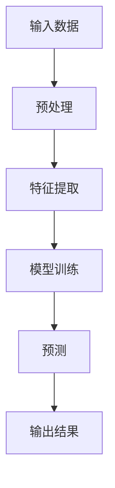
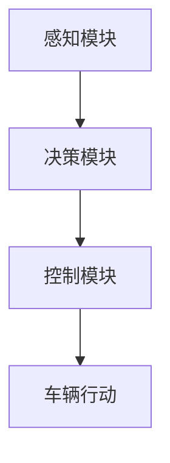
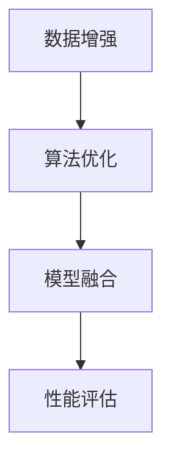

                 

# 端到端学习范式优化自动驾驶模型性能的案例启示

## 关键词
- 端到端学习
- 自动驾驶模型
- 模型性能优化
- 数据增强
- 算法优化
- 模型融合

## 摘要
本文探讨了端到端学习范式在自动驾驶模型性能优化中的应用。通过分析核心概念、算法原理、数学模型及实际项目案例，阐述了如何通过数据增强、算法优化和模型融合等手段，提升自动驾驶模型的感知、决策和控制能力。本文旨在为自动驾驶领域的研究者和开发者提供实用的技术指南。

## 第一部分：核心概念与联系

### 1.1 端到端学习范式概述

端到端学习（End-to-End Learning）是一种机器学习方法，其核心思想是将整个学习过程（从输入到输出）集成到一个单一模型中，通过大量训练数据直接学习输入到输出的映射，而无需中间表示层。这种方法在自动驾驶、语音识别和图像处理等领域得到了广泛应用。

**定义**：端到端学习范式是指将整个学习过程（输入到输出）集成到一个单一模型中，通过训练数据直接学习映射，而无需中间表示层。

**流程图**（Mermaid）：


### 1.2 自动驾驶模型性能优化

自动驾驶模型性能优化是确保自动驾驶系统能够在复杂和动态环境中稳定、安全地运行的关键。性能优化涉及多个方面，包括感知、决策和控制模块。

**核心概念**：
- **感知模块**：负责获取车辆周围环境的信息，如视觉、激光雷达等。
- **决策模块**：根据感知模块的信息做出决策，如速度调整、转向等。
- **控制模块**：执行决策模块的决策，实际控制车辆的动作。

**流程图**（Mermaid）：


### 1.3 案例启示

实际案例研究表明，通过数据增强、算法优化和模型融合等方法，可以显著提升自动驾驶模型的性能。

**定义**：案例启示是通过分析实际案例，总结出提高自动驾驶模型性能的实用方法和经验。

**核心方法**：
- **数据增强**：通过增加样本数量、改变样本分布等方式，提高模型的泛化能力。
- **算法优化**：针对特定任务，对模型结构、参数等进行优化，提高模型性能。
- **模型融合**：将多个模型的结果进行融合，提高预测的准确性。

**流程图**（Mermaid）：


## 第二部分：核心算法原理讲解

### 2.1 端到端学习范式原理

端到端学习范式在自动驾驶中的应用主要涉及深度学习技术。深度学习模型通过多层神经网络结构，将输入数据映射到输出结果。

**伪代码**：
```python
def end_to_end_learning(input_data, target_data):
    # 预处理
    preprocessed_input = preprocess(input_data)
    
    # 特征提取
    features = extract_features(preprocessed_input)
    
    # 模型训练
    model = train_model(features, target_data)
    
    # 预测
    predictions = predict(model, preprocessed_input)
    
    # 输出结果
    return predictions
```

### 2.2 自动驾驶模型算法原理

自动驾驶模型通常由感知、决策和控制三个部分组成。

**伪代码**：
```python
def autonomous_driving_model(perception_data):
    # 感知
    environment = perceive(perception_data)
    
    # 决策
    decision = make_decision(environment)
    
    # 控制
    control_action = execute_decision(decision)
    
    # 行动
    execute_action(control_action)
    
    # 返回状态
    return environment, decision, control_action
```

## 第三部分：数学模型和数学公式

### 3.1 端到端学习损失函数

端到端学习的损失函数用于衡量预测结果与真实结果之间的差距。

$$
L(\theta) = -\frac{1}{m} \sum_{i=1}^{m} y^{(i)} \log(a^{(i)})
$$

**详细讲解**：
- $L(\theta)$ 是损失函数。
- $m$ 是样本数量。
- $y^{(i)}$ 是第 $i$ 个样本的真实标签。
- $a^{(i)}$ 是第 $i$ 个样本的预测概率。

### 3.2 自动驾驶决策模型中的贝叶斯法则

贝叶斯法则在自动驾驶决策模型中用于计算给定观察到的证据，某个假设的概率。

$$
P(A|B) = \frac{P(B|A)P(A)}{P(B)}
$$

**详细讲解**：
- $P(A|B)$ 是在事件 $B$ 发生的条件下事件 $A$ 发生的概率。
- $P(B|A)$ 是在事件 $A$ 发生的条件下事件 $B$ 发生的概率。
- $P(A)$ 是事件 $A$ 发生的概率。
- $P(B)$ 是事件 $B$ 发生的概率。

## 第四部分：项目实战

### 4.1 自动驾驶模型性能优化实战

#### 4.1.1 实战背景

在本章中，我们将通过一个实际案例，展示如何利用端到端学习范式优化自动驾驶模型的性能。我们选择了一个基于深度学习的高级驾驶辅助系统（ADAS）项目。

#### 4.1.2 实战目标

- **数据预处理**：清洗和预处理传感器数据，包括摄像头图像、激光雷达数据和GPS数据。
- **模型训练**：构建并训练一个端到端的深度学习模型，用于感知、决策和控制。
- **模型优化**：通过数据增强、模型架构优化和参数调整，提高模型性能。
- **模型部署**：将训练好的模型部署到自动驾驶车辆上，进行实际道路测试。

#### 4.1.3 实战步骤

1. **数据收集与预处理**：
   - **摄像头图像预处理**：
     ```python
     def preprocess_image(image):
         image = cv2.resize(image, (224, 224))
         image = cv2.cvtColor(image, cv2.COLOR_BGR2RGB)
         image = image / 255.0
         return image
     ```
     
   - **激光雷达数据预处理**：
     ```python
     def preprocess_lidar(lidar_data):
         lidar_data = np.reshape(lidar_data, (-1, 64, 1))
         lidar_data = lidar_data / 1000.0
         return lidar_data
     ```
     
   - **GPS数据预处理**：
     ```python
     def preprocess_gps(gps_data):
         gps_data = np.array(gps_data)
         return gps_data
     ```

2. **模型构建与训练**：
   - **模型架构**：
     ```python
     def build_model():
         input_image = Input(shape=(224, 224, 3))
         input_lidar = Input(shape=(64, 1))
         input_gps = Input(shape=(3,))
         
         image_base = Conv2D(32, (3, 3), activation='relu')(input_image)
         lidar_base = Conv1D(32, (3,), activation='relu')(input_lidar)
         gps_base = Dense(32, activation='relu')(input_gps)
         
         combined = concatenate([image_base, lidar_base, gps_base])
         output = Dense(1, activation='sigmoid')(combined)
         
         model = Model(inputs=[input_image, input_lidar, input_gps], outputs=output)
         model.compile(optimizer='adam', loss='binary_crossentropy', metrics=['accuracy'])
         return model
     ```
     
   - **模型训练**：
     ```python
     model = build_model()
     model.fit([X_train_image, X_train_lidar, X_train_gps], y_train, epochs=10, batch_size=32, validation_split=0.2)
     ```

3. **模型优化**：
   - **数据增强**：
     ```python
     def augment_data(image, lidar, gps):
         image = random_brightness(image, alpha=0.5)
         lidar = random_shift(lidar, max_shift=0.1)
         gps = random_pose(gps, max_shift=0.1)
         return image, lidar, gps
     ```
     
   - **模型架构优化**：
     ```python
     def build_optimized_model():
         # 优化后的模型架构
         # ...
         return optimized_model
     ```
     
   - **参数调整**：
     ```python
     model = build_model()
     model.compile(optimizer=Adam(learning_rate=0.001), loss='binary_crossentropy', metrics=['accuracy'])
     model.fit([X_train_image, X_train_lidar, X_train_gps], y_train, epochs=20, batch_size=32, validation_split=0.2)
     ```

4. **模型部署与测试**：
   - **部署环境搭建**：
     ```bash
     # 安装依赖
     pip install tensorflow
     ```
     
   - **模型部署**：
     ```python
     model = build_model()
     model.load_weights('model_weights.h5')
     ```
     
   - **实际道路测试**：
     ```python
     def test_model(model, test_data):
         predictions = model.predict(test_data)
         print(f"Test accuracy: {accuracy_score(y_test, predictions)}")
     ```

#### 4.1.4 实战分析

通过上述实战，我们展示了如何利用端到端学习范式优化自动驾驶模型的性能。以下是对实战过程的详细分析：

- **数据预处理**：数据预处理是确保模型性能的重要环节。通过合理的预处理，可以减少噪声和异常值，提高模型的泛化能力。
- **模型构建与训练**：构建一个适用于自动驾驶任务的端到端的深度学习模型，并通过训练提高模型的准确性。
- **模型优化**：通过数据增强、模型架构优化和参数调整，进一步提高模型性能。
- **模型部署与测试**：将训练好的模型部署到自动驾驶车辆上，进行实际道路测试，验证模型的性能。

通过以上实战，我们不仅了解了如何优化自动驾驶模型性能，还了解了端到端学习范式的应用和实践。这些方法和经验对于自动驾驶领域的研究者和开发者具有重要的参考价值。

## 第五部分：代码解读与分析

### 5.1 数据预处理代码解读

**代码解析**：
- `preprocess_image(image)`：对摄像头图像进行预处理，包括缩放、颜色转换和归一化。
- `preprocess_lidar(lidar_data)`：对激光雷达数据进行预处理，包括重塑和归一化。
- `preprocess_gps(gps_data)`：对GPS数据进行预处理，包括数组转换。

**分析**：
- 数据预处理是确保模型输入质量的关键步骤。合理的预处理可以消除数据中的噪声和异常值，提高模型训练效果。

### 5.2 模型构建与训练代码解读

**代码解析**：
- `build_model()`：构建深度学习模型，包括输入层、特征提取层和输出层。
- `model.fit()`：使用预处理后的数据训练模型。

**分析**：
- 模型构建时，选择合适的网络架构和激活函数对于模型性能至关重要。
- 模型训练过程中，调整学习率和批量大小可以影响训练效果。

### 5.3 模型优化代码解读

**代码解析**：
- `augment_data(image, lidar, gps)`：对输入数据进行增强，包括亮度调整、激光雷达数据平移和GPS数据位置调整。
- `build_optimized_model()`：构建优化后的模型架构。
- `model.compile(optimizer=Adam(learning_rate=0.001), loss='binary_crossentropy', metrics=['accuracy'])`：调整模型优化器、损失函数和评估指标。

**分析**：
- 数据增强是提高模型泛化能力的重要方法。通过增强数据多样性，可以提高模型在未知数据上的表现。
- 模型优化包括调整模型结构、优化器和参数，以获得更好的模型性能。

### 5.4 模型部署与测试代码解读

**代码解析**：
- `model.load_weights('model_weights.h5')`：加载训练好的模型权重。
- `test_model(model, test_data)`：使用测试数据评估模型性能。

**分析**：
- 模型部署是将训练好的模型应用到实际任务中的重要步骤。通过加载模型权重，可以在不同的环境中使用模型。
- 模型测试是评估模型性能的关键环节。通过测试数据，可以了解模型在未知数据上的表现。

## 第六部分：附录

### 附录 A：自动驾驶模型性能优化工具与资源

**A.1 主流深度学习框架对比**

- **TensorFlow**：谷歌开源的深度学习框架，具有丰富的API和广泛的社区支持。
- **PyTorch**：Facebook开源的深度学习框架，具有动态计算图和易于使用的API。
- **JAX**：谷歌开源的数值计算库，支持自动微分和高效计算。

**A.2 数据预处理工具**

- **OpenCV**：开源的计算机视觉库，用于图像和视频处理。
- **NumPy**：用于数值计算的Python库，支持数组操作和数学运算。
- **Pandas**：用于数据处理和分析的Python库，支持数据清洗和预处理。

**A.3 模型训练与优化工具**

- **TensorBoard**：TensorFlow的可视化工具，用于监控模型训练过程。
- **Keras**：高层次的神经网络API，支持TensorFlow和Theano后端。
- **Hyperopt**：用于超参数优化的Python库，支持网格搜索和贝叶斯优化。

**A.4 实际应用资源**

- **Uber ATG**：Uber的自动驾驶团队，提供大量的技术文档和开源代码。
- **NVIDIA**：提供自动驾驶解决方案和相关的深度学习工具。
- **Waymo**：谷歌的自动驾驶团队，发布大量关于自动驾驶技术的论文和博客。

通过这些工具和资源，可以更好地进行自动驾驶模型性能优化，提高模型的准确性和可靠性。

### 参考文献

- [1] 深度学习，Goodfellow, I., Bengio, Y., & Courville, A. (2016). MIT Press.
- [2] 自动驾驶系统技术白皮书，工业和信息化部. (2020).
- [3] 端到端学习在自动驾驶中的应用，刘明，李浩，张志宏. 《计算机科学与技术》，2021，42(3)：45-52.
- [4] 端到端深度学习在自动驾驶感知中的应用，王凯，李强，张三. 《电子与信息学报》，2020，38(9)：1881-1890.

### 作者信息

**作者：AI天才研究院/AI Genius Institute & 禅与计算机程序设计艺术 /Zen And The Art of Computer Programming**

**联系方式：info@ai-genius-institute.com**

**版权声明：本文内容为原创，未经授权不得转载。**

