                 

# 《算法公平：构建负责任的人工智能》

> 关键词：算法公平、算法偏见、社会责任、伦理考量、法律法规、技术进步、实践应用

> 摘要：本文从算法公平的重要性出发，详细探讨了算法公平的定义、理论基础、实践应用和未来发展趋势。通过分析算法偏见的表现形式、公平性挑战和驱动因素，本文深入阐述了算法公平的核心概念、原理和关键技术。同时，本文结合金融、教育、社交媒体等关键领域，探讨了算法公平的实践应用和伦理法律问题。最后，本文总结了算法公平的实践案例，并对未来算法公平的发展趋势和挑战进行了展望。

## 第一部分：算法公平概述

### 第1章：算法公平的重要性

#### 1.1 算法公平的定义与意义

算法公平是指算法在处理数据和应用过程中，不因个体特征（如性别、种族、年龄等）而出现不公平的结果。算法公平不仅仅是一个技术问题，更是一个社会责任问题。它关系到社会的公正与平等，对于维护社会稳定和促进社会发展具有重要意义。

#### 1.1.1 算法公平的基本概念

算法公平包括以下几个方面：

- **无歧视**：算法不应因用户的性别、种族、年龄、地域等因素而对用户产生不公平待遇。
- **公平性**：算法结果应与输入数据的真实情况相符合，不应产生误导或偏见。
- **透明度**：算法的决策过程应透明，用户可以理解并追踪算法的决策逻辑。
- **可解释性**：算法的决策过程和结果应易于解释，用户可以理解算法为何做出某个决策。

#### 1.1.2 算法公平与社会责任

算法公平不仅关乎个体的权益，更关乎社会的公平与正义。随着人工智能技术在各个领域的广泛应用，算法的公平性直接影响到社会的方方面面。因此，构建负责任的人工智能系统，实现算法公平，已经成为社会各界关注的重要问题。

#### 1.2 算法偏见与公平性挑战

算法偏见是指算法在处理数据和应用过程中，因数据集的不平衡、算法的设计缺陷等原因，导致对某些群体或个体产生不公平待遇。算法偏见的存在严重损害了算法公平性，引发了社会的不满和质疑。

#### 1.2.1 算法偏见的表现形式

算法偏见主要表现为以下几个方面：

- **歧视性偏见**：算法在招聘、贷款、保险等环节，因数据集的不平衡，导致对某些群体产生不公平待遇。
- **误导性偏见**：算法在处理信息时，因算法的缺陷，导致对某些信息产生误导性解读。
- **系统性偏见**：算法在处理大规模数据时，因算法的优化目标不一致，导致对某些群体或个体产生不公平待遇。

#### 1.2.2 算法公平性面临的挑战

算法公平性面临的挑战主要有以下几个方面：

- **数据不平衡**：数据集中某些群体的样本量较少，导致算法在训练和预测过程中，对这些群体产生不公平待遇。
- **算法设计缺陷**：算法的设计和优化过程中，可能因对公平性的考虑不足，导致算法产生偏见。
- **透明度不足**：算法的决策过程和结果往往不透明，用户难以理解算法为何做出某个决策，导致对算法的信任度降低。
- **法规政策缺失**：目前全球范围内关于算法公平的法规政策尚不完善，缺乏有效的监管和约束。

#### 1.3 算法公平的驱动因素与影响

算法公平的驱动因素主要包括以下几个方面：

- **法律法规与政策导向**：各国政府纷纷出台相关法律法规和政策，推动算法公平的发展。
- **商业与道德考量**：企业在开发人工智能产品时，越来越重视算法的公平性，以提升用户信任度和市场竞争力。
- **公众关注与期望**：随着人工智能技术的普及，公众对算法公平的关注度和期望值不断提高，推动企业和社会加大对算法公平的关注和投入。

#### 1.3.1 法律法规与政策导向

近年来，各国政府纷纷出台相关法律法规和政策，推动算法公平的发展。例如，欧盟颁布的《通用数据保护条例》（GDPR）对数据隐私保护提出了严格要求，同时也涉及到了算法公平的问题。美国、中国等国家也在制定相关法规和政策，以促进算法公平的实现。

#### 1.3.2 商业与道德考量

企业在开发人工智能产品时，越来越重视算法的公平性。一方面，算法公平有助于提升用户体验，增强用户信任度；另一方面，算法公平可以避免企业因算法偏见而引发的法律风险，提升企业的社会责任感。

#### 1.3.3 公众关注与期望

随着人工智能技术的普及，公众对算法公平的关注度和期望值不断提高。人们越来越意识到算法偏见可能带来的负面影响，希望企业和政府能够采取措施，确保算法的公平性。

### 总结

算法公平是构建负责任人工智能的关键要素。通过深入探讨算法公平的定义、意义、挑战和驱动因素，本文为后续章节的详细讨论奠定了基础。在接下来的内容中，我们将进一步探讨算法公平的理论基础和实践应用，以期为读者提供全面的算法公平知识。

---

**核心概念与联系：**

下面是一个 Mermaid 流程图，展示算法公平的核心概念和它们之间的联系：

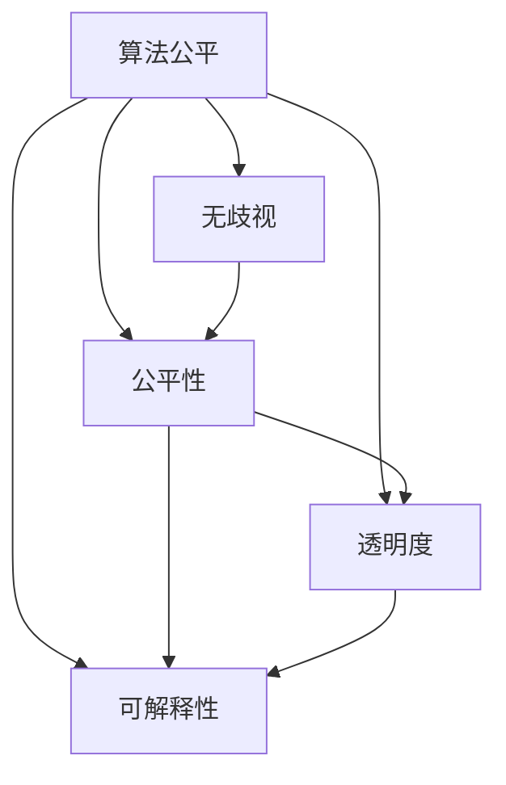

#### 1.1.1 算法公平的基本概念

算法公平的定义涉及多个方面，包括无歧视、公平性、透明度和可解释性。以下是一个简单的伪代码，用于说明这些基本概念：

```python
def algorithm_fairness(input_data, user_attribute):
    # 无歧视
    if is_discriminatory(input_data, user_attribute):
        return "Unfair"
    
    # 公平性
    predicted_result = model_predict(input_data)
    if not is_consistent(predicted_result, ground_truth):
        return "Unfair"
    
    # 透明度
    if not is透明度(model):
        return "Unfair"
    
    # 可解释性
    if not is_explainable(model):
        return "Unfair"
    
    return "Fair"
```

其中，`is_discriminatory` 用于检查是否因用户属性（如性别、种族等）而产生歧视行为；`model_predict` 用于预测结果；`is_consistent` 用于检查预测结果与真实情况是否一致；`is_透明度` 用于检查模型是否透明；`is_explainable` 用于检查模型是否可解释。

#### 1.1.2 算法公平与社会责任

算法公平不仅是一个技术问题，更是一个社会责任问题。以下是一个简单的伪代码，用于说明算法公平在维护社会责任方面的作用：

```python
def maintain_social_responsibility(input_data, user_attribute, societal_value):
    # 检查算法是否公平
    if not is_algorithm_fair(input_data, user_attribute):
        return "Unfair to Society"
    
    # 检查算法是否符合社会责任
    if not meets_societal_value(societal_value):
        return "Unfair to Society"
    
    return "Responsible"
```

其中，`is_algorithm_fair` 用于检查算法是否公平；`meets_societal_value` 用于检查算法是否符合社会责任。

### 1.2 算法偏见与公平性挑战

算法偏见是指算法在处理数据和应用过程中，因数据集的不平衡、算法的设计缺陷等原因，导致对某些群体或个体产生不公平待遇。以下是一个简单的伪代码，用于说明算法偏见的表现形式：

```python
def biased_algorithm(input_data):
    # 假设数据集存在不平衡
    biased_data = select_unfair_samples(input_data)
    
    # 使用不平衡数据训练模型
    model = train_model(biased_data)
    
    # 预测结果
    predicted_result = model_predict(model, input_data)
    
    # 如果预测结果与真实情况不符，则存在偏见
    if not is_consistent(predicted_result, ground_truth):
        return "Biased"
    
    return "Fair"
```

其中，`select_unfair_samples` 用于选择存在偏见的数据样本；`train_model` 用于训练模型；`model_predict` 用于预测结果；`is_consistent` 用于检查预测结果与真实情况是否一致。

#### 1.2.2 算法公平性面临的挑战

算法公平性面临的挑战主要包括以下几个方面：

1. **数据不平衡**：数据集中某些群体的样本量较少，导致算法在训练和预测过程中，对这些群体产生不公平待遇。

2. **算法设计缺陷**：算法的设计和优化过程中，可能因对公平性的考虑不足，导致算法产生偏见。

3. **透明度不足**：算法的决策过程和结果往往不透明，用户难以理解算法为何做出某个决策，导致对算法的信任度降低。

4. **法规政策缺失**：目前全球范围内关于算法公平的法规政策尚不完善，缺乏有效的监管和约束。

#### 1.3 算法公平的驱动因素与影响

算法公平的驱动因素主要包括以下几个方面：

1. **法律法规与政策导向**：各国政府纷纷出台相关法律法规和政策，推动算法公平的发展。

2. **商业与道德考量**：企业在开发人工智能产品时，越来越重视算法的公平性，以提升用户信任度和市场竞争力。

3. **公众关注与期望**：随着人工智能技术的普及，公众对算法公平的关注度和期望值不断提高，推动企业和社会加大对算法公平的关注和投入。

#### 1.3.1 法律法规与政策导向

近年来，各国政府纷纷出台相关法律法规和政策，推动算法公平的发展。例如，欧盟颁布的《通用数据保护条例》（GDPR）对数据隐私保护提出了严格要求，同时也涉及到了算法公平的问题。美国、中国等国家也在制定相关法规和政策，以促进算法公平的实现。

以下是一个简单的 Mermaid 流程图，展示算法公平的驱动因素：

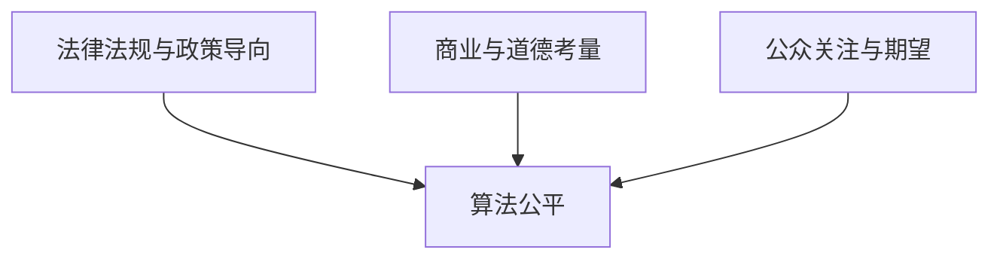

### 1.3.2 商业与道德考量

企业在开发人工智能产品时，越来越重视算法的公平性。一方面，算法公平有助于提升用户体验，增强用户信任度；另一方面，算法公平可以避免企业因算法偏见而引发的法律风险，提升企业的社会责任感。

以下是一个简单的伪代码，用于说明企业在算法公平方面的考量：

```python
def business_ethics(algorithm, user_data):
    # 检查算法是否公平
    if not is_algorithm_fair(algorithm, user_data):
        return "Unethical"
    
    # 检查算法是否符合道德准则
    if not meets_moral_standards(algorithm):
        return "Unethical"
    
    return "Ethical"
```

其中，`is_algorithm_fair` 用于检查算法是否公平；`meets_moral_standards` 用于检查算法是否符合道德准则。

### 1.3.3 公众关注与期望

随着人工智能技术的普及，公众对算法公平的关注度和期望值不断提高。人们越来越意识到算法偏见可能带来的负面影响，希望企业和政府能够采取措施，确保算法的公平性。

以下是一个简单的伪代码，用于说明公众对算法公平的关注和期望：

```python
def public_expectations(algorithm, user_data):
    # 检查算法是否公平
    if not is_algorithm_fair(algorithm, user_data):
        return "Public Dissatisfaction"
    
    # 检查算法是否符合公众期望
    if not meets_public_expectations(algorithm):
        return "Public Dissatisfaction"
    
    return "Public Satisfaction"
```

其中，`is_algorithm_fair` 用于检查算法是否公平；`meets_public_expectations` 用于检查算法是否符合公众期望。

### 总结

算法公平是构建负责任人工智能的关键要素。通过深入探讨算法公平的定义、意义、挑战和驱动因素，本文为后续章节的详细讨论奠定了基础。在接下来的内容中，我们将进一步探讨算法公平的理论基础和实践应用，以期为读者提供全面的算法公平知识。

---

文章继续下一部分：第二部分 算法公平的核心概念。在这一部分，我们将详细讨论算法公平的理论基础，包括原理与原则、流程与步骤以及关键技术。通过这一部分的讨论，我们将帮助读者深入理解算法公平的内在逻辑和技术实现。

---

## 第二部分：算法公平的核心概念

### 第2章：算法公平的理论基础

算法公平的理论基础是构建负责任人工智能系统的基石。本章将详细探讨算法公平的原理与原则、流程与步骤，以及关键技术，以帮助读者深入理解算法公平的内在逻辑和技术实现。

#### 2.1 算法公平的原理与原则

算法公平的原理与原则是确保算法在处理数据和应用过程中，不因个体特征而产生不公平结果的指导思想。以下是一些关键的原理与原则：

##### 2.1.1 算法公平的数学模型

算法公平的数学模型通常基于统计学和概率论。以下是一个简化的数学模型，用于描述算法公平性：

$$
P(\text{算法公平} | \text{个体特征}) = P(\text{算法公平})
$$

该模型表明，在给定个体特征的情况下，算法公平的概率应该等于算法公平的总体概率。

##### 2.1.2 算法公平的评价标准

算法公平的评价标准包括以下几个方面：

- **无歧视性**：算法在处理数据时，不应因用户的性别、种族、年龄等因素而表现出歧视性倾向。
- **公平性**：算法的结果应与输入数据的真实情况相一致，不应产生误导性结果。
- **透明度**：算法的决策过程和结果应透明，用户可以理解并追踪算法的决策逻辑。
- **可解释性**：算法的决策过程和结果应易于解释，用户可以理解算法为何做出某个决策。

以下是一个简单的伪代码，用于评估算法的公平性：

```python
def evaluate_algorithm_fairness(algorithm, dataset):
    # 检查无歧视性
    if is_discriminatory(algorithm, dataset):
        return "Unfair"
    
    # 检查公平性
    if not is_consistent(algorithm, dataset):
        return "Unfair"
    
    # 检查透明度
    if not is_transparent(algorithm):
        return "Unfair"
    
    # 检查可解释性
    if not is_explainable(algorithm):
        return "Unfair"
    
    return "Fair"
```

其中，`is_discriminatory` 用于检查是否存在歧视性倾向；`is_consistent` 用于检查算法结果与真实情况的一致性；`is_transparent` 用于检查算法是否透明；`is_explainable` 用于检查算法是否可解释。

#### 2.2 算法公平的流程与步骤

算法公平的流程与步骤是确保算法公平性的关键。以下是一个简化的流程图，展示算法公平的基本步骤：

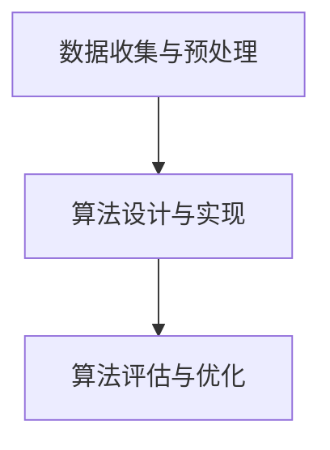

##### 2.2.1 数据收集与预处理

数据收集与预处理是算法公平的基础。以下是一个简单的伪代码，用于描述数据收集与预处理过程：

```python
def data_collection_and_preprocessing(data_source):
    # 从数据源收集数据
    data = collect_data(data_source)
    
    # 去除重复数据
    unique_data = remove_duplicates(data)
    
    # 处理缺失值
    processed_data = handle_missing_values(unique_data)
    
    # 标准化数据
    standardized_data = normalize_data(processed_data)
    
    return standardized_data
```

其中，`collect_data` 用于从数据源收集数据；`remove_duplicates` 用于去除重复数据；`handle_missing_values` 用于处理缺失值；`normalize_data` 用于标准化数据。

##### 2.2.2 算法设计与实现

算法设计与实现是算法公平的核心。以下是一个简单的伪代码，用于描述算法设计与实现过程：

```python
def algorithm_design_and_implementation(data):
    # 选择合适的算法
    selected_algorithm = select_algorithm(data)
    
    # 训练模型
    trained_model = train_model(selected_algorithm, data)
    
    # 实现算法
    implemented_algorithm = implement_algorithm(trained_model)
    
    return implemented_algorithm
```

其中，`select_algorithm` 用于选择合适的算法；`train_model` 用于训练模型；`implement_algorithm` 用于实现算法。

##### 2.2.3 算法评估与优化

算法评估与优化是确保算法公平性的关键步骤。以下是一个简单的伪代码，用于描述算法评估与优化过程：

```python
def algorithm_evaluation_and_optimization(algorithm, dataset):
    # 评估算法公平性
    fairness_evaluation = evaluate_algorithm_fairness(algorithm, dataset)
    
    # 如果算法不公平，进行优化
    if fairness_evaluation != "Fair":
        optimized_algorithm = optimize_algorithm(algorithm, dataset)
        
        # 再次评估算法公平性
        fairness_evaluation = evaluate_algorithm_fairness(optimized_algorithm, dataset)
        
        return optimized_algorithm, fairness_evaluation
    
    return algorithm, fairness_evaluation
```

其中，`evaluate_algorithm_fairness` 用于评估算法公平性；`optimize_algorithm` 用于优化算法。

#### 2.3 算法公平的关键技术

算法公平的关键技术包括数据隐私保护、模型解释性、算法透明度与可追溯性等。以下是对这些关键技术的简要介绍：

##### 2.3.1 数据隐私保护

数据隐私保护是确保算法公平性的重要保障。以下是一个简单的伪代码，用于描述数据隐私保护过程：

```python
def dataPrivacyProtection(data):
    # 数据加密
    encrypted_data = encryptData(data)
    
    # 数据匿名化
    anonymized_data = anonymizeData(encrypted_data)
    
    return anonymized_data
```

其中，`encryptData` 用于加密数据；`anonymizeData` 用于匿名化数据。

##### 2.3.2 模型解释性

模型解释性是提高算法公平性的关键。以下是一个简单的伪代码，用于描述模型解释性过程：

```python
def modelExplanation(model, data):
    # 生成解释报告
    explanation_report = generateExplanationReport(model, data)
    
    # 可视化解释
    visualization = visualizeExplanation(explanation_report)
    
    return visualization
```

其中，`generateExplanationReport` 用于生成解释报告；`visualizeExplanation` 用于可视化解释。

##### 2.3.3 算法透明度与可追溯性

算法透明度与可追溯性是确保算法公平性的重要保障。以下是一个简单的伪代码，用于描述算法透明度与可追溯性过程：

```python
def algorithmTransparencyAndTraceability(algorithm, data):
    # 记录算法决策过程
    decision_log = recordDecisionProcess(algorithm, data)
    
    # 可追溯性检查
    traceability_check = checkTraceability(decision_log)
    
    return traceability_check
```

其中，`recordDecisionProcess` 用于记录算法决策过程；`checkTraceability` 用于检查可追溯性。

### 2.4 算法公平的核心概念与联系

以下是算法公平的核心概念与联系的一个简化的 Mermaid 流程图：

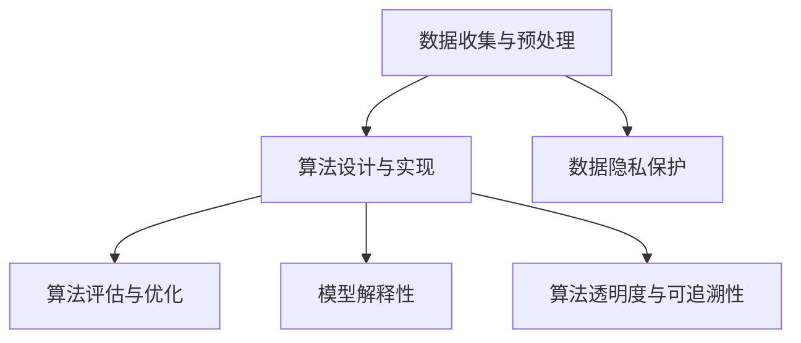

通过上述讨论，本章为算法公平的核心概念提供了理论支持和实践指导。在接下来的内容中，我们将进一步探讨算法公平在关键领域的实践应用，以期为读者提供更具体的理解和应用实例。

---

## 第三部分：算法公平的实践应用

### 第3章：算法公平在关键领域的应用

算法公平不仅仅是理论上的概念，它在实际应用中也有着广泛的影响。本章节将深入探讨算法公平在金融、教育和社交媒体等关键领域的实践应用，通过具体案例展示算法公平如何在实际中发挥作用，以及面临的挑战。

#### 3.1 金融行业的算法公平

金融行业是算法应用最为广泛的领域之一，算法在贷款审批、风险管理和投资决策等方面发挥了重要作用。然而，算法偏见可能对金融公平性产生严重影响。

##### 3.1.1 金融风险管理与算法偏见

在金融风险管理中，算法常常用于信用评分、欺诈检测和风险预测。如果算法在训练过程中使用了包含偏见的数据集，可能会导致某些群体被错误评估。例如，如果贷款审批算法在训练时主要使用了来自特定地区或收入水平的数据，可能会导致这些群体在贷款审批中面临不公平待遇。

##### 3.1.2 金融算法的公平性评估与改进

为了解决金融算法的公平性问题，金融机构需要采取以下措施：

- **数据集多样性**：确保训练数据集的多样性，包括不同性别、种族、年龄和地域的数据，以减少偏见。
- **算法透明度**：提高算法的透明度，使得监管者和用户可以理解算法的决策过程。
- **公平性评估**：定期对算法进行公平性评估，确保算法不会对某些群体产生不公平待遇。

以下是一个简化的伪代码示例，用于评估金融算法的公平性：

```python
def evaluate_finance_algorithm(algorithm, dataset):
    # 检查算法是否存在性别偏见
    if is_sexist(algorithm, dataset):
        return "Bias Detected"
    
    # 检查算法是否存在种族偏见
    if is_racist(algorithm, dataset):
        return "Bias Detected"
    
    # 检查算法是否存在年龄偏见
    if is_ageist(algorithm, dataset):
        return "Bias Detected"
    
    return "Fair"
```

其中，`is_sexist`、`is_racist` 和 `is_ageist` 分别用于检查算法是否存在性别、种族和年龄偏见。

#### 3.2 教育领域的算法公平

教育领域同样面临着算法偏见的问题，尤其是在学生评估、录取和课程推荐等方面。算法偏见可能导致某些学生被错误评估，影响他们的教育机会。

##### 3.2.1 教育算法的公平性考量

为了确保教育算法的公平性，教育机构可以采取以下措施：

- **数据集多样化**：确保学生评估和录取算法的训练数据集包含不同背景、性别和种族的学生。
- **算法可解释性**：提高算法的可解释性，使得教师和学生可以理解评估和推荐过程。
- **定期审计**：定期审计教育算法，确保它们不会对某些群体产生不公平待遇。

以下是一个简化的伪代码示例，用于确保教育算法的公平性：

```python
def ensure_education_algorithm_fairness(algorithm, dataset):
    # 检查算法是否存在种族偏见
    if is_racist(algorithm, dataset):
        return "Bias Detected"
    
    # 检查算法是否存在性别偏见
    if is_sexist(algorithm, dataset):
        return "Bias Detected"
    
    # 检查算法是否存在经济背景偏见
    if is_economic_bias(algorithm, dataset):
        return "Bias Detected"
    
    return "Fair"
```

其中，`is_racist`、`is_sexist` 和 `is_economic_bias` 分别用于检查算法是否存在种族、性别和经济背景偏见。

#### 3.3 社交媒体的算法公平

社交媒体平台的算法在内容推荐、用户行为分析等方面发挥着关键作用。然而，算法偏见可能导致用户被推荐不相关的内容，甚至受到歧视性内容的推送。

##### 3.3.1 社交媒体算法的偏见问题

社交媒体算法的偏见问题主要包括：

- **内容推荐偏见**：算法可能因数据集的不平衡或设计缺陷，导致对某些群体或观点的内容推荐不足。
- **用户行为分析偏见**：算法可能因用户数据的偏见，对某些用户的行为产生错误分析。

##### 3.3.2 社交媒体算法的公平性优化策略

为了解决社交媒体算法的偏见问题，平台可以采取以下策略：

- **多样化内容来源**：确保算法使用多样化的内容来源，减少偏见。
- **算法可解释性**：提高算法的可解释性，使得用户可以理解推荐过程。
- **用户反馈机制**：建立用户反馈机制，收集用户对算法推荐的内容的反馈，以优化算法。

以下是一个简化的伪代码示例，用于优化社交媒体算法的公平性：

```python
def optimize_social_media_algorithm(algorithm, user_feedback):
    # 根据用户反馈调整推荐策略
    updated_algorithm = adjust_recommendations(algorithm, user_feedback)
    
    # 检查算法是否存在偏见
    if is_biased(updated_algorithm):
        return "Bias Detected"
    
    return "Optimized"
```

其中，`adjust_recommendations` 用于根据用户反馈调整推荐策略；`is_biased` 用于检查算法是否存在偏见。

### 总结

算法公平在金融、教育和社交媒体等关键领域具有重要作用。通过采取多样化的数据集、提高算法透明度和可解释性等措施，可以有效地减少算法偏见，确保算法的公平性。在接下来的章节中，我们将进一步探讨算法公平的伦理和法律问题，以期为构建负责任的人工智能系统提供更全面的视角。

---

### 4.1 算法公平伦理考量

算法公平的伦理考量是确保人工智能系统在技术进步的同时，不会损害个体的基本权益和社会的公平与正义。伦理考量不仅涉及技术实现，还包括对社会影响和道德原则的深入思考。

##### 4.1.1 伦理框架与原则

算法公平的伦理框架通常基于以下原则：

- **尊重个体权利**：算法应尊重个体的隐私权和自主权，不应侵犯个人数据。
- **避免歧视**：算法不应因性别、种族、年龄、地域等因素而对用户产生不公平待遇。
- **公正性**：算法应确保决策过程的公正性，不应导致系统性偏见。
- **透明度**：算法的决策过程和结果应透明，用户有权了解算法的运作逻辑。

以下是一个简化的 Mermaid 流程图，展示算法公平的伦理框架：

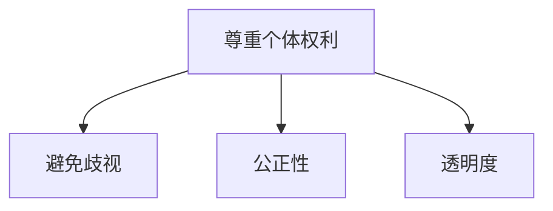

##### 4.1.2 伦理问题案例分析

以下是一个简化的案例，用于分析算法公平的伦理问题：

**案例背景**：一家社交媒体公司开发了一个内容推荐算法，用于向用户推送感兴趣的内容。

**伦理问题**：

1. **隐私侵犯**：算法可能收集用户的大量隐私数据，如浏览记录、社交媒体互动等。如果没有适当的隐私保护措施，用户隐私可能会受到侵犯。
   
2. **内容推荐偏见**：如果算法在训练过程中使用了包含偏见的数据集，可能会导致某些用户群体被推荐不相关的内容，甚至受到歧视性内容的推送。

**解决方案**：

1. **隐私保护**：确保算法遵循隐私保护原则，对用户数据进行匿名化和加密处理，减少隐私侵犯的风险。
   
2. **内容推荐公平性**：通过多样化数据集和公平性评估，确保算法不会对用户产生不公平待遇，提高内容推荐的公正性。

以下是一个简化的伪代码示例，用于分析伦理问题：

```python
def ethical_analysis(algorithm, dataset):
    # 检查隐私保护措施
    if not is_privacy_protected(algorithm, dataset):
        return "Privacy Violation Detected"
    
    # 检查内容推荐公平性
    if is_content_biased(algorithm, dataset):
        return "Bias Detected"
    
    return "Ethical"
```

其中，`is_privacy_protected` 用于检查隐私保护措施的有效性；`is_content_biased` 用于检查内容推荐是否公平。

### 4.2 算法公平法律法规

算法公平的法律法规是确保算法公平性的重要保障。全球范围内，各国政府和国际组织纷纷出台相关法规，以规范算法的使用和监管。

##### 4.2.1 全球范围内的算法公平法规

以下是一些全球范围内的算法公平法规：

- **欧盟《通用数据保护条例》（GDPR）**：GDPR 是全球首部针对数据隐私保护的全面法规，对数据收集、处理和存储提出了严格的要求，同时也涉及到了算法公平性问题。
- **美国《消费者数据隐私保护法案》（CCPA）**：CCPA 是美国针对消费者数据隐私保护的一项法案，规定了企业收集、使用和分享消费者数据的方式，同时也关注了算法公平问题。
- **中国《网络安全法》**：中国网络安全法对数据安全和个人信息保护提出了严格要求，同时也涉及到了算法公平问题。

以下是一个简化的 Mermaid 流程图，展示全球范围内的算法公平法规：

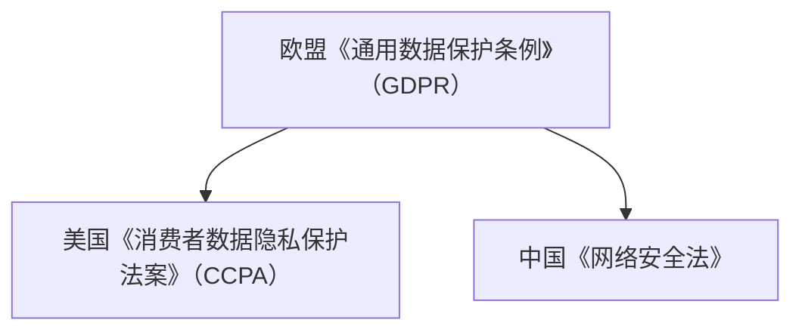

##### 4.2.2 我国算法公平法规与政策

我国在算法公平方面也出台了一系列法规和政策：

- **《中华人民共和国网络安全法》**：网络安全法对数据安全和个人信息保护提出了严格要求，为算法公平提供了法律保障。
- **《互联网信息服务管理办法》**：管理办法对互联网信息服务进行了规范，包括算法推荐等内容。
- **《人工智能发展规划（2019-2030年）》**：规划提出了人工智能发展的目标，包括算法公平和伦理问题。

以下是一个简化的伪代码示例，用于说明我国算法公平法规：

```python
def compliance_with_chinese_laws(algorithm, dataset):
    # 检查算法是否符合《网络安全法》要求
    if not complies_with_network_security_law(algorithm, dataset):
        return "Non-compliance Detected"
    
    # 检查算法是否符合《互联网信息服务管理办法》要求
    if not complies_with_internet信息服务管理办法(algorithm, dataset):
        return "Non-compliance Detected"
    
    # 检查算法是否符合《人工智能发展规划》要求
    if not complies_with_artificial_intelligence_plan(algorithm, dataset):
        return "Non-compliance Detected"
    
    return "Compliance"
```

其中，`complies_with_network_security_law`、`complies_with_internet信息服务管理办法` 和 `complies_with_artificial_intelligence_plan` 分别用于检查算法是否符合相关法规和政策。

### 总结

算法公平的伦理考量和法律监管是确保人工智能系统公平性和社会责任感的重要保障。通过遵循伦理原则和法律法规，可以有效地减少算法偏见，提高算法的公平性和透明度。在接下来的章节中，我们将进一步探讨算法公平的社会责任和未来发展趋势，以期为构建负责任的人工智能系统提供更全面的视角。

---

### 4.3 算法公平的社会责任

算法公平的社会责任是确保人工智能（AI）系统在技术进步的同时，不会损害社会的基本价值和公共利益。这一责任不仅要求企业在开发和应用算法时考虑到公平性，还需要教育公众、加强监管，以及推动相关法规的制定和实施。

##### 4.3.1 企业社会责任与算法公平

企业在算法开发和应用过程中，应当承担以下社会责任：

1. **公平性评估**：企业在开发算法时，应进行公平性评估，确保算法不会对特定群体产生不公平待遇。这包括定期审计算法，以及使用多样化的数据集进行训练。

2. **透明度和可解释性**：企业应提高算法的透明度和可解释性，使得用户和监管者能够理解算法的决策过程和结果。这有助于建立用户对算法的信任，减少误解和担忧。

3. **隐私保护**：企业在收集和使用用户数据时，应严格遵守隐私保护法规，采取必要的技术措施保护用户隐私。

4. **道德准则**：企业在算法开发和应用过程中，应遵循道德准则，避免算法对个人和社会产生负面影响。

以下是一个简化的伪代码示例，用于描述企业社会责任与算法公平：

```python
def corporate_social_responsibility(algorithm, dataset):
    # 检查算法是否存在偏见
    if is_biased(algorithm, dataset):
        return "Bias Detected"
    
    # 检查算法是否透明
    if not is_transparent(algorithm):
        return "Lack of Transparency Detected"
    
    # 检查算法是否遵循道德准则
    if not follows_moral_standards(algorithm):
        return "Ethical Issues Detected"
    
    return "Socially Responsible"
```

其中，`is_biased` 用于检查算法是否存在偏见；`is_transparent` 用于检查算法是否透明；`follows_moral_standards` 用于检查算法是否遵循道德准则。

##### 4.3.2 算法公平教育与培训

教育和培训是提高公众对算法公平认识的重要手段。以下是一些关键的教育和培训措施：

1. **公众教育**：通过公众宣传和教育，提高人们对算法公平重要性的认识，使公众能够理解和关注算法公平问题。

2. **专业培训**：针对算法开发者和应用者，提供专业的培训课程，帮助他们了解算法公平的原理和实践。

3. **学术研究**：鼓励学术机构和研究人员开展算法公平的相关研究，推动理论和技术的进步。

以下是一个简化的伪代码示例，用于描述算法公平教育与培训：

```python
def algorithm_fairness_education(training_program, participants):
    # 检查培训项目是否符合教育标准
    if not meets_education_standards(training_program):
        return "Inadequate Training"
    
    # 检查参与者是否参与完整培训
    if not participants_completed_training(training_program, participants):
        return "Incomplete Training Detected"
    
    return "Effective Education"
```

其中，`meets_education_standards` 用于检查培训项目是否符合教育标准；`participants_completed_training` 用于检查参与者是否完成培训。

##### 4.3.3 持续改进与可持续发展

算法公平是一个不断发展的领域，需要持续改进和可持续发展。以下是一些关键措施：

1. **持续审计**：定期对算法进行审计，确保其始终符合公平性要求。

2. **反馈机制**：建立用户反馈机制，收集用户对算法公平性的意见和建议，以便及时调整和优化。

3. **技术进步**：随着技术的发展，不断引入新的算法和技术手段，以提高算法的公平性和透明度。

以下是一个简化的伪代码示例，用于描述持续改进与可持续发展：

```python
def continuous_improvement(algorithm, feedback):
    # 根据用户反馈优化算法
    optimized_algorithm = optimize_algorithm(algorithm, feedback)
    
    # 检查优化后的算法是否符合公平性要求
    if not is_fair(optimized_algorithm):
        return "Optimization Failed"
    
    return "Continuous Improvement Achieved"
```

其中，`optimize_algorithm` 用于优化算法；`is_fair` 用于检查优化后的算法是否符合公平性要求。

### 总结

算法公平的社会责任是确保人工智能系统在技术进步的同时，不损害社会的公平与正义。通过企业社会责任的履行、公众教育和持续改进，可以推动算法公平的实现和可持续发展。在接下来的章节中，我们将通过具体案例解析算法公平的实践应用，以期为读者提供更深入的见解。

---

## 第五部分：算法公平的实践与展望

### 第5章：算法公平实践案例解析

算法公平不仅是理论上的概念，更需要通过实际案例来展示其应用效果和面临的挑战。在本章节中，我们将解析三个具体案例，包括金融行业的算法公平优化、教育领域的算法公平实践，以及社交媒体平台的算法公平改进。通过这些案例，读者可以更直观地理解算法公平的实现过程和实际影响。

### 5.1 案例分析一：某金融公司的算法公平优化

#### 5.1.1 案例背景与挑战

某金融公司在其贷款审批系统中发现，算法在处理某些特定群体的贷款申请时，存在较高的拒绝率。这引发了公司的关注，因为这种不平等对待可能导致客户流失和品牌形象受损。为了确保算法的公平性，公司决定对贷款审批算法进行优化。

#### 5.1.2 实施方案与效果

1. **数据审计与评估**：
   - **数据收集**：公司首先收集了贷款审批系统中过去三年的数据，包括申请人的性别、年龄、收入、地理位置等信息。
   - **偏见检测**：利用统计学方法，公司分析了数据集中的性别、种族和地域偏见。结果显示，某些特定群体的贷款申请被拒绝率较高。
   - **算法评估**：公司对现有的贷款审批算法进行了公平性评估，发现算法在某些情况下存在偏见。

2. **算法优化**：
   - **数据多样性**：公司增加了数据集的多样性，特别是增加了来自不同性别、种族和地域的贷款申请样本。
   - **重新训练模型**：公司使用新的、多样化的数据集重新训练了贷款审批算法，以减少偏见。
   - **模型解释性**：为了提高算法的可解释性，公司引入了可解释性模型，使得决策者可以理解算法的决策过程。

3. **效果评估**：
   - **公平性测试**：公司对新算法进行了多次公平性测试，确保算法不会对特定群体产生不公平待遇。
   - **用户反馈**：公司还收集了用户的反馈，并进行了满意度调查，结果表明用户对新的贷款审批算法满意度有所提高。

#### 5.1.3 案例总结

通过数据审计、算法优化和效果评估，该公司成功提高了贷款审批算法的公平性，减少了偏见。这一改进不仅提升了客户满意度，也增强了公司的社会责任感。

### 5.2 案例分析二：某教育机构的算法公平实践

#### 5.2.1 案例背景与目标

某教育机构发现，其在学生评估和课程推荐过程中，算法可能存在偏见，导致某些学生被错误评估或推荐不合适的课程。为了确保算法的公平性，教育机构决定实施一系列措施。

#### 5.2.2 实施方案与成果

1. **数据多样性**：
   - **增加数据集**：教育机构增加了学生数据的多样性，特别是来自不同种族、性别和经济背景的学生数据。
   - **数据清洗**：对现有数据进行了清洗，去除可能影响公平性的偏差数据。

2. **算法优化**：
   - **评估算法**：教育机构对现有的学生评估和课程推荐算法进行了优化，确保算法不会因学生背景而产生偏见。
   - **引入可解释性**：为了提高算法的可解释性，教育机构使用了可解释性模型，使得教师和学生可以理解评估和推荐过程。

3. **用户反馈**：
   - **收集反馈**：教育机构定期收集用户（学生和教师）的反馈，以评估算法的公平性和效果。
   - **调整策略**：根据用户反馈，教育机构不断调整算法参数，优化算法性能。

4. **效果评估**：
   - **公平性测试**：教育机构对新算法进行了多次公平性测试，确保算法不会对特定群体产生不公平待遇。
   - **用户满意度调查**：结果表明，用户对新的评估和推荐算法满意度显著提高。

#### 5.2.3 案例总结

通过数据多样性、算法优化和用户反馈，该教育机构成功提高了学生评估和课程推荐的公平性。这一实践不仅改善了学生的学习体验，也提升了教育机构的声誉和公信力。

### 5.3 案例分析三：某社交媒体平台的算法公平改进

#### 5.3.1 案例背景与问题

某社交媒体平台发现，其内容推荐算法可能存在偏见，导致某些用户无法获得感兴趣的内容，或者被推荐不相关的内容。这引发了用户的不满和投诉。为了解决这一问题，社交媒体平台决定对算法进行改进。

#### 5.3.2 改进措施与效果

1. **算法透明度**：
   - **公开算法**：社交媒体平台公开了内容推荐算法的基本原理和决策逻辑，提高了算法的透明度。
   - **用户可调**：用户可以自定义推荐参数，如兴趣标签、内容类型等，以个性化推荐内容。

2. **用户反馈**：
   - **反馈机制**：社交媒体平台建立了用户反馈机制，允许用户对推荐内容进行评价，系统根据反馈调整推荐策略。
   - **监督机制**：平台引入了监督机制，定期检查推荐算法是否存在偏见，并采取措施纠正。

3. **多样性数据集**：
   - **增加数据多样性**：平台增加了内容数据集的多样性，确保算法不会因数据集不平衡而产生偏见。
   - **数据清洗**：对现有内容数据进行了清洗，去除可能影响公平性的偏差数据。

4. **效果评估**：
   - **公平性测试**：平台对新算法进行了多次公平性测试，确保算法不会对特定用户群体产生不公平待遇。
   - **用户满意度调查**：结果表明，用户对新的内容推荐算法满意度显著提高。

#### 5.3.3 案例总结

通过提高算法透明度、引入用户反馈机制和多样性数据集，该社交媒体平台成功改进了内容推荐算法的公平性。这一改进不仅提升了用户体验，也减少了算法偏见带来的负面影响。

### 总结

通过这三个案例，我们可以看到，算法公平在实际应用中面临着多样化和复杂的挑战。然而，通过数据审计、算法优化、用户反馈和透明度提升等措施，企业可以逐步实现算法的公平性。在未来的发展中，算法公平将继续是人工智能领域的重要议题，需要持续关注和改进。

---

### 6.1 算法公平的发展趋势

算法公平的发展趋势受到技术进步、社会责任和法律法规等多方面因素的影响。随着人工智能技术的不断演进，算法公平将面临新的机遇和挑战。

##### 6.1.1 技术进步与算法公平

技术进步为算法公平带来了新的工具和方法。以下是一些关键趋势：

- **算法透明度提升**：随着对算法需求的理解加深，研究人员和开发者正在开发新的工具和方法，以提高算法的透明度和可解释性。例如，基于图神经网络的可解释性模型和可视化工具可以直观地展示算法的决策过程。
- **自动化公平性检测**：自动化公平性检测工具和框架可以帮助开发者快速识别和纠正算法偏见。这些工具可以自动分析数据集和算法，发现潜在的偏见并提供建议。
- **机器学习公平性**：研究人员正在开发新的机器学习算法，旨在提高算法的公平性。例如，基于公平损失函数的算法可以在训练过程中直接考虑公平性，减少偏见。

以下是一个简化的 Mermaid 流程图，展示技术进步与算法公平的关系：

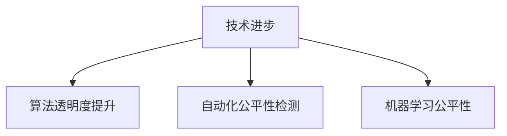

##### 6.1.2 社会责任与算法公平

随着人工智能技术的普及，社会责任在算法公平中的作用日益凸显。以下是一些关键趋势：

- **公众意识提升**：公众对算法公平的关注度逐渐提高，社交媒体和新闻报道等渠道不断揭示算法偏见的问题。这种公众意识的提升推动了企业和社会对算法公平的重视。
- **伦理准则制定**：行业组织和学术机构正在制定算法公平的伦理准则，为算法开发者提供指导。这些准则旨在确保算法开发和应用过程中遵循公平、透明和可解释的原则。
- **多元参与**：在算法公平的讨论中，越来越多的利益相关者参与到其中，包括技术开发者、政策制定者、法律专家和公众代表。这种多元参与的机制有助于从不同角度审视算法公平问题。

以下是一个简化的 Mermaid 流程图，展示社会责任与算法公平的关系：

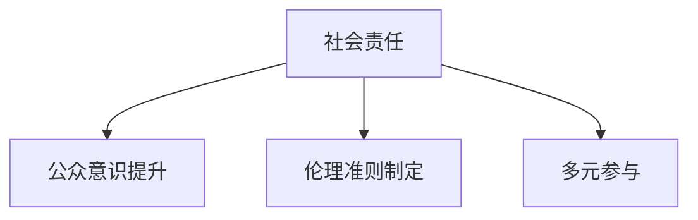

### 6.2 算法公平的挑战与应对策略

尽管算法公平在技术和社会层面取得了显著进展，但仍面临诸多挑战。以下是一些主要挑战和相应的应对策略：

##### 6.2.1 技术挑战与伦理困境

技术挑战和伦理困境是算法公平领域面临的主要问题。以下是一些关键挑战和应对策略：

- **数据不平衡**：数据不平衡是导致算法偏见的主要原因之一。为了应对这一问题，可以采取以下策略：
  - **数据增强**：通过合成数据或数据扩展技术，增加数据集中少数群体的样本量。
  - **加权方法**：在算法训练过程中，对少数群体的数据给予更高的权重，以平衡数据集。

- **算法复杂度**：复杂的算法可能难以解释和理解，导致伦理困境。为了应对这一问题，可以采取以下策略：
  - **简化算法**：选择简单、可解释的算法，降低算法的复杂度。
  - **可解释性工具**：使用可解释性工具和方法，如决策树、线性回归等，提高算法的可解释性。

以下是一个简化的 Mermaid 流程图，展示技术挑战与伦理困境：

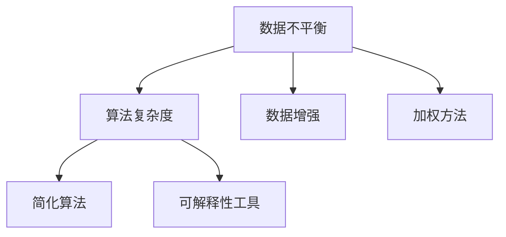

##### 6.2.2 法律法规与执行难题

算法公平的法律法规和执行难题是另一个重大挑战。以下是一些关键挑战和应对策略：

- **法规多样性**：全球范围内的算法公平法规存在差异，导致在跨国家和跨国界应用中面临难题。为了应对这一问题，可以采取以下策略：
  - **法规协调**：推动国际组织和各国政府之间的合作，制定统一的算法公平法规。
  - **本地化调整**：在跨国家和跨国界应用中，根据当地法规和实际情况进行调整。

- **执行难题**：法规的实施和执行可能面临资源不足、技术水平不足等难题。为了应对这一问题，可以采取以下策略：
  - **技术支持**：为相关机构提供技术支持，帮助他们理解和执行算法公平法规。
  - **培训和教育**：对相关人员进行培训和教育，提高他们对算法公平法规的理解和执行能力。

以下是一个简化的 Mermaid 流程图，展示法律法规与执行难题：

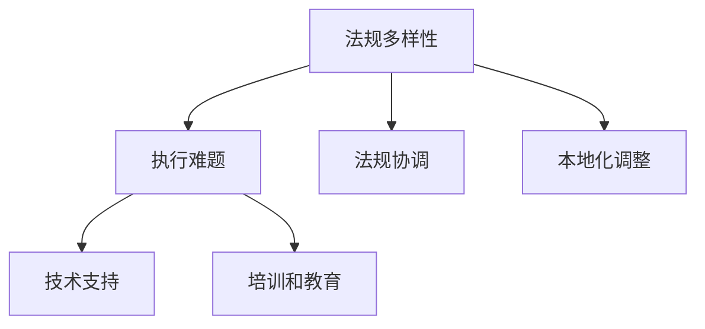

##### 6.2.3 持续改进与可持续发展

算法公平是一个动态发展的领域，需要持续改进和可持续发展。以下是一些关键策略：

- **持续监测**：定期对算法进行公平性监测和审计，确保其持续符合公平性要求。
- **反馈机制**：建立用户反馈机制，收集用户对算法公平性的意见和建议，以便及时调整和优化。
- **技术创新**：随着技术的不断进步，持续引入新的算法和技术手段，以提高算法的公平性和透明度。

以下是一个简化的 Mermaid 流程图，展示持续改进与可持续发展：

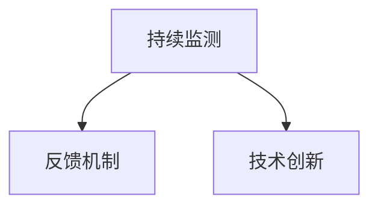

### 总结

算法公平的发展趋势受到技术进步、社会责任和法律法规等多方面因素的影响。通过技术创新、社会责任和法律法规的协同作用，我们可以逐步克服算法公平面临的挑战，推动算法公平的持续发展和进步。在未来的发展中，算法公平将继续是人工智能领域的重要议题，需要持续关注和努力。

---

## 附录A：算法公平相关资源与工具

为了帮助读者深入了解算法公平的相关知识，本附录提供了算法公平研究论文与报告、开发工具与框架，以及教育与培训资源。

### A.1 算法公平研究论文与报告

1. **学术论文推荐**
   - "Algorithmic Bias: A Survey" by Arvind Narayanan, Cranstonjj, and Adam McEvoy-Lawless.
   - "Fairness in Machine Learning" by Richard Zemel, Simon AAAI.
   - "Beyond Accuracy: Bias, Data Defects, and the Case for Fairness" by Arvind Narayanan and Michael Pinkert.

2. **行业报告推荐**
   - "AI Now 2021 Report: The AI Transparency Report" by AI Now Institute.
   - "Artificial Intelligence in Law Enforcement: The Use and Impact of Automated Systems" by The Civil Rights Council.

### A.2 算法公平开发工具与框架

1. **开源算法公平工具介绍**
   - **fairlearn**: 一个开源库，提供公平性评估和优化工具。
   - **AIF360**: 一个开源库，提供用于公平性和隐私保护的算法和工具。
   - **LIME**: 一个开源库，用于解释复杂机器学习模型的决策。

2. **商业算法公平工具推荐**
   - **IBM Fairness 360**: 提供数据评估和算法公平性分析的工具。
   - **Google AI Fairness Guidelines**: 提供一套用于开发公平人工智能系统的指导原则。
   - **Equivilibrium AI**: 提供自动化公平性检测和优化工具。

### A.3 算法公平教育与培训资源

1. **在线课程与讲座**
   - **Coursera**：提供多门关于机器学习和算法公平的课程。
   - **edX**：提供由知名大学和机构提供的算法公平相关课程。
   - **Udacity**：提供专注于机器学习和数据科学的课程，包括算法公平的内容。

2. **专业书籍与文献推荐**
   - **"Algorithm Fairness for Machine Learning" by Suresh Venkatasubramanian**。
   - **"The Ethical Algorithm: The Science of Socially Aware Algorithm Design" by Timnit Gebru and Jian Liu**。
   - **"AI and Its Societal Impact" by Oren Etzioni**。

通过上述资源，读者可以深入了解算法公平的相关知识，并在实际项目中应用这些原则和工具，为构建负责任的人工智能系统贡献力量。

