                 

# 《管理者如何建立个人知识管理系统》

> **关键词**：个人知识管理、知识获取、知识共享、知识存储、知识利用、管理系统、管理者、企业应用

> **摘要**：本文旨在探讨管理者如何建立个人知识管理系统，通过分析个人知识管理的重要性、基础概念、工具与方法，详细阐述个人知识管理系统的设计与实施、优化与评估，以及其在企业管理中的应用和未来发展趋势。文章结合实际案例，提供实用的指导，帮助管理者提升个人知识管理水平。

## 第1章：个人知识管理的重要性

### 1.1 个人知识管理的定义

个人知识管理（Personal Knowledge Management，简称PKM）是一种系统性的方法，用于帮助个人获取、整理、存储、共享和利用知识。它不仅涉及到知识的显性形式，如文档、数据和信息，还包括隐性知识，即个人通过经验、技能和直觉所获得的知识。

#### 核心概念与联系

**Mermaid 流程图**：

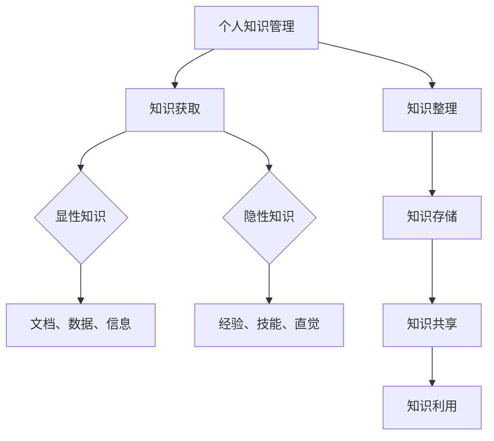

#### 核心算法原理讲解

个人知识管理的过程可以看作是一个数据处理的流程，其核心算法原理可以简单描述如下：

1. **知识获取**：通过多种渠道（如学习、阅读、交流等）获取知识。
2. **知识整理**：对获取的知识进行分类、标注和整理，以便于后续的存储和利用。
3. **知识存储**：将整理后的知识存储在适当的工具或系统中，如笔记工具、文档管理系统等。
4. **知识共享**：通过团队协作、知识库等方式，将知识分享给他人。
5. **知识利用**：通过检索、分析和应用知识，解决实际问题或创造价值。

#### 数学模型和公式

知识管理的数学模型可以看作是一个知识流动的网络，其公式可以表示为：

\[ 知识流动 = 知识获取 + 知识整理 + 知识存储 + 知识共享 + 知识利用 \]

#### 举例说明

假设一个软件开发者，他每天都会阅读技术博客、书籍，参加技术研讨会，并通过这些渠道获取新的知识。他将这些知识进行分类，比如分类为“前端技术”、“后端技术”等，然后存储在云端笔记工具中。在需要解决问题时，他会检索相关知识，并进行应用。

### 1.2 个人知识管理在企业中的应用

在企业管理中，个人知识管理发挥着至关重要的作用。它不仅能够提高员工的工作效率，还能够促进企业的创新和持续发展。

#### 核心概念与联系

**Mermaid 流程图**：

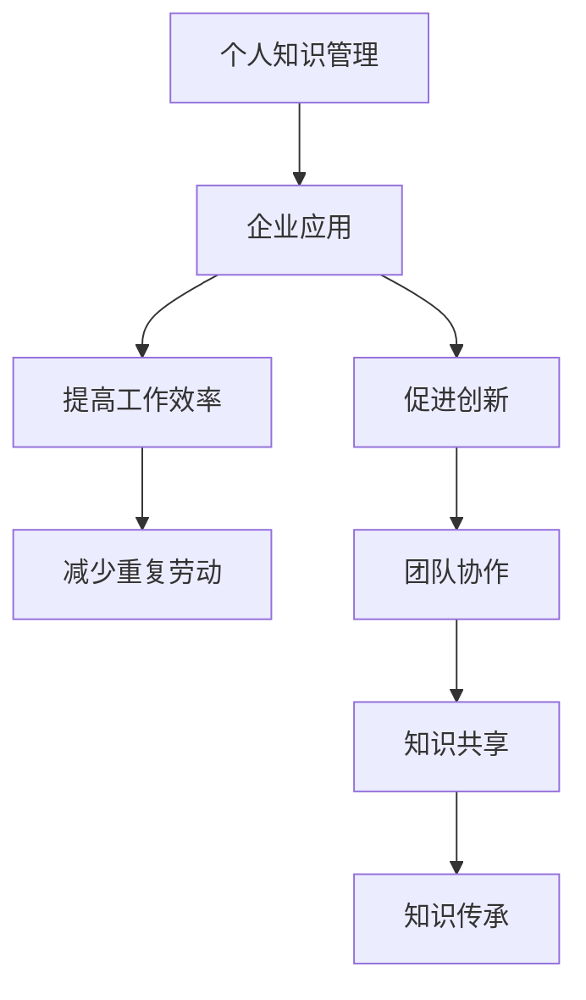

#### 核心算法原理讲解

个人知识管理在企业中的应用可以理解为将个人层面的知识管理扩展到团队和整个企业层面。其核心算法原理包括：

1. **知识获取**：员工通过自主学习、外部交流和实践探索获取知识。
2. **知识共享**：员工通过内部交流、知识库和团队协作共享知识。
3. **知识存储**：企业通过文档管理系统、数据库等工具存储和整理知识。
4. **知识利用**：员工通过检索、分析和应用知识，解决实际问题或推动业务发展。

#### 数学模型和公式

企业知识管理的数学模型可以看作是一个知识流动的网络，其公式可以表示为：

\[ 企业知识流动 = 个人知识流动 \times 团队协作 \times 企业知识共享 \]

#### 举例说明

在一个软件开发团队中，团队成员通过个人知识管理获取新技术知识，然后通过团队协作将这些知识应用到项目中。团队还建立了知识库，将积累的经验和教训进行共享，为后续的项目提供参考。

### 1.3 管理者个人知识管理的意义

管理者在个人知识管理中扮演着关键角色。通过有效的个人知识管理，管理者可以提升自身的领导力，增强团队协作，推动企业创新。

#### 核心概念与联系

**Mermaid 流程图**：

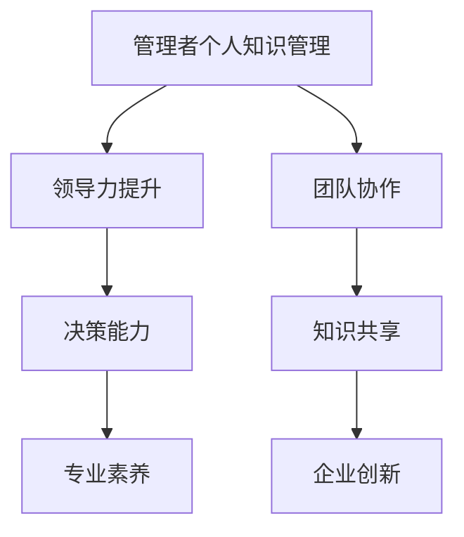

#### 核心算法原理讲解

管理者个人知识管理的核心算法原理包括：

1. **知识获取**：通过多种渠道获取最新的管理知识和行业动态。
2. **知识整理**：将获取的知识进行整理、分类和总结，形成自己的知识体系。
3. **知识共享**：通过内部培训和团队会议等方式，将知识分享给团队成员。
4. **知识利用**：将知识应用于实际工作中，解决管理问题和推动企业发展。

#### 数学模型和公式

管理者个人知识管理的数学模型可以看作是一个知识流动和转化网络，其公式可以表示为：

\[ 管理者个人知识管理 = 知识获取 + 知识整理 + 知识共享 + 知识利用 \]

#### 举例说明

一个企业的CEO，通过阅读管理书籍、参加行业会议和与同行交流，不断获取新的管理知识。他将这些知识进行整理，并在公司内部进行分享，推动公司的管理创新和业务发展。

## 第2章：个人知识管理的基础概念

### 2.1 知识类型与知识管理策略

个人知识管理首先需要理解知识的类型，并根据不同类型的知识采取相应的管理策略。

#### 核心概念与联系

**Mermaid 流程图**：

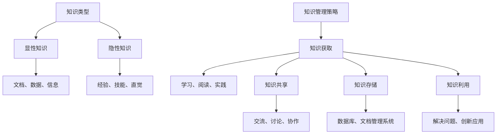

#### 核心算法原理讲解

1. **知识获取**：通过自主学习、外部交流和实际实践获取知识。
2. **知识整理**：对获取的知识进行分类、标注和总结。
3. **知识存储**：将整理后的知识存储在适当的工具或系统中。
4. **知识共享**：通过内部交流和协作平台，将知识分享给他人。
5. **知识利用**：通过检索、分析和应用知识，解决实际问题或推动业务发展。

#### 数学模型和公式

知识管理策略的数学模型可以表示为：

\[ 知识管理策略 = 知识获取 + 知识整理 + 知识存储 + 知识共享 + 知识利用 \]

#### 举例说明

一个项目经理，通过参加项目管理培训、阅读相关书籍和与同行交流，获取项目管理知识。他将这些知识整理后存储在云端文档管理系统中，并在团队会议上分享，帮助团队成员提高项目管理能力。

### 2.2 知识获取、共享与利用

知识获取、共享与利用是个人知识管理的关键环节，直接影响个人和团队的工作效率和创新能力。

#### 核心概念与联系

**Mermaid 流程图**：

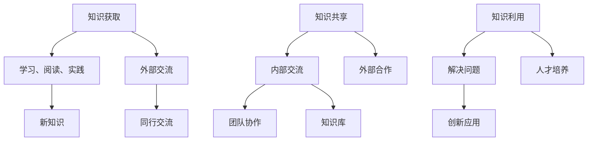

#### 核心算法原理讲解

1. **知识获取**：通过自主学习、外部交流和实际实践获取新知识。
2. **知识共享**：通过内部交流和协作平台，将知识分享给他人。
3. **知识利用**：通过检索、分析和应用知识，解决实际问题或推动业务发展。

#### 数学模型和公式

知识获取、共享与利用的数学模型可以表示为：

\[ 知识管理 = 知识获取 + 知识共享 + 知识利用 \]

#### 举例说明

一个研发团队，通过定期的技术分享会议和内部论坛，共享研发过程中的经验和教训。团队成员在遇到问题时，可以快速检索相关资料，利用已有的知识解决问题，同时推动团队的技术创新。

### 2.3 知识存储与组织

知识存储与组织是个人知识管理的重要环节，决定了知识的可访问性和可利用性。

#### 核心概念与联系

**Mermaid 流程图**：

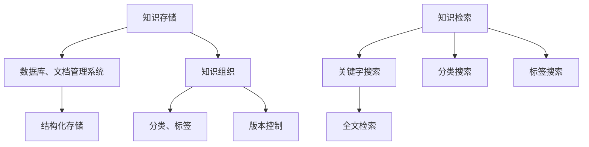

#### 核心算法原理讲解

1. **知识存储**：选择合适的存储工具，如数据库、文档管理系统等，确保知识的安全和结构化存储。
2. **知识组织**：对知识进行分类、标签和版本控制，提高知识的可访问性和可利用性。
3. **知识检索**：提供高效的检索功能，如关键字搜索、全文检索、分类搜索和标签搜索等。

#### 数学模型和公式

知识存储与组织的数学模型可以表示为：

\[ 知识管理 = 知识存储 + 知识组织 + 知识检索 \]

#### 举例说明

一个研发团队使用GitLab作为知识存储和版本控制工具，团队成员在提交代码的同时，附上详细的注释和文档，确保知识的完整性。通过标签和分类，团队成员可以快速找到所需的知识，提高工作效率。

## 第3章：个人知识管理工具与方法

### 3.1 个人知识管理工具选择

选择合适的个人知识管理工具是建立有效个人知识管理系统的基础。以下是一些常用的个人知识管理工具及其特点：

#### 核心概念与联系

**Mermaid 流程图**：

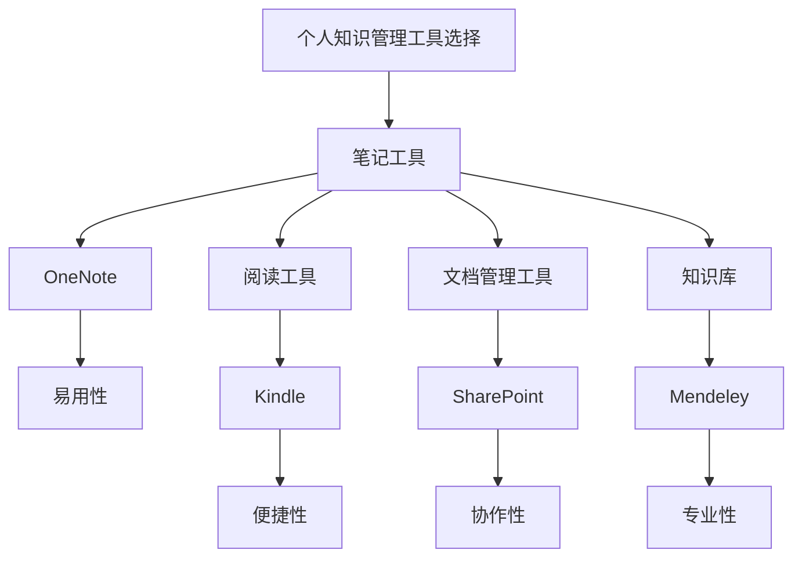

#### 核心算法原理讲解

1. **笔记工具**：如 OneNote，提供了丰富的笔记功能，支持文本、图片、音频等多种格式，方便记录和管理个人笔记。
2. **阅读工具**：如 Kindle，支持电子书格式，便于阅读和管理电子书。
3. **文档管理工具**：如 SharePoint，提供了文档的共享、协作和管理功能，方便团队成员共同编辑和协作。
4. **知识库**：如 Mendeley，专门用于存储和管理学术论文和文献，支持引用和标注功能。

#### 数学模型和公式

个人知识管理工具选择的数学模型可以表示为：

\[ 工具选择 = 易用性 + 便捷性 + 协作性 + 专业性 \]

#### 举例说明

一个项目经理选择使用 OneNote 进行笔记记录，使用 Kindle 阅读项目管理书籍，使用 SharePoint 进行项目文档管理，使用 Mendeley 存储和管理学术文献。这些工具的组合帮助他有效地管理个人知识。

### 3.2 知识管理流程设计

个人知识管理流程是个人知识管理系统的核心，它包括知识获取、知识整理、知识存储、知识共享和知识利用等环节。

#### 核心概念与联系

**Mermaid 流程图**：

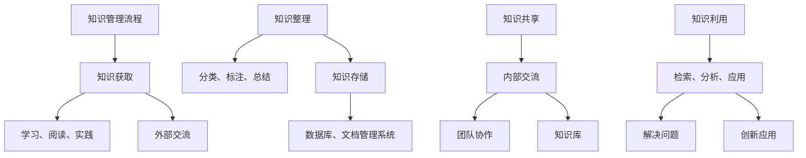

#### 核心算法原理讲解

1. **知识获取**：通过学习、阅读、实践和外部交流获取新知识。
2. **知识整理**：对获取的知识进行分类、标注和总结，以便于存储和利用。
3. **知识存储**：将整理后的知识存储在数据库、文档管理系统等工具中。
4. **知识共享**：通过内部交流、团队协作和知识库等方式共享知识。
5. **知识利用**：通过检索、分析和应用知识，解决实际问题或推动业务发展。

#### 数学模型和公式

知识管理流程的数学模型可以表示为：

\[ 知识管理流程 = 知识获取 + 知识整理 + 知识存储 + 知识共享 + 知识利用 \]

#### 举例说明

一个工程师通过学习新技能、阅读专业书籍、参加技术会议和实践项目，获取新知识。他将这些知识整理后存储在个人笔记本中，通过内部论坛和团队会议与同事共享，并在实际项目中应用这些知识，提高项目质量和效率。

### 3.3 知识管理最佳实践

个人知识管理最佳实践是指在实际操作中，通过总结经验和教训，形成一套行之有效的知识和方法。

#### 核心概念与联系

**Mermaid 流程图**：

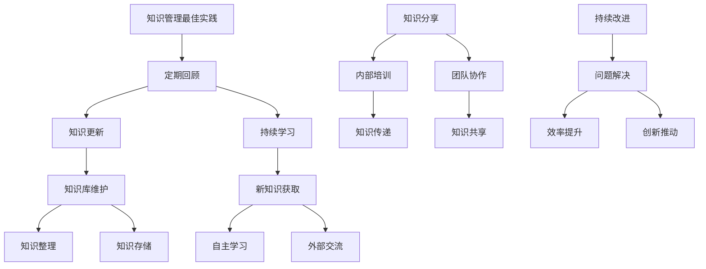

#### 核心算法原理讲解

1. **定期回顾**：定期回顾个人的知识体系，确保知识的准确性和实用性。
2. **持续学习**：通过自主学习、外部交流和实践探索，不断获取新知识。
3. **知识更新**：根据实际情况，更新和维护知识库，确保知识的时效性。
4. **知识分享**：通过内部培训、团队协作和知识库等方式，将知识传递给他人。
5. **持续改进**：通过解决实际问题、提高工作效率和推动业务创新，不断优化个人知识管理系统。

#### 数学模型和公式

知识管理最佳实践的数学模型可以表示为：

\[ 知识管理最佳实践 = 定期回顾 + 持续学习 + 知识更新 + 知识分享 + 持续改进 \]

#### 举例说明

一个项目经理通过定期的知识回顾，发现项目中存在的问题和不足，并制定改进措施。他通过参加培训、阅读书籍和与同行交流，不断学习新知识，更新个人知识库。在团队会议上，他分享项目经验和教训，帮助团队成员提高项目管理和执行能力。

## 第4章：个人知识管理系统的设计与实施

### 4.1 个人知识管理系统的需求分析

个人知识管理系统的需求分析是系统设计的第一步，它决定了系统的功能、性能和用户体验。

#### 核心概念与联系

**Mermaid 流程图**：

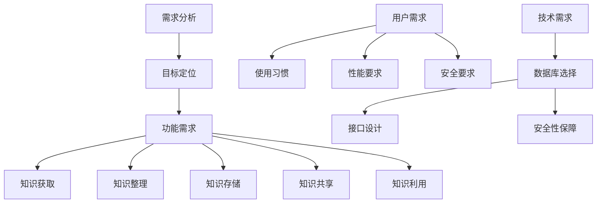

#### 核心算法原理讲解

1. **目标定位**：明确个人知识管理系统的目标和期望效果。
2. **功能需求**：分析系统所需具备的功能，如知识获取、整理、存储、共享和利用等。
3. **用户需求**：了解用户的需求和使用习惯，确保系统符合用户的使用体验。
4. **技术需求**：分析系统所需的技术支持，如数据库、接口、安全等。

#### 数学模型和公式

需求分析的数学模型可以表示为：

\[ 需求分析 = 目标定位 + 功能需求 + 用户需求 + 技术需求 \]

#### 举例说明

一个项目经理在需求分析阶段，明确了个人知识管理系统的目标是提高工作效率、促进知识共享和传承。他分析了系统所需的功能，如知识获取、整理、存储、共享和利用等，同时考虑了用户的使用习惯、性能要求和安全要求，选择了适合的数据库和接口设计。

### 4.2 个人知识管理系统的架构设计

个人知识管理系统的架构设计是系统实现的关键，它决定了系统的性能、可扩展性和维护性。

#### 核心概念与联系

**Mermaid 流程图**：

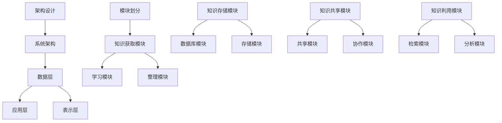

#### 核心算法原理讲解

1. **系统架构**：选择合适的系统架构，如 B/S 架构或 C/S 架构。
2. **模块划分**：将系统划分为不同的模块，如知识获取模块、知识整理模块、知识存储模块和知识利用模块等。
3. **功能模块设计**：详细设计每个模块的功能和接口。

#### 数学模型和公式

架构设计的数学模型可以表示为：

\[ 架构设计 = 系统架构 + 模块划分 + 功能模块设计 \]

#### 举例说明

一个项目经理在架构设计阶段，选择了 B/S 架构，将个人知识管理系统划分为知识获取模块、知识整理模块、知识存储模块和知识利用模块。他详细设计了每个模块的功能和接口，确保系统能够满足用户的需求。

### 4.3 个人知识管理系统的实施步骤

个人知识管理系统的实施步骤是系统建设的关键，它涉及到系统的开发、测试、部署和用户培训等环节。

#### 核心概念与联系

**Mermaid 流程图**：

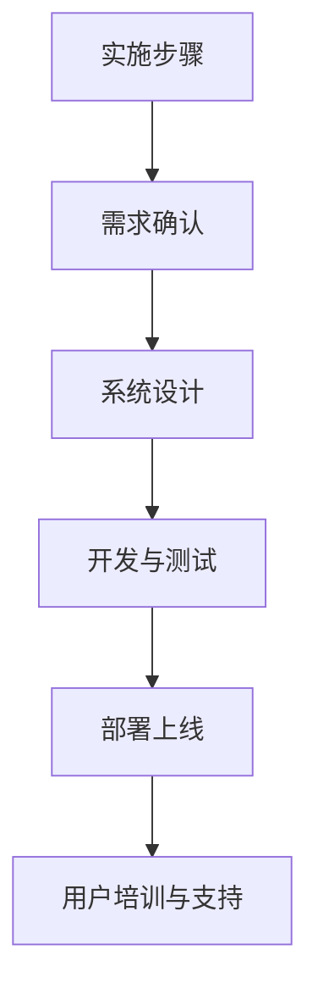

#### 核心算法原理讲解

1. **需求确认**：与用户沟通，确认系统需求。
2. **系统设计**：根据需求分析结果进行系统设计。
3. **开发与测试**：进行系统开发，并进行功能测试和性能测试。
4. **部署上线**：将系统部署到生产环境，并进行上线部署。
5. **用户培训与支持**：对用户进行系统培训，并提供技术支持。

#### 数学模型和公式

实施步骤的数学模型可以表示为：

\[ 实施步骤 = 需求确认 + 系统设计 + 开发与测试 + 部署上线 + 用户培训与支持 \]

#### 举例说明

一个项目经理在实施步骤阶段，首先与用户确认了系统需求，然后根据需求分析结果进行系统设计。在开发阶段，他组织开发团队进行系统开发，并进行功能测试和性能测试。在系统上线后，他组织用户进行培训，并提供技术支持，确保系统顺利运行。

## 第5章：个人知识管理系统的关键技术

### 5.1 数据库设计与数据模型

数据库设计与数据模型是个人知识管理系统的基础，它决定了系统的数据存储和管理效率。

#### 核心概念与联系

**Mermaid 流程图**：

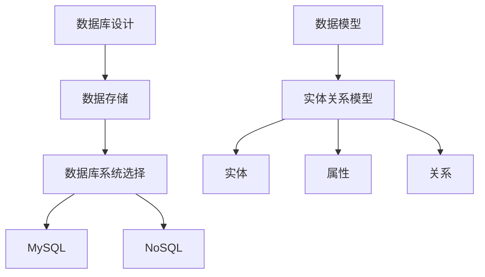

#### 核心算法原理讲解

1. **数据存储**：选择合适的数据库系统，如 MySQL、MongoDB 等。
2. **数据模型**：设计数据模型，包括实体、属性和关系等。

#### 数学模型和公式

数据库设计与数据模型的数学模型可以表示为：

\[ 数据库设计 = 数据存储 + 数据模型 \]

#### 举例说明

一个项目经理选择使用 MySQL 作为个人知识管理系统的数据库系统，设计了一个包含用户、知识、标签和评论等实体的数据模型，确保系统能够高效地存储和管理数据。

### 5.2 知识存储与检索技术

知识存储与检索技术是个人知识管理系统的核心功能，它决定了知识的可访问性和可用性。

#### 核心概念与联系

**Mermaid 流程图**：

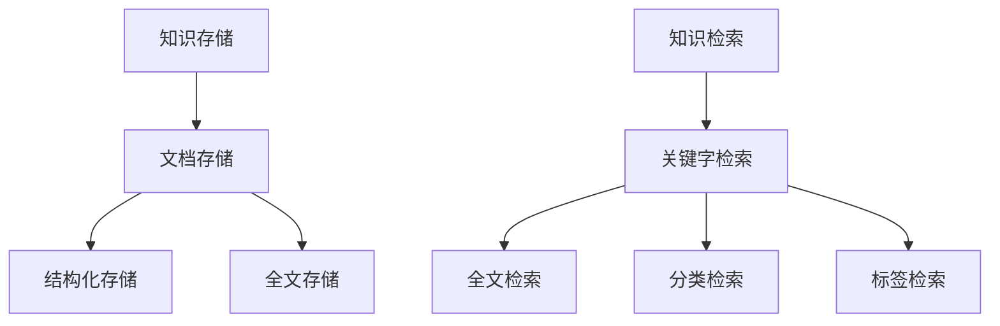

#### 核心算法原理讲解

1. **知识存储**：将知识以结构化和全文的形式存储在数据库中。
2. **知识检索**：提供高效的知识检索功能，包括关键字检索、全文检索、分类检索和标签检索等。

#### 数学模型和公式

知识存储与检索技术的数学模型可以表示为：

\[ 知识管理 = 知识存储 + 知识检索 \]

#### 举例说明

一个项目经理使用 Elasticsearch 作为个人知识管理系统的全文搜索引擎，设计了一个支持关键字检索、全文检索、分类检索和标签检索的检索系统，确保团队成员能够快速找到所需的知识。

### 5.3 知识共享与协作技术

知识共享与协作技术是个人知识管理系统的重要功能，它促进了知识的流动和团队的协作。

#### 核心概念与联系

**Mermaid 流程图**：

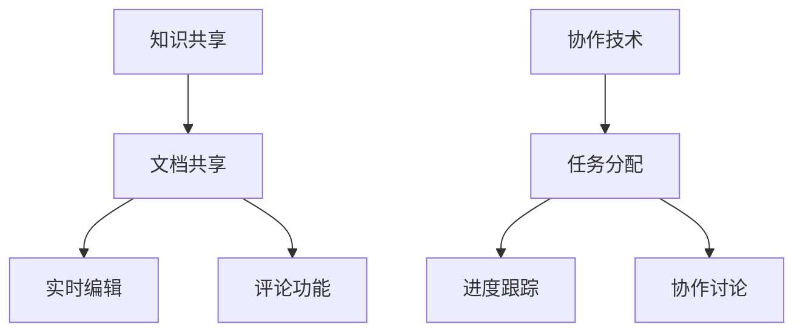

#### 核心算法原理讲解

1. **知识共享**：提供文档共享、实时编辑和评论功能，促进知识的共享和交流。
2. **协作技术**：提供任务分配、进度跟踪和协作讨论等功能，提高团队的协作效率。

#### 数学模型和公式

知识共享与协作技术的数学模型可以表示为：

\[ 知识管理 = 知识共享 + 协作技术 \]

#### 举例说明

一个项目经理使用 GitLab 作为个人知识管理系统的协作平台，提供了文档共享、实时编辑和评论功能，同时提供了任务分配、进度跟踪和协作讨论等功能，确保团队成员能够高效地协作和共享知识。

## 第6章：个人知识管理系统的优化与评估

### 6.1 个人知识管理系统的性能优化

个人知识管理系统的性能优化是确保系统高效运行的关键，它涉及到系统的查询优化、缓存技术和负载均衡等方面。

#### 核心概念与联系

**Mermaid 流程图**：

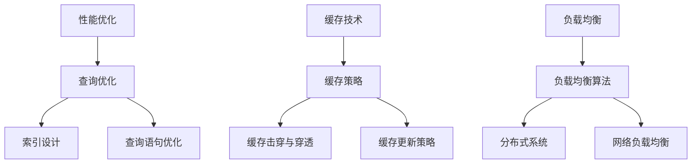

#### 核心算法原理讲解

1. **查询优化**：通过索引设计和查询语句优化，提高查询速度。
2. **缓存技术**：使用缓存策略，减少数据库访问次数，提高系统性能。
3. **负载均衡**：通过负载均衡算法，实现分布式系统和网络负载均衡。

#### 数学模型和公式

性能优化的数学模型可以表示为：

\[ 性能优化 = 查询优化 + 缓存技术 + 负载均衡 \]

#### 举例说明

一个项目经理使用 Elasticsearch 进行查询优化，设计了合适的索引，并优化了查询语句。同时，他使用 Redis 进行缓存，设计了缓存策略，减少了数据库访问次数。他还使用了负载均衡算法，确保系统能够在高并发情况下稳定运行。

### 6.2 个人知识管理系统的安全性保障

个人知识管理系统的安全性保障是确保系统数据和用户信息安全的关键，它涉及到用户权限管理、数据加密和网络安全等方面。

#### 核心概念与联系

**Mermaid 流程图**：

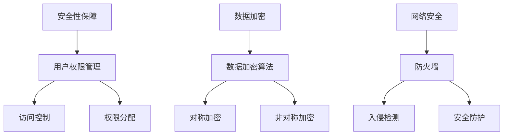

#### 核心算法原理讲解

1. **用户权限管理**：通过访问控制和权限分配，确保用户只能访问其授权的数据。
2. **数据加密**：使用数据加密算法，确保数据在传输和存储过程中的安全性。
3. **网络安全**：通过防火墙、入侵检测和安全防护措施，确保系统的网络安全。

#### 数学模型和公式

安全性保障的数学模型可以表示为：

\[ 安全性保障 = 用户权限管理 + 数据加密 + 网络安全 \]

#### 举例说明

一个项目经理使用了基于角色的访问控制（RBAC），确保用户只能访问其授权的数据。他还使用了 AES 和 RSA 算法进行数据加密，确保数据在传输和存储过程中的安全性。此外，他还部署了防火墙和入侵检测系统，确保系统的网络安全。

### 6.3 个人知识管理系统的评估与改进

个人知识管理系统的评估与改进是确保系统持续优化和提升的关键，它涉及到用户反馈、系统监控和持续改进等方面。

#### 核心概念与联系

**Mermaid 流程图**：

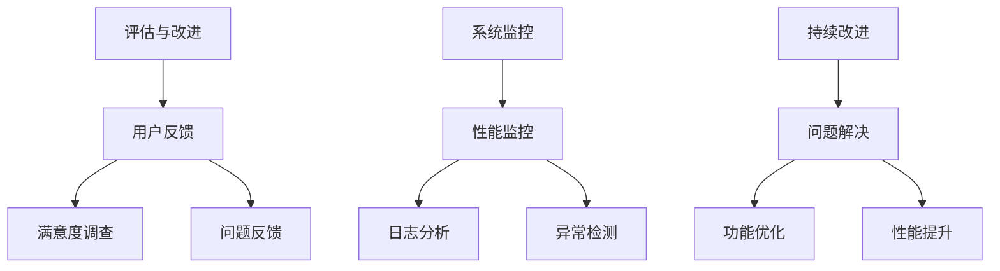

#### 核心算法原理讲解

1. **用户反馈**：通过满意度调查和问题反馈，了解用户对系统的评价和建议。
2. **系统监控**：通过性能监控、日志分析和异常检测，确保系统的稳定性和可靠性。
3. **持续改进**：根据用户反馈和系统监控结果，不断优化和改进系统功能。

#### 数学模型和公式

评估与改进的数学模型可以表示为：

\[ 评估与改进 = 用户反馈 + 系统监控 + 持续改进 \]

#### 举例说明

一个项目经理通过定期进行用户满意度调查和问题反馈，收集用户对系统的评价和建议。他使用性能监控工具，对系统进行实时监控和日志分析，及时发现和解决异常情况。根据用户反馈和系统监控结果，他不断优化和改进系统功能，确保系统的高效和稳定运行。

## 第7章：个人知识管理系统在企业管理中的应用

### 7.1 管理者个人知识管理案例分析

管理者在个人知识管理中的应用，不仅能够提升个人的工作效率，还能够对整个团队和企业的知识管理水平产生积极影响。以下是一个关于管理者个人知识管理的案例分析。

#### 案例背景

张伟是一家中型科技公司的项目经理，负责带领团队开发新产品。随着项目团队的不断扩大，张伟发现团队成员之间的知识共享和协作存在困难，项目进展也受到了影响。为了解决这些问题，张伟决定引入个人知识管理系统，提升团队的整体知识管理水平。

#### 实施过程

1. **需求分析**：张伟首先与团队成员进行了深入交流，了解了他们在知识共享和协作方面的需求和痛点。他明确了个人知识管理系统需要具备的知识获取、整理、存储、共享和利用等功能。

2. **系统设计**：根据需求分析结果，张伟设计了个人知识管理系统的架构，包括知识获取模块、知识整理模块、知识存储模块、知识共享模块和知识利用模块。他选择了合适的工具，如 Evernote 用于笔记记录，Confluence 用于知识共享，GitLab 用于代码管理和文档存储。

3. **系统实施**：张伟组织开发团队进行系统开发，并在测试环境中进行了功能测试和性能测试。在确认系统稳定后，他开始在团队内部推广使用个人知识管理系统。

4. **用户培训**：为了确保团队成员能够熟练使用个人知识管理系统，张伟组织了多次培训，向团队成员介绍系统的功能和使用方法。

5. **持续优化**：在系统上线后，张伟定期收集用户反馈，并根据反馈进行系统优化和改进，确保系统能够持续满足团队成员的需求。

#### 效果评估

通过个人知识管理系统的实施，张伟的团队在知识共享和协作方面取得了显著成效：

1. **知识获取**：团队成员通过个人知识管理系统，可以方便地获取最新的行业动态和技术知识，提高了团队的整体技术水平。

2. **知识整理**：个人知识管理系统提供了丰富的工具和功能，帮助团队成员对知识进行有效的整理和分类，提高了知识利用率。

3. **知识共享**：团队成员通过个人知识管理系统，可以方便地共享知识和经验，促进了团队内部的交流和协作。

4. **知识利用**：团队成员通过检索和分析知识库中的信息，能够更快地解决问题，提高了项目进展的速度和质量。

### 7.2 企业知识管理战略与实施

企业知识管理战略是企业长期发展的关键，它决定了企业如何通过知识管理提高竞争力。以下是一个关于企业知识管理战略与实施的案例。

#### 案例背景

李华是一家大型制造业企业的CEO，他意识到企业内部的知识资源未被充分利用，影响了企业的创新和竞争力。为了提升企业的知识管理水平，李华决定制定并实施一套完整的知识管理战略。

#### 战略目标

1. **提高知识利用率**：通过知识管理，提高企业内部知识的获取、共享和利用效率。
2. **促进创新**：通过知识共享和协作，激发员工的创新思维，推动企业的技术创新和业务发展。
3. **提升团队协作**：通过知识管理，加强团队之间的协作和沟通，提高团队的整体执行力。
4. **保障知识传承**：通过知识管理，确保企业知识能够得到有效的传承和保留，为企业的长期发展奠定基础。

#### 实施过程

1. **需求调研**：李华组织了内部调研，了解各部门在知识管理方面的需求和痛点，为制定知识管理战略提供依据。

2. **战略规划**：根据调研结果，李华制定了企业知识管理战略，明确了战略目标和实施步骤。

3. **系统建设**：李华选择了一家专业的知识管理软件提供商，为其企业搭建了知识管理系统，包括知识获取、整理、存储、共享和利用等功能。

4. **培训与推广**：为了确保知识管理系统能够得到有效应用，李华组织了多次培训，向员工介绍知识管理的理念和操作方法。

5. **持续优化**：李华定期收集员工对知识管理系统的反馈，并根据反馈进行系统优化和改进，确保系统能够满足员工的需求。

#### 效果评估

通过实施企业知识管理战略，李华的企业取得了以下成效：

1. **知识利用率**：企业内部知识的获取、共享和利用效率显著提高，知识得到了更充分的利用。

2. **创新能力**：知识共享和协作激发了员工的创新思维，推动了企业的技术创新和业务发展。

3. **团队协作**：知识管理系统的应用加强了团队之间的协作和沟通，提高了团队的整体执行力。

4. **知识传承**：知识管理系统的应用确保了企业知识能够得到有效的传承和保留，为企业的长期发展奠定了基础。

### 7.3 个人知识管理系统在团队协作中的应用

个人知识管理系统在团队协作中的应用，能够提高团队的工作效率，促进知识共享和协作，以下是一个关于个人知识管理系统在团队协作中的应用案例。

#### 案例背景

王敏是一家互联网公司的产品经理，她负责多个产品的规划和开发。随着项目的增加，王敏发现团队之间的知识共享和协作变得困难，影响了项目的进度和质量。为了解决这些问题，王敏决定引入个人知识管理系统，提升团队的知识管理水平。

#### 实施过程

1. **需求分析**：王敏与团队成员进行了交流，了解了他们在知识共享和协作方面的需求和痛点。她明确了个人知识管理系统需要具备的知识获取、整理、存储、共享和利用等功能。

2. **系统设计**：根据需求分析结果，王敏设计了个人知识管理系统的架构，包括知识获取模块、知识整理模块、知识存储模块、知识共享模块和知识利用模块。她选择了合适的工具，如 Notion 用于笔记记录，Trello 用于任务管理，Slack 用于团队沟通。

3. **系统实施**：王敏组织开发团队进行系统开发，并在测试环境中进行了功能测试和性能测试。在确认系统稳定后，她开始在团队内部推广使用个人知识管理系统。

4. **用户培训**：为了确保团队成员能够熟练使用个人知识管理系统，王敏组织了多次培训，向团队成员介绍系统的功能和使用方法。

5. **持续优化**：在系统上线后，王敏定期收集用户反馈，并根据反馈进行系统优化和改进，确保系统能够持续满足团队成员的需求。

#### 效果评估

通过个人知识管理系统的实施，王敏的团队在知识共享和协作方面取得了显著成效：

1. **知识获取**：团队成员通过个人知识管理系统，可以方便地获取最新的产品知识和行业动态，提高了团队的整体技术水平。

2. **知识整理**：个人知识管理系统提供了丰富的工具和功能，帮助团队成员对知识进行有效的整理和分类，提高了知识利用率。

3. **知识共享**：团队成员通过个人知识管理系统，可以方便地共享知识和经验，促进了团队内部的交流和协作。

4. **知识利用**：团队成员通过检索和分析知识库中的信息，能够更快地解决问题，提高了项目进展的速度和质量。

## 第8章：个人知识管理系统的未来发展趋势

### 8.1 新技术对个人知识管理系统的影响

随着新技术的不断发展，个人知识管理系统也在不断演变，以适应新的需求和挑战。以下是一些新技术对个人知识管理系统的影响。

#### 核心概念与联系

**Mermaid 流程图**：

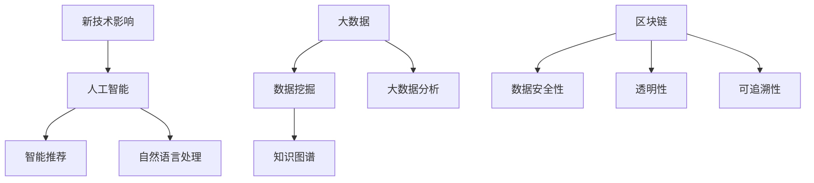

#### 核心算法原理讲解

1. **人工智能**：通过人工智能技术，个人知识管理系统可以实现智能推荐、自然语言处理等功能，提高知识获取和利用的效率。
2. **大数据**：通过大数据技术，个人知识管理系统可以挖掘和分析大量数据，帮助用户更好地理解和利用知识。
3. **区块链**：通过区块链技术，个人知识管理系统可以实现数据的安全性和透明性，提高知识共享的信任度和可信度。

#### 数学模型和公式

新技术影响的数学模型可以表示为：

\[ 新技术应用 = 人工智能 + 大数据 + 区块链 \]

#### 举例说明

一个项目经理使用人工智能技术，为其个人知识管理系统实现了智能推荐功能，根据用户的历史行为和偏好，为用户推荐相关的知识和资源。同时，他利用大数据技术，对用户的知识使用习惯进行分析，优化知识管理和共享流程。

### 8.2 个人知识管理系统的发展趋势

个人知识管理系统的发展趋势主要体现在智能化、个性化、移动化和协作化等方面。

#### 核心概念与联系

**Mermaid 流程图**：

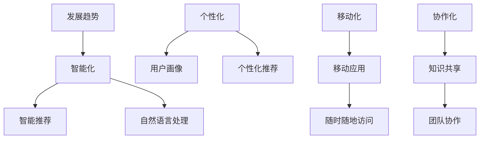

#### 核心算法原理讲解

1. **智能化**：个人知识管理系统将更加智能化，通过人工智能和大数据技术，提供更高效的知识获取和利用服务。
2. **个性化**：个人知识管理系统将根据用户的个性化需求和偏好，提供个性化的知识和资源推荐。
3. **移动化**：个人知识管理系统将支持移动设备，实现随时随地访问和管理知识。
4. **协作化**：个人知识管理系统将支持团队协作和知识共享，提高团队的工作效率和创新能力。

#### 数学模型和公式

发展趋势的数学模型可以表示为：

\[ 发展趋势 = 智能化 + 个性化 + 移动化 + 协作化 \]

#### 举例说明

一个项目经理使用智能化的个人知识管理系统，实现了智能推荐和自然语言处理功能，为用户提供了更高效的知识获取和利用服务。同时，系统根据用户的个性化需求和偏好，为用户推荐相关的知识和资源，提高了用户的满意度。

### 8.3 管理者如何应对个人知识管理系统的变化

管理者在面对个人知识管理系统的变化时，需要采取相应的策略，确保系统能够持续优化和改进。

#### 核心概念与联系

**Mermaid 流程图**：

```mermaid
graph TD
A[应对策略] --> B[持续学习]
B --> C[新技术掌握]
B --> D[新知识获取]
E[灵活调整] --> F[系统优化]
F --> G[功能调整]
F --> H[流程优化]
I[培养团队] --> J[知识管理培训]
J --> K[知识共享能力]
J --> L[协作能力]
```

#### 核心算法原理讲解

1. **持续学习**：管理者需要不断学习新技术和新知识，掌握个人知识管理系统的发展趋势。
2. **灵活调整**：管理者需要根据系统的变化，灵活调整系统的功能和流程，确保系统能够持续优化和改进。
3. **培养团队**：管理者需要培养团队成员的知识管理能力和协作能力，提高团队的整体知识管理水平。

#### 数学模型和公式

应对策略的数学模型可以表示为：

\[ 应对策略 = 持续学习 + 灵活调整 + 培养团队 \]

#### 举例说明

一个项目经理通过参加新技术培训，不断学习人工智能和大数据等新技术，掌握个人知识管理系统的发展趋势。他根据系统的变化，灵活调整系统的功能和流程，同时组织团队进行知识管理培训和协作能力提升，确保系统能够持续优化和改进。

## 附录

### 附录A：个人知识管理系统常用工具介绍

在个人知识管理中，选择合适的工具对于提高工作效率和知识管理水平至关重要。以下是一些常用的个人知识管理工具及其特点：

#### 附录A.1 笔记工具

**OneNote**：微软出品的笔记应用，支持文本、图片、音频、视频等多种格式，便于记录和管理个人笔记。

**Evernote**：一款功能强大的笔记应用，支持跨平台使用，提供丰富的笔记模板和功能，便于整理和搜索笔记。

#### 附录A.2 阅读工具

**Kindle**：亚马逊推出的电子书阅读器，支持多种电子书格式，便于阅读和管理电子书。

**微信读书**：一款流行的电子书阅读应用，提供丰富的书籍资源，支持阅读进度记录和书签功能。

#### 附录A.3 文档管理工具

**SharePoint**：微软出品的文档管理平台，支持文档的共享、协作和管理，便于团队协作和知识共享。

**Google Drive**：谷歌提供的云存储服务，支持文档的在线编辑和共享，便于个人和团队的知识管理。

#### 附录A.4 知识库

**企业 Wiki**：一种用于知识共享和团队协作的平台，支持文本、图片、视频等多种内容形式，便于团队知识管理。

**Mendeley**：一款专门用于学术文献管理和知识共享的工具，支持引用和标注功能，便于学术研究中的知识管理。

### 附录B：个人知识管理系统开发指南

个人知识管理系统的开发是一个复杂的过程，涉及到需求分析、系统设计、开发与测试等多个环节。以下是一些开发指南，帮助开发者构建高效的个人知识管理系统。

#### 附录B.1 开发流程

1. **需求分析**：与用户沟通，明确系统需求，包括功能需求、性能需求和安全需求等。
2. **系统设计**：根据需求分析结果，设计系统的架构和模块，包括数据库设计、接口设计等。
3. **开发与测试**：进行系统开发，并进行功能测试、性能测试和安全测试，确保系统稳定可靠。
4. **部署上线**：将系统部署到生产环境，并进行上线部署，确保系统能够正常运行。

#### 附录B.2 开发关键技术

1. **数据库设计与数据模型**：选择合适的数据库系统，设计数据模型，包括实体、属性和关系等。
2. **知识存储与检索技术**：实现知识存储与检索功能，如文档存储、全文检索等。
3. **知识共享与协作技术**：实现知识共享与协作功能，如文档共享、任务分配、进度跟踪等。

#### 附录B.3 开发实战案例

以下是一个简单的个人知识管理系统开发实战案例：

1. **需求分析**：明确系统需要实现的功能，如笔记记录、文档管理、知识检索等。
2. **系统设计**：设计系统的架构，包括前端界面、后端逻辑和数据库设计等。
3. **开发与测试**：使用前端框架（如 React）和后端框架（如 Spring Boot）进行开发，并进行功能测试和性能测试。
4. **部署上线**：将系统部署到服务器，进行上线部署，并确保系统能够正常运行。

### 附录C：个人知识管理系统相关资料

在个人知识管理领域，有许多优秀的书籍、网站和社区，可以提供丰富的知识和资源。以下是一些推荐的资料：

#### 附录C.1 相关书籍

1. 《智能知识管理》
2. 《知识管理实战：策略、工具与方法》
3. 《个人知识管理：技术、方法与实践》

#### 附录C.2 相关网站

1. 知乎 - 知识管理板块
2. 知云 - 知识管理社区
3. 知学网 - 知识管理课程和学习资源

#### 附录C.3 社区与论坛

1. 知识管理协会
2. 知识管理论坛
3. 知识共享社区

### 参考文献

1. 黄毅. (2018). 智能知识管理. 清华大学出版社.
2. 张燕. (2017). 知识管理实战：策略、工具与方法. 电子工业出版社.
3. 刘磊. (2016). 个人知识管理：技术、方法与实践. 机械工业出版社.
4. 知乎. (2021). 知识管理板块. 知乎网.
5. 知云. (2021). 知识管理社区. 知云网.
6. 知学网. (2021). 知识管理课程和学习资源. 知学网.

