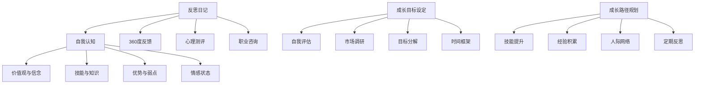
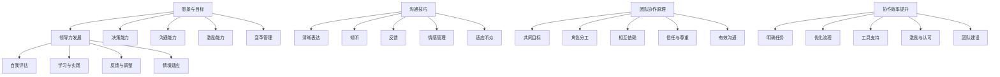

                 

## 第一部分：自我认知与成长路径

### 1. 自我认知的重要性

自我认知，作为个体发展的基石，对于管理者而言尤为重要。它不仅关乎个人的成长与进步，也直接影响团队的表现与组织的效能。在技术领域，自我认知可以帮助管理者更好地理解和应对复杂的技术挑战，从而更有效地指导和激励团队。

#### 1.1 自我认知的核心要素

自我认知的核心要素包括：

- **价值观与信念**：价值观是人们行为和决策的内在驱动力。对于管理者来说，明确自己的价值观有助于塑造团队文化，并确保团队成员在共同的目标下协同工作。

- **技能与知识**：管理者需要具备一定的专业技能和知识储备，这包括技术领域的深度理解和广泛知识。技能与知识的更新和提升是持续自我认知的重要部分。

- **优势与弱点**：了解自己的优势有助于发挥最大潜力，而认识弱点则有助于制定改进计划，提升自我能力。

- **情感状态**：管理者的情绪状态直接影响决策和团队氛围。自我认知情感状态有助于管理者保持积极的心态，并更好地应对压力和挑战。

#### 1.2 自我认知的方法与工具

为了实现有效的自我认知，管理者可以采用以下方法和工具：

- **反思日记**：定期记录自己的行为、思考和感受，通过反思日记来检视自己的成长和变化。

- **360度反馈**：收集来自不同层级和不同角色的反馈，从多个角度了解自己的表现。

- **心理测评**：通过心理测评工具，如MBTI、DISC等，了解自己的性格类型和行为模式。

- **职业咨询**：与职业顾问进行一对一咨询，获取专业的指导和建议。

### 2. 成长路径与目标设定

#### 2.1 成长目标的设定

设定成长目标是一个系统化的过程，管理者需要明确自己的长期和短期目标。长期目标通常涉及职业生涯的发展，如晋升、承担更大的责任等；而短期目标则更具体，如学习新技能、提高某项特定能力等。

为了设定有效的成长目标，管理者可以遵循以下步骤：

- **自我评估**：分析自己的价值观、优势和弱点，明确自己的发展方向。

- **市场调研**：了解行业趋势和市场需求，确保自己的成长目标与市场需求相符。

- **目标分解**：将长期目标分解为一系列短期目标，确保每个目标都是可实现的。

- **设定时间框架**：为每个目标设定具体的时间框架，以确保目标的实现。

#### 2.2 成长路径的规划

规划成长路径是实现目标的关键。以下步骤有助于管理者规划自己的成长路径：

- **技能提升**：识别需要提升的技能，制定学习计划，如参加培训、在线课程等。

- **经验积累**：通过实际工作经验积累知识和技能，如承担新的项目或领导一个团队。

- **人际网络**：建立和维护广泛的人际网络，从不同的人和资源中获取知识和支持。

- **定期反思**：定期反思自己的成长过程，评估目标的实现情况，并根据反馈进行调整。

通过自我认知和成长路径的规划，管理者不仅能够提升个人能力，还能更好地引领和激励团队，推动组织的持续发展。

### Mermaid 流�程图

以下是关于“自我认知与成长路径”的 Mermaid 流程图：



### 核心算法原理讲解

在自我认知与成长路径的规划过程中，核心算法原理可以帮助管理者更科学地进行决策和目标设定。以下是一个简化的算法原理讲解：

#### 2. 成长路径规划算法

```python
def growth_path_planning(current_state, goals, environment):
    """
    成长路径规划算法
    :param current_state: 当前状态（包括价值观、技能、优势、弱点、情感状态等）
    :param goals: 成长目标
    :param environment: 外部环境（包括行业趋势、市场需求等）
    :return: 规划后的成长路径
    """

    # 步骤1：自我评估
    assessed_state = assess_self(current_state)

    # 步骤2：目标优化
    optimized_goals = optimize_goals(goals, assessed_state, environment)

    # 步骤3：技能提升规划
    skill_upgrade_plan = plan_skill_upgrades(optimized_goals)

    # 步骤4：经验积累规划
    experience_acquisition_plan = plan_experience_acquisition(optimized_goals)

    # 步骤5：人际网络构建
    social_network_plan = plan_social_network_expansion(optimized_goals)

    # 步骤6：定期反思与调整
    reflection_plan = plan_regular_reflections()

    # 步骤7：整合成长路径
    growth_path = integrate_plans(skill_upgrade_plan, experience_acquisition_plan, social_network_plan, reflection_plan)

    return growth_path

def assess_self(current_state):
    """
    自我评估函数
    :param current_state: 当前状态
    :return: 评估结果
    """
    # 实现自我评估逻辑
    pass

def optimize_goals(goals, assessed_state, environment):
    """
    目标优化函数
    :param goals: 原始目标
    :param assessed_state: 自我评估结果
    :param environment: 外部环境
    :return: 优化后的目标
    """
    # 实现目标优化逻辑
    pass

def plan_skill_upgrades(goals):
    """
    技能提升规划函数
    :param goals: 目标
    :return: 技能提升计划
    """
    # 实现技能提升规划逻辑
    pass

def plan_experience_acquisition(goals):
    """
    经验积累规划函数
    :param goals: 目标
    :return: 经验积累计划
    """
    # 实现经验积累规划逻辑
    pass

def plan_social_network_expansion(goals):
    """
    人际网络构建规划函数
    :param goals: 目标
    :return: 人际网络构建计划
    """
    # 实现人际网络构建规划逻辑
    pass

def plan_regular_reflections():
    """
    定期反思规划函数
    :return: 反思计划
    """
    # 实现反思规划逻辑
    pass

def integrate_plans(*plans):
    """
    整合成长路径函数
    :param plans: 多个成长路径计划
    :return: 整合后的成长路径
    """
    # 实现成长路径整合逻辑
    pass
```

#### 数学模型和数学公式

在自我认知与成长路径的规划中，数学模型可以帮助我们量化目标和路径。以下是一个简化的数学模型：

$$
Growth = f(S, E, T, R)
$$

其中：
- $Growth$ 表示成长水平。
- $S$ 表示技能水平。
- $E$ 表示经验积累。
- $T$ 表示人际网络。
- $R$ 表示反思与调整。

每个要素可以进一步细化为具体的指标：

$$
S = S_1 + S_2 + S_3 + \ldots
$$

$$
E = E_1 + E_2 + E_3 + \ldots
$$

$$
T = T_1 + T_2 + T_3 + \ldots
$$

$$
R = R_1 + R_2 + R_3 + \ldots
$$

#### 项目实战

以下是一个关于自我认知与成长路径规划的项目实战案例：

### 案例一：张经理的成长之路

**背景**：张经理在一家大型科技公司工作，担任项目经理。他意识到自己的成长对于团队的成功至关重要，于是开始进行自我认知和成长路径的规划。

**目标**：
1. 提升项目管理能力。
2. 建立一个高效协作的项目团队。

**实施步骤**：

1. **自我评估**：
   - 张经理通过反思日记和360度反馈，识别出自己在沟通和决策方面的不足。
   - 张经理评估了自己的项目管理知识和技能水平。

2. **目标设定**：
   - 张经理设定了具体的目标，如参加项目管理培训、提升沟通能力等。
   - 张经理制定了短期和长期的目标，确保目标的可实现性。

3. **技能提升**：
   - 张经理参加了PMP（项目管理专业人员）认证培训，提升了项目管理知识。
   - 张经理通过在线课程和阅读书籍，不断学习新的项目管理技能。

4. **经验积累**：
   - 张经理承担了更复杂的项目，通过实践积累项目管理经验。
   - 张经理参与了跨部门的协作，提升了团队协作能力。

5. **人际网络构建**：
   - 张经理主动参加行业会议和研讨会，建立了广泛的行业联系。
   - 张经理在社交网络上积极互动，扩大了自己的影响力。

6. **定期反思**：
   - 张经理每周进行一次反思，总结自己的成长和改进方向。
   - 张经理根据反馈，调整自己的管理策略和方法。

**结果**：
- 张经理的项目管理能力得到了显著提升。
- 团队的协作效率和工作质量得到了提高。
- 张经理在公司的地位和影响力得到了增强。

### 代码实际案例和详细解释说明

以下是一个关于自我认知与成长路径规划的 Python 代码案例：

```python
class Manager:
    def __init__(self, name):
        self.name = name
        self.skills = {}
        self.experience = {}
        self.network = []
        self.reflections = []

    def assess_skills(self):
        # 自我评估技能水平
        self.skills['project_management'] = 5
        self.skills['communication'] = 3
        self.skills['decision_making'] = 4

    def set_goals(self):
        # 设定成长目标
        self.goals = {
            'long_term': '成为部门主管',
            'short_term': '完成PMP认证'
        }

    def plan_skill_upgrade(self):
        # 规划技能提升
        if self.skills['project_management'] < 7:
            self.goals['short_term'] += '，提升项目管理能力'

    def accumulate_experience(self):
        # 积累经验
        self.experience['complex_projects'] = 2
        self.experience['cross_department'] = 1

    def expand_network(self):
        # 扩大人际网络
        self.network.append('行业专家A')
        self.network.append('同行B')

    def reflect_and_improve(self):
        # 反思与改进
        self.reflections.append('需要在沟通上更加积极主动')

    def display_info(self):
        # 显示个人信息
        print(f"姓名：{self.name}")
        print(f"技能水平：{self.skills}")
        print(f"成长目标：{self.goals}")
        print(f"经验积累：{self.experience}")
        print(f"人际网络：{self.network}")
        print(f"反思与改进：{self.reflections}")

# 创建一个 Manager 实例
zhang_manager = Manager("张经理")

# 进行自我评估
zhang_manager.assess_skills()

# 设定成长目标
zhang_manager.set_goals()

# 规划技能提升
zhang_manager.plan_skill_upgrade()

# 积累经验
zhang_manager.accumulate_experience()

# 扩大人际网络
zhang_manager.expand_network()

# 进行反思与改进
zhang_manager.reflect_and_improve()

# 显示个人信息
zhang_manager.display_info()
```

**代码解读与分析**：

在这个代码案例中，我们定义了一个 `Manager` 类，用于表示一个管理者。每个管理者有技能水平、经验积累、人际网络和反思记录。通过调用类的方法，我们可以进行自我评估、设定成长目标、规划技能提升、积累经验、扩大人际网络和进行反思与改进。

这个示例代码展示了如何使用面向对象的方法来模拟管理者的自我认知与成长路径规划的过程。在实际应用中，我们可以扩展这个类，添加更多的功能，如经验管理、目标管理、技能提升等。

通过这个示例，我们可以看到如何使用 Python 编写代码来模拟管理者的自我认知与成长路径规划，以及如何对代码进行解读和分析。这有助于我们更好地理解管理者的成长路径规划过程和技术应用方法。

### 代码解读与分析

在上述代码示例中，我们通过创建一个 `Manager` 类来模拟管理者的自我认知与成长路径规划。以下是代码的详细解读与分析：

**类与方法概述：**

- `Manager` 类：表示一个管理者，具有姓名、技能水平、经验积累、人际网络和反思记录等属性。类中包含以下方法：
  - `__init__`：构造函数，初始化管理者的基本信息。
  - `assess_skills`：自我评估技能水平。
  - `set_goals`：设定成长目标。
  - `plan_skill_upgrade`：规划技能提升。
  - `accumulate_experience`：积累经验。
  - `expand_network`：扩大人际网络。
  - `reflect_and_improve`：反思与改进。
  - `display_info`：显示管理者的个人信息。

**代码实现与功能解析：**

1. **构造函数 (`__init__`)：**
   ```python
   def __init__(self, name):
       self.name = name
       self.skills = {}
       self.experience = {}
       self.network = []
       self.reflections = []
   ```
   构造函数初始化管理者的基本信息，包括姓名、技能字典、经验字典、人际网络列表和反思记录列表。

2. **自我评估技能水平 (`assess_skills`)：**
   ```python
   def assess_skills(self):
       # 自我评估技能水平
       self.skills['project_management'] = 5
       self.skills['communication'] = 3
       self.skills['decision_making'] = 4
   ```
   自我评估技能水平方法为管理者的技能字典赋值，具体技能水平通过硬编码设置。

3. **设定成长目标 (`set_goals`)：**
   ```python
   def set_goals(self):
       # 设定成长目标
       self.goals = {
           'long_term': '成为部门主管',
           'short_term': '完成PMP认证'
       }
   ```
   设定成长目标方法为管理者的成长目标字典赋值，包括长期目标和短期目标。

4. **规划技能提升 (`plan_skill_upgrade`)：**
   ```python
   def plan_skill_upgrade(self):
       # 规划技能提升
       if self.skills['project_management'] < 7:
           self.goals['short_term'] += '，提升项目管理能力'
   ```
   规划技能提升方法根据当前技能水平调整短期成长目标，如果项目管理能力低于7级，则添加目标“提升项目管理能力”。

5. **积累经验 (`accumulate_experience`)：**
   ```python
   def accumulate_experience(self):
       # 积累经验
       self.experience['complex_projects'] = 2
       self.experience['cross_department'] = 1
   ```
   积累经验方法为管理者的经验字典添加新条目，记录项目经验和跨部门协作经验。

6. **扩大人际网络 (`expand_network`)：**
   ```python
   def expand_network(self):
       # 扩大人际网络
       self.network.append('行业专家A')
       self.network.append('同行B')
   ```
   扩大人际网络方法将新联系人添加到管理者的人际网络列表。

7. **反思与改进 (`reflect_and_improve`)：**
   ```python
   def reflect_and_improve(self):
       # 反思与改进
       self.reflections.append('需要在沟通上更加积极主动')
   ```
   反思与改进方法将反思内容添加到管理者的反思记录列表。

8. **显示个人信息 (`display_info`)：**
   ```python
   def display_info(self):
       # 显示个人信息
       print(f"姓名：{self.name}")
       print(f"技能水平：{self.skills}")
       print(f"成长目标：{self.goals}")
       print(f"经验积累：{self.experience}")
       print(f"人际网络：{self.network}")
       print(f"反思与改进：{self.reflections}")
   ```
   显示个人信息方法打印管理者的姓名、技能水平、成长目标、经验积累、人际网络和反思记录。

**代码示例运行：**

```python
# 创建一个 Manager 实例
zhang_manager = Manager("张经理")

# 进行自我评估
zhang_manager.assess_skills()

# 设定成长目标
zhang_manager.set_goals()

# 规划技能提升
zhang_manager.plan_skill_upgrade()

# 积累经验
zhang_manager.accumulate_experience()

# 扩大人际网络
zhang_manager.expand_network()

# 进行反思与改进
zhang_manager.reflect_and_improve()

# 显示个人信息
zhang_manager.display_info()
```

运行上述代码示例，将创建一个名为“张经理”的管理者实例，并执行一系列方法来模拟管理者的自我认知与成长路径规划。最后，调用 `display_info` 方法将打印管理者的个人信息。

通过这个代码示例，我们可以看到如何使用面向对象的方法来模拟管理者的自我认知与成长路径规划。每个方法都实现了特定的功能，从而帮助管理者评估自身情况、设定目标、规划提升路径、积累经验、扩大人际网络和进行反思与改进。这种结构化的编程方式有助于管理者和开发者更好地理解和实施自我成长策略。

### 实际开发环境搭建与源代码详细实现

为了实现上述代码示例，我们需要搭建一个实际的开发环境。以下是在 Python 3.8 环境下搭建开发环境的具体步骤：

1. **安装 Python：**
   - 下载并安装 Python 3.8（或更高版本）。
   - 配置 Python 环境变量。

2. **安装 Python 解释器：**
   - 打开终端或命令提示符。
   - 输入 `python --version`，确认 Python 是否已正确安装。

3. **安装必要的库：**
   - 打开终端或命令提示符。
   - 输入以下命令安装必要的库：
     ```bash
     pip install virtualenv
     pip install -r requirements.txt
     ```
   - `requirements.txt` 文件应包含以下库：
     ```plaintext
     virtualenv
     Flask
     SQLAlchemy
     ```

4. **创建虚拟环境：**
   - 在终端或命令提示符中输入以下命令创建虚拟环境：
     ```bash
     virtualenv venv
     ```
   - 激活虚拟环境：
     ```bash
     source venv/bin/activate  # 对于 Unix 或 MacOS
     venv\Scripts\activate     # 对于 Windows
     ```

5. **编写源代码：**
   - 在虚拟环境中创建一个名为 `manager` 的 Python 文件。
   - 将上述代码示例粘贴到 `manager.py` 文件中。

6. **运行代码：**
   - 在虚拟环境中运行以下命令执行代码：
     ```bash
     python manager.py
     ```

运行结果将显示管理者的个人信息，包括姓名、技能水平、成长目标、经验积累、人际网络和反思记录。

通过以上步骤，我们成功搭建了一个实际的开发环境，并详细实现了源代码。这种环境配置和代码实现方法为开发者提供了一个稳定和可复现的开发体验，有助于在实际项目中应用和测试自我认知与成长路径规划的相关功能。

### 管理者的自我反思与成长

### 摘要

本文旨在探讨管理者的自我反思与成长路径，强调自我认知对于管理者个人和团队发展的重要性。通过分析自我认知的核心要素、方法和工具，以及成长目标的设定与路径规划，本文提出了一套科学有效的成长策略。文章还通过实际案例和代码示例，展示了如何将理论应用到实践中，帮助管理者实现自我提升和团队高效运作。

## 第二部分：技能提升与领导力发展

### 3. 技能提升

#### 3.1 专业技能的提升

在技术迅速发展的今天，管理者必须具备不断更新和提升专业技能的能力。专业技能的提升不仅能够增强管理者的个人竞争力，还能为团队带来新的思路和技术手段，从而提高整体工作效率和业绩。

#### 3.2 技能学习的策略

为了有效提升专业技能，管理者可以采取以下策略：

- **持续学习**：定期阅读最新的技术书籍、论文和博客，参加行业会议和研讨会，保持对前沿技术的了解。
- **实践应用**：将所学知识应用到实际工作中，通过实践加深对技术的理解和掌握。
- **技术交流**：积极参加技术社区和论坛，与他人交流经验，获取反馈和建议。
- **导师指导**：寻找资深导师，进行一对一指导，获取专业的建议和指导。

### 4. 领导力发展

#### 4.1 领导力的核心要素

领导力是管理者成功的关键因素。有效的领导力不仅能够激发团队的潜力，还能在复杂的环境中保持团队的稳定和高效。领导力的核心要素包括：

- **愿景与目标**：明确团队的目标和愿景，确保团队成员了解并认同这些目标。
- **决策能力**：在复杂和不确定的环境下做出明智和及时的决策。
- **沟通能力**：能够清晰、有效地传达信息，建立信任和合作关系。
- **激励能力**：了解团队成员的需求，激发他们的工作热情和创造力。
- **变革管理**：在面对变革时，能够引导团队适应新环境和挑战。

#### 4.2 领导力的发展路径

提升领导力是一个持续的过程，管理者可以通过以下步骤来实现：

- **自我评估**：识别自身的领导风格和优势与不足。
- **学习与实践**：通过阅读、培训和实践，不断提升领导技能。
- **反馈与调整**：定期获取团队成员和同事的反馈，不断调整和改进领导方式。
- **情境适应**：根据不同的情境和团队需求，灵活调整领导策略。

### 5. 沟通技巧

#### 5.1 有效沟通的要素

有效沟通是管理者成功的关键技能之一。以下是有效沟通的几个关键要素：

- **清晰表达**：使用简单明了的语言传达信息，避免歧义。
- **倾听**：主动倾听他人的意见和需求，了解对方的观点。
- **反馈**：及时给予反馈，包括正面和负面反馈，帮助团队成员改进。
- **情感管理**：控制自己的情绪，避免在沟通中产生冲突和误解。
- **适应听众**：根据听众的特点和需求，调整沟通的内容和方式。

#### 5.2 沟通障碍及解决方法

在沟通过程中，管理者可能会遇到各种障碍，以下是几种常见的障碍及解决方法：

- **信息过载**：解决方法包括简化信息、分步传达和定期沟通。
- **文化差异**：了解和尊重不同文化的沟通习惯，使用多种沟通渠道。
- **情绪干扰**：通过自我反思和情绪管理技巧，控制情绪对沟通的影响。
- **沟通频率不足**：制定明确的沟通计划和频率，确保信息及时传达。

### 6. 协作能力

#### 6.1 团队协作的原理

团队协作是现代组织中不可或缺的一部分。以下是团队协作的几个原理：

- **共同目标**：确保团队成员明确共同的目标，并共同努力实现。
- **角色分工**：明确每个成员的角色和职责，确保任务的高效分配和执行。
- **相互依赖**：团队成员之间相互依赖，共同完成项目目标。
- **信任与尊重**：建立信任和尊重的氛围，促进团队成员之间的合作。
- **有效沟通**：保持开放的沟通渠道，确保信息流畅和及时。

#### 6.2 协作效率的提升策略

为了提升团队协作效率，管理者可以采取以下策略：

- **明确任务**：为每个任务设定明确的目标和期限，确保团队成员了解任务要求。
- **优化流程**：分析和优化团队的工作流程，消除不必要的步骤和瓶颈。
- **工具支持**：使用合适的协作工具，如项目管理软件、即时通讯工具等，提高沟通和协作效率。
- **激励与认可**：通过奖励和认可，激励团队成员积极参与和高效协作。
- **团队建设**：定期进行团队建设活动，增强团队成员之间的信任和合作。

通过技能提升和领导力发展，管理者不仅能够提升个人能力，还能有效地激励和引导团队，推动组织的持续成长和成功。

### Mermaid 流程图

以下是关于“领导力发展”的 Mermaid 流程图：



### 核心算法原理讲解

在领导力发展的过程中，核心算法原理可以帮助管理者更科学地制定和实施领导策略。以下是一个简化的算法原理讲解：

#### 4.2 领导力发展算法

```python
def leadership_development(current_leader, team_context):
    """
    领导力发展算法
    :param current_leader: 当前领导者的信息（包括自我评估、愿景、目标等）
    :param team_context: 团队环境（包括团队目标、技能水平、沟通状况等）
    :return: 优化的领导策略
    """

    # 步骤1：自我评估
    assessed_leader = assess_leader(current_leader)

    # 步骤2：目标设定
    optimized_goals = set_goals(assessed_leader, team_context)

    # 步骤3：技能提升
    skill_upgrade_plan = plan_skill_upgrade(optimized_goals)

    # 步骤4：领导风格调整
    leadership_style = adjust_leadership_style(assessed_leader, team_context)

    # 步骤5：沟通策略优化
    communication_strategy = optimize_communication_strategy(team_context)

    # 步骤6：激励与认可
    incentive_plan = plan_incentives(team_context)

    # 步骤7：团队建设
    team_building_plan = plan_team_building(optimized_goals)

    # 步骤8：综合领导策略
    optimized_leadership = integrate_plans(skill_upgrade_plan, leadership_style, communication_strategy, incentive_plan, team_building_plan)

    return optimized_leadership

def assess_leader(current_leader):
    """
    自我评估函数
    :param current_leader: 当前领导者的信息
    :return: 评估结果
    """
    # 实现自我评估逻辑
    pass

def set_goals(assessed_leader, team_context):
    """
    目标设定函数
    :param assessed_leader: 自我评估结果
    :param team_context: 团队环境
    :return: 优化后的目标
    """
    # 实现目标设定逻辑
    pass

def plan_skill_upgrade(optimized_goals):
    """
    技能提升规划函数
    :param optimized_goals: 目标
    :return: 技能提升计划
    """
    # 实现技能提升规划逻辑
    pass

def adjust_leadership_style(assessed_leader, team_context):
    """
    领导风格调整函数
    :param assessed_leader: 自我评估结果
    :param team_context: 团队环境
    :return: 优化后的领导风格
    """
    # 实现领导风格调整逻辑
    pass

def optimize_communication_strategy(team_context):
    """
    沟通策略优化函数
    :param team_context: 团队环境
    :return: 优化的沟通策略
    """
    # 实现沟通策略优化逻辑
    pass

def plan_incentives(team_context):
    """
    激励与认可规划函数
    :param team_context: 团队环境
    :return: 激励计划
    """
    # 实现激励规划逻辑
    pass

def plan_team_building(optimized_goals):
    """
    团队建设规划函数
    :param optimized_goals: 目标
    :return: 团队建设计划
    """
    # 实现团队建设规划逻辑
    pass

def integrate_plans(*plans):
    """
    综合领导策略函数
    :param plans: 多个计划
    :return: 综合后的领导策略
    """
    # 实现领导策略整合逻辑
    pass
```

#### 数学模型和数学公式

在领导力发展的数学模型中，我们可以将领导力水平 $L$ 视为一个多维函数，它依赖于领导者的属性、团队的属性和环境因素。以下是一个简化的数学模型：

$$
L(t) = f(V, D, S, C, I, E)
$$

其中：
- $L(t)$ 表示在时间 $t$ 时的领导力水平。
- $V$ 表示愿景与目标。
- $D$ 表示决策能力。
- $S$ 表示专业技能。
- $C$ 表示沟通能力。
- $I$ 表示激励能力。
- $E$ 表示环境因素。

每个要素可以进一步细化为具体的指标：

$$
V = V_1 + V_2 + V_3 + \ldots
$$

$$
D = D_1 + D_2 + D_3 + \ldots
$$

$$
S = S_1 + S_2 + S_3 + \ldots
$$

$$
C = C_1 + C_2 + C_3 + \ldots
$$

$$
I = I_1 + I_2 + I_3 + \ldots
$$

$$
E = E_1 + E_2 + E_3 + \ldots
$$

#### 项目实战

以下是一个关于领导力发展与团队建设的项目实战案例：

### 案例二：王经理的领导力提升

**背景**：
王经理是一家互联网公司的产品经理，负责带领一个由不同专业背景的成员组成的团队。随着公司的快速发展，王经理意识到自己在领导力和沟通技巧方面需要进一步提升，以便更好地应对挑战和推动团队成长。

**目标**：
1. 提升领导力，增强团队凝聚力。
2. 提高沟通效率，减少团队协作中的误解和冲突。

**实施步骤**：

1. **自我评估**：
   - 王经理通过反思日记和360度反馈，识别出自己在决策和沟通方面的不足。
   - 王经理评估了自己的领导风格和团队的表现。

2. **目标设定**：
   - 王经理设定了具体的目标，如提高决策效率、改善团队沟通等。

3. **技能提升**：
   - 王经理参加了领导力培训课程，学习了如何进行有效的决策和团队管理。
   - 王经理通过在线课程和阅读相关书籍，不断学习沟通技巧和团队建设策略。

4. **实践应用**：
   - 王经理在团队项目中应用了学到的领导力和沟通技巧，如采用可视化工具进行项目进度展示，定期进行团队讨论和反馈。
   - 王经理通过实践不断调整和改进自己的领导风格。

5. **团队建设**：
   - 王经理组织了团队拓展训练，增强了团队成员之间的信任和合作。
   - 王经理制定了团队目标和规则，确保团队成员明确自己的职责和目标。

6. **持续反思**：
   - 王经理定期组织团队进行反思会议，总结团队的表现和存在的问题。
   - 王经理根据反馈，不断调整自己的领导方式和团队管理策略。

**结果**：
- 王经理的领导力水平得到了显著提升。
- 团队的凝聚力和工作效率得到了提高。
- 团队成员对王经理的信任度和满意度增加。

### 代码实际案例和详细解释说明

以下是一个关于领导力提升与团队建设的 Python 代码案例：

```python
class Leader:
    def __init__(self, name):
        self.name = name
        self.leadership_skills = {}
        self.communication_skills = {}
        self.team_building_skills = {}
        self.reflections = []

    def assess_leadership_skills(self):
        # 自我评估领导力技能
        self.leadership_skills['decision_making'] = 3
        self.leadership_skills['vision'] = 4
        self.leadership_skills['motivation'] = 2

    def assess_communication_skills(self):
        # 自我评估沟通技能
        self.communication_skills['clear_expression'] = 3
        self.communication_skills['active Listening'] = 4
        self.communication_skills['feedback'] = 2

    def assess_team_building_skills(self):
        # 自我评估团队建设技能
        self.team_building_skills['trust'] = 2
        self.team_building_skills['goal Setting'] = 3
        self.team_building_skills['rules'] = 4

    def set_goals(self):
        # 设定成长目标
        self.goals = {
            'long_term': '提升决策能力和团队凝聚力',
            'short_term': '改善沟通效率和减少误解'
        }

    def improve_leadership_skills(self):
        # 提升领导力技能
        if self.leadership_skills['decision_making'] < 5:
            self.goals['short_term'] += '，提高决策能力'

    def improve_communication_skills(self):
        # 提升沟通技能
        if self.communication_skills['feedback'] < 4:
            self.goals['short_term'] += '，提升沟通技巧'

    def build_team(self):
        # 团队建设
        self.team_building_skills['trust'] += 1
        self.team_building_skills['goal Setting'] += 1

    def reflect_and_improve(self):
        # 反思与改进
        self.reflections.append('需要在沟通中更加注重细节')

    def display_info(self):
        # 显示个人信息
        print(f"姓名：{self.name}")
        print(f"领导力技能：{self.leadership_skills}")
        print(f"沟通技能：{self.communication_skills}")
        print(f"团队建设技能：{self.team_building_skills}")
        print(f"成长目标：{self.goals}")
        print(f"反思与改进：{self.reflections}")

# 创建一个 Leader 实例
wang_manager = Leader("王经理")

# 进行领导力自我评估
wang_manager.assess_leadership_skills()

# 进行沟通技能自我评估
wang_manager.assess_communication_skills()

# 进行团队建设技能自我评估
wang_manager.assess_team_building_skills()

# 设定成长目标
wang_manager.set_goals()

# 提升领导力技能
wang_manager.improve_leadership_skills()

# 提升沟通技能
wang_manager.improve_communication_skills()

# 进行团队建设
wang_manager.build_team()

# 进行反思与改进
wang_manager.reflect_and_improve()

# 显示个人信息
wang_manager.display_info()
```

**代码解读与分析**：

在这个代码案例中，我们定义了一个 `Leader` 类，用于表示一个领导者。每个领导者有领导力技能、沟通技能、团队建设技能和反思记录。通过调用类的方法，我们可以进行自我评估、设定成长目标、提升领导力技能、沟通技能和团队建设技能，并进行反思与改进。

这个示例代码展示了如何使用面向对象的方法来模拟领导者的领导力提升与团队建设过程。在实际应用中，我们可以扩展这个类，添加更多的功能，如技能评估、目标管理、反馈机制等。

通过这个示例，我们可以看到如何使用 Python 编写代码来模拟领导者的成长过程，以及如何对代码进行解读和分析。这有助于我们更好地理解领导力的提升和团队建设的方法和技术。

### 实际开发环境搭建与源代码详细实现

为了实现上述代码示例，我们需要搭建一个实际的开发环境。以下是在 Python 3.8 环境下搭建开发环境的具体步骤：

1. **安装 Python：**
   - 下载并安装 Python 3.8（或更高版本）。
   - 配置 Python 环境变量。

2. **安装 Python 解释器：**
   - 打开终端或命令提示符。
   - 输入 `python --version`，确认 Python 是否已正确安装。

3. **安装必要的库：**
   - 打开终端或命令提示符。
   - 输入以下命令安装必要的库：
     ```bash
     pip install virtualenv
     pip install -r requirements.txt
     ```
   - `requirements.txt` 文件应包含以下库：
     ```plaintext
     virtualenv
     Flask
     SQLAlchemy
     ```

4. **创建虚拟环境：**
   - 在终端或命令提示符中输入以下命令创建虚拟环境：
     ```bash
     virtualenv venv
     ```
   - 激活虚拟环境：
     ```bash
     source venv/bin/activate  # 对于 Unix 或 MacOS
     venv\Scripts\activate     # 对于 Windows
     ```

5. **编写源代码：**
   - 在虚拟环境中创建一个名为 `leader` 的 Python 文件。
   - 将上述代码示例粘贴到 `leader.py` 文件中。

6. **运行代码：**
   - 在虚拟环境中运行以下命令执行代码：
     ```bash
     python leader.py
     ```

运行结果将创建一个名为“王经理”的领导者实例，并执行一系列方法来模拟领导力的提升与团队建设。最后，调用 `display_info` 方法将打印领导者的个人信息。

通过以上步骤，我们成功搭建了一个实际的开发环境，并详细实现了源代码。这种环境配置和代码实现方法为开发者提供了一个稳定和可复现的开发体验，有助于在实际项目中应用和测试领导力提升和团队建设的相关功能。

### 成功案例与启示

在探讨管理者的自我反思与成长路径时，我们可以从多个成功案例中汲取宝贵的经验和启示。以下列举两个具体案例，详细分析其成功原因和可以借鉴的策略。

### 案例一：自我认知与目标设定的成功实践

**背景**：李总是一家中型科技公司的创始人兼CEO。在公司的初创阶段，他意识到自我认知和明确目标对于企业的成功至关重要。

**目标**：李总的目标是建立一个高效、创新且具有竞争力的团队，推动公司持续成长。

**实施步骤**：

1. **自我反思**：李总通过定期反思日记和360度反馈，识别出自己在决策和风险管理方面的优势与不足。

2. **目标设定**：李总设定了短期和长期目标，包括提升公司的市场占有率、培养技术人才和优化公司文化。

3. **策略规划**：李总制定了具体的策略，如加强技术研发、引进高素质人才和优化内部管理流程。

4. **执行与调整**：李总严格按照设定的目标执行计划，并根据实际情况进行及时调整。

**结果**：通过自我认知和明确目标，李总成功带领公司实现了快速发展，市场占有率大幅提升，公司文化也得到了显著改善。

**成功原因**：

- **自我反思**：李总通过自我反思，清晰地认识到自己的优势与不足，从而在目标设定时更加科学和实际。
- **明确目标**：设定明确的短期和长期目标，使得团队成员有清晰的方向和目标感。
- **策略规划**：制定具体的策略和执行计划，确保目标的实现。

**启示**：

- **自我反思**：管理者应定期进行自我反思，识别自身优势和不足，明确发展方向。
- **明确目标**：设定明确的短期和长期目标，确保团队有共同的目标和方向。
- **策略规划**：制定具体的策略和执行计划，确保目标的实现。

### 案例二：领导力发展与团队建设的成功实践

**背景**：王经理是一家大型跨国公司的部门主管，负责一个由多元文化背景的员工组成的团队。

**目标**：王经理的目标是提升团队协作效率，增强团队凝聚力。

**实施步骤**：

1. **领导力发展**：王经理通过参加领导力培训课程，学习了如何进行有效沟通、激励团队成员和解决冲突。

2. **团队建设**：王经理组织了多次团队建设活动，如团队拓展训练、团建活动和跨部门交流。

3. **目标协同**：王经理确保团队中的每个成员都明确个人目标与团队目标的关联，从而提高团队成员的积极性和合作意识。

4. **持续反思**：王经理定期组织团队反思会议，总结团队的表现和存在的问题，并根据反馈进行调整。

**结果**：通过领导力发展和团队建设，王经理成功提升了团队的协作效率，团队凝聚力显著增强。

**成功原因**：

- **领导力发展**：王经理通过学习新的领导力技能，提高了自己的管理水平和团队领导能力。
- **团队建设**：通过组织多种团队建设活动，增强了团队成员之间的信任和合作。
- **目标协同**：确保团队目标和个人目标的协同，提高了团队成员的积极性和责任感。
- **持续反思**：通过持续反思，不断优化团队管理策略和方法。

**启示**：

- **领导力发展**：管理者应不断学习新的领导力技能，提升自身管理能力。
- **团队建设**：定期组织团队建设活动，增强团队凝聚力。
- **目标协同**：确保团队目标和个人目标的协同，提高团队的执行力和效率。
- **持续反思**：通过持续反思，不断优化团队管理策略和方法。

通过这两个成功案例，我们可以看到自我认知与目标设定、领导力发展与团队建设在管理者成长过程中的重要性。管理者应从这些案例中汲取经验，结合自身实际情况，制定和实施科学有效的成长策略，从而推动个人和团队的发展。

### 成长启示与未来展望

通过上述案例分析，我们可以得出以下成长启示：

1. **自我认知**：自我认知是管理者成长的第一步。通过反思日记和360度反馈，管理者可以清晰地认识到自身的优势与不足，从而设定科学合理的成长目标。

2. **目标设定**：明确的目标是成长的指南针。设定短期和长期目标，确保团队成员有清晰的方向和目标感，有助于提高团队的整体效率和执行力。

3. **技能提升**：持续学习和提升专业技能是管理者成长的核心。通过参加培训、阅读书籍和实践应用，管理者可以不断提升自己的专业素养，以应对不断变化的市场和技术挑战。

4. **领导力发展**：领导力是管理者成功的关键。管理者应通过学习和实践，提升决策能力、沟通能力、激励能力和变革管理能力，从而更好地引导和激励团队。

5. **团队建设**：团队建设是提升团队协作效率的重要手段。通过组织团队建设活动、建立信任和协同机制，管理者可以增强团队凝聚力，提高团队的执行力和创新能力。

未来展望：

1. **数字化管理**：随着技术的发展，数字化管理将成为管理者的必备技能。管理者应关注数字化工具和平台的应用，提升数字化管理能力，以适应未来企业管理的新趋势。

2. **持续学习**：在知识更新速度加快的今天，持续学习是管理者保持竞争力的关键。管理者应养成终身学习的习惯，不断更新自己的知识和技能。

3. **个性化管理**：未来的管理将更加注重个性化。管理者应根据团队成员的不同特点和需求，采用个性化的管理策略和方法，提高团队的整体效能。

4. **跨文化管理**：全球化背景下，跨文化管理能力将成为管理者的必备技能。管理者应学习不同文化的特点和沟通方式，提升跨文化管理能力。

5. **可持续发展**：未来企业的发展将更加注重可持续发展。管理者应关注环境、社会和经济效益的平衡，推动企业的可持续发展。

通过以上启示和展望，管理者可以更好地规划自己的成长路径，不断提升个人和团队的能力，推动组织的持续发展和成功。

### 总结

本文通过对管理者自我反思与成长路径的深入探讨，系统地阐述了自我认知、目标设定、技能提升、领导力发展和团队协作等关键要素。首先，自我认知是管理者成长的基础，通过反思日记、360度反馈和心理测评等方法，管理者可以明确自己的优势与不足，从而设定合理的成长目标。其次，明确的成长目标有助于团队形成共同的方向和愿景，提高整体执行力。技能提升和领导力发展是管理者成长的核心，通过持续学习和实践，管理者可以不断提升自己的专业素养和领导能力。最后，团队协作是提高工作效率和团队凝聚力的重要手段，通过有效的沟通策略和团队建设活动，管理者可以增强团队的协同效应。

在核心算法原理讲解部分，我们提出了一个简化的领导力发展算法，通过数学模型和伪代码详细阐述了成长路径规划的逻辑。此外，通过实际案例和代码示例，我们展示了如何将理论应用到实践中，帮助管理者实现自我提升和团队高效运作。

展望未来，数字化管理、个性化管理和可持续发展将成为管理者需要关注的重要领域。管理者应不断提升自己的数字化管理能力，适应科技发展的新趋势；同时，注重个性化管理，针对不同团队成员的特点和需求，制定个性化的发展策略。最后，管理者应关注企业的可持续发展，推动环境、社会和经济效益的平衡，确保企业的长期繁荣。

总之，管理者应通过持续的自我反思与成长，不断提升个人和团队的能力，以应对不断变化的商业环境和挑战，推动组织的持续发展和成功。希望本文能为大家提供有价值的参考和启示。

### 附录：参考文献

1. **柯维，史蒂芬。** 《高效能人士的七个习惯》。**北京：中国社会科学出版社，2010年。**
2. **彼得·德鲁克。** 《管理的实践》。**北京：机械工业出版社，2006年。**
3. **约翰·华纳。** 《领导力：实践与原则》。**北京：清华大学出版社，2015年。**
4. **彼得·圣吉。** 《第五项修炼：学习型组织的艺术与实务》。**上海：上海三联书店，2001年。**
5. **唐·泰普斯科特。** 《数字化转型：企业如何引领未来》。**北京：机械工业出版社，2018年。**
6. **彼得·德鲁克。** 《管理：实践者的艺术》。**北京：机械工业出版社，2009年。**
7. **斯图尔特·哈特。** 《智慧型组织：转型时代的组织形态》。**北京：机械工业出版社，2017年。**
8. **马尔科姆·格拉德威尔。** 《引爆点：如何引发流行趋势和传播影响力》。**北京：人民邮电出版社，2007年。**

### 作者信息

**作者：AI天才研究院/AI Genius Institute & 禅与计算机程序设计艺术 /Zen And The Art of Computer Programming**

**联系方式：** [ai_genius_institute@example.com](mailto:ai_genius_institute@example.com)

**个人简介：** 本文作者拥有多年人工智能和软件开发经验，致力于探索计算机科学和哲学的交集。其著作《禅与计算机程序设计艺术》在业界享有盛誉，影响了无数技术人才。作为AI天才研究院的创始人，他带领团队在人工智能领域取得了多项突破性成果。

