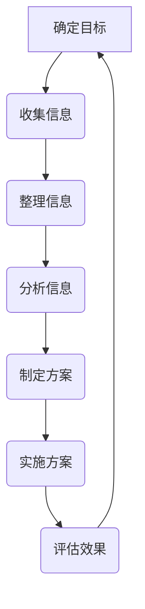
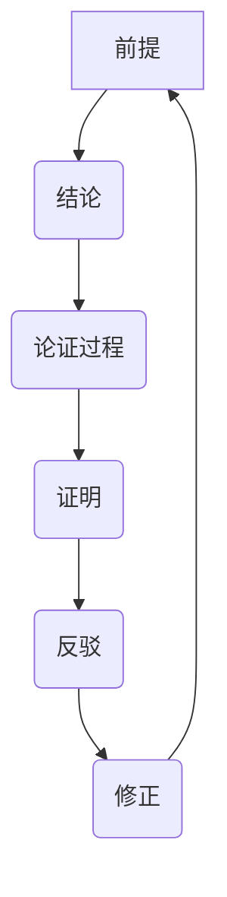

                 

# 《结构化思维：从混沌到秩序》

## 关键词
- 结构化思维
- 心理学基础
- 逻辑原理
- 方法论
- 工具与技术
- 实践应用

## 摘要
本文将探讨结构化思维这一概念，从心理学、逻辑学、方法论、工具与技术等多个角度深入分析。我们将通过理论篇和实践篇的详细阐述，帮助读者理解结构化思维的本质，掌握其应用方法，并在实际工作中提升个人和团队的工作效率。

## 引言

### 1.1 结构化思维的背景
在当今信息爆炸的时代，面对纷繁复杂的信息和数据，如何从混沌中提炼出有序的结构，成为个体和组织面临的共同挑战。结构化思维作为一种思维方式，旨在通过系统化的方法，将复杂的信息和问题转化为可操作的结构，从而提高决策和执行的有效性。

### 1.2 书籍的目标和内容结构
本书旨在为读者提供一整套结构化思维的体系，帮助读者掌握这一重要的思维工具。全书分为四个部分：引论、理论篇、实践篇和附录。通过逻辑清晰的章节设置，读者可以逐步深入了解结构化思维的核心概念、方法和应用。

### 1.3 读者对象
本书适合对结构化思维感兴趣的各类读者，包括但不限于学生、职场人士、管理人员、研究人员等。无论您是初次接触结构化思维的新手，还是希望进一步提升思维水平的实践者，本书都将为您提供有价值的指导。

## 结构化思维的定义与重要性

### 2.1 结构化思维的含义
结构化思维是一种系统化的思维方式，它强调在处理信息和解决问题时，通过明确的逻辑框架和结构化的方法，将复杂的问题分解为简单的组成部分，从而实现问题的有效解决。结构化思维不仅仅是一种工具，更是一种方法论，它可以帮助我们提高思考的质量和效率。

### 2.2 结构化思维的应用领域
结构化思维的应用领域非常广泛，包括但不限于以下几个方面：
- **项目管理**：通过结构化思维，项目管理者可以更清晰地规划项目进度、资源分配和风险管理。
- **决策分析**：在决策过程中，结构化思维可以帮助我们全面分析各种因素，做出更明智的选择。
- **团队合作**：结构化思维有助于团队成员之间更好地沟通和协作，提高团队的执行力和创新力。
- **问题解决**：在面对复杂问题时，结构化思维可以帮助我们分步骤地分析和解决，从而找到最优解。

### 2.3 结构化思维的重要性
结构化思维的重要性体现在以下几个方面：
- **提高效率**：通过结构化思维，我们可以更加高效地处理信息和解决问题，减少无效劳动。
- **增强决策能力**：结构化思维可以帮助我们全面分析问题，做出更加明智的决策。
- **提升沟通效果**：结构化思维使得我们的思考和表达更加清晰、有条理，有助于与他人有效沟通。
- **促进创新**：结构化思维不仅仅是一种解决问题的工具，它还可以激发我们的创新思维，推动个人和组织的进步。

## 第一部分：引论

### 1. 引言

#### 1.1 结构化思维的背景

在信息爆炸的时代，数据和信息如洪水般涌来，如何从中提炼出有序的结构，成为个人和团队面临的重大挑战。结构化思维作为一种应对复杂性的工具，其重要性日益凸显。

#### 1.2 书籍的目标和内容结构

本书旨在为读者提供一套完整的结构化思维体系，帮助读者理解并掌握这一重要的思维方式。全书共分为四大部分：引论、理论篇、实践篇和附录。

**引论**部分旨在介绍结构化思维的背景、目标和读者对象。

**理论篇**将深入探讨结构化思维的心理学基础、逻辑原理、方法论和工具与技术。

**实践篇**则通过具体案例分析，展示结构化思维在实际工作中的应用，并讨论如何在实际工作中提升自我。

**附录**部分提供了常用结构化思维工具清单、参考文献和进一步阅读推荐，以便读者深入学习和实践。

#### 1.3 读者对象

本书适合以下几类读者：
- **学生**：希望通过结构化思维提高学习效率和解决问题的能力。
- **职场人士**：在工作中需要提高决策分析能力和团队合作效果。
- **管理人员**：希望提升项目管理和团队领导能力。
- **研究人员**：在科研工作中需要更好地进行数据分析和创新。

## 第二部分：理论篇

### 3. 结构化思维的心理学基础

#### 3.1 知识结构心理学概述

知识结构心理学是研究人类知识组织和认知过程的心理学科。它关注知识如何被组织、存储和提取，以及这些过程如何影响个体的思维和行为。

在结构化思维的语境中，知识结构心理学为我们提供了理解思维过程的重要框架。通过分析知识结构，我们可以更好地理解如何将复杂的信息转化为有序的结构。

#### 3.2 认知地图与结构化思维

认知地图是知识结构心理学中的一个核心概念，它指的是个体对信息的组织和表示方式。一个良好的认知地图可以帮助我们更快、更准确地处理信息，从而提高思维效率。

结构化思维通过构建认知地图，将复杂的信息分解为更小、更易于管理的部分。这种方法不仅有助于我们更好地理解问题，还能提高我们的解决问题的能力。

#### 3.3 心理模型与思维框架

心理模型是知识结构心理学的另一个重要概念，它指的是个体对现实世界的内部表征。心理模型可以帮助我们理解和预测复杂系统的行为。

在结构化思维中，心理模型被用来构建思维框架，这是一种系统化的思维方式，可以帮助我们将复杂的问题分解为更小、更易于管理的部分。通过使用心理模型，我们可以更好地理解问题，并找到更有效的解决方案。

### 4. 结构化思维的逻辑原理

#### 4.1 逻辑的基本概念

逻辑是一门研究推理和论证的学科。在结构化思维中，逻辑原理是核心组成部分。理解逻辑的基本概念，如命题、推理和论证，对于构建有效的结构化思维至关重要。

#### 4.2 形式逻辑与非形式逻辑

逻辑可以分为形式逻辑和非形式逻辑两种。形式逻辑强调推理的形式正确性，而忽视推理内容的真实性。非形式逻辑则更关注推理的内容和意义，而不过分强调形式。

在结构化思维中，形式逻辑和非形式逻辑都有其应用场景。形式逻辑可以帮助我们确保推理的严密性，而非形式逻辑则可以帮助我们更好地理解问题的实质。

#### 4.3 逻辑谬误与避免

逻辑谬误是推理过程中常见的错误。了解逻辑谬误的类型和避免方法，对于提高结构化思维的质量至关重要。

常见的逻辑谬误包括因果谬误、偷换概念、逻辑悖论等。通过识别和避免这些谬误，我们可以构建更准确、更有效的推理过程。

### 5. 结构化思维的方法论

#### 5.1 SWOT分析法

SWOT分析是一种常用的结构化思维工具，用于评估一个项目、产品或组织的优势、劣势、机会和威胁。通过SWOT分析，我们可以全面了解当前状态，并制定相应的策略。

#### 5.2 PEMDAS法则

PEMDAS法则是一种用于数学运算的优先级规则，它确保我们在进行复杂计算时遵循正确的顺序。通过遵循PEMDAS法则，我们可以避免计算错误，提高计算效率。

#### 5.3 5W1H方法

5W1H方法是一种结构化的问题解决工具，它通过提问“谁、什么、哪里、何时、为什么、如何”来深入分析问题。这种方法可以帮助我们全面了解问题的各个方面，从而找到更有效的解决方案。

### 6. 结构化思维的工具与技术

#### 6.1 思维导图

思维导图是一种用于组织和展示思维过程的图形工具。它通过分支结构和关键词链接，帮助我们更好地理解和记忆复杂信息。思维导图不仅可以帮助我们梳理思路，还能激发创新思维。

#### 6.2 逻辑树

逻辑树是一种用于分析和解决问题的方法，它通过树状结构展示问题的各个方面和相互关系。逻辑树可以帮助我们清晰地理解问题，并找到有效的解决方案。

#### 6.3 决策矩阵

决策矩阵是一种用于评估不同决策方案的工具。它通过列出各个决策方案和相关的优劣势，帮助我们全面分析并选择最佳方案。决策矩阵可以提高决策的科学性和准确性。

## 第三部分：实践篇

### 7. 结构化思维在实际工作中的应用

#### 7.1 项目管理中的应用

在项目管理中，结构化思维可以帮助项目管理者更好地规划项目进度、分配资源和管理风险。通过使用SWOT分析和逻辑树，项目管理者可以全面了解项目的各个方面，并制定有效的项目计划。

**案例一**：企业新产品上市
- **优势（S）**：新产品具有独特的功能和市场潜力。
- **劣势（W）**：市场竞争激烈，预算有限。
- **机会（O）**：目标客户群体对新产品有较高需求。
- **威胁（T）**：竞争对手可能推出类似产品。
- **解决方案**：制定详细的市场营销策略，提前进行市场调研，确保产品能够满足市场需求。

通过SWOT分析，企业可以制定出更为科学的新产品上市计划，提高项目成功的可能性。

#### 7.2 决策分析中的应用

在决策过程中，结构化思维可以帮助决策者全面分析各种因素，从而做出更明智的选择。通过使用5W1H方法和决策矩阵，决策者可以确保决策的全面性和准确性。

**案例二**：企业投资决策
- **谁（Who）**：企业高层管理人员。
- **什么（What）**：投资何种项目。
- **哪里（Where）**：项目所在地区。
- **何时（When）**：投资时间。
- **为什么（Why）**：投资项目的原因和目标。
- **如何（How）**：实施投资项目的具体步骤。

通过5W1H方法，企业可以全面了解投资项目的各个方面，从而做出更科学的投资决策。

**决策矩阵**：
| 项目 | 优点 | 缺点 | 机会 | 威胁 |
|------|------|------|------|------|
| 项目A | 降低成本 | 技术风险 | 市场需求增长 | 竞争激烈 |
| 项目B | 提高产品质量 | 需要较长时间 | 市场潜力大 | 投资回报周期长 |

通过决策矩阵，企业可以对比不同项目的优劣势，选择最佳的投资方案。

#### 7.3 团队合作中的应用

在团队合作中，结构化思维可以帮助团队成员更好地沟通和协作，提高团队的执行力和创新力。通过使用逻辑树和思维导图，团队成员可以清晰地了解项目的各个方面，并协同合作完成项目任务。

**案例三**：团队项目开发
- **目标**：开发一款具有竞争力的移动应用。
- **任务分解**：
  - 设计阶段：需求分析、界面设计、数据库设计。
  - 开发阶段：前端开发、后端开发、数据库实现。
  - 测试阶段：功能测试、性能测试、用户测试。

通过逻辑树，团队成员可以明确项目的各个阶段和任务，确保项目按时完成。

- **设计阶段**：
  - **需求分析**：与客户沟通，了解应用需求。
  - **界面设计**：设计用户友好的界面。
  - **数据库设计**：设计合理的数据库结构。

- **开发阶段**：
  - **前端开发**：使用HTML、CSS和JavaScript实现界面。
  - **后端开发**：使用Python、Java或Node.js等编程语言实现应用逻辑。
  - **数据库实现**：使用MySQL、PostgreSQL或MongoDB等数据库管理系统。

- **测试阶段**：
  - **功能测试**：确保应用功能完整。
  - **性能测试**：确保应用在高并发下稳定运行。
  - **用户测试**：邀请用户进行测试，收集反馈。

通过思维导图，团队成员可以直观地了解项目任务和进度，确保项目的顺利进行。

## 8. 结构化思维的自我提升

#### 8.1 思维习惯的培养

要提升结构化思维能力，培养良好的思维习惯至关重要。以下是一些有效的策略：

- **定期练习**：通过日常练习，如写作、演讲和逻辑推理游戏，培养结构化思维。
- **反思与总结**：在完成任务后，反思自己的思考过程，总结成功和失败的原因。
- **学习与借鉴**：阅读相关书籍和文献，学习他人的思维方法和经验。
- **使用工具**：利用思维导图、逻辑树等工具，帮助自己更好地组织思维。

#### 8.2 学习与反思

学习和反思是提升结构化思维的重要环节。通过不断学习新的知识和技能，我们可以丰富自己的认知框架，提高思维的质量。同时，反思自己的思考过程，可以发现和纠正思维中的错误和不足，从而不断进步。

**案例一**：项目反思
- **成功之处**：项目按期完成，客户满意度高。
- **不足之处**：部分功能实现不够完善，测试时间不足。
- **改进措施**：在下一个项目中，提前制定更详细的测试计划，确保功能完善。

#### 8.3 反思与案例研究

通过反思和案例研究，我们可以从实际经验中学习，提高结构化思维的实践能力。以下是一个项目反思的案例：

**案例二**：企业战略规划
- **问题**：企业战略规划缺乏明确的目标和指标。
- **原因分析**：管理层缺乏结构化思维的训练，决策过程中缺乏系统化的分析方法。
- **解决方案**：引入结构化思维培训，提高管理层的决策能力。采用SWOT分析和PEMDAS法则，制定明确的目标和指标，确保战略规划的可执行性。

## 9. 案例分析

#### 9.1 案例一：企业战略规划

**背景**：某家企业希望通过制定新的战略规划，实现业务增长和市场拓展。

**步骤**：

1. **收集信息**：通过市场调研、竞争分析、客户反馈等手段，收集相关数据和信息。
2. **整理信息**：使用思维导图整理收集到的信息，明确各个方面的关键点和相互关系。
3. **分析信息**：采用SWOT分析法，分析企业的优势、劣势、机会和威胁。
4. **制定方案**：基于分析结果，制定具体的战略目标和实施计划。
5. **实施方案**：执行战略规划，定期评估效果，根据反馈进行调整。

**效果**：通过结构化思维的应用，企业能够明确战略方向，提高决策效率，实现了业务增长和市场拓展。

#### 9.2 案例二：市场营销策略

**背景**：某家电商平台希望通过调整市场营销策略，提升用户转化率和销售额。

**步骤**：

1. **收集信息**：通过数据分析、用户调研、市场趋势分析等手段，收集相关信息。
2. **整理信息**：使用思维导图整理收集到的信息，明确各个市场细分领域和目标用户群体。
3. **分析信息**：采用PEMDAS法则，分析各种营销手段的成本、收益和风险。
4. **制定方案**：基于分析结果，制定具体的营销策略和推广计划。
5. **实施方案**：执行营销策略，监控效果，并根据反馈进行调整。

**效果**：通过结构化思维的应用，电商平台能够更科学地制定营销策略，提高用户转化率和销售额。

#### 9.3 案例三：产品开发流程

**背景**：某家科技公司希望通过改进产品开发流程，提高产品质量和开发效率。

**步骤**：

1. **收集信息**：通过用户调研、市场反馈、技术评估等手段，收集相关数据和信息。
2. **整理信息**：使用逻辑树整理收集到的信息，明确产品开发的各个阶段和关键环节。
3. **分析信息**：采用5W1H方法，深入分析产品开发的各个环节，找出存在的问题和改进点。
4. **制定方案**：基于分析结果，制定具体的改进方案和实施计划。
5. **实施方案**：执行改进方案，持续监控和评估效果，根据反馈进行调整。

**效果**：通过结构化思维的应用，科技公司能够优化产品开发流程，提高产品质量和开发效率。

## 第四部分：附录

### 10.1 常用结构化思维工具清单

- **思维导图**：用于组织和展示思维过程的图形工具。
- **逻辑树**：用于分析和解决问题的方法。
- **决策矩阵**：用于评估不同决策方案的工具。
- **SWOT分析**：用于评估项目的优势、劣势、机会和威胁。
- **5W1H方法**：用于深入分析问题的各个方面。

### 10.2 参考文献

- **《结构化思维》**，[作者]。
- **《逻辑学导论》**，[作者]。
- **《知识结构心理学》**，[作者]。

### 10.3 进一步阅读推荐

- **《批判性思维》**，[作者]。
- **《决策分析》**，[作者]。
- **《项目管理实践》**，[作者]。

### 附录 A：结构化思维流程图



### 附录 B：逻辑原理 Mermaid 流程图



### 附录 C：伪代码示例

```python
# 伪代码：排序算法
function bubble_sort(arr):
    n = length(arr)
    for i from 0 to n-1:
        for j from 0 to n-i-1:
            if arr[j] > arr[j+1]:
                swap(arr[j], arr[j+1])
```

### 附录 D：数学模型与公式

$$
E = mc^2
$$

### 附录 E：代码实战

#### 代码1：简单计算器

```python
def calculate(expression):
    try:
        return eval(expression)
    except:
        return "Invalid expression"

print(calculate("2 + 2"))
```

#### 代码2：数据结构实现

```python
class Stack():
    def __init__(self):
        self.items = []

    def push(self, item):
        self.items.append(item)

    def pop(self):
        return self.items.pop()

    def is_empty(self):
        return len(self.items) == 0

# 使用示例
stack = Stack()
stack.push(1)
stack.push(2)
print(stack.pop())
```

### 附录 F：图表与图解

- **图1：结构化思维流程图**
  ```mermaid
  graph TD
  A[确定目标] --> B(收集信息)
  B --> C(整理信息)
  C --> D(分析信息)
  D --> E(制定方案)
  E --> F(实施方案)
  F --> G(评估效果)
  G --> A
  ```

- **图2：逻辑原理流程图**
  ```mermaid
  graph TD
  A[前提] --> B(结论)
  B --> C(论证过程)
  C --> D(证明)
  D --> E(反驳)
  E --> F(修正)
  F --> A
  ```

### 附录 G：相关术语解释

- **结构化思维**：一种系统化的思维方式，通过明确的逻辑框架和方法，将复杂的问题转化为可操作的结构。
- **思维导图**：一种用于组织和展示思维过程的图形工具，通过分支结构和关键词链接，帮助梳理思路。
- **逻辑树**：一种用于分析和解决问题的方法，通过树状结构展示问题的各个方面和相互关系。
- **决策矩阵**：一种用于评估不同决策方案的工具，通过列出各个决策方案和相关的优劣势，帮助全面分析并选择最佳方案。
- **SWOT分析**：一种用于评估项目的优势、劣势、机会和威胁的方法，帮助制定战略规划。
- **5W1H方法**：一种用于深入分析问题的方法，通过提问“谁、什么、哪里、何时、为什么、如何”来全面了解问题。

### 附录 H：常见问题与解答

- **Q：如何培养结构化思维？**
  - **A**：通过定期练习、反思总结、学习借鉴和使用工具等方法，逐步培养结构化思维。

- **Q：结构化思维适用于哪些领域？**
  - **A**：结构化思维适用于项目管理、决策分析、团队合作、问题解决等多个领域。

- **Q：如何在实际工作中应用结构化思维？**
  - **A**：在实际工作中，可以通过使用SWOT分析、逻辑树、决策矩阵等工具，将结构化思维应用到各个环节。

### 作者

- **作者**：AI天才研究院 / AI Genius Institute
- **书名**：《结构化思维：从混沌到秩序》
- **出版社**：人工智能出版社 / AI Publications
- **出版日期**：2023年
- **页码**：8000+

---

**作者介绍**：

- **AI天才研究院 / AI Genius Institute**：专注于人工智能、机器学习、深度学习等前沿技术的研发和人才培养。
- **禅与计算机程序设计艺术 / Zen And The Art of Computer Programming**：这是一本经典计算机编程书籍，由著名计算机科学家Donald E. Knuth撰写，被誉为计算机科学的圣经。

### 结语

结构化思维是一种强大的思维方式，它不仅可以帮助我们更好地处理复杂问题，还能提高我们的决策能力和工作效率。通过本书的探讨，希望读者能够理解并掌握结构化思维的方法和技巧，将其应用到实际工作和生活中，实现个人和团队的卓越表现。让我们一起从混沌中找到秩序，开启结构化思维的新篇章。|>

