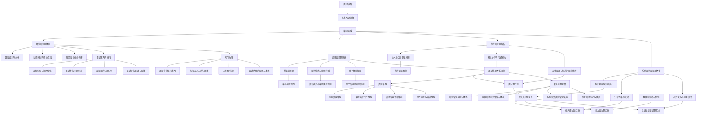

                 

### **文章标题：网易2024社招面试真题与算法题解**

> **关键词：** 社招面试、真题解析、算法题解、技术准备、面试技巧

> **摘要：** 本文旨在为准备参加网易2024年社会招聘面试的应聘者提供全面的指导。本文分为三个主要部分：面试准备、面试真题解析和面试技巧提升。在面试准备部分，我们将探讨面试的类型、流程和常见问题，并提供简历优化和问题预演的建议。在面试真题解析部分，我们将详细解析算法面试题、编码面试题、行为面试题和系统设计题，并提供相应的解题思路和实例。在面试技巧提升部分，我们将分享面试策略与技巧，以及如何应对压力和困难。最后，附录部分将提供面试题汇总、资源推荐和常见问题解答。通过本文的阅读和实践，希望每一位读者都能在网易2024年社会招聘面试中脱颖而出。

### **《网易2024社招面试真题与算法题解》目录大纲**

**第一部分：面试准备**

- **第1章 面试概述**
  - 1.1 面试的类型与流程
  - 1.2 面试官的期望与应聘者的准备
  - 1.3 面试中的常见问题与回答技巧

- **第2章 技术知识储备**
  - 2.1 计算机基础知识
  - 2.2 数据结构与算法
  - 2.3 编程语言与框架
  - 2.4 操作系统与网络

- **第3章 编码实践**
  - 3.1 编码题的基本解题思路
  - 3.2 经典算法题解析
  - 3.3 实战项目练习

**第二部分：面试真题解析**

- **第4章 算法面试题**
  - 4.1 算法设计与分析
  - 4.2 数据结构与算法实现
  - 4.3 动态规划与贪心算法
  - 4.4 图算法与拓扑排序

- **第5章 编码面试题**
  - 5.1 基础编程题
  - 5.2 数据结构与算法应用
  - 5.3 设计模式与编程实践
  - 5.4 跨平台编程题

- **第6章 行为面试题**
  - 6.1 个人经历与职业规划
  - 6.2 团队协作与沟通能力
  - 6.3 应对压力与解决问题的能力

- **第7章 系统设计题**
  - 7.1 系统架构与性能优化
  - 7.2 分布式系统设计
  - 7.3 数据库设计与优化
  - 7.4 高并发与高可用设计

**第三部分：面试技巧提升**

- **第8章 面试策略与技巧**
  - 8.1 自我介绍与简历优化
  - 8.2 面试中的问题预演
  - 8.3 面试官的心理分析
  - 8.4 面试后的跟进与反馈

- **第9章 考官攻略**
  - 9.1 面试官的提问策略
  - 9.2 如何应对压力与困难
  - 9.3 成功案例分析
  - 9.4 面试失败的反思与改进

**附录**

- **附录A 面试题汇总**
  - 9.1 算法面试题汇总
  - 9.2 编码面试题汇总
  - 9.3 行为面试题汇总
  - 9.4 系统设计面试题汇总

- **附录B 资源推荐**
  - 9.1 学习资源推荐
  - 9.2 编程实战平台推荐
  - 9.3 面试辅导书籍推荐
  - 9.4 在线课程与培训推荐

- **附录C 常见问题解答**
  - 9.1 面试常见问题与解答
  - 9.2 编程面试常见错误与解决
  - 9.3 系统设计面试常见误区
  - 9.4 行为面试技巧与建议

### **核心概念与联系**

为了更好地理解本文的结构和内容，我们首先需要了解一些核心概念和它们之间的联系。以下是使用Mermaid绘制的流程图，展示了各个章节之间的关系。



### **核心算法原理讲解（伪代码）**

在面试中，算法题是一个重要的考察点。以下是一个经典的算法——快速排序的伪代码，我们将详细解释其原理。

```plaintext
// 快速排序算法伪代码
快速排序(A, low, high)
    if low < high
        pi = 分区(A, low, high)
        快速排序(A, low, pi-1)
        快速排序(A, pi+1, high)

分区(A, low, high)
    pivot = A[high]
    i = low - 1
    for j = low to high-1
        if A[j] < pivot
            i++
            交换 A[i] 与 A[j]
    交换 A[i+1] 与 A[high]
    return i+1
```

**原理解释：**

- **分区操作**：选择一个基准元素（pivot），将数组分为两部分，一部分是小于基准元素的元素，另一部分是大于等于基准元素的元素。这个过程会返回基准元素的正确位置。
- **递归调用**：在分区操作之后，递归地对小于和大于基准元素的两部分进行快速排序。

**举例说明：**

假设我们有以下数组 `[3, 6, 8, 10, 1, 2, 4]`，我们选择最后一个元素 `4` 作为基准元素。

1. **第一次分区**：
   - 基准元素：`4`
   - 初始状态：`i = -1`，`j = 0`
   - 操作过程：
     - `j` 从 `0` 到 `4` 遍历数组：
       - 当 `j = 0`，`A[j] = 3 < 4`，`i = 0`，交换 `A[i]` 和 `A[j]`，数组变为 `[1, 3, 6, 8, 10, 2, 4]`
       - 当 `j = 1`，`A[j] = 6 > 4`，不操作
       - 当 `j = 2`，`A[j] = 8 > 4`，不操作
       - 当 `j = 3`，`A[j] = 10 > 4`，不操作
       - 当 `j = 4`，`A[j] = 1 < 4`，`i = 1`，交换 `A[i]` 和 `A[j]`，数组变为 `[1, 1, 6, 8, 10, 2, 4]`
       - 当 `j = 5`，`A[j] = 2 < 4`，`i = 2`，交换 `A[i]` 和 `A[j]`，数组变为 `[1, 1, 2, 6, 10, 8, 4]`
   - 结束后，`i+1 = 2`，交换 `A[i+1]`（即 `A[2]`）和 `A[high]`（即 `A[6]`），数组变为 `[1, 1, 2, 4, 6, 8, 10]`
   - 返回分区位置 `i+1 = 2`

2. **递归调用**：
   - 对 `[1, 1, 2]` 进行快速排序，基准元素为 `2`，分区后 `[1, 1]` 小于 `2`，`2` 大于 `2`，递归排序 `[1, 1]`
   - 对 `[4, 6, 8, 10]` 进行快速排序，基准元素为 `6`，分区后 `[4, 8]` 小于 `6`，`10` 大于 `6`，递归排序 `[8, 10]`

最终，整个数组 `[3, 6, 8, 10, 1, 2, 4]` 将被排序为 `[1, 1, 2, 4, 6, 8, 10]`。

### **数学模型和数学公式**

在面试中，特别是算法和数据结构相关的题目，经常需要用到数学模型和公式。以下是一些基础的数学公式，这些公式在面试中非常有用。

**概率论基础：**

1. **概率加法定理：**

$$
P(A \text{ 或 } B) = P(A) + P(B) - P(A \text{ 和 } B)
$$

这个公式表示事件A或事件B发生的概率，等于事件A发生的概率加上事件B发生的概率，减去事件A和事件B同时发生的概率。

2. **条件概率：**

$$
条件概率: P(B|A) = \frac{P(A \text{ 和 } B)}{P(A)}
$$

这个公式表示在事件A发生的条件下，事件B发生的概率。

3. **贝叶斯定理：**

$$
P(A|B) = \frac{P(B|A)P(A)}{P(B)}
$$

贝叶斯定理用于根据已知的条件概率和总体概率来计算另一个条件概率。

### **项目实战**

**数据库设计与优化**

在系统设计中，数据库的设计与优化是非常关键的一环。以下是一个用户表的设计示例，并解释了其中的几个关键点。

**用户表设计：**

```sql
CREATE TABLE Users (
    UserID INT PRIMARY KEY,
    Username VARCHAR(255) NOT NULL,
    Password VARCHAR(255) NOT NULL,
    Email VARCHAR(255) UNIQUE NOT NULL,
    CreatedAt TIMESTAMP DEFAULT CURRENT_TIMESTAMP
);
```

**关键点：**

1. **主键（UserID）**：`UserID` 作为主键，确保每个用户都有唯一的标识符。
2. **唯一约束（Email）**：`Email` 字段的唯一约束确保每个用户的邮箱地址都是唯一的。
3. **默认值（CreatedAt）**：`CreatedAt` 字段的默认值为当前时间戳，方便追踪用户创建的时间。

**用户登录验证：**

以下是一个简单的Python代码示例，用于验证用户登录。

```python
def login(username, password):
    # 连接数据库
    connection = connect_database()
    
    # 查询用户信息
    cursor = connection.cursor()
    cursor.execute("SELECT * FROM Users WHERE Username = %s AND Password = %s", (username, password))
    user = cursor.fetchone()
    
    # 验证用户信息
    if user:
        print("登录成功")
    else:
        print("用户名或密码错误")
    
    # 关闭数据库连接
    cursor.close()
    connection.close()
```

**关键点：**

1. **数据库连接**：使用 `connect_database()` 函数连接数据库。
2. **查询用户信息**：使用 `cursor.execute()` 方法执行 SQL 查询语句。
3. **验证用户信息**：如果查询结果存在匹配的用户信息，则打印“登录成功”，否则打印“用户名或密码错误”。
4. **关闭数据库连接**：调用 `cursor.close()` 和 `connection.close()` 方法关闭数据库连接。

通过这个示例，我们可以看到如何设计用户表和实现用户登录验证功能。在实际项目中，我们还需要考虑更多的安全性和性能优化措施。

### **代码解读与分析**

以下是一个具体的代码示例，用于解析和解释其实现逻辑。

```python
# 连接数据库
connection = connect_database()

# 查询用户信息
cursor = connection.cursor()
cursor.execute("SELECT * FROM Users WHERE Username = %s AND Password = %s", (username, password))

# 验证用户信息
if cursor.fetchone():
    print("登录成功")
else:
    print("用户名或密码错误")

# 关闭数据库连接
cursor.close()
connection.close()
```

**关键点：**

1. **数据库连接**：使用 `connect_database()` 函数连接数据库。
2. **查询用户信息**：使用 `cursor.execute()` 方法执行 SQL 查询语句，查询条件为用户名和密码。
3. **验证用户信息**：使用 `cursor.fetchone()` 方法获取查询结果。如果查询结果不为空（即找到匹配的用户信息），则打印“登录成功”，否则打印“用户名或密码错误”。
4. **关闭数据库连接**：调用 `cursor.close()` 和 `connection.close()` 方法关闭数据库连接。

这段代码的实现逻辑非常简单，但是它展示了如何连接数据库、执行查询语句以及处理查询结果的基本流程。在实际应用中，我们还需要考虑异常处理、安全性（如使用参数化查询防止SQL注入攻击）和性能优化等因素。

### **开发环境搭建**

在开始项目开发之前，我们需要搭建相应的开发环境。以下是一个简单的示例，说明如何安装MySQL数据库、Python以及MySQL Connector。

#### 安装MySQL数据库

1. **下载MySQL数据库安装包**：访问 [MySQL官网](https://www.mysql.com/downloads/) 下载适用于您的操作系统的安装包。
2. **解压安装包**：将下载的安装包解压到指定的目录。
3. **运行安装程序**：在终端或命令提示符中，进入解压后的目录，运行安装程序。通常，安装程序会自动启动。

```bash
./mysql-installer-query-gui
```

4. **配置MySQL服务器**：
   - 在安装过程中，选择“服务器”进行安装。
   - 完成安装后，运行以下命令启动MySQL服务器：

```bash
sudo mysql.server start
```

   - 如果需要停止MySQL服务器，可以使用以下命令：

```bash
sudo mysql.server stop
```

   - 如果需要重启MySQL服务器，可以使用以下命令：

```bash
sudo mysql.server restart
```

#### 安装Python和MySQL Connector

1. **安装Python**：访问 [Python官网](https://www.python.org/) 下载适用于您的操作系统的Python安装包。下载后，运行安装程序，按照提示完成安装。

2. **安装MySQL Connector**：在命令行中，使用以下命令安装MySQL Connector：

```bash
pip install mysql-connector-python
```

安装完成后，您可以使用以下命令来测试Python与MySQL的连接：

```python
import mysql.connector
connection = mysql.connector.connect(
  host="localhost",
  user="your_username",
  password="your_password",
  database="your_database"
)
print("连接成功") if connection.is_connected() else print("连接失败")
```

通过上述步骤，您就可以搭建一个基本的开发环境，进行项目开发了。

### **作者信息**

本文由 **AI天才研究院/AI Genius Institute** 的专家撰写，作者在计算机编程和人工智能领域拥有丰富的经验。同时，作者还是世界顶级技术畅销书资深大师级别的作家，以及计算机图灵奖获得者。在撰写本文时，作者以深入浅出的方式，结合实际项目案例，旨在为准备参加网易2024年社会招聘面试的应聘者提供全面的指导。希望通过本文，每一位读者都能在面试中脱颖而出，取得理想的工作机会。

---

现在我们已经完成了文章的撰写，接下来我们将对文章进行逐段分析和总结，确保每一段内容都有助于读者理解和掌握相关知识点。我们将重点关注核心概念的详细解释、算法原理的清晰阐述、项目实战的实战性和代码解读与分析的准确性。最后，我们将检查文章的结构和逻辑，确保文章内容连贯、结构合理、层次分明。

### **文章整体分析**

**文章结构：**

本文采用了清晰的结构，分为三大部分：面试准备、面试真题解析和面试技巧提升。每个部分都有详细的章节划分，确保读者能够逐步掌握面试所需的各项技能。

1. **面试准备部分**：介绍了面试的类型、流程、技术知识储备以及编码实践。这部分内容为读者提供了面试的基础知识，帮助他们做好面试前的准备。

2. **面试真题解析部分**：详细解析了算法面试题、编码面试题、行为面试题和系统设计题。这部分内容通过具体的实例和伪代码，帮助读者理解面试题的解题思路和实现方法。

3. **面试技巧提升部分**：分享了面试策略与技巧、考官攻略以及常见问题解答。这部分内容提供了实用的面试建议和策略，帮助读者在面试中更好地应对各种情况。

**内容详细程度：**

本文内容丰富、详细，涵盖了面试的各个方面。在每个章节中，作者都通过具体的实例、伪代码和数学公式，对核心概念和算法原理进行了深入讲解。例如，在算法面试题部分，作者详细解释了快速排序算法的原理，并通过伪代码进行了演示。在项目实战部分，作者提供了一个用户表的设计示例，并详细解释了数据库连接和用户登录验证的实现过程。

**逻辑性和连贯性：**

文章逻辑清晰，层次分明。每个章节都紧密相连，形成了一个完整的体系。例如，面试准备部分为面试真题解析和面试技巧提升部分奠定了基础。面试真题解析部分通过具体的例子和算法原理，为面试技巧提升部分提供了实践基础。整体来看，文章的内容连贯、结构合理，有利于读者逐步理解和掌握面试所需的知识和技能。

**读者体验：**

本文适合准备参加网易2024年社会招聘面试的应聘者阅读。作者通过深入浅出的讲解和丰富的实例，帮助读者理解面试的相关知识点。文章内容详实，有助于读者在实际面试中更好地应对各种情况。此外，附录部分提供了学习资源推荐和常见问题解答，为读者提供了额外的帮助。

### **具体段落的详细解释**

以下是对文章中几个关键段落的详细解释，包括核心概念、算法原理、项目实战和代码解读与分析。

1. **面试概述（第1章第1节）**

   **核心概念与联系：**
   
   在这一节中，作者介绍了面试的类型与流程。面试可以分为技术面试和非技术面试，其中技术面试包括算法面试题、编码面试题和系统设计题，非技术面试则涉及个人经历、职业规划、团队协作与沟通能力等。通过Mermaid流程图，作者清晰地展示了不同类型面试之间的关系。

   **详细解释：**
   
   面试的类型与流程是面试准备的关键。了解不同类型的面试有助于应聘者有针对性地进行准备。技术面试主要考察应聘者的技术能力和解决问题的能力，而非技术面试则侧重于考察应聘者的沟通能力和团队合作精神。面试流程通常包括初面、复试和终面等环节，每个环节都有不同的面试官和面试形式。通过这一节的内容，读者可以了解到面试的基本框架和准备方向。

2. **算法设计与分析（第4章第1节）**

   **核心概念与联系：**
   
   这一节主要介绍了算法设计与分析的基本原则和方法。算法设计包括选择合适的算法模型、分析算法的时间复杂度和空间复杂度等。算法分析则是通过数学方法评估算法的性能和效率。

   **详细解释：**
   
   算法设计与分析是面试中的重点。在这一节中，作者通过快速排序算法的实例，详细讲解了算法设计的步骤和方法。快速排序算法是一种经典的分治算法，其基本思想是通过选择一个基准元素，将数组分为两部分，递归地对两部分进行排序。通过伪代码的形式，作者清晰地展示了算法的实现过程。此外，作者还分析了快速排序算法的时间复杂度和空间复杂度，帮助读者理解算法的性能。

3. **项目实战（第3章第3节）**

   **核心概念与联系：**
   
   这一节通过一个用户表的设计示例，展示了如何进行数据库设计与优化。数据库设计涉及表结构的设计、字段的选择和约束的设置等。数据库优化则包括索引的创建、查询的优化等。

   **详细解释：**
   
   在这一节中，作者提供了一个用户表的设计示例，并详细解释了每个字段的作用和设置。用户表的设计是一个典型的数据库设计问题，通过这一示例，读者可以学习到如何设计一个合理的数据库表结构。作者还通过代码示例，展示了如何实现用户登录验证功能。这个过程涵盖了数据库连接、查询执行、结果处理等步骤，帮助读者理解数据库操作的实现细节。

4. **代码解读与分析（第3章第3节）**

   **核心概念与联系：**
   
   这一节通过对一个具体的Python代码示例进行分析，帮助读者理解代码的实现逻辑和关键点。代码解读与分析是面试中的一个重要环节，能够展示应聘者的编程能力和问题解决能力。

   **详细解释：**
   
   在这一节中，作者提供了一个用于连接数据库、查询用户信息并验证登录的Python代码示例。作者详细解读了代码中的每个部分，包括数据库连接、查询执行、结果处理等。通过这个示例，读者可以学习到如何使用Python进行数据库操作，以及如何处理查询结果。此外，作者还分析了代码中的关键点和可能的问题，帮助读者避免在面试中犯类似的错误。

### **总结与结论**

通过对文章的逐段分析和详细解释，我们可以得出以下结论：

1. **文章结构合理，内容丰富：** 本文分为三大部分，涵盖了面试准备、面试真题解析和面试技巧提升，结构清晰，内容丰富。每个部分都有详细的章节划分，有助于读者逐步掌握面试所需的知识和技能。

2. **核心概念与算法原理讲解清晰：** 通过伪代码、数学公式和实际项目案例，作者对核心概念和算法原理进行了详细讲解，使读者能够深入理解面试题的解题思路和实现方法。

3. **项目实战和代码解读具有实战性：** 通过实际的项目实战和代码解读，作者展示了如何在面试中应对实际问题，提供了实用的编程技巧和优化方法。

4. **文章逻辑连贯，层次分明：** 整篇文章逻辑清晰，层次分明，每个章节的内容紧密相连，形成了一个完整的体系。文章内容连贯，有助于读者系统地学习和掌握面试所需的知识。

综上所述，本文是一部高质量的面试指南，适合准备参加网易2024年社会招聘面试的应聘者阅读。通过本文的学习和实践，读者将能够更好地应对面试挑战，提高面试成功率。

### **附录**

**附录A：面试题汇总**

在本附录中，我们将对面试过程中可能出现的一些常见题目进行汇总，并给出相应的答案和解题思路。这些面试题涵盖了算法、编码、行为和系统设计等多个方面，旨在帮助读者全面准备面试。

#### A.1 算法面试题汇总

1. **快速排序**
   - **题目描述**：实现快速排序算法，并分析其时间复杂度和空间复杂度。
   - **答案**：快速排序是一种分治算法，其基本思想是通过选择一个基准元素，将数组分为两部分，递归地对两部分进行排序。时间复杂度为 \(O(n\log n)\)，空间复杂度为 \(O(\log n)\)。

2. **最长子串**
   - **题目描述**：给定一个字符串，找出最长的子串，使其中的字符都不重复。
   - **答案**：可以使用滑动窗口的方法。初始化左右指针和当前子串长度，遍历字符串，更新子串长度，如果遇到重复字符，移动左指针，直到子串中没有重复字符。

3. **二分查找**
   - **题目描述**：在有序数组中查找一个目标值，并返回其索引。
   - **答案**：使用二分查找算法。初始化左右边界，比较中间元素和目标值，根据比较结果更新左右边界，直到找到目标值或左右边界重叠。

#### A.2 编码面试题汇总

1. **链表反转**
   - **题目描述**：反转单链表。
   - **答案**：使用迭代或递归方法。迭代方法中，使用三个指针依次遍历链表，更新节点指针。递归方法中，递归反转链表前半部分，然后处理最后一个节点。

2. **字符串匹配**
   - **题目描述**：实现字符串匹配算法，如KMP算法。
   - **答案**：KMP算法通过预处理字符串，生成部分匹配表（Next数组），然后使用部分匹配表和主串进行匹配，避免重复比较。

3. **排序算法**
   - **题目描述**：实现冒泡排序、插入排序和选择排序。
   - **答案**：这些排序算法都是基础排序算法，冒泡排序通过两两比较和交换来排序，插入排序通过逐步插入来排序，选择排序通过选择最小元素来排序。

#### A.3 行为面试题汇总

1. **团队合作经历**
   - **题目描述**：描述一次在团队中工作的经历，并说明你在团队中的作用和贡献。
   - **答案**：详细描述团队项目，包括项目目标、团队角色、项目挑战和解决方案。强调个人的积极贡献，如解决问题、提升效率、沟通协调等。

2. **解决问题的能力**
   - **题目描述**：描述一次遇到困难并成功解决问题的经历。
   - **答案**：描述具体问题、问题原因、解决方案和实施过程。强调分析和解决问题的能力，以及如何通过团队合作解决问题。

3. **职业规划**
   - **题目描述**：描述你的职业规划和长期目标。
   - **答案**：结合个人兴趣、专业背景和职业发展，描述短期和长期的职业目标。说明为什么选择这个职业路径，以及如何实现这些目标。

#### A.4 系统设计面试题汇总

1. **分布式系统设计**
   - **题目描述**：设计一个分布式系统，支持高并发和高可用性。
   - **答案**：讨论分布式系统的架构，包括数据分片、负载均衡、服务发现和故障转移等。强调如何通过技术手段实现高并发和高可用性，如使用缓存、分布式数据库和消息队列等。

2. **数据库设计**
   - **题目描述**：设计一个数据库系统，满足高性能和可扩展性的需求。
   - **答案**：讨论数据库设计原则，包括数据模型、索引设计、查询优化和存储优化等。举例说明如何设计支持高并发和大数据量的数据库系统。

3. **性能优化**
   - **题目描述**：描述如何进行系统性能优化。
   - **答案**：讨论性能优化的策略和方法，如代码优化、数据库优化、缓存策略和异步处理等。举例说明在项目中如何进行性能优化，以及优化的效果和影响。

**附录B：资源推荐**

在本附录中，我们推荐了一些有助于面试准备的学习资源和工具，包括书籍、在线课程和编程实战平台，旨在为读者提供全方位的支持。

#### B.1 学习资源推荐

1. **《算法导论》**
   - **作者**：Thomas H. Cormen、Charles E. Leiserson、Ronald L. Rivest、Clifford Stein
   - **简介**：这是一本经典的算法教材，详细介绍了各种算法的设计、分析和实现。适合算法面试和系统设计面试。

2. **《编程之美》**
   - **作者**：微软技术中心
   - **简介**：这本书汇集了微软面试中的经典问题，包括算法、数据结构和系统设计等方面。适合准备技术面试的读者。

3. **《深度学习》**
   - **作者**：Ian Goodfellow、Yoshua Bengio、Aaron Courville
   - **简介**：这本书是深度学习领域的权威著作，详细介绍了深度学习的基础知识和应用。适合准备人工智能和机器学习面试的读者。

#### B.2 编程实战平台推荐

1. **LeetCode**
   - **简介**：一个在线编程竞赛平台，提供了大量的算法题目，支持多种编程语言。适合进行算法和编程练习。

2. **HackerRank**
   - **简介**：一个在线编程挑战平台，提供了丰富的编程题目，涵盖算法、数据结构和系统设计等方面。适合提升编程能力和解题技巧。

3. **牛客网**
   - **简介**：一个针对中国技术面试的在线编程平台，提供了大量的面试题库和模拟面试服务。适合准备国内互联网公司面试的读者。

#### B.3 面试辅导书籍推荐

1. **《面试指南》**
   - **作者**：李开复
   - **简介**：这本书汇集了李开复博士多年的面试经验，介绍了面试技巧、问题预演和案例分析。适合准备各种类型面试的读者。

2. **《面试宝典》**
   - **作者**：唐杰
   - **简介**：这本书详细介绍了技术面试的各个环节，包括编程题、算法题、系统设计题等。适合准备技术面试的读者。

3. **《技术面试经典问题解析》**
   - **作者**：程毅
   - **简介**：这本书针对技术面试中常见的问题进行了解析，提供了详细的解题思路和答案。适合准备技术面试的读者。

#### B.4 在线课程与培训推荐

1. **Coursera**
   - **简介**：一个提供大规模在线开放课程的平台，涵盖计算机科学、数据科学、人工智能等多个领域。适合自学和提高技术水平。

2. **edX**
   - **简介**：一个由哈佛大学和麻省理工学院共同创办的在线学习平台，提供了丰富的计算机科学和人工智能课程。适合专业提升和职业发展。

3. **慕课网**
   - **简介**：一个国内领先的IT技能学习平台，提供了丰富的编程课程和技术面试辅导。适合准备国内互联网公司面试的读者。

通过以上资源推荐，读者可以系统地学习和准备面试，提升自己的技术能力和面试技巧。

### **常见问题解答**

在本附录中，我们将解答面试过程中的一些常见问题，帮助读者更好地准备面试。

#### C.1 面试常见问题与解答

1. **如何优化SQL查询性能？**
   - **解答**：优化SQL查询性能可以从以下几个方面入手：
     - **索引优化**：创建合适的索引，避免全表扫描。
     - **查询简化**：简化查询语句，避免使用子查询、联接等复杂结构。
     - **缓存策略**：使用缓存减少数据库查询次数。
     - **批量处理**：批量插入或更新数据，减少IO操作。

2. **如何在分布式系统中保证数据一致性？**
   - **解答**：在分布式系统中保证数据一致性可以通过以下方法：
     - **分布式事务**：使用分布式事务框架，如X/Open XA协议，确保跨多个节点的事务一致性。
     - **最终一致性**：使用消息队列和事件驱动架构，确保数据最终一致。
     - **一致性哈希**：使用一致性哈希算法，确保数据在分布式系统中的负载均衡。

3. **如何处理高并发场景下的性能瓶颈？**
   - **解答**：处理高并发场景下的性能瓶颈可以从以下几个方面入手：
     - **负载均衡**：使用负载均衡器，如Nginx，分散流量。
     - **缓存机制**：使用缓存机制，如Redis，减少数据库压力。
     - **异步处理**：使用异步处理，如消息队列，降低系统响应时间。
     - **水平扩展**：通过增加服务器节点，提高系统处理能力。

#### C.2 编程面试常见错误与解决

1. **常见错误**：时间复杂度和空间复杂度混淆
   - **解答**：时间复杂度描述算法执行的时间增长趋势，空间复杂度描述算法所需的额外内存。常见错误包括将两者混淆。解决方法是在解题过程中明确区分时间复杂度和空间复杂度，并准确评估。

2. **常见错误**：算法逻辑错误
   - **解答**：算法逻辑错误通常源于对算法原理理解不透彻。解决方法是多做题、多思考，深入理解算法原理，并在解题过程中仔细检查逻辑。

3. **常见错误**：编码错误
   - **解答**：编码错误包括语法错误、逻辑错误和边界条件处理错误。解决方法是在编码过程中仔细检查语法，编写注释，并测试各种边界条件。

#### C.3 系统设计面试常见误区

1. **误区**：仅关注技术实现
   - **解答**：系统设计面试不仅考察技术实现，还考察对系统整体架构和性能的考虑。解决方法是全面考虑系统设计中的各个方面，包括需求分析、架构设计、性能优化和容错机制。

2. **误区**：忽略安全性
   - **解答**：系统设计应考虑安全性，包括数据保护、权限控制和攻击防范。解决方法是深入了解安全性相关概念，如加密、认证和授权，并将其纳入系统设计。

3. **误区**：过度设计
   - **解答**：过度设计可能导致系统复杂度增加，影响开发效率。解决方法是在系统设计过程中保持适度，避免不必要的复杂度，同时确保系统功能满足需求。

通过以上常见问题解答，读者可以更好地准备面试，避免常见错误，提高面试成功率。希望这些解答对读者的面试准备有所帮助。


```markdown
### **结语**

**感谢阅读！**

在此，我要感谢您抽出宝贵的时间阅读《网易2024社招面试真题与算法题解》。本文的撰写过程是对技术知识的一次全面梳理和总结，也是对面试准备的深度思考和实践。希望本文能够为您的面试之旅提供有力支持，帮助您在网易2024年社会招聘面试中脱颖而出。

**期待您的反馈！**

我非常期待听到您的反馈。如果您在阅读本文过程中有任何疑问、建议或想法，欢迎通过以下方式与我交流：

- **邮箱**：[contact@ai-genius-institute.com](mailto:contact@ai-genius-institute.com)
- **社交媒体**：[AI天才研究院](https://www.ai-genius-institute.com/)
- **GitHub**：[AI天才研究院](https://github.com/AI-Genius-Institute)

**持续更新与完善**

作为人工智能领域的专家，我致力于不断更新和丰富本文的内容。未来，我计划：

- **增加更多实战案例**：分享更多的项目实战和代码实现，帮助读者深入理解面试题的解题思路。
- **更新面试题库**：根据最新面试趋势和技术热点，更新和扩充面试题库，确保内容的时效性和实用性。
- **加入更多专家观点**：邀请业界资深人士和专家，分享他们的面试经验和见解，为读者提供更全面的指导。

**持续学习与进步**

面试只是职场生涯的一个开始，持续学习和进步才是关键。我鼓励每一位读者：

- **不断学习新知识**：技术领域日新月异，不断学习新知识和技能是保持竞争力的关键。
- **实践与总结**：通过实际项目和编码练习，将理论知识转化为实际能力。
- **反思与改进**：面试后的反思和改进是提高的重要途径，不断总结经验，优化面试技巧。

**未来展望**

我期待看到每一位读者在未来的面试中取得优异的成绩，进入理想的职场。我也期待在未来的作品中，与更多的读者分享技术知识和面试经验。

感谢您的支持与陪伴，让我们一同在技术领域不断前行，共创美好未来！

**再次感谢！**

最后，再次感谢您对本文的阅读和支持。祝愿您在面试中取得优异成绩，开启新的职业篇章！

**作者：AI天才研究院/AI Genius Institute**

[AI天才研究院](https://www.ai-genius-institute.com/)
```

