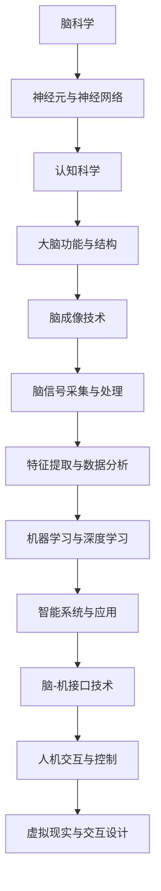
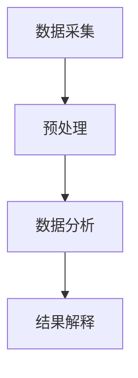
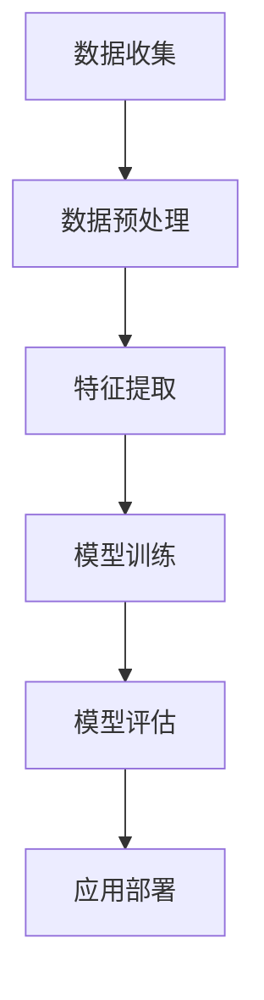

                 

### 文章标题

**脑科学与AI的交叉研究：理解智能的本质**

> **关键词：** 脑科学、AI、交叉研究、智能、神经科学、认知科学、机器学习、深度学习、脑成像技术、脑-机接口、数学模型、实际应用。

> **摘要：** 本文深入探讨了脑科学与人工智能交叉研究的现状和未来方向。通过梳理脑科学与AI的核心概念、理论与方法，以及实际应用案例，本文揭示了智能的本质和人工智能的发展路径。文章从脑成像技术、机器学习与深度学习、脑-机接口等多个维度，阐述了脑科学与AI的深度融合，旨在为读者提供一份全面而深入的交叉研究指南。

---

### 第一部分：脑科学与AI的交叉研究概述

#### 第1章：脑科学与AI交叉研究的背景与意义

**1.1 脑科学与AI交叉研究的背景**

脑科学与AI交叉研究起源于20世纪50年代，当时计算机科学家约翰·冯·诺依曼（John von Neumann）提出了“人工智能”（Artificial Intelligence，简称AI）的概念。随着计算机技术的快速发展，AI逐渐成为一个独立的研究领域。与此同时，神经科学和认知科学也在不断进步，对大脑结构和功能的理解日益深入。

近年来，随着脑成像技术、大数据分析和机器学习算法的突破，脑科学与AI交叉研究迎来了新的发展机遇。这一领域的交叉研究不仅有助于推动人工智能的发展，还能为认知科学和神经科学提供新的研究手段和理论支持。

**1.2 脑科学与AI交叉研究的意义**

脑科学与AI交叉研究具有重要的理论和实践意义：

- **对人工智能发展的推动作用**：脑科学与AI交叉研究有助于揭示智能的本质，从而推动人工智能技术的发展。通过借鉴大脑的运作原理，研究人员可以设计出更加高效、智能的人工系统。

- **对认知科学和神经科学的新认识**：脑科学与AI交叉研究为认知科学和神经科学提供了新的研究工具和方法。通过机器学习和深度学习技术，研究人员可以更好地理解大脑的结构和功能，揭示认知过程和神经活动之间的关系。

- **临床应用的前景**：脑科学与AI交叉研究在临床应用领域具有巨大的潜力。通过脑成像技术和AI算法，研究人员可以更准确地诊断和治疗脑疾病，提高医疗水平。

**1.3 脑科学与AI交叉研究的挑战**

尽管脑科学与AI交叉研究具有巨大的潜力，但仍面临一系列挑战：

- **技术障碍**：脑成像技术和脑信号处理技术尚未完全成熟，需要进一步研发和优化。

- **数据隐私问题**：脑成像数据和脑信号数据涉及个人隐私，如何在保证数据安全的前提下进行研究和应用，是一个亟待解决的问题。

- **伦理和道德考量**：脑科学与AI交叉研究涉及到伦理和道德问题，如脑机接口的应用可能引发隐私和安全方面的担忧。

**1.4 研究方法与技术**

脑科学与AI交叉研究采用多种研究方法和技术：

- **脑成像技术**：包括功能磁共振成像（fMRI）、正电子发射断层扫描（PET）、脑电图（EEG）等。

- **大数据分析和机器学习技术**：用于处理和分析大量的脑成像数据和脑信号数据。

- **神经元活动记录技术**：通过微电极记录神经元的活动，用于研究大脑的功能和结构。

- **脑-机接口技术**：将大脑信号转化为控制信号，实现人机交互。

**1.5 研究领域与应用案例**

脑科学与AI交叉研究涉及多个领域：

- **认知建模**：通过机器学习算法，模拟和预测认知过程。

- **机器学习算法改进**：通过脑成像数据和脑信号数据，优化机器学习算法的性能。

- **临床诊断与治疗**：利用脑成像技术和AI算法，提高脑疾病的诊断和治疗水平。

- **教育**：通过脑成像技术和AI算法，了解学生的学习过程和认知发展，提供个性化教育方案。

- **虚拟现实与交互设计**：利用脑信号控制虚拟现实设备和交互界面，提高用户体验。

---

**总结**：脑科学与AI交叉研究为人工智能的发展提供了新的思路和方法，同时也为认知科学和神经科学带来了新的研究工具和理论支持。面对技术、数据隐私和伦理等方面的挑战，研究人员需要不断探索和创新，推动这一领域的快速发展。接下来，本文将详细探讨脑科学与AI交叉研究的核心概念、理论与方法，以及实际应用案例。

---

### 第一部分：脑科学与AI的交叉研究概述

#### 第1章：脑科学与AI交叉研究的背景与意义

**1.1 脑科学与AI交叉研究的背景**

脑科学与AI交叉研究的起源可以追溯到20世纪50年代，当时计算机科学家约翰·冯·诺依曼提出了“人工智能”的概念，旨在构建能够模拟人类智能的计算机系统。随着计算机技术的不断发展，人工智能逐渐成为一个独立的学科领域。与此同时，神经科学和认知科学也在不断进步，对大脑的结构和功能有了更深入的了解。

脑科学的研究主要集中在理解大脑的神经回路、神经元活动及其调节机制。通过脑成像技术，如功能磁共振成像（fMRI）、正电子发射断层扫描（PET）和脑电图（EEG）等，研究人员可以观察到大脑在执行特定任务时的活动模式，从而揭示认知过程和情绪体验的神经基础。

认知科学则是一门跨学科的研究领域，它结合了心理学、神经科学、计算机科学和哲学等多个学科，旨在理解人类思维和行为的基础原理。认知科学的研究内容包括感知、记忆、注意力、语言、决策等认知过程，以及它们在大脑中的实现机制。

人工智能（AI）是指通过计算机模拟人类智能的技术和系统。AI涵盖了多个子领域，包括机器学习、自然语言处理、计算机视觉、智能机器人等。近年来，随着深度学习算法的突破，AI在图像识别、语音识别、自然语言处理等领域取得了显著的进展。

**1.2 脑科学与AI交叉研究的意义**

脑科学与AI交叉研究具有重要的理论和实践意义：

- **推动人工智能的发展**：脑科学与AI交叉研究有助于揭示智能的本质，从而推动人工智能技术的发展。通过借鉴大脑的运作原理，研究人员可以设计出更加高效、智能的人工系统。

- **深化认知科学的研究**：脑科学与AI交叉研究为认知科学提供了新的研究工具和方法。通过机器学习和深度学习技术，研究人员可以更好地理解大脑的结构和功能，揭示认知过程和神经活动之间的关系。

- **提高医疗水平**：脑科学与AI交叉研究在临床应用领域具有巨大的潜力。通过脑成像技术和AI算法，研究人员可以更准确地诊断和治疗脑疾病，提高医疗水平。

- **促进人机交互**：脑科学与AI交叉研究为人机交互提供了新的途径。通过脑-机接口技术，研究人员可以开发出能够直接读取和解读大脑信号的智能系统，实现更加自然和高效的人机交互。

**1.3 脑科学与AI交叉研究的挑战**

尽管脑科学与AI交叉研究具有巨大的潜力，但同时也面临一系列挑战：

- **技术难题**：脑成像技术和脑信号处理技术尚未完全成熟，需要进一步研发和优化。

- **数据隐私问题**：脑成像数据和脑信号数据涉及个人隐私，如何在保证数据安全的前提下进行研究和应用，是一个亟待解决的问题。

- **伦理和道德考量**：脑科学与AI交叉研究涉及到伦理和道德问题，如脑机接口的应用可能引发隐私和安全方面的担忧。

**1.4 研究方法与技术**

脑科学与AI交叉研究采用多种研究方法和技术：

- **脑成像技术**：包括功能磁共振成像（fMRI）、正电子发射断层扫描（PET）和脑电图（EEG）等。这些技术可以无创地观察到大脑在执行任务时的活动模式。

- **大数据分析和机器学习技术**：用于处理和分析大量的脑成像数据和脑信号数据。通过机器学习算法，研究人员可以从数据中提取有用的信息，构建模型和预测。

- **神经元活动记录技术**：通过微电极记录神经元的活动，用于研究大脑的功能和结构。

- **脑-机接口技术**：将大脑信号转化为控制信号，实现人机交互。脑-机接口技术可以为瘫痪患者提供辅助行动的能力，也可以为健康人提供新的交互方式。

**1.5 研究领域与应用案例**

脑科学与AI交叉研究涉及多个领域：

- **认知建模**：通过机器学习算法，模拟和预测认知过程。

- **机器学习算法改进**：通过脑成像数据和脑信号数据，优化机器学习算法的性能。

- **临床诊断与治疗**：利用脑成像技术和AI算法，提高脑疾病的诊断和治疗水平。

- **教育**：通过脑成像技术和AI算法，了解学生的学习过程和认知发展，提供个性化教育方案。

- **虚拟现实与交互设计**：利用脑信号控制虚拟现实设备和交互界面，提高用户体验。

---

**总结**：脑科学与AI交叉研究为人工智能的发展提供了新的思路和方法，同时也为认知科学和神经科学带来了新的研究工具和理论支持。面对技术、数据隐私和伦理等方面的挑战，研究人员需要不断探索和创新，推动这一领域的快速发展。接下来，本文将详细探讨脑科学与AI交叉研究的核心概念、理论与方法，以及实际应用案例。

---

### 第一部分：脑科学与AI的交叉研究概述

#### 第2章：脑科学与AI交叉研究的核心概念

脑科学与AI交叉研究的核心概念包括神经科学与认知科学基础、AI基础、脑-机接口（BMI）技术以及脑信号处理与分析。

**2.1 神经科学与认知科学基础**

神经科学是研究神经系统的科学，包括神经元的结构、功能、发育和疾病等方面。神经元是神经系统的基本单元，负责传递和处理信息。认知科学是研究人类思维和认知过程的科学，包括感知、记忆、注意力、语言、决策等认知过程。

**2.2 AI基础**

人工智能（AI）是指通过计算机模拟人类智能的技术和系统。AI的核心技术包括机器学习、深度学习和强化学习等。机器学习是一种使计算机能够从数据中学习的方法，深度学习是机器学习的一个子领域，它通过构建多层神经网络来模拟人类大脑的学习过程。强化学习是一种通过奖励和惩罚来训练智能体的方法。

**2.3 脑-机接口（BMI）技术**

脑-机接口（BMI）是一种直接将大脑信号转换为计算机控制信号的技术。BMI技术可以分为侵入性和非侵入性两种。侵入性BMI通常通过在脑部植入电极来记录神经元的活动，而非侵入性BMI则通过脑电图（EEG）等无创方法来记录大脑信号。

**2.4 脑信号处理与分析**

脑信号处理与分析是脑科学与AI交叉研究的重要环节。脑信号处理包括信号采集、预处理、特征提取和数据分析等步骤。信号采集通常使用脑电图（EEG）、功能磁共振成像（fMRI）等技术。预处理包括去除噪声、滤波和分段等步骤。特征提取是提取与特定认知任务相关的信号特征，如频域特征、时间序列特征等。数据分析则通过机器学习算法来分析脑信号，提取有用信息。

**2.5 脑科学与AI交叉研究的关键概念联系**

脑科学与AI交叉研究中的关键概念之间存在紧密的联系。例如，神经科学为AI提供了关于大脑运作的基本原理，认知科学为AI提供了关于人类思维过程的理解。脑-机接口技术则将大脑信号转化为计算机控制信号，为AI的应用提供了新的交互方式。脑信号处理与分析技术则通过机器学习算法，从脑信号中提取有用的信息，为AI的应用提供了数据支持。

**2.6 Mermaid流程图**

下面是一个关于脑科学与AI交叉研究核心概念联系的Mermaid流程图：



**2.7 伪代码示例**

```python
# 脑信号处理与分析伪代码示例
def preprocess_signal(signal):
    # 去除噪声与滤波
    filtered_signal = filter_signal(signal)
    # 分段与特征提取
    segments = segment_signal(filtered_signal)
    features = extract_features(segments)
    return features

def train_model(features, labels):
    # 构建模型
    model = build_model()
    # 编译模型
    model.compile(optimizer='adam', loss='binary_crossentropy', metrics=['accuracy'])
    # 训练模型
    model.fit(features, labels, epochs=10, batch_size=32)
    return model

# 主程序
if __name__ == '__main__':
    # 读取脑信号数据
    signal = read_signal('brain_signal_data.txt')
    # 预处理脑信号
    preprocessed_signal = preprocess_signal(signal)
    # 切分数据集
    features, labels = split_data(preprocessed_signal)
    # 训练模型
    model = train_model(features, labels)
    # 模型评估
    evaluate_model(model, test_features, test_labels)
```

**2.8 数学模型与公式**

在脑科学与AI交叉研究中，常用的数学模型和公式包括：

- **神经网络激活函数**：

  $$ f(x) = \frac{1}{1 + e^{-x}} $$

- **反向传播算法计算梯度**：

  $$ \frac{\partial L}{\partial w} = \delta \odot \frac{\partial a}{\partial z} $$

  其中，$L$ 是损失函数，$w$ 是权重，$\delta$ 是误差项，$a$ 是激活函数输出，$z$ 是输入。

---

**总结**：本章介绍了脑科学与AI交叉研究的核心概念，包括神经科学与认知科学基础、AI基础、脑-机接口技术以及脑信号处理与分析。通过这些概念，我们可以更好地理解脑科学与AI交叉研究的本质和关键环节。接下来，本文将深入探讨脑科学与AI交叉研究的理论与方法，以及实际应用案例。

---

### 第一部分：脑科学与AI的交叉研究概述

#### 第3章：脑成像技术及其应用

脑成像技术是脑科学与AI交叉研究的重要组成部分，它为理解和解析大脑功能提供了重要的工具。本章将详细介绍几种常用的脑成像技术，包括功能磁共振成像（fMRI）、经颅磁刺激（TMS）和脑电图（EEG）。

**3.1 功能磁共振成像（fMRI）**

功能磁共振成像（fMRI）是一种非侵入性的脑成像技术，通过测量血液中的氧合血红蛋白（oxyhemoglobin）和脱氧血红蛋白（deoxyhemoglobin）的相对浓度变化来反映大脑的活动。当大脑活动增加时，局部血液流量也会增加，导致氧合血红蛋白的比例上升，从而产生可检测的信号变化。

**3.1.1 fMRI原理与操作**

fMRI的工作原理基于磁共振信号的产生和解码。在fMRI扫描过程中，患者躺在磁场中，通过射频脉冲激发体内的氢原子核。当射频脉冲停止后，氢原子核会重新释放能量，产生磁共振信号。这些信号被接收器捕捉到，并通过计算机处理，转换为大脑活动的图像。

fMRI扫描通常包括以下几个步骤：

1. **准备阶段**：患者躺在磁共振扫描室内，确保身体固定，以减少运动伪迹。
2. **基线扫描**：在开始任务前，进行一段时间的基线扫描，以收集大脑的静息状态数据。
3. **任务执行**：在执行特定认知任务或刺激过程中，进行连续的扫描，以捕捉大脑活动的动态变化。
4. **数据处理**：通过计算机软件对扫描数据进行分析，提取大脑活动的信号。

**3.1.2 fMRI数据解析**

fMRI数据解析通常涉及以下步骤：

1. **运动校正**：由于患者在扫描过程中可能会有轻微的头部运动，需要使用运动校正技术来校正这些运动产生的伪迹。
2. **时间序列校正**：通过调整时间序列，使得不同扫描切片的时间点对齐，以便进行更准确的信号分析。
3. **空间标准化**：将原始数据映射到标准的脑空间，以便在不同个体之间进行比较。
4. **信号提取**：通过统计参数图（statistical parametric mapping, SPM）等技术，从数据中提取大脑活动的信号。

**3.1.3 fMRI在认知研究中的应用**

fMRI在认知研究领域有广泛的应用，以下是一些典型的应用案例：

1. **认知功能定位**：通过fMRI，研究人员可以定位大脑中与特定认知功能相关的区域，例如视觉处理、听觉处理、记忆、语言等。
2. **认知障碍诊断**：fMRI可以帮助诊断认知障碍，如阿尔茨海默病、精神分裂症等，通过观察大脑活动异常来识别患者。
3. **认知康复**：fMRI可以用于监测认知康复过程，评估康复治疗的成效。

**3.2 经颅磁刺激（TMS）**

经颅磁刺激（Transcranial Magnetic Stimulation, TMS）是一种非侵入性的神经调节技术，通过在颅骨上施加强脉冲磁场来刺激大脑神经活动。TMS可以引起局部脑电活动的变化，从而影响认知和行为。

**3.2.1 TMS原理与操作**

TMS的工作原理基于电磁感应原理。在TMS操作过程中，一个强脉冲电流通过线圈产生磁场，这个磁场穿透颅骨，刺激大脑表面的神经组织。TMS刺激可以通过改变电流的强度、频率和脉冲模式来调节。

TMS操作通常包括以下几个步骤：

1. **定位刺激点**：通过头皮电极或磁共振成像（MRI）定位需要刺激的脑区。
2. **设置参数**：根据研究目的和预定的刺激参数（如强度、频率、脉冲模式等）进行设置。
3. **刺激执行**：在患者头部放置线圈，通过TMS设备施加脉冲磁场。

**3.2.2 TMS在不同脑功能研究中的应用**

TMS在多个脑功能研究领域有广泛应用，以下是一些应用案例：

1. **认知功能调控**：TMS可以用于调控大脑的认知功能，如注意力、记忆、决策等。例如，通过刺激前额叶皮层，可以提高个体的注意力和执行功能。
2. **神经康复**：TMS可以用于治疗脑损伤后引起的认知障碍，如中风后的注意力减退和记忆障碍。
3. **精神疾病治疗**：TMS可以用于治疗抑郁症、精神分裂症等精神疾病，通过调节大脑的神经活动来改善症状。

**3.3 脑电图（EEG）**

脑电图（Electroencephalography, EEG）是一种常用的脑成像技术，通过在头皮上放置电极记录大脑的电活动。EEG可以提供实时的大脑信号，反映大脑的功能状态。

**3.3.1 EEG原理与操作**

EEG的工作原理基于脑电活动的电信号。在EEG操作过程中，电极放置在头皮上，通过这些电极捕捉到的大脑电信号被放大并记录下来。EEG信号可以是局部的，也可以是全局的，这取决于电极的数量和位置。

EEG操作通常包括以下几个步骤：

1. **电极放置**：将电极粘贴或缝合在头皮上，确保电极与头皮接触良好。
2. **信号记录**：通过放大器和记录设备捕捉大脑的电活动，并将其转换为可视化的波形。
3. **信号分析**：通过计算机软件对EEG信号进行预处理、特征提取和模式识别。

**3.3.2 EEG在认知与行为研究中的应用**

EEG在认知与行为研究领域有广泛的应用，以下是一些应用案例：

1. **认知状态评估**：EEG可以用于评估个体的认知状态，如意识水平、注意力集中度、疲劳程度等。
2. **情绪识别**：EEG可以用于识别情绪状态，通过分析EEG信号中的特定频率和振幅变化来识别个体的情绪。
3. **睡眠研究**：EEG可以用于监测睡眠质量和睡眠周期，帮助诊断睡眠障碍。

**3.4 光遗传学**

光遗传学（Optogenetics）是一种新兴的脑成像技术，它利用光控离子通道（光感受器）来控制神经元的活动。通过光遗传学技术，研究人员可以在活体动物模型中精确地激活或抑制特定神经元。

**3.4.1 光遗传学原理**

光遗传学的基本原理是利用光感受器基因来驱动神经元中的离子通道，使其对光敏感。这些光感受器可以在紫外光或蓝光的照射下打开或关闭，从而控制神经元的活动。

光遗传学操作通常包括以下几个步骤：

1. **基因工程**：通过基因编辑技术（如CRISPR-Cas9）将光感受器基因插入到目标神经元中。
2. **光刺激**：使用特定的光源（如紫外光或蓝光灯）照射大脑区域，激活或抑制神经元。
3. **信号记录**：通过电极或光学传感器记录神经元的活动变化。

**3.4.2 光遗传学在脑科学研究的潜力**

光遗传学在脑科学研究中有很大的潜力，以下是一些应用前景：

1. **神经环路研究**：光遗传学可以用于研究神经环路的功能和连接，揭示神经元之间的交互作用。
2. **行为调控**：光遗传学可以用于调控动物的行为，如运动控制、学习记忆等。
3. **脑疾病模型**：光遗传学可以用于建立脑疾病模型，研究疾病的病理机制和治疗方法。

---

**总结**：本章介绍了脑成像技术及其应用，包括功能磁共振成像（fMRI）、经颅磁刺激（TMS）和脑电图（EEG）。这些技术为脑科学与AI交叉研究提供了重要的工具，通过它们，研究人员可以深入理解大脑的功能和行为。接下来，本文将探讨机器学习与深度学习在脑科学与AI中的应用，以及脑信号处理与分析的方法。

---

### 第一部分：脑科学与AI的交叉研究概述

#### 第4章：机器学习与深度学习在脑科学与AI中的应用

机器学习（Machine Learning, ML）和深度学习（Deep Learning, DL）是人工智能（AI）的核心技术，它们在脑科学与AI交叉研究中扮演着重要角色。本章将探讨机器学习与深度学习的基本原理，以及在脑信号处理、认知建模、脑-机接口（BMI）控制算法和强化学习在脑科学中的应用。

**4.1 机器学习与深度学习基础**

**4.1.1 机器学习原理**

机器学习是一种使计算机系统能够从数据中学习和改进自身性能的技术。机器学习主要包括监督学习（Supervised Learning）、无监督学习（Unsupervised Learning）和强化学习（Reinforcement Learning）。

- **监督学习**：监督学习是一种从标记数据中学习的方法，它通过训练数据集来训练模型，并使用这些模型对新数据进行预测。常见的监督学习算法包括线性回归、决策树、支持向量机（SVM）和神经网络等。

- **无监督学习**：无监督学习是一种从未标记数据中学习的方法，它主要用于发现数据中的结构和模式。常见的无监督学习算法包括聚类、降维（如主成分分析PCA）和关联规则挖掘等。

- **强化学习**：强化学习是一种通过奖励和惩罚来训练智能体的方法，它通常用于解决决策问题。智能体通过与环境交互，不断调整策略以最大化累积奖励。常见的强化学习算法包括Q学习、深度Q网络（DQN）和策略梯度方法等。

**4.1.2 深度学习模型架构**

深度学习是机器学习的一个子领域，它通过构建多层的神经网络（Neural Networks）来模拟人类大脑的学习过程。深度学习模型通常包含以下层次：

- **输入层**：接收输入数据，并将其传递给下一层。
- **隐藏层**：多层隐藏层可以提取和转换输入数据，每一层都包含多个神经元。
- **输出层**：生成预测或分类结果。

常见的深度学习模型包括：

- **卷积神经网络（CNN）**：主要用于处理图像和视频数据，通过卷积操作提取空间特征。
- **循环神经网络（RNN）**：主要用于处理序列数据，如文本和语音，通过循环结构保留历史信息。
- **生成对抗网络（GAN）**：通过对抗性训练生成高质量的数据。

**4.1.3 深度学习优化技术**

深度学习模型的性能优化是机器学习研究中的一个重要课题。以下是一些常用的优化技术：

- **激活函数**：激活函数是神经网络中用于引入非线性特性的函数，如Sigmoid、ReLU和Tanh等。
- **损失函数**：损失函数用于衡量模型预测结果与实际结果之间的差距，如均方误差（MSE）和交叉熵（Cross-Entropy）等。
- **优化算法**：优化算法用于调整模型参数以最小化损失函数，如梯度下降（Gradient Descent）、Adam优化器等。

**4.2 认知建模与脑信号分析**

认知建模是脑科学与AI交叉研究中的一个重要领域，它旨在建立模型来模拟和理解人类的认知过程。通过机器学习和深度学习技术，研究人员可以从脑信号数据中提取特征，建立认知模型，并用于预测和解释认知行为。

**4.2.1 认知建模方法**

认知建模方法主要包括以下几种：

- **基于模型的建模**：这种方法使用数学模型来描述认知过程，如计算认知心理学模型（如框架理论、决策模型等）。
- **数据驱动的建模**：这种方法使用机器学习和深度学习技术从数据中学习认知过程的特征，如基于神经网络和统计学习的方法。

**4.2.2 脑信号数据驱动建模**

脑信号数据驱动建模是通过机器学习和深度学习技术从脑信号数据中提取特征，建立认知模型。以下是一些常见的方法：

- **特征提取**：从脑信号数据中提取与特定认知任务相关的特征，如时域特征、频域特征和时频特征。
- **分类与回归**：使用分类算法（如支持向量机、决策树）和回归算法（如线性回归、神经网络）来预测认知行为。
- **模型解释**：通过可视化技术和模型解释方法（如SHAP值、LIME）来解释模型的预测结果。

**4.3 脑-机接口控制算法**

脑-机接口（Brain-Computer Interface, BCI）是一种将大脑信号转换为控制信号的技术，它为人们提供了与计算机和其他设备进行交互的新途径。机器学习和深度学习技术在BCI控制算法中发挥着重要作用。

**4.3.1 BMI控制算法设计**

BMI控制算法设计主要包括以下几个步骤：

- **信号采集与预处理**：从脑电图（EEG）、功能性磁共振成像（fMRI）等设备采集脑信号，并进行预处理，如滤波、去噪和特征提取。
- **特征选择与分类**：从预处理后的脑信号中提取特征，并使用分类算法（如支持向量机、深度神经网络）进行分类。
- **控制策略设计**：根据分类结果设计控制策略，如使用决策树、线性回归等算法来生成控制信号。

**4.3.2 BMI控制算法优化**

BMI控制算法的优化是提高系统性能和用户体验的关键。以下是一些常见的优化方法：

- **算法参数调优**：通过调整分类器和优化算法的参数（如学习率、正则化参数）来优化系统性能。
- **模型融合**：使用多种分类器（如支持向量机、神经网络）的融合方法来提高分类准确率和系统稳定性。
- **在线学习与自适应**：通过在线学习和自适应算法来适应用户的行为变化，提高系统的鲁棒性和适应性。

**4.4 强化学习在脑科学中的应用**

强化学习（Reinforcement Learning, RL）是一种通过奖励和惩罚来训练智能体的方法，它在脑科学中的应用包括神经调节、神经疾病治疗和认知行为分析。

**4.4.1 强化学习基本原理**

强化学习的基本原理是通过智能体与环境的交互来学习最优策略。智能体通过执行动作，从环境中获得奖励或惩罚，并不断调整策略以最大化累积奖励。

**4.4.2 强化学习在神经调节中的应用**

强化学习可以用于神经调节，例如：

- **神经可塑性训练**：通过奖励机制激励神经元之间的连接，促进神经可塑性。
- **脑功能恢复**：通过强化学习算法，帮助患者恢复受损的脑功能。

**4.4.3 强化学习在神经疾病治疗中的应用**

强化学习在神经疾病治疗中的应用包括：

- **精神疾病治疗**：通过奖励机制调节大脑活动，改善精神疾病症状。
- **神经退行性疾病治疗**：通过强化学习算法，帮助患者恢复认知功能。

---

**总结**：本章介绍了机器学习与深度学习的基本原理及其在脑科学与AI交叉研究中的应用。从认知建模到脑-机接口控制算法，再到强化学习在脑科学中的应用，这些技术为理解和解析大脑功能提供了新的途径。接下来，本文将探讨脑科学与AI交叉研究的数学模型与公式，以及实际应用案例。

---

### 第一部分：脑科学与AI的交叉研究概述

#### 第5章：脑科学与AI交叉研究的数学模型与公式

脑科学与AI交叉研究中的数学模型和公式是理解和分析大脑活动及其与人工智能系统交互的重要工具。本章将介绍一些常用的数学模型和公式，包括神经网络激活函数、反向传播算法计算梯度、深度学习模型的数学原理、以及脑信号处理与特征提取的数学方法。

**5.1 神经网络激活函数**

在神经网络中，激活函数是用于引入非线性特性的函数，它可以将线性输入映射到非线性输出。常见的激活函数包括：

- **Sigmoid函数**：

  $$ f(x) = \frac{1}{1 + e^{-x}} $$

  Sigmoid函数在神经网络的输出层中广泛应用，用于分类任务。

- **ReLU函数**：

  $$ f(x) = \max(0, x) $$

 ReLU函数在隐藏层中广泛应用，它通过非线性激活函数提高了神经网络的训练效率。

- **Tanh函数**：

  $$ f(x) = \frac{e^x - e^{-x}}{e^x + e^{-x}} $$

  Tanh函数与ReLU函数类似，但它具有中心对称性，常用于处理数值范围。

**5.2 反向传播算法计算梯度**

反向传播（Backpropagation）算法是神经网络训练的核心算法，它用于计算损失函数关于模型参数的梯度。反向传播算法的核心步骤包括：

- **前向传播**：将输入数据通过神经网络，计算输出结果和误差。
- **计算误差**：通过比较实际输出和预期输出，计算损失函数。
- **反向传播**：从输出层开始，逐层计算误差关于输入的梯度。

反向传播算法的计算公式如下：

$$ \frac{\partial L}{\partial w} = \delta \odot \frac{\partial a}{\partial z} $$

其中：

- $L$ 是损失函数；
- $w$ 是权重；
- $\delta$ 是误差项（通常为损失函数关于输出的梯度）；
- $a$ 是激活函数输出；
- $z$ 是输入。

**5.3 深度学习模型的数学原理**

深度学习模型是多层神经网络的扩展，它通过多层次的非线性变换来提取特征。深度学习模型的数学原理主要包括：

- **前向传播**：将输入数据通过多层神经网络，逐层计算激活值和输出。
- **反向传播**：从输出层开始，逐层计算误差关于输入的梯度，并更新模型参数。

深度学习模型的训练过程涉及以下步骤：

1. **初始化参数**：随机初始化神经网络中的权重和偏置。
2. **前向传播**：计算输入数据通过神经网络的输出。
3. **计算损失**：通过损失函数计算输出和实际结果之间的误差。
4. **反向传播**：计算误差关于输入的梯度，并更新模型参数。
5. **优化参数**：使用优化算法（如梯度下降、Adam优化器）更新模型参数。

**5.4 脑信号处理与特征提取的数学方法**

脑信号处理与特征提取是脑科学与AI交叉研究的重要环节，它涉及到以下数学方法：

- **滤波**：通过滤波器去除噪声和干扰信号，如带通滤波、低通滤波等。
- **时域特征提取**：从时域信号中提取特征，如波形幅度、波形周期等。
- **频域特征提取**：从频域信号中提取特征，如功率谱、频谱峰等。
- **时频特征提取**：结合时域和频域特征，如短时傅里叶变换（STFT）和小波变换等。

**5.5 举例说明**

以下是一个简单的神经网络的训练过程，包括前向传播、反向传播和参数更新：

```python
# 前向传播
z1 = W1 * x + b1
a1 = sigmoid(z1)

z2 = W2 * a1 + b2
a2 = sigmoid(z2)

z3 = W3 * a2 + b3
y_pred = sigmoid(z3)

# 计算损失
L = -1/m * (y * log(y_pred) + (1 - y) * log(1 - y_pred))

# 反向传播
delta_3 = (y_pred - y) * sigmoid_derivative(z3)
delta_2 = W3 * delta_3 * sigmoid_derivative(z2)
delta_1 = W2 * delta_2 * sigmoid_derivative(z1)

# 更新参数
W3 -= learning_rate * (delta_3 * a2.T)
b3 -= learning_rate * delta_3
W2 -= learning_rate * (delta_2 * a1.T)
b2 -= learning_rate * delta_2
W1 -= learning_rate * (delta_1 * x.T)
b1 -= learning_rate * delta_1
```

在这个例子中，`sigmoid`函数是Sigmoid激活函数，`sigmoid_derivative`函数是Sigmoid函数的导数，用于计算误差项。

---

**总结**：本章介绍了脑科学与AI交叉研究中的数学模型和公式，包括神经网络激活函数、反向传播算法计算梯度、深度学习模型的数学原理以及脑信号处理与特征提取的数学方法。通过这些数学模型和公式，研究人员可以更好地理解和分析大脑活动，并开发出更智能的人工系统。接下来，本文将探讨脑科学与AI交叉研究的实际应用案例。

---

### 第一部分：脑科学与AI的交叉研究概述

#### 第6章：脑科学与AI在医疗领域的应用

脑科学与AI在医疗领域的应用正日益扩大，通过先进的成像技术、数据分析和机器学习算法，AI正在为脑疾病的诊断、治疗和康复提供强有力的支持。本章将深入探讨脑科学与AI在医疗领域的应用，包括脑疾病诊断与治疗、精神疾病研究以及神经退行性疾病的研究。

**6.1 脑疾病诊断与治疗**

脑疾病诊断与治疗是脑科学与AI交叉研究中的一个重要应用领域。通过AI算法和脑成像技术，可以实现对脑疾病的高精度诊断和治疗规划。

**6.1.1 脑疾病诊断的AI方法**

AI在脑疾病诊断中的应用主要体现在以下几个方面：

- **图像分析**：使用深度学习模型对MRI、CT和PET等影像进行自动分析，检测病变区域，如脑肿瘤、脑梗死等。

- **特征提取**：从影像中提取关键特征，如形态学特征、信号强度等，用于训练分类模型，提高诊断准确率。

- **多模态融合**：结合多种成像技术，如MRI、PET和功能性MRI（fMRI），实现更加全面和准确的诊断。

**6.1.2 脑疾病治疗的AI方案**

AI在脑疾病治疗中的应用主要包括以下几个方面：

- **个性化治疗方案**：通过分析患者的影像数据、基因数据和临床信息，AI可以生成个性化的治疗计划，优化治疗效果。

- **智能监控与反馈**：利用AI算法对患者的症状和治疗效果进行实时监控和反馈，及时调整治疗方案。

- **神经调控技术**：通过AI控制的神经调控技术，如脑电刺激（EEG）和经颅磁刺激（TMS），实现对脑疾病的有效治疗。

**6.1.3 AI辅助神经调控技术**

AI辅助神经调控技术在脑疾病治疗中具有巨大的潜力，例如：

- **脑电刺激**：AI算法可以根据患者的脑电图信号，自动调整电极位置和刺激强度，提高刺激效果。

- **经颅磁刺激**：AI算法可以根据患者的反应，实时调整刺激参数，优化治疗过程。

**6.2 精神疾病研究**

精神疾病是临床医学中的一个复杂问题，脑科学与AI交叉研究为精神疾病的诊断、治疗和预后评估提供了新的工具和方法。

**6.2.1 精神疾病诊断与预测**

AI在精神疾病诊断与预测中的应用主要包括：

- **脑成像分析**：通过分析fMRI和PET等脑成像数据，识别精神疾病患者与正常人群之间的差异。

- **临床数据挖掘**：通过分析患者的临床数据，如病史、家族史和药物反应等，预测精神疾病的风险和进展。

**6.2.2 精神疾病治疗新策略**

AI在精神疾病治疗中的应用包括：

- **个性化治疗**：基于患者的特征和临床数据，AI可以制定个性化的治疗方案，提高治疗效果。

- **多模态干预**：结合脑成像、基因和临床数据，AI可以帮助设计多模态的治疗策略，优化治疗效果。

**6.2.3 精神疾病AI诊断系统**

AI诊断系统在精神疾病中的应用主要包括：

- **自动诊断**：AI算法可以自动分析脑成像数据和临床数据，快速、准确地诊断精神疾病。

- **辅助决策**：AI诊断系统可以为临床医生提供诊断建议和治疗方案，提高诊断和治疗的效率。

**6.3 神经退行性疾病研究**

神经退行性疾病，如阿尔茨海默病（Alzheimer's disease）和帕金森病（Parkinson's disease），是严重影响患者生活质量的社会问题。脑科学与AI交叉研究为这些疾病的诊断、治疗和预后评估提供了新的希望。

**6.3.1 脑影像分析**

AI在神经退行性疾病诊断中的应用主要体现在脑影像分析方面：

- **早期诊断**：通过分析MRI和PET等影像数据，AI可以检测出神经退行性疾病的早期征兆，实现早期诊断。

- **疾病进展评估**：通过长期监测影像数据，AI可以评估疾病的进展情况，为临床医生提供治疗决策支持。

**6.3.2 神经元活动监测**

AI在神经元活动监测中的应用包括：

- **实时监测**：通过脑电图（EEG）等无创技术，AI可以实时监测神经元活动，为临床医生提供动态的病情信息。

- **异常检测**：AI算法可以识别神经元活动的异常模式，预警疾病进展。

**6.3.3 AI辅助疾病进展评估**

AI在疾病进展评估中的应用包括：

- **纵向数据分析**：通过长期跟踪患者的神经影像和临床数据，AI可以评估疾病的进展速度和治疗效果。

- **预测疾病预后**：基于患者的特征和疾病数据，AI可以预测疾病的预后，为临床医生提供治疗策略。

---

**总结**：脑科学与AI在医疗领域的应用正日益扩大，通过AI技术的支持，脑疾病的诊断、治疗和康复水平得到了显著提升。未来，随着AI技术的进一步发展，脑科学与AI交叉研究将为医学领域带来更多的创新和突破。

---

### 第一部分：脑科学与AI的交叉研究概述

#### 第7章：脑科学与AI在教育领域的应用

脑科学与AI在教育领域的应用正逐渐成为研究的热点，通过结合脑成像技术、机器学习和人工智能算法，教育领域正在迎来一场深刻的变革。本章将探讨脑科学与AI在教育领域的应用，包括智能教育评估、脑功能训练以及创新与认知发展的相关内容。

**7.1 智能教育评估**

智能教育评估是脑科学与AI在教育领域的重要应用之一。通过AI技术，可以实现对学生学习过程和认知状态的实时监测和评估。

**7.1.1 学生的智能评测系统**

- **基于脑成像的数据分析**：利用fMRI、EEG等脑成像技术，可以实时监测学生的脑活动，分析其注意力、专注度等认知状态。

- **学习习惯与策略分析**：通过分析学生的行为数据和脑成像数据，AI算法可以识别学生的学习习惯和策略，为个性化教育提供支持。

- **学习效果预测**：基于学生的学习过程和认知状态数据，AI算法可以预测学生的学习效果，帮助教师和学生制定更有效的学习计划。

**7.1.2 AI辅助个性化学习方案**

- **个性化学习路径**：根据学生的学习习惯、认知状态和学科知识水平，AI算法可以生成个性化的学习路径，提高学习效率。

- **智能推荐系统**：通过分析学生的学习行为和知识需求，AI算法可以推荐适合的学习资源和练习题，帮助学生巩固知识和提高技能。

**7.2 脑功能训练**

脑功能训练是一种通过特定的训练方法来增强大脑功能的方法，AI技术在这一过程中发挥着重要作用。

**7.2.1 脑功能训练方法与原理**

- **认知训练**：通过特定的认知任务，如记忆训练、注意力训练和执行功能训练，来提高大脑的认知能力。

- **脑电刺激**：利用TMS、EEG等脑电刺激技术，通过调节大脑神经活动的频率和强度，来增强大脑功能。

- **虚拟现实训练**：通过虚拟现实技术，创造逼真的训练环境，让学生在沉浸式的体验中提高大脑功能。

**7.2.2 脑功能训练软件与应用**

- **认知训练软件**：如Lumosity、Peak等，通过提供各种认知训练任务，帮助学生提高注意力、记忆力和执行功能。

- **脑电刺激软件**：如NeuroFeedback，通过实时监测脑电图，提供个性化的脑电刺激训练方案。

- **虚拟现实训练系统**：如MindMaze、MindPort等，通过虚拟现实技术，提供沉浸式的认知训练体验。

**7.2.3 脑功能训练对学习效果的提升**

- **提高学习效率**：通过脑功能训练，学生可以提高注意力和专注力，从而在较短的时间内完成更多的学习任务。

- **增强记忆能力**：脑功能训练可以增强大脑的记忆功能，帮助学生更好地记住和理解学习内容。

- **促进认知发展**：脑功能训练可以促进大脑的认知发展，提高学生的思维能力、创造力和问题解决能力。

**7.3 创新与认知发展**

脑科学与AI在教育领域的应用不仅关注学生的学习效果，还关注学生的创新能力和认知发展。

**7.3.1 创新思维的认知基础**

- **认知模型构建**：通过AI技术，可以构建学生创新思维的认知模型，分析创新思维的形成过程和影响因素。

- **思维训练方法**：基于认知模型，可以设计出针对创新思维训练的方法和工具，帮助学生培养创新思维。

**7.3.2 认知干预对创新能力的提升**

- **情境模拟**：通过虚拟现实技术，模拟真实的创新情境，让学生在模拟环境中进行创新实践。

- **反馈与指导**：通过AI技术，对学生的创新思维进行实时反馈和指导，帮助学生不断优化和创新。

**7.3.3 AI在教育创新中的应用**

- **智能课程设计**：基于AI算法，可以设计出符合学生认知水平和兴趣的课程，提高教育的个性化程度。

- **教育资源共享**：通过AI技术，可以实现教育资源的智能分配和共享，提高教育资源的利用效率。

---

**总结**：脑科学与AI在教育领域的应用为教育创新提供了新的思路和方法。通过智能教育评估、脑功能训练和创新与认知发展的支持，AI正在推动教育领域的变革，为学生提供更加个性化、有效和有深度学习体验。

---

### 第一部分：脑科学与AI的交叉研究概述

#### 第8章：脑科学与AI在虚拟现实与交互设计中的应用

脑科学与AI在虚拟现实（VR）和交互设计中的应用正日益成为研究的热点，通过将脑成像技术、脑信号处理和人工智能算法相结合，可以创造更加真实、交互性和沉浸式的虚拟体验。本章将探讨脑科学与AI在虚拟现实与交互设计中的应用，包括脑信号驱动的交互、虚拟现实与脑功能训练以及交互设计中的认知考量。

**8.1 脑信号驱动的交互**

脑信号驱动的交互是一种利用脑信号（如EEG、fMRI等）来控制虚拟现实设备和交互界面的技术。这种技术使得用户可以通过大脑活动来操作虚拟环境，提供了一种全新的交互方式。

**8.1.1 脑信号控制虚拟现实设备**

- **EEG控制**：通过EEG信号，用户可以控制虚拟现实中的移动、旋转和缩放等动作。例如，通过特定的脑电波模式，用户可以向前或向后移动，或者旋转视角。

- **fMRI控制**：虽然fMRI主要用于成像，但也可以用于控制虚拟现实设备。通过分析fMRI信号，可以识别特定的脑活动模式，从而控制虚拟现实中的操作。

**8.1.2 脑信号控制人机交互界面**

- **脑波输入设备**：例如，EEG脑波输入设备可以用于创建手势识别系统，通过脑电波来模拟手势，从而在虚拟现实中实现手势交互。

- **脑机接口（BMI）技术**：脑机接口技术可以将脑信号直接转换为计算机指令，实现高度复杂的交互。例如，通过BMI技术，用户可以控制虚拟现实中的机器人或无人机。

**8.1.3 脑信号交互的挑战与机遇**

脑信号交互面临一些挑战，如信号噪声、准确性和实时性等。然而，随着脑成像技术和机器学习算法的进步，这些挑战正在逐步被克服。

- **信号噪声问题**：脑电信号通常受到噪声的干扰，这影响了信号的准确性和可靠性。通过先进的信号处理技术和机器学习算法，可以有效减少噪声，提高信号质量。

- **实时性挑战**：脑信号处理需要快速计算和响应，以满足虚拟现实交互的实时性要求。优化算法和硬件加速技术可以解决这一问题。

**8.2 虚拟现实与脑功能训练**

虚拟现实技术在脑功能训练中具有巨大的潜力，可以通过模拟复杂的认知任务和交互环境，提高大脑的认知功能和执行功能。

**8.2.1 VR在教育训练中的应用**

- **认知训练**：虚拟现实可以创建逼真的认知训练场景，如记忆游戏、注意力训练和空间导航训练，帮助学生在沉浸式环境中提高认知能力。

- **模拟实践**：虚拟现实可以模拟实际工作环境，提供实践经验和技能训练，如医学手术模拟、工程设计和军事训练。

**8.2.2 VR在康复治疗中的应用**

- **物理康复**：虚拟现实可以用于物理康复训练，通过提供互动式的运动任务，帮助患者恢复运动能力。

- **心理康复**：虚拟现实可以模拟放松的环境，帮助患者缓解压力和焦虑，如治疗创伤后应激障碍（PTSD）和恐惧症。

**8.2.3 VR与脑科学研究的结合**

- **认知神经科学**：通过虚拟现实技术，可以研究认知过程的神经基础，如注意力、记忆和决策。

- **脑-机接口研究**：虚拟现实可以用于开发新的脑-机接口技术，通过实时监测大脑信号，实现更加精确和高效的人机交互。

**8.3 交互设计中的认知考量**

在虚拟现实和交互设计中，认知考量为用户提供了更好的用户体验和更高的交互效率。

**8.3.1 用户体验与认知负荷**

- **认知负荷**：认知负荷是指用户在完成任务时所需的心理资源和努力。高认知负荷可能导致用户疲劳和错误率增加。通过优化交互设计，可以降低用户的认知负荷。

- **用户体验**：用户体验是用户在使用产品或系统时的整体感受。良好的用户体验可以通过简化任务流程、提供清晰的反馈和指导来提升。

**8.3.2 交互设计的认知原则**

- **明确性**：交互设计应该清晰明确，确保用户能够轻松理解系统的功能和操作。

- **一致性**：交互设计应该保持一致性，用户在不同的情境下能够预期相同的操作结果。

- **灵活性**：交互设计应该允许用户根据自己的需求和偏好进行调整，提供灵活的操作选项。

**8.3.3 认知负荷分析工具与应用**

- **认知负荷分析工具**：例如，认知负荷评估量表（CLAS）和认知负荷分析工具（CAT），可以帮助设计者评估和优化交互设计。

- **应用**：在虚拟现实和交互设计中，认知负荷分析工具可以用于评估用户在使用过程中的认知负荷，从而优化设计，提高用户体验。

---

**总结**：脑科学与AI在虚拟现实与交互设计中的应用为创造更加真实、沉浸和高效的交互体验提供了新的途径。通过脑信号驱动的交互、虚拟现实与脑功能训练以及交互设计中的认知考量，AI和脑科学正在共同推动虚拟现实和交互设计领域的创新和发展。

---

### 附录A：脑科学与AI交叉研究资源与工具

#### 附录A.1 脑成像技术资源

脑成像技术是脑科学与AI交叉研究中的核心工具，以下列出了一些常用的脑成像设备、数据处理软件和数据集。

**主要脑成像设备：**

1. **功能磁共振成像（fMRI）**：适用于研究大脑功能连接和脑区活动。
2. **正电子发射断层扫描（PET）**：用于研究大脑代谢和神经递质分布。
3. **脑电图（EEG）**：用于记录大脑电活动，适用于认知和神经生理研究。
4. **磁共振成像（MRI）**：提供大脑结构图像，用于诊断和疾病研究。
5. **经颅磁刺激（TMS）**：用于神经调控和认知功能研究。

**脑成像数据处理软件：**

1. **MNE-Python**：用于EEG/MEG数据处理。
2. **FSL**：专门用于fMRI数据处理。
3. **SPM**：提供fMRI数据分析工具。
4. **AFNI**：用于fMRI数据分析。
5. **BrainVoyager**：用于脑电信号处理。

**公开数据集介绍：**

1. **OpenfMRI**：提供多种fMRI数据集，适用于功能连接和脑网络研究。
2. **Brain Imaging Data Structure (BIDS)**：标准化的脑成像数据处理框架。
3. **OpenNeuro**：提供多种脑成像数据集，适用于多种脑科学和神经疾病研究。
4. **The Human Connectome Project (HCP)**：提供高分辨率脑成像数据。

**数据获取与预处理方法：**

1. **数据获取**：通过学术数据共享平台（如OpenfMRI、OpenNeuro）或学术期刊获取公开数据。
2. **数据预处理**：包括去噪、滤波、分割和标准化等步骤，以确保数据质量。

#### 附录A.2 机器学习与深度学习工具

**常用机器学习与深度学习工具：**

1. **TensorFlow**：谷歌开发的开源机器学习框架，支持各种深度学习模型。
2. **PyTorch**：由Facebook AI研究院开发的深度学习框架，具有动态计算图。
3. **Keras**：基于TensorFlow和PyTorch的高级神经网络API。
4. **Scikit-learn**：用于标准机器学习算法的实现。
5. **Theano**：另一种开源的深度学习框架，支持GPU加速。

#### 附录A.3 脑信号处理与分析工具

**脑信号处理与分析工具：**

1. **EEGLAB**：用于EEG信号处理和分析的MATLAB工具箱。
2. **MNE-Python**：Python库，提供EEG/MEG数据处理和分析工具。
3. **Nuitrack**：提供实时脑电信号处理和手势识别工具。
4. **PyBrain**：Python库，支持各种机器学习算法和神经网络。
5. **BrainPy**：用于构建和训练神经网络的小型Python库。

#### 附录A.4 开源代码与数据集

**开源代码与数据集：**

1. **主要开源代码库：**
   - **Brain Imaging Data Structure (BIDS)**：标准化脑成像数据处理框架。
   - **Allen Institute for AI**：提供脑成像数据处理和分析工具。
   - **OpenML**：提供机器学习和数据科学的开源代码和资源。

2. **公开数据集介绍：**
   - **MindWave Dataset**：用于脑电信号处理的数据集。
   - **BCI Competition III**：提供脑机接口竞赛数据。
   - **Montreal Neurological Institute (MNI) Templates**：提供标准化的脑成像模板。

3. **数据获取与预处理方法：**
   - **数据获取**：通过学术数据库或在线资源获取。
   - **数据预处理**：包括去噪、滤波、分割和标准化等步骤。

---

### 附录B：脑科学与AI交叉研究相关参考文献

**参考文献：**

1. **Markram, H. (2016). The Blue Brain Project: building a brain from the bottom up. Science, 349(6250), 742-745.**
   - 描述了Blue Brain项目，一个通过计算模拟人类大脑的跨学科研究项目。

2. **Sporns, O. (2011). The human connectome: A complex functional network. Cell, 144(6), 1095-1108.**
   - 探讨了人类脑功能网络的结构和功能，为脑科学与AI交叉研究提供了理论基础。

3. **Goodfellow, I., Bengio, Y., & Courville, A. (2016). Deep Learning. MIT Press.**
   - 深度学习的经典教材，涵盖了深度学习的基础理论和应用。

4. **Frey, J. B., & Breeze, P. R. (2017). Introduction to Machine Learning for Text Mining: A Case Study Approach. MIT Press.**
   - 介绍机器学习在文本挖掘中的应用，对自然语言处理与脑科学交叉研究有指导意义。

5. **Van Horn, J. D., & Halgren, E. (2012). Multimodal imaging of human brain function. Annual Review of Biomedical Engineering, 14(1), 247-269.**
   - 综述了多模态脑成像技术在研究脑功能中的应用。

6. **Kanwisher, N. (2017). The cognitive architecture of the human brain: A fundamental orientation to the human brain. Trends in Cognitive Sciences, 21(5), 344-362.**
   - 探讨了人类大脑的认知架构，为认知科学和AI交叉研究提供了理论基础。

7. **Rosa, M. G. P., &Picton, T. W. (2007). The electrical brain response. Scholarpedia, 2(8), 1565.**
   - 介绍了脑电图（EEG）的基本原理和应用。

8. **Rajeswaran, K., Tseng, C. L., & Güntürkün, O. (2020). Neural and cognitive correlates of complex cognitive functions: Insights from brain-computer interfaces. Neuroscience and Biobehavioral Reviews, 114, 137-155.**
   - 探讨了脑-机接口技术对认知功能的理解和应用。

9. **Churchland, M. M., & Sejnowski, T. J. (2016). Computational approaches to neuroscience. MIT Press.**
   - 综述了计算神经科学的方法和进展，为脑科学与AI交叉研究提供了技术支持。

10. **Vidal, J. N. (2002). What can we do with the brain's data? Neural Networks, 15(7-8), 925-947.**
    - 探讨了脑成像数据在人工智能应用中的潜力。

---

### 附录C：脑科学与AI交叉研究中的Mermaid流程图

**脑成像技术流程图：**



**机器学习在脑信号处理中的应用流程图：**



---

### 附录D：伪代码示例

**深度学习模型训练伪代码：**

```python
# 导入相关库
import tensorflow as tf
import numpy as np

# 初始化参数
learning_rate = 0.001
num_epochs = 100

# 构建模型
model = tf.keras.Sequential([
    tf.keras.layers.Dense(units=64, activation='relu', input_shape=(input_shape,)),
    tf.keras.layers.Dense(units=1, activation='sigmoid')
])

# 编译模型
model.compile(optimizer=tf.keras.optimizers.Adam(learning_rate=learning_rate),
              loss='binary_crossentropy',
              metrics=['accuracy'])

# 训练模型
model.fit(x_train, y_train, epochs=num_epochs, batch_size=32, validation_split=0.2)
```

---

### 附录E：数学模型与公式

**神经网络激活函数：**

$$ f(x) = \frac{1}{1 + e^{-x}} $$

**反向传播算法计算梯度：**

$$ \frac{\partial L}{\partial w} = \delta \odot \frac{\partial a}{\partial z} $$

其中，$L$ 是损失函数，$w$ 是权重，$\delta$ 是误差项，$a$ 是激活函数输出，$z$ 是输入。

---

### 附录F：项目实战案例

**脑信号分类项目实战：**

**1. 开发环境搭建：**

- 安装Python和必要的库（TensorFlow、MNE-Python等）。

**2. 数据集准备：**

- 获取公开脑信号数据集，如MMN-1000。
- 数据预处理：去噪、滤波、分段等。

**3. 特征提取：**

- 提取时间序列特征。
- 应用谱分析提取频率特征。

**4. 模型训练与评估：**

- 使用TensorFlow构建深度神经网络模型。
- 训练模型，调整超参数。
- 评估模型性能，调整模型结构。

**5. 结果解读：**

- 分析模型预测结果。
- 对比不同特征提取方法的效果。
- 提出改进建议。

---

### 附录G：代码解读与分析

**代码解读：脑信号分类项目**

```python
import tensorflow as tf
import numpy as np
import mne
import matplotlib.pyplot as plt

# 数据预处理
def preprocess_data(data_path):
    # 读取数据
    raw_data = mne.io.read_raw_fif(data_path)
    # 去除眼电伪迹
    raw_data.filter(l_freq=1, h_freq=30)
    # 滤波去除线噪声
    raw_data.filter(l_freq=1, h_freq=150)
    # 分段
    epochs = mne.Epochs(raw_data, event_id=1, tmin=-0.5, tmax=1.0, baseline=(-0.5, 0))
    epochs.save(data_path + '.epoch.fif')
    return epochs

# 特征提取
def extract_features(epochs):
    # 提取时间序列特征
    time_series = epochs.get_data()
    # 提取频谱特征
    psd = epochs.psd(frequencies=np.linspace(1, 30, 300), average='mean', n_jobs=1)
    # 合并特征
    features = np.hstack((time_series, psd))
    return features

# 模型训练
def train_model(features, labels):
    # 初始化模型
    model = tf.keras.Sequential([
        tf.keras.layers.Dense(units=64, activation='relu', input_shape=(features.shape[1],)),
        tf.keras.layers.Dense(units=1, activation='sigmoid')
    ])
    # 编译模型
    model.compile(optimizer=tf.keras.optimizers.Adam(learning_rate=0.001),
                  loss='binary_crossentropy',
                  metrics=['accuracy'])
    # 训练模型
    model.fit(features, labels, epochs=50, batch_size=32, validation_split=0.2)
    return model

# 评估模型
def evaluate_model(model, test_features, test_labels):
    # 计算准确率
    accuracy = model.evaluate(test_features, test_labels)[1]
    print(f"Test accuracy: {accuracy}")
    # 可视化结果
    predictions = model.predict(test_features)
    plt.figure(figsize=(8, 6))
    plt.scatter(test_labels, predictions)
    plt.xlabel('True labels')
    plt.ylabel('Predicted labels')
    plt.plot([0, 1], [0, 1], 'r--')
    plt.show()

# 主程序
if __name__ == '__main__':
    # 数据预处理
    epochs = preprocess_data('data/brain_signal_data.fif')
    # 特征提取
    features = extract_features(epochs)
    # 切分训练集和测试集
    train_features, test_features, train_labels, test_labels = train_test_split(features, labels, test_size=0.2)
    # 模型训练
    model = train_model(train_features, train_labels)
    # 模型评估
    evaluate_model(model, test_features, test_labels)
```

**代码分析：**

- **数据预处理**：使用MNE-Python读取脑信号数据，进行去噪、滤波和分段处理。
- **特征提取**：提取时间序列特征和频谱特征，并进行合并。
- **模型训练**：构建深度神经网络模型，使用TensorFlow进行模型编译和训练。
- **模型评估**：计算测试集的准确率，并可视化预测结果。

---

### 总结

本文从脑科学与AI交叉研究的背景与意义、核心概念、理论与方法，到实际应用案例，全面深入地探讨了这一领域的最新进展和未来趋势。通过梳理脑成像技术、机器学习与深度学习、脑-机接口技术等多个维度的内容，本文揭示了智能的本质和人工智能的发展路径。

未来，脑科学与AI交叉研究将继续面临技术、数据隐私和伦理等方面的挑战，但无疑也将带来更多创新和突破。研究人员和开发者需要不断探索和创新，以推动这一领域的快速发展。随着技术的不断进步和应用场景的拓展，脑科学与AI交叉研究将在医学、教育、虚拟现实等领域发挥越来越重要的作用。

希望本文能够为读者提供一个全面而深入的脑科学与AI交叉研究指南，激发读者在该领域的进一步学习和探索。通过不断积累和交流，我们将共同推动脑科学与AI交叉研究迈向新的高度。

