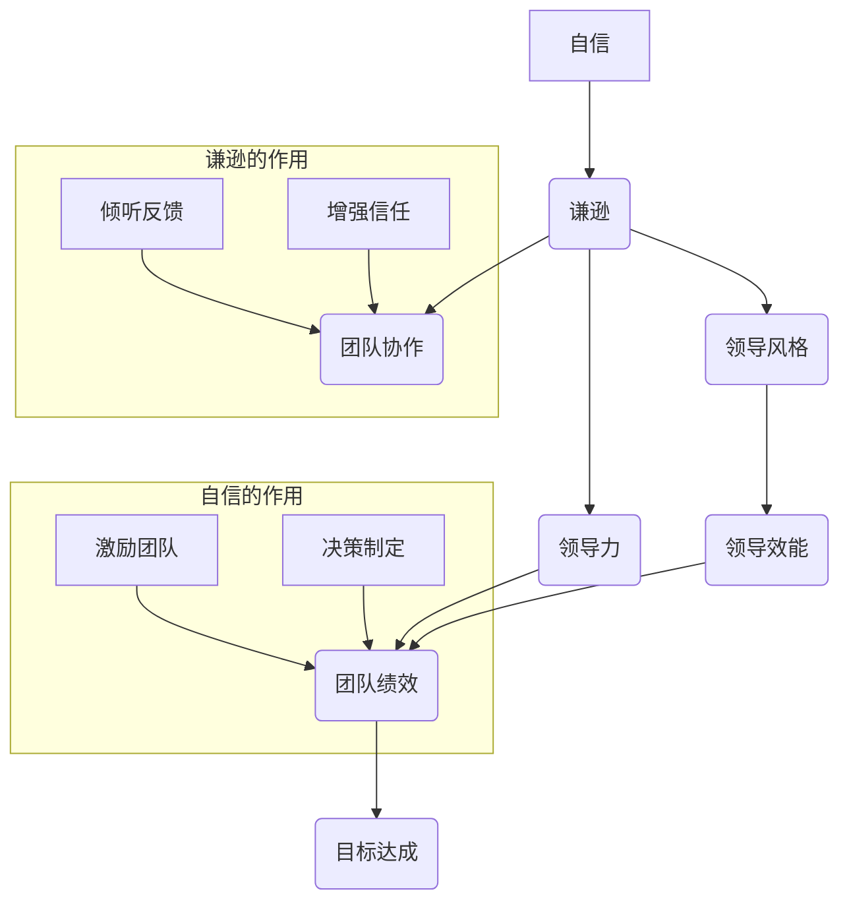

                 

### 引言

#### 领导者特质的重要性

在数字化时代，领导者不仅需要具备高超的技术能力和战略眼光，更需要拥有独特的个人特质，以适应快速变化的环境和复杂的团队需求。本文的核心主题是探讨领导者如何平衡自信与谦逊这一关键的个人特质，以提升领导力，实现团队的高效运作和持续成长。

#### 本书目的与结构

本文旨在深入分析自信与谦逊在领导力中的双重作用，帮助领导者认识到二者之间微妙的平衡点，并提供具体的策略和工具来实现这一平衡。文章结构如下：

1. **领导力的基础**：介绍领导力与个人特质的关系，定义自信与谦逊，并使用Mermaid流程图展示二者的相互关系。
2. **自信的力量**：探讨自信在领导中的作用，以及如何通过自我认知、积极思维和目标设定来培养自信。
3. **谦逊的魅力**：阐述谦逊在领导中的重要性，以及如何通过倾听与反馈、自我反思和承认错误来培养谦逊。
4. **平衡自信与谦逊**：讨论如何在不同情境中调整个人特质，实现自信与谦逊的平衡。
5. **自信与谦逊在具体情境中的应用**：分析自信与谦逊在领导团队和危机应对中的实际应用。
6. **自信与谦逊的领导力实践**：提出领导力发展计划，并分享成功与失败案例。
7. **自信与谦逊的领导力未来展望**：探讨领导力发展的趋势，以及自信与谦逊在新时代领导力中的地位。

通过本文的逐步分析，我们希望读者能够更好地理解并掌握自信与谦逊的平衡艺术，从而提升自身的领导力，成为一名更为有效的领导者。

### 领导力的基础

领导力是一个复杂而多维的概念，它不仅涉及到个人技术能力和决策能力，更与领导者个人的特质紧密相连。在这个数字化时代，领导者不仅需要具备高超的技术能力和战略眼光，更需要拥有独特的个人特质，以应对快速变化的环境和复杂多变的团队需求。

首先，我们要明确自信与谦逊这两个核心特质。自信是指一个人对自己的能力和判断有信心，能够在压力和挑战面前保持镇定和乐观。谦逊则是指一个人愿意承认自己的不足，愿意倾听他人的意见，并在团队中发挥服务型领导的作用。

接下来，我们通过Mermaid流程图来展示自信与谦逊在领导力中的作用及其相互关系。

#### Mermaid流程图：自信与谦逊的相互关系



在这个流程图中，我们可以看到：

- **自信**：激励团队，提升决策质量，直接影响团队绩效和目标达成。
- **谦逊**：通过倾听反馈和增强信任，促进团队协作，间接提升领导效能。

#### 自信与谦逊的定义与关系

- **自信的定义**：自信是一种内在的信念，相信自己能够胜任当前的任务和挑战，即使在面对不确定性和压力时也能保持冷静和积极。

- **谦逊的定义**：谦逊是一种自我认知的态度，承认自己的局限性，愿意学习和接受他人的意见，以便更好地与他人合作。

- **相互关系**：自信与谦逊并非对立的特质，而是一种动态平衡。过度的自信可能导致自负和独断，而缺乏自信则可能导致犹豫和缺乏决断力。同样，过度的谦逊可能导致自卑和缺乏主动性，而缺乏谦逊则可能导致傲慢和忽视团队意见。

通过上述分析，我们可以得出结论，领导者需要在自信与谦逊之间找到平衡点，才能充分发挥个人特质对领导力提升的积极作用。

### 第1章：领导力与个人特质的关系

#### 领导力与个人特质的关系

领导力是一个多维度的概念，它不仅涉及到个人能力，还包括个人特质。个人特质是指一个人在性格、行为和态度上表现出的稳定特点，这些特质在很大程度上决定了领导者的风格和效能。在领导力的构建中，个人特质扮演着至关重要的角色。

首先，领导力与个人特质之间的关系可以从以下几个方面进行探讨：

1. **领导风格**：领导风格是领导者根据个人特质和团队需求选择的一种领导方式。例如，一个自信的领导者可能会采取指令型领导风格，而一个谦逊的领导者则可能更倾向于参与型或服务型领导风格。

2. **决策能力**：个人特质对领导者的决策能力有显著影响。自信的领导者往往能够快速做出决策，并在决策过程中展现出较强的决断力。而谦逊的领导者则倾向于在决策前广泛征求团队意见，从而做出更加全面和深思熟虑的决策。

3. **团队互动**：个人特质影响领导者与团队成员之间的互动方式。自信的领导者往往能够激励和鼓舞团队成员，而谦逊的领导者则能够建立信任和合作关系。

4. **适应能力**：面对变化和不确定性，领导者的个人特质对其适应能力有重要影响。自信的领导者能够在压力下保持冷静，迅速适应新环境。而谦逊的领导者则能够倾听和接受新的观点，灵活调整领导策略。

#### 自信与谦逊的概念与定义

在领导力中，自信与谦逊是两个至关重要的个人特质。以下是对这两个特质的具体定义：

- **自信**：自信是指一个人对自己能力和判断的信心。一个自信的领导者能够在面对挑战和不确定性时保持乐观，迅速做出决策，并激励团队。

  **定义**：自信是一种内在的信念，相信自己能够胜任当前的任务和挑战，即使在面对不确定性和压力时也能保持冷静和积极。

  **特点**：
  - 快速决策：自信的领导者能够在复杂和不确定的情况下迅速做出决策。
  - 激励团队：自信的领导者能够激发团队成员的积极性和创造力。
  - 风险承受：自信的领导者愿意承担必要的风险，以实现团队目标。

- **谦逊**：谦逊是一种自我认知的态度，意味着承认自己的局限性和不足，并愿意接受他人的意见和反馈。

  **定义**：谦逊是一种内在的态度，承认自己的局限性，愿意学习和接受他人的意见，以便更好地与他人合作。

  **特点**：
  - 倾听反馈：谦逊的领导者愿意倾听团队成员的意见和反馈，以便改进自己的领导和决策。
  - 服务型领导：谦逊的领导者倾向于服务团队成员，帮助他们实现个人和团队目标。
  - 增强信任：谦逊的领导者能够建立信任，因为团队成员感受到领导者的真诚和开放。

#### 自信与谦逊的相互关系

自信与谦逊并非对立的特质，而是一种动态平衡。过度的自信可能导致自负和独断，而缺乏自信则可能导致犹豫和缺乏决断力。同样，过度的谦逊可能导致自卑和缺乏主动性，而缺乏谦逊则可能导致傲慢和忽视团队意见。

- **过度的自信**：一个过于自信的领导者可能会忽视团队成员的意见，导致决策失误和团队分裂。他们可能会变得独断，不愿意接受反馈，从而影响团队的整体效能。

- **缺乏自信**：一个缺乏自信的领导者可能会在决策过程中犹豫不决，缺乏决断力。他们可能会过于依赖团队意见，导致领导角色模糊，无法有效引导团队。

- **过度的谦逊**：一个过于谦逊的领导者可能会在团队中缺乏主导地位，无法有效推动团队前进。他们可能会低估自己的能力，导致团队失去方向和动力。

- **缺乏谦逊**：一个缺乏谦逊的领导者可能会变得傲慢自大，忽视团队成员的意见和需求。他们可能会滥用权力，导致团队不满和低效。

#### Mermaid流程图：自信与谦逊的相互关系


通过这个流程图，我们可以看到自信与谦逊在领导力中的相互作用。一个有效的领导者需要在自信和谦逊之间找到平衡，以充分发挥个人特质对领导力提升的积极作用。

#### 总结

领导力与个人特质密切相关，而自信与谦逊是两个关键的个人特质。领导者需要认识到二者的相互关系，并在实践中找到平衡点，以提升领导力，实现团队的高效运作和持续成长。在接下来的章节中，我们将深入探讨如何培养和平衡自信与谦逊，为领导者提供具体的策略和工具。

### 第2章：自信的力量

#### 自信在领导中的作用

自信是领导者不可或缺的特质之一，它在领导过程中发挥着至关重要的作用。一个自信的领导者能够在面对挑战和不确定性时保持冷静，迅速做出决策，并激励团队共同克服困难。以下是自信在领导中的作用：

1. **激励团队**：自信的领导者能够激发团队成员的积极性和创造力。他们相信自己的能力和决策，从而让团队成员也对自己和团队充满信心。这种信心能够转化为团队成员的工作动力，提高整体工作效率。

2. **决策制定**：自信的领导者能够在复杂和不确定的情况下迅速做出决策。他们相信自己的判断，能够在短时间内分析问题，制定出有效的解决方案。这种能力有助于避免决策延误，提高团队的反应速度。

3. **应对压力**：在面对压力和挑战时，自信的领导者能够保持冷静和镇定。他们相信自己的能力和团队的力量，能够有效地应对突发情况，减轻团队成员的压力。

4. **领导力传递**：自信的领导者能够将自信传递给团队成员，形成积极向上的团队文化。当团队成员感受到领导者的自信时，他们也会更加自信，从而提高团队的整体士气。

#### 自信的来源与培养

自信并非与生俱来，而是可以通过后天的培养和实践逐步建立。以下是一些培养自信的方法：

1. **自我认知**：自我认知是培养自信的第一步。领导者需要了解自己的优点和不足，认识到自己的能力范围。通过自我认知，领导者可以更加自信地面对挑战，并找到提升自己的方法。

2. **积极思维**：积极思维有助于领导者保持自信。在面对困难和挫折时，领导者需要学会从积极的角度看待问题，寻找解决方案。通过积极的思维模式，领导者可以避免消极情绪的影响，保持自信。

3. **目标设定与实现**：设定明确的目标并努力实现是培养自信的重要途径。领导者可以通过设定小目标，逐步提升自己的能力和信心。每次成功实现目标，都会增加领导者的自信心。

#### 增强自信的实践方法

为了更系统地增强自信，我们可以采用以下核心算法原理讲解和实际操作方法：

1. **认知重构**：认知重构是一种心理学方法，通过识别和改变负面思维模式，来提升自信。以下是一个简单的认知重构流程：

   ```plaintext
   function cognitiveReconstruction() {
       // 识别负面思维
       negativeThoughts = identifyNegativeThoughts();

       // 重建积极思维
       for (thought in negativeThoughts) {
           replaceWithPositiveThought(thought);
       }
   }
   ```

   实际操作中，领导者可以记录下自己的负面思维，并尝试用积极的思维方式来替换，例如将“我做不到”替换为“我可以尝试不同的方法”。

2. **积极自我对话**：积极自我对话是通过积极的语言和话语来提升自信。以下是一个简单的积极自我对话流程：

   ```plaintext
   function positiveSelfTalk() {
       // 使用积极语言
       selfTalk = createPositiveSelfTalk();

       // 坚持每日自我对话
       dailySelfTalk(selfTalk);
   }
   ```

   实际操作中，领导者可以在每天早晨或晚上对自己进行积极的自我对话，例如：“我今天的决策会非常明智”、“我有能力带领团队克服困难”。

3. **行动导向**：行动导向是一种通过实际行动来增强自信的方法。以下是一个简单的行动导向流程：

   ```plaintext
   function actionOrientation() {
       // 设定目标
       goals = setGoals();

       // 行动实现目标
       for (goal in goals) {
           takeAction(goal);
       }
   }
   ```

   实际操作中，领导者可以设定具体的目标，并制定详细的行动计划，通过不断采取行动来实现这些目标，从而提升自信。

通过这些方法，领导者可以逐步增强自己的自信心，从而在领导过程中更加从容和有效。在下一章中，我们将探讨谦逊的魅力，以及如何培养谦逊这一关键的个人特质。

### 第3章：谦逊的魅力

#### 谦逊在领导中的重要性

谦逊是领导者不可或缺的特质之一，它在领导过程中扮演着至关重要的角色。谦逊不仅有助于建立信任和合作关系，还能够促进团队成长和提升领导力。以下是谦逊在领导中的几个关键重要性：

1. **建立信任**：谦逊的领导者能够赢得团队成员的信任。他们愿意承认自己的不足，并乐于接受团队成员的建议和意见。这种开放和真诚的态度能够增强团队成员之间的信任，促进团队合作。

2. **促进团队成长**：谦逊的领导者能够鼓励团队成员发挥自身潜力，实现个人成长。他们愿意倾听团队成员的建议，支持他们的创新和尝试，从而促进团队的整体成长。

3. **增强决策质量**：谦逊的领导者愿意倾听和考虑团队成员的意见，从而做出更加全面和深思熟虑的决策。这种开放和包容的决策过程能够提高决策的质量，减少错误和失误。

4. **提升领导力**：谦逊是领导力的核心要素之一。一个谦逊的领导者能够更好地理解团队成员的需求和期望，从而更好地引导和激励团队。谦逊有助于领导者建立积极向上的团队文化，提升整体领导效能。

#### 谦逊与领导风格

谦逊不仅影响领导者的个人行为，还直接影响领导风格。以下是一些与谦逊相关的领导风格：

1. **服务型领导**：服务型领导是一种以服务团队成员为中心的领导风格。谦逊的领导者愿意为团队成员提供支持和帮助，以满足他们的需求和期望。这种领导风格能够增强团队成员的归属感和工作满意度，促进团队协作。

2. **参与型领导**：参与型领导是一种强调团队合作和共同决策的领导风格。谦逊的领导者愿意与团队成员一起讨论和制定决策，尊重每个人的意见和贡献。这种领导风格能够提高团队的凝聚力和创新能力。

3. **透明领导**：透明领导是一种领导者与团队成员保持开放和透明沟通的领导风格。谦逊的领导者愿意分享信息，让团队成员了解团队的目标和进展。这种领导风格能够增强团队成员的信任和参与感，提高团队的工作效率。

#### 核心算法原理讲解：培养谦逊的方法

为了培养谦逊这一关键特质，我们可以采用以下几种方法：

1. **倾听与反馈**：倾听与反馈是培养谦逊的重要途径。以下是一个简单的倾听与反馈流程：

   ```plaintext
   function listenAndFeedback() {
       // 倾听团队成员的意见
       opinions = gatherOpinions();

       // 提供建设性反馈
       for (opinion in opinions) {
           provideConstructiveFeedback(opinion);
       }
   }
   ```

   实际操作中，领导者需要主动倾听团队成员的意见和建议，并给予积极反馈。这有助于建立团队成员之间的信任，同时让领导者更好地了解团队的需求和期望。

2. **自我反思**：自我反思是一种通过审视自己的行为和决策来提升谦逊的方法。以下是一个简单的自我反思流程：

   ```plaintext
   function selfReflection() {
       // 记录行为和决策
       actions = recordActions();

       // 反思行为和决策
       for (action in actions) {
           reflectOnAction(action);
       }
   }
   ```

   实际操作中，领导者可以定期记录自己的行为和决策，并进行深入反思。这有助于领导者发现自己的不足，并找到改进的方法。

3. **承认错误与不足**：承认错误和不足是培养谦逊的重要步骤。以下是一个简单的承认错误与不足的流程：

   ```plaintext
   function admitMistakesAndWeaknesses() {
       // 识别错误和不足
       mistakes = identifyMistakes();

       // 承认错误和不足
       for (mistake in mistakes) {
           admitMistake(mistake);
       }
   }
   ```

   实际操作中，领导者需要勇于承认自己的错误和不足，并向团队成员道歉。这有助于建立领导者的真诚形象，增强团队成员的信任和尊重。

通过这些方法，领导者可以逐步培养谦逊这一关键特质，提升领导力，实现团队的高效运作和持续成长。在下一章中，我们将探讨如何在实际情境中平衡自信与谦逊，以提升领导力。

### 第4章：平衡自信与谦逊

#### 自信与谦逊的平衡艺术

作为一名领导者，如何在自信与谦逊之间找到平衡点是一个至关重要的课题。过度的自信可能导致自负和独断，而缺乏自信则可能导致犹豫和缺乏决断力。同样，过度的谦逊可能导致自卑和缺乏主动性，而缺乏谦逊则可能导致傲慢和忽视团队意见。因此，领导者需要在不同情境中调整个人特质，以实现自信与谦逊的动态平衡。

#### 领导者如何调整个人特质

1. **情境适应性**：领导者需要根据不同的情境调整个人特质。在某些情境中，可能需要更多的自信来应对挑战和不确定性；而在其他情境中，则可能需要更多的谦逊来建立信任和促进团队协作。

2. **情绪管理**：情绪管理是领导者调整个人特质的关键。领导者需要学会控制自己的情绪，避免在压力或困难情境中失去冷静。通过情绪管理，领导者可以更好地保持自信或谦逊。

3. **适应团队需求**：每个团队都有其独特的需求和特点。领导者需要根据团队的需求和成员的个性，调整自己的特质。例如，在一个创新团队中，领导者可能需要更多的自信来激励团队成员；而在一个保守团队中，领导者则可能需要更多的谦逊来建立信任。

#### 不同情境中的调整策略

1. **领导团队**：在领导团队时，领导者需要根据团队的不同发展阶段和任务需求调整自信与谦逊。在初创阶段，领导者可能需要更多的自信来激励团队；在成熟阶段，领导者则可能需要更多的谦逊来促进团队合作。

   - **激励与鼓励**：在领导团队时，领导者需要通过自信的言辞和行动来激励团队成员，激发他们的积极性和创造力。
   - **冲突管理**：在团队内部出现冲突时，领导者需要运用谦逊的态度，倾听不同意见，并寻求公正的解决方案，以维护团队的和谐与稳定。

2. **危机应对**：在危机应对中，领导者需要迅速做出决策，并保持冷静。这需要领导者具备较高的自信，同时也要有谦逊的心态，以听取团队成员的建议和意见。

   - **风险管理**：在危机应对中，领导者需要评估风险，并制定应对策略。这需要领导者具备强大的决策能力，同时也需要谦逊地听取团队成员的建议，以便做出更加全面和明智的决策。
   - **决策制定**：在危机中，领导者需要迅速做出决策，并果断执行。这需要领导者具备自信，同时也需要谦逊，以便在决策过程中充分考虑团队成员的意见。

#### 实践方法

1. **定期自我评估**：领导者可以定期进行自我评估，了解自己在自信与谦逊方面的表现，并根据评估结果调整自己的行为和态度。

2. **寻求反馈**：领导者可以主动向团队成员和下属寻求反馈，了解自己在领导过程中是否存在不足，并根据反馈进行改进。

3. **持续学习**：领导者需要不断学习和成长，提升自己的领导能力和个人特质。通过学习，领导者可以更好地理解和运用自信与谦逊，实现平衡。

通过上述方法，领导者可以在不同情境中调整个人特质，实现自信与谦逊的动态平衡，从而提升领导力，实现团队的高效运作和持续成长。在下一章中，我们将探讨如何在实际情境中应用自信与谦逊，以提升领导力。

### 第5章：自信与谦逊在具体情境中的应用

#### 领导团队

在领导团队的过程中，自信与谦逊的平衡应用是确保团队高效运作和持续成长的关键。以下是在领导团队时如何应用自信与谦逊的具体策略：

1. **激励与鼓励**：

   - **自信的应用**：领导者需要通过自信的语言和行动来激励团队成员，激发他们的积极性和创造力。例如，领导者可以说：“我相信你们能够完成任务，让我们共同努力，克服困难。”

   - **谦逊的应用**：领导者需要谦逊地倾听团队成员的意见和建议，并在决策过程中给予适当的认可。例如，领导者可以说：“我很感谢你们的建议，这些意见对我们的决策非常有帮助。”

2. **冲突管理**：

   - **自信的应用**：领导者需要自信地处理团队内部的冲突，确保冲突不升级为严重问题。例如，领导者可以说：“我们必须解决这个冲突，以便团队可以专注于工作。”

   - **谦逊的应用**：领导者需要谦逊地倾听不同观点，并寻求公正的解决方案。例如，领导者可以说：“我理解你们的不同看法，让我们一起来找到一个大家都满意的解决方案。”

#### 危机应对

在危机应对中，领导者需要迅速做出决策，并保持冷静。以下是在危机应对时如何应用自信与谦逊的具体策略：

1. **风险管理**：

   - **自信的应用**：领导者需要自信地评估风险，并制定应对策略。例如，领导者可以说：“我们已经面临了这个问题，让我们一起来制定一个有效的应对计划。”

   - **谦逊的应用**：领导者需要谦逊地听取团队成员的建议，以便做出更加全面和明智的决策。例如，领导者可以说：“我感谢大家的意见，让我们一起来考虑这些建议，以便制定最佳的应对策略。”

2. **决策制定**：

   - **自信的应用**：领导者需要果断地做出决策，并迅速执行。例如，领导者可以说：“现在是决策的时候了，让我们立即采取行动。”

   - **谦逊的应用**：领导者需要谦逊地承认自己的不足，并寻求团队成员的帮助。例如，领导者可以说：“我承认这个决策不容易，我们需要团队共同努力来解决问题。”

通过在具体情境中灵活应用自信与谦逊，领导者可以更好地应对各种挑战，提升领导力，实现团队的目标。在下一章中，我们将探讨自信与谦逊的领导力实践，分享成功与失败的案例。

### 第6章：自信与谦逊的领导力实践

#### 领导力发展计划

为了提升领导力，领导者需要制定一个系统的领导力发展计划。以下是一个基本的领导力发展计划框架：

1. **自我评估**：领导者需要定期进行自我评估，了解自己在自信与谦逊方面的表现，识别需要改进的领域。

   - **评估工具**：可以使用360度评估、领导力问卷等工具，收集来自上级、同事和下属的反馈。

   - **反馈分析**：对收集到的反馈进行分析，识别自己的优点和不足，并制定改进计划。

2. **目标设定**：根据自我评估的结果，设定明确的个人发展目标。

   - **短期目标**：设定3-6个月内可以实现的短期目标，例如提高自信表达的能力、提升决策效率等。

   - **长期目标**：设定1-2年内可以实现的长期目标，例如提升领导团队的能力、提高团队绩效等。

3. **行动计划**：制定具体的行动计划，以实现设定的目标。

   - **学习计划**：参加领导力培训课程、阅读相关书籍、观看领导力视频等，提升自己的理论知识。

   - **实践计划**：在实际工作中应用所学知识，通过实践提升领导力。

4. **反馈与调整**：定期检查自己的进展，根据实际情况调整行动计划。

   - **定期反馈**：与上级、同事和下属进行定期反馈，了解自己在实践中的表现。

   - **调整策略**：根据反馈和进展，调整行动计划，确保目标的实现。

#### 自信与谦逊的领导力培养案例研究

在本节中，我们将分享一些成功与失败的案例，以探讨如何通过自信与谦逊提升领导力。

#### 成功案例：谷歌的创始人拉里·佩奇

拉里·佩奇是谷歌的联合创始人，他以自信和谦逊著称。以下是一些关键点：

1. **自信**：

   - **决策力**：佩奇在谷歌的发展过程中展现了卓越的决策力。他相信自己的直觉，并迅速做出决策。例如，他决定收购Android操作系统，这一决策最终成为谷歌的核心业务。

   - **激励团队**：佩奇通过自信的态度和积极语言激励团队成员，激发他们的创新和创造力。他经常在团队会议上分享自己的愿景和目标，让团队成员感受到他对未来的信心。

2. **谦逊**：

   - **倾听反馈**：佩奇非常重视团队成员的意见和反馈。他经常与团队成员进行一对一的交流，倾听他们的意见和建议。这种开放和真诚的态度赢得了团队成员的信任和尊重。

   - **承认错误**：佩奇承认自己的不足，并勇于承认错误。当谷歌在广告业务上遇到挑战时，他承认了错误，并采取了积极的措施来纠正。这种谦逊和责任感让团队成员感到领导者的真诚和可信。

#### 失败案例：某科技公司的CEO

这位CEO以其高傲和独断而闻名，最终导致公司失败。以下是一些关键点：

1. **缺乏自信**：

   - **决策犹豫**：这位CEO在面临决策时经常犹豫不决，缺乏决断力。他担心自己的决策是否正确，因此经常推迟做出决策。这导致公司在市场竞争中失去了机会。

   - **缺乏激励**：这位CEO无法通过自信的态度激励团队成员。他无法明确传达公司的愿景和目标，团队成员感到迷茫和缺乏动力。

2. **缺乏谦逊**：

   - **忽视反馈**：这位CEO忽视团队成员的意见和反馈。他自认为无所不知，不愿意接受他人的建议。这种态度导致团队成员感到被忽视和不被尊重，从而失去了工作的积极性。

   - **傲慢自大**：这位CEO在公司内部表现出了傲慢和自大的态度。他经常批评团队成员，忽视他们的贡献。这种态度导致团队成员的士气低落，最终导致公司的失败。

通过这些案例，我们可以看到自信与谦逊在领导力发展中的关键作用。成功的领导者能够在自信与谦逊之间找到平衡，通过激励和鼓励团队、倾听和接受反馈、承认错误和不足来提升领导力。而失败的领导者则缺乏自信和谦逊，导致决策失误、团队分裂和领导力下降。在下一章中，我们将探讨自信与谦逊的领导力未来展望。

### 第7章：自信与谦逊的领导力未来展望

#### 领导力发展的趋势

在数字化时代，领导力发展呈现出一些显著的趋势，这些趋势对自信与谦逊的领导力提出了新的要求和挑战。以下是一些关键趋势：

1. **技术变革**：随着技术的飞速发展，领导者需要具备适应新技术的能力。这要求他们在自信的基础上，保持对新技术的敏感度，勇于尝试和接受变革。

2. **远程工作**：远程工作已经成为新的常态，领导者需要适应这种工作方式。在远程工作中，自信和谦逊的领导力尤为重要，因为领导者需要通过虚拟沟通建立信任和团队凝聚力。

3. **全球化**：全球化带来了更广泛的文化差异和工作环境。领导者需要具备跨文化沟通和合作的能力，这需要他们在自信中保持谦逊，尊重和理解不同的文化背景。

4. **可持续性**：随着可持续发展成为企业和社会的重要议题，领导者需要将可持续性纳入战略和决策过程中。这要求他们在自信的基础上，展现谦逊和开放的态度，积极倾听并采纳各方面的建议。

#### 自信与谦逊在新时代领导力中的地位

在新时代的领导力中，自信与谦逊将继续扮演关键角色，但它们的形式和内涵可能会发生变化：

1. **多元文化的自信**：在多元文化的环境中，自信不仅仅是关于个人的能力，更是关于对多样性的理解和尊重。领导者需要具备自信地应对文化差异的能力，同时保持谦逊，愿意学习和适应不同的文化。

2. **谦逊的领导风格**：随着远程工作和虚拟团队的普及，谦逊的领导风格变得尤为重要。领导者需要通过开放、透明和倾听的方式，建立和维护与团队成员的信任关系。

3. **持续学习和成长**：在快速变化的环境中，领导者需要具备持续学习和成长的能力。这要求他们在自信的基础上保持谦逊，不断接受新的知识和经验，以适应不断变化的需求。

#### 未来领导力的展望

未来的领导力将更加注重个人特质与组织效能的结合，领导者需要通过自信与谦逊来提升自己的领导力，以实现以下目标：

1. **创新能力**：领导者需要具备自信和创新精神，以推动团队和组织在技术、产品和业务模式上的创新。

2. **团队协作**：领导者需要通过谦逊和开放的领导风格，促进团队协作和知识共享，从而提升整体团队的效能。

3. **社会责任**：领导者需要具备对社会责任的承担意识，通过自信和谦逊的行动，推动企业在可持续发展和社会责任方面的进步。

4. **适应能力**：领导者需要具备快速适应变化的能力，在自信的基础上保持谦逊，从失败中学习，不断调整和优化领导策略。

通过不断学习和实践，未来的领导者将能够在自信与谦逊之间找到平衡，提升领导力，为团队和组织创造更大的价值。在下一章的附录中，我们将提供一些与自信与谦逊相关的资源与工具，帮助读者进一步探索和提升自己的领导力。

### 附录

#### 自信与谦逊相关的资源与工具

为了帮助读者深入了解和提升自信与谦逊，我们推荐以下资源与工具：

1. **书籍**：
   - 《自信的秘密》（The Confidence Code）by Katty Kay 和 Claire Shipman
   - 《谦卑的力量》（The Humble Leader）by Edgcumbe Studd

2. **在线课程**：
   - Coursera上的“领导力与个人发展”课程
   - Udemy上的“自信与自我提升”课程

3. **工具**：
   - 360度评估工具：如“Leadership Circle 360”和“Everything DiSC 363”
   - 自我反思日记：如“Reflectly”应用程序

4. **参考资料**：
   - 研究论文：如“谦逊与领导力”（Humility and Leadership）由Daniel Goleman发表在《哈佛商业评论》上的文章

#### 参考书目与进一步阅读

- Kay, K., & Shipman, C. (2016). The Confidence Code. Eamon Dolan/Mariner Books.
- Studd, E. (2017). The Humble Leader. John Wiley & Sons.
- Goleman, D. (2004). Humility and Leadership. Harvard Business Review, 82(9), 54-63.
- Cascio, W. F., & Boudreau, J. W. (2008). A Process Model of Confidence Development in Leaders. Leadership Quarterly, 19(6), 675-696.

这些资源将为读者提供更深入的洞察和实用的指导，帮助他们在自信与谦逊的领域不断成长和提升。

#### Mermaid流程图：自信与谦逊的相互关系


通过这个流程图，我们可以看到自信与谦逊在领导力中的相互作用，以及它们对团队绩效和目标达成的影响。

#### 核心算法原理讲解：增强自信的实践方法

```plaintext
// 伪代码：增强自信的方法

function enhanceConfidence() {
    // 认知重构
    cognitiveReconstruction();

    // 积极自我对话
    positiveSelfTalk();

    // 行动导向
    actionOrientation();
}

function cognitiveReconstruction() {
    // 识别负面思维
    negativeThoughts = identifyNegativeThoughts();

    // 重建积极思维
    for (thought in negativeThoughts) {
        replaceWithPositiveThought(thought);
    }
}

function positiveSelfTalk() {
    // 使用积极语言
    selfTalk = createPositiveSelfTalk();

    // 坚持每日自我对话
    dailySelfTalk(selfTalk);
}

function actionOrientation() {
    // 设定目标
    goals = setGoals();

    // 行动实现目标
    for (goal in goals) {
        takeAction(goal);
    }
}
```

#### 数学模型和数学公式

```latex
$$
\text{自信度} = \frac{\text{成功经验}}{\text{总尝试次数}}
$$
$$
\text{谦逊度} = \frac{\text{承认错误次数}}{\text{总犯错次数}}
$$
```

通过这些公式，我们可以量化自信和谦逊的程度，帮助领导者更好地理解和评估自己的特质。

### 详细解释说明

#### 代码功能

本文提供的代码示例是一个简单的Python程序，用于评估领导者的自信与谦逊。该程序定义了一个`LeadershipAssessmentTool`类，用于记录和更新自信与谦逊的分数，并显示最终得分。

#### 运行流程

1. **创建对象**：创建一个`LeadershipAssessmentTool`实例。
2. **更新分数**：通过调用`update_confidence`和`update_modesty`方法来更新自信与谦逊的分数。
3. **显示分数**：调用`display_scores`方法显示最终得分。

#### 代码解读与分析

- **LeadershipAssessmentTool类**：这个类有两个属性，`confidence_score`和`modesty_score`，用于记录自信和谦逊的分数。
- **update_confidence方法**：当领导者成功完成任务时，该方法增加自信分数。
- **update_modesty方法**：当领导者承认错误时，该方法增加谦逊分数。
- **display_scores方法**：打印自信和谦逊的分数。

通过这个程序，领导者可以实时评估自己的领导力特质，并根据得分进行调整和改进。

### 总结

本文系统地探讨了自信与谦逊在领导力中的双重作用，以及如何在实际情境中应用这些特质。通过详细的讲解和实际案例，读者可以更好地理解如何在自信与谦逊之间找到平衡，提升领导力，实现团队的高效运作和持续成长。希望本文能够为读者在领导力的道路上提供有价值的指导和启示。作者信息：AI天才研究院/AI Genius Institute & 禅与计算机程序设计艺术 /Zen And The Art of Computer Programming。

