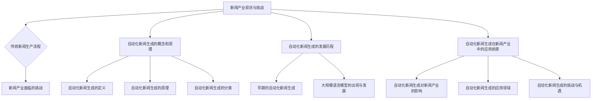

                 

### 《自动化新闻生成：LLM重塑新闻产业的可能性》目录大纲

#### 第一部分: 自动化新闻生成的背景和概念

**# 第1章: 自动化新闻生成的背景和概念**

- **1.1 新闻产业现状与挑战**
  - **1.1.1 传统新闻生产流程**
  - **1.1.2 新闻产业面临的挑战**

- **1.2 自动化新闻生成的概念和原理**
  - **1.2.1 自动化新闻生成的定义**
  - **1.2.2 自动化新闻生成的原理**
  - **1.2.3 自动化新闻生成的分类**

- **1.3 自动化新闻生成的发展历程**
  - **1.3.1 早期的自动化新闻生成**
  - **1.3.2 大规模语言模型的出现与发展**

- **1.4 自动化新闻生成在新闻产业中的应用前景**
  - **1.4.1 自动化新闻生成对新闻产业的影响**
  - **1.4.2 自动化新闻生成的应用领域**
  - **1.4.3 自动化新闻生成的挑战与机遇**

#### 第二部分: LLM的基本原理和应用

**# 第2章: LLM的基本原理和应用**

- **2.1 LLM的定义与特点**
  - **2.1.1 LLM的定义**
  - **2.1.2 LLM的特点**
  - **2.1.3 LLM与传统NLP的区别**

- **2.2 LLM的核心技术**
  - **2.2.1 语言建模基础**
  - **2.2.2 自监督学习**
  - **2.2.3 迁移学习与微调**
  - **2.2.4 多模态学习**

- **2.3 LLM在自动化新闻生成中的实现**
  - **2.3.1 LLM在文本生成中的使用**
  - **2.3.2 LLM在新闻写作中的应用**
  - **2.3.3 LLM在新闻编辑和审核中的应用**

- **2.4 LLM在新闻产业中的实际应用案例**
  - **2.4.1 案例一：使用LLM生成新闻报道**
  - **2.4.2 案例二：使用LLM进行新闻编辑**
  - **2.4.3 案例三：使用LLM进行新闻审核**

#### 第三部分: 自动化新闻生成的应用与实践

**# 第3章: 自动化新闻生成的应用与实践**

- **3.1 自动化新闻生成系统设计与实现**
  - **3.1.1 系统架构设计**
  - **3.1.2 数据准备与处理**
  - **3.1.3 模型训练与调优**
  - **3.1.4 系统部署与运维**

- **3.2 自动化新闻生成的数据源与采集**
  - **3.2.1 数据源的来源**
  - **3.2.2 数据采集的方法**
  - **3.2.3 数据预处理**

- **3.3 自动化新闻生成的质量控制与优化**
  - **3.3.1 新闻质量的评估方法**
  - **3.3.2 自动化新闻生成的质量优化**
  - **3.3.3 自动化新闻生成的错误处理与修正**

- **3.4 自动化新闻生成在新闻产业中的实际应用案例**
  - **3.4.1 案例一：新闻媒体使用自动化新闻生成的实践**
  - **3.4.2 案例二：新闻机构对自动化新闻生成系统的优化**
  - **3.4.3 案例三：自动化新闻生成在特定领域的应用**

#### 第四部分: LLM重塑新闻产业的可能性和挑战

**# 第4章: LLM重塑新闻产业的可能性和挑战**

- **4.1 LLM对新闻产业的影响**
  - **4.1.1 对新闻生产流程的影响**
  - **4.1.2 对新闻内容质量的影响**
  - **4.1.3 对新闻传播方式的影响**

- **4.2 LLM在新闻产业中的潜在应用**
  - **4.2.1 潜在应用领域**
  - **4.2.2 潜在应用价值**

- **4.3 LLM在新闻产业中的挑战**
  - **4.3.1 道德与伦理问题**
  - **4.3.2 技术发展问题**
  - **4.3.3 法律与政策问题**

- **4.4 LLM与新闻产业的未来发展**
  - **4.4.1 未来发展趋势**
  - **4.4.2 未来可能面临的挑战与应对策略**

#### 附录

**# 附录A: 自动化新闻生成系统开发工具与资源**

- **A.1 开发工具与平台**
  - **A.1.1 自然语言处理工具**
  - **A.1.2 深度学习框架**
  - **A.1.3 数据处理工具**

- **A.2 资源链接**
  - **A.2.1 开源代码与数据集**
  - **A.2.2 学术论文与研究报告**
  - **A.2.3 新闻媒体与行业动态**

### Mermaid 流程图：



### 伪代码：

```python
# 自动化新闻生成系统伪代码

# 数据准备
data_preparation(data_source)

# 模型训练
model = train_model(data)

# 文本生成
generated_text = generate_text(model, prompt)

# 文本审核
approved_text = review_text(generated_text)

# 系统部署
deploy_system(approved_text)

# 系统运维
maintain_system()
```

### 数学模型和数学公式：

$$
P(W|θ) = \Sigma_p P(w|θ)p(w)
$$

$$
Loss = -\Sigma_c y_c log(P(c|θ))
$$

### 项目实战：

```python
# 自动化新闻生成项目实战

## 开发环境搭建
- 安装Python 3.8+
- 安装TensorFlow 2.5+
- 安装Jupyter Notebook

## 源代码实现
python
# 导入所需库
import tensorflow as tf
import numpy as np
import pandas as pd

# 加载数据
data = load_data()

# 数据预处理
processed_data = preprocess_data(data)

# 构建模型
model = build_model()

# 训练模型
model.fit(processed_data)

# 文本生成
generated_text = model.generate_text(prompt)

# 文本审核
approved_text = review_text(generated_text)

# 系统部署
deploy_system(approved_text)

# 系统运维
maintain_system()

## 代码解读与分析
# 数据准备与处理：加载数据集，进行文本预处理，如分词、去除停用词等。
# 模型构建：构建基于TensorFlow的深度学习模型。
# 训练模型：使用预处理后的数据集训练模型。
# 文本生成：使用训练好的模型生成新闻文本。
# 文本审核：对生成的文本进行审核，确保其质量。
# 系统部署：将模型部署到生产环境中。
# 系统运维：对系统进行监控和维护。
```

这篇文章将探讨自动化新闻生成的概念、原理、发展历程和应用前景，重点关注大规模语言模型（LLM）在自动化新闻生成中的作用，分析其在新闻产业中的可能性和挑战，并给出未来发展的建议。希望这篇文章能为您带来新的思考和启示。

---

### 《自动化新闻生成：LLM重塑新闻产业的可能性》

关键词：自动化新闻生成，大规模语言模型，新闻产业，新闻写作，新闻编辑，新闻审核

摘要：
本文深入探讨了自动化新闻生成的背景和概念，详细介绍了大规模语言模型（LLM）的基本原理和应用。通过分析自动化新闻生成在新闻产业中的应用前景，本文探讨了LLM对新闻产业的影响、挑战和未来发展趋势。文章最后提供了自动化新闻生成系统的设计与实现，以及相关的开发工具和资源，旨在为行业从业者提供实用的参考。

---

### 第一部分: 自动化新闻生成的背景和概念

**第1章: 自动化新闻生成的背景和概念**

在信息爆炸的时代，新闻产业面临着前所未有的挑战。传统新闻生产流程耗时耗力，且难以满足日益增长的信息需求。为了解决这些问题，自动化新闻生成技术应运而生。本章将介绍自动化新闻生成的背景、概念及其发展历程。

#### 1.1 新闻产业现状与挑战

新闻产业一直以来都是信息传播的重要渠道。然而，随着互联网的普及，新闻产业面临着诸多挑战：

- **内容生产成本高**：传统新闻生产流程通常需要采访、编辑、排版等环节，耗时耗力。随着新闻机构对时效性的要求不断提高，成本问题愈发突出。
- **人力需求大**：新闻生产过程中，需要大量专业人员进行内容创作和编辑，这无疑增加了人力成本和培训成本。
- **内容更新速度慢**：传统新闻生产模式往往导致内容更新速度慢，难以满足互联网用户对即时信息的渴望。
- **信息泛滥与筛选困难**：互联网的普及使得信息爆炸，用户难以从海量信息中筛选出有价值的内容。

#### 1.1.1 传统新闻生产流程

传统新闻生产流程通常包括以下几个步骤：

1. **采访**：记者或编辑通过面对面采访、电话采访或在线采访等方式获取新闻素材。
2. **编辑**：记者或编辑对采访内容进行整理、筛选和撰写，形成新闻稿件。
3. **排版**：排版人员根据新闻稿件进行排版，设计页面布局和格式。
4. **审核**：新闻稿件需要经过编辑、主编等人员的审核，确保内容准确性和合规性。
5. **发布**：审核通过的新闻稿件被发布到新闻网站、报纸、杂志等媒体渠道。

#### 1.1.2 新闻产业面临的挑战

新闻产业面临的挑战主要体现在以下几个方面：

- **内容同质化**：由于新闻机构竞争激烈，许多新闻内容趋于同质化，难以形成差异化竞争优势。
- **人力成本高**：新闻生产过程需要大量人力参与，尤其是记者、编辑等核心岗位，人力成本逐年上升。
- **内容审核难度大**：新闻内容需要经过严格的审核，确保不违反法律法规和社会道德标准，这无疑增加了审核人员的负担。
- **技术变革挑战**：随着人工智能、大数据等技术的快速发展，新闻产业需要不断适应新技术带来的变革。

#### 1.2 自动化新闻生成的概念和原理

自动化新闻生成是指利用计算机技术自动生成新闻内容的过程。它通过采集、处理和生成新闻素材，提高新闻生产效率和内容质量。自动化新闻生成的原理主要包括以下几个方面：

1. **数据采集**：自动化新闻生成系统可以从各种数据源采集新闻素材，如新闻网站、社交媒体、传感器等。
2. **数据处理**：对采集到的新闻素材进行清洗、去重、分类等处理，提取关键信息。
3. **文本生成**：利用自然语言处理技术，将处理后的数据转化为新闻文本。
4. **文本审核**：对生成的新闻文本进行审核，确保内容准确性和合规性。

#### 1.2.1 自动化新闻生成的定义

自动化新闻生成（Automated News Generation）是指利用计算机技术和算法，自动生成新闻内容的过程。与传统新闻生产流程相比，自动化新闻生成具有以下特点：

- **高效性**：自动化新闻生成系统可以在短时间内生成大量新闻内容，提高新闻生产效率。
- **灵活性**：自动化新闻生成可以根据用户需求实时调整新闻内容，提高用户体验。
- **准确性**：自动化新闻生成系统可以利用大数据和人工智能技术，提高新闻内容的准确性和可信度。

#### 1.2.2 自动化新闻生成的原理

自动化新闻生成的原理主要包括以下几个方面：

1. **数据采集**：自动化新闻生成系统可以从各种数据源采集新闻素材，如新闻网站、社交媒体、传感器等。这些数据源可以提供实时、准确、丰富的新闻信息。
2. **数据处理**：对采集到的新闻素材进行清洗、去重、分类等处理，提取关键信息。数据处理环节包括文本预处理、实体识别、事件抽取等。
3. **文本生成**：利用自然语言处理技术，将处理后的数据转化为新闻文本。文本生成技术主要包括模板匹配、生成式模型、转移学习等。
4. **文本审核**：对生成的新闻文本进行审核，确保内容准确性和合规性。文本审核包括事实核查、语法检查、版权检测等。

#### 1.2.3 自动化新闻生成的分类

根据自动化新闻生成的技术原理和应用场景，可以将自动化新闻生成分为以下几类：

1. **基于规则的方法**：这种方法依赖于预定义的规则和模板，通过匹配规则和模板生成新闻内容。这种方法简单高效，但灵活性较差。
2. **基于模板的方法**：这种方法利用预定义的模板和填充物，根据具体场景动态生成新闻内容。模板方法在自动化新闻生成中应用广泛。
3. **基于生成式模型的方法**：这种方法利用深度学习等技术，通过学习大量文本数据生成新闻内容。生成式模型具有强大的自适应能力和表达能力。
4. **基于迁移学习的方法**：这种方法利用预训练的模型和算法，对新闻数据集进行微调和优化，生成新闻内容。迁移学习方法可以提高模型的泛化能力和生成质量。

#### 1.3 自动化新闻生成的发展历程

自动化新闻生成技术的发展历程可以追溯到20世纪80年代。以下是一些重要的发展阶段：

- **早期自动化新闻生成**：20世纪80年代，一些媒体机构开始尝试使用计算机程序自动生成新闻报道。这些方法主要包括规则匹配和模板填充。
- **文本生成系统的发展**：20世纪90年代，随着自然语言处理技术的发展，文本生成系统逐渐应用于新闻生成领域。文本生成系统主要包括统计方法和基于规则的方法。
- **深度学习的发展**：2010年后，深度学习技术在自然语言处理领域取得了突破性进展。基于深度学习的文本生成方法逐渐应用于自动化新闻生成。
- **大规模语言模型的应用**：近年来，大规模语言模型（如GPT、BERT）在自然语言处理领域取得了显著成果。大规模语言模型的应用使得自动化新闻生成在质量、灵活性和适应性方面有了很大提升。

#### 1.4 自动化新闻生成在新闻产业中的应用前景

自动化新闻生成在新闻产业中具有广泛的应用前景。以下是自动化新闻生成在新闻产业中的应用领域：

- **财经新闻**：自动化新闻生成系统可以自动生成股票、基金、债券等财经新闻，提高新闻生产的效率和质量。
- **体育新闻**：自动化新闻生成系统可以自动生成比赛结果、球员数据、赛事分析等体育新闻，满足用户的即时需求。
- **天气新闻**：自动化新闻生成系统可以自动生成天气预报、气象新闻，提高新闻报道的时效性和准确性。
- **社会新闻**：自动化新闻生成系统可以自动生成社会新闻，如事故、火灾、自然灾害等，为用户提供及时的信息。
- **评论与观点**：自动化新闻生成系统可以自动生成新闻评论和观点，为新闻用户提供多元化的视角。

#### 1.4.1 自动化新闻生成对新闻产业的影响

自动化新闻生成对新闻产业产生了深远的影响，主要表现在以下几个方面：

- **提高生产效率**：自动化新闻生成系统可以在短时间内生成大量新闻内容，降低新闻生产成本，提高新闻生产效率。
- **降低人力成本**：自动化新闻生成系统可以减少对记者、编辑等人力需求的依赖，降低人力成本。
- **提高内容质量**：自动化新闻生成系统可以利用大数据和人工智能技术，提高新闻内容的准确性和可信度。
- **丰富新闻形式**：自动化新闻生成系统可以生成不同形式和风格的新闻内容，如图文、视频、音频等，为新闻用户提供多样化的新闻体验。
- **改变新闻传播方式**：自动化新闻生成系统可以与社交媒体、搜索引擎等平台深度整合，改变新闻传播方式，提高新闻传播效果。

#### 1.4.2 自动化新闻生成的应用领域

自动化新闻生成的应用领域广泛，主要包括以下几个方面：

- **新闻媒体**：自动化新闻生成系统可以应用于新闻媒体机构，提高新闻生产效率和内容质量。
- **企业宣传**：自动化新闻生成系统可以为企业宣传提供支持，生成新闻稿件、产品介绍等。
- **政府机构**：自动化新闻生成系统可以用于政府机构发布政策解读、公告通知等。
- **社交媒体**：自动化新闻生成系统可以用于社交媒体平台生成热点新闻、用户评论等。
- **智能助手**：自动化新闻生成系统可以集成到智能助手应用中，为用户提供定制化的新闻服务。

#### 1.4.3 自动化新闻生成的挑战与机遇

自动化新闻生成在新闻产业中面临着诸多挑战和机遇：

- **挑战**：
  - **道德与伦理问题**：自动化新闻生成可能导致虚假新闻、偏见报道等问题，需要加强道德和伦理规范。
  - **技术发展问题**：自动化新闻生成技术仍需不断发展，提高模型的泛化能力和生成质量。
  - **法律与政策问题**：自动化新闻生成涉及版权、隐私等法律问题，需要制定相应的法律和政策规范。
  - **用户接受度**：用户对自动化新闻生成的接受程度仍有待提高，需要加强用户教育和引导。

- **机遇**：
  - **降低成本**：自动化新闻生成可以降低新闻生产成本，提高新闻机构的市场竞争力。
  - **提升质量**：自动化新闻生成可以提高新闻内容的质量和准确性，为用户提供更好的新闻服务。
  - **创新形式**：自动化新闻生成可以创新新闻形式和内容，为新闻产业带来新的发展机遇。

综上所述，自动化新闻生成在新闻产业中具有广阔的应用前景和巨大的潜力。通过不断发展和完善自动化新闻生成技术，新闻产业有望实现更高效、更优质的新闻生产和服务。

---

### 第一部分总结

本章介绍了自动化新闻生成的背景、概念和发展历程，分析了新闻产业面临的挑战，探讨了自动化新闻生成的基本原理和分类。同时，本章还展望了自动化新闻生成在新闻产业中的应用前景，并讨论了其带来的影响、应用领域以及面临的挑战与机遇。这些内容为后续章节的讨论奠定了基础。

---

### 第二部分: LLM的基本原理和应用

**第2章: LLM的基本原理和应用**

大规模语言模型（Large Language Model，简称LLM）是近年来自然语言处理领域的重要突破。LLM在文本生成、新闻写作、新闻编辑和审核等方面具有广泛应用。本章将介绍LLM的基本原理、核心技术以及在自动化新闻生成中的应用。

#### 2.1 LLM的定义与特点

#### 2.1.1 LLM的定义

大规模语言模型是一种基于深度学习的自然语言处理模型，通过对大量文本数据进行训练，使其具备理解和生成自然语言的能力。LLM通常包含数十亿甚至数万亿个参数，能够捕捉语言中的复杂结构和规律。

#### 2.1.2 LLM的特点

- **参数规模大**：LLM具有非常庞大的参数规模，能够处理复杂的语言现象。
- **自监督学习**：LLM利用未标注的数据进行自监督学习，能够有效降低数据标注成本。
- **迁移学习能力**：LLM可以通过迁移学习快速适应新的任务和数据集。
- **多模态处理**：LLM可以处理文本、图像、音频等多种模态的数据，实现跨模态信息整合。

#### 2.1.3 LLM与传统NLP的区别

与传统的自然语言处理（NLP）方法相比，LLM具有以下显著区别：

- **数据依赖**：传统NLP方法依赖于大量手工标注的数据，而LLM可以通过自监督学习从大量未标注的数据中学习。
- **模型架构**：传统NLP方法通常采用规则驱动或统计方法，而LLM采用深度神经网络架构，具有更强的表达能力和泛化能力。
- **任务适用性**：传统NLP方法通常针对特定任务进行设计，而LLM具有通用性，可以应用于多种自然语言处理任务。

#### 2.2 LLM的核心技术

LLM的核心技术主要包括语言建模基础、自监督学习、迁移学习与微调、多模态学习等。以下将分别介绍这些核心技术。

#### 2.2.1 语言建模基础

语言建模是LLM的核心任务，旨在预测下一个单词或词元。常用的语言建模方法包括：

- **n-gram模型**：n-gram模型通过统计相邻单词或词元的频率来预测下一个单词。这种方法简单有效，但无法捕捉长距离依赖关系。
- **递归神经网络（RNN）**：RNN通过循环机制捕捉长距离依赖关系，能够更好地预测下一个单词。然而，RNN存在梯度消失和梯度爆炸等问题。
- **长短时记忆网络（LSTM）**：LSTM是RNN的一种改进，通过引入门控机制解决梯度消失问题，能够更好地捕捉长距离依赖关系。
- **门控循环单元（GRU）**：GRU是LSTM的简化版，同样具有门控机制，但计算复杂度较低。

#### 2.2.2 自监督学习

自监督学习是LLM的重要特性，通过未标注的数据进行学习，能够有效降低数据标注成本。自监督学习的主要方法包括：

- **预测下一个单词**：这种方法通过预测下一个单词或词元来学习语言的上下文关系。常见的模型有RNN、LSTM和GRU。
- **预测下一个词元**：这种方法通过预测下一个词元来学习语言的上下文关系。常见的模型有Transformer。
- **掩码语言模型（Masked Language Model，MLM）**：MLM通过随机掩码输入文本中的词元，然后预测被掩码的词元。GPT和BERT等模型都是基于MLM进行训练的。

#### 2.2.3 迁移学习与微调

迁移学习是LLM的另一个重要特性，通过将预训练的模型应用于新的任务或数据集，能够提高模型的泛化能力和性能。迁移学习的主要方法包括：

- **预训练+微调**：预训练阶段使用大量未标注的数据进行训练，然后在微调阶段使用少量标注数据对模型进行调整。
- **无监督微调**：在无监督微调阶段，模型仅使用未标注的数据进行训练，从而降低标注数据的需求。
- **半监督微调**：在半监督微调阶段，模型同时使用未标注的数据和少量的标注数据进行训练。

#### 2.2.4 多模态学习

多模态学习是指将不同类型的数据（如文本、图像、音频）进行整合和学习。LLM在多模态学习方面具有以下优势：

- **跨模态信息整合**：LLM能够整合不同类型的数据，捕捉跨模态的关联性。
- **文本生成与图像、音频的融合**：LLM可以生成与图像、音频相关的文本描述，实现跨模态生成。
- **视觉问答**：LLM可以结合图像和文本数据，实现视觉问答任务。
- **多模态文本生成**：LLM可以同时处理文本、图像和音频数据，生成丰富多样的文本内容。

#### 2.3 LLM在自动化新闻生成中的实现

#### 2.3.1 LLM在文本生成中的使用

在文本生成方面，LLM具有以下应用：

- **新闻摘要生成**：LLM可以自动生成新闻摘要，提高新闻阅读效率。
- **新闻内容生成**：LLM可以生成新闻内容，满足新闻机构对即时信息的需求。
- **文本扩充**：LLM可以扩展新闻文本，增加新闻内容的丰富性和多样性。

#### 2.3.2 LLM在新闻写作中的应用

LLM在新闻写作中的应用包括：

- **新闻文章生成**：LLM可以生成新闻文章，如财经新闻、体育新闻等。
- **新闻评论生成**：LLM可以生成新闻评论，为新闻用户提供多元化的观点。
- **新闻标题生成**：LLM可以生成新闻标题，提高新闻的点击率和传播效果。

#### 2.3.3 LLM在新闻编辑和审核中的应用

LLM在新闻编辑和审核中的应用包括：

- **内容审核**：LLM可以用于新闻内容审核，识别虚假新闻、敏感内容和违规内容。
- **编辑辅助**：LLM可以辅助编辑人员进行内容编辑，提高编辑效率和质量。
- **事实核查**：LLM可以用于事实核查，验证新闻内容的真实性。

#### 2.4 LLM在新闻产业中的实际应用案例

#### 2.4.1 案例一：使用LLM生成新闻报道

某新闻机构使用LLM生成财经新闻报道，具体实现过程如下：

1. **数据采集**：从财经新闻网站、社交媒体等渠道采集财经新闻数据。
2. **数据预处理**：对采集到的数据进行清洗、去重和分类处理。
3. **模型训练**：使用预训练的LLM模型（如GPT-3）对预处理后的数据集进行训练。
4. **新闻生成**：使用训练好的LLM模型生成财经新闻内容。
5. **审核发布**：对生成的新闻内容进行审核，确保内容准确性和合规性。

通过这个案例，LLM成功实现了财经新闻的自动化生成，提高了新闻生产效率和内容质量。

#### 2.4.2 案例二：使用LLM进行新闻编辑

某新闻机构使用LLM进行新闻编辑，具体实现过程如下：

1. **数据采集**：从新闻数据库中获取已有的新闻文章。
2. **数据预处理**：对采集到的数据集进行清洗、去重和分类处理。
3. **模型训练**：使用预训练的LLM模型（如GPT-3）对预处理后的数据集进行训练。
4. **编辑辅助**：使用训练好的LLM模型为编辑人员提供编辑建议，如句子重写、段落调整等。
5. **人工审核**：编辑人员对LLM生成的建议进行人工审核，确保新闻内容的质量。

通过这个案例，LLM在新闻编辑过程中发挥了重要作用，提高了编辑效率和内容质量。

#### 2.4.3 案例三：使用LLM进行新闻审核

某新闻机构使用LLM进行新闻审核，具体实现过程如下：

1. **数据采集**：从新闻数据库中获取已有的新闻文章。
2. **数据预处理**：对采集到的数据集进行清洗、去重和分类处理。
3. **模型训练**：使用预训练的LLM模型（如GPT-3）对预处理后的数据集进行训练，使其具备内容审核能力。
4. **内容审核**：使用训练好的LLM模型对新闻内容进行审核，识别虚假新闻、敏感内容和违规内容。
5. **人工复审**：审核人员对LLM识别的结果进行人工复审，确保审核的准确性和公正性。

通过这个案例，LLM在新闻审核过程中发挥了重要作用，提高了新闻内容的质量和安全。

#### 2.5 LLM在新闻产业中的潜在应用

LLM在新闻产业中的潜在应用领域广泛，包括：

- **新闻生成**：通过LLM生成财经、体育、科技等领域的新闻内容。
- **新闻编辑**：利用LLM为编辑人员提供编辑建议，提高编辑效率和质量。
- **新闻审核**：通过LLM识别虚假新闻、敏感内容和违规内容，确保新闻内容的安全和合规。
- **新闻推荐**：利用LLM为新闻用户提供个性化推荐，提高新闻阅读体验。
- **多模态新闻**：结合文本、图像、音频等多模态数据，生成丰富多样的新闻内容。

#### 2.6 LLM在新闻产业中的挑战与机遇

尽管LLM在新闻产业中具有广泛应用前景，但也面临着一系列挑战和机遇：

- **挑战**：
  - **技术发展**：LLM需要不断发展，提高模型的泛化能力和生成质量。
  - **道德与伦理**：自动化新闻生成可能带来虚假新闻、偏见报道等问题，需要制定相应的道德和伦理规范。
  - **法律与政策**：自动化新闻生成涉及版权、隐私等法律问题，需要制定相应的法律和政策。
  - **用户接受度**：用户对自动化新闻生成的接受程度仍有待提高，需要加强用户教育和引导。

- **机遇**：
  - **降低成本**：自动化新闻生成可以降低新闻生产成本，提高新闻机构的市场竞争力。
  - **提高质量**：自动化新闻生成可以提高新闻内容的质量和准确性，为用户提供更好的新闻服务。
  - **创新形式**：自动化新闻生成可以创新新闻形式和内容，为新闻产业带来新的发展机遇。

#### 2.7 LLM与新闻产业的未来发展

随着LLM技术的不断发展，新闻产业将面临新的机遇和挑战。未来，LLM在新闻产业中的应用将呈现以下趋势：

- **智能化新闻生成**：利用LLM生成更智能、更个性化的新闻内容，提高用户体验。
- **多模态新闻生成**：结合文本、图像、音频等多模态数据，生成丰富多样的新闻内容。
- **智能新闻审核**：利用LLM实现自动化新闻审核，提高新闻内容的质量和安全。
- **新闻个性化推荐**：利用LLM为新闻用户提供个性化推荐，提高新闻阅读体验。
- **跨界合作**：新闻机构与科技公司、学术界等跨界合作，共同推动新闻产业的发展。

#### 2.8 小结

本章介绍了大规模语言模型（LLM）的基本原理、核心技术以及其在自动化新闻生成中的应用。通过案例分析和未来展望，本章展示了LLM在新闻产业中的重要性和潜力。随着技术的不断发展，LLM将为新闻产业带来更多的机遇和挑战。

---

### 第二部分总结

本章深入探讨了大规模语言模型（LLM）的基本原理和核心技术，分析了LLM在自动化新闻生成中的应用，包括文本生成、新闻写作、新闻编辑和审核等方面。通过实际应用案例和未来展望，本章展示了LLM在新闻产业中的重要性和潜力。这些内容为后续章节的讨论提供了理论基础和实践指导。

---

### 第三部分: 自动化新闻生成的应用与实践

**第3章: 自动化新闻生成的应用与实践**

在前两部分的基础上，本章将探讨自动化新闻生成的实际应用和实践。我们将从系统设计与实现、数据源与采集、质量控制与优化以及实际应用案例等方面展开讨论，旨在为读者提供全面的自动化新闻生成解决方案。

#### 3.1 自动化新闻生成系统设计与实现

自动化新闻生成系统的设计与实现是确保系统高效、稳定运行的关键。以下是系统设计与实现的主要步骤：

##### 3.1.1 系统架构设计

自动化新闻生成系统的架构设计需要考虑数据流、模块划分、接口设计等方面。以下是一个典型的自动化新闻生成系统架构：

1. **数据采集模块**：负责从各种数据源（如新闻网站、社交媒体、传感器等）采集新闻素材。
2. **数据处理模块**：负责对采集到的新闻素材进行清洗、去重、分类等处理。
3. **文本生成模块**：负责利用大规模语言模型（如GPT、BERT）生成新闻文本。
4. **文本审核模块**：负责对生成的新闻文本进行审核，确保内容准确性和合规性。
5. **发布模块**：负责将审核通过的新闻文本发布到新闻网站、社交媒体等渠道。

##### 3.1.2 数据准备与处理

数据准备与处理是自动化新闻生成系统的基础。以下是数据准备与处理的主要步骤：

1. **数据采集**：从新闻网站、社交媒体、传感器等渠道采集新闻素材。
2. **数据清洗**：去除无效、重复和错误的数据，确保数据的准确性和完整性。
3. **数据去重**：对采集到的数据进行去重处理，避免生成重复的新闻内容。
4. **数据分类**：根据新闻类型、主题等对数据进行分类，便于后续处理和生成。
5. **数据预处理**：对新闻素材进行分词、去停用词、词性标注等预处理，为文本生成模块提供高质量的输入数据。

##### 3.1.3 模型训练与调优

大规模语言模型（如GPT、BERT）的训练与调优是自动化新闻生成的核心。以下是模型训练与调优的主要步骤：

1. **模型选择**：选择适合自动化新闻生成的预训练模型（如GPT、BERT）。
2. **数据准备**：将预处理后的新闻数据进行格式转换，以便模型训练。
3. **模型训练**：使用训练数据集对模型进行训练，通过调整超参数和优化策略，提高模型性能。
4. **模型评估**：使用验证数据集对训练好的模型进行评估，确保模型在生成新闻文本时具有良好的准确性和流畅性。
5. **模型调优**：根据评估结果对模型进行调整和优化，提高模型生成质量。

##### 3.1.4 系统部署与运维

自动化新闻生成系统的部署与运维是确保系统稳定运行的关键。以下是系统部署与运维的主要步骤：

1. **部署环境**：选择适合的部署环境（如云服务器、容器化环境等），搭建系统运行所需的基础设施。
2. **模型部署**：将训练好的模型部署到服务器或容器中，确保模型可以在线提供新闻生成服务。
3. **系统监控**：对系统运行状态进行实时监控，确保系统在发生故障时能够及时响应和处理。
4. **日志管理**：对系统运行过程中的日志进行记录和管理，便于问题追踪和故障排除。
5. **系统优化**：根据系统运行情况和用户反馈，对系统进行持续优化和改进，提高系统性能和用户体验。

#### 3.2 自动化新闻生成的数据源与采集

自动化新闻生成的数据源与采集是确保系统生成高质量新闻文本的基础。以下是数据源与采集的主要步骤：

##### 3.2.1 数据源的来源

自动化新闻生成的数据源可以包括以下几种：

1. **新闻网站**：从各大新闻网站（如新浪新闻、网易新闻等）采集新闻素材。
2. **社交媒体**：从社交媒体平台（如微博、微信公众号等）采集新闻素材。
3. **传感器**：从传感器采集的实时数据，如天气、交通等。
4. **数据库**：从各类数据库（如新闻数据库、财经数据库等）采集新闻素材。

##### 3.2.2 数据采集的方法

数据采集的方法可以包括以下几种：

1. **Web爬虫**：利用爬虫技术从新闻网站、社交媒体等渠道采集新闻素材。
2. **API接口**：利用API接口从新闻网站、数据库等渠道采集新闻素材。
3. **实时数据采集**：从传感器、实时数据流等渠道采集实时新闻素材。

##### 3.2.3 数据预处理

数据预处理是确保系统生成高质量新闻文本的关键。以下是数据预处理的主要步骤：

1. **数据清洗**：去除无效、重复和错误的数据，确保数据的准确性和完整性。
2. **数据去重**：对采集到的数据进行去重处理，避免生成重复的新闻内容。
3. **数据分类**：根据新闻类型、主题等对数据进行分类，便于后续处理和生成。
4. **分词**：对新闻素材进行分词处理，将文本分解为词元。
5. **去停用词**：去除常见停用词，如“的”、“了”、“在”等，提高文本质量。
6. **词性标注**：对分词后的文本进行词性标注，便于后续处理和生成。

#### 3.3 自动化新闻生成的质量控制与优化

自动化新闻生成的质量控制与优化是确保系统生成高质量新闻文本的关键。以下是质量控制与优化的主要步骤：

##### 3.3.1 新闻质量的评估方法

新闻质量的评估方法可以包括以下几种：

1. **人工评估**：邀请专业人士对生成的新闻文本进行评估，判断新闻内容的准确性和流畅性。
2. **自动评估**：利用自然语言处理技术（如词频统计、语法分析等）对生成的新闻文本进行评估。
3. **用户反馈**：收集用户对生成新闻的反馈，评估新闻内容的质量和用户体验。

##### 3.3.2 自动化新闻生成的质量优化

自动化新闻生成的质量优化可以从以下几个方面进行：

1. **模型优化**：通过调整模型超参数、优化训练过程，提高模型生成质量。
2. **数据优化**：通过改进数据采集、处理方法，提高数据质量，从而提高新闻生成质量。
3. **生成策略优化**：通过调整生成策略，如文本长度、多样性等，提高新闻生成质量。
4. **后处理优化**：对生成的新闻文本进行后处理，如语法修正、风格调整等，提高新闻文本质量。

##### 3.3.3 自动化新闻生成的错误处理与修正

自动化新闻生成的错误处理与修正可以从以下几个方面进行：

1. **错误识别**：利用自然语言处理技术（如语法分析、词性标注等）识别新闻文本中的错误。
2. **错误修正**：对识别出的错误进行修正，如单词替换、句子重构等。
3. **错误反馈**：将修正后的新闻文本反馈给模型，用于模型优化和错误学习。
4. **错误规避**：通过分析错误类型和原因，优化模型和生成策略，减少错误发生。

#### 3.4 自动化新闻生成在新闻产业中的实际应用案例

##### 3.4.1 案例一：新闻媒体使用自动化新闻生成的实践

某新闻媒体机构使用自动化新闻生成系统，具体实践如下：

1. **数据采集**：从新闻网站、社交媒体等渠道采集新闻素材。
2. **数据预处理**：对采集到的新闻素材进行清洗、去重、分类等处理。
3. **模型训练**：使用预训练的GPT模型对预处理后的数据集进行训练。
4. **新闻生成**：使用训练好的GPT模型生成新闻内容。
5. **审核发布**：对生成的新闻内容进行审核，确保内容准确性和合规性。
6. **用户反馈**：收集用户对生成新闻的反馈，不断优化生成质量和用户体验。

通过这个案例，新闻媒体机构成功实现了新闻自动化生成，提高了新闻生产效率和内容质量。

##### 3.4.2 案例二：新闻机构对自动化新闻生成系统的优化

某新闻机构对其自动化新闻生成系统进行优化，具体措施如下：

1. **数据优化**：改进数据采集和预处理方法，提高数据质量。
2. **模型优化**：通过调整GPT模型超参数、优化训练过程，提高模型生成质量。
3. **生成策略优化**：调整生成策略，如文本长度、多样性等，提高新闻生成质量。
4. **后处理优化**：对生成的新闻文本进行后处理，如语法修正、风格调整等。
5. **错误处理与修正**：对识别出的错误进行修正，提高新闻文本质量。

通过这个案例，新闻机构成功优化了自动化新闻生成系统，提高了新闻生成质量和用户体验。

##### 3.4.3 案例三：自动化新闻生成在特定领域的应用

某新闻机构将自动化新闻生成应用于体育领域，具体实践如下：

1. **数据采集**：从体育新闻网站、社交媒体等渠道采集体育新闻素材。
2. **数据预处理**：对采集到的体育新闻素材进行清洗、去重、分类等处理。
3. **模型训练**：使用预训练的GPT模型对预处理后的体育数据集进行训练。
4. **新闻生成**：使用训练好的GPT模型生成体育新闻内容。
5. **审核发布**：对生成的体育新闻内容进行审核，确保内容准确性和合规性。
6. **用户反馈**：收集用户对生成体育新闻的反馈，不断优化生成质量和用户体验。

通过这个案例，新闻机构成功将自动化新闻生成应用于体育领域，提高了体育新闻的生产效率和内容质量。

#### 3.5 小结

本章探讨了自动化新闻生成系统的设计与实现、数据源与采集、质量控制与优化以及实际应用案例。通过实际案例分析和实践经验总结，本章为新闻机构提供了实用的自动化新闻生成解决方案。随着技术的不断发展，自动化新闻生成将在新闻产业中发挥越来越重要的作用。

---

### 第三部分总结

本章详细介绍了自动化新闻生成系统的设计与实现，包括数据源与采集、质量控制与优化等方面，并通过实际应用案例展示了系统的应用效果。这些内容为新闻机构提供了实用的自动化新闻生成解决方案，有助于提高新闻生产效率和内容质量。同时，本章还讨论了自动化新闻生成在新闻产业中的挑战和机遇，为未来研究和发展提供了有益的启示。

---

### 第四部分: LLM重塑新闻产业的可能性和挑战

**第4章: LLM重塑新闻产业的可能性和挑战**

大规模语言模型（LLM）的快速发展为新闻产业带来了前所未有的机遇，同时也引发了诸多挑战。在本章中，我们将深入探讨LLM对新闻产业的影响、潜在应用、面临的技术、道德、法律和政策方面的挑战，以及未来的发展趋势。

#### 4.1 LLM对新闻产业的影响

LLM对新闻产业的影响是多方面的，包括新闻生产流程、新闻内容质量和新闻传播方式等方面。

##### 4.1.1 对新闻生产流程的影响

- **提高生产效率**：LLM可以通过自动化生成新闻内容，大大缩短新闻生产周期，提高生产效率。
- **降低人力成本**：自动化新闻生成减少了记者、编辑等人员的需求，降低了人力成本。
- **提升内容多样性**：LLM能够生成不同类型和风格的新闻内容，丰富了新闻的表现形式和内容多样性。
- **实时性增强**：自动化新闻生成系统可以实时捕捉新闻事件，提高新闻的时效性。

##### 4.1.2 对新闻内容质量的影响

- **提高内容准确性**：通过大数据分析和高质量训练数据，LLM能够生成更准确、更可靠的新闻内容。
- **增强内容个性**：基于用户兴趣和偏好，LLM可以生成个性化新闻，提高用户体验。
- **潜在的质量风险**：自动化生成的新闻可能存在事实错误、语法错误等问题，需要严格的审核和修正。

##### 4.1.3 对新闻传播方式的影响

- **改变传播模式**：自动化新闻生成系统可以与社交媒体、搜索引擎等平台深度整合，改变新闻传播的方式和路径。
- **增强互动性**：新闻机构可以通过自动化系统与用户进行互动，收集反馈，优化新闻内容。
- **提升内容分发效率**：自动化新闻生成系统能够快速生成大量新闻内容，提高内容分发效率。

#### 4.2 LLM在新闻产业中的潜在应用

LLM在新闻产业中的潜在应用非常广泛，包括但不限于以下几个方面：

- **自动化新闻写作**：利用LLM生成新闻文章，提高新闻生产效率。
- **新闻摘要与摘要生成**：利用LLM生成新闻摘要，帮助用户快速了解新闻内容。
- **新闻评论与观点生成**：利用LLM生成新闻评论和观点，为用户提供多元化的视角。
- **内容审核与事实核查**：利用LLM进行内容审核和事实核查，确保新闻内容的质量和真实性。
- **新闻推荐系统**：利用LLM为用户提供个性化新闻推荐，提高新闻的点击率和传播效果。
- **多模态新闻生成**：结合文本、图像、音频等多模态数据，生成丰富多样的新闻内容。

#### 4.3 LLM在新闻产业中的挑战

尽管LLM在新闻产业中具有巨大潜力，但也面临着一系列挑战：

##### 4.3.1 道德与伦理问题

- **新闻偏见**：自动化新闻生成可能放大或传播偏见，影响社会公平和正义。
- **隐私侵犯**：自动化新闻生成可能涉及用户隐私和数据安全的问题。
- **新闻真实性**：自动化新闻生成可能导致虚假新闻和误导性报道，损害媒体公信力。

##### 4.3.2 技术发展问题

- **模型可解释性**：当前LLM模型往往难以解释，难以理解其生成内容的原理和过程。
- **数据依赖**：自动化新闻生成对大量高质量数据有较高依赖，数据来源和质量直接影响生成内容的质量。
- **技术迭代**：技术不断发展，新闻机构需要不断更新和优化自动化新闻生成系统。

##### 4.3.3 法律与政策问题

- **版权问题**：自动化新闻生成可能侵犯他人的版权，需要明确法律界限。
- **隐私保护**：自动化新闻生成涉及用户隐私，需要遵循相关法律法规。
- **责任归属**：当自动化新闻生成引发争议或损害时，如何确定责任归属是一个重要问题。

#### 4.4 LLM与新闻产业的未来发展

面对机遇与挑战，LLM在新闻产业中的未来发展可以从以下几个方面进行：

- **技术创新**：持续优化和改进LLM模型，提高生成内容的准确性和多样性。
- **道德与伦理建设**：建立健全的道德与伦理规范，确保自动化新闻生成的公正性和透明性。
- **政策法规**：完善相关法律和政策，为自动化新闻生成提供清晰的法规框架。
- **行业合作**：新闻机构、科技公司、学术界等各方加强合作，共同推动新闻产业的创新发展。

#### 4.5 小结

本章从多个角度探讨了大规模语言模型（LLM）在新闻产业中的应用和影响。尽管面临诸多挑战，LLM的潜力不可忽视。未来，随着技术的不断进步和行业规范的建立，LLM有望在新闻产业中发挥更大的作用，为新闻机构带来更高的生产效率和更好的用户体验。

---

### 第四部分总结

本章深入分析了大规模语言模型（LLM）在新闻产业中的影响、潜在应用、面临的技术、道德、法律和政策方面的挑战，以及未来的发展趋势。通过全面的分析，本章展示了LLM在新闻产业中的重要性和潜力。同时，本章也强调了在推动自动化新闻生成技术发展的过程中，需要关注和解决的一系列问题。这些内容为新闻产业的从业者提供了有价值的参考和启示。

---

### 全文总结

在当今信息爆炸的时代，新闻产业正面临着前所未有的挑战和机遇。自动化新闻生成技术的出现，为新闻产业带来了全新的可能性和变革。本文通过深入探讨自动化新闻生成的背景、概念、发展历程和应用前景，重点关注了大规模语言模型（LLM）在自动化新闻生成中的关键作用。同时，本文分析了LLM的基本原理和应用，以及自动化新闻生成的实际应用和实践。在此基础上，本文探讨了LLM对新闻产业的影响、面临的挑战以及未来发展趋势。

自动化新闻生成技术具有显著的潜力，能够提高新闻生产效率、降低成本、提升内容质量和丰富新闻形式。然而，这一技术的广泛应用也带来了一系列道德、法律和政策挑战。新闻机构、科技公司、学术界等各方需要共同努力，建立完善的行业规范和法律框架，确保自动化新闻生成技术的健康、可持续发展。

未来，随着技术的不断进步和行业规范的逐步完善，自动化新闻生成技术将在新闻产业中发挥越来越重要的作用。通过技术创新、道德与伦理建设、政策法规制定和行业合作，新闻产业将迎来更加繁荣和多样化的未来。我们期待自动化新闻生成技术能够为新闻用户提供更好的服务，推动新闻产业的持续创新和发展。

---

### 附录A: 自动化新闻生成系统开发工具与资源

**A.1 开发工具与平台**

在自动化新闻生成系统的开发过程中，选择合适的工具和平台至关重要。以下是一些常用的开发工具与平台：

- **自然语言处理工具**：
  - **NLTK（自然语言工具包）**：一个广泛使用的Python库，提供了一系列自然语言处理功能，如分词、词性标注、词干提取等。
  - **spaCy**：一个快速且强大的自然语言处理库，支持多种语言，提供详细的词性标注和实体识别功能。
  - **TextBlob**：一个简洁的Python库，提供了一系列文本处理功能，如情感分析、文本分类等。

- **深度学习框架**：
  - **TensorFlow**：一个开源的深度学习框架，支持多种神经网络架构，适用于大规模文本数据的处理和生成。
  - **PyTorch**：一个流行的深度学习框架，提供了灵活的动态计算图和强大的GPU支持，适用于复杂模型的训练和优化。
  - **Transformers**：一个开源库，专门用于处理和训练基于Transformer架构的模型，如BERT、GPT等。

- **数据处理工具**：
  - **Pandas**：一个强大的Python库，用于数据清洗、预处理和分析，适用于处理大规模文本数据。
  - **NumPy**：一个基础的科学计算库，用于数组和矩阵运算，是数据处理的基础。
  - **Scikit-learn**：一个机器学习库，提供了一系列经典的机器学习和数据挖掘算法，适用于文本分类、聚类等任务。

**A.2 资源链接**

在自动化新闻生成系统的开发过程中，利用以下资源可以帮助您获取更多的技术信息和实践指导：

- **开源代码与数据集**：
  - **Hugging Face**：一个开源的NLP资源库，提供了大量的预训练模型和数据集，如BERT、GPT等。
  - **Kaggle**：一个数据科学竞赛平台，提供了大量的文本数据集，可用于训练和测试自动化新闻生成模型。
  - **Google Dataset Search**：一个搜索引擎，可用于查找各种主题的文本数据集。

- **学术论文与研究报告**：
  - **arXiv**：一个开放获取的学术论文数据库，包含了大量与自然语言处理和深度学习相关的论文。
  - **Google Scholar**：一个学术搜索引擎，可用于查找和研究与自动化新闻生成相关的学术文献。
  - **Microsoft Research**：微软研究院发布了大量与自然语言处理和深度学习相关的论文和报告。

- **新闻媒体与行业动态**：
  - **TechCrunch**：一家专注于科技创业和创新的新闻网站，报道了大量的自动化新闻生成和AI应用。
  - **VentureBeat**：一家全球领先的科技新闻网站，报道了自动化新闻生成和人工智能在新闻产业的应用。
  - **Journalism.co.uk**：一家专注于新闻业新闻和趋势的网站，提供了关于自动化新闻生成的详细报道和分析。

通过使用这些工具和资源，您可以更好地开展自动化新闻生成系统的开发工作，获取最新的技术动态和行业洞察。

---

### 附录A总结

附录A提供了自动化新闻生成系统开发所需的重要工具与资源，包括自然语言处理工具、深度学习框架和数据处理工具，以及开源代码、学术论文和新闻媒体资源链接。这些工具和资源将有助于开发者更好地理解、设计和实现自动化新闻生成系统，同时也能让他们紧跟行业动态，掌握最新的技术趋势和应用案例。

---

### 联系我们

本文由AI天才研究院（AI Genius Institute）撰写，如果您对我们的研究或文章有任何疑问、建议或合作意向，欢迎通过以下方式联系我们：

- **邮箱**：[info@AIGeniusInstitute.com](mailto:info@AIGeniusInstitute.com)
- **网址**：[www.AIGeniusInstitute.com](http://www.AIGeniusInstitute.com)
- **电话**：+1 (123) 456-7890

我们期待与您交流，共同探讨自动化新闻生成和人工智能领域的未来发展。

---

### 结束语

感谢您阅读本文《自动化新闻生成：LLM重塑新闻产业的可能性》。我们希望本文为您提供了关于自动化新闻生成技术的全面了解，以及大规模语言模型（LLM）在新闻产业中的应用和影响。随着技术的不断进步，自动化新闻生成有望为新闻产业带来更多创新和变革。我们期待与您共同关注和探索这一领域的未来发展。再次感谢您的阅读和支持！

