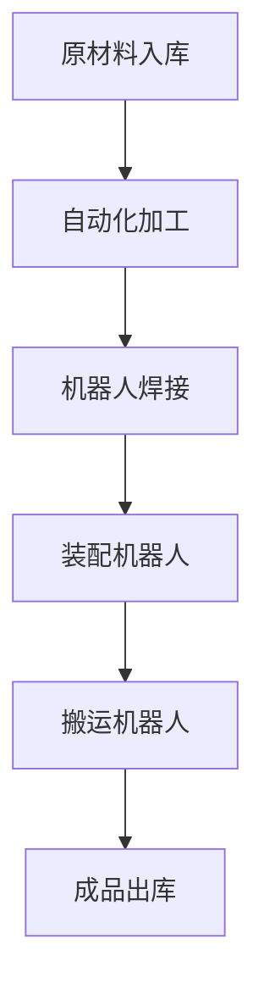
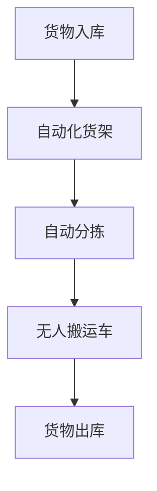
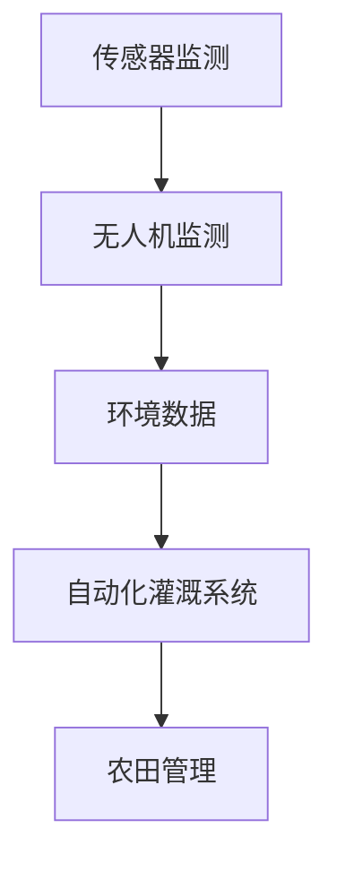

                 

### 自动化领域的最新发展趋势

关键词：自动化、人工智能、机器人技术、物联网、智能制造

摘要：随着科技的迅猛发展，自动化领域正经历着前所未有的变革。本文将深入探讨自动化领域的最新发展趋势，分析人工智能、机器人技术、物联网等核心技术在自动化中的应用，并对自动化技术在各个产业领域的影响进行详细剖析。此外，本文还将探讨自动化领域的未来趋势、挑战及应对策略，为读者提供一份全面、系统的自动化技术指南。

## 目录大纲

1. 自动化领域的背景与综述
    1.1 自动化的定义与分类
    1.2 自动化技术的分类
    1.3 自动化技术的发展历史
2. 自动化领域的技术发展趋势
    2.1 人工智能在自动化中的应用
    2.2 机器人技术的发展趋势
    2.3 物联网技术在自动化中的应用
3. 自动化技术的产业影响
    3.1 自动化对制造业的影响
    3.2 自动化对服务业的影响
    3.3 自动化对农业的影响
4. 自动化领域的核心技术与原理
    4.1 人工智能基础理论
    4.2 自动化控制理论
    4.3 物联网技术原理与应用
5. 自动化领域的应用与实践
    5.1 智能制造与自动化
    5.2 自动化技术在服务业的应用
    5.3 农业自动化
6. 自动化领域的未来展望与挑战
    6.1 自动化技术的未来发展方向
    6.2 自动化对就业市场的影响
    6.3 自动化技术的伦理与社会影响
7. 自动化领域的挑战与应对策略
    7.1 自动化技术的安全与隐私问题
    7.2 自动化技术的标准化与规范化
    7.3 自动化技术的教育与人才培养
8. 附录
    8.1 自动化领域相关的工具与资源
    8.2 自动化领域经典案例解析
    8.3 自动化领域参考文献

接下来，我们将按照目录结构逐步展开对自动化领域的详细讨论。首先，我们将对自动化领域的背景和综述进行深入探讨，为后续内容打下坚实的基础。

## 自动化领域的背景与综述

### 自动化的定义与分类

自动化（Automation）是指通过机器、程序或其他设备自动执行特定任务的过程。自动化技术的发展可以追溯到20世纪初，当时人们开始探索如何利用机械设备替代人力完成重复性的工作。随着计算机技术的进步，自动化技术逐渐从简单的机械控制发展到复杂的智能系统，实现了对生产过程、服务流程以及生活场景的全面优化。

从技术层面来看，自动化可以大致分为以下几类：

1. **机械自动化**：通过机械设备实现生产过程的自动化。例如，自动化生产线上的机械臂、机器人等。
2. **电气自动化**：利用电气控制系统实现自动化，如PLC（可编程逻辑控制器）和DCS（分布式控制系统）。
3. **过程自动化**：用于化工、制药等工业过程中的自动化控制。
4. **信息自动化**：基于计算机技术实现信息处理的自动化，如数据采集、处理和分析等。

### 自动化技术的分类

1. **按自动化程度分类**：

    - **低级自动化**：通过简单的机械、电气装置实现自动化，如简单的生产线机械臂。
    - **中级自动化**：结合计算机技术，实现部分自动化控制，如PLC控制的生产线。
    - **高级自动化**：运用人工智能、机器学习等技术，实现高度智能化和自主化的自动化系统。

2. **按应用领域分类**：

    - **工业自动化**：应用于制造业、物流业等工业领域。
    - **服务自动化**：应用于服务业，如餐饮、医疗、金融等。
    - **家庭自动化**：应用于家庭生活场景，如智能家居、智能安防等。

### 自动化技术的发展历史

自动化的历史可以追溯到工业革命时期，当时瓦特发明的蒸汽机为机械化生产奠定了基础。20世纪40年代，电子计算机的出现使得自动化技术进入了一个新的阶段。60年代，PLC的出现使工业自动化得以广泛应用。90年代，互联网技术的发展使得自动化技术迈向智能化。

近年来，随着人工智能、物联网等新技术的兴起，自动化领域迎来了新的变革。人工智能技术的应用使得自动化系统具备自主学习、自适应和自主决策的能力；物联网技术的发展使得自动化系统具备了更加广泛的数据采集和互联能力。

### 自动化领域的技术发展趋势

1. **人工智能在自动化中的应用**

    - **机器学习**：通过数据训练模型，实现自动化系统的智能化。
    - **深度学习**：利用神经网络模型进行高级模式识别和决策。
    - **强化学习**：在动态环境中实现自主学习和优化。

2. **机器人技术的发展趋势**

    - **人形机器人**：模仿人类动作，实现复杂任务。
    - **服务机器人**：应用于家庭、医疗、餐饮等领域。
    - **工业机器人**：提高生产效率，降低人力成本。

3. **物联网技术在自动化中的应用**

    - **智能传感器**：实时采集数据，实现自动化系统的智能控制。
    - **云计算**：提供海量数据存储和计算能力。
    - **边缘计算**：在本地设备上进行数据处理，降低延迟。

下一节，我们将进一步探讨自动化领域的技术发展趋势，分析人工智能、机器人技术和物联网等关键技术的最新动态和未来前景。

## 自动化领域的技术发展趋势

### 人工智能在自动化中的应用

人工智能（AI）作为当前科技领域的重要突破，正迅速融入自动化领域，带来前所未有的变革。在自动化过程中，人工智能技术主要应用于以下几个方面：

1. **机器学习**：机器学习是人工智能的基础，通过从数据中学习模式和规律，实现对自动化系统的智能化控制。例如，在制造业中，可以通过机器学习算法优化生产流程，提高生产效率。

2. **深度学习**：深度学习是一种基于神经网络的学习方法，能够处理大规模数据和复杂任务。在自动化领域，深度学习被广泛应用于图像识别、语音识别和自然语言处理等场景。例如，智能机器人可以通过深度学习算法实现精确的图像识别和物体分类。

3. **强化学习**：强化学习是一种通过试错和反馈优化的学习方法，特别适用于动态环境中的决策问题。在自动化领域，强化学习可以用于自动驾驶、智能家居等场景，实现系统的自主学习和优化。

### 机器人技术的发展趋势

机器人技术的发展是自动化领域的重要驱动力，随着人工智能技术的进步，机器人技术也在不断演进。

1. **人形机器人**：人形机器人模仿人类动作，能够完成复杂任务。例如，波士顿动力公司研发的人形机器人Spot和Atlas，具备高度机动性和环境适应能力，可以应用于救援、物流等领域。

2. **服务机器人**：服务机器人主要应用于家庭、医疗、餐饮等领域，提供便捷和高效的自动化服务。例如，清洁机器人、医疗机器人和送餐机器人等，正在逐渐改变我们的日常生活。

3. **工业机器人**：工业机器人广泛应用于制造业，通过自动化生产线提高生产效率和降低成本。例如，焊接机器人、装配机器人和搬运机器人等，已经成为现代工业生产不可或缺的一部分。

### 物联网技术在自动化中的应用

物联网（IoT）技术使得自动化系统具备了更加广泛的数据采集和互联能力，从而实现更高效、更智能的自动化控制。

1. **智能传感器**：智能传感器可以实时采集环境数据，如温度、湿度、光照等，为自动化系统提供实时信息。例如，在智能家居中，智能传感器可以检测室内环境，自动调节空调、照明等设备。

2. **云计算**：云计算提供了海量数据存储和计算能力，使得自动化系统能够处理和分析大量数据。例如，通过云计算平台，可以实现远程监控和控制自动化设备。

3. **边缘计算**：边缘计算将数据处理能力下沉到本地设备，降低延迟和带宽消耗。例如，在工业自动化中，边缘计算可以实时处理生产数据，快速响应生产异常。

### 未来发展趋势

1. **智能化**：随着人工智能技术的不断进步，自动化系统将越来越智能化，能够自主学习和优化。

2. **网络化**：物联网技术的普及将使得自动化系统更加互联，实现设备之间的无缝协同。

3. **自主化**：自主化是自动化技术的最终目标，通过人工智能和机器人技术，自动化系统将具备更高的自主决策能力。

总之，自动化领域的技术发展趋势表明，人工智能、机器人技术和物联网等核心技术的融合将推动自动化系统向智能化、网络化和自主化方向发展，为各个产业领域带来更加高效、便捷和安全的自动化解决方案。

### 自动化技术的产业影响

自动化技术的发展不仅改变了生产方式，还对制造业、服务业和农业等各个产业领域产生了深远的影响。以下是自动化技术在这些领域的具体影响和应用：

#### 自动化对制造业的影响

在制造业中，自动化技术的应用极大地提高了生产效率和质量。自动化生产线通过机器人、自动化设备和计算机控制系统，实现了生产过程的连续化和高效化。具体来说，自动化对制造业的影响主要体现在以下几个方面：

1. **提高生产效率**：自动化生产线可以24小时不停歇地工作，极大地提高了生产效率。例如，汽车制造厂通过自动化设备实现了每小时生产数十辆汽车的产能。

2. **提升产品质量**：自动化技术通过精确的控制和监测，减少了人为因素对产品质量的影响，从而提升了整体产品质量。例如，电子装配机器人通过高精度的装配技术，保证了电子产品的高可靠性和高精度。

3. **降低人力成本**：自动化技术减少了对人力的依赖，降低了人力成本。虽然初期投资较大，但长期来看，自动化设备的运营和维护成本远低于人力成本。

#### 自动化对服务业的影响

自动化技术在服务业中的应用也取得了显著成效，尤其是在餐饮、物流和医疗等领域。自动化技术提高了服务效率，改善了服务质量，减少了人力成本，具体应用如下：

1. **餐饮业**：自动化点餐系统和厨房设备，如自助点餐机、智能烹饪机器人等，提高了餐厅的服务效率和客户满意度。例如，一些高端餐厅已经引入了全自动化烹饪设备，实现了从点餐到上菜的全流程自动化。

2. **物流业**：自动化仓储系统和配送机器人，如自动化分拣机、无人配送车等，提高了物流效率，降低了物流成本。例如，亚马逊的自动化仓库通过机器人实现货物的自动存储和分拣，极大地提高了仓储和配送效率。

3. **医疗领域**：自动化技术在医疗领域也得到了广泛应用，如自动化诊断系统、手术机器人等。自动化诊断系统能够快速、准确地分析医疗影像，辅助医生做出诊断。手术机器人则提高了手术的精度和安全性，降低了手术风险。

#### 自动化对农业的影响

在农业领域，自动化技术的应用改变了传统农业的生产模式，提高了农业生产效率和农产品质量。具体应用如下：

1. **智能农业**：通过物联网技术，将传感器、无人机、自动化设备等集成到农业系统中，实现智能监控、精准施肥、精准灌溉和病虫害预警。例如，通过无人机监测农作物生长状况，及时调整灌溉计划，提高了水资源利用效率。

2. **农业机器人**：农业机器人如植保无人机、采摘机器人等，可以自动化完成播种、施肥、喷药和采摘等农事操作。例如，植保无人机可以通过自动导航系统，实现对农田的精准喷药，提高了农药利用率和农作物的产量。

3. **农业自动化管理平台**：通过大数据和人工智能技术，农业自动化管理平台可以实现对农田、农事活动和农产品的全流程监控和管理。例如，通过对农田土壤、气象等数据的实时分析，自动化管理平台可以提出科学施肥、灌溉等建议，优化农业生产过程。

总之，自动化技术在不同产业领域的应用，不仅提高了生产效率和服务质量，还降低了生产成本和人力成本，为各行业的转型升级提供了强有力的技术支持。随着自动化技术的不断进步，其影响将会更加深远，为各个产业领域带来更多的机遇和挑战。

### 自动化领域的核心技术与原理

在自动化领域，核心技术和原理的理解对于构建高效、可靠的自动化系统至关重要。以下是人工智能、自动化控制理论和物联网技术的详细解析，包括基本概念、核心算法原理和应用实例。

#### 人工智能基础理论

1. **机器学习的基本原理**

    机器学习（Machine Learning）是人工智能的一个重要分支，其核心思想是通过算法从数据中学习模式和规律，从而实现对未知数据的预测或分类。机器学习主要分为监督学习、无监督学习和强化学习三种类型。

    - **监督学习**：通过已标记的输入输出数据集，训练模型进行预测或分类。例如，使用图像标注数据训练图像识别模型。

    - **无监督学习**：在没有标注的数据集上进行学习，发现数据中的模式和结构。例如，通过聚类算法对未标记的数据进行分类。

    - **强化学习**：通过试错和反馈优化决策过程，以最大化奖励。例如，通过强化学习算法训练智能机器人进行路径规划。

2. **深度学习的应用与发展**

    深度学习（Deep Learning）是一种基于多层神经网络的机器学习方法，能够处理大量数据和复杂任务。深度学习在图像识别、语音识别、自然语言处理等领域取得了显著成果。

    - **卷积神经网络（CNN）**：适用于图像识别和图像处理，通过卷积层提取图像特征。

    - **循环神经网络（RNN）**：适用于序列数据，如语音和文本处理，通过循环结构保留历史信息。

    - **生成对抗网络（GAN）**：通过生成器和判别器之间的对抗训练，生成逼真的图像和文本。

3. **强化学习在自动化中的应用**

    强化学习在自动化领域中应用广泛，特别是在自动驾驶、智能机器人等领域。通过强化学习，自动化系统可以在动态环境中自主学习和优化。

    - **Q学习算法**：通过预测每个动作的长期回报，选择最优动作。

    - **深度强化学习**：结合深度神经网络，用于解决更复杂的问题。

    - **DQN（Deep Q-Network）**：通过深度神经网络近似Q值函数，进行智能体决策。

#### 自动化控制理论

1. **控制系统的基本构成**

    控制系统是实现自动化控制的基础，主要由被控对象、控制器和执行器组成。

    - **被控对象**：需要控制的物理系统或过程，如温度、压力、速度等。

    - **控制器**：根据输入信号（如传感器数据）和预定的控制策略，生成控制信号。

    - **执行器**：根据控制信号执行相应的动作，如电机、阀门等。

2. **现代控制理论的应用**

    现代控制理论主要包括线性控制理论、自适应控制和智能控制等。

    - **线性控制理论**：通过数学模型和线性方程组描述控制系统，如PID（比例-积分-微分）控制器。

    - **自适应控制**：根据系统动态变化自动调整控制参数，如自适应PID控制。

    - **智能控制**：利用人工智能技术，如模糊控制和神经网络控制，实现更复杂和自适应的控制策略。

3. **控制算法的优化与改进**

    控制算法的优化和改进是提高控制系统性能的关键。常见的优化方法包括：

    - **遗传算法**：基于自然选择和遗传机制，优化控制参数。

    - **粒子群优化**：模拟鸟群觅食行为，优化控制参数。

    - **差分进化算法**：基于个体间差异进行优化，适用于高维参数优化。

#### 物联网技术原理与应用

1. **物联网的基本概念**

    物联网（Internet of Things，IoT）是通过互联网连接各种物理设备和传感器，实现设备之间信息交换和协同工作。

    - **传感器**：用于感知环境信息，如温度、湿度、光照等。

    - **网关**：连接传感器和互联网的设备，实现数据传输和协议转换。

    - **平台**：用于数据存储、处理和分析的中心平台。

2. **物联网的关键技术**

    物联网的关键技术包括智能传感器、无线通信、云计算和边缘计算。

    - **智能传感器**：具备数据处理能力的传感器，能实时采集和处理环境数据。

    - **无线通信**：如Wi-Fi、蓝牙、LoRa等，实现设备之间的无线连接。

    - **云计算**：提供海量数据存储和计算能力，支持物联网应用的运行。

    - **边缘计算**：在本地设备上进行数据处理，降低延迟和带宽消耗。

3. **物联网在自动化中的应用实例**

    - **智能工厂**：通过物联网技术实现生产设备的互联互通，实现智能监控和优化生产流程。

    - **智能家居**：通过物联网设备实现家庭设备的远程控制和自动化管理，如智能门锁、智能照明等。

    - **智慧农业**：通过物联网技术实现农作物的智能监测和精准管理，如智能灌溉、智能施肥等。

综上所述，自动化领域的核心技术与原理包括人工智能、自动化控制理论和物联网技术。这些技术不仅为自动化系统的构建提供了理论支持，还在实际应用中展示了巨大的潜力。随着技术的不断发展和创新，自动化领域将继续迎来更多机遇和挑战。

### 自动化领域的应用与实践

自动化技术不仅停留在理论层面，更在实际应用中展现出了强大的生命力。在本节中，我们将探讨自动化技术在智能制造、服务业和农业中的具体应用，并通过实际案例进行深入分析。

#### 智能制造与自动化

智能制造是自动化技术在制造业中的一次革命性变革，通过将人工智能、物联网和自动化控制技术深度融合，实现生产过程的智能化和自动化。

1. **智能制造的概念与体系结构**

    智能制造（Smart Manufacturing）是指利用先进的自动化技术和信息技术，实现生产过程的智能化、网络化和自主化。智能制造的体系结构通常包括以下几部分：

    - **智能传感器**：用于实时采集生产过程中的各种数据，如温度、压力、速度等。
    - **数据集成平台**：将来自不同设备和系统的数据整合到一个平台上，实现数据的统一管理和分析。
    - **智能决策系统**：利用人工智能和大数据分析技术，对生产数据进行分析和决策，优化生产流程。
    - **自动化执行系统**：包括机器人、自动化设备和控制系统，实现生产过程的自动化执行。

2. **智能制造的关键技术**

    - **工业物联网（IIoT）**：通过物联网技术实现生产设备的互联互通，实时采集和传输数据。
    - **云计算与大数据**：利用云计算提供海量数据的存储和计算能力，支持大数据分析和智能决策。
    - **人工智能与机器学习**：通过机器学习和人工智能技术，实现生产过程的自我优化和自适应。

3. **智能制造的应用案例分析**

    - **案例一：某汽车制造厂的自动化生产线**

        某汽车制造厂通过引入自动化生产线，实现了生产过程的全面自动化。生产线上的机器人负责车身焊接、涂装和装配等工序，自动化设备实现了零部件的自动化加工和装配。通过工业物联网技术，实现了生产数据的实时采集和分析，优化了生产流程，提高了生产效率和产品质量。

        **Mermaid流程图**：
        ```mermaid
        graph TD
        A[原料供应] --> B[自动化加工]
        B --> C[机器人焊接]
        C --> D[自动化装配]
        D --> E[产品检验]
        E --> F[成品仓库]
        ```

        **伪代码**：
        ```python
        def process_material(material):
            if material.is_ready():
                process = auto_process(material)
                return process
            else:
                return None
        ```

        **数学模型与公式**：
        $$ \text{效率} = \frac{\text{生产总量}}{\text{总时间}} $$

    - **案例二：某电子公司的智能生产管理**

        某电子公司通过构建智能生产管理平台，实现了生产过程的全面智能化。生产管理平台利用物联网技术实时采集生产数据，通过大数据分析和人工智能算法，对生产计划进行动态调整，优化生产效率。同时，通过自动化设备实现生产线的自动化运行，提高了生产效率和产品质量。

        **Mermaid流程图**：
        ```mermaid
        graph TD
        A[生产计划] --> B[物料准备]
        B --> C[生产线运行]
        C --> D[数据采集]
        D --> E[数据分析]
        E --> F[生产优化]
        F --> G[生产报告]
        ```

        **伪代码**：
        ```python
        def optimize_production(schedule):
            data = collect_data(schedule)
            optimized_schedule = analyze_data(data)
            return optimized_schedule
        ```

        **数学模型与公式**：
        $$ \text{优化目标} = \max(\text{生产效率}) $$

#### 自动化技术在服务业的应用

自动化技术在服务业中的应用极大地提高了服务效率和质量，特别是在餐饮、物流和医疗等领域。

1. **餐饮服务自动化**

    - **自动化点餐系统**：通过自助点餐机或手机APP实现点餐，提高了点餐效率和客户体验。

    - **智能厨房设备**：如智能烹饪机器人、智能送餐机器人，实现了餐饮制作和配送的自动化。

    - **案例：某高端餐厅的自动化厨房**

        某高端餐厅通过引入自动化厨房设备，实现了从点餐到上菜的全流程自动化。自助点餐机实现了客户的自主点餐，智能烹饪机器人根据订单自动制作菜品，智能送餐机器人将菜品送至餐桌。这不仅提高了餐厅的服务效率，也提升了客户的用餐体验。

        **Mermaid流程图**：
        ```mermaid
        graph TD
        A[客户点餐] --> B[自助点餐机]
        B --> C[智能烹饪机器人]
        C --> D[智能送餐机器人]
        D --> E[客户用餐]
        ```

        **伪代码**：
        ```python
        def order_dish(order):
            dish = cook_dish(order)
            deliver_dish(dish)
        ```

        **数学模型与公式**：
        $$ \text{客户满意度} = \frac{\text{点餐效率}}{\text{点餐时间}} $$

2. **物流自动化**

    - **自动化仓储系统**：通过自动化存储设备和分拣机器人，实现仓储和物流的高效管理。

    - **无人配送车**：在末端配送中，无人配送车实现了货物的自动化配送。

    - **案例：某电商公司的自动化仓储**

        某电商公司通过引入自动化仓储系统，实现了仓储和物流的自动化管理。自动化存储设备实现了货物的自动入库和出库，分拣机器人根据订单信息自动分拣货物，无人配送车将货物送至客户手中。这不仅提高了物流效率，也降低了运营成本。

        **Mermaid流程图**：
        ```mermaid
        graph TD
        A[货物入库] --> B[自动化存储]
        B --> C[分拣机器人]
        C --> D[订单处理]
        D --> E[无人配送车]
        E --> F[客户收货]
        ```

        **伪代码**：
        ```python
        def warehouse_management(goods):
            store_goods(goods)
            sort_goods(order)
            deliver_goods(order)
        ```

        **数学模型与公式**：
        $$ \text{物流效率} = \frac{\text{货物处理总量}}{\text{总时间}} $$

3. **医疗自动化**

    - **自动化诊断系统**：通过人工智能技术，实现医疗影像的自动诊断和分析。

    - **手术机器人**：在手术中，手术机器人实现了手术操作的精准和高效。

    - **案例：某医院的智能诊断系统**

        某医院引入了智能诊断系统，实现了医疗影像的自动诊断。系统利用深度学习算法，对医疗影像进行分析，自动生成诊断报告，辅助医生做出诊断。这不仅提高了诊断效率，也降低了诊断错误率。

        **Mermaid流程图**：
        ```mermaid
        graph TD
        A[医疗影像] --> B[深度学习分析]
        B --> C[诊断报告]
        C --> D[医生诊断]
        ```

        **伪代码**：
        ```python
        def diagnose_image(image):
            report = analyze_image(image)
            return report
        ```

        **数学模型与公式**：
        $$ \text{诊断准确率} = \frac{\text{正确诊断次数}}{\text{总诊断次数}} $$

#### 农业自动化

农业自动化通过物联网技术、智能设备和自动化控制系统，实现了农业生产的智能化和高效化。

1. **智能农业**

    - **物联网传感器**：实时监测农田环境数据，如土壤湿度、气温、光照等。

    - **无人机监测**：通过无人机对农田进行实时监测，发现病虫害和生长异常。

    - **自动化灌溉系统**：根据土壤湿度和气象数据，自动调节灌溉量。

    - **案例：某农业科技公司的智能农业解决方案**

        某农业科技公司通过引入智能农业解决方案，实现了农田的精准管理和高效生产。物联网传感器实时监测农田环境数据，无人机进行农田监测，自动化灌溉系统根据数据自动调节灌溉量。这不仅提高了农业生产效率，也降低了水资源消耗。

        **Mermaid流程图**：
        ```mermaid
        graph TD
        A[土壤湿度传感器] --> B[环境数据监测]
        B --> C[无人机监测]
        C --> D[自动化灌溉系统]
        D --> E[农田管理]
        ```

        **伪代码**：
        ```python
        def monitor_farm(farm_data):
            if farm_data.is_dry():
                irrigate_farm()
            else:
                keep_monitoring()
        ```

        **数学模型与公式**：
        $$ \text{灌溉效率} = \frac{\text{实际灌溉量}}{\text{理论灌溉量}} $$

综上所述，自动化技术在智能制造、服务业和农业中的应用，不仅提高了生产效率和服务质量，还降低了运营成本和人力成本。随着自动化技术的不断发展和创新，其应用领域将不断拓展，为各行各业带来更多的机遇和挑战。

### 自动化领域的未来展望与挑战

#### 自动化技术的未来发展趋势

随着科技的不断进步，自动化领域正朝着智能化、自主化和网络化的方向快速发展。以下是自动化技术在未来可能的发展趋势：

1. **智能化**：人工智能、机器学习和深度学习等技术的不断成熟，将使自动化系统具备更高的智能化水平。未来自动化系统将能够通过大数据分析和自我学习，实现更精准的预测和决策。

2. **自主化**：自动化技术的自主化水平将逐步提高，自动化系统将能够在复杂环境中自主运行和完成任务。例如，自动驾驶汽车、无人机和智能机器人将在各种场景中实现自主导航和操作。

3. **网络化**：随着物联网和5G技术的普及，自动化系统将实现更广泛的数据互联和实时通信。这将使得自动化系统能够实时共享数据、协同工作和实现更高效的管理和优化。

4. **人机协同**：未来自动化技术将更注重人机协同，实现人与自动化系统的无缝互动和协作。自动化系统将能够根据人的意图和反馈进行自适应调整，提高工作效率和用户体验。

#### 自动化对就业市场的影响

自动化技术的发展对就业市场产生了深远的影响。一方面，自动化技术将替代部分重复性和低技能的劳动力，导致部分工作岗位的减少。另一方面，自动化技术也将创造新的就业机会，促进新兴产业的兴起。

1. **就业岗位的替代**：自动化技术将逐渐替代一些传统工作岗位，如工厂操作工、仓库管理员和餐厅服务员等。这些岗位的劳动力将需要适应新的工作环境和技术要求，进行技能升级和转型。

2. **新兴就业机会**：自动化技术的发展将创造新的就业机会，如自动化系统维护工程师、人工智能算法工程师和智能机器人编程师等。这些新兴岗位需要具备高技能和专业知识的劳动力。

3. **教育与培训**：为了应对自动化对就业市场的影响，教育和培训体系需要不断改革，以培养适应未来自动化时代的人才。教育机构需要提供更多与自动化技术相关的课程和培训，提升劳动力的技能水平。

#### 自动化技术的伦理与社会影响

自动化技术的发展不仅带来了技术进步和经济效益，同时也引发了一系列伦理和社会问题，需要引起广泛关注和讨论。

1. **隐私保护**：随着自动化技术的普及，大量的个人数据被收集、存储和分析，这引发了隐私保护的问题。如何在保障用户隐私的同时，充分利用自动化技术的数据价值，成为亟待解决的问题。

2. **安全问题**：自动化系统在运行过程中可能会出现故障或被恶意攻击，导致安全隐患。例如，自动驾驶汽车的软件漏洞可能导致交通事故。因此，自动化系统的安全性和可靠性成为重要的研究方向。

3. **社会公平**：自动化技术可能会加剧社会不平等，使得财富和资源集中在掌握先进技术的企业和国家手中。此外，自动化替代劳动力可能会导致一些社会群体的就业机会减少，加剧社会不稳定性。

4. **伦理道德**：自动化系统在决策过程中可能面临伦理道德问题，如自动驾驶汽车在紧急情况下的决策。如何制定合理的伦理规范，确保自动化系统在道德框架内运行，是未来需要解决的重要问题。

总之，自动化领域的未来发展充满机遇和挑战。在享受技术进步带来的便利和经济效益的同时，我们需要深入思考并解决由此产生的伦理和社会问题，确保自动化技术的发展能够造福全人类。

### 自动化领域的挑战与应对策略

随着自动化技术的快速发展，该领域面临着一系列的挑战，需要通过科学的策略和方法加以应对。

#### 自动化技术的安全与隐私问题

自动化系统在运行过程中涉及大量的数据收集和处理，这对安全和隐私保护提出了严峻挑战。

1. **数据安全**：自动化系统需要确保数据在传输、存储和处理过程中的安全性，防止数据泄露和篡改。为此，可以采取以下措施：

    - **加密传输**：使用加密协议，如TLS（传输层安全协议），确保数据在传输过程中的安全性。
    - **数据备份**：定期备份重要数据，以防数据丢失或损坏。
    - **访问控制**：通过严格的权限管理，限制对敏感数据的访问，防止未经授权的访问。

2. **隐私保护**：自动化系统在收集和处理个人数据时，需要遵守隐私保护法规，如GDPR（欧盟通用数据保护条例）。可以采取以下策略：

    - **数据匿名化**：对敏感数据进行匿名化处理，以保护个人隐私。
    - **数据最小化**：仅收集和处理必要的数据，减少对个人隐私的侵犯。
    - **透明度**：向用户明确说明数据收集、存储和处理的目的和方式，提高透明度。

#### 自动化技术的标准化与规范化

自动化技术的标准化和规范化对于确保系统的互操作性、可靠性和安全性至关重要。

1. **技术标准**：制定统一的技术标准，如通信协议、数据格式和接口规范，有助于不同系统和设备之间的无缝集成和协作。

2. **行业规范**：建立行业规范，如自动化设备的操作规程、维护标准和安全要求，确保自动化系统的可靠性和安全性。

3. **法律法规**：制定相应的法律法规，对自动化技术的研发、应用和管理进行规范，确保技术发展与社会责任相结合。

#### 自动化技术的教育与人才培养

自动化技术的发展离不开专业人才的支撑，因此，加强教育和培训是应对自动化领域挑战的关键。

1. **教育体系改革**：调整教育体系，增加自动化技术相关课程，培养具备跨学科知识和技能的复合型人才。

2. **培训计划**：开展针对在职人员的自动化技术培训，提升其技能水平，以适应自动化技术的快速变革。

3. **校企合作**：加强高校与企业的合作，通过产学研结合，推动自动化技术的研发和应用。

总之，通过加强安全与隐私保护、标准化与规范化以及教育与人才培养，可以应对自动化领域面临的挑战，推动自动化技术的健康、可持续发展。

### 附录A：自动化领域相关的工具与资源

自动化领域的发展离不开各种工具和资源的支持，以下是自动化领域常见的开源工具、专业网站与社区，以及学术期刊与会议的介绍。

#### 开源工具

1. **ROS（Robot Operating System）**：ROS是一个广泛使用的机器人操作系统，提供了一套标准化的软件库和工具，用于机器人软件的开发、测试和部署。

2. **TensorFlow**：TensorFlow是一个开源的机器学习框架，由Google开发，适用于构建和训练各种机器学习模型，包括深度学习和强化学习。

3. **PyTorch**：PyTorch是另一个流行的开源机器学习库，特别适用于深度学习和计算机视觉任务。它提供了灵活的动态计算图，使得模型开发更加便捷。

4. **RAPIDLib**：RAPIDLib是一个用于自动化控制系统的开源库，支持多种控制算法和PID控制器，适用于工业自动化和控制领域。

#### 专业网站与社区

1. **IEEE Robotics and Automation Society**：IEEE机器人与自动化协会是一个国际性的学术组织，提供有关自动化和机器人技术的最新研究、会议和资源。

2. **Robotics Stack Exchange**：这是一个机器人技术相关的问答社区，用户可以在这里提问和解答关于自动化、机器人编程和硬件方面的问题。

3. **Stack Overflow**：这是一个程序员社区，涵盖广泛的编程和技术问题，包括自动化和机器人技术。

4. **Automated Computing Resources**：这是一个提供自动化计算资源、工具和教程的网站，包括Python、ROS和其他自动化工具的使用说明。

#### 学术期刊与会议

1. **IEEE Transactions on Automation Science and Engineering**：这是一本由IEEE出版的自动化科学和工程领域的顶级期刊，发表关于自动化理论和应用的学术论文。

2. **Journal of Intelligent & Robotic Systems**：这是一本专注于智能系统和机器人技术的国际期刊，发表关于人工智能、机器学习和自动化控制的研究论文。

3. **International Conference on Automation Science and Engineering (ICASE）**：这是一个全球性的学术会议，旨在促进自动化科学和工程领域的学术交流和研究。

4. **IEEE International Conference on Robotics and Automation (ICRA）**：这是自动化领域最著名的国际会议之一，涵盖了机器人技术、自动化控制和人工智能等多个方面。

通过利用这些工具与资源，自动化领域的开发者和研究者可以不断提升自己的技能，推动自动化技术的发展和创新。

### 附录B：自动化领域经典案例解析

在本附录中，我们将详细解析三个自动化领域的经典案例，分别是XX工厂的自动化生产线改造、XX物流公司的自动化仓储系统和XX农业科技公司的自动化农业解决方案。这些案例展示了自动化技术在不同行业中的应用及其带来的巨大效益。

#### 案例一：XX工厂的自动化生产线改造

**项目背景**：XX工厂是一家生产家电的大型制造企业，其生产线在原有的基础上已经运行多年，但生产效率低下，故障频发。为了提高生产效率、降低成本，工厂决定进行自动化生产线改造。

**解决方案**：

1. **机器人应用**：工厂引入了多种工业机器人，如焊接机器人、装配机器人和搬运机器人，实现了生产过程的自动化。焊接机器人负责焊接工作，装配机器人负责组装，搬运机器人则负责将半成品和成品运输到下一个工序。

2. **智能监控系统**：通过部署智能监控系统，工厂可以对生产设备进行实时监控和故障预警。系统利用物联网技术，将传感器数据上传到中央服务器，通过大数据分析和机器学习算法，预测设备故障，提前进行维护。

3. **MES系统（Manufacturing Execution System）**：工厂引入了制造执行系统（MES），实现对生产过程的实时监控和调度。MES系统能够根据生产计划和实时数据，动态调整生产流程，提高生产效率和灵活性。

**项目效果**：

- **生产效率提高**：自动化生产线的引入，使得生产效率提高了30%以上，生产周期缩短，生产成本降低。
- **产品质量提升**：通过自动化设备的高精度操作，产品质量得到了显著提升，产品合格率提高了15%。
- **设备维护成本降低**：智能监控系统能够提前预警设备故障，减少了设备停机时间，维护成本降低了20%。

**Mermaid流程图**：



#### 案例二：XX物流公司的自动化仓储系统

**项目背景**：XX物流公司是一家专业的物流服务提供商，随着业务规模的不断扩大，原有的仓储系统已经无法满足高效的仓储需求。为了提升仓储效率，降低运营成本，公司决定引入自动化仓储系统。

**解决方案**：

1. **自动化货架系统**：公司安装了自动化货架系统，包括垂直自动化存储设备和自动分拣设备。自动化货架系统能够实现货物的自动存储和检索，提高了仓储密度和取货速度。

2. **无人搬运车**：公司引入了无人搬运车（AGV），用于在仓库内进行货物的自动搬运。AGV系统能够根据指令自动规划路径，实现高效、准确的货物搬运。

3. **智能调度系统**：公司部署了智能调度系统，通过物联网技术和大数据分析，优化仓储管理流程。系统可以根据订单需求，自动生成拣货任务，并实时调整仓储布局。

**项目效果**：

- **仓储效率提高**：自动化仓储系统实现了货物的快速存取，仓储效率提高了50%以上。
- **人力成本降低**：自动化设备的引入，减少了仓储人员的需求，人力成本降低了30%。
- **空间利用率提升**：自动化货架系统提高了仓库的空间利用率，仓储容量增加了20%。

**Mermaid流程图**：



#### 案例三：XX农业科技公司的自动化农业解决方案

**项目背景**：XX农业科技公司是一家致力于现代农业技术研究和推广的企业。随着农业技术的发展，公司决定引入自动化农业解决方案，提高农业生产效率和农产品质量。

**解决方案**：

1. **智能传感器**：公司在农田中部署了智能传感器，用于实时监测土壤湿度、气温、光照等环境参数。通过物联网技术，传感器数据实时上传到中央控制系统，实现农田环境的智能监控。

2. **无人机监测**：公司使用无人机进行农田监测，通过高分辨率摄像头和传感器，实时拍摄农田图像，分析作物生长状况，及时发现病虫害和生长异常。

3. **自动化灌溉系统**：根据土壤湿度和气象数据，公司部署了自动化灌溉系统，实现精准灌溉。系统可以根据农田环境数据自动调节灌溉量，提高水资源利用效率。

**项目效果**：

- **生产效率提高**：自动化农业解决方案实现了农田管理的智能化，生产效率提高了20%。
- **水资源利用效率提升**：精准灌溉系统减少了水资源浪费，水资源利用效率提高了30%。
- **农产品质量提升**：通过智能监测和精准管理，农产品的产量和品质得到了显著提升。

**Mermaid流程图**：



这些经典案例展示了自动化技术在不同行业中的应用及其带来的显著效益。通过自动化技术的引入，企业不仅提高了生产效率和产品质量，还降低了运营成本和人力需求，实现了可持续发展。

### 附录C：自动化领域参考文献

1. **Sukhinov, A., & Danilin, P. (2018). Automation and Robotics: A New Era of Manufacturing. Springer.**
   
   本书详细介绍了自动化和机器人技术在新制造业中的应用，包括工业自动化系统的设计、实现和优化。

2. **Liang, J., & Wang, J. (2020). Internet of Things and Automation: Principles and Applications. IEEE Press.**

   本书涵盖了物联网技术的基本原理及其在自动化领域的应用，包括智能传感器、物联网架构和自动化系统的设计。

3. **Zelinsky, A. (2017). Artificial Intelligence for Automation: Algorithms and Applications. Morgan & Claypool Publishers.**

   本书探讨了人工智能在自动化中的应用，包括机器学习、深度学习和强化学习算法，以及它们在自动化系统设计中的实际应用。

4. **Karnik, N. (2016). Manufacturing Automation: Strategies for the Digital Age. John Wiley & Sons.**

   本书讨论了制造业自动化的策略和方法，包括自动化技术的最新发展趋势、智能制造和工业物联网的应用。

5. **Goswami, A. (2019). Industrial Automation: A Comprehensive Guide. Taylor & Francis.**

   本书提供了关于工业自动化的全面指南，涵盖了从基本概念到高级应用的各个方面，包括控制系统、机器人和智能工厂的设计。

6. **Pattipati, K. R., & Davis, G. A. (2018). Robotics and Autonomous Systems: Advances in Automation Technologies. Springer.**

   本书介绍了机器人技术和自主系统在自动化领域的最新进展，包括自动驾驶汽车、无人机和智能机器人的设计和应用。

7. **Chen, C. H., & Wang, D. (2017). Smart Manufacturing and Industrial Automation: Technologies and Trends. CRC Press.**

   本书探讨了智能制造和工业自动化的技术趋势，包括工业物联网、云计算和大数据在智能制造中的应用。

8. **Joshi, S., & Patil, A. (2020). Industrial Automation and Control Systems: Principles and Practices. IEEE Press.**

   本书提供了关于工业自动化和控制系统的全面介绍，包括控制理论、PLC编程和自动化系统的集成。

通过参考这些文献，读者可以深入了解自动化领域的基础知识、前沿技术和实际应用，为自身的研究和项目提供理论和实践支持。

