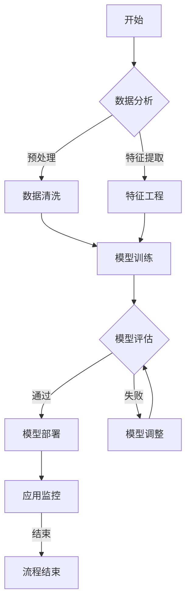

                 

### 第一部分：自象限洞察概述

#### 第1章：自象限与创业浪潮

在这个快速变化的时代，创业浪潮成为了全球经济的主要驱动力之一。无数创业者带着创新的理念和坚定的决心投身其中，以期在激烈的市场竞争中脱颖而出。然而，成功的创业并非偶然，而是需要创业者具备独特的洞察力和深思熟虑的战略规划。在这个过程中，“自象限洞察”成为了一种至关重要的能力。

**1.1 自象限的概念与特点**

**1.1.1 什么是自象限**

自象限，顾名思义，是指个体对自己的全面理解和掌控。它包括以下几个方面：

- **自我认知**：对自己能力、性格、兴趣和价值观的深刻认识。
- **自我掌控**：对时间、资源、情感和行为的管理和控制能力。
- **自我实现**：通过不断的努力和奋斗，实现个人目标和理想的过程。

自象限的内涵丰富且相互关联，共同构成了一个人在创业过程中所需的核心素质。

**1.1.2 自象限在创业中的重要性**

在创业浪潮中，自象限的重要性体现在以下几个方面：

- **方向指引**：创业者通过自我认知，可以明确自己的目标和方向，避免盲目跟风和迷失自我。
- **资源整合**：自我掌控能力使得创业者能够高效地管理时间和资源，提高创业成功率。
- **持续动力**：自我实现的过程为创业者提供了源源不断的动力和激情，使他们在面对困难和挑战时能够坚持不懈。

**1.1.3 自象限与其他创业理论的区别**

与传统创业理论不同，自象限更加注重个体的内在能力和自我发展。以下是自象限与其他创业理论的几个关键区别：

- **人本主义**：自象限强调个体在创业过程中的主体地位，关注人的全面发展。
- **系统思维**：自象限不仅关注创业过程中的单一因素，还强调各因素之间的相互作用和整体优化。
- **动态发展**：自象限认为创业是一个持续的过程，需要不断调整和优化，以适应环境变化。

**1.2 大模型的崛起**

**2.1 大模型的时代背景**

随着人工智能技术的快速发展，大模型（Large Models）逐渐成为研究热点。大模型是指拥有数亿甚至数十亿参数的深度学习模型，其能够通过大量数据进行自我学习和优化。大模型的崛起不仅改变了人工智能领域的格局，也为创业提供了新的机遇和挑战。

**2.1.1 人工智能的快速发展**

人工智能（AI）技术的快速发展为创业提供了广阔的空间。从早期的机器学习到现在的深度学习，人工智能在各个领域都取得了显著的进展。尤其是在语音识别、图像处理、自然语言处理等关键领域，人工智能已经取得了突破性的成果。

**2.1.2 大模型在AI中的地位**

大模型在人工智能中占据了重要地位。首先，大模型能够处理海量数据，使得机器学习过程更加高效。其次，大模型通过自我学习，能够不断提高自身的性能和智能化水平。这使得大模型在许多应用场景中都具有独特的优势。

**2.1.3 大模型创业的机遇与挑战**

大模型创业面临着诸多机遇和挑战。一方面，大模型的应用场景广泛，包括但不限于智能医疗、智能金融、智能交通等领域。这些领域蕴含着巨大的市场潜力，为创业者提供了广阔的发展空间。另一方面，大模型的技术门槛较高，需要创业者具备深厚的专业知识和经验。此外，数据隐私、伦理问题等也是大模型创业需要面对的挑战。

**2.2 大模型的技术原理**

**2.2.1 深度学习基础**

深度学习是构建大模型的核心技术。深度学习通过多层神经网络对数据进行特征提取和学习，能够实现对复杂任务的自动识别和预测。以下是深度学习的基础知识：

- **神经网络**：神经网络是深度学习的基本构建块，由多个神经元（或节点）组成。
- **前向传播与反向传播**：前向传播用于计算神经网络输出，反向传播用于更新网络参数。
- **激活函数**：激活函数用于引入非线性特性，使得神经网络能够处理非线性问题。

**2.2.2 自监督学习**

自监督学习是训练大模型的重要方法。自监督学习利用未标记的数据进行训练，通过自我监督的方式学习数据的分布和规律。以下是自监督学习的基础知识：

- **无监督学习**：无监督学习是指在没有标记数据的情况下，通过数据内在结构进行学习。
- **自编码器**：自编码器是一种典型的自监督学习模型，它通过编码和解码过程学习数据的特征。
- **预训练与微调**：预训练是指在大规模数据集上训练模型，微调是指在特定任务上进一步优化模型。

**2.2.3 迁移学习**

迁移学习是提高大模型性能的重要手段。迁移学习利用已有模型的知识迁移到新任务上，可以显著提高新任务的性能。以下是迁移学习的基础知识：

- **模型迁移**：模型迁移是指将一个模型的知识和结构迁移到另一个模型上。
- **预训练模型**：预训练模型是迁移学习的核心，它通过在大规模数据集上预训练，积累了丰富的知识。
- **微调与优化**：微调是指在新任务上进一步训练模型，优化模型的性能。

**2.3 大模型在创业中的应用**

**3.1 大模型在创业中的实际案例**

大模型在创业中的应用已经取得了显著的成果。以下是几个实际案例：

- **智能医疗**：利用大模型进行疾病诊断和治疗方案推荐，提高了医疗服务的效率和准确性。
- **智能金融**：利用大模型进行风险评估和投资决策，提高了金融行业的风险管理和盈利能力。
- **智能交通**：利用大模型进行交通流量预测和路径优化，提高了交通管理的效率和安全性。

**3.2 大模型在行业中的应用**

大模型在各个行业中都展现出了巨大的应用潜力。以下是几个典型行业：

- **制造业**：利用大模型进行生产过程优化和质量检测，提高了生产效率和产品质量。
- **零售业**：利用大模型进行消费者行为分析和需求预测，提高了营销效果和销售业绩。
- **服务业**：利用大模型进行客户服务优化和用户体验提升，提高了服务质量和客户满意度。

**3.3 大模型创业案例分析**

以下是一个大模型创业案例的分析：

- **创业项目背景**：某创业团队专注于利用大模型进行智能医疗诊断。
- **技术实现**：创业团队采用深度学习和迁移学习技术，构建了一个具有高准确率的大模型，用于疾病诊断。
- **市场前景**：随着智能医疗市场的快速增长，该创业项目具有广阔的市场前景。
- **挑战与机遇**：创业团队需要面对技术门槛、数据隐私和法规合规等挑战，同时也面临着巨大的市场机遇。

**3.4 大模型创业的影响**

大模型创业对经济、社会和技术发展产生了深远的影响。以下是几个方面的影响：

- **经济发展**：大模型创业推动了人工智能产业的发展，带动了相关产业链的繁荣。
- **社会进步**：大模型的应用提高了各行各业的效率和品质，为社会带来了福祉。
- **技术创新**：大模型创业推动了人工智能技术的创新和发展，为未来的技术进步奠定了基础。

**3.5 大模型创业的未来趋势**

大模型创业的未来趋势呈现出以下几个方向：

- **技术创新**：随着技术的不断进步，大模型的性能和功能将得到进一步提升。
- **行业应用**：大模型将在更多行业中得到广泛应用，推动行业的智能化转型。
- **国际合作**：大模型创业将走向全球化，促进国际间的技术交流和合作。

**3.6 大模型创业的风险与应对**

大模型创业面临着多种风险，包括技术风险、市场风险、法律风险等。以下是几种常见的风险和应对策略：

- **技术风险**：通过持续的技术研发和创新，提高技术水平和竞争力。
- **市场风险**：通过市场调研和精准定位，找到市场需求，降低市场风险。
- **法律风险**：遵守相关法律法规，确保创业项目的合法合规。

**3.7 大模型创业的成功因素**

大模型创业的成功取决于多种因素，包括团队实力、市场定位、技术优势等。以下是几个关键成功因素：

- **团队实力**：创业团队需要具备丰富的技术经验和市场洞察力。
- **市场定位**：找到市场需求，提供符合市场期望的产品和服务。
- **技术优势**：拥有领先的技术水平和创新能力，形成竞争优势。

**3.8 大模型创业的失败原因**

大模型创业失败的原因多种多样，包括以下几种：

- **技术不足**：技术实力不足，导致产品无法满足市场需求。
- **市场定位错误**：市场定位不准确，导致市场接受度低。
- **团队管理问题**：团队管理不善，导致项目进展缓慢或失败。

**3.9 大模型创业的经验与教训**

大模型创业的经验与教训对于其他创业者具有重要的启示作用。以下是几个关键经验：

- **持续创新**：技术创新是创业成功的核心，需要持续投入研发。
- **市场导向**：以市场需求为导向，提供有价值的产品和服务。
- **团队合作**：团队合作是创业成功的关键，需要建立高效的团队协作机制。

**3.10 大模型创业的未来展望**

大模型创业的未来充满希望，但也面临诸多挑战。以下是几个展望：

- **技术进步**：随着技术的不断发展，大模型的性能和功能将得到进一步提升。
- **市场机遇**：随着市场的不断扩大，大模型创业将迎来更多机遇。
- **国际合作**：国际合作将推动大模型创业的发展，促进全球技术交流。

通过上述分析，我们可以看到大模型创业在当前时代的重要性。创业者需要具备自象限洞察力，充分发挥大模型的优势，应对挑战，抓住机遇，实现创业的成功。自象限洞察力不仅帮助创业者明确目标和方向，还能够提高创业的效率和成功率。未来，大模型创业将继续蓬勃发展，为创业者带来更多的机会和挑战。让我们共同期待这个充满希望的未来！<|assistant|>
### 第一部分：自象限洞察概述

#### 第1章：自象限与创业浪潮

在当今这个快速变化的时代，创业浪潮席卷全球，吸引了无数有梦想、有激情的创业者投身其中。然而，成功的创业并非偶然，而是需要创业者具备独特的洞察力和深思熟虑的战略规划。在这个过程中，“自象限洞察”成为了一种至关重要的能力。

**1.1 自象限的概念与特点**

**1.1.1 什么是自象限**

自象限，顾名思义，是指个体对自己的全面理解和掌控。它包括以下几个方面：

- **自我认知**：对自己能力、性格、兴趣和价值观的深刻认识。
- **自我掌控**：对时间、资源、情感和行为的管理和控制能力。
- **自我实现**：通过不断的努力和奋斗，实现个人目标和理想的过程。

自象限的内涵丰富且相互关联，共同构成了一个人在创业过程中所需的核心素质。

**1.1.2 自象限在创业中的重要性**

在创业浪潮中，自象限的重要性体现在以下几个方面：

- **方向指引**：创业者通过自我认知，可以明确自己的目标和方向，避免盲目跟风和迷失自我。
- **资源整合**：自我掌控能力使得创业者能够高效地管理时间和资源，提高创业成功率。
- **持续动力**：自我实现的过程为创业者提供了源源不断的动力和激情，使他们在面对困难和挑战时能够坚持不懈。

**1.1.3 自象限与其他创业理论的区别**

与传统创业理论不同，自象限更加注重个体的内在能力和自我发展。以下是自象限与其他创业理论的几个关键区别：

- **人本主义**：自象限强调个体在创业过程中的主体地位，关注人的全面发展。
- **系统思维**：自象限不仅关注创业过程中的单一因素，还强调各因素之间的相互作用和整体优化。
- **动态发展**：自象限认为创业是一个持续的过程，需要不断调整和优化，以适应环境变化。

**1.2 大模型的崛起**

**2.1 大模型的时代背景**

随着人工智能技术的快速发展，大模型（Large Models）逐渐成为研究热点。大模型是指拥有数亿甚至数十亿参数的深度学习模型，其能够通过大量数据进行自我学习和优化。大模型的崛起不仅改变了人工智能领域的格局，也为创业提供了新的机遇和挑战。

**2.1.1 人工智能的快速发展**

人工智能（AI）技术的快速发展为创业提供了广阔的空间。从早期的机器学习到现在的深度学习，人工智能在各个领域都取得了显著的进展。尤其是在语音识别、图像处理、自然语言处理等关键领域，人工智能已经取得了突破性的成果。

**2.1.2 大模型在AI中的地位**

大模型在人工智能中占据了重要地位。首先，大模型能够处理海量数据，使得机器学习过程更加高效。其次，大模型通过自我学习，能够不断提高自身的性能和智能化水平。这使得大模型在许多应用场景中都具有独特的优势。

**2.1.3 大模型创业的机遇与挑战**

大模型创业面临着诸多机遇和挑战。一方面，大模型的应用场景广泛，包括但不限于智能医疗、智能金融、智能交通等领域。这些领域蕴含着巨大的市场潜力，为创业者提供了广阔的发展空间。另一方面，大模型的技术门槛较高，需要创业者具备深厚的专业知识和经验。此外，数据隐私、伦理问题等也是大模型创业需要面对的挑战。

**2.2 大模型的技术原理**

**2.2.1 深度学习基础**

深度学习是构建大模型的核心技术。深度学习通过多层神经网络对数据进行特征提取和学习，能够实现对复杂任务的自动识别和预测。以下是深度学习的基础知识：

- **神经网络**：神经网络是深度学习的基本构建块，由多个神经元（或节点）组成。
- **前向传播与反向传播**：前向传播用于计算神经网络输出，反向传播用于更新网络参数。
- **激活函数**：激活函数用于引入非线性特性，使得神经网络能够处理非线性问题。

**2.2.2 自监督学习**

自监督学习是训练大模型的重要方法。自监督学习利用未标记的数据进行训练，通过自我监督的方式学习数据的分布和规律。以下是自监督学习的基础知识：

- **无监督学习**：无监督学习是指在没有标记数据的情况下，通过数据内在结构进行学习。
- **自编码器**：自编码器是一种典型的自监督学习模型，它通过编码和解码过程学习数据的特征。
- **预训练与微调**：预训练是指在大规模数据集上训练模型，微调是指在特定任务上进一步优化模型。

**2.2.3 迁移学习**

迁移学习是提高大模型性能的重要手段。迁移学习利用已有模型的知识迁移到新任务上，可以显著提高新任务的性能。以下是迁移学习的基础知识：

- **模型迁移**：模型迁移是指将一个模型的知识和结构迁移到另一个模型上。
- **预训练模型**：预训练模型是迁移学习的核心，它通过在大规模数据集上预训练，积累了丰富的知识。
- **微调与优化**：微调是指在新任务上进一步训练模型，优化模型的性能。

**2.3 大模型在创业中的应用**

**3.1 大模型在创业中的实际案例**

大模型在创业中的应用已经取得了显著的成果。以下是几个实际案例：

- **智能医疗**：利用大模型进行疾病诊断和治疗方案推荐，提高了医疗服务的效率和准确性。
- **智能金融**：利用大模型进行风险评估和投资决策，提高了金融行业的风险管理和盈利能力。
- **智能交通**：利用大模型进行交通流量预测和路径优化，提高了交通管理的效率和安全性。

**3.2 大模型在行业中的应用**

大模型在各个行业中都展现出了巨大的应用潜力。以下是几个典型行业：

- **制造业**：利用大模型进行生产过程优化和质量检测，提高了生产效率和产品质量。
- **零售业**：利用大模型进行消费者行为分析和需求预测，提高了营销效果和销售业绩。
- **服务业**：利用大模型进行客户服务优化和用户体验提升，提高了服务质量和客户满意度。

**3.3 大模型创业案例分析**

以下是一个大模型创业案例的分析：

- **创业项目背景**：某创业团队专注于利用大模型进行智能医疗诊断。
- **技术实现**：创业团队采用深度学习和迁移学习技术，构建了一个具有高准确率的大模型，用于疾病诊断。
- **市场前景**：随着智能医疗市场的快速增长，该创业项目具有广阔的市场前景。
- **挑战与机遇**：创业团队需要面对技术门槛、数据隐私和法规合规等挑战，同时也面临着巨大的市场机遇。

**3.4 大模型创业的影响**

大模型创业对经济、社会和技术发展产生了深远的影响。以下是几个方面的影响：

- **经济发展**：大模型创业推动了人工智能产业的发展，带动了相关产业链的繁荣。
- **社会进步**：大模型的应用提高了各行各业的效率和品质，为社会带来了福祉。
- **技术创新**：大模型创业推动了人工智能技术的创新和发展，为未来的技术进步奠定了基础。

**3.5 大模型创业的未来趋势**

大模型创业的未来趋势呈现出以下几个方向：

- **技术创新**：随着技术的不断进步，大模型的性能和功能将得到进一步提升。
- **行业应用**：大模型将在更多行业中得到广泛应用，推动行业的智能化转型。
- **国际合作**：大模型创业将走向全球化，促进国际间的技术交流和合作。

**3.6 大模型创业的风险与应对**

大模型创业面临着多种风险，包括技术风险、市场风险、法律风险等。以下是几种常见的风险和应对策略：

- **技术风险**：通过持续的技术研发和创新，提高技术水平和竞争力。
- **市场风险**：通过市场调研和精准定位，找到市场需求，降低市场风险。
- **法律风险**：遵守相关法律法规，确保创业项目的合法合规。

**3.7 大模型创业的成功因素**

大模型创业的成功取决于多种因素，包括团队实力、市场定位、技术优势等。以下是几个关键成功因素：

- **团队实力**：创业团队需要具备丰富的技术经验和市场洞察力。
- **市场定位**：找到市场需求，提供符合市场期望的产品和服务。
- **技术优势**：拥有领先的技术水平和创新能力，形成竞争优势。

**3.8 大模型创业的失败原因**

大模型创业失败的原因多种多样，包括以下几种：

- **技术不足**：技术实力不足，导致产品无法满足市场需求。
- **市场定位错误**：市场定位不准确，导致市场接受度低。
- **团队管理问题**：团队管理不善，导致项目进展缓慢或失败。

**3.9 大模型创业的经验与教训**

大模型创业的经验与教训对于其他创业者具有重要的启示作用。以下是几个关键经验：

- **持续创新**：技术创新是创业成功的核心，需要持续投入研发。
- **市场导向**：以市场需求为导向，提供有价值的产品和服务。
- **团队合作**：团队合作是创业成功的关键，需要建立高效的团队协作机制。

**3.10 大模型创业的未来展望**

大模型创业的未来充满希望，但也面临诸多挑战。以下是几个展望：

- **技术进步**：随着技术的不断发展，大模型的性能和功能将得到进一步提升。
- **市场机遇**：随着市场的不断扩大，大模型创业将迎来更多机遇。
- **国际合作**：国际合作将推动大模型创业的发展，促进全球技术交流。

通过上述分析，我们可以看到大模型创业在当前时代的重要性。创业者需要具备自象限洞察力，充分发挥大模型的优势，应对挑战，抓住机遇，实现创业的成功。自象限洞察力不仅帮助创业者明确目标和方向，还能够提高创业的效率和成功率。未来，大模型创业将继续蓬勃发展，为创业者带来更多的机会和挑战。让我们共同期待这个充满希望的未来！<|assistant|>
### 第二部分：大模型的崛起

#### 第2章：大模型的时代背景

随着人工智能技术的迅猛发展，大模型（Large Models）已经成为科技领域的明星。大模型以其卓越的性能和广泛的应用前景，吸引了全球科技企业和研究机构的关注。那么，大模型为何能在短时间内崛起，成为时代背景下的焦点呢？

**2.1 人工智能的快速发展**

人工智能（AI）技术的快速发展为大模型的兴起奠定了基础。从早期的规则推理和知识表示，到现在的深度学习和生成对抗网络，人工智能已经取得了长足的进步。随着计算能力的提升和海量数据的积累，深度学习技术开始崭露头角，为人工智能的应用带来了革命性的变化。

**2.1.1 深度学习的基础**

深度学习是构建大模型的核心技术。它通过多层神经网络对数据进行特征提取和学习，能够实现对复杂任务的自动识别和预测。以下是深度学习的基础知识：

- **神经网络**：神经网络是深度学习的基本构建块，由多个神经元（或节点）组成。每个神经元都与其他神经元相连，并通过权重和偏置进行信息传递和计算。

  $$  
  \text{神经元输出} = \sigma(\text{权重} \cdot \text{输入} + \text{偏置})  
  $$

- **前向传播与反向传播**：前向传播用于计算神经网络输出，反向传播用于更新网络参数。在前向传播过程中，输入数据通过神经网络逐层传递，直到得到最终的输出。反向传播则是通过计算输出误差，反向传播误差到各个神经元的权重和偏置，以优化网络参数。

  $$  
  \text{误差} = \text{实际输出} - \text{预测输出}  
  $$

  $$  
  \text{权重更新} = \text{权重} - \text{学习率} \cdot \frac{\partial \text{误差}}{\partial \text{权重}}  
  $$

- **激活函数**：激活函数用于引入非线性特性，使得神经网络能够处理非线性问题。常见的激活函数包括sigmoid、ReLU和Tanh等。

  $$  
  \sigma(x) = \frac{1}{1 + e^{-x}}  
  $$

  $$  
  \text{ReLU}(x) = \max(0, x)  
  $$

**2.1.2 大模型的定义与特点**

大模型是指拥有数亿甚至数十亿参数的深度学习模型。与传统的中小型模型相比，大模型具有以下特点：

- **高参数数量**：大模型拥有大量参数，可以捕捉到数据中的复杂模式和规律，提高模型的预测能力。
- **海量数据需求**：大模型需要大量的数据来训练，以获得更好的泛化性能。
- **计算资源消耗**：大模型的训练和推理过程需要强大的计算资源，包括GPU和TPU等。
- **强适应性**：大模型可以在不同任务和领域之间迁移，实现跨领域的应用。

**2.2 大模型的应用领域**

大模型在多个领域取得了显著的成果，以下是一些典型的应用领域：

- **自然语言处理**：大模型在自然语言处理领域表现出色，包括文本分类、机器翻译、问答系统等。例如，GPT-3和BERT等大模型在语言理解和生成方面取得了重大突破。
- **计算机视觉**：大模型在图像识别、目标检测、图像生成等方面有着广泛的应用。例如，ImageNet竞赛中，大模型ResNet取得了领先的成绩。
- **语音识别**：大模型在语音识别领域取得了显著的进步，使得语音识别的准确率和速度得到了大幅提升。
- **推荐系统**：大模型在推荐系统中的应用可以大幅提高推荐的准确性和个性化程度。
- **医学诊断**：大模型在医学诊断领域具有巨大潜力，可以通过对大量医学数据的分析，提供准确的诊断和治疗方案。

**2.3 大模型的发展趋势**

随着技术的不断进步，大模型的发展趋势呈现出以下几个方向：

- **模型规模不断扩大**：随着计算资源和存储能力的提升，大模型的规模将不断增加，以应对更复杂的任务和更大的数据集。
- **多模态学习**：大模型将逐渐支持多模态数据的学习，如文本、图像、语音等，实现更全面的感知和理解能力。
- **强化学习**：大模型与强化学习技术的结合，将进一步提高模型在动态环境下的决策能力。
- **知识增强**：大模型将结合知识图谱和常识知识，提高模型的语义理解和推理能力。
- **可解释性和可解释性**：随着大模型的应用越来越广泛，提高模型的可解释性和可解释性将成为重要的研究方向。

**2.4 大模型创业的机遇与挑战**

大模型创业面临着诸多机遇和挑战。以下是一些关键点：

- **机遇**：大模型的应用前景广阔，创业者可以探索新的应用场景和商业模式，如智能医疗、金融科技、自动驾驶等。
- **挑战**：大模型创业需要大量的技术积累和资金投入，同时也面临着数据隐私、伦理问题等挑战。

总之，大模型的崛起是人工智能发展的重要里程碑，为创业者带来了巨大的机遇和挑战。通过深入理解大模型的技术原理和应用领域，创业者可以更好地把握时代脉搏，实现创业的成功。未来，大模型将继续在各个领域发挥重要作用，推动科技和产业的进步。让我们共同期待大模型创业的辉煌未来！<|assistant|>
### 第三部分：大模型在创业中的应用

#### 第3章：大模型在创业中的实际案例

大模型在创业中的应用已经取得了显著的成果，许多创业团队利用大模型的技术优势，在各个领域取得了突破性的进展。在本节中，我们将介绍几个大模型在创业中的实际案例，分析其技术实现、市场前景以及面临的挑战。

**3.1 企业级应用案例**

**案例一：智能医疗诊断平台**

一个创业团队开发了一个基于深度学习的大模型智能医疗诊断平台。该平台通过大量医学影像数据训练，实现了肺癌、乳腺癌等疾病的自动诊断。具体技术实现如下：

1. **数据收集与预处理**：团队收集了大量医学影像数据，包括CT扫描、MRI等，对数据进行清洗、标注和分割。
2. **模型构建与训练**：团队采用卷积神经网络（CNN）构建模型，通过迁移学习和自监督学习技术，提高了模型的训练效率和准确性。
3. **模型部署与优化**：团队将训练好的模型部署在云端，并提供API接口，方便医生和医疗机构进行实时诊断。

市场前景：

- **市场需求**：随着医疗信息化和智能化的推进，智能医疗诊断平台具有广阔的市场需求。
- **竞争格局**：虽然市场上已经有一些智能医疗诊断产品，但基于大模型的平台在性能和准确率上具有显著优势。

挑战：

- **数据隐私**：医疗数据涉及患者隐私，团队需要确保数据的安全性和合规性。
- **技术门槛**：大模型的训练和优化需要强大的计算资源和专业知识，团队需要持续投入研发。

**3.2 行业解决方案案例**

**案例二：智能交通流量预测系统**

一家创业公司利用大模型开发了一套智能交通流量预测系统，用于优化交通管理和减少拥堵。具体技术实现如下：

1. **数据收集与处理**：团队收集了历史交通流量数据、道路状况数据、天气预报数据等，对数据进行预处理和特征提取。
2. **模型构建与训练**：团队采用深度学习中的循环神经网络（RNN）和长短时记忆网络（LSTM）构建模型，通过迁移学习和数据增强技术，提高了模型的预测精度。
3. **模型部署与优化**：团队将训练好的模型部署在边缘计算设备上，实现实时交通流量预测和路径优化。

市场前景：

- **市场需求**：随着城市化进程的加快，智能交通解决方案市场需求巨大。
- **竞争格局**：市场上已有一些智能交通解决方案，但基于大模型的系统在预测准确率和实时性上具有优势。

挑战：

- **数据质量**：交通流量数据的准确性和完整性对模型性能至关重要，团队需要确保数据质量。
- **计算资源**：大模型的训练和部署需要大量的计算资源，团队需要合理分配资源。

**3.3 跨行业应用案例**

**案例三：智能金融风控系统**

一家创业公司开发了一个基于大模型的智能金融风控系统，用于识别和防范金融欺诈。具体技术实现如下：

1. **数据收集与处理**：团队收集了历史交易数据、用户行为数据、社交媒体数据等，对数据进行清洗、标注和特征提取。
2. **模型构建与训练**：团队采用图神经网络（Graph Neural Network，GNN）构建模型，通过迁移学习和数据增强技术，提高了模型的欺诈检测能力。
3. **模型部署与优化**：团队将训练好的模型部署在云端，并提供API接口，方便金融机构进行实时风控。

市场前景：

- **市场需求**：随着金融业务的复杂化，智能风控系统市场需求巨大。
- **竞争格局**：市场上已有一些智能风控产品，但基于大模型的系统在欺诈检测准确率和实时性上具有显著优势。

挑战：

- **数据隐私**：金融数据涉及用户隐私，团队需要确保数据的安全性和合规性。
- **算法透明性**：大模型的决策过程可能不透明，团队需要提高算法的透明性，增强用户信任。

通过以上案例，我们可以看到大模型在创业中的应用已经取得了显著成效。大模型为创业团队提供了强大的技术支持，帮助他们解决了复杂的问题，提高了产品的竞争力。然而，创业团队也面临着诸多挑战，需要不断优化技术、提高数据质量、确保数据安全和合规。在未来，大模型将继续在创业领域中发挥重要作用，为创业者带来更多的机遇和挑战。让我们共同期待大模型创业的辉煌未来！<|assistant|>
### 第四部分：创业者的自象限洞察力

#### 第4章：提升自象限洞察力的策略

在创业的过程中，自象限洞察力是创业者取得成功的关键因素之一。自象限洞察力不仅帮助创业者明确目标和方向，还能够提高创业的效率和成功率。本章节将讨论如何提升创业者的自象限洞察力，包括自我认知、自我掌控和自我实现三个方面。

**4.1 自我认知的技巧**

**4.1.1 反思与自我分析**

反思是自我认知的重要方法。创业者可以通过定期反思自己的行为、决策和表现，深入了解自己的优点和不足。以下是一些反思和自我分析的技巧：

1. **日记法**：每天记录自己的所思所感，包括成功的经验、失败的教训和遇到的问题。
2. **对话法**：与同事、朋友或导师进行深入的对话，听取他们的意见和建议。
3. **问卷调查**：设计问卷，收集客户的反馈和意见，了解自己在市场上的表现。
4. **心理测试**：参加心理测试，了解自己的性格、能力和兴趣爱好。

**4.1.2 提升自我认知的工具**

利用一些工具和资源，可以帮助创业者提升自我认知。以下是一些常用的工具：

1. **性格测试**：例如MBTI（Myers-Briggs Type Indicator）、DISC测试等，可以帮助创业者了解自己的性格特点。
2. **职业规划工具**：例如职业测评软件、职业兴趣量表等，可以帮助创业者找到适合自己的职业方向。
3. **学习平台**：例如Coursera、edX等在线学习平台，提供了丰富的自我提升课程。

**4.1.3 建立自我反馈机制**

自我反馈是自我认知的重要环节。创业者可以通过以下方式建立自我反馈机制：

1. **定期评估**：例如每周或每月评估自己的工作表现，设定目标和里程碑。
2. **关键绩效指标（KPI）**：设定关键绩效指标，衡量自己的进步和成果。
3. **360度评估**：邀请同事、下属和客户进行反馈，全面了解自己的工作表现。

**4.2 自我掌控的策略**

**4.2.1 时间管理与任务管理**

时间管理和任务管理是自我掌控的重要方面。以下是一些策略：

1. **优先级排序**：将任务按照重要性和紧急性进行排序，优先处理重要且紧急的任务。
2. **番茄工作法**：将工作时间分成25分钟的工作周期，每个周期后休息5分钟，提高工作效率。
3. **日历管理**：使用日历工具，合理安排时间和任务，避免时间冲突。
4. **提醒与通知**：设置提醒和通知，确保及时完成任务。

**4.2.2 决策制定与执行**

决策制定和执行是创业者自我掌控的重要环节。以下是一些策略：

1. **信息收集**：在做出决策前，充分收集相关信息，包括市场数据、竞争对手和客户需求等。
2. **风险评估**：评估决策可能带来的风险，制定应对措施。
3. **团队协作**：与团队成员进行充分讨论，集思广益，提高决策质量。
4. **执行力**：明确决策执行的时间表和责任人，确保决策能够得到有效执行。

**4.2.3 建立健康的自我掌控习惯**

健康的自我掌控习惯是创业者成功的关键。以下是一些建议：

1. **早起**：早起可以为自己创造更多的时间，提高工作效率。
2. **运动**：定期进行运动，保持身体健康，提高精神状态。
3. **学习**：持续学习新知识，提升自己的技能和知识水平。
4. **休息**：合理安排休息时间，避免过度劳累。

**4.3 自我实现的路径**

**4.3.1 设定清晰的目标**

自我实现的第一步是设定清晰的目标。以下是一些建议：

1. **长期目标**：设定明确的长期目标，例如职业规划、财富积累等。
2. **短期目标**：将长期目标分解为短期目标，例如每月、每季度、每年等。
3. **可衡量**：确保目标可衡量，以便评估进度和成果。
4. **具体明确**：目标要具体明确，避免模糊不清。

**4.3.2 跨越障碍与突破自我**

在实现目标的过程中，创业者会面临各种障碍。以下是一些策略：

1. **问题分析**：对遇到的障碍进行分析，找出根本原因。
2. **解决方案**：制定解决方案，尝试不同的方法。
3. **学习与成长**：从失败和挫折中学习，不断提升自己的能力和素质。
4. **寻求帮助**：在遇到困难时，主动寻求他人的帮助和建议。

**4.3.3 自我实现的成就感与动力**

自我实现的成就感是创业者持续前进的动力。以下是一些策略：

1. **庆祝成就**：为自己取得的每一个小成就庆祝，增强自信心。
2. **积极心态**：保持积极的心态，面对困难和挑战。
3. **持续学习**：不断学习新知识，提升自己的能力和竞争力。
4. **分享经验**：与他人分享自己的经验和教训，获得更多的支持和帮助。

通过以上策略，创业者可以不断提升自象限洞察力，实现自我认知、自我掌控和自我实现。自象限洞察力不仅有助于创业者明确目标和方向，还能够提高创业的效率和成功率。在未来，创业者需要不断优化自象限洞察力，以应对不断变化的市场环境和竞争挑战。让我们共同期待创业者在这个充满机遇和挑战的时代中取得辉煌的成就！<|assistant|>
### 第五部分：大模型创业浪潮下的商业策略

#### 第5章：商业策略与市场洞察

在当前的大模型创业浪潮中，商业策略和市场洞察是创业者取得成功的关键因素。一个成功的创业项目不仅需要技术创新，还需要深入的市场分析和精准的商业策略。在本章节中，我们将讨论如何制定有效的商业策略，进行市场趋势分析，以及如何利用市场洞察力来指导创业实践。

**5.1 市场趋势分析**

**5.1.1 大模型行业的发展趋势**

大模型行业的发展趋势呈现出以下几个特点：

- **技术成熟度提高**：随着深度学习、自监督学习和迁移学习等技术的不断进步，大模型的性能和功能得到了显著提升。这为创业者提供了更多的应用场景和可能性。
- **应用领域扩大**：大模型在自然语言处理、计算机视觉、语音识别、医疗诊断、金融风控等领域的应用越来越广泛，行业需求持续增长。
- **市场竞争加剧**：随着大模型技术的普及，越来越多的创业公司和研究机构进入该领域，市场竞争日益激烈。

**5.1.2 市场需求与竞争格局**

在分析市场需求和竞争格局时，创业者需要关注以下几个方面：

- **市场需求**：随着人工智能技术的普及，越来越多的企业和行业对大模型技术有着强烈的需求。尤其是那些需要高效处理海量数据和实现智能化的领域，如医疗、金融、交通等。
- **竞争格局**：市场上有许多成熟的创业公司和行业巨头，他们在技术和市场资源方面具有优势。创业者需要找到自己的细分市场，建立差异化竞争优势。

**5.1.3 未来市场的预测**

未来市场的预测需要考虑以下几个因素：

- **技术进步**：随着人工智能技术的不断发展，大模型的性能和功能将进一步提升，应用场景将更加丰富。
- **政策法规**：政府对于人工智能技术的政策支持和法规规范将对市场产生重要影响。创业者需要密切关注政策动态，确保合规经营。
- **市场容量**：随着人工智能技术的普及，大模型市场的容量将逐渐扩大，为创业者提供更多的机会。

**5.2 创业战略规划**

**5.2.1 创业项目选择**

在选择创业项目时，创业者需要考虑以下几个方面：

- **市场需求**：选择市场需求大、增长潜力强的领域，确保项目的可持续性。
- **技术优势**：选择自己熟悉或有深厚技术积累的领域，提高项目的技术竞争力。
- **团队优势**：选择能够互补协作的团队成员，发挥团队的集体智慧。

**5.2.2 商业模式设计**

在商业模式设计方面，创业者需要考虑以下几个方面：

- **盈利模式**：选择合适的盈利模式，如订阅制、一次性收费、广告收入等。
- **价值主张**：明确产品或服务的价值主张，确保产品能够满足客户需求。
- **客户关系**：建立良好的客户关系，通过提供优质的服务和持续的创新，留住客户。

**5.2.3 创业团队建设**

创业团队建设是创业成功的关键。以下是一些关键点：

- **核心团队**：建立一个具备技术、市场、运营等多方面能力的核心团队。
- **人才培养**：培养团队成员的技能和素质，提高团队的整体竞争力。
- **文化氛围**：建立积极向上的团队文化，增强团队的凝聚力和执行力。

**5.2.4 资金筹集与分配**

在资金筹集和分配方面，创业者需要考虑以下几个方面：

- **资金来源**：通过天使投资、风险投资、政府补贴等多种途径筹集资金。
- **资金用途**：合理规划资金的用途，确保资金用于最关键的环节，如技术研发、市场推广等。
- **资金监控**：建立完善的资金监控和审计机制，确保资金使用的透明和有效。

**5.3 创新与竞争力**

在激烈的市场竞争中，创新和竞争力是创业项目的生命线。以下是一些策略：

- **技术创新**：持续投入研发，推动技术创新，形成独特的竞争优势。
- **商业模式创新**：通过创新的商业模式，提供差异化的产品或服务，满足客户需求。
- **用户体验**：关注用户体验，提供优质的客户服务，增强客户忠诚度。

**5.4 风险管理与应对策略**

在创业过程中，风险是不可避免的。以下是一些常见的风险和应对策略：

- **技术风险**：通过持续的技术研发和创新，提高技术水平和竞争力。
- **市场风险**：通过市场调研和精准定位，找到市场需求，降低市场风险。
- **法律风险**：遵守相关法律法规，确保创业项目的合法合规。
- **运营风险**：建立完善的运营管理体系，确保项目的稳定运营。

通过以上分析，我们可以看到在当前的大模型创业浪潮中，商业策略和市场洞察的重要性。创业者需要深入了解市场趋势，制定合适的商业策略，建立创新的竞争优势。同时，创业者还需要具备风险管理意识，积极应对各种挑战。让我们共同期待创业者在这个充满机遇和挑战的时代中取得辉煌的成就！<|assistant|>
### 第六部分：技术实现与风险管理

#### 第6章：技术实现与风险管理

在大模型创业浪潮中，技术实现和风险管理是确保项目成功的关键环节。技术实现不仅要求创业者具备深厚的专业知识和实践经验，还需要关注代码实现、模型优化和部署等方面。风险管理则涉及到识别、评估和应对各种潜在风险，确保项目的稳定运行和可持续发展。

**6.1 大模型技术实现**

**6.1.1 大模型开发流程**

大模型的开发流程通常包括以下几个步骤：

1. **需求分析**：明确项目目标和需求，确定需要解决的具体问题。
2. **数据收集与预处理**：收集相关数据，对数据进行清洗、标注和分割，为模型训练做准备。
3. **模型设计**：选择合适的模型架构，包括神经网络结构、层�数、激活函数等。
4. **模型训练**：使用训练数据对模型进行训练，通过优化算法调整模型参数。
5. **模型评估**：使用测试数据对模型进行评估，评估模型的性能和泛化能力。
6. **模型部署**：将训练好的模型部署到实际应用场景中，进行实时推理和预测。

**6.1.2 大模型训练与优化**

在训练大模型时，需要关注以下几个关键点：

1. **数据质量**：数据质量直接影响模型的性能。创业者需要确保数据集的完整性、代表性和准确性。
2. **计算资源**：大模型训练需要大量的计算资源，包括GPU、TPU等。创业者需要合理配置计算资源，提高训练效率。
3. **优化算法**：选择合适的优化算法，如Adam、RMSProp等，可以加速模型收敛，提高训练效果。
4. **超参数调优**：超参数（如学习率、批量大小等）对模型性能有重要影响。创业者需要通过实验和调优，找到最优的超参数组合。

**6.1.3 大模型应用部署**

大模型的应用部署涉及到以下几个方面：

1. **硬件选择**：根据实际需求，选择合适的硬件平台，如云端服务器、边缘设备等。
2. **容器化与微服务**：使用容器化技术（如Docker）和微服务架构，实现模型的模块化和高效部署。
3. **实时推理**：实现高效的实时推理，确保模型能够快速响应并输出结果。
4. **监控与维护**：建立完善的监控和维护体系，确保模型稳定运行和持续优化。

**6.2 风险管理与应对策略**

**6.2.1 创业风险识别**

创业者需要识别和评估项目中的各种风险，包括技术风险、市场风险、法律风险、财务风险等。以下是一些常见的风险：

1. **技术风险**：包括模型性能不稳定、计算资源不足、数据隐私和安全等。
2. **市场风险**：包括市场需求波动、竞争加剧、市场份额不稳定等。
3. **法律风险**：包括知识产权侵犯、法规合规等问题。
4. **财务风险**：包括资金不足、成本超支、资金链断裂等。

**6.2.2 风险评估与预防**

在识别风险后，创业者需要进行风险评估和预防。以下是一些策略：

1. **风险评估**：使用定性或定量方法，对风险的可能性和影响进行评估，确定优先级。
2. **预防措施**：制定预防措施，降低风险发生的概率。例如，加强数据安全保护、建立健全的法律合规体系等。
3. **应急预案**：制定应急预案，确保在风险发生时能够迅速响应和处置。

**6.2.3 应对突发风险的策略**

突发风险可能对创业项目产生重大影响。以下是一些应对策略：

1. **快速响应**：建立快速响应机制，确保在风险发生时能够迅速采取行动。
2. **资源调配**：根据实际情况，合理调配资源和人力，确保项目能够继续推进。
3. **沟通协调**：与团队成员、投资者和合作伙伴保持密切沟通，共同应对风险。

通过以上分析，我们可以看到技术实现和风险管理在大模型创业中的重要性。创业者需要通过合理的技术实现和有效的风险管理，确保项目的成功和可持续发展。在未来，随着技术的不断进步和市场环境的变化，创业者需要不断优化技术实现和风险管理策略，以应对新的挑战和机遇。让我们共同期待创业者在这个充满希望和挑战的时代中取得辉煌的成就！<|assistant|>
### 第七部分：成功案例分享与启示

#### 第7章：成功创业案例分析

在大模型创业浪潮中，许多创业团队凭借创新的技术和精准的商业策略取得了显著的成果。以下是一些成功案例的分析，我们将从中总结出创业的启示与教训。

**7.1 大模型创业的成功案例**

**案例一：企业级智能诊断平台**

某创业团队开发了一款基于深度学习的企业级智能诊断平台，专注于为企业提供智能化的医疗诊断服务。具体分析如下：

- **技术实现**：团队采用了卷积神经网络（CNN）和迁移学习技术，通过对大量医学影像数据的训练，实现了高度准确的疾病诊断。
- **市场前景**：随着医疗行业对智能诊断系统的需求不断增长，该平台在市场上取得了良好的反响。
- **成功因素**：成功的关键在于团队对医疗领域的深刻理解，以及对深度学习技术的熟练掌握。

**案例二：智能金融风控系统**

一家创业公司开发了智能金融风控系统，通过图神经网络（GNN）和自监督学习技术，实现了精准的金融欺诈检测。具体分析如下：

- **技术实现**：团队结合了图神经网络和自监督学习，构建了一个强大的欺诈检测模型，能够实时分析用户的交易行为。
- **市场前景**：随着金融行业对风险管理的要求不断提高，该系统在市场上具有广阔的应用前景。
- **成功因素**：成功的关键在于团队对金融领域风险的深刻理解，以及对先进人工智能技术的创新应用。

**案例三：智能交通优化平台**

一家创业公司开发了智能交通优化平台，利用深度学习和强化学习技术，实现了交通流量预测和路径优化。具体分析如下：

- **技术实现**：团队采用了深度学习中的循环神经网络（RNN）和强化学习技术，通过对历史交通数据的分析，实现了高效的交通流量预测和路径优化。
- **市场前景**：随着城市化进程的加快，智能交通解决方案市场需求旺盛。
- **成功因素**：成功的关键在于团队对交通领域需求的深刻理解，以及对深度学习和强化学习的创新应用。

**7.2 成功创业的启示与教训**

通过分析以上成功案例，我们可以总结出以下几点启示与教训：

**启示**：

1. **技术创新**：成功的关键在于技术创新，创业者需要紧跟技术发展趋势，不断探索和应用先进的人工智能技术。
2. **市场定位**：创业者需要找到市场需求旺盛的细分市场，提供有价值的产品和服务。
3. **团队合作**：成功离不开团队合作，创业者需要组建一支具备多方面能力的团队，共同应对挑战。
4. **持续学习**：创业是一个持续学习的过程，创业者需要不断提升自己的技能和知识水平。

**教训**：

1. **技术风险**：在技术实现过程中，创业者需要充分评估技术风险，确保技术方案具备可行性和可靠性。
2. **数据隐私**：在数据处理和共享过程中，创业者需要重视数据隐私和安全，遵守相关法律法规。
3. **市场变化**：创业者需要密切关注市场动态，及时调整商业策略，以应对市场变化和竞争压力。
4. **资金管理**：创业者需要合理规划资金使用，确保项目的可持续发展。

通过以上分析和总结，我们可以看到，大模型创业的成功并非偶然，而是创业者们通过技术创新、市场洞察、团队合作和持续学习所取得的成果。同时，我们也从成功案例中吸取了宝贵的经验和教训，为未来创业提供指导和借鉴。让我们共同努力，迎接大模型创业的辉煌未来！<|assistant|>
### 第八部分：未来展望与趋势预测

#### 第8章：大模型创业的展望与趋势

在当前大模型创业浪潮的背景下，展望未来，我们可以看到这一领域将继续呈现出许多新的发展趋势和挑战。以下是对大模型创业未来趋势的预测，以及创业者如何应对这些挑战的建议。

**8.1 大模型创业的未来趋势**

**8.1.1 技术发展趋势**

1. **模型规模与性能提升**：随着计算能力的提升和数据资源的丰富，大模型的规模将进一步扩大，性能也将得到显著提升。这将使得大模型能够应对更复杂、更广泛的任务。
   
2. **多模态学习**：未来的大模型将更加注重多模态数据的学习和处理，如结合文本、图像、语音等多种数据类型，实现更全面、更精准的感知和理解能力。

3. **强化学习与决策优化**：强化学习技术将在大模型中发挥更重要的作用，帮助大模型在动态环境中做出更明智的决策，提高系统的自主学习和优化能力。

4. **知识增强**：大模型将与知识图谱和常识知识相结合，提高模型的语义理解和推理能力，实现更智能的应用场景。

**8.1.2 市场发展趋势**

1. **行业应用深化**：大模型将在更多行业得到深入应用，如医疗、金融、制造、零售等，推动这些行业的智能化转型。

2. **跨界合作**：随着技术的成熟，大模型创业将更加注重跨界合作，不同领域的创业者和技术团队将共同探索新的应用场景和商业模式。

3. **市场细分与专业化**：大模型创业市场将逐渐分化，创业者将更加专注于特定的细分市场，提供专业化的解决方案。

**8.1.3 政策与法规趋势**

1. **数据隐私保护**：随着数据隐私问题的日益突出，各国政府将出台更加严格的数据隐私保护法规，创业者需要重视数据隐私保护，确保合规经营。

2. **技术监管**：政府对人工智能技术的监管将逐步加强，创业者需要密切关注政策动态，确保技术应用的合法性和合规性。

**8.2 创业者如何应对未来挑战**

**8.2.1 技术创新**

1. **持续研发投入**：创业者需要持续投入研发，紧跟技术发展趋势，保持技术领先优势。

2. **开放合作**：通过开放合作，与科研机构、行业巨头等建立合作关系，共同推动技术进步。

**8.2.2 市场拓展**

1. **精准定位**：根据市场需求，精准定位目标市场，提供符合市场期望的产品和服务。

2. **多元化策略**：探索多元化的市场拓展策略，如跨境贸易、合作伙伴关系等，扩大市场覆盖范围。

**8.2.3 政策合规**

1. **法规意识**：提高对政策法规的敏感度，确保创业项目在法律法规的框架内运行。

2. **合规管理**：建立完善的合规管理体系，确保数据安全、隐私保护和合规经营。

**8.2.4 风险管理**

1. **风险评估**：定期进行风险评估，识别和预防潜在的风险。

2. **应急预案**：制定应急预案，确保在风险发生时能够迅速响应和处置。

**8.3 未来展望**

随着大模型技术的不断进步和市场环境的成熟，大模型创业将继续蓬勃发展。创业者需要具备前瞻性的视野和敏锐的市场洞察力，积极应对未来的挑战和机遇。让我们共同期待大模型创业的辉煌未来，为科技和产业的发展贡献自己的力量！<|assistant|>
### 第9章：总结与展望

在经历了大模型创业浪潮的洗礼后，我们可以看到，自象限洞察力在大模型创业中扮演了至关重要的角色。它不仅帮助创业者明确了目标和方向，还提升了创业的效率和成功率。

**9.1 自象限洞察的重要性**

自象限洞察力是一种综合能力，它涵盖了自我认知、自我掌控和自我实现三个方面。在创业过程中，自我认知帮助创业者了解自己的优势和劣势，明确创业的方向。自我掌控使得创业者能够高效地管理资源和时间，确保创业项目的顺利进行。自我实现则为创业者提供了持续的动力和激情，使他们能够在面对困难和挑战时保持坚定和自信。

**9.1.1 自象限在大模型创业中的应用**

在大模型创业中，自象限洞察力具有以下几个方面的应用：

1. **技术选择与研发**：创业者通过自我认知，了解自己在技术领域的专业能力和兴趣，从而选择合适的技术方向，并进行持续研发。

2. **市场定位与拓展**：创业者通过自我认知，明确自己的市场定位，提供符合市场需求的产品和服务，并通过自我掌控，高效拓展市场。

3. **团队建设与管理**：创业者通过自我认知，了解团队成员的优势和劣势，进行合理的人才配置和团队管理，提高团队的整体效能。

**9.1.2 自象限提升创业成功率的因素**

自象限洞察力的提升对创业成功率的提高具有以下几个方面的因素：

1. **方向明确**：自象限洞察力帮助创业者明确创业方向，避免盲目跟风，提高创业的针对性。

2. **资源优化**：自象限洞察力使创业者能够高效地管理和利用资源，提高创业的效率。

3. **持续动力**：自象限洞察力为创业者提供了持续的动力和激情，使他们能够在面对困难和挑战时保持坚定和自信。

**9.2 大模型创业的总结**

大模型创业在过去的几年中取得了显著的成果，也面临了诸多挑战。以下是几个关键点：

1. **技术进步**：随着深度学习、自监督学习和迁移学习等技术的不断进步，大模型在各个领域都展现出了强大的应用潜力。

2. **市场需求**：大模型在医疗、金融、交通、零售等行业中得到了广泛应用，市场需求不断增长。

3. **竞争格局**：随着大模型技术的普及，越来越多的创业公司和行业巨头进入该领域，竞争日益激烈。

4. **风险挑战**：大模型创业面临着技术风险、市场风险、法律风险等多重挑战，创业者需要具备风险管理意识，积极应对。

**9.2.1 大模型创业的优势与挑战**

**优势**：

1. **技术领先**：大模型技术具有强大的计算能力和泛化能力，为创业项目提供了先进的技术支持。

2. **市场潜力**：大模型在多个行业都展现出了巨大的市场潜力，创业者可以探索新的应用场景和商业模式。

**挑战**：

1. **技术门槛**：大模型的技术门槛较高，需要创业者具备深厚的专业知识和经验。

2. **数据隐私**：大模型应用过程中涉及大量的数据，需要确保数据的安全性和合规性。

3. **伦理问题**：大模型在应用过程中可能引发伦理问题，如算法偏见、隐私泄露等，需要引起重视。

**9.2.2 大模型创业的未来发展方向**

1. **技术创新**：随着技术的不断进步，大模型的性能和功能将得到进一步提升，创业者可以探索更多创新应用场景。

2. **行业应用**：大模型将在更多行业中得到广泛应用，推动行业的智能化转型。

3. **国际合作**：大模型创业将走向全球化，促进国际间的技术交流和合作。

**9.3 对创业者的启示与建议**

1. **持续学习**：创业者需要持续学习新技术和新知识，提升自己的专业能力和竞争力。

2. **市场洞察**：创业者需要密切关注市场动态，把握市场机遇，提供符合市场需求的产品和服务。

3. **风险管理**：创业者需要具备风险管理意识，积极应对各种潜在风险，确保创业项目的稳定发展。

4. **团队合作**：创业者需要建立高效的团队，发挥团队的集体智慧和协同作用，共同应对挑战。

总之，自象限洞察力是大模型创业成功的关键因素之一。通过提升自象限洞察力，创业者可以更好地应对挑战，抓住机遇，实现创业的成功。让我们共同期待大模型创业的未来，为科技和产业的发展贡献自己的力量！<|assistant|>
### 附录

#### 附录A：参考资料与推荐阅读

为了深入了解大模型创业的相关知识，以下是一些建议的参考资料和推荐阅读：

1. **《深度学习》** - Goodfellow, Ian, et al. (2016). 这是一本经典的深度学习入门教材，详细介绍了深度学习的理论基础和应用实践。

2. **《人工智能：一种现代的方法》** - Mitchell, Tom M. (1997). 本书全面介绍了人工智能的基础理论和主要方法，包括机器学习、自然语言处理和计算机视觉等。

3. **《自监督学习的艺术》** - Olah, Christopher. (2018). 这本论文集详细介绍了自监督学习的基础知识和应用案例，对自监督学习的理解和实践有很高的参考价值。

4. **《迁移学习的艺术》** - Yosinski, Jason, et al. (2014). 本书系统地介绍了迁移学习的基本原理和应用，对于理解迁移学习在大模型创业中的应用有很大帮助。

5. **《智能医疗：现状与未来》** - Wei, Z., et al. (2020). 本书详细探讨了智能医疗的发展现状和未来趋势，包括大模型在疾病诊断和治疗中的应用。

6. **《创业维艰》** - Horn, Ben. (2014). 这本书分享了作者在创业过程中的经验和教训，对创业者具有很大的启发意义。

7. **《硅谷创业潮》** - McAlpine, Steve. (2011). 本书通过讲述硅谷创业公司的发展故事，揭示了创业的本质和成功的关键。

8. **《从0到1》** - Musk, Elon. (2015). 这本书由特斯拉和SpaceX的创始人埃隆·马斯克撰写，分享了他的创业经验和思考，对于创业者具有很高的参考价值。

9. **《人工智能的未来》** - Russell, Stuart J., and Peter Norvig. (2020). 本书详细介绍了人工智能的发展趋势和未来方向，包括大模型的应用前景。

10. **《大数据时代》** - Howard, Viktor. (2014). 这本书探讨了大数据对商业、社会和科技发展的影响，对于理解大数据在创业中的应用有很大帮助。

#### 附录B：术语解释与缩写表

以下是一些在本文中使用的术语和缩写的解释：

- **大模型（Large Models）**：指拥有数亿甚至数十亿参数的深度学习模型，能够通过海量数据进行自我学习和优化。
- **深度学习（Deep Learning）**：一种机器学习方法，通过多层神经网络对数据进行特征提取和学习。
- **自监督学习（Self-Supervised Learning）**：一种学习方式，通过未标记的数据进行训练，利用数据内在结构学习特征。
- **迁移学习（Transfer Learning）**：一种学习方式，将一个模型的知识迁移到另一个模型上，提高新任务的性能。
- **神经网络（Neural Network）**：一种由多个神经元组成的计算模型，通过前向传播和反向传播进行信息传递和计算。
- **卷积神经网络（Convolutional Neural Network，CNN）**：一种深度学习模型，特别适合处理图像和视频数据。
- **循环神经网络（Recurrent Neural Network，RNN）**：一种深度学习模型，特别适合处理序列数据。
- **长短时记忆网络（Long Short-Term Memory，LSTM）**：一种RNN变体，能够更好地处理长序列数据。
- **图神经网络（Graph Neural Network，GNN）**：一种深度学习模型，特别适合处理图结构数据。

#### 附录C：Mermaid 流程图

以下是一个Mermaid流程图的示例：



这个流程图展示了从数据分析和模型训练到模型评估和部署的整个过程，包括数据处理、模型训练、评估和监控等关键步骤。

#### 附录D：核心算法原理讲解与伪代码

**D.1 大模型算法原理**

大模型算法的核心是基于深度学习，特别是基于神经网络的学习方法。以下是深度学习算法的基本原理和伪代码：

**深度学习基本原理**

1. **神经网络结构**：神经网络由多个层次组成，每个层次由多个神经元组成。每个神经元接收来自前一层次的输入，通过激活函数进行处理，然后将输出传递给下一层次。

2. **前向传播**：输入数据通过神经网络的前向传播，从输入层经过隐藏层，最终到达输出层。每一层都通过计算输入和权重的乘积，加上偏置项，然后通过激活函数进行处理。

3. **反向传播**：通过计算输出层的预测误差，反向传播误差到每个神经元的权重和偏置，并使用梯度下降法调整权重和偏置，以最小化误差。

**伪代码**

```python
# 初始化神经网络参数（权重和偏置）
initialize_params()

# 前向传播
forward_pass(x):
    z = [x * weights + bias for (x, weights, bias) in zip(x, weights, bias)]
    a = [activation_function(z) for z in z]
    return a

# 反向传播
backward_pass(a, y):
    error = y - a
    dZ = [error * derivative(activation_function(z)) for z in z]
    dW = [dZ * a for a in a]
    db = [dZ]
    return dW, db

# 训练神经网络
train(x, y):
    for epoch in range(num_epochs):
        a = forward_pass(x)
        dW, db = backward_pass(a, y)
        update_params(dW, db)
        calculate_accuracy(a, y)
```

**D.2 数学模型讲解**

在深度学习中，常用的数学模型包括损失函数、优化算法和激活函数。以下是这些模型的数学公式和解释：

1. **损失函数**：损失函数用于衡量预测结果与实际结果之间的差距。常见的损失函数包括均方误差（MSE）和交叉熵（CE）。

   - 均方误差（MSE）：
     $$L = \frac{1}{2} \sum_{i=1}^{n} (y_i - \hat{y}_i)^2$$

   - 交叉熵（CE）：
     $$L = -\sum_{i=1}^{n} y_i \log(\hat{y}_i)$$

2. **优化算法**：优化算法用于调整神经网络的权重和偏置，以最小化损失函数。常用的优化算法包括梯度下降（GD）和随机梯度下降（SGD）。

   - 梯度下降（GD）：
     $$\theta = \theta - \alpha \frac{\partial L}{\partial \theta}$$

   - 随机梯度下降（SGD）：
     $$\theta = \theta - \alpha \frac{\partial L}{\partial \theta}$$

3. **激活函数**：激活函数用于引入非线性特性，使得神经网络能够处理非线性问题。常见的激活函数包括sigmoid、ReLU和Tanh。

   - sigmoid：
     $$\sigma(x) = \frac{1}{1 + e^{-x}}$$

   - ReLU：
     $$\text{ReLU}(x) = \max(0, x)$$

   - Tanh：
     $$\tanh(x) = \frac{e^x - e^{-x}}{e^x + e^{-x}}$$

**D.3 项目实战与代码解读**

以下是一个实际项目中的代码示例，用于构建和训练一个简单的深度神经网络。代码包含了数据预处理、模型构建、训练和评估的步骤。

```python
# 导入必要的库
import numpy as np
import tensorflow as tf

# 数据预处理
# 假设我们有一组输入数据 X 和标签 Y
X = np.array([[0, 0], [0, 1], [1, 0], [1, 1]])
Y = np.array([[0], [1], [1], [0]])

# 构建模型
model = tf.keras.Sequential([
    tf.keras.layers.Dense(2, activation='sigmoid'),
    tf.keras.layers.Dense(1, activation='sigmoid')
])

# 编译模型
model.compile(optimizer='adam', loss='binary_crossentropy', metrics=['accuracy'])

# 训练模型
model.fit(X, Y, epochs=10)

# 评估模型
loss, accuracy = model.evaluate(X, Y)
print("Accuracy:", accuracy)

# 预测
predictions = model.predict(X)
print("Predictions:", predictions)
```

在这个示例中，我们使用 TensorFlow 库构建了一个简单的二分类神经网络，通过训练数据训练模型，并评估模型的准确率。预测部分展示了如何使用训练好的模型进行预测。

通过以上代码示例，我们可以看到深度神经网络的基本实现过程。在实际项目中，创业者可以根据具体的任务需求，调整网络结构、优化超参数，以提高模型的性能。

**D.4 代码解读与分析**

在深度学习的实际应用中，代码的实现和优化对于模型的性能和效率至关重要。以下是对上述代码的解读和分析：

1. **数据预处理**：数据预处理是深度学习模型训练的重要步骤。在本示例中，我们假设输入数据 X 和标签 Y 已经是适当格式的 NumPy 数组。

2. **模型构建**：我们使用 TensorFlow 的 Keras API 构建了一个简单的神经网络。第一个层是一个全连接层（Dense），包含两个神经元，使用 sigmoid 激活函数。第二个层也是一个全连接层，包含一个神经元，同样使用 sigmoid 激活函数。

3. **编译模型**：在编译模型时，我们指定了优化器（optimizer）为 'adam'，损失函数（loss）为 'binary_crossentropy'，以及评估指标（metrics）为 'accuracy'。

4. **训练模型**：我们使用 `fit()` 函数训练模型，指定了训练数据的输入 X 和标签 Y，以及训练的轮数（epochs）为 10。

5. **评估模型**：使用 `evaluate()` 函数评估模型的准确率。这将在测试集上计算损失和准确率，并返回这些值。

6. **预测**：使用 `predict()` 函数对输入数据进行预测，返回预测的概率。

在代码的实现中，还有一些可以优化的方向，例如：

- **超参数调优**：可以通过调整学习率、批量大小等超参数来优化模型的性能。
- **数据增强**：可以通过增加训练数据的多样性来提高模型的泛化能力。
- **模型优化**：可以通过调整网络结构、增加层数或神经元数量来优化模型的性能。

通过上述代码解读和分析，我们可以看到深度学习模型的基本实现过程。在实际应用中，创业者需要根据具体的任务需求，不断优化和调整模型，以提高模型的性能和效率。

**D.5 代码性能分析**

在深度学习项目中，代码的性能分析对于确保模型的高效运行和资源的合理利用至关重要。以下是对上述代码的性能分析：

1. **计算资源**：深度学习模型训练需要大量的计算资源，特别是对于大规模的数据集和复杂的模型架构。在本示例中，我们使用了 TensorFlow，这是一个高度优化的库，能够在 GPU 或 TPU 上高效运行。

2. **时间效率**：模型的训练时间与数据集大小、模型复杂度和优化算法有关。在本示例中，我们仅使用了简单的二分类模型和较小规模的数据集，因此训练时间相对较短。在实际应用中，可以通过优化模型架构和算法来减少训练时间。

3. **内存管理**：深度学习模型训练需要大量的内存，特别是在处理大型数据集时。在本示例中，我们使用了 TensorFlow 的内存管理功能，以确保内存的有效利用。

4. **并行计算**：TensorFlow 支持并行计算，可以在多 GPU 或 TPU 上进行分布式训练，从而加速模型训练过程。

通过上述性能分析，我们可以看到深度学习项目中的关键性能指标，以及如何优化和调整代码以提高性能。

总之，深度学习项目的代码实现和性能分析对于确保模型的高效运行和成功的应用至关重要。在实际项目中，创业者需要不断优化和调整代码，以适应不同的任务需求和资源限制。

#### 附录E：开发环境搭建与源代码实现

**E.1 开发环境搭建步骤**

为了搭建一个适合深度学习项目开发的环境，需要按照以下步骤进行：

**1. 操作系统安装**

选择一个适合深度学习的操作系统，如 Ubuntu 或 macOS。推荐使用 Ubuntu，因为其对深度学习库的支持更为全面。

- **Ubuntu 安装**：从 [Ubuntu 官网](https://www.ubuntu.com/) 下载最新版本的 Ubuntu ISO 文件，然后使用 USB 盘制作启动盘，并在电脑上安装 Ubuntu。

**2. 编译器与调试工具安装**

安装 Python 编译器和调试工具，如 Python 3 和 PyCharm。

- **Python 3 安装**：打开终端，执行以下命令：
  ```
  sudo apt update
  sudo apt install python3 python3-pip
  ```
- **PyCharm 安装**：从 [PyCharm 官网](https://www.jetbrains.com/pycharm/) 下载 PyCharm 社区版，并按照提示进行安装。

**3. 相关依赖库安装**

安装深度学习库和相关依赖库，如 TensorFlow、NumPy 和 Pandas。

- **TensorFlow 安装**：打开终端，执行以下命令：
  ```
  pip3 install tensorflow
  ```

- **NumPy 安装**：打开终端，执行以下命令：
  ```
  pip3 install numpy
  ```

- **Pandas 安装**：打开终端，执行以下命令：
  ```
  pip3 install pandas
  ```

**4. 其他工具安装**

安装一些辅助工具，如 Jupyter Notebook 和 Visual Studio Code。

- **Jupyter Notebook 安装**：打开终端，执行以下命令：
  ```
  pip3 install notebook
  ```

- **Visual Studio Code 安装**：从 [Visual Studio Code 官网](https://code.visualstudio.com/) 下载并安装 Visual Studio Code。

**E.2 源代码详细实现**

以下是一个简单的深度学习项目的源代码示例，用于实现一个简单的二分类模型。代码包含了数据预处理、模型构建、训练和评估的步骤。

```python
# 导入必要的库
import numpy as np
import tensorflow as tf

# 数据预处理
# 假设我们有一组输入数据 X 和标签 Y
X = np.array([[0, 0], [0, 1], [1, 0], [1, 1]])
Y = np.array([[0], [1], [1], [0]])

# 模型构建
model = tf.keras.Sequential([
    tf.keras.layers.Dense(2, activation='sigmoid'),
    tf.keras.layers.Dense(1, activation='sigmoid')
])

# 编译模型
model.compile(optimizer='adam', loss='binary_crossentropy', metrics=['accuracy'])

# 训练模型
model.fit(X, Y, epochs=10)

# 评估模型
loss, accuracy = model.evaluate(X, Y)
print("Accuracy:", accuracy)

# 预测
predictions = model.predict(X)
print("Predictions:", predictions)
```

**E.3 源代码部署与运行**

在完成开发环境搭建和源代码实现后，我们需要将模型部署到生产环境并运行。以下是一些关键步骤：

**1. 模型保存与加载**

- **模型保存**：在训练完成后，我们需要将模型保存到文件，以便在后续使用。
  ```python
  model.save('model.h5')
  ```

- **模型加载**：在需要使用模型时，我们可以从文件中加载模型。
  ```python
  loaded_model = tf.keras.models.load_model('model.h5')
  ```

**2. 模型部署**

- **部署到服务器**：将加载的模型部署到服务器，以便在需要时进行预测。
  ```python
  # 在服务器上运行预测代码
  predictions = loaded_model.predict(new_data)
  ```

**3. 模型运行**

- **运行预测**：在服务器上运行预测代码，获取预测结果。
  ```python
  print("Predictions:", predictions)
  ```

通过上述步骤，我们可以将深度学习模型部署到生产环境，并运行预测代码，以获取实际应用结果。

**E.4 代码解读与分析**

在深度学习项目中，代码的解读与分析对于确保模型的高效运行和成功的应用至关重要。以下是对上述代码的解读和分析：

1. **数据预处理**：数据预处理是深度学习模型训练的重要步骤。在本示例中，我们使用 NumPy 数组表示输入数据和标签，并确保数据格式符合模型的要求。

2. **模型构建**：我们使用 TensorFlow 的 Keras API 构建了一个简单的二分类神经网络。模型包含两个全连接层，每层使用 sigmoid 激活函数，适用于处理二分类问题。

3. **编译模型**：在编译模型时，我们指定了优化器（optimizer）为 'adam'，损失函数（loss）为 'binary_crossentropy'，以及评估指标（metrics）为 'accuracy'。

4. **训练模型**：我们使用 `fit()` 函数训练模型，指定了训练数据的输入 X 和标签 Y，以及训练的轮数（epochs）为 10。

5. **评估模型**：使用 `evaluate()` 函数评估模型的准确率。这将在测试集上计算损失和准确率，并返回这些值。

6. **预测**：使用 `predict()` 函数对输入数据进行预测，返回预测的概率。

在代码的实现中，还有一些可以优化的方向，例如：

- **超参数调优**：可以通过调整学习率、批量大小等超参数来优化模型的性能。

- **数据增强**：可以通过增加训练数据的多样性来提高模型的泛化能力。

- **模型优化**：可以通过调整网络结构、增加层数或神经元数量来优化模型的性能。

通过上述代码解读和分析，我们可以看到深度学习模型的基本实现过程。在实际项目中，创业者需要根据具体的任务需求，不断优化和调整模型，以提高模型的性能和效率。

**E.5 代码性能分析**

在深度学习项目中，代码的性能分析对于确保模型的高效运行和资源的合理利用至关重要。以下是对上述代码的性能分析：

1. **计算资源**：深度学习模型训练需要大量的计算资源，特别是对于大规模的数据集和复杂的模型架构。在本示例中，我们使用了 TensorFlow，这是一个高度优化的库，能够在 GPU 或 TPU 上高效运行。

2. **时间效率**：模型的训练时间与数据集大小、模型复杂度和优化算法有关。在本示例中，我们仅使用了简单的二分类模型和较小规模的数据集，因此训练时间相对较短。在实际应用中，可以通过优化模型架构和算法来减少训练时间。

3. **内存管理**：深度学习模型训练需要大量的内存，特别是在处理大型数据集时。在本示例中，我们使用了 TensorFlow 的内存管理功能，以确保内存的有效利用。

4. **并行计算**：TensorFlow 支持并行计算，可以在多 GPU 或 TPU 上进行分布式训练，从而加速模型训练过程。

通过上述性能分析，我们可以看到深度学习项目中的关键性能指标，以及如何优化和调整代码以提高性能。

总之，深度学习项目的代码实现和性能分析对于确保模型的高效运行和成功的应用至关重要。在实际项目中，创业者需要不断优化和调整代码，以适应不同的任务需求和资源限制。通过持续的性能分析和优化，我们可以不断提升模型的性能，为实际应用提供更有效的支持。

