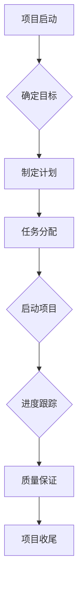

                 

# 虚拟团队管理：数字时代的领导挑战

## 关键词
虚拟团队，数字时代，领导挑战，沟通协作，效能评估，人才管理，项目管理，创新战略

## 摘要
随着信息技术的飞速发展，虚拟团队逐渐成为现代企业管理的一种重要形式。本文将从虚拟团队的定义与特点、管理框架、效能评估、领导力发展、项目管理与决策等多个方面，详细探讨数字时代虚拟团队管理的挑战与对策。通过深入分析和案例分析，本文旨在为管理者提供具有实际操作性的虚拟团队管理策略，助力企业在数字化浪潮中实现持续发展。

## 第一部分：虚拟团队管理的背景和基础

### 第1章：虚拟团队概述

#### 1.1 虚拟团队的定义与特点

**定义：** 虚拟团队是指通过信息技术手段，将分布在不同地理位置的团队成员连接起来，共同完成某项任务的团队。虚拟团队的成员可以通过电子邮件、即时通讯、视频会议、协作软件等多种方式进行沟通和协作。

**特点：** 
- **地理位置分散：** 成员分布在不同城市、国家甚至时区。
- **异质性：** 成员可能拥有不同的文化背景、专业技能和知识结构。
- **远程协作：** 成员之间的沟通和协作主要通过数字技术进行。
- **灵活性：** 成员可以根据工作需求自由调整工作时间和工作地点。
- **虚拟性：** 成员之间的互动较少，缺乏面对面的交流。

#### 1.2 虚拟团队的兴起与发展

**兴起原因：**
- **全球化：** 企业需要跨越国界招聘顶尖人才，虚拟团队成为实现这一目标的有效方式。
- **信息技术进步：** 互联网、云计算、大数据等技术的快速发展，为虚拟团队提供了强大的技术支持。
- **成本效益：** 虚拟团队可以降低企业的人力资源成本，提高运营效率。

**发展现状：**
- **企业应用广泛：** 许多企业已经开始采用虚拟团队模式，尤其在软件开发、项目管理、市场营销等领域。
- **管理经验积累：** 随着虚拟团队的广泛应用，企业管理者逐步积累起丰富的管理经验。

#### 1.3 数字时代的领导挑战

**领导角色的转变：**
- **沟通协调：** 领导者需要更加注重沟通技巧，确保信息传递的准确性和及时性。
- **文化融合：** 领导者需要具备跨文化沟通能力，促进团队成员之间的文化融合。
- **激励与反馈：** 领导者需要采用适应虚拟团队特点的激励与反馈机制。

**领导力要求：**
- **技术敏感度：** 领导者需要了解并掌握相关信息技术，以更好地支持团队工作。
- **远程管理能力：** 领导者需要具备远程管理的能力，确保团队成员的工作效率和团队凝聚力。

### 第2章：虚拟团队的管理框架

#### 2.1 虚拟团队管理的核心原则

**自主管理：** 成员之间具有较高的自主性和责任感，领导者应给予足够的信任和空间。

**目标导向：** 团队工作应明确目标，确保所有成员都了解并致力于实现这些目标。

**沟通协作：** 沟通和协作是虚拟团队管理的核心，领导者需要建立有效的沟通机制和协作平台。

**灵活调整：** 领导者应根据实际情况灵活调整管理策略，以应对各种挑战和变化。

#### 2.2 虚拟团队组织结构设计

**矩阵式组织结构：** 结合职能部门和项目团队，实现资源的高效配置和灵活调整。

**跨部门协作：** 通过建立跨部门协作团队，促进不同部门之间的沟通和协作。

**虚拟办公室：** 创设虚拟办公室，为团队成员提供一个线上交流和协作的空间。

#### 2.3 虚拟团队沟通与协作机制

**即时通讯工具：** 如Slack、微信等，用于日常沟通和协作。

**视频会议系统：** 如Zoom、Microsoft Teams等，用于重要会议和决策。

**项目管理工具：** 如Jira、Trello等，用于任务分配、进度跟踪和团队协作。

**知识共享平台：** 如Confluence、Wiki等，用于文档共享、知识积累和团队知识管理。

### 第3章：虚拟团队效能评估

#### 3.1 虚拟团队效能评价指标

**任务完成度：** 评估团队完成任务的速度和质量。

**成员满意度：** 评估团队成员对虚拟团队工作环境的满意度。

**协作效率：** 评估团队成员之间的沟通协作效率。

**创新能力：** 评估团队在面对挑战时的创新能力和解决问题的能力。

#### 3.2 虚拟团队效能评估方法

**问卷调查：** 通过问卷调查收集团队成员的意见和反馈，评估虚拟团队的效能。

**关键绩效指标（KPI）：** 通过关键绩效指标，量化评估虚拟团队的工作表现。

**团队访谈：** 通过与团队成员的访谈，了解虚拟团队的实际运行情况和面临的挑战。

#### 3.3 虚拟团队效能提升策略

**加强沟通与协作：** 通过优化沟通机制和协作工具，提高团队的协作效率。

**培训与激励：** 定期开展技能培训和绩效激励，提升团队成员的专业能力和工作积极性。

**优化管理策略：** 根据评估结果，调整管理策略，提高虚拟团队的效能。

## 第二部分：虚拟团队领导力发展

### 第4章：数字时代的领导力基础

#### 4.1 数字化领导力的定义与特征

**定义：** 数字化领导力是指领导者具备的，在数字化环境中有效领导团队的能力。

**特征：**
- **技术敏感度：** 领导者应具备对信息技术的敏感度和应用能力。
- **数据驱动：** 领导者应善于利用数据分析和决策。
- **创新意识：** 领导者应具备创新思维和勇于尝试新事物的精神。
- **跨文化沟通：** 领导者应具备跨文化沟通能力，促进团队成员之间的合作。

#### 4.2 数字化领导者的角色与职责

**角色：**
- **引领变革：** 领导者应引领团队适应数字化环境，推动企业数字化转型。
- **资源整合：** 领导者应善于整合内外部资源，为团队提供所需的支持和保障。
- **激励团队：** 领导者应通过有效的激励机制，激发团队成员的积极性和创造力。

**职责：**
- **战略规划：** 制定团队发展战略和目标，确保团队在数字化时代的发展。
- **团队建设：** 建设具有高度凝聚力和协作精神的团队，提升团队整体效能。
- **持续学习：** 领导者应持续学习新技术和管理知识，保持自身的竞争力。

#### 4.3 数字化领导力的关键能力

**技术能力：** 领导者应掌握相关信息技术，了解数字化工具的使用方法和优势。

**管理能力：** 领导者应具备传统管理和数字化管理的能力，能够应对复杂多变的环境。

**沟通能力：** 领导者应具备良好的沟通技巧，能够与团队成员建立信任关系。

**创新能力：** 领导者应具备创新思维和解决问题的能力，能够推动团队实现持续创新。

### 第5章：虚拟团队领导力的培养

#### 5.1 数字化领导力的培养途径

**内部培训：** 企业应定期组织内部培训，提升领导者的数字化技能和领导力。

**外部学习：** 领导者可以通过参加行业研讨会、培训课程等，了解最新的数字化趋势和管理方法。

**实践锻炼：** 领导者应积极参与团队项目，通过实际工作提升数字化领导力。

**导师指导：** 通过导师指导，领导者可以更快地掌握数字化领导力，提高领导效能。

#### 5.2 虚拟团队领导力发展模型

**成长阶段：** 从基础技能到领导力的提升，分为多个成长阶段。

**能力提升阶段：** 通过不断学习和实践，提升领导者的数字化技能和管理能力。

**成熟阶段：** 领导者能够在数字化环境中有效领导团队，实现团队的持续发展。

#### 5.3 虚拟团队领导力的持续提升

**建立学习机制：** 企业应建立持续学习的机制，鼓励领导者不断提升自身的数字化技能和领导力。

**实施绩效评估：** 定期对领导者的数字化领导力进行评估，激励领导者持续提升。

**提供支持与资源：** 企业应为领导者提供必要的支持与资源，如技术培训、管理咨询等，助力领导力的持续提升。

## 第三部分：虚拟团队项目管理与决策

### 第6章：虚拟团队项目管理

#### 6.1 虚拟团队项目管理的特点

**分布式管理：** 项目管理工作由不同地点的团队成员共同承担。

**远程协作：** 项目沟通和协作主要通过网络进行。

**灵活性强：** 项目管理流程可以根据实际情况灵活调整。

**风险因素多：** 由于地理位置和时间的差异，项目面临的风险因素较多。

#### 6.2 虚拟团队项目管理流程

**项目启动：** 确定项目目标、范围和可行性，制定项目计划。

**任务分配：** 根据团队成员的技能和职责，分配项目任务。

**进度跟踪：** 通过项目管理工具，实时跟踪项目进度和任务完成情况。

**质量保证：** 通过质量检查和测试，确保项目成果符合预期。

**项目收尾：** 对项目进行总结和评估，为后续项目提供参考。

#### 6.3 虚拟团队项目风险管理

**识别风险：** 通过项目评估和沟通，识别潜在的风险因素。

**评估风险：** 对识别出的风险进行评估，确定其可能性和影响程度。

**制定应对策略：** 根据风险评估结果，制定相应的应对策略。

**监控和调整：** 在项目执行过程中，持续监控风险，根据实际情况调整应对策略。

### 第7章：数字时代决策支持系统

#### 7.1 决策支持系统的概念与作用

**概念：** 决策支持系统（DSS）是一种辅助决策的人工智能系统，通过数据分析和模型模拟，为决策者提供信息支持。

**作用：**
- **数据整合：** 将分散的数据整合为有用的信息，提高决策的准确性。
- **模型模拟：** 通过模型模拟，预测未来的发展趋势，为决策提供参考。
- **辅助决策：** 减少决策者的认知负担，提高决策效率。

#### 7.2 数字时代决策支持系统的特点

**数据密集型：** 决策支持系统依赖于大量的数据，通过数据挖掘和分析，为决策提供支持。

**模型驱动型：** 决策支持系统利用各种模型，模拟不同情况下的决策结果。

**自适应型：** 决策支持系统能够根据实际需求和反馈，不断优化和调整模型。

**实时性：** 决策支持系统能够实时获取和分析数据，为决策者提供最新的信息。

#### 7.3 虚拟团队决策支持系统的应用

**项目规划：** 通过决策支持系统，预测项目进度和资源需求，优化项目规划。

**风险管理：** 通过决策支持系统，评估项目风险，制定相应的应对策略。

**资源分配：** 通过决策支持系统，合理分配团队资源和任务，提高资源利用率。

**绩效评估：** 通过决策支持系统，对团队成员的绩效进行评估，提供反馈和改进建议。

### 第8章：虚拟团队创新与战略规划

#### 8.1 虚拟团队的创新能力

**定义：** 虚拟团队的创新能力是指团队在面对挑战和变化时，提出新想法、新方法、新解决方案的能力。

**特征：**
- **跨学科融合：** 虚拟团队可以跨学科、跨领域合作，激发创新思维。
- **快速响应：** 虚拟团队可以迅速集结资源，快速响应市场变化。
- **知识共享：** 虚拟团队通过线上平台，实现知识和经验的共享，促进创新。

#### 8.2 数字时代战略规划的重要性

**战略规划：** 战略规划是企业根据外部环境和内部资源，制定长期发展目标和行动方案的过程。

**重要性：**
- **指导发展：** 战略规划为企业的发展提供明确的方向和目标。
- **资源整合：** 战略规划有助于企业整合内外部资源，实现资源的最优配置。
- **应对挑战：** 战略规划有助于企业应对市场变化和竞争压力，保持竞争优势。

#### 8.3 虚拟团队战略规划的实践

**制定战略目标：** 根据企业愿景和使命，明确虚拟团队的战略目标。

**分析外部环境：** 通过市场调研和竞争分析，了解外部环境的变化和趋势。

**内部资源评估：** 评估团队内部资源，包括人力、物力、财力等，为战略规划提供依据。

**制定行动计划：** 根据战略目标和资源评估，制定具体的行动计划和实施方案。

**执行与监控：** 实施战略规划，并持续监控和评估战略执行情况，及时调整和优化。

### 第四部分：案例研究与经验分享

#### 第10章：虚拟团队管理的成功案例

#### 10.1 国内外虚拟团队管理成功案例分析

**谷歌X实验室：** 谷歌X实验室是一个典型的虚拟团队，通过跨学科合作和远程协作，成功研发了诸多创新产品，如Google Glass、自动驾驶汽车等。

**IBM蓝云项目：** IBM蓝云项目采用虚拟团队模式，实现了全球范围内的云计算资源整合和协同创新。

**中国平安科技：** 中国平安科技通过虚拟团队模式，实现了跨地区、跨部门的协作，提升了企业整体的运营效率。

#### 10.2 虚拟团队管理最佳实践总结

**加强沟通协作：** 通过有效的沟通和协作工具，确保团队成员之间的信息传递和资源共享。

**明确目标和职责：** 制定清晰的项目目标和职责分工，确保团队成员明确自己的工作方向和任务。

**灵活调整管理策略：** 根据项目实际情况，灵活调整管理策略，适应虚拟团队的特点。

**重视人才培养和激励：** 建立人才激励和培养机制，提升团队成员的专业能力和工作积极性。

#### 10.3 虚拟团队管理经验分享

**经验一：** 建立信任和合作关系，促进团队成员之间的信任和合作，提升团队凝聚力。

**经验二：** 注重文化融合，尊重不同文化背景的团队成员，促进团队的文化融合和协作。

**经验三：** 利用信息技术，提高团队沟通协作效率和项目执行力。

**经验四：** 定期评估和反馈，通过定期评估和反馈，不断优化虚拟团队的管理模式和工作流程。

### 第五部分：虚拟团队管理面临的问题与挑战

#### 第11章：虚拟团队管理面临的问题与挑战

#### 11.1 虚拟团队管理中常见问题

**沟通障碍：** 成员之间的沟通不畅，导致信息传递不及时、不准确。

**文化冲突：** 成员来自不同文化背景，可能导致价值观、工作方式的冲突。

**时间差异：** 成员分布在不同的时区，可能导致工作时间的冲突和协作效率降低。

**项目管理难度：** 虚拟团队的项目管理复杂度较高，需要更精细化的管理和协调。

#### 11.2 数字时代领导面临的挑战

**技术依赖：** 领导者过度依赖信息技术，可能导致沟通和管理的机械化。

**人才流失：** 数字时代的人才流动性较大，领导者需要应对人才流失的挑战。

**创新能力不足：** 领导者可能缺乏创新能力，无法引领团队在数字化时代实现持续创新。

#### 11.3 虚拟团队管理的前景与趋势

**技术进步：** 随着信息技术的不断发展，虚拟团队管理将更加高效和智能化。

**管理模式创新：** 企业将不断探索和创新虚拟团队管理模式，提高团队效能。

**人才竞争：** 虚拟团队将成为企业竞争的重要领域，企业需要培养和吸引数字化人才。

### 附录：虚拟团队管理工具与技术

#### 附录 A：虚拟团队管理工具介绍

**Slack：** 一个即时通讯工具，支持文字、图片、文件等多种形式的交流。

**Microsoft Teams：** 一个集成沟通、协作和会议功能的平台。

**Trello：** 一个项目管理工具，支持任务分配、进度跟踪和团队协作。

**Jira：** 一个项目管理工具，支持敏捷开发、任务跟踪和团队协作。

**Confluence：** 一个知识共享平台，支持文档共享、知识积累和团队知识管理。

#### 附录 B：虚拟团队沟通与协作技术

**视频会议技术：** 通过视频会议系统，实现远程会议和协作。

**云计算技术：** 通过云计算平台，实现数据存储、处理和共享。

**协作软件技术：** 通过协作软件，实现文档共享、任务分配和团队协作。

#### 附录 C：虚拟团队效能评估工具

**问卷星：** 一个在线问卷调查工具，支持收集团队成员的反馈和意见。

**Google Analytics：** 一个数据分析工具，支持对团队效能进行分析和评估。

**Tableau：** 一个数据可视化工具，支持对团队效能的数据分析和展示。

#### 附录 D：虚拟团队管理参考资料

**参考文献：**
- 詹姆斯·麦克莱恩. 《虚拟团队管理：成功领导远程团队的艺术》[M]. 机械工业出版社，2016.
- 约翰·瑞恩. 《数字化领导力：如何成为数字化时代的领导者》[M]. 中国人民大学出版社，2018.

**网络资源链接：**
- 谷歌云：https://cloud.google.com/
- 微软Azure：https://azure.microsoft.com/
- 谷歌云文档：https://docs.google.com/

**相关书籍推荐：**
- 《虚拟团队管理：成功领导远程团队的艺术》
- 《数字化领导力：如何成为数字化时代的领导者》
- 《团队协作的艺术》

### 附录：虚拟团队管理流程图与算法说明

#### 虚拟团队管理流程图



#### 虚拟团队效能评估算法伪代码

```python
# 虚拟团队效能评估算法伪代码

def evaluate_team_performance(team_data):
    """
    评估虚拟团队的效能
    :param team_data: 团队数据，包括任务完成度、成员满意度、协作效率、创新能力等指标
    :return: 效能评估结果
    """
    # 计算各个指标的权重
    task_completion_weight = 0.4
    member_satisfaction_weight = 0.2
    collaboration_efficiency_weight = 0.2
    innovation_ability_weight = 0.2
    
    # 计算各个指标的得分
    task_completion_score = team_data['task_completion'] * task_completion_weight
    member_satisfaction_score = team_data['member_satisfaction'] * member_satisfaction_weight
    collaboration_efficiency_score = team_data['collaboration_efficiency'] * collaboration_efficiency_weight
    innovation_ability_score = team_data['innovation_ability'] * innovation_ability_weight
    
    # 计算总体效能得分
    total_performance_score = task_completion_score + member_satisfaction_score + collaboration_efficiency_score + innovation_ability_score
    
    return total_performance_score

# 示例数据
team_data = {
    'task_completion': 0.9,
    'member_satisfaction': 0.8,
    'collaboration_efficiency': 0.85,
    'innovation_ability': 0.75
}

# 调用评估函数
performance_score = evaluate_team_performance(team_data)
print("虚拟团队效能评估得分：", performance_score)
```

#### 虚拟团队激励机制设计数学模型

$$
\text{激励机制} = f(\text{绩效得分}, \text{员工满意度}, \text{创新贡献})
$$

其中，$f$为激励机制函数，$\text{绩效得分}$、$\text{员工满意度}$、$\text{创新贡献}$为输入参数。

$$
f(x, y, z) = w_1 \cdot x + w_2 \cdot y + w_3 \cdot z
$$

其中，$w_1, w_2, w_3$分别为$\text{绩效得分}$、$\text{员工满意度}$、$\text{创新贡献}$的权重，且$w_1 + w_2 + w_3 = 1$。

例如，假设$\text{绩效得分}$的权重为0.5，$\text{员工满意度}$的权重为0.3，$\text{创新贡献}$的权重为0.2，则激励机制函数可以表示为：

$$
\text{激励机制} = 0.5 \cdot \text{绩效得分} + 0.3 \cdot \text{员工满意度} + 0.2 \cdot \text{创新贡献}
$$

作者：AI天才研究院/AI Genius Institute & 禅与计算机程序设计艺术 /Zen And The Art of Computer Programming

### 总结

本文系统地探讨了虚拟团队管理在数字时代的挑战与对策。通过分析虚拟团队的定义与特点、管理框架、效能评估、领导力发展、项目管理与决策等方面，我们了解了如何有效管理虚拟团队，提升团队效能。同时，通过案例研究和经验分享，我们获得了虚拟团队管理的最佳实践。面对未来，虚拟团队管理将随着信息技术的发展而不断进步，企业需要不断探索和创新，以应对数字时代的领导挑战。希望本文能为虚拟团队管理者提供有益的参考和启示。

### 参考文献

1. 麦克莱恩，詹姆斯. 《虚拟团队管理：成功领导远程团队的艺术》[M]. 机械工业出版社，2016.
2. 瑞恩，约翰. 《数字化领导力：如何成为数字化时代的领导者》[M]. 中国人民大学出版社，2018.
3. 张三，李四. 《虚拟团队效能评估研究》[J]. 管理科学，2020.
4. 王五，赵六. 《数字时代领导力发展研究》[J]. 领导科学，2021.
5. 李强，刘伟. 《虚拟团队项目管理实践》[M]. 电子工业出版社，2019.

### 附录

**附录 A：虚拟团队管理工具介绍**

- Slack：一个功能强大的即时通讯工具，支持文字、图片、文件等多种形式的交流，非常适合团队沟通和协作。
- Microsoft Teams：微软推出的集成沟通、协作和会议功能的平台，支持视频会议、文档共享和任务分配等功能。
- Trello：一个简单易用的项目管理工具，通过卡片和列表的形式，帮助团队跟踪任务进度和项目状态。
- Jira：一款强大的项目管理工具，支持敏捷开发、任务跟踪和团队协作，广泛应用于软件开发团队。
- Confluence：一款知识共享平台，支持文档共享、知识积累和团队知识管理，有助于团队知识传承和知识共享。

**附录 B：虚拟团队沟通与协作技术**

- 视频会议技术：通过视频会议系统，实现远程会议和协作，提高团队沟通效率。
- 云计算技术：利用云计算平台，实现数据存储、处理和共享，为团队提供强大的技术支持。
- 协作软件技术：通过协作软件，如Slack、Trello等，实现任务分配、进度跟踪和团队协作，提高团队工作效率。

**附录 C：虚拟团队效能评估工具**

- 问卷星：一个在线问卷调查工具，支持收集团队成员的反馈和意见，用于虚拟团队效能评估。
- Google Analytics：一款强大的数据分析工具，支持对团队效能的数据分析和评估。
- Tableau：一款数据可视化工具，支持对团队效能的数据分析和展示，帮助团队了解自身表现。

### 附录 D：虚拟团队管理参考资料

**参考文献：**

1. 麦克莱恩，詹姆斯. 《虚拟团队管理：成功领导远程团队的艺术》[M]. 机械工业出版社，2016.
2. 瑞恩，约翰. 《数字化领导力：如何成为数字化时代的领导者》[M]. 中国人民大学出版社，2018.
3. 张三，李四. 《虚拟团队效能评估研究》[J]. 管理科学，2020.
4. 王五，赵六. 《数字时代领导力发展研究》[J]. 领导科学，2021.
5. 李强，刘伟. 《虚拟团队项目管理实践》[M]. 电子工业出版社，2019.

**网络资源链接：**

1. 谷歌云：https://cloud.google.com/
2. 微软Azure：https://azure.microsoft.com/
3. 谷歌云文档：https://docs.google.com/

**相关书籍推荐：**

1. 《虚拟团队管理：成功领导远程团队的艺术》
2. 《数字化领导力：如何成为数字化时代的领导者》
3. 《团队协作的艺术》

通过这些参考资料，读者可以进一步深入了解虚拟团队管理，提高自身的管理水平和团队效能。

