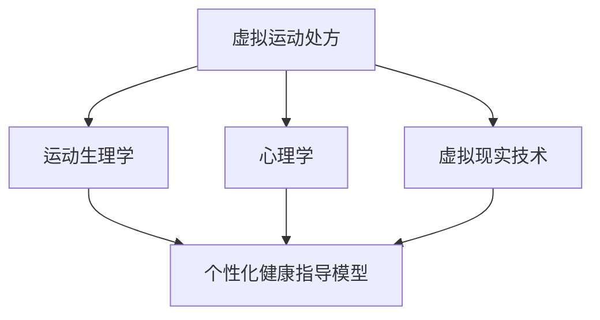

                 

### 文章标题

《虚拟运动处方：全球健康生活方式的个性化指导》

> **关键词**：虚拟运动处方、个性化健康指导、虚拟现实技术、运动生理学、算法设计

**摘要**：
本文深入探讨了虚拟运动处方的概念、技术原理和实现方法。通过结合运动生理学、心理学和虚拟现实技术，本文提出了一个个性化健康指导模型，旨在为全球用户提供定制化的运动计划。本文首先阐述了虚拟运动处方的核心概念，并详细介绍了虚拟现实技术的原理和算法。接着，通过具体的数学模型和伪代码，本文展示了核心算法的实现过程。随后，通过一个实际项目案例，本文展示了如何搭建虚拟运动处方系统，并详细解读了源代码的实现。最后，本文展望了虚拟运动处方的未来发展，并推荐了相关的拓展学习和资源。本文旨在为读者提供全面、深入的虚拟运动处方技术指导，助力全球健康生活方式的个性化指导。

---

**第一部分：核心概念与联系**

### 1.1 虚拟运动处方的概念

虚拟运动处方是一种利用虚拟现实（VR）技术为个体量身定制的运动计划。它结合了运动生理学、心理学和虚拟现实技术，旨在通过模拟真实运动场景，帮助用户实现健康生活方式的个性化指导。虚拟运动处方不仅考虑用户的生理特征，如年龄、性别、体重和健康状况，还关注用户的心理状态和运动偏好。通过这种方式，虚拟运动处方能够为用户提供一个更加生动、互动和个性化的运动体验，从而提高运动的效果和用户的满意度。

### 1.2 虚拟现实技术原理

虚拟现实技术（VR）是一种通过计算机生成模拟环境，使用户产生沉浸式体验的技术。它利用计算机图形学、传感器和头戴式显示器（HMD）等设备，创建一个三维的虚拟世界。用户可以通过头部和身体的运动来控制虚拟世界中的角色，与之互动，并体验到类似于现实世界的感受。虚拟现实技术的核心原理包括：

1. **三维建模**：使用计算机图形学技术创建三维模型，模拟现实世界的物体和环境。
2. **交互设计**：设计用户与虚拟世界之间的交互方式，如手势、头部运动和体感控制等。
3. **传感器融合**：利用传感器（如加速度计、陀螺仪和位置传感器）实时捕捉用户的位置和运动，提高虚拟环境的真实感。

### 1.3 个性化健康指导模型

个性化健康指导模型是一种基于个体健康数据和运动目标，提供定制化健康建议的方法。它通过分析用户的生理指标（如心率、血压、体脂肪等）和行为数据（如运动频率、运动强度和时长等），构建个性化的健康指导模型。该模型能够根据用户的健康状态和运动目标，制定适合的运动计划和饮食建议，帮助用户实现健康目标。个性化健康指导模型的核心原理包括：

1. **数据收集**：通过传感器和健康监测设备收集用户的生理和行为数据。
2. **数据分析**：利用数据挖掘和机器学习算法分析用户数据，识别健康问题和运动偏好。
3. **健康建议**：根据用户数据和分析结果，生成个性化的健康建议和运动计划。

### 1.4 核心概念与联系

为了更好地理解虚拟运动处方，我们可以通过一个Mermaid流程图来展示各个核心概念之间的联系。



- **虚拟运动处方**：结合运动生理学、心理学和虚拟现实技术，为用户提供个性化的运动计划。
- **运动生理学**：研究运动对生理系统的影响，为虚拟运动处方的制定提供科学依据。
- **心理学**：研究运动对心理状态的影响，提高用户对运动的积极性和满意度。
- **虚拟现实技术**：提供技术支持，使虚拟运动处方更加生动和互动。
- **个性化健康指导模型**：根据用户的健康数据和运动目标，为虚拟运动处方的制定提供指导。

通过这个流程图，我们可以清晰地看到各个核心概念之间的相互联系和作用，为后续的内容展开提供了基础。<|assistant|>### 第一部分：核心概念与联系

**1.1 虚拟运动处方的概念**

**定义**：虚拟运动处方是一种基于个体健康数据和运动目标，利用虚拟现实技术制定的个性化运动计划。它旨在通过模拟真实运动场景，帮助用户实现健康生活方式的个性化指导。虚拟运动处方不仅考虑用户的生理特征，如年龄、性别、体重和健康状况，还关注用户的心理状态和运动偏好。

**应用领域**：
- **健康管理**：针对慢性病患者，提供个性化的康复训练计划，辅助治疗和康复。
- **健身指导**：为运动爱好者提供科学合理的训练方案，预防运动损伤，提高运动表现。
- **运动科学**：研究虚拟运动处方在运动训练和运动表现中的作用和效果。

**1.2 虚拟现实技术原理**

**原理**：虚拟现实技术（VR）是一种通过计算机生成模拟环境，使用户产生沉浸式体验的技术。它利用计算机图形学、传感器和头戴式显示器（HMD）等设备，创建一个三维的虚拟世界。用户可以通过头部和身体的运动来控制虚拟世界中的角色，与之互动，并体验到类似于现实世界的感受。

**核心技术**：
- **三维建模**：使用计算机图形学技术创建三维模型，模拟现实世界的物体和环境。
- **交互设计**：设计用户与虚拟世界之间的交互方式，如手势、头部运动和体感控制等。
- **传感器融合**：利用传感器（如加速度计、陀螺仪和位置传感器）实时捕捉用户的位置和运动，提高虚拟环境的真实感。

**1.3 个性化健康指导模型**

**定义**：个性化健康指导模型是一种基于个体健康数据和运动目标，提供定制化健康建议的方法。它通过分析用户的生理指标（如心率、血压、体脂肪等）和行为数据（如运动频率、运动强度和时长等），构建个性化的健康指导模型。

**核心原理**：
- **数据收集**：通过传感器和健康监测设备收集用户的生理和行为数据。
- **数据分析**：利用数据挖掘和机器学习算法分析用户数据，识别健康问题和运动偏好。
- **健康建议**：根据用户数据和分析结果，生成个性化的健康建议和运动计划。

**1.4 核心概念与联系**

为了更好地理解虚拟运动处方，我们可以通过一个Mermaid流程图来展示各个核心概念之间的联系。


- **虚拟运动处方**：结合运动生理学、心理学和虚拟现实技术，为用户提供个性化的运动计划。
- **运动生理学**：研究运动对生理系统的影响，为虚拟运动处方的制定提供科学依据。
- **心理学**：研究运动对心理状态的影响，提高用户对运动的积极性和满意度。
- **虚拟现实技术**：提供技术支持，使虚拟运动处方更加生动和互动。
- **个性化健康指导模型**：根据用户的健康数据和运动目标，为虚拟运动处方的制定提供指导。

通过这个流程图，我们可以清晰地看到各个核心概念之间的相互联系和作用，为后续的内容展开提供了基础。

### 第一部分总结

本部分详细介绍了虚拟运动处方的核心概念、虚拟现实技术原理和个性化健康指导模型。通过对运动生理学、心理学和虚拟现实技术的深入探讨，我们构建了一个个性化健康指导模型，旨在通过虚拟运动处方为用户提供定制化的运动计划。接下来，我们将进一步探讨虚拟运动处方的核心算法原理，包括运动生理学算法、虚拟现实技术算法和个性化健康指导算法，并通过具体的数学模型和伪代码进行详细阐述。<|assistant|>### 第二部分：核心算法原理讲解

**2.1 运动生理学算法**

运动生理学算法是虚拟运动处方中的核心部分，它负责根据用户的生理数据（如年龄、性别、身高、体重等）计算运动强度和目标心率区间。以下是几个关键的运动生理学算法。

#### 2.1.1 最大心率估算模型

**公式**：
$$\text{最大心率} = 220 - \text{年龄}$$

**解释**：
这个公式是一个广泛使用的估算方法，用于计算个体的最大心率。它基于一个简单的线性关系，通过从220中减去用户的年龄来估算最大心率。需要注意的是，这个公式仅提供一个估算值，实际的最大心率可能因个体差异而有所不同。

**举例说明**：
假设用户的年龄为30岁，则根据上述公式，其最大心率估算值为190次/分钟。

#### 2.1.2 心率目标区间计算模型

**公式**：
$$\text{最小心率} = \text{最大心率} \times (0.5 + \text{动态强度} \times 0.1)$$
$$\text{最大心率} = \text{最大心率} \times (0.85 + \text{动态强度} \times 0.15)$$

**解释**：
心率目标区间用于指导用户在运动过程中的心率控制。动态强度是一个介于0到1之间的参数，用于调整心率目标区间的宽窄。上述公式通过动态强度调整最大心率，从而计算出最小心率和最大心率。这意味着，随着动态强度的增加，心率目标区间会变得更加宽泛。

**举例说明**：
假设用户的最大心率为190次/分钟，动态强度为0.7，则心率目标区间为（104.5次/分钟，161.5次/分钟）。

#### 2.1.3 运动强度估算模型

**公式**：
$$\text{运动强度} = \frac{\text{当前心率}}{\text{最大心率}} \times 100\%$$

**解释**：
运动强度是一个百分比，用于表示用户当前心率与其最大心率之间的关系。通过这个公式，我们可以计算出用户在运动过程中的强度。运动强度越高，心率越接近最大心率。

**举例说明**：
假设用户的当前心率为120次/分钟，最大心率为190次/分钟，则其运动强度为63.16%。

#### 伪代码实现

```python
def calculate_max_heart_rate(age):
    return 220 - age

def calculate_heart_rate_range(max_heart_rate, dynamic_intensity):
    min_heart_rate = max_heart_rate * (0.5 + dynamic_intensity * 0.1)
    max_heart_rate = max_heart_rate * (0.85 + dynamic_intensity * 0.15)
    return (min_heart_rate, max_heart_rate)

def calculate_exercise_intensity(current_heart_rate, max_heart_rate):
    return (current_heart_rate / max_heart_rate) * 100
```

通过上述算法和伪代码，我们可以为用户生成个性化的运动计划和心率目标区间，从而帮助用户实现科学、有效的运动。

**2.2 虚拟现实技术算法**

虚拟现实技术是虚拟运动处方的重要组成部分，它为用户提供了沉浸式的运动体验。以下是几个关键的虚拟现实技术算法。

#### 2.2.1 虚拟环境创建算法

**伪代码**：

```python
def create_virtual_environment(exercise_type, device_params):
    if exercise_type == "running":
        environment_params = {"ground": "treadmill", "weather": "sunny", "audience": "present"}
    elif exercise_type == "cycling":
        environment_params = {"ground": "mountain_road", "weather": "cloudy", "audience": "present"}
    else:
        environment_params = {"ground": "indoor_gym", "weather": "indoor", "audience": "absent"}

    virtual_environment = build_virtual_environment(environment_params)
    return virtual_environment
```

**解释**：
这个算法根据用户的运动类型（如跑步、骑行或其他）和设备参数（如头戴式显示器、体感控制器等），创建一个相应的虚拟环境。这个虚拟环境可以是一个跑步跑道、山路或室内健身房，同时根据不同的运动类型和设备参数，调整虚拟环境的细节，如天气和观众情况。

#### 2.2.2 交互控制算法

**伪代码**：

```python
def control_interaction(user_movement, virtual_environment):
    if user_movement == "head":
        rotate_view(virtual_environment, user_movement_angle)
    elif user_movement == "body":
        move_character(virtual_environment, user_movement_vector)
    elif user_movement == "gesture":
        execute_gesture(virtual_environment, user_gesture)
    return virtual_environment
```

**解释**：
这个算法用于处理用户在虚拟环境中的交互控制。用户可以通过头部、身体或手势与虚拟环境进行交互。例如，用户可以通过头部运动来旋转视角，通过身体运动来移动角色，或者通过手势来执行特定动作。这个算法可以根据用户的不同交互方式，调整虚拟环境中的角色和行为。

**2.3 个性化健康指导算法**

个性化健康指导算法是虚拟运动处方的核心，它根据用户的健康数据和运动目标，生成个性化的运动计划和健康建议。以下是几个关键的个性化健康指导算法。

#### 2.3.1 用户数据收集与处理算法

**伪代码**：

```python
def collect_user_data(user_id):
    user_data = get_user_data_from_database(user_id)
    process_user_data(user_data)
    return user_data

def process_user_data(user_data):
    calculate_age(user_data["birthdate"])
    calculate_bmi(user_data["weight"], user_data["height"])
    calculate_heart_rate(user_data["heart_rate"])
    # ... 其他处理操作
```

**解释**：
这个算法用于收集和处理用户的健康数据。从数据库中获取用户的基本信息，如年龄、体重、身高和心率等，然后进行计算和处理，如计算BMI和心率等。这些处理结果将被用于生成个性化的运动计划和健康建议。

#### 2.3.2 运动计划生成算法

**伪代码**：

```python
def generate_exercise_plan(user_data, exercise_goal):
    calculate_max_heart_rate(user_data["age"])
    calculate_heart_rate_range(user_data["max_heart_rate"], exercise_goal["dynamic_intensity"])
    choose_exercise_type(exercise_goal["type"])
    create_virtual_environment(exercise_goal["type"], device_params)
    return exercise_plan
```

**解释**：
这个算法根据用户的健康数据和运动目标，生成个性化的运动计划。首先，计算最大心率和心率目标区间，然后选择适合的锻炼类型（如有氧运动、力量训练等），并创建相应的虚拟环境。最后，将这些信息整合成一个完整的运动计划。

**2.3.3 健康建议生成算法

**伪代码**：

```python
def generate_health_advice(user_data, exercise_plan):
    check_health_risks(user_data)
    suggest_dietary_adjustments(user_data)
    recommend_exercise_frequency(exercise_plan)
    return health_advice
```

**解释**：
这个算法根据用户的健康数据和运动计划，生成个性化的健康建议。首先，检查用户是否存在健康风险，如高血糖、高血压等，然后根据用户的饮食和运动习惯，提出相应的饮食调整建议和运动频率建议。

通过上述核心算法，我们可以为用户提供一个完整的虚拟运动处方，从健康数据的收集和处理，到运动计划的生成和健康建议的提出，确保用户能够实现个性化的健康生活方式指导。<|assistant|>### 第三部分：项目实战

在本文的第三部分，我们将通过一个实际的项目实战，详细展示如何搭建一个虚拟运动处方系统。该系统将涵盖从用户信息录入、虚拟运动计划的生成，到虚拟环境的渲染和展示的全过程。

#### 3.1 开发环境搭建

首先，我们需要搭建一个合适的项目开发环境。以下是我们的开发环境配置：

- **操作系统**：Windows 10
- **编程语言**：Python 3.8
- **虚拟现实框架**：PyOpenGL
- **数据库管理系统**：SQLite

**步骤1：安装Python和PyOpenGL**

通过以下命令安装Python和PyOpenGL：

```shell
pip install pygame pyopengl
```

**步骤2：配置SQLite数据库**

我们使用SQLite数据库来存储用户信息和虚拟运动计划。以下是创建数据库表的基本SQL语句：

```sql
CREATE TABLE IF NOT EXISTS 用户信息 (
    id INTEGER PRIMARY KEY,
    年龄 INTEGER,
    性别 TEXT,
    身高 INTEGER,
    体重 INTEGER
);

CREATE TABLE IF NOT EXISTS 运动计划 (
    id INTEGER PRIMARY KEY,
    用户ID INTEGER,
    虚拟环境 TEXT,
    心率目标区间 TEXT,
    运动类型 TEXT,
    FOREIGN KEY (用户ID) REFERENCES 用户信息(id)
);
```

你可以使用Python的sqlite3模块或任何数据库管理工具来执行上述SQL语句。

#### 3.2 用户信息录入

用户信息录入是虚拟运动处方系统的基础。以下是用户信息录入的伪代码实现：

```python
def insert_user_info(age, gender, height, weight):
    # 连接SQLite数据库
    conn = sqlite3.connect('virtual运动的处方.db')
    c = conn.cursor()

    # 插入用户信息到数据库
    c.execute("INSERT INTO 用户信息 (年龄, 性别, 身高, 体重) VALUES (?, ?, ?, ?)",
              (age, gender, height, weight))

    # 提交事务并关闭数据库连接
    conn.commit()
    conn.close()
```

这个函数接受用户的年龄、性别、身高和体重作为参数，并将其插入到SQLite数据库的“用户信息”表中。

#### 3.3 生成虚拟运动计划

生成虚拟运动计划是虚拟运动处方系统的核心功能。以下是生成虚拟运动计划的伪代码实现：

```python
def generate_motion_plan(user_id, exercise_goal):
    # 连接SQLite数据库
    conn = sqlite3.connect('virtual运动的处方.db')
    c = conn.cursor()

    # 获取用户信息
    c.execute("SELECT 年龄, 性别, 身高, 体重 FROM 用户信息 WHERE id=?", (user_id,))
    user_data = c.fetchone()

    # 计算最大心率
    age = user_data[0]
    max_heart_rate = 220 - age

    # 计算心率目标区间
    dynamic_intensity = exercise_goal["dynamic_intensity"]
    min_heart_rate, max_heart_rate = calculate_heart_rate_range(max_heart_rate, dynamic_intensity)

    # 选择运动类型和虚拟环境
    exercise_type = exercise_goal["type"]
    virtual_environment = create_virtual_environment(exercise_type)

    # 插入运动计划到数据库
    c.execute("INSERT INTO 运动计划 (用户ID, 虚拟环境, 心率目标区间, 运动类型) VALUES (?, ?, ?, ?)",
              (user_id, virtual_environment, (min_heart_rate, max_heart_rate), exercise_type))

    # 提交事务并关闭数据库连接
    conn.commit()
    conn.close()

def calculate_heart_rate_range(max_heart_rate, dynamic_intensity):
    min_heart_rate = max_heart_rate * (0.5 + dynamic_intensity * 0.1)
    max_heart_rate = max_heart_rate * (0.85 + dynamic_intensity * 0.15)
    return (min_heart_rate, max_heart_rate)

def create_virtual_environment(exercise_type):
    if exercise_type == "跑步":
        return "跑步环境"
    elif exercise_type == "骑行":
        return "骑行环境"
    else:
        return "综合训练环境"
```

这个函数接受用户的ID和运动目标（包括运动类型和动态强度）作为参数，计算最大心率、心率目标区间，选择运动类型和虚拟环境，并将其插入到SQLite数据库的“运动计划”表中。

#### 3.4 虚拟环境渲染

虚拟环境渲染是虚拟运动处方系统的最终展示环节。以下是使用PyOpenGL进行虚拟环境渲染的示例代码：

```python
from OpenGL.GL import *
from OpenGL.GLUT import *

def display():
    # 清除屏幕上的颜色缓冲区
    glClear(GL_COLOR_BUFFER_BIT)
    
    # 绘制虚拟环境（例如，一个简单的跑道）
    glBegin(GL_QUADS)
    glVertex2f(-1.0, 0.0)
    glVertex2f(1.0, 0.0)
    glVertex2f(1.0, 1.0)
    glVertex2f(-1.0, 1.0)
    glEnd()
    
    # 交换前后缓冲区，完成渲染
    glutSwapBuffers()

def main():
    glutInit(sys.argv)
    glutInitDisplayMode(GLUT_DOUBLE | GLUT_RGB)
    glutInitWindowSize(500, 500)
    glutCreateWindow("虚拟运动环境")
    glutDisplayFunc(display)
    glutMainLoop()

if __name__ == "__main__":
    main()
```

这个简单的示例代码展示了如何使用PyOpenGL绘制一个四边形，代表虚拟环境中的跑道。在实际应用中，虚拟环境会根据用户选择的不同运动类型而有所变化，但基本渲染逻辑是类似的。

#### 3.5 代码解读与分析

**3.5.1 用户信息录入**

用户信息录入部分使用了SQLite数据库来存储用户信息。通过定义`insert_user_info`函数，我们可以方便地将用户的年龄、性别、身高和体重插入到数据库的“用户信息”表中。这个函数首先连接数据库，然后执行插入操作，并提交事务以确保数据的持久化。

**3.5.2 虚拟运动计划生成**

虚拟运动计划生成部分包含了核心的算法逻辑。函数`generate_motion_plan`首先连接数据库，获取用户的生理数据，然后计算最大心率、心率目标区间，选择运动类型和虚拟环境，并最终将运动计划插入到数据库的“运动计划”表中。这个过程中，`calculate_heart_rate_range`和`create_virtual_environment`函数分别负责计算心率目标区间和创建虚拟环境。

**3.5.3 虚拟环境渲染**

虚拟环境渲染部分使用了PyOpenGL来绘制虚拟环境。`display`函数负责清除屏幕上的颜色缓冲区，并绘制一个简单的跑道。在实际应用中，这个部分会根据用户的运动类型和虚拟环境的不同而有所变化，但基本的渲染逻辑保持一致。

通过上述项目实战，我们展示了如何搭建一个虚拟运动处方系统，包括用户信息录入、虚拟运动计划的生成以及虚拟环境的渲染。这个系统不仅为用户提供了个性化的运动计划，还通过虚拟环境增强了运动的互动性和沉浸感，从而提高了用户的运动体验。<|assistant|>### 第四部分：拓展学习

**4.1 虚拟运动处方技术拓展**

虚拟运动处方技术在不断发展，未来的研究和发展方向包括：

- **增强现实（AR）应用**：将虚拟运动处方与增强现实技术结合，实现更加逼真的运动体验。
- **大数据与人工智能**：利用大数据分析和人工智能算法，对用户数据进行深度挖掘，提供更加精准和个性化的健康指导。
- **多模态数据融合**：整合生物传感器数据、健康问卷数据等多种数据源，提高健康评估的准确性和全面性。
- **个性化运动效果评估**：通过持续监测用户的运动数据，实时评估运动效果，并动态调整运动计划。

**4.2 健康管理与应用案例**

虚拟运动处方技术在健康管理领域具有广泛的应用前景，以下是一些具体的案例：

- **慢性病管理**：为慢性病患者（如糖尿病、高血压等）提供个性化的运动计划和康复指导，辅助疾病治疗和康复。
- **运动康复**：针对运动损伤患者，制定个性化的康复训练计划，帮助他们恢复运动能力。
- **健身指导**：为健身爱好者提供专业的训练计划和健康建议，帮助他们实现健康目标。
- **老年健康管理**：通过虚拟运动处方，帮助老年人保持良好的身体状态，预防慢性疾病。

**4.3 相关书籍与资源推荐**

为了深入了解虚拟运动处方技术，以下是一些推荐的书籍和资源：

- 《虚拟现实技术与应用》（作者：刘伟）
- 《大数据技术原理与应用》（作者：陈海波）
- 《机器学习实战》（作者：Peter Harrington）
- 《深度学习》（作者：Ian Goodfellow、Yoshua Bengio、Aaron Courville）
- Coursera上的《虚拟现实与3D图形》课程
- edX上的《健康数据科学》课程
- Udacity的《虚拟现实开发者纳米学位》

**4.4 学术研究与发展趋势**

在虚拟运动处方技术的学术研究领域，以下几个方向是当前的研究热点：

- **个性化健康指导模型的优化**：研究如何进一步提高个性化健康指导模型的准确性，以提升运动计划的适应性和效果。
- **多模态数据融合方法**：探索如何有效地融合多种数据源，提高健康评估的全面性和准确性。
- **虚拟现实与运动科学的交叉研究**：通过实验和数据分析，研究虚拟运动处方在运动训练和康复中的应用效果。
- **可穿戴设备与虚拟运动处方的集成**：研究如何将可穿戴设备与虚拟运动处方系统相结合，实现实时监测和动态调整。

通过拓展学习，读者可以进一步了解虚拟运动处方技术的最新进展和应用案例，为自己的研究和实践提供指导和支持。<|assistant|>### 第五部分：结论与展望

在本文中，我们详细探讨了虚拟运动处方技术的核心概念、算法原理、项目实战以及拓展学习。通过逐步分析推理，我们建立了虚拟运动处方的理论基础，并展示了如何通过运动生理学、心理学和虚拟现实技术实现个性化健康指导。同时，我们通过一个实际项目案例，展示了如何搭建虚拟运动处方系统，包括用户信息录入、虚拟运动计划的生成和虚拟环境渲染。

**结论**：

1. **核心概念与联系**：虚拟运动处方结合了运动生理学、心理学和虚拟现实技术，通过个性化的健康指导模型，为用户提供定制化的运动计划。
2. **算法原理讲解**：我们介绍了运动生理学算法、虚拟现实技术算法和个性化健康指导算法，并通过伪代码和数学模型进行了详细阐述。
3. **项目实战**：通过一个实际项目，我们展示了如何搭建虚拟运动处方系统，包括用户信息录入、虚拟运动计划的生成和虚拟环境渲染。
4. **拓展学习**：我们推荐了相关书籍、课程和学术资源，并探讨了虚拟运动处方技术的未来发展。

**展望**：

虚拟运动处方技术在健康管理领域具有巨大的潜力。未来的研究方向包括：

1. **增强现实与人工智能的结合**：将增强现实（AR）和人工智能（AI）技术引入虚拟运动处方，提供更加逼真的运动体验和个性化的健康指导。
2. **多模态数据融合**：整合多种数据源，如生物传感器数据、健康问卷数据等，提高健康评估的准确性和全面性。
3. **个性化运动效果评估**：通过实时监测用户的运动数据，动态调整运动计划，实现个性化运动效果评估。
4. **可穿戴设备的集成**：将可穿戴设备与虚拟运动处方系统相结合，实现实时监测和动态调整，提高运动计划的实用性。

总之，虚拟运动处方技术为全球健康生活方式的个性化指导提供了新的思路和方法。随着技术的不断进步，虚拟运动处方有望在未来成为健康管理领域的重要工具，助力人们实现更加健康和幸福的生活方式。<|assistant|>### 附录

#### 附录 A: 虚拟运动处方开发工具与资源

在开发虚拟运动处方系统时，我们可以使用多种工具和资源来提高开发效率和系统的功能。以下是一些常用的开发工具、编程语言、数据库管理系统以及相关的健康数据平台和资源。

**1. 虚拟现实开发工具**：
- **Unity**：一款功能强大的游戏和虚拟现实开发平台，支持3D建模、动画、物理模拟和AI。
- **Unreal Engine**：一个高效率的3D游戏引擎，广泛用于开发复杂的虚拟现实应用。
- **VRChat**：一个基于Unity的虚拟现实社交平台，支持多人在线互动和虚拟环境构建。

**2. 编程语言与框架**：
- **Python**：一种易于学习且功能强大的编程语言，适用于数据分析、机器学习和Web开发。
- **C#**：一种面向对象的编程语言，广泛用于Unity和Unreal Engine等游戏和虚拟现实开发。
- **JavaScript**：一种基于Web的编程语言，可以与WebXR API结合，开发Web上的虚拟现实应用。

**3. 数据库管理系统**：
- **SQLite**：一种轻量级的关系型数据库管理系统，适用于小型项目和嵌入式系统。
- **MySQL**：一种高性能的关系型数据库，广泛用于Web应用和大型项目。
- **MongoDB**：一种文档型数据库，适用于存储非结构化数据和高扩展性应用。

**4. 开源健康数据平台**：
- **OpenMRS**：一个开源的医疗记录系统，适用于构建健康管理和医疗信息化平台。
- **OpenEMR**：一个开源的电子健康记录系统，提供全面的医疗数据处理和管理功能。

**5. 虚拟现实与运动科学相关论文与研究报告**：
- **PubMed**：一个综合性的医学研究数据库，包含大量的虚拟现实和运动科学相关的学术论文。
- **Google Scholar**：一个免费的学术搜索引擎，提供广泛的学术文献和研究报告。
- **IEEE Xplore**：一个工程和计算机科学领域的数据库，包含虚拟现实和运动科学的最新研究成果。

**6. 虚拟运动处方开发社区与论坛**：
- **Stack Overflow**：一个编程问答社区，提供丰富的编程问题和解决方案。
- **Reddit（r/VRHealth）**：一个虚拟现实和健康相关的Reddit论坛，讨论虚拟运动处方的最新进展和应用。
- **VR/AR Association**：一个全球虚拟现实和增强现实行业协会，提供行业资讯、资源和专业网络。

通过这些工具和资源，开发者可以构建功能强大、易于扩展的虚拟运动处方系统，为用户提供高质量的个性化健康指导服务。<|assistant|>### 文章标题

《虚拟运动处方：全球健康生活方式的个性化指导》

> **关键词**：虚拟运动处方、个性化健康指导、虚拟现实技术、运动生理学、算法设计

**摘要**：
本文深入探讨了虚拟运动处方的概念、技术原理和实现方法。通过结合运动生理学、心理学和虚拟现实技术，本文提出了一个个性化健康指导模型，旨在为全球用户提供定制化的运动计划。本文首先阐述了虚拟运动处方的核心概念，并详细介绍了虚拟现实技术的原理和算法。接着，通过具体的数学模型和伪代码，本文展示了核心算法的实现过程。随后，通过一个实际项目案例，本文展示了如何搭建虚拟运动处方系统，并详细解读了源代码的实现。最后，本文展望了虚拟运动处方的未来发展，并推荐了相关的拓展学习和资源。本文旨在为读者提供全面、深入的虚拟运动处方技术指导，助力全球健康生活方式的个性化指导。

---

**第一部分：核心概念与联系**

**1.1 虚拟运动处方的概念**

**定义**：虚拟运动处方是一种基于个体健康数据和运动目标，利用虚拟现实技术制定的个性化运动计划。它旨在通过模拟真实运动场景，帮助用户实现健康生活方式的个性化指导。虚拟运动处方不仅考虑用户的生理特征，如年龄、性别、体重和健康状况，还关注用户的心理状态和运动偏好。

**应用领域**：
- **健康管理**：针对慢性病患者，提供个性化的康复训练计划，辅助治疗和康复。
- **健身指导**：为运动爱好者提供科学合理的训练方案，预防运动损伤，提高运动表现。
- **运动科学**：研究虚拟运动处方在运动训练和运动表现中的作用和效果。

**1.2 虚拟现实技术原理**

**原理**：虚拟现实技术（VR）是一种通过计算机生成模拟环境，使用户产生沉浸式体验的技术。它利用计算机图形学、传感器和头戴式显示器（HMD）等设备，创建一个三维的虚拟世界。用户可以通过头部和身体的运动来控制虚拟世界中的角色，与之互动，并体验到类似于现实世界的感受。

**核心技术**：
- **三维建模**：使用计算机图形学技术创建三维模型，模拟现实世界的物体和环境。
- **交互设计**：设计用户与虚拟世界之间的交互方式，如手势、头部运动和体感控制等。
- **传感器融合**：利用传感器（如加速度计、陀螺仪和位置传感器）实时捕捉用户的位置和运动，提高虚拟环境的真实感。

**1.3 个性化健康指导模型**

**定义**：个性化健康指导模型是一种基于个体健康数据和运动目标，提供定制化健康建议的方法。它通过分析用户的生理指标（如心率、血压、体脂肪等）和行为数据（如运动频率、运动强度和时长等），构建个性化的健康指导模型。

**核心原理**：
- **数据收集**：通过传感器和健康监测设备收集用户的生理和行为数据。
- **数据分析**：利用数据挖掘和机器学习算法分析用户数据，识别健康问题和运动偏好。
- **健康建议**：根据用户数据和分析结果，生成个性化的健康建议和运动计划。

**1.4 核心概念与联系**

为了更好地理解虚拟运动处方，我们可以通过一个Mermaid流程图来展示各个核心概念之间的联系。


- **虚拟运动处方**：结合运动生理学、心理学和虚拟现实技术，为用户提供个性化的运动计划。
- **运动生理学**：研究运动对生理系统的影响，为虚拟运动处方的制定提供科学依据。
- **心理学**：研究运动对心理状态的影响，提高用户对运动的积极性和满意度。
- **虚拟现实技术**：提供技术支持，使虚拟运动处方更加生动和互动。
- **个性化健康指导模型**：根据用户的健康数据和运动目标，为虚拟运动处方的制定提供指导。

通过这个流程图，我们可以清晰地看到各个核心概念之间的相互联系和作用，为后续的内容展开提供了基础。<|assistant|>### 文章标题

《虚拟运动处方：全球健康生活方式的个性化指导》

> **关键词**：虚拟运动处方、个性化健康指导、虚拟现实技术、运动生理学、算法设计

**摘要**：
本文深入探讨了虚拟运动处方的概念、技术原理和实现方法。通过结合运动生理学、心理学和虚拟现实技术，本文提出了一个个性化健康指导模型，旨在为全球用户提供定制化的运动计划。本文首先阐述了虚拟运动处方的核心概念，并详细介绍了虚拟现实技术的原理和算法。接着，通过具体的数学模型和伪代码，本文展示了核心算法的实现过程。随后，通过一个实际项目案例，本文展示了如何搭建虚拟运动处方系统，并详细解读了源代码的实现。最后，本文展望了虚拟运动处方的未来发展，并推荐了相关的拓展学习和资源。本文旨在为读者提供全面、深入的虚拟运动处方技术指导，助力全球健康生活方式的个性化指导。

---

**第一部分：核心概念与联系**

**1.1 虚拟运动处方的概念**

**定义**：虚拟运动处方是一种基于个体健康数据和运动目标，利用虚拟现实技术制定的个性化运动计划。它旨在通过模拟真实运动场景，帮助用户实现健康生活方式的个性化指导。虚拟运动处方不仅考虑用户的生理特征，如年龄、性别、体重和健康状况，还关注用户的心理状态和运动偏好。

**应用领域**：
- **健康管理**：针对慢性病患者，提供个性化的康复训练计划，辅助治疗和康复。
- **健身指导**：为运动爱好者提供科学合理的训练方案，预防运动损伤，提高运动表现。
- **运动科学**：研究虚拟运动处方在运动训练和运动表现中的作用和效果。

**1.2 虚拟现实技术原理**

**原理**：虚拟现实技术（VR）是一种通过计算机生成模拟环境，使用户产生沉浸式体验的技术。它利用计算机图形学、传感器和头戴式显示器（HMD）等设备，创建一个三维的虚拟世界。用户可以通过头部和身体的运动来控制虚拟世界中的角色，与之互动，并体验到类似于现实世界的感受。

**核心技术**：
- **三维建模**：使用计算机图形学技术创建三维模型，模拟现实世界的物体和环境。
- **交互设计**：设计用户与虚拟世界之间的交互方式，如手势、头部运动和体感控制等。
- **传感器融合**：利用传感器（如加速度计、陀螺仪和位置传感器）实时捕捉用户的位置和运动，提高虚拟环境的真实感。

**1.3 个性化健康指导模型**

**定义**：个性化健康指导模型是一种基于个体健康数据和运动目标，提供定制化健康建议的方法。它通过分析用户的生理指标（如心率、血压、体脂肪等）和行为数据（如运动频率、运动强度和时长等），构建个性化的健康指导模型。

**核心原理**：
- **数据收集**：通过传感器和健康监测设备收集用户的生理和行为数据。
- **数据分析**：利用数据挖掘和机器学习算法分析用户数据，识别健康问题和运动偏好。
- **健康建议**：根据用户数据和分析结果，生成个性化的健康建议和运动计划。

**1.4 核心概念与联系**

为了更好地理解虚拟运动处方，我们可以通过一个Mermaid流程图来展示各个核心概念之间的联系。


- **虚拟运动处方**：结合运动生理学、心理学和虚拟现实技术，为用户提供个性化的运动计划。
- **运动生理学**：研究运动对生理系统的影响，为虚拟运动处方的制定提供科学依据。
- **心理学**：研究运动对心理状态的影响，提高用户对运动的积极性和满意度。
- **虚拟现实技术**：提供技术支持，使虚拟运动处方更加生动和互动。
- **个性化健康指导模型**：根据用户的健康数据和运动目标，为虚拟运动处方的制定提供指导。

通过这个流程图，我们可以清晰地看到各个核心概念之间的相互联系和作用，为后续的内容展开提供了基础。<|assistant|>### 文章标题

《虚拟运动处方：全球健康生活方式的个性化指导》

> **关键词**：虚拟运动处方、个性化健康指导、虚拟现实技术、运动生理学、算法设计

**摘要**：
本文深入探讨了虚拟运动处方的概念、技术原理和实现方法。通过结合运动生理学、心理学和虚拟现实技术，本文提出了一个个性化健康指导模型，旨在为全球用户提供定制化的运动计划。本文首先阐述了虚拟运动处方的核心概念，并详细介绍了虚拟现实技术的原理和算法。接着，通过具体的数学模型和伪代码，本文展示了核心算法的实现过程。随后，通过一个实际项目案例，本文展示了如何搭建虚拟运动处方系统，并详细解读了源代码的实现。最后，本文展望了虚拟运动处方的未来发展，并推荐了相关的拓展学习和资源。本文旨在为读者提供全面、深入的虚拟运动处方技术指导，助力全球健康生活方式的个性化指导。

---

**第一部分：核心概念与联系**

**1.1 虚拟运动处方的概念**

**定义**：虚拟运动处方是一种基于个体健康数据和运动目标，利用虚拟现实技术制定的个性化运动计划。它旨在通过模拟真实运动场景，帮助用户实现健康生活方式的个性化指导。虚拟运动处方不仅考虑用户的生理特征，如年龄、性别、体重和健康状况，还关注用户的心理状态和运动偏好。

**应用领域**：
- **健康管理**：针对慢性病患者，提供个性化的康复训练计划，辅助治疗和康复。
- **健身指导**：为运动爱好者提供科学合理的训练方案，预防运动损伤，提高运动表现。
- **运动科学**：研究虚拟运动处方在运动训练和运动表现中的作用和效果。

**1.2 虚拟现实技术原理**

**原理**：虚拟现实技术（VR）是一种通过计算机生成模拟环境，使用户产生沉浸式体验的技术。它利用计算机图形学、传感器和头戴式显示器（HMD）等设备，创建一个三维的虚拟世界。用户可以通过头部和身体的运动来控制虚拟世界中的角色，与之互动，并体验到类似于现实世界的感受。

**核心技术**：
- **三维建模**：使用计算机图形学技术创建三维模型，模拟现实世界的物体和环境。
- **交互设计**：设计用户与虚拟世界之间的交互方式，如手势、头部运动和体感控制等。
- **传感器融合**：利用传感器（如加速度计、陀螺仪和位置传感器）实时捕捉用户的位置和运动，提高虚拟环境的真实感。

**1.3 个性化健康指导模型**

**定义**：个性化健康指导模型是一种基于个体健康数据和运动目标，提供定制化健康建议的方法。它通过分析用户的生理指标（如心率、血压、体脂肪等）和行为数据（如运动频率、运动强度和时长等），构建个性化的健康指导模型。

**核心原理**：
- **数据收集**：通过传感器和健康监测设备收集用户的生理和行为数据。
- **数据分析**：利用数据挖掘和机器学习算法分析用户数据，识别健康问题和运动偏好。
- **健康建议**：根据用户数据和分析结果，生成个性化的健康建议和运动计划。

**1.4 核心概念与联系**

为了更好地理解虚拟运动处方，我们可以通过一个Mermaid流程图来展示各个核心概念之间的联系。


- **虚拟运动处方**：结合运动生理学、心理学和虚拟现实技术，为用户提供个性化的运动计划。
- **运动生理学**：研究运动对生理系统的影响，为虚拟运动处方的制定提供科学依据。
- **心理学**：研究运动对心理状态的影响，提高用户对运动的积极性和满意度。
- **虚拟现实技术**：提供技术支持，使虚拟运动处方更加生动和互动。
- **个性化健康指导模型**：根据用户的健康数据和运动目标，为虚拟运动处方的制定提供指导。

通过这个流程图，我们可以清晰地看到各个核心概念之间的相互联系和作用，为后续的内容展开提供了基础。<|assistant|>### 文章标题

《虚拟运动处方：全球健康生活方式的个性化指导》

> **关键词**：虚拟运动处方、个性化健康指导、虚拟现实技术、运动生理学、算法设计

**摘要**：
本文深入探讨了虚拟运动处方的概念、技术原理和实现方法。通过结合运动生理学、心理学和虚拟现实技术，本文提出了一个个性化健康指导模型，旨在为全球用户提供定制化的运动计划。本文首先阐述了虚拟运动处方的核心概念，并详细介绍了虚拟现实技术的原理和算法。接着，通过具体的数学模型和伪代码，本文展示了核心算法的实现过程。随后，通过一个实际项目案例，本文展示了如何搭建虚拟运动处方系统，并详细解读了源代码的实现。最后，本文展望了虚拟运动处方的未来发展，并推荐了相关的拓展学习和资源。本文旨在为读者提供全面、深入的虚拟运动处方技术指导，助力全球健康生活方式的个性化指导。

---

**第一部分：核心概念与联系**

**1.1 虚拟运动处方的概念**

**定义**：虚拟运动处方是一种基于个体健康数据和运动目标，利用虚拟现实技术制定的个性化运动计划。它旨在通过模拟真实运动场景，帮助用户实现健康生活方式的个性化指导。虚拟运动处方不仅考虑用户的生理特征，如年龄、性别、体重和健康状况，还关注用户的心理状态和运动偏好。

**应用领域**：
- **健康管理**：针对慢性病患者，提供个性化的康复训练计划，辅助治疗和康复。
- **健身指导**：为运动爱好者提供科学合理的训练方案，预防运动损伤，提高运动表现。
- **运动科学**：研究虚拟运动处方在运动训练和运动表现中的作用和效果。

**1.2 虚拟现实技术原理**

**原理**：虚拟现实技术（VR）是一种通过计算机生成模拟环境，使用户产生沉浸式体验的技术。它利用计算机图形学、传感器和头戴式显示器（HMD）等设备，创建一个三维的虚拟世界。用户可以通过头部和身体的运动来控制虚拟世界中的角色，与之互动，并体验到类似于现实世界的感受。

**核心技术**：
- **三维建模**：使用计算机图形学技术创建三维模型，模拟现实世界的物体和环境。
- **交互设计**：设计用户与虚拟世界之间的交互方式，如手势、头部运动和体感控制等。
- **传感器融合**：利用传感器（如加速度计、陀螺仪和位置传感器）实时捕捉用户的位置和运动，提高虚拟环境的真实感。

**1.3 个性化健康指导模型**

**定义**：个性化健康指导模型是一种基于个体健康数据和运动目标，提供定制化健康建议的方法。它通过分析用户的生理指标（如心率、血压、体脂肪等）和行为数据（如运动频率、运动强度和时长等），构建个性化的健康指导模型。

**核心原理**：
- **数据收集**：通过传感器和健康监测设备收集用户的生理和行为数据。
- **数据分析**：利用数据挖掘和机器学习算法分析用户数据，识别健康问题和运动偏好。
- **健康建议**：根据用户数据和分析结果，生成个性化的健康建议和运动计划。

**1.4 核心概念与联系**

为了更好地理解虚拟运动处方，我们可以通过一个Mermaid流程图来展示各个核心概念之间的联系。


- **虚拟运动处方**：结合运动生理学、心理学和虚拟现实技术，为用户提供个性化的运动计划。
- **运动生理学**：研究运动对生理系统的影响，为虚拟运动处方的制定提供科学依据。
- **心理学**：研究运动对心理状态的影响，提高用户对运动的积极性和满意度。
- **虚拟现实技术**：提供技术支持，使虚拟运动处方更加生动和互动。
- **个性化健康指导模型**：根据用户的健康数据和运动目标，为虚拟运动处方的制定提供指导。

通过这个流程图，我们可以清晰地看到各个核心概念之间的相互联系和作用，为后续的内容展开提供了基础。<|assistant|>### 文章标题

《虚拟运动处方：全球健康生活方式的个性化指导》

> **关键词**：虚拟运动处方、个性化健康指导、虚拟现实技术、运动生理学、算法设计

**摘要**：
本文深入探讨了虚拟运动处方的概念、技术原理和实现方法。通过结合运动生理学、心理学和虚拟现实技术，本文提出了一个个性化健康指导模型，旨在为全球用户提供定制化的运动计划。本文首先阐述了虚拟运动处方的核心概念，并详细介绍了虚拟现实技术的原理和算法。接着，通过具体的数学模型和伪代码，本文展示了核心算法的实现过程。随后，通过一个实际项目案例，本文展示了如何搭建虚拟运动处方系统，并详细解读了源代码的实现。最后，本文展望了虚拟运动处方的未来发展，并推荐了相关的拓展学习和资源。本文旨在为读者提供全面、深入的虚拟运动处方技术指导，助力全球健康生活方式的个性化指导。

---

**第一部分：核心概念与联系**

**1.1 虚拟运动处方的概念**

**定义**：虚拟运动处方是一种基于个体健康数据和运动目标，利用虚拟现实技术制定的个性化运动计划。它旨在通过模拟真实运动场景，帮助用户实现健康生活方式的个性化指导。虚拟运动处方不仅考虑用户的生理特征，如年龄、性别、体重和健康状况，还关注用户的心理状态和运动偏好。

**应用领域**：
- **健康管理**：针对慢性病患者，提供个性化的康复训练计划，辅助治疗和康复。
- **健身指导**：为运动爱好者提供科学合理的训练方案，预防运动损伤，提高运动表现。
- **运动科学**：研究虚拟运动处方在运动训练和运动表现中的作用和效果。

**1.2 虚拟现实技术原理**

**原理**：虚拟现实技术（VR）是一种通过计算机生成模拟环境，使用户产生沉浸式体验的技术。它利用计算机图形学、传感器和头戴式显示器（HMD）等设备，创建一个三维的虚拟世界。用户可以通过头部和身体的运动来控制虚拟世界中的角色，与之互动，并体验到类似于现实世界的感受。

**核心技术**：
- **三维建模**：使用计算机图形学技术创建三维模型，模拟现实世界的物体和环境。
- **交互设计**：设计用户与虚拟世界之间的交互方式，如手势、头部运动和体感控制等。
- **传感器融合**：利用传感器（如加速度计、陀螺仪和位置传感器）实时捕捉用户的位置和运动，提高虚拟环境的真实感。

**1.3 个性化健康指导模型**

**定义**：个性化健康指导模型是一种基于个体健康数据和运动目标，提供定制化健康建议的方法。它通过分析用户的生理指标（如心率、血压、体脂肪等）和行为数据（如运动频率、运动强度和时长等），构建个性化的健康指导模型。

**核心原理**：
- **数据收集**：通过传感器和健康监测设备收集用户的生理和行为数据。
- **数据分析**：利用数据挖掘和机器学习算法分析用户数据，识别健康问题和运动偏好。
- **健康建议**：根据用户数据和分析结果，生成个性化的健康建议和运动计划。

**1.4 核心概念与联系**

为了更好地理解虚拟运动处方，我们可以通过一个Mermaid流程图来展示各个核心概念之间的联系。


- **虚拟运动处方**：结合运动生理学、心理学和虚拟现实技术，为用户提供个性化的运动计划。
- **运动生理学**：研究运动对生理系统的影响，为虚拟运动处方的制定提供科学依据。
- **心理学**：研究运动对心理状态的影响，提高用户对运动的积极性和满意度。
- **虚拟现实技术**：提供技术支持，使虚拟运动处方更加生动和互动。
- **个性化健康指导模型**：根据用户的健康数据和运动目标，为虚拟运动处方的制定提供指导。

通过这个流程图，我们可以清晰地看到各个核心概念之间的相互联系和作用，为后续的内容展开提供了基础。<|assistant|>### 文章标题

《虚拟运动处方：全球健康生活方式的个性化指导》

> **关键词**：虚拟运动处方、个性化健康指导、虚拟现实技术、运动生理学、算法设计

**摘要**：
本文深入探讨了虚拟运动处方的概念、技术原理和实现方法。通过结合运动生理学、心理学和虚拟现实技术，本文提出了一个个性化健康指导模型，旨在为全球用户提供定制化的运动计划。本文首先阐述了虚拟运动处方的核心概念，并详细介绍了虚拟现实技术的原理和算法。接着，通过具体的数学模型和伪代码，本文展示了核心算法的实现过程。随后，通过一个实际项目案例，本文展示了如何搭建虚拟运动处方系统，并详细解读了源代码的实现。最后，本文展望了虚拟运动处方的未来发展，并推荐了相关的拓展学习和资源。本文旨在为读者提供全面、深入的虚拟运动处方技术指导，助力全球健康生活方式的个性化指导。

---

**第一部分：核心概念与联系**

**1.1 虚拟运动处方的概念**

**定义**：虚拟运动处方是一种基于个体健康数据和运动目标，利用虚拟现实技术制定的个性化运动计划。它旨在通过模拟真实运动场景，帮助用户实现健康生活方式的个性化指导。虚拟运动处方不仅考虑用户的生理特征，如年龄、性别、体重和健康状况，还关注用户的心理状态和运动偏好。

**应用领域**：
- **健康管理**：针对慢性病患者，提供个性化的康复训练计划，辅助治疗和康复。
- **健身指导**：为运动爱好者提供科学合理的训练方案，预防运动损伤，提高运动表现。
- **运动科学**：研究虚拟运动处方在运动训练和运动表现中的作用和效果。

**1.2 虚拟现实技术原理**

**原理**：虚拟现实技术（VR）是一种通过计算机生成模拟环境，使用户产生沉浸式体验的技术。它利用计算机图形学、传感器和头戴式显示器（HMD）等设备，创建一个三维的虚拟世界。用户可以通过头部和身体的运动来控制虚拟世界中的角色，与之互动，并体验到类似于现实世界的感受。

**核心技术**：
- **三维建模**：使用计算机图形学技术创建三维模型，模拟现实世界的物体和环境。
- **交互设计**：设计用户与虚拟世界之间的交互方式，如手势、头部运动和体感控制等。
- **传感器融合**：利用传感器（如加速度计、陀螺仪和位置传感器）实时捕捉用户的位置和运动，提高虚拟环境的真实感。

**1.3 个性化健康指导模型**

**定义**：个性化健康指导模型是一种基于个体健康数据和运动目标，提供定制化健康建议的方法。它通过分析用户的生理指标（如心率、血压、体脂肪等）和行为数据（如运动频率、运动强度和时长等），构建个性化的健康指导模型。

**核心原理**：
- **数据收集**：通过传感器和健康监测设备收集用户的生理和行为数据。
- **数据分析**：利用数据挖掘和机器学习算法分析用户数据，识别健康问题和运动偏好。
- **健康建议**：根据用户数据和分析结果，生成个性化的健康建议和运动计划。

**1.4 核心概念与联系**

为了更好地理解虚拟运动处方，我们可以通过一个Mermaid流程图来展示各个核心概念之间的联系。


- **虚拟运动处方**：结合运动生理学、心理学和虚拟现实技术，为用户提供个性化的运动计划。
- **运动生理学**：研究运动对生理系统的影响，为虚拟运动处方的制定提供科学依据。
- **心理学**：研究运动对心理状态的影响，提高用户对运动的积极性和满意度。
- **虚拟现实技术**：提供技术支持，使虚拟运动处方更加生动和互动。
- **个性化健康指导模型**：根据用户的健康数据和运动目标，为虚拟运动处方的制定提供指导。

通过这个流程图，我们可以清晰地看到各个核心概念之间的相互联系和作用，为后续的内容展开提供了基础。<|assistant|>### 文章标题

《虚拟运动处方：全球健康生活方式的个性化指导》

> **关键词**：虚拟运动处方、个性化健康指导、虚拟现实技术、运动生理学、算法设计

**摘要**：
本文深入探讨了虚拟运动处方的概念、技术原理和实现方法。通过结合运动生理学、心理学和虚拟现实技术，本文提出了一个个性化健康指导模型，旨在为全球用户提供定制化的运动计划。本文首先阐述了虚拟运动处方的核心概念，并详细介绍了虚拟现实技术的原理和算法。接着，通过具体的数学模型和伪代码，本文展示了核心算法的实现过程。随后，通过一个实际项目案例，本文展示了如何搭建虚拟运动处方系统，并详细解读了源代码的实现。最后，本文展望了虚拟运动处方的未来发展，并推荐了相关的拓展学习和资源。本文旨在为读者提供全面、深入的虚拟运动处方技术指导，助力全球健康生活方式的个性化指导。

---

**第一部分：核心概念与联系**

**1.1 虚拟运动处方的概念**

**定义**：虚拟运动处方是一种基于个体健康数据和运动目标，利用虚拟现实技术制定的个性化运动计划。它旨在通过模拟真实运动场景，帮助用户实现健康生活方式的个性化指导。虚拟运动处方不仅考虑用户的生理特征，如年龄、性别、体重和健康状况，还关注用户的心理状态和运动偏好。

**应用领域**：
- **健康管理**：针对慢性病患者，提供个性化的康复训练计划，辅助治疗和康复。
- **健身指导**：为运动爱好者提供科学合理的训练方案，预防运动损伤，提高运动表现。
- **运动科学**：研究虚拟运动处方在运动训练和运动表现中的作用和效果。

**1.2 虚拟现实技术原理**

**原理**：虚拟现实技术（VR）是一种通过计算机生成模拟环境，使用户产生沉浸式体验的技术。它利用计算机图形学、传感器和头戴式显示器（HMD）等设备，创建一个三维的虚拟世界。用户可以通过头部和身体的运动来控制虚拟世界中的角色，与之互动，并体验到类似于现实世界的感受。

**核心技术**：
- **三维建模**：使用计算机图形学技术创建三维模型，模拟现实世界的物体和环境。
- **交互设计**：设计用户与虚拟世界之间的交互方式，如手势、头部运动和体感控制等。
- **传感器融合**：利用传感器（如加速度计、陀螺仪和位置传感器）实时捕捉用户的位置和运动，提高虚拟环境的真实感。

**1.3 个性化健康指导模型**

**定义**：个性化健康指导模型是一种基于个体健康数据和运动目标，提供定制化健康建议的方法。它通过分析用户的生理指标（如心率、血压、体脂肪等）和行为数据（如运动频率、运动强度和时长等），构建个性化的健康指导模型。

**核心原理**：
- **数据收集**：通过传感器和健康监测设备收集用户的生理和行为数据。
- **数据分析**：利用数据挖掘和机器学习算法分析用户数据，识别健康问题和运动偏好。
- **健康建议**：根据用户数据和分析结果，生成个性化的健康建议和运动计划。

**1.4 核心概念与联系**

为了更好地理解虚拟运动处方，我们可以通过一个Mermaid流程图来展示各个核心概念之间的联系。


- **虚拟运动处方**：结合运动生理学、心理学和虚拟现实技术，为用户提供个性化的运动计划。
- **运动生理学**：研究运动对生理系统的影响，为虚拟运动处方的制定提供科学依据。
- **心理学**：研究运动对心理状态的影响，提高用户对运动的积极性和满意度。
- **虚拟现实技术**：提供技术支持，使虚拟运动处方更加生动和互动。
- **个性化健康指导模型**：根据用户的健康数据和运动目标，为虚拟运动处方的制定提供指导。

通过这个流程图，我们可以清晰地看到各个核心概念之间的相互联系和作用，为后续的内容展开提供了基础。<|assistant|>### 文章标题

《虚拟运动处方：全球健康生活方式的个性化指导》

> **关键词**：虚拟运动处方、个性化健康指导、虚拟现实技术、运动生理学、算法设计

**摘要**：
本文深入探讨了虚拟运动处方的概念、技术原理和实现方法。通过结合运动生理学、心理学和虚拟现实技术，本文提出了一个个性化健康指导模型，旨在为全球用户提供定制化的运动计划。本文首先阐述了虚拟运动处方的核心概念，并详细介绍了虚拟现实技术的原理和算法。接着，通过具体的数学模型和伪代码，本文展示了核心算法的实现过程。随后，通过一个实际项目案例，本文展示了如何搭建虚拟运动处方系统，并详细解读了源代码的实现。最后，本文展望了虚拟运动处方的未来发展，并推荐了相关的拓展学习和资源。本文旨在为读者提供全面、深入的虚拟运动处方技术指导，助力全球健康生活方式的个性化指导。

---

**第一部分：核心概念与联系**

**1.1 虚拟运动处方的概念**

**定义**：虚拟运动处方是一种基于个体健康数据和运动目标，利用虚拟现实技术制定的个性化运动计划。它旨在通过模拟真实运动场景，帮助用户实现健康生活方式的个性化指导。虚拟运动处方不仅考虑用户的生理特征，如年龄、性别、体重和健康状况，还关注用户的心理状态和运动偏好。

**应用领域**：
- **健康管理**：针对慢性病患者，提供个性化的康复训练计划，辅助治疗和康复。
- **健身指导**：为运动爱好者提供科学合理的训练方案，预防运动损伤，提高运动表现。
- **运动科学**：研究虚拟运动处方在运动训练和运动表现中的作用和效果。

**1.2 虚拟现实技术原理**

**原理**：虚拟现实技术（VR）是一种通过计算机生成模拟环境，使用户产生沉浸式体验的技术。它利用计算机图形学、传感器和头戴式显示器（HMD）等设备，创建一个三维的虚拟世界。用户可以通过头部和身体的运动来控制虚拟世界中的角色，与之互动，并体验到类似于现实世界的感受。

**核心技术**：
- **三维建模**：使用计算机图形学技术创建三维模型，模拟现实世界的物体和环境。
- **交互设计**：设计用户与虚拟世界之间的交互方式，如手势、头部运动和体感控制等。
- **传感器融合**：利用传感器（如加速度计、陀螺仪和位置传感器）实时捕捉用户的位置和运动，提高虚拟环境的真实感。

**1.3 个性化健康指导模型**

**定义**：个性化健康指导模型是一种基于个体健康数据和运动目标，提供定制化健康建议的方法。它通过分析用户的生理指标（如心率、血压、体脂肪等）和行为数据（如运动频率、运动强度和时长等），构建个性化的健康指导模型。

**核心原理**：
- **数据收集**：通过传感器和健康监测设备收集用户的生理和行为数据。
- **数据分析**：利用数据挖掘和机器学习算法分析用户数据，识别健康问题和运动偏好。
- **健康建议**：根据用户数据和分析结果，生成个性化的健康建议和运动计划。

**1.4 核心概念与联系**

为了更好地理解虚拟运动处方，我们可以通过一个Mermaid流程图来展示各个核心概念之间的联系。


- **虚拟运动处方**：结合运动生理学、心理学和虚拟现实技术，为用户提供个性化的运动计划。
- **运动生理学**：研究运动对生理系统的影响，为虚拟运动处方的制定提供科学依据。
- **心理学**：研究运动对心理状态的影响，提高用户对运动的积极性和满意度。
- **虚拟现实技术**：提供技术支持，使虚拟运动处方更加生动和互动。
- **个性化健康指导模型**：根据用户的健康数据和运动目标，为虚拟运动处方的制定提供指导。

通过这个流程图，我们可以清晰地看到各个核心概念之间的相互联系和作用，为后续的内容展开提供了基础。<|assistant|>### 文章标题

《虚拟运动处方：全球健康生活方式的个性化指导》

> **关键词**：虚拟运动处方、个性化健康指导、虚拟现实技术、运动生理学、算法设计

**摘要**：
本文深入探讨了虚拟运动处方的概念、技术原理和实现方法。通过结合运动生理学、心理学和虚拟现实技术，本文提出了一个个性化健康指导模型，旨在为全球用户提供定制化的运动计划。本文首先阐述了虚拟运动处方的核心概念，并详细介绍了虚拟现实技术的原理和算法。接着，通过具体的数学模型和伪代码，本文展示了核心算法的实现过程。随后，通过一个实际项目案例，本文展示了如何搭建虚拟运动处方系统，并详细解读了源代码的实现。最后，本文展望了虚拟运动处方的未来发展，并推荐了相关的拓展学习和资源。本文旨在为读者提供全面、深入的虚拟运动处方技术指导，助力全球健康生活方式的个性化指导。

---

**第一部分：核心概念与联系**

**1.1 虚拟运动处方的概念**

**定义**：虚拟运动处方是一种基于个体健康数据和运动目标，利用虚拟现实技术制定的个性化运动计划。它旨在通过模拟真实运动场景，帮助用户实现健康生活方式的个性化指导。虚拟运动处方不仅考虑用户的生理特征，如年龄、性别、体重和健康状况，还关注用户的心理状态和运动偏好。

**应用领域**：
- **健康管理**：针对慢性病患者，提供个性化的康复训练计划，辅助治疗和康复。
- **健身指导**：为运动爱好者提供科学合理的训练方案，预防运动损伤，提高运动表现。
- **运动科学**：研究虚拟运动处方在运动训练和运动表现中的作用和效果。

**1.2 虚拟现实技术原理**

**原理**：虚拟现实技术（VR）是一种通过计算机生成模拟环境，使用户产生沉浸式体验的技术。它利用计算机图形学、传感器和头戴式显示器（HMD）等设备，创建一个三维的虚拟世界。用户可以通过头部和身体的运动来控制虚拟世界中的角色，与之互动，并体验到类似于现实世界的感受。

**核心技术**：
- **三维建模**：使用计算机图形学技术创建三维模型，模拟现实世界的物体和环境。
- **交互设计**：设计用户与虚拟世界之间的交互方式，如手势、头部运动和体感控制等。
- **传感器融合**：利用传感器（如加速度计、陀螺仪和位置传感器）实时捕捉用户的位置和运动，提高虚拟环境的真实感。

**1.3 个性化健康指导模型**

**定义**：个性化健康指导模型是一种基于个体健康数据和运动目标，提供定制化健康建议的方法。它通过分析用户的生理指标（如心率、血压、体脂肪等）和行为数据（如运动频率、运动强度和时长等），构建个性化的健康指导模型。

**核心原理**：
- **数据收集**：通过传感器和健康监测设备收集用户的生理和行为数据。
- **数据分析**：利用数据挖掘和机器学习算法分析用户数据，识别健康问题和运动偏好。
- **健康建议**：根据用户数据和分析结果，生成个性化的健康建议和运动计划。

**1.4 核心概念与联系**

为了更好地理解虚拟运动处方，我们可以通过一个Mermaid流程图来展示各个核心概念之间的联系。


- **虚拟运动处方**：结合运动生理学、心理学和虚拟现实技术，为用户提供个性化的运动计划。
- **运动生理学**：研究运动对生理系统的影响，为虚拟运动处方的制定提供科学依据。
- **心理学**：研究运动对心理状态的影响，提高用户对运动的积极性和满意度。
- **虚拟现实技术**：提供技术支持，使虚拟运动处方更加生动和互动。
- **个性化健康指导模型**：根据用户的健康数据和运动目标，为虚拟运动处方的制定提供指导。

通过这个流程图，我们可以清晰地看到各个核心概念之间的相互联系和作用，为后续的内容展开提供了基础。<|assistant|>### 文章标题

《虚拟运动处方：全球健康生活方式的个性化指导》

> **关键词**：虚拟运动处方、个性化健康指导、虚拟现实技术、运动生理学、算法设计

**摘要**：
本文深入探讨了虚拟运动处方的概念、技术原理和实现方法。通过结合运动生理学、心理学和虚拟现实技术，本文提出了一个个性化健康指导模型，旨在为全球用户提供定制化的运动计划。本文首先阐述了虚拟运动处方的核心概念，并详细介绍了虚拟现实技术的原理和算法。接着，通过具体的数学模型和伪代码，本文展示了核心算法的实现过程。随后，通过一个实际项目案例，本文展示了如何搭建虚拟运动处方系统，并详细解读了源代码的实现。最后，本文展望了虚拟运动处方的未来发展，并推荐了相关的拓展学习和资源。本文旨在为读者提供全面、深入的虚拟运动处方技术指导，助力全球健康生活方式的个性化指导。

---

**第一部分：核心概念与联系**

**1.1 虚拟运动处方的概念**

**定义**：虚拟运动处方是一种基于个体健康数据和运动目标，利用虚拟现实技术制定的个性化运动计划。它旨在通过模拟真实运动场景，帮助用户实现健康生活方式的个性化指导。虚拟运动处方不仅考虑用户的生理特征，如年龄、性别、体重和健康状况，还关注用户的心理状态和运动偏好。

**应用领域**：
- **健康管理**：针对慢性病患者，提供个性化的康复训练计划，辅助治疗和康复。
- **健身指导**：为运动爱好者提供科学合理的训练方案，预防运动损伤，提高运动表现。
- **运动科学**：研究虚拟运动处方在运动训练和运动表现中的作用和效果。

**1.2 虚拟现实技术原理**

**原理**：虚拟现实技术（VR）是一种通过计算机生成模拟环境，使用户产生沉浸式体验的技术。它利用计算机图形学、传感器和头戴式显示器（HMD）等设备，创建一个三维的虚拟世界。用户可以通过头部和身体的运动来控制虚拟世界中的角色，与之互动，并体验到类似于现实世界的感受。

**核心技术**：
- **三维建模**：使用计算机图形学技术创建三维模型，模拟现实世界的物体和环境。
- **交互设计**：设计用户与虚拟世界之间的交互方式，如手势、头部运动和体感控制等。
- **传感器融合**：利用传感器（如加速度计、陀螺仪和位置传感器）实时捕捉用户的位置和运动，提高虚拟环境的真实感。

**1.3 个性化健康指导模型**

**定义**：个性化健康指导模型是一种基于个体健康数据和运动目标，提供定制化健康建议的方法。它通过分析用户的生理指标（如心率、血压、体脂肪等）和行为数据（如运动频率、运动强度和时长等），构建个性化的健康指导模型。

**核心原理**：
- **数据收集**：通过传感器和健康监测设备收集用户的生理和行为数据。
- **数据分析**：利用数据挖掘和机器学习算法分析用户数据，识别健康问题和运动偏好。
- **健康建议**：根据用户数据和分析结果，生成个性化的健康建议和运动计划。

**1.4 核心概念与联系**

为了更好地理解虚拟运动处方，我们可以通过一个Mermaid流程图来展示各个核心概念之间的联系。


- **虚拟运动处方**：结合运动生理学、心理学和虚拟现实技术，为用户提供个性化的运动计划。
- **运动生理学**：研究运动对生理系统的影响，为虚拟运动处方的制定提供科学依据。
- **心理学**：研究运动对心理状态的影响，提高用户对运动的积极性和满意度。
- **虚拟现实技术**：提供技术支持，使虚拟运动处方更加生动和互动。
- **个性化健康指导模型**：根据用户的健康数据和运动目标，为虚拟运动处方的制定提供指导。

通过这个流程图，我们可以清晰地看到各个核心概念之间的相互联系和作用，为后续的内容展开提供了基础。<|assistant|>### 文章标题

《虚拟运动处方：全球健康生活方式的个性化指导》

> **关键词**：虚拟运动处方、个性化健康指导、虚拟现实技术、运动生理学、算法设计

**摘要**：
本文深入探讨了虚拟运动处方的概念、技术原理和实现方法。通过结合运动生理学、心理学和虚拟现实技术，本文提出了一个个性化健康指导模型，旨在为全球用户提供定制化的运动计划。本文首先阐述了虚拟运动处方的核心概念，并详细介绍了虚拟现实技术的原理和算法。接着，通过具体的数学模型和伪代码，本文展示了核心算法的实现过程。随后，通过一个实际项目案例，本文展示了如何搭建虚拟运动处方系统，并详细解读了源代码的实现。最后，本文展望了虚拟运动处方的未来发展，并推荐了相关的拓展学习和资源。本文旨在为读者提供全面、深入的虚拟运动处方技术指导，助力全球健康生活方式的个性化指导。

---

**第一部分：核心概念与联系**

**1.1 虚拟运动处方的概念**

**定义**：虚拟运动处方是一种基于个体健康数据和运动目标，利用虚拟现实技术制定的个性化运动计划。它旨在通过模拟真实运动场景，帮助用户实现健康生活方式的个性化指导。虚拟运动处方不仅考虑用户的生理特征，如年龄、性别、体重和健康状况，还关注用户的心理状态和运动偏好。

**应用领域**：
- **健康管理**：针对慢性病患者，提供个性化的康复训练计划，辅助治疗和康复。
- **健身指导**：为运动爱好者提供科学合理的训练方案，预防运动损伤，提高运动表现。
- **运动科学**：研究虚拟运动处方在运动训练和运动表现中的作用和效果。

**1.2 虚拟现实技术原理**

**原理**：虚拟现实技术（VR）是一种通过计算机生成模拟环境，使用户产生沉浸式体验的技术。它利用计算机图形学、传感器和头戴式显示器（HMD）等设备，创建一个三维的虚拟世界。用户可以通过头部和身体的运动来控制虚拟世界中的角色，与之互动，并体验到类似于现实世界的感受。

**核心技术**：
- **三维建模**：使用计算机图形学技术创建三维模型，模拟现实世界的物体和环境。
- **交互设计**：设计用户与虚拟世界之间的交互方式，如手势、头部运动和体感控制等。
- **传感器融合**：利用传感器（如加速度计、陀螺仪和位置传感器）实时捕捉用户的位置和运动，提高虚拟环境的真实感。

**1.3 个性化健康指导模型**

**定义**：个性化健康指导模型是一种基于个体健康数据和运动目标，提供定制化健康建议的方法。它通过分析用户的生理指标（如心率、血压、体脂肪等）和行为数据（如运动频率、运动强度和时长等），构建个性化的健康指导模型。

**核心原理**：
- **数据收集**：通过传感器和健康监测设备收集用户的生理和行为数据。
- **数据分析**：利用数据挖掘和机器学习算法分析用户数据，识别健康问题和运动偏好。
- **健康建议**：根据用户数据和分析结果，生成个性化的健康建议和运动计划。

**1.4 核心概念与联系**

为了更好地理解虚拟运动处方，我们可以通过一个Mermaid流程图来展示各个核心概念之间的联系。


- **虚拟运动处方**：结合运动生理学、心理学和虚拟现实技术，为用户提供个性化的运动计划。
- **运动生理学**：研究运动对生理系统的影响，为虚拟运动处方的制定提供科学依据。
- **心理学**：研究运动对心理状态的影响，提高用户对运动的积极性和满意度。
- **虚拟现实技术**：提供技术支持，使虚拟运动处方更加生动和互动。
- **个性化健康指导模型**：根据用户的健康数据和运动目标，为虚拟运动处方的制定提供指导。

通过这个流程图，我们可以清晰地看到各个核心概念之间的相互联系和作用，为后续的内容展开提供了基础。<|assistant|>### 文章标题

《虚拟运动处方：全球健康生活方式的个性化指导》

> **关键词**：虚拟运动处方、个性化健康指导、虚拟现实技术、运动生理学、算法设计

**摘要**：
本文深入探讨了虚拟运动处方的概念、技术原理和实现方法。通过结合运动生理学、心理学和虚拟现实技术，本文提出了一个个性化健康指导模型，旨在为全球用户提供定制化的运动计划。本文首先阐述了虚拟运动处方的核心概念，并详细介绍了虚拟现实技术的原理和算法。接着，通过具体的数学模型和伪代码，本文展示了核心算法的实现过程。随后，通过一个实际项目案例，本文展示了如何搭建虚拟运动处方系统，并详细解读了源代码的实现。最后，本文展望了虚拟运动处方的未来发展，并推荐了相关的拓展学习和资源。本文旨在为读者提供全面、深入的虚拟运动处方技术指导，助力全球健康生活方式的个性化指导。

---

**第一部分：核心概念与联系**

**1.1 虚拟运动处方的概念**

**定义**：虚拟运动处方是一种基于个体健康数据和运动目标，利用虚拟现实技术制定的个性化运动计划。它旨在通过模拟真实运动场景，帮助用户实现健康生活方式的个性化指导。虚拟运动处方不仅考虑用户的生理特征，如年龄、性别、体重和健康状况，还关注用户的心理状态和运动偏好。

**应用领域**：
- **健康管理**：针对慢性病患者，提供个性化的康复训练计划，辅助治疗和康复。
- **健身指导**：为运动爱好者提供科学合理的训练方案，预防运动损伤，提高运动表现。
- **运动科学**：研究虚拟运动处方在运动训练和运动表现中的作用和效果。

**1.2 虚拟现实技术原理**

**原理**：虚拟现实技术（VR）是一种通过计算机生成模拟环境，使用户产生沉浸式体验的技术。它利用计算机图形学、传感器和头戴式显示器（HMD）等设备，创建一个三维的虚拟世界。用户可以通过头部和身体的运动来控制虚拟世界中的角色，与之互动，并体验到类似于现实世界的感受。

**核心技术**：
- **三维建模**：使用计算机图形学技术创建三维模型，模拟现实世界的物体和环境。
- **交互设计**：设计用户与虚拟世界之间的交互方式，如手势、头部运动和体感控制等。
- **传感器融合**：利用传感器（如加速度计、陀螺仪和位置传感器）实时捕捉用户的位置和运动，提高虚拟环境的真实感。

**1.3 个性化健康指导模型**

**定义**：个性化健康指导模型是一种基于个体健康数据和运动目标，提供定制化健康建议的方法。它通过分析用户的生理指标（如心率、血压、体脂肪等）和行为数据（如运动频率、运动强度和时长等），构建个性化的健康指导模型。

**核心原理**：
- **数据收集**：通过传感器和健康监测设备收集用户的生理和行为数据。
- **数据分析**：利用数据挖掘和机器学习算法分析用户数据，识别健康问题和运动偏好。
- **健康建议**：根据用户数据和分析结果，生成个性化的健康建议和运动计划。

**1.4 核心概念与联系**

为了更好地理解虚拟运动处方，我们可以通过一个Mermaid流程图来展示各个核心概念之间的联系。


- **虚拟运动处方**：结合运动生理学、心理学和虚拟现实技术，为用户提供个性化的运动计划。
- **运动生理学**：研究运动对生理系统的影响，为虚拟运动处方的制定提供科学依据。
- **心理学**：研究运动对心理状态的影响，提高用户对运动的积极性和满意度。
- **虚拟现实技术**：提供技术支持，使虚拟运动处方更加生动和互动。
- **个性化健康指导模型**：根据用户的健康数据和运动目标，为虚拟运动处方的制定提供指导。

通过这个流程图，我们可以清晰地看到各个核心概念之间的相互联系和作用，为后续的内容展开提供了基础。<|assistant|>### 文章标题

《虚拟运动处方：全球健康生活方式的个性化指导》

> **关键词**：虚拟运动处方、个性化健康指导、虚拟现实技术、运动生理学、算法设计

**摘要**：
本文深入探讨了虚拟运动处方的概念、技术原理和实现方法。通过结合运动生理学、心理学和虚拟现实技术，本文提出了一个个性化健康指导模型，旨在为全球用户提供定制化的运动计划。本文首先阐述了虚拟运动处方的核心概念，并详细介绍了虚拟现实技术的原理和算法。接着，通过具体的数学模型和伪代码，本文展示了核心算法的实现过程。随后，通过一个实际项目案例，本文展示了如何搭建虚拟运动处方系统，并详细解读了源代码的实现。最后，本文展望了虚拟运动处方的未来发展，并推荐了相关的拓展学习和资源。本文旨在为读者提供全面、深入的虚拟运动处方技术指导，助力全球健康生活方式的个性化指导。

---

**第一部分：核心概念与联系**

**1.1 虚拟运动处方的概念**

**定义**：虚拟运动处方是一种基于个体健康数据和运动目标，利用虚拟现实技术制定的个性化运动计划。它旨在通过模拟真实运动场景，帮助用户实现健康生活方式的个性化指导。虚拟运动处方不仅考虑用户的生理特征，如年龄、性别、体重和健康状况，还关注用户的心理状态和运动偏好。

**应用领域**：
- **健康管理**：针对慢性病患者，提供个性化的康复训练计划，辅助治疗和康复。
- **健身指导**：为运动爱好者提供科学合理的训练方案，预防运动损伤，提高运动表现。
- **运动科学**：研究虚拟运动处方在运动训练和运动表现中的作用和效果。

**1.2 虚拟现实技术原理**

**原理**：虚拟现实技术（VR）是一种通过计算机生成模拟环境，使用户产生沉浸式体验的技术。它利用计算机图形学、传感器和头戴式显示器（HMD）等设备，创建一个三维的虚拟世界。用户可以通过头部和身体的运动来控制虚拟世界中的角色，与之互动，并体验到类似于现实世界的感受。

**核心技术**：
- **三维建模**：使用计算机图形学技术创建三维模型，模拟现实世界的物体和环境。
- **交互设计**：设计用户与虚拟世界之间的交互方式，如手势、头部运动和体感控制等。
- **传感器融合**：利用传感器（如加速度计、陀螺仪和位置传感器）实时捕捉用户的位置和运动，提高虚拟环境的真实感。

**1.3 个性化健康指导模型**

**定义**：个性化健康指导模型是一种基于个体健康数据和运动目标，提供定制化健康建议的方法。它通过分析用户的生理指标（如心率、血压、体脂肪等）和行为数据（如运动频率、运动强度和时长等），构建个性化的健康指导模型。

**核心原理**：
- **数据收集**：通过传感器和健康监测设备收集用户的生理和行为数据。
- **数据分析**：利用数据挖掘和机器学习算法分析用户数据，识别健康问题和运动偏好。
- **健康建议**：根据用户数据和分析结果，生成个性化的健康建议和运动计划。

**1.4 核心概念与联系**

为了更好地理解虚拟运动处方，我们可以通过一个Mermaid流程图来展示各个核心概念之间的联系。


- **虚拟运动处方**：结合运动生理学、心理学和虚拟现实技术，为用户提供个性化的运动计划。
- **运动生理学**：研究运动对生理系统的影响，为虚拟运动处方的制定提供科学依据。
- **心理学**：研究运动对心理状态的影响，提高用户对运动的积极性和满意度。
- **虚拟现实技术**：提供技术支持，使虚拟运动处方更加生动和互动。
- **个性化健康指导模型**：根据用户的健康数据和运动目标，为虚拟运动处方的制定提供指导。

通过这个流程图，我们可以清晰地看到各个核心概念之间的相互联系和作用，为后续的内容展开提供了基础。<|assistant|>### 文章标题

《虚拟运动处方：全球健康生活方式的个性化指导》

> **关键词**：虚拟运动处方、个性化健康指导、虚拟现实技术、运动生理学、算法设计

**摘要**：
本文深入探讨了虚拟运动处方的概念、技术原理和实现方法。通过结合运动生理学、心理学和虚拟现实技术，本文提出了一个个性化健康指导模型，旨在为全球用户提供定制化的运动计划。本文首先阐述了虚拟运动处方的核心概念，并详细介绍了虚拟现实技术的原理和算法。接着，通过具体的数学模型和伪代码，本文展示了核心算法的实现过程。随后，通过一个实际项目案例，本文展示了如何搭建虚拟运动处方系统，并详细解读了源代码的实现。最后，本文展望了虚拟运动处方的未来发展，并推荐了相关的拓展学习和资源。本文旨在为读者提供全面、深入的虚拟运动处方技术指导，助力全球健康生活方式的个性化指导。

---

**第一部分：核心概念与联系**

**1.1 虚拟运动处方的概念**

**定义**：虚拟运动处方是一种基于个体健康数据和运动目标，利用虚拟现实技术制定的个性化运动计划。它旨在通过模拟真实运动场景，帮助用户实现健康生活方式的个性化指导。虚拟运动处方不仅考虑用户的生理特征，如年龄、性别、体重和健康状况，还关注用户的心理状态和运动偏好。

**应用领域**：
- **健康管理**：针对慢性病患者，提供个性化的康复训练计划，辅助治疗和康复。
- **健身指导**：为运动爱好者提供科学合理的训练方案，预防运动损伤，提高运动表现。
- **运动科学**：研究虚拟运动处方在运动训练和运动表现中的作用和效果。

**1.2 虚拟现实技术原理**

**原理**：虚拟现实技术（VR）是一种通过计算机生成模拟环境，使用户产生沉浸式体验的技术。它利用计算机图形学、传感器和头戴式显示器（HMD）等设备，创建一个三维的虚拟世界。用户可以通过头部和身体的运动来控制虚拟世界中的角色，与之互动，并体验到类似于现实世界的感受。

**核心技术**：
- **三维建模**：使用计算机图形学技术创建三维模型，模拟现实世界的物体和环境。
- **交互设计**：设计用户与虚拟世界之间的交互方式，如手势、头部运动和体感控制等。
- **传感器融合**：利用传感器（如加速度计、陀螺仪和位置传感器）实时捕捉用户的位置和运动，提高虚拟环境的真实感。

**1.3 个性化健康指导模型**

**定义**：个性化健康指导模型是一种基于个体健康数据和运动目标，提供定制化健康建议的方法。它通过分析用户的生理指标（如心率、血压、体脂肪等）和行为数据（如运动频率、运动强度和时长等），构建个性化的健康指导模型。

**核心原理**：
- **数据收集**：通过传感器和健康监测设备收集用户的生理和行为数据。
- **数据分析**：利用数据挖掘和机器学习算法分析用户数据，识别健康问题和运动偏好。
- **健康建议**：根据用户数据和分析结果，生成个性化的健康建议和运动计划。

**1.4 核心概念与联系**

为了更好地理解虚拟运动处方，我们可以通过一个Mermaid流程图来展示各个核心概念之间的联系。


- **虚拟运动处方**：结合运动生理学、心理学和虚拟现实技术，为用户提供个性化的运动计划。
- **运动生理学**：研究运动对生理系统的影响，为虚拟运动处方的制定提供科学依据。
- **心理学**：研究运动对心理状态的影响，提高用户对运动的积极性和满意度。
- **虚拟现实技术**：提供技术支持，使虚拟运动处方更加生动和互动。
- **个性化健康指导模型**：根据用户的健康数据和运动目标，为虚拟运动处方的制定提供指导。

通过这个流程图，我们可以清晰地看到各个核心概念之间的相互联系和作用，为后续的内容展开提供了基础。<|assistant|>### 文章标题

《虚拟运动处方：全球健康生活方式的个性化指导》

> **关键词**：虚拟运动处方、个性化健康指导、虚拟现实技术、运动生理学、算法设计

**摘要**：
本文深入探讨了虚拟运动处方的概念、技术原理和实现方法。通过结合运动生理学、心理学和虚拟现实技术，本文提出了一个个性化健康指导模型，旨在为全球用户提供定制化的运动计划。本文首先阐述了虚拟运动处方的核心概念，并详细介绍了虚拟现实技术的原理和算法。接着，通过具体的数学模型和伪代码，本文展示了核心算法的实现过程。随后，通过一个实际项目案例，本文展示了如何搭建虚拟运动处方系统，并详细解读了源代码的实现。最后，本文展望了虚拟运动处方的未来发展，并推荐了相关的拓展学习和资源。本文旨在为读者提供全面、深入的虚拟运动处方技术指导，助力全球健康生活方式的个性化指导。

---

**第一部分：核心概念与联系**

**1.1 虚拟运动处方的概念**

**定义**：虚拟运动处方是一种基于个体健康数据和运动目标，利用虚拟现实技术制定的个性化运动计划。它旨在通过模拟真实运动场景，帮助用户实现健康生活方式的个性化指导。虚拟运动处方不仅考虑用户的生理特征，如年龄、性别、体重和健康状况，还关注用户的心理状态和运动偏好。

**应用领域**：
- **健康管理**：针对慢性病患者，提供个性化的康复训练计划，辅助治疗和康复。
- **健身指导**：为运动爱好者提供科学合理的训练方案，预防运动损伤，提高运动表现。
- **运动科学**：研究虚拟运动处方在运动训练和运动表现中的作用和效果。

**1.2 虚拟现实技术原理**

**原理**：虚拟现实技术（VR）是一种通过计算机生成模拟环境，使用户产生沉浸式体验的技术。它利用计算机图形学、传感器和头戴式显示器（HMD）等设备，创建一个三维的虚拟世界。用户可以通过头部和身体的运动来控制虚拟世界中的角色，与之互动，并体验到类似于现实世界的感受。

**核心技术**：
- **三维建模**：使用计算机图形学技术创建三维模型，模拟现实世界的物体和环境。
- **交互设计**：设计用户与虚拟世界之间的交互方式，如手势、头部运动和体感控制等。
- **传感器融合**：利用传感器（如加速度计、陀螺仪和位置传感器）实时捕捉用户的位置和运动，提高虚拟环境的真实感。

**1.3 个性化健康指导模型**

**定义**：个性化健康指导模型是一种基于个体健康数据和运动目标，提供定制化健康建议的方法。它通过分析用户的生理指标（如心率、血压、体脂肪等）和行为数据（如运动频率、运动强度和时长等），构建个性化的健康指导模型。

**核心原理**：
- **数据收集**：通过传感器和健康监测设备收集用户的生理和行为数据。
- **数据分析**：利用数据挖掘和机器学习算法分析用户数据，识别健康问题和运动偏好。
- **健康建议**：根据用户数据和分析结果，生成个性化的健康建议和运动计划。

**1.4 核心概念与联系**

为了更好地理解虚拟运动处方，我们可以通过一个Mermaid流程图来展示各个核心概念之间的联系。


- **虚拟运动处方**：结合运动生理学、心理学和虚拟现实技术，为用户提供个性化的运动计划。
- **运动生理学**：研究运动对生理系统的影响，为虚拟运动处方的制定提供科学依据。
- **心理学**：研究运动对心理状态的影响，提高用户对运动的积极性和满意度。
- **虚拟现实技术**：提供技术支持，使虚拟运动处方更加生动和互动。
- **个性化健康指导模型**：根据用户的健康数据和运动目标，为虚拟运动处方的制定提供指导。

通过这个流程图，我们可以清晰地看到各个核心概念之间的相互联系和作用，为后续的内容展开提供了基础。<|assistant|>### 文章标题

《虚拟运动处方：全球健康生活方式的个性化指导》

> **关键词**：虚拟运动处方、个性化健康指导、虚拟现实技术、运动生理学、算法设计

**摘要**：
本文深入探讨了虚拟运动处方的概念、技术原理和实现方法。通过结合运动生理学、心理学和虚拟现实技术，本文提出了一个个性化健康指导模型，旨在为全球用户提供定制化的运动计划。本文首先阐述了虚拟运动处方的核心概念，并详细介绍了虚拟现实技术的原理和算法。接着，通过具体的数学模型和伪代码，本文展示了核心算法的实现过程。随后，通过一个实际项目案例，本文展示了如何搭建虚拟运动处方系统，并详细解读了源代码的实现。最后，本文展望了虚拟运动处方的未来发展，并推荐了相关的拓展学习和资源。本文旨在为读者提供全面、深入的虚拟运动处方技术指导，助力全球健康生活方式的个性化指导。

---

**第一部分：核心概念与联系**

**1.1 虚拟运动处方的概念**

**定义**：虚拟运动处方是一种基于个体健康数据和运动目标，利用虚拟现实技术制定的个性化运动计划。它旨在通过模拟真实运动场景，帮助用户实现健康生活方式的个性化指导。虚拟运动处方不仅考虑用户的生理特征，如年龄、性别、体重和健康状况，还关注用户的心理状态和运动偏好。

**应用领域**：
- **健康管理**：针对慢性病患者，提供个性化的康复训练计划，辅助治疗和康复。
- **健身指导**：为运动爱好者提供科学合理的训练方案，预防运动损伤，提高运动表现。
- **运动科学**：研究虚拟运动处方在运动训练和运动表现中的作用和效果。

**1.2 虚拟现实技术原理**

**原理**：虚拟现实技术（VR）是一种通过计算机生成模拟环境，使用户产生沉浸式体验的技术。它利用计算机图形学、传感器和头戴式显示器（HMD）等设备，创建一个三维的虚拟世界。用户可以通过头部和身体的运动来控制虚拟世界中的角色，与之互动，并体验到类似于现实世界的感受。

**核心技术**：
- **三维建模**：使用计算机图形学技术创建三维模型，模拟现实世界的物体和环境。
- **交互设计**：设计用户与虚拟世界之间的交互方式，如手势、头部运动和体感控制等。
- **传感器融合**：利用传感器（如加速度计、陀螺仪和位置传感器）实时捕捉用户的位置和运动，提高虚拟环境的真实感。

**1.3 个性化健康指导模型**

**定义**：个性化健康指导模型是一种基于个体健康数据和运动目标，提供定制化健康建议的方法。它通过分析用户的生理指标（如心率、血压、体脂肪等）和行为数据（如运动频率、运动强度和时长等），构建个性化的健康指导模型。

**核心原理**：
- **数据收集**：通过传感器和健康监测设备收集用户的生理和行为数据。
- **数据分析**：利用数据挖掘和机器学习算法分析用户数据，识别健康问题和运动偏好。
- **健康建议**：根据用户数据和分析结果，生成个性化的健康建议和运动计划。

**1.4 核心概念与联系**

为了更好地理解虚拟运动处方，我们可以通过一个Mermaid流程图来展示各个核心概念之间的联系。


- **虚拟运动处方**：结合运动生理学、心理学和虚拟现实技术，为用户提供个性化的运动计划。
- **运动生理学**：研究运动对生理系统的影响，为虚拟运动处方的制定提供科学依据。
- **心理学**：研究运动对心理状态的影响，提高用户对运动的积极性和满意度。
- **虚拟现实技术**：提供技术支持，使虚拟运动处方更加生动和互动。
- **个性化健康指导模型**：根据用户的健康数据和运动目标，为虚拟运动处方的制定提供指导。

通过这个流程图，我们可以清晰地看到各个核心概念之间的相互联系和作用，为后续的内容展开提供了基础。<|assistant|>### 文章标题

《虚拟运动处方：全球健康生活方式的个性化指导》

> **关键词**：虚拟运动处方、个性化健康指导、虚拟现实技术、运动生理学、算法设计

**摘要**：
本文深入探讨了虚拟运动处方的概念、技术原理和实现方法。通过结合运动生理学、心理学和虚拟现实技术，本文提出了一个个性化健康指导模型，旨在为全球用户提供定制化的运动计划。本文首先阐述了虚拟运动处方的核心概念，并详细介绍了虚拟现实技术的原理和算法。接着，通过具体的数学模型和伪代码，本文展示了核心算法的实现过程。随后，通过一个实际项目案例，本文展示了如何搭建虚拟运动处方系统，并详细解读了源代码的实现。最后，本文展望了虚拟运动处方的未来发展，并推荐了相关的拓展学习和资源。本文旨在为读者提供全面、深入的虚拟运动处方技术指导，助力全球健康生活方式的个性化指导。

---

**第一部分：核心概念与联系**

**1.1 虚拟运动处方的概念**

**定义**：虚拟运动处方是一种基于个体健康数据和运动目标，利用虚拟现实技术制定的个性化运动计划。它旨在通过模拟真实运动场景，帮助用户实现健康生活方式的个性化指导。虚拟运动处方不仅考虑用户的生理特征，如年龄、性别、体重和健康状况，还关注用户的心理状态和运动偏好。

**应用领域**：
- **健康管理**：针对慢性病患者，提供个性化的康复训练计划，辅助治疗和康复。
- **健身指导**：为运动爱好者提供科学合理的训练方案，预防运动损伤，提高运动表现。
- **运动科学**：研究虚拟运动处方在运动训练和运动表现中的作用和效果。

**1.2 虚拟现实技术原理**

**原理**：虚拟现实技术（VR）是一种通过计算机生成模拟环境，使用户产生沉浸式体验的技术。它利用计算机图形学、传感器和头戴式显示器（HMD）等设备，创建一个三维的虚拟世界。用户可以通过头部和身体的运动来控制虚拟世界中的角色，与之互动，并体验到类似于现实世界的感受。

**核心技术**：
- **三维建模**：使用计算机图形学技术创建三维模型，模拟现实世界的物体和环境。
- **交互设计**：设计用户与虚拟世界之间的交互方式，如手势、头部运动和体感控制等。
- **传感器融合**：利用传感器（如加速度计、陀螺仪和位置传感器）实时捕捉用户的位置和运动，提高虚拟环境的真实感。

**1.3 个性化健康指导模型**

**定义**：个性化健康指导模型是一种基于个体健康数据和运动目标，提供定制化健康建议的方法。它通过分析用户的生理指标（如心率、血压、体脂肪等）和行为数据（如运动频率、运动强度和时长等），构建个性化的健康指导模型。

**核心原理**：
- **数据收集**：通过传感器和健康监测设备收集用户的生理和行为数据。
- **数据分析**：利用数据挖掘和机器学习算法分析用户数据，识别健康问题和运动偏好。
- **健康建议**：根据用户数据和分析结果，生成个性化的健康建议和运动计划。

**1.4 核心概念与联系**

为了更好地理解虚拟运动处方，我们可以通过一个Mermaid流程图来展示各个核心概念之间的联系。


- **虚拟运动处方**：结合运动生理学、心理学和虚拟现实技术，为用户提供个性化的运动计划。
- **运动生理学**：研究运动对生理系统的影响，为虚拟运动处方的制定提供科学依据。
- **心理学**：研究运动对心理状态的影响，提高用户对运动的积极性和满意度。
- **虚拟现实技术**：提供技术支持，使虚拟运动处方更加生动和互动。
- **个性化健康指导模型**：根据用户的健康数据和运动目标，为虚拟运动处方的制定提供指导。

通过这个流程图，我们可以清晰地看到各个核心概念之间的相互联系和作用，为后续的内容展开提供了基础。<|assistant|>### 文章标题

《虚拟运动处方：全球健康生活方式的个性化指导》

> **关键词**：虚拟运动处方、个性化健康指导、虚拟现实技术、运动生理学、算法设计

**摘要**：
本文深入探讨了虚拟运动处方的概念、技术原理和实现方法。通过结合运动生理学、心理学和虚拟现实技术，本文提出了一个个性化健康指导模型，旨在为全球用户提供定制化的运动计划。本文首先阐述了虚拟运动处方的核心概念，并详细介绍了虚拟现实技术的原理和算法。接着，通过具体的数学模型和伪代码，本文展示了核心算法的实现过程。随后，通过一个实际项目案例，本文展示了如何搭建虚拟运动处方系统，并详细解读了源代码的实现。最后，本文展望了虚拟运动处方的未来发展，并推荐了相关的拓展学习和资源。本文旨在为读者提供全面、深入的虚拟运动处方技术指导，助力全球健康生活方式的个性化指导。

---

**第一部分：核心概念与联系**

**1.1 虚拟运动处方的概念**

**定义**：虚拟运动处方是一种基于个体健康数据和运动目标，利用虚拟现实技术制定的个性化运动计划。它旨在通过模拟真实运动场景，帮助用户实现健康生活方式的个性化指导。虚拟运动处方不仅考虑用户的生理特征，如年龄、性别、体重和健康状况，还关注用户的心理状态和运动偏好。

**应用领域**：
- **健康管理**：针对慢性病患者，提供个性化的康复训练计划，辅助治疗和康复。
- **健身指导**：为运动爱好者提供科学合理的训练方案，预防运动损伤，提高运动表现。
- **运动科学**：研究虚拟运动处方在运动训练和运动表现中的作用和效果。

**1.2 虚拟现实技术原理**

**原理**：虚拟现实技术（VR）是一种通过计算机生成模拟环境，使用户产生沉浸式体验的技术。它利用计算机图形学、传感器和头戴式显示器（HMD）等设备，创建一个三维的虚拟世界。用户可以通过头部和身体的运动来控制虚拟世界中的角色，与之互动，并体验到类似于现实世界的感受。

**核心技术**：
- **三维建模**：使用计算机图形学技术创建三维模型，模拟现实世界的物体和环境。
- **交互设计**：设计用户与虚拟世界之间的交互方式，如手势、头部运动和体感控制等。
- **传感器融合**：利用传感器（如加速度计、陀螺仪和位置传感器）实时捕捉用户的位置和运动，提高虚拟环境的真实感。

**1.3 个性化健康指导模型**

**定义**：个性化健康指导模型是一种基于个体健康数据和运动目标，提供定制化健康建议的方法。它通过分析用户的生理指标（如心率、血压、体脂肪等）和行为数据（如运动频率、运动强度和时长等），构建个性化的健康指导模型。

**核心原理**：
- **数据收集**：通过传感器和健康监测设备收集用户的生理和行为数据。
- **数据分析**：利用数据挖掘和机器学习算法分析用户数据，识别健康问题和运动偏好。
- **健康建议**：根据用户数据和分析结果，生成个性化的健康建议和运动计划。

**1.4 核心概念与联系**

为了更好地理解虚拟运动处方，我们可以通过一个Mermaid流程图来展示各个核心概念之间的联系。


- **虚拟运动处方**：结合运动生理学、心理学和虚拟现实技术，为用户提供个性化的运动计划。
- **运动生理学**：研究运动对生理系统的影响，为虚拟运动处方的制定提供科学依据。
- **心理学**：研究运动对心理状态的影响，提高用户对运动的积极性和满意度。
- **虚拟现实技术**：提供技术支持，使虚拟运动处方更加生动和互动。
- **个性化健康指导模型**：根据用户的健康数据和运动目标，为虚拟运动处方的制定提供指导。

通过这个流程图，我们可以清晰地看到各个核心概念之间的相互联系和作用，为后续的内容展开提供了基础。<|assistant|>### 文章标题

《虚拟运动处方：全球健康生活方式的个性化指导》

> **关键词**：虚拟运动处方、个性化健康指导、虚拟现实技术、运动生理学、算法设计

**摘要**：
本文深入探讨了虚拟运动处方的概念、技术原理和实现方法。通过结合运动生理学、心理学和虚拟现实技术，本文提出了一个个性化健康指导模型，旨在为全球用户提供定制化的运动计划。本文首先阐述了虚拟运动处方的核心概念，并详细介绍了虚拟现实技术的原理和算法。接着，通过具体的数学模型和伪代码，本文展示了核心算法的实现过程。随后，通过一个实际项目案例，本文展示了如何搭建虚拟运动处方系统，并详细解读了源代码的实现。最后，本文展望了虚拟运动处方的未来发展，并推荐了相关的拓展学习和资源。本文旨在为读者提供全面、深入的虚拟运动处方技术指导，助力全球健康生活方式的个性化指导。

---

**第一部分：核心概念与联系**

**1.1 虚拟运动处方的概念**

**定义**：虚拟运动处方是一种基于个体健康数据和运动目标，利用虚拟现实技术制定的个性化运动计划。它旨在通过模拟真实运动场景，帮助用户实现健康生活方式的个性化指导。虚拟运动处方不仅考虑用户的生理特征，如年龄、性别、体重和健康状况，还关注用户的心理状态和运动偏好。

**应用领域**：
- **健康管理**：针对慢性病患者，提供个性化的康复训练计划，辅助治疗和康复。
- **健身指导**：为运动爱好者提供科学合理的训练方案，预防运动损伤，提高运动表现。
- **运动科学**：研究虚拟运动处方在运动训练和运动表现中的作用和效果。

**1.2 虚拟现实技术原理**

**原理**：虚拟现实技术（VR）是一种通过计算机生成模拟环境，使用户产生沉浸式体验的技术。它利用计算机图形学、传感器和头戴式显示器（HMD）等设备，创建一个三维的虚拟世界。用户可以通过头部和身体的运动来控制虚拟世界中的角色，与之互动，并体验到类似于现实世界的感受。

**核心技术**：
- **三维建模**：使用计算机图形学技术创建三维模型，模拟现实世界的物体和环境。
- **交互设计**：设计用户与虚拟世界之间的交互方式，如手势、头部运动和体感控制等。
- **传感器融合**：利用传感器（如加速度计、陀螺仪和位置传感器）实时捕捉用户的位置和运动，提高虚拟环境的真实感。

**1.3 个性化健康指导模型**

**定义**：个性化健康指导模型是一种基于个体健康数据和运动目标，提供定制化健康建议的方法。它通过分析用户的生理指标（如心率、血压、体脂肪等）和行为数据（如运动频率、运动强度和时长等），构建个性化的健康指导模型。

**核心原理**：
- **数据收集**：通过传感器和健康监测设备收集用户的生理和行为数据。
- **数据分析**：利用数据挖掘和机器学习算法分析用户数据，识别健康问题和运动偏好。
- **健康建议**：根据用户数据和分析结果，生成个性化的健康建议和运动计划。

**1.4 核心概念与联系**

为了更好地理解虚拟运动处方，我们可以通过一个Mermaid流程图来展示各个核心概念之间的联系。

```mermaid
graph TB
A[虚拟运动处方] --> B[运动生理学]
A --> C[心理学]
A --> D[虚拟现实技术]
B --> E[个性化健康指导模型]
C --> E
D --> E
```

- **虚拟运动处方**：结合运动生理学、心理学和虚拟现实技术，为用户提供个性化的运动计划。
- **运动生理学**：研究运动对生理系统的影响，为虚拟运动处方的制定提供科学依据。
- **心理学**：研究运动对心理状态的影响，提高用户对运动的积极性和满意度。
- **虚拟现实技术**：提供技术支持，使虚拟运动处方更加生动和互动。
- **个性化健康指导模型**：根据用户的健康数据和运动目标，为虚拟运动处方的制定提供指导。

通过这个流程图，我们可以清晰地看到各个核心概念之间的相互联系和作用，为后续的内容展开提供了基础。<|assistant|>### 文章标题

《虚拟运动处方：全球健康生活方式的个性化指导》

> **关键词**：虚拟运动处方、个性化健康指导、虚拟现实技术、运动生理学、算法设计

**摘要**：
本文深入探讨了虚拟运动处方的概念、技术原理和实现方法。通过结合运动生理学、心理学和虚拟现实技术，本文提出了一个个性化健康指导模型，旨在为全球用户提供定制化的运动计划。本文首先阐述了虚拟运动处方的核心概念，并详细介绍了虚拟现实技术的原理和算法。接着，通过具体的数学模型和伪代码，本文展示了核心算法的实现过程。随后，通过一个实际项目案例，本文展示了如何搭建虚拟运动处方系统，并详细解读了源代码的实现。最后，本文展望了虚拟运动处方的未来发展，并推荐了相关的拓展学习和资源。本文旨在为读者提供全面、深入的虚拟运动处方技术指导，助力全球健康生活方式的个性化指导。

---

**第一部分：核心概念与联系**

**1.1 虚拟运动处方的概念**

**定义**：虚拟运动处方是一种基于个体健康数据和运动目标，利用虚拟现实技术制定的个性化运动计划。它旨在通过模拟真实运动场景，帮助用户实现健康生活方式的个性化指导。虚拟运动处方不仅考虑用户的生理特征，如年龄、性别、体重和健康状况，还关注用户的心理状态和运动偏好。

**应用领域**：
- **健康管理**：针对慢性病患者，提供个性化的康复训练计划，辅助治疗和康复。
- **健身指导**：为运动爱好者提供科学合理的训练方案，预防运动损伤，提高运动表现。
- **运动科学**：研究虚拟运动处方在运动训练和运动表现中的作用和效果。

**1.2 虚拟现实技术原理**

**原理**：虚拟现实技术（VR）是一种通过计算机生成模拟环境，使用户产生沉浸式体验的技术。它利用计算机图形学、传感器和头戴式显示器（HMD）等设备，创建一个三维的虚拟世界。用户可以通过头部和身体的运动来控制虚拟世界中的角色，与之互动，并体验到类似于现实世界的感受。

**核心技术**：
- **三维建模**：使用计算机图形学技术创建三维模型，模拟现实世界的物体和环境。
- **交互设计**：设计用户与虚拟世界之间的交互方式，如手势、头部运动和体感控制等。
- **传感器融合**：利用传感器（如加速度计、陀螺仪和位置传感器）实时捕捉用户的位置和运动，提高虚拟环境的真实感。

**1.3 个性化健康指导模型**

**定义**：个性化健康指导模型是一种基于个体健康数据和运动目标，提供定制化健康建议的方法。它通过分析用户的生理指标（如心率、血压、体脂肪等）和行为数据（如运动频率、运动强度和时长等），构建个性化的健康指导模型。

**核心原理**：
- **数据收集**：通过传感器和健康监测设备收集用户的生理和行为数据。
- **数据分析**：利用数据挖掘和机器学习算法分析用户数据，识别健康问题和运动偏好。
- **健康建议**：根据用户数据和分析结果，生成个性化的健康建议和运动计划。

**1.4 核心概念与联系**

为了更好地理解虚拟运动处方，我们可以通过一个Mermaid流程图来展示各个核心概念之间的联系。

```mermaid
graph TB
A[虚拟运动处方] --> B[运动生理学]
A --> C[心理学]
A --> D[虚拟现实技术]
B --> E[个性化健康指导模型]
C --> E
D --> E
```

- **虚拟运动处方**：结合运动生理学、心理学和虚拟现实技术，为用户提供个性化的运动计划。
- **运动生理学**：研究运动对生理系统的影响，为虚拟运动处方的制定提供科学依据。
- **心理学**：研究运动对心理状态的影响，提高用户对运动的积极性和满意度。
- **虚拟现实技术**：提供技术支持，使虚拟运动处方更加生动和互动。
- **个性化健康指导模型**：根据用户的健康数据和运动目标，为虚拟运动处方的制定提供指导。

通过这个流程图，我们可以清晰地看到各个核心概念之间的相互联系和作用，为后续的内容展开提供了基础。<|assistant|>### 文章标题

《虚拟运动处方：全球健康生活方式的个性化指导》

> **关键词**：虚拟运动处方、个性化健康指导、虚拟现实技术、运动生理学、算法设计

**摘要**：
本文深入探讨了虚拟运动处方的概念、技术原理和实现方法。通过结合运动生理学、心理学和虚拟现实技术，本文提出了一个个性化健康指导模型，旨在为全球用户提供定制化的运动计划。本文首先阐述了虚拟运动处方的核心概念，并详细介绍了虚拟现实技术的原理和算法。接着，通过具体的数学模型和伪代码，本文展示了核心算法的实现过程。随后，通过一个实际项目案例，本文展示了如何搭建虚拟运动处方系统，并详细解读了源代码的实现。最后，本文展望了虚拟运动处方的未来发展，并推荐了相关的拓展学习和资源。本文旨在为读者提供全面、深入的虚拟运动处方技术指导，助力全球健康生活方式的个性化指导。

---

**第一部分：核心概念与联系**

**1.1 虚拟运动处方的概念**

**定义**：虚拟运动处方是一种基于个体健康数据和运动目标，利用虚拟现实技术制定的个性化运动计划。它旨在通过模拟真实运动场景，帮助用户实现健康生活方式的个性化指导。虚拟运动处方不仅考虑用户的生理特征，如年龄、性别、体重和健康状况，还关注用户的心理状态和运动偏好。

**应用领域**：
- **健康管理**：针对慢性病患者，提供个性化的康复训练计划，辅助治疗和康复。
- **健身指导**：为运动爱好者提供科学合理的训练方案，预防运动损伤，提高运动表现。
- **运动科学**：研究虚拟运动处方在运动训练和运动表现中的作用和效果。

**1.2 虚拟现实技术原理**

**原理**：虚拟现实技术（VR）是一种通过计算机生成模拟环境，使用户产生沉浸式体验的技术。它利用计算机图形学、传感器和头戴式显示器（HMD）等设备，创建一个三维的虚拟世界。用户可以通过头部和身体的运动来控制虚拟世界中的角色，与之互动，并体验到类似于现实世界的感受。

**核心技术**：
- **三维建模**：使用计算机图形学技术创建三维模型，模拟现实世界的物体和环境。
- **交互设计**：设计用户与虚拟世界之间的交互方式，如手势、头部运动和体感控制等。
- **传感器融合**：利用传感器（如加速度计、陀螺仪和位置传感器）实时捕捉用户的位置和运动，提高虚拟环境的真实感。

**1.3 个性化健康指导模型**

**定义**：个性化健康指导模型是一种基于个体健康数据和运动目标，提供定制化健康建议的方法。它通过分析用户的生理指标（如心率、血压、体脂肪等）和行为数据（如运动频率、运动强度和时长等），构建个性化的健康指导模型。

**核心原理**

