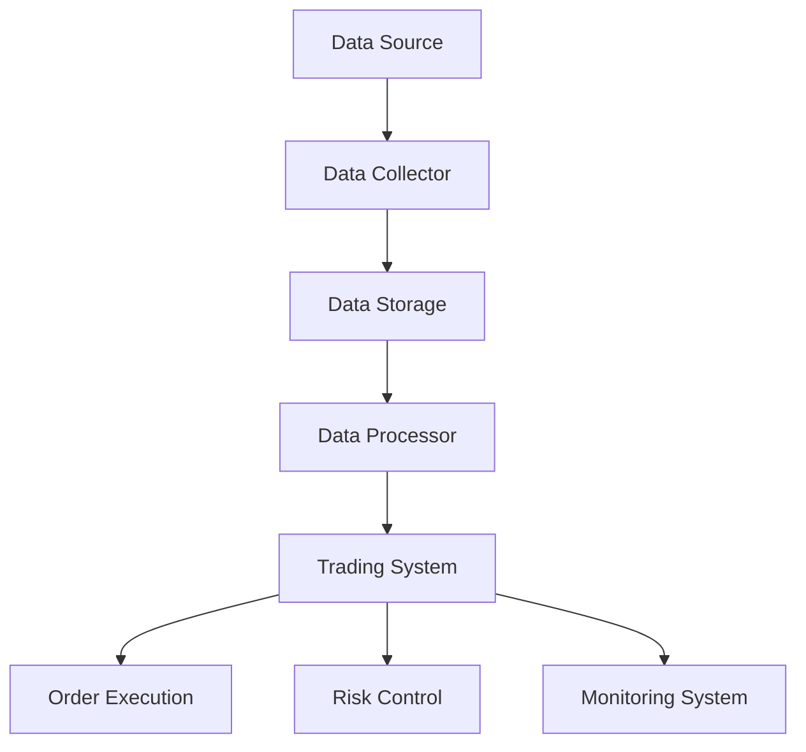

                 

# 《蚂蚁金服2025社招量化交易工程师面试题集》

> **关键词**：量化交易、面试题、工程实践、策略设计、数据分析、平台搭建

> **摘要**：本文旨在为准备参加蚂蚁金服2025社招量化交易工程师面试的考生提供一个全面的面试题集。文章从量化交易基础、策略设计、数据分析到实践项目，再到平台搭建和风险管理，全面覆盖了量化交易的核心知识点。通过具体的案例分析、算法原理讲解、以及实战项目的代码实现，帮助考生深入理解量化交易的核心技术和实践方法。

### 《蚂蚁金服2025社招量化交易工程师面试题集》目录大纲

---

## 第一部分：量化交易基础

### 第1章：量化交易概述

#### 1.1 量化交易的定义与特点

#### 1.2 量化交易的历史与发展趋势

#### 1.3 量化交易与传统交易的比较

### 第2章：量化交易策略设计

#### 2.1 量化交易策略的原理

#### 2.2 常见的量化交易策略

#### 2.3 量化交易策略的设计与优化

### 第3章：量化交易数据分析

#### 3.1 数据收集与处理

#### 3.2 数据可视化

#### 3.3 时间序列分析

## 第二部分：量化交易实践

### 第4章：量化交易项目实战

#### 4.1 项目介绍

#### 4.2 数据获取与预处理

#### 4.3 策略设计

#### 4.4 策略回测与优化

#### 4.5 策略上线与监控

### 第5章：量化交易平台搭建

#### 5.1 平台架构设计

#### 5.2 数据库设计与实现

#### 5.3 交易策略实现

#### 5.4 风险控制与合规性考虑

### 第6章：量化交易风险管理

#### 6.1 风险识别与评估

#### 6.2 风险管理策略

#### 6.3 风险监控与应对措施

### 第7章：量化交易未来展望

#### 7.1 量化交易行业的发展趋势

#### 7.2 新技术对量化交易的影响

#### 7.3 量化交易在金融市场中的角色与地位

## 附录

### 附录A：量化交易相关资源与工具

#### A.1 量化交易相关书籍推荐

#### A.2 量化交易相关网站与论坛

#### A.3 量化交易工具与平台介绍

---

### 引言

量化交易，作为金融科技领域的重要分支，近年来在全球金融市场中占据了越来越重要的地位。随着大数据、人工智能、云计算等新技术的不断发展，量化交易的技术门槛逐渐降低，吸引了越来越多的专业人才加入这一领域。蚂蚁金服作为中国领先的金融科技公司，对量化交易工程师的需求日益增长，2025年的社会招聘更是吸引了众多优秀人才的关注。

本文将针对蚂蚁金服2025社招量化交易工程师的面试，整理出一套全面的面试题集。内容涵盖量化交易的基础知识、策略设计、数据分析、实践项目、平台搭建以及风险管理等方面，旨在帮助考生全面准备，提高面试成功率。文章结构清晰，逻辑严密，通过具体的案例分析、算法讲解和实战项目解读，帮助读者深入理解量化交易的核心技术和实践方法。

### 第一部分：量化交易基础

## 第1章：量化交易概述

### 1.1 量化交易的定义与特点

量化交易，又称为算法交易，是指利用数学模型和计算机算法，对市场数据进行分析，以自动化执行交易决策的一种交易模式。与传统交易相比，量化交易具有以下几个显著特点：

1. **数据驱动**：量化交易依赖于大量历史数据和市场信息，通过数据挖掘和统计分析，找出潜在的盈利模式。
2. **自动化执行**：量化交易使用计算机程序自动执行交易决策，减少了人为干预，提高了交易速度和执行效率。
3. **策略多样性**：量化交易策略可以涵盖多种市场环境，包括趋势跟踪、套利、高频交易等。
4. **风险可控**：通过数学模型和算法优化，量化交易能够对风险进行精确评估和控制。

### 1.2 量化交易的历史与发展趋势

量化交易的历史可以追溯到20世纪70年代，当时美国的一些对冲基金开始使用计算机算法进行交易。随着计算机技术的进步和金融市场的开放，量化交易在全球范围内得到了快速发展。进入21世纪，量化交易逐渐成为金融市场的常态，尤其是高频交易和量化对冲基金在金融市场中的影响力日益扩大。

未来，随着大数据、人工智能、云计算等新技术的进一步应用，量化交易将继续朝着智能化、自动化、精细化的方向发展。例如，利用深度学习和自然语言处理技术，可以更好地理解和预测市场行为；利用云计算技术，可以实现更高效的数据处理和交易执行。

### 1.3 量化交易与传统交易的比较

量化交易与传统交易在多个方面存在显著差异：

1. **决策方式**：传统交易主要依赖于交易员的直觉和经验，而量化交易则依赖于数据和算法。
2. **交易速度**：量化交易可以自动化执行，交易速度远超传统交易，尤其在高频交易领域。
3. **风险控制**：量化交易通过数学模型和算法对风险进行精确评估和控制，传统交易则更多依赖于交易员的经验和感觉。
4. **策略多样性**：量化交易策略更加多样化，可以涵盖各种市场环境和交易策略，传统交易则相对单一。

## 第2章：量化交易策略设计

### 2.1 量化交易策略的原理

量化交易策略的设计基于以下几个核心原理：

1. **数据挖掘**：通过分析大量历史数据，寻找潜在的盈利模式。
2. **概率统计**：利用概率统计方法，评估市场走势和交易策略的成功概率。
3. **数学建模**：建立数学模型，对市场行为进行建模和预测。
4. **算法优化**：通过算法优化，提高交易策略的执行效率和盈利能力。

### 2.2 常见的量化交易策略

量化交易策略多种多样，以下是一些常见的策略：

1. **趋势跟踪策略**：通过分析价格走势，识别市场趋势，并根据趋势进行交易。
2. **均值回归策略**：基于价格回归均值的理论，通过交易价格偏离均值的行为进行交易。
3. **套利策略**：利用不同市场或资产之间的价格差异进行套利。
4. **高频交易策略**：通过快速交易，利用价格波动进行交易。
5. **量化对冲策略**：通过建立对冲策略，降低投资组合的风险。

### 2.3 量化交易策略的设计与优化

量化交易策略的设计与优化是一个复杂的过程，通常包括以下几个步骤：

1. **策略选择**：根据市场环境和投资目标，选择适合的量化交易策略。
2. **数据收集**：收集与策略相关的历史数据和市场信息。
3. **模型建立**：建立数学模型，对市场行为进行建模和预测。
4. **策略回测**：通过历史数据对策略进行回测，评估策略的有效性和风险。
5. **优化调整**：根据回测结果，对策略进行优化和调整。
6. **策略上线**：将策略上线，在实际交易中执行。
7. **持续监控**：对策略进行持续监控，确保其稳定性和有效性。

## 第3章：量化交易数据分析

### 3.1 数据收集与处理

量化交易的数据分析始于数据的收集和处理。数据收集通常包括以下几个方面：

1. **市场数据**：包括股票、期货、外汇等金融市场的价格、成交量、开盘价、收盘价等。
2. **宏观经济数据**：包括GDP、失业率、通货膨胀率等宏观经济指标。
3. **新闻数据**：包括市场新闻、政策变化、重大事件等。
4. **社交媒体数据**：包括社交媒体上的用户评论、情绪分析等。

数据收集后，需要进行处理和清洗，以确保数据的准确性和完整性。数据清洗通常包括去除重复数据、填补缺失值、处理异常值等。

### 3.2 数据可视化

数据可视化是数据分析的重要环节，通过图表、图形等形式，将数据以直观的方式展示出来。常见的数据可视化工具包括Matplotlib、Seaborn、Plotly等。以下是一个使用Matplotlib进行数据可视化的示例：

```python
import matplotlib.pyplot as plt
import pandas as pd

# 加载数据
data = pd.read_csv('market_data.csv')

# 绘制价格走势图
plt.figure(figsize=(10, 6))
plt.plot(data['date'], data['close'])
plt.title('Price Trend')
plt.xlabel('Date')
plt.ylabel('Close Price')
plt.grid(True)
plt.show()
```

### 3.3 时间序列分析

时间序列分析是量化交易中的核心方法之一，主要用于分析市场价格的动态变化和趋势预测。常见的时间序列分析方法包括：

1. **移动平均法**：通过计算一段时间内的平均值，来平滑价格波动，识别市场趋势。
2. **自回归移动平均模型（ARIMA）**：通过自回归和移动平均方法，对时间序列进行建模和预测。
3. **指数平滑法**：通过加权平均方法，对时间序列进行平滑处理，识别市场趋势。
4. **支持向量回归（SVR）**：通过支持向量机方法，对时间序列进行建模和预测。

以下是一个使用ARIMA模型进行时间序列分析的示例：

```python
from statsmodels.tsa.arima.model import ARIMA
import pandas as pd

# 加载数据
data = pd.read_csv('market_data.csv')

# 处理时间序列数据
data['close'] = pd.to_datetime(data['date'])
data.set_index('close', inplace=True)
data = data.asfreq('B').fillna(method='ffill')

# 建立ARIMA模型
model = ARIMA(data['close'], order=(5, 1, 2))
model_fit = model.fit()

# 预测未来价格
forecast = model_fit.forecast(steps=5)

# 绘制预测结果
plt.figure(figsize=(10, 6))
plt.plot(data.index, data['close'], label='Actual')
plt.plot(pd.date_range(start=data.index[-1], periods=5, freq='B'), forecast, label='Forecast')
plt.title('Price Forecast')
plt.xlabel('Date')
plt.ylabel('Close Price')
plt.legend()
plt.show()
```

## 第二部分：量化交易实践

### 第4章：量化交易项目实战

#### 4.1 项目介绍

本项目旨在开发一个基于均值回归策略的量化交易系统，用于股票市场的交易。系统将收集股票市场的历史数据，使用均值回归模型进行预测，并根据预测结果进行交易决策。

#### 4.2 数据获取与预处理

首先，需要从股票市场获取历史数据。可以使用API接口或数据提供商获取数据。以下是一个使用Python的Tushare库获取股票数据的示例：

```python
import tushare as ts
import pandas as pd

# 获取股票数据
code = '600000.SH'  # 上海证券交易所股票代码
start_date = '2020-01-01'
end_date = '2023-01-01'
data = ts.get_k_data(code, start=start_date, end=end_date)

# 数据预处理
data.set_index('date', inplace=True)
data = data.asfreq('B').fillna(method='ffill')
data['return'] = data['close'].pct_change()
```

#### 4.3 策略设计

均值回归策略的基本原理是：股票价格会围绕其长期平均值波动，价格偏离均值后会回归到均值。因此，可以通过计算价格偏离均值的程度，来确定交易信号。

具体来说，可以使用以下步骤设计均值回归策略：

1. **计算移动平均**：计算一段时间内的移动平均价格，作为长期均值。
2. **计算价格偏离均值**：计算当前价格与移动平均价格之间的偏离程度。
3. **设置交易信号**：当价格偏离均值超过一定阈值时，发出买入或卖出的信号。
4. **设置止损和止盈**：为了控制风险，设置止损和止盈点，以限制潜在的亏损和收益。

#### 4.4 策略回测与优化

回测是验证策略有效性的重要步骤。可以使用历史数据进行回测，评估策略的盈利能力和风险。以下是一个使用Python进行策略回测的示例：

```python
import numpy as np
import pandas as pd

# 定义策略回测函数
def backtest(data, window=20, threshold=0.05):
    # 计算移动平均
    data['moving_average'] = data['close'].rolling(window=window).mean()
    
    # 计算价格偏离均值
    data['deviation'] = data['close'] - data['moving_average']
    
    # 设置交易信号
    data['signal'] = np.where(data['deviation'] > threshold, 1, 0)
    
    # 计算交易结果
    data['position'] = data['signal'].diff()
    data['trades'] = data['position'].cumsum().abs()
    data['pnl'] = data['trades'] * data['return']
    data['cumulative_pnl'] = data['pnl'].cumsum()
    
    # 计算策略收益
    data['strategy_return'] = data['cumulative_pnl'] / data['return'].iloc[0]
    
    return data

# 进行策略回测
data = backtest(data)

# 绘制回测结果
plt.figure(figsize=(10, 6))
plt.plot(data.index, data['cumulative_pnl'], label='Cumulative PnL')
plt.plot(data.index, data['return'], label='Market Return')
plt.title('Backtest Result')
plt.xlabel('Date')
plt.ylabel('Return')
plt.legend()
plt.show()
```

#### 4.5 策略上线与监控

策略上线后，需要对其进行持续监控，以确保其稳定性和有效性。监控内容通常包括：

1. **交易结果监控**：监控策略的盈利能力、亏损情况等。
2. **风险监控**：监控策略的风险指标，如最大回撤、夏普比率等。
3. **系统性能监控**：监控交易系统的运行状态，如延迟、错误率等。

## 第5章：量化交易平台搭建

#### 5.1 平台架构设计

量化交易平台的设计需要考虑以下几个方面：

1. **数据处理**：设计高效的数据处理系统，用于数据收集、存储、清洗和分析。
2. **交易执行**：设计高效的交易执行系统，用于生成交易信号并执行交易。
3. **风险控制**：设计风险控制系统，用于监控和管理交易风险。
4. **监控系统**：设计监控系统，用于实时监控交易系统的运行状态和性能。

以下是一个简单的量化交易平台架构图：



#### 5.2 数据库设计与实现

数据库是量化交易平台的核心组成部分，用于存储和管理交易数据。以下是一个简单的数据库设计：

1. **股票数据库**：存储股票的历史数据，包括价格、成交量、开盘价、收盘价等。
2. **交易数据库**：存储交易信号、交易记录、交易结果等。
3. **风险数据库**：存储风险指标、风险控制策略等。

以下是一个使用Python的SQLite数据库进行数据存储的示例：

```python
import sqlite3
import pandas as pd

# 连接数据库
conn = sqlite3.connect('market_data.db')

# 创建表
data = pd.DataFrame({'date': ['2020-01-01', '2020-01-02'], 'close': [100, 102]})
data.to_sql('stock_data', conn, index=False)

# 查询数据
data = pd.read_sql_query('SELECT * FROM stock_data', conn)
print(data)
```

#### 5.3 交易策略实现

交易策略的实现是量化交易平台的另一个核心组成部分。以下是一个使用Python实现均值回归策略的示例：

```python
import numpy as np
import pandas as pd

# 定义策略函数
def mean_reversion_strategy(data, window=20, threshold=0.05):
    # 计算移动平均
    data['moving_average'] = data['close'].rolling(window=window).mean()
    
    # 计算价格偏离均值
    data['deviation'] = data['close'] - data['moving_average']
    
    # 设置交易信号
    data['signal'] = np.where(data['deviation'] > threshold, 1, 0)
    
    # 计算交易结果
    data['position'] = data['signal'].diff()
    data['trades'] = data['position'].cumsum().abs()
    data['pnl'] = data['trades'] * data['return']
    data['cumulative_pnl'] = data['pnl'].cumsum()
    
    return data

# 加载数据
data = pd.read_csv('market_data.csv')

# 应用策略
data = mean_reversion_strategy(data)

# 绘制结果
plt.figure(figsize=(10, 6))
plt.plot(data['date'], data['cumulative_pnl'])
plt.title('Strategy PnL')
plt.xlabel('Date')
plt.ylabel('Cumulative PnL')
plt.show()
```

#### 5.4 风险控制与合规性考虑

风险控制是量化交易平台的重要环节，关系到交易的稳定性和盈利能力。以下是一些常见的风险控制方法和合规性考虑：

1. **止损和止盈**：设置止损和止盈点，以限制潜在的亏损和收益。
2. **仓位管理**：控制单笔交易和整体仓位的风险，避免过度交易。
3. **风险指标监控**：监控最大回撤、夏普比率等风险指标，确保风险在可控范围内。
4. **合规性检查**：确保交易策略和执行过程符合相关法律法规和交易所规则。

## 第6章：量化交易风险管理

#### 6.1 风险识别与评估

风险识别和评估是量化交易风险管理的重要步骤。以下是一些常见的风险类型：

1. **市场风险**：由于市场价格波动导致的潜在亏损。
2. **信用风险**：由于交易对手违约导致的亏损。
3. **操作风险**：由于人为错误或系统故障导致的亏损。
4. **流动性风险**：由于市场流动性不足导致的交易困难或亏损。

以下是一个使用Python进行市场风险评估的示例：

```python
import numpy as np
import pandas as pd

# 定义风险评估函数
def market_risk_assessment(data, confidence_level=0.95):
    # 计算收益率
    data['return'] = data['close'].pct_change()
    
    # 计算累计收益
    data['cumulative_return'] = data['return'].cumsum()
    
    # 计算VaR（Value at Risk）
    mean_return = np.mean(data['return'])
    std_return = np.std(data['return'])
    alpha = 1 - confidence_level
    var = -np.percentile(data['return'], alpha * 100)
    vaR = var * data.shape[0]
    
    return vaR

# 加载数据
data = pd.read_csv('market_data.csv')

# 进行风险评估
vaR = market_risk_assessment(data)

print(f'VaR at {100 * (1 - confidence_level)}% confidence level: {vaR}')
```

#### 6.2 风险管理策略

风险管理策略是量化交易的核心，用于控制和管理交易风险。以下是一些常见的管理策略：

1. **止损和止盈**：设置止损和止盈点，以限制潜在的亏损和收益。
2. **仓位管理**：控制单笔交易和整体仓位的风险，避免过度交易。
3. **分散投资**：通过分散投资，降低单一资产的潜在亏损。
4. **动态调整**：根据市场变化和交易结果，动态调整交易策略和风险控制参数。

#### 6.3 风险监控与应对措施

风险监控和应对措施是量化交易风险管理的最后一步。以下是一些常见的方法：

1. **实时监控**：通过实时监控系统，监控交易系统的运行状态和交易结果。
2. **定期评估**：定期评估交易策略的有效性和风险水平，调整策略和风险控制参数。
3. **应急预案**：制定应急预案，应对突发事件和市场异常波动。
4. **培训与教育**：对交易员和风险管理人员进行培训，提高风险意识和应对能力。

## 第7章：量化交易未来展望

#### 7.1 量化交易行业的发展趋势

随着大数据、人工智能、云计算等新技术的不断发展，量化交易行业正朝着智能化、自动化、精细化的方向发展。以下是一些主要的发展趋势：

1. **算法交易普及**：越来越多的金融机构和投资者采用量化交易策略，提高交易效率和盈利能力。
2. **高频交易扩张**：高频交易技术不断进步，交易速度和频率进一步提高，市场份额不断扩大。
3. **机器学习应用**：利用机器学习技术，提高市场预测和交易策略的准确性和效率。
4. **区块链技术融合**：区块链技术的融合，为量化交易提供了新的交易模式和监管手段。

#### 7.2 新技术对量化交易的影响

新技术的发展对量化交易带来了深远的影响，以下是一些具体的影响：

1. **数据处理能力提升**：大数据技术和分布式计算技术的发展，使得海量数据处理能力大幅提升，为量化交易提供了更丰富和详细的数据支持。
2. **交易速度提升**：云计算技术和网络技术的进步，使得交易系统的处理速度和延迟大幅降低，为高频交易提供了更好的技术基础。
3. **风险控制加强**：人工智能和机器学习技术的应用，使得风险识别和评估能力大幅提升，为风险控制提供了更准确的依据。

#### 7.3 量化交易在金融市场中的角色与地位

量化交易在金融市场中的角色和地位日益重要，以下是一些具体的表现：

1. **市场主导力量**：量化交易策略在全球金融市场中的影响力不断扩大，成为市场主导力量之一。
2. **风险控制能力**：量化交易通过科学的策略和风险控制手段，有效降低了金融市场的系统性风险。
3. **创新驱动力量**：量化交易技术的不断创新，推动了金融市场的创新和发展，为金融市场的繁荣提供了动力。

## 附录A：量化交易相关资源与工具

### A.1 量化交易相关书籍推荐

1. 《量化交易：从理论到实战》
2. 《机器学习在量化交易中的应用》
3. 《高频交易：原理与实践》
4. 《风险管理：模型与应用》
5. 《金融科技：大数据、人工智能与区块链》

### A.2 量化交易相关网站与论坛

1. [量化交易论坛](https://www.quantopian.com/forums)
2. [量化投资中国网](http://www.qizhiw.com/)
3. [知乎量化交易专栏](https://zhuanlan.zhihu.com/c_1268042416087641856)
4. [机器学习交易网](https://www.mltalks.com/)

### A.3 量化交易工具与平台介绍

1. **量化交易平台**：
   - [TradingView](https://www.tradingview.com/)：一个强大的图表和数据可视化工具，支持多种交易策略。
   - [Barchart](https://www.barchart.com/)：一个提供广泛金融数据和工具的平台，支持量化交易策略的开发。

2. **量化交易库**：
   - [NumPy](https://numpy.org/)：一个用于科学计算的Python库，支持大量数学和统计功能。
   - [Pandas](https://pandas.pydata.org/)：一个用于数据分析和操作的Python库，支持数据清洗、转换和可视化。
   - [Matplotlib](https://matplotlib.org/)：一个用于绘制数据图表的Python库，支持多种图表类型。

### 附录B：常见量化交易面试问题及解答

#### 问题1：请解释量化交易的核心概念和原理。

**解答**：量化交易是指使用数学模型和计算机算法对市场数据进行分析，以自动化执行交易决策的一种交易模式。核心概念包括数据驱动、自动化执行、策略多样性和风险可控。原理基于数据挖掘、概率统计、数学建模和算法优化。

#### 问题2：请举例说明一种常见的量化交易策略。

**解答**：均值回归策略是一种常见的量化交易策略。其基本原理是股票价格会围绕其长期平均值波动，当价格偏离均值时，会回归到均值。通过计算价格偏离均值，设置交易信号，并根据信号进行买入或卖出。

#### 问题3：如何进行量化交易策略的回测和优化？

**解答**：量化交易策略的回测和优化通常包括以下几个步骤：1）数据收集与预处理；2）策略设计；3）策略回测；4）优化调整；5）策略上线。回测可以通过模拟历史数据，评估策略的有效性和风险。优化可以通过调整参数、改进算法等手段提高策略的性能。

#### 问题4：请解释时间序列分析在量化交易中的应用。

**解答**：时间序列分析是量化交易中的核心方法之一，主要用于分析市场价格的动态变化和趋势预测。常见的时间序列分析方法包括移动平均法、自回归移动平均模型（ARIMA）、指数平滑法等。通过时间序列分析，可以识别市场趋势，预测未来价格，为交易决策提供依据。

#### 问题5：请解释量化交易平台架构的核心组成部分。

**解答**：量化交易平台架构的核心组成部分包括数据处理、交易执行、风险控制和监控系统。数据处理用于数据收集、存储、清洗和分析；交易执行用于生成交易信号并执行交易；风险控制用于监控和管理交易风险；监控系统用于实时监控交易系统的运行状态和性能。

### 附录C：量化交易面试技巧

#### 技巧1：充分准备

在面试前，充分准备是非常重要的。熟悉量化交易的基本概念、常见策略、数据分析方法和工具。同时，了解被面试公司的业务和背景，针对性地准备相关问题。

#### 技巧2：逻辑清晰

在回答问题时，保持逻辑清晰、条理分明。可以采用“问题-分析-解答”的结构，先回答问题，然后分析相关概念或原理，最后给出具体的解答或建议。

#### 技巧3：实战经验

在面试过程中，可以适当分享自己的量化交易项目经验和成果。通过具体的案例，展示自己在量化交易领域的专业能力和实践经验。

#### 技巧4：积极沟通

在面试过程中，保持积极沟通的态度。积极提问，表达自己对问题的理解和思考。同时，倾听面试官的问题和建议，及时回应和调整自己的回答。

### 结语

量化交易作为金融科技领域的重要分支，吸引了越来越多的人才关注。本文从量化交易的基础知识、策略设计、数据分析、实践项目、平台搭建和风险管理等方面，为准备参加蚂蚁金服2025社招量化交易工程师面试的考生提供了一个全面的面试题集。通过具体的案例分析、算法讲解和实战项目解读，帮助考生深入理解量化交易的核心技术和实践方法。希望本文对考生们的面试准备有所帮助，祝大家在面试中取得优异成绩！

---

**作者：AI天才研究院/AI Genius Institute & 禅与计算机程序设计艺术 /Zen And The Art of Computer Programming**

