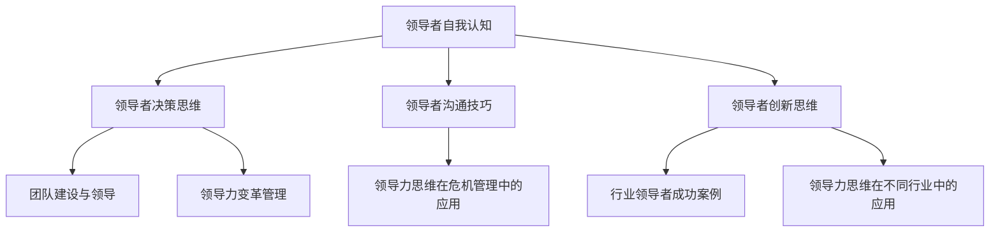

                 

### 引言：领导力的时代意义

在当今快速变化和高度竞争的商业环境中，领导力成为企业持续成功的关键因素。领导力不仅关乎企业的战略方向和执行力，更关乎员工的士气、团队的凝聚力和创新精神。本文旨在探讨领导力思维，旨在帮助读者理解领导力的本质，掌握提升领导力的方法，从而在各自的领域取得更大的成就。

**领导力的定义和分类**

领导力是一个广泛且多层次的概念，不同的学者和专家对其有着各自的定义。一般而言，领导力可以被定义为影响和激励他人共同达成目标的能力。根据不同的标准，领导力可以分类为：

1. **传统领导力**：以权威和指令为中心，领导者通过命令和控制来确保目标的实现。
2. **变革型领导力**：通过激发员工的潜能和创造力，推动组织实现变革和进步。
3. **服务型领导力**：将员工的成长和发展放在首位，领导者被视为服务的提供者，而非简单的指令者。

**当代企业面临的领导力挑战**

在当代企业中，领导力面临着诸多挑战：

1. **全球化**：全球化带来了文化多样性和市场复杂性，领导者需要具备跨文化沟通和协调能力。
2. **技术变革**：技术的迅猛发展要求领导者不断学习新技能和知识，以适应快速变化的市场环境。
3. **员工期望**：现代员工更加注重自我实现和职业发展，领导者需要能够理解并满足这些期望。
4. **环境可持续性**：企业面临的环保和可持续发展要求，领导者需要在经营策略中融入社会责任。

**领导力思维的重要性**

领导力思维是领导者处理问题、作出决策和影响他人的思维方式。拥有良好的领导力思维，可以帮助领导者更好地应对各种挑战，实现组织的长期目标。领导力思维包括以下几个方面：

1. **自我认知**：领导者需要深入了解自己的价值观、优势和不足，以便在领导过程中做出更为明智的决策。
2. **决策思维**：领导者需要掌握科学的决策方法，确保决策的合理性和有效性。
3. **沟通技巧**：有效的沟通能够增强团队的凝聚力，提高工作效率。
4. **创新思维**：创新是企业持续发展的动力，领导者需要鼓励创新思维，推动组织不断进步。

**本文结构**

本文将分为五个部分：

1. **领导力思维概述**：介绍领导力的定义、分类和核心概念。
2. **领导力思维原理**：探讨领导者自我认知、决策思维、沟通技巧和创新思维。
3. **领导力思维实践**：讨论团队建设、领导力变革管理和危机管理。
4. **领导力思维案例分析**：分析行业领导者的成功案例，探讨领导力思维在不同行业中的应用。
5. **领导力思维修炼**：提供领导力思维的持续发展方法和评估反馈机制。

通过本文的阅读，读者将能够系统地了解领导力思维的核心内容，掌握提升领导力的方法和实践技巧，从而在各自领域取得更大的成就。

### 领导力思维的核心概念

在深入探讨领导力思维之前，我们需要明确几个核心概念，以便为后续的讨论奠定基础。这些核心概念包括领导力与管理的区别、领导力的四个关键要素以及领导力思维框架。

**领导力与管理的区别**

领导力和管理虽然密切相关，但它们在本质上有明显的区别。管理强调的是规范、流程和效率，主要关注的是任务的完成和组织资源的有效利用。而领导力则更侧重于激励、愿景和变革，关注的是激发员工的潜能，推动组织实现长远目标。

1. **管理是执行，领导力是引领**：管理者负责确保组织的日常运营顺利进行，而领导者则负责为组织设定愿景，引领团队朝着这个愿景前进。
2. **管理是控制，领导力是影响**：管理者通过制定规则和监督来控制员工的行为，而领导者则通过沟通、激励和示范来影响员工的态度和行为。
3. **管理是解决问题，领导力是预防问题**：管理者通常在问题发生时进行干预和解决，而领导者则通过预见问题，提前采取措施来预防问题的发生。

**领导力的四个关键要素**

有效的领导力不仅需要具备明确的目标和愿景，还需要在以下几个方面下功夫：

1. **愿景与目标**：领导者需要明确组织的愿景和目标，并将其传达给团队成员，激发他们的热情和动力。
2. **信任与尊重**：建立信任和尊重是领导力的基石。领导者需要通过言行一致、公正透明和关怀支持来赢得员工的信任和尊重。
3. **沟通与协作**：有效的沟通和协作是团队成功的关键。领导者需要学会倾听、表达和协调，确保团队成员之间的信息畅通和目标一致。
4. **创新与适应**：领导者需要具备创新思维和适应能力，能够在不断变化的环境中迅速作出反应，推动组织实现持续发展。

**领导力思维框架**

为了更好地理解和应用领导力思维，我们可以借助Mermaid流程图来构建一个领导力思维框架。以下是一个简化的领导力思维模型：



这个模型展示了领导力思维的各个关键要素及其相互关系。通过这个框架，领导者可以系统地思考和评估自己在不同方面的表现，从而有针对性地提升领导力。

**领导者自我认知**

领导者自我认知是领导力思维的基础。自我认知包括以下几个方面：

1. **自我反思**：领导者需要定期反思自己的行为、决策和思维方式，识别自己的优点和不足。
2. **自我发展**：基于自我反思的结果，领导者需要制定个人发展计划，不断学习新知识和技能，提升自身能力。
3. **情绪智力**：情绪智力是指领导者识别、理解和管理自己及他人情绪的能力。高情绪智力有助于建立信任和团队凝聚力。

**领导者决策思维**

有效的决策是领导者成功的关键。领导者需要掌握以下决策思维：

1. **问题定义**：明确问题的本质和范围，确保决策的针对性和有效性。
2. **信息收集**：广泛收集相关信息，包括数据、意见和反馈，为决策提供充分依据。
3. **方案评估**：对比不同方案的优缺点，选择最符合组织目标和价值观的方案。
4. **风险评估**：评估决策可能带来的风险，制定相应的应对策略。

**领导者沟通技巧**

沟通是领导力的核心能力。领导者需要掌握以下沟通技巧：

1. **倾听**：积极倾听员工的需求和意见，建立双向沟通。
2. **表达**：清晰、准确地表达自己的想法和期望，避免误解和冲突。
3. **协调**：在团队内部和外部协调各方利益，确保沟通的顺畅和有效。
4. **反馈**：及时给予员工反馈，鼓励积极行为，纠正错误和不足。

**领导者创新思维**

创新是组织持续发展的动力。领导者需要具备以下创新思维：

1. **开放心态**：接受新观念和新方法，勇于尝试和实验。
2. **跨学科思维**：将不同领域的知识和方法融合，创造新的解决方案。
3. **风险意识**：勇于承担风险，从失败中吸取教训，不断改进和创新。
4. **激励创新**：营造鼓励创新的文化氛围，激励员工提出新想法和建议。

通过理解和掌握这些核心概念，领导者可以在实践中更加系统地应用领导力思维，提升自身的领导能力，推动组织实现长远目标。

### 领导者自我认知

领导者自我认知是领导力思维的核心要素之一，它不仅关乎领导者个人的成长，也直接影响团队的绩效和组织的长远发展。自我认知包括自我反思、自我发展和情绪智力等方面。

**自我反思**

自我反思是领导者自我认知的重要步骤。通过定期反思自己的行为、决策和思维方式，领导者可以识别自己的优点和不足，从而在未来的工作中进行有针对性的改进。

1. **自我反思的重要性**

   自我反思有助于领导者：

   - **识别问题**：通过反思，领导者可以发现自己在管理过程中存在的问题，如决策失误、沟通不畅等。
   - **自我提升**：反思过程中，领导者可以总结经验教训，提升自身的管理水平。
   - **促进成长**：自我反思促使领导者不断学习和进步，以适应不断变化的外部环境。

2. **自我反思的方法**

   - **日记反思**：每天或每周记录自己的工作日志，总结工作中的亮点和不足。
   - **定期回顾**：每月或每季度进行一次全面回顾，分析自己在不同方面的表现。
   - **与同事交流**：与团队成员进行交流，听取他们的反馈和建议。

**自我发展**

自我发展是领导者不断提升自身能力的过程。通过学习新知识和技能，领导者可以适应不断变化的市场环境，带领团队取得更好的成绩。

1. **自我发展的必要性**

   在当今快速变化的时代，领导者需要具备以下能力：

   - **技术技能**：随着技术的发展，领导者需要掌握新的技术工具和方法。
   - **管理技能**：领导者需要不断提升管理能力，如领导力、团队建设、变革管理等。
   - **人际交往能力**：良好的沟通和人际关系处理能力对于领导者至关重要。

2. **自我发展的路径**

   - **持续学习**：领导者可以通过读书、参加培训课程和研讨会来不断学习新知识。
   - **实践经验**：通过参与实际项目和管理实践，领导者可以提升自己的管理能力和解决问题的能力。
   - **导师指导**：寻求导师的指导和反馈，有助于领导者快速成长。

**情绪智力**

情绪智力是指领导者识别、理解和管理自己及他人情绪的能力。高情绪智力有助于领导者建立信任和团队凝聚力，提高领导效果。

1. **情绪智力的重要性**

   情绪智力对领导者的作用包括：

   - **增强团队凝聚力**：领导者通过理解和管理团队成员的情绪，可以增强团队的凝聚力，提高工作效率。
   - **提升沟通效果**：情绪智力有助于领导者更好地理解和表达团队成员的情绪，减少误解和冲突。
   - **促进决策**：情绪智力有助于领导者更全面地考虑问题，减少因情绪波动导致的决策失误。

2. **提高情绪智力的方法**

   - **自我意识**：领导者需要认识到自己的情绪反应，学会控制和调节情绪。
   - **同理心**：领导者需要学会站在他人的角度思考问题，理解他人的情绪和需求。
   - **积极沟通**：通过积极倾听和表达，领导者可以更好地理解和满足团队成员的情绪需求。

通过领导者自我认知，领导者可以更好地了解自己的优势和不足，制定个人发展计划，提高情绪智力，从而在领导过程中更加自信和有效地影响团队成员，推动组织的长远发展。

### 领导者决策思维

决策思维是领导者处理问题和作出决策的核心能力，有效的决策思维能够确保领导者作出的决策合理、科学，并能够有效推动组织的长远发展。以下是领导者决策思维的核心原则、过程和工具。

**决策思维的核心原则**

1. **系统性思维**：领导者需要从整体和长远的角度出发，考虑决策对组织各个方面的潜在影响。
2. **数据驱动的决策**：基于准确的数据和信息进行决策，减少主观判断带来的风险。
3. **情境适应性**：领导者需要根据不同的情境和环境变化，灵活调整决策策略。
4. **风险意识**：在决策过程中，领导者需要识别潜在的风险，并制定相应的应对措施。

**决策过程**

有效的决策过程通常包括以下几个步骤：

1. **问题定义**：明确问题的本质和范围，确保决策的针对性和有效性。这可以通过对问题进行深入分析和与团队成员讨论来实现。
   
2. **信息收集**：广泛收集相关信息，包括数据、意见和反馈，为决策提供充分的依据。信息来源可以包括内部数据、市场调研、行业报告等。

3. **方案评估**：对比不同方案的优缺点，选择最符合组织目标和价值观的方案。评估标准可以包括可行性、成本效益、风险程度等。

4. **决策制定**：基于评估结果，制定最终决策。在决策过程中，领导者需要考虑利益相关者的需求和期望，确保决策的公平性和合理性。

5. **决策执行**：将决策转化为具体的行动，确保决策得到有效执行。执行过程中，领导者需要监督和调整，确保决策目标的实现。

6. **决策反馈**：在决策执行后，对决策效果进行评估和反馈。通过反馈，领导者可以识别决策的优点和不足，为未来的决策提供参考。

**决策模型与工具**

为了更好地进行决策，领导者可以借助以下模型和工具：

1. **SWOT分析**：通过分析组织的优势（Strengths）、劣势（Weaknesses）、机会（Opportunities）和威胁（Threats），帮助领导者制定战略和决策。

   **公式：**
   $$
   SWOT = \begin{cases}
   S + W \\
   O + T \\
   S \times O \\
   W \times T
   \end{cases}
   $$

2. **决策树**：通过构建决策树，明确不同决策路径的潜在结果和概率，帮助领导者进行复杂决策。

   **公式：**
   $$
   DecisionTree = \{ node1, node2, \ldots, noden \}
   $$

3. **成本效益分析**：通过比较决策带来的成本和预期效益，评估决策的可行性。

   **公式：**
   $$
   CostBenefit = \frac{ExpectedBenefits}{TotalCost}
   $$

4. **关键绩效指标（KPI）**：通过设定关键绩效指标，监控决策执行过程中的关键指标，评估决策效果。

   **公式：**
   $$
   KPI = \{ PerformanceMetrics \}
   $$

通过以上决策思维的核心原则、过程和工具，领导者可以更加科学和有效地进行决策，确保组织的战略目标和长期发展。

### 领导者沟通技巧

有效的沟通是领导者成功的关键因素之一，它不仅能够增强团队的凝聚力，还能够提高工作效率和决策质量。领导者需要掌握以下沟通技巧：

**有效沟通的要素**

1. **清晰表达**：领导者需要能够清晰、准确地表达自己的想法和期望，避免产生误解和混淆。这包括使用简单明了的语言，避免使用专业术语和复杂句子。

2. **积极倾听**：积极倾听是有效沟通的重要部分。领导者需要耐心倾听团队成员的意见和建议，理解他们的需求和关切，从而做出更为合理的决策。

3. **非语言沟通**：非语言沟通包括肢体语言、面部表情和眼神交流等。领导者需要通过适当的非语言沟通，增强沟通的效果，建立信任和尊重。

4. **适应性沟通**：领导者需要根据不同听众的特点和环境，调整沟通的方式和内容，确保信息能够被有效传达。

**沟通障碍与解决策略**

1. **文化差异**：全球化带来了文化多样性，不同文化背景的团队成员可能存在沟通障碍。领导者可以通过组织跨文化培训，提高团队的文化敏感度，减少文化冲突。

2. **信息过载**：在信息爆炸的时代，团队成员可能面临信息过载的问题，难以准确理解和处理信息。领导者可以通过定期信息会议和简报，确保信息传递的效率和准确性。

3. **情感因素**：情感因素可能会影响沟通的有效性，如情绪波动、压力和焦虑等。领导者需要关注团队成员的情感状态，通过积极倾听和支持，帮助他们缓解压力，提高沟通效果。

4. **时间管理**：有效的时间管理是确保沟通顺利进行的关键。领导者需要合理安排沟通时间，确保沟通活动有足够的准备和讨论时间。

**具体案例分析**

1. **案例分析：成功的企业沟通**

   亚马逊的创始人杰夫·贝佐斯以其独特的沟通风格而著称。他通过每周的员工邮件与全球员工进行沟通，邮件内容简明扼要，直接回答员工的问题，传递公司的战略和愿景。这种开放、透明的沟通方式增强了员工对公司的信任和归属感，提升了整体沟通效果。

2. **案例分析：失败的沟通案例**

   在某些企业中，沟通不畅导致项目失败。例如，一个IT项目由于项目经理与开发团队之间的沟通不畅，导致项目进度延误，最终未能按时交付。这个案例表明，领导者如果无法有效沟通，可能会带来严重的后果。

通过掌握有效的沟通技巧，解决沟通障碍，领导者可以更好地传达信息、激发团队潜力，推动组织的长远发展。

### 领导者创新思维

创新思维是领导者推动组织持续发展的重要能力，它不仅关乎企业的竞争力，也决定着企业在快速变化的市场环境中的生存和发展。以下将探讨创新思维的重要性、培养方法以及在实际工作中的应用。

**创新思维的重要性**

1. **驱动经济增长**：创新能够创造新的产品和服务，满足市场的需求，推动经济增长。例如，互联网的兴起不仅改变了传统的商业模式，还催生了众多新兴产业。

2. **提高竞争力**：创新思维能够帮助企业不断创新，提高产品和服务的质量，降低成本，从而在市场竞争中脱颖而出。

3. **激发员工潜力**：鼓励创新思维可以激发员工的创造力和积极性，提高员工的工作满意度和忠诚度。

4. **提升组织文化**：创新文化是组织发展的重要动力。一个鼓励创新的组织能够吸引和留住优秀的员工，形成良性循环。

**创新思维的培养方法**

1. **持续学习**：创新需要不断的学习和积累。领导者需要通过读书、参加培训和学习新技能，不断提升自己的知识储备和思维广度。

2. **跨学科思维**：领导者需要具备跨学科的思维，能够将不同领域的知识和方法融合，创造新的解决方案。

3. **鼓励失败**：创新往往伴随着失败。领导者需要鼓励员工勇于尝试，从失败中吸取教训，不断改进。

4. **建立创新机制**：组织需要建立一套创新机制，包括鼓励创新的思想、创新的流程和创新的资源支持，确保创新思维能够得到有效的应用。

**创新思维在实际工作中的应用**

1. **产品创新**：通过创新思维，企业可以开发出更具竞争力的产品。例如，苹果公司通过不断的产品创新，成为全球最具价值的品牌之一。

2. **服务创新**：服务创新可以提高客户的满意度和忠诚度。例如，奈飞通过创新的服务模式，如在线流媒体和个性化推荐，赢得了大量用户。

3. **管理创新**：创新思维可以应用于管理实践，提高组织的效率和效果。例如，丰田公司通过精益管理创新，大幅提高了生产效率和产品质量。

**案例分析：谷歌的创新思维**

谷歌以其创新文化而闻名，公司鼓励员工创新，提供充足的资源和时间，让员工自由探索新的想法。例如，谷歌的“20%时间项目”允许员工将20%的工作时间用于探索个人感兴趣的创新项目。这种创新机制激发了员工的创造力，产生了诸如AdSense和Gmail等成功的创新产品。

通过培养创新思维，并在实际工作中应用这些思维，领导者可以推动组织的创新和发展，提升企业的竞争力，实现长期成功。

### 团队建设与领导

团队建设与领导是领导力的重要组成部分，良好的团队建设和有效的领导能够增强团队的凝聚力，提高工作效率和绩效。以下将讨论团队角色的理解、团队冲突的管理以及如何通过领导力提升团队绩效。

**团队角色的理解**

1. **领导者**：领导者负责设定团队的愿景和目标，提供方向和指导。他们需要具备领导力、沟通能力和决策能力，确保团队成员齐心协力实现目标。

2. **团队成员**：团队成员是团队的核心力量，他们各自承担不同的角色和职责。有效的团队成员需要具备专业技能、协作精神和责任感。

3. **协调者**：协调者负责在团队成员之间搭建沟通桥梁，解决冲突和协调资源。他们需要具备良好的沟通技巧和协调能力。

4. **执行者**：执行者负责将团队目标和计划转化为具体的行动，确保任务的顺利完成。

**团队冲突的管理**

1. **冲突的类型**：团队冲突可以分为建设性冲突和破坏性冲突。建设性冲突能够激发团队创新和进步，而破坏性冲突则可能损害团队关系和绩效。

2. **冲突的原因**：团队冲突的原因包括资源分配不均、目标不一致、沟通不畅、个人价值观差异等。

3. **冲突管理策略**：
   - **预防策略**：通过明确的团队目标和沟通机制，预防潜在冲突的发生。
   - **解决策略**：通过积极沟通和调解，解决现有冲突，恢复团队的和谐。

4. **管理冲突的技巧**：
   - **倾听和理解**：领导者需要倾听团队成员的意见和需求，理解冲突的根源。
   - **中立立场**：在冲突中保持中立，避免偏袒任何一方，以公正的方式处理冲突。
   - **建设性对话**：引导团队成员进行建设性对话，寻求双赢的解决方案。

**如何通过领导力提升团队绩效**

1. **设定明确的目标和愿景**：领导者需要明确团队的目标和愿景，确保团队成员了解团队的方向和使命，从而增强团队的凝聚力。

2. **提供必要的资源和支持**：领导者需要确保团队拥有实现目标所需的资源和支持，包括资金、技术、培训和指导等。

3. **激励和奖励**：领导者需要通过激励和奖励机制，激发团队成员的积极性和创造力，提高团队的绩效。

4. **培养团队精神**：通过团队建设活动和文化塑造，培养团队成员之间的信任和协作精神，增强团队凝聚力。

5. **有效沟通**：领导者需要与团队成员保持良好的沟通，确保信息的畅通和透明，减少误解和冲突。

通过理解团队角色、有效管理冲突以及运用领导力提升团队绩效，领导者可以构建一个高效、和谐的团队，推动组织实现长期成功。

### 领导力变革管理

变革管理是领导力中至关重要的一环，企业在面对市场变化、技术进步和内部管理需求时，往往需要进行变革。成功的变革管理能够确保企业在变革过程中保持稳定，实现战略目标。以下将讨论领导力变革管理的原则、过程中的挑战以及应对策略。

**变革管理的原则**

1. **明确目标**：领导者需要明确变革的目标，确保团队成员了解变革的必要性和方向。目标应具有明确性、可行性和可量化性。

2. **领导先行**：领导者作为变革的推动者，需要以身作则，率先支持和参与变革。通过领导者的示范作用，可以增强团队成员对变革的信心和参与度。

3. **沟通透明**：有效的沟通是变革管理的关键。领导者需要通过透明、及时的沟通，确保团队成员了解变革的进展和影响，减少误解和猜疑。

4. **利益相关者参与**：变革涉及多个利益相关者，包括管理层、员工和客户等。领导者需要确保利益相关者的参与，收集他们的意见和建议，增强变革的合法性和支持力度。

5. **持续反馈**：在变革过程中，领导者需要持续收集反馈，评估变革的效果和影响，及时调整策略，确保变革的顺利进行。

**变革过程中的挑战**

1. **抗拒变革**：团队成员可能因习惯、恐惧或利益冲突等原因抗拒变革。领导者的任务是理解团队成员的担忧，提供必要的支持和鼓励，帮助他们适应变革。

2. **资源有限**：变革往往需要投入大量的人力、物力和财力资源。领导者需要确保资源的有效配置，优先考虑关键领域和关键任务。

3. **时间紧迫**：变革通常需要快速实施，但实施过程中可能面临各种不确定性。领导者需要制定详细的计划和时间表，确保按时完成变革任务。

4. **文化冲突**：变革可能引发企业文化冲突，尤其是当变革涉及重大组织结构调整时。领导者需要平衡新旧文化的差异，建立新的共同价值观和行为规范。

**应对策略**

1. **领导力培训**：通过领导力培训，提升领导者的变革管理能力，使他们能够更好地应对变革过程中的各种挑战。

2. **文化建设**：建立积极、开放的文化，鼓励创新和变革，减少抗拒变革的情绪和行为。

3. **激励机制**：通过激励机制，如奖励和晋升，激励团队成员积极参与变革，提高变革的成功率。

4. **风险管理**：制定详细的风险管理计划，识别潜在风险，制定应对措施，确保变革过程中的风险可控。

5. **持续沟通**：通过持续沟通，确保团队成员了解变革的进展和影响，增强他们的参与感和责任感。

通过遵循变革管理的原则，应对变革过程中的挑战，领导者可以成功地推动组织实现变革，确保组织的长远发展和持续竞争力。

### 领导力思维在危机管理中的应用

危机管理是领导者面临的一项重大挑战，有效的危机管理不仅能够帮助企业渡过难关，还能提升企业的声誉和竞争力。领导力思维在危机管理中发挥着关键作用，以下将讨论危机管理的策略以及具体的案例分析。

**危机管理的策略**

1. **迅速响应**：在危机发生时，领导者需要迅速做出反应，制定紧急应对措施。快速响应能够降低危机带来的影响，避免事态恶化。

2. **信息透明**：保持信息的透明度，及时向内部员工和外部利益相关者传递危机相关信息，减少误解和恐慌。透明沟通有助于树立企业的诚信形象。

3. **资源整合**：整合企业内外部资源，调动各方力量共同应对危机。资源整合包括人力资源、财务资源、技术支持和政策支持等。

4. **团队协作**：建立跨部门、跨专业的危机管理团队，确保团队成员之间的有效协作和信息共享。团队协作能够提高危机应对的效率。

5. **风险评估与控制**：对危机的风险进行评估，制定相应的风险控制措施。风险评估和控制有助于降低危机对企业的长期影响。

**危机应对的案例分析**

1. **案例一：苹果公司的iPhone电池门事件**

   苹果公司因电池门事件面临公众的强烈质疑。在危机爆发后，苹果公司迅速采取行动，首先向用户公开道歉，并详细解释了电池问题的原因。随后，公司推出了电池更换计划，并承诺降低电池更换费用。此外，苹果公司还加强了电池管理的软件更新，提高了电池的使用寿命。通过这些措施，苹果公司成功地缓解了公众的愤怒，恢复了品牌形象。

2. **案例二：瑞幸咖啡的财务造假事件**

   瑞幸咖啡因财务造假事件受到美国证券交易委员会（SEC）的调查。在危机爆发后，瑞幸咖啡迅速成立了一个特别委员会，进行全面内部调查，并公开披露了调查结果。同时，公司宣布了一系列整改措施，包括更换管理层、加强内部控制和审计制度等。通过这些措施，瑞幸咖啡试图重建公众信任，虽然过程充满挑战，但公司逐步恢复了运营。

3. **案例三：2020年新冠疫情对全球企业的冲击**

   新冠疫情对全球经济造成了巨大冲击，许多企业面临供应链中断、需求下降和经营困难等挑战。以阿里巴巴为例，公司在疫情初期迅速调整策略，通过直播带货、线上教育、云服务等新业务模式，实现了业务的快速转型。此外，阿里巴巴还积极捐款捐物，支援抗疫工作，提升了企业的社会责任感和品牌形象。

通过以上案例，我们可以看到，领导力思维在危机管理中的应用至关重要。领导者需要迅速响应、透明沟通、整合资源、加强团队协作和进行风险评估与控制，从而有效应对危机，确保企业的稳定发展和长期竞争力。

### 行业领导者成功案例

在探讨领导力思维在不同行业中的应用时，我们可以通过分析一些行业领导者的成功案例，了解他们如何运用领导力思维实现卓越绩效。以下将介绍亚马逊、谷歌等企业的领导力实践，并分析其成功的关键因素。

**亚马逊：以创新为核心的领导力实践**

亚马逊作为全球电子商务巨头，其领导力实践尤为引人注目。杰夫·贝佐斯以其独特的领导风格和强烈的创新意识，推动了公司不断突破和成长。

1. **创新文化**：贝佐斯倡导一种“疯狂且极端”的创新文化，鼓励员工提出大胆的想法，并勇于尝试。例如，亚马逊的“蓝河计划”（Blue Ocean Strategy）旨在开拓全新的市场领域，而不是仅仅在现有市场中竞争。

2. **客户至上**：亚马逊始终将客户体验放在首位。贝佐斯提出“客户第一、员工第二、股东第三”的价值观，确保公司始终以客户需求为导向，提供优质的产品和服务。

3. **长期愿景**：贝佐斯强调长期主义，即使在短期内可能会牺牲一些利润，也要致力于长远的发展。这种战略思维使得亚马逊能够在激烈的市场竞争中保持领先地位。

**谷歌：以人才为核心的创新领导力**

谷歌以其创新的技术和优秀的文化而闻名于世。作为互联网行业的领军企业，谷歌在领导力方面有着独特的实践。

1. **人才战略**：谷歌非常重视人才的招聘和培养。公司通过开放的人才招聘政策和灵活的工作环境，吸引了全球顶尖的科技人才。此外，谷歌还提供丰富的培训和发展机会，帮助员工不断提升自身能力。

2. **创新激励机制**：谷歌采用“20%时间项目”（20% Time Project），允许员工将20%的工作时间用于个人感兴趣的项目。这一创新机制激发了员工的创造力和创新精神，产生了许多成功的产品，如Gmail和Google News。

3. **开放沟通**：谷歌倡导开放和透明的沟通文化。员工可以自由地分享想法和建议，管理层也会定期与员工进行交流和反馈。这种沟通方式有助于增强团队的凝聚力，提高工作效率。

**成功关键因素分析**

1. **创新思维**：亚马逊和谷歌都强调创新思维，鼓励员工提出新的想法和解决方案。创新是推动企业持续发展的动力，也是保持竞争优势的关键。

2. **人才战略**：人才是企业最宝贵的资源。亚马逊和谷歌都高度重视人才的招聘和培养，通过吸引和留住顶尖人才，为企业的发展提供强有力的人才支持。

3. **客户导向**：将客户需求放在首位，提供优质的产品和服务，是亚马逊和谷歌成功的重要原因。这种客户至上的价值观有助于建立强大的品牌忠诚度和市场竞争力。

4. **长期视野**：贝佐斯和谷歌的领导者在战略规划中注重长期发展，而不是短期的利润。这种长期主义思维有助于企业在面对市场变化时保持稳定和可持续的发展。

通过分析亚马逊、谷歌等企业的成功案例，我们可以看到，领导力思维在各个行业的成功应用有着共同的关键因素。这些企业通过创新思维、人才战略、客户导向和长期视野，成功实现了卓越的绩效，为其他企业提供了宝贵的经验借鉴。

### 领导力思维在不同行业中的应用

领导力思维在各个行业中都有其独特的应用，不同的行业背景和企业文化对领导力思维有着不同的需求。以下将探讨领导力思维在互联网行业、制造业和金融业中的应用，分析各行业的挑战和最佳实践。

**互联网行业**

在互联网行业，创新、速度和灵活性是成功的关键。领导力思维在这一行业中主要体现在以下几个方面：

1. **创新驱动**：互联网行业的竞争异常激烈，领导者需要具备强烈的创新意识，鼓励团队不断探索新技术和新商业模式。例如，阿里巴巴的马云通过推动“双11”购物节，成功打造了一个全球知名的电商品牌。

2. **快速响应**：互联网行业变化迅速，领导者需要具备快速响应市场变化的能力。例如，字节跳动的张一鸣通过迅速调整产品战略，成功推出了多个爆款应用，如抖音和头条。

3. **团队协作**：互联网项目通常需要跨部门、跨专业的合作，领导者需要具备卓越的团队协作能力，确保团队成员之间的信息畅通和目标一致。

**最佳实践**：
- **案例**：谷歌的“20%时间项目”鼓励员工自由探索创新项目，这一实践在互联网行业中得到了广泛应用，激发了员工的创造力和创新能力。

**制造业**

制造业是一个传统而重要的行业，领导力思维在这一行业中的应用主要体现在以下几个方面：

1. **精益管理**：精益管理是制造业中的核心，领导者需要通过优化流程、减少浪费和提升效率，实现高质量的生产。例如，丰田公司的精益生产方式已成为全球制造业的标杆。

2. **持续改进**：制造业需要不断进行技术改进和生产优化，领导者需要具备持续改进的意识，推动企业不断进步。例如，松下公司通过持续改进，实现了产品的高质量和生产效率。

3. **供应链管理**：供应链管理是制造业的关键，领导者需要确保供应链的稳定性和灵活性，以应对市场变化。例如，富士康通过优化供应链管理，提升了生产效率和响应速度。

**最佳实践**：
- **案例**：丰田公司的精益生产方式以其高效和高质量著称，成为全球制造业的典范。

**金融业**

金融业是一个高度规范和风险控制的行业，领导力思维在这一行业中主要体现在以下几个方面：

1. **风险管理**：金融行业的风险控制至关重要，领导者需要具备良好的风险管理能力，确保企业的稳健发展。例如，摩根大通通过严格的风险管理和内部控制，确保了企业的安全运营。

2. **合规管理**：金融行业受到严格的监管，领导者需要确保企业遵守相关法律法规，避免合规风险。例如，摩根士丹利通过建立完善的合规管理体系，保障了企业的合规经营。

3. **客户服务**：金融业的服务质量直接影响客户的满意度和忠诚度，领导者需要关注客户需求，提供优质的服务。例如，汇丰银行通过提升客户服务体验，增强了客户的信任和忠诚。

**最佳实践**：
- **案例**：摩根大通通过严格的风险管理和合规管理，确保了企业的稳健发展，成为金融行业的典范。

通过以上分析，我们可以看到，领导力思维在不同行业中有着独特的应用。无论是互联网行业、制造业还是金融业，领导者都需要根据行业特点和需求，灵活运用领导力思维，推动企业的持续发展。

### 领导力思维的持续发展

领导力思维的持续发展是领导者职业生涯中的重要课题。一个有效的个人成长计划和学习机制不仅能够提升领导者的个人能力，还能确保其在不断变化的环境中保持竞争优势。以下将讨论个人成长计划、持续学习的重要性以及如何建立反馈机制。

**个人成长计划**

1. **设定目标**：领导者需要明确个人成长的目标，包括短期和长期目标。这些目标应具体、可衡量、可实现、相关性强和时间限制。

2. **制定行动计划**：根据设定的目标，领导者需要制定具体的行动计划，包括学习内容、时间安排和资源分配。

3. **定期评估**：定期评估个人成长计划的实施情况，分析进展和遇到的挑战，调整计划以适应新的情况。

**持续学习的重要性**

1. **适应变化**：随着技术的快速发展和市场环境的不断变化，领导者需要不断学习新知识和新技能，以适应这些变化。

2. **提升能力**：持续学习能够帮助领导者提升自身的领导力、管理能力和专业能力，从而在职场中脱颖而出。

3. **增强竞争力**：一个持续学习的领导者能够在竞争中保持优势，为组织创造更大的价值。

**如何建立反馈机制**

1. **自我反思**：领导者需要定期进行自我反思，评估自己的行为、决策和思维方式，识别自身的优点和不足。

2. **同事反馈**：领导者可以定期与同事进行交流，听取他们的意见和建议，了解自己在团队中的表现。

3. **专业培训**：参加专业培训课程和研讨会，获取外部专家和同行的反馈，了解行业最新动态和最佳实践。

4. **建立反馈文化**：在组织内部建立反馈文化，鼓励员工开放、坦诚地表达意见和建议，确保领导者的成长和改进。

通过个人成长计划、持续学习和有效的反馈机制，领导者可以不断提升自身的领导力思维，适应不断变化的环境，推动组织的持续发展。

### 领导力思维评估与反馈

有效的领导力思维评估与反馈机制是领导者持续成长和提升的关键。以下将讨论自我评估方法和反馈机制的建立，帮助领导者更好地了解自己的表现，并针对性地改进。

**自我评估方法**

1. **反思日志**：定期记录反思日志，包括工作中的成功和挑战，以及个人对每次经历的反思和感悟。这种方法有助于领导者深入分析自己的行为和决策，识别改进点。

2. **360度反馈**：通过收集来自上级、同事和下属的反馈，领导者可以全面了解自己在团队中的表现。这种多角度的反馈能够提供丰富的信息，帮助领导者识别自己的盲点。

3. **心理测评**：通过专业的心理测评工具，如领导力评估问卷，领导者可以了解自己在特定领导力领域的优势和不足，制定有针对性的发展计划。

**反馈机制的建立**

1. **定期反馈会议**：定期召开反馈会议，邀请相关利益相关者（如上级、同事和下属）参与，对领导者的表现进行评估和反馈。这种会议应鼓励开放、坦诚的沟通，确保反馈的准确性和建设性。

2. **设立KPI（关键绩效指标）**：为领导者的工作设定具体的KPI，定期评估这些指标的达成情况。KPI的设定应与领导者的岗位职责和组织目标紧密相关。

3. **反馈闭环**：建立反馈闭环机制，确保反馈能够转化为具体的行动和改进。领导者应根据反馈结果调整自己的行为和策略，并在后续的反馈中评估改进效果。

通过有效的自我评估方法和反馈机制，领导者可以持续提升自己的领导力思维，更好地应对各种挑战，实现个人和组织的长期发展。

### 领导力思维资源汇编

在领导力思维的探索与实践中，获取优质的资源和知识至关重要。以下推荐几本经典书籍、知名专业机构和相关组织，以帮助读者深入学习和理解领导力思维。

**经典书籍推荐**

1. **《领导力》(Leadership) by John C. Maxwell**
   - 约翰·C·马克斯韦尔在这本书中详细阐述了领导力的本质和培养方法，适合所有层次的领导者。

2. **《变革之舞》(The Dance of Change) by Warren Bennis and Burt Nanus**
   - 这本书探讨了领导者在推动组织变革中的作用，为领导者提供了有效的变革管理策略。

3. **《第五项修炼》(The Fifth Discipline) by Peter Senge**
   - 彼得·圣吉的这本著作提出了系统思考的概念，帮助领导者从整体和长远的角度看待问题。

4. **《领导者的习惯》(The Leader's Habit) by Larry Bossidy and John Waterman**
   - 拉里·博西迪和约翰·瓦特曼在这本书中分享了成功领导者的习惯和策略，为领导者提供了实践指南。

5. **《领导力与新科学》(Leadership and the New Science) by Meg Wheatley**
   - 梅格·惠特利的这本书结合了领导力和新科学的理念，为领导者提供了创新的思考方式。

**知名专业机构和组织**

1. **哈佛商学院 (Harvard Business Review)**
   - 哈佛商学院是领导力研究的重要中心，其期刊和研究报告为领导者提供了丰富的理论和实践知识。

2. **领导力研究所 (Center for Creative Leadership)**
   - 该研究所专注于领导力发展，提供培训、研究和咨询服务，帮助领导者提升能力。

3. **美国管理协会 (American Management Association)**
   - 美国管理协会提供各种领导力发展课程和认证，为领导者提供全面的培训资源。

4. **国际领导力协会 (International Leadership Association)**
   - 国际领导力协会是一个全球性的组织，致力于领导力研究和教育，为领导者提供交流平台。

通过这些书籍和组织的资源，读者可以深入理解领导力思维，不断提升自己的领导能力，从而在各自的领域中取得更大的成就。

### 领导力思维工具箱

在领导力思维的实践中，各种工具和资源能够显著提升领导者的工作效率和决策质量。以下介绍几种常用的决策工具和团队协作工具，以帮助领导者更有效地进行管理和领导。

**常用决策工具**

1. **SWOT分析**（Strengths, Weaknesses, Opportunities, Threats）
   - **用途**：用于评估组织的优势、劣势、机会和威胁，帮助领导者制定战略决策。
   - **应用场景**：项目规划、市场分析、产品开发等。
   - **示例**：
     ```mermaid
     graph TD
       A[优势] --> B{市场优势}
       A --> C{技术优势}
       A --> D{品牌优势}
       B --> E(1. 稳定的客户基础)
       C --> F(2. 先进的技术平台)
       D --> G(3. 强大的品牌影响力)
       H[劣势] --> I{产品线单一}
       H --> J{市场拓展困难}
       H --> K{成本控制问题}
       I --> L(1. 多元化产品线)
       J --> M(2. 市场拓展策略)
       K --> N(3. 成本控制优化)
       O[机会] --> P{新兴市场}
       O --> Q{技术革新}
       O --> R{政策支持}
       P --> S(1. 进入新兴市场)
       Q --> T(2. 投资研发新技术)
       R --> U(3. 利用政策优势)
       V[威胁] --> W{竞争对手}
       V --> X{市场变化}
       V --> Y{资源限制}
       W --> Z(1. 竞争对手策略)
       X --> AA(2. 市场变化应对)
       Y --> BB(3. 资源优化配置)
     ```

2. **决策树**（Decision Tree）
   - **用途**：用于分析和可视化决策路径和不同决策结果的可能性及风险。
   - **应用场景**：风险评估、复杂决策分析。
   - **示例**：
     ```mermaid
     graph TD
       A[初始决策]
       A --> B{方案A}
       A --> C{方案B}
       B --> D{结果1}
       B --> E{结果2}
       C --> F{结果3}
       C --> G{结果4}
       D --> H{收益高}
       E --> I{收益中}
       F --> J{收益低}
       G --> K{风险高}
       H --> L{继续执行}
       I --> M{调整策略}
       J --> N{重新评估}
       K --> O{风险控制}
     ```

3. **成本效益分析**（Cost-Benefit Analysis）
   - **用途**：用于比较不同决策的成本和预期效益，帮助领导者做出成本效益最优的决策。
   - **应用场景**：项目投资、预算控制。
   - **示例**：
     ```mermaid
     graph TD
       A[成本效益分析]
       A --> B{总成本}
       B --> C{直接成本}
       B --> D{间接成本}
       C --> E{人力成本}
       C --> F{材料成本}
       D --> G{运营成本}
       D --> H{管理成本}
       E --> I{员工工资}
       F --> J{采购成本}
       G --> K{维护成本}
       H --> L{管理费用}
       M[总效益] --> N{直接收益}
       N --> O{销售收入}
       N --> P{客户满意度}
       N --> Q{市场份额}
       M --> R{间接收益}
       R --> S{品牌价值提升}
       R --> T{客户忠诚度提升}
       R --> U{员工士气提升}
     ```

**团队协作工具**

1. **Slack**
   - **用途**：用于团队沟通和协作，提供即时消息、文件共享和任务管理功能。
   - **应用场景**：跨部门协作、项目进度跟踪。
   - **功能**：聊天、直接消息、频道、文件共享、任务提醒。

2. **Trello**
   - **用途**：用于项目管理，提供可视化看板，帮助团队跟踪任务进度。
   - **应用场景**：任务分配、项目进度管理。
   - **功能**：看板、卡片、列表、标签、成员协作。

3. **Asana**
   - **用途**：用于团队协作和项目管理，提供全面的任务管理功能。
   - **应用场景**：团队任务分配、进度监控、目标管理。
   - **功能**：任务分配、任务跟踪、项目进度、时间管理、团队协作。

通过这些工具和资源，领导者可以更有效地进行决策和团队管理，提升工作效率和团队绩效。

### 总结与展望

在本文中，我们系统地探讨了领导力思维的核心概念、原理和实践方法。从领导力思维的概述，到自我认知、决策思维、沟通技巧和创新思维的深入分析，再到团队建设、变革管理和危机管理的实战策略，以及在不同行业中的应用，我们详细展示了领导力思维在各个方面的应用和实践。

领导力思维不仅关乎个人成长和职业发展，更是企业持续成功和行业变革的重要动力。通过本文的探讨，我们认识到：

1. **领导力思维的重要性**：领导力思维是一种系统化的思维方式，它帮助领导者更全面、科学地处理问题，做出合理的决策，并有效地推动组织的长远发展。

2. **自我认知和持续发展**：领导者需要不断进行自我反思和自我提升，掌握情绪智力，增强自我认知，以适应不断变化的环境。

3. **决策思维和沟通技巧**：科学的决策方法和有效的沟通技巧是领导者成功的关键，它们能够确保决策的合理性和执行的效率。

4. **创新思维和应用**：创新是企业持续发展的动力，领导者需要鼓励创新思维，通过实践和案例分析，掌握创新的培养方法和应用策略。

5. **团队建设和变革管理**：团队建设和变革管理是领导力的重要组成部分，有效的团队建设和变革管理能够增强团队凝聚力，推动组织的持续进步。

展望未来，领导力思维将面临新的挑战和机遇。随着全球化、技术进步和人工智能的快速发展，领导者需要具备更强的跨文化沟通能力、技术敏感度和创新思维。此外，领导者还需关注社会责任和可持续发展，推动企业在实现经济利益的同时，承担更多的社会责任。

通过持续学习和实践，领导者可以不断提升自身的领导力思维，引领团队在竞争激烈的市场环境中取得更大的成功。让我们携手共进，不断探索和深化领导力思维，为个人和组织的发展贡献更多智慧和力量。

### 附录

在本文的最后，我们提供了一些与领导力思维相关的补充资源，以帮助读者进一步深入学习和实践。

**相关书籍推荐**

1. **《领导力：如何成为高效的领导者》(Leadership: The Art of Delegation and Motivation) by Simon Sinek**
   - 本书详细阐述了领导力的本质，以及如何通过有效的激励和授权来提升团队绩效。

2. **《变革之舞：领导者的创新之路》(The Dance of Change: The Challenges to Sustaining Momentum in Times of Change) by William Bridges**
   - 本书探讨了领导者在推动组织变革过程中面临的挑战，以及如何有效地管理变革。

3. **《领导者的五项修炼：卓越领导者的领导之道》(The Five Dysfunctions of a Team: A Leadership Fable) by Patrick Lencioni**
   - 本书通过一个寓言故事，揭示了团队协作中存在的五大障碍，并提供了解决方案。

4. **《领导力思维：卓越领导者的决策思维》(Leadership Mindset: A New Psychology for Leaders) by David Rock**
   - 本书介绍了领导者的心理模式，以及如何通过改变思维模式来提升领导力。

**专业机构和组织介绍**

1. **哈佛商学院 (Harvard Business Review)**
   - 哈佛商学院是领导力研究的权威机构，提供丰富的领导力研究文章、案例和课程。

2. **领导力研究所 (Center for Creative Leadership)**
   - 该研究所专注于领导力发展，提供全球领先的领导力培训和研究服务。

3. **国际领导力协会 (International Leadership Association)**
   - 国际领导力协会是一个全球性的专业组织，致力于领导力研究和教育。

4. **美国管理协会 (American Management Association)**
   - 美国管理协会提供各种领导力发展课程、研讨会和认证项目。

通过这些书籍和组织的资源，读者可以更深入地学习领导力思维，不断提升自己的领导能力，为个人和组织的发展贡献力量。希望本文及附录能够为读者提供有价值的参考和启示。

